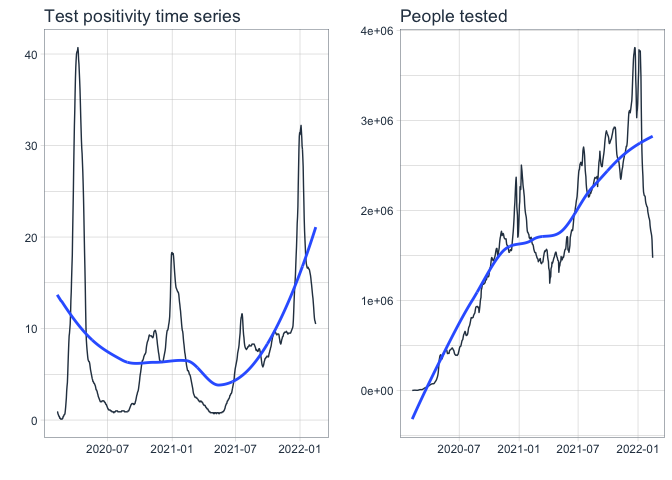
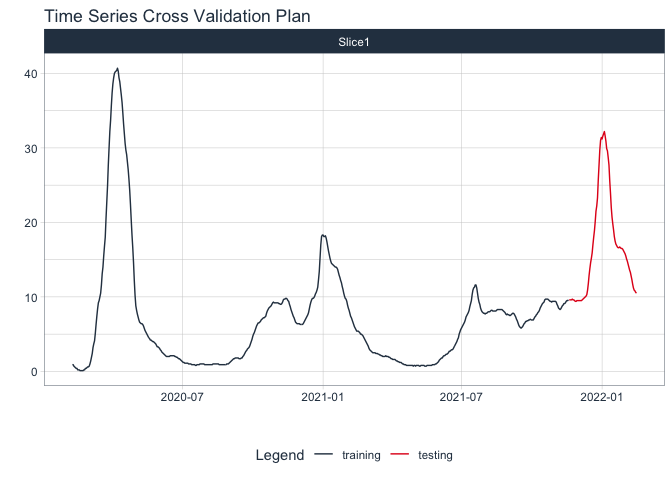

# Introduction

This document walks through time series modelling and forecasting with the `modeltime` R package which gives access to a wide range of time series models with easy tooling to fit, evaluate, forecast and visualisations.

To illustrate its use we will use data from the [UK Covid19 Dashboard](https://coronavirus.data.gov.uk) for daily positivity rates in PCR tests.

This blog is based on <https://www.business-science.io/code-tools/2020/06/29/introducing-modeltime.html>.

## Getting the data

The first step is to get the data. This can easily obtained from the dashboard API as a csv file.


```r
df <- read_csv("https://api.coronavirus.data.gov.uk/v2/data?areaType=nation&areaCode=E92000001&metric=uniqueCasePositivityBySpecimenDateRollingSum&format=csv", show_col_types = F)

df1 <- read_csv("https://api.coronavirus.data.gov.uk/v2/data?areaType=nation&areaCode=E92000001&metric=uniquePeopleTestedBySpecimenDateRollingSum&format=csv", show_col_types = F)

head(df)
```

```
## # A tibble: 6 × 5
##   areaCode  areaName areaType date       uniqueCasePositivityBySpecimenDateRoll…
##   <chr>     <chr>    <chr>    <date>                                       <dbl>
## 1 E92000001 England  nation   2022-01-18                                    17.5
## 2 E92000001 England  nation   2022-01-17                                    18.1
## 3 E92000001 England  nation   2022-01-16                                    19  
## 4 E92000001 England  nation   2022-01-15                                    19.8
## 5 E92000001 England  nation   2022-01-14                                    20.7
## 6 E92000001 England  nation   2022-01-13                                    22
```

## Initial plot

We can use the `plot_time_series` function to chart the data but first we'll reduce the dataset to date and value fields.


```r
library(cowplot)

df <- df %>%
  select(date, uniqueCasePositivityBySpecimenDateRollingSum) %>%
  set_names(c("date", "value"))

df1 <- df1 %>%
  select(date, uniquePeopleTestedBySpecimenDateRollingSum) %>%
  set_names(c("date", "value"))

a <- df %>%
  plot_time_series(date, value, .interactive = FALSE) +
  ggtitle("Test positivity time series")

b <- df1 %>%
  plot_time_series(date, value, .interactive = FALSE) +
  ggtitle("People tested")

cowplot::plot_grid(a, b)
```

<!-- -->

## Making it interactive

Setting `.interactive=TRUE` converts the plot to a `plotly` chart which adds interactivity.


```r
df %>%
  plot_time_series(date, value, .interactive = TRUE, .smooth_span = .3, .plotly_slider = TRUE)  ## adds a date slider to zoom in or out of the data
```

```{=html}
<div id="htmlwidget-683c5e5b01d54704f311" style="width:672px;height:480px;" class="plotly html-widget"></div>
<script type="application/json" data-for="htmlwidget-683c5e5b01d54704f311">{"x":{"data":[{"x":["2020-02-08","2020-02-09","2020-02-10","2020-02-11","2020-02-12","2020-02-13","2020-02-14","2020-02-15","2020-02-16","2020-02-17","2020-02-18","2020-02-19","2020-02-21","2020-02-22","2020-02-23","2020-02-24","2020-02-25","2020-02-26","2020-02-27","2020-02-28","2020-02-29","2020-03-01","2020-03-02","2020-03-03","2020-03-04","2020-03-05","2020-03-06","2020-03-07","2020-03-08","2020-03-09","2020-03-10","2020-03-11","2020-03-12","2020-03-13","2020-03-14","2020-03-15","2020-03-16","2020-03-17","2020-03-18","2020-03-19","2020-03-20","2020-03-21","2020-03-22","2020-03-23","2020-03-24","2020-03-25","2020-03-26","2020-03-27","2020-03-28","2020-03-29","2020-03-30","2020-03-31","2020-04-01","2020-04-02","2020-04-03","2020-04-04","2020-04-05","2020-04-06","2020-04-07","2020-04-08","2020-04-09","2020-04-10","2020-04-11","2020-04-12","2020-04-13","2020-04-14","2020-04-15","2020-04-16","2020-04-17","2020-04-18","2020-04-19","2020-04-20","2020-04-21","2020-04-22","2020-04-23","2020-04-24","2020-04-25","2020-04-26","2020-04-27","2020-04-28","2020-04-29","2020-04-30","2020-05-01","2020-05-02","2020-05-03","2020-05-04","2020-05-05","2020-05-06","2020-05-07","2020-05-08","2020-05-09","2020-05-10","2020-05-11","2020-05-12","2020-05-13","2020-05-14","2020-05-15","2020-05-16","2020-05-17","2020-05-18","2020-05-19","2020-05-20","2020-05-21","2020-05-22","2020-05-23","2020-05-24","2020-05-25","2020-05-26","2020-05-27","2020-05-28","2020-05-29","2020-05-30","2020-05-31","2020-06-01","2020-06-02","2020-06-03","2020-06-04","2020-06-05","2020-06-06","2020-06-07","2020-06-08","2020-06-09","2020-06-10","2020-06-11","2020-06-12","2020-06-13","2020-06-14","2020-06-15","2020-06-16","2020-06-17","2020-06-18","2020-06-19","2020-06-20","2020-06-21","2020-06-22","2020-06-23","2020-06-24","2020-06-25","2020-06-26","2020-06-27","2020-06-28","2020-06-29","2020-06-30","2020-07-01","2020-07-02","2020-07-03","2020-07-04","2020-07-05","2020-07-06","2020-07-07","2020-07-08","2020-07-09","2020-07-10","2020-07-11","2020-07-12","2020-07-13","2020-07-14","2020-07-15","2020-07-16","2020-07-17","2020-07-18","2020-07-19","2020-07-20","2020-07-21","2020-07-22","2020-07-23","2020-07-24","2020-07-25","2020-07-26","2020-07-27","2020-07-28","2020-07-29","2020-07-30","2020-07-31","2020-08-01","2020-08-02","2020-08-03","2020-08-04","2020-08-05","2020-08-06","2020-08-07","2020-08-08","2020-08-09","2020-08-10","2020-08-11","2020-08-12","2020-08-13","2020-08-14","2020-08-15","2020-08-16","2020-08-17","2020-08-18","2020-08-19","2020-08-20","2020-08-21","2020-08-22","2020-08-23","2020-08-24","2020-08-25","2020-08-26","2020-08-27","2020-08-28","2020-08-29","2020-08-30","2020-08-31","2020-09-01","2020-09-02","2020-09-03","2020-09-04","2020-09-05","2020-09-06","2020-09-07","2020-09-08","2020-09-09","2020-09-10","2020-09-11","2020-09-12","2020-09-13","2020-09-14","2020-09-15","2020-09-16","2020-09-17","2020-09-18","2020-09-19","2020-09-20","2020-09-21","2020-09-22","2020-09-23","2020-09-24","2020-09-25","2020-09-26","2020-09-27","2020-09-28","2020-09-29","2020-09-30","2020-10-01","2020-10-02","2020-10-03","2020-10-04","2020-10-05","2020-10-06","2020-10-07","2020-10-08","2020-10-09","2020-10-10","2020-10-11","2020-10-12","2020-10-13","2020-10-14","2020-10-15","2020-10-16","2020-10-17","2020-10-18","2020-10-19","2020-10-20","2020-10-21","2020-10-22","2020-10-23","2020-10-24","2020-10-25","2020-10-26","2020-10-27","2020-10-28","2020-10-29","2020-10-30","2020-10-31","2020-11-01","2020-11-02","2020-11-03","2020-11-04","2020-11-05","2020-11-06","2020-11-07","2020-11-08","2020-11-09","2020-11-10","2020-11-11","2020-11-12","2020-11-13","2020-11-14","2020-11-15","2020-11-16","2020-11-17","2020-11-18","2020-11-19","2020-11-20","2020-11-21","2020-11-22","2020-11-23","2020-11-24","2020-11-25","2020-11-26","2020-11-27","2020-11-28","2020-11-29","2020-11-30","2020-12-01","2020-12-02","2020-12-03","2020-12-04","2020-12-05","2020-12-06","2020-12-07","2020-12-08","2020-12-09","2020-12-10","2020-12-11","2020-12-12","2020-12-13","2020-12-14","2020-12-15","2020-12-16","2020-12-17","2020-12-18","2020-12-19","2020-12-20","2020-12-21","2020-12-22","2020-12-23","2020-12-24","2020-12-25","2020-12-26","2020-12-27","2020-12-28","2020-12-29","2020-12-30","2020-12-31","2021-01-01","2021-01-02","2021-01-03","2021-01-04","2021-01-05","2021-01-06","2021-01-07","2021-01-08","2021-01-09","2021-01-10","2021-01-11","2021-01-12","2021-01-13","2021-01-14","2021-01-15","2021-01-16","2021-01-17","2021-01-18","2021-01-19","2021-01-20","2021-01-21","2021-01-22","2021-01-23","2021-01-24","2021-01-25","2021-01-26","2021-01-27","2021-01-28","2021-01-29","2021-01-30","2021-01-31","2021-02-01","2021-02-02","2021-02-03","2021-02-04","2021-02-05","2021-02-06","2021-02-07","2021-02-08","2021-02-09","2021-02-10","2021-02-11","2021-02-12","2021-02-13","2021-02-14","2021-02-15","2021-02-16","2021-02-17","2021-02-18","2021-02-19","2021-02-20","2021-02-21","2021-02-22","2021-02-23","2021-02-24","2021-02-25","2021-02-26","2021-02-27","2021-02-28","2021-03-01","2021-03-02","2021-03-03","2021-03-04","2021-03-05","2021-03-06","2021-03-07","2021-03-08","2021-03-09","2021-03-10","2021-03-11","2021-03-12","2021-03-13","2021-03-14","2021-03-15","2021-03-16","2021-03-17","2021-03-18","2021-03-19","2021-03-20","2021-03-21","2021-03-22","2021-03-23","2021-03-24","2021-03-25","2021-03-26","2021-03-27","2021-03-28","2021-03-29","2021-03-30","2021-03-31","2021-04-01","2021-04-02","2021-04-03","2021-04-04","2021-04-05","2021-04-06","2021-04-07","2021-04-08","2021-04-09","2021-04-10","2021-04-11","2021-04-12","2021-04-13","2021-04-14","2021-04-15","2021-04-16","2021-04-17","2021-04-18","2021-04-19","2021-04-20","2021-04-21","2021-04-22","2021-04-23","2021-04-24","2021-04-25","2021-04-26","2021-04-27","2021-04-28","2021-04-29","2021-04-30","2021-05-01","2021-05-02","2021-05-03","2021-05-04","2021-05-05","2021-05-06","2021-05-07","2021-05-08","2021-05-09","2021-05-10","2021-05-11","2021-05-12","2021-05-13","2021-05-14","2021-05-15","2021-05-16","2021-05-17","2021-05-18","2021-05-19","2021-05-20","2021-05-21","2021-05-22","2021-05-23","2021-05-24","2021-05-25","2021-05-26","2021-05-27","2021-05-28","2021-05-29","2021-05-30","2021-05-31","2021-06-01","2021-06-02","2021-06-03","2021-06-04","2021-06-05","2021-06-06","2021-06-07","2021-06-08","2021-06-09","2021-06-10","2021-06-11","2021-06-12","2021-06-13","2021-06-14","2021-06-15","2021-06-16","2021-06-17","2021-06-18","2021-06-19","2021-06-20","2021-06-21","2021-06-22","2021-06-23","2021-06-24","2021-06-25","2021-06-26","2021-06-27","2021-06-28","2021-06-29","2021-06-30","2021-07-01","2021-07-02","2021-07-03","2021-07-04","2021-07-05","2021-07-06","2021-07-07","2021-07-08","2021-07-09","2021-07-10","2021-07-11","2021-07-12","2021-07-13","2021-07-14","2021-07-15","2021-07-16","2021-07-17","2021-07-18","2021-07-19","2021-07-20","2021-07-21","2021-07-22","2021-07-23","2021-07-24","2021-07-25","2021-07-26","2021-07-27","2021-07-28","2021-07-29","2021-07-30","2021-07-31","2021-08-01","2021-08-02","2021-08-03","2021-08-04","2021-08-05","2021-08-06","2021-08-07","2021-08-08","2021-08-09","2021-08-10","2021-08-11","2021-08-12","2021-08-13","2021-08-14","2021-08-15","2021-08-16","2021-08-17","2021-08-18","2021-08-19","2021-08-20","2021-08-21","2021-08-22","2021-08-23","2021-08-24","2021-08-25","2021-08-26","2021-08-27","2021-08-28","2021-08-29","2021-08-30","2021-08-31","2021-09-01","2021-09-02","2021-09-03","2021-09-04","2021-09-05","2021-09-06","2021-09-07","2021-09-08","2021-09-09","2021-09-10","2021-09-11","2021-09-12","2021-09-13","2021-09-14","2021-09-15","2021-09-16","2021-09-17","2021-09-18","2021-09-19","2021-09-20","2021-09-21","2021-09-22","2021-09-23","2021-09-24","2021-09-25","2021-09-26","2021-09-27","2021-09-28","2021-09-29","2021-09-30","2021-10-01","2021-10-02","2021-10-03","2021-10-04","2021-10-05","2021-10-06","2021-10-07","2021-10-08","2021-10-09","2021-10-10","2021-10-11","2021-10-12","2021-10-13","2021-10-14","2021-10-15","2021-10-16","2021-10-17","2021-10-18","2021-10-19","2021-10-20","2021-10-21","2021-10-22","2021-10-23","2021-10-24","2021-10-25","2021-10-26","2021-10-27","2021-10-28","2021-10-29","2021-10-30","2021-10-31","2021-11-01","2021-11-02","2021-11-03","2021-11-04","2021-11-05","2021-11-06","2021-11-07","2021-11-08","2021-11-09","2021-11-10","2021-11-11","2021-11-12","2021-11-13","2021-11-14","2021-11-15","2021-11-16","2021-11-17","2021-11-18","2021-11-19","2021-11-20","2021-11-21","2021-11-22","2021-11-23","2021-11-24","2021-11-25","2021-11-26","2021-11-27","2021-11-28","2021-11-29","2021-11-30","2021-12-01","2021-12-02","2021-12-03","2021-12-04","2021-12-05","2021-12-06","2021-12-07","2021-12-08","2021-12-09","2021-12-10","2021-12-11","2021-12-12","2021-12-13","2021-12-14","2021-12-15","2021-12-16","2021-12-17","2021-12-18","2021-12-19","2021-12-20","2021-12-21","2021-12-22","2021-12-23","2021-12-24","2021-12-25","2021-12-26","2021-12-27","2021-12-28","2021-12-29","2021-12-30","2021-12-31","2022-01-01","2022-01-02","2022-01-03","2022-01-04","2022-01-05","2022-01-06","2022-01-07","2022-01-08","2022-01-09","2022-01-10","2022-01-11","2022-01-12","2022-01-13","2022-01-14","2022-01-15","2022-01-16","2022-01-17","2022-01-18"],"y":[1,0.9,0.6,0.6,0.4,0.4,0.3,0.2,0.2,0.2,0.1,0.1,0.1,0.1,0.2,0.2,0.4,0.4,0.5,0.6,0.6,0.7,1,1.4,1.9,2.4,3.2,3.7,4.1,5.1,6.3,7.4,8.4,9.2,9.5,10,10.5,11.6,13.1,14,15.5,16.8,18,20.5,22.7,24.9,27.7,30,32.2,33.7,35.7,37.4,38.6,39.4,40,40.2,40.3,40.4,40.7,40.3,39.4,38.9,38,37.1,36.1,34.7,33.2,31.9,30.6,29.7,29.1,28.1,27.1,25.8,24.3,22.4,20.3,18.3,16.6,14.6,12.2,10.2,8.8,8.2,7.7,7.3,6.9,6.6,6.5,6.4,6.4,6.3,6.1,5.8,5.5,5.3,5.1,4.9,4.7,4.5,4.4,4.2,4.2,4.1,4,4,3.9,3.8,3.7,3.5,3.3,3.3,3.2,3.1,2.9,2.8,2.6,2.5,2.4,2.3,2.2,2.1,2,2,2,2,2,2.1,2.1,2.1,2.1,2.1,2.1,2,2,1.9,1.9,1.8,1.7,1.7,1.6,1.5,1.4,1.3,1.2,1.2,1.1,1.1,1.1,1.1,1.1,1,1,1,1,0.9,0.9,0.9,0.9,0.9,0.8,0.8,0.9,0.9,0.9,0.9,1,1,1,1,1,1,0.9,0.9,0.9,0.9,0.9,0.9,0.9,0.9,0.9,0.9,0.9,1,1,1,1,1,1,1,1,0.9,0.9,0.9,0.9,0.9,0.9,0.9,0.9,0.9,0.9,1,1,1,1.1,1.2,1.3,1.4,1.5,1.6,1.7,1.7,1.8,1.8,1.8,1.8,1.8,1.7,1.7,1.7,1.8,1.9,2,2.1,2.3,2.5,2.7,2.8,3,3.1,3.2,3.4,3.7,4,4.3,4.7,5,5.2,5.5,5.8,6.1,6.3,6.5,6.5,6.6,6.7,6.9,7,7.1,7.2,7.2,7.3,7.4,7.8,8.1,8.3,8.5,8.6,8.7,8.8,9,9.2,9.3,9.2,9.2,9.2,9.2,9.2,9.2,9.1,9.1,9,9,9.1,9.3,9.6,9.7,9.7,9.8,9.8,9.7,9.5,9.4,9,8.7,8.3,8,7.7,7.4,7.2,6.9,6.6,6.5,6.4,6.4,6.4,6.4,6.3,6.3,6.3,6.3,6.4,6.6,6.8,7,7.2,7.4,7.6,7.9,8.4,8.9,9.3,9.6,9.8,9.8,9.9,10.1,10.4,10.6,10.9,11.3,12.3,13.4,15.2,17,18.1,18.3,18.3,18.1,18.1,18.2,17.8,17.4,16.8,16.2,15.7,15.2,14.8,14.5,14.4,14.3,14.2,14.1,14,14,13.9,13.7,13.3,12.9,12.6,12.2,11.9,11.4,11,10.5,10.1,9.8,9.7,9.4,8.9,8.5,8.2,7.8,7.4,7.2,6.9,6.6,6.3,6,5.8,5.6,5.4,5.4,5.4,5.3,5.2,5,5,4.9,4.8,4.6,4.4,4.2,4,3.8,3.6,3.4,3.1,2.9,2.8,2.7,2.6,2.5,2.5,2.5,2.5,2.4,2.4,2.4,2.3,2.3,2.2,2.2,2.1,2.1,2,2,2,2,2.1,2,2,2,1.9,1.9,1.8,1.7,1.7,1.6,1.6,1.6,1.6,1.5,1.4,1.4,1.3,1.3,1.2,1.2,1.2,1.1,1,1,0.9,0.9,0.9,0.8,0.8,0.8,0.8,0.8,0.8,0.8,0.8,0.8,0.7,0.8,0.8,0.7,0.8,0.8,0.8,0.8,0.7,0.7,0.8,0.8,0.8,0.8,0.8,0.7,0.7,0.7,0.8,0.8,0.8,0.8,0.8,0.8,0.8,0.9,0.9,0.9,0.9,1,1,1.1,1.2,1.3,1.5,1.6,1.7,1.8,1.8,2,2.1,2.1,2.2,2.3,2.3,2.4,2.5,2.7,2.7,2.8,2.9,2.9,3,3.2,3.4,3.6,3.8,4,4.3,4.5,5,5.3,5.6,5.8,6,6.2,6.4,6.6,6.9,7.3,7.5,7.7,7.9,8.2,8.7,9.1,9.5,10.3,10.9,11.2,11.3,11.6,11.6,11.2,10.5,9.8,9.3,9,8.5,8.2,8,7.9,7.8,7.7,7.7,7.8,7.8,7.9,8,8,8,8.1,8.2,8.2,8.1,8.1,8.1,8.1,8.1,8.2,8.3,8.3,8.3,8.3,8.3,8.3,8.3,8.2,8.1,8,7.9,7.7,7.6,7.7,7.6,7.6,7.5,7.5,7.6,7.7,7.8,7.8,7.7,7.5,7.3,7,6.8,6.5,6.2,6,5.8,5.8,5.9,6,6.2,6.4,6.5,6.7,6.7,6.8,6.8,6.9,6.9,7,6.9,6.9,6.9,6.9,7.1,7.3,7.4,7.6,7.7,7.9,8,8.2,8.5,8.7,8.9,9.1,9.2,9.3,9.6,9.7,9.7,9.7,9.7,9.6,9.5,9.4,9.4,9.3,9.4,9.4,9.4,9.4,9.4,9.3,9,8.8,8.5,8.4,8.4,8.4,8.6,8.8,8.9,9.1,9.1,9.2,9.4,9.5,9.5,9.6,9.6,9.6,9.6,9.6,9.7,9.6,9.6,9.5,9.4,9.4,9.5,9.5,9.5,9.5,9.5,9.5,9.5,9.6,9.7,9.8,9.9,10,10.1,10.3,10.9,11.8,12.9,13.9,14.6,15.3,15.9,17,18,18.9,20.1,21.5,22.2,23.3,25.7,27.8,29.7,31,31.4,31.2,31.7,31.9,32.2,31.6,30.9,29.9,29.6,28.7,27.7,25.6,23.8,22,20.7,19.8,19,18.1,17.5],"text":["date: 2020-02-08<br />.value:  1.0","date: 2020-02-09<br />.value:  0.9","date: 2020-02-10<br />.value:  0.6","date: 2020-02-11<br />.value:  0.6","date: 2020-02-12<br />.value:  0.4","date: 2020-02-13<br />.value:  0.4","date: 2020-02-14<br />.value:  0.3","date: 2020-02-15<br />.value:  0.2","date: 2020-02-16<br />.value:  0.2","date: 2020-02-17<br />.value:  0.2","date: 2020-02-18<br />.value:  0.1","date: 2020-02-19<br />.value:  0.1","date: 2020-02-21<br />.value:  0.1","date: 2020-02-22<br />.value:  0.1","date: 2020-02-23<br />.value:  0.2","date: 2020-02-24<br />.value:  0.2","date: 2020-02-25<br />.value:  0.4","date: 2020-02-26<br />.value:  0.4","date: 2020-02-27<br />.value:  0.5","date: 2020-02-28<br />.value:  0.6","date: 2020-02-29<br />.value:  0.6","date: 2020-03-01<br />.value:  0.7","date: 2020-03-02<br />.value:  1.0","date: 2020-03-03<br />.value:  1.4","date: 2020-03-04<br />.value:  1.9","date: 2020-03-05<br />.value:  2.4","date: 2020-03-06<br />.value:  3.2","date: 2020-03-07<br />.value:  3.7","date: 2020-03-08<br />.value:  4.1","date: 2020-03-09<br />.value:  5.1","date: 2020-03-10<br />.value:  6.3","date: 2020-03-11<br />.value:  7.4","date: 2020-03-12<br />.value:  8.4","date: 2020-03-13<br />.value:  9.2","date: 2020-03-14<br />.value:  9.5","date: 2020-03-15<br />.value: 10.0","date: 2020-03-16<br />.value: 10.5","date: 2020-03-17<br />.value: 11.6","date: 2020-03-18<br />.value: 13.1","date: 2020-03-19<br />.value: 14.0","date: 2020-03-20<br />.value: 15.5","date: 2020-03-21<br />.value: 16.8","date: 2020-03-22<br />.value: 18.0","date: 2020-03-23<br />.value: 20.5","date: 2020-03-24<br />.value: 22.7","date: 2020-03-25<br />.value: 24.9","date: 2020-03-26<br />.value: 27.7","date: 2020-03-27<br />.value: 30.0","date: 2020-03-28<br />.value: 32.2","date: 2020-03-29<br />.value: 33.7","date: 2020-03-30<br />.value: 35.7","date: 2020-03-31<br />.value: 37.4","date: 2020-04-01<br />.value: 38.6","date: 2020-04-02<br />.value: 39.4","date: 2020-04-03<br />.value: 40.0","date: 2020-04-04<br />.value: 40.2","date: 2020-04-05<br />.value: 40.3","date: 2020-04-06<br />.value: 40.4","date: 2020-04-07<br />.value: 40.7","date: 2020-04-08<br />.value: 40.3","date: 2020-04-09<br />.value: 39.4","date: 2020-04-10<br />.value: 38.9","date: 2020-04-11<br />.value: 38.0","date: 2020-04-12<br />.value: 37.1","date: 2020-04-13<br />.value: 36.1","date: 2020-04-14<br />.value: 34.7","date: 2020-04-15<br />.value: 33.2","date: 2020-04-16<br />.value: 31.9","date: 2020-04-17<br />.value: 30.6","date: 2020-04-18<br />.value: 29.7","date: 2020-04-19<br />.value: 29.1","date: 2020-04-20<br />.value: 28.1","date: 2020-04-21<br />.value: 27.1","date: 2020-04-22<br />.value: 25.8","date: 2020-04-23<br />.value: 24.3","date: 2020-04-24<br />.value: 22.4","date: 2020-04-25<br />.value: 20.3","date: 2020-04-26<br />.value: 18.3","date: 2020-04-27<br />.value: 16.6","date: 2020-04-28<br />.value: 14.6","date: 2020-04-29<br />.value: 12.2","date: 2020-04-30<br />.value: 10.2","date: 2020-05-01<br />.value:  8.8","date: 2020-05-02<br />.value:  8.2","date: 2020-05-03<br />.value:  7.7","date: 2020-05-04<br />.value:  7.3","date: 2020-05-05<br />.value:  6.9","date: 2020-05-06<br />.value:  6.6","date: 2020-05-07<br />.value:  6.5","date: 2020-05-08<br />.value:  6.4","date: 2020-05-09<br />.value:  6.4","date: 2020-05-10<br />.value:  6.3","date: 2020-05-11<br />.value:  6.1","date: 2020-05-12<br />.value:  5.8","date: 2020-05-13<br />.value:  5.5","date: 2020-05-14<br />.value:  5.3","date: 2020-05-15<br />.value:  5.1","date: 2020-05-16<br />.value:  4.9","date: 2020-05-17<br />.value:  4.7","date: 2020-05-18<br />.value:  4.5","date: 2020-05-19<br />.value:  4.4","date: 2020-05-20<br />.value:  4.2","date: 2020-05-21<br />.value:  4.2","date: 2020-05-22<br />.value:  4.1","date: 2020-05-23<br />.value:  4.0","date: 2020-05-24<br />.value:  4.0","date: 2020-05-25<br />.value:  3.9","date: 2020-05-26<br />.value:  3.8","date: 2020-05-27<br />.value:  3.7","date: 2020-05-28<br />.value:  3.5","date: 2020-05-29<br />.value:  3.3","date: 2020-05-30<br />.value:  3.3","date: 2020-05-31<br />.value:  3.2","date: 2020-06-01<br />.value:  3.1","date: 2020-06-02<br />.value:  2.9","date: 2020-06-03<br />.value:  2.8","date: 2020-06-04<br />.value:  2.6","date: 2020-06-05<br />.value:  2.5","date: 2020-06-06<br />.value:  2.4","date: 2020-06-07<br />.value:  2.3","date: 2020-06-08<br />.value:  2.2","date: 2020-06-09<br />.value:  2.1","date: 2020-06-10<br />.value:  2.0","date: 2020-06-11<br />.value:  2.0","date: 2020-06-12<br />.value:  2.0","date: 2020-06-13<br />.value:  2.0","date: 2020-06-14<br />.value:  2.0","date: 2020-06-15<br />.value:  2.1","date: 2020-06-16<br />.value:  2.1","date: 2020-06-17<br />.value:  2.1","date: 2020-06-18<br />.value:  2.1","date: 2020-06-19<br />.value:  2.1","date: 2020-06-20<br />.value:  2.1","date: 2020-06-21<br />.value:  2.0","date: 2020-06-22<br />.value:  2.0","date: 2020-06-23<br />.value:  1.9","date: 2020-06-24<br />.value:  1.9","date: 2020-06-25<br />.value:  1.8","date: 2020-06-26<br />.value:  1.7","date: 2020-06-27<br />.value:  1.7","date: 2020-06-28<br />.value:  1.6","date: 2020-06-29<br />.value:  1.5","date: 2020-06-30<br />.value:  1.4","date: 2020-07-01<br />.value:  1.3","date: 2020-07-02<br />.value:  1.2","date: 2020-07-03<br />.value:  1.2","date: 2020-07-04<br />.value:  1.1","date: 2020-07-05<br />.value:  1.1","date: 2020-07-06<br />.value:  1.1","date: 2020-07-07<br />.value:  1.1","date: 2020-07-08<br />.value:  1.1","date: 2020-07-09<br />.value:  1.0","date: 2020-07-10<br />.value:  1.0","date: 2020-07-11<br />.value:  1.0","date: 2020-07-12<br />.value:  1.0","date: 2020-07-13<br />.value:  0.9","date: 2020-07-14<br />.value:  0.9","date: 2020-07-15<br />.value:  0.9","date: 2020-07-16<br />.value:  0.9","date: 2020-07-17<br />.value:  0.9","date: 2020-07-18<br />.value:  0.8","date: 2020-07-19<br />.value:  0.8","date: 2020-07-20<br />.value:  0.9","date: 2020-07-21<br />.value:  0.9","date: 2020-07-22<br />.value:  0.9","date: 2020-07-23<br />.value:  0.9","date: 2020-07-24<br />.value:  1.0","date: 2020-07-25<br />.value:  1.0","date: 2020-07-26<br />.value:  1.0","date: 2020-07-27<br />.value:  1.0","date: 2020-07-28<br />.value:  1.0","date: 2020-07-29<br />.value:  1.0","date: 2020-07-30<br />.value:  0.9","date: 2020-07-31<br />.value:  0.9","date: 2020-08-01<br />.value:  0.9","date: 2020-08-02<br />.value:  0.9","date: 2020-08-03<br />.value:  0.9","date: 2020-08-04<br />.value:  0.9","date: 2020-08-05<br />.value:  0.9","date: 2020-08-06<br />.value:  0.9","date: 2020-08-07<br />.value:  0.9","date: 2020-08-08<br />.value:  0.9","date: 2020-08-09<br />.value:  0.9","date: 2020-08-10<br />.value:  1.0","date: 2020-08-11<br />.value:  1.0","date: 2020-08-12<br />.value:  1.0","date: 2020-08-13<br />.value:  1.0","date: 2020-08-14<br />.value:  1.0","date: 2020-08-15<br />.value:  1.0","date: 2020-08-16<br />.value:  1.0","date: 2020-08-17<br />.value:  1.0","date: 2020-08-18<br />.value:  0.9","date: 2020-08-19<br />.value:  0.9","date: 2020-08-20<br />.value:  0.9","date: 2020-08-21<br />.value:  0.9","date: 2020-08-22<br />.value:  0.9","date: 2020-08-23<br />.value:  0.9","date: 2020-08-24<br />.value:  0.9","date: 2020-08-25<br />.value:  0.9","date: 2020-08-26<br />.value:  0.9","date: 2020-08-27<br />.value:  0.9","date: 2020-08-28<br />.value:  1.0","date: 2020-08-29<br />.value:  1.0","date: 2020-08-30<br />.value:  1.0","date: 2020-08-31<br />.value:  1.1","date: 2020-09-01<br />.value:  1.2","date: 2020-09-02<br />.value:  1.3","date: 2020-09-03<br />.value:  1.4","date: 2020-09-04<br />.value:  1.5","date: 2020-09-05<br />.value:  1.6","date: 2020-09-06<br />.value:  1.7","date: 2020-09-07<br />.value:  1.7","date: 2020-09-08<br />.value:  1.8","date: 2020-09-09<br />.value:  1.8","date: 2020-09-10<br />.value:  1.8","date: 2020-09-11<br />.value:  1.8","date: 2020-09-12<br />.value:  1.8","date: 2020-09-13<br />.value:  1.7","date: 2020-09-14<br />.value:  1.7","date: 2020-09-15<br />.value:  1.7","date: 2020-09-16<br />.value:  1.8","date: 2020-09-17<br />.value:  1.9","date: 2020-09-18<br />.value:  2.0","date: 2020-09-19<br />.value:  2.1","date: 2020-09-20<br />.value:  2.3","date: 2020-09-21<br />.value:  2.5","date: 2020-09-22<br />.value:  2.7","date: 2020-09-23<br />.value:  2.8","date: 2020-09-24<br />.value:  3.0","date: 2020-09-25<br />.value:  3.1","date: 2020-09-26<br />.value:  3.2","date: 2020-09-27<br />.value:  3.4","date: 2020-09-28<br />.value:  3.7","date: 2020-09-29<br />.value:  4.0","date: 2020-09-30<br />.value:  4.3","date: 2020-10-01<br />.value:  4.7","date: 2020-10-02<br />.value:  5.0","date: 2020-10-03<br />.value:  5.2","date: 2020-10-04<br />.value:  5.5","date: 2020-10-05<br />.value:  5.8","date: 2020-10-06<br />.value:  6.1","date: 2020-10-07<br />.value:  6.3","date: 2020-10-08<br />.value:  6.5","date: 2020-10-09<br />.value:  6.5","date: 2020-10-10<br />.value:  6.6","date: 2020-10-11<br />.value:  6.7","date: 2020-10-12<br />.value:  6.9","date: 2020-10-13<br />.value:  7.0","date: 2020-10-14<br />.value:  7.1","date: 2020-10-15<br />.value:  7.2","date: 2020-10-16<br />.value:  7.2","date: 2020-10-17<br />.value:  7.3","date: 2020-10-18<br />.value:  7.4","date: 2020-10-19<br />.value:  7.8","date: 2020-10-20<br />.value:  8.1","date: 2020-10-21<br />.value:  8.3","date: 2020-10-22<br />.value:  8.5","date: 2020-10-23<br />.value:  8.6","date: 2020-10-24<br />.value:  8.7","date: 2020-10-25<br />.value:  8.8","date: 2020-10-26<br />.value:  9.0","date: 2020-10-27<br />.value:  9.2","date: 2020-10-28<br />.value:  9.3","date: 2020-10-29<br />.value:  9.2","date: 2020-10-30<br />.value:  9.2","date: 2020-10-31<br />.value:  9.2","date: 2020-11-01<br />.value:  9.2","date: 2020-11-02<br />.value:  9.2","date: 2020-11-03<br />.value:  9.2","date: 2020-11-04<br />.value:  9.1","date: 2020-11-05<br />.value:  9.1","date: 2020-11-06<br />.value:  9.0","date: 2020-11-07<br />.value:  9.0","date: 2020-11-08<br />.value:  9.1","date: 2020-11-09<br />.value:  9.3","date: 2020-11-10<br />.value:  9.6","date: 2020-11-11<br />.value:  9.7","date: 2020-11-12<br />.value:  9.7","date: 2020-11-13<br />.value:  9.8","date: 2020-11-14<br />.value:  9.8","date: 2020-11-15<br />.value:  9.7","date: 2020-11-16<br />.value:  9.5","date: 2020-11-17<br />.value:  9.4","date: 2020-11-18<br />.value:  9.0","date: 2020-11-19<br />.value:  8.7","date: 2020-11-20<br />.value:  8.3","date: 2020-11-21<br />.value:  8.0","date: 2020-11-22<br />.value:  7.7","date: 2020-11-23<br />.value:  7.4","date: 2020-11-24<br />.value:  7.2","date: 2020-11-25<br />.value:  6.9","date: 2020-11-26<br />.value:  6.6","date: 2020-11-27<br />.value:  6.5","date: 2020-11-28<br />.value:  6.4","date: 2020-11-29<br />.value:  6.4","date: 2020-11-30<br />.value:  6.4","date: 2020-12-01<br />.value:  6.4","date: 2020-12-02<br />.value:  6.3","date: 2020-12-03<br />.value:  6.3","date: 2020-12-04<br />.value:  6.3","date: 2020-12-05<br />.value:  6.3","date: 2020-12-06<br />.value:  6.4","date: 2020-12-07<br />.value:  6.6","date: 2020-12-08<br />.value:  6.8","date: 2020-12-09<br />.value:  7.0","date: 2020-12-10<br />.value:  7.2","date: 2020-12-11<br />.value:  7.4","date: 2020-12-12<br />.value:  7.6","date: 2020-12-13<br />.value:  7.9","date: 2020-12-14<br />.value:  8.4","date: 2020-12-15<br />.value:  8.9","date: 2020-12-16<br />.value:  9.3","date: 2020-12-17<br />.value:  9.6","date: 2020-12-18<br />.value:  9.8","date: 2020-12-19<br />.value:  9.8","date: 2020-12-20<br />.value:  9.9","date: 2020-12-21<br />.value: 10.1","date: 2020-12-22<br />.value: 10.4","date: 2020-12-23<br />.value: 10.6","date: 2020-12-24<br />.value: 10.9","date: 2020-12-25<br />.value: 11.3","date: 2020-12-26<br />.value: 12.3","date: 2020-12-27<br />.value: 13.4","date: 2020-12-28<br />.value: 15.2","date: 2020-12-29<br />.value: 17.0","date: 2020-12-30<br />.value: 18.1","date: 2020-12-31<br />.value: 18.3","date: 2021-01-01<br />.value: 18.3","date: 2021-01-02<br />.value: 18.1","date: 2021-01-03<br />.value: 18.1","date: 2021-01-04<br />.value: 18.2","date: 2021-01-05<br />.value: 17.8","date: 2021-01-06<br />.value: 17.4","date: 2021-01-07<br />.value: 16.8","date: 2021-01-08<br />.value: 16.2","date: 2021-01-09<br />.value: 15.7","date: 2021-01-10<br />.value: 15.2","date: 2021-01-11<br />.value: 14.8","date: 2021-01-12<br />.value: 14.5","date: 2021-01-13<br />.value: 14.4","date: 2021-01-14<br />.value: 14.3","date: 2021-01-15<br />.value: 14.2","date: 2021-01-16<br />.value: 14.1","date: 2021-01-17<br />.value: 14.0","date: 2021-01-18<br />.value: 14.0","date: 2021-01-19<br />.value: 13.9","date: 2021-01-20<br />.value: 13.7","date: 2021-01-21<br />.value: 13.3","date: 2021-01-22<br />.value: 12.9","date: 2021-01-23<br />.value: 12.6","date: 2021-01-24<br />.value: 12.2","date: 2021-01-25<br />.value: 11.9","date: 2021-01-26<br />.value: 11.4","date: 2021-01-27<br />.value: 11.0","date: 2021-01-28<br />.value: 10.5","date: 2021-01-29<br />.value: 10.1","date: 2021-01-30<br />.value:  9.8","date: 2021-01-31<br />.value:  9.7","date: 2021-02-01<br />.value:  9.4","date: 2021-02-02<br />.value:  8.9","date: 2021-02-03<br />.value:  8.5","date: 2021-02-04<br />.value:  8.2","date: 2021-02-05<br />.value:  7.8","date: 2021-02-06<br />.value:  7.4","date: 2021-02-07<br />.value:  7.2","date: 2021-02-08<br />.value:  6.9","date: 2021-02-09<br />.value:  6.6","date: 2021-02-10<br />.value:  6.3","date: 2021-02-11<br />.value:  6.0","date: 2021-02-12<br />.value:  5.8","date: 2021-02-13<br />.value:  5.6","date: 2021-02-14<br />.value:  5.4","date: 2021-02-15<br />.value:  5.4","date: 2021-02-16<br />.value:  5.4","date: 2021-02-17<br />.value:  5.3","date: 2021-02-18<br />.value:  5.2","date: 2021-02-19<br />.value:  5.0","date: 2021-02-20<br />.value:  5.0","date: 2021-02-21<br />.value:  4.9","date: 2021-02-22<br />.value:  4.8","date: 2021-02-23<br />.value:  4.6","date: 2021-02-24<br />.value:  4.4","date: 2021-02-25<br />.value:  4.2","date: 2021-02-26<br />.value:  4.0","date: 2021-02-27<br />.value:  3.8","date: 2021-02-28<br />.value:  3.6","date: 2021-03-01<br />.value:  3.4","date: 2021-03-02<br />.value:  3.1","date: 2021-03-03<br />.value:  2.9","date: 2021-03-04<br />.value:  2.8","date: 2021-03-05<br />.value:  2.7","date: 2021-03-06<br />.value:  2.6","date: 2021-03-07<br />.value:  2.5","date: 2021-03-08<br />.value:  2.5","date: 2021-03-09<br />.value:  2.5","date: 2021-03-10<br />.value:  2.5","date: 2021-03-11<br />.value:  2.4","date: 2021-03-12<br />.value:  2.4","date: 2021-03-13<br />.value:  2.4","date: 2021-03-14<br />.value:  2.3","date: 2021-03-15<br />.value:  2.3","date: 2021-03-16<br />.value:  2.2","date: 2021-03-17<br />.value:  2.2","date: 2021-03-18<br />.value:  2.1","date: 2021-03-19<br />.value:  2.1","date: 2021-03-20<br />.value:  2.0","date: 2021-03-21<br />.value:  2.0","date: 2021-03-22<br />.value:  2.0","date: 2021-03-23<br />.value:  2.0","date: 2021-03-24<br />.value:  2.1","date: 2021-03-25<br />.value:  2.0","date: 2021-03-26<br />.value:  2.0","date: 2021-03-27<br />.value:  2.0","date: 2021-03-28<br />.value:  1.9","date: 2021-03-29<br />.value:  1.9","date: 2021-03-30<br />.value:  1.8","date: 2021-03-31<br />.value:  1.7","date: 2021-04-01<br />.value:  1.7","date: 2021-04-02<br />.value:  1.6","date: 2021-04-03<br />.value:  1.6","date: 2021-04-04<br />.value:  1.6","date: 2021-04-05<br />.value:  1.6","date: 2021-04-06<br />.value:  1.5","date: 2021-04-07<br />.value:  1.4","date: 2021-04-08<br />.value:  1.4","date: 2021-04-09<br />.value:  1.3","date: 2021-04-10<br />.value:  1.3","date: 2021-04-11<br />.value:  1.2","date: 2021-04-12<br />.value:  1.2","date: 2021-04-13<br />.value:  1.2","date: 2021-04-14<br />.value:  1.1","date: 2021-04-15<br />.value:  1.0","date: 2021-04-16<br />.value:  1.0","date: 2021-04-17<br />.value:  0.9","date: 2021-04-18<br />.value:  0.9","date: 2021-04-19<br />.value:  0.9","date: 2021-04-20<br />.value:  0.8","date: 2021-04-21<br />.value:  0.8","date: 2021-04-22<br />.value:  0.8","date: 2021-04-23<br />.value:  0.8","date: 2021-04-24<br />.value:  0.8","date: 2021-04-25<br />.value:  0.8","date: 2021-04-26<br />.value:  0.8","date: 2021-04-27<br />.value:  0.8","date: 2021-04-28<br />.value:  0.8","date: 2021-04-29<br />.value:  0.7","date: 2021-04-30<br />.value:  0.8","date: 2021-05-01<br />.value:  0.8","date: 2021-05-02<br />.value:  0.7","date: 2021-05-03<br />.value:  0.8","date: 2021-05-04<br />.value:  0.8","date: 2021-05-05<br />.value:  0.8","date: 2021-05-06<br />.value:  0.8","date: 2021-05-07<br />.value:  0.7","date: 2021-05-08<br />.value:  0.7","date: 2021-05-09<br />.value:  0.8","date: 2021-05-10<br />.value:  0.8","date: 2021-05-11<br />.value:  0.8","date: 2021-05-12<br />.value:  0.8","date: 2021-05-13<br />.value:  0.8","date: 2021-05-14<br />.value:  0.7","date: 2021-05-15<br />.value:  0.7","date: 2021-05-16<br />.value:  0.7","date: 2021-05-17<br />.value:  0.8","date: 2021-05-18<br />.value:  0.8","date: 2021-05-19<br />.value:  0.8","date: 2021-05-20<br />.value:  0.8","date: 2021-05-21<br />.value:  0.8","date: 2021-05-22<br />.value:  0.8","date: 2021-05-23<br />.value:  0.8","date: 2021-05-24<br />.value:  0.9","date: 2021-05-25<br />.value:  0.9","date: 2021-05-26<br />.value:  0.9","date: 2021-05-27<br />.value:  0.9","date: 2021-05-28<br />.value:  1.0","date: 2021-05-29<br />.value:  1.0","date: 2021-05-30<br />.value:  1.1","date: 2021-05-31<br />.value:  1.2","date: 2021-06-01<br />.value:  1.3","date: 2021-06-02<br />.value:  1.5","date: 2021-06-03<br />.value:  1.6","date: 2021-06-04<br />.value:  1.7","date: 2021-06-05<br />.value:  1.8","date: 2021-06-06<br />.value:  1.8","date: 2021-06-07<br />.value:  2.0","date: 2021-06-08<br />.value:  2.1","date: 2021-06-09<br />.value:  2.1","date: 2021-06-10<br />.value:  2.2","date: 2021-06-11<br />.value:  2.3","date: 2021-06-12<br />.value:  2.3","date: 2021-06-13<br />.value:  2.4","date: 2021-06-14<br />.value:  2.5","date: 2021-06-15<br />.value:  2.7","date: 2021-06-16<br />.value:  2.7","date: 2021-06-17<br />.value:  2.8","date: 2021-06-18<br />.value:  2.9","date: 2021-06-19<br />.value:  2.9","date: 2021-06-20<br />.value:  3.0","date: 2021-06-21<br />.value:  3.2","date: 2021-06-22<br />.value:  3.4","date: 2021-06-23<br />.value:  3.6","date: 2021-06-24<br />.value:  3.8","date: 2021-06-25<br />.value:  4.0","date: 2021-06-26<br />.value:  4.3","date: 2021-06-27<br />.value:  4.5","date: 2021-06-28<br />.value:  5.0","date: 2021-06-29<br />.value:  5.3","date: 2021-06-30<br />.value:  5.6","date: 2021-07-01<br />.value:  5.8","date: 2021-07-02<br />.value:  6.0","date: 2021-07-03<br />.value:  6.2","date: 2021-07-04<br />.value:  6.4","date: 2021-07-05<br />.value:  6.6","date: 2021-07-06<br />.value:  6.9","date: 2021-07-07<br />.value:  7.3","date: 2021-07-08<br />.value:  7.5","date: 2021-07-09<br />.value:  7.7","date: 2021-07-10<br />.value:  7.9","date: 2021-07-11<br />.value:  8.2","date: 2021-07-12<br />.value:  8.7","date: 2021-07-13<br />.value:  9.1","date: 2021-07-14<br />.value:  9.5","date: 2021-07-15<br />.value: 10.3","date: 2021-07-16<br />.value: 10.9","date: 2021-07-17<br />.value: 11.2","date: 2021-07-18<br />.value: 11.3","date: 2021-07-19<br />.value: 11.6","date: 2021-07-20<br />.value: 11.6","date: 2021-07-21<br />.value: 11.2","date: 2021-07-22<br />.value: 10.5","date: 2021-07-23<br />.value:  9.8","date: 2021-07-24<br />.value:  9.3","date: 2021-07-25<br />.value:  9.0","date: 2021-07-26<br />.value:  8.5","date: 2021-07-27<br />.value:  8.2","date: 2021-07-28<br />.value:  8.0","date: 2021-07-29<br />.value:  7.9","date: 2021-07-30<br />.value:  7.8","date: 2021-07-31<br />.value:  7.7","date: 2021-08-01<br />.value:  7.7","date: 2021-08-02<br />.value:  7.8","date: 2021-08-03<br />.value:  7.8","date: 2021-08-04<br />.value:  7.9","date: 2021-08-05<br />.value:  8.0","date: 2021-08-06<br />.value:  8.0","date: 2021-08-07<br />.value:  8.0","date: 2021-08-08<br />.value:  8.1","date: 2021-08-09<br />.value:  8.2","date: 2021-08-10<br />.value:  8.2","date: 2021-08-11<br />.value:  8.1","date: 2021-08-12<br />.value:  8.1","date: 2021-08-13<br />.value:  8.1","date: 2021-08-14<br />.value:  8.1","date: 2021-08-15<br />.value:  8.1","date: 2021-08-16<br />.value:  8.2","date: 2021-08-17<br />.value:  8.3","date: 2021-08-18<br />.value:  8.3","date: 2021-08-19<br />.value:  8.3","date: 2021-08-20<br />.value:  8.3","date: 2021-08-21<br />.value:  8.3","date: 2021-08-22<br />.value:  8.3","date: 2021-08-23<br />.value:  8.3","date: 2021-08-24<br />.value:  8.2","date: 2021-08-25<br />.value:  8.1","date: 2021-08-26<br />.value:  8.0","date: 2021-08-27<br />.value:  7.9","date: 2021-08-28<br />.value:  7.7","date: 2021-08-29<br />.value:  7.6","date: 2021-08-30<br />.value:  7.7","date: 2021-08-31<br />.value:  7.6","date: 2021-09-01<br />.value:  7.6","date: 2021-09-02<br />.value:  7.5","date: 2021-09-03<br />.value:  7.5","date: 2021-09-04<br />.value:  7.6","date: 2021-09-05<br />.value:  7.7","date: 2021-09-06<br />.value:  7.8","date: 2021-09-07<br />.value:  7.8","date: 2021-09-08<br />.value:  7.7","date: 2021-09-09<br />.value:  7.5","date: 2021-09-10<br />.value:  7.3","date: 2021-09-11<br />.value:  7.0","date: 2021-09-12<br />.value:  6.8","date: 2021-09-13<br />.value:  6.5","date: 2021-09-14<br />.value:  6.2","date: 2021-09-15<br />.value:  6.0","date: 2021-09-16<br />.value:  5.8","date: 2021-09-17<br />.value:  5.8","date: 2021-09-18<br />.value:  5.9","date: 2021-09-19<br />.value:  6.0","date: 2021-09-20<br />.value:  6.2","date: 2021-09-21<br />.value:  6.4","date: 2021-09-22<br />.value:  6.5","date: 2021-09-23<br />.value:  6.7","date: 2021-09-24<br />.value:  6.7","date: 2021-09-25<br />.value:  6.8","date: 2021-09-26<br />.value:  6.8","date: 2021-09-27<br />.value:  6.9","date: 2021-09-28<br />.value:  6.9","date: 2021-09-29<br />.value:  7.0","date: 2021-09-30<br />.value:  6.9","date: 2021-10-01<br />.value:  6.9","date: 2021-10-02<br />.value:  6.9","date: 2021-10-03<br />.value:  6.9","date: 2021-10-04<br />.value:  7.1","date: 2021-10-05<br />.value:  7.3","date: 2021-10-06<br />.value:  7.4","date: 2021-10-07<br />.value:  7.6","date: 2021-10-08<br />.value:  7.7","date: 2021-10-09<br />.value:  7.9","date: 2021-10-10<br />.value:  8.0","date: 2021-10-11<br />.value:  8.2","date: 2021-10-12<br />.value:  8.5","date: 2021-10-13<br />.value:  8.7","date: 2021-10-14<br />.value:  8.9","date: 2021-10-15<br />.value:  9.1","date: 2021-10-16<br />.value:  9.2","date: 2021-10-17<br />.value:  9.3","date: 2021-10-18<br />.value:  9.6","date: 2021-10-19<br />.value:  9.7","date: 2021-10-20<br />.value:  9.7","date: 2021-10-21<br />.value:  9.7","date: 2021-10-22<br />.value:  9.7","date: 2021-10-23<br />.value:  9.6","date: 2021-10-24<br />.value:  9.5","date: 2021-10-25<br />.value:  9.4","date: 2021-10-26<br />.value:  9.4","date: 2021-10-27<br />.value:  9.3","date: 2021-10-28<br />.value:  9.4","date: 2021-10-29<br />.value:  9.4","date: 2021-10-30<br />.value:  9.4","date: 2021-10-31<br />.value:  9.4","date: 2021-11-01<br />.value:  9.4","date: 2021-11-02<br />.value:  9.3","date: 2021-11-03<br />.value:  9.0","date: 2021-11-04<br />.value:  8.8","date: 2021-11-05<br />.value:  8.5","date: 2021-11-06<br />.value:  8.4","date: 2021-11-07<br />.value:  8.4","date: 2021-11-08<br />.value:  8.4","date: 2021-11-09<br />.value:  8.6","date: 2021-11-10<br />.value:  8.8","date: 2021-11-11<br />.value:  8.9","date: 2021-11-12<br />.value:  9.1","date: 2021-11-13<br />.value:  9.1","date: 2021-11-14<br />.value:  9.2","date: 2021-11-15<br />.value:  9.4","date: 2021-11-16<br />.value:  9.5","date: 2021-11-17<br />.value:  9.5","date: 2021-11-18<br />.value:  9.6","date: 2021-11-19<br />.value:  9.6","date: 2021-11-20<br />.value:  9.6","date: 2021-11-21<br />.value:  9.6","date: 2021-11-22<br />.value:  9.6","date: 2021-11-23<br />.value:  9.7","date: 2021-11-24<br />.value:  9.6","date: 2021-11-25<br />.value:  9.6","date: 2021-11-26<br />.value:  9.5","date: 2021-11-27<br />.value:  9.4","date: 2021-11-28<br />.value:  9.4","date: 2021-11-29<br />.value:  9.5","date: 2021-11-30<br />.value:  9.5","date: 2021-12-01<br />.value:  9.5","date: 2021-12-02<br />.value:  9.5","date: 2021-12-03<br />.value:  9.5","date: 2021-12-04<br />.value:  9.5","date: 2021-12-05<br />.value:  9.5","date: 2021-12-06<br />.value:  9.6","date: 2021-12-07<br />.value:  9.7","date: 2021-12-08<br />.value:  9.8","date: 2021-12-09<br />.value:  9.9","date: 2021-12-10<br />.value: 10.0","date: 2021-12-11<br />.value: 10.1","date: 2021-12-12<br />.value: 10.3","date: 2021-12-13<br />.value: 10.9","date: 2021-12-14<br />.value: 11.8","date: 2021-12-15<br />.value: 12.9","date: 2021-12-16<br />.value: 13.9","date: 2021-12-17<br />.value: 14.6","date: 2021-12-18<br />.value: 15.3","date: 2021-12-19<br />.value: 15.9","date: 2021-12-20<br />.value: 17.0","date: 2021-12-21<br />.value: 18.0","date: 2021-12-22<br />.value: 18.9","date: 2021-12-23<br />.value: 20.1","date: 2021-12-24<br />.value: 21.5","date: 2021-12-25<br />.value: 22.2","date: 2021-12-26<br />.value: 23.3","date: 2021-12-27<br />.value: 25.7","date: 2021-12-28<br />.value: 27.8","date: 2021-12-29<br />.value: 29.7","date: 2021-12-30<br />.value: 31.0","date: 2021-12-31<br />.value: 31.4","date: 2022-01-01<br />.value: 31.2","date: 2022-01-02<br />.value: 31.7","date: 2022-01-03<br />.value: 31.9","date: 2022-01-04<br />.value: 32.2","date: 2022-01-05<br />.value: 31.6","date: 2022-01-06<br />.value: 30.9","date: 2022-01-07<br />.value: 29.9","date: 2022-01-08<br />.value: 29.6","date: 2022-01-09<br />.value: 28.7","date: 2022-01-10<br />.value: 27.7","date: 2022-01-11<br />.value: 25.6","date: 2022-01-12<br />.value: 23.8","date: 2022-01-13<br />.value: 22.0","date: 2022-01-14<br />.value: 20.7","date: 2022-01-15<br />.value: 19.8","date: 2022-01-16<br />.value: 19.0","date: 2022-01-17<br />.value: 18.1","date: 2022-01-18<br />.value: 17.5"],"type":"scatter","mode":"lines","line":{"width":1.88976377952756,"color":"rgba(44,62,80,1)","dash":"solid"},"hoveron":"points","showlegend":false,"xaxis":"x","yaxis":"y","hoverinfo":"text","frame":null},{"x":["2020-02-08","2020-02-09","2020-02-10","2020-02-11","2020-02-12","2020-02-13","2020-02-14","2020-02-15","2020-02-16","2020-02-17","2020-02-18","2020-02-19","2020-02-21","2020-02-22","2020-02-23","2020-02-24","2020-02-25","2020-02-26","2020-02-27","2020-02-28","2020-02-29","2020-03-01","2020-03-02","2020-03-03","2020-03-04","2020-03-05","2020-03-06","2020-03-07","2020-03-08","2020-03-09","2020-03-10","2020-03-11","2020-03-12","2020-03-13","2020-03-14","2020-03-15","2020-03-16","2020-03-17","2020-03-18","2020-03-19","2020-03-20","2020-03-21","2020-03-22","2020-03-23","2020-03-24","2020-03-25","2020-03-26","2020-03-27","2020-03-28","2020-03-29","2020-03-30","2020-03-31","2020-04-01","2020-04-02","2020-04-03","2020-04-04","2020-04-05","2020-04-06","2020-04-07","2020-04-08","2020-04-09","2020-04-10","2020-04-11","2020-04-12","2020-04-13","2020-04-14","2020-04-15","2020-04-16","2020-04-17","2020-04-18","2020-04-19","2020-04-20","2020-04-21","2020-04-22","2020-04-23","2020-04-24","2020-04-25","2020-04-26","2020-04-27","2020-04-28","2020-04-29","2020-04-30","2020-05-01","2020-05-02","2020-05-03","2020-05-04","2020-05-05","2020-05-06","2020-05-07","2020-05-08","2020-05-09","2020-05-10","2020-05-11","2020-05-12","2020-05-13","2020-05-14","2020-05-15","2020-05-16","2020-05-17","2020-05-18","2020-05-19","2020-05-20","2020-05-21","2020-05-22","2020-05-23","2020-05-24","2020-05-25","2020-05-26","2020-05-27","2020-05-28","2020-05-29","2020-05-30","2020-05-31","2020-06-01","2020-06-02","2020-06-03","2020-06-04","2020-06-05","2020-06-06","2020-06-07","2020-06-08","2020-06-09","2020-06-10","2020-06-11","2020-06-12","2020-06-13","2020-06-14","2020-06-15","2020-06-16","2020-06-17","2020-06-18","2020-06-19","2020-06-20","2020-06-21","2020-06-22","2020-06-23","2020-06-24","2020-06-25","2020-06-26","2020-06-27","2020-06-28","2020-06-29","2020-06-30","2020-07-01","2020-07-02","2020-07-03","2020-07-04","2020-07-05","2020-07-06","2020-07-07","2020-07-08","2020-07-09","2020-07-10","2020-07-11","2020-07-12","2020-07-13","2020-07-14","2020-07-15","2020-07-16","2020-07-17","2020-07-18","2020-07-19","2020-07-20","2020-07-21","2020-07-22","2020-07-23","2020-07-24","2020-07-25","2020-07-26","2020-07-27","2020-07-28","2020-07-29","2020-07-30","2020-07-31","2020-08-01","2020-08-02","2020-08-03","2020-08-04","2020-08-05","2020-08-06","2020-08-07","2020-08-08","2020-08-09","2020-08-10","2020-08-11","2020-08-12","2020-08-13","2020-08-14","2020-08-15","2020-08-16","2020-08-17","2020-08-18","2020-08-19","2020-08-20","2020-08-21","2020-08-22","2020-08-23","2020-08-24","2020-08-25","2020-08-26","2020-08-27","2020-08-28","2020-08-29","2020-08-30","2020-08-31","2020-09-01","2020-09-02","2020-09-03","2020-09-04","2020-09-05","2020-09-06","2020-09-07","2020-09-08","2020-09-09","2020-09-10","2020-09-11","2020-09-12","2020-09-13","2020-09-14","2020-09-15","2020-09-16","2020-09-17","2020-09-18","2020-09-19","2020-09-20","2020-09-21","2020-09-22","2020-09-23","2020-09-24","2020-09-25","2020-09-26","2020-09-27","2020-09-28","2020-09-29","2020-09-30","2020-10-01","2020-10-02","2020-10-03","2020-10-04","2020-10-05","2020-10-06","2020-10-07","2020-10-08","2020-10-09","2020-10-10","2020-10-11","2020-10-12","2020-10-13","2020-10-14","2020-10-15","2020-10-16","2020-10-17","2020-10-18","2020-10-19","2020-10-20","2020-10-21","2020-10-22","2020-10-23","2020-10-24","2020-10-25","2020-10-26","2020-10-27","2020-10-28","2020-10-29","2020-10-30","2020-10-31","2020-11-01","2020-11-02","2020-11-03","2020-11-04","2020-11-05","2020-11-06","2020-11-07","2020-11-08","2020-11-09","2020-11-10","2020-11-11","2020-11-12","2020-11-13","2020-11-14","2020-11-15","2020-11-16","2020-11-17","2020-11-18","2020-11-19","2020-11-20","2020-11-21","2020-11-22","2020-11-23","2020-11-24","2020-11-25","2020-11-26","2020-11-27","2020-11-28","2020-11-29","2020-11-30","2020-12-01","2020-12-02","2020-12-03","2020-12-04","2020-12-05","2020-12-06","2020-12-07","2020-12-08","2020-12-09","2020-12-10","2020-12-11","2020-12-12","2020-12-13","2020-12-14","2020-12-15","2020-12-16","2020-12-17","2020-12-18","2020-12-19","2020-12-20","2020-12-21","2020-12-22","2020-12-23","2020-12-24","2020-12-25","2020-12-26","2020-12-27","2020-12-28","2020-12-29","2020-12-30","2020-12-31","2021-01-01","2021-01-02","2021-01-03","2021-01-04","2021-01-05","2021-01-06","2021-01-07","2021-01-08","2021-01-09","2021-01-10","2021-01-11","2021-01-12","2021-01-13","2021-01-14","2021-01-15","2021-01-16","2021-01-17","2021-01-18","2021-01-19","2021-01-20","2021-01-21","2021-01-22","2021-01-23","2021-01-24","2021-01-25","2021-01-26","2021-01-27","2021-01-28","2021-01-29","2021-01-30","2021-01-31","2021-02-01","2021-02-02","2021-02-03","2021-02-04","2021-02-05","2021-02-06","2021-02-07","2021-02-08","2021-02-09","2021-02-10","2021-02-11","2021-02-12","2021-02-13","2021-02-14","2021-02-15","2021-02-16","2021-02-17","2021-02-18","2021-02-19","2021-02-20","2021-02-21","2021-02-22","2021-02-23","2021-02-24","2021-02-25","2021-02-26","2021-02-27","2021-02-28","2021-03-01","2021-03-02","2021-03-03","2021-03-04","2021-03-05","2021-03-06","2021-03-07","2021-03-08","2021-03-09","2021-03-10","2021-03-11","2021-03-12","2021-03-13","2021-03-14","2021-03-15","2021-03-16","2021-03-17","2021-03-18","2021-03-19","2021-03-20","2021-03-21","2021-03-22","2021-03-23","2021-03-24","2021-03-25","2021-03-26","2021-03-27","2021-03-28","2021-03-29","2021-03-30","2021-03-31","2021-04-01","2021-04-02","2021-04-03","2021-04-04","2021-04-05","2021-04-06","2021-04-07","2021-04-08","2021-04-09","2021-04-10","2021-04-11","2021-04-12","2021-04-13","2021-04-14","2021-04-15","2021-04-16","2021-04-17","2021-04-18","2021-04-19","2021-04-20","2021-04-21","2021-04-22","2021-04-23","2021-04-24","2021-04-25","2021-04-26","2021-04-27","2021-04-28","2021-04-29","2021-04-30","2021-05-01","2021-05-02","2021-05-03","2021-05-04","2021-05-05","2021-05-06","2021-05-07","2021-05-08","2021-05-09","2021-05-10","2021-05-11","2021-05-12","2021-05-13","2021-05-14","2021-05-15","2021-05-16","2021-05-17","2021-05-18","2021-05-19","2021-05-20","2021-05-21","2021-05-22","2021-05-23","2021-05-24","2021-05-25","2021-05-26","2021-05-27","2021-05-28","2021-05-29","2021-05-30","2021-05-31","2021-06-01","2021-06-02","2021-06-03","2021-06-04","2021-06-05","2021-06-06","2021-06-07","2021-06-08","2021-06-09","2021-06-10","2021-06-11","2021-06-12","2021-06-13","2021-06-14","2021-06-15","2021-06-16","2021-06-17","2021-06-18","2021-06-19","2021-06-20","2021-06-21","2021-06-22","2021-06-23","2021-06-24","2021-06-25","2021-06-26","2021-06-27","2021-06-28","2021-06-29","2021-06-30","2021-07-01","2021-07-02","2021-07-03","2021-07-04","2021-07-05","2021-07-06","2021-07-07","2021-07-08","2021-07-09","2021-07-10","2021-07-11","2021-07-12","2021-07-13","2021-07-14","2021-07-15","2021-07-16","2021-07-17","2021-07-18","2021-07-19","2021-07-20","2021-07-21","2021-07-22","2021-07-23","2021-07-24","2021-07-25","2021-07-26","2021-07-27","2021-07-28","2021-07-29","2021-07-30","2021-07-31","2021-08-01","2021-08-02","2021-08-03","2021-08-04","2021-08-05","2021-08-06","2021-08-07","2021-08-08","2021-08-09","2021-08-10","2021-08-11","2021-08-12","2021-08-13","2021-08-14","2021-08-15","2021-08-16","2021-08-17","2021-08-18","2021-08-19","2021-08-20","2021-08-21","2021-08-22","2021-08-23","2021-08-24","2021-08-25","2021-08-26","2021-08-27","2021-08-28","2021-08-29","2021-08-30","2021-08-31","2021-09-01","2021-09-02","2021-09-03","2021-09-04","2021-09-05","2021-09-06","2021-09-07","2021-09-08","2021-09-09","2021-09-10","2021-09-11","2021-09-12","2021-09-13","2021-09-14","2021-09-15","2021-09-16","2021-09-17","2021-09-18","2021-09-19","2021-09-20","2021-09-21","2021-09-22","2021-09-23","2021-09-24","2021-09-25","2021-09-26","2021-09-27","2021-09-28","2021-09-29","2021-09-30","2021-10-01","2021-10-02","2021-10-03","2021-10-04","2021-10-05","2021-10-06","2021-10-07","2021-10-08","2021-10-09","2021-10-10","2021-10-11","2021-10-12","2021-10-13","2021-10-14","2021-10-15","2021-10-16","2021-10-17","2021-10-18","2021-10-19","2021-10-20","2021-10-21","2021-10-22","2021-10-23","2021-10-24","2021-10-25","2021-10-26","2021-10-27","2021-10-28","2021-10-29","2021-10-30","2021-10-31","2021-11-01","2021-11-02","2021-11-03","2021-11-04","2021-11-05","2021-11-06","2021-11-07","2021-11-08","2021-11-09","2021-11-10","2021-11-11","2021-11-12","2021-11-13","2021-11-14","2021-11-15","2021-11-16","2021-11-17","2021-11-18","2021-11-19","2021-11-20","2021-11-21","2021-11-22","2021-11-23","2021-11-24","2021-11-25","2021-11-26","2021-11-27","2021-11-28","2021-11-29","2021-11-30","2021-12-01","2021-12-02","2021-12-03","2021-12-04","2021-12-05","2021-12-06","2021-12-07","2021-12-08","2021-12-09","2021-12-10","2021-12-11","2021-12-12","2021-12-13","2021-12-14","2021-12-15","2021-12-16","2021-12-17","2021-12-18","2021-12-19","2021-12-20","2021-12-21","2021-12-22","2021-12-23","2021-12-24","2021-12-25","2021-12-26","2021-12-27","2021-12-28","2021-12-29","2021-12-30","2021-12-31","2022-01-01","2022-01-02","2022-01-03","2022-01-04","2022-01-05","2022-01-06","2022-01-07","2022-01-08","2022-01-09","2022-01-10","2022-01-11","2022-01-12","2022-01-13","2022-01-14","2022-01-15","2022-01-16","2022-01-17","2022-01-18"],"y":[-0.668542877021433,-0.109024725923503,0.445382446373831,0.994218294676997,1.53702247379242,2.07333463852652,2.60269444368573,3.12464154407647,3.63871559450516,4.14445624977825,4.64140316470214,5.12909599408327,5.60707439272805,6.07487801544292,6.53204651703431,6.97811955230863,7.41263677607231,7.83513784313178,8.24516240829347,8.64225012636379,9.02594065214918,9.39577364045606,9.75128874609085,10.0945671721094,10.4281206238814,10.7521345096843,11.0667942377955,11.3722852164923,11.6687928540521,11.9565025587523,12.2355997388703,12.5062698026835,12.7686981584692,13.0230702145048,13.2695713790677,13.5083870604353,13.739702666885,13.9637036066941,14.18057528814,14.3905031195002,14.5936725090519,14.7902688650726,14.9804775958396,15.1644841096303,15.3424738147221,15.5108523979357,15.6663050341198,15.8094363635942,15.9408510266787,16.0611536636929,16.1709489149566,16.2708414207895,16.3614358215114,16.4433367574419,16.5171488689008,16.5834767962078,16.6429251796826,16.696098659645,16.7436018764147,16.7860394703114,16.8240160816548,16.8581363507647,16.8890049179608,16.9172264235628,16.9434055078904,16.9681468112634,16.9920549740016,17.0065781436704,17.0035219394792,16.9840272092133,16.9492348006579,16.9002855615983,16.8383203398197,16.7644799831072,16.6799053392463,16.5857372560221,16.4831165812198,16.3731841626248,16.2570808480221,16.1359474851972,16.0109249219352,15.8831540060214,15.753775585241,15.6239305073793,15.4947596202214,15.3674037715527,15.2430038091584,15.1227005808237,15.0076349343339,14.8659900462522,14.6685847515063,14.4205133854279,14.1268702833488,13.7927497806009,13.4232462125158,13.0234539144255,12.5984672216616,12.153380469556,11.6932879934405,11.2232841286469,10.7484632105069,10.2739195743524,9.80474755551509,9.34604148932682,8.90289571111936,8.48040455622452,8.08366235997407,7.71776345769982,7.38780218473354,7.09887287640704,6.8560698680521,6.62719220719473,6.37818243187476,6.11135011319471,5.82900482225711,5.53345613016448,5.22701360801936,4.91198682692426,4.59068535798171,4.26541877229424,3.93849664096437,3.61222853509463,3.28892402578755,2.97089268414565,2.66044408127145,2.35988778826748,2.07153337623628,1.79769041628035,1.54066847950223,1.30277713700445,1.08632595988953,0.893624519259997,0.726982386218374,0.586655186096285,0.470093729425677,0.37540036510956,0.300677442050948,0.24402730915285,0.203552315318278,0.177354809450244,0.16353714045176,0.160201657225836,0.165450708675485,0.177386643703717,0.194111811213544,0.213728560107978,0.23433923929003,0.254046197662711,0.270951784129033,0.283158347592008,0.288768236954646,0.28588380111996,0.272607388990961,0.24704134947066,0.207288031462068,0.165297158153049,0.133786153128668,0.112008915887745,0.0992193459290952,0.0946713427515372,0.0976188058538885,0.107315634734966,0.123015728893589,0.143972987828573,0.169441311038736,0.198674598022896,0.23092674827987,0.265451661308477,0.301503236607533,0.338335373675855,0.375201972012263,0.411356931115572,0.446054150484601,0.478547529618167,0.508090968015088,0.53393836517418,0.555343620594263,0.571560633774153,0.586303359072764,0.603719255708074,0.623712480467495,0.646187190138437,0.671047541508312,0.698197691364531,0.727541796494507,0.75898401368565,0.792428499725371,0.827779411401084,0.864940905500198,0.903817138810125,0.944312268118276,0.986330450212064,1.0297758418789,1.07455259990619,1.12056488108136,1.16771684219181,1.21591264002495,1.26505643136819,1.31505237300895,1.36580462173464,1.42145983359561,1.48571645940305,1.55780634808561,1.63696134857195,1.72241330979074,1.81339408067062,1.90913551014027,2.00886944712834,2.11182774056349,2.21724223937437,2.32434479248965,2.43236724883799,2.54054145734804,2.64809926694847,2.75427252656793,2.85829308513508,2.95939279157858,3.05680349482709,3.14975704380927,3.23748528745377,3.31922007468927,3.3941932544444,3.46830553752521,3.54764300451777,3.63171555902089,3.72003310463332,3.81210554495386,3.90744278358129,4.00555472411439,4.10595127015193,4.20814232529271,4.31163779313549,4.41594757727906,4.52058158132221,4.6250497088637,4.72886186350233,4.83152794883688,4.93255786846611,5.03146152598882,5.12774882500379,5.2209296691098,5.31051396190562,5.39601160699004,5.47693250796184,5.5556658280197,5.63491102190777,5.71464343054302,5.79483839484243,5.87547125572297,5.9565173541016,6.03795203089531,6.11975062702107,6.20188848339584,6.28434094093661,6.36708334056033,6.450091023184,6.53333932972457,6.61680360109902,6.70045917822433,6.78428140201747,6.8682456133954,6.95232715327511,7.03650136257357,7.12074358220774,7.2050291530946,7.28933341615112,7.37363171229429,7.46131689566719,7.55532347201466,7.65493925965627,7.75945207691158,7.86814974210016,7.98032007354157,8.09525088955539,8.21223000846117,8.33054524857848,8.4494844282269,8.56833536572597,8.68638587939528,8.80292378755438,8.91723690852284,9.02861306062023,9.13634006216611,9.23970573148005,9.33799788688162,9.43050434669038,9.51651292922589,9.59531145280773,9.66618773575546,9.73658178742787,9.81381203453071,9.89698392140396,9.98520289238762,10.0775743918217,10.1732038640461,10.2711967534008,10.370658504226,10.4706945608614,10.5704103676472,10.6689113689232,10.7653030090295,10.8586907323061,10.948179983093,11.0328762057301,11.1118848445574,11.184311343915,11.2492611481427,11.3058397015806,11.3531524485687,11.3903048334469,11.4164023005553,11.4374660099095,11.459864094956,11.4832224601809,11.5071670100701,11.5313236491096,11.5553182817856,11.578776812584,11.6013251459909,11.6225891864922,11.642194838574,11.6597680067224,11.6749345954234,11.6873205091629,11.6965516524271,11.7022539297018,11.7040532454733,11.7015755042275,11.6944466104504,11.682292468628,11.6647389832464,11.6414120587916,11.6119375997497,11.5763666919386,11.535223438281,11.4888432689201,11.4375616139989,11.3817139036606,11.3216355680482,11.2576620373049,11.1901287415736,11.1193711109977,11.04572457572,10.9695245658838,10.8911065116321,10.8108058431081,10.7289579904547,10.6458983838152,10.5619624533326,10.4774856291501,10.3928033414106,10.3082510202574,10.2241640958335,10.140877998282,10.058728157746,9.97805000436863,9.88964335992414,9.78507519730717,9.66583167334138,9.53339894485043,9.38926316865795,9.23491050158762,9.07182710046307,8.90149912210796,8.72541272334594,8.54505406100066,8.36190929189578,8.17746457285494,7.99320606070181,7.81061991226002,7.63119228435323,7.4564093338051,7.28775721743927,7.1267220920794,6.97479011454914,6.83344744167214,6.70418023027205,6.58847463717253,6.47162169704007,6.33900005103752,6.19222726573304,6.03292090769479,5.86269854349094,5.68317773968966,5.49597606285911,5.30271107956744,5.10500035638284,4.90446145987346,4.70271195660746,4.50136941315302,4.30205139607829,4.10637547195144,3.91595920734064,3.73242016881405,3.55737592293983,3.39244403628615,3.23924207542117,3.09938760691306,2.97449819732999,2.8661914132401,2.76639835567523,2.66614446395116,2.56568881206206,2.46529047400208,2.36520852376538,2.26570203534613,2.16703008273848,2.06945173993659,1.97322608093462,1.87861217972672,1.78586911030705,1.69525594666978,1.60703176280907,1.52145563271906,1.43878663039393,1.35928382982782,1.28320630501489,1.21081312994932,1.14236337862525,1.07811612503684,1.01833044317825,0.963265407043638,0.91230981637371,0.864626812603406,0.820136982268251,0.778760911903771,0.74041918804549,0.705032397228932,0.672521125989623,0.642805960863086,0.615807488384848,0.591446295090431,0.569642967515362,0.550318092195165,0.533392255665364,0.518786044461484,0.50642004511905,0.496214844173587,0.488091028160619,0.481969183615671,0.477769897074267,0.475413755071933,0.474821344144192,0.475913250826571,0.480013011081015,0.488350408401847,0.500705400623158,0.516857945579037,0.536588001103573,0.559675525030856,0.585900475194974,0.615042809430019,0.646882485570078,0.681199461449242,0.717773694901599,0.75638514376124,0.796813765862255,0.838839519038731,0.882242361124759,0.926802249954429,0.972299143361829,1.01851299918105,1.06522377524618,1.11221142939131,1.15925591945053,1.20613720325792,1.25782952589893,1.31890290244298,1.3885309457002,1.46588726848071,1.55014548359461,1.64047920385203,1.73606204206308,1.83606761103787,1.93966952358652,2.04604139251914,2.15435683064585,2.26378945077677,2.37351286572201,2.48270068829168,2.5905265312959,2.69616400754479,2.79878672984846,2.89756831101703,2.9916823638606,3.08030250118931,3.16260233581325,3.23775548054255,3.3149816762273,3.40330895998818,3.50162338904118,3.60881102060232,3.7237579118876,3.84535012011303,3.9724737024946,4.10401471624832,4.23885921859021,4.37589326673625,4.51400291790246,4.65207422930484,4.7889932581594,4.92364606168213,5.05491869708905,5.18169722159615,5.30286769241945,5.41731616677495,5.52392870187864,5.62159135494655,5.70919018319466,5.78561124383898,5.85854715622234,5.93608210865144,6.01768951178812,6.10284277629422,6.19101531283156,6.281680532062,6.37431184464735,6.46838266124947,6.56336639253018,6.65873644915132,6.75396624177474,6.84852918106226,6.94189867767572,7.03354814227696,7.1229509855278,7.20958061809011,7.29291045062569,7.37241389379641,7.44756435826408,7.51783525469055,7.58269999373764,7.64163198606721,7.69410464234108,7.74067967812329,7.78251326747248,7.81997050879243,7.85341650048689,7.88321634095963,7.90973512861443,7.93333796185504,7.95438993908523,7.97325615870876,7.99030171912941,8.00589171875094,8.02039125597711,8.03416542921168,8.04757933685844,8.06099807732113,8.07478674900353,8.0893104503094,8.10493427964251,8.12202333540663,8.14094271600551,8.16205751984293,8.18573284532265,8.20615441166484,8.21780531993331,8.22149674129725,8.21803984692587,8.20824580798835,8.19292579565389,8.1728909810917,8.14895253547098,8.12192162996092,8.09260943573071,8.06182712394956,8.03038586578666,7.99909683241122,7.96877119499243,7.94022012469948,7.91425479270158,7.89168637016793,7.87332602826772,7.85998493817015,7.85247427104442,7.85160519805972,7.85818889038526,7.86421466097851,7.86173108235657,7.85163821502813,7.83483611950184,7.81222485628635,7.78470448589034,7.75317506882246,7.71853666559138,7.68168933670576,7.64353314267427,7.60496814400556,7.5668944012083,7.53021197479115,7.49582092526278,7.46462131313184,7.43751319890699,7.41539664309691,7.39917170621026,7.38973844875569,7.38799693124186,7.39484721417745,7.41118935807111,7.42804418581992,7.43654924474415,7.43777968198732,7.43281064469291,7.42271728000443,7.40857473506538,7.39145815701925,7.37244269300955,7.35260349017977,7.33301569567341,7.31475445663397,7.29889492020495,7.28651223352985,7.27868154375216,7.27647799801538,7.28097674346303,7.29325292723858,7.31438169648554,7.34543819834741,7.38749757996769,7.44163498848988,7.50892557105747,7.59044447481397,7.68028481003923,7.77191504059845,7.86547334401315,7.96109789780484,8.05892687949504,8.15909846660525,8.26175083665699,8.36702216717176,8.4750506356711,8.58597441967649,8.69993169670947,8.81706064429154,8.93749943994421,9.06138626118899,9.18885928554741,9.32005669054097,9.45511665369117,9.59417735251955,9.73737696454761,9.88485366729686,10.0367456382888,10.193191055045,10.3531862970587,10.515682577257,10.680750323312,10.8484599628956,11.0188819236799,11.1920866333368,11.3681445195385,11.5471260099569,11.729101532264,11.914141514132,12.1023163832328,12.2936965672384,12.4883524938208,12.6863545906522,12.8877732854044,13.0926790057496,13.3011421793598,13.5132332339069,13.729022597063,13.9485806965002,14.1719779598904,14.3992848149057,14.6300100678106,14.8636451724274,15.100234527764,15.3398225328287,15.5824535866295,15.8281720881747,16.0770224364723,16.3290490305306,16.5842962693577,16.8428085519617,17.1046302773508,17.3698058445331,17.6383796525168,17.9103961003099,18.1858995869208,18.4649345113575,18.7475452726281,19.0337762697408,19.3236719017038,19.6172765675252,19.9146346662132,20.2157905967758,20.5210836805865,20.8307753981345,21.1447933871017,21.4630652851698,21.7855187300208,22.1120813593365,22.4426808107988,22.7772447220895,23.1157007308906,23.4579764748839,23.8039995917513,24.1536977191746,24.5069984948357,24.8638295564164,25.2241185415987,25.5877930880643,25.9547808334953,26.3250094155733,26.6984064719804,27.0748996403983,27.4544165585089,27.8368848639942],"text":["date: 2020-02-08<br />.value_smooth: -0.66854288","date: 2020-02-09<br />.value_smooth: -0.10902473","date: 2020-02-10<br />.value_smooth:  0.44538245","date: 2020-02-11<br />.value_smooth:  0.99421829","date: 2020-02-12<br />.value_smooth:  1.53702247","date: 2020-02-13<br />.value_smooth:  2.07333464","date: 2020-02-14<br />.value_smooth:  2.60269444","date: 2020-02-15<br />.value_smooth:  3.12464154","date: 2020-02-16<br />.value_smooth:  3.63871559","date: 2020-02-17<br />.value_smooth:  4.14445625","date: 2020-02-18<br />.value_smooth:  4.64140316","date: 2020-02-19<br />.value_smooth:  5.12909599","date: 2020-02-21<br />.value_smooth:  5.60707439","date: 2020-02-22<br />.value_smooth:  6.07487802","date: 2020-02-23<br />.value_smooth:  6.53204652","date: 2020-02-24<br />.value_smooth:  6.97811955","date: 2020-02-25<br />.value_smooth:  7.41263678","date: 2020-02-26<br />.value_smooth:  7.83513784","date: 2020-02-27<br />.value_smooth:  8.24516241","date: 2020-02-28<br />.value_smooth:  8.64225013","date: 2020-02-29<br />.value_smooth:  9.02594065","date: 2020-03-01<br />.value_smooth:  9.39577364","date: 2020-03-02<br />.value_smooth:  9.75128875","date: 2020-03-03<br />.value_smooth: 10.09456717","date: 2020-03-04<br />.value_smooth: 10.42812062","date: 2020-03-05<br />.value_smooth: 10.75213451","date: 2020-03-06<br />.value_smooth: 11.06679424","date: 2020-03-07<br />.value_smooth: 11.37228522","date: 2020-03-08<br />.value_smooth: 11.66879285","date: 2020-03-09<br />.value_smooth: 11.95650256","date: 2020-03-10<br />.value_smooth: 12.23559974","date: 2020-03-11<br />.value_smooth: 12.50626980","date: 2020-03-12<br />.value_smooth: 12.76869816","date: 2020-03-13<br />.value_smooth: 13.02307021","date: 2020-03-14<br />.value_smooth: 13.26957138","date: 2020-03-15<br />.value_smooth: 13.50838706","date: 2020-03-16<br />.value_smooth: 13.73970267","date: 2020-03-17<br />.value_smooth: 13.96370361","date: 2020-03-18<br />.value_smooth: 14.18057529","date: 2020-03-19<br />.value_smooth: 14.39050312","date: 2020-03-20<br />.value_smooth: 14.59367251","date: 2020-03-21<br />.value_smooth: 14.79026887","date: 2020-03-22<br />.value_smooth: 14.98047760","date: 2020-03-23<br />.value_smooth: 15.16448411","date: 2020-03-24<br />.value_smooth: 15.34247381","date: 2020-03-25<br />.value_smooth: 15.51085240","date: 2020-03-26<br />.value_smooth: 15.66630503","date: 2020-03-27<br />.value_smooth: 15.80943636","date: 2020-03-28<br />.value_smooth: 15.94085103","date: 2020-03-29<br />.value_smooth: 16.06115366","date: 2020-03-30<br />.value_smooth: 16.17094891","date: 2020-03-31<br />.value_smooth: 16.27084142","date: 2020-04-01<br />.value_smooth: 16.36143582","date: 2020-04-02<br />.value_smooth: 16.44333676","date: 2020-04-03<br />.value_smooth: 16.51714887","date: 2020-04-04<br />.value_smooth: 16.58347680","date: 2020-04-05<br />.value_smooth: 16.64292518","date: 2020-04-06<br />.value_smooth: 16.69609866","date: 2020-04-07<br />.value_smooth: 16.74360188","date: 2020-04-08<br />.value_smooth: 16.78603947","date: 2020-04-09<br />.value_smooth: 16.82401608","date: 2020-04-10<br />.value_smooth: 16.85813635","date: 2020-04-11<br />.value_smooth: 16.88900492","date: 2020-04-12<br />.value_smooth: 16.91722642","date: 2020-04-13<br />.value_smooth: 16.94340551","date: 2020-04-14<br />.value_smooth: 16.96814681","date: 2020-04-15<br />.value_smooth: 16.99205497","date: 2020-04-16<br />.value_smooth: 17.00657814","date: 2020-04-17<br />.value_smooth: 17.00352194","date: 2020-04-18<br />.value_smooth: 16.98402721","date: 2020-04-19<br />.value_smooth: 16.94923480","date: 2020-04-20<br />.value_smooth: 16.90028556","date: 2020-04-21<br />.value_smooth: 16.83832034","date: 2020-04-22<br />.value_smooth: 16.76447998","date: 2020-04-23<br />.value_smooth: 16.67990534","date: 2020-04-24<br />.value_smooth: 16.58573726","date: 2020-04-25<br />.value_smooth: 16.48311658","date: 2020-04-26<br />.value_smooth: 16.37318416","date: 2020-04-27<br />.value_smooth: 16.25708085","date: 2020-04-28<br />.value_smooth: 16.13594749","date: 2020-04-29<br />.value_smooth: 16.01092492","date: 2020-04-30<br />.value_smooth: 15.88315401","date: 2020-05-01<br />.value_smooth: 15.75377559","date: 2020-05-02<br />.value_smooth: 15.62393051","date: 2020-05-03<br />.value_smooth: 15.49475962","date: 2020-05-04<br />.value_smooth: 15.36740377","date: 2020-05-05<br />.value_smooth: 15.24300381","date: 2020-05-06<br />.value_smooth: 15.12270058","date: 2020-05-07<br />.value_smooth: 15.00763493","date: 2020-05-08<br />.value_smooth: 14.86599005","date: 2020-05-09<br />.value_smooth: 14.66858475","date: 2020-05-10<br />.value_smooth: 14.42051339","date: 2020-05-11<br />.value_smooth: 14.12687028","date: 2020-05-12<br />.value_smooth: 13.79274978","date: 2020-05-13<br />.value_smooth: 13.42324621","date: 2020-05-14<br />.value_smooth: 13.02345391","date: 2020-05-15<br />.value_smooth: 12.59846722","date: 2020-05-16<br />.value_smooth: 12.15338047","date: 2020-05-17<br />.value_smooth: 11.69328799","date: 2020-05-18<br />.value_smooth: 11.22328413","date: 2020-05-19<br />.value_smooth: 10.74846321","date: 2020-05-20<br />.value_smooth: 10.27391957","date: 2020-05-21<br />.value_smooth:  9.80474756","date: 2020-05-22<br />.value_smooth:  9.34604149","date: 2020-05-23<br />.value_smooth:  8.90289571","date: 2020-05-24<br />.value_smooth:  8.48040456","date: 2020-05-25<br />.value_smooth:  8.08366236","date: 2020-05-26<br />.value_smooth:  7.71776346","date: 2020-05-27<br />.value_smooth:  7.38780218","date: 2020-05-28<br />.value_smooth:  7.09887288","date: 2020-05-29<br />.value_smooth:  6.85606987","date: 2020-05-30<br />.value_smooth:  6.62719221","date: 2020-05-31<br />.value_smooth:  6.37818243","date: 2020-06-01<br />.value_smooth:  6.11135011","date: 2020-06-02<br />.value_smooth:  5.82900482","date: 2020-06-03<br />.value_smooth:  5.53345613","date: 2020-06-04<br />.value_smooth:  5.22701361","date: 2020-06-05<br />.value_smooth:  4.91198683","date: 2020-06-06<br />.value_smooth:  4.59068536","date: 2020-06-07<br />.value_smooth:  4.26541877","date: 2020-06-08<br />.value_smooth:  3.93849664","date: 2020-06-09<br />.value_smooth:  3.61222854","date: 2020-06-10<br />.value_smooth:  3.28892403","date: 2020-06-11<br />.value_smooth:  2.97089268","date: 2020-06-12<br />.value_smooth:  2.66044408","date: 2020-06-13<br />.value_smooth:  2.35988779","date: 2020-06-14<br />.value_smooth:  2.07153338","date: 2020-06-15<br />.value_smooth:  1.79769042","date: 2020-06-16<br />.value_smooth:  1.54066848","date: 2020-06-17<br />.value_smooth:  1.30277714","date: 2020-06-18<br />.value_smooth:  1.08632596","date: 2020-06-19<br />.value_smooth:  0.89362452","date: 2020-06-20<br />.value_smooth:  0.72698239","date: 2020-06-21<br />.value_smooth:  0.58665519","date: 2020-06-22<br />.value_smooth:  0.47009373","date: 2020-06-23<br />.value_smooth:  0.37540037","date: 2020-06-24<br />.value_smooth:  0.30067744","date: 2020-06-25<br />.value_smooth:  0.24402731","date: 2020-06-26<br />.value_smooth:  0.20355232","date: 2020-06-27<br />.value_smooth:  0.17735481","date: 2020-06-28<br />.value_smooth:  0.16353714","date: 2020-06-29<br />.value_smooth:  0.16020166","date: 2020-06-30<br />.value_smooth:  0.16545071","date: 2020-07-01<br />.value_smooth:  0.17738664","date: 2020-07-02<br />.value_smooth:  0.19411181","date: 2020-07-03<br />.value_smooth:  0.21372856","date: 2020-07-04<br />.value_smooth:  0.23433924","date: 2020-07-05<br />.value_smooth:  0.25404620","date: 2020-07-06<br />.value_smooth:  0.27095178","date: 2020-07-07<br />.value_smooth:  0.28315835","date: 2020-07-08<br />.value_smooth:  0.28876824","date: 2020-07-09<br />.value_smooth:  0.28588380","date: 2020-07-10<br />.value_smooth:  0.27260739","date: 2020-07-11<br />.value_smooth:  0.24704135","date: 2020-07-12<br />.value_smooth:  0.20728803","date: 2020-07-13<br />.value_smooth:  0.16529716","date: 2020-07-14<br />.value_smooth:  0.13378615","date: 2020-07-15<br />.value_smooth:  0.11200892","date: 2020-07-16<br />.value_smooth:  0.09921935","date: 2020-07-17<br />.value_smooth:  0.09467134","date: 2020-07-18<br />.value_smooth:  0.09761881","date: 2020-07-19<br />.value_smooth:  0.10731563","date: 2020-07-20<br />.value_smooth:  0.12301573","date: 2020-07-21<br />.value_smooth:  0.14397299","date: 2020-07-22<br />.value_smooth:  0.16944131","date: 2020-07-23<br />.value_smooth:  0.19867460","date: 2020-07-24<br />.value_smooth:  0.23092675","date: 2020-07-25<br />.value_smooth:  0.26545166","date: 2020-07-26<br />.value_smooth:  0.30150324","date: 2020-07-27<br />.value_smooth:  0.33833537","date: 2020-07-28<br />.value_smooth:  0.37520197","date: 2020-07-29<br />.value_smooth:  0.41135693","date: 2020-07-30<br />.value_smooth:  0.44605415","date: 2020-07-31<br />.value_smooth:  0.47854753","date: 2020-08-01<br />.value_smooth:  0.50809097","date: 2020-08-02<br />.value_smooth:  0.53393837","date: 2020-08-03<br />.value_smooth:  0.55534362","date: 2020-08-04<br />.value_smooth:  0.57156063","date: 2020-08-05<br />.value_smooth:  0.58630336","date: 2020-08-06<br />.value_smooth:  0.60371926","date: 2020-08-07<br />.value_smooth:  0.62371248","date: 2020-08-08<br />.value_smooth:  0.64618719","date: 2020-08-09<br />.value_smooth:  0.67104754","date: 2020-08-10<br />.value_smooth:  0.69819769","date: 2020-08-11<br />.value_smooth:  0.72754180","date: 2020-08-12<br />.value_smooth:  0.75898401","date: 2020-08-13<br />.value_smooth:  0.79242850","date: 2020-08-14<br />.value_smooth:  0.82777941","date: 2020-08-15<br />.value_smooth:  0.86494091","date: 2020-08-16<br />.value_smooth:  0.90381714","date: 2020-08-17<br />.value_smooth:  0.94431227","date: 2020-08-18<br />.value_smooth:  0.98633045","date: 2020-08-19<br />.value_smooth:  1.02977584","date: 2020-08-20<br />.value_smooth:  1.07455260","date: 2020-08-21<br />.value_smooth:  1.12056488","date: 2020-08-22<br />.value_smooth:  1.16771684","date: 2020-08-23<br />.value_smooth:  1.21591264","date: 2020-08-24<br />.value_smooth:  1.26505643","date: 2020-08-25<br />.value_smooth:  1.31505237","date: 2020-08-26<br />.value_smooth:  1.36580462","date: 2020-08-27<br />.value_smooth:  1.42145983","date: 2020-08-28<br />.value_smooth:  1.48571646","date: 2020-08-29<br />.value_smooth:  1.55780635","date: 2020-08-30<br />.value_smooth:  1.63696135","date: 2020-08-31<br />.value_smooth:  1.72241331","date: 2020-09-01<br />.value_smooth:  1.81339408","date: 2020-09-02<br />.value_smooth:  1.90913551","date: 2020-09-03<br />.value_smooth:  2.00886945","date: 2020-09-04<br />.value_smooth:  2.11182774","date: 2020-09-05<br />.value_smooth:  2.21724224","date: 2020-09-06<br />.value_smooth:  2.32434479","date: 2020-09-07<br />.value_smooth:  2.43236725","date: 2020-09-08<br />.value_smooth:  2.54054146","date: 2020-09-09<br />.value_smooth:  2.64809927","date: 2020-09-10<br />.value_smooth:  2.75427253","date: 2020-09-11<br />.value_smooth:  2.85829309","date: 2020-09-12<br />.value_smooth:  2.95939279","date: 2020-09-13<br />.value_smooth:  3.05680349","date: 2020-09-14<br />.value_smooth:  3.14975704","date: 2020-09-15<br />.value_smooth:  3.23748529","date: 2020-09-16<br />.value_smooth:  3.31922007","date: 2020-09-17<br />.value_smooth:  3.39419325","date: 2020-09-18<br />.value_smooth:  3.46830554","date: 2020-09-19<br />.value_smooth:  3.54764300","date: 2020-09-20<br />.value_smooth:  3.63171556","date: 2020-09-21<br />.value_smooth:  3.72003310","date: 2020-09-22<br />.value_smooth:  3.81210554","date: 2020-09-23<br />.value_smooth:  3.90744278","date: 2020-09-24<br />.value_smooth:  4.00555472","date: 2020-09-25<br />.value_smooth:  4.10595127","date: 2020-09-26<br />.value_smooth:  4.20814233","date: 2020-09-27<br />.value_smooth:  4.31163779","date: 2020-09-28<br />.value_smooth:  4.41594758","date: 2020-09-29<br />.value_smooth:  4.52058158","date: 2020-09-30<br />.value_smooth:  4.62504971","date: 2020-10-01<br />.value_smooth:  4.72886186","date: 2020-10-02<br />.value_smooth:  4.83152795","date: 2020-10-03<br />.value_smooth:  4.93255787","date: 2020-10-04<br />.value_smooth:  5.03146153","date: 2020-10-05<br />.value_smooth:  5.12774883","date: 2020-10-06<br />.value_smooth:  5.22092967","date: 2020-10-07<br />.value_smooth:  5.31051396","date: 2020-10-08<br />.value_smooth:  5.39601161","date: 2020-10-09<br />.value_smooth:  5.47693251","date: 2020-10-10<br />.value_smooth:  5.55566583","date: 2020-10-11<br />.value_smooth:  5.63491102","date: 2020-10-12<br />.value_smooth:  5.71464343","date: 2020-10-13<br />.value_smooth:  5.79483839","date: 2020-10-14<br />.value_smooth:  5.87547126","date: 2020-10-15<br />.value_smooth:  5.95651735","date: 2020-10-16<br />.value_smooth:  6.03795203","date: 2020-10-17<br />.value_smooth:  6.11975063","date: 2020-10-18<br />.value_smooth:  6.20188848","date: 2020-10-19<br />.value_smooth:  6.28434094","date: 2020-10-20<br />.value_smooth:  6.36708334","date: 2020-10-21<br />.value_smooth:  6.45009102","date: 2020-10-22<br />.value_smooth:  6.53333933","date: 2020-10-23<br />.value_smooth:  6.61680360","date: 2020-10-24<br />.value_smooth:  6.70045918","date: 2020-10-25<br />.value_smooth:  6.78428140","date: 2020-10-26<br />.value_smooth:  6.86824561","date: 2020-10-27<br />.value_smooth:  6.95232715","date: 2020-10-28<br />.value_smooth:  7.03650136","date: 2020-10-29<br />.value_smooth:  7.12074358","date: 2020-10-30<br />.value_smooth:  7.20502915","date: 2020-10-31<br />.value_smooth:  7.28933342","date: 2020-11-01<br />.value_smooth:  7.37363171","date: 2020-11-02<br />.value_smooth:  7.46131690","date: 2020-11-03<br />.value_smooth:  7.55532347","date: 2020-11-04<br />.value_smooth:  7.65493926","date: 2020-11-05<br />.value_smooth:  7.75945208","date: 2020-11-06<br />.value_smooth:  7.86814974","date: 2020-11-07<br />.value_smooth:  7.98032007","date: 2020-11-08<br />.value_smooth:  8.09525089","date: 2020-11-09<br />.value_smooth:  8.21223001","date: 2020-11-10<br />.value_smooth:  8.33054525","date: 2020-11-11<br />.value_smooth:  8.44948443","date: 2020-11-12<br />.value_smooth:  8.56833537","date: 2020-11-13<br />.value_smooth:  8.68638588","date: 2020-11-14<br />.value_smooth:  8.80292379","date: 2020-11-15<br />.value_smooth:  8.91723691","date: 2020-11-16<br />.value_smooth:  9.02861306","date: 2020-11-17<br />.value_smooth:  9.13634006","date: 2020-11-18<br />.value_smooth:  9.23970573","date: 2020-11-19<br />.value_smooth:  9.33799789","date: 2020-11-20<br />.value_smooth:  9.43050435","date: 2020-11-21<br />.value_smooth:  9.51651293","date: 2020-11-22<br />.value_smooth:  9.59531145","date: 2020-11-23<br />.value_smooth:  9.66618774","date: 2020-11-24<br />.value_smooth:  9.73658179","date: 2020-11-25<br />.value_smooth:  9.81381203","date: 2020-11-26<br />.value_smooth:  9.89698392","date: 2020-11-27<br />.value_smooth:  9.98520289","date: 2020-11-28<br />.value_smooth: 10.07757439","date: 2020-11-29<br />.value_smooth: 10.17320386","date: 2020-11-30<br />.value_smooth: 10.27119675","date: 2020-12-01<br />.value_smooth: 10.37065850","date: 2020-12-02<br />.value_smooth: 10.47069456","date: 2020-12-03<br />.value_smooth: 10.57041037","date: 2020-12-04<br />.value_smooth: 10.66891137","date: 2020-12-05<br />.value_smooth: 10.76530301","date: 2020-12-06<br />.value_smooth: 10.85869073","date: 2020-12-07<br />.value_smooth: 10.94817998","date: 2020-12-08<br />.value_smooth: 11.03287621","date: 2020-12-09<br />.value_smooth: 11.11188484","date: 2020-12-10<br />.value_smooth: 11.18431134","date: 2020-12-11<br />.value_smooth: 11.24926115","date: 2020-12-12<br />.value_smooth: 11.30583970","date: 2020-12-13<br />.value_smooth: 11.35315245","date: 2020-12-14<br />.value_smooth: 11.39030483","date: 2020-12-15<br />.value_smooth: 11.41640230","date: 2020-12-16<br />.value_smooth: 11.43746601","date: 2020-12-17<br />.value_smooth: 11.45986409","date: 2020-12-18<br />.value_smooth: 11.48322246","date: 2020-12-19<br />.value_smooth: 11.50716701","date: 2020-12-20<br />.value_smooth: 11.53132365","date: 2020-12-21<br />.value_smooth: 11.55531828","date: 2020-12-22<br />.value_smooth: 11.57877681","date: 2020-12-23<br />.value_smooth: 11.60132515","date: 2020-12-24<br />.value_smooth: 11.62258919","date: 2020-12-25<br />.value_smooth: 11.64219484","date: 2020-12-26<br />.value_smooth: 11.65976801","date: 2020-12-27<br />.value_smooth: 11.67493460","date: 2020-12-28<br />.value_smooth: 11.68732051","date: 2020-12-29<br />.value_smooth: 11.69655165","date: 2020-12-30<br />.value_smooth: 11.70225393","date: 2020-12-31<br />.value_smooth: 11.70405325","date: 2021-01-01<br />.value_smooth: 11.70157550","date: 2021-01-02<br />.value_smooth: 11.69444661","date: 2021-01-03<br />.value_smooth: 11.68229247","date: 2021-01-04<br />.value_smooth: 11.66473898","date: 2021-01-05<br />.value_smooth: 11.64141206","date: 2021-01-06<br />.value_smooth: 11.61193760","date: 2021-01-07<br />.value_smooth: 11.57636669","date: 2021-01-08<br />.value_smooth: 11.53522344","date: 2021-01-09<br />.value_smooth: 11.48884327","date: 2021-01-10<br />.value_smooth: 11.43756161","date: 2021-01-11<br />.value_smooth: 11.38171390","date: 2021-01-12<br />.value_smooth: 11.32163557","date: 2021-01-13<br />.value_smooth: 11.25766204","date: 2021-01-14<br />.value_smooth: 11.19012874","date: 2021-01-15<br />.value_smooth: 11.11937111","date: 2021-01-16<br />.value_smooth: 11.04572458","date: 2021-01-17<br />.value_smooth: 10.96952457","date: 2021-01-18<br />.value_smooth: 10.89110651","date: 2021-01-19<br />.value_smooth: 10.81080584","date: 2021-01-20<br />.value_smooth: 10.72895799","date: 2021-01-21<br />.value_smooth: 10.64589838","date: 2021-01-22<br />.value_smooth: 10.56196245","date: 2021-01-23<br />.value_smooth: 10.47748563","date: 2021-01-24<br />.value_smooth: 10.39280334","date: 2021-01-25<br />.value_smooth: 10.30825102","date: 2021-01-26<br />.value_smooth: 10.22416410","date: 2021-01-27<br />.value_smooth: 10.14087800","date: 2021-01-28<br />.value_smooth: 10.05872816","date: 2021-01-29<br />.value_smooth:  9.97805000","date: 2021-01-30<br />.value_smooth:  9.88964336","date: 2021-01-31<br />.value_smooth:  9.78507520","date: 2021-02-01<br />.value_smooth:  9.66583167","date: 2021-02-02<br />.value_smooth:  9.53339894","date: 2021-02-03<br />.value_smooth:  9.38926317","date: 2021-02-04<br />.value_smooth:  9.23491050","date: 2021-02-05<br />.value_smooth:  9.07182710","date: 2021-02-06<br />.value_smooth:  8.90149912","date: 2021-02-07<br />.value_smooth:  8.72541272","date: 2021-02-08<br />.value_smooth:  8.54505406","date: 2021-02-09<br />.value_smooth:  8.36190929","date: 2021-02-10<br />.value_smooth:  8.17746457","date: 2021-02-11<br />.value_smooth:  7.99320606","date: 2021-02-12<br />.value_smooth:  7.81061991","date: 2021-02-13<br />.value_smooth:  7.63119228","date: 2021-02-14<br />.value_smooth:  7.45640933","date: 2021-02-15<br />.value_smooth:  7.28775722","date: 2021-02-16<br />.value_smooth:  7.12672209","date: 2021-02-17<br />.value_smooth:  6.97479011","date: 2021-02-18<br />.value_smooth:  6.83344744","date: 2021-02-19<br />.value_smooth:  6.70418023","date: 2021-02-20<br />.value_smooth:  6.58847464","date: 2021-02-21<br />.value_smooth:  6.47162170","date: 2021-02-22<br />.value_smooth:  6.33900005","date: 2021-02-23<br />.value_smooth:  6.19222727","date: 2021-02-24<br />.value_smooth:  6.03292091","date: 2021-02-25<br />.value_smooth:  5.86269854","date: 2021-02-26<br />.value_smooth:  5.68317774","date: 2021-02-27<br />.value_smooth:  5.49597606","date: 2021-02-28<br />.value_smooth:  5.30271108","date: 2021-03-01<br />.value_smooth:  5.10500036","date: 2021-03-02<br />.value_smooth:  4.90446146","date: 2021-03-03<br />.value_smooth:  4.70271196","date: 2021-03-04<br />.value_smooth:  4.50136941","date: 2021-03-05<br />.value_smooth:  4.30205140","date: 2021-03-06<br />.value_smooth:  4.10637547","date: 2021-03-07<br />.value_smooth:  3.91595921","date: 2021-03-08<br />.value_smooth:  3.73242017","date: 2021-03-09<br />.value_smooth:  3.55737592","date: 2021-03-10<br />.value_smooth:  3.39244404","date: 2021-03-11<br />.value_smooth:  3.23924208","date: 2021-03-12<br />.value_smooth:  3.09938761","date: 2021-03-13<br />.value_smooth:  2.97449820","date: 2021-03-14<br />.value_smooth:  2.86619141","date: 2021-03-15<br />.value_smooth:  2.76639836","date: 2021-03-16<br />.value_smooth:  2.66614446","date: 2021-03-17<br />.value_smooth:  2.56568881","date: 2021-03-18<br />.value_smooth:  2.46529047","date: 2021-03-19<br />.value_smooth:  2.36520852","date: 2021-03-20<br />.value_smooth:  2.26570204","date: 2021-03-21<br />.value_smooth:  2.16703008","date: 2021-03-22<br />.value_smooth:  2.06945174","date: 2021-03-23<br />.value_smooth:  1.97322608","date: 2021-03-24<br />.value_smooth:  1.87861218","date: 2021-03-25<br />.value_smooth:  1.78586911","date: 2021-03-26<br />.value_smooth:  1.69525595","date: 2021-03-27<br />.value_smooth:  1.60703176","date: 2021-03-28<br />.value_smooth:  1.52145563","date: 2021-03-29<br />.value_smooth:  1.43878663","date: 2021-03-30<br />.value_smooth:  1.35928383","date: 2021-03-31<br />.value_smooth:  1.28320631","date: 2021-04-01<br />.value_smooth:  1.21081313","date: 2021-04-02<br />.value_smooth:  1.14236338","date: 2021-04-03<br />.value_smooth:  1.07811613","date: 2021-04-04<br />.value_smooth:  1.01833044","date: 2021-04-05<br />.value_smooth:  0.96326541","date: 2021-04-06<br />.value_smooth:  0.91230982","date: 2021-04-07<br />.value_smooth:  0.86462681","date: 2021-04-08<br />.value_smooth:  0.82013698","date: 2021-04-09<br />.value_smooth:  0.77876091","date: 2021-04-10<br />.value_smooth:  0.74041919","date: 2021-04-11<br />.value_smooth:  0.70503240","date: 2021-04-12<br />.value_smooth:  0.67252113","date: 2021-04-13<br />.value_smooth:  0.64280596","date: 2021-04-14<br />.value_smooth:  0.61580749","date: 2021-04-15<br />.value_smooth:  0.59144630","date: 2021-04-16<br />.value_smooth:  0.56964297","date: 2021-04-17<br />.value_smooth:  0.55031809","date: 2021-04-18<br />.value_smooth:  0.53339226","date: 2021-04-19<br />.value_smooth:  0.51878604","date: 2021-04-20<br />.value_smooth:  0.50642005","date: 2021-04-21<br />.value_smooth:  0.49621484","date: 2021-04-22<br />.value_smooth:  0.48809103","date: 2021-04-23<br />.value_smooth:  0.48196918","date: 2021-04-24<br />.value_smooth:  0.47776990","date: 2021-04-25<br />.value_smooth:  0.47541376","date: 2021-04-26<br />.value_smooth:  0.47482134","date: 2021-04-27<br />.value_smooth:  0.47591325","date: 2021-04-28<br />.value_smooth:  0.48001301","date: 2021-04-29<br />.value_smooth:  0.48835041","date: 2021-04-30<br />.value_smooth:  0.50070540","date: 2021-05-01<br />.value_smooth:  0.51685795","date: 2021-05-02<br />.value_smooth:  0.53658800","date: 2021-05-03<br />.value_smooth:  0.55967553","date: 2021-05-04<br />.value_smooth:  0.58590048","date: 2021-05-05<br />.value_smooth:  0.61504281","date: 2021-05-06<br />.value_smooth:  0.64688249","date: 2021-05-07<br />.value_smooth:  0.68119946","date: 2021-05-08<br />.value_smooth:  0.71777369","date: 2021-05-09<br />.value_smooth:  0.75638514","date: 2021-05-10<br />.value_smooth:  0.79681377","date: 2021-05-11<br />.value_smooth:  0.83883952","date: 2021-05-12<br />.value_smooth:  0.88224236","date: 2021-05-13<br />.value_smooth:  0.92680225","date: 2021-05-14<br />.value_smooth:  0.97229914","date: 2021-05-15<br />.value_smooth:  1.01851300","date: 2021-05-16<br />.value_smooth:  1.06522378","date: 2021-05-17<br />.value_smooth:  1.11221143","date: 2021-05-18<br />.value_smooth:  1.15925592","date: 2021-05-19<br />.value_smooth:  1.20613720","date: 2021-05-20<br />.value_smooth:  1.25782953","date: 2021-05-21<br />.value_smooth:  1.31890290","date: 2021-05-22<br />.value_smooth:  1.38853095","date: 2021-05-23<br />.value_smooth:  1.46588727","date: 2021-05-24<br />.value_smooth:  1.55014548","date: 2021-05-25<br />.value_smooth:  1.64047920","date: 2021-05-26<br />.value_smooth:  1.73606204","date: 2021-05-27<br />.value_smooth:  1.83606761","date: 2021-05-28<br />.value_smooth:  1.93966952","date: 2021-05-29<br />.value_smooth:  2.04604139","date: 2021-05-30<br />.value_smooth:  2.15435683","date: 2021-05-31<br />.value_smooth:  2.26378945","date: 2021-06-01<br />.value_smooth:  2.37351287","date: 2021-06-02<br />.value_smooth:  2.48270069","date: 2021-06-03<br />.value_smooth:  2.59052653","date: 2021-06-04<br />.value_smooth:  2.69616401","date: 2021-06-05<br />.value_smooth:  2.79878673","date: 2021-06-06<br />.value_smooth:  2.89756831","date: 2021-06-07<br />.value_smooth:  2.99168236","date: 2021-06-08<br />.value_smooth:  3.08030250","date: 2021-06-09<br />.value_smooth:  3.16260234","date: 2021-06-10<br />.value_smooth:  3.23775548","date: 2021-06-11<br />.value_smooth:  3.31498168","date: 2021-06-12<br />.value_smooth:  3.40330896","date: 2021-06-13<br />.value_smooth:  3.50162339","date: 2021-06-14<br />.value_smooth:  3.60881102","date: 2021-06-15<br />.value_smooth:  3.72375791","date: 2021-06-16<br />.value_smooth:  3.84535012","date: 2021-06-17<br />.value_smooth:  3.97247370","date: 2021-06-18<br />.value_smooth:  4.10401472","date: 2021-06-19<br />.value_smooth:  4.23885922","date: 2021-06-20<br />.value_smooth:  4.37589327","date: 2021-06-21<br />.value_smooth:  4.51400292","date: 2021-06-22<br />.value_smooth:  4.65207423","date: 2021-06-23<br />.value_smooth:  4.78899326","date: 2021-06-24<br />.value_smooth:  4.92364606","date: 2021-06-25<br />.value_smooth:  5.05491870","date: 2021-06-26<br />.value_smooth:  5.18169722","date: 2021-06-27<br />.value_smooth:  5.30286769","date: 2021-06-28<br />.value_smooth:  5.41731617","date: 2021-06-29<br />.value_smooth:  5.52392870","date: 2021-06-30<br />.value_smooth:  5.62159135","date: 2021-07-01<br />.value_smooth:  5.70919018","date: 2021-07-02<br />.value_smooth:  5.78561124","date: 2021-07-03<br />.value_smooth:  5.85854716","date: 2021-07-04<br />.value_smooth:  5.93608211","date: 2021-07-05<br />.value_smooth:  6.01768951","date: 2021-07-06<br />.value_smooth:  6.10284278","date: 2021-07-07<br />.value_smooth:  6.19101531","date: 2021-07-08<br />.value_smooth:  6.28168053","date: 2021-07-09<br />.value_smooth:  6.37431184","date: 2021-07-10<br />.value_smooth:  6.46838266","date: 2021-07-11<br />.value_smooth:  6.56336639","date: 2021-07-12<br />.value_smooth:  6.65873645","date: 2021-07-13<br />.value_smooth:  6.75396624","date: 2021-07-14<br />.value_smooth:  6.84852918","date: 2021-07-15<br />.value_smooth:  6.94189868","date: 2021-07-16<br />.value_smooth:  7.03354814","date: 2021-07-17<br />.value_smooth:  7.12295099","date: 2021-07-18<br />.value_smooth:  7.20958062","date: 2021-07-19<br />.value_smooth:  7.29291045","date: 2021-07-20<br />.value_smooth:  7.37241389","date: 2021-07-21<br />.value_smooth:  7.44756436","date: 2021-07-22<br />.value_smooth:  7.51783525","date: 2021-07-23<br />.value_smooth:  7.58269999","date: 2021-07-24<br />.value_smooth:  7.64163199","date: 2021-07-25<br />.value_smooth:  7.69410464","date: 2021-07-26<br />.value_smooth:  7.74067968","date: 2021-07-27<br />.value_smooth:  7.78251327","date: 2021-07-28<br />.value_smooth:  7.81997051","date: 2021-07-29<br />.value_smooth:  7.85341650","date: 2021-07-30<br />.value_smooth:  7.88321634","date: 2021-07-31<br />.value_smooth:  7.90973513","date: 2021-08-01<br />.value_smooth:  7.93333796","date: 2021-08-02<br />.value_smooth:  7.95438994","date: 2021-08-03<br />.value_smooth:  7.97325616","date: 2021-08-04<br />.value_smooth:  7.99030172","date: 2021-08-05<br />.value_smooth:  8.00589172","date: 2021-08-06<br />.value_smooth:  8.02039126","date: 2021-08-07<br />.value_smooth:  8.03416543","date: 2021-08-08<br />.value_smooth:  8.04757934","date: 2021-08-09<br />.value_smooth:  8.06099808","date: 2021-08-10<br />.value_smooth:  8.07478675","date: 2021-08-11<br />.value_smooth:  8.08931045","date: 2021-08-12<br />.value_smooth:  8.10493428","date: 2021-08-13<br />.value_smooth:  8.12202334","date: 2021-08-14<br />.value_smooth:  8.14094272","date: 2021-08-15<br />.value_smooth:  8.16205752","date: 2021-08-16<br />.value_smooth:  8.18573285","date: 2021-08-17<br />.value_smooth:  8.20615441","date: 2021-08-18<br />.value_smooth:  8.21780532","date: 2021-08-19<br />.value_smooth:  8.22149674","date: 2021-08-20<br />.value_smooth:  8.21803985","date: 2021-08-21<br />.value_smooth:  8.20824581","date: 2021-08-22<br />.value_smooth:  8.19292580","date: 2021-08-23<br />.value_smooth:  8.17289098","date: 2021-08-24<br />.value_smooth:  8.14895254","date: 2021-08-25<br />.value_smooth:  8.12192163","date: 2021-08-26<br />.value_smooth:  8.09260944","date: 2021-08-27<br />.value_smooth:  8.06182712","date: 2021-08-28<br />.value_smooth:  8.03038587","date: 2021-08-29<br />.value_smooth:  7.99909683","date: 2021-08-30<br />.value_smooth:  7.96877119","date: 2021-08-31<br />.value_smooth:  7.94022012","date: 2021-09-01<br />.value_smooth:  7.91425479","date: 2021-09-02<br />.value_smooth:  7.89168637","date: 2021-09-03<br />.value_smooth:  7.87332603","date: 2021-09-04<br />.value_smooth:  7.85998494","date: 2021-09-05<br />.value_smooth:  7.85247427","date: 2021-09-06<br />.value_smooth:  7.85160520","date: 2021-09-07<br />.value_smooth:  7.85818889","date: 2021-09-08<br />.value_smooth:  7.86421466","date: 2021-09-09<br />.value_smooth:  7.86173108","date: 2021-09-10<br />.value_smooth:  7.85163822","date: 2021-09-11<br />.value_smooth:  7.83483612","date: 2021-09-12<br />.value_smooth:  7.81222486","date: 2021-09-13<br />.value_smooth:  7.78470449","date: 2021-09-14<br />.value_smooth:  7.75317507","date: 2021-09-15<br />.value_smooth:  7.71853667","date: 2021-09-16<br />.value_smooth:  7.68168934","date: 2021-09-17<br />.value_smooth:  7.64353314","date: 2021-09-18<br />.value_smooth:  7.60496814","date: 2021-09-19<br />.value_smooth:  7.56689440","date: 2021-09-20<br />.value_smooth:  7.53021197","date: 2021-09-21<br />.value_smooth:  7.49582093","date: 2021-09-22<br />.value_smooth:  7.46462131","date: 2021-09-23<br />.value_smooth:  7.43751320","date: 2021-09-24<br />.value_smooth:  7.41539664","date: 2021-09-25<br />.value_smooth:  7.39917171","date: 2021-09-26<br />.value_smooth:  7.38973845","date: 2021-09-27<br />.value_smooth:  7.38799693","date: 2021-09-28<br />.value_smooth:  7.39484721","date: 2021-09-29<br />.value_smooth:  7.41118936","date: 2021-09-30<br />.value_smooth:  7.42804419","date: 2021-10-01<br />.value_smooth:  7.43654924","date: 2021-10-02<br />.value_smooth:  7.43777968","date: 2021-10-03<br />.value_smooth:  7.43281064","date: 2021-10-04<br />.value_smooth:  7.42271728","date: 2021-10-05<br />.value_smooth:  7.40857474","date: 2021-10-06<br />.value_smooth:  7.39145816","date: 2021-10-07<br />.value_smooth:  7.37244269","date: 2021-10-08<br />.value_smooth:  7.35260349","date: 2021-10-09<br />.value_smooth:  7.33301570","date: 2021-10-10<br />.value_smooth:  7.31475446","date: 2021-10-11<br />.value_smooth:  7.29889492","date: 2021-10-12<br />.value_smooth:  7.28651223","date: 2021-10-13<br />.value_smooth:  7.27868154","date: 2021-10-14<br />.value_smooth:  7.27647800","date: 2021-10-15<br />.value_smooth:  7.28097674","date: 2021-10-16<br />.value_smooth:  7.29325293","date: 2021-10-17<br />.value_smooth:  7.31438170","date: 2021-10-18<br />.value_smooth:  7.34543820","date: 2021-10-19<br />.value_smooth:  7.38749758","date: 2021-10-20<br />.value_smooth:  7.44163499","date: 2021-10-21<br />.value_smooth:  7.50892557","date: 2021-10-22<br />.value_smooth:  7.59044447","date: 2021-10-23<br />.value_smooth:  7.68028481","date: 2021-10-24<br />.value_smooth:  7.77191504","date: 2021-10-25<br />.value_smooth:  7.86547334","date: 2021-10-26<br />.value_smooth:  7.96109790","date: 2021-10-27<br />.value_smooth:  8.05892688","date: 2021-10-28<br />.value_smooth:  8.15909847","date: 2021-10-29<br />.value_smooth:  8.26175084","date: 2021-10-30<br />.value_smooth:  8.36702217","date: 2021-10-31<br />.value_smooth:  8.47505064","date: 2021-11-01<br />.value_smooth:  8.58597442","date: 2021-11-02<br />.value_smooth:  8.69993170","date: 2021-11-03<br />.value_smooth:  8.81706064","date: 2021-11-04<br />.value_smooth:  8.93749944","date: 2021-11-05<br />.value_smooth:  9.06138626","date: 2021-11-06<br />.value_smooth:  9.18885929","date: 2021-11-07<br />.value_smooth:  9.32005669","date: 2021-11-08<br />.value_smooth:  9.45511665","date: 2021-11-09<br />.value_smooth:  9.59417735","date: 2021-11-10<br />.value_smooth:  9.73737696","date: 2021-11-11<br />.value_smooth:  9.88485367","date: 2021-11-12<br />.value_smooth: 10.03674564","date: 2021-11-13<br />.value_smooth: 10.19319106","date: 2021-11-14<br />.value_smooth: 10.35318630","date: 2021-11-15<br />.value_smooth: 10.51568258","date: 2021-11-16<br />.value_smooth: 10.68075032","date: 2021-11-17<br />.value_smooth: 10.84845996","date: 2021-11-18<br />.value_smooth: 11.01888192","date: 2021-11-19<br />.value_smooth: 11.19208663","date: 2021-11-20<br />.value_smooth: 11.36814452","date: 2021-11-21<br />.value_smooth: 11.54712601","date: 2021-11-22<br />.value_smooth: 11.72910153","date: 2021-11-23<br />.value_smooth: 11.91414151","date: 2021-11-24<br />.value_smooth: 12.10231638","date: 2021-11-25<br />.value_smooth: 12.29369657","date: 2021-11-26<br />.value_smooth: 12.48835249","date: 2021-11-27<br />.value_smooth: 12.68635459","date: 2021-11-28<br />.value_smooth: 12.88777329","date: 2021-11-29<br />.value_smooth: 13.09267901","date: 2021-11-30<br />.value_smooth: 13.30114218","date: 2021-12-01<br />.value_smooth: 13.51323323","date: 2021-12-02<br />.value_smooth: 13.72902260","date: 2021-12-03<br />.value_smooth: 13.94858070","date: 2021-12-04<br />.value_smooth: 14.17197796","date: 2021-12-05<br />.value_smooth: 14.39928481","date: 2021-12-06<br />.value_smooth: 14.63001007","date: 2021-12-07<br />.value_smooth: 14.86364517","date: 2021-12-08<br />.value_smooth: 15.10023453","date: 2021-12-09<br />.value_smooth: 15.33982253","date: 2021-12-10<br />.value_smooth: 15.58245359","date: 2021-12-11<br />.value_smooth: 15.82817209","date: 2021-12-12<br />.value_smooth: 16.07702244","date: 2021-12-13<br />.value_smooth: 16.32904903","date: 2021-12-14<br />.value_smooth: 16.58429627","date: 2021-12-15<br />.value_smooth: 16.84280855","date: 2021-12-16<br />.value_smooth: 17.10463028","date: 2021-12-17<br />.value_smooth: 17.36980584","date: 2021-12-18<br />.value_smooth: 17.63837965","date: 2021-12-19<br />.value_smooth: 17.91039610","date: 2021-12-20<br />.value_smooth: 18.18589959","date: 2021-12-21<br />.value_smooth: 18.46493451","date: 2021-12-22<br />.value_smooth: 18.74754527","date: 2021-12-23<br />.value_smooth: 19.03377627","date: 2021-12-24<br />.value_smooth: 19.32367190","date: 2021-12-25<br />.value_smooth: 19.61727657","date: 2021-12-26<br />.value_smooth: 19.91463467","date: 2021-12-27<br />.value_smooth: 20.21579060","date: 2021-12-28<br />.value_smooth: 20.52108368","date: 2021-12-29<br />.value_smooth: 20.83077540","date: 2021-12-30<br />.value_smooth: 21.14479339","date: 2021-12-31<br />.value_smooth: 21.46306529","date: 2022-01-01<br />.value_smooth: 21.78551873","date: 2022-01-02<br />.value_smooth: 22.11208136","date: 2022-01-03<br />.value_smooth: 22.44268081","date: 2022-01-04<br />.value_smooth: 22.77724472","date: 2022-01-05<br />.value_smooth: 23.11570073","date: 2022-01-06<br />.value_smooth: 23.45797647","date: 2022-01-07<br />.value_smooth: 23.80399959","date: 2022-01-08<br />.value_smooth: 24.15369772","date: 2022-01-09<br />.value_smooth: 24.50699849","date: 2022-01-10<br />.value_smooth: 24.86382956","date: 2022-01-11<br />.value_smooth: 25.22411854","date: 2022-01-12<br />.value_smooth: 25.58779309","date: 2022-01-13<br />.value_smooth: 25.95478083","date: 2022-01-14<br />.value_smooth: 26.32500942","date: 2022-01-15<br />.value_smooth: 26.69840647","date: 2022-01-16<br />.value_smooth: 27.07489964","date: 2022-01-17<br />.value_smooth: 27.45441656","date: 2022-01-18<br />.value_smooth: 27.83688486"],"type":"scatter","mode":"lines","line":{"width":3.77952755905512,"color":"rgba(51,102,255,1)","dash":"solid"},"hoveron":"points","showlegend":false,"xaxis":"x","yaxis":"y","hoverinfo":"text","frame":null}],"layout":{"margin":{"t":43.7625570776256,"r":7.30593607305936,"b":25.5707762557078,"l":22.648401826484},"plot_bgcolor":"rgba(255,255,255,1)","paper_bgcolor":"rgba(255,255,255,1)","font":{"color":"rgba(44,62,80,1)","family":"","size":14.6118721461187},"title":{"text":"Time Series Plot","font":{"color":"rgba(44,62,80,1)","family":"","size":17.5342465753425},"x":0,"xref":"paper"},"xaxis":{"domain":[0,1],"automargin":true,"type":"date","autorange":true,"range":["2020-01-03","2022-02-22"],"tickmode":"auto","ticktext":["2020-07","2021-01","2021-07","2022-01"],"tickvals":[18444,18628,18809,18993],"categoryorder":"array","categoryarray":["2020-07","2021-01","2021-07","2022-01"],"nticks":null,"ticks":"outside","tickcolor":"rgba(204,204,204,1)","ticklen":3.65296803652968,"tickwidth":0.22139200221392,"showticklabels":true,"tickfont":{"color":"rgba(44,62,80,1)","family":"","size":11.689497716895},"tickangle":-0,"showline":false,"linecolor":null,"linewidth":0,"showgrid":true,"gridcolor":"rgba(204,204,204,1)","gridwidth":0.22139200221392,"zeroline":false,"anchor":"y","title":{"text":"","font":{"color":"rgba(44,62,80,1)","family":"","size":14.6118721461187}},"hoverformat":".2f","rangeslider":{"type":"date"}},"yaxis":{"domain":[0,1],"automargin":true,"type":"linear","autorange":true,"range":[-2.7369700208725,42.7684271438511],"tickmode":"auto","ticktext":["0","10","20","30","40"],"tickvals":[0,10,20,30,40],"categoryorder":"array","categoryarray":["0","10","20","30","40"],"nticks":null,"ticks":"outside","tickcolor":"rgba(204,204,204,1)","ticklen":3.65296803652968,"tickwidth":0.22139200221392,"showticklabels":true,"tickfont":{"color":"rgba(44,62,80,1)","family":"","size":11.689497716895},"tickangle":-0,"showline":false,"linecolor":null,"linewidth":0,"showgrid":true,"gridcolor":"rgba(204,204,204,1)","gridwidth":0.22139200221392,"zeroline":false,"anchor":"x","title":{"text":"","font":{"color":"rgba(44,62,80,1)","family":"","size":14.6118721461187}},"hoverformat":".2f"},"shapes":[{"type":"rect","fillcolor":"transparent","line":{"color":"rgba(44,62,80,1)","width":0.33208800332088,"linetype":"solid"},"yref":"paper","xref":"paper","x0":0,"x1":1,"y0":0,"y1":1}],"showlegend":false,"legend":{"bgcolor":"rgba(255,255,255,1)","bordercolor":"transparent","borderwidth":1.88976377952756,"font":{"color":"rgba(44,62,80,1)","family":"","size":11.689497716895}},"hovermode":"closest","barmode":"relative"},"config":{"doubleClick":"reset","modeBarButtonsToAdd":["hoverclosest","hovercompare"],"showSendToCloud":false},"source":"A","attrs":{"e74e56c18462":{"x":{},"y":{},"type":"scatter"},"e74e3ada6a6d":{"x":{},"y":{}}},"cur_data":"e74e56c18462","visdat":{"e74e56c18462":["function (y) ","x"],"e74e3ada6a6d":["function (y) ","x"]},"highlight":{"on":"plotly_click","persistent":false,"dynamic":false,"selectize":false,"opacityDim":0.2,"selected":{"opacity":1},"debounce":0},"shinyEvents":["plotly_hover","plotly_click","plotly_selected","plotly_relayout","plotly_brushed","plotly_brushing","plotly_clickannotation","plotly_doubleclick","plotly_deselect","plotly_afterplot","plotly_sunburstclick"],"base_url":"https://plot.ly"},"evals":[],"jsHooks":[]}</script>
```

## Preparing for modelling

### Splitting the data

We'll split the data in to training and test datasets using the `time_series_split` function.


```r
splits <- df %>%
  time_series_split(assess = "3 months", cumulative = TRUE) ## using last 3 months as test data, and all previous data as training data

splits
```

```
## <Analysis/Assess/Total>
## <621/89/710>
```

Lets visualise:


```r
splits %>%
  tk_time_series_cv_plan() %>%    ## converts splits to data frame
  plot_time_series_cv_plan(date, value, .interactive = FALSE) ## shows test and train data
```

<!-- -->

## Let's model

Its now time to fit some models. For this exercise we'll fit six models and compare their performance:

-   Autoarima - a conventional time series model (autoregressive moving average)

-   exponential smoothing - widely used to fit time series

-   Prophet - a modern and powerful time series algorithm developed by [Facebook](https://facebook.github.io/prophet/) @taylor2017

-   Random forest - a widely used machine learning model

-   Prophet + xgboost - a state of the art algorithm combining `prophet` and `xgboost` - a very effective boosted tree model. @jain2020

-   Spline model - Multivariate adaptive regression spline (MARS) - from the `earth` package.

### Autoarima

We are using a *model specification* to set up the model - this form is used in all models. There are 3 elements:

-   Specifying the model 'type' - in this case `arima_reg`

-   Setting model engine to undertake the analysis - `auto_arima`

-   Supplying a formula `value ~ date` which means *value* as a function of *date* - using the training data from the `splits` data frame.


```r
model_fit_arima <- arima_reg() %>%
  set_engine("auto_arima") %>%
  fit(value ~ date, training(splits))
```

Note it identifies that the data is a daily dataset. The output of this step is:


```r
model_fit_arima
```

```
## parsnip model object
## 
## Fit time:  265ms 
## Series: outcome 
## ARIMA(2,1,1) 
## 
## Coefficients:
##          ar1     ar2     ma1
##       0.0559  0.8208  0.9056
## s.e.  0.0997  0.0949  0.0874
## 
## sigma^2 = 0.02769:  log likelihood = 232.59
## AIC=-457.19   AICc=-457.12   BIC=-439.47
```

### Exponential smoothing (ets)


```r
model_fit_ets <- exp_smoothing() %>%
    set_engine(engine = "ets") %>%
    fit(value ~ date, data = training(splits))

model_fit_ets
```

```
## parsnip model object
## 
## Fit time:  865ms 
## ETS(A,Ad,N) 
## 
## Call:
##  forecast::ets(y = outcome, model = model_ets, damped = damping_ets,  
## 
##  Call:
##      alpha = alpha, beta = beta, gamma = gamma) 
## 
##   Smoothing parameters:
##     alpha = 0.9856 
##     beta  = 0.9856 
##     phi   = 0.9381 
## 
##   Initial states:
##     l = 0.869 
##     b = 0.2728 
## 
##   sigma:  0.1671
## 
##      AIC     AICc      BIC 
## 1778.515 1778.651 1805.102
```

### Prophet

We can use similar code for `prophet:`


```r
model_fit_prophet <- prophet_reg(seasonality_yearly = TRUE, seasonality_weekly = TRUE) %>%
  set_engine("prophet") %>%
  fit(value ~ date, training(splits))
```


```r
model_fit_prophet
```

```
## parsnip model object
## 
## Fit time:  593ms 
## PROPHET Model
## - growth: 'linear'
## - n.changepoints: 25
## - changepoint.range: 0.8
## - yearly.seasonality: 'TRUE'
## - weekly.seasonality: 'TRUE'
## - daily.seasonality: 'auto'
## - seasonality.mode: 'additive'
## - changepoint.prior.scale: 0.05
## - seasonality.prior.scale: 10
## - holidays.prior.scale: 10
## - logistic_cap: NULL
## - logistic_floor: NULL
## - extra_regressors: 0
```

#### Feature engineering

At this point we can also generate additional data features using functions from `tidymodels`

In this case:

-   `step_timeseries_signature` indexes the data by date and extract features for machine learning.

-   `step_rm` removes some columns

-   `step_fourier` applies a Fourier transform to the date

-   `step_dummy` converts all categorical variables to a series of columns with 1 where the feature is present and 0 where it isn't (e.g. day of the week). This is format that many machine learning algorithms need for categorical variables.

The specification merely contains the details of what should be done with the data; the `prep` and `juice` steps actually apply it


```r
recipe_spec <- recipe(value ~ date, training(splits)) %>%
  step_timeseries_signature(date) %>%
  step_rm(contains("am.pm"), contains("hour"), contains("minute"),
          contains("second"), contains("xts")) %>%
  step_fourier(date, period = 365, K = 5) %>%
  step_dummy(all_nominal())

recipe_spec %>% prep() %>% juice()
```

```
## # A tibble: 621 × 47
##    date       value date_index.num date_year date_year.iso date_half
##    <date>     <dbl>          <dbl>     <int>         <int>     <int>
##  1 2020-02-08   1       1581120000      2020          2020         1
##  2 2020-02-09   0.9     1581206400      2020          2020         1
##  3 2020-02-10   0.6     1581292800      2020          2020         1
##  4 2020-02-11   0.6     1581379200      2020          2020         1
##  5 2020-02-12   0.4     1581465600      2020          2020         1
##  6 2020-02-13   0.4     1581552000      2020          2020         1
##  7 2020-02-14   0.3     1581638400      2020          2020         1
##  8 2020-02-15   0.2     1581724800      2020          2020         1
##  9 2020-02-16   0.2     1581811200      2020          2020         1
## 10 2020-02-17   0.2     1581897600      2020          2020         1
## # … with 611 more rows, and 41 more variables: date_quarter <int>,
## #   date_month <int>, date_day <int>, date_wday <int>, date_mday <int>,
## #   date_qday <int>, date_yday <int>, date_mweek <int>, date_week <int>,
## #   date_week.iso <int>, date_week2 <int>, date_week3 <int>, date_week4 <int>,
## #   date_mday7 <int>, date_sin365_K1 <dbl>, date_cos365_K1 <dbl>,
## #   date_sin365_K2 <dbl>, date_cos365_K2 <dbl>, date_sin365_K3 <dbl>,
## #   date_cos365_K3 <dbl>, date_sin365_K4 <dbl>, date_cos365_K4 <dbl>, …
```

The features created include:

-   `date.index.num` - seconds since 1/1/1970

-   `date_half` - six month split

-   `date_mday` - day in the month

We can now use the enhanced dataset for the other algorithms:

### Random forest


```r
model_spec_rf <- rand_forest(trees = 500, min_n = 50) %>%
  set_engine("randomForest")

workflow_fit_rf <- workflow() %>%
  add_model(model_spec_rf) %>%
  add_recipe(recipe_spec %>% step_rm(date)) %>%
  fit(training(splits))

workflow_fit_rf
```

```
## ══ Workflow [trained] ══════════════════════════════════════════════════════════
## Preprocessor: Recipe
## Model: rand_forest()
## 
## ── Preprocessor ────────────────────────────────────────────────────────────────
## 5 Recipe Steps
## 
## • step_timeseries_signature()
## • step_rm()
## • step_fourier()
## • step_dummy()
## • step_rm()
## 
## ── Model ───────────────────────────────────────────────────────────────────────
## 
## Call:
##  randomForest(x = maybe_data_frame(x), y = y, ntree = ~500, nodesize = min_rows(~50,      x)) 
##                Type of random forest: regression
##                      Number of trees: 500
## No. of variables tried at each split: 15
## 
##           Mean of squared residuals: 5.112325
##                     % Var explained: 91.16
```

### Prophet-boost


```r
model_spec_prophet_boost <- prophet_boost(seasonality_yearly = TRUE) %>%
  set_engine("prophet_xgboost") 

workflow_fit_prophet_boost <- workflow() %>%
  add_model(model_spec_prophet_boost) %>%
  add_recipe(recipe_spec) %>%
  fit(training(splits))

workflow_fit_prophet_boost 
```

```
## ══ Workflow [trained] ══════════════════════════════════════════════════════════
## Preprocessor: Recipe
## Model: prophet_boost()
## 
## ── Preprocessor ────────────────────────────────────────────────────────────────
## 4 Recipe Steps
## 
## • step_timeseries_signature()
## • step_rm()
## • step_fourier()
## • step_dummy()
## 
## ── Model ───────────────────────────────────────────────────────────────────────
## PROPHET w/ XGBoost Errors
## ---
## Model 1: PROPHET
##  - growth: 'linear'
##  - n.changepoints: 25
##  - changepoint.range: 0.8
##  - yearly.seasonality: 'TRUE'
##  - weekly.seasonality: 'auto'
##  - daily.seasonality: 'auto'
##  - seasonality.mode: 'additive'
##  - changepoint.prior.scale: 0.05
##  - seasonality.prior.scale: 10
##  - holidays.prior.scale: 10
##  - logistic_cap: NULL
##  - logistic_floor: NULL
## 
## ---
## Model 2: XGBoost Errors
## 
## xgboost::xgb.train(params = list(eta = 0.3, max_depth = 6, gamma = 0, 
##     colsample_bytree = 1, colsample_bynode = 1, min_child_weight = 1, 
##     subsample = 1, objective = "reg:squarederror"), data = x$data, 
##     nrounds = 15, watchlist = x$watchlist, verbose = 0, nthread = 1)
```

### MARS


```r
model_spec_mars <- mars(mode = "regression") %>%
    set_engine("earth") 

workflow_fit_mars <- workflow() %>%
  add_model(model_spec_mars) %>%
  add_recipe(recipe_spec) %>%
  fit(training(splits))

workflow_fit_mars
```

```
## ══ Workflow [trained] ══════════════════════════════════════════════════════════
## Preprocessor: Recipe
## Model: mars()
## 
## ── Preprocessor ────────────────────────────────────────────────────────────────
## 4 Recipe Steps
## 
## • step_timeseries_signature()
## • step_rm()
## • step_fourier()
## • step_dummy()
## 
## ── Model ───────────────────────────────────────────────────────────────────────
## Selected 19 of 21 terms, and 10 of 46 predictors
## Termination condition: Reached maximum RSq 0.9990 at 21 terms
## Importance: date, date_index.num, date_week.iso, date_month.lbl_11, ...
## Number of terms at each degree of interaction: 1 18 (additive model)
## GCV 5.340762    RSS 2933.17    GRSq 0.9079958    RSq 0.91837
```

## Model evaluation

Now lets pool results to make comparison between the different models. The `modeltable` function provides a facility for this.


```r
model_table <- modeltime_table(
  model_fit_arima, 
  model_fit_ets, 
  model_fit_prophet,
  workflow_fit_rf,
  workflow_fit_prophet_boost, 
  workflow_fit_mars
) 

model_table
```

```
## # Modeltime Table
## # A tibble: 6 × 3
##   .model_id .model     .model_desc              
##       <int> <list>     <chr>                    
## 1         1 <fit[+]>   ARIMA(2,1,1)             
## 2         2 <fit[+]>   ETS(A,AD,N)              
## 3         3 <fit[+]>   PROPHET                  
## 4         4 <workflow> RANDOMFOREST             
## 5         5 <workflow> PROPHET W/ XGBOOST ERRORS
## 6         6 <workflow> EARTH
```

## Applying models to test data

We can now apply our models to the test data. In `modeltime` this is called *calibration*.


```r
calibration_table <- model_table %>%
  modeltime_calibrate(testing(splits))
```

We can pass the output of the previous step to `model_time_forecast` to model the "held-out" portion based on our training data.


```r
calibration_table %>%
  modeltime_forecast(actual_data = df) %>%
  plot_modeltime_forecast(.interactive = TRUE)
```

```{=html}
<div id="htmlwidget-e872376ce4c2bb175515" style="width:672px;height:480px;" class="plotly html-widget"></div>
<script type="application/json" data-for="htmlwidget-e872376ce4c2bb175515">{"x":{"data":[{"x":["2020-02-08","2020-02-09","2020-02-10","2020-02-11","2020-02-12","2020-02-13","2020-02-14","2020-02-15","2020-02-16","2020-02-17","2020-02-18","2020-02-19","2020-02-21","2020-02-22","2020-02-23","2020-02-24","2020-02-25","2020-02-26","2020-02-27","2020-02-28","2020-02-29","2020-03-01","2020-03-02","2020-03-03","2020-03-04","2020-03-05","2020-03-06","2020-03-07","2020-03-08","2020-03-09","2020-03-10","2020-03-11","2020-03-12","2020-03-13","2020-03-14","2020-03-15","2020-03-16","2020-03-17","2020-03-18","2020-03-19","2020-03-20","2020-03-21","2020-03-22","2020-03-23","2020-03-24","2020-03-25","2020-03-26","2020-03-27","2020-03-28","2020-03-29","2020-03-30","2020-03-31","2020-04-01","2020-04-02","2020-04-03","2020-04-04","2020-04-05","2020-04-06","2020-04-07","2020-04-08","2020-04-09","2020-04-10","2020-04-11","2020-04-12","2020-04-13","2020-04-14","2020-04-15","2020-04-16","2020-04-17","2020-04-18","2020-04-19","2020-04-20","2020-04-21","2020-04-22","2020-04-23","2020-04-24","2020-04-25","2020-04-26","2020-04-27","2020-04-28","2020-04-29","2020-04-30","2020-05-01","2020-05-02","2020-05-03","2020-05-04","2020-05-05","2020-05-06","2020-05-07","2020-05-08","2020-05-09","2020-05-10","2020-05-11","2020-05-12","2020-05-13","2020-05-14","2020-05-15","2020-05-16","2020-05-17","2020-05-18","2020-05-19","2020-05-20","2020-05-21","2020-05-22","2020-05-23","2020-05-24","2020-05-25","2020-05-26","2020-05-27","2020-05-28","2020-05-29","2020-05-30","2020-05-31","2020-06-01","2020-06-02","2020-06-03","2020-06-04","2020-06-05","2020-06-06","2020-06-07","2020-06-08","2020-06-09","2020-06-10","2020-06-11","2020-06-12","2020-06-13","2020-06-14","2020-06-15","2020-06-16","2020-06-17","2020-06-18","2020-06-19","2020-06-20","2020-06-21","2020-06-22","2020-06-23","2020-06-24","2020-06-25","2020-06-26","2020-06-27","2020-06-28","2020-06-29","2020-06-30","2020-07-01","2020-07-02","2020-07-03","2020-07-04","2020-07-05","2020-07-06","2020-07-07","2020-07-08","2020-07-09","2020-07-10","2020-07-11","2020-07-12","2020-07-13","2020-07-14","2020-07-15","2020-07-16","2020-07-17","2020-07-18","2020-07-19","2020-07-20","2020-07-21","2020-07-22","2020-07-23","2020-07-24","2020-07-25","2020-07-26","2020-07-27","2020-07-28","2020-07-29","2020-07-30","2020-07-31","2020-08-01","2020-08-02","2020-08-03","2020-08-04","2020-08-05","2020-08-06","2020-08-07","2020-08-08","2020-08-09","2020-08-10","2020-08-11","2020-08-12","2020-08-13","2020-08-14","2020-08-15","2020-08-16","2020-08-17","2020-08-18","2020-08-19","2020-08-20","2020-08-21","2020-08-22","2020-08-23","2020-08-24","2020-08-25","2020-08-26","2020-08-27","2020-08-28","2020-08-29","2020-08-30","2020-08-31","2020-09-01","2020-09-02","2020-09-03","2020-09-04","2020-09-05","2020-09-06","2020-09-07","2020-09-08","2020-09-09","2020-09-10","2020-09-11","2020-09-12","2020-09-13","2020-09-14","2020-09-15","2020-09-16","2020-09-17","2020-09-18","2020-09-19","2020-09-20","2020-09-21","2020-09-22","2020-09-23","2020-09-24","2020-09-25","2020-09-26","2020-09-27","2020-09-28","2020-09-29","2020-09-30","2020-10-01","2020-10-02","2020-10-03","2020-10-04","2020-10-05","2020-10-06","2020-10-07","2020-10-08","2020-10-09","2020-10-10","2020-10-11","2020-10-12","2020-10-13","2020-10-14","2020-10-15","2020-10-16","2020-10-17","2020-10-18","2020-10-19","2020-10-20","2020-10-21","2020-10-22","2020-10-23","2020-10-24","2020-10-25","2020-10-26","2020-10-27","2020-10-28","2020-10-29","2020-10-30","2020-10-31","2020-11-01","2020-11-02","2020-11-03","2020-11-04","2020-11-05","2020-11-06","2020-11-07","2020-11-08","2020-11-09","2020-11-10","2020-11-11","2020-11-12","2020-11-13","2020-11-14","2020-11-15","2020-11-16","2020-11-17","2020-11-18","2020-11-19","2020-11-20","2020-11-21","2020-11-22","2020-11-23","2020-11-24","2020-11-25","2020-11-26","2020-11-27","2020-11-28","2020-11-29","2020-11-30","2020-12-01","2020-12-02","2020-12-03","2020-12-04","2020-12-05","2020-12-06","2020-12-07","2020-12-08","2020-12-09","2020-12-10","2020-12-11","2020-12-12","2020-12-13","2020-12-14","2020-12-15","2020-12-16","2020-12-17","2020-12-18","2020-12-19","2020-12-20","2020-12-21","2020-12-22","2020-12-23","2020-12-24","2020-12-25","2020-12-26","2020-12-27","2020-12-28","2020-12-29","2020-12-30","2020-12-31","2021-01-01","2021-01-02","2021-01-03","2021-01-04","2021-01-05","2021-01-06","2021-01-07","2021-01-08","2021-01-09","2021-01-10","2021-01-11","2021-01-12","2021-01-13","2021-01-14","2021-01-15","2021-01-16","2021-01-17","2021-01-18","2021-01-19","2021-01-20","2021-01-21","2021-01-22","2021-01-23","2021-01-24","2021-01-25","2021-01-26","2021-01-27","2021-01-28","2021-01-29","2021-01-30","2021-01-31","2021-02-01","2021-02-02","2021-02-03","2021-02-04","2021-02-05","2021-02-06","2021-02-07","2021-02-08","2021-02-09","2021-02-10","2021-02-11","2021-02-12","2021-02-13","2021-02-14","2021-02-15","2021-02-16","2021-02-17","2021-02-18","2021-02-19","2021-02-20","2021-02-21","2021-02-22","2021-02-23","2021-02-24","2021-02-25","2021-02-26","2021-02-27","2021-02-28","2021-03-01","2021-03-02","2021-03-03","2021-03-04","2021-03-05","2021-03-06","2021-03-07","2021-03-08","2021-03-09","2021-03-10","2021-03-11","2021-03-12","2021-03-13","2021-03-14","2021-03-15","2021-03-16","2021-03-17","2021-03-18","2021-03-19","2021-03-20","2021-03-21","2021-03-22","2021-03-23","2021-03-24","2021-03-25","2021-03-26","2021-03-27","2021-03-28","2021-03-29","2021-03-30","2021-03-31","2021-04-01","2021-04-02","2021-04-03","2021-04-04","2021-04-05","2021-04-06","2021-04-07","2021-04-08","2021-04-09","2021-04-10","2021-04-11","2021-04-12","2021-04-13","2021-04-14","2021-04-15","2021-04-16","2021-04-17","2021-04-18","2021-04-19","2021-04-20","2021-04-21","2021-04-22","2021-04-23","2021-04-24","2021-04-25","2021-04-26","2021-04-27","2021-04-28","2021-04-29","2021-04-30","2021-05-01","2021-05-02","2021-05-03","2021-05-04","2021-05-05","2021-05-06","2021-05-07","2021-05-08","2021-05-09","2021-05-10","2021-05-11","2021-05-12","2021-05-13","2021-05-14","2021-05-15","2021-05-16","2021-05-17","2021-05-18","2021-05-19","2021-05-20","2021-05-21","2021-05-22","2021-05-23","2021-05-24","2021-05-25","2021-05-26","2021-05-27","2021-05-28","2021-05-29","2021-05-30","2021-05-31","2021-06-01","2021-06-02","2021-06-03","2021-06-04","2021-06-05","2021-06-06","2021-06-07","2021-06-08","2021-06-09","2021-06-10","2021-06-11","2021-06-12","2021-06-13","2021-06-14","2021-06-15","2021-06-16","2021-06-17","2021-06-18","2021-06-19","2021-06-20","2021-06-21","2021-06-22","2021-06-23","2021-06-24","2021-06-25","2021-06-26","2021-06-27","2021-06-28","2021-06-29","2021-06-30","2021-07-01","2021-07-02","2021-07-03","2021-07-04","2021-07-05","2021-07-06","2021-07-07","2021-07-08","2021-07-09","2021-07-10","2021-07-11","2021-07-12","2021-07-13","2021-07-14","2021-07-15","2021-07-16","2021-07-17","2021-07-18","2021-07-19","2021-07-20","2021-07-21","2021-07-22","2021-07-23","2021-07-24","2021-07-25","2021-07-26","2021-07-27","2021-07-28","2021-07-29","2021-07-30","2021-07-31","2021-08-01","2021-08-02","2021-08-03","2021-08-04","2021-08-05","2021-08-06","2021-08-07","2021-08-08","2021-08-09","2021-08-10","2021-08-11","2021-08-12","2021-08-13","2021-08-14","2021-08-15","2021-08-16","2021-08-17","2021-08-18","2021-08-19","2021-08-20","2021-08-21","2021-08-22","2021-08-23","2021-08-24","2021-08-25","2021-08-26","2021-08-27","2021-08-28","2021-08-29","2021-08-30","2021-08-31","2021-09-01","2021-09-02","2021-09-03","2021-09-04","2021-09-05","2021-09-06","2021-09-07","2021-09-08","2021-09-09","2021-09-10","2021-09-11","2021-09-12","2021-09-13","2021-09-14","2021-09-15","2021-09-16","2021-09-17","2021-09-18","2021-09-19","2021-09-20","2021-09-21","2021-09-22","2021-09-23","2021-09-24","2021-09-25","2021-09-26","2021-09-27","2021-09-28","2021-09-29","2021-09-30","2021-10-01","2021-10-02","2021-10-03","2021-10-04","2021-10-05","2021-10-06","2021-10-07","2021-10-08","2021-10-09","2021-10-10","2021-10-11","2021-10-12","2021-10-13","2021-10-14","2021-10-15","2021-10-16","2021-10-17","2021-10-18","2021-10-19","2021-10-20","2021-10-21","2021-10-22","2021-10-23","2021-10-24","2021-10-25","2021-10-26","2021-10-27","2021-10-28","2021-10-29","2021-10-30","2021-10-31","2021-11-01","2021-11-02","2021-11-03","2021-11-04","2021-11-05","2021-11-06","2021-11-07","2021-11-08","2021-11-09","2021-11-10","2021-11-11","2021-11-12","2021-11-13","2021-11-14","2021-11-15","2021-11-16","2021-11-17","2021-11-18","2021-11-19","2021-11-20","2021-11-21","2021-11-22","2021-11-23","2021-11-24","2021-11-25","2021-11-26","2021-11-27","2021-11-28","2021-11-29","2021-11-30","2021-12-01","2021-12-02","2021-12-03","2021-12-04","2021-12-05","2021-12-06","2021-12-07","2021-12-08","2021-12-09","2021-12-10","2021-12-11","2021-12-12","2021-12-13","2021-12-14","2021-12-15","2021-12-16","2021-12-17","2021-12-18","2021-12-19","2021-12-20","2021-12-21","2021-12-22","2021-12-23","2021-12-24","2021-12-25","2021-12-26","2021-12-27","2021-12-28","2021-12-29","2021-12-30","2021-12-31","2022-01-01","2022-01-02","2022-01-03","2022-01-04","2022-01-05","2022-01-06","2022-01-07","2022-01-08","2022-01-09","2022-01-10","2022-01-11","2022-01-12","2022-01-13","2022-01-14","2022-01-15","2022-01-16","2022-01-17","2022-01-18","2022-01-18","2022-01-17","2022-01-16","2022-01-15","2022-01-14","2022-01-13","2022-01-12","2022-01-11","2022-01-10","2022-01-09","2022-01-08","2022-01-07","2022-01-06","2022-01-05","2022-01-04","2022-01-03","2022-01-02","2022-01-01","2021-12-31","2021-12-30","2021-12-29","2021-12-28","2021-12-27","2021-12-26","2021-12-25","2021-12-24","2021-12-23","2021-12-22","2021-12-21","2021-12-20","2021-12-19","2021-12-18","2021-12-17","2021-12-16","2021-12-15","2021-12-14","2021-12-13","2021-12-12","2021-12-11","2021-12-10","2021-12-09","2021-12-08","2021-12-07","2021-12-06","2021-12-05","2021-12-04","2021-12-03","2021-12-02","2021-12-01","2021-11-30","2021-11-29","2021-11-28","2021-11-27","2021-11-26","2021-11-25","2021-11-24","2021-11-23","2021-11-22","2021-11-21","2021-11-20","2021-11-19","2021-11-18","2021-11-17","2021-11-16","2021-11-15","2021-11-14","2021-11-13","2021-11-12","2021-11-11","2021-11-10","2021-11-09","2021-11-08","2021-11-07","2021-11-06","2021-11-05","2021-11-04","2021-11-03","2021-11-02","2021-11-01","2021-10-31","2021-10-30","2021-10-29","2021-10-28","2021-10-27","2021-10-26","2021-10-25","2021-10-24","2021-10-23","2021-10-22","2021-10-21","2021-10-20","2021-10-19","2021-10-18","2021-10-17","2021-10-16","2021-10-15","2021-10-14","2021-10-13","2021-10-12","2021-10-11","2021-10-10","2021-10-09","2021-10-08","2021-10-07","2021-10-06","2021-10-05","2021-10-04","2021-10-03","2021-10-02","2021-10-01","2021-09-30","2021-09-29","2021-09-28","2021-09-27","2021-09-26","2021-09-25","2021-09-24","2021-09-23","2021-09-22","2021-09-21","2021-09-20","2021-09-19","2021-09-18","2021-09-17","2021-09-16","2021-09-15","2021-09-14","2021-09-13","2021-09-12","2021-09-11","2021-09-10","2021-09-09","2021-09-08","2021-09-07","2021-09-06","2021-09-05","2021-09-04","2021-09-03","2021-09-02","2021-09-01","2021-08-31","2021-08-30","2021-08-29","2021-08-28","2021-08-27","2021-08-26","2021-08-25","2021-08-24","2021-08-23","2021-08-22","2021-08-21","2021-08-20","2021-08-19","2021-08-18","2021-08-17","2021-08-16","2021-08-15","2021-08-14","2021-08-13","2021-08-12","2021-08-11","2021-08-10","2021-08-09","2021-08-08","2021-08-07","2021-08-06","2021-08-05","2021-08-04","2021-08-03","2021-08-02","2021-08-01","2021-07-31","2021-07-30","2021-07-29","2021-07-28","2021-07-27","2021-07-26","2021-07-25","2021-07-24","2021-07-23","2021-07-22","2021-07-21","2021-07-20","2021-07-19","2021-07-18","2021-07-17","2021-07-16","2021-07-15","2021-07-14","2021-07-13","2021-07-12","2021-07-11","2021-07-10","2021-07-09","2021-07-08","2021-07-07","2021-07-06","2021-07-05","2021-07-04","2021-07-03","2021-07-02","2021-07-01","2021-06-30","2021-06-29","2021-06-28","2021-06-27","2021-06-26","2021-06-25","2021-06-24","2021-06-23","2021-06-22","2021-06-21","2021-06-20","2021-06-19","2021-06-18","2021-06-17","2021-06-16","2021-06-15","2021-06-14","2021-06-13","2021-06-12","2021-06-11","2021-06-10","2021-06-09","2021-06-08","2021-06-07","2021-06-06","2021-06-05","2021-06-04","2021-06-03","2021-06-02","2021-06-01","2021-05-31","2021-05-30","2021-05-29","2021-05-28","2021-05-27","2021-05-26","2021-05-25","2021-05-24","2021-05-23","2021-05-22","2021-05-21","2021-05-20","2021-05-19","2021-05-18","2021-05-17","2021-05-16","2021-05-15","2021-05-14","2021-05-13","2021-05-12","2021-05-11","2021-05-10","2021-05-09","2021-05-08","2021-05-07","2021-05-06","2021-05-05","2021-05-04","2021-05-03","2021-05-02","2021-05-01","2021-04-30","2021-04-29","2021-04-28","2021-04-27","2021-04-26","2021-04-25","2021-04-24","2021-04-23","2021-04-22","2021-04-21","2021-04-20","2021-04-19","2021-04-18","2021-04-17","2021-04-16","2021-04-15","2021-04-14","2021-04-13","2021-04-12","2021-04-11","2021-04-10","2021-04-09","2021-04-08","2021-04-07","2021-04-06","2021-04-05","2021-04-04","2021-04-03","2021-04-02","2021-04-01","2021-03-31","2021-03-30","2021-03-29","2021-03-28","2021-03-27","2021-03-26","2021-03-25","2021-03-24","2021-03-23","2021-03-22","2021-03-21","2021-03-20","2021-03-19","2021-03-18","2021-03-17","2021-03-16","2021-03-15","2021-03-14","2021-03-13","2021-03-12","2021-03-11","2021-03-10","2021-03-09","2021-03-08","2021-03-07","2021-03-06","2021-03-05","2021-03-04","2021-03-03","2021-03-02","2021-03-01","2021-02-28","2021-02-27","2021-02-26","2021-02-25","2021-02-24","2021-02-23","2021-02-22","2021-02-21","2021-02-20","2021-02-19","2021-02-18","2021-02-17","2021-02-16","2021-02-15","2021-02-14","2021-02-13","2021-02-12","2021-02-11","2021-02-10","2021-02-09","2021-02-08","2021-02-07","2021-02-06","2021-02-05","2021-02-04","2021-02-03","2021-02-02","2021-02-01","2021-01-31","2021-01-30","2021-01-29","2021-01-28","2021-01-27","2021-01-26","2021-01-25","2021-01-24","2021-01-23","2021-01-22","2021-01-21","2021-01-20","2021-01-19","2021-01-18","2021-01-17","2021-01-16","2021-01-15","2021-01-14","2021-01-13","2021-01-12","2021-01-11","2021-01-10","2021-01-09","2021-01-08","2021-01-07","2021-01-06","2021-01-05","2021-01-04","2021-01-03","2021-01-02","2021-01-01","2020-12-31","2020-12-30","2020-12-29","2020-12-28","2020-12-27","2020-12-26","2020-12-25","2020-12-24","2020-12-23","2020-12-22","2020-12-21","2020-12-20","2020-12-19","2020-12-18","2020-12-17","2020-12-16","2020-12-15","2020-12-14","2020-12-13","2020-12-12","2020-12-11","2020-12-10","2020-12-09","2020-12-08","2020-12-07","2020-12-06","2020-12-05","2020-12-04","2020-12-03","2020-12-02","2020-12-01","2020-11-30","2020-11-29","2020-11-28","2020-11-27","2020-11-26","2020-11-25","2020-11-24","2020-11-23","2020-11-22","2020-11-21","2020-11-20","2020-11-19","2020-11-18","2020-11-17","2020-11-16","2020-11-15","2020-11-14","2020-11-13","2020-11-12","2020-11-11","2020-11-10","2020-11-09","2020-11-08","2020-11-07","2020-11-06","2020-11-05","2020-11-04","2020-11-03","2020-11-02","2020-11-01","2020-10-31","2020-10-30","2020-10-29","2020-10-28","2020-10-27","2020-10-26","2020-10-25","2020-10-24","2020-10-23","2020-10-22","2020-10-21","2020-10-20","2020-10-19","2020-10-18","2020-10-17","2020-10-16","2020-10-15","2020-10-14","2020-10-13","2020-10-12","2020-10-11","2020-10-10","2020-10-09","2020-10-08","2020-10-07","2020-10-06","2020-10-05","2020-10-04","2020-10-03","2020-10-02","2020-10-01","2020-09-30","2020-09-29","2020-09-28","2020-09-27","2020-09-26","2020-09-25","2020-09-24","2020-09-23","2020-09-22","2020-09-21","2020-09-20","2020-09-19","2020-09-18","2020-09-17","2020-09-16","2020-09-15","2020-09-14","2020-09-13","2020-09-12","2020-09-11","2020-09-10","2020-09-09","2020-09-08","2020-09-07","2020-09-06","2020-09-05","2020-09-04","2020-09-03","2020-09-02","2020-09-01","2020-08-31","2020-08-30","2020-08-29","2020-08-28","2020-08-27","2020-08-26","2020-08-25","2020-08-24","2020-08-23","2020-08-22","2020-08-21","2020-08-20","2020-08-19","2020-08-18","2020-08-17","2020-08-16","2020-08-15","2020-08-14","2020-08-13","2020-08-12","2020-08-11","2020-08-10","2020-08-09","2020-08-08","2020-08-07","2020-08-06","2020-08-05","2020-08-04","2020-08-03","2020-08-02","2020-08-01","2020-07-31","2020-07-30","2020-07-29","2020-07-28","2020-07-27","2020-07-26","2020-07-25","2020-07-24","2020-07-23","2020-07-22","2020-07-21","2020-07-20","2020-07-19","2020-07-18","2020-07-17","2020-07-16","2020-07-15","2020-07-14","2020-07-13","2020-07-12","2020-07-11","2020-07-10","2020-07-09","2020-07-08","2020-07-07","2020-07-06","2020-07-05","2020-07-04","2020-07-03","2020-07-02","2020-07-01","2020-06-30","2020-06-29","2020-06-28","2020-06-27","2020-06-26","2020-06-25","2020-06-24","2020-06-23","2020-06-22","2020-06-21","2020-06-20","2020-06-19","2020-06-18","2020-06-17","2020-06-16","2020-06-15","2020-06-14","2020-06-13","2020-06-12","2020-06-11","2020-06-10","2020-06-09","2020-06-08","2020-06-07","2020-06-06","2020-06-05","2020-06-04","2020-06-03","2020-06-02","2020-06-01","2020-05-31","2020-05-30","2020-05-29","2020-05-28","2020-05-27","2020-05-26","2020-05-25","2020-05-24","2020-05-23","2020-05-22","2020-05-21","2020-05-20","2020-05-19","2020-05-18","2020-05-17","2020-05-16","2020-05-15","2020-05-14","2020-05-13","2020-05-12","2020-05-11","2020-05-10","2020-05-09","2020-05-08","2020-05-07","2020-05-06","2020-05-05","2020-05-04","2020-05-03","2020-05-02","2020-05-01","2020-04-30","2020-04-29","2020-04-28","2020-04-27","2020-04-26","2020-04-25","2020-04-24","2020-04-23","2020-04-22","2020-04-21","2020-04-20","2020-04-19","2020-04-18","2020-04-17","2020-04-16","2020-04-15","2020-04-14","2020-04-13","2020-04-12","2020-04-11","2020-04-10","2020-04-09","2020-04-08","2020-04-07","2020-04-06","2020-04-05","2020-04-04","2020-04-03","2020-04-02","2020-04-01","2020-03-31","2020-03-30","2020-03-29","2020-03-28","2020-03-27","2020-03-26","2020-03-25","2020-03-24","2020-03-23","2020-03-22","2020-03-21","2020-03-20","2020-03-19","2020-03-18","2020-03-17","2020-03-16","2020-03-15","2020-03-14","2020-03-13","2020-03-12","2020-03-11","2020-03-10","2020-03-09","2020-03-08","2020-03-07","2020-03-06","2020-03-05","2020-03-04","2020-03-03","2020-03-02","2020-03-01","2020-02-29","2020-02-28","2020-02-27","2020-02-26","2020-02-25","2020-02-24","2020-02-23","2020-02-22","2020-02-21","2020-02-19","2020-02-18","2020-02-17","2020-02-16","2020-02-15","2020-02-14","2020-02-13","2020-02-12","2020-02-11","2020-02-10","2020-02-09","2020-02-08","2020-02-08"],"y":[null,null,null,null,null,null,null,null,null,null,null,null,null,null,null,null,null,null,null,null,null,null,null,null,null,null,null,null,null,null,null,null,null,null,null,null,null,null,null,null,null,null,null,null,null,null,null,null,null,null,null,null,null,null,null,null,null,null,null,null,null,null,null,null,null,null,null,null,null,null,null,null,null,null,null,null,null,null,null,null,null,null,null,null,null,null,null,null,null,null,null,null,null,null,null,null,null,null,null,null,null,null,null,null,null,null,null,null,null,null,null,null,null,null,null,null,null,null,null,null,null,null,null,null,null,null,null,null,null,null,null,null,null,null,null,null,null,null,null,null,null,null,null,null,null,null,null,null,null,null,null,null,null,null,null,null,null,null,null,null,null,null,null,null,null,null,null,null,null,null,null,null,null,null,null,null,null,null,null,null,null,null,null,null,null,null,null,null,null,null,null,null,null,null,null,null,null,null,null,null,null,null,null,null,null,null,null,null,null,null,null,null,null,null,null,null,null,null,null,null,null,null,null,null,null,null,null,null,null,null,null,null,null,null,null,null,null,null,null,null,null,null,null,null,null,null,null,null,null,null,null,null,null,null,null,null,null,null,null,null,null,null,null,null,null,null,null,null,null,null,null,null,null,null,null,null,null,null,null,null,null,null,null,null,null,null,null,null,null,null,null,null,null,null,null,null,null,null,null,null,null,null,null,null,null,null,null,null,null,null,null,null,null,null,null,null,null,null,null,null,null,null,null,null,null,null,null,null,null,null,null,null,null,null,null,null,null,null,null,null,null,null,null,null,null,null,null,null,null,null,null,null,null,null,null,null,null,null,null,null,null,null,null,null,null,null,null,null,null,null,null,null,null,null,null,null,null,null,null,null,null,null,null,null,null,null,null,null,null,null,null,null,null,null,null,null,null,null,null,null,null,null,null,null,null,null,null,null,null,null,null,null,null,null,null,null,null,null,null,null,null,null,null,null,null,null,null,null,null,null,null,null,null,null,null,null,null,null,null,null,null,null,null,null,null,null,null,null,null,null,null,null,null,null,null,null,null,null,null,null,null,null,null,null,null,null,null,null,null,null,null,null,null,null,null,null,null,null,null,null,null,null,null,null,null,null,null,null,null,null,null,null,null,null,null,null,null,null,null,null,null,null,null,null,null,null,null,null,null,null,null,null,null,null,null,null,null,null,null,null,null,null,null,null,null,null,null,null,null,null,null,null,null,null,null,null,null,null,null,null,null,null,null,null,null,null,null,null,null,null,null,null,null,null,null,null,null,null,null,null,null,null,null,null,null,null,null,null,null,null,null,null,null,null,null,null,null,null,null,null,null,null,null,null,null,null,null,null,null,null,null,null,null,null,null,null,null,null,null,null,null,null,null,null,null,null,null,null,null,null,null,null,null,null,null,null,null,null,null,null,null,null,null,null,null,null,null,null,null,null,null,null,null,null,null,null,null,null,null,null,null,null,null,null,null,null,null,null,null,null,null,null,null,null,null,null,null,null,null,null,null,null,null,null,null,null,null,null,null,null,null,null,null,null,null,null,null,null,null,null,null,null,null,null,null,null,null,null,null,null,null,null,null,null,null,null,null,null,null,null,null,null,null,null,null,null,null,null,null,null,null,null,null,null,null,null,null,null,null,null,null,null,null,null,null,null,null,null,null,null,null,null,null,null,null,null,null,null,null,null,null,null,null,null,null,null,null,null,null,null,null,null,null,null,null,null,null,null,null,null,null,null,null,null,null,null,null,null,null,null,null,null,null,null,null,null,null,null,null,null,null,null,null,null,null,null,null,null,null,null,null,null,null,null,null,null,null,null,null,null,null,null,null,null,null,null,null,null,null,null,null,null,null,null,null,null,null,null,null,null,null,null,null,null,null,null,null,null,null,null,null,null,null,null,null,null,null,null,null,null,null,null,null,null,null,null,null,null,null,null,null,null,null,null,null,null,null,null,null,null,null,null,null,null,null,null,null,null,null,null,null,null,null,null,null,null,null,null,null,null,null,null,null,null,null,null,null,null,null,null,null,null,null,null,null,null,null,null,null,null,null,null,null,null,null,null,null,null,null,null,null,null,null,null,null,null,null,null,null,null,null,null,null,null,null,null,null,null,null,null,null,null,null,null,null,null,null,null,null,null,null,null,null,null,null,null,null,null,null,null,null,null,null,null,null,null,null,null,null,null,null,null,null,null,null,null,null,null,null,null,null,null,null,null,null,null,null,null,null,null,null,null,null,null,null,null,null,null,null,null,null,null,null,null,null,null,null,null,null,null,null,null,null,null,null,null,null,null,null,null,null,null,null,null,null,null,null,null,null,null,null,null,null,null,null,null,null,null,null,null,null,null,null,null,null,null,null,null,null,null,null,null,null,null,null,null,null,null,null,null,null,null,null,null,null,null,null,null,null,null,null,null,null,null,null,null,null,null,null,null,null,null,null,null,null,null,null,null,null,null,null,null,null,null,null,null,null,null,null,null,null,null,null,null,null,null,null,null,null,null,null,null,null,null,null,null,null,null,null,null,null,null,null,null,null,null,null,null,null,null,null,null,null,null,null,null,null,null,null,null,null,null,null,null,null,null,null,null,null,null,null,null,null,null,null,null,null,null,null,null,null,null,null,null,null,null,null,null,null,null,null,null,null,null,null,null,null,null,null,null,null,null,null,null,null,null,null,null,null,null,null,null,null,null,null,null,null,null,null,null,null,null,null,null,null,null,null,null,null,null,null,null,null,null,null,null,null,null,null,null,null,null,null,null,null,null,null,null,null,null,null,null,null,null,null,null,null,null,null,null,null,null,null,null,null,null,null,null,null,null,null,null,null,null,null,null,null,null,null,null,null,null,null,null,null,null,null,null,null,null,null,null,null,null,null,null,null,null,null,null,null,null,null,null,null,null,null,null,null,null,null,null,null,null,null,null,null,null,null,null,null,null,null,null,null,null,null,null,null,null,null,null,null,null,null,null,null,null,null,null,null,null,null,null,null,null,null,null,null,null,null,null,null,null,null,null,null,null,null,null,null,null,null,null,null,null,null,null,null,null,null,null,null,null,null,null,null,null,null,null,null,null,null,null,null,null,null,null,null,null,null,null,null,null,null,null,null,null,null,null,null,null,null,null,null,null,null,null,null,null,null,null,null,null,null,null,null,null,null,null,null,null,null,null,null,null,null,null,null,null,null,null,null,null,null,null,null,null,null,null,null,null,null,null,null,null,null,null,null,null,null],"text":[".index: 2020-02-08<br />.value:  1.000000<br />.conf_lo:          NA<br />.conf_hi:       NA<br />.model_desc: ACTUAL",".index: 2020-02-09<br />.value:  0.900000<br />.conf_lo:          NA<br />.conf_hi:       NA<br />.model_desc: ACTUAL",".index: 2020-02-10<br />.value:  0.600000<br />.conf_lo:          NA<br />.conf_hi:       NA<br />.model_desc: ACTUAL",".index: 2020-02-11<br />.value:  0.600000<br />.conf_lo:          NA<br />.conf_hi:       NA<br />.model_desc: ACTUAL",".index: 2020-02-12<br />.value:  0.400000<br />.conf_lo:          NA<br />.conf_hi:       NA<br />.model_desc: ACTUAL",".index: 2020-02-13<br />.value:  0.400000<br />.conf_lo:          NA<br />.conf_hi:       NA<br />.model_desc: ACTUAL",".index: 2020-02-14<br />.value:  0.300000<br />.conf_lo:          NA<br />.conf_hi:       NA<br />.model_desc: ACTUAL",".index: 2020-02-15<br />.value:  0.200000<br />.conf_lo:          NA<br />.conf_hi:       NA<br />.model_desc: ACTUAL",".index: 2020-02-16<br />.value:  0.200000<br />.conf_lo:          NA<br />.conf_hi:       NA<br />.model_desc: ACTUAL",".index: 2020-02-17<br />.value:  0.200000<br />.conf_lo:          NA<br />.conf_hi:       NA<br />.model_desc: ACTUAL",".index: 2020-02-18<br />.value:  0.100000<br />.conf_lo:          NA<br />.conf_hi:       NA<br />.model_desc: ACTUAL",".index: 2020-02-19<br />.value:  0.100000<br />.conf_lo:          NA<br />.conf_hi:       NA<br />.model_desc: ACTUAL",".index: 2020-02-21<br />.value:  0.100000<br />.conf_lo:          NA<br />.conf_hi:       NA<br />.model_desc: ACTUAL",".index: 2020-02-22<br />.value:  0.100000<br />.conf_lo:          NA<br />.conf_hi:       NA<br />.model_desc: ACTUAL",".index: 2020-02-23<br />.value:  0.200000<br />.conf_lo:          NA<br />.conf_hi:       NA<br />.model_desc: ACTUAL",".index: 2020-02-24<br />.value:  0.200000<br />.conf_lo:          NA<br />.conf_hi:       NA<br />.model_desc: ACTUAL",".index: 2020-02-25<br />.value:  0.400000<br />.conf_lo:          NA<br />.conf_hi:       NA<br />.model_desc: ACTUAL",".index: 2020-02-26<br />.value:  0.400000<br />.conf_lo:          NA<br />.conf_hi:       NA<br />.model_desc: ACTUAL",".index: 2020-02-27<br />.value:  0.500000<br />.conf_lo:          NA<br />.conf_hi:       NA<br />.model_desc: ACTUAL",".index: 2020-02-28<br />.value:  0.600000<br />.conf_lo:          NA<br />.conf_hi:       NA<br />.model_desc: ACTUAL",".index: 2020-02-29<br />.value:  0.600000<br />.conf_lo:          NA<br />.conf_hi:       NA<br />.model_desc: ACTUAL",".index: 2020-03-01<br />.value:  0.700000<br />.conf_lo:          NA<br />.conf_hi:       NA<br />.model_desc: ACTUAL",".index: 2020-03-02<br />.value:  1.000000<br />.conf_lo:          NA<br />.conf_hi:       NA<br />.model_desc: ACTUAL",".index: 2020-03-03<br />.value:  1.400000<br />.conf_lo:          NA<br />.conf_hi:       NA<br />.model_desc: ACTUAL",".index: 2020-03-04<br />.value:  1.900000<br />.conf_lo:          NA<br />.conf_hi:       NA<br />.model_desc: ACTUAL",".index: 2020-03-05<br />.value:  2.400000<br />.conf_lo:          NA<br />.conf_hi:       NA<br />.model_desc: ACTUAL",".index: 2020-03-06<br />.value:  3.200000<br />.conf_lo:          NA<br />.conf_hi:       NA<br />.model_desc: ACTUAL",".index: 2020-03-07<br />.value:  3.700000<br />.conf_lo:          NA<br />.conf_hi:       NA<br />.model_desc: ACTUAL",".index: 2020-03-08<br />.value:  4.100000<br />.conf_lo:          NA<br />.conf_hi:       NA<br />.model_desc: ACTUAL",".index: 2020-03-09<br />.value:  5.100000<br />.conf_lo:          NA<br />.conf_hi:       NA<br />.model_desc: ACTUAL",".index: 2020-03-10<br />.value:  6.300000<br />.conf_lo:          NA<br />.conf_hi:       NA<br />.model_desc: ACTUAL",".index: 2020-03-11<br />.value:  7.400000<br />.conf_lo:          NA<br />.conf_hi:       NA<br />.model_desc: ACTUAL",".index: 2020-03-12<br />.value:  8.400000<br />.conf_lo:          NA<br />.conf_hi:       NA<br />.model_desc: ACTUAL",".index: 2020-03-13<br />.value:  9.200000<br />.conf_lo:          NA<br />.conf_hi:       NA<br />.model_desc: ACTUAL",".index: 2020-03-14<br />.value:  9.500000<br />.conf_lo:          NA<br />.conf_hi:       NA<br />.model_desc: ACTUAL",".index: 2020-03-15<br />.value: 10.000000<br />.conf_lo:          NA<br />.conf_hi:       NA<br />.model_desc: ACTUAL",".index: 2020-03-16<br />.value: 10.500000<br />.conf_lo:          NA<br />.conf_hi:       NA<br />.model_desc: ACTUAL",".index: 2020-03-17<br />.value: 11.600000<br />.conf_lo:          NA<br />.conf_hi:       NA<br />.model_desc: ACTUAL",".index: 2020-03-18<br />.value: 13.100000<br />.conf_lo:          NA<br />.conf_hi:       NA<br />.model_desc: ACTUAL",".index: 2020-03-19<br />.value: 14.000000<br />.conf_lo:          NA<br />.conf_hi:       NA<br />.model_desc: ACTUAL",".index: 2020-03-20<br />.value: 15.500000<br />.conf_lo:          NA<br />.conf_hi:       NA<br />.model_desc: ACTUAL",".index: 2020-03-21<br />.value: 16.800000<br />.conf_lo:          NA<br />.conf_hi:       NA<br />.model_desc: ACTUAL",".index: 2020-03-22<br />.value: 18.000000<br />.conf_lo:          NA<br />.conf_hi:       NA<br />.model_desc: ACTUAL",".index: 2020-03-23<br />.value: 20.500000<br />.conf_lo:          NA<br />.conf_hi:       NA<br />.model_desc: ACTUAL",".index: 2020-03-24<br />.value: 22.700000<br />.conf_lo:          NA<br />.conf_hi:       NA<br />.model_desc: ACTUAL",".index: 2020-03-25<br />.value: 24.900000<br />.conf_lo:          NA<br />.conf_hi:       NA<br />.model_desc: ACTUAL",".index: 2020-03-26<br />.value: 27.700000<br />.conf_lo:          NA<br />.conf_hi:       NA<br />.model_desc: ACTUAL",".index: 2020-03-27<br />.value: 30.000000<br />.conf_lo:          NA<br />.conf_hi:       NA<br />.model_desc: ACTUAL",".index: 2020-03-28<br />.value: 32.200000<br />.conf_lo:          NA<br />.conf_hi:       NA<br />.model_desc: ACTUAL",".index: 2020-03-29<br />.value: 33.700000<br />.conf_lo:          NA<br />.conf_hi:       NA<br />.model_desc: ACTUAL",".index: 2020-03-30<br />.value: 35.700000<br />.conf_lo:          NA<br />.conf_hi:       NA<br />.model_desc: ACTUAL",".index: 2020-03-31<br />.value: 37.400000<br />.conf_lo:          NA<br />.conf_hi:       NA<br />.model_desc: ACTUAL",".index: 2020-04-01<br />.value: 38.600000<br />.conf_lo:          NA<br />.conf_hi:       NA<br />.model_desc: ACTUAL",".index: 2020-04-02<br />.value: 39.400000<br />.conf_lo:          NA<br />.conf_hi:       NA<br />.model_desc: ACTUAL",".index: 2020-04-03<br />.value: 40.000000<br />.conf_lo:          NA<br />.conf_hi:       NA<br />.model_desc: ACTUAL",".index: 2020-04-04<br />.value: 40.200000<br />.conf_lo:          NA<br />.conf_hi:       NA<br />.model_desc: ACTUAL",".index: 2020-04-05<br />.value: 40.300000<br />.conf_lo:          NA<br />.conf_hi:       NA<br />.model_desc: ACTUAL",".index: 2020-04-06<br />.value: 40.400000<br />.conf_lo:          NA<br />.conf_hi:       NA<br />.model_desc: ACTUAL",".index: 2020-04-07<br />.value: 40.700000<br />.conf_lo:          NA<br />.conf_hi:       NA<br />.model_desc: ACTUAL",".index: 2020-04-08<br />.value: 40.300000<br />.conf_lo:          NA<br />.conf_hi:       NA<br />.model_desc: ACTUAL",".index: 2020-04-09<br />.value: 39.400000<br />.conf_lo:          NA<br />.conf_hi:       NA<br />.model_desc: ACTUAL",".index: 2020-04-10<br />.value: 38.900000<br />.conf_lo:          NA<br />.conf_hi:       NA<br />.model_desc: ACTUAL",".index: 2020-04-11<br />.value: 38.000000<br />.conf_lo:          NA<br />.conf_hi:       NA<br />.model_desc: ACTUAL",".index: 2020-04-12<br />.value: 37.100000<br />.conf_lo:          NA<br />.conf_hi:       NA<br />.model_desc: ACTUAL",".index: 2020-04-13<br />.value: 36.100000<br />.conf_lo:          NA<br />.conf_hi:       NA<br />.model_desc: ACTUAL",".index: 2020-04-14<br />.value: 34.700000<br />.conf_lo:          NA<br />.conf_hi:       NA<br />.model_desc: ACTUAL",".index: 2020-04-15<br />.value: 33.200000<br />.conf_lo:          NA<br />.conf_hi:       NA<br />.model_desc: ACTUAL",".index: 2020-04-16<br />.value: 31.900000<br />.conf_lo:          NA<br />.conf_hi:       NA<br />.model_desc: ACTUAL",".index: 2020-04-17<br />.value: 30.600000<br />.conf_lo:          NA<br />.conf_hi:       NA<br />.model_desc: ACTUAL",".index: 2020-04-18<br />.value: 29.700000<br />.conf_lo:          NA<br />.conf_hi:       NA<br />.model_desc: ACTUAL",".index: 2020-04-19<br />.value: 29.100000<br />.conf_lo:          NA<br />.conf_hi:       NA<br />.model_desc: ACTUAL",".index: 2020-04-20<br />.value: 28.100000<br />.conf_lo:          NA<br />.conf_hi:       NA<br />.model_desc: ACTUAL",".index: 2020-04-21<br />.value: 27.100000<br />.conf_lo:          NA<br />.conf_hi:       NA<br />.model_desc: ACTUAL",".index: 2020-04-22<br />.value: 25.800000<br />.conf_lo:          NA<br />.conf_hi:       NA<br />.model_desc: ACTUAL",".index: 2020-04-23<br />.value: 24.300000<br />.conf_lo:          NA<br />.conf_hi:       NA<br />.model_desc: ACTUAL",".index: 2020-04-24<br />.value: 22.400000<br />.conf_lo:          NA<br />.conf_hi:       NA<br />.model_desc: ACTUAL",".index: 2020-04-25<br />.value: 20.300000<br />.conf_lo:          NA<br />.conf_hi:       NA<br />.model_desc: ACTUAL",".index: 2020-04-26<br />.value: 18.300000<br />.conf_lo:          NA<br />.conf_hi:       NA<br />.model_desc: ACTUAL",".index: 2020-04-27<br />.value: 16.600000<br />.conf_lo:          NA<br />.conf_hi:       NA<br />.model_desc: ACTUAL",".index: 2020-04-28<br />.value: 14.600000<br />.conf_lo:          NA<br />.conf_hi:       NA<br />.model_desc: ACTUAL",".index: 2020-04-29<br />.value: 12.200000<br />.conf_lo:          NA<br />.conf_hi:       NA<br />.model_desc: ACTUAL",".index: 2020-04-30<br />.value: 10.200000<br />.conf_lo:          NA<br />.conf_hi:       NA<br />.model_desc: ACTUAL",".index: 2020-05-01<br />.value:  8.800000<br />.conf_lo:          NA<br />.conf_hi:       NA<br />.model_desc: ACTUAL",".index: 2020-05-02<br />.value:  8.200000<br />.conf_lo:          NA<br />.conf_hi:       NA<br />.model_desc: ACTUAL",".index: 2020-05-03<br />.value:  7.700000<br />.conf_lo:          NA<br />.conf_hi:       NA<br />.model_desc: ACTUAL",".index: 2020-05-04<br />.value:  7.300000<br />.conf_lo:          NA<br />.conf_hi:       NA<br />.model_desc: ACTUAL",".index: 2020-05-05<br />.value:  6.900000<br />.conf_lo:          NA<br />.conf_hi:       NA<br />.model_desc: ACTUAL",".index: 2020-05-06<br />.value:  6.600000<br />.conf_lo:          NA<br />.conf_hi:       NA<br />.model_desc: ACTUAL",".index: 2020-05-07<br />.value:  6.500000<br />.conf_lo:          NA<br />.conf_hi:       NA<br />.model_desc: ACTUAL",".index: 2020-05-08<br />.value:  6.400000<br />.conf_lo:          NA<br />.conf_hi:       NA<br />.model_desc: ACTUAL",".index: 2020-05-09<br />.value:  6.400000<br />.conf_lo:          NA<br />.conf_hi:       NA<br />.model_desc: ACTUAL",".index: 2020-05-10<br />.value:  6.300000<br />.conf_lo:          NA<br />.conf_hi:       NA<br />.model_desc: ACTUAL",".index: 2020-05-11<br />.value:  6.100000<br />.conf_lo:          NA<br />.conf_hi:       NA<br />.model_desc: ACTUAL",".index: 2020-05-12<br />.value:  5.800000<br />.conf_lo:          NA<br />.conf_hi:       NA<br />.model_desc: ACTUAL",".index: 2020-05-13<br />.value:  5.500000<br />.conf_lo:          NA<br />.conf_hi:       NA<br />.model_desc: ACTUAL",".index: 2020-05-14<br />.value:  5.300000<br />.conf_lo:          NA<br />.conf_hi:       NA<br />.model_desc: ACTUAL",".index: 2020-05-15<br />.value:  5.100000<br />.conf_lo:          NA<br />.conf_hi:       NA<br />.model_desc: ACTUAL",".index: 2020-05-16<br />.value:  4.900000<br />.conf_lo:          NA<br />.conf_hi:       NA<br />.model_desc: ACTUAL",".index: 2020-05-17<br />.value:  4.700000<br />.conf_lo:          NA<br />.conf_hi:       NA<br />.model_desc: ACTUAL",".index: 2020-05-18<br />.value:  4.500000<br />.conf_lo:          NA<br />.conf_hi:       NA<br />.model_desc: ACTUAL",".index: 2020-05-19<br />.value:  4.400000<br />.conf_lo:          NA<br />.conf_hi:       NA<br />.model_desc: ACTUAL",".index: 2020-05-20<br />.value:  4.200000<br />.conf_lo:          NA<br />.conf_hi:       NA<br />.model_desc: ACTUAL",".index: 2020-05-21<br />.value:  4.200000<br />.conf_lo:          NA<br />.conf_hi:       NA<br />.model_desc: ACTUAL",".index: 2020-05-22<br />.value:  4.100000<br />.conf_lo:          NA<br />.conf_hi:       NA<br />.model_desc: ACTUAL",".index: 2020-05-23<br />.value:  4.000000<br />.conf_lo:          NA<br />.conf_hi:       NA<br />.model_desc: ACTUAL",".index: 2020-05-24<br />.value:  4.000000<br />.conf_lo:          NA<br />.conf_hi:       NA<br />.model_desc: ACTUAL",".index: 2020-05-25<br />.value:  3.900000<br />.conf_lo:          NA<br />.conf_hi:       NA<br />.model_desc: ACTUAL",".index: 2020-05-26<br />.value:  3.800000<br />.conf_lo:          NA<br />.conf_hi:       NA<br />.model_desc: ACTUAL",".index: 2020-05-27<br />.value:  3.700000<br />.conf_lo:          NA<br />.conf_hi:       NA<br />.model_desc: ACTUAL",".index: 2020-05-28<br />.value:  3.500000<br />.conf_lo:          NA<br />.conf_hi:       NA<br />.model_desc: ACTUAL",".index: 2020-05-29<br />.value:  3.300000<br />.conf_lo:          NA<br />.conf_hi:       NA<br />.model_desc: ACTUAL",".index: 2020-05-30<br />.value:  3.300000<br />.conf_lo:          NA<br />.conf_hi:       NA<br />.model_desc: ACTUAL",".index: 2020-05-31<br />.value:  3.200000<br />.conf_lo:          NA<br />.conf_hi:       NA<br />.model_desc: ACTUAL",".index: 2020-06-01<br />.value:  3.100000<br />.conf_lo:          NA<br />.conf_hi:       NA<br />.model_desc: ACTUAL",".index: 2020-06-02<br />.value:  2.900000<br />.conf_lo:          NA<br />.conf_hi:       NA<br />.model_desc: ACTUAL",".index: 2020-06-03<br />.value:  2.800000<br />.conf_lo:          NA<br />.conf_hi:       NA<br />.model_desc: ACTUAL",".index: 2020-06-04<br />.value:  2.600000<br />.conf_lo:          NA<br />.conf_hi:       NA<br />.model_desc: ACTUAL",".index: 2020-06-05<br />.value:  2.500000<br />.conf_lo:          NA<br />.conf_hi:       NA<br />.model_desc: ACTUAL",".index: 2020-06-06<br />.value:  2.400000<br />.conf_lo:          NA<br />.conf_hi:       NA<br />.model_desc: ACTUAL",".index: 2020-06-07<br />.value:  2.300000<br />.conf_lo:          NA<br />.conf_hi:       NA<br />.model_desc: ACTUAL",".index: 2020-06-08<br />.value:  2.200000<br />.conf_lo:          NA<br />.conf_hi:       NA<br />.model_desc: ACTUAL",".index: 2020-06-09<br />.value:  2.100000<br />.conf_lo:          NA<br />.conf_hi:       NA<br />.model_desc: ACTUAL",".index: 2020-06-10<br />.value:  2.000000<br />.conf_lo:          NA<br />.conf_hi:       NA<br />.model_desc: ACTUAL",".index: 2020-06-11<br />.value:  2.000000<br />.conf_lo:          NA<br />.conf_hi:       NA<br />.model_desc: ACTUAL",".index: 2020-06-12<br />.value:  2.000000<br />.conf_lo:          NA<br />.conf_hi:       NA<br />.model_desc: ACTUAL",".index: 2020-06-13<br />.value:  2.000000<br />.conf_lo:          NA<br />.conf_hi:       NA<br />.model_desc: ACTUAL",".index: 2020-06-14<br />.value:  2.000000<br />.conf_lo:          NA<br />.conf_hi:       NA<br />.model_desc: ACTUAL",".index: 2020-06-15<br />.value:  2.100000<br />.conf_lo:          NA<br />.conf_hi:       NA<br />.model_desc: ACTUAL",".index: 2020-06-16<br />.value:  2.100000<br />.conf_lo:          NA<br />.conf_hi:       NA<br />.model_desc: ACTUAL",".index: 2020-06-17<br />.value:  2.100000<br />.conf_lo:          NA<br />.conf_hi:       NA<br />.model_desc: ACTUAL",".index: 2020-06-18<br />.value:  2.100000<br />.conf_lo:          NA<br />.conf_hi:       NA<br />.model_desc: ACTUAL",".index: 2020-06-19<br />.value:  2.100000<br />.conf_lo:          NA<br />.conf_hi:       NA<br />.model_desc: ACTUAL",".index: 2020-06-20<br />.value:  2.100000<br />.conf_lo:          NA<br />.conf_hi:       NA<br />.model_desc: ACTUAL",".index: 2020-06-21<br />.value:  2.000000<br />.conf_lo:          NA<br />.conf_hi:       NA<br />.model_desc: ACTUAL",".index: 2020-06-22<br />.value:  2.000000<br />.conf_lo:          NA<br />.conf_hi:       NA<br />.model_desc: ACTUAL",".index: 2020-06-23<br />.value:  1.900000<br />.conf_lo:          NA<br />.conf_hi:       NA<br />.model_desc: ACTUAL",".index: 2020-06-24<br />.value:  1.900000<br />.conf_lo:          NA<br />.conf_hi:       NA<br />.model_desc: ACTUAL",".index: 2020-06-25<br />.value:  1.800000<br />.conf_lo:          NA<br />.conf_hi:       NA<br />.model_desc: ACTUAL",".index: 2020-06-26<br />.value:  1.700000<br />.conf_lo:          NA<br />.conf_hi:       NA<br />.model_desc: ACTUAL",".index: 2020-06-27<br />.value:  1.700000<br />.conf_lo:          NA<br />.conf_hi:       NA<br />.model_desc: ACTUAL",".index: 2020-06-28<br />.value:  1.600000<br />.conf_lo:          NA<br />.conf_hi:       NA<br />.model_desc: ACTUAL",".index: 2020-06-29<br />.value:  1.500000<br />.conf_lo:          NA<br />.conf_hi:       NA<br />.model_desc: ACTUAL",".index: 2020-06-30<br />.value:  1.400000<br />.conf_lo:          NA<br />.conf_hi:       NA<br />.model_desc: ACTUAL",".index: 2020-07-01<br />.value:  1.300000<br />.conf_lo:          NA<br />.conf_hi:       NA<br />.model_desc: ACTUAL",".index: 2020-07-02<br />.value:  1.200000<br />.conf_lo:          NA<br />.conf_hi:       NA<br />.model_desc: ACTUAL",".index: 2020-07-03<br />.value:  1.200000<br />.conf_lo:          NA<br />.conf_hi:       NA<br />.model_desc: ACTUAL",".index: 2020-07-04<br />.value:  1.100000<br />.conf_lo:          NA<br />.conf_hi:       NA<br />.model_desc: ACTUAL",".index: 2020-07-05<br />.value:  1.100000<br />.conf_lo:          NA<br />.conf_hi:       NA<br />.model_desc: ACTUAL",".index: 2020-07-06<br />.value:  1.100000<br />.conf_lo:          NA<br />.conf_hi:       NA<br />.model_desc: ACTUAL",".index: 2020-07-07<br />.value:  1.100000<br />.conf_lo:          NA<br />.conf_hi:       NA<br />.model_desc: ACTUAL",".index: 2020-07-08<br />.value:  1.100000<br />.conf_lo:          NA<br />.conf_hi:       NA<br />.model_desc: ACTUAL",".index: 2020-07-09<br />.value:  1.000000<br />.conf_lo:          NA<br />.conf_hi:       NA<br />.model_desc: ACTUAL",".index: 2020-07-10<br />.value:  1.000000<br />.conf_lo:          NA<br />.conf_hi:       NA<br />.model_desc: ACTUAL",".index: 2020-07-11<br />.value:  1.000000<br />.conf_lo:          NA<br />.conf_hi:       NA<br />.model_desc: ACTUAL",".index: 2020-07-12<br />.value:  1.000000<br />.conf_lo:          NA<br />.conf_hi:       NA<br />.model_desc: ACTUAL",".index: 2020-07-13<br />.value:  0.900000<br />.conf_lo:          NA<br />.conf_hi:       NA<br />.model_desc: ACTUAL",".index: 2020-07-14<br />.value:  0.900000<br />.conf_lo:          NA<br />.conf_hi:       NA<br />.model_desc: ACTUAL",".index: 2020-07-15<br />.value:  0.900000<br />.conf_lo:          NA<br />.conf_hi:       NA<br />.model_desc: ACTUAL",".index: 2020-07-16<br />.value:  0.900000<br />.conf_lo:          NA<br />.conf_hi:       NA<br />.model_desc: ACTUAL",".index: 2020-07-17<br />.value:  0.900000<br />.conf_lo:          NA<br />.conf_hi:       NA<br />.model_desc: ACTUAL",".index: 2020-07-18<br />.value:  0.800000<br />.conf_lo:          NA<br />.conf_hi:       NA<br />.model_desc: ACTUAL",".index: 2020-07-19<br />.value:  0.800000<br />.conf_lo:          NA<br />.conf_hi:       NA<br />.model_desc: ACTUAL",".index: 2020-07-20<br />.value:  0.900000<br />.conf_lo:          NA<br />.conf_hi:       NA<br />.model_desc: ACTUAL",".index: 2020-07-21<br />.value:  0.900000<br />.conf_lo:          NA<br />.conf_hi:       NA<br />.model_desc: ACTUAL",".index: 2020-07-22<br />.value:  0.900000<br />.conf_lo:          NA<br />.conf_hi:       NA<br />.model_desc: ACTUAL",".index: 2020-07-23<br />.value:  0.900000<br />.conf_lo:          NA<br />.conf_hi:       NA<br />.model_desc: ACTUAL",".index: 2020-07-24<br />.value:  1.000000<br />.conf_lo:          NA<br />.conf_hi:       NA<br />.model_desc: ACTUAL",".index: 2020-07-25<br />.value:  1.000000<br />.conf_lo:          NA<br />.conf_hi:       NA<br />.model_desc: ACTUAL",".index: 2020-07-26<br />.value:  1.000000<br />.conf_lo:          NA<br />.conf_hi:       NA<br />.model_desc: ACTUAL",".index: 2020-07-27<br />.value:  1.000000<br />.conf_lo:          NA<br />.conf_hi:       NA<br />.model_desc: ACTUAL",".index: 2020-07-28<br />.value:  1.000000<br />.conf_lo:          NA<br />.conf_hi:       NA<br />.model_desc: ACTUAL",".index: 2020-07-29<br />.value:  1.000000<br />.conf_lo:          NA<br />.conf_hi:       NA<br />.model_desc: ACTUAL",".index: 2020-07-30<br />.value:  0.900000<br />.conf_lo:          NA<br />.conf_hi:       NA<br />.model_desc: ACTUAL",".index: 2020-07-31<br />.value:  0.900000<br />.conf_lo:          NA<br />.conf_hi:       NA<br />.model_desc: ACTUAL",".index: 2020-08-01<br />.value:  0.900000<br />.conf_lo:          NA<br />.conf_hi:       NA<br />.model_desc: ACTUAL",".index: 2020-08-02<br />.value:  0.900000<br />.conf_lo:          NA<br />.conf_hi:       NA<br />.model_desc: ACTUAL",".index: 2020-08-03<br />.value:  0.900000<br />.conf_lo:          NA<br />.conf_hi:       NA<br />.model_desc: ACTUAL",".index: 2020-08-04<br />.value:  0.900000<br />.conf_lo:          NA<br />.conf_hi:       NA<br />.model_desc: ACTUAL",".index: 2020-08-05<br />.value:  0.900000<br />.conf_lo:          NA<br />.conf_hi:       NA<br />.model_desc: ACTUAL",".index: 2020-08-06<br />.value:  0.900000<br />.conf_lo:          NA<br />.conf_hi:       NA<br />.model_desc: ACTUAL",".index: 2020-08-07<br />.value:  0.900000<br />.conf_lo:          NA<br />.conf_hi:       NA<br />.model_desc: ACTUAL",".index: 2020-08-08<br />.value:  0.900000<br />.conf_lo:          NA<br />.conf_hi:       NA<br />.model_desc: ACTUAL",".index: 2020-08-09<br />.value:  0.900000<br />.conf_lo:          NA<br />.conf_hi:       NA<br />.model_desc: ACTUAL",".index: 2020-08-10<br />.value:  1.000000<br />.conf_lo:          NA<br />.conf_hi:       NA<br />.model_desc: ACTUAL",".index: 2020-08-11<br />.value:  1.000000<br />.conf_lo:          NA<br />.conf_hi:       NA<br />.model_desc: ACTUAL",".index: 2020-08-12<br />.value:  1.000000<br />.conf_lo:          NA<br />.conf_hi:       NA<br />.model_desc: ACTUAL",".index: 2020-08-13<br />.value:  1.000000<br />.conf_lo:          NA<br />.conf_hi:       NA<br />.model_desc: ACTUAL",".index: 2020-08-14<br />.value:  1.000000<br />.conf_lo:          NA<br />.conf_hi:       NA<br />.model_desc: ACTUAL",".index: 2020-08-15<br />.value:  1.000000<br />.conf_lo:          NA<br />.conf_hi:       NA<br />.model_desc: ACTUAL",".index: 2020-08-16<br />.value:  1.000000<br />.conf_lo:          NA<br />.conf_hi:       NA<br />.model_desc: ACTUAL",".index: 2020-08-17<br />.value:  1.000000<br />.conf_lo:          NA<br />.conf_hi:       NA<br />.model_desc: ACTUAL",".index: 2020-08-18<br />.value:  0.900000<br />.conf_lo:          NA<br />.conf_hi:       NA<br />.model_desc: ACTUAL",".index: 2020-08-19<br />.value:  0.900000<br />.conf_lo:          NA<br />.conf_hi:       NA<br />.model_desc: ACTUAL",".index: 2020-08-20<br />.value:  0.900000<br />.conf_lo:          NA<br />.conf_hi:       NA<br />.model_desc: ACTUAL",".index: 2020-08-21<br />.value:  0.900000<br />.conf_lo:          NA<br />.conf_hi:       NA<br />.model_desc: ACTUAL",".index: 2020-08-22<br />.value:  0.900000<br />.conf_lo:          NA<br />.conf_hi:       NA<br />.model_desc: ACTUAL",".index: 2020-08-23<br />.value:  0.900000<br />.conf_lo:          NA<br />.conf_hi:       NA<br />.model_desc: ACTUAL",".index: 2020-08-24<br />.value:  0.900000<br />.conf_lo:          NA<br />.conf_hi:       NA<br />.model_desc: ACTUAL",".index: 2020-08-25<br />.value:  0.900000<br />.conf_lo:          NA<br />.conf_hi:       NA<br />.model_desc: ACTUAL",".index: 2020-08-26<br />.value:  0.900000<br />.conf_lo:          NA<br />.conf_hi:       NA<br />.model_desc: ACTUAL",".index: 2020-08-27<br />.value:  0.900000<br />.conf_lo:          NA<br />.conf_hi:       NA<br />.model_desc: ACTUAL",".index: 2020-08-28<br />.value:  1.000000<br />.conf_lo:          NA<br />.conf_hi:       NA<br />.model_desc: ACTUAL",".index: 2020-08-29<br />.value:  1.000000<br />.conf_lo:          NA<br />.conf_hi:       NA<br />.model_desc: ACTUAL",".index: 2020-08-30<br />.value:  1.000000<br />.conf_lo:          NA<br />.conf_hi:       NA<br />.model_desc: ACTUAL",".index: 2020-08-31<br />.value:  1.100000<br />.conf_lo:          NA<br />.conf_hi:       NA<br />.model_desc: ACTUAL",".index: 2020-09-01<br />.value:  1.200000<br />.conf_lo:          NA<br />.conf_hi:       NA<br />.model_desc: ACTUAL",".index: 2020-09-02<br />.value:  1.300000<br />.conf_lo:          NA<br />.conf_hi:       NA<br />.model_desc: ACTUAL",".index: 2020-09-03<br />.value:  1.400000<br />.conf_lo:          NA<br />.conf_hi:       NA<br />.model_desc: ACTUAL",".index: 2020-09-04<br />.value:  1.500000<br />.conf_lo:          NA<br />.conf_hi:       NA<br />.model_desc: ACTUAL",".index: 2020-09-05<br />.value:  1.600000<br />.conf_lo:          NA<br />.conf_hi:       NA<br />.model_desc: ACTUAL",".index: 2020-09-06<br />.value:  1.700000<br />.conf_lo:          NA<br />.conf_hi:       NA<br />.model_desc: ACTUAL",".index: 2020-09-07<br />.value:  1.700000<br />.conf_lo:          NA<br />.conf_hi:       NA<br />.model_desc: ACTUAL",".index: 2020-09-08<br />.value:  1.800000<br />.conf_lo:          NA<br />.conf_hi:       NA<br />.model_desc: ACTUAL",".index: 2020-09-09<br />.value:  1.800000<br />.conf_lo:          NA<br />.conf_hi:       NA<br />.model_desc: ACTUAL",".index: 2020-09-10<br />.value:  1.800000<br />.conf_lo:          NA<br />.conf_hi:       NA<br />.model_desc: ACTUAL",".index: 2020-09-11<br />.value:  1.800000<br />.conf_lo:          NA<br />.conf_hi:       NA<br />.model_desc: ACTUAL",".index: 2020-09-12<br />.value:  1.800000<br />.conf_lo:          NA<br />.conf_hi:       NA<br />.model_desc: ACTUAL",".index: 2020-09-13<br />.value:  1.700000<br />.conf_lo:          NA<br />.conf_hi:       NA<br />.model_desc: ACTUAL",".index: 2020-09-14<br />.value:  1.700000<br />.conf_lo:          NA<br />.conf_hi:       NA<br />.model_desc: ACTUAL",".index: 2020-09-15<br />.value:  1.700000<br />.conf_lo:          NA<br />.conf_hi:       NA<br />.model_desc: ACTUAL",".index: 2020-09-16<br />.value:  1.800000<br />.conf_lo:          NA<br />.conf_hi:       NA<br />.model_desc: ACTUAL",".index: 2020-09-17<br />.value:  1.900000<br />.conf_lo:          NA<br />.conf_hi:       NA<br />.model_desc: ACTUAL",".index: 2020-09-18<br />.value:  2.000000<br />.conf_lo:          NA<br />.conf_hi:       NA<br />.model_desc: ACTUAL",".index: 2020-09-19<br />.value:  2.100000<br />.conf_lo:          NA<br />.conf_hi:       NA<br />.model_desc: ACTUAL",".index: 2020-09-20<br />.value:  2.300000<br />.conf_lo:          NA<br />.conf_hi:       NA<br />.model_desc: ACTUAL",".index: 2020-09-21<br />.value:  2.500000<br />.conf_lo:          NA<br />.conf_hi:       NA<br />.model_desc: ACTUAL",".index: 2020-09-22<br />.value:  2.700000<br />.conf_lo:          NA<br />.conf_hi:       NA<br />.model_desc: ACTUAL",".index: 2020-09-23<br />.value:  2.800000<br />.conf_lo:          NA<br />.conf_hi:       NA<br />.model_desc: ACTUAL",".index: 2020-09-24<br />.value:  3.000000<br />.conf_lo:          NA<br />.conf_hi:       NA<br />.model_desc: ACTUAL",".index: 2020-09-25<br />.value:  3.100000<br />.conf_lo:          NA<br />.conf_hi:       NA<br />.model_desc: ACTUAL",".index: 2020-09-26<br />.value:  3.200000<br />.conf_lo:          NA<br />.conf_hi:       NA<br />.model_desc: ACTUAL",".index: 2020-09-27<br />.value:  3.400000<br />.conf_lo:          NA<br />.conf_hi:       NA<br />.model_desc: ACTUAL",".index: 2020-09-28<br />.value:  3.700000<br />.conf_lo:          NA<br />.conf_hi:       NA<br />.model_desc: ACTUAL",".index: 2020-09-29<br />.value:  4.000000<br />.conf_lo:          NA<br />.conf_hi:       NA<br />.model_desc: ACTUAL",".index: 2020-09-30<br />.value:  4.300000<br />.conf_lo:          NA<br />.conf_hi:       NA<br />.model_desc: ACTUAL",".index: 2020-10-01<br />.value:  4.700000<br />.conf_lo:          NA<br />.conf_hi:       NA<br />.model_desc: ACTUAL",".index: 2020-10-02<br />.value:  5.000000<br />.conf_lo:          NA<br />.conf_hi:       NA<br />.model_desc: ACTUAL",".index: 2020-10-03<br />.value:  5.200000<br />.conf_lo:          NA<br />.conf_hi:       NA<br />.model_desc: ACTUAL",".index: 2020-10-04<br />.value:  5.500000<br />.conf_lo:          NA<br />.conf_hi:       NA<br />.model_desc: ACTUAL",".index: 2020-10-05<br />.value:  5.800000<br />.conf_lo:          NA<br />.conf_hi:       NA<br />.model_desc: ACTUAL",".index: 2020-10-06<br />.value:  6.100000<br />.conf_lo:          NA<br />.conf_hi:       NA<br />.model_desc: ACTUAL",".index: 2020-10-07<br />.value:  6.300000<br />.conf_lo:          NA<br />.conf_hi:       NA<br />.model_desc: ACTUAL",".index: 2020-10-08<br />.value:  6.500000<br />.conf_lo:          NA<br />.conf_hi:       NA<br />.model_desc: ACTUAL",".index: 2020-10-09<br />.value:  6.500000<br />.conf_lo:          NA<br />.conf_hi:       NA<br />.model_desc: ACTUAL",".index: 2020-10-10<br />.value:  6.600000<br />.conf_lo:          NA<br />.conf_hi:       NA<br />.model_desc: ACTUAL",".index: 2020-10-11<br />.value:  6.700000<br />.conf_lo:          NA<br />.conf_hi:       NA<br />.model_desc: ACTUAL",".index: 2020-10-12<br />.value:  6.900000<br />.conf_lo:          NA<br />.conf_hi:       NA<br />.model_desc: ACTUAL",".index: 2020-10-13<br />.value:  7.000000<br />.conf_lo:          NA<br />.conf_hi:       NA<br />.model_desc: ACTUAL",".index: 2020-10-14<br />.value:  7.100000<br />.conf_lo:          NA<br />.conf_hi:       NA<br />.model_desc: ACTUAL",".index: 2020-10-15<br />.value:  7.200000<br />.conf_lo:          NA<br />.conf_hi:       NA<br />.model_desc: ACTUAL",".index: 2020-10-16<br />.value:  7.200000<br />.conf_lo:          NA<br />.conf_hi:       NA<br />.model_desc: ACTUAL",".index: 2020-10-17<br />.value:  7.300000<br />.conf_lo:          NA<br />.conf_hi:       NA<br />.model_desc: ACTUAL",".index: 2020-10-18<br />.value:  7.400000<br />.conf_lo:          NA<br />.conf_hi:       NA<br />.model_desc: ACTUAL",".index: 2020-10-19<br />.value:  7.800000<br />.conf_lo:          NA<br />.conf_hi:       NA<br />.model_desc: ACTUAL",".index: 2020-10-20<br />.value:  8.100000<br />.conf_lo:          NA<br />.conf_hi:       NA<br />.model_desc: ACTUAL",".index: 2020-10-21<br />.value:  8.300000<br />.conf_lo:          NA<br />.conf_hi:       NA<br />.model_desc: ACTUAL",".index: 2020-10-22<br />.value:  8.500000<br />.conf_lo:          NA<br />.conf_hi:       NA<br />.model_desc: ACTUAL",".index: 2020-10-23<br />.value:  8.600000<br />.conf_lo:          NA<br />.conf_hi:       NA<br />.model_desc: ACTUAL",".index: 2020-10-24<br />.value:  8.700000<br />.conf_lo:          NA<br />.conf_hi:       NA<br />.model_desc: ACTUAL",".index: 2020-10-25<br />.value:  8.800000<br />.conf_lo:          NA<br />.conf_hi:       NA<br />.model_desc: ACTUAL",".index: 2020-10-26<br />.value:  9.000000<br />.conf_lo:          NA<br />.conf_hi:       NA<br />.model_desc: ACTUAL",".index: 2020-10-27<br />.value:  9.200000<br />.conf_lo:          NA<br />.conf_hi:       NA<br />.model_desc: ACTUAL",".index: 2020-10-28<br />.value:  9.300000<br />.conf_lo:          NA<br />.conf_hi:       NA<br />.model_desc: ACTUAL",".index: 2020-10-29<br />.value:  9.200000<br />.conf_lo:          NA<br />.conf_hi:       NA<br />.model_desc: ACTUAL",".index: 2020-10-30<br />.value:  9.200000<br />.conf_lo:          NA<br />.conf_hi:       NA<br />.model_desc: ACTUAL",".index: 2020-10-31<br />.value:  9.200000<br />.conf_lo:          NA<br />.conf_hi:       NA<br />.model_desc: ACTUAL",".index: 2020-11-01<br />.value:  9.200000<br />.conf_lo:          NA<br />.conf_hi:       NA<br />.model_desc: ACTUAL",".index: 2020-11-02<br />.value:  9.200000<br />.conf_lo:          NA<br />.conf_hi:       NA<br />.model_desc: ACTUAL",".index: 2020-11-03<br />.value:  9.200000<br />.conf_lo:          NA<br />.conf_hi:       NA<br />.model_desc: ACTUAL",".index: 2020-11-04<br />.value:  9.100000<br />.conf_lo:          NA<br />.conf_hi:       NA<br />.model_desc: ACTUAL",".index: 2020-11-05<br />.value:  9.100000<br />.conf_lo:          NA<br />.conf_hi:       NA<br />.model_desc: ACTUAL",".index: 2020-11-06<br />.value:  9.000000<br />.conf_lo:          NA<br />.conf_hi:       NA<br />.model_desc: ACTUAL",".index: 2020-11-07<br />.value:  9.000000<br />.conf_lo:          NA<br />.conf_hi:       NA<br />.model_desc: ACTUAL",".index: 2020-11-08<br />.value:  9.100000<br />.conf_lo:          NA<br />.conf_hi:       NA<br />.model_desc: ACTUAL",".index: 2020-11-09<br />.value:  9.300000<br />.conf_lo:          NA<br />.conf_hi:       NA<br />.model_desc: ACTUAL",".index: 2020-11-10<br />.value:  9.600000<br />.conf_lo:          NA<br />.conf_hi:       NA<br />.model_desc: ACTUAL",".index: 2020-11-11<br />.value:  9.700000<br />.conf_lo:          NA<br />.conf_hi:       NA<br />.model_desc: ACTUAL",".index: 2020-11-12<br />.value:  9.700000<br />.conf_lo:          NA<br />.conf_hi:       NA<br />.model_desc: ACTUAL",".index: 2020-11-13<br />.value:  9.800000<br />.conf_lo:          NA<br />.conf_hi:       NA<br />.model_desc: ACTUAL",".index: 2020-11-14<br />.value:  9.800000<br />.conf_lo:          NA<br />.conf_hi:       NA<br />.model_desc: ACTUAL",".index: 2020-11-15<br />.value:  9.700000<br />.conf_lo:          NA<br />.conf_hi:       NA<br />.model_desc: ACTUAL",".index: 2020-11-16<br />.value:  9.500000<br />.conf_lo:          NA<br />.conf_hi:       NA<br />.model_desc: ACTUAL",".index: 2020-11-17<br />.value:  9.400000<br />.conf_lo:          NA<br />.conf_hi:       NA<br />.model_desc: ACTUAL",".index: 2020-11-18<br />.value:  9.000000<br />.conf_lo:          NA<br />.conf_hi:       NA<br />.model_desc: ACTUAL",".index: 2020-11-19<br />.value:  8.700000<br />.conf_lo:          NA<br />.conf_hi:       NA<br />.model_desc: ACTUAL",".index: 2020-11-20<br />.value:  8.300000<br />.conf_lo:          NA<br />.conf_hi:       NA<br />.model_desc: ACTUAL",".index: 2020-11-21<br />.value:  8.000000<br />.conf_lo:          NA<br />.conf_hi:       NA<br />.model_desc: ACTUAL",".index: 2020-11-22<br />.value:  7.700000<br />.conf_lo:          NA<br />.conf_hi:       NA<br />.model_desc: ACTUAL",".index: 2020-11-23<br />.value:  7.400000<br />.conf_lo:          NA<br />.conf_hi:       NA<br />.model_desc: ACTUAL",".index: 2020-11-24<br />.value:  7.200000<br />.conf_lo:          NA<br />.conf_hi:       NA<br />.model_desc: ACTUAL",".index: 2020-11-25<br />.value:  6.900000<br />.conf_lo:          NA<br />.conf_hi:       NA<br />.model_desc: ACTUAL",".index: 2020-11-26<br />.value:  6.600000<br />.conf_lo:          NA<br />.conf_hi:       NA<br />.model_desc: ACTUAL",".index: 2020-11-27<br />.value:  6.500000<br />.conf_lo:          NA<br />.conf_hi:       NA<br />.model_desc: ACTUAL",".index: 2020-11-28<br />.value:  6.400000<br />.conf_lo:          NA<br />.conf_hi:       NA<br />.model_desc: ACTUAL",".index: 2020-11-29<br />.value:  6.400000<br />.conf_lo:          NA<br />.conf_hi:       NA<br />.model_desc: ACTUAL",".index: 2020-11-30<br />.value:  6.400000<br />.conf_lo:          NA<br />.conf_hi:       NA<br />.model_desc: ACTUAL",".index: 2020-12-01<br />.value:  6.400000<br />.conf_lo:          NA<br />.conf_hi:       NA<br />.model_desc: ACTUAL",".index: 2020-12-02<br />.value:  6.300000<br />.conf_lo:          NA<br />.conf_hi:       NA<br />.model_desc: ACTUAL",".index: 2020-12-03<br />.value:  6.300000<br />.conf_lo:          NA<br />.conf_hi:       NA<br />.model_desc: ACTUAL",".index: 2020-12-04<br />.value:  6.300000<br />.conf_lo:          NA<br />.conf_hi:       NA<br />.model_desc: ACTUAL",".index: 2020-12-05<br />.value:  6.300000<br />.conf_lo:          NA<br />.conf_hi:       NA<br />.model_desc: ACTUAL",".index: 2020-12-06<br />.value:  6.400000<br />.conf_lo:          NA<br />.conf_hi:       NA<br />.model_desc: ACTUAL",".index: 2020-12-07<br />.value:  6.600000<br />.conf_lo:          NA<br />.conf_hi:       NA<br />.model_desc: ACTUAL",".index: 2020-12-08<br />.value:  6.800000<br />.conf_lo:          NA<br />.conf_hi:       NA<br />.model_desc: ACTUAL",".index: 2020-12-09<br />.value:  7.000000<br />.conf_lo:          NA<br />.conf_hi:       NA<br />.model_desc: ACTUAL",".index: 2020-12-10<br />.value:  7.200000<br />.conf_lo:          NA<br />.conf_hi:       NA<br />.model_desc: ACTUAL",".index: 2020-12-11<br />.value:  7.400000<br />.conf_lo:          NA<br />.conf_hi:       NA<br />.model_desc: ACTUAL",".index: 2020-12-12<br />.value:  7.600000<br />.conf_lo:          NA<br />.conf_hi:       NA<br />.model_desc: ACTUAL",".index: 2020-12-13<br />.value:  7.900000<br />.conf_lo:          NA<br />.conf_hi:       NA<br />.model_desc: ACTUAL",".index: 2020-12-14<br />.value:  8.400000<br />.conf_lo:          NA<br />.conf_hi:       NA<br />.model_desc: ACTUAL",".index: 2020-12-15<br />.value:  8.900000<br />.conf_lo:          NA<br />.conf_hi:       NA<br />.model_desc: ACTUAL",".index: 2020-12-16<br />.value:  9.300000<br />.conf_lo:          NA<br />.conf_hi:       NA<br />.model_desc: ACTUAL",".index: 2020-12-17<br />.value:  9.600000<br />.conf_lo:          NA<br />.conf_hi:       NA<br />.model_desc: ACTUAL",".index: 2020-12-18<br />.value:  9.800000<br />.conf_lo:          NA<br />.conf_hi:       NA<br />.model_desc: ACTUAL",".index: 2020-12-19<br />.value:  9.800000<br />.conf_lo:          NA<br />.conf_hi:       NA<br />.model_desc: ACTUAL",".index: 2020-12-20<br />.value:  9.900000<br />.conf_lo:          NA<br />.conf_hi:       NA<br />.model_desc: ACTUAL",".index: 2020-12-21<br />.value: 10.100000<br />.conf_lo:          NA<br />.conf_hi:       NA<br />.model_desc: ACTUAL",".index: 2020-12-22<br />.value: 10.400000<br />.conf_lo:          NA<br />.conf_hi:       NA<br />.model_desc: ACTUAL",".index: 2020-12-23<br />.value: 10.600000<br />.conf_lo:          NA<br />.conf_hi:       NA<br />.model_desc: ACTUAL",".index: 2020-12-24<br />.value: 10.900000<br />.conf_lo:          NA<br />.conf_hi:       NA<br />.model_desc: ACTUAL",".index: 2020-12-25<br />.value: 11.300000<br />.conf_lo:          NA<br />.conf_hi:       NA<br />.model_desc: ACTUAL",".index: 2020-12-26<br />.value: 12.300000<br />.conf_lo:          NA<br />.conf_hi:       NA<br />.model_desc: ACTUAL",".index: 2020-12-27<br />.value: 13.400000<br />.conf_lo:          NA<br />.conf_hi:       NA<br />.model_desc: ACTUAL",".index: 2020-12-28<br />.value: 15.200000<br />.conf_lo:          NA<br />.conf_hi:       NA<br />.model_desc: ACTUAL",".index: 2020-12-29<br />.value: 17.000000<br />.conf_lo:          NA<br />.conf_hi:       NA<br />.model_desc: ACTUAL",".index: 2020-12-30<br />.value: 18.100000<br />.conf_lo:          NA<br />.conf_hi:       NA<br />.model_desc: ACTUAL",".index: 2020-12-31<br />.value: 18.300000<br />.conf_lo:          NA<br />.conf_hi:       NA<br />.model_desc: ACTUAL",".index: 2021-01-01<br />.value: 18.300000<br />.conf_lo:          NA<br />.conf_hi:       NA<br />.model_desc: ACTUAL",".index: 2021-01-02<br />.value: 18.100000<br />.conf_lo:          NA<br />.conf_hi:       NA<br />.model_desc: ACTUAL",".index: 2021-01-03<br />.value: 18.100000<br />.conf_lo:          NA<br />.conf_hi:       NA<br />.model_desc: ACTUAL",".index: 2021-01-04<br />.value: 18.200000<br />.conf_lo:          NA<br />.conf_hi:       NA<br />.model_desc: ACTUAL",".index: 2021-01-05<br />.value: 17.800000<br />.conf_lo:          NA<br />.conf_hi:       NA<br />.model_desc: ACTUAL",".index: 2021-01-06<br />.value: 17.400000<br />.conf_lo:          NA<br />.conf_hi:       NA<br />.model_desc: ACTUAL",".index: 2021-01-07<br />.value: 16.800000<br />.conf_lo:          NA<br />.conf_hi:       NA<br />.model_desc: ACTUAL",".index: 2021-01-08<br />.value: 16.200000<br />.conf_lo:          NA<br />.conf_hi:       NA<br />.model_desc: ACTUAL",".index: 2021-01-09<br />.value: 15.700000<br />.conf_lo:          NA<br />.conf_hi:       NA<br />.model_desc: ACTUAL",".index: 2021-01-10<br />.value: 15.200000<br />.conf_lo:          NA<br />.conf_hi:       NA<br />.model_desc: ACTUAL",".index: 2021-01-11<br />.value: 14.800000<br />.conf_lo:          NA<br />.conf_hi:       NA<br />.model_desc: ACTUAL",".index: 2021-01-12<br />.value: 14.500000<br />.conf_lo:          NA<br />.conf_hi:       NA<br />.model_desc: ACTUAL",".index: 2021-01-13<br />.value: 14.400000<br />.conf_lo:          NA<br />.conf_hi:       NA<br />.model_desc: ACTUAL",".index: 2021-01-14<br />.value: 14.300000<br />.conf_lo:          NA<br />.conf_hi:       NA<br />.model_desc: ACTUAL",".index: 2021-01-15<br />.value: 14.200000<br />.conf_lo:          NA<br />.conf_hi:       NA<br />.model_desc: ACTUAL",".index: 2021-01-16<br />.value: 14.100000<br />.conf_lo:          NA<br />.conf_hi:       NA<br />.model_desc: ACTUAL",".index: 2021-01-17<br />.value: 14.000000<br />.conf_lo:          NA<br />.conf_hi:       NA<br />.model_desc: ACTUAL",".index: 2021-01-18<br />.value: 14.000000<br />.conf_lo:          NA<br />.conf_hi:       NA<br />.model_desc: ACTUAL",".index: 2021-01-19<br />.value: 13.900000<br />.conf_lo:          NA<br />.conf_hi:       NA<br />.model_desc: ACTUAL",".index: 2021-01-20<br />.value: 13.700000<br />.conf_lo:          NA<br />.conf_hi:       NA<br />.model_desc: ACTUAL",".index: 2021-01-21<br />.value: 13.300000<br />.conf_lo:          NA<br />.conf_hi:       NA<br />.model_desc: ACTUAL",".index: 2021-01-22<br />.value: 12.900000<br />.conf_lo:          NA<br />.conf_hi:       NA<br />.model_desc: ACTUAL",".index: 2021-01-23<br />.value: 12.600000<br />.conf_lo:          NA<br />.conf_hi:       NA<br />.model_desc: ACTUAL",".index: 2021-01-24<br />.value: 12.200000<br />.conf_lo:          NA<br />.conf_hi:       NA<br />.model_desc: ACTUAL",".index: 2021-01-25<br />.value: 11.900000<br />.conf_lo:          NA<br />.conf_hi:       NA<br />.model_desc: ACTUAL",".index: 2021-01-26<br />.value: 11.400000<br />.conf_lo:          NA<br />.conf_hi:       NA<br />.model_desc: ACTUAL",".index: 2021-01-27<br />.value: 11.000000<br />.conf_lo:          NA<br />.conf_hi:       NA<br />.model_desc: ACTUAL",".index: 2021-01-28<br />.value: 10.500000<br />.conf_lo:          NA<br />.conf_hi:       NA<br />.model_desc: ACTUAL",".index: 2021-01-29<br />.value: 10.100000<br />.conf_lo:          NA<br />.conf_hi:       NA<br />.model_desc: ACTUAL",".index: 2021-01-30<br />.value:  9.800000<br />.conf_lo:          NA<br />.conf_hi:       NA<br />.model_desc: ACTUAL",".index: 2021-01-31<br />.value:  9.700000<br />.conf_lo:          NA<br />.conf_hi:       NA<br />.model_desc: ACTUAL",".index: 2021-02-01<br />.value:  9.400000<br />.conf_lo:          NA<br />.conf_hi:       NA<br />.model_desc: ACTUAL",".index: 2021-02-02<br />.value:  8.900000<br />.conf_lo:          NA<br />.conf_hi:       NA<br />.model_desc: ACTUAL",".index: 2021-02-03<br />.value:  8.500000<br />.conf_lo:          NA<br />.conf_hi:       NA<br />.model_desc: ACTUAL",".index: 2021-02-04<br />.value:  8.200000<br />.conf_lo:          NA<br />.conf_hi:       NA<br />.model_desc: ACTUAL",".index: 2021-02-05<br />.value:  7.800000<br />.conf_lo:          NA<br />.conf_hi:       NA<br />.model_desc: ACTUAL",".index: 2021-02-06<br />.value:  7.400000<br />.conf_lo:          NA<br />.conf_hi:       NA<br />.model_desc: ACTUAL",".index: 2021-02-07<br />.value:  7.200000<br />.conf_lo:          NA<br />.conf_hi:       NA<br />.model_desc: ACTUAL",".index: 2021-02-08<br />.value:  6.900000<br />.conf_lo:          NA<br />.conf_hi:       NA<br />.model_desc: ACTUAL",".index: 2021-02-09<br />.value:  6.600000<br />.conf_lo:          NA<br />.conf_hi:       NA<br />.model_desc: ACTUAL",".index: 2021-02-10<br />.value:  6.300000<br />.conf_lo:          NA<br />.conf_hi:       NA<br />.model_desc: ACTUAL",".index: 2021-02-11<br />.value:  6.000000<br />.conf_lo:          NA<br />.conf_hi:       NA<br />.model_desc: ACTUAL",".index: 2021-02-12<br />.value:  5.800000<br />.conf_lo:          NA<br />.conf_hi:       NA<br />.model_desc: ACTUAL",".index: 2021-02-13<br />.value:  5.600000<br />.conf_lo:          NA<br />.conf_hi:       NA<br />.model_desc: ACTUAL",".index: 2021-02-14<br />.value:  5.400000<br />.conf_lo:          NA<br />.conf_hi:       NA<br />.model_desc: ACTUAL",".index: 2021-02-15<br />.value:  5.400000<br />.conf_lo:          NA<br />.conf_hi:       NA<br />.model_desc: ACTUAL",".index: 2021-02-16<br />.value:  5.400000<br />.conf_lo:          NA<br />.conf_hi:       NA<br />.model_desc: ACTUAL",".index: 2021-02-17<br />.value:  5.300000<br />.conf_lo:          NA<br />.conf_hi:       NA<br />.model_desc: ACTUAL",".index: 2021-02-18<br />.value:  5.200000<br />.conf_lo:          NA<br />.conf_hi:       NA<br />.model_desc: ACTUAL",".index: 2021-02-19<br />.value:  5.000000<br />.conf_lo:          NA<br />.conf_hi:       NA<br />.model_desc: ACTUAL",".index: 2021-02-20<br />.value:  5.000000<br />.conf_lo:          NA<br />.conf_hi:       NA<br />.model_desc: ACTUAL",".index: 2021-02-21<br />.value:  4.900000<br />.conf_lo:          NA<br />.conf_hi:       NA<br />.model_desc: ACTUAL",".index: 2021-02-22<br />.value:  4.800000<br />.conf_lo:          NA<br />.conf_hi:       NA<br />.model_desc: ACTUAL",".index: 2021-02-23<br />.value:  4.600000<br />.conf_lo:          NA<br />.conf_hi:       NA<br />.model_desc: ACTUAL",".index: 2021-02-24<br />.value:  4.400000<br />.conf_lo:          NA<br />.conf_hi:       NA<br />.model_desc: ACTUAL",".index: 2021-02-25<br />.value:  4.200000<br />.conf_lo:          NA<br />.conf_hi:       NA<br />.model_desc: ACTUAL",".index: 2021-02-26<br />.value:  4.000000<br />.conf_lo:          NA<br />.conf_hi:       NA<br />.model_desc: ACTUAL",".index: 2021-02-27<br />.value:  3.800000<br />.conf_lo:          NA<br />.conf_hi:       NA<br />.model_desc: ACTUAL",".index: 2021-02-28<br />.value:  3.600000<br />.conf_lo:          NA<br />.conf_hi:       NA<br />.model_desc: ACTUAL",".index: 2021-03-01<br />.value:  3.400000<br />.conf_lo:          NA<br />.conf_hi:       NA<br />.model_desc: ACTUAL",".index: 2021-03-02<br />.value:  3.100000<br />.conf_lo:          NA<br />.conf_hi:       NA<br />.model_desc: ACTUAL",".index: 2021-03-03<br />.value:  2.900000<br />.conf_lo:          NA<br />.conf_hi:       NA<br />.model_desc: ACTUAL",".index: 2021-03-04<br />.value:  2.800000<br />.conf_lo:          NA<br />.conf_hi:       NA<br />.model_desc: ACTUAL",".index: 2021-03-05<br />.value:  2.700000<br />.conf_lo:          NA<br />.conf_hi:       NA<br />.model_desc: ACTUAL",".index: 2021-03-06<br />.value:  2.600000<br />.conf_lo:          NA<br />.conf_hi:       NA<br />.model_desc: ACTUAL",".index: 2021-03-07<br />.value:  2.500000<br />.conf_lo:          NA<br />.conf_hi:       NA<br />.model_desc: ACTUAL",".index: 2021-03-08<br />.value:  2.500000<br />.conf_lo:          NA<br />.conf_hi:       NA<br />.model_desc: ACTUAL",".index: 2021-03-09<br />.value:  2.500000<br />.conf_lo:          NA<br />.conf_hi:       NA<br />.model_desc: ACTUAL",".index: 2021-03-10<br />.value:  2.500000<br />.conf_lo:          NA<br />.conf_hi:       NA<br />.model_desc: ACTUAL",".index: 2021-03-11<br />.value:  2.400000<br />.conf_lo:          NA<br />.conf_hi:       NA<br />.model_desc: ACTUAL",".index: 2021-03-12<br />.value:  2.400000<br />.conf_lo:          NA<br />.conf_hi:       NA<br />.model_desc: ACTUAL",".index: 2021-03-13<br />.value:  2.400000<br />.conf_lo:          NA<br />.conf_hi:       NA<br />.model_desc: ACTUAL",".index: 2021-03-14<br />.value:  2.300000<br />.conf_lo:          NA<br />.conf_hi:       NA<br />.model_desc: ACTUAL",".index: 2021-03-15<br />.value:  2.300000<br />.conf_lo:          NA<br />.conf_hi:       NA<br />.model_desc: ACTUAL",".index: 2021-03-16<br />.value:  2.200000<br />.conf_lo:          NA<br />.conf_hi:       NA<br />.model_desc: ACTUAL",".index: 2021-03-17<br />.value:  2.200000<br />.conf_lo:          NA<br />.conf_hi:       NA<br />.model_desc: ACTUAL",".index: 2021-03-18<br />.value:  2.100000<br />.conf_lo:          NA<br />.conf_hi:       NA<br />.model_desc: ACTUAL",".index: 2021-03-19<br />.value:  2.100000<br />.conf_lo:          NA<br />.conf_hi:       NA<br />.model_desc: ACTUAL",".index: 2021-03-20<br />.value:  2.000000<br />.conf_lo:          NA<br />.conf_hi:       NA<br />.model_desc: ACTUAL",".index: 2021-03-21<br />.value:  2.000000<br />.conf_lo:          NA<br />.conf_hi:       NA<br />.model_desc: ACTUAL",".index: 2021-03-22<br />.value:  2.000000<br />.conf_lo:          NA<br />.conf_hi:       NA<br />.model_desc: ACTUAL",".index: 2021-03-23<br />.value:  2.000000<br />.conf_lo:          NA<br />.conf_hi:       NA<br />.model_desc: ACTUAL",".index: 2021-03-24<br />.value:  2.100000<br />.conf_lo:          NA<br />.conf_hi:       NA<br />.model_desc: ACTUAL",".index: 2021-03-25<br />.value:  2.000000<br />.conf_lo:          NA<br />.conf_hi:       NA<br />.model_desc: ACTUAL",".index: 2021-03-26<br />.value:  2.000000<br />.conf_lo:          NA<br />.conf_hi:       NA<br />.model_desc: ACTUAL",".index: 2021-03-27<br />.value:  2.000000<br />.conf_lo:          NA<br />.conf_hi:       NA<br />.model_desc: ACTUAL",".index: 2021-03-28<br />.value:  1.900000<br />.conf_lo:          NA<br />.conf_hi:       NA<br />.model_desc: ACTUAL",".index: 2021-03-29<br />.value:  1.900000<br />.conf_lo:          NA<br />.conf_hi:       NA<br />.model_desc: ACTUAL",".index: 2021-03-30<br />.value:  1.800000<br />.conf_lo:          NA<br />.conf_hi:       NA<br />.model_desc: ACTUAL",".index: 2021-03-31<br />.value:  1.700000<br />.conf_lo:          NA<br />.conf_hi:       NA<br />.model_desc: ACTUAL",".index: 2021-04-01<br />.value:  1.700000<br />.conf_lo:          NA<br />.conf_hi:       NA<br />.model_desc: ACTUAL",".index: 2021-04-02<br />.value:  1.600000<br />.conf_lo:          NA<br />.conf_hi:       NA<br />.model_desc: ACTUAL",".index: 2021-04-03<br />.value:  1.600000<br />.conf_lo:          NA<br />.conf_hi:       NA<br />.model_desc: ACTUAL",".index: 2021-04-04<br />.value:  1.600000<br />.conf_lo:          NA<br />.conf_hi:       NA<br />.model_desc: ACTUAL",".index: 2021-04-05<br />.value:  1.600000<br />.conf_lo:          NA<br />.conf_hi:       NA<br />.model_desc: ACTUAL",".index: 2021-04-06<br />.value:  1.500000<br />.conf_lo:          NA<br />.conf_hi:       NA<br />.model_desc: ACTUAL",".index: 2021-04-07<br />.value:  1.400000<br />.conf_lo:          NA<br />.conf_hi:       NA<br />.model_desc: ACTUAL",".index: 2021-04-08<br />.value:  1.400000<br />.conf_lo:          NA<br />.conf_hi:       NA<br />.model_desc: ACTUAL",".index: 2021-04-09<br />.value:  1.300000<br />.conf_lo:          NA<br />.conf_hi:       NA<br />.model_desc: ACTUAL",".index: 2021-04-10<br />.value:  1.300000<br />.conf_lo:          NA<br />.conf_hi:       NA<br />.model_desc: ACTUAL",".index: 2021-04-11<br />.value:  1.200000<br />.conf_lo:          NA<br />.conf_hi:       NA<br />.model_desc: ACTUAL",".index: 2021-04-12<br />.value:  1.200000<br />.conf_lo:          NA<br />.conf_hi:       NA<br />.model_desc: ACTUAL",".index: 2021-04-13<br />.value:  1.200000<br />.conf_lo:          NA<br />.conf_hi:       NA<br />.model_desc: ACTUAL",".index: 2021-04-14<br />.value:  1.100000<br />.conf_lo:          NA<br />.conf_hi:       NA<br />.model_desc: ACTUAL",".index: 2021-04-15<br />.value:  1.000000<br />.conf_lo:          NA<br />.conf_hi:       NA<br />.model_desc: ACTUAL",".index: 2021-04-16<br />.value:  1.000000<br />.conf_lo:          NA<br />.conf_hi:       NA<br />.model_desc: ACTUAL",".index: 2021-04-17<br />.value:  0.900000<br />.conf_lo:          NA<br />.conf_hi:       NA<br />.model_desc: ACTUAL",".index: 2021-04-18<br />.value:  0.900000<br />.conf_lo:          NA<br />.conf_hi:       NA<br />.model_desc: ACTUAL",".index: 2021-04-19<br />.value:  0.900000<br />.conf_lo:          NA<br />.conf_hi:       NA<br />.model_desc: ACTUAL",".index: 2021-04-20<br />.value:  0.800000<br />.conf_lo:          NA<br />.conf_hi:       NA<br />.model_desc: ACTUAL",".index: 2021-04-21<br />.value:  0.800000<br />.conf_lo:          NA<br />.conf_hi:       NA<br />.model_desc: ACTUAL",".index: 2021-04-22<br />.value:  0.800000<br />.conf_lo:          NA<br />.conf_hi:       NA<br />.model_desc: ACTUAL",".index: 2021-04-23<br />.value:  0.800000<br />.conf_lo:          NA<br />.conf_hi:       NA<br />.model_desc: ACTUAL",".index: 2021-04-24<br />.value:  0.800000<br />.conf_lo:          NA<br />.conf_hi:       NA<br />.model_desc: ACTUAL",".index: 2021-04-25<br />.value:  0.800000<br />.conf_lo:          NA<br />.conf_hi:       NA<br />.model_desc: ACTUAL",".index: 2021-04-26<br />.value:  0.800000<br />.conf_lo:          NA<br />.conf_hi:       NA<br />.model_desc: ACTUAL",".index: 2021-04-27<br />.value:  0.800000<br />.conf_lo:          NA<br />.conf_hi:       NA<br />.model_desc: ACTUAL",".index: 2021-04-28<br />.value:  0.800000<br />.conf_lo:          NA<br />.conf_hi:       NA<br />.model_desc: ACTUAL",".index: 2021-04-29<br />.value:  0.700000<br />.conf_lo:          NA<br />.conf_hi:       NA<br />.model_desc: ACTUAL",".index: 2021-04-30<br />.value:  0.800000<br />.conf_lo:          NA<br />.conf_hi:       NA<br />.model_desc: ACTUAL",".index: 2021-05-01<br />.value:  0.800000<br />.conf_lo:          NA<br />.conf_hi:       NA<br />.model_desc: ACTUAL",".index: 2021-05-02<br />.value:  0.700000<br />.conf_lo:          NA<br />.conf_hi:       NA<br />.model_desc: ACTUAL",".index: 2021-05-03<br />.value:  0.800000<br />.conf_lo:          NA<br />.conf_hi:       NA<br />.model_desc: ACTUAL",".index: 2021-05-04<br />.value:  0.800000<br />.conf_lo:          NA<br />.conf_hi:       NA<br />.model_desc: ACTUAL",".index: 2021-05-05<br />.value:  0.800000<br />.conf_lo:          NA<br />.conf_hi:       NA<br />.model_desc: ACTUAL",".index: 2021-05-06<br />.value:  0.800000<br />.conf_lo:          NA<br />.conf_hi:       NA<br />.model_desc: ACTUAL",".index: 2021-05-07<br />.value:  0.700000<br />.conf_lo:          NA<br />.conf_hi:       NA<br />.model_desc: ACTUAL",".index: 2021-05-08<br />.value:  0.700000<br />.conf_lo:          NA<br />.conf_hi:       NA<br />.model_desc: ACTUAL",".index: 2021-05-09<br />.value:  0.800000<br />.conf_lo:          NA<br />.conf_hi:       NA<br />.model_desc: ACTUAL",".index: 2021-05-10<br />.value:  0.800000<br />.conf_lo:          NA<br />.conf_hi:       NA<br />.model_desc: ACTUAL",".index: 2021-05-11<br />.value:  0.800000<br />.conf_lo:          NA<br />.conf_hi:       NA<br />.model_desc: ACTUAL",".index: 2021-05-12<br />.value:  0.800000<br />.conf_lo:          NA<br />.conf_hi:       NA<br />.model_desc: ACTUAL",".index: 2021-05-13<br />.value:  0.800000<br />.conf_lo:          NA<br />.conf_hi:       NA<br />.model_desc: ACTUAL",".index: 2021-05-14<br />.value:  0.700000<br />.conf_lo:          NA<br />.conf_hi:       NA<br />.model_desc: ACTUAL",".index: 2021-05-15<br />.value:  0.700000<br />.conf_lo:          NA<br />.conf_hi:       NA<br />.model_desc: ACTUAL",".index: 2021-05-16<br />.value:  0.700000<br />.conf_lo:          NA<br />.conf_hi:       NA<br />.model_desc: ACTUAL",".index: 2021-05-17<br />.value:  0.800000<br />.conf_lo:          NA<br />.conf_hi:       NA<br />.model_desc: ACTUAL",".index: 2021-05-18<br />.value:  0.800000<br />.conf_lo:          NA<br />.conf_hi:       NA<br />.model_desc: ACTUAL",".index: 2021-05-19<br />.value:  0.800000<br />.conf_lo:          NA<br />.conf_hi:       NA<br />.model_desc: ACTUAL",".index: 2021-05-20<br />.value:  0.800000<br />.conf_lo:          NA<br />.conf_hi:       NA<br />.model_desc: ACTUAL",".index: 2021-05-21<br />.value:  0.800000<br />.conf_lo:          NA<br />.conf_hi:       NA<br />.model_desc: ACTUAL",".index: 2021-05-22<br />.value:  0.800000<br />.conf_lo:          NA<br />.conf_hi:       NA<br />.model_desc: ACTUAL",".index: 2021-05-23<br />.value:  0.800000<br />.conf_lo:          NA<br />.conf_hi:       NA<br />.model_desc: ACTUAL",".index: 2021-05-24<br />.value:  0.900000<br />.conf_lo:          NA<br />.conf_hi:       NA<br />.model_desc: ACTUAL",".index: 2021-05-25<br />.value:  0.900000<br />.conf_lo:          NA<br />.conf_hi:       NA<br />.model_desc: ACTUAL",".index: 2021-05-26<br />.value:  0.900000<br />.conf_lo:          NA<br />.conf_hi:       NA<br />.model_desc: ACTUAL",".index: 2021-05-27<br />.value:  0.900000<br />.conf_lo:          NA<br />.conf_hi:       NA<br />.model_desc: ACTUAL",".index: 2021-05-28<br />.value:  1.000000<br />.conf_lo:          NA<br />.conf_hi:       NA<br />.model_desc: ACTUAL",".index: 2021-05-29<br />.value:  1.000000<br />.conf_lo:          NA<br />.conf_hi:       NA<br />.model_desc: ACTUAL",".index: 2021-05-30<br />.value:  1.100000<br />.conf_lo:          NA<br />.conf_hi:       NA<br />.model_desc: ACTUAL",".index: 2021-05-31<br />.value:  1.200000<br />.conf_lo:          NA<br />.conf_hi:       NA<br />.model_desc: ACTUAL",".index: 2021-06-01<br />.value:  1.300000<br />.conf_lo:          NA<br />.conf_hi:       NA<br />.model_desc: ACTUAL",".index: 2021-06-02<br />.value:  1.500000<br />.conf_lo:          NA<br />.conf_hi:       NA<br />.model_desc: ACTUAL",".index: 2021-06-03<br />.value:  1.600000<br />.conf_lo:          NA<br />.conf_hi:       NA<br />.model_desc: ACTUAL",".index: 2021-06-04<br />.value:  1.700000<br />.conf_lo:          NA<br />.conf_hi:       NA<br />.model_desc: ACTUAL",".index: 2021-06-05<br />.value:  1.800000<br />.conf_lo:          NA<br />.conf_hi:       NA<br />.model_desc: ACTUAL",".index: 2021-06-06<br />.value:  1.800000<br />.conf_lo:          NA<br />.conf_hi:       NA<br />.model_desc: ACTUAL",".index: 2021-06-07<br />.value:  2.000000<br />.conf_lo:          NA<br />.conf_hi:       NA<br />.model_desc: ACTUAL",".index: 2021-06-08<br />.value:  2.100000<br />.conf_lo:          NA<br />.conf_hi:       NA<br />.model_desc: ACTUAL",".index: 2021-06-09<br />.value:  2.100000<br />.conf_lo:          NA<br />.conf_hi:       NA<br />.model_desc: ACTUAL",".index: 2021-06-10<br />.value:  2.200000<br />.conf_lo:          NA<br />.conf_hi:       NA<br />.model_desc: ACTUAL",".index: 2021-06-11<br />.value:  2.300000<br />.conf_lo:          NA<br />.conf_hi:       NA<br />.model_desc: ACTUAL",".index: 2021-06-12<br />.value:  2.300000<br />.conf_lo:          NA<br />.conf_hi:       NA<br />.model_desc: ACTUAL",".index: 2021-06-13<br />.value:  2.400000<br />.conf_lo:          NA<br />.conf_hi:       NA<br />.model_desc: ACTUAL",".index: 2021-06-14<br />.value:  2.500000<br />.conf_lo:          NA<br />.conf_hi:       NA<br />.model_desc: ACTUAL",".index: 2021-06-15<br />.value:  2.700000<br />.conf_lo:          NA<br />.conf_hi:       NA<br />.model_desc: ACTUAL",".index: 2021-06-16<br />.value:  2.700000<br />.conf_lo:          NA<br />.conf_hi:       NA<br />.model_desc: ACTUAL",".index: 2021-06-17<br />.value:  2.800000<br />.conf_lo:          NA<br />.conf_hi:       NA<br />.model_desc: ACTUAL",".index: 2021-06-18<br />.value:  2.900000<br />.conf_lo:          NA<br />.conf_hi:       NA<br />.model_desc: ACTUAL",".index: 2021-06-19<br />.value:  2.900000<br />.conf_lo:          NA<br />.conf_hi:       NA<br />.model_desc: ACTUAL",".index: 2021-06-20<br />.value:  3.000000<br />.conf_lo:          NA<br />.conf_hi:       NA<br />.model_desc: ACTUAL",".index: 2021-06-21<br />.value:  3.200000<br />.conf_lo:          NA<br />.conf_hi:       NA<br />.model_desc: ACTUAL",".index: 2021-06-22<br />.value:  3.400000<br />.conf_lo:          NA<br />.conf_hi:       NA<br />.model_desc: ACTUAL",".index: 2021-06-23<br />.value:  3.600000<br />.conf_lo:          NA<br />.conf_hi:       NA<br />.model_desc: ACTUAL",".index: 2021-06-24<br />.value:  3.800000<br />.conf_lo:          NA<br />.conf_hi:       NA<br />.model_desc: ACTUAL",".index: 2021-06-25<br />.value:  4.000000<br />.conf_lo:          NA<br />.conf_hi:       NA<br />.model_desc: ACTUAL",".index: 2021-06-26<br />.value:  4.300000<br />.conf_lo:          NA<br />.conf_hi:       NA<br />.model_desc: ACTUAL",".index: 2021-06-27<br />.value:  4.500000<br />.conf_lo:          NA<br />.conf_hi:       NA<br />.model_desc: ACTUAL",".index: 2021-06-28<br />.value:  5.000000<br />.conf_lo:          NA<br />.conf_hi:       NA<br />.model_desc: ACTUAL",".index: 2021-06-29<br />.value:  5.300000<br />.conf_lo:          NA<br />.conf_hi:       NA<br />.model_desc: ACTUAL",".index: 2021-06-30<br />.value:  5.600000<br />.conf_lo:          NA<br />.conf_hi:       NA<br />.model_desc: ACTUAL",".index: 2021-07-01<br />.value:  5.800000<br />.conf_lo:          NA<br />.conf_hi:       NA<br />.model_desc: ACTUAL",".index: 2021-07-02<br />.value:  6.000000<br />.conf_lo:          NA<br />.conf_hi:       NA<br />.model_desc: ACTUAL",".index: 2021-07-03<br />.value:  6.200000<br />.conf_lo:          NA<br />.conf_hi:       NA<br />.model_desc: ACTUAL",".index: 2021-07-04<br />.value:  6.400000<br />.conf_lo:          NA<br />.conf_hi:       NA<br />.model_desc: ACTUAL",".index: 2021-07-05<br />.value:  6.600000<br />.conf_lo:          NA<br />.conf_hi:       NA<br />.model_desc: ACTUAL",".index: 2021-07-06<br />.value:  6.900000<br />.conf_lo:          NA<br />.conf_hi:       NA<br />.model_desc: ACTUAL",".index: 2021-07-07<br />.value:  7.300000<br />.conf_lo:          NA<br />.conf_hi:       NA<br />.model_desc: ACTUAL",".index: 2021-07-08<br />.value:  7.500000<br />.conf_lo:          NA<br />.conf_hi:       NA<br />.model_desc: ACTUAL",".index: 2021-07-09<br />.value:  7.700000<br />.conf_lo:          NA<br />.conf_hi:       NA<br />.model_desc: ACTUAL",".index: 2021-07-10<br />.value:  7.900000<br />.conf_lo:          NA<br />.conf_hi:       NA<br />.model_desc: ACTUAL",".index: 2021-07-11<br />.value:  8.200000<br />.conf_lo:          NA<br />.conf_hi:       NA<br />.model_desc: ACTUAL",".index: 2021-07-12<br />.value:  8.700000<br />.conf_lo:          NA<br />.conf_hi:       NA<br />.model_desc: ACTUAL",".index: 2021-07-13<br />.value:  9.100000<br />.conf_lo:          NA<br />.conf_hi:       NA<br />.model_desc: ACTUAL",".index: 2021-07-14<br />.value:  9.500000<br />.conf_lo:          NA<br />.conf_hi:       NA<br />.model_desc: ACTUAL",".index: 2021-07-15<br />.value: 10.300000<br />.conf_lo:          NA<br />.conf_hi:       NA<br />.model_desc: ACTUAL",".index: 2021-07-16<br />.value: 10.900000<br />.conf_lo:          NA<br />.conf_hi:       NA<br />.model_desc: ACTUAL",".index: 2021-07-17<br />.value: 11.200000<br />.conf_lo:          NA<br />.conf_hi:       NA<br />.model_desc: ACTUAL",".index: 2021-07-18<br />.value: 11.300000<br />.conf_lo:          NA<br />.conf_hi:       NA<br />.model_desc: ACTUAL",".index: 2021-07-19<br />.value: 11.600000<br />.conf_lo:          NA<br />.conf_hi:       NA<br />.model_desc: ACTUAL",".index: 2021-07-20<br />.value: 11.600000<br />.conf_lo:          NA<br />.conf_hi:       NA<br />.model_desc: ACTUAL",".index: 2021-07-21<br />.value: 11.200000<br />.conf_lo:          NA<br />.conf_hi:       NA<br />.model_desc: ACTUAL",".index: 2021-07-22<br />.value: 10.500000<br />.conf_lo:          NA<br />.conf_hi:       NA<br />.model_desc: ACTUAL",".index: 2021-07-23<br />.value:  9.800000<br />.conf_lo:          NA<br />.conf_hi:       NA<br />.model_desc: ACTUAL",".index: 2021-07-24<br />.value:  9.300000<br />.conf_lo:          NA<br />.conf_hi:       NA<br />.model_desc: ACTUAL",".index: 2021-07-25<br />.value:  9.000000<br />.conf_lo:          NA<br />.conf_hi:       NA<br />.model_desc: ACTUAL",".index: 2021-07-26<br />.value:  8.500000<br />.conf_lo:          NA<br />.conf_hi:       NA<br />.model_desc: ACTUAL",".index: 2021-07-27<br />.value:  8.200000<br />.conf_lo:          NA<br />.conf_hi:       NA<br />.model_desc: ACTUAL",".index: 2021-07-28<br />.value:  8.000000<br />.conf_lo:          NA<br />.conf_hi:       NA<br />.model_desc: ACTUAL",".index: 2021-07-29<br />.value:  7.900000<br />.conf_lo:          NA<br />.conf_hi:       NA<br />.model_desc: ACTUAL",".index: 2021-07-30<br />.value:  7.800000<br />.conf_lo:          NA<br />.conf_hi:       NA<br />.model_desc: ACTUAL",".index: 2021-07-31<br />.value:  7.700000<br />.conf_lo:          NA<br />.conf_hi:       NA<br />.model_desc: ACTUAL",".index: 2021-08-01<br />.value:  7.700000<br />.conf_lo:          NA<br />.conf_hi:       NA<br />.model_desc: ACTUAL",".index: 2021-08-02<br />.value:  7.800000<br />.conf_lo:          NA<br />.conf_hi:       NA<br />.model_desc: ACTUAL",".index: 2021-08-03<br />.value:  7.800000<br />.conf_lo:          NA<br />.conf_hi:       NA<br />.model_desc: ACTUAL",".index: 2021-08-04<br />.value:  7.900000<br />.conf_lo:          NA<br />.conf_hi:       NA<br />.model_desc: ACTUAL",".index: 2021-08-05<br />.value:  8.000000<br />.conf_lo:          NA<br />.conf_hi:       NA<br />.model_desc: ACTUAL",".index: 2021-08-06<br />.value:  8.000000<br />.conf_lo:          NA<br />.conf_hi:       NA<br />.model_desc: ACTUAL",".index: 2021-08-07<br />.value:  8.000000<br />.conf_lo:          NA<br />.conf_hi:       NA<br />.model_desc: ACTUAL",".index: 2021-08-08<br />.value:  8.100000<br />.conf_lo:          NA<br />.conf_hi:       NA<br />.model_desc: ACTUAL",".index: 2021-08-09<br />.value:  8.200000<br />.conf_lo:          NA<br />.conf_hi:       NA<br />.model_desc: ACTUAL",".index: 2021-08-10<br />.value:  8.200000<br />.conf_lo:          NA<br />.conf_hi:       NA<br />.model_desc: ACTUAL",".index: 2021-08-11<br />.value:  8.100000<br />.conf_lo:          NA<br />.conf_hi:       NA<br />.model_desc: ACTUAL",".index: 2021-08-12<br />.value:  8.100000<br />.conf_lo:          NA<br />.conf_hi:       NA<br />.model_desc: ACTUAL",".index: 2021-08-13<br />.value:  8.100000<br />.conf_lo:          NA<br />.conf_hi:       NA<br />.model_desc: ACTUAL",".index: 2021-08-14<br />.value:  8.100000<br />.conf_lo:          NA<br />.conf_hi:       NA<br />.model_desc: ACTUAL",".index: 2021-08-15<br />.value:  8.100000<br />.conf_lo:          NA<br />.conf_hi:       NA<br />.model_desc: ACTUAL",".index: 2021-08-16<br />.value:  8.200000<br />.conf_lo:          NA<br />.conf_hi:       NA<br />.model_desc: ACTUAL",".index: 2021-08-17<br />.value:  8.300000<br />.conf_lo:          NA<br />.conf_hi:       NA<br />.model_desc: ACTUAL",".index: 2021-08-18<br />.value:  8.300000<br />.conf_lo:          NA<br />.conf_hi:       NA<br />.model_desc: ACTUAL",".index: 2021-08-19<br />.value:  8.300000<br />.conf_lo:          NA<br />.conf_hi:       NA<br />.model_desc: ACTUAL",".index: 2021-08-20<br />.value:  8.300000<br />.conf_lo:          NA<br />.conf_hi:       NA<br />.model_desc: ACTUAL",".index: 2021-08-21<br />.value:  8.300000<br />.conf_lo:          NA<br />.conf_hi:       NA<br />.model_desc: ACTUAL",".index: 2021-08-22<br />.value:  8.300000<br />.conf_lo:          NA<br />.conf_hi:       NA<br />.model_desc: ACTUAL",".index: 2021-08-23<br />.value:  8.300000<br />.conf_lo:          NA<br />.conf_hi:       NA<br />.model_desc: ACTUAL",".index: 2021-08-24<br />.value:  8.200000<br />.conf_lo:          NA<br />.conf_hi:       NA<br />.model_desc: ACTUAL",".index: 2021-08-25<br />.value:  8.100000<br />.conf_lo:          NA<br />.conf_hi:       NA<br />.model_desc: ACTUAL",".index: 2021-08-26<br />.value:  8.000000<br />.conf_lo:          NA<br />.conf_hi:       NA<br />.model_desc: ACTUAL",".index: 2021-08-27<br />.value:  7.900000<br />.conf_lo:          NA<br />.conf_hi:       NA<br />.model_desc: ACTUAL",".index: 2021-08-28<br />.value:  7.700000<br />.conf_lo:          NA<br />.conf_hi:       NA<br />.model_desc: ACTUAL",".index: 2021-08-29<br />.value:  7.600000<br />.conf_lo:          NA<br />.conf_hi:       NA<br />.model_desc: ACTUAL",".index: 2021-08-30<br />.value:  7.700000<br />.conf_lo:          NA<br />.conf_hi:       NA<br />.model_desc: ACTUAL",".index: 2021-08-31<br />.value:  7.600000<br />.conf_lo:          NA<br />.conf_hi:       NA<br />.model_desc: ACTUAL",".index: 2021-09-01<br />.value:  7.600000<br />.conf_lo:          NA<br />.conf_hi:       NA<br />.model_desc: ACTUAL",".index: 2021-09-02<br />.value:  7.500000<br />.conf_lo:          NA<br />.conf_hi:       NA<br />.model_desc: ACTUAL",".index: 2021-09-03<br />.value:  7.500000<br />.conf_lo:          NA<br />.conf_hi:       NA<br />.model_desc: ACTUAL",".index: 2021-09-04<br />.value:  7.600000<br />.conf_lo:          NA<br />.conf_hi:       NA<br />.model_desc: ACTUAL",".index: 2021-09-05<br />.value:  7.700000<br />.conf_lo:          NA<br />.conf_hi:       NA<br />.model_desc: ACTUAL",".index: 2021-09-06<br />.value:  7.800000<br />.conf_lo:          NA<br />.conf_hi:       NA<br />.model_desc: ACTUAL",".index: 2021-09-07<br />.value:  7.800000<br />.conf_lo:          NA<br />.conf_hi:       NA<br />.model_desc: ACTUAL",".index: 2021-09-08<br />.value:  7.700000<br />.conf_lo:          NA<br />.conf_hi:       NA<br />.model_desc: ACTUAL",".index: 2021-09-09<br />.value:  7.500000<br />.conf_lo:          NA<br />.conf_hi:       NA<br />.model_desc: ACTUAL",".index: 2021-09-10<br />.value:  7.300000<br />.conf_lo:          NA<br />.conf_hi:       NA<br />.model_desc: ACTUAL",".index: 2021-09-11<br />.value:  7.000000<br />.conf_lo:          NA<br />.conf_hi:       NA<br />.model_desc: ACTUAL",".index: 2021-09-12<br />.value:  6.800000<br />.conf_lo:          NA<br />.conf_hi:       NA<br />.model_desc: ACTUAL",".index: 2021-09-13<br />.value:  6.500000<br />.conf_lo:          NA<br />.conf_hi:       NA<br />.model_desc: ACTUAL",".index: 2021-09-14<br />.value:  6.200000<br />.conf_lo:          NA<br />.conf_hi:       NA<br />.model_desc: ACTUAL",".index: 2021-09-15<br />.value:  6.000000<br />.conf_lo:          NA<br />.conf_hi:       NA<br />.model_desc: ACTUAL",".index: 2021-09-16<br />.value:  5.800000<br />.conf_lo:          NA<br />.conf_hi:       NA<br />.model_desc: ACTUAL",".index: 2021-09-17<br />.value:  5.800000<br />.conf_lo:          NA<br />.conf_hi:       NA<br />.model_desc: ACTUAL",".index: 2021-09-18<br />.value:  5.900000<br />.conf_lo:          NA<br />.conf_hi:       NA<br />.model_desc: ACTUAL",".index: 2021-09-19<br />.value:  6.000000<br />.conf_lo:          NA<br />.conf_hi:       NA<br />.model_desc: ACTUAL",".index: 2021-09-20<br />.value:  6.200000<br />.conf_lo:          NA<br />.conf_hi:       NA<br />.model_desc: ACTUAL",".index: 2021-09-21<br />.value:  6.400000<br />.conf_lo:          NA<br />.conf_hi:       NA<br />.model_desc: ACTUAL",".index: 2021-09-22<br />.value:  6.500000<br />.conf_lo:          NA<br />.conf_hi:       NA<br />.model_desc: ACTUAL",".index: 2021-09-23<br />.value:  6.700000<br />.conf_lo:          NA<br />.conf_hi:       NA<br />.model_desc: ACTUAL",".index: 2021-09-24<br />.value:  6.700000<br />.conf_lo:          NA<br />.conf_hi:       NA<br />.model_desc: ACTUAL",".index: 2021-09-25<br />.value:  6.800000<br />.conf_lo:          NA<br />.conf_hi:       NA<br />.model_desc: ACTUAL",".index: 2021-09-26<br />.value:  6.800000<br />.conf_lo:          NA<br />.conf_hi:       NA<br />.model_desc: ACTUAL",".index: 2021-09-27<br />.value:  6.900000<br />.conf_lo:          NA<br />.conf_hi:       NA<br />.model_desc: ACTUAL",".index: 2021-09-28<br />.value:  6.900000<br />.conf_lo:          NA<br />.conf_hi:       NA<br />.model_desc: ACTUAL",".index: 2021-09-29<br />.value:  7.000000<br />.conf_lo:          NA<br />.conf_hi:       NA<br />.model_desc: ACTUAL",".index: 2021-09-30<br />.value:  6.900000<br />.conf_lo:          NA<br />.conf_hi:       NA<br />.model_desc: ACTUAL",".index: 2021-10-01<br />.value:  6.900000<br />.conf_lo:          NA<br />.conf_hi:       NA<br />.model_desc: ACTUAL",".index: 2021-10-02<br />.value:  6.900000<br />.conf_lo:          NA<br />.conf_hi:       NA<br />.model_desc: ACTUAL",".index: 2021-10-03<br />.value:  6.900000<br />.conf_lo:          NA<br />.conf_hi:       NA<br />.model_desc: ACTUAL",".index: 2021-10-04<br />.value:  7.100000<br />.conf_lo:          NA<br />.conf_hi:       NA<br />.model_desc: ACTUAL",".index: 2021-10-05<br />.value:  7.300000<br />.conf_lo:          NA<br />.conf_hi:       NA<br />.model_desc: ACTUAL",".index: 2021-10-06<br />.value:  7.400000<br />.conf_lo:          NA<br />.conf_hi:       NA<br />.model_desc: ACTUAL",".index: 2021-10-07<br />.value:  7.600000<br />.conf_lo:          NA<br />.conf_hi:       NA<br />.model_desc: ACTUAL",".index: 2021-10-08<br />.value:  7.700000<br />.conf_lo:          NA<br />.conf_hi:       NA<br />.model_desc: ACTUAL",".index: 2021-10-09<br />.value:  7.900000<br />.conf_lo:          NA<br />.conf_hi:       NA<br />.model_desc: ACTUAL",".index: 2021-10-10<br />.value:  8.000000<br />.conf_lo:          NA<br />.conf_hi:       NA<br />.model_desc: ACTUAL",".index: 2021-10-11<br />.value:  8.200000<br />.conf_lo:          NA<br />.conf_hi:       NA<br />.model_desc: ACTUAL",".index: 2021-10-12<br />.value:  8.500000<br />.conf_lo:          NA<br />.conf_hi:       NA<br />.model_desc: ACTUAL",".index: 2021-10-13<br />.value:  8.700000<br />.conf_lo:          NA<br />.conf_hi:       NA<br />.model_desc: ACTUAL",".index: 2021-10-14<br />.value:  8.900000<br />.conf_lo:          NA<br />.conf_hi:       NA<br />.model_desc: ACTUAL",".index: 2021-10-15<br />.value:  9.100000<br />.conf_lo:          NA<br />.conf_hi:       NA<br />.model_desc: ACTUAL",".index: 2021-10-16<br />.value:  9.200000<br />.conf_lo:          NA<br />.conf_hi:       NA<br />.model_desc: ACTUAL",".index: 2021-10-17<br />.value:  9.300000<br />.conf_lo:          NA<br />.conf_hi:       NA<br />.model_desc: ACTUAL",".index: 2021-10-18<br />.value:  9.600000<br />.conf_lo:          NA<br />.conf_hi:       NA<br />.model_desc: ACTUAL",".index: 2021-10-19<br />.value:  9.700000<br />.conf_lo:          NA<br />.conf_hi:       NA<br />.model_desc: ACTUAL",".index: 2021-10-20<br />.value:  9.700000<br />.conf_lo:          NA<br />.conf_hi:       NA<br />.model_desc: ACTUAL",".index: 2021-10-21<br />.value:  9.700000<br />.conf_lo:          NA<br />.conf_hi:       NA<br />.model_desc: ACTUAL",".index: 2021-10-22<br />.value:  9.700000<br />.conf_lo:          NA<br />.conf_hi:       NA<br />.model_desc: ACTUAL",".index: 2021-10-23<br />.value:  9.600000<br />.conf_lo:          NA<br />.conf_hi:       NA<br />.model_desc: ACTUAL",".index: 2021-10-24<br />.value:  9.500000<br />.conf_lo:          NA<br />.conf_hi:       NA<br />.model_desc: ACTUAL",".index: 2021-10-25<br />.value:  9.400000<br />.conf_lo:          NA<br />.conf_hi:       NA<br />.model_desc: ACTUAL",".index: 2021-10-26<br />.value:  9.400000<br />.conf_lo:          NA<br />.conf_hi:       NA<br />.model_desc: ACTUAL",".index: 2021-10-27<br />.value:  9.300000<br />.conf_lo:          NA<br />.conf_hi:       NA<br />.model_desc: ACTUAL",".index: 2021-10-28<br />.value:  9.400000<br />.conf_lo:          NA<br />.conf_hi:       NA<br />.model_desc: ACTUAL",".index: 2021-10-29<br />.value:  9.400000<br />.conf_lo:          NA<br />.conf_hi:       NA<br />.model_desc: ACTUAL",".index: 2021-10-30<br />.value:  9.400000<br />.conf_lo:          NA<br />.conf_hi:       NA<br />.model_desc: ACTUAL",".index: 2021-10-31<br />.value:  9.400000<br />.conf_lo:          NA<br />.conf_hi:       NA<br />.model_desc: ACTUAL",".index: 2021-11-01<br />.value:  9.400000<br />.conf_lo:          NA<br />.conf_hi:       NA<br />.model_desc: ACTUAL",".index: 2021-11-02<br />.value:  9.300000<br />.conf_lo:          NA<br />.conf_hi:       NA<br />.model_desc: ACTUAL",".index: 2021-11-03<br />.value:  9.000000<br />.conf_lo:          NA<br />.conf_hi:       NA<br />.model_desc: ACTUAL",".index: 2021-11-04<br />.value:  8.800000<br />.conf_lo:          NA<br />.conf_hi:       NA<br />.model_desc: ACTUAL",".index: 2021-11-05<br />.value:  8.500000<br />.conf_lo:          NA<br />.conf_hi:       NA<br />.model_desc: ACTUAL",".index: 2021-11-06<br />.value:  8.400000<br />.conf_lo:          NA<br />.conf_hi:       NA<br />.model_desc: ACTUAL",".index: 2021-11-07<br />.value:  8.400000<br />.conf_lo:          NA<br />.conf_hi:       NA<br />.model_desc: ACTUAL",".index: 2021-11-08<br />.value:  8.400000<br />.conf_lo:          NA<br />.conf_hi:       NA<br />.model_desc: ACTUAL",".index: 2021-11-09<br />.value:  8.600000<br />.conf_lo:          NA<br />.conf_hi:       NA<br />.model_desc: ACTUAL",".index: 2021-11-10<br />.value:  8.800000<br />.conf_lo:          NA<br />.conf_hi:       NA<br />.model_desc: ACTUAL",".index: 2021-11-11<br />.value:  8.900000<br />.conf_lo:          NA<br />.conf_hi:       NA<br />.model_desc: ACTUAL",".index: 2021-11-12<br />.value:  9.100000<br />.conf_lo:          NA<br />.conf_hi:       NA<br />.model_desc: ACTUAL",".index: 2021-11-13<br />.value:  9.100000<br />.conf_lo:          NA<br />.conf_hi:       NA<br />.model_desc: ACTUAL",".index: 2021-11-14<br />.value:  9.200000<br />.conf_lo:          NA<br />.conf_hi:       NA<br />.model_desc: ACTUAL",".index: 2021-11-15<br />.value:  9.400000<br />.conf_lo:          NA<br />.conf_hi:       NA<br />.model_desc: ACTUAL",".index: 2021-11-16<br />.value:  9.500000<br />.conf_lo:          NA<br />.conf_hi:       NA<br />.model_desc: ACTUAL",".index: 2021-11-17<br />.value:  9.500000<br />.conf_lo:          NA<br />.conf_hi:       NA<br />.model_desc: ACTUAL",".index: 2021-11-18<br />.value:  9.600000<br />.conf_lo:          NA<br />.conf_hi:       NA<br />.model_desc: ACTUAL",".index: 2021-11-19<br />.value:  9.600000<br />.conf_lo:          NA<br />.conf_hi:       NA<br />.model_desc: ACTUAL",".index: 2021-11-20<br />.value:  9.600000<br />.conf_lo:          NA<br />.conf_hi:       NA<br />.model_desc: ACTUAL",".index: 2021-11-21<br />.value:  9.600000<br />.conf_lo:          NA<br />.conf_hi:       NA<br />.model_desc: ACTUAL",".index: 2021-11-22<br />.value:  9.600000<br />.conf_lo:          NA<br />.conf_hi:       NA<br />.model_desc: ACTUAL",".index: 2021-11-23<br />.value:  9.700000<br />.conf_lo:          NA<br />.conf_hi:       NA<br />.model_desc: ACTUAL",".index: 2021-11-24<br />.value:  9.600000<br />.conf_lo:          NA<br />.conf_hi:       NA<br />.model_desc: ACTUAL",".index: 2021-11-25<br />.value:  9.600000<br />.conf_lo:          NA<br />.conf_hi:       NA<br />.model_desc: ACTUAL",".index: 2021-11-26<br />.value:  9.500000<br />.conf_lo:          NA<br />.conf_hi:       NA<br />.model_desc: ACTUAL",".index: 2021-11-27<br />.value:  9.400000<br />.conf_lo:          NA<br />.conf_hi:       NA<br />.model_desc: ACTUAL",".index: 2021-11-28<br />.value:  9.400000<br />.conf_lo:          NA<br />.conf_hi:       NA<br />.model_desc: ACTUAL",".index: 2021-11-29<br />.value:  9.500000<br />.conf_lo:          NA<br />.conf_hi:       NA<br />.model_desc: ACTUAL",".index: 2021-11-30<br />.value:  9.500000<br />.conf_lo:          NA<br />.conf_hi:       NA<br />.model_desc: ACTUAL",".index: 2021-12-01<br />.value:  9.500000<br />.conf_lo:          NA<br />.conf_hi:       NA<br />.model_desc: ACTUAL",".index: 2021-12-02<br />.value:  9.500000<br />.conf_lo:          NA<br />.conf_hi:       NA<br />.model_desc: ACTUAL",".index: 2021-12-03<br />.value:  9.500000<br />.conf_lo:          NA<br />.conf_hi:       NA<br />.model_desc: ACTUAL",".index: 2021-12-04<br />.value:  9.500000<br />.conf_lo:          NA<br />.conf_hi:       NA<br />.model_desc: ACTUAL",".index: 2021-12-05<br />.value:  9.500000<br />.conf_lo:          NA<br />.conf_hi:       NA<br />.model_desc: ACTUAL",".index: 2021-12-06<br />.value:  9.600000<br />.conf_lo:          NA<br />.conf_hi:       NA<br />.model_desc: ACTUAL",".index: 2021-12-07<br />.value:  9.700000<br />.conf_lo:          NA<br />.conf_hi:       NA<br />.model_desc: ACTUAL",".index: 2021-12-08<br />.value:  9.800000<br />.conf_lo:          NA<br />.conf_hi:       NA<br />.model_desc: ACTUAL",".index: 2021-12-09<br />.value:  9.900000<br />.conf_lo:          NA<br />.conf_hi:       NA<br />.model_desc: ACTUAL",".index: 2021-12-10<br />.value: 10.000000<br />.conf_lo:          NA<br />.conf_hi:       NA<br />.model_desc: ACTUAL",".index: 2021-12-11<br />.value: 10.100000<br />.conf_lo:          NA<br />.conf_hi:       NA<br />.model_desc: ACTUAL",".index: 2021-12-12<br />.value: 10.300000<br />.conf_lo:          NA<br />.conf_hi:       NA<br />.model_desc: ACTUAL",".index: 2021-12-13<br />.value: 10.900000<br />.conf_lo:          NA<br />.conf_hi:       NA<br />.model_desc: ACTUAL",".index: 2021-12-14<br />.value: 11.800000<br />.conf_lo:          NA<br />.conf_hi:       NA<br />.model_desc: ACTUAL",".index: 2021-12-15<br />.value: 12.900000<br />.conf_lo:          NA<br />.conf_hi:       NA<br />.model_desc: ACTUAL",".index: 2021-12-16<br />.value: 13.900000<br />.conf_lo:          NA<br />.conf_hi:       NA<br />.model_desc: ACTUAL",".index: 2021-12-17<br />.value: 14.600000<br />.conf_lo:          NA<br />.conf_hi:       NA<br />.model_desc: ACTUAL",".index: 2021-12-18<br />.value: 15.300000<br />.conf_lo:          NA<br />.conf_hi:       NA<br />.model_desc: ACTUAL",".index: 2021-12-19<br />.value: 15.900000<br />.conf_lo:          NA<br />.conf_hi:       NA<br />.model_desc: ACTUAL",".index: 2021-12-20<br />.value: 17.000000<br />.conf_lo:          NA<br />.conf_hi:       NA<br />.model_desc: ACTUAL",".index: 2021-12-21<br />.value: 18.000000<br />.conf_lo:          NA<br />.conf_hi:       NA<br />.model_desc: ACTUAL",".index: 2021-12-22<br />.value: 18.900000<br />.conf_lo:          NA<br />.conf_hi:       NA<br />.model_desc: ACTUAL",".index: 2021-12-23<br />.value: 20.100000<br />.conf_lo:          NA<br />.conf_hi:       NA<br />.model_desc: ACTUAL",".index: 2021-12-24<br />.value: 21.500000<br />.conf_lo:          NA<br />.conf_hi:       NA<br />.model_desc: ACTUAL",".index: 2021-12-25<br />.value: 22.200000<br />.conf_lo:          NA<br />.conf_hi:       NA<br />.model_desc: ACTUAL",".index: 2021-12-26<br />.value: 23.300000<br />.conf_lo:          NA<br />.conf_hi:       NA<br />.model_desc: ACTUAL",".index: 2021-12-27<br />.value: 25.700000<br />.conf_lo:          NA<br />.conf_hi:       NA<br />.model_desc: ACTUAL",".index: 2021-12-28<br />.value: 27.800000<br />.conf_lo:          NA<br />.conf_hi:       NA<br />.model_desc: ACTUAL",".index: 2021-12-29<br />.value: 29.700000<br />.conf_lo:          NA<br />.conf_hi:       NA<br />.model_desc: ACTUAL",".index: 2021-12-30<br />.value: 31.000000<br />.conf_lo:          NA<br />.conf_hi:       NA<br />.model_desc: ACTUAL",".index: 2021-12-31<br />.value: 31.400000<br />.conf_lo:          NA<br />.conf_hi:       NA<br />.model_desc: ACTUAL",".index: 2022-01-01<br />.value: 31.200000<br />.conf_lo:          NA<br />.conf_hi:       NA<br />.model_desc: ACTUAL",".index: 2022-01-02<br />.value: 31.700000<br />.conf_lo:          NA<br />.conf_hi:       NA<br />.model_desc: ACTUAL",".index: 2022-01-03<br />.value: 31.900000<br />.conf_lo:          NA<br />.conf_hi:       NA<br />.model_desc: ACTUAL",".index: 2022-01-04<br />.value: 32.200000<br />.conf_lo:          NA<br />.conf_hi:       NA<br />.model_desc: ACTUAL",".index: 2022-01-05<br />.value: 31.600000<br />.conf_lo:          NA<br />.conf_hi:       NA<br />.model_desc: ACTUAL",".index: 2022-01-06<br />.value: 30.900000<br />.conf_lo:          NA<br />.conf_hi:       NA<br />.model_desc: ACTUAL",".index: 2022-01-07<br />.value: 29.900000<br />.conf_lo:          NA<br />.conf_hi:       NA<br />.model_desc: ACTUAL",".index: 2022-01-08<br />.value: 29.600000<br />.conf_lo:          NA<br />.conf_hi:       NA<br />.model_desc: ACTUAL",".index: 2022-01-09<br />.value: 28.700000<br />.conf_lo:          NA<br />.conf_hi:       NA<br />.model_desc: ACTUAL",".index: 2022-01-10<br />.value: 27.700000<br />.conf_lo:          NA<br />.conf_hi:       NA<br />.model_desc: ACTUAL",".index: 2022-01-11<br />.value: 25.600000<br />.conf_lo:          NA<br />.conf_hi:       NA<br />.model_desc: ACTUAL",".index: 2022-01-12<br />.value: 23.800000<br />.conf_lo:          NA<br />.conf_hi:       NA<br />.model_desc: ACTUAL",".index: 2022-01-13<br />.value: 22.000000<br />.conf_lo:          NA<br />.conf_hi:       NA<br />.model_desc: ACTUAL",".index: 2022-01-14<br />.value: 20.700000<br />.conf_lo:          NA<br />.conf_hi:       NA<br />.model_desc: ACTUAL",".index: 2022-01-15<br />.value: 19.800000<br />.conf_lo:          NA<br />.conf_hi:       NA<br />.model_desc: ACTUAL",".index: 2022-01-16<br />.value: 19.000000<br />.conf_lo:          NA<br />.conf_hi:       NA<br />.model_desc: ACTUAL",".index: 2022-01-17<br />.value: 18.100000<br />.conf_lo:          NA<br />.conf_hi:       NA<br />.model_desc: ACTUAL",".index: 2022-01-18<br />.value: 17.500000<br />.conf_lo:          NA<br />.conf_hi:       NA<br />.model_desc: ACTUAL",".index: 2022-01-18<br />.value: 17.500000<br />.conf_lo:          NA<br />.conf_hi:       NA<br />.model_desc: ACTUAL",".index: 2022-01-17<br />.value: 18.100000<br />.conf_lo:          NA<br />.conf_hi:       NA<br />.model_desc: ACTUAL",".index: 2022-01-16<br />.value: 19.000000<br />.conf_lo:          NA<br />.conf_hi:       NA<br />.model_desc: ACTUAL",".index: 2022-01-15<br />.value: 19.800000<br />.conf_lo:          NA<br />.conf_hi:       NA<br />.model_desc: ACTUAL",".index: 2022-01-14<br />.value: 20.700000<br />.conf_lo:          NA<br />.conf_hi:       NA<br />.model_desc: ACTUAL",".index: 2022-01-13<br />.value: 22.000000<br />.conf_lo:          NA<br />.conf_hi:       NA<br />.model_desc: ACTUAL",".index: 2022-01-12<br />.value: 23.800000<br />.conf_lo:          NA<br />.conf_hi:       NA<br />.model_desc: ACTUAL",".index: 2022-01-11<br />.value: 25.600000<br />.conf_lo:          NA<br />.conf_hi:       NA<br />.model_desc: ACTUAL",".index: 2022-01-10<br />.value: 27.700000<br />.conf_lo:          NA<br />.conf_hi:       NA<br />.model_desc: ACTUAL",".index: 2022-01-09<br />.value: 28.700000<br />.conf_lo:          NA<br />.conf_hi:       NA<br />.model_desc: ACTUAL",".index: 2022-01-08<br />.value: 29.600000<br />.conf_lo:          NA<br />.conf_hi:       NA<br />.model_desc: ACTUAL",".index: 2022-01-07<br />.value: 29.900000<br />.conf_lo:          NA<br />.conf_hi:       NA<br />.model_desc: ACTUAL",".index: 2022-01-06<br />.value: 30.900000<br />.conf_lo:          NA<br />.conf_hi:       NA<br />.model_desc: ACTUAL",".index: 2022-01-05<br />.value: 31.600000<br />.conf_lo:          NA<br />.conf_hi:       NA<br />.model_desc: ACTUAL",".index: 2022-01-04<br />.value: 32.200000<br />.conf_lo:          NA<br />.conf_hi:       NA<br />.model_desc: ACTUAL",".index: 2022-01-03<br />.value: 31.900000<br />.conf_lo:          NA<br />.conf_hi:       NA<br />.model_desc: ACTUAL",".index: 2022-01-02<br />.value: 31.700000<br />.conf_lo:          NA<br />.conf_hi:       NA<br />.model_desc: ACTUAL",".index: 2022-01-01<br />.value: 31.200000<br />.conf_lo:          NA<br />.conf_hi:       NA<br />.model_desc: ACTUAL",".index: 2021-12-31<br />.value: 31.400000<br />.conf_lo:          NA<br />.conf_hi:       NA<br />.model_desc: ACTUAL",".index: 2021-12-30<br />.value: 31.000000<br />.conf_lo:          NA<br />.conf_hi:       NA<br />.model_desc: ACTUAL",".index: 2021-12-29<br />.value: 29.700000<br />.conf_lo:          NA<br />.conf_hi:       NA<br />.model_desc: ACTUAL",".index: 2021-12-28<br />.value: 27.800000<br />.conf_lo:          NA<br />.conf_hi:       NA<br />.model_desc: ACTUAL",".index: 2021-12-27<br />.value: 25.700000<br />.conf_lo:          NA<br />.conf_hi:       NA<br />.model_desc: ACTUAL",".index: 2021-12-26<br />.value: 23.300000<br />.conf_lo:          NA<br />.conf_hi:       NA<br />.model_desc: ACTUAL",".index: 2021-12-25<br />.value: 22.200000<br />.conf_lo:          NA<br />.conf_hi:       NA<br />.model_desc: ACTUAL",".index: 2021-12-24<br />.value: 21.500000<br />.conf_lo:          NA<br />.conf_hi:       NA<br />.model_desc: ACTUAL",".index: 2021-12-23<br />.value: 20.100000<br />.conf_lo:          NA<br />.conf_hi:       NA<br />.model_desc: ACTUAL",".index: 2021-12-22<br />.value: 18.900000<br />.conf_lo:          NA<br />.conf_hi:       NA<br />.model_desc: ACTUAL",".index: 2021-12-21<br />.value: 18.000000<br />.conf_lo:          NA<br />.conf_hi:       NA<br />.model_desc: ACTUAL",".index: 2021-12-20<br />.value: 17.000000<br />.conf_lo:          NA<br />.conf_hi:       NA<br />.model_desc: ACTUAL",".index: 2021-12-19<br />.value: 15.900000<br />.conf_lo:          NA<br />.conf_hi:       NA<br />.model_desc: ACTUAL",".index: 2021-12-18<br />.value: 15.300000<br />.conf_lo:          NA<br />.conf_hi:       NA<br />.model_desc: ACTUAL",".index: 2021-12-17<br />.value: 14.600000<br />.conf_lo:          NA<br />.conf_hi:       NA<br />.model_desc: ACTUAL",".index: 2021-12-16<br />.value: 13.900000<br />.conf_lo:          NA<br />.conf_hi:       NA<br />.model_desc: ACTUAL",".index: 2021-12-15<br />.value: 12.900000<br />.conf_lo:          NA<br />.conf_hi:       NA<br />.model_desc: ACTUAL",".index: 2021-12-14<br />.value: 11.800000<br />.conf_lo:          NA<br />.conf_hi:       NA<br />.model_desc: ACTUAL",".index: 2021-12-13<br />.value: 10.900000<br />.conf_lo:          NA<br />.conf_hi:       NA<br />.model_desc: ACTUAL",".index: 2021-12-12<br />.value: 10.300000<br />.conf_lo:          NA<br />.conf_hi:       NA<br />.model_desc: ACTUAL",".index: 2021-12-11<br />.value: 10.100000<br />.conf_lo:          NA<br />.conf_hi:       NA<br />.model_desc: ACTUAL",".index: 2021-12-10<br />.value: 10.000000<br />.conf_lo:          NA<br />.conf_hi:       NA<br />.model_desc: ACTUAL",".index: 2021-12-09<br />.value:  9.900000<br />.conf_lo:          NA<br />.conf_hi:       NA<br />.model_desc: ACTUAL",".index: 2021-12-08<br />.value:  9.800000<br />.conf_lo:          NA<br />.conf_hi:       NA<br />.model_desc: ACTUAL",".index: 2021-12-07<br />.value:  9.700000<br />.conf_lo:          NA<br />.conf_hi:       NA<br />.model_desc: ACTUAL",".index: 2021-12-06<br />.value:  9.600000<br />.conf_lo:          NA<br />.conf_hi:       NA<br />.model_desc: ACTUAL",".index: 2021-12-05<br />.value:  9.500000<br />.conf_lo:          NA<br />.conf_hi:       NA<br />.model_desc: ACTUAL",".index: 2021-12-04<br />.value:  9.500000<br />.conf_lo:          NA<br />.conf_hi:       NA<br />.model_desc: ACTUAL",".index: 2021-12-03<br />.value:  9.500000<br />.conf_lo:          NA<br />.conf_hi:       NA<br />.model_desc: ACTUAL",".index: 2021-12-02<br />.value:  9.500000<br />.conf_lo:          NA<br />.conf_hi:       NA<br />.model_desc: ACTUAL",".index: 2021-12-01<br />.value:  9.500000<br />.conf_lo:          NA<br />.conf_hi:       NA<br />.model_desc: ACTUAL",".index: 2021-11-30<br />.value:  9.500000<br />.conf_lo:          NA<br />.conf_hi:       NA<br />.model_desc: ACTUAL",".index: 2021-11-29<br />.value:  9.500000<br />.conf_lo:          NA<br />.conf_hi:       NA<br />.model_desc: ACTUAL",".index: 2021-11-28<br />.value:  9.400000<br />.conf_lo:          NA<br />.conf_hi:       NA<br />.model_desc: ACTUAL",".index: 2021-11-27<br />.value:  9.400000<br />.conf_lo:          NA<br />.conf_hi:       NA<br />.model_desc: ACTUAL",".index: 2021-11-26<br />.value:  9.500000<br />.conf_lo:          NA<br />.conf_hi:       NA<br />.model_desc: ACTUAL",".index: 2021-11-25<br />.value:  9.600000<br />.conf_lo:          NA<br />.conf_hi:       NA<br />.model_desc: ACTUAL",".index: 2021-11-24<br />.value:  9.600000<br />.conf_lo:          NA<br />.conf_hi:       NA<br />.model_desc: ACTUAL",".index: 2021-11-23<br />.value:  9.700000<br />.conf_lo:          NA<br />.conf_hi:       NA<br />.model_desc: ACTUAL",".index: 2021-11-22<br />.value:  9.600000<br />.conf_lo:          NA<br />.conf_hi:       NA<br />.model_desc: ACTUAL",".index: 2021-11-21<br />.value:  9.600000<br />.conf_lo:          NA<br />.conf_hi:       NA<br />.model_desc: ACTUAL",".index: 2021-11-20<br />.value:  9.600000<br />.conf_lo:          NA<br />.conf_hi:       NA<br />.model_desc: ACTUAL",".index: 2021-11-19<br />.value:  9.600000<br />.conf_lo:          NA<br />.conf_hi:       NA<br />.model_desc: ACTUAL",".index: 2021-11-18<br />.value:  9.600000<br />.conf_lo:          NA<br />.conf_hi:       NA<br />.model_desc: ACTUAL",".index: 2021-11-17<br />.value:  9.500000<br />.conf_lo:          NA<br />.conf_hi:       NA<br />.model_desc: ACTUAL",".index: 2021-11-16<br />.value:  9.500000<br />.conf_lo:          NA<br />.conf_hi:       NA<br />.model_desc: ACTUAL",".index: 2021-11-15<br />.value:  9.400000<br />.conf_lo:          NA<br />.conf_hi:       NA<br />.model_desc: ACTUAL",".index: 2021-11-14<br />.value:  9.200000<br />.conf_lo:          NA<br />.conf_hi:       NA<br />.model_desc: ACTUAL",".index: 2021-11-13<br />.value:  9.100000<br />.conf_lo:          NA<br />.conf_hi:       NA<br />.model_desc: ACTUAL",".index: 2021-11-12<br />.value:  9.100000<br />.conf_lo:          NA<br />.conf_hi:       NA<br />.model_desc: ACTUAL",".index: 2021-11-11<br />.value:  8.900000<br />.conf_lo:          NA<br />.conf_hi:       NA<br />.model_desc: ACTUAL",".index: 2021-11-10<br />.value:  8.800000<br />.conf_lo:          NA<br />.conf_hi:       NA<br />.model_desc: ACTUAL",".index: 2021-11-09<br />.value:  8.600000<br />.conf_lo:          NA<br />.conf_hi:       NA<br />.model_desc: ACTUAL",".index: 2021-11-08<br />.value:  8.400000<br />.conf_lo:          NA<br />.conf_hi:       NA<br />.model_desc: ACTUAL",".index: 2021-11-07<br />.value:  8.400000<br />.conf_lo:          NA<br />.conf_hi:       NA<br />.model_desc: ACTUAL",".index: 2021-11-06<br />.value:  8.400000<br />.conf_lo:          NA<br />.conf_hi:       NA<br />.model_desc: ACTUAL",".index: 2021-11-05<br />.value:  8.500000<br />.conf_lo:          NA<br />.conf_hi:       NA<br />.model_desc: ACTUAL",".index: 2021-11-04<br />.value:  8.800000<br />.conf_lo:          NA<br />.conf_hi:       NA<br />.model_desc: ACTUAL",".index: 2021-11-03<br />.value:  9.000000<br />.conf_lo:          NA<br />.conf_hi:       NA<br />.model_desc: ACTUAL",".index: 2021-11-02<br />.value:  9.300000<br />.conf_lo:          NA<br />.conf_hi:       NA<br />.model_desc: ACTUAL",".index: 2021-11-01<br />.value:  9.400000<br />.conf_lo:          NA<br />.conf_hi:       NA<br />.model_desc: ACTUAL",".index: 2021-10-31<br />.value:  9.400000<br />.conf_lo:          NA<br />.conf_hi:       NA<br />.model_desc: ACTUAL",".index: 2021-10-30<br />.value:  9.400000<br />.conf_lo:          NA<br />.conf_hi:       NA<br />.model_desc: ACTUAL",".index: 2021-10-29<br />.value:  9.400000<br />.conf_lo:          NA<br />.conf_hi:       NA<br />.model_desc: ACTUAL",".index: 2021-10-28<br />.value:  9.400000<br />.conf_lo:          NA<br />.conf_hi:       NA<br />.model_desc: ACTUAL",".index: 2021-10-27<br />.value:  9.300000<br />.conf_lo:          NA<br />.conf_hi:       NA<br />.model_desc: ACTUAL",".index: 2021-10-26<br />.value:  9.400000<br />.conf_lo:          NA<br />.conf_hi:       NA<br />.model_desc: ACTUAL",".index: 2021-10-25<br />.value:  9.400000<br />.conf_lo:          NA<br />.conf_hi:       NA<br />.model_desc: ACTUAL",".index: 2021-10-24<br />.value:  9.500000<br />.conf_lo:          NA<br />.conf_hi:       NA<br />.model_desc: ACTUAL",".index: 2021-10-23<br />.value:  9.600000<br />.conf_lo:          NA<br />.conf_hi:       NA<br />.model_desc: ACTUAL",".index: 2021-10-22<br />.value:  9.700000<br />.conf_lo:          NA<br />.conf_hi:       NA<br />.model_desc: ACTUAL",".index: 2021-10-21<br />.value:  9.700000<br />.conf_lo:          NA<br />.conf_hi:       NA<br />.model_desc: ACTUAL",".index: 2021-10-20<br />.value:  9.700000<br />.conf_lo:          NA<br />.conf_hi:       NA<br />.model_desc: ACTUAL",".index: 2021-10-19<br />.value:  9.700000<br />.conf_lo:          NA<br />.conf_hi:       NA<br />.model_desc: ACTUAL",".index: 2021-10-18<br />.value:  9.600000<br />.conf_lo:          NA<br />.conf_hi:       NA<br />.model_desc: ACTUAL",".index: 2021-10-17<br />.value:  9.300000<br />.conf_lo:          NA<br />.conf_hi:       NA<br />.model_desc: ACTUAL",".index: 2021-10-16<br />.value:  9.200000<br />.conf_lo:          NA<br />.conf_hi:       NA<br />.model_desc: ACTUAL",".index: 2021-10-15<br />.value:  9.100000<br />.conf_lo:          NA<br />.conf_hi:       NA<br />.model_desc: ACTUAL",".index: 2021-10-14<br />.value:  8.900000<br />.conf_lo:          NA<br />.conf_hi:       NA<br />.model_desc: ACTUAL",".index: 2021-10-13<br />.value:  8.700000<br />.conf_lo:          NA<br />.conf_hi:       NA<br />.model_desc: ACTUAL",".index: 2021-10-12<br />.value:  8.500000<br />.conf_lo:          NA<br />.conf_hi:       NA<br />.model_desc: ACTUAL",".index: 2021-10-11<br />.value:  8.200000<br />.conf_lo:          NA<br />.conf_hi:       NA<br />.model_desc: ACTUAL",".index: 2021-10-10<br />.value:  8.000000<br />.conf_lo:          NA<br />.conf_hi:       NA<br />.model_desc: ACTUAL",".index: 2021-10-09<br />.value:  7.900000<br />.conf_lo:          NA<br />.conf_hi:       NA<br />.model_desc: ACTUAL",".index: 2021-10-08<br />.value:  7.700000<br />.conf_lo:          NA<br />.conf_hi:       NA<br />.model_desc: ACTUAL",".index: 2021-10-07<br />.value:  7.600000<br />.conf_lo:          NA<br />.conf_hi:       NA<br />.model_desc: ACTUAL",".index: 2021-10-06<br />.value:  7.400000<br />.conf_lo:          NA<br />.conf_hi:       NA<br />.model_desc: ACTUAL",".index: 2021-10-05<br />.value:  7.300000<br />.conf_lo:          NA<br />.conf_hi:       NA<br />.model_desc: ACTUAL",".index: 2021-10-04<br />.value:  7.100000<br />.conf_lo:          NA<br />.conf_hi:       NA<br />.model_desc: ACTUAL",".index: 2021-10-03<br />.value:  6.900000<br />.conf_lo:          NA<br />.conf_hi:       NA<br />.model_desc: ACTUAL",".index: 2021-10-02<br />.value:  6.900000<br />.conf_lo:          NA<br />.conf_hi:       NA<br />.model_desc: ACTUAL",".index: 2021-10-01<br />.value:  6.900000<br />.conf_lo:          NA<br />.conf_hi:       NA<br />.model_desc: ACTUAL",".index: 2021-09-30<br />.value:  6.900000<br />.conf_lo:          NA<br />.conf_hi:       NA<br />.model_desc: ACTUAL",".index: 2021-09-29<br />.value:  7.000000<br />.conf_lo:          NA<br />.conf_hi:       NA<br />.model_desc: ACTUAL",".index: 2021-09-28<br />.value:  6.900000<br />.conf_lo:          NA<br />.conf_hi:       NA<br />.model_desc: ACTUAL",".index: 2021-09-27<br />.value:  6.900000<br />.conf_lo:          NA<br />.conf_hi:       NA<br />.model_desc: ACTUAL",".index: 2021-09-26<br />.value:  6.800000<br />.conf_lo:          NA<br />.conf_hi:       NA<br />.model_desc: ACTUAL",".index: 2021-09-25<br />.value:  6.800000<br />.conf_lo:          NA<br />.conf_hi:       NA<br />.model_desc: ACTUAL",".index: 2021-09-24<br />.value:  6.700000<br />.conf_lo:          NA<br />.conf_hi:       NA<br />.model_desc: ACTUAL",".index: 2021-09-23<br />.value:  6.700000<br />.conf_lo:          NA<br />.conf_hi:       NA<br />.model_desc: ACTUAL",".index: 2021-09-22<br />.value:  6.500000<br />.conf_lo:          NA<br />.conf_hi:       NA<br />.model_desc: ACTUAL",".index: 2021-09-21<br />.value:  6.400000<br />.conf_lo:          NA<br />.conf_hi:       NA<br />.model_desc: ACTUAL",".index: 2021-09-20<br />.value:  6.200000<br />.conf_lo:          NA<br />.conf_hi:       NA<br />.model_desc: ACTUAL",".index: 2021-09-19<br />.value:  6.000000<br />.conf_lo:          NA<br />.conf_hi:       NA<br />.model_desc: ACTUAL",".index: 2021-09-18<br />.value:  5.900000<br />.conf_lo:          NA<br />.conf_hi:       NA<br />.model_desc: ACTUAL",".index: 2021-09-17<br />.value:  5.800000<br />.conf_lo:          NA<br />.conf_hi:       NA<br />.model_desc: ACTUAL",".index: 2021-09-16<br />.value:  5.800000<br />.conf_lo:          NA<br />.conf_hi:       NA<br />.model_desc: ACTUAL",".index: 2021-09-15<br />.value:  6.000000<br />.conf_lo:          NA<br />.conf_hi:       NA<br />.model_desc: ACTUAL",".index: 2021-09-14<br />.value:  6.200000<br />.conf_lo:          NA<br />.conf_hi:       NA<br />.model_desc: ACTUAL",".index: 2021-09-13<br />.value:  6.500000<br />.conf_lo:          NA<br />.conf_hi:       NA<br />.model_desc: ACTUAL",".index: 2021-09-12<br />.value:  6.800000<br />.conf_lo:          NA<br />.conf_hi:       NA<br />.model_desc: ACTUAL",".index: 2021-09-11<br />.value:  7.000000<br />.conf_lo:          NA<br />.conf_hi:       NA<br />.model_desc: ACTUAL",".index: 2021-09-10<br />.value:  7.300000<br />.conf_lo:          NA<br />.conf_hi:       NA<br />.model_desc: ACTUAL",".index: 2021-09-09<br />.value:  7.500000<br />.conf_lo:          NA<br />.conf_hi:       NA<br />.model_desc: ACTUAL",".index: 2021-09-08<br />.value:  7.700000<br />.conf_lo:          NA<br />.conf_hi:       NA<br />.model_desc: ACTUAL",".index: 2021-09-07<br />.value:  7.800000<br />.conf_lo:          NA<br />.conf_hi:       NA<br />.model_desc: ACTUAL",".index: 2021-09-06<br />.value:  7.800000<br />.conf_lo:          NA<br />.conf_hi:       NA<br />.model_desc: ACTUAL",".index: 2021-09-05<br />.value:  7.700000<br />.conf_lo:          NA<br />.conf_hi:       NA<br />.model_desc: ACTUAL",".index: 2021-09-04<br />.value:  7.600000<br />.conf_lo:          NA<br />.conf_hi:       NA<br />.model_desc: ACTUAL",".index: 2021-09-03<br />.value:  7.500000<br />.conf_lo:          NA<br />.conf_hi:       NA<br />.model_desc: ACTUAL",".index: 2021-09-02<br />.value:  7.500000<br />.conf_lo:          NA<br />.conf_hi:       NA<br />.model_desc: ACTUAL",".index: 2021-09-01<br />.value:  7.600000<br />.conf_lo:          NA<br />.conf_hi:       NA<br />.model_desc: ACTUAL",".index: 2021-08-31<br />.value:  7.600000<br />.conf_lo:          NA<br />.conf_hi:       NA<br />.model_desc: ACTUAL",".index: 2021-08-30<br />.value:  7.700000<br />.conf_lo:          NA<br />.conf_hi:       NA<br />.model_desc: ACTUAL",".index: 2021-08-29<br />.value:  7.600000<br />.conf_lo:          NA<br />.conf_hi:       NA<br />.model_desc: ACTUAL",".index: 2021-08-28<br />.value:  7.700000<br />.conf_lo:          NA<br />.conf_hi:       NA<br />.model_desc: ACTUAL",".index: 2021-08-27<br />.value:  7.900000<br />.conf_lo:          NA<br />.conf_hi:       NA<br />.model_desc: ACTUAL",".index: 2021-08-26<br />.value:  8.000000<br />.conf_lo:          NA<br />.conf_hi:       NA<br />.model_desc: ACTUAL",".index: 2021-08-25<br />.value:  8.100000<br />.conf_lo:          NA<br />.conf_hi:       NA<br />.model_desc: ACTUAL",".index: 2021-08-24<br />.value:  8.200000<br />.conf_lo:          NA<br />.conf_hi:       NA<br />.model_desc: ACTUAL",".index: 2021-08-23<br />.value:  8.300000<br />.conf_lo:          NA<br />.conf_hi:       NA<br />.model_desc: ACTUAL",".index: 2021-08-22<br />.value:  8.300000<br />.conf_lo:          NA<br />.conf_hi:       NA<br />.model_desc: ACTUAL",".index: 2021-08-21<br />.value:  8.300000<br />.conf_lo:          NA<br />.conf_hi:       NA<br />.model_desc: ACTUAL",".index: 2021-08-20<br />.value:  8.300000<br />.conf_lo:          NA<br />.conf_hi:       NA<br />.model_desc: ACTUAL",".index: 2021-08-19<br />.value:  8.300000<br />.conf_lo:          NA<br />.conf_hi:       NA<br />.model_desc: ACTUAL",".index: 2021-08-18<br />.value:  8.300000<br />.conf_lo:          NA<br />.conf_hi:       NA<br />.model_desc: ACTUAL",".index: 2021-08-17<br />.value:  8.300000<br />.conf_lo:          NA<br />.conf_hi:       NA<br />.model_desc: ACTUAL",".index: 2021-08-16<br />.value:  8.200000<br />.conf_lo:          NA<br />.conf_hi:       NA<br />.model_desc: ACTUAL",".index: 2021-08-15<br />.value:  8.100000<br />.conf_lo:          NA<br />.conf_hi:       NA<br />.model_desc: ACTUAL",".index: 2021-08-14<br />.value:  8.100000<br />.conf_lo:          NA<br />.conf_hi:       NA<br />.model_desc: ACTUAL",".index: 2021-08-13<br />.value:  8.100000<br />.conf_lo:          NA<br />.conf_hi:       NA<br />.model_desc: ACTUAL",".index: 2021-08-12<br />.value:  8.100000<br />.conf_lo:          NA<br />.conf_hi:       NA<br />.model_desc: ACTUAL",".index: 2021-08-11<br />.value:  8.100000<br />.conf_lo:          NA<br />.conf_hi:       NA<br />.model_desc: ACTUAL",".index: 2021-08-10<br />.value:  8.200000<br />.conf_lo:          NA<br />.conf_hi:       NA<br />.model_desc: ACTUAL",".index: 2021-08-09<br />.value:  8.200000<br />.conf_lo:          NA<br />.conf_hi:       NA<br />.model_desc: ACTUAL",".index: 2021-08-08<br />.value:  8.100000<br />.conf_lo:          NA<br />.conf_hi:       NA<br />.model_desc: ACTUAL",".index: 2021-08-07<br />.value:  8.000000<br />.conf_lo:          NA<br />.conf_hi:       NA<br />.model_desc: ACTUAL",".index: 2021-08-06<br />.value:  8.000000<br />.conf_lo:          NA<br />.conf_hi:       NA<br />.model_desc: ACTUAL",".index: 2021-08-05<br />.value:  8.000000<br />.conf_lo:          NA<br />.conf_hi:       NA<br />.model_desc: ACTUAL",".index: 2021-08-04<br />.value:  7.900000<br />.conf_lo:          NA<br />.conf_hi:       NA<br />.model_desc: ACTUAL",".index: 2021-08-03<br />.value:  7.800000<br />.conf_lo:          NA<br />.conf_hi:       NA<br />.model_desc: ACTUAL",".index: 2021-08-02<br />.value:  7.800000<br />.conf_lo:          NA<br />.conf_hi:       NA<br />.model_desc: ACTUAL",".index: 2021-08-01<br />.value:  7.700000<br />.conf_lo:          NA<br />.conf_hi:       NA<br />.model_desc: ACTUAL",".index: 2021-07-31<br />.value:  7.700000<br />.conf_lo:          NA<br />.conf_hi:       NA<br />.model_desc: ACTUAL",".index: 2021-07-30<br />.value:  7.800000<br />.conf_lo:          NA<br />.conf_hi:       NA<br />.model_desc: ACTUAL",".index: 2021-07-29<br />.value:  7.900000<br />.conf_lo:          NA<br />.conf_hi:       NA<br />.model_desc: ACTUAL",".index: 2021-07-28<br />.value:  8.000000<br />.conf_lo:          NA<br />.conf_hi:       NA<br />.model_desc: ACTUAL",".index: 2021-07-27<br />.value:  8.200000<br />.conf_lo:          NA<br />.conf_hi:       NA<br />.model_desc: ACTUAL",".index: 2021-07-26<br />.value:  8.500000<br />.conf_lo:          NA<br />.conf_hi:       NA<br />.model_desc: ACTUAL",".index: 2021-07-25<br />.value:  9.000000<br />.conf_lo:          NA<br />.conf_hi:       NA<br />.model_desc: ACTUAL",".index: 2021-07-24<br />.value:  9.300000<br />.conf_lo:          NA<br />.conf_hi:       NA<br />.model_desc: ACTUAL",".index: 2021-07-23<br />.value:  9.800000<br />.conf_lo:          NA<br />.conf_hi:       NA<br />.model_desc: ACTUAL",".index: 2021-07-22<br />.value: 10.500000<br />.conf_lo:          NA<br />.conf_hi:       NA<br />.model_desc: ACTUAL",".index: 2021-07-21<br />.value: 11.200000<br />.conf_lo:          NA<br />.conf_hi:       NA<br />.model_desc: ACTUAL",".index: 2021-07-20<br />.value: 11.600000<br />.conf_lo:          NA<br />.conf_hi:       NA<br />.model_desc: ACTUAL",".index: 2021-07-19<br />.value: 11.600000<br />.conf_lo:          NA<br />.conf_hi:       NA<br />.model_desc: ACTUAL",".index: 2021-07-18<br />.value: 11.300000<br />.conf_lo:          NA<br />.conf_hi:       NA<br />.model_desc: ACTUAL",".index: 2021-07-17<br />.value: 11.200000<br />.conf_lo:          NA<br />.conf_hi:       NA<br />.model_desc: ACTUAL",".index: 2021-07-16<br />.value: 10.900000<br />.conf_lo:          NA<br />.conf_hi:       NA<br />.model_desc: ACTUAL",".index: 2021-07-15<br />.value: 10.300000<br />.conf_lo:          NA<br />.conf_hi:       NA<br />.model_desc: ACTUAL",".index: 2021-07-14<br />.value:  9.500000<br />.conf_lo:          NA<br />.conf_hi:       NA<br />.model_desc: ACTUAL",".index: 2021-07-13<br />.value:  9.100000<br />.conf_lo:          NA<br />.conf_hi:       NA<br />.model_desc: ACTUAL",".index: 2021-07-12<br />.value:  8.700000<br />.conf_lo:          NA<br />.conf_hi:       NA<br />.model_desc: ACTUAL",".index: 2021-07-11<br />.value:  8.200000<br />.conf_lo:          NA<br />.conf_hi:       NA<br />.model_desc: ACTUAL",".index: 2021-07-10<br />.value:  7.900000<br />.conf_lo:          NA<br />.conf_hi:       NA<br />.model_desc: ACTUAL",".index: 2021-07-09<br />.value:  7.700000<br />.conf_lo:          NA<br />.conf_hi:       NA<br />.model_desc: ACTUAL",".index: 2021-07-08<br />.value:  7.500000<br />.conf_lo:          NA<br />.conf_hi:       NA<br />.model_desc: ACTUAL",".index: 2021-07-07<br />.value:  7.300000<br />.conf_lo:          NA<br />.conf_hi:       NA<br />.model_desc: ACTUAL",".index: 2021-07-06<br />.value:  6.900000<br />.conf_lo:          NA<br />.conf_hi:       NA<br />.model_desc: ACTUAL",".index: 2021-07-05<br />.value:  6.600000<br />.conf_lo:          NA<br />.conf_hi:       NA<br />.model_desc: ACTUAL",".index: 2021-07-04<br />.value:  6.400000<br />.conf_lo:          NA<br />.conf_hi:       NA<br />.model_desc: ACTUAL",".index: 2021-07-03<br />.value:  6.200000<br />.conf_lo:          NA<br />.conf_hi:       NA<br />.model_desc: ACTUAL",".index: 2021-07-02<br />.value:  6.000000<br />.conf_lo:          NA<br />.conf_hi:       NA<br />.model_desc: ACTUAL",".index: 2021-07-01<br />.value:  5.800000<br />.conf_lo:          NA<br />.conf_hi:       NA<br />.model_desc: ACTUAL",".index: 2021-06-30<br />.value:  5.600000<br />.conf_lo:          NA<br />.conf_hi:       NA<br />.model_desc: ACTUAL",".index: 2021-06-29<br />.value:  5.300000<br />.conf_lo:          NA<br />.conf_hi:       NA<br />.model_desc: ACTUAL",".index: 2021-06-28<br />.value:  5.000000<br />.conf_lo:          NA<br />.conf_hi:       NA<br />.model_desc: ACTUAL",".index: 2021-06-27<br />.value:  4.500000<br />.conf_lo:          NA<br />.conf_hi:       NA<br />.model_desc: ACTUAL",".index: 2021-06-26<br />.value:  4.300000<br />.conf_lo:          NA<br />.conf_hi:       NA<br />.model_desc: ACTUAL",".index: 2021-06-25<br />.value:  4.000000<br />.conf_lo:          NA<br />.conf_hi:       NA<br />.model_desc: ACTUAL",".index: 2021-06-24<br />.value:  3.800000<br />.conf_lo:          NA<br />.conf_hi:       NA<br />.model_desc: ACTUAL",".index: 2021-06-23<br />.value:  3.600000<br />.conf_lo:          NA<br />.conf_hi:       NA<br />.model_desc: ACTUAL",".index: 2021-06-22<br />.value:  3.400000<br />.conf_lo:          NA<br />.conf_hi:       NA<br />.model_desc: ACTUAL",".index: 2021-06-21<br />.value:  3.200000<br />.conf_lo:          NA<br />.conf_hi:       NA<br />.model_desc: ACTUAL",".index: 2021-06-20<br />.value:  3.000000<br />.conf_lo:          NA<br />.conf_hi:       NA<br />.model_desc: ACTUAL",".index: 2021-06-19<br />.value:  2.900000<br />.conf_lo:          NA<br />.conf_hi:       NA<br />.model_desc: ACTUAL",".index: 2021-06-18<br />.value:  2.900000<br />.conf_lo:          NA<br />.conf_hi:       NA<br />.model_desc: ACTUAL",".index: 2021-06-17<br />.value:  2.800000<br />.conf_lo:          NA<br />.conf_hi:       NA<br />.model_desc: ACTUAL",".index: 2021-06-16<br />.value:  2.700000<br />.conf_lo:          NA<br />.conf_hi:       NA<br />.model_desc: ACTUAL",".index: 2021-06-15<br />.value:  2.700000<br />.conf_lo:          NA<br />.conf_hi:       NA<br />.model_desc: ACTUAL",".index: 2021-06-14<br />.value:  2.500000<br />.conf_lo:          NA<br />.conf_hi:       NA<br />.model_desc: ACTUAL",".index: 2021-06-13<br />.value:  2.400000<br />.conf_lo:          NA<br />.conf_hi:       NA<br />.model_desc: ACTUAL",".index: 2021-06-12<br />.value:  2.300000<br />.conf_lo:          NA<br />.conf_hi:       NA<br />.model_desc: ACTUAL",".index: 2021-06-11<br />.value:  2.300000<br />.conf_lo:          NA<br />.conf_hi:       NA<br />.model_desc: ACTUAL",".index: 2021-06-10<br />.value:  2.200000<br />.conf_lo:          NA<br />.conf_hi:       NA<br />.model_desc: ACTUAL",".index: 2021-06-09<br />.value:  2.100000<br />.conf_lo:          NA<br />.conf_hi:       NA<br />.model_desc: ACTUAL",".index: 2021-06-08<br />.value:  2.100000<br />.conf_lo:          NA<br />.conf_hi:       NA<br />.model_desc: ACTUAL",".index: 2021-06-07<br />.value:  2.000000<br />.conf_lo:          NA<br />.conf_hi:       NA<br />.model_desc: ACTUAL",".index: 2021-06-06<br />.value:  1.800000<br />.conf_lo:          NA<br />.conf_hi:       NA<br />.model_desc: ACTUAL",".index: 2021-06-05<br />.value:  1.800000<br />.conf_lo:          NA<br />.conf_hi:       NA<br />.model_desc: ACTUAL",".index: 2021-06-04<br />.value:  1.700000<br />.conf_lo:          NA<br />.conf_hi:       NA<br />.model_desc: ACTUAL",".index: 2021-06-03<br />.value:  1.600000<br />.conf_lo:          NA<br />.conf_hi:       NA<br />.model_desc: ACTUAL",".index: 2021-06-02<br />.value:  1.500000<br />.conf_lo:          NA<br />.conf_hi:       NA<br />.model_desc: ACTUAL",".index: 2021-06-01<br />.value:  1.300000<br />.conf_lo:          NA<br />.conf_hi:       NA<br />.model_desc: ACTUAL",".index: 2021-05-31<br />.value:  1.200000<br />.conf_lo:          NA<br />.conf_hi:       NA<br />.model_desc: ACTUAL",".index: 2021-05-30<br />.value:  1.100000<br />.conf_lo:          NA<br />.conf_hi:       NA<br />.model_desc: ACTUAL",".index: 2021-05-29<br />.value:  1.000000<br />.conf_lo:          NA<br />.conf_hi:       NA<br />.model_desc: ACTUAL",".index: 2021-05-28<br />.value:  1.000000<br />.conf_lo:          NA<br />.conf_hi:       NA<br />.model_desc: ACTUAL",".index: 2021-05-27<br />.value:  0.900000<br />.conf_lo:          NA<br />.conf_hi:       NA<br />.model_desc: ACTUAL",".index: 2021-05-26<br />.value:  0.900000<br />.conf_lo:          NA<br />.conf_hi:       NA<br />.model_desc: ACTUAL",".index: 2021-05-25<br />.value:  0.900000<br />.conf_lo:          NA<br />.conf_hi:       NA<br />.model_desc: ACTUAL",".index: 2021-05-24<br />.value:  0.900000<br />.conf_lo:          NA<br />.conf_hi:       NA<br />.model_desc: ACTUAL",".index: 2021-05-23<br />.value:  0.800000<br />.conf_lo:          NA<br />.conf_hi:       NA<br />.model_desc: ACTUAL",".index: 2021-05-22<br />.value:  0.800000<br />.conf_lo:          NA<br />.conf_hi:       NA<br />.model_desc: ACTUAL",".index: 2021-05-21<br />.value:  0.800000<br />.conf_lo:          NA<br />.conf_hi:       NA<br />.model_desc: ACTUAL",".index: 2021-05-20<br />.value:  0.800000<br />.conf_lo:          NA<br />.conf_hi:       NA<br />.model_desc: ACTUAL",".index: 2021-05-19<br />.value:  0.800000<br />.conf_lo:          NA<br />.conf_hi:       NA<br />.model_desc: ACTUAL",".index: 2021-05-18<br />.value:  0.800000<br />.conf_lo:          NA<br />.conf_hi:       NA<br />.model_desc: ACTUAL",".index: 2021-05-17<br />.value:  0.800000<br />.conf_lo:          NA<br />.conf_hi:       NA<br />.model_desc: ACTUAL",".index: 2021-05-16<br />.value:  0.700000<br />.conf_lo:          NA<br />.conf_hi:       NA<br />.model_desc: ACTUAL",".index: 2021-05-15<br />.value:  0.700000<br />.conf_lo:          NA<br />.conf_hi:       NA<br />.model_desc: ACTUAL",".index: 2021-05-14<br />.value:  0.700000<br />.conf_lo:          NA<br />.conf_hi:       NA<br />.model_desc: ACTUAL",".index: 2021-05-13<br />.value:  0.800000<br />.conf_lo:          NA<br />.conf_hi:       NA<br />.model_desc: ACTUAL",".index: 2021-05-12<br />.value:  0.800000<br />.conf_lo:          NA<br />.conf_hi:       NA<br />.model_desc: ACTUAL",".index: 2021-05-11<br />.value:  0.800000<br />.conf_lo:          NA<br />.conf_hi:       NA<br />.model_desc: ACTUAL",".index: 2021-05-10<br />.value:  0.800000<br />.conf_lo:          NA<br />.conf_hi:       NA<br />.model_desc: ACTUAL",".index: 2021-05-09<br />.value:  0.800000<br />.conf_lo:          NA<br />.conf_hi:       NA<br />.model_desc: ACTUAL",".index: 2021-05-08<br />.value:  0.700000<br />.conf_lo:          NA<br />.conf_hi:       NA<br />.model_desc: ACTUAL",".index: 2021-05-07<br />.value:  0.700000<br />.conf_lo:          NA<br />.conf_hi:       NA<br />.model_desc: ACTUAL",".index: 2021-05-06<br />.value:  0.800000<br />.conf_lo:          NA<br />.conf_hi:       NA<br />.model_desc: ACTUAL",".index: 2021-05-05<br />.value:  0.800000<br />.conf_lo:          NA<br />.conf_hi:       NA<br />.model_desc: ACTUAL",".index: 2021-05-04<br />.value:  0.800000<br />.conf_lo:          NA<br />.conf_hi:       NA<br />.model_desc: ACTUAL",".index: 2021-05-03<br />.value:  0.800000<br />.conf_lo:          NA<br />.conf_hi:       NA<br />.model_desc: ACTUAL",".index: 2021-05-02<br />.value:  0.700000<br />.conf_lo:          NA<br />.conf_hi:       NA<br />.model_desc: ACTUAL",".index: 2021-05-01<br />.value:  0.800000<br />.conf_lo:          NA<br />.conf_hi:       NA<br />.model_desc: ACTUAL",".index: 2021-04-30<br />.value:  0.800000<br />.conf_lo:          NA<br />.conf_hi:       NA<br />.model_desc: ACTUAL",".index: 2021-04-29<br />.value:  0.700000<br />.conf_lo:          NA<br />.conf_hi:       NA<br />.model_desc: ACTUAL",".index: 2021-04-28<br />.value:  0.800000<br />.conf_lo:          NA<br />.conf_hi:       NA<br />.model_desc: ACTUAL",".index: 2021-04-27<br />.value:  0.800000<br />.conf_lo:          NA<br />.conf_hi:       NA<br />.model_desc: ACTUAL",".index: 2021-04-26<br />.value:  0.800000<br />.conf_lo:          NA<br />.conf_hi:       NA<br />.model_desc: ACTUAL",".index: 2021-04-25<br />.value:  0.800000<br />.conf_lo:          NA<br />.conf_hi:       NA<br />.model_desc: ACTUAL",".index: 2021-04-24<br />.value:  0.800000<br />.conf_lo:          NA<br />.conf_hi:       NA<br />.model_desc: ACTUAL",".index: 2021-04-23<br />.value:  0.800000<br />.conf_lo:          NA<br />.conf_hi:       NA<br />.model_desc: ACTUAL",".index: 2021-04-22<br />.value:  0.800000<br />.conf_lo:          NA<br />.conf_hi:       NA<br />.model_desc: ACTUAL",".index: 2021-04-21<br />.value:  0.800000<br />.conf_lo:          NA<br />.conf_hi:       NA<br />.model_desc: ACTUAL",".index: 2021-04-20<br />.value:  0.800000<br />.conf_lo:          NA<br />.conf_hi:       NA<br />.model_desc: ACTUAL",".index: 2021-04-19<br />.value:  0.900000<br />.conf_lo:          NA<br />.conf_hi:       NA<br />.model_desc: ACTUAL",".index: 2021-04-18<br />.value:  0.900000<br />.conf_lo:          NA<br />.conf_hi:       NA<br />.model_desc: ACTUAL",".index: 2021-04-17<br />.value:  0.900000<br />.conf_lo:          NA<br />.conf_hi:       NA<br />.model_desc: ACTUAL",".index: 2021-04-16<br />.value:  1.000000<br />.conf_lo:          NA<br />.conf_hi:       NA<br />.model_desc: ACTUAL",".index: 2021-04-15<br />.value:  1.000000<br />.conf_lo:          NA<br />.conf_hi:       NA<br />.model_desc: ACTUAL",".index: 2021-04-14<br />.value:  1.100000<br />.conf_lo:          NA<br />.conf_hi:       NA<br />.model_desc: ACTUAL",".index: 2021-04-13<br />.value:  1.200000<br />.conf_lo:          NA<br />.conf_hi:       NA<br />.model_desc: ACTUAL",".index: 2021-04-12<br />.value:  1.200000<br />.conf_lo:          NA<br />.conf_hi:       NA<br />.model_desc: ACTUAL",".index: 2021-04-11<br />.value:  1.200000<br />.conf_lo:          NA<br />.conf_hi:       NA<br />.model_desc: ACTUAL",".index: 2021-04-10<br />.value:  1.300000<br />.conf_lo:          NA<br />.conf_hi:       NA<br />.model_desc: ACTUAL",".index: 2021-04-09<br />.value:  1.300000<br />.conf_lo:          NA<br />.conf_hi:       NA<br />.model_desc: ACTUAL",".index: 2021-04-08<br />.value:  1.400000<br />.conf_lo:          NA<br />.conf_hi:       NA<br />.model_desc: ACTUAL",".index: 2021-04-07<br />.value:  1.400000<br />.conf_lo:          NA<br />.conf_hi:       NA<br />.model_desc: ACTUAL",".index: 2021-04-06<br />.value:  1.500000<br />.conf_lo:          NA<br />.conf_hi:       NA<br />.model_desc: ACTUAL",".index: 2021-04-05<br />.value:  1.600000<br />.conf_lo:          NA<br />.conf_hi:       NA<br />.model_desc: ACTUAL",".index: 2021-04-04<br />.value:  1.600000<br />.conf_lo:          NA<br />.conf_hi:       NA<br />.model_desc: ACTUAL",".index: 2021-04-03<br />.value:  1.600000<br />.conf_lo:          NA<br />.conf_hi:       NA<br />.model_desc: ACTUAL",".index: 2021-04-02<br />.value:  1.600000<br />.conf_lo:          NA<br />.conf_hi:       NA<br />.model_desc: ACTUAL",".index: 2021-04-01<br />.value:  1.700000<br />.conf_lo:          NA<br />.conf_hi:       NA<br />.model_desc: ACTUAL",".index: 2021-03-31<br />.value:  1.700000<br />.conf_lo:          NA<br />.conf_hi:       NA<br />.model_desc: ACTUAL",".index: 2021-03-30<br />.value:  1.800000<br />.conf_lo:          NA<br />.conf_hi:       NA<br />.model_desc: ACTUAL",".index: 2021-03-29<br />.value:  1.900000<br />.conf_lo:          NA<br />.conf_hi:       NA<br />.model_desc: ACTUAL",".index: 2021-03-28<br />.value:  1.900000<br />.conf_lo:          NA<br />.conf_hi:       NA<br />.model_desc: ACTUAL",".index: 2021-03-27<br />.value:  2.000000<br />.conf_lo:          NA<br />.conf_hi:       NA<br />.model_desc: ACTUAL",".index: 2021-03-26<br />.value:  2.000000<br />.conf_lo:          NA<br />.conf_hi:       NA<br />.model_desc: ACTUAL",".index: 2021-03-25<br />.value:  2.000000<br />.conf_lo:          NA<br />.conf_hi:       NA<br />.model_desc: ACTUAL",".index: 2021-03-24<br />.value:  2.100000<br />.conf_lo:          NA<br />.conf_hi:       NA<br />.model_desc: ACTUAL",".index: 2021-03-23<br />.value:  2.000000<br />.conf_lo:          NA<br />.conf_hi:       NA<br />.model_desc: ACTUAL",".index: 2021-03-22<br />.value:  2.000000<br />.conf_lo:          NA<br />.conf_hi:       NA<br />.model_desc: ACTUAL",".index: 2021-03-21<br />.value:  2.000000<br />.conf_lo:          NA<br />.conf_hi:       NA<br />.model_desc: ACTUAL",".index: 2021-03-20<br />.value:  2.000000<br />.conf_lo:          NA<br />.conf_hi:       NA<br />.model_desc: ACTUAL",".index: 2021-03-19<br />.value:  2.100000<br />.conf_lo:          NA<br />.conf_hi:       NA<br />.model_desc: ACTUAL",".index: 2021-03-18<br />.value:  2.100000<br />.conf_lo:          NA<br />.conf_hi:       NA<br />.model_desc: ACTUAL",".index: 2021-03-17<br />.value:  2.200000<br />.conf_lo:          NA<br />.conf_hi:       NA<br />.model_desc: ACTUAL",".index: 2021-03-16<br />.value:  2.200000<br />.conf_lo:          NA<br />.conf_hi:       NA<br />.model_desc: ACTUAL",".index: 2021-03-15<br />.value:  2.300000<br />.conf_lo:          NA<br />.conf_hi:       NA<br />.model_desc: ACTUAL",".index: 2021-03-14<br />.value:  2.300000<br />.conf_lo:          NA<br />.conf_hi:       NA<br />.model_desc: ACTUAL",".index: 2021-03-13<br />.value:  2.400000<br />.conf_lo:          NA<br />.conf_hi:       NA<br />.model_desc: ACTUAL",".index: 2021-03-12<br />.value:  2.400000<br />.conf_lo:          NA<br />.conf_hi:       NA<br />.model_desc: ACTUAL",".index: 2021-03-11<br />.value:  2.400000<br />.conf_lo:          NA<br />.conf_hi:       NA<br />.model_desc: ACTUAL",".index: 2021-03-10<br />.value:  2.500000<br />.conf_lo:          NA<br />.conf_hi:       NA<br />.model_desc: ACTUAL",".index: 2021-03-09<br />.value:  2.500000<br />.conf_lo:          NA<br />.conf_hi:       NA<br />.model_desc: ACTUAL",".index: 2021-03-08<br />.value:  2.500000<br />.conf_lo:          NA<br />.conf_hi:       NA<br />.model_desc: ACTUAL",".index: 2021-03-07<br />.value:  2.500000<br />.conf_lo:          NA<br />.conf_hi:       NA<br />.model_desc: ACTUAL",".index: 2021-03-06<br />.value:  2.600000<br />.conf_lo:          NA<br />.conf_hi:       NA<br />.model_desc: ACTUAL",".index: 2021-03-05<br />.value:  2.700000<br />.conf_lo:          NA<br />.conf_hi:       NA<br />.model_desc: ACTUAL",".index: 2021-03-04<br />.value:  2.800000<br />.conf_lo:          NA<br />.conf_hi:       NA<br />.model_desc: ACTUAL",".index: 2021-03-03<br />.value:  2.900000<br />.conf_lo:          NA<br />.conf_hi:       NA<br />.model_desc: ACTUAL",".index: 2021-03-02<br />.value:  3.100000<br />.conf_lo:          NA<br />.conf_hi:       NA<br />.model_desc: ACTUAL",".index: 2021-03-01<br />.value:  3.400000<br />.conf_lo:          NA<br />.conf_hi:       NA<br />.model_desc: ACTUAL",".index: 2021-02-28<br />.value:  3.600000<br />.conf_lo:          NA<br />.conf_hi:       NA<br />.model_desc: ACTUAL",".index: 2021-02-27<br />.value:  3.800000<br />.conf_lo:          NA<br />.conf_hi:       NA<br />.model_desc: ACTUAL",".index: 2021-02-26<br />.value:  4.000000<br />.conf_lo:          NA<br />.conf_hi:       NA<br />.model_desc: ACTUAL",".index: 2021-02-25<br />.value:  4.200000<br />.conf_lo:          NA<br />.conf_hi:       NA<br />.model_desc: ACTUAL",".index: 2021-02-24<br />.value:  4.400000<br />.conf_lo:          NA<br />.conf_hi:       NA<br />.model_desc: ACTUAL",".index: 2021-02-23<br />.value:  4.600000<br />.conf_lo:          NA<br />.conf_hi:       NA<br />.model_desc: ACTUAL",".index: 2021-02-22<br />.value:  4.800000<br />.conf_lo:          NA<br />.conf_hi:       NA<br />.model_desc: ACTUAL",".index: 2021-02-21<br />.value:  4.900000<br />.conf_lo:          NA<br />.conf_hi:       NA<br />.model_desc: ACTUAL",".index: 2021-02-20<br />.value:  5.000000<br />.conf_lo:          NA<br />.conf_hi:       NA<br />.model_desc: ACTUAL",".index: 2021-02-19<br />.value:  5.000000<br />.conf_lo:          NA<br />.conf_hi:       NA<br />.model_desc: ACTUAL",".index: 2021-02-18<br />.value:  5.200000<br />.conf_lo:          NA<br />.conf_hi:       NA<br />.model_desc: ACTUAL",".index: 2021-02-17<br />.value:  5.300000<br />.conf_lo:          NA<br />.conf_hi:       NA<br />.model_desc: ACTUAL",".index: 2021-02-16<br />.value:  5.400000<br />.conf_lo:          NA<br />.conf_hi:       NA<br />.model_desc: ACTUAL",".index: 2021-02-15<br />.value:  5.400000<br />.conf_lo:          NA<br />.conf_hi:       NA<br />.model_desc: ACTUAL",".index: 2021-02-14<br />.value:  5.400000<br />.conf_lo:          NA<br />.conf_hi:       NA<br />.model_desc: ACTUAL",".index: 2021-02-13<br />.value:  5.600000<br />.conf_lo:          NA<br />.conf_hi:       NA<br />.model_desc: ACTUAL",".index: 2021-02-12<br />.value:  5.800000<br />.conf_lo:          NA<br />.conf_hi:       NA<br />.model_desc: ACTUAL",".index: 2021-02-11<br />.value:  6.000000<br />.conf_lo:          NA<br />.conf_hi:       NA<br />.model_desc: ACTUAL",".index: 2021-02-10<br />.value:  6.300000<br />.conf_lo:          NA<br />.conf_hi:       NA<br />.model_desc: ACTUAL",".index: 2021-02-09<br />.value:  6.600000<br />.conf_lo:          NA<br />.conf_hi:       NA<br />.model_desc: ACTUAL",".index: 2021-02-08<br />.value:  6.900000<br />.conf_lo:          NA<br />.conf_hi:       NA<br />.model_desc: ACTUAL",".index: 2021-02-07<br />.value:  7.200000<br />.conf_lo:          NA<br />.conf_hi:       NA<br />.model_desc: ACTUAL",".index: 2021-02-06<br />.value:  7.400000<br />.conf_lo:          NA<br />.conf_hi:       NA<br />.model_desc: ACTUAL",".index: 2021-02-05<br />.value:  7.800000<br />.conf_lo:          NA<br />.conf_hi:       NA<br />.model_desc: ACTUAL",".index: 2021-02-04<br />.value:  8.200000<br />.conf_lo:          NA<br />.conf_hi:       NA<br />.model_desc: ACTUAL",".index: 2021-02-03<br />.value:  8.500000<br />.conf_lo:          NA<br />.conf_hi:       NA<br />.model_desc: ACTUAL",".index: 2021-02-02<br />.value:  8.900000<br />.conf_lo:          NA<br />.conf_hi:       NA<br />.model_desc: ACTUAL",".index: 2021-02-01<br />.value:  9.400000<br />.conf_lo:          NA<br />.conf_hi:       NA<br />.model_desc: ACTUAL",".index: 2021-01-31<br />.value:  9.700000<br />.conf_lo:          NA<br />.conf_hi:       NA<br />.model_desc: ACTUAL",".index: 2021-01-30<br />.value:  9.800000<br />.conf_lo:          NA<br />.conf_hi:       NA<br />.model_desc: ACTUAL",".index: 2021-01-29<br />.value: 10.100000<br />.conf_lo:          NA<br />.conf_hi:       NA<br />.model_desc: ACTUAL",".index: 2021-01-28<br />.value: 10.500000<br />.conf_lo:          NA<br />.conf_hi:       NA<br />.model_desc: ACTUAL",".index: 2021-01-27<br />.value: 11.000000<br />.conf_lo:          NA<br />.conf_hi:       NA<br />.model_desc: ACTUAL",".index: 2021-01-26<br />.value: 11.400000<br />.conf_lo:          NA<br />.conf_hi:       NA<br />.model_desc: ACTUAL",".index: 2021-01-25<br />.value: 11.900000<br />.conf_lo:          NA<br />.conf_hi:       NA<br />.model_desc: ACTUAL",".index: 2021-01-24<br />.value: 12.200000<br />.conf_lo:          NA<br />.conf_hi:       NA<br />.model_desc: ACTUAL",".index: 2021-01-23<br />.value: 12.600000<br />.conf_lo:          NA<br />.conf_hi:       NA<br />.model_desc: ACTUAL",".index: 2021-01-22<br />.value: 12.900000<br />.conf_lo:          NA<br />.conf_hi:       NA<br />.model_desc: ACTUAL",".index: 2021-01-21<br />.value: 13.300000<br />.conf_lo:          NA<br />.conf_hi:       NA<br />.model_desc: ACTUAL",".index: 2021-01-20<br />.value: 13.700000<br />.conf_lo:          NA<br />.conf_hi:       NA<br />.model_desc: ACTUAL",".index: 2021-01-19<br />.value: 13.900000<br />.conf_lo:          NA<br />.conf_hi:       NA<br />.model_desc: ACTUAL",".index: 2021-01-18<br />.value: 14.000000<br />.conf_lo:          NA<br />.conf_hi:       NA<br />.model_desc: ACTUAL",".index: 2021-01-17<br />.value: 14.000000<br />.conf_lo:          NA<br />.conf_hi:       NA<br />.model_desc: ACTUAL",".index: 2021-01-16<br />.value: 14.100000<br />.conf_lo:          NA<br />.conf_hi:       NA<br />.model_desc: ACTUAL",".index: 2021-01-15<br />.value: 14.200000<br />.conf_lo:          NA<br />.conf_hi:       NA<br />.model_desc: ACTUAL",".index: 2021-01-14<br />.value: 14.300000<br />.conf_lo:          NA<br />.conf_hi:       NA<br />.model_desc: ACTUAL",".index: 2021-01-13<br />.value: 14.400000<br />.conf_lo:          NA<br />.conf_hi:       NA<br />.model_desc: ACTUAL",".index: 2021-01-12<br />.value: 14.500000<br />.conf_lo:          NA<br />.conf_hi:       NA<br />.model_desc: ACTUAL",".index: 2021-01-11<br />.value: 14.800000<br />.conf_lo:          NA<br />.conf_hi:       NA<br />.model_desc: ACTUAL",".index: 2021-01-10<br />.value: 15.200000<br />.conf_lo:          NA<br />.conf_hi:       NA<br />.model_desc: ACTUAL",".index: 2021-01-09<br />.value: 15.700000<br />.conf_lo:          NA<br />.conf_hi:       NA<br />.model_desc: ACTUAL",".index: 2021-01-08<br />.value: 16.200000<br />.conf_lo:          NA<br />.conf_hi:       NA<br />.model_desc: ACTUAL",".index: 2021-01-07<br />.value: 16.800000<br />.conf_lo:          NA<br />.conf_hi:       NA<br />.model_desc: ACTUAL",".index: 2021-01-06<br />.value: 17.400000<br />.conf_lo:          NA<br />.conf_hi:       NA<br />.model_desc: ACTUAL",".index: 2021-01-05<br />.value: 17.800000<br />.conf_lo:          NA<br />.conf_hi:       NA<br />.model_desc: ACTUAL",".index: 2021-01-04<br />.value: 18.200000<br />.conf_lo:          NA<br />.conf_hi:       NA<br />.model_desc: ACTUAL",".index: 2021-01-03<br />.value: 18.100000<br />.conf_lo:          NA<br />.conf_hi:       NA<br />.model_desc: ACTUAL",".index: 2021-01-02<br />.value: 18.100000<br />.conf_lo:          NA<br />.conf_hi:       NA<br />.model_desc: ACTUAL",".index: 2021-01-01<br />.value: 18.300000<br />.conf_lo:          NA<br />.conf_hi:       NA<br />.model_desc: ACTUAL",".index: 2020-12-31<br />.value: 18.300000<br />.conf_lo:          NA<br />.conf_hi:       NA<br />.model_desc: ACTUAL",".index: 2020-12-30<br />.value: 18.100000<br />.conf_lo:          NA<br />.conf_hi:       NA<br />.model_desc: ACTUAL",".index: 2020-12-29<br />.value: 17.000000<br />.conf_lo:          NA<br />.conf_hi:       NA<br />.model_desc: ACTUAL",".index: 2020-12-28<br />.value: 15.200000<br />.conf_lo:          NA<br />.conf_hi:       NA<br />.model_desc: ACTUAL",".index: 2020-12-27<br />.value: 13.400000<br />.conf_lo:          NA<br />.conf_hi:       NA<br />.model_desc: ACTUAL",".index: 2020-12-26<br />.value: 12.300000<br />.conf_lo:          NA<br />.conf_hi:       NA<br />.model_desc: ACTUAL",".index: 2020-12-25<br />.value: 11.300000<br />.conf_lo:          NA<br />.conf_hi:       NA<br />.model_desc: ACTUAL",".index: 2020-12-24<br />.value: 10.900000<br />.conf_lo:          NA<br />.conf_hi:       NA<br />.model_desc: ACTUAL",".index: 2020-12-23<br />.value: 10.600000<br />.conf_lo:          NA<br />.conf_hi:       NA<br />.model_desc: ACTUAL",".index: 2020-12-22<br />.value: 10.400000<br />.conf_lo:          NA<br />.conf_hi:       NA<br />.model_desc: ACTUAL",".index: 2020-12-21<br />.value: 10.100000<br />.conf_lo:          NA<br />.conf_hi:       NA<br />.model_desc: ACTUAL",".index: 2020-12-20<br />.value:  9.900000<br />.conf_lo:          NA<br />.conf_hi:       NA<br />.model_desc: ACTUAL",".index: 2020-12-19<br />.value:  9.800000<br />.conf_lo:          NA<br />.conf_hi:       NA<br />.model_desc: ACTUAL",".index: 2020-12-18<br />.value:  9.800000<br />.conf_lo:          NA<br />.conf_hi:       NA<br />.model_desc: ACTUAL",".index: 2020-12-17<br />.value:  9.600000<br />.conf_lo:          NA<br />.conf_hi:       NA<br />.model_desc: ACTUAL",".index: 2020-12-16<br />.value:  9.300000<br />.conf_lo:          NA<br />.conf_hi:       NA<br />.model_desc: ACTUAL",".index: 2020-12-15<br />.value:  8.900000<br />.conf_lo:          NA<br />.conf_hi:       NA<br />.model_desc: ACTUAL",".index: 2020-12-14<br />.value:  8.400000<br />.conf_lo:          NA<br />.conf_hi:       NA<br />.model_desc: ACTUAL",".index: 2020-12-13<br />.value:  7.900000<br />.conf_lo:          NA<br />.conf_hi:       NA<br />.model_desc: ACTUAL",".index: 2020-12-12<br />.value:  7.600000<br />.conf_lo:          NA<br />.conf_hi:       NA<br />.model_desc: ACTUAL",".index: 2020-12-11<br />.value:  7.400000<br />.conf_lo:          NA<br />.conf_hi:       NA<br />.model_desc: ACTUAL",".index: 2020-12-10<br />.value:  7.200000<br />.conf_lo:          NA<br />.conf_hi:       NA<br />.model_desc: ACTUAL",".index: 2020-12-09<br />.value:  7.000000<br />.conf_lo:          NA<br />.conf_hi:       NA<br />.model_desc: ACTUAL",".index: 2020-12-08<br />.value:  6.800000<br />.conf_lo:          NA<br />.conf_hi:       NA<br />.model_desc: ACTUAL",".index: 2020-12-07<br />.value:  6.600000<br />.conf_lo:          NA<br />.conf_hi:       NA<br />.model_desc: ACTUAL",".index: 2020-12-06<br />.value:  6.400000<br />.conf_lo:          NA<br />.conf_hi:       NA<br />.model_desc: ACTUAL",".index: 2020-12-05<br />.value:  6.300000<br />.conf_lo:          NA<br />.conf_hi:       NA<br />.model_desc: ACTUAL",".index: 2020-12-04<br />.value:  6.300000<br />.conf_lo:          NA<br />.conf_hi:       NA<br />.model_desc: ACTUAL",".index: 2020-12-03<br />.value:  6.300000<br />.conf_lo:          NA<br />.conf_hi:       NA<br />.model_desc: ACTUAL",".index: 2020-12-02<br />.value:  6.300000<br />.conf_lo:          NA<br />.conf_hi:       NA<br />.model_desc: ACTUAL",".index: 2020-12-01<br />.value:  6.400000<br />.conf_lo:          NA<br />.conf_hi:       NA<br />.model_desc: ACTUAL",".index: 2020-11-30<br />.value:  6.400000<br />.conf_lo:          NA<br />.conf_hi:       NA<br />.model_desc: ACTUAL",".index: 2020-11-29<br />.value:  6.400000<br />.conf_lo:          NA<br />.conf_hi:       NA<br />.model_desc: ACTUAL",".index: 2020-11-28<br />.value:  6.400000<br />.conf_lo:          NA<br />.conf_hi:       NA<br />.model_desc: ACTUAL",".index: 2020-11-27<br />.value:  6.500000<br />.conf_lo:          NA<br />.conf_hi:       NA<br />.model_desc: ACTUAL",".index: 2020-11-26<br />.value:  6.600000<br />.conf_lo:          NA<br />.conf_hi:       NA<br />.model_desc: ACTUAL",".index: 2020-11-25<br />.value:  6.900000<br />.conf_lo:          NA<br />.conf_hi:       NA<br />.model_desc: ACTUAL",".index: 2020-11-24<br />.value:  7.200000<br />.conf_lo:          NA<br />.conf_hi:       NA<br />.model_desc: ACTUAL",".index: 2020-11-23<br />.value:  7.400000<br />.conf_lo:          NA<br />.conf_hi:       NA<br />.model_desc: ACTUAL",".index: 2020-11-22<br />.value:  7.700000<br />.conf_lo:          NA<br />.conf_hi:       NA<br />.model_desc: ACTUAL",".index: 2020-11-21<br />.value:  8.000000<br />.conf_lo:          NA<br />.conf_hi:       NA<br />.model_desc: ACTUAL",".index: 2020-11-20<br />.value:  8.300000<br />.conf_lo:          NA<br />.conf_hi:       NA<br />.model_desc: ACTUAL",".index: 2020-11-19<br />.value:  8.700000<br />.conf_lo:          NA<br />.conf_hi:       NA<br />.model_desc: ACTUAL",".index: 2020-11-18<br />.value:  9.000000<br />.conf_lo:          NA<br />.conf_hi:       NA<br />.model_desc: ACTUAL",".index: 2020-11-17<br />.value:  9.400000<br />.conf_lo:          NA<br />.conf_hi:       NA<br />.model_desc: ACTUAL",".index: 2020-11-16<br />.value:  9.500000<br />.conf_lo:          NA<br />.conf_hi:       NA<br />.model_desc: ACTUAL",".index: 2020-11-15<br />.value:  9.700000<br />.conf_lo:          NA<br />.conf_hi:       NA<br />.model_desc: ACTUAL",".index: 2020-11-14<br />.value:  9.800000<br />.conf_lo:          NA<br />.conf_hi:       NA<br />.model_desc: ACTUAL",".index: 2020-11-13<br />.value:  9.800000<br />.conf_lo:          NA<br />.conf_hi:       NA<br />.model_desc: ACTUAL",".index: 2020-11-12<br />.value:  9.700000<br />.conf_lo:          NA<br />.conf_hi:       NA<br />.model_desc: ACTUAL",".index: 2020-11-11<br />.value:  9.700000<br />.conf_lo:          NA<br />.conf_hi:       NA<br />.model_desc: ACTUAL",".index: 2020-11-10<br />.value:  9.600000<br />.conf_lo:          NA<br />.conf_hi:       NA<br />.model_desc: ACTUAL",".index: 2020-11-09<br />.value:  9.300000<br />.conf_lo:          NA<br />.conf_hi:       NA<br />.model_desc: ACTUAL",".index: 2020-11-08<br />.value:  9.100000<br />.conf_lo:          NA<br />.conf_hi:       NA<br />.model_desc: ACTUAL",".index: 2020-11-07<br />.value:  9.000000<br />.conf_lo:          NA<br />.conf_hi:       NA<br />.model_desc: ACTUAL",".index: 2020-11-06<br />.value:  9.000000<br />.conf_lo:          NA<br />.conf_hi:       NA<br />.model_desc: ACTUAL",".index: 2020-11-05<br />.value:  9.100000<br />.conf_lo:          NA<br />.conf_hi:       NA<br />.model_desc: ACTUAL",".index: 2020-11-04<br />.value:  9.100000<br />.conf_lo:          NA<br />.conf_hi:       NA<br />.model_desc: ACTUAL",".index: 2020-11-03<br />.value:  9.200000<br />.conf_lo:          NA<br />.conf_hi:       NA<br />.model_desc: ACTUAL",".index: 2020-11-02<br />.value:  9.200000<br />.conf_lo:          NA<br />.conf_hi:       NA<br />.model_desc: ACTUAL",".index: 2020-11-01<br />.value:  9.200000<br />.conf_lo:          NA<br />.conf_hi:       NA<br />.model_desc: ACTUAL",".index: 2020-10-31<br />.value:  9.200000<br />.conf_lo:          NA<br />.conf_hi:       NA<br />.model_desc: ACTUAL",".index: 2020-10-30<br />.value:  9.200000<br />.conf_lo:          NA<br />.conf_hi:       NA<br />.model_desc: ACTUAL",".index: 2020-10-29<br />.value:  9.200000<br />.conf_lo:          NA<br />.conf_hi:       NA<br />.model_desc: ACTUAL",".index: 2020-10-28<br />.value:  9.300000<br />.conf_lo:          NA<br />.conf_hi:       NA<br />.model_desc: ACTUAL",".index: 2020-10-27<br />.value:  9.200000<br />.conf_lo:          NA<br />.conf_hi:       NA<br />.model_desc: ACTUAL",".index: 2020-10-26<br />.value:  9.000000<br />.conf_lo:          NA<br />.conf_hi:       NA<br />.model_desc: ACTUAL",".index: 2020-10-25<br />.value:  8.800000<br />.conf_lo:          NA<br />.conf_hi:       NA<br />.model_desc: ACTUAL",".index: 2020-10-24<br />.value:  8.700000<br />.conf_lo:          NA<br />.conf_hi:       NA<br />.model_desc: ACTUAL",".index: 2020-10-23<br />.value:  8.600000<br />.conf_lo:          NA<br />.conf_hi:       NA<br />.model_desc: ACTUAL",".index: 2020-10-22<br />.value:  8.500000<br />.conf_lo:          NA<br />.conf_hi:       NA<br />.model_desc: ACTUAL",".index: 2020-10-21<br />.value:  8.300000<br />.conf_lo:          NA<br />.conf_hi:       NA<br />.model_desc: ACTUAL",".index: 2020-10-20<br />.value:  8.100000<br />.conf_lo:          NA<br />.conf_hi:       NA<br />.model_desc: ACTUAL",".index: 2020-10-19<br />.value:  7.800000<br />.conf_lo:          NA<br />.conf_hi:       NA<br />.model_desc: ACTUAL",".index: 2020-10-18<br />.value:  7.400000<br />.conf_lo:          NA<br />.conf_hi:       NA<br />.model_desc: ACTUAL",".index: 2020-10-17<br />.value:  7.300000<br />.conf_lo:          NA<br />.conf_hi:       NA<br />.model_desc: ACTUAL",".index: 2020-10-16<br />.value:  7.200000<br />.conf_lo:          NA<br />.conf_hi:       NA<br />.model_desc: ACTUAL",".index: 2020-10-15<br />.value:  7.200000<br />.conf_lo:          NA<br />.conf_hi:       NA<br />.model_desc: ACTUAL",".index: 2020-10-14<br />.value:  7.100000<br />.conf_lo:          NA<br />.conf_hi:       NA<br />.model_desc: ACTUAL",".index: 2020-10-13<br />.value:  7.000000<br />.conf_lo:          NA<br />.conf_hi:       NA<br />.model_desc: ACTUAL",".index: 2020-10-12<br />.value:  6.900000<br />.conf_lo:          NA<br />.conf_hi:       NA<br />.model_desc: ACTUAL",".index: 2020-10-11<br />.value:  6.700000<br />.conf_lo:          NA<br />.conf_hi:       NA<br />.model_desc: ACTUAL",".index: 2020-10-10<br />.value:  6.600000<br />.conf_lo:          NA<br />.conf_hi:       NA<br />.model_desc: ACTUAL",".index: 2020-10-09<br />.value:  6.500000<br />.conf_lo:          NA<br />.conf_hi:       NA<br />.model_desc: ACTUAL",".index: 2020-10-08<br />.value:  6.500000<br />.conf_lo:          NA<br />.conf_hi:       NA<br />.model_desc: ACTUAL",".index: 2020-10-07<br />.value:  6.300000<br />.conf_lo:          NA<br />.conf_hi:       NA<br />.model_desc: ACTUAL",".index: 2020-10-06<br />.value:  6.100000<br />.conf_lo:          NA<br />.conf_hi:       NA<br />.model_desc: ACTUAL",".index: 2020-10-05<br />.value:  5.800000<br />.conf_lo:          NA<br />.conf_hi:       NA<br />.model_desc: ACTUAL",".index: 2020-10-04<br />.value:  5.500000<br />.conf_lo:          NA<br />.conf_hi:       NA<br />.model_desc: ACTUAL",".index: 2020-10-03<br />.value:  5.200000<br />.conf_lo:          NA<br />.conf_hi:       NA<br />.model_desc: ACTUAL",".index: 2020-10-02<br />.value:  5.000000<br />.conf_lo:          NA<br />.conf_hi:       NA<br />.model_desc: ACTUAL",".index: 2020-10-01<br />.value:  4.700000<br />.conf_lo:          NA<br />.conf_hi:       NA<br />.model_desc: ACTUAL",".index: 2020-09-30<br />.value:  4.300000<br />.conf_lo:          NA<br />.conf_hi:       NA<br />.model_desc: ACTUAL",".index: 2020-09-29<br />.value:  4.000000<br />.conf_lo:          NA<br />.conf_hi:       NA<br />.model_desc: ACTUAL",".index: 2020-09-28<br />.value:  3.700000<br />.conf_lo:          NA<br />.conf_hi:       NA<br />.model_desc: ACTUAL",".index: 2020-09-27<br />.value:  3.400000<br />.conf_lo:          NA<br />.conf_hi:       NA<br />.model_desc: ACTUAL",".index: 2020-09-26<br />.value:  3.200000<br />.conf_lo:          NA<br />.conf_hi:       NA<br />.model_desc: ACTUAL",".index: 2020-09-25<br />.value:  3.100000<br />.conf_lo:          NA<br />.conf_hi:       NA<br />.model_desc: ACTUAL",".index: 2020-09-24<br />.value:  3.000000<br />.conf_lo:          NA<br />.conf_hi:       NA<br />.model_desc: ACTUAL",".index: 2020-09-23<br />.value:  2.800000<br />.conf_lo:          NA<br />.conf_hi:       NA<br />.model_desc: ACTUAL",".index: 2020-09-22<br />.value:  2.700000<br />.conf_lo:          NA<br />.conf_hi:       NA<br />.model_desc: ACTUAL",".index: 2020-09-21<br />.value:  2.500000<br />.conf_lo:          NA<br />.conf_hi:       NA<br />.model_desc: ACTUAL",".index: 2020-09-20<br />.value:  2.300000<br />.conf_lo:          NA<br />.conf_hi:       NA<br />.model_desc: ACTUAL",".index: 2020-09-19<br />.value:  2.100000<br />.conf_lo:          NA<br />.conf_hi:       NA<br />.model_desc: ACTUAL",".index: 2020-09-18<br />.value:  2.000000<br />.conf_lo:          NA<br />.conf_hi:       NA<br />.model_desc: ACTUAL",".index: 2020-09-17<br />.value:  1.900000<br />.conf_lo:          NA<br />.conf_hi:       NA<br />.model_desc: ACTUAL",".index: 2020-09-16<br />.value:  1.800000<br />.conf_lo:          NA<br />.conf_hi:       NA<br />.model_desc: ACTUAL",".index: 2020-09-15<br />.value:  1.700000<br />.conf_lo:          NA<br />.conf_hi:       NA<br />.model_desc: ACTUAL",".index: 2020-09-14<br />.value:  1.700000<br />.conf_lo:          NA<br />.conf_hi:       NA<br />.model_desc: ACTUAL",".index: 2020-09-13<br />.value:  1.700000<br />.conf_lo:          NA<br />.conf_hi:       NA<br />.model_desc: ACTUAL",".index: 2020-09-12<br />.value:  1.800000<br />.conf_lo:          NA<br />.conf_hi:       NA<br />.model_desc: ACTUAL",".index: 2020-09-11<br />.value:  1.800000<br />.conf_lo:          NA<br />.conf_hi:       NA<br />.model_desc: ACTUAL",".index: 2020-09-10<br />.value:  1.800000<br />.conf_lo:          NA<br />.conf_hi:       NA<br />.model_desc: ACTUAL",".index: 2020-09-09<br />.value:  1.800000<br />.conf_lo:          NA<br />.conf_hi:       NA<br />.model_desc: ACTUAL",".index: 2020-09-08<br />.value:  1.800000<br />.conf_lo:          NA<br />.conf_hi:       NA<br />.model_desc: ACTUAL",".index: 2020-09-07<br />.value:  1.700000<br />.conf_lo:          NA<br />.conf_hi:       NA<br />.model_desc: ACTUAL",".index: 2020-09-06<br />.value:  1.700000<br />.conf_lo:          NA<br />.conf_hi:       NA<br />.model_desc: ACTUAL",".index: 2020-09-05<br />.value:  1.600000<br />.conf_lo:          NA<br />.conf_hi:       NA<br />.model_desc: ACTUAL",".index: 2020-09-04<br />.value:  1.500000<br />.conf_lo:          NA<br />.conf_hi:       NA<br />.model_desc: ACTUAL",".index: 2020-09-03<br />.value:  1.400000<br />.conf_lo:          NA<br />.conf_hi:       NA<br />.model_desc: ACTUAL",".index: 2020-09-02<br />.value:  1.300000<br />.conf_lo:          NA<br />.conf_hi:       NA<br />.model_desc: ACTUAL",".index: 2020-09-01<br />.value:  1.200000<br />.conf_lo:          NA<br />.conf_hi:       NA<br />.model_desc: ACTUAL",".index: 2020-08-31<br />.value:  1.100000<br />.conf_lo:          NA<br />.conf_hi:       NA<br />.model_desc: ACTUAL",".index: 2020-08-30<br />.value:  1.000000<br />.conf_lo:          NA<br />.conf_hi:       NA<br />.model_desc: ACTUAL",".index: 2020-08-29<br />.value:  1.000000<br />.conf_lo:          NA<br />.conf_hi:       NA<br />.model_desc: ACTUAL",".index: 2020-08-28<br />.value:  1.000000<br />.conf_lo:          NA<br />.conf_hi:       NA<br />.model_desc: ACTUAL",".index: 2020-08-27<br />.value:  0.900000<br />.conf_lo:          NA<br />.conf_hi:       NA<br />.model_desc: ACTUAL",".index: 2020-08-26<br />.value:  0.900000<br />.conf_lo:          NA<br />.conf_hi:       NA<br />.model_desc: ACTUAL",".index: 2020-08-25<br />.value:  0.900000<br />.conf_lo:          NA<br />.conf_hi:       NA<br />.model_desc: ACTUAL",".index: 2020-08-24<br />.value:  0.900000<br />.conf_lo:          NA<br />.conf_hi:       NA<br />.model_desc: ACTUAL",".index: 2020-08-23<br />.value:  0.900000<br />.conf_lo:          NA<br />.conf_hi:       NA<br />.model_desc: ACTUAL",".index: 2020-08-22<br />.value:  0.900000<br />.conf_lo:          NA<br />.conf_hi:       NA<br />.model_desc: ACTUAL",".index: 2020-08-21<br />.value:  0.900000<br />.conf_lo:          NA<br />.conf_hi:       NA<br />.model_desc: ACTUAL",".index: 2020-08-20<br />.value:  0.900000<br />.conf_lo:          NA<br />.conf_hi:       NA<br />.model_desc: ACTUAL",".index: 2020-08-19<br />.value:  0.900000<br />.conf_lo:          NA<br />.conf_hi:       NA<br />.model_desc: ACTUAL",".index: 2020-08-18<br />.value:  0.900000<br />.conf_lo:          NA<br />.conf_hi:       NA<br />.model_desc: ACTUAL",".index: 2020-08-17<br />.value:  1.000000<br />.conf_lo:          NA<br />.conf_hi:       NA<br />.model_desc: ACTUAL",".index: 2020-08-16<br />.value:  1.000000<br />.conf_lo:          NA<br />.conf_hi:       NA<br />.model_desc: ACTUAL",".index: 2020-08-15<br />.value:  1.000000<br />.conf_lo:          NA<br />.conf_hi:       NA<br />.model_desc: ACTUAL",".index: 2020-08-14<br />.value:  1.000000<br />.conf_lo:          NA<br />.conf_hi:       NA<br />.model_desc: ACTUAL",".index: 2020-08-13<br />.value:  1.000000<br />.conf_lo:          NA<br />.conf_hi:       NA<br />.model_desc: ACTUAL",".index: 2020-08-12<br />.value:  1.000000<br />.conf_lo:          NA<br />.conf_hi:       NA<br />.model_desc: ACTUAL",".index: 2020-08-11<br />.value:  1.000000<br />.conf_lo:          NA<br />.conf_hi:       NA<br />.model_desc: ACTUAL",".index: 2020-08-10<br />.value:  1.000000<br />.conf_lo:          NA<br />.conf_hi:       NA<br />.model_desc: ACTUAL",".index: 2020-08-09<br />.value:  0.900000<br />.conf_lo:          NA<br />.conf_hi:       NA<br />.model_desc: ACTUAL",".index: 2020-08-08<br />.value:  0.900000<br />.conf_lo:          NA<br />.conf_hi:       NA<br />.model_desc: ACTUAL",".index: 2020-08-07<br />.value:  0.900000<br />.conf_lo:          NA<br />.conf_hi:       NA<br />.model_desc: ACTUAL",".index: 2020-08-06<br />.value:  0.900000<br />.conf_lo:          NA<br />.conf_hi:       NA<br />.model_desc: ACTUAL",".index: 2020-08-05<br />.value:  0.900000<br />.conf_lo:          NA<br />.conf_hi:       NA<br />.model_desc: ACTUAL",".index: 2020-08-04<br />.value:  0.900000<br />.conf_lo:          NA<br />.conf_hi:       NA<br />.model_desc: ACTUAL",".index: 2020-08-03<br />.value:  0.900000<br />.conf_lo:          NA<br />.conf_hi:       NA<br />.model_desc: ACTUAL",".index: 2020-08-02<br />.value:  0.900000<br />.conf_lo:          NA<br />.conf_hi:       NA<br />.model_desc: ACTUAL",".index: 2020-08-01<br />.value:  0.900000<br />.conf_lo:          NA<br />.conf_hi:       NA<br />.model_desc: ACTUAL",".index: 2020-07-31<br />.value:  0.900000<br />.conf_lo:          NA<br />.conf_hi:       NA<br />.model_desc: ACTUAL",".index: 2020-07-30<br />.value:  0.900000<br />.conf_lo:          NA<br />.conf_hi:       NA<br />.model_desc: ACTUAL",".index: 2020-07-29<br />.value:  1.000000<br />.conf_lo:          NA<br />.conf_hi:       NA<br />.model_desc: ACTUAL",".index: 2020-07-28<br />.value:  1.000000<br />.conf_lo:          NA<br />.conf_hi:       NA<br />.model_desc: ACTUAL",".index: 2020-07-27<br />.value:  1.000000<br />.conf_lo:          NA<br />.conf_hi:       NA<br />.model_desc: ACTUAL",".index: 2020-07-26<br />.value:  1.000000<br />.conf_lo:          NA<br />.conf_hi:       NA<br />.model_desc: ACTUAL",".index: 2020-07-25<br />.value:  1.000000<br />.conf_lo:          NA<br />.conf_hi:       NA<br />.model_desc: ACTUAL",".index: 2020-07-24<br />.value:  1.000000<br />.conf_lo:          NA<br />.conf_hi:       NA<br />.model_desc: ACTUAL",".index: 2020-07-23<br />.value:  0.900000<br />.conf_lo:          NA<br />.conf_hi:       NA<br />.model_desc: ACTUAL",".index: 2020-07-22<br />.value:  0.900000<br />.conf_lo:          NA<br />.conf_hi:       NA<br />.model_desc: ACTUAL",".index: 2020-07-21<br />.value:  0.900000<br />.conf_lo:          NA<br />.conf_hi:       NA<br />.model_desc: ACTUAL",".index: 2020-07-20<br />.value:  0.900000<br />.conf_lo:          NA<br />.conf_hi:       NA<br />.model_desc: ACTUAL",".index: 2020-07-19<br />.value:  0.800000<br />.conf_lo:          NA<br />.conf_hi:       NA<br />.model_desc: ACTUAL",".index: 2020-07-18<br />.value:  0.800000<br />.conf_lo:          NA<br />.conf_hi:       NA<br />.model_desc: ACTUAL",".index: 2020-07-17<br />.value:  0.900000<br />.conf_lo:          NA<br />.conf_hi:       NA<br />.model_desc: ACTUAL",".index: 2020-07-16<br />.value:  0.900000<br />.conf_lo:          NA<br />.conf_hi:       NA<br />.model_desc: ACTUAL",".index: 2020-07-15<br />.value:  0.900000<br />.conf_lo:          NA<br />.conf_hi:       NA<br />.model_desc: ACTUAL",".index: 2020-07-14<br />.value:  0.900000<br />.conf_lo:          NA<br />.conf_hi:       NA<br />.model_desc: ACTUAL",".index: 2020-07-13<br />.value:  0.900000<br />.conf_lo:          NA<br />.conf_hi:       NA<br />.model_desc: ACTUAL",".index: 2020-07-12<br />.value:  1.000000<br />.conf_lo:          NA<br />.conf_hi:       NA<br />.model_desc: ACTUAL",".index: 2020-07-11<br />.value:  1.000000<br />.conf_lo:          NA<br />.conf_hi:       NA<br />.model_desc: ACTUAL",".index: 2020-07-10<br />.value:  1.000000<br />.conf_lo:          NA<br />.conf_hi:       NA<br />.model_desc: ACTUAL",".index: 2020-07-09<br />.value:  1.000000<br />.conf_lo:          NA<br />.conf_hi:       NA<br />.model_desc: ACTUAL",".index: 2020-07-08<br />.value:  1.100000<br />.conf_lo:          NA<br />.conf_hi:       NA<br />.model_desc: ACTUAL",".index: 2020-07-07<br />.value:  1.100000<br />.conf_lo:          NA<br />.conf_hi:       NA<br />.model_desc: ACTUAL",".index: 2020-07-06<br />.value:  1.100000<br />.conf_lo:          NA<br />.conf_hi:       NA<br />.model_desc: ACTUAL",".index: 2020-07-05<br />.value:  1.100000<br />.conf_lo:          NA<br />.conf_hi:       NA<br />.model_desc: ACTUAL",".index: 2020-07-04<br />.value:  1.100000<br />.conf_lo:          NA<br />.conf_hi:       NA<br />.model_desc: ACTUAL",".index: 2020-07-03<br />.value:  1.200000<br />.conf_lo:          NA<br />.conf_hi:       NA<br />.model_desc: ACTUAL",".index: 2020-07-02<br />.value:  1.200000<br />.conf_lo:          NA<br />.conf_hi:       NA<br />.model_desc: ACTUAL",".index: 2020-07-01<br />.value:  1.300000<br />.conf_lo:          NA<br />.conf_hi:       NA<br />.model_desc: ACTUAL",".index: 2020-06-30<br />.value:  1.400000<br />.conf_lo:          NA<br />.conf_hi:       NA<br />.model_desc: ACTUAL",".index: 2020-06-29<br />.value:  1.500000<br />.conf_lo:          NA<br />.conf_hi:       NA<br />.model_desc: ACTUAL",".index: 2020-06-28<br />.value:  1.600000<br />.conf_lo:          NA<br />.conf_hi:       NA<br />.model_desc: ACTUAL",".index: 2020-06-27<br />.value:  1.700000<br />.conf_lo:          NA<br />.conf_hi:       NA<br />.model_desc: ACTUAL",".index: 2020-06-26<br />.value:  1.700000<br />.conf_lo:          NA<br />.conf_hi:       NA<br />.model_desc: ACTUAL",".index: 2020-06-25<br />.value:  1.800000<br />.conf_lo:          NA<br />.conf_hi:       NA<br />.model_desc: ACTUAL",".index: 2020-06-24<br />.value:  1.900000<br />.conf_lo:          NA<br />.conf_hi:       NA<br />.model_desc: ACTUAL",".index: 2020-06-23<br />.value:  1.900000<br />.conf_lo:          NA<br />.conf_hi:       NA<br />.model_desc: ACTUAL",".index: 2020-06-22<br />.value:  2.000000<br />.conf_lo:          NA<br />.conf_hi:       NA<br />.model_desc: ACTUAL",".index: 2020-06-21<br />.value:  2.000000<br />.conf_lo:          NA<br />.conf_hi:       NA<br />.model_desc: ACTUAL",".index: 2020-06-20<br />.value:  2.100000<br />.conf_lo:          NA<br />.conf_hi:       NA<br />.model_desc: ACTUAL",".index: 2020-06-19<br />.value:  2.100000<br />.conf_lo:          NA<br />.conf_hi:       NA<br />.model_desc: ACTUAL",".index: 2020-06-18<br />.value:  2.100000<br />.conf_lo:          NA<br />.conf_hi:       NA<br />.model_desc: ACTUAL",".index: 2020-06-17<br />.value:  2.100000<br />.conf_lo:          NA<br />.conf_hi:       NA<br />.model_desc: ACTUAL",".index: 2020-06-16<br />.value:  2.100000<br />.conf_lo:          NA<br />.conf_hi:       NA<br />.model_desc: ACTUAL",".index: 2020-06-15<br />.value:  2.100000<br />.conf_lo:          NA<br />.conf_hi:       NA<br />.model_desc: ACTUAL",".index: 2020-06-14<br />.value:  2.000000<br />.conf_lo:          NA<br />.conf_hi:       NA<br />.model_desc: ACTUAL",".index: 2020-06-13<br />.value:  2.000000<br />.conf_lo:          NA<br />.conf_hi:       NA<br />.model_desc: ACTUAL",".index: 2020-06-12<br />.value:  2.000000<br />.conf_lo:          NA<br />.conf_hi:       NA<br />.model_desc: ACTUAL",".index: 2020-06-11<br />.value:  2.000000<br />.conf_lo:          NA<br />.conf_hi:       NA<br />.model_desc: ACTUAL",".index: 2020-06-10<br />.value:  2.000000<br />.conf_lo:          NA<br />.conf_hi:       NA<br />.model_desc: ACTUAL",".index: 2020-06-09<br />.value:  2.100000<br />.conf_lo:          NA<br />.conf_hi:       NA<br />.model_desc: ACTUAL",".index: 2020-06-08<br />.value:  2.200000<br />.conf_lo:          NA<br />.conf_hi:       NA<br />.model_desc: ACTUAL",".index: 2020-06-07<br />.value:  2.300000<br />.conf_lo:          NA<br />.conf_hi:       NA<br />.model_desc: ACTUAL",".index: 2020-06-06<br />.value:  2.400000<br />.conf_lo:          NA<br />.conf_hi:       NA<br />.model_desc: ACTUAL",".index: 2020-06-05<br />.value:  2.500000<br />.conf_lo:          NA<br />.conf_hi:       NA<br />.model_desc: ACTUAL",".index: 2020-06-04<br />.value:  2.600000<br />.conf_lo:          NA<br />.conf_hi:       NA<br />.model_desc: ACTUAL",".index: 2020-06-03<br />.value:  2.800000<br />.conf_lo:          NA<br />.conf_hi:       NA<br />.model_desc: ACTUAL",".index: 2020-06-02<br />.value:  2.900000<br />.conf_lo:          NA<br />.conf_hi:       NA<br />.model_desc: ACTUAL",".index: 2020-06-01<br />.value:  3.100000<br />.conf_lo:          NA<br />.conf_hi:       NA<br />.model_desc: ACTUAL",".index: 2020-05-31<br />.value:  3.200000<br />.conf_lo:          NA<br />.conf_hi:       NA<br />.model_desc: ACTUAL",".index: 2020-05-30<br />.value:  3.300000<br />.conf_lo:          NA<br />.conf_hi:       NA<br />.model_desc: ACTUAL",".index: 2020-05-29<br />.value:  3.300000<br />.conf_lo:          NA<br />.conf_hi:       NA<br />.model_desc: ACTUAL",".index: 2020-05-28<br />.value:  3.500000<br />.conf_lo:          NA<br />.conf_hi:       NA<br />.model_desc: ACTUAL",".index: 2020-05-27<br />.value:  3.700000<br />.conf_lo:          NA<br />.conf_hi:       NA<br />.model_desc: ACTUAL",".index: 2020-05-26<br />.value:  3.800000<br />.conf_lo:          NA<br />.conf_hi:       NA<br />.model_desc: ACTUAL",".index: 2020-05-25<br />.value:  3.900000<br />.conf_lo:          NA<br />.conf_hi:       NA<br />.model_desc: ACTUAL",".index: 2020-05-24<br />.value:  4.000000<br />.conf_lo:          NA<br />.conf_hi:       NA<br />.model_desc: ACTUAL",".index: 2020-05-23<br />.value:  4.000000<br />.conf_lo:          NA<br />.conf_hi:       NA<br />.model_desc: ACTUAL",".index: 2020-05-22<br />.value:  4.100000<br />.conf_lo:          NA<br />.conf_hi:       NA<br />.model_desc: ACTUAL",".index: 2020-05-21<br />.value:  4.200000<br />.conf_lo:          NA<br />.conf_hi:       NA<br />.model_desc: ACTUAL",".index: 2020-05-20<br />.value:  4.200000<br />.conf_lo:          NA<br />.conf_hi:       NA<br />.model_desc: ACTUAL",".index: 2020-05-19<br />.value:  4.400000<br />.conf_lo:          NA<br />.conf_hi:       NA<br />.model_desc: ACTUAL",".index: 2020-05-18<br />.value:  4.500000<br />.conf_lo:          NA<br />.conf_hi:       NA<br />.model_desc: ACTUAL",".index: 2020-05-17<br />.value:  4.700000<br />.conf_lo:          NA<br />.conf_hi:       NA<br />.model_desc: ACTUAL",".index: 2020-05-16<br />.value:  4.900000<br />.conf_lo:          NA<br />.conf_hi:       NA<br />.model_desc: ACTUAL",".index: 2020-05-15<br />.value:  5.100000<br />.conf_lo:          NA<br />.conf_hi:       NA<br />.model_desc: ACTUAL",".index: 2020-05-14<br />.value:  5.300000<br />.conf_lo:          NA<br />.conf_hi:       NA<br />.model_desc: ACTUAL",".index: 2020-05-13<br />.value:  5.500000<br />.conf_lo:          NA<br />.conf_hi:       NA<br />.model_desc: ACTUAL",".index: 2020-05-12<br />.value:  5.800000<br />.conf_lo:          NA<br />.conf_hi:       NA<br />.model_desc: ACTUAL",".index: 2020-05-11<br />.value:  6.100000<br />.conf_lo:          NA<br />.conf_hi:       NA<br />.model_desc: ACTUAL",".index: 2020-05-10<br />.value:  6.300000<br />.conf_lo:          NA<br />.conf_hi:       NA<br />.model_desc: ACTUAL",".index: 2020-05-09<br />.value:  6.400000<br />.conf_lo:          NA<br />.conf_hi:       NA<br />.model_desc: ACTUAL",".index: 2020-05-08<br />.value:  6.400000<br />.conf_lo:          NA<br />.conf_hi:       NA<br />.model_desc: ACTUAL",".index: 2020-05-07<br />.value:  6.500000<br />.conf_lo:          NA<br />.conf_hi:       NA<br />.model_desc: ACTUAL",".index: 2020-05-06<br />.value:  6.600000<br />.conf_lo:          NA<br />.conf_hi:       NA<br />.model_desc: ACTUAL",".index: 2020-05-05<br />.value:  6.900000<br />.conf_lo:          NA<br />.conf_hi:       NA<br />.model_desc: ACTUAL",".index: 2020-05-04<br />.value:  7.300000<br />.conf_lo:          NA<br />.conf_hi:       NA<br />.model_desc: ACTUAL",".index: 2020-05-03<br />.value:  7.700000<br />.conf_lo:          NA<br />.conf_hi:       NA<br />.model_desc: ACTUAL",".index: 2020-05-02<br />.value:  8.200000<br />.conf_lo:          NA<br />.conf_hi:       NA<br />.model_desc: ACTUAL",".index: 2020-05-01<br />.value:  8.800000<br />.conf_lo:          NA<br />.conf_hi:       NA<br />.model_desc: ACTUAL",".index: 2020-04-30<br />.value: 10.200000<br />.conf_lo:          NA<br />.conf_hi:       NA<br />.model_desc: ACTUAL",".index: 2020-04-29<br />.value: 12.200000<br />.conf_lo:          NA<br />.conf_hi:       NA<br />.model_desc: ACTUAL",".index: 2020-04-28<br />.value: 14.600000<br />.conf_lo:          NA<br />.conf_hi:       NA<br />.model_desc: ACTUAL",".index: 2020-04-27<br />.value: 16.600000<br />.conf_lo:          NA<br />.conf_hi:       NA<br />.model_desc: ACTUAL",".index: 2020-04-26<br />.value: 18.300000<br />.conf_lo:          NA<br />.conf_hi:       NA<br />.model_desc: ACTUAL",".index: 2020-04-25<br />.value: 20.300000<br />.conf_lo:          NA<br />.conf_hi:       NA<br />.model_desc: ACTUAL",".index: 2020-04-24<br />.value: 22.400000<br />.conf_lo:          NA<br />.conf_hi:       NA<br />.model_desc: ACTUAL",".index: 2020-04-23<br />.value: 24.300000<br />.conf_lo:          NA<br />.conf_hi:       NA<br />.model_desc: ACTUAL",".index: 2020-04-22<br />.value: 25.800000<br />.conf_lo:          NA<br />.conf_hi:       NA<br />.model_desc: ACTUAL",".index: 2020-04-21<br />.value: 27.100000<br />.conf_lo:          NA<br />.conf_hi:       NA<br />.model_desc: ACTUAL",".index: 2020-04-20<br />.value: 28.100000<br />.conf_lo:          NA<br />.conf_hi:       NA<br />.model_desc: ACTUAL",".index: 2020-04-19<br />.value: 29.100000<br />.conf_lo:          NA<br />.conf_hi:       NA<br />.model_desc: ACTUAL",".index: 2020-04-18<br />.value: 29.700000<br />.conf_lo:          NA<br />.conf_hi:       NA<br />.model_desc: ACTUAL",".index: 2020-04-17<br />.value: 30.600000<br />.conf_lo:          NA<br />.conf_hi:       NA<br />.model_desc: ACTUAL",".index: 2020-04-16<br />.value: 31.900000<br />.conf_lo:          NA<br />.conf_hi:       NA<br />.model_desc: ACTUAL",".index: 2020-04-15<br />.value: 33.200000<br />.conf_lo:          NA<br />.conf_hi:       NA<br />.model_desc: ACTUAL",".index: 2020-04-14<br />.value: 34.700000<br />.conf_lo:          NA<br />.conf_hi:       NA<br />.model_desc: ACTUAL",".index: 2020-04-13<br />.value: 36.100000<br />.conf_lo:          NA<br />.conf_hi:       NA<br />.model_desc: ACTUAL",".index: 2020-04-12<br />.value: 37.100000<br />.conf_lo:          NA<br />.conf_hi:       NA<br />.model_desc: ACTUAL",".index: 2020-04-11<br />.value: 38.000000<br />.conf_lo:          NA<br />.conf_hi:       NA<br />.model_desc: ACTUAL",".index: 2020-04-10<br />.value: 38.900000<br />.conf_lo:          NA<br />.conf_hi:       NA<br />.model_desc: ACTUAL",".index: 2020-04-09<br />.value: 39.400000<br />.conf_lo:          NA<br />.conf_hi:       NA<br />.model_desc: ACTUAL",".index: 2020-04-08<br />.value: 40.300000<br />.conf_lo:          NA<br />.conf_hi:       NA<br />.model_desc: ACTUAL",".index: 2020-04-07<br />.value: 40.700000<br />.conf_lo:          NA<br />.conf_hi:       NA<br />.model_desc: ACTUAL",".index: 2020-04-06<br />.value: 40.400000<br />.conf_lo:          NA<br />.conf_hi:       NA<br />.model_desc: ACTUAL",".index: 2020-04-05<br />.value: 40.300000<br />.conf_lo:          NA<br />.conf_hi:       NA<br />.model_desc: ACTUAL",".index: 2020-04-04<br />.value: 40.200000<br />.conf_lo:          NA<br />.conf_hi:       NA<br />.model_desc: ACTUAL",".index: 2020-04-03<br />.value: 40.000000<br />.conf_lo:          NA<br />.conf_hi:       NA<br />.model_desc: ACTUAL",".index: 2020-04-02<br />.value: 39.400000<br />.conf_lo:          NA<br />.conf_hi:       NA<br />.model_desc: ACTUAL",".index: 2020-04-01<br />.value: 38.600000<br />.conf_lo:          NA<br />.conf_hi:       NA<br />.model_desc: ACTUAL",".index: 2020-03-31<br />.value: 37.400000<br />.conf_lo:          NA<br />.conf_hi:       NA<br />.model_desc: ACTUAL",".index: 2020-03-30<br />.value: 35.700000<br />.conf_lo:          NA<br />.conf_hi:       NA<br />.model_desc: ACTUAL",".index: 2020-03-29<br />.value: 33.700000<br />.conf_lo:          NA<br />.conf_hi:       NA<br />.model_desc: ACTUAL",".index: 2020-03-28<br />.value: 32.200000<br />.conf_lo:          NA<br />.conf_hi:       NA<br />.model_desc: ACTUAL",".index: 2020-03-27<br />.value: 30.000000<br />.conf_lo:          NA<br />.conf_hi:       NA<br />.model_desc: ACTUAL",".index: 2020-03-26<br />.value: 27.700000<br />.conf_lo:          NA<br />.conf_hi:       NA<br />.model_desc: ACTUAL",".index: 2020-03-25<br />.value: 24.900000<br />.conf_lo:          NA<br />.conf_hi:       NA<br />.model_desc: ACTUAL",".index: 2020-03-24<br />.value: 22.700000<br />.conf_lo:          NA<br />.conf_hi:       NA<br />.model_desc: ACTUAL",".index: 2020-03-23<br />.value: 20.500000<br />.conf_lo:          NA<br />.conf_hi:       NA<br />.model_desc: ACTUAL",".index: 2020-03-22<br />.value: 18.000000<br />.conf_lo:          NA<br />.conf_hi:       NA<br />.model_desc: ACTUAL",".index: 2020-03-21<br />.value: 16.800000<br />.conf_lo:          NA<br />.conf_hi:       NA<br />.model_desc: ACTUAL",".index: 2020-03-20<br />.value: 15.500000<br />.conf_lo:          NA<br />.conf_hi:       NA<br />.model_desc: ACTUAL",".index: 2020-03-19<br />.value: 14.000000<br />.conf_lo:          NA<br />.conf_hi:       NA<br />.model_desc: ACTUAL",".index: 2020-03-18<br />.value: 13.100000<br />.conf_lo:          NA<br />.conf_hi:       NA<br />.model_desc: ACTUAL",".index: 2020-03-17<br />.value: 11.600000<br />.conf_lo:          NA<br />.conf_hi:       NA<br />.model_desc: ACTUAL",".index: 2020-03-16<br />.value: 10.500000<br />.conf_lo:          NA<br />.conf_hi:       NA<br />.model_desc: ACTUAL",".index: 2020-03-15<br />.value: 10.000000<br />.conf_lo:          NA<br />.conf_hi:       NA<br />.model_desc: ACTUAL",".index: 2020-03-14<br />.value:  9.500000<br />.conf_lo:          NA<br />.conf_hi:       NA<br />.model_desc: ACTUAL",".index: 2020-03-13<br />.value:  9.200000<br />.conf_lo:          NA<br />.conf_hi:       NA<br />.model_desc: ACTUAL",".index: 2020-03-12<br />.value:  8.400000<br />.conf_lo:          NA<br />.conf_hi:       NA<br />.model_desc: ACTUAL",".index: 2020-03-11<br />.value:  7.400000<br />.conf_lo:          NA<br />.conf_hi:       NA<br />.model_desc: ACTUAL",".index: 2020-03-10<br />.value:  6.300000<br />.conf_lo:          NA<br />.conf_hi:       NA<br />.model_desc: ACTUAL",".index: 2020-03-09<br />.value:  5.100000<br />.conf_lo:          NA<br />.conf_hi:       NA<br />.model_desc: ACTUAL",".index: 2020-03-08<br />.value:  4.100000<br />.conf_lo:          NA<br />.conf_hi:       NA<br />.model_desc: ACTUAL",".index: 2020-03-07<br />.value:  3.700000<br />.conf_lo:          NA<br />.conf_hi:       NA<br />.model_desc: ACTUAL",".index: 2020-03-06<br />.value:  3.200000<br />.conf_lo:          NA<br />.conf_hi:       NA<br />.model_desc: ACTUAL",".index: 2020-03-05<br />.value:  2.400000<br />.conf_lo:          NA<br />.conf_hi:       NA<br />.model_desc: ACTUAL",".index: 2020-03-04<br />.value:  1.900000<br />.conf_lo:          NA<br />.conf_hi:       NA<br />.model_desc: ACTUAL",".index: 2020-03-03<br />.value:  1.400000<br />.conf_lo:          NA<br />.conf_hi:       NA<br />.model_desc: ACTUAL",".index: 2020-03-02<br />.value:  1.000000<br />.conf_lo:          NA<br />.conf_hi:       NA<br />.model_desc: ACTUAL",".index: 2020-03-01<br />.value:  0.700000<br />.conf_lo:          NA<br />.conf_hi:       NA<br />.model_desc: ACTUAL",".index: 2020-02-29<br />.value:  0.600000<br />.conf_lo:          NA<br />.conf_hi:       NA<br />.model_desc: ACTUAL",".index: 2020-02-28<br />.value:  0.600000<br />.conf_lo:          NA<br />.conf_hi:       NA<br />.model_desc: ACTUAL",".index: 2020-02-27<br />.value:  0.500000<br />.conf_lo:          NA<br />.conf_hi:       NA<br />.model_desc: ACTUAL",".index: 2020-02-26<br />.value:  0.400000<br />.conf_lo:          NA<br />.conf_hi:       NA<br />.model_desc: ACTUAL",".index: 2020-02-25<br />.value:  0.400000<br />.conf_lo:          NA<br />.conf_hi:       NA<br />.model_desc: ACTUAL",".index: 2020-02-24<br />.value:  0.200000<br />.conf_lo:          NA<br />.conf_hi:       NA<br />.model_desc: ACTUAL",".index: 2020-02-23<br />.value:  0.200000<br />.conf_lo:          NA<br />.conf_hi:       NA<br />.model_desc: ACTUAL",".index: 2020-02-22<br />.value:  0.100000<br />.conf_lo:          NA<br />.conf_hi:       NA<br />.model_desc: ACTUAL",".index: 2020-02-21<br />.value:  0.100000<br />.conf_lo:          NA<br />.conf_hi:       NA<br />.model_desc: ACTUAL",".index: 2020-02-19<br />.value:  0.100000<br />.conf_lo:          NA<br />.conf_hi:       NA<br />.model_desc: ACTUAL",".index: 2020-02-18<br />.value:  0.100000<br />.conf_lo:          NA<br />.conf_hi:       NA<br />.model_desc: ACTUAL",".index: 2020-02-17<br />.value:  0.200000<br />.conf_lo:          NA<br />.conf_hi:       NA<br />.model_desc: ACTUAL",".index: 2020-02-16<br />.value:  0.200000<br />.conf_lo:          NA<br />.conf_hi:       NA<br />.model_desc: ACTUAL",".index: 2020-02-15<br />.value:  0.200000<br />.conf_lo:          NA<br />.conf_hi:       NA<br />.model_desc: ACTUAL",".index: 2020-02-14<br />.value:  0.300000<br />.conf_lo:          NA<br />.conf_hi:       NA<br />.model_desc: ACTUAL",".index: 2020-02-13<br />.value:  0.400000<br />.conf_lo:          NA<br />.conf_hi:       NA<br />.model_desc: ACTUAL",".index: 2020-02-12<br />.value:  0.400000<br />.conf_lo:          NA<br />.conf_hi:       NA<br />.model_desc: ACTUAL",".index: 2020-02-11<br />.value:  0.600000<br />.conf_lo:          NA<br />.conf_hi:       NA<br />.model_desc: ACTUAL",".index: 2020-02-10<br />.value:  0.600000<br />.conf_lo:          NA<br />.conf_hi:       NA<br />.model_desc: ACTUAL",".index: 2020-02-09<br />.value:  0.900000<br />.conf_lo:          NA<br />.conf_hi:       NA<br />.model_desc: ACTUAL",".index: 2020-02-08<br />.value:  1.000000<br />.conf_lo:          NA<br />.conf_hi:       NA<br />.model_desc: ACTUAL",".index: 2020-02-08<br />.value:  1.000000<br />.conf_lo:          NA<br />.conf_hi:       NA<br />.model_desc: ACTUAL"],"type":"scatter","mode":"lines","line":{"width":1.88976377952756,"color":"rgba(44,62,80,0.2)","dash":"none"},"fill":"toself","fillcolor":"rgba(51,51,51,0.2)","hoveron":"points","name":"ACTUAL","legendgroup":"ACTUAL","showlegend":true,"xaxis":"x","yaxis":"y","hoverinfo":"text","frame":null},{"x":["2021-10-22","2021-10-23","2021-10-24","2021-10-25","2021-10-26","2021-10-27","2021-10-28","2021-10-29","2021-10-30","2021-10-31","2021-11-01","2021-11-02","2021-11-03","2021-11-04","2021-11-05","2021-11-06","2021-11-07","2021-11-08","2021-11-09","2021-11-10","2021-11-11","2021-11-12","2021-11-13","2021-11-14","2021-11-15","2021-11-16","2021-11-17","2021-11-18","2021-11-19","2021-11-20","2021-11-21","2021-11-22","2021-11-23","2021-11-24","2021-11-25","2021-11-26","2021-11-27","2021-11-28","2021-11-29","2021-11-30","2021-12-01","2021-12-02","2021-12-03","2021-12-04","2021-12-05","2021-12-06","2021-12-07","2021-12-08","2021-12-09","2021-12-10","2021-12-11","2021-12-12","2021-12-13","2021-12-14","2021-12-15","2021-12-16","2021-12-17","2021-12-18","2021-12-19","2021-12-20","2021-12-21","2021-12-22","2021-12-23","2021-12-24","2021-12-25","2021-12-26","2021-12-27","2021-12-28","2021-12-29","2021-12-30","2021-12-31","2022-01-01","2022-01-02","2022-01-03","2022-01-04","2022-01-05","2022-01-06","2022-01-07","2022-01-08","2022-01-09","2022-01-10","2022-01-11","2022-01-12","2022-01-13","2022-01-14","2022-01-15","2022-01-16","2022-01-17","2022-01-18","2022-01-18","2022-01-17","2022-01-16","2022-01-15","2022-01-14","2022-01-13","2022-01-12","2022-01-11","2022-01-10","2022-01-09","2022-01-08","2022-01-07","2022-01-06","2022-01-05","2022-01-04","2022-01-03","2022-01-02","2022-01-01","2021-12-31","2021-12-30","2021-12-29","2021-12-28","2021-12-27","2021-12-26","2021-12-25","2021-12-24","2021-12-23","2021-12-22","2021-12-21","2021-12-20","2021-12-19","2021-12-18","2021-12-17","2021-12-16","2021-12-15","2021-12-14","2021-12-13","2021-12-12","2021-12-11","2021-12-10","2021-12-09","2021-12-08","2021-12-07","2021-12-06","2021-12-05","2021-12-04","2021-12-03","2021-12-02","2021-12-01","2021-11-30","2021-11-29","2021-11-28","2021-11-27","2021-11-26","2021-11-25","2021-11-24","2021-11-23","2021-11-22","2021-11-21","2021-11-20","2021-11-19","2021-11-18","2021-11-17","2021-11-16","2021-11-15","2021-11-14","2021-11-13","2021-11-12","2021-11-11","2021-11-10","2021-11-09","2021-11-08","2021-11-07","2021-11-06","2021-11-05","2021-11-04","2021-11-03","2021-11-02","2021-11-01","2021-10-31","2021-10-30","2021-10-29","2021-10-28","2021-10-27","2021-10-26","2021-10-25","2021-10-24","2021-10-23","2021-10-22","2021-10-22"],"y":[-9.22639137256372,-9.22639257723176,-9.22641032300274,-9.22641230443582,-9.2264269815918,-9.22642942897825,-9.22644161337474,-9.2264443038001,-9.22645445565004,-9.22645723188041,-9.22646572014727,-9.22646847375757,-9.22647559523426,-9.2264782538265,-9.22648424808107,-9.22648676562868,-9.22649182673217,-9.22649417631025,-9.22649846205667,-9.22650063039049,-9.22650426955995,-9.22650625295642,-9.22650935104939,-9.22651115237822,-9.22651379615354,-9.2265154226231,-9.22651768369856,-9.22651914523161,-9.2265210829485,-9.22652239100922,-9.22652405471814,-9.22652522147711,-9.22652665236742,-9.22652769011856,-9.22652892268755,-9.22652984345172,-9.22653090668828,-9.22653172195409,-9.2265326402959,-9.22653336086049,-9.22653415497076,-9.22653479085257,-9.22653547825272,-9.22653603865528,-9.22653663424228,-9.22653712755341,-9.22653764402436,-9.22653807783928,-9.22653852604123,-9.22653890720105,-9.22653929642027,-9.22653963105986,-9.22653996926198,-9.22654026286258,-9.22654055689266,-9.22654081433633,-9.22654107008609,-9.22654129570975,-9.2265415182579,-9.22654171590551,-9.22654190963584,-9.22654208270785,-9.22654225140892,-9.22654240290846,-9.22654254985802,-9.22654268243349,-9.22654281047017,-9.22654292645424,-9.22654303803857,-9.22654313948361,-9.22654323675006,-9.22654332546011,-9.22654341026163,-9.22654348782116,-9.22654356176735,-9.22654362956696,-9.22654369405683,-9.22654375331623,-9.22654380956633,-9.22654386135476,-9.22654391042349,-9.22654395567782,-9.22654399848636,-9.22654403802711,-9.22654407537749,-9.22654410992304,-9.22654414251378,-9.22654417269287,-9.2265442011325,28.6261954697641,28.6261954982038,28.6261955283829,28.6261955609736,28.6261955955191,28.6261956328695,28.6261956724103,28.6261957152188,28.6261957604731,28.6261958095419,28.6261958613303,28.6261959175804,28.6261959768398,28.6261960413297,28.6261961091293,28.6261961830755,28.626196260635,28.6261963454365,28.6261964341466,28.626196531413,28.6261966328581,28.6261967444424,28.6261968604265,28.6261969884632,28.6261971210386,28.6261972679882,28.6261974194877,28.6261975881888,28.6261977612608,28.6261979549911,28.6261981526387,28.6261983751869,28.6261986008106,28.6261988565603,28.626199114004,28.6261994080341,28.6261997016347,28.6262000398368,28.6262003744764,28.6262007636956,28.6262011448554,28.6262015930574,28.6262020268723,28.6262025433432,28.6262030366544,28.6262036322414,28.6262041926439,28.6262048800441,28.6262055159259,28.6262063100361,28.6262070306007,28.6262079489426,28.6262087642084,28.6262098274449,28.6262107482091,28.6262119807781,28.6262130185292,28.6262144494195,28.6262156161785,28.6262172798874,28.6262185879481,28.626220525665,28.6262219871981,28.6262242482735,28.6262258747431,28.6262285185184,28.6262303198473,28.6262334179402,28.6262354013367,28.6262390405061,28.62624120884,28.6262454945864,28.6262478441645,28.626252905268,28.6262554228156,28.6262614170701,28.6262640756624,28.6262711971391,28.6262739507494,28.6262824390162,28.6262852152466,28.6262953670965,28.6262980575219,28.6263102419184,28.6263126893048,28.6263273664608,28.6263293478939,28.6263470936649,28.6263482983329,-9.22639137256372],"text":[".index: 2021-10-22<br />.value:  9.699978<br />.conf_lo: -9.22639137<br />.conf_hi: 28.62635<br />.model_desc: 1_ARIMA(2,1,1)",".index: 2021-10-23<br />.value:  9.699977<br />.conf_lo: -9.22639258<br />.conf_hi: 28.62635<br />.model_desc: 1_ARIMA(2,1,1)",".index: 2021-10-24<br />.value:  9.699960<br />.conf_lo: -9.22641032<br />.conf_hi: 28.62633<br />.model_desc: 1_ARIMA(2,1,1)",".index: 2021-10-25<br />.value:  9.699958<br />.conf_lo: -9.22641230<br />.conf_hi: 28.62633<br />.model_desc: 1_ARIMA(2,1,1)",".index: 2021-10-26<br />.value:  9.699943<br />.conf_lo: -9.22642698<br />.conf_hi: 28.62631<br />.model_desc: 1_ARIMA(2,1,1)",".index: 2021-10-27<br />.value:  9.699940<br />.conf_lo: -9.22642943<br />.conf_hi: 28.62631<br />.model_desc: 1_ARIMA(2,1,1)",".index: 2021-10-28<br />.value:  9.699928<br />.conf_lo: -9.22644161<br />.conf_hi: 28.62630<br />.model_desc: 1_ARIMA(2,1,1)",".index: 2021-10-29<br />.value:  9.699926<br />.conf_lo: -9.22644430<br />.conf_hi: 28.62630<br />.model_desc: 1_ARIMA(2,1,1)",".index: 2021-10-30<br />.value:  9.699915<br />.conf_lo: -9.22645446<br />.conf_hi: 28.62629<br />.model_desc: 1_ARIMA(2,1,1)",".index: 2021-10-31<br />.value:  9.699913<br />.conf_lo: -9.22645723<br />.conf_hi: 28.62628<br />.model_desc: 1_ARIMA(2,1,1)",".index: 2021-11-01<br />.value:  9.699904<br />.conf_lo: -9.22646572<br />.conf_hi: 28.62627<br />.model_desc: 1_ARIMA(2,1,1)",".index: 2021-11-02<br />.value:  9.699901<br />.conf_lo: -9.22646847<br />.conf_hi: 28.62627<br />.model_desc: 1_ARIMA(2,1,1)",".index: 2021-11-03<br />.value:  9.699894<br />.conf_lo: -9.22647560<br />.conf_hi: 28.62626<br />.model_desc: 1_ARIMA(2,1,1)",".index: 2021-11-04<br />.value:  9.699892<br />.conf_lo: -9.22647825<br />.conf_hi: 28.62626<br />.model_desc: 1_ARIMA(2,1,1)",".index: 2021-11-05<br />.value:  9.699886<br />.conf_lo: -9.22648425<br />.conf_hi: 28.62626<br />.model_desc: 1_ARIMA(2,1,1)",".index: 2021-11-06<br />.value:  9.699883<br />.conf_lo: -9.22648677<br />.conf_hi: 28.62625<br />.model_desc: 1_ARIMA(2,1,1)",".index: 2021-11-07<br />.value:  9.699878<br />.conf_lo: -9.22649183<br />.conf_hi: 28.62625<br />.model_desc: 1_ARIMA(2,1,1)",".index: 2021-11-08<br />.value:  9.699876<br />.conf_lo: -9.22649418<br />.conf_hi: 28.62625<br />.model_desc: 1_ARIMA(2,1,1)",".index: 2021-11-09<br />.value:  9.699871<br />.conf_lo: -9.22649846<br />.conf_hi: 28.62624<br />.model_desc: 1_ARIMA(2,1,1)",".index: 2021-11-10<br />.value:  9.699869<br />.conf_lo: -9.22650063<br />.conf_hi: 28.62624<br />.model_desc: 1_ARIMA(2,1,1)",".index: 2021-11-11<br />.value:  9.699866<br />.conf_lo: -9.22650427<br />.conf_hi: 28.62624<br />.model_desc: 1_ARIMA(2,1,1)",".index: 2021-11-12<br />.value:  9.699864<br />.conf_lo: -9.22650625<br />.conf_hi: 28.62623<br />.model_desc: 1_ARIMA(2,1,1)",".index: 2021-11-13<br />.value:  9.699860<br />.conf_lo: -9.22650935<br />.conf_hi: 28.62623<br />.model_desc: 1_ARIMA(2,1,1)",".index: 2021-11-14<br />.value:  9.699859<br />.conf_lo: -9.22651115<br />.conf_hi: 28.62623<br />.model_desc: 1_ARIMA(2,1,1)",".index: 2021-11-15<br />.value:  9.699856<br />.conf_lo: -9.22651380<br />.conf_hi: 28.62623<br />.model_desc: 1_ARIMA(2,1,1)",".index: 2021-11-16<br />.value:  9.699854<br />.conf_lo: -9.22651542<br />.conf_hi: 28.62622<br />.model_desc: 1_ARIMA(2,1,1)",".index: 2021-11-17<br />.value:  9.699852<br />.conf_lo: -9.22651768<br />.conf_hi: 28.62622<br />.model_desc: 1_ARIMA(2,1,1)",".index: 2021-11-18<br />.value:  9.699851<br />.conf_lo: -9.22651915<br />.conf_hi: 28.62622<br />.model_desc: 1_ARIMA(2,1,1)",".index: 2021-11-19<br />.value:  9.699849<br />.conf_lo: -9.22652108<br />.conf_hi: 28.62622<br />.model_desc: 1_ARIMA(2,1,1)",".index: 2021-11-20<br />.value:  9.699847<br />.conf_lo: -9.22652239<br />.conf_hi: 28.62622<br />.model_desc: 1_ARIMA(2,1,1)",".index: 2021-11-21<br />.value:  9.699846<br />.conf_lo: -9.22652405<br />.conf_hi: 28.62622<br />.model_desc: 1_ARIMA(2,1,1)",".index: 2021-11-22<br />.value:  9.699845<br />.conf_lo: -9.22652522<br />.conf_hi: 28.62621<br />.model_desc: 1_ARIMA(2,1,1)",".index: 2021-11-23<br />.value:  9.699843<br />.conf_lo: -9.22652665<br />.conf_hi: 28.62621<br />.model_desc: 1_ARIMA(2,1,1)",".index: 2021-11-24<br />.value:  9.699842<br />.conf_lo: -9.22652769<br />.conf_hi: 28.62621<br />.model_desc: 1_ARIMA(2,1,1)",".index: 2021-11-25<br />.value:  9.699841<br />.conf_lo: -9.22652892<br />.conf_hi: 28.62621<br />.model_desc: 1_ARIMA(2,1,1)",".index: 2021-11-26<br />.value:  9.699840<br />.conf_lo: -9.22652984<br />.conf_hi: 28.62621<br />.model_desc: 1_ARIMA(2,1,1)",".index: 2021-11-27<br />.value:  9.699839<br />.conf_lo: -9.22653091<br />.conf_hi: 28.62621<br />.model_desc: 1_ARIMA(2,1,1)",".index: 2021-11-28<br />.value:  9.699838<br />.conf_lo: -9.22653172<br />.conf_hi: 28.62621<br />.model_desc: 1_ARIMA(2,1,1)",".index: 2021-11-29<br />.value:  9.699837<br />.conf_lo: -9.22653264<br />.conf_hi: 28.62621<br />.model_desc: 1_ARIMA(2,1,1)",".index: 2021-11-30<br />.value:  9.699836<br />.conf_lo: -9.22653336<br />.conf_hi: 28.62621<br />.model_desc: 1_ARIMA(2,1,1)",".index: 2021-12-01<br />.value:  9.699836<br />.conf_lo: -9.22653415<br />.conf_hi: 28.62621<br />.model_desc: 1_ARIMA(2,1,1)",".index: 2021-12-02<br />.value:  9.699835<br />.conf_lo: -9.22653479<br />.conf_hi: 28.62620<br />.model_desc: 1_ARIMA(2,1,1)",".index: 2021-12-03<br />.value:  9.699834<br />.conf_lo: -9.22653548<br />.conf_hi: 28.62620<br />.model_desc: 1_ARIMA(2,1,1)",".index: 2021-12-04<br />.value:  9.699834<br />.conf_lo: -9.22653604<br />.conf_hi: 28.62620<br />.model_desc: 1_ARIMA(2,1,1)",".index: 2021-12-05<br />.value:  9.699833<br />.conf_lo: -9.22653663<br />.conf_hi: 28.62620<br />.model_desc: 1_ARIMA(2,1,1)",".index: 2021-12-06<br />.value:  9.699833<br />.conf_lo: -9.22653713<br />.conf_hi: 28.62620<br />.model_desc: 1_ARIMA(2,1,1)",".index: 2021-12-07<br />.value:  9.699832<br />.conf_lo: -9.22653764<br />.conf_hi: 28.62620<br />.model_desc: 1_ARIMA(2,1,1)",".index: 2021-12-08<br />.value:  9.699832<br />.conf_lo: -9.22653808<br />.conf_hi: 28.62620<br />.model_desc: 1_ARIMA(2,1,1)",".index: 2021-12-09<br />.value:  9.699831<br />.conf_lo: -9.22653853<br />.conf_hi: 28.62620<br />.model_desc: 1_ARIMA(2,1,1)",".index: 2021-12-10<br />.value:  9.699831<br />.conf_lo: -9.22653891<br />.conf_hi: 28.62620<br />.model_desc: 1_ARIMA(2,1,1)",".index: 2021-12-11<br />.value:  9.699831<br />.conf_lo: -9.22653930<br />.conf_hi: 28.62620<br />.model_desc: 1_ARIMA(2,1,1)",".index: 2021-12-12<br />.value:  9.699830<br />.conf_lo: -9.22653963<br />.conf_hi: 28.62620<br />.model_desc: 1_ARIMA(2,1,1)",".index: 2021-12-13<br />.value:  9.699830<br />.conf_lo: -9.22653997<br />.conf_hi: 28.62620<br />.model_desc: 1_ARIMA(2,1,1)",".index: 2021-12-14<br />.value:  9.699830<br />.conf_lo: -9.22654026<br />.conf_hi: 28.62620<br />.model_desc: 1_ARIMA(2,1,1)",".index: 2021-12-15<br />.value:  9.699829<br />.conf_lo: -9.22654056<br />.conf_hi: 28.62620<br />.model_desc: 1_ARIMA(2,1,1)",".index: 2021-12-16<br />.value:  9.699829<br />.conf_lo: -9.22654081<br />.conf_hi: 28.62620<br />.model_desc: 1_ARIMA(2,1,1)",".index: 2021-12-17<br />.value:  9.699829<br />.conf_lo: -9.22654107<br />.conf_hi: 28.62620<br />.model_desc: 1_ARIMA(2,1,1)",".index: 2021-12-18<br />.value:  9.699829<br />.conf_lo: -9.22654130<br />.conf_hi: 28.62620<br />.model_desc: 1_ARIMA(2,1,1)",".index: 2021-12-19<br />.value:  9.699828<br />.conf_lo: -9.22654152<br />.conf_hi: 28.62620<br />.model_desc: 1_ARIMA(2,1,1)",".index: 2021-12-20<br />.value:  9.699828<br />.conf_lo: -9.22654172<br />.conf_hi: 28.62620<br />.model_desc: 1_ARIMA(2,1,1)",".index: 2021-12-21<br />.value:  9.699828<br />.conf_lo: -9.22654191<br />.conf_hi: 28.62620<br />.model_desc: 1_ARIMA(2,1,1)",".index: 2021-12-22<br />.value:  9.699828<br />.conf_lo: -9.22654208<br />.conf_hi: 28.62620<br />.model_desc: 1_ARIMA(2,1,1)",".index: 2021-12-23<br />.value:  9.699828<br />.conf_lo: -9.22654225<br />.conf_hi: 28.62620<br />.model_desc: 1_ARIMA(2,1,1)",".index: 2021-12-24<br />.value:  9.699827<br />.conf_lo: -9.22654240<br />.conf_hi: 28.62620<br />.model_desc: 1_ARIMA(2,1,1)",".index: 2021-12-25<br />.value:  9.699827<br />.conf_lo: -9.22654255<br />.conf_hi: 28.62620<br />.model_desc: 1_ARIMA(2,1,1)",".index: 2021-12-26<br />.value:  9.699827<br />.conf_lo: -9.22654268<br />.conf_hi: 28.62620<br />.model_desc: 1_ARIMA(2,1,1)",".index: 2021-12-27<br />.value:  9.699827<br />.conf_lo: -9.22654281<br />.conf_hi: 28.62620<br />.model_desc: 1_ARIMA(2,1,1)",".index: 2021-12-28<br />.value:  9.699827<br />.conf_lo: -9.22654293<br />.conf_hi: 28.62620<br />.model_desc: 1_ARIMA(2,1,1)",".index: 2021-12-29<br />.value:  9.699827<br />.conf_lo: -9.22654304<br />.conf_hi: 28.62620<br />.model_desc: 1_ARIMA(2,1,1)",".index: 2021-12-30<br />.value:  9.699827<br />.conf_lo: -9.22654314<br />.conf_hi: 28.62620<br />.model_desc: 1_ARIMA(2,1,1)",".index: 2021-12-31<br />.value:  9.699827<br />.conf_lo: -9.22654324<br />.conf_hi: 28.62620<br />.model_desc: 1_ARIMA(2,1,1)",".index: 2022-01-01<br />.value:  9.699827<br />.conf_lo: -9.22654333<br />.conf_hi: 28.62620<br />.model_desc: 1_ARIMA(2,1,1)",".index: 2022-01-02<br />.value:  9.699826<br />.conf_lo: -9.22654341<br />.conf_hi: 28.62620<br />.model_desc: 1_ARIMA(2,1,1)",".index: 2022-01-03<br />.value:  9.699826<br />.conf_lo: -9.22654349<br />.conf_hi: 28.62620<br />.model_desc: 1_ARIMA(2,1,1)",".index: 2022-01-04<br />.value:  9.699826<br />.conf_lo: -9.22654356<br />.conf_hi: 28.62620<br />.model_desc: 1_ARIMA(2,1,1)",".index: 2022-01-05<br />.value:  9.699826<br />.conf_lo: -9.22654363<br />.conf_hi: 28.62620<br />.model_desc: 1_ARIMA(2,1,1)",".index: 2022-01-06<br />.value:  9.699826<br />.conf_lo: -9.22654369<br />.conf_hi: 28.62620<br />.model_desc: 1_ARIMA(2,1,1)",".index: 2022-01-07<br />.value:  9.699826<br />.conf_lo: -9.22654375<br />.conf_hi: 28.62620<br />.model_desc: 1_ARIMA(2,1,1)",".index: 2022-01-08<br />.value:  9.699826<br />.conf_lo: -9.22654381<br />.conf_hi: 28.62620<br />.model_desc: 1_ARIMA(2,1,1)",".index: 2022-01-09<br />.value:  9.699826<br />.conf_lo: -9.22654386<br />.conf_hi: 28.62620<br />.model_desc: 1_ARIMA(2,1,1)",".index: 2022-01-10<br />.value:  9.699826<br />.conf_lo: -9.22654391<br />.conf_hi: 28.62620<br />.model_desc: 1_ARIMA(2,1,1)",".index: 2022-01-11<br />.value:  9.699826<br />.conf_lo: -9.22654396<br />.conf_hi: 28.62620<br />.model_desc: 1_ARIMA(2,1,1)",".index: 2022-01-12<br />.value:  9.699826<br />.conf_lo: -9.22654400<br />.conf_hi: 28.62620<br />.model_desc: 1_ARIMA(2,1,1)",".index: 2022-01-13<br />.value:  9.699826<br />.conf_lo: -9.22654404<br />.conf_hi: 28.62620<br />.model_desc: 1_ARIMA(2,1,1)",".index: 2022-01-14<br />.value:  9.699826<br />.conf_lo: -9.22654408<br />.conf_hi: 28.62620<br />.model_desc: 1_ARIMA(2,1,1)",".index: 2022-01-15<br />.value:  9.699826<br />.conf_lo: -9.22654411<br />.conf_hi: 28.62620<br />.model_desc: 1_ARIMA(2,1,1)",".index: 2022-01-16<br />.value:  9.699826<br />.conf_lo: -9.22654414<br />.conf_hi: 28.62620<br />.model_desc: 1_ARIMA(2,1,1)",".index: 2022-01-17<br />.value:  9.699826<br />.conf_lo: -9.22654417<br />.conf_hi: 28.62620<br />.model_desc: 1_ARIMA(2,1,1)",".index: 2022-01-18<br />.value:  9.699826<br />.conf_lo: -9.22654420<br />.conf_hi: 28.62620<br />.model_desc: 1_ARIMA(2,1,1)",".index: 2022-01-18<br />.value:  9.699826<br />.conf_lo: -9.22654420<br />.conf_hi: 28.62620<br />.model_desc: 1_ARIMA(2,1,1)",".index: 2022-01-17<br />.value:  9.699826<br />.conf_lo: -9.22654417<br />.conf_hi: 28.62620<br />.model_desc: 1_ARIMA(2,1,1)",".index: 2022-01-16<br />.value:  9.699826<br />.conf_lo: -9.22654414<br />.conf_hi: 28.62620<br />.model_desc: 1_ARIMA(2,1,1)",".index: 2022-01-15<br />.value:  9.699826<br />.conf_lo: -9.22654411<br />.conf_hi: 28.62620<br />.model_desc: 1_ARIMA(2,1,1)",".index: 2022-01-14<br />.value:  9.699826<br />.conf_lo: -9.22654408<br />.conf_hi: 28.62620<br />.model_desc: 1_ARIMA(2,1,1)",".index: 2022-01-13<br />.value:  9.699826<br />.conf_lo: -9.22654404<br />.conf_hi: 28.62620<br />.model_desc: 1_ARIMA(2,1,1)",".index: 2022-01-12<br />.value:  9.699826<br />.conf_lo: -9.22654400<br />.conf_hi: 28.62620<br />.model_desc: 1_ARIMA(2,1,1)",".index: 2022-01-11<br />.value:  9.699826<br />.conf_lo: -9.22654396<br />.conf_hi: 28.62620<br />.model_desc: 1_ARIMA(2,1,1)",".index: 2022-01-10<br />.value:  9.699826<br />.conf_lo: -9.22654391<br />.conf_hi: 28.62620<br />.model_desc: 1_ARIMA(2,1,1)",".index: 2022-01-09<br />.value:  9.699826<br />.conf_lo: -9.22654386<br />.conf_hi: 28.62620<br />.model_desc: 1_ARIMA(2,1,1)",".index: 2022-01-08<br />.value:  9.699826<br />.conf_lo: -9.22654381<br />.conf_hi: 28.62620<br />.model_desc: 1_ARIMA(2,1,1)",".index: 2022-01-07<br />.value:  9.699826<br />.conf_lo: -9.22654375<br />.conf_hi: 28.62620<br />.model_desc: 1_ARIMA(2,1,1)",".index: 2022-01-06<br />.value:  9.699826<br />.conf_lo: -9.22654369<br />.conf_hi: 28.62620<br />.model_desc: 1_ARIMA(2,1,1)",".index: 2022-01-05<br />.value:  9.699826<br />.conf_lo: -9.22654363<br />.conf_hi: 28.62620<br />.model_desc: 1_ARIMA(2,1,1)",".index: 2022-01-04<br />.value:  9.699826<br />.conf_lo: -9.22654356<br />.conf_hi: 28.62620<br />.model_desc: 1_ARIMA(2,1,1)",".index: 2022-01-03<br />.value:  9.699826<br />.conf_lo: -9.22654349<br />.conf_hi: 28.62620<br />.model_desc: 1_ARIMA(2,1,1)",".index: 2022-01-02<br />.value:  9.699826<br />.conf_lo: -9.22654341<br />.conf_hi: 28.62620<br />.model_desc: 1_ARIMA(2,1,1)",".index: 2022-01-01<br />.value:  9.699827<br />.conf_lo: -9.22654333<br />.conf_hi: 28.62620<br />.model_desc: 1_ARIMA(2,1,1)",".index: 2021-12-31<br />.value:  9.699827<br />.conf_lo: -9.22654324<br />.conf_hi: 28.62620<br />.model_desc: 1_ARIMA(2,1,1)",".index: 2021-12-30<br />.value:  9.699827<br />.conf_lo: -9.22654314<br />.conf_hi: 28.62620<br />.model_desc: 1_ARIMA(2,1,1)",".index: 2021-12-29<br />.value:  9.699827<br />.conf_lo: -9.22654304<br />.conf_hi: 28.62620<br />.model_desc: 1_ARIMA(2,1,1)",".index: 2021-12-28<br />.value:  9.699827<br />.conf_lo: -9.22654293<br />.conf_hi: 28.62620<br />.model_desc: 1_ARIMA(2,1,1)",".index: 2021-12-27<br />.value:  9.699827<br />.conf_lo: -9.22654281<br />.conf_hi: 28.62620<br />.model_desc: 1_ARIMA(2,1,1)",".index: 2021-12-26<br />.value:  9.699827<br />.conf_lo: -9.22654268<br />.conf_hi: 28.62620<br />.model_desc: 1_ARIMA(2,1,1)",".index: 2021-12-25<br />.value:  9.699827<br />.conf_lo: -9.22654255<br />.conf_hi: 28.62620<br />.model_desc: 1_ARIMA(2,1,1)",".index: 2021-12-24<br />.value:  9.699827<br />.conf_lo: -9.22654240<br />.conf_hi: 28.62620<br />.model_desc: 1_ARIMA(2,1,1)",".index: 2021-12-23<br />.value:  9.699828<br />.conf_lo: -9.22654225<br />.conf_hi: 28.62620<br />.model_desc: 1_ARIMA(2,1,1)",".index: 2021-12-22<br />.value:  9.699828<br />.conf_lo: -9.22654208<br />.conf_hi: 28.62620<br />.model_desc: 1_ARIMA(2,1,1)",".index: 2021-12-21<br />.value:  9.699828<br />.conf_lo: -9.22654191<br />.conf_hi: 28.62620<br />.model_desc: 1_ARIMA(2,1,1)",".index: 2021-12-20<br />.value:  9.699828<br />.conf_lo: -9.22654172<br />.conf_hi: 28.62620<br />.model_desc: 1_ARIMA(2,1,1)",".index: 2021-12-19<br />.value:  9.699828<br />.conf_lo: -9.22654152<br />.conf_hi: 28.62620<br />.model_desc: 1_ARIMA(2,1,1)",".index: 2021-12-18<br />.value:  9.699829<br />.conf_lo: -9.22654130<br />.conf_hi: 28.62620<br />.model_desc: 1_ARIMA(2,1,1)",".index: 2021-12-17<br />.value:  9.699829<br />.conf_lo: -9.22654107<br />.conf_hi: 28.62620<br />.model_desc: 1_ARIMA(2,1,1)",".index: 2021-12-16<br />.value:  9.699829<br />.conf_lo: -9.22654081<br />.conf_hi: 28.62620<br />.model_desc: 1_ARIMA(2,1,1)",".index: 2021-12-15<br />.value:  9.699829<br />.conf_lo: -9.22654056<br />.conf_hi: 28.62620<br />.model_desc: 1_ARIMA(2,1,1)",".index: 2021-12-14<br />.value:  9.699830<br />.conf_lo: -9.22654026<br />.conf_hi: 28.62620<br />.model_desc: 1_ARIMA(2,1,1)",".index: 2021-12-13<br />.value:  9.699830<br />.conf_lo: -9.22653997<br />.conf_hi: 28.62620<br />.model_desc: 1_ARIMA(2,1,1)",".index: 2021-12-12<br />.value:  9.699830<br />.conf_lo: -9.22653963<br />.conf_hi: 28.62620<br />.model_desc: 1_ARIMA(2,1,1)",".index: 2021-12-11<br />.value:  9.699831<br />.conf_lo: -9.22653930<br />.conf_hi: 28.62620<br />.model_desc: 1_ARIMA(2,1,1)",".index: 2021-12-10<br />.value:  9.699831<br />.conf_lo: -9.22653891<br />.conf_hi: 28.62620<br />.model_desc: 1_ARIMA(2,1,1)",".index: 2021-12-09<br />.value:  9.699831<br />.conf_lo: -9.22653853<br />.conf_hi: 28.62620<br />.model_desc: 1_ARIMA(2,1,1)",".index: 2021-12-08<br />.value:  9.699832<br />.conf_lo: -9.22653808<br />.conf_hi: 28.62620<br />.model_desc: 1_ARIMA(2,1,1)",".index: 2021-12-07<br />.value:  9.699832<br />.conf_lo: -9.22653764<br />.conf_hi: 28.62620<br />.model_desc: 1_ARIMA(2,1,1)",".index: 2021-12-06<br />.value:  9.699833<br />.conf_lo: -9.22653713<br />.conf_hi: 28.62620<br />.model_desc: 1_ARIMA(2,1,1)",".index: 2021-12-05<br />.value:  9.699833<br />.conf_lo: -9.22653663<br />.conf_hi: 28.62620<br />.model_desc: 1_ARIMA(2,1,1)",".index: 2021-12-04<br />.value:  9.699834<br />.conf_lo: -9.22653604<br />.conf_hi: 28.62620<br />.model_desc: 1_ARIMA(2,1,1)",".index: 2021-12-03<br />.value:  9.699834<br />.conf_lo: -9.22653548<br />.conf_hi: 28.62620<br />.model_desc: 1_ARIMA(2,1,1)",".index: 2021-12-02<br />.value:  9.699835<br />.conf_lo: -9.22653479<br />.conf_hi: 28.62620<br />.model_desc: 1_ARIMA(2,1,1)",".index: 2021-12-01<br />.value:  9.699836<br />.conf_lo: -9.22653415<br />.conf_hi: 28.62621<br />.model_desc: 1_ARIMA(2,1,1)",".index: 2021-11-30<br />.value:  9.699836<br />.conf_lo: -9.22653336<br />.conf_hi: 28.62621<br />.model_desc: 1_ARIMA(2,1,1)",".index: 2021-11-29<br />.value:  9.699837<br />.conf_lo: -9.22653264<br />.conf_hi: 28.62621<br />.model_desc: 1_ARIMA(2,1,1)",".index: 2021-11-28<br />.value:  9.699838<br />.conf_lo: -9.22653172<br />.conf_hi: 28.62621<br />.model_desc: 1_ARIMA(2,1,1)",".index: 2021-11-27<br />.value:  9.699839<br />.conf_lo: -9.22653091<br />.conf_hi: 28.62621<br />.model_desc: 1_ARIMA(2,1,1)",".index: 2021-11-26<br />.value:  9.699840<br />.conf_lo: -9.22652984<br />.conf_hi: 28.62621<br />.model_desc: 1_ARIMA(2,1,1)",".index: 2021-11-25<br />.value:  9.699841<br />.conf_lo: -9.22652892<br />.conf_hi: 28.62621<br />.model_desc: 1_ARIMA(2,1,1)",".index: 2021-11-24<br />.value:  9.699842<br />.conf_lo: -9.22652769<br />.conf_hi: 28.62621<br />.model_desc: 1_ARIMA(2,1,1)",".index: 2021-11-23<br />.value:  9.699843<br />.conf_lo: -9.22652665<br />.conf_hi: 28.62621<br />.model_desc: 1_ARIMA(2,1,1)",".index: 2021-11-22<br />.value:  9.699845<br />.conf_lo: -9.22652522<br />.conf_hi: 28.62621<br />.model_desc: 1_ARIMA(2,1,1)",".index: 2021-11-21<br />.value:  9.699846<br />.conf_lo: -9.22652405<br />.conf_hi: 28.62622<br />.model_desc: 1_ARIMA(2,1,1)",".index: 2021-11-20<br />.value:  9.699847<br />.conf_lo: -9.22652239<br />.conf_hi: 28.62622<br />.model_desc: 1_ARIMA(2,1,1)",".index: 2021-11-19<br />.value:  9.699849<br />.conf_lo: -9.22652108<br />.conf_hi: 28.62622<br />.model_desc: 1_ARIMA(2,1,1)",".index: 2021-11-18<br />.value:  9.699851<br />.conf_lo: -9.22651915<br />.conf_hi: 28.62622<br />.model_desc: 1_ARIMA(2,1,1)",".index: 2021-11-17<br />.value:  9.699852<br />.conf_lo: -9.22651768<br />.conf_hi: 28.62622<br />.model_desc: 1_ARIMA(2,1,1)",".index: 2021-11-16<br />.value:  9.699854<br />.conf_lo: -9.22651542<br />.conf_hi: 28.62622<br />.model_desc: 1_ARIMA(2,1,1)",".index: 2021-11-15<br />.value:  9.699856<br />.conf_lo: -9.22651380<br />.conf_hi: 28.62623<br />.model_desc: 1_ARIMA(2,1,1)",".index: 2021-11-14<br />.value:  9.699859<br />.conf_lo: -9.22651115<br />.conf_hi: 28.62623<br />.model_desc: 1_ARIMA(2,1,1)",".index: 2021-11-13<br />.value:  9.699860<br />.conf_lo: -9.22650935<br />.conf_hi: 28.62623<br />.model_desc: 1_ARIMA(2,1,1)",".index: 2021-11-12<br />.value:  9.699864<br />.conf_lo: -9.22650625<br />.conf_hi: 28.62623<br />.model_desc: 1_ARIMA(2,1,1)",".index: 2021-11-11<br />.value:  9.699866<br />.conf_lo: -9.22650427<br />.conf_hi: 28.62624<br />.model_desc: 1_ARIMA(2,1,1)",".index: 2021-11-10<br />.value:  9.699869<br />.conf_lo: -9.22650063<br />.conf_hi: 28.62624<br />.model_desc: 1_ARIMA(2,1,1)",".index: 2021-11-09<br />.value:  9.699871<br />.conf_lo: -9.22649846<br />.conf_hi: 28.62624<br />.model_desc: 1_ARIMA(2,1,1)",".index: 2021-11-08<br />.value:  9.699876<br />.conf_lo: -9.22649418<br />.conf_hi: 28.62625<br />.model_desc: 1_ARIMA(2,1,1)",".index: 2021-11-07<br />.value:  9.699878<br />.conf_lo: -9.22649183<br />.conf_hi: 28.62625<br />.model_desc: 1_ARIMA(2,1,1)",".index: 2021-11-06<br />.value:  9.699883<br />.conf_lo: -9.22648677<br />.conf_hi: 28.62625<br />.model_desc: 1_ARIMA(2,1,1)",".index: 2021-11-05<br />.value:  9.699886<br />.conf_lo: -9.22648425<br />.conf_hi: 28.62626<br />.model_desc: 1_ARIMA(2,1,1)",".index: 2021-11-04<br />.value:  9.699892<br />.conf_lo: -9.22647825<br />.conf_hi: 28.62626<br />.model_desc: 1_ARIMA(2,1,1)",".index: 2021-11-03<br />.value:  9.699894<br />.conf_lo: -9.22647560<br />.conf_hi: 28.62626<br />.model_desc: 1_ARIMA(2,1,1)",".index: 2021-11-02<br />.value:  9.699901<br />.conf_lo: -9.22646847<br />.conf_hi: 28.62627<br />.model_desc: 1_ARIMA(2,1,1)",".index: 2021-11-01<br />.value:  9.699904<br />.conf_lo: -9.22646572<br />.conf_hi: 28.62627<br />.model_desc: 1_ARIMA(2,1,1)",".index: 2021-10-31<br />.value:  9.699913<br />.conf_lo: -9.22645723<br />.conf_hi: 28.62628<br />.model_desc: 1_ARIMA(2,1,1)",".index: 2021-10-30<br />.value:  9.699915<br />.conf_lo: -9.22645446<br />.conf_hi: 28.62629<br />.model_desc: 1_ARIMA(2,1,1)",".index: 2021-10-29<br />.value:  9.699926<br />.conf_lo: -9.22644430<br />.conf_hi: 28.62630<br />.model_desc: 1_ARIMA(2,1,1)",".index: 2021-10-28<br />.value:  9.699928<br />.conf_lo: -9.22644161<br />.conf_hi: 28.62630<br />.model_desc: 1_ARIMA(2,1,1)",".index: 2021-10-27<br />.value:  9.699940<br />.conf_lo: -9.22642943<br />.conf_hi: 28.62631<br />.model_desc: 1_ARIMA(2,1,1)",".index: 2021-10-26<br />.value:  9.699943<br />.conf_lo: -9.22642698<br />.conf_hi: 28.62631<br />.model_desc: 1_ARIMA(2,1,1)",".index: 2021-10-25<br />.value:  9.699958<br />.conf_lo: -9.22641230<br />.conf_hi: 28.62633<br />.model_desc: 1_ARIMA(2,1,1)",".index: 2021-10-24<br />.value:  9.699960<br />.conf_lo: -9.22641032<br />.conf_hi: 28.62633<br />.model_desc: 1_ARIMA(2,1,1)",".index: 2021-10-23<br />.value:  9.699977<br />.conf_lo: -9.22639258<br />.conf_hi: 28.62635<br />.model_desc: 1_ARIMA(2,1,1)",".index: 2021-10-22<br />.value:  9.699978<br />.conf_lo: -9.22639137<br />.conf_hi: 28.62635<br />.model_desc: 1_ARIMA(2,1,1)",".index: 2021-10-22<br />.value:  9.699978<br />.conf_lo: -9.22639137<br />.conf_hi: 28.62635<br />.model_desc: 1_ARIMA(2,1,1)"],"type":"scatter","mode":"lines","line":{"width":1.88976377952756,"color":"rgba(227,26,28,0.2)","dash":"none"},"fill":"toself","fillcolor":"rgba(51,51,51,0.2)","hoveron":"points","name":"1_ARIMA(2,1,1)","legendgroup":"1_ARIMA(2,1,1)","showlegend":true,"xaxis":"x","yaxis":"y","hoverinfo":"text","frame":null},{"x":["2021-10-22","2021-10-23","2021-10-24","2021-10-25","2021-10-26","2021-10-27","2021-10-28","2021-10-29","2021-10-30","2021-10-31","2021-11-01","2021-11-02","2021-11-03","2021-11-04","2021-11-05","2021-11-06","2021-11-07","2021-11-08","2021-11-09","2021-11-10","2021-11-11","2021-11-12","2021-11-13","2021-11-14","2021-11-15","2021-11-16","2021-11-17","2021-11-18","2021-11-19","2021-11-20","2021-11-21","2021-11-22","2021-11-23","2021-11-24","2021-11-25","2021-11-26","2021-11-27","2021-11-28","2021-11-29","2021-11-30","2021-12-01","2021-12-02","2021-12-03","2021-12-04","2021-12-05","2021-12-06","2021-12-07","2021-12-08","2021-12-09","2021-12-10","2021-12-11","2021-12-12","2021-12-13","2021-12-14","2021-12-15","2021-12-16","2021-12-17","2021-12-18","2021-12-19","2021-12-20","2021-12-21","2021-12-22","2021-12-23","2021-12-24","2021-12-25","2021-12-26","2021-12-27","2021-12-28","2021-12-29","2021-12-30","2021-12-31","2022-01-01","2022-01-02","2022-01-03","2022-01-04","2022-01-05","2022-01-06","2022-01-07","2022-01-08","2022-01-09","2022-01-10","2022-01-11","2022-01-12","2022-01-13","2022-01-14","2022-01-15","2022-01-16","2022-01-17","2022-01-18","2022-01-18","2022-01-17","2022-01-16","2022-01-15","2022-01-14","2022-01-13","2022-01-12","2022-01-11","2022-01-10","2022-01-09","2022-01-08","2022-01-07","2022-01-06","2022-01-05","2022-01-04","2022-01-03","2022-01-02","2022-01-01","2021-12-31","2021-12-30","2021-12-29","2021-12-28","2021-12-27","2021-12-26","2021-12-25","2021-12-24","2021-12-23","2021-12-22","2021-12-21","2021-12-20","2021-12-19","2021-12-18","2021-12-17","2021-12-16","2021-12-15","2021-12-14","2021-12-13","2021-12-12","2021-12-11","2021-12-10","2021-12-09","2021-12-08","2021-12-07","2021-12-06","2021-12-05","2021-12-04","2021-12-03","2021-12-02","2021-12-01","2021-11-30","2021-11-29","2021-11-28","2021-11-27","2021-11-26","2021-11-25","2021-11-24","2021-11-23","2021-11-22","2021-11-21","2021-11-20","2021-11-19","2021-11-18","2021-11-17","2021-11-16","2021-11-15","2021-11-14","2021-11-13","2021-11-12","2021-11-11","2021-11-10","2021-11-09","2021-11-08","2021-11-07","2021-11-06","2021-11-05","2021-11-04","2021-11-03","2021-11-02","2021-11-01","2021-10-31","2021-10-30","2021-10-29","2021-10-28","2021-10-27","2021-10-26","2021-10-25","2021-10-24","2021-10-23","2021-10-22","2021-10-22"],"y":[-9.25177065983608,-9.25305013723732,-9.25425043875133,-9.25537646389499,-9.25643280899608,-9.25742378595506,-9.25835343984584,-9.25922556542736,-9.2600437226335,-9.26081125110433,-9.26153128381823,-9.2622067598804,-9.26284043652004,-9.26343490034505,-9.26399257790035,-9.2645157455728,-9.2650065388832,-9.26546696120325,-9.26589889193318,-9.26630409417323,-9.26668422192051,-9.26704082682039,-9.26737536450025,-9.26768920051114,-9.26798361590187,-9.26825981244813,-9.26851891755802,-9.268761988874,-9.26899001859012,-9.26920393750204,-9.26940461880646,-9.26959288166541,-9.26976949455003,-9.26993517837735,-9.27009060945302,-9.27023642223196,-9.27037321190808,-9.27050153684386,-9.27062192084951,-9.27073485532112,-9.27084080124649,-9.27094019108682,-9.27103343054202,-9.2711209002067,-9.27120295712371,-9.27127993624162,-9.27135215178187,-9.27141989852145,-9.27148345299612,-9.27154307462922,-9.27159900679058,-9.27165147779,-9.2717007018091,-9.27174687977566,-9.27179020018376,-9.2718308398632,-9.27186896470129,-9.27190473031999,-9.27193828271118,-9.27196975883253,-9.27199928716658,-9.27202698824518,-9.27205297514151,-9.27207735393162,-9.27210022412741,-9.27212167908286,-9.27214180637504,-9.27216068816167,-9.2721784015164,-9.27219501874347,-9.27221060767281,-9.27222523193696,-9.27223895123078,-9.27225182155513,-9.27226389544543,-9.27227522218618,-9.27228584801205,-9.27229581629665,-9.27230516772958,-9.2723139404825,-9.27232217036494,-9.27232989097052,-9.27233713381401,-9.27234392846001,-9.27235030264362,-9.27235628238365,-9.27236189208884,-9.27236715465747,-9.27237209157084,28.6284546880667,28.6284596249801,28.6284648875487,28.6284704972539,28.6284764769939,28.6284828511775,28.6284896458235,28.628496888667,28.6285046092726,28.6285128391551,28.628521611908,28.6285309633409,28.6285409316255,28.6285515574514,28.6285628841921,28.6285749580824,28.6285878284068,28.6286015477006,28.6286161719647,28.6286317608941,28.6286483781211,28.6286660914759,28.6286849732625,28.6287051005547,28.6287265555101,28.6287494257059,28.628773804496,28.6287997913924,28.628827492471,28.628857020805,28.6288884969264,28.6289220493176,28.6289578149363,28.6289959397743,28.6290365794538,28.6290798998619,28.6291260778285,28.6291753018476,28.629227772847,28.6292837050083,28.6293433266414,28.6294068811161,28.6294746278557,28.6295468433959,28.6296238225138,28.6297058794309,28.6297933490955,28.6298865885507,28.6299859783911,28.6300919243164,28.630204858788,28.6303252427937,28.6304535677295,28.6305903574056,28.6307361701845,28.6308916012602,28.6310572850875,28.6312338979721,28.6314221608311,28.6316228421355,28.6318367610474,28.6320647907635,28.6323078620795,28.6325669671894,28.6328431637357,28.6331375791264,28.6334514151373,28.6337859528172,28.634142557717,28.6345226854643,28.6349278877044,28.6353598184343,28.6358202407543,28.6363110340647,28.6368342017372,28.6373918792925,28.6379863431175,28.6386200197571,28.6392954958193,28.6400155285332,28.640783057004,28.6416012142102,28.6424733397917,28.6434029936825,28.6443939706415,28.6454503157426,28.6465763408862,28.6477766424002,28.6490561198015,-9.25177065983608],"text":[".index: 2021-10-22<br />.value:  9.698643<br />.conf_lo: -9.25177066<br />.conf_hi: 28.64906<br />.model_desc: 2_ETS(A,AD,N)",".index: 2021-10-23<br />.value:  9.697363<br />.conf_lo: -9.25305014<br />.conf_hi: 28.64778<br />.model_desc: 2_ETS(A,AD,N)",".index: 2021-10-24<br />.value:  9.696163<br />.conf_lo: -9.25425044<br />.conf_hi: 28.64658<br />.model_desc: 2_ETS(A,AD,N)",".index: 2021-10-25<br />.value:  9.695037<br />.conf_lo: -9.25537646<br />.conf_hi: 28.64545<br />.model_desc: 2_ETS(A,AD,N)",".index: 2021-10-26<br />.value:  9.693981<br />.conf_lo: -9.25643281<br />.conf_hi: 28.64439<br />.model_desc: 2_ETS(A,AD,N)",".index: 2021-10-27<br />.value:  9.692990<br />.conf_lo: -9.25742379<br />.conf_hi: 28.64340<br />.model_desc: 2_ETS(A,AD,N)",".index: 2021-10-28<br />.value:  9.692060<br />.conf_lo: -9.25835344<br />.conf_hi: 28.64247<br />.model_desc: 2_ETS(A,AD,N)",".index: 2021-10-29<br />.value:  9.691188<br />.conf_lo: -9.25922557<br />.conf_hi: 28.64160<br />.model_desc: 2_ETS(A,AD,N)",".index: 2021-10-30<br />.value:  9.690370<br />.conf_lo: -9.26004372<br />.conf_hi: 28.64078<br />.model_desc: 2_ETS(A,AD,N)",".index: 2021-10-31<br />.value:  9.689602<br />.conf_lo: -9.26081125<br />.conf_hi: 28.64002<br />.model_desc: 2_ETS(A,AD,N)",".index: 2021-11-01<br />.value:  9.688882<br />.conf_lo: -9.26153128<br />.conf_hi: 28.63930<br />.model_desc: 2_ETS(A,AD,N)",".index: 2021-11-02<br />.value:  9.688207<br />.conf_lo: -9.26220676<br />.conf_hi: 28.63862<br />.model_desc: 2_ETS(A,AD,N)",".index: 2021-11-03<br />.value:  9.687573<br />.conf_lo: -9.26284044<br />.conf_hi: 28.63799<br />.model_desc: 2_ETS(A,AD,N)",".index: 2021-11-04<br />.value:  9.686978<br />.conf_lo: -9.26343490<br />.conf_hi: 28.63739<br />.model_desc: 2_ETS(A,AD,N)",".index: 2021-11-05<br />.value:  9.686421<br />.conf_lo: -9.26399258<br />.conf_hi: 28.63683<br />.model_desc: 2_ETS(A,AD,N)",".index: 2021-11-06<br />.value:  9.685898<br />.conf_lo: -9.26451575<br />.conf_hi: 28.63631<br />.model_desc: 2_ETS(A,AD,N)",".index: 2021-11-07<br />.value:  9.685407<br />.conf_lo: -9.26500654<br />.conf_hi: 28.63582<br />.model_desc: 2_ETS(A,AD,N)",".index: 2021-11-08<br />.value:  9.684946<br />.conf_lo: -9.26546696<br />.conf_hi: 28.63536<br />.model_desc: 2_ETS(A,AD,N)",".index: 2021-11-09<br />.value:  9.684514<br />.conf_lo: -9.26589889<br />.conf_hi: 28.63493<br />.model_desc: 2_ETS(A,AD,N)",".index: 2021-11-10<br />.value:  9.684109<br />.conf_lo: -9.26630409<br />.conf_hi: 28.63452<br />.model_desc: 2_ETS(A,AD,N)",".index: 2021-11-11<br />.value:  9.683729<br />.conf_lo: -9.26668422<br />.conf_hi: 28.63414<br />.model_desc: 2_ETS(A,AD,N)",".index: 2021-11-12<br />.value:  9.683373<br />.conf_lo: -9.26704083<br />.conf_hi: 28.63379<br />.model_desc: 2_ETS(A,AD,N)",".index: 2021-11-13<br />.value:  9.683038<br />.conf_lo: -9.26737536<br />.conf_hi: 28.63345<br />.model_desc: 2_ETS(A,AD,N)",".index: 2021-11-14<br />.value:  9.682724<br />.conf_lo: -9.26768920<br />.conf_hi: 28.63314<br />.model_desc: 2_ETS(A,AD,N)",".index: 2021-11-15<br />.value:  9.682430<br />.conf_lo: -9.26798362<br />.conf_hi: 28.63284<br />.model_desc: 2_ETS(A,AD,N)",".index: 2021-11-16<br />.value:  9.682154<br />.conf_lo: -9.26825981<br />.conf_hi: 28.63257<br />.model_desc: 2_ETS(A,AD,N)",".index: 2021-11-17<br />.value:  9.681894<br />.conf_lo: -9.26851892<br />.conf_hi: 28.63231<br />.model_desc: 2_ETS(A,AD,N)",".index: 2021-11-18<br />.value:  9.681651<br />.conf_lo: -9.26876199<br />.conf_hi: 28.63206<br />.model_desc: 2_ETS(A,AD,N)",".index: 2021-11-19<br />.value:  9.681423<br />.conf_lo: -9.26899002<br />.conf_hi: 28.63184<br />.model_desc: 2_ETS(A,AD,N)",".index: 2021-11-20<br />.value:  9.681209<br />.conf_lo: -9.26920394<br />.conf_hi: 28.63162<br />.model_desc: 2_ETS(A,AD,N)",".index: 2021-11-21<br />.value:  9.681009<br />.conf_lo: -9.26940462<br />.conf_hi: 28.63142<br />.model_desc: 2_ETS(A,AD,N)",".index: 2021-11-22<br />.value:  9.680821<br />.conf_lo: -9.26959288<br />.conf_hi: 28.63123<br />.model_desc: 2_ETS(A,AD,N)",".index: 2021-11-23<br />.value:  9.680644<br />.conf_lo: -9.26976949<br />.conf_hi: 28.63106<br />.model_desc: 2_ETS(A,AD,N)",".index: 2021-11-24<br />.value:  9.680478<br />.conf_lo: -9.26993518<br />.conf_hi: 28.63089<br />.model_desc: 2_ETS(A,AD,N)",".index: 2021-11-25<br />.value:  9.680323<br />.conf_lo: -9.27009061<br />.conf_hi: 28.63074<br />.model_desc: 2_ETS(A,AD,N)",".index: 2021-11-26<br />.value:  9.680177<br />.conf_lo: -9.27023642<br />.conf_hi: 28.63059<br />.model_desc: 2_ETS(A,AD,N)",".index: 2021-11-27<br />.value:  9.680040<br />.conf_lo: -9.27037321<br />.conf_hi: 28.63045<br />.model_desc: 2_ETS(A,AD,N)",".index: 2021-11-28<br />.value:  9.679912<br />.conf_lo: -9.27050154<br />.conf_hi: 28.63033<br />.model_desc: 2_ETS(A,AD,N)",".index: 2021-11-29<br />.value:  9.679791<br />.conf_lo: -9.27062192<br />.conf_hi: 28.63020<br />.model_desc: 2_ETS(A,AD,N)",".index: 2021-11-30<br />.value:  9.679679<br />.conf_lo: -9.27073486<br />.conf_hi: 28.63009<br />.model_desc: 2_ETS(A,AD,N)",".index: 2021-12-01<br />.value:  9.679573<br />.conf_lo: -9.27084080<br />.conf_hi: 28.62999<br />.model_desc: 2_ETS(A,AD,N)",".index: 2021-12-02<br />.value:  9.679473<br />.conf_lo: -9.27094019<br />.conf_hi: 28.62989<br />.model_desc: 2_ETS(A,AD,N)",".index: 2021-12-03<br />.value:  9.679380<br />.conf_lo: -9.27103343<br />.conf_hi: 28.62979<br />.model_desc: 2_ETS(A,AD,N)",".index: 2021-12-04<br />.value:  9.679292<br />.conf_lo: -9.27112090<br />.conf_hi: 28.62971<br />.model_desc: 2_ETS(A,AD,N)",".index: 2021-12-05<br />.value:  9.679210<br />.conf_lo: -9.27120296<br />.conf_hi: 28.62962<br />.model_desc: 2_ETS(A,AD,N)",".index: 2021-12-06<br />.value:  9.679133<br />.conf_lo: -9.27127994<br />.conf_hi: 28.62955<br />.model_desc: 2_ETS(A,AD,N)",".index: 2021-12-07<br />.value:  9.679061<br />.conf_lo: -9.27135215<br />.conf_hi: 28.62947<br />.model_desc: 2_ETS(A,AD,N)",".index: 2021-12-08<br />.value:  9.678993<br />.conf_lo: -9.27141990<br />.conf_hi: 28.62941<br />.model_desc: 2_ETS(A,AD,N)",".index: 2021-12-09<br />.value:  9.678930<br />.conf_lo: -9.27148345<br />.conf_hi: 28.62934<br />.model_desc: 2_ETS(A,AD,N)",".index: 2021-12-10<br />.value:  9.678870<br />.conf_lo: -9.27154307<br />.conf_hi: 28.62928<br />.model_desc: 2_ETS(A,AD,N)",".index: 2021-12-11<br />.value:  9.678814<br />.conf_lo: -9.27159901<br />.conf_hi: 28.62923<br />.model_desc: 2_ETS(A,AD,N)",".index: 2021-12-12<br />.value:  9.678762<br />.conf_lo: -9.27165148<br />.conf_hi: 28.62918<br />.model_desc: 2_ETS(A,AD,N)",".index: 2021-12-13<br />.value:  9.678713<br />.conf_lo: -9.27170070<br />.conf_hi: 28.62913<br />.model_desc: 2_ETS(A,AD,N)",".index: 2021-12-14<br />.value:  9.678667<br />.conf_lo: -9.27174688<br />.conf_hi: 28.62908<br />.model_desc: 2_ETS(A,AD,N)",".index: 2021-12-15<br />.value:  9.678623<br />.conf_lo: -9.27179020<br />.conf_hi: 28.62904<br />.model_desc: 2_ETS(A,AD,N)",".index: 2021-12-16<br />.value:  9.678583<br />.conf_lo: -9.27183084<br />.conf_hi: 28.62900<br />.model_desc: 2_ETS(A,AD,N)",".index: 2021-12-17<br />.value:  9.678544<br />.conf_lo: -9.27186896<br />.conf_hi: 28.62896<br />.model_desc: 2_ETS(A,AD,N)",".index: 2021-12-18<br />.value:  9.678509<br />.conf_lo: -9.27190473<br />.conf_hi: 28.62892<br />.model_desc: 2_ETS(A,AD,N)",".index: 2021-12-19<br />.value:  9.678475<br />.conf_lo: -9.27193828<br />.conf_hi: 28.62889<br />.model_desc: 2_ETS(A,AD,N)",".index: 2021-12-20<br />.value:  9.678444<br />.conf_lo: -9.27196976<br />.conf_hi: 28.62886<br />.model_desc: 2_ETS(A,AD,N)",".index: 2021-12-21<br />.value:  9.678414<br />.conf_lo: -9.27199929<br />.conf_hi: 28.62883<br />.model_desc: 2_ETS(A,AD,N)",".index: 2021-12-22<br />.value:  9.678386<br />.conf_lo: -9.27202699<br />.conf_hi: 28.62880<br />.model_desc: 2_ETS(A,AD,N)",".index: 2021-12-23<br />.value:  9.678360<br />.conf_lo: -9.27205298<br />.conf_hi: 28.62877<br />.model_desc: 2_ETS(A,AD,N)",".index: 2021-12-24<br />.value:  9.678336<br />.conf_lo: -9.27207735<br />.conf_hi: 28.62875<br />.model_desc: 2_ETS(A,AD,N)",".index: 2021-12-25<br />.value:  9.678313<br />.conf_lo: -9.27210022<br />.conf_hi: 28.62873<br />.model_desc: 2_ETS(A,AD,N)",".index: 2021-12-26<br />.value:  9.678292<br />.conf_lo: -9.27212168<br />.conf_hi: 28.62871<br />.model_desc: 2_ETS(A,AD,N)",".index: 2021-12-27<br />.value:  9.678272<br />.conf_lo: -9.27214181<br />.conf_hi: 28.62868<br />.model_desc: 2_ETS(A,AD,N)",".index: 2021-12-28<br />.value:  9.678253<br />.conf_lo: -9.27216069<br />.conf_hi: 28.62867<br />.model_desc: 2_ETS(A,AD,N)",".index: 2021-12-29<br />.value:  9.678235<br />.conf_lo: -9.27217840<br />.conf_hi: 28.62865<br />.model_desc: 2_ETS(A,AD,N)",".index: 2021-12-30<br />.value:  9.678218<br />.conf_lo: -9.27219502<br />.conf_hi: 28.62863<br />.model_desc: 2_ETS(A,AD,N)",".index: 2021-12-31<br />.value:  9.678203<br />.conf_lo: -9.27221061<br />.conf_hi: 28.62862<br />.model_desc: 2_ETS(A,AD,N)",".index: 2022-01-01<br />.value:  9.678188<br />.conf_lo: -9.27222523<br />.conf_hi: 28.62860<br />.model_desc: 2_ETS(A,AD,N)",".index: 2022-01-02<br />.value:  9.678174<br />.conf_lo: -9.27223895<br />.conf_hi: 28.62859<br />.model_desc: 2_ETS(A,AD,N)",".index: 2022-01-03<br />.value:  9.678162<br />.conf_lo: -9.27225182<br />.conf_hi: 28.62857<br />.model_desc: 2_ETS(A,AD,N)",".index: 2022-01-04<br />.value:  9.678149<br />.conf_lo: -9.27226390<br />.conf_hi: 28.62856<br />.model_desc: 2_ETS(A,AD,N)",".index: 2022-01-05<br />.value:  9.678138<br />.conf_lo: -9.27227522<br />.conf_hi: 28.62855<br />.model_desc: 2_ETS(A,AD,N)",".index: 2022-01-06<br />.value:  9.678128<br />.conf_lo: -9.27228585<br />.conf_hi: 28.62854<br />.model_desc: 2_ETS(A,AD,N)",".index: 2022-01-07<br />.value:  9.678118<br />.conf_lo: -9.27229582<br />.conf_hi: 28.62853<br />.model_desc: 2_ETS(A,AD,N)",".index: 2022-01-08<br />.value:  9.678108<br />.conf_lo: -9.27230517<br />.conf_hi: 28.62852<br />.model_desc: 2_ETS(A,AD,N)",".index: 2022-01-09<br />.value:  9.678099<br />.conf_lo: -9.27231394<br />.conf_hi: 28.62851<br />.model_desc: 2_ETS(A,AD,N)",".index: 2022-01-10<br />.value:  9.678091<br />.conf_lo: -9.27232217<br />.conf_hi: 28.62850<br />.model_desc: 2_ETS(A,AD,N)",".index: 2022-01-11<br />.value:  9.678083<br />.conf_lo: -9.27232989<br />.conf_hi: 28.62850<br />.model_desc: 2_ETS(A,AD,N)",".index: 2022-01-12<br />.value:  9.678076<br />.conf_lo: -9.27233713<br />.conf_hi: 28.62849<br />.model_desc: 2_ETS(A,AD,N)",".index: 2022-01-13<br />.value:  9.678069<br />.conf_lo: -9.27234393<br />.conf_hi: 28.62848<br />.model_desc: 2_ETS(A,AD,N)",".index: 2022-01-14<br />.value:  9.678063<br />.conf_lo: -9.27235030<br />.conf_hi: 28.62848<br />.model_desc: 2_ETS(A,AD,N)",".index: 2022-01-15<br />.value:  9.678057<br />.conf_lo: -9.27235628<br />.conf_hi: 28.62847<br />.model_desc: 2_ETS(A,AD,N)",".index: 2022-01-16<br />.value:  9.678051<br />.conf_lo: -9.27236189<br />.conf_hi: 28.62846<br />.model_desc: 2_ETS(A,AD,N)",".index: 2022-01-17<br />.value:  9.678046<br />.conf_lo: -9.27236715<br />.conf_hi: 28.62846<br />.model_desc: 2_ETS(A,AD,N)",".index: 2022-01-18<br />.value:  9.678041<br />.conf_lo: -9.27237209<br />.conf_hi: 28.62845<br />.model_desc: 2_ETS(A,AD,N)",".index: 2022-01-18<br />.value:  9.678041<br />.conf_lo: -9.27237209<br />.conf_hi: 28.62845<br />.model_desc: 2_ETS(A,AD,N)",".index: 2022-01-17<br />.value:  9.678046<br />.conf_lo: -9.27236715<br />.conf_hi: 28.62846<br />.model_desc: 2_ETS(A,AD,N)",".index: 2022-01-16<br />.value:  9.678051<br />.conf_lo: -9.27236189<br />.conf_hi: 28.62846<br />.model_desc: 2_ETS(A,AD,N)",".index: 2022-01-15<br />.value:  9.678057<br />.conf_lo: -9.27235628<br />.conf_hi: 28.62847<br />.model_desc: 2_ETS(A,AD,N)",".index: 2022-01-14<br />.value:  9.678063<br />.conf_lo: -9.27235030<br />.conf_hi: 28.62848<br />.model_desc: 2_ETS(A,AD,N)",".index: 2022-01-13<br />.value:  9.678069<br />.conf_lo: -9.27234393<br />.conf_hi: 28.62848<br />.model_desc: 2_ETS(A,AD,N)",".index: 2022-01-12<br />.value:  9.678076<br />.conf_lo: -9.27233713<br />.conf_hi: 28.62849<br />.model_desc: 2_ETS(A,AD,N)",".index: 2022-01-11<br />.value:  9.678083<br />.conf_lo: -9.27232989<br />.conf_hi: 28.62850<br />.model_desc: 2_ETS(A,AD,N)",".index: 2022-01-10<br />.value:  9.678091<br />.conf_lo: -9.27232217<br />.conf_hi: 28.62850<br />.model_desc: 2_ETS(A,AD,N)",".index: 2022-01-09<br />.value:  9.678099<br />.conf_lo: -9.27231394<br />.conf_hi: 28.62851<br />.model_desc: 2_ETS(A,AD,N)",".index: 2022-01-08<br />.value:  9.678108<br />.conf_lo: -9.27230517<br />.conf_hi: 28.62852<br />.model_desc: 2_ETS(A,AD,N)",".index: 2022-01-07<br />.value:  9.678118<br />.conf_lo: -9.27229582<br />.conf_hi: 28.62853<br />.model_desc: 2_ETS(A,AD,N)",".index: 2022-01-06<br />.value:  9.678128<br />.conf_lo: -9.27228585<br />.conf_hi: 28.62854<br />.model_desc: 2_ETS(A,AD,N)",".index: 2022-01-05<br />.value:  9.678138<br />.conf_lo: -9.27227522<br />.conf_hi: 28.62855<br />.model_desc: 2_ETS(A,AD,N)",".index: 2022-01-04<br />.value:  9.678149<br />.conf_lo: -9.27226390<br />.conf_hi: 28.62856<br />.model_desc: 2_ETS(A,AD,N)",".index: 2022-01-03<br />.value:  9.678162<br />.conf_lo: -9.27225182<br />.conf_hi: 28.62857<br />.model_desc: 2_ETS(A,AD,N)",".index: 2022-01-02<br />.value:  9.678174<br />.conf_lo: -9.27223895<br />.conf_hi: 28.62859<br />.model_desc: 2_ETS(A,AD,N)",".index: 2022-01-01<br />.value:  9.678188<br />.conf_lo: -9.27222523<br />.conf_hi: 28.62860<br />.model_desc: 2_ETS(A,AD,N)",".index: 2021-12-31<br />.value:  9.678203<br />.conf_lo: -9.27221061<br />.conf_hi: 28.62862<br />.model_desc: 2_ETS(A,AD,N)",".index: 2021-12-30<br />.value:  9.678218<br />.conf_lo: -9.27219502<br />.conf_hi: 28.62863<br />.model_desc: 2_ETS(A,AD,N)",".index: 2021-12-29<br />.value:  9.678235<br />.conf_lo: -9.27217840<br />.conf_hi: 28.62865<br />.model_desc: 2_ETS(A,AD,N)",".index: 2021-12-28<br />.value:  9.678253<br />.conf_lo: -9.27216069<br />.conf_hi: 28.62867<br />.model_desc: 2_ETS(A,AD,N)",".index: 2021-12-27<br />.value:  9.678272<br />.conf_lo: -9.27214181<br />.conf_hi: 28.62868<br />.model_desc: 2_ETS(A,AD,N)",".index: 2021-12-26<br />.value:  9.678292<br />.conf_lo: -9.27212168<br />.conf_hi: 28.62871<br />.model_desc: 2_ETS(A,AD,N)",".index: 2021-12-25<br />.value:  9.678313<br />.conf_lo: -9.27210022<br />.conf_hi: 28.62873<br />.model_desc: 2_ETS(A,AD,N)",".index: 2021-12-24<br />.value:  9.678336<br />.conf_lo: -9.27207735<br />.conf_hi: 28.62875<br />.model_desc: 2_ETS(A,AD,N)",".index: 2021-12-23<br />.value:  9.678360<br />.conf_lo: -9.27205298<br />.conf_hi: 28.62877<br />.model_desc: 2_ETS(A,AD,N)",".index: 2021-12-22<br />.value:  9.678386<br />.conf_lo: -9.27202699<br />.conf_hi: 28.62880<br />.model_desc: 2_ETS(A,AD,N)",".index: 2021-12-21<br />.value:  9.678414<br />.conf_lo: -9.27199929<br />.conf_hi: 28.62883<br />.model_desc: 2_ETS(A,AD,N)",".index: 2021-12-20<br />.value:  9.678444<br />.conf_lo: -9.27196976<br />.conf_hi: 28.62886<br />.model_desc: 2_ETS(A,AD,N)",".index: 2021-12-19<br />.value:  9.678475<br />.conf_lo: -9.27193828<br />.conf_hi: 28.62889<br />.model_desc: 2_ETS(A,AD,N)",".index: 2021-12-18<br />.value:  9.678509<br />.conf_lo: -9.27190473<br />.conf_hi: 28.62892<br />.model_desc: 2_ETS(A,AD,N)",".index: 2021-12-17<br />.value:  9.678544<br />.conf_lo: -9.27186896<br />.conf_hi: 28.62896<br />.model_desc: 2_ETS(A,AD,N)",".index: 2021-12-16<br />.value:  9.678583<br />.conf_lo: -9.27183084<br />.conf_hi: 28.62900<br />.model_desc: 2_ETS(A,AD,N)",".index: 2021-12-15<br />.value:  9.678623<br />.conf_lo: -9.27179020<br />.conf_hi: 28.62904<br />.model_desc: 2_ETS(A,AD,N)",".index: 2021-12-14<br />.value:  9.678667<br />.conf_lo: -9.27174688<br />.conf_hi: 28.62908<br />.model_desc: 2_ETS(A,AD,N)",".index: 2021-12-13<br />.value:  9.678713<br />.conf_lo: -9.27170070<br />.conf_hi: 28.62913<br />.model_desc: 2_ETS(A,AD,N)",".index: 2021-12-12<br />.value:  9.678762<br />.conf_lo: -9.27165148<br />.conf_hi: 28.62918<br />.model_desc: 2_ETS(A,AD,N)",".index: 2021-12-11<br />.value:  9.678814<br />.conf_lo: -9.27159901<br />.conf_hi: 28.62923<br />.model_desc: 2_ETS(A,AD,N)",".index: 2021-12-10<br />.value:  9.678870<br />.conf_lo: -9.27154307<br />.conf_hi: 28.62928<br />.model_desc: 2_ETS(A,AD,N)",".index: 2021-12-09<br />.value:  9.678930<br />.conf_lo: -9.27148345<br />.conf_hi: 28.62934<br />.model_desc: 2_ETS(A,AD,N)",".index: 2021-12-08<br />.value:  9.678993<br />.conf_lo: -9.27141990<br />.conf_hi: 28.62941<br />.model_desc: 2_ETS(A,AD,N)",".index: 2021-12-07<br />.value:  9.679061<br />.conf_lo: -9.27135215<br />.conf_hi: 28.62947<br />.model_desc: 2_ETS(A,AD,N)",".index: 2021-12-06<br />.value:  9.679133<br />.conf_lo: -9.27127994<br />.conf_hi: 28.62955<br />.model_desc: 2_ETS(A,AD,N)",".index: 2021-12-05<br />.value:  9.679210<br />.conf_lo: -9.27120296<br />.conf_hi: 28.62962<br />.model_desc: 2_ETS(A,AD,N)",".index: 2021-12-04<br />.value:  9.679292<br />.conf_lo: -9.27112090<br />.conf_hi: 28.62971<br />.model_desc: 2_ETS(A,AD,N)",".index: 2021-12-03<br />.value:  9.679380<br />.conf_lo: -9.27103343<br />.conf_hi: 28.62979<br />.model_desc: 2_ETS(A,AD,N)",".index: 2021-12-02<br />.value:  9.679473<br />.conf_lo: -9.27094019<br />.conf_hi: 28.62989<br />.model_desc: 2_ETS(A,AD,N)",".index: 2021-12-01<br />.value:  9.679573<br />.conf_lo: -9.27084080<br />.conf_hi: 28.62999<br />.model_desc: 2_ETS(A,AD,N)",".index: 2021-11-30<br />.value:  9.679679<br />.conf_lo: -9.27073486<br />.conf_hi: 28.63009<br />.model_desc: 2_ETS(A,AD,N)",".index: 2021-11-29<br />.value:  9.679791<br />.conf_lo: -9.27062192<br />.conf_hi: 28.63020<br />.model_desc: 2_ETS(A,AD,N)",".index: 2021-11-28<br />.value:  9.679912<br />.conf_lo: -9.27050154<br />.conf_hi: 28.63033<br />.model_desc: 2_ETS(A,AD,N)",".index: 2021-11-27<br />.value:  9.680040<br />.conf_lo: -9.27037321<br />.conf_hi: 28.63045<br />.model_desc: 2_ETS(A,AD,N)",".index: 2021-11-26<br />.value:  9.680177<br />.conf_lo: -9.27023642<br />.conf_hi: 28.63059<br />.model_desc: 2_ETS(A,AD,N)",".index: 2021-11-25<br />.value:  9.680323<br />.conf_lo: -9.27009061<br />.conf_hi: 28.63074<br />.model_desc: 2_ETS(A,AD,N)",".index: 2021-11-24<br />.value:  9.680478<br />.conf_lo: -9.26993518<br />.conf_hi: 28.63089<br />.model_desc: 2_ETS(A,AD,N)",".index: 2021-11-23<br />.value:  9.680644<br />.conf_lo: -9.26976949<br />.conf_hi: 28.63106<br />.model_desc: 2_ETS(A,AD,N)",".index: 2021-11-22<br />.value:  9.680821<br />.conf_lo: -9.26959288<br />.conf_hi: 28.63123<br />.model_desc: 2_ETS(A,AD,N)",".index: 2021-11-21<br />.value:  9.681009<br />.conf_lo: -9.26940462<br />.conf_hi: 28.63142<br />.model_desc: 2_ETS(A,AD,N)",".index: 2021-11-20<br />.value:  9.681209<br />.conf_lo: -9.26920394<br />.conf_hi: 28.63162<br />.model_desc: 2_ETS(A,AD,N)",".index: 2021-11-19<br />.value:  9.681423<br />.conf_lo: -9.26899002<br />.conf_hi: 28.63184<br />.model_desc: 2_ETS(A,AD,N)",".index: 2021-11-18<br />.value:  9.681651<br />.conf_lo: -9.26876199<br />.conf_hi: 28.63206<br />.model_desc: 2_ETS(A,AD,N)",".index: 2021-11-17<br />.value:  9.681894<br />.conf_lo: -9.26851892<br />.conf_hi: 28.63231<br />.model_desc: 2_ETS(A,AD,N)",".index: 2021-11-16<br />.value:  9.682154<br />.conf_lo: -9.26825981<br />.conf_hi: 28.63257<br />.model_desc: 2_ETS(A,AD,N)",".index: 2021-11-15<br />.value:  9.682430<br />.conf_lo: -9.26798362<br />.conf_hi: 28.63284<br />.model_desc: 2_ETS(A,AD,N)",".index: 2021-11-14<br />.value:  9.682724<br />.conf_lo: -9.26768920<br />.conf_hi: 28.63314<br />.model_desc: 2_ETS(A,AD,N)",".index: 2021-11-13<br />.value:  9.683038<br />.conf_lo: -9.26737536<br />.conf_hi: 28.63345<br />.model_desc: 2_ETS(A,AD,N)",".index: 2021-11-12<br />.value:  9.683373<br />.conf_lo: -9.26704083<br />.conf_hi: 28.63379<br />.model_desc: 2_ETS(A,AD,N)",".index: 2021-11-11<br />.value:  9.683729<br />.conf_lo: -9.26668422<br />.conf_hi: 28.63414<br />.model_desc: 2_ETS(A,AD,N)",".index: 2021-11-10<br />.value:  9.684109<br />.conf_lo: -9.26630409<br />.conf_hi: 28.63452<br />.model_desc: 2_ETS(A,AD,N)",".index: 2021-11-09<br />.value:  9.684514<br />.conf_lo: -9.26589889<br />.conf_hi: 28.63493<br />.model_desc: 2_ETS(A,AD,N)",".index: 2021-11-08<br />.value:  9.684946<br />.conf_lo: -9.26546696<br />.conf_hi: 28.63536<br />.model_desc: 2_ETS(A,AD,N)",".index: 2021-11-07<br />.value:  9.685407<br />.conf_lo: -9.26500654<br />.conf_hi: 28.63582<br />.model_desc: 2_ETS(A,AD,N)",".index: 2021-11-06<br />.value:  9.685898<br />.conf_lo: -9.26451575<br />.conf_hi: 28.63631<br />.model_desc: 2_ETS(A,AD,N)",".index: 2021-11-05<br />.value:  9.686421<br />.conf_lo: -9.26399258<br />.conf_hi: 28.63683<br />.model_desc: 2_ETS(A,AD,N)",".index: 2021-11-04<br />.value:  9.686978<br />.conf_lo: -9.26343490<br />.conf_hi: 28.63739<br />.model_desc: 2_ETS(A,AD,N)",".index: 2021-11-03<br />.value:  9.687573<br />.conf_lo: -9.26284044<br />.conf_hi: 28.63799<br />.model_desc: 2_ETS(A,AD,N)",".index: 2021-11-02<br />.value:  9.688207<br />.conf_lo: -9.26220676<br />.conf_hi: 28.63862<br />.model_desc: 2_ETS(A,AD,N)",".index: 2021-11-01<br />.value:  9.688882<br />.conf_lo: -9.26153128<br />.conf_hi: 28.63930<br />.model_desc: 2_ETS(A,AD,N)",".index: 2021-10-31<br />.value:  9.689602<br />.conf_lo: -9.26081125<br />.conf_hi: 28.64002<br />.model_desc: 2_ETS(A,AD,N)",".index: 2021-10-30<br />.value:  9.690370<br />.conf_lo: -9.26004372<br />.conf_hi: 28.64078<br />.model_desc: 2_ETS(A,AD,N)",".index: 2021-10-29<br />.value:  9.691188<br />.conf_lo: -9.25922557<br />.conf_hi: 28.64160<br />.model_desc: 2_ETS(A,AD,N)",".index: 2021-10-28<br />.value:  9.692060<br />.conf_lo: -9.25835344<br />.conf_hi: 28.64247<br />.model_desc: 2_ETS(A,AD,N)",".index: 2021-10-27<br />.value:  9.692990<br />.conf_lo: -9.25742379<br />.conf_hi: 28.64340<br />.model_desc: 2_ETS(A,AD,N)",".index: 2021-10-26<br />.value:  9.693981<br />.conf_lo: -9.25643281<br />.conf_hi: 28.64439<br />.model_desc: 2_ETS(A,AD,N)",".index: 2021-10-25<br />.value:  9.695037<br />.conf_lo: -9.25537646<br />.conf_hi: 28.64545<br />.model_desc: 2_ETS(A,AD,N)",".index: 2021-10-24<br />.value:  9.696163<br />.conf_lo: -9.25425044<br />.conf_hi: 28.64658<br />.model_desc: 2_ETS(A,AD,N)",".index: 2021-10-23<br />.value:  9.697363<br />.conf_lo: -9.25305014<br />.conf_hi: 28.64778<br />.model_desc: 2_ETS(A,AD,N)",".index: 2021-10-22<br />.value:  9.698643<br />.conf_lo: -9.25177066<br />.conf_hi: 28.64906<br />.model_desc: 2_ETS(A,AD,N)",".index: 2021-10-22<br />.value:  9.698643<br />.conf_lo: -9.25177066<br />.conf_hi: 28.64906<br />.model_desc: 2_ETS(A,AD,N)"],"type":"scatter","mode":"lines","line":{"width":1.88976377952756,"color":"rgba(24,188,156,0.2)","dash":"none"},"fill":"toself","fillcolor":"rgba(51,51,51,0.2)","hoveron":"points","name":"2_ETS(A,AD,N)","legendgroup":"2_ETS(A,AD,N)","showlegend":true,"xaxis":"x","yaxis":"y","hoverinfo":"text","frame":null},{"x":["2021-10-22","2021-10-23","2021-10-24","2021-10-25","2021-10-26","2021-10-27","2021-10-28","2021-10-29","2021-10-30","2021-10-31","2021-11-01","2021-11-02","2021-11-03","2021-11-04","2021-11-05","2021-11-06","2021-11-07","2021-11-08","2021-11-09","2021-11-10","2021-11-11","2021-11-12","2021-11-13","2021-11-14","2021-11-15","2021-11-16","2021-11-17","2021-11-18","2021-11-19","2021-11-20","2021-11-21","2021-11-22","2021-11-23","2021-11-24","2021-11-25","2021-11-26","2021-11-27","2021-11-28","2021-11-29","2021-11-30","2021-12-01","2021-12-02","2021-12-03","2021-12-04","2021-12-05","2021-12-06","2021-12-07","2021-12-08","2021-12-09","2021-12-10","2021-12-11","2021-12-12","2021-12-13","2021-12-14","2021-12-15","2021-12-16","2021-12-17","2021-12-18","2021-12-19","2021-12-20","2021-12-21","2021-12-22","2021-12-23","2021-12-24","2021-12-25","2021-12-26","2021-12-27","2021-12-28","2021-12-29","2021-12-30","2021-12-31","2022-01-01","2022-01-02","2022-01-03","2022-01-04","2022-01-05","2022-01-06","2022-01-07","2022-01-08","2022-01-09","2022-01-10","2022-01-11","2022-01-12","2022-01-13","2022-01-14","2022-01-15","2022-01-16","2022-01-17","2022-01-18","2022-01-18","2022-01-17","2022-01-16","2022-01-15","2022-01-14","2022-01-13","2022-01-12","2022-01-11","2022-01-10","2022-01-09","2022-01-08","2022-01-07","2022-01-06","2022-01-05","2022-01-04","2022-01-03","2022-01-02","2022-01-01","2021-12-31","2021-12-30","2021-12-29","2021-12-28","2021-12-27","2021-12-26","2021-12-25","2021-12-24","2021-12-23","2021-12-22","2021-12-21","2021-12-20","2021-12-19","2021-12-18","2021-12-17","2021-12-16","2021-12-15","2021-12-14","2021-12-13","2021-12-12","2021-12-11","2021-12-10","2021-12-09","2021-12-08","2021-12-07","2021-12-06","2021-12-05","2021-12-04","2021-12-03","2021-12-02","2021-12-01","2021-11-30","2021-11-29","2021-11-28","2021-11-27","2021-11-26","2021-11-25","2021-11-24","2021-11-23","2021-11-22","2021-11-21","2021-11-20","2021-11-19","2021-11-18","2021-11-17","2021-11-16","2021-11-15","2021-11-14","2021-11-13","2021-11-12","2021-11-11","2021-11-10","2021-11-09","2021-11-08","2021-11-07","2021-11-06","2021-11-05","2021-11-04","2021-11-03","2021-11-02","2021-11-01","2021-10-31","2021-10-30","2021-10-29","2021-10-28","2021-10-27","2021-10-26","2021-10-25","2021-10-24","2021-10-23","2021-10-22","2021-10-22"],"y":[-3.83157096578301,-3.55529665198962,-3.1374751581782,-2.63687289522995,-2.16637991149133,-1.7408614876353,-1.25963279243394,-0.873398869894842,-0.595461348571625,-0.199266899264479,0.254878199154973,0.653016685408815,0.979737815285972,1.33573957202116,1.57091206885094,1.67313985970684,1.87074762220578,2.1057647451183,2.26709841999427,2.34268162251242,2.43697291069788,2.40396597059676,2.23590839627805,2.16565621352906,2.1398419441655,2.05194823310514,1.89435593806989,1.77574614599597,1.55401653658026,1.22491395382665,1.02431188759931,0.90131261271997,0.751267662578737,0.567786850656631,0.460116240194985,0.286046016157304,0.040550237506956,-0.041913129495267,-0.0142628597174124,0.0162767800231016,0.0402479379998297,0.16341037671322,0.239730890140329,0.260110685465857,0.454776758574504,0.766513857279595,1.08382716582822,1.39310209200662,1.79613754600402,2.14320958866394,2.42186340061305,2.85935810934249,3.39593991879167,3.91803289810565,4.41041342547344,4.97374468926861,5.45762853112702,5.8493733671485,6.37640385927229,6.97948922906808,7.54588128422756,8.06143007870773,8.62805568469053,9.09673552303303,9.45620816935331,9.93532144036443,10.4762036710918,10.9673510956165,11.3957008621562,11.8640694889544,12.2241172140323,12.4650398100198,12.8159159509847,13.2188889444783,13.562275268039,13.8326686070395,14.1324180325716,14.312639307716,14.3619591782867,14.5089188235498,14.6952132330606,14.8088568310634,14.8363419244402,14.8801665566476,14.7918888309226,14.5609058273547,14.4168818086953,14.3030013007458,14.1091365297313,52.4116020364,52.6054668074145,52.719347315364,52.8633713340234,53.0943543375913,53.1826320633163,53.1388074311089,53.1113223377322,52.9976787397294,52.8113843302185,52.6644246849554,52.6151048143847,52.4348835392403,52.1351341137082,51.8647407747077,51.521354451147,51.1183814576534,50.7675053166885,50.5265827207011,50.1665349956231,49.6981663688249,49.2698166022852,48.7786691777605,48.2377869470332,47.758673676022,47.3992010297018,46.9305211913592,46.3638955853765,45.8483467908963,45.2819547357368,44.678869365941,44.1518388738172,43.7600940377958,43.2762101959373,42.7128789321422,42.2204984047744,41.6984054254604,41.1618236160112,40.7243289072818,40.4456750953327,40.0986030526727,39.6955675986753,39.3862926724969,39.0689793639483,38.7572422652432,38.5625761921346,38.5421963968091,38.4658758833819,38.3427134446686,38.3187422866918,38.2882026469513,38.2605523771735,38.3430157441757,38.588511522826,38.7625817468637,38.8702523573254,39.0537331692475,39.2037781193887,39.326777394268,39.5273794604954,39.856482043249,40.0782116526647,40.1968214447386,40.3544137397739,40.4423074508342,40.4681217201978,40.5383739029468,40.7064314772655,40.7394384173666,40.6451471291811,40.569563926663,40.408230251787,40.1732131288745,39.9756053663756,39.8733775755197,39.6382050786899,39.2822033219547,38.9554821920775,38.5573437058237,38.1031986074042,37.7070041580971,37.4290666367739,37.0428327142348,36.5616040190334,36.1360855951774,35.6655926114388,35.1649903484905,34.7471688546791,34.4708945408857,-3.83157096578301],"text":[".index: 2021-10-22<br />.value: 15.319662<br />.conf_lo: -3.83157097<br />.conf_hi: 34.47089<br />.model_desc: 3_PROPHET",".index: 2021-10-23<br />.value: 15.595936<br />.conf_lo: -3.55529665<br />.conf_hi: 34.74717<br />.model_desc: 3_PROPHET",".index: 2021-10-24<br />.value: 16.013758<br />.conf_lo: -3.13747516<br />.conf_hi: 35.16499<br />.model_desc: 3_PROPHET",".index: 2021-10-25<br />.value: 16.514360<br />.conf_lo: -2.63687290<br />.conf_hi: 35.66559<br />.model_desc: 3_PROPHET",".index: 2021-10-26<br />.value: 16.984853<br />.conf_lo: -2.16637991<br />.conf_hi: 36.13609<br />.model_desc: 3_PROPHET",".index: 2021-10-27<br />.value: 17.410371<br />.conf_lo: -1.74086149<br />.conf_hi: 36.56160<br />.model_desc: 3_PROPHET",".index: 2021-10-28<br />.value: 17.891600<br />.conf_lo: -1.25963279<br />.conf_hi: 37.04283<br />.model_desc: 3_PROPHET",".index: 2021-10-29<br />.value: 18.277834<br />.conf_lo: -0.87339887<br />.conf_hi: 37.42907<br />.model_desc: 3_PROPHET",".index: 2021-10-30<br />.value: 18.555771<br />.conf_lo: -0.59546135<br />.conf_hi: 37.70700<br />.model_desc: 3_PROPHET",".index: 2021-10-31<br />.value: 18.951966<br />.conf_lo: -0.19926690<br />.conf_hi: 38.10320<br />.model_desc: 3_PROPHET",".index: 2021-11-01<br />.value: 19.406111<br />.conf_lo:  0.25487820<br />.conf_hi: 38.55734<br />.model_desc: 3_PROPHET",".index: 2021-11-02<br />.value: 19.804249<br />.conf_lo:  0.65301669<br />.conf_hi: 38.95548<br />.model_desc: 3_PROPHET",".index: 2021-11-03<br />.value: 20.130971<br />.conf_lo:  0.97973782<br />.conf_hi: 39.28220<br />.model_desc: 3_PROPHET",".index: 2021-11-04<br />.value: 20.486972<br />.conf_lo:  1.33573957<br />.conf_hi: 39.63821<br />.model_desc: 3_PROPHET",".index: 2021-11-05<br />.value: 20.722145<br />.conf_lo:  1.57091207<br />.conf_hi: 39.87338<br />.model_desc: 3_PROPHET",".index: 2021-11-06<br />.value: 20.824373<br />.conf_lo:  1.67313986<br />.conf_hi: 39.97561<br />.model_desc: 3_PROPHET",".index: 2021-11-07<br />.value: 21.021980<br />.conf_lo:  1.87074762<br />.conf_hi: 40.17321<br />.model_desc: 3_PROPHET",".index: 2021-11-08<br />.value: 21.256997<br />.conf_lo:  2.10576475<br />.conf_hi: 40.40823<br />.model_desc: 3_PROPHET",".index: 2021-11-09<br />.value: 21.418331<br />.conf_lo:  2.26709842<br />.conf_hi: 40.56956<br />.model_desc: 3_PROPHET",".index: 2021-11-10<br />.value: 21.493914<br />.conf_lo:  2.34268162<br />.conf_hi: 40.64515<br />.model_desc: 3_PROPHET",".index: 2021-11-11<br />.value: 21.588206<br />.conf_lo:  2.43697291<br />.conf_hi: 40.73944<br />.model_desc: 3_PROPHET",".index: 2021-11-12<br />.value: 21.555199<br />.conf_lo:  2.40396597<br />.conf_hi: 40.70643<br />.model_desc: 3_PROPHET",".index: 2021-11-13<br />.value: 21.387141<br />.conf_lo:  2.23590840<br />.conf_hi: 40.53837<br />.model_desc: 3_PROPHET",".index: 2021-11-14<br />.value: 21.316889<br />.conf_lo:  2.16565621<br />.conf_hi: 40.46812<br />.model_desc: 3_PROPHET",".index: 2021-11-15<br />.value: 21.291075<br />.conf_lo:  2.13984194<br />.conf_hi: 40.44231<br />.model_desc: 3_PROPHET",".index: 2021-11-16<br />.value: 21.203181<br />.conf_lo:  2.05194823<br />.conf_hi: 40.35441<br />.model_desc: 3_PROPHET",".index: 2021-11-17<br />.value: 21.045589<br />.conf_lo:  1.89435594<br />.conf_hi: 40.19682<br />.model_desc: 3_PROPHET",".index: 2021-11-18<br />.value: 20.926979<br />.conf_lo:  1.77574615<br />.conf_hi: 40.07821<br />.model_desc: 3_PROPHET",".index: 2021-11-19<br />.value: 20.705249<br />.conf_lo:  1.55401654<br />.conf_hi: 39.85648<br />.model_desc: 3_PROPHET",".index: 2021-11-20<br />.value: 20.376147<br />.conf_lo:  1.22491395<br />.conf_hi: 39.52738<br />.model_desc: 3_PROPHET",".index: 2021-11-21<br />.value: 20.175545<br />.conf_lo:  1.02431189<br />.conf_hi: 39.32678<br />.model_desc: 3_PROPHET",".index: 2021-11-22<br />.value: 20.052545<br />.conf_lo:  0.90131261<br />.conf_hi: 39.20378<br />.model_desc: 3_PROPHET",".index: 2021-11-23<br />.value: 19.902500<br />.conf_lo:  0.75126766<br />.conf_hi: 39.05373<br />.model_desc: 3_PROPHET",".index: 2021-11-24<br />.value: 19.719020<br />.conf_lo:  0.56778685<br />.conf_hi: 38.87025<br />.model_desc: 3_PROPHET",".index: 2021-11-25<br />.value: 19.611349<br />.conf_lo:  0.46011624<br />.conf_hi: 38.76258<br />.model_desc: 3_PROPHET",".index: 2021-11-26<br />.value: 19.437279<br />.conf_lo:  0.28604602<br />.conf_hi: 38.58851<br />.model_desc: 3_PROPHET",".index: 2021-11-27<br />.value: 19.191783<br />.conf_lo:  0.04055024<br />.conf_hi: 38.34302<br />.model_desc: 3_PROPHET",".index: 2021-11-28<br />.value: 19.109320<br />.conf_lo: -0.04191313<br />.conf_hi: 38.26055<br />.model_desc: 3_PROPHET",".index: 2021-11-29<br />.value: 19.136970<br />.conf_lo: -0.01426286<br />.conf_hi: 38.28820<br />.model_desc: 3_PROPHET",".index: 2021-11-30<br />.value: 19.167510<br />.conf_lo:  0.01627678<br />.conf_hi: 38.31874<br />.model_desc: 3_PROPHET",".index: 2021-12-01<br />.value: 19.191481<br />.conf_lo:  0.04024794<br />.conf_hi: 38.34271<br />.model_desc: 3_PROPHET",".index: 2021-12-02<br />.value: 19.314643<br />.conf_lo:  0.16341038<br />.conf_hi: 38.46588<br />.model_desc: 3_PROPHET",".index: 2021-12-03<br />.value: 19.390964<br />.conf_lo:  0.23973089<br />.conf_hi: 38.54220<br />.model_desc: 3_PROPHET",".index: 2021-12-04<br />.value: 19.411343<br />.conf_lo:  0.26011069<br />.conf_hi: 38.56258<br />.model_desc: 3_PROPHET",".index: 2021-12-05<br />.value: 19.606010<br />.conf_lo:  0.45477676<br />.conf_hi: 38.75724<br />.model_desc: 3_PROPHET",".index: 2021-12-06<br />.value: 19.917747<br />.conf_lo:  0.76651386<br />.conf_hi: 39.06898<br />.model_desc: 3_PROPHET",".index: 2021-12-07<br />.value: 20.235060<br />.conf_lo:  1.08382717<br />.conf_hi: 39.38629<br />.model_desc: 3_PROPHET",".index: 2021-12-08<br />.value: 20.544335<br />.conf_lo:  1.39310209<br />.conf_hi: 39.69557<br />.model_desc: 3_PROPHET",".index: 2021-12-09<br />.value: 20.947370<br />.conf_lo:  1.79613755<br />.conf_hi: 40.09860<br />.model_desc: 3_PROPHET",".index: 2021-12-10<br />.value: 21.294442<br />.conf_lo:  2.14320959<br />.conf_hi: 40.44568<br />.model_desc: 3_PROPHET",".index: 2021-12-11<br />.value: 21.573096<br />.conf_lo:  2.42186340<br />.conf_hi: 40.72433<br />.model_desc: 3_PROPHET",".index: 2021-12-12<br />.value: 22.010591<br />.conf_lo:  2.85935811<br />.conf_hi: 41.16182<br />.model_desc: 3_PROPHET",".index: 2021-12-13<br />.value: 22.547173<br />.conf_lo:  3.39593992<br />.conf_hi: 41.69841<br />.model_desc: 3_PROPHET",".index: 2021-12-14<br />.value: 23.069266<br />.conf_lo:  3.91803290<br />.conf_hi: 42.22050<br />.model_desc: 3_PROPHET",".index: 2021-12-15<br />.value: 23.561646<br />.conf_lo:  4.41041343<br />.conf_hi: 42.71288<br />.model_desc: 3_PROPHET",".index: 2021-12-16<br />.value: 24.124977<br />.conf_lo:  4.97374469<br />.conf_hi: 43.27621<br />.model_desc: 3_PROPHET",".index: 2021-12-17<br />.value: 24.608861<br />.conf_lo:  5.45762853<br />.conf_hi: 43.76009<br />.model_desc: 3_PROPHET",".index: 2021-12-18<br />.value: 25.000606<br />.conf_lo:  5.84937337<br />.conf_hi: 44.15184<br />.model_desc: 3_PROPHET",".index: 2021-12-19<br />.value: 25.527637<br />.conf_lo:  6.37640386<br />.conf_hi: 44.67887<br />.model_desc: 3_PROPHET",".index: 2021-12-20<br />.value: 26.130722<br />.conf_lo:  6.97948923<br />.conf_hi: 45.28195<br />.model_desc: 3_PROPHET",".index: 2021-12-21<br />.value: 26.697114<br />.conf_lo:  7.54588128<br />.conf_hi: 45.84835<br />.model_desc: 3_PROPHET",".index: 2021-12-22<br />.value: 27.212663<br />.conf_lo:  8.06143008<br />.conf_hi: 46.36390<br />.model_desc: 3_PROPHET",".index: 2021-12-23<br />.value: 27.779288<br />.conf_lo:  8.62805568<br />.conf_hi: 46.93052<br />.model_desc: 3_PROPHET",".index: 2021-12-24<br />.value: 28.247968<br />.conf_lo:  9.09673552<br />.conf_hi: 47.39920<br />.model_desc: 3_PROPHET",".index: 2021-12-25<br />.value: 28.607441<br />.conf_lo:  9.45620817<br />.conf_hi: 47.75867<br />.model_desc: 3_PROPHET",".index: 2021-12-26<br />.value: 29.086554<br />.conf_lo:  9.93532144<br />.conf_hi: 48.23779<br />.model_desc: 3_PROPHET",".index: 2021-12-27<br />.value: 29.627436<br />.conf_lo: 10.47620367<br />.conf_hi: 48.77867<br />.model_desc: 3_PROPHET",".index: 2021-12-28<br />.value: 30.118584<br />.conf_lo: 10.96735110<br />.conf_hi: 49.26982<br />.model_desc: 3_PROPHET",".index: 2021-12-29<br />.value: 30.546934<br />.conf_lo: 11.39570086<br />.conf_hi: 49.69817<br />.model_desc: 3_PROPHET",".index: 2021-12-30<br />.value: 31.015302<br />.conf_lo: 11.86406949<br />.conf_hi: 50.16653<br />.model_desc: 3_PROPHET",".index: 2021-12-31<br />.value: 31.375350<br />.conf_lo: 12.22411721<br />.conf_hi: 50.52658<br />.model_desc: 3_PROPHET",".index: 2022-01-01<br />.value: 31.616273<br />.conf_lo: 12.46503981<br />.conf_hi: 50.76751<br />.model_desc: 3_PROPHET",".index: 2022-01-02<br />.value: 31.967149<br />.conf_lo: 12.81591595<br />.conf_hi: 51.11838<br />.model_desc: 3_PROPHET",".index: 2022-01-03<br />.value: 32.370122<br />.conf_lo: 13.21888894<br />.conf_hi: 51.52135<br />.model_desc: 3_PROPHET",".index: 2022-01-04<br />.value: 32.713508<br />.conf_lo: 13.56227527<br />.conf_hi: 51.86474<br />.model_desc: 3_PROPHET",".index: 2022-01-05<br />.value: 32.983901<br />.conf_lo: 13.83266861<br />.conf_hi: 52.13513<br />.model_desc: 3_PROPHET",".index: 2022-01-06<br />.value: 33.283651<br />.conf_lo: 14.13241803<br />.conf_hi: 52.43488<br />.model_desc: 3_PROPHET",".index: 2022-01-07<br />.value: 33.463872<br />.conf_lo: 14.31263931<br />.conf_hi: 52.61510<br />.model_desc: 3_PROPHET",".index: 2022-01-08<br />.value: 33.513192<br />.conf_lo: 14.36195918<br />.conf_hi: 52.66442<br />.model_desc: 3_PROPHET",".index: 2022-01-09<br />.value: 33.660152<br />.conf_lo: 14.50891882<br />.conf_hi: 52.81138<br />.model_desc: 3_PROPHET",".index: 2022-01-10<br />.value: 33.846446<br />.conf_lo: 14.69521323<br />.conf_hi: 52.99768<br />.model_desc: 3_PROPHET",".index: 2022-01-11<br />.value: 33.960090<br />.conf_lo: 14.80885683<br />.conf_hi: 53.11132<br />.model_desc: 3_PROPHET",".index: 2022-01-12<br />.value: 33.987575<br />.conf_lo: 14.83634192<br />.conf_hi: 53.13881<br />.model_desc: 3_PROPHET",".index: 2022-01-13<br />.value: 34.031399<br />.conf_lo: 14.88016656<br />.conf_hi: 53.18263<br />.model_desc: 3_PROPHET",".index: 2022-01-14<br />.value: 33.943122<br />.conf_lo: 14.79188883<br />.conf_hi: 53.09435<br />.model_desc: 3_PROPHET",".index: 2022-01-15<br />.value: 33.712139<br />.conf_lo: 14.56090583<br />.conf_hi: 52.86337<br />.model_desc: 3_PROPHET",".index: 2022-01-16<br />.value: 33.568115<br />.conf_lo: 14.41688181<br />.conf_hi: 52.71935<br />.model_desc: 3_PROPHET",".index: 2022-01-17<br />.value: 33.454234<br />.conf_lo: 14.30300130<br />.conf_hi: 52.60547<br />.model_desc: 3_PROPHET",".index: 2022-01-18<br />.value: 33.260369<br />.conf_lo: 14.10913653<br />.conf_hi: 52.41160<br />.model_desc: 3_PROPHET",".index: 2022-01-18<br />.value: 33.260369<br />.conf_lo: 14.10913653<br />.conf_hi: 52.41160<br />.model_desc: 3_PROPHET",".index: 2022-01-17<br />.value: 33.454234<br />.conf_lo: 14.30300130<br />.conf_hi: 52.60547<br />.model_desc: 3_PROPHET",".index: 2022-01-16<br />.value: 33.568115<br />.conf_lo: 14.41688181<br />.conf_hi: 52.71935<br />.model_desc: 3_PROPHET",".index: 2022-01-15<br />.value: 33.712139<br />.conf_lo: 14.56090583<br />.conf_hi: 52.86337<br />.model_desc: 3_PROPHET",".index: 2022-01-14<br />.value: 33.943122<br />.conf_lo: 14.79188883<br />.conf_hi: 53.09435<br />.model_desc: 3_PROPHET",".index: 2022-01-13<br />.value: 34.031399<br />.conf_lo: 14.88016656<br />.conf_hi: 53.18263<br />.model_desc: 3_PROPHET",".index: 2022-01-12<br />.value: 33.987575<br />.conf_lo: 14.83634192<br />.conf_hi: 53.13881<br />.model_desc: 3_PROPHET",".index: 2022-01-11<br />.value: 33.960090<br />.conf_lo: 14.80885683<br />.conf_hi: 53.11132<br />.model_desc: 3_PROPHET",".index: 2022-01-10<br />.value: 33.846446<br />.conf_lo: 14.69521323<br />.conf_hi: 52.99768<br />.model_desc: 3_PROPHET",".index: 2022-01-09<br />.value: 33.660152<br />.conf_lo: 14.50891882<br />.conf_hi: 52.81138<br />.model_desc: 3_PROPHET",".index: 2022-01-08<br />.value: 33.513192<br />.conf_lo: 14.36195918<br />.conf_hi: 52.66442<br />.model_desc: 3_PROPHET",".index: 2022-01-07<br />.value: 33.463872<br />.conf_lo: 14.31263931<br />.conf_hi: 52.61510<br />.model_desc: 3_PROPHET",".index: 2022-01-06<br />.value: 33.283651<br />.conf_lo: 14.13241803<br />.conf_hi: 52.43488<br />.model_desc: 3_PROPHET",".index: 2022-01-05<br />.value: 32.983901<br />.conf_lo: 13.83266861<br />.conf_hi: 52.13513<br />.model_desc: 3_PROPHET",".index: 2022-01-04<br />.value: 32.713508<br />.conf_lo: 13.56227527<br />.conf_hi: 51.86474<br />.model_desc: 3_PROPHET",".index: 2022-01-03<br />.value: 32.370122<br />.conf_lo: 13.21888894<br />.conf_hi: 51.52135<br />.model_desc: 3_PROPHET",".index: 2022-01-02<br />.value: 31.967149<br />.conf_lo: 12.81591595<br />.conf_hi: 51.11838<br />.model_desc: 3_PROPHET",".index: 2022-01-01<br />.value: 31.616273<br />.conf_lo: 12.46503981<br />.conf_hi: 50.76751<br />.model_desc: 3_PROPHET",".index: 2021-12-31<br />.value: 31.375350<br />.conf_lo: 12.22411721<br />.conf_hi: 50.52658<br />.model_desc: 3_PROPHET",".index: 2021-12-30<br />.value: 31.015302<br />.conf_lo: 11.86406949<br />.conf_hi: 50.16653<br />.model_desc: 3_PROPHET",".index: 2021-12-29<br />.value: 30.546934<br />.conf_lo: 11.39570086<br />.conf_hi: 49.69817<br />.model_desc: 3_PROPHET",".index: 2021-12-28<br />.value: 30.118584<br />.conf_lo: 10.96735110<br />.conf_hi: 49.26982<br />.model_desc: 3_PROPHET",".index: 2021-12-27<br />.value: 29.627436<br />.conf_lo: 10.47620367<br />.conf_hi: 48.77867<br />.model_desc: 3_PROPHET",".index: 2021-12-26<br />.value: 29.086554<br />.conf_lo:  9.93532144<br />.conf_hi: 48.23779<br />.model_desc: 3_PROPHET",".index: 2021-12-25<br />.value: 28.607441<br />.conf_lo:  9.45620817<br />.conf_hi: 47.75867<br />.model_desc: 3_PROPHET",".index: 2021-12-24<br />.value: 28.247968<br />.conf_lo:  9.09673552<br />.conf_hi: 47.39920<br />.model_desc: 3_PROPHET",".index: 2021-12-23<br />.value: 27.779288<br />.conf_lo:  8.62805568<br />.conf_hi: 46.93052<br />.model_desc: 3_PROPHET",".index: 2021-12-22<br />.value: 27.212663<br />.conf_lo:  8.06143008<br />.conf_hi: 46.36390<br />.model_desc: 3_PROPHET",".index: 2021-12-21<br />.value: 26.697114<br />.conf_lo:  7.54588128<br />.conf_hi: 45.84835<br />.model_desc: 3_PROPHET",".index: 2021-12-20<br />.value: 26.130722<br />.conf_lo:  6.97948923<br />.conf_hi: 45.28195<br />.model_desc: 3_PROPHET",".index: 2021-12-19<br />.value: 25.527637<br />.conf_lo:  6.37640386<br />.conf_hi: 44.67887<br />.model_desc: 3_PROPHET",".index: 2021-12-18<br />.value: 25.000606<br />.conf_lo:  5.84937337<br />.conf_hi: 44.15184<br />.model_desc: 3_PROPHET",".index: 2021-12-17<br />.value: 24.608861<br />.conf_lo:  5.45762853<br />.conf_hi: 43.76009<br />.model_desc: 3_PROPHET",".index: 2021-12-16<br />.value: 24.124977<br />.conf_lo:  4.97374469<br />.conf_hi: 43.27621<br />.model_desc: 3_PROPHET",".index: 2021-12-15<br />.value: 23.561646<br />.conf_lo:  4.41041343<br />.conf_hi: 42.71288<br />.model_desc: 3_PROPHET",".index: 2021-12-14<br />.value: 23.069266<br />.conf_lo:  3.91803290<br />.conf_hi: 42.22050<br />.model_desc: 3_PROPHET",".index: 2021-12-13<br />.value: 22.547173<br />.conf_lo:  3.39593992<br />.conf_hi: 41.69841<br />.model_desc: 3_PROPHET",".index: 2021-12-12<br />.value: 22.010591<br />.conf_lo:  2.85935811<br />.conf_hi: 41.16182<br />.model_desc: 3_PROPHET",".index: 2021-12-11<br />.value: 21.573096<br />.conf_lo:  2.42186340<br />.conf_hi: 40.72433<br />.model_desc: 3_PROPHET",".index: 2021-12-10<br />.value: 21.294442<br />.conf_lo:  2.14320959<br />.conf_hi: 40.44568<br />.model_desc: 3_PROPHET",".index: 2021-12-09<br />.value: 20.947370<br />.conf_lo:  1.79613755<br />.conf_hi: 40.09860<br />.model_desc: 3_PROPHET",".index: 2021-12-08<br />.value: 20.544335<br />.conf_lo:  1.39310209<br />.conf_hi: 39.69557<br />.model_desc: 3_PROPHET",".index: 2021-12-07<br />.value: 20.235060<br />.conf_lo:  1.08382717<br />.conf_hi: 39.38629<br />.model_desc: 3_PROPHET",".index: 2021-12-06<br />.value: 19.917747<br />.conf_lo:  0.76651386<br />.conf_hi: 39.06898<br />.model_desc: 3_PROPHET",".index: 2021-12-05<br />.value: 19.606010<br />.conf_lo:  0.45477676<br />.conf_hi: 38.75724<br />.model_desc: 3_PROPHET",".index: 2021-12-04<br />.value: 19.411343<br />.conf_lo:  0.26011069<br />.conf_hi: 38.56258<br />.model_desc: 3_PROPHET",".index: 2021-12-03<br />.value: 19.390964<br />.conf_lo:  0.23973089<br />.conf_hi: 38.54220<br />.model_desc: 3_PROPHET",".index: 2021-12-02<br />.value: 19.314643<br />.conf_lo:  0.16341038<br />.conf_hi: 38.46588<br />.model_desc: 3_PROPHET",".index: 2021-12-01<br />.value: 19.191481<br />.conf_lo:  0.04024794<br />.conf_hi: 38.34271<br />.model_desc: 3_PROPHET",".index: 2021-11-30<br />.value: 19.167510<br />.conf_lo:  0.01627678<br />.conf_hi: 38.31874<br />.model_desc: 3_PROPHET",".index: 2021-11-29<br />.value: 19.136970<br />.conf_lo: -0.01426286<br />.conf_hi: 38.28820<br />.model_desc: 3_PROPHET",".index: 2021-11-28<br />.value: 19.109320<br />.conf_lo: -0.04191313<br />.conf_hi: 38.26055<br />.model_desc: 3_PROPHET",".index: 2021-11-27<br />.value: 19.191783<br />.conf_lo:  0.04055024<br />.conf_hi: 38.34302<br />.model_desc: 3_PROPHET",".index: 2021-11-26<br />.value: 19.437279<br />.conf_lo:  0.28604602<br />.conf_hi: 38.58851<br />.model_desc: 3_PROPHET",".index: 2021-11-25<br />.value: 19.611349<br />.conf_lo:  0.46011624<br />.conf_hi: 38.76258<br />.model_desc: 3_PROPHET",".index: 2021-11-24<br />.value: 19.719020<br />.conf_lo:  0.56778685<br />.conf_hi: 38.87025<br />.model_desc: 3_PROPHET",".index: 2021-11-23<br />.value: 19.902500<br />.conf_lo:  0.75126766<br />.conf_hi: 39.05373<br />.model_desc: 3_PROPHET",".index: 2021-11-22<br />.value: 20.052545<br />.conf_lo:  0.90131261<br />.conf_hi: 39.20378<br />.model_desc: 3_PROPHET",".index: 2021-11-21<br />.value: 20.175545<br />.conf_lo:  1.02431189<br />.conf_hi: 39.32678<br />.model_desc: 3_PROPHET",".index: 2021-11-20<br />.value: 20.376147<br />.conf_lo:  1.22491395<br />.conf_hi: 39.52738<br />.model_desc: 3_PROPHET",".index: 2021-11-19<br />.value: 20.705249<br />.conf_lo:  1.55401654<br />.conf_hi: 39.85648<br />.model_desc: 3_PROPHET",".index: 2021-11-18<br />.value: 20.926979<br />.conf_lo:  1.77574615<br />.conf_hi: 40.07821<br />.model_desc: 3_PROPHET",".index: 2021-11-17<br />.value: 21.045589<br />.conf_lo:  1.89435594<br />.conf_hi: 40.19682<br />.model_desc: 3_PROPHET",".index: 2021-11-16<br />.value: 21.203181<br />.conf_lo:  2.05194823<br />.conf_hi: 40.35441<br />.model_desc: 3_PROPHET",".index: 2021-11-15<br />.value: 21.291075<br />.conf_lo:  2.13984194<br />.conf_hi: 40.44231<br />.model_desc: 3_PROPHET",".index: 2021-11-14<br />.value: 21.316889<br />.conf_lo:  2.16565621<br />.conf_hi: 40.46812<br />.model_desc: 3_PROPHET",".index: 2021-11-13<br />.value: 21.387141<br />.conf_lo:  2.23590840<br />.conf_hi: 40.53837<br />.model_desc: 3_PROPHET",".index: 2021-11-12<br />.value: 21.555199<br />.conf_lo:  2.40396597<br />.conf_hi: 40.70643<br />.model_desc: 3_PROPHET",".index: 2021-11-11<br />.value: 21.588206<br />.conf_lo:  2.43697291<br />.conf_hi: 40.73944<br />.model_desc: 3_PROPHET",".index: 2021-11-10<br />.value: 21.493914<br />.conf_lo:  2.34268162<br />.conf_hi: 40.64515<br />.model_desc: 3_PROPHET",".index: 2021-11-09<br />.value: 21.418331<br />.conf_lo:  2.26709842<br />.conf_hi: 40.56956<br />.model_desc: 3_PROPHET",".index: 2021-11-08<br />.value: 21.256997<br />.conf_lo:  2.10576475<br />.conf_hi: 40.40823<br />.model_desc: 3_PROPHET",".index: 2021-11-07<br />.value: 21.021980<br />.conf_lo:  1.87074762<br />.conf_hi: 40.17321<br />.model_desc: 3_PROPHET",".index: 2021-11-06<br />.value: 20.824373<br />.conf_lo:  1.67313986<br />.conf_hi: 39.97561<br />.model_desc: 3_PROPHET",".index: 2021-11-05<br />.value: 20.722145<br />.conf_lo:  1.57091207<br />.conf_hi: 39.87338<br />.model_desc: 3_PROPHET",".index: 2021-11-04<br />.value: 20.486972<br />.conf_lo:  1.33573957<br />.conf_hi: 39.63821<br />.model_desc: 3_PROPHET",".index: 2021-11-03<br />.value: 20.130971<br />.conf_lo:  0.97973782<br />.conf_hi: 39.28220<br />.model_desc: 3_PROPHET",".index: 2021-11-02<br />.value: 19.804249<br />.conf_lo:  0.65301669<br />.conf_hi: 38.95548<br />.model_desc: 3_PROPHET",".index: 2021-11-01<br />.value: 19.406111<br />.conf_lo:  0.25487820<br />.conf_hi: 38.55734<br />.model_desc: 3_PROPHET",".index: 2021-10-31<br />.value: 18.951966<br />.conf_lo: -0.19926690<br />.conf_hi: 38.10320<br />.model_desc: 3_PROPHET",".index: 2021-10-30<br />.value: 18.555771<br />.conf_lo: -0.59546135<br />.conf_hi: 37.70700<br />.model_desc: 3_PROPHET",".index: 2021-10-29<br />.value: 18.277834<br />.conf_lo: -0.87339887<br />.conf_hi: 37.42907<br />.model_desc: 3_PROPHET",".index: 2021-10-28<br />.value: 17.891600<br />.conf_lo: -1.25963279<br />.conf_hi: 37.04283<br />.model_desc: 3_PROPHET",".index: 2021-10-27<br />.value: 17.410371<br />.conf_lo: -1.74086149<br />.conf_hi: 36.56160<br />.model_desc: 3_PROPHET",".index: 2021-10-26<br />.value: 16.984853<br />.conf_lo: -2.16637991<br />.conf_hi: 36.13609<br />.model_desc: 3_PROPHET",".index: 2021-10-25<br />.value: 16.514360<br />.conf_lo: -2.63687290<br />.conf_hi: 35.66559<br />.model_desc: 3_PROPHET",".index: 2021-10-24<br />.value: 16.013758<br />.conf_lo: -3.13747516<br />.conf_hi: 35.16499<br />.model_desc: 3_PROPHET",".index: 2021-10-23<br />.value: 15.595936<br />.conf_lo: -3.55529665<br />.conf_hi: 34.74717<br />.model_desc: 3_PROPHET",".index: 2021-10-22<br />.value: 15.319662<br />.conf_lo: -3.83157097<br />.conf_hi: 34.47089<br />.model_desc: 3_PROPHET",".index: 2021-10-22<br />.value: 15.319662<br />.conf_lo: -3.83157097<br />.conf_hi: 34.47089<br />.model_desc: 3_PROPHET"],"type":"scatter","mode":"lines","line":{"width":1.88976377952756,"color":"rgba(204,190,147,0.2)","dash":"none"},"fill":"toself","fillcolor":"rgba(51,51,51,0.2)","hoveron":"points","name":"3_PROPHET","legendgroup":"3_PROPHET","showlegend":true,"xaxis":"x","yaxis":"y","hoverinfo":"text","frame":null},{"x":["2021-10-22","2021-10-23","2021-10-24","2021-10-25","2021-10-26","2021-10-27","2021-10-28","2021-10-29","2021-10-30","2021-10-31","2021-11-01","2021-11-02","2021-11-03","2021-11-04","2021-11-05","2021-11-06","2021-11-07","2021-11-08","2021-11-09","2021-11-10","2021-11-11","2021-11-12","2021-11-13","2021-11-14","2021-11-15","2021-11-16","2021-11-17","2021-11-18","2021-11-19","2021-11-20","2021-11-21","2021-11-22","2021-11-23","2021-11-24","2021-11-25","2021-11-26","2021-11-27","2021-11-28","2021-11-29","2021-11-30","2021-12-01","2021-12-02","2021-12-03","2021-12-04","2021-12-05","2021-12-06","2021-12-07","2021-12-08","2021-12-09","2021-12-10","2021-12-11","2021-12-12","2021-12-13","2021-12-14","2021-12-15","2021-12-16","2021-12-17","2021-12-18","2021-12-19","2021-12-20","2021-12-21","2021-12-22","2021-12-23","2021-12-24","2021-12-25","2021-12-26","2021-12-27","2021-12-28","2021-12-29","2021-12-30","2021-12-31","2022-01-01","2022-01-02","2022-01-03","2022-01-04","2022-01-05","2022-01-06","2022-01-07","2022-01-08","2022-01-09","2022-01-10","2022-01-11","2022-01-12","2022-01-13","2022-01-14","2022-01-15","2022-01-16","2022-01-17","2022-01-18","2022-01-18","2022-01-17","2022-01-16","2022-01-15","2022-01-14","2022-01-13","2022-01-12","2022-01-11","2022-01-10","2022-01-09","2022-01-08","2022-01-07","2022-01-06","2022-01-05","2022-01-04","2022-01-03","2022-01-02","2022-01-01","2021-12-31","2021-12-30","2021-12-29","2021-12-28","2021-12-27","2021-12-26","2021-12-25","2021-12-24","2021-12-23","2021-12-22","2021-12-21","2021-12-20","2021-12-19","2021-12-18","2021-12-17","2021-12-16","2021-12-15","2021-12-14","2021-12-13","2021-12-12","2021-12-11","2021-12-10","2021-12-09","2021-12-08","2021-12-07","2021-12-06","2021-12-05","2021-12-04","2021-12-03","2021-12-02","2021-12-01","2021-11-30","2021-11-29","2021-11-28","2021-11-27","2021-11-26","2021-11-25","2021-11-24","2021-11-23","2021-11-22","2021-11-21","2021-11-20","2021-11-19","2021-11-18","2021-11-17","2021-11-16","2021-11-15","2021-11-14","2021-11-13","2021-11-12","2021-11-11","2021-11-10","2021-11-09","2021-11-08","2021-11-07","2021-11-06","2021-11-05","2021-11-04","2021-11-03","2021-11-02","2021-11-01","2021-10-31","2021-10-30","2021-10-29","2021-10-28","2021-10-27","2021-10-26","2021-10-25","2021-10-24","2021-10-23","2021-10-22","2021-10-22"],"y":[-6.95915267264347,-6.94372606021783,-6.94446769793087,-6.93805721007866,-6.94002265110121,-6.97426376424172,-6.93298196109675,-6.93940543983621,-6.76905254786747,-6.57810054617056,-6.86312344306097,-6.82552728370999,-6.85425242814074,-6.88328680904337,-6.88037047878555,-6.87995245901091,-6.88494972369407,-6.90837596536531,-6.89966944076697,-6.89796064413732,-6.82151981302146,-6.82739514689191,-6.78782624635459,-6.76412392839089,-6.84467157623692,-6.86044776599844,-6.91864575208797,-6.95845204793133,-7.07433333122142,-7.29218713697672,-7.51818355182608,-7.7628194993948,-7.89525190954726,-7.98715947856513,-8.07228677582899,-8.12330569697685,-8.1446836709753,-8.13161142527243,-8.13280038130284,-8.09828031537654,-8.44518287030638,-8.44053054924624,-8.43845887004824,-8.43845887004824,-8.43845887004824,-8.41732717521609,-8.38671448342371,-8.37759111211821,-8.3418162370516,-8.25823483415726,-8.1509756930892,-7.99930730702102,-7.84191898098558,-7.68752927571299,-7.57663893098661,-7.41845009761288,-7.15281197407672,-7.07472316626166,-7.02548484585138,-6.95621766682045,-6.84704489917147,-6.69248040524448,-6.47083615497521,-6.16346313708472,-5.76539217088936,-4.8600644239497,-3.96843150780644,-3.43822557992699,-3.2596344382784,-3.14186595266652,-3.08951297046389,-1.79220100866591,-1.77234332856823,-1.81577857446443,-1.7889414617583,-1.75514318794877,-1.76350909703968,-1.76310479509163,-1.76047197457881,-1.77115749854986,-1.78137603489857,-1.77909854664608,-1.75187623521069,-1.77585173881776,-1.79435664321892,-1.83156807179035,-1.85654367760838,-1.84926682211403,-1.88065182056698,29.6499249132567,29.6813099117096,29.6740330562153,29.6990086620333,29.7362200906048,29.7547249950059,29.778700498613,29.7514781871776,29.7492006989251,29.7594192352738,29.7701047592449,29.767471938732,29.767067636784,29.7754335458749,29.7416352720654,29.7147981593592,29.7582334052554,29.7383757251578,28.4410637633598,28.3887107811572,28.2709422955453,28.0923511538967,27.5621452260172,26.670512309874,25.7651845629343,25.3671135967389,25.0597405788485,24.8380963285792,24.6835318346522,24.5743590670032,24.5050918879723,24.455853567562,24.3777647597469,24.1121266362108,23.9539378028371,23.8430474581107,23.6886577528381,23.5312694268027,23.3796010407345,23.2723418996664,23.1887604967721,23.1529856217055,23.1438622504,23.1132495586076,23.0921178637754,23.0921178637754,23.0921178637754,23.0900461845774,23.0853938635173,23.4322964184471,23.3977763525208,23.3989653085512,23.3858930628484,23.4072710368468,23.4582899579947,23.5434172552585,23.6353248242764,23.7677572344289,24.0123931819976,24.238389596847,24.4562434026022,24.5721246858923,24.6119309817357,24.6701289678252,24.6859051575868,24.7664528054328,24.7427504874691,24.7031815869318,24.7090569208022,24.6326160896863,24.6309072930567,24.6222007684584,24.6456270101296,24.6506242748128,24.6502062550381,24.6472899247803,24.6763243056829,24.7050494501137,24.6674532907627,24.9524761876531,24.7615241859562,24.5911712939875,24.5975947727269,24.5563129695819,24.5905540827225,24.592519523745,24.5861090358928,24.5868506736058,24.5714240611802,-6.95915267264347],"text":[".index: 2021-10-22<br />.value:  8.806136<br />.conf_lo: -6.95915267<br />.conf_hi: 24.57142<br />.model_desc: 4_RANDOMFOREST",".index: 2021-10-23<br />.value:  8.821562<br />.conf_lo: -6.94372606<br />.conf_hi: 24.58685<br />.model_desc: 4_RANDOMFOREST",".index: 2021-10-24<br />.value:  8.820821<br />.conf_lo: -6.94446770<br />.conf_hi: 24.58611<br />.model_desc: 4_RANDOMFOREST",".index: 2021-10-25<br />.value:  8.827231<br />.conf_lo: -6.93805721<br />.conf_hi: 24.59252<br />.model_desc: 4_RANDOMFOREST",".index: 2021-10-26<br />.value:  8.825266<br />.conf_lo: -6.94002265<br />.conf_hi: 24.59055<br />.model_desc: 4_RANDOMFOREST",".index: 2021-10-27<br />.value:  8.791025<br />.conf_lo: -6.97426376<br />.conf_hi: 24.55631<br />.model_desc: 4_RANDOMFOREST",".index: 2021-10-28<br />.value:  8.832306<br />.conf_lo: -6.93298196<br />.conf_hi: 24.59759<br />.model_desc: 4_RANDOMFOREST",".index: 2021-10-29<br />.value:  8.825883<br />.conf_lo: -6.93940544<br />.conf_hi: 24.59117<br />.model_desc: 4_RANDOMFOREST",".index: 2021-10-30<br />.value:  8.996236<br />.conf_lo: -6.76905255<br />.conf_hi: 24.76152<br />.model_desc: 4_RANDOMFOREST",".index: 2021-10-31<br />.value:  9.187188<br />.conf_lo: -6.57810055<br />.conf_hi: 24.95248<br />.model_desc: 4_RANDOMFOREST",".index: 2021-11-01<br />.value:  8.902165<br />.conf_lo: -6.86312344<br />.conf_hi: 24.66745<br />.model_desc: 4_RANDOMFOREST",".index: 2021-11-02<br />.value:  8.939761<br />.conf_lo: -6.82552728<br />.conf_hi: 24.70505<br />.model_desc: 4_RANDOMFOREST",".index: 2021-11-03<br />.value:  8.911036<br />.conf_lo: -6.85425243<br />.conf_hi: 24.67632<br />.model_desc: 4_RANDOMFOREST",".index: 2021-11-04<br />.value:  8.882002<br />.conf_lo: -6.88328681<br />.conf_hi: 24.64729<br />.model_desc: 4_RANDOMFOREST",".index: 2021-11-05<br />.value:  8.884918<br />.conf_lo: -6.88037048<br />.conf_hi: 24.65021<br />.model_desc: 4_RANDOMFOREST",".index: 2021-11-06<br />.value:  8.885336<br />.conf_lo: -6.87995246<br />.conf_hi: 24.65062<br />.model_desc: 4_RANDOMFOREST",".index: 2021-11-07<br />.value:  8.880339<br />.conf_lo: -6.88494972<br />.conf_hi: 24.64563<br />.model_desc: 4_RANDOMFOREST",".index: 2021-11-08<br />.value:  8.856912<br />.conf_lo: -6.90837597<br />.conf_hi: 24.62220<br />.model_desc: 4_RANDOMFOREST",".index: 2021-11-09<br />.value:  8.865619<br />.conf_lo: -6.89966944<br />.conf_hi: 24.63091<br />.model_desc: 4_RANDOMFOREST",".index: 2021-11-10<br />.value:  8.867328<br />.conf_lo: -6.89796064<br />.conf_hi: 24.63262<br />.model_desc: 4_RANDOMFOREST",".index: 2021-11-11<br />.value:  8.943769<br />.conf_lo: -6.82151981<br />.conf_hi: 24.70906<br />.model_desc: 4_RANDOMFOREST",".index: 2021-11-12<br />.value:  8.937893<br />.conf_lo: -6.82739515<br />.conf_hi: 24.70318<br />.model_desc: 4_RANDOMFOREST",".index: 2021-11-13<br />.value:  8.977462<br />.conf_lo: -6.78782625<br />.conf_hi: 24.74275<br />.model_desc: 4_RANDOMFOREST",".index: 2021-11-14<br />.value:  9.001164<br />.conf_lo: -6.76412393<br />.conf_hi: 24.76645<br />.model_desc: 4_RANDOMFOREST",".index: 2021-11-15<br />.value:  8.920617<br />.conf_lo: -6.84467158<br />.conf_hi: 24.68591<br />.model_desc: 4_RANDOMFOREST",".index: 2021-11-16<br />.value:  8.904841<br />.conf_lo: -6.86044777<br />.conf_hi: 24.67013<br />.model_desc: 4_RANDOMFOREST",".index: 2021-11-17<br />.value:  8.846643<br />.conf_lo: -6.91864575<br />.conf_hi: 24.61193<br />.model_desc: 4_RANDOMFOREST",".index: 2021-11-18<br />.value:  8.806836<br />.conf_lo: -6.95845205<br />.conf_hi: 24.57212<br />.model_desc: 4_RANDOMFOREST",".index: 2021-11-19<br />.value:  8.690955<br />.conf_lo: -7.07433333<br />.conf_hi: 24.45624<br />.model_desc: 4_RANDOMFOREST",".index: 2021-11-20<br />.value:  8.473101<br />.conf_lo: -7.29218714<br />.conf_hi: 24.23839<br />.model_desc: 4_RANDOMFOREST",".index: 2021-11-21<br />.value:  8.247105<br />.conf_lo: -7.51818355<br />.conf_hi: 24.01239<br />.model_desc: 4_RANDOMFOREST",".index: 2021-11-22<br />.value:  8.002469<br />.conf_lo: -7.76281950<br />.conf_hi: 23.76776<br />.model_desc: 4_RANDOMFOREST",".index: 2021-11-23<br />.value:  7.870036<br />.conf_lo: -7.89525191<br />.conf_hi: 23.63532<br />.model_desc: 4_RANDOMFOREST",".index: 2021-11-24<br />.value:  7.778129<br />.conf_lo: -7.98715948<br />.conf_hi: 23.54342<br />.model_desc: 4_RANDOMFOREST",".index: 2021-11-25<br />.value:  7.693002<br />.conf_lo: -8.07228678<br />.conf_hi: 23.45829<br />.model_desc: 4_RANDOMFOREST",".index: 2021-11-26<br />.value:  7.641983<br />.conf_lo: -8.12330570<br />.conf_hi: 23.40727<br />.model_desc: 4_RANDOMFOREST",".index: 2021-11-27<br />.value:  7.620605<br />.conf_lo: -8.14468367<br />.conf_hi: 23.38589<br />.model_desc: 4_RANDOMFOREST",".index: 2021-11-28<br />.value:  7.633677<br />.conf_lo: -8.13161143<br />.conf_hi: 23.39897<br />.model_desc: 4_RANDOMFOREST",".index: 2021-11-29<br />.value:  7.632488<br />.conf_lo: -8.13280038<br />.conf_hi: 23.39778<br />.model_desc: 4_RANDOMFOREST",".index: 2021-11-30<br />.value:  7.667008<br />.conf_lo: -8.09828032<br />.conf_hi: 23.43230<br />.model_desc: 4_RANDOMFOREST",".index: 2021-12-01<br />.value:  7.320105<br />.conf_lo: -8.44518287<br />.conf_hi: 23.08539<br />.model_desc: 4_RANDOMFOREST",".index: 2021-12-02<br />.value:  7.324758<br />.conf_lo: -8.44053055<br />.conf_hi: 23.09005<br />.model_desc: 4_RANDOMFOREST",".index: 2021-12-03<br />.value:  7.326829<br />.conf_lo: -8.43845887<br />.conf_hi: 23.09212<br />.model_desc: 4_RANDOMFOREST",".index: 2021-12-04<br />.value:  7.326829<br />.conf_lo: -8.43845887<br />.conf_hi: 23.09212<br />.model_desc: 4_RANDOMFOREST",".index: 2021-12-05<br />.value:  7.326829<br />.conf_lo: -8.43845887<br />.conf_hi: 23.09212<br />.model_desc: 4_RANDOMFOREST",".index: 2021-12-06<br />.value:  7.347961<br />.conf_lo: -8.41732718<br />.conf_hi: 23.11325<br />.model_desc: 4_RANDOMFOREST",".index: 2021-12-07<br />.value:  7.378574<br />.conf_lo: -8.38671448<br />.conf_hi: 23.14386<br />.model_desc: 4_RANDOMFOREST",".index: 2021-12-08<br />.value:  7.387697<br />.conf_lo: -8.37759111<br />.conf_hi: 23.15299<br />.model_desc: 4_RANDOMFOREST",".index: 2021-12-09<br />.value:  7.423472<br />.conf_lo: -8.34181624<br />.conf_hi: 23.18876<br />.model_desc: 4_RANDOMFOREST",".index: 2021-12-10<br />.value:  7.507054<br />.conf_lo: -8.25823483<br />.conf_hi: 23.27234<br />.model_desc: 4_RANDOMFOREST",".index: 2021-12-11<br />.value:  7.614313<br />.conf_lo: -8.15097569<br />.conf_hi: 23.37960<br />.model_desc: 4_RANDOMFOREST",".index: 2021-12-12<br />.value:  7.765981<br />.conf_lo: -7.99930731<br />.conf_hi: 23.53127<br />.model_desc: 4_RANDOMFOREST",".index: 2021-12-13<br />.value:  7.923369<br />.conf_lo: -7.84191898<br />.conf_hi: 23.68866<br />.model_desc: 4_RANDOMFOREST",".index: 2021-12-14<br />.value:  8.077759<br />.conf_lo: -7.68752928<br />.conf_hi: 23.84305<br />.model_desc: 4_RANDOMFOREST",".index: 2021-12-15<br />.value:  8.188649<br />.conf_lo: -7.57663893<br />.conf_hi: 23.95394<br />.model_desc: 4_RANDOMFOREST",".index: 2021-12-16<br />.value:  8.346838<br />.conf_lo: -7.41845010<br />.conf_hi: 24.11213<br />.model_desc: 4_RANDOMFOREST",".index: 2021-12-17<br />.value:  8.612476<br />.conf_lo: -7.15281197<br />.conf_hi: 24.37776<br />.model_desc: 4_RANDOMFOREST",".index: 2021-12-18<br />.value:  8.690565<br />.conf_lo: -7.07472317<br />.conf_hi: 24.45585<br />.model_desc: 4_RANDOMFOREST",".index: 2021-12-19<br />.value:  8.739804<br />.conf_lo: -7.02548485<br />.conf_hi: 24.50509<br />.model_desc: 4_RANDOMFOREST",".index: 2021-12-20<br />.value:  8.809071<br />.conf_lo: -6.95621767<br />.conf_hi: 24.57436<br />.model_desc: 4_RANDOMFOREST",".index: 2021-12-21<br />.value:  8.918243<br />.conf_lo: -6.84704490<br />.conf_hi: 24.68353<br />.model_desc: 4_RANDOMFOREST",".index: 2021-12-22<br />.value:  9.072808<br />.conf_lo: -6.69248041<br />.conf_hi: 24.83810<br />.model_desc: 4_RANDOMFOREST",".index: 2021-12-23<br />.value:  9.294452<br />.conf_lo: -6.47083615<br />.conf_hi: 25.05974<br />.model_desc: 4_RANDOMFOREST",".index: 2021-12-24<br />.value:  9.601825<br />.conf_lo: -6.16346314<br />.conf_hi: 25.36711<br />.model_desc: 4_RANDOMFOREST",".index: 2021-12-25<br />.value:  9.999896<br />.conf_lo: -5.76539217<br />.conf_hi: 25.76518<br />.model_desc: 4_RANDOMFOREST",".index: 2021-12-26<br />.value: 10.905224<br />.conf_lo: -4.86006442<br />.conf_hi: 26.67051<br />.model_desc: 4_RANDOMFOREST",".index: 2021-12-27<br />.value: 11.796857<br />.conf_lo: -3.96843151<br />.conf_hi: 27.56215<br />.model_desc: 4_RANDOMFOREST",".index: 2021-12-28<br />.value: 12.327063<br />.conf_lo: -3.43822558<br />.conf_hi: 28.09235<br />.model_desc: 4_RANDOMFOREST",".index: 2021-12-29<br />.value: 12.505654<br />.conf_lo: -3.25963444<br />.conf_hi: 28.27094<br />.model_desc: 4_RANDOMFOREST",".index: 2021-12-30<br />.value: 12.623422<br />.conf_lo: -3.14186595<br />.conf_hi: 28.38871<br />.model_desc: 4_RANDOMFOREST",".index: 2021-12-31<br />.value: 12.675775<br />.conf_lo: -3.08951297<br />.conf_hi: 28.44106<br />.model_desc: 4_RANDOMFOREST",".index: 2022-01-01<br />.value: 13.973087<br />.conf_lo: -1.79220101<br />.conf_hi: 29.73838<br />.model_desc: 4_RANDOMFOREST",".index: 2022-01-02<br />.value: 13.992945<br />.conf_lo: -1.77234333<br />.conf_hi: 29.75823<br />.model_desc: 4_RANDOMFOREST",".index: 2022-01-03<br />.value: 13.949510<br />.conf_lo: -1.81577857<br />.conf_hi: 29.71480<br />.model_desc: 4_RANDOMFOREST",".index: 2022-01-04<br />.value: 13.976347<br />.conf_lo: -1.78894146<br />.conf_hi: 29.74164<br />.model_desc: 4_RANDOMFOREST",".index: 2022-01-05<br />.value: 14.010145<br />.conf_lo: -1.75514319<br />.conf_hi: 29.77543<br />.model_desc: 4_RANDOMFOREST",".index: 2022-01-06<br />.value: 14.001779<br />.conf_lo: -1.76350910<br />.conf_hi: 29.76707<br />.model_desc: 4_RANDOMFOREST",".index: 2022-01-07<br />.value: 14.002184<br />.conf_lo: -1.76310480<br />.conf_hi: 29.76747<br />.model_desc: 4_RANDOMFOREST",".index: 2022-01-08<br />.value: 14.004816<br />.conf_lo: -1.76047197<br />.conf_hi: 29.77010<br />.model_desc: 4_RANDOMFOREST",".index: 2022-01-09<br />.value: 13.994131<br />.conf_lo: -1.77115750<br />.conf_hi: 29.75942<br />.model_desc: 4_RANDOMFOREST",".index: 2022-01-10<br />.value: 13.983912<br />.conf_lo: -1.78137603<br />.conf_hi: 29.74920<br />.model_desc: 4_RANDOMFOREST",".index: 2022-01-11<br />.value: 13.986190<br />.conf_lo: -1.77909855<br />.conf_hi: 29.75148<br />.model_desc: 4_RANDOMFOREST",".index: 2022-01-12<br />.value: 14.013412<br />.conf_lo: -1.75187624<br />.conf_hi: 29.77870<br />.model_desc: 4_RANDOMFOREST",".index: 2022-01-13<br />.value: 13.989437<br />.conf_lo: -1.77585174<br />.conf_hi: 29.75472<br />.model_desc: 4_RANDOMFOREST",".index: 2022-01-14<br />.value: 13.970932<br />.conf_lo: -1.79435664<br />.conf_hi: 29.73622<br />.model_desc: 4_RANDOMFOREST",".index: 2022-01-15<br />.value: 13.933720<br />.conf_lo: -1.83156807<br />.conf_hi: 29.69901<br />.model_desc: 4_RANDOMFOREST",".index: 2022-01-16<br />.value: 13.908745<br />.conf_lo: -1.85654368<br />.conf_hi: 29.67403<br />.model_desc: 4_RANDOMFOREST",".index: 2022-01-17<br />.value: 13.916022<br />.conf_lo: -1.84926682<br />.conf_hi: 29.68131<br />.model_desc: 4_RANDOMFOREST",".index: 2022-01-18<br />.value: 13.884637<br />.conf_lo: -1.88065182<br />.conf_hi: 29.64992<br />.model_desc: 4_RANDOMFOREST",".index: 2022-01-18<br />.value: 13.884637<br />.conf_lo: -1.88065182<br />.conf_hi: 29.64992<br />.model_desc: 4_RANDOMFOREST",".index: 2022-01-17<br />.value: 13.916022<br />.conf_lo: -1.84926682<br />.conf_hi: 29.68131<br />.model_desc: 4_RANDOMFOREST",".index: 2022-01-16<br />.value: 13.908745<br />.conf_lo: -1.85654368<br />.conf_hi: 29.67403<br />.model_desc: 4_RANDOMFOREST",".index: 2022-01-15<br />.value: 13.933720<br />.conf_lo: -1.83156807<br />.conf_hi: 29.69901<br />.model_desc: 4_RANDOMFOREST",".index: 2022-01-14<br />.value: 13.970932<br />.conf_lo: -1.79435664<br />.conf_hi: 29.73622<br />.model_desc: 4_RANDOMFOREST",".index: 2022-01-13<br />.value: 13.989437<br />.conf_lo: -1.77585174<br />.conf_hi: 29.75472<br />.model_desc: 4_RANDOMFOREST",".index: 2022-01-12<br />.value: 14.013412<br />.conf_lo: -1.75187624<br />.conf_hi: 29.77870<br />.model_desc: 4_RANDOMFOREST",".index: 2022-01-11<br />.value: 13.986190<br />.conf_lo: -1.77909855<br />.conf_hi: 29.75148<br />.model_desc: 4_RANDOMFOREST",".index: 2022-01-10<br />.value: 13.983912<br />.conf_lo: -1.78137603<br />.conf_hi: 29.74920<br />.model_desc: 4_RANDOMFOREST",".index: 2022-01-09<br />.value: 13.994131<br />.conf_lo: -1.77115750<br />.conf_hi: 29.75942<br />.model_desc: 4_RANDOMFOREST",".index: 2022-01-08<br />.value: 14.004816<br />.conf_lo: -1.76047197<br />.conf_hi: 29.77010<br />.model_desc: 4_RANDOMFOREST",".index: 2022-01-07<br />.value: 14.002184<br />.conf_lo: -1.76310480<br />.conf_hi: 29.76747<br />.model_desc: 4_RANDOMFOREST",".index: 2022-01-06<br />.value: 14.001779<br />.conf_lo: -1.76350910<br />.conf_hi: 29.76707<br />.model_desc: 4_RANDOMFOREST",".index: 2022-01-05<br />.value: 14.010145<br />.conf_lo: -1.75514319<br />.conf_hi: 29.77543<br />.model_desc: 4_RANDOMFOREST",".index: 2022-01-04<br />.value: 13.976347<br />.conf_lo: -1.78894146<br />.conf_hi: 29.74164<br />.model_desc: 4_RANDOMFOREST",".index: 2022-01-03<br />.value: 13.949510<br />.conf_lo: -1.81577857<br />.conf_hi: 29.71480<br />.model_desc: 4_RANDOMFOREST",".index: 2022-01-02<br />.value: 13.992945<br />.conf_lo: -1.77234333<br />.conf_hi: 29.75823<br />.model_desc: 4_RANDOMFOREST",".index: 2022-01-01<br />.value: 13.973087<br />.conf_lo: -1.79220101<br />.conf_hi: 29.73838<br />.model_desc: 4_RANDOMFOREST",".index: 2021-12-31<br />.value: 12.675775<br />.conf_lo: -3.08951297<br />.conf_hi: 28.44106<br />.model_desc: 4_RANDOMFOREST",".index: 2021-12-30<br />.value: 12.623422<br />.conf_lo: -3.14186595<br />.conf_hi: 28.38871<br />.model_desc: 4_RANDOMFOREST",".index: 2021-12-29<br />.value: 12.505654<br />.conf_lo: -3.25963444<br />.conf_hi: 28.27094<br />.model_desc: 4_RANDOMFOREST",".index: 2021-12-28<br />.value: 12.327063<br />.conf_lo: -3.43822558<br />.conf_hi: 28.09235<br />.model_desc: 4_RANDOMFOREST",".index: 2021-12-27<br />.value: 11.796857<br />.conf_lo: -3.96843151<br />.conf_hi: 27.56215<br />.model_desc: 4_RANDOMFOREST",".index: 2021-12-26<br />.value: 10.905224<br />.conf_lo: -4.86006442<br />.conf_hi: 26.67051<br />.model_desc: 4_RANDOMFOREST",".index: 2021-12-25<br />.value:  9.999896<br />.conf_lo: -5.76539217<br />.conf_hi: 25.76518<br />.model_desc: 4_RANDOMFOREST",".index: 2021-12-24<br />.value:  9.601825<br />.conf_lo: -6.16346314<br />.conf_hi: 25.36711<br />.model_desc: 4_RANDOMFOREST",".index: 2021-12-23<br />.value:  9.294452<br />.conf_lo: -6.47083615<br />.conf_hi: 25.05974<br />.model_desc: 4_RANDOMFOREST",".index: 2021-12-22<br />.value:  9.072808<br />.conf_lo: -6.69248041<br />.conf_hi: 24.83810<br />.model_desc: 4_RANDOMFOREST",".index: 2021-12-21<br />.value:  8.918243<br />.conf_lo: -6.84704490<br />.conf_hi: 24.68353<br />.model_desc: 4_RANDOMFOREST",".index: 2021-12-20<br />.value:  8.809071<br />.conf_lo: -6.95621767<br />.conf_hi: 24.57436<br />.model_desc: 4_RANDOMFOREST",".index: 2021-12-19<br />.value:  8.739804<br />.conf_lo: -7.02548485<br />.conf_hi: 24.50509<br />.model_desc: 4_RANDOMFOREST",".index: 2021-12-18<br />.value:  8.690565<br />.conf_lo: -7.07472317<br />.conf_hi: 24.45585<br />.model_desc: 4_RANDOMFOREST",".index: 2021-12-17<br />.value:  8.612476<br />.conf_lo: -7.15281197<br />.conf_hi: 24.37776<br />.model_desc: 4_RANDOMFOREST",".index: 2021-12-16<br />.value:  8.346838<br />.conf_lo: -7.41845010<br />.conf_hi: 24.11213<br />.model_desc: 4_RANDOMFOREST",".index: 2021-12-15<br />.value:  8.188649<br />.conf_lo: -7.57663893<br />.conf_hi: 23.95394<br />.model_desc: 4_RANDOMFOREST",".index: 2021-12-14<br />.value:  8.077759<br />.conf_lo: -7.68752928<br />.conf_hi: 23.84305<br />.model_desc: 4_RANDOMFOREST",".index: 2021-12-13<br />.value:  7.923369<br />.conf_lo: -7.84191898<br />.conf_hi: 23.68866<br />.model_desc: 4_RANDOMFOREST",".index: 2021-12-12<br />.value:  7.765981<br />.conf_lo: -7.99930731<br />.conf_hi: 23.53127<br />.model_desc: 4_RANDOMFOREST",".index: 2021-12-11<br />.value:  7.614313<br />.conf_lo: -8.15097569<br />.conf_hi: 23.37960<br />.model_desc: 4_RANDOMFOREST",".index: 2021-12-10<br />.value:  7.507054<br />.conf_lo: -8.25823483<br />.conf_hi: 23.27234<br />.model_desc: 4_RANDOMFOREST",".index: 2021-12-09<br />.value:  7.423472<br />.conf_lo: -8.34181624<br />.conf_hi: 23.18876<br />.model_desc: 4_RANDOMFOREST",".index: 2021-12-08<br />.value:  7.387697<br />.conf_lo: -8.37759111<br />.conf_hi: 23.15299<br />.model_desc: 4_RANDOMFOREST",".index: 2021-12-07<br />.value:  7.378574<br />.conf_lo: -8.38671448<br />.conf_hi: 23.14386<br />.model_desc: 4_RANDOMFOREST",".index: 2021-12-06<br />.value:  7.347961<br />.conf_lo: -8.41732718<br />.conf_hi: 23.11325<br />.model_desc: 4_RANDOMFOREST",".index: 2021-12-05<br />.value:  7.326829<br />.conf_lo: -8.43845887<br />.conf_hi: 23.09212<br />.model_desc: 4_RANDOMFOREST",".index: 2021-12-04<br />.value:  7.326829<br />.conf_lo: -8.43845887<br />.conf_hi: 23.09212<br />.model_desc: 4_RANDOMFOREST",".index: 2021-12-03<br />.value:  7.326829<br />.conf_lo: -8.43845887<br />.conf_hi: 23.09212<br />.model_desc: 4_RANDOMFOREST",".index: 2021-12-02<br />.value:  7.324758<br />.conf_lo: -8.44053055<br />.conf_hi: 23.09005<br />.model_desc: 4_RANDOMFOREST",".index: 2021-12-01<br />.value:  7.320105<br />.conf_lo: -8.44518287<br />.conf_hi: 23.08539<br />.model_desc: 4_RANDOMFOREST",".index: 2021-11-30<br />.value:  7.667008<br />.conf_lo: -8.09828032<br />.conf_hi: 23.43230<br />.model_desc: 4_RANDOMFOREST",".index: 2021-11-29<br />.value:  7.632488<br />.conf_lo: -8.13280038<br />.conf_hi: 23.39778<br />.model_desc: 4_RANDOMFOREST",".index: 2021-11-28<br />.value:  7.633677<br />.conf_lo: -8.13161143<br />.conf_hi: 23.39897<br />.model_desc: 4_RANDOMFOREST",".index: 2021-11-27<br />.value:  7.620605<br />.conf_lo: -8.14468367<br />.conf_hi: 23.38589<br />.model_desc: 4_RANDOMFOREST",".index: 2021-11-26<br />.value:  7.641983<br />.conf_lo: -8.12330570<br />.conf_hi: 23.40727<br />.model_desc: 4_RANDOMFOREST",".index: 2021-11-25<br />.value:  7.693002<br />.conf_lo: -8.07228678<br />.conf_hi: 23.45829<br />.model_desc: 4_RANDOMFOREST",".index: 2021-11-24<br />.value:  7.778129<br />.conf_lo: -7.98715948<br />.conf_hi: 23.54342<br />.model_desc: 4_RANDOMFOREST",".index: 2021-11-23<br />.value:  7.870036<br />.conf_lo: -7.89525191<br />.conf_hi: 23.63532<br />.model_desc: 4_RANDOMFOREST",".index: 2021-11-22<br />.value:  8.002469<br />.conf_lo: -7.76281950<br />.conf_hi: 23.76776<br />.model_desc: 4_RANDOMFOREST",".index: 2021-11-21<br />.value:  8.247105<br />.conf_lo: -7.51818355<br />.conf_hi: 24.01239<br />.model_desc: 4_RANDOMFOREST",".index: 2021-11-20<br />.value:  8.473101<br />.conf_lo: -7.29218714<br />.conf_hi: 24.23839<br />.model_desc: 4_RANDOMFOREST",".index: 2021-11-19<br />.value:  8.690955<br />.conf_lo: -7.07433333<br />.conf_hi: 24.45624<br />.model_desc: 4_RANDOMFOREST",".index: 2021-11-18<br />.value:  8.806836<br />.conf_lo: -6.95845205<br />.conf_hi: 24.57212<br />.model_desc: 4_RANDOMFOREST",".index: 2021-11-17<br />.value:  8.846643<br />.conf_lo: -6.91864575<br />.conf_hi: 24.61193<br />.model_desc: 4_RANDOMFOREST",".index: 2021-11-16<br />.value:  8.904841<br />.conf_lo: -6.86044777<br />.conf_hi: 24.67013<br />.model_desc: 4_RANDOMFOREST",".index: 2021-11-15<br />.value:  8.920617<br />.conf_lo: -6.84467158<br />.conf_hi: 24.68591<br />.model_desc: 4_RANDOMFOREST",".index: 2021-11-14<br />.value:  9.001164<br />.conf_lo: -6.76412393<br />.conf_hi: 24.76645<br />.model_desc: 4_RANDOMFOREST",".index: 2021-11-13<br />.value:  8.977462<br />.conf_lo: -6.78782625<br />.conf_hi: 24.74275<br />.model_desc: 4_RANDOMFOREST",".index: 2021-11-12<br />.value:  8.937893<br />.conf_lo: -6.82739515<br />.conf_hi: 24.70318<br />.model_desc: 4_RANDOMFOREST",".index: 2021-11-11<br />.value:  8.943769<br />.conf_lo: -6.82151981<br />.conf_hi: 24.70906<br />.model_desc: 4_RANDOMFOREST",".index: 2021-11-10<br />.value:  8.867328<br />.conf_lo: -6.89796064<br />.conf_hi: 24.63262<br />.model_desc: 4_RANDOMFOREST",".index: 2021-11-09<br />.value:  8.865619<br />.conf_lo: -6.89966944<br />.conf_hi: 24.63091<br />.model_desc: 4_RANDOMFOREST",".index: 2021-11-08<br />.value:  8.856912<br />.conf_lo: -6.90837597<br />.conf_hi: 24.62220<br />.model_desc: 4_RANDOMFOREST",".index: 2021-11-07<br />.value:  8.880339<br />.conf_lo: -6.88494972<br />.conf_hi: 24.64563<br />.model_desc: 4_RANDOMFOREST",".index: 2021-11-06<br />.value:  8.885336<br />.conf_lo: -6.87995246<br />.conf_hi: 24.65062<br />.model_desc: 4_RANDOMFOREST",".index: 2021-11-05<br />.value:  8.884918<br />.conf_lo: -6.88037048<br />.conf_hi: 24.65021<br />.model_desc: 4_RANDOMFOREST",".index: 2021-11-04<br />.value:  8.882002<br />.conf_lo: -6.88328681<br />.conf_hi: 24.64729<br />.model_desc: 4_RANDOMFOREST",".index: 2021-11-03<br />.value:  8.911036<br />.conf_lo: -6.85425243<br />.conf_hi: 24.67632<br />.model_desc: 4_RANDOMFOREST",".index: 2021-11-02<br />.value:  8.939761<br />.conf_lo: -6.82552728<br />.conf_hi: 24.70505<br />.model_desc: 4_RANDOMFOREST",".index: 2021-11-01<br />.value:  8.902165<br />.conf_lo: -6.86312344<br />.conf_hi: 24.66745<br />.model_desc: 4_RANDOMFOREST",".index: 2021-10-31<br />.value:  9.187188<br />.conf_lo: -6.57810055<br />.conf_hi: 24.95248<br />.model_desc: 4_RANDOMFOREST",".index: 2021-10-30<br />.value:  8.996236<br />.conf_lo: -6.76905255<br />.conf_hi: 24.76152<br />.model_desc: 4_RANDOMFOREST",".index: 2021-10-29<br />.value:  8.825883<br />.conf_lo: -6.93940544<br />.conf_hi: 24.59117<br />.model_desc: 4_RANDOMFOREST",".index: 2021-10-28<br />.value:  8.832306<br />.conf_lo: -6.93298196<br />.conf_hi: 24.59759<br />.model_desc: 4_RANDOMFOREST",".index: 2021-10-27<br />.value:  8.791025<br />.conf_lo: -6.97426376<br />.conf_hi: 24.55631<br />.model_desc: 4_RANDOMFOREST",".index: 2021-10-26<br />.value:  8.825266<br />.conf_lo: -6.94002265<br />.conf_hi: 24.59055<br />.model_desc: 4_RANDOMFOREST",".index: 2021-10-25<br />.value:  8.827231<br />.conf_lo: -6.93805721<br />.conf_hi: 24.59252<br />.model_desc: 4_RANDOMFOREST",".index: 2021-10-24<br />.value:  8.820821<br />.conf_lo: -6.94446770<br />.conf_hi: 24.58611<br />.model_desc: 4_RANDOMFOREST",".index: 2021-10-23<br />.value:  8.821562<br />.conf_lo: -6.94372606<br />.conf_hi: 24.58685<br />.model_desc: 4_RANDOMFOREST",".index: 2021-10-22<br />.value:  8.806136<br />.conf_lo: -6.95915267<br />.conf_hi: 24.57142<br />.model_desc: 4_RANDOMFOREST",".index: 2021-10-22<br />.value:  8.806136<br />.conf_lo: -6.95915267<br />.conf_hi: 24.57142<br />.model_desc: 4_RANDOMFOREST"],"type":"scatter","mode":"lines","line":{"width":1.88976377952756,"color":"rgba(166,206,227,0.2)","dash":"none"},"fill":"toself","fillcolor":"rgba(51,51,51,0.2)","hoveron":"points","name":"4_RANDOMFOREST","legendgroup":"4_RANDOMFOREST","showlegend":true,"xaxis":"x","yaxis":"y","hoverinfo":"text","frame":null},{"x":["2021-10-22","2021-10-23","2021-10-24","2021-10-25","2021-10-26","2021-10-27","2021-10-28","2021-10-29","2021-10-30","2021-10-31","2021-11-01","2021-11-02","2021-11-03","2021-11-04","2021-11-05","2021-11-06","2021-11-07","2021-11-08","2021-11-09","2021-11-10","2021-11-11","2021-11-12","2021-11-13","2021-11-14","2021-11-15","2021-11-16","2021-11-17","2021-11-18","2021-11-19","2021-11-20","2021-11-21","2021-11-22","2021-11-23","2021-11-24","2021-11-25","2021-11-26","2021-11-27","2021-11-28","2021-11-29","2021-11-30","2021-12-01","2021-12-02","2021-12-03","2021-12-04","2021-12-05","2021-12-06","2021-12-07","2021-12-08","2021-12-09","2021-12-10","2021-12-11","2021-12-12","2021-12-13","2021-12-14","2021-12-15","2021-12-16","2021-12-17","2021-12-18","2021-12-19","2021-12-20","2021-12-21","2021-12-22","2021-12-23","2021-12-24","2021-12-25","2021-12-26","2021-12-27","2021-12-28","2021-12-29","2021-12-30","2021-12-31","2022-01-01","2022-01-02","2022-01-03","2022-01-04","2022-01-05","2022-01-06","2022-01-07","2022-01-08","2022-01-09","2022-01-10","2022-01-11","2022-01-12","2022-01-13","2022-01-14","2022-01-15","2022-01-16","2022-01-17","2022-01-18","2022-01-18","2022-01-17","2022-01-16","2022-01-15","2022-01-14","2022-01-13","2022-01-12","2022-01-11","2022-01-10","2022-01-09","2022-01-08","2022-01-07","2022-01-06","2022-01-05","2022-01-04","2022-01-03","2022-01-02","2022-01-01","2021-12-31","2021-12-30","2021-12-29","2021-12-28","2021-12-27","2021-12-26","2021-12-25","2021-12-24","2021-12-23","2021-12-22","2021-12-21","2021-12-20","2021-12-19","2021-12-18","2021-12-17","2021-12-16","2021-12-15","2021-12-14","2021-12-13","2021-12-12","2021-12-11","2021-12-10","2021-12-09","2021-12-08","2021-12-07","2021-12-06","2021-12-05","2021-12-04","2021-12-03","2021-12-02","2021-12-01","2021-11-30","2021-11-29","2021-11-28","2021-11-27","2021-11-26","2021-11-25","2021-11-24","2021-11-23","2021-11-22","2021-11-21","2021-11-20","2021-11-19","2021-11-18","2021-11-17","2021-11-16","2021-11-15","2021-11-14","2021-11-13","2021-11-12","2021-11-11","2021-11-10","2021-11-09","2021-11-08","2021-11-07","2021-11-06","2021-11-05","2021-11-04","2021-11-03","2021-11-02","2021-11-01","2021-10-31","2021-10-30","2021-10-29","2021-10-28","2021-10-27","2021-10-26","2021-10-25","2021-10-24","2021-10-23","2021-10-22","2021-10-22"],"y":[-1.88823524938465,-1.61196093559125,-1.19413944177984,-0.693537178831585,0.100076875768854,0.525595299624877,1.81372258872883,2.19995651126793,2.28829904853658,2.68449349784372,3.09550223800207,3.49364072425591,3.82036185413307,4.17636361086826,4.41153610769804,4.59603428238878,4.79364204488771,4.93290454438715,5.31948512554364,5.39506832806179,5.48935961624724,5.45635267614612,5.28829510182741,5.55970389548834,5.53388962612477,5.44599591506442,5.28840362002917,5.16979382795525,4.94806421853953,4.61896163578593,4.41835956955859,4.29536029467925,4.14531534453801,3.96183453261591,3.85416392215426,3.68009369811658,3.31667561340544,3.23421224640322,2.70084238030156,2.73138202004207,2.32741948508667,2.45058192380006,2.52690243722717,2.5472822325527,2.74194830566134,3.25425264984983,3.55400237693179,3.86327730311018,4.26631275710758,4.30575306873417,4.87817862445771,5.23537085630421,5.60361889690879,5.91934629089562,6.4117268182634,6.97505808205858,7.45894192391699,7.88372537611889,8.41075586824268,8.84550770761244,9.20553370060762,9.72108249508778,10.2877081010706,10.7563879394131,11.4905601783237,12.0128095691773,12.4656609847802,14.0548303934052,15.0732837861962,15.5416524129943,15.9017001380723,16.0811045417685,16.4319806827334,16.834953676227,17.1783399997877,17.4487333387882,17.4315472250747,17.1849572819573,17.2342771525281,17.2762577595526,17.613710025051,17.202210476539,17.2296955699157,17.2735202021231,17.3613532208744,17.1303702173065,16.9863461986471,16.9571431485071,17.036334407766,42.6631708858128,42.5839796265539,42.6131826766939,42.7572066953533,42.9881896989212,42.9003566801699,42.8565320479625,42.8290469545858,43.2405465030978,42.9030942375994,42.8611136305749,42.8117937600041,43.0583837031215,43.075569816835,42.8051764778345,42.4617901542738,42.0588171607802,41.7079410198153,41.5285366161191,41.1684888910411,40.700120264243,39.681666871452,38.092497462827,37.6396460472241,37.1173966563705,36.3832244174599,35.9145445791174,35.3479189731346,34.8323701786544,34.4723441856592,34.0375923462895,33.5105618541657,33.0857784019638,32.6018945601054,32.0385632963102,31.5461827689424,31.2304553749556,30.862207334351,30.5050151025045,29.932589546781,29.8931492351544,29.490113781157,29.1808388549786,28.8810891278966,28.3687847837081,28.1741187105995,28.153738915274,28.0774184018469,27.9542559631335,28.3582184980889,28.3276788583484,28.86104872445,28.9435120914522,29.3069301761634,29.4810004002011,29.5886710106627,29.7721518225848,29.922196772726,30.0451960476054,30.2457981138327,30.5749006965863,30.7966303060021,30.915240098076,31.0728323931112,31.1607261041716,31.1865403735351,30.9151315798742,31.0831891541929,31.116196094294,31.0219048061086,30.9463216035904,30.5597410224339,30.4204785229345,30.2228707604356,30.0383725857448,29.8032000889151,29.4471983321799,29.1204772023027,28.7223387160489,28.3113299758905,27.9151355265834,27.8267929893147,27.4405590667756,26.1524317776717,25.7269133538157,24.9332992992152,24.432697036267,24.0148755424555,23.7386012286622,-1.88823524938465],"text":[".index: 2021-10-22<br />.value: 10.925183<br />.conf_lo: -1.88823525<br />.conf_hi: 23.73860<br />.model_desc: 5_PROPHET W/ XGBOOST ERRORS",".index: 2021-10-23<br />.value: 11.201457<br />.conf_lo: -1.61196094<br />.conf_hi: 24.01488<br />.model_desc: 5_PROPHET W/ XGBOOST ERRORS",".index: 2021-10-24<br />.value: 11.619279<br />.conf_lo: -1.19413944<br />.conf_hi: 24.43270<br />.model_desc: 5_PROPHET W/ XGBOOST ERRORS",".index: 2021-10-25<br />.value: 12.119881<br />.conf_lo: -0.69353718<br />.conf_hi: 24.93330<br />.model_desc: 5_PROPHET W/ XGBOOST ERRORS",".index: 2021-10-26<br />.value: 12.913495<br />.conf_lo:  0.10007688<br />.conf_hi: 25.72691<br />.model_desc: 5_PROPHET W/ XGBOOST ERRORS",".index: 2021-10-27<br />.value: 13.339014<br />.conf_lo:  0.52559530<br />.conf_hi: 26.15243<br />.model_desc: 5_PROPHET W/ XGBOOST ERRORS",".index: 2021-10-28<br />.value: 14.627141<br />.conf_lo:  1.81372259<br />.conf_hi: 27.44056<br />.model_desc: 5_PROPHET W/ XGBOOST ERRORS",".index: 2021-10-29<br />.value: 15.013375<br />.conf_lo:  2.19995651<br />.conf_hi: 27.82679<br />.model_desc: 5_PROPHET W/ XGBOOST ERRORS",".index: 2021-10-30<br />.value: 15.101717<br />.conf_lo:  2.28829905<br />.conf_hi: 27.91514<br />.model_desc: 5_PROPHET W/ XGBOOST ERRORS",".index: 2021-10-31<br />.value: 15.497912<br />.conf_lo:  2.68449350<br />.conf_hi: 28.31133<br />.model_desc: 5_PROPHET W/ XGBOOST ERRORS",".index: 2021-11-01<br />.value: 15.908920<br />.conf_lo:  3.09550224<br />.conf_hi: 28.72234<br />.model_desc: 5_PROPHET W/ XGBOOST ERRORS",".index: 2021-11-02<br />.value: 16.307059<br />.conf_lo:  3.49364072<br />.conf_hi: 29.12048<br />.model_desc: 5_PROPHET W/ XGBOOST ERRORS",".index: 2021-11-03<br />.value: 16.633780<br />.conf_lo:  3.82036185<br />.conf_hi: 29.44720<br />.model_desc: 5_PROPHET W/ XGBOOST ERRORS",".index: 2021-11-04<br />.value: 16.989782<br />.conf_lo:  4.17636361<br />.conf_hi: 29.80320<br />.model_desc: 5_PROPHET W/ XGBOOST ERRORS",".index: 2021-11-05<br />.value: 17.224954<br />.conf_lo:  4.41153611<br />.conf_hi: 30.03837<br />.model_desc: 5_PROPHET W/ XGBOOST ERRORS",".index: 2021-11-06<br />.value: 17.409453<br />.conf_lo:  4.59603428<br />.conf_hi: 30.22287<br />.model_desc: 5_PROPHET W/ XGBOOST ERRORS",".index: 2021-11-07<br />.value: 17.607060<br />.conf_lo:  4.79364204<br />.conf_hi: 30.42048<br />.model_desc: 5_PROPHET W/ XGBOOST ERRORS",".index: 2021-11-08<br />.value: 17.746323<br />.conf_lo:  4.93290454<br />.conf_hi: 30.55974<br />.model_desc: 5_PROPHET W/ XGBOOST ERRORS",".index: 2021-11-09<br />.value: 18.132903<br />.conf_lo:  5.31948513<br />.conf_hi: 30.94632<br />.model_desc: 5_PROPHET W/ XGBOOST ERRORS",".index: 2021-11-10<br />.value: 18.208487<br />.conf_lo:  5.39506833<br />.conf_hi: 31.02190<br />.model_desc: 5_PROPHET W/ XGBOOST ERRORS",".index: 2021-11-11<br />.value: 18.302778<br />.conf_lo:  5.48935962<br />.conf_hi: 31.11620<br />.model_desc: 5_PROPHET W/ XGBOOST ERRORS",".index: 2021-11-12<br />.value: 18.269771<br />.conf_lo:  5.45635268<br />.conf_hi: 31.08319<br />.model_desc: 5_PROPHET W/ XGBOOST ERRORS",".index: 2021-11-13<br />.value: 18.101713<br />.conf_lo:  5.28829510<br />.conf_hi: 30.91513<br />.model_desc: 5_PROPHET W/ XGBOOST ERRORS",".index: 2021-11-14<br />.value: 18.373122<br />.conf_lo:  5.55970390<br />.conf_hi: 31.18654<br />.model_desc: 5_PROPHET W/ XGBOOST ERRORS",".index: 2021-11-15<br />.value: 18.347308<br />.conf_lo:  5.53388963<br />.conf_hi: 31.16073<br />.model_desc: 5_PROPHET W/ XGBOOST ERRORS",".index: 2021-11-16<br />.value: 18.259414<br />.conf_lo:  5.44599592<br />.conf_hi: 31.07283<br />.model_desc: 5_PROPHET W/ XGBOOST ERRORS",".index: 2021-11-17<br />.value: 18.101822<br />.conf_lo:  5.28840362<br />.conf_hi: 30.91524<br />.model_desc: 5_PROPHET W/ XGBOOST ERRORS",".index: 2021-11-18<br />.value: 17.983212<br />.conf_lo:  5.16979383<br />.conf_hi: 30.79663<br />.model_desc: 5_PROPHET W/ XGBOOST ERRORS",".index: 2021-11-19<br />.value: 17.761482<br />.conf_lo:  4.94806422<br />.conf_hi: 30.57490<br />.model_desc: 5_PROPHET W/ XGBOOST ERRORS",".index: 2021-11-20<br />.value: 17.432380<br />.conf_lo:  4.61896164<br />.conf_hi: 30.24580<br />.model_desc: 5_PROPHET W/ XGBOOST ERRORS",".index: 2021-11-21<br />.value: 17.231778<br />.conf_lo:  4.41835957<br />.conf_hi: 30.04520<br />.model_desc: 5_PROPHET W/ XGBOOST ERRORS",".index: 2021-11-22<br />.value: 17.108779<br />.conf_lo:  4.29536029<br />.conf_hi: 29.92220<br />.model_desc: 5_PROPHET W/ XGBOOST ERRORS",".index: 2021-11-23<br />.value: 16.958734<br />.conf_lo:  4.14531534<br />.conf_hi: 29.77215<br />.model_desc: 5_PROPHET W/ XGBOOST ERRORS",".index: 2021-11-24<br />.value: 16.775253<br />.conf_lo:  3.96183453<br />.conf_hi: 29.58867<br />.model_desc: 5_PROPHET W/ XGBOOST ERRORS",".index: 2021-11-25<br />.value: 16.667582<br />.conf_lo:  3.85416392<br />.conf_hi: 29.48100<br />.model_desc: 5_PROPHET W/ XGBOOST ERRORS",".index: 2021-11-26<br />.value: 16.493512<br />.conf_lo:  3.68009370<br />.conf_hi: 29.30693<br />.model_desc: 5_PROPHET W/ XGBOOST ERRORS",".index: 2021-11-27<br />.value: 16.130094<br />.conf_lo:  3.31667561<br />.conf_hi: 28.94351<br />.model_desc: 5_PROPHET W/ XGBOOST ERRORS",".index: 2021-11-28<br />.value: 16.047630<br />.conf_lo:  3.23421225<br />.conf_hi: 28.86105<br />.model_desc: 5_PROPHET W/ XGBOOST ERRORS",".index: 2021-11-29<br />.value: 15.514261<br />.conf_lo:  2.70084238<br />.conf_hi: 28.32768<br />.model_desc: 5_PROPHET W/ XGBOOST ERRORS",".index: 2021-11-30<br />.value: 15.544800<br />.conf_lo:  2.73138202<br />.conf_hi: 28.35822<br />.model_desc: 5_PROPHET W/ XGBOOST ERRORS",".index: 2021-12-01<br />.value: 15.140838<br />.conf_lo:  2.32741949<br />.conf_hi: 27.95426<br />.model_desc: 5_PROPHET W/ XGBOOST ERRORS",".index: 2021-12-02<br />.value: 15.264000<br />.conf_lo:  2.45058192<br />.conf_hi: 28.07742<br />.model_desc: 5_PROPHET W/ XGBOOST ERRORS",".index: 2021-12-03<br />.value: 15.340321<br />.conf_lo:  2.52690244<br />.conf_hi: 28.15374<br />.model_desc: 5_PROPHET W/ XGBOOST ERRORS",".index: 2021-12-04<br />.value: 15.360700<br />.conf_lo:  2.54728223<br />.conf_hi: 28.17412<br />.model_desc: 5_PROPHET W/ XGBOOST ERRORS",".index: 2021-12-05<br />.value: 15.555367<br />.conf_lo:  2.74194831<br />.conf_hi: 28.36878<br />.model_desc: 5_PROPHET W/ XGBOOST ERRORS",".index: 2021-12-06<br />.value: 16.067671<br />.conf_lo:  3.25425265<br />.conf_hi: 28.88109<br />.model_desc: 5_PROPHET W/ XGBOOST ERRORS",".index: 2021-12-07<br />.value: 16.367421<br />.conf_lo:  3.55400238<br />.conf_hi: 29.18084<br />.model_desc: 5_PROPHET W/ XGBOOST ERRORS",".index: 2021-12-08<br />.value: 16.676696<br />.conf_lo:  3.86327730<br />.conf_hi: 29.49011<br />.model_desc: 5_PROPHET W/ XGBOOST ERRORS",".index: 2021-12-09<br />.value: 17.079731<br />.conf_lo:  4.26631276<br />.conf_hi: 29.89315<br />.model_desc: 5_PROPHET W/ XGBOOST ERRORS",".index: 2021-12-10<br />.value: 17.119171<br />.conf_lo:  4.30575307<br />.conf_hi: 29.93259<br />.model_desc: 5_PROPHET W/ XGBOOST ERRORS",".index: 2021-12-11<br />.value: 17.691597<br />.conf_lo:  4.87817862<br />.conf_hi: 30.50502<br />.model_desc: 5_PROPHET W/ XGBOOST ERRORS",".index: 2021-12-12<br />.value: 18.048789<br />.conf_lo:  5.23537086<br />.conf_hi: 30.86221<br />.model_desc: 5_PROPHET W/ XGBOOST ERRORS",".index: 2021-12-13<br />.value: 18.417037<br />.conf_lo:  5.60361890<br />.conf_hi: 31.23046<br />.model_desc: 5_PROPHET W/ XGBOOST ERRORS",".index: 2021-12-14<br />.value: 18.732765<br />.conf_lo:  5.91934629<br />.conf_hi: 31.54618<br />.model_desc: 5_PROPHET W/ XGBOOST ERRORS",".index: 2021-12-15<br />.value: 19.225145<br />.conf_lo:  6.41172682<br />.conf_hi: 32.03856<br />.model_desc: 5_PROPHET W/ XGBOOST ERRORS",".index: 2021-12-16<br />.value: 19.788476<br />.conf_lo:  6.97505808<br />.conf_hi: 32.60189<br />.model_desc: 5_PROPHET W/ XGBOOST ERRORS",".index: 2021-12-17<br />.value: 20.272360<br />.conf_lo:  7.45894192<br />.conf_hi: 33.08578<br />.model_desc: 5_PROPHET W/ XGBOOST ERRORS",".index: 2021-12-18<br />.value: 20.697144<br />.conf_lo:  7.88372538<br />.conf_hi: 33.51056<br />.model_desc: 5_PROPHET W/ XGBOOST ERRORS",".index: 2021-12-19<br />.value: 21.224174<br />.conf_lo:  8.41075587<br />.conf_hi: 34.03759<br />.model_desc: 5_PROPHET W/ XGBOOST ERRORS",".index: 2021-12-20<br />.value: 21.658926<br />.conf_lo:  8.84550771<br />.conf_hi: 34.47234<br />.model_desc: 5_PROPHET W/ XGBOOST ERRORS",".index: 2021-12-21<br />.value: 22.018952<br />.conf_lo:  9.20553370<br />.conf_hi: 34.83237<br />.model_desc: 5_PROPHET W/ XGBOOST ERRORS",".index: 2021-12-22<br />.value: 22.534501<br />.conf_lo:  9.72108250<br />.conf_hi: 35.34792<br />.model_desc: 5_PROPHET W/ XGBOOST ERRORS",".index: 2021-12-23<br />.value: 23.101126<br />.conf_lo: 10.28770810<br />.conf_hi: 35.91454<br />.model_desc: 5_PROPHET W/ XGBOOST ERRORS",".index: 2021-12-24<br />.value: 23.569806<br />.conf_lo: 10.75638794<br />.conf_hi: 36.38322<br />.model_desc: 5_PROPHET W/ XGBOOST ERRORS",".index: 2021-12-25<br />.value: 24.303978<br />.conf_lo: 11.49056018<br />.conf_hi: 37.11740<br />.model_desc: 5_PROPHET W/ XGBOOST ERRORS",".index: 2021-12-26<br />.value: 24.826228<br />.conf_lo: 12.01280957<br />.conf_hi: 37.63965<br />.model_desc: 5_PROPHET W/ XGBOOST ERRORS",".index: 2021-12-27<br />.value: 25.279079<br />.conf_lo: 12.46566098<br />.conf_hi: 38.09250<br />.model_desc: 5_PROPHET W/ XGBOOST ERRORS",".index: 2021-12-28<br />.value: 26.868249<br />.conf_lo: 14.05483039<br />.conf_hi: 39.68167<br />.model_desc: 5_PROPHET W/ XGBOOST ERRORS",".index: 2021-12-29<br />.value: 27.886702<br />.conf_lo: 15.07328379<br />.conf_hi: 40.70012<br />.model_desc: 5_PROPHET W/ XGBOOST ERRORS",".index: 2021-12-30<br />.value: 28.355071<br />.conf_lo: 15.54165241<br />.conf_hi: 41.16849<br />.model_desc: 5_PROPHET W/ XGBOOST ERRORS",".index: 2021-12-31<br />.value: 28.715118<br />.conf_lo: 15.90170014<br />.conf_hi: 41.52854<br />.model_desc: 5_PROPHET W/ XGBOOST ERRORS",".index: 2022-01-01<br />.value: 28.894523<br />.conf_lo: 16.08110454<br />.conf_hi: 41.70794<br />.model_desc: 5_PROPHET W/ XGBOOST ERRORS",".index: 2022-01-02<br />.value: 29.245399<br />.conf_lo: 16.43198068<br />.conf_hi: 42.05882<br />.model_desc: 5_PROPHET W/ XGBOOST ERRORS",".index: 2022-01-03<br />.value: 29.648372<br />.conf_lo: 16.83495368<br />.conf_hi: 42.46179<br />.model_desc: 5_PROPHET W/ XGBOOST ERRORS",".index: 2022-01-04<br />.value: 29.991758<br />.conf_lo: 17.17834000<br />.conf_hi: 42.80518<br />.model_desc: 5_PROPHET W/ XGBOOST ERRORS",".index: 2022-01-05<br />.value: 30.262152<br />.conf_lo: 17.44873334<br />.conf_hi: 43.07557<br />.model_desc: 5_PROPHET W/ XGBOOST ERRORS",".index: 2022-01-06<br />.value: 30.244965<br />.conf_lo: 17.43154723<br />.conf_hi: 43.05838<br />.model_desc: 5_PROPHET W/ XGBOOST ERRORS",".index: 2022-01-07<br />.value: 29.998376<br />.conf_lo: 17.18495728<br />.conf_hi: 42.81179<br />.model_desc: 5_PROPHET W/ XGBOOST ERRORS",".index: 2022-01-08<br />.value: 30.047695<br />.conf_lo: 17.23427715<br />.conf_hi: 42.86111<br />.model_desc: 5_PROPHET W/ XGBOOST ERRORS",".index: 2022-01-09<br />.value: 30.089676<br />.conf_lo: 17.27625776<br />.conf_hi: 42.90309<br />.model_desc: 5_PROPHET W/ XGBOOST ERRORS",".index: 2022-01-10<br />.value: 30.427128<br />.conf_lo: 17.61371003<br />.conf_hi: 43.24055<br />.model_desc: 5_PROPHET W/ XGBOOST ERRORS",".index: 2022-01-11<br />.value: 30.015629<br />.conf_lo: 17.20221048<br />.conf_hi: 42.82905<br />.model_desc: 5_PROPHET W/ XGBOOST ERRORS",".index: 2022-01-12<br />.value: 30.043114<br />.conf_lo: 17.22969557<br />.conf_hi: 42.85653<br />.model_desc: 5_PROPHET W/ XGBOOST ERRORS",".index: 2022-01-13<br />.value: 30.086938<br />.conf_lo: 17.27352020<br />.conf_hi: 42.90036<br />.model_desc: 5_PROPHET W/ XGBOOST ERRORS",".index: 2022-01-14<br />.value: 30.174771<br />.conf_lo: 17.36135322<br />.conf_hi: 42.98819<br />.model_desc: 5_PROPHET W/ XGBOOST ERRORS",".index: 2022-01-15<br />.value: 29.943788<br />.conf_lo: 17.13037022<br />.conf_hi: 42.75721<br />.model_desc: 5_PROPHET W/ XGBOOST ERRORS",".index: 2022-01-16<br />.value: 29.799764<br />.conf_lo: 16.98634620<br />.conf_hi: 42.61318<br />.model_desc: 5_PROPHET W/ XGBOOST ERRORS",".index: 2022-01-17<br />.value: 29.770561<br />.conf_lo: 16.95714315<br />.conf_hi: 42.58398<br />.model_desc: 5_PROPHET W/ XGBOOST ERRORS",".index: 2022-01-18<br />.value: 29.849753<br />.conf_lo: 17.03633441<br />.conf_hi: 42.66317<br />.model_desc: 5_PROPHET W/ XGBOOST ERRORS",".index: 2022-01-18<br />.value: 29.849753<br />.conf_lo: 17.03633441<br />.conf_hi: 42.66317<br />.model_desc: 5_PROPHET W/ XGBOOST ERRORS",".index: 2022-01-17<br />.value: 29.770561<br />.conf_lo: 16.95714315<br />.conf_hi: 42.58398<br />.model_desc: 5_PROPHET W/ XGBOOST ERRORS",".index: 2022-01-16<br />.value: 29.799764<br />.conf_lo: 16.98634620<br />.conf_hi: 42.61318<br />.model_desc: 5_PROPHET W/ XGBOOST ERRORS",".index: 2022-01-15<br />.value: 29.943788<br />.conf_lo: 17.13037022<br />.conf_hi: 42.75721<br />.model_desc: 5_PROPHET W/ XGBOOST ERRORS",".index: 2022-01-14<br />.value: 30.174771<br />.conf_lo: 17.36135322<br />.conf_hi: 42.98819<br />.model_desc: 5_PROPHET W/ XGBOOST ERRORS",".index: 2022-01-13<br />.value: 30.086938<br />.conf_lo: 17.27352020<br />.conf_hi: 42.90036<br />.model_desc: 5_PROPHET W/ XGBOOST ERRORS",".index: 2022-01-12<br />.value: 30.043114<br />.conf_lo: 17.22969557<br />.conf_hi: 42.85653<br />.model_desc: 5_PROPHET W/ XGBOOST ERRORS",".index: 2022-01-11<br />.value: 30.015629<br />.conf_lo: 17.20221048<br />.conf_hi: 42.82905<br />.model_desc: 5_PROPHET W/ XGBOOST ERRORS",".index: 2022-01-10<br />.value: 30.427128<br />.conf_lo: 17.61371003<br />.conf_hi: 43.24055<br />.model_desc: 5_PROPHET W/ XGBOOST ERRORS",".index: 2022-01-09<br />.value: 30.089676<br />.conf_lo: 17.27625776<br />.conf_hi: 42.90309<br />.model_desc: 5_PROPHET W/ XGBOOST ERRORS",".index: 2022-01-08<br />.value: 30.047695<br />.conf_lo: 17.23427715<br />.conf_hi: 42.86111<br />.model_desc: 5_PROPHET W/ XGBOOST ERRORS",".index: 2022-01-07<br />.value: 29.998376<br />.conf_lo: 17.18495728<br />.conf_hi: 42.81179<br />.model_desc: 5_PROPHET W/ XGBOOST ERRORS",".index: 2022-01-06<br />.value: 30.244965<br />.conf_lo: 17.43154723<br />.conf_hi: 43.05838<br />.model_desc: 5_PROPHET W/ XGBOOST ERRORS",".index: 2022-01-05<br />.value: 30.262152<br />.conf_lo: 17.44873334<br />.conf_hi: 43.07557<br />.model_desc: 5_PROPHET W/ XGBOOST ERRORS",".index: 2022-01-04<br />.value: 29.991758<br />.conf_lo: 17.17834000<br />.conf_hi: 42.80518<br />.model_desc: 5_PROPHET W/ XGBOOST ERRORS",".index: 2022-01-03<br />.value: 29.648372<br />.conf_lo: 16.83495368<br />.conf_hi: 42.46179<br />.model_desc: 5_PROPHET W/ XGBOOST ERRORS",".index: 2022-01-02<br />.value: 29.245399<br />.conf_lo: 16.43198068<br />.conf_hi: 42.05882<br />.model_desc: 5_PROPHET W/ XGBOOST ERRORS",".index: 2022-01-01<br />.value: 28.894523<br />.conf_lo: 16.08110454<br />.conf_hi: 41.70794<br />.model_desc: 5_PROPHET W/ XGBOOST ERRORS",".index: 2021-12-31<br />.value: 28.715118<br />.conf_lo: 15.90170014<br />.conf_hi: 41.52854<br />.model_desc: 5_PROPHET W/ XGBOOST ERRORS",".index: 2021-12-30<br />.value: 28.355071<br />.conf_lo: 15.54165241<br />.conf_hi: 41.16849<br />.model_desc: 5_PROPHET W/ XGBOOST ERRORS",".index: 2021-12-29<br />.value: 27.886702<br />.conf_lo: 15.07328379<br />.conf_hi: 40.70012<br />.model_desc: 5_PROPHET W/ XGBOOST ERRORS",".index: 2021-12-28<br />.value: 26.868249<br />.conf_lo: 14.05483039<br />.conf_hi: 39.68167<br />.model_desc: 5_PROPHET W/ XGBOOST ERRORS",".index: 2021-12-27<br />.value: 25.279079<br />.conf_lo: 12.46566098<br />.conf_hi: 38.09250<br />.model_desc: 5_PROPHET W/ XGBOOST ERRORS",".index: 2021-12-26<br />.value: 24.826228<br />.conf_lo: 12.01280957<br />.conf_hi: 37.63965<br />.model_desc: 5_PROPHET W/ XGBOOST ERRORS",".index: 2021-12-25<br />.value: 24.303978<br />.conf_lo: 11.49056018<br />.conf_hi: 37.11740<br />.model_desc: 5_PROPHET W/ XGBOOST ERRORS",".index: 2021-12-24<br />.value: 23.569806<br />.conf_lo: 10.75638794<br />.conf_hi: 36.38322<br />.model_desc: 5_PROPHET W/ XGBOOST ERRORS",".index: 2021-12-23<br />.value: 23.101126<br />.conf_lo: 10.28770810<br />.conf_hi: 35.91454<br />.model_desc: 5_PROPHET W/ XGBOOST ERRORS",".index: 2021-12-22<br />.value: 22.534501<br />.conf_lo:  9.72108250<br />.conf_hi: 35.34792<br />.model_desc: 5_PROPHET W/ XGBOOST ERRORS",".index: 2021-12-21<br />.value: 22.018952<br />.conf_lo:  9.20553370<br />.conf_hi: 34.83237<br />.model_desc: 5_PROPHET W/ XGBOOST ERRORS",".index: 2021-12-20<br />.value: 21.658926<br />.conf_lo:  8.84550771<br />.conf_hi: 34.47234<br />.model_desc: 5_PROPHET W/ XGBOOST ERRORS",".index: 2021-12-19<br />.value: 21.224174<br />.conf_lo:  8.41075587<br />.conf_hi: 34.03759<br />.model_desc: 5_PROPHET W/ XGBOOST ERRORS",".index: 2021-12-18<br />.value: 20.697144<br />.conf_lo:  7.88372538<br />.conf_hi: 33.51056<br />.model_desc: 5_PROPHET W/ XGBOOST ERRORS",".index: 2021-12-17<br />.value: 20.272360<br />.conf_lo:  7.45894192<br />.conf_hi: 33.08578<br />.model_desc: 5_PROPHET W/ XGBOOST ERRORS",".index: 2021-12-16<br />.value: 19.788476<br />.conf_lo:  6.97505808<br />.conf_hi: 32.60189<br />.model_desc: 5_PROPHET W/ XGBOOST ERRORS",".index: 2021-12-15<br />.value: 19.225145<br />.conf_lo:  6.41172682<br />.conf_hi: 32.03856<br />.model_desc: 5_PROPHET W/ XGBOOST ERRORS",".index: 2021-12-14<br />.value: 18.732765<br />.conf_lo:  5.91934629<br />.conf_hi: 31.54618<br />.model_desc: 5_PROPHET W/ XGBOOST ERRORS",".index: 2021-12-13<br />.value: 18.417037<br />.conf_lo:  5.60361890<br />.conf_hi: 31.23046<br />.model_desc: 5_PROPHET W/ XGBOOST ERRORS",".index: 2021-12-12<br />.value: 18.048789<br />.conf_lo:  5.23537086<br />.conf_hi: 30.86221<br />.model_desc: 5_PROPHET W/ XGBOOST ERRORS",".index: 2021-12-11<br />.value: 17.691597<br />.conf_lo:  4.87817862<br />.conf_hi: 30.50502<br />.model_desc: 5_PROPHET W/ XGBOOST ERRORS",".index: 2021-12-10<br />.value: 17.119171<br />.conf_lo:  4.30575307<br />.conf_hi: 29.93259<br />.model_desc: 5_PROPHET W/ XGBOOST ERRORS",".index: 2021-12-09<br />.value: 17.079731<br />.conf_lo:  4.26631276<br />.conf_hi: 29.89315<br />.model_desc: 5_PROPHET W/ XGBOOST ERRORS",".index: 2021-12-08<br />.value: 16.676696<br />.conf_lo:  3.86327730<br />.conf_hi: 29.49011<br />.model_desc: 5_PROPHET W/ XGBOOST ERRORS",".index: 2021-12-07<br />.value: 16.367421<br />.conf_lo:  3.55400238<br />.conf_hi: 29.18084<br />.model_desc: 5_PROPHET W/ XGBOOST ERRORS",".index: 2021-12-06<br />.value: 16.067671<br />.conf_lo:  3.25425265<br />.conf_hi: 28.88109<br />.model_desc: 5_PROPHET W/ XGBOOST ERRORS",".index: 2021-12-05<br />.value: 15.555367<br />.conf_lo:  2.74194831<br />.conf_hi: 28.36878<br />.model_desc: 5_PROPHET W/ XGBOOST ERRORS",".index: 2021-12-04<br />.value: 15.360700<br />.conf_lo:  2.54728223<br />.conf_hi: 28.17412<br />.model_desc: 5_PROPHET W/ XGBOOST ERRORS",".index: 2021-12-03<br />.value: 15.340321<br />.conf_lo:  2.52690244<br />.conf_hi: 28.15374<br />.model_desc: 5_PROPHET W/ XGBOOST ERRORS",".index: 2021-12-02<br />.value: 15.264000<br />.conf_lo:  2.45058192<br />.conf_hi: 28.07742<br />.model_desc: 5_PROPHET W/ XGBOOST ERRORS",".index: 2021-12-01<br />.value: 15.140838<br />.conf_lo:  2.32741949<br />.conf_hi: 27.95426<br />.model_desc: 5_PROPHET W/ XGBOOST ERRORS",".index: 2021-11-30<br />.value: 15.544800<br />.conf_lo:  2.73138202<br />.conf_hi: 28.35822<br />.model_desc: 5_PROPHET W/ XGBOOST ERRORS",".index: 2021-11-29<br />.value: 15.514261<br />.conf_lo:  2.70084238<br />.conf_hi: 28.32768<br />.model_desc: 5_PROPHET W/ XGBOOST ERRORS",".index: 2021-11-28<br />.value: 16.047630<br />.conf_lo:  3.23421225<br />.conf_hi: 28.86105<br />.model_desc: 5_PROPHET W/ XGBOOST ERRORS",".index: 2021-11-27<br />.value: 16.130094<br />.conf_lo:  3.31667561<br />.conf_hi: 28.94351<br />.model_desc: 5_PROPHET W/ XGBOOST ERRORS",".index: 2021-11-26<br />.value: 16.493512<br />.conf_lo:  3.68009370<br />.conf_hi: 29.30693<br />.model_desc: 5_PROPHET W/ XGBOOST ERRORS",".index: 2021-11-25<br />.value: 16.667582<br />.conf_lo:  3.85416392<br />.conf_hi: 29.48100<br />.model_desc: 5_PROPHET W/ XGBOOST ERRORS",".index: 2021-11-24<br />.value: 16.775253<br />.conf_lo:  3.96183453<br />.conf_hi: 29.58867<br />.model_desc: 5_PROPHET W/ XGBOOST ERRORS",".index: 2021-11-23<br />.value: 16.958734<br />.conf_lo:  4.14531534<br />.conf_hi: 29.77215<br />.model_desc: 5_PROPHET W/ XGBOOST ERRORS",".index: 2021-11-22<br />.value: 17.108779<br />.conf_lo:  4.29536029<br />.conf_hi: 29.92220<br />.model_desc: 5_PROPHET W/ XGBOOST ERRORS",".index: 2021-11-21<br />.value: 17.231778<br />.conf_lo:  4.41835957<br />.conf_hi: 30.04520<br />.model_desc: 5_PROPHET W/ XGBOOST ERRORS",".index: 2021-11-20<br />.value: 17.432380<br />.conf_lo:  4.61896164<br />.conf_hi: 30.24580<br />.model_desc: 5_PROPHET W/ XGBOOST ERRORS",".index: 2021-11-19<br />.value: 17.761482<br />.conf_lo:  4.94806422<br />.conf_hi: 30.57490<br />.model_desc: 5_PROPHET W/ XGBOOST ERRORS",".index: 2021-11-18<br />.value: 17.983212<br />.conf_lo:  5.16979383<br />.conf_hi: 30.79663<br />.model_desc: 5_PROPHET W/ XGBOOST ERRORS",".index: 2021-11-17<br />.value: 18.101822<br />.conf_lo:  5.28840362<br />.conf_hi: 30.91524<br />.model_desc: 5_PROPHET W/ XGBOOST ERRORS",".index: 2021-11-16<br />.value: 18.259414<br />.conf_lo:  5.44599592<br />.conf_hi: 31.07283<br />.model_desc: 5_PROPHET W/ XGBOOST ERRORS",".index: 2021-11-15<br />.value: 18.347308<br />.conf_lo:  5.53388963<br />.conf_hi: 31.16073<br />.model_desc: 5_PROPHET W/ XGBOOST ERRORS",".index: 2021-11-14<br />.value: 18.373122<br />.conf_lo:  5.55970390<br />.conf_hi: 31.18654<br />.model_desc: 5_PROPHET W/ XGBOOST ERRORS",".index: 2021-11-13<br />.value: 18.101713<br />.conf_lo:  5.28829510<br />.conf_hi: 30.91513<br />.model_desc: 5_PROPHET W/ XGBOOST ERRORS",".index: 2021-11-12<br />.value: 18.269771<br />.conf_lo:  5.45635268<br />.conf_hi: 31.08319<br />.model_desc: 5_PROPHET W/ XGBOOST ERRORS",".index: 2021-11-11<br />.value: 18.302778<br />.conf_lo:  5.48935962<br />.conf_hi: 31.11620<br />.model_desc: 5_PROPHET W/ XGBOOST ERRORS",".index: 2021-11-10<br />.value: 18.208487<br />.conf_lo:  5.39506833<br />.conf_hi: 31.02190<br />.model_desc: 5_PROPHET W/ XGBOOST ERRORS",".index: 2021-11-09<br />.value: 18.132903<br />.conf_lo:  5.31948513<br />.conf_hi: 30.94632<br />.model_desc: 5_PROPHET W/ XGBOOST ERRORS",".index: 2021-11-08<br />.value: 17.746323<br />.conf_lo:  4.93290454<br />.conf_hi: 30.55974<br />.model_desc: 5_PROPHET W/ XGBOOST ERRORS",".index: 2021-11-07<br />.value: 17.607060<br />.conf_lo:  4.79364204<br />.conf_hi: 30.42048<br />.model_desc: 5_PROPHET W/ XGBOOST ERRORS",".index: 2021-11-06<br />.value: 17.409453<br />.conf_lo:  4.59603428<br />.conf_hi: 30.22287<br />.model_desc: 5_PROPHET W/ XGBOOST ERRORS",".index: 2021-11-05<br />.value: 17.224954<br />.conf_lo:  4.41153611<br />.conf_hi: 30.03837<br />.model_desc: 5_PROPHET W/ XGBOOST ERRORS",".index: 2021-11-04<br />.value: 16.989782<br />.conf_lo:  4.17636361<br />.conf_hi: 29.80320<br />.model_desc: 5_PROPHET W/ XGBOOST ERRORS",".index: 2021-11-03<br />.value: 16.633780<br />.conf_lo:  3.82036185<br />.conf_hi: 29.44720<br />.model_desc: 5_PROPHET W/ XGBOOST ERRORS",".index: 2021-11-02<br />.value: 16.307059<br />.conf_lo:  3.49364072<br />.conf_hi: 29.12048<br />.model_desc: 5_PROPHET W/ XGBOOST ERRORS",".index: 2021-11-01<br />.value: 15.908920<br />.conf_lo:  3.09550224<br />.conf_hi: 28.72234<br />.model_desc: 5_PROPHET W/ XGBOOST ERRORS",".index: 2021-10-31<br />.value: 15.497912<br />.conf_lo:  2.68449350<br />.conf_hi: 28.31133<br />.model_desc: 5_PROPHET W/ XGBOOST ERRORS",".index: 2021-10-30<br />.value: 15.101717<br />.conf_lo:  2.28829905<br />.conf_hi: 27.91514<br />.model_desc: 5_PROPHET W/ XGBOOST ERRORS",".index: 2021-10-29<br />.value: 15.013375<br />.conf_lo:  2.19995651<br />.conf_hi: 27.82679<br />.model_desc: 5_PROPHET W/ XGBOOST ERRORS",".index: 2021-10-28<br />.value: 14.627141<br />.conf_lo:  1.81372259<br />.conf_hi: 27.44056<br />.model_desc: 5_PROPHET W/ XGBOOST ERRORS",".index: 2021-10-27<br />.value: 13.339014<br />.conf_lo:  0.52559530<br />.conf_hi: 26.15243<br />.model_desc: 5_PROPHET W/ XGBOOST ERRORS",".index: 2021-10-26<br />.value: 12.913495<br />.conf_lo:  0.10007688<br />.conf_hi: 25.72691<br />.model_desc: 5_PROPHET W/ XGBOOST ERRORS",".index: 2021-10-25<br />.value: 12.119881<br />.conf_lo: -0.69353718<br />.conf_hi: 24.93330<br />.model_desc: 5_PROPHET W/ XGBOOST ERRORS",".index: 2021-10-24<br />.value: 11.619279<br />.conf_lo: -1.19413944<br />.conf_hi: 24.43270<br />.model_desc: 5_PROPHET W/ XGBOOST ERRORS",".index: 2021-10-23<br />.value: 11.201457<br />.conf_lo: -1.61196094<br />.conf_hi: 24.01488<br />.model_desc: 5_PROPHET W/ XGBOOST ERRORS",".index: 2021-10-22<br />.value: 10.925183<br />.conf_lo: -1.88823525<br />.conf_hi: 23.73860<br />.model_desc: 5_PROPHET W/ XGBOOST ERRORS",".index: 2021-10-22<br />.value: 10.925183<br />.conf_lo: -1.88823525<br />.conf_hi: 23.73860<br />.model_desc: 5_PROPHET W/ XGBOOST ERRORS"],"type":"scatter","mode":"lines","line":{"width":1.88976377952756,"color":"rgba(31,120,180,0.2)","dash":"none"},"fill":"toself","fillcolor":"rgba(51,51,51,0.2)","hoveron":"points","name":"5_PROPHET W/ XGBOOST ERRORS","legendgroup":"5_PROPHET W/ XGBOOST ERRORS","showlegend":true,"xaxis":"x","yaxis":"y","hoverinfo":"text","frame":null},{"x":["2021-10-22","2021-10-23","2021-10-24","2021-10-25","2021-10-26","2021-10-27","2021-10-28","2021-10-29","2021-10-30","2021-10-31","2021-11-01","2021-11-02","2021-11-03","2021-11-04","2021-11-05","2021-11-06","2021-11-07","2021-11-08","2021-11-09","2021-11-10","2021-11-11","2021-11-12","2021-11-13","2021-11-14","2021-11-15","2021-11-16","2021-11-17","2021-11-18","2021-11-19","2021-11-20","2021-11-21","2021-11-22","2021-11-23","2021-11-24","2021-11-25","2021-11-26","2021-11-27","2021-11-28","2021-11-29","2021-11-30","2021-12-01","2021-12-02","2021-12-03","2021-12-04","2021-12-05","2021-12-06","2021-12-07","2021-12-08","2021-12-09","2021-12-10","2021-12-11","2021-12-12","2021-12-13","2021-12-14","2021-12-15","2021-12-16","2021-12-17","2021-12-18","2021-12-19","2021-12-20","2021-12-21","2021-12-22","2021-12-23","2021-12-24","2021-12-25","2021-12-26","2021-12-27","2021-12-28","2021-12-29","2021-12-30","2021-12-31","2022-01-01","2022-01-02","2022-01-03","2022-01-04","2022-01-05","2022-01-06","2022-01-07","2022-01-08","2022-01-09","2022-01-10","2022-01-11","2022-01-12","2022-01-13","2022-01-14","2022-01-15","2022-01-16","2022-01-17","2022-01-18","2022-01-18","2022-01-18","2022-01-17","2022-01-16","2022-01-15","2022-01-14","2022-01-13","2022-01-12","2022-01-11","2022-01-10","2022-01-09","2022-01-08","2022-01-07","2022-01-06","2022-01-05","2022-01-04","2022-01-03","2022-01-02","2022-01-01","2021-12-31","2021-12-30","2021-12-29","2021-12-28","2021-12-27","2021-12-26","2021-12-25","2021-12-24","2021-12-23","2021-12-22","2021-12-21","2021-12-20","2021-12-19","2021-12-18","2021-12-17","2021-12-16","2021-12-15","2021-12-14","2021-12-13","2021-12-12","2021-12-11","2021-12-10","2021-12-09","2021-12-08","2021-12-07","2021-12-06","2021-12-05","2021-12-04","2021-12-03","2021-12-02","2021-12-01","2021-11-30","2021-11-29","2021-11-28","2021-11-27","2021-11-26","2021-11-25","2021-11-24","2021-11-23","2021-11-22","2021-11-21","2021-11-20","2021-11-19","2021-11-18","2021-11-17","2021-11-16","2021-11-15","2021-11-14","2021-11-13","2021-11-12","2021-11-11","2021-11-10","2021-11-09","2021-11-08","2021-11-07","2021-11-06","2021-11-05","2021-11-04","2021-11-03","2021-11-02","2021-11-01","2021-10-31","2021-10-30","2021-10-29","2021-10-28","2021-10-27","2021-10-26","2021-10-25","2021-10-24","2021-10-23","2021-10-22","2021-10-22"],"y":[1.9810531569465,2.0145531315113,2.03171709607782,2.3428495469496,2.32679639016363,2.29410047748753,2.24489814285257,2.34882589701052,2.43206268134199,2.4938741999064,5.51058792894747,5.52796763470081,5.52266094591983,5.49457150399497,5.44376701806324,5.37047868405109,5.27509939470515,5.54312266897379,5.48244808531614,5.40388620768999,5.30784915525487,5.19487329178679,5.06561518515963,4.92084667841966,5.07197492055545,4.8989325302483,4.71332511524006,4.51631996998928,4.3091631850936,4.09317036340865,3.86971682319199,3.95075317241261,3.71669146050746,3.4795491599215,3.27601927329423,3.14151242308018,3.00630878958212,2.87162795102573,3.22213163211638,3.45825518331425,0.555891656991054,0.801766219267357,1.05211281520419,1.30658642696997,1.56478672302629,2.13678579499589,2.40102728561164,2.66748406656172,2.93555821607391,3.20461044846697,3.47396410145349,3.74290946520122,4.32123423446608,4.58712518150019,4.85032818856939,5.11005037131702,5.36549142810623,5.6158493056675,5.86032595137926,6.40865892165656,6.63902393429883,6.86119549578255,7.07444932900693,7.27809373302221,7.5075120299345,7.75941809580905,8.30642091571346,8.52647475924763,8.72920149231024,8.9137946371449,9.07955183551398,9.51654907580944,9.45198998523152,14.1152435698404,14.0099250498057,13.8840015623985,13.7374927169826,13.5705468606775,13.3834411179631,13.1765805221388,11.5590502438931,11.478969071786,11.3750651475833,11.3180052079828,11.2734897534725,11.206092883926,11.1157366393946,9.44167919958631,9.30582621914693,9.30582621914693,30.2431079695865,30.3789609500259,32.0530183898342,32.1433746343656,32.210771503912,32.2552869584223,32.3123468980229,32.4162508222255,32.4963319943326,34.1138622725784,34.3207228684027,34.5078286111171,34.6747744674222,34.821283312838,34.9472068002452,35.05252532028,30.3892717356711,30.453830826249,30.0168335859535,29.8510763875845,29.6664832427498,29.4637565096872,29.243702666153,28.6966998462486,28.4447937803741,28.2153754834618,28.0117310794465,27.7984772462221,27.5763056847384,27.3459406720961,26.7976077018188,26.5531310561071,26.3027731785458,26.0473321217566,25.787609939009,25.5244069319398,25.2585159849056,24.6801912156408,24.4112458518931,24.1418921989065,23.8728399665135,23.6047658170013,23.3383090360512,23.0740675454355,22.5020684734659,22.2438681774095,21.9893945656438,21.7390479697069,21.4931734074306,24.3955369337538,24.159413382556,23.8089097014653,23.9435905400217,24.0787941735197,24.2133010237338,24.4168309103611,24.653973210947,24.8880349228522,24.8069985736316,25.0304521138482,25.2464449355332,25.4536017204288,25.6506068656796,25.8362142806879,26.009256670995,25.8581284288592,26.0028969355992,26.1321550422264,26.2451309056944,26.3411679581296,26.4197298357557,26.4804044194134,26.2123811451447,26.3077604344907,26.3810487685028,26.4318532544345,26.4599426963594,26.4652493851404,26.447869679387,23.431155950346,23.3693444317816,23.2861076474501,23.1821798932921,23.2313822279271,23.2640781406032,23.2801312973892,22.9689988465174,22.9518348819509,22.9183349073861,1.9810531569465],"text":[".index: 2021-10-22<br />.value: 12.449694<br />.conf_lo:  1.98105316<br />.conf_hi: 22.91833<br />.model_desc: 6_EARTH",".index: 2021-10-23<br />.value: 12.483194<br />.conf_lo:  2.01455313<br />.conf_hi: 22.95183<br />.model_desc: 6_EARTH",".index: 2021-10-24<br />.value: 12.500358<br />.conf_lo:  2.03171710<br />.conf_hi: 22.96900<br />.model_desc: 6_EARTH",".index: 2021-10-25<br />.value: 12.811490<br />.conf_lo:  2.34284955<br />.conf_hi: 23.28013<br />.model_desc: 6_EARTH",".index: 2021-10-26<br />.value: 12.795437<br />.conf_lo:  2.32679639<br />.conf_hi: 23.26408<br />.model_desc: 6_EARTH",".index: 2021-10-27<br />.value: 12.762741<br />.conf_lo:  2.29410048<br />.conf_hi: 23.23138<br />.model_desc: 6_EARTH",".index: 2021-10-28<br />.value: 12.713539<br />.conf_lo:  2.24489814<br />.conf_hi: 23.18218<br />.model_desc: 6_EARTH",".index: 2021-10-29<br />.value: 12.817467<br />.conf_lo:  2.34882590<br />.conf_hi: 23.28611<br />.model_desc: 6_EARTH",".index: 2021-10-30<br />.value: 12.900704<br />.conf_lo:  2.43206268<br />.conf_hi: 23.36934<br />.model_desc: 6_EARTH",".index: 2021-10-31<br />.value: 12.962515<br />.conf_lo:  2.49387420<br />.conf_hi: 23.43116<br />.model_desc: 6_EARTH",".index: 2021-11-01<br />.value: 15.979229<br />.conf_lo:  5.51058793<br />.conf_hi: 26.44787<br />.model_desc: 6_EARTH",".index: 2021-11-02<br />.value: 15.996609<br />.conf_lo:  5.52796763<br />.conf_hi: 26.46525<br />.model_desc: 6_EARTH",".index: 2021-11-03<br />.value: 15.991302<br />.conf_lo:  5.52266095<br />.conf_hi: 26.45994<br />.model_desc: 6_EARTH",".index: 2021-11-04<br />.value: 15.963212<br />.conf_lo:  5.49457150<br />.conf_hi: 26.43185<br />.model_desc: 6_EARTH",".index: 2021-11-05<br />.value: 15.912408<br />.conf_lo:  5.44376702<br />.conf_hi: 26.38105<br />.model_desc: 6_EARTH",".index: 2021-11-06<br />.value: 15.839120<br />.conf_lo:  5.37047868<br />.conf_hi: 26.30776<br />.model_desc: 6_EARTH",".index: 2021-11-07<br />.value: 15.743740<br />.conf_lo:  5.27509939<br />.conf_hi: 26.21238<br />.model_desc: 6_EARTH",".index: 2021-11-08<br />.value: 16.011764<br />.conf_lo:  5.54312267<br />.conf_hi: 26.48040<br />.model_desc: 6_EARTH",".index: 2021-11-09<br />.value: 15.951089<br />.conf_lo:  5.48244809<br />.conf_hi: 26.41973<br />.model_desc: 6_EARTH",".index: 2021-11-10<br />.value: 15.872527<br />.conf_lo:  5.40388621<br />.conf_hi: 26.34117<br />.model_desc: 6_EARTH",".index: 2021-11-11<br />.value: 15.776490<br />.conf_lo:  5.30784916<br />.conf_hi: 26.24513<br />.model_desc: 6_EARTH",".index: 2021-11-12<br />.value: 15.663514<br />.conf_lo:  5.19487329<br />.conf_hi: 26.13216<br />.model_desc: 6_EARTH",".index: 2021-11-13<br />.value: 15.534256<br />.conf_lo:  5.06561519<br />.conf_hi: 26.00290<br />.model_desc: 6_EARTH",".index: 2021-11-14<br />.value: 15.389488<br />.conf_lo:  4.92084668<br />.conf_hi: 25.85813<br />.model_desc: 6_EARTH",".index: 2021-11-15<br />.value: 15.540616<br />.conf_lo:  5.07197492<br />.conf_hi: 26.00926<br />.model_desc: 6_EARTH",".index: 2021-11-16<br />.value: 15.367573<br />.conf_lo:  4.89893253<br />.conf_hi: 25.83621<br />.model_desc: 6_EARTH",".index: 2021-11-17<br />.value: 15.181966<br />.conf_lo:  4.71332512<br />.conf_hi: 25.65061<br />.model_desc: 6_EARTH",".index: 2021-11-18<br />.value: 14.984961<br />.conf_lo:  4.51631997<br />.conf_hi: 25.45360<br />.model_desc: 6_EARTH",".index: 2021-11-19<br />.value: 14.777804<br />.conf_lo:  4.30916319<br />.conf_hi: 25.24644<br />.model_desc: 6_EARTH",".index: 2021-11-20<br />.value: 14.561811<br />.conf_lo:  4.09317036<br />.conf_hi: 25.03045<br />.model_desc: 6_EARTH",".index: 2021-11-21<br />.value: 14.338358<br />.conf_lo:  3.86971682<br />.conf_hi: 24.80700<br />.model_desc: 6_EARTH",".index: 2021-11-22<br />.value: 14.419394<br />.conf_lo:  3.95075317<br />.conf_hi: 24.88803<br />.model_desc: 6_EARTH",".index: 2021-11-23<br />.value: 14.185332<br />.conf_lo:  3.71669146<br />.conf_hi: 24.65397<br />.model_desc: 6_EARTH",".index: 2021-11-24<br />.value: 13.948190<br />.conf_lo:  3.47954916<br />.conf_hi: 24.41683<br />.model_desc: 6_EARTH",".index: 2021-11-25<br />.value: 13.744660<br />.conf_lo:  3.27601927<br />.conf_hi: 24.21330<br />.model_desc: 6_EARTH",".index: 2021-11-26<br />.value: 13.610153<br />.conf_lo:  3.14151242<br />.conf_hi: 24.07879<br />.model_desc: 6_EARTH",".index: 2021-11-27<br />.value: 13.474950<br />.conf_lo:  3.00630879<br />.conf_hi: 23.94359<br />.model_desc: 6_EARTH",".index: 2021-11-28<br />.value: 13.340269<br />.conf_lo:  2.87162795<br />.conf_hi: 23.80891<br />.model_desc: 6_EARTH",".index: 2021-11-29<br />.value: 13.690773<br />.conf_lo:  3.22213163<br />.conf_hi: 24.15941<br />.model_desc: 6_EARTH",".index: 2021-11-30<br />.value: 13.926896<br />.conf_lo:  3.45825518<br />.conf_hi: 24.39554<br />.model_desc: 6_EARTH",".index: 2021-12-01<br />.value: 11.024533<br />.conf_lo:  0.55589166<br />.conf_hi: 21.49317<br />.model_desc: 6_EARTH",".index: 2021-12-02<br />.value: 11.270407<br />.conf_lo:  0.80176622<br />.conf_hi: 21.73905<br />.model_desc: 6_EARTH",".index: 2021-12-03<br />.value: 11.520754<br />.conf_lo:  1.05211282<br />.conf_hi: 21.98939<br />.model_desc: 6_EARTH",".index: 2021-12-04<br />.value: 11.775227<br />.conf_lo:  1.30658643<br />.conf_hi: 22.24387<br />.model_desc: 6_EARTH",".index: 2021-12-05<br />.value: 12.033428<br />.conf_lo:  1.56478672<br />.conf_hi: 22.50207<br />.model_desc: 6_EARTH",".index: 2021-12-06<br />.value: 12.605427<br />.conf_lo:  2.13678579<br />.conf_hi: 23.07407<br />.model_desc: 6_EARTH",".index: 2021-12-07<br />.value: 12.869668<br />.conf_lo:  2.40102729<br />.conf_hi: 23.33831<br />.model_desc: 6_EARTH",".index: 2021-12-08<br />.value: 13.136125<br />.conf_lo:  2.66748407<br />.conf_hi: 23.60477<br />.model_desc: 6_EARTH",".index: 2021-12-09<br />.value: 13.404199<br />.conf_lo:  2.93555822<br />.conf_hi: 23.87284<br />.model_desc: 6_EARTH",".index: 2021-12-10<br />.value: 13.673251<br />.conf_lo:  3.20461045<br />.conf_hi: 24.14189<br />.model_desc: 6_EARTH",".index: 2021-12-11<br />.value: 13.942605<br />.conf_lo:  3.47396410<br />.conf_hi: 24.41125<br />.model_desc: 6_EARTH",".index: 2021-12-12<br />.value: 14.211550<br />.conf_lo:  3.74290947<br />.conf_hi: 24.68019<br />.model_desc: 6_EARTH",".index: 2021-12-13<br />.value: 14.789875<br />.conf_lo:  4.32123423<br />.conf_hi: 25.25852<br />.model_desc: 6_EARTH",".index: 2021-12-14<br />.value: 15.055766<br />.conf_lo:  4.58712518<br />.conf_hi: 25.52441<br />.model_desc: 6_EARTH",".index: 2021-12-15<br />.value: 15.318969<br />.conf_lo:  4.85032819<br />.conf_hi: 25.78761<br />.model_desc: 6_EARTH",".index: 2021-12-16<br />.value: 15.578691<br />.conf_lo:  5.11005037<br />.conf_hi: 26.04733<br />.model_desc: 6_EARTH",".index: 2021-12-17<br />.value: 15.834132<br />.conf_lo:  5.36549143<br />.conf_hi: 26.30277<br />.model_desc: 6_EARTH",".index: 2021-12-18<br />.value: 16.084490<br />.conf_lo:  5.61584931<br />.conf_hi: 26.55313<br />.model_desc: 6_EARTH",".index: 2021-12-19<br />.value: 16.328967<br />.conf_lo:  5.86032595<br />.conf_hi: 26.79761<br />.model_desc: 6_EARTH",".index: 2021-12-20<br />.value: 16.877300<br />.conf_lo:  6.40865892<br />.conf_hi: 27.34594<br />.model_desc: 6_EARTH",".index: 2021-12-21<br />.value: 17.107665<br />.conf_lo:  6.63902393<br />.conf_hi: 27.57631<br />.model_desc: 6_EARTH",".index: 2021-12-22<br />.value: 17.329836<br />.conf_lo:  6.86119550<br />.conf_hi: 27.79848<br />.model_desc: 6_EARTH",".index: 2021-12-23<br />.value: 17.543090<br />.conf_lo:  7.07444933<br />.conf_hi: 28.01173<br />.model_desc: 6_EARTH",".index: 2021-12-24<br />.value: 17.746735<br />.conf_lo:  7.27809373<br />.conf_hi: 28.21538<br />.model_desc: 6_EARTH",".index: 2021-12-25<br />.value: 17.976153<br />.conf_lo:  7.50751203<br />.conf_hi: 28.44479<br />.model_desc: 6_EARTH",".index: 2021-12-26<br />.value: 18.228059<br />.conf_lo:  7.75941810<br />.conf_hi: 28.69670<br />.model_desc: 6_EARTH",".index: 2021-12-27<br />.value: 18.775062<br />.conf_lo:  8.30642092<br />.conf_hi: 29.24370<br />.model_desc: 6_EARTH",".index: 2021-12-28<br />.value: 18.995116<br />.conf_lo:  8.52647476<br />.conf_hi: 29.46376<br />.model_desc: 6_EARTH",".index: 2021-12-29<br />.value: 19.197842<br />.conf_lo:  8.72920149<br />.conf_hi: 29.66648<br />.model_desc: 6_EARTH",".index: 2021-12-30<br />.value: 19.382436<br />.conf_lo:  8.91379464<br />.conf_hi: 29.85108<br />.model_desc: 6_EARTH",".index: 2021-12-31<br />.value: 19.548193<br />.conf_lo:  9.07955184<br />.conf_hi: 30.01683<br />.model_desc: 6_EARTH",".index: 2022-01-01<br />.value: 19.985190<br />.conf_lo:  9.51654908<br />.conf_hi: 30.45383<br />.model_desc: 6_EARTH",".index: 2022-01-02<br />.value: 19.920631<br />.conf_lo:  9.45198999<br />.conf_hi: 30.38927<br />.model_desc: 6_EARTH",".index: 2022-01-03<br />.value: 24.583884<br />.conf_lo: 14.11524357<br />.conf_hi: 35.05253<br />.model_desc: 6_EARTH",".index: 2022-01-04<br />.value: 24.478566<br />.conf_lo: 14.00992505<br />.conf_hi: 34.94721<br />.model_desc: 6_EARTH",".index: 2022-01-05<br />.value: 24.352642<br />.conf_lo: 13.88400156<br />.conf_hi: 34.82128<br />.model_desc: 6_EARTH",".index: 2022-01-06<br />.value: 24.206134<br />.conf_lo: 13.73749272<br />.conf_hi: 34.67477<br />.model_desc: 6_EARTH",".index: 2022-01-07<br />.value: 24.039188<br />.conf_lo: 13.57054686<br />.conf_hi: 34.50783<br />.model_desc: 6_EARTH",".index: 2022-01-08<br />.value: 23.852082<br />.conf_lo: 13.38344112<br />.conf_hi: 34.32072<br />.model_desc: 6_EARTH",".index: 2022-01-09<br />.value: 23.645221<br />.conf_lo: 13.17658052<br />.conf_hi: 34.11386<br />.model_desc: 6_EARTH",".index: 2022-01-10<br />.value: 22.027691<br />.conf_lo: 11.55905024<br />.conf_hi: 32.49633<br />.model_desc: 6_EARTH",".index: 2022-01-11<br />.value: 21.947610<br />.conf_lo: 11.47896907<br />.conf_hi: 32.41625<br />.model_desc: 6_EARTH",".index: 2022-01-12<br />.value: 21.843706<br />.conf_lo: 11.37506515<br />.conf_hi: 32.31235<br />.model_desc: 6_EARTH",".index: 2022-01-13<br />.value: 21.786646<br />.conf_lo: 11.31800521<br />.conf_hi: 32.25529<br />.model_desc: 6_EARTH",".index: 2022-01-14<br />.value: 21.742131<br />.conf_lo: 11.27348975<br />.conf_hi: 32.21077<br />.model_desc: 6_EARTH",".index: 2022-01-15<br />.value: 21.674734<br />.conf_lo: 11.20609288<br />.conf_hi: 32.14337<br />.model_desc: 6_EARTH",".index: 2022-01-16<br />.value: 21.584378<br />.conf_lo: 11.11573664<br />.conf_hi: 32.05302<br />.model_desc: 6_EARTH",".index: 2022-01-17<br />.value: 19.910320<br />.conf_lo:  9.44167920<br />.conf_hi: 30.37896<br />.model_desc: 6_EARTH",".index: 2022-01-18<br />.value: 19.774467<br />.conf_lo:  9.30582622<br />.conf_hi: 30.24311<br />.model_desc: 6_EARTH",".index: 2022-01-18<br />.value: 19.774467<br />.conf_lo:  9.30582622<br />.conf_hi: 30.24311<br />.model_desc: 6_EARTH",".index: 2022-01-18<br />.value: 19.774467<br />.conf_lo:  9.30582622<br />.conf_hi: 30.24311<br />.model_desc: 6_EARTH",".index: 2022-01-17<br />.value: 19.910320<br />.conf_lo:  9.44167920<br />.conf_hi: 30.37896<br />.model_desc: 6_EARTH",".index: 2022-01-16<br />.value: 21.584378<br />.conf_lo: 11.11573664<br />.conf_hi: 32.05302<br />.model_desc: 6_EARTH",".index: 2022-01-15<br />.value: 21.674734<br />.conf_lo: 11.20609288<br />.conf_hi: 32.14337<br />.model_desc: 6_EARTH",".index: 2022-01-14<br />.value: 21.742131<br />.conf_lo: 11.27348975<br />.conf_hi: 32.21077<br />.model_desc: 6_EARTH",".index: 2022-01-13<br />.value: 21.786646<br />.conf_lo: 11.31800521<br />.conf_hi: 32.25529<br />.model_desc: 6_EARTH",".index: 2022-01-12<br />.value: 21.843706<br />.conf_lo: 11.37506515<br />.conf_hi: 32.31235<br />.model_desc: 6_EARTH",".index: 2022-01-11<br />.value: 21.947610<br />.conf_lo: 11.47896907<br />.conf_hi: 32.41625<br />.model_desc: 6_EARTH",".index: 2022-01-10<br />.value: 22.027691<br />.conf_lo: 11.55905024<br />.conf_hi: 32.49633<br />.model_desc: 6_EARTH",".index: 2022-01-09<br />.value: 23.645221<br />.conf_lo: 13.17658052<br />.conf_hi: 34.11386<br />.model_desc: 6_EARTH",".index: 2022-01-08<br />.value: 23.852082<br />.conf_lo: 13.38344112<br />.conf_hi: 34.32072<br />.model_desc: 6_EARTH",".index: 2022-01-07<br />.value: 24.039188<br />.conf_lo: 13.57054686<br />.conf_hi: 34.50783<br />.model_desc: 6_EARTH",".index: 2022-01-06<br />.value: 24.206134<br />.conf_lo: 13.73749272<br />.conf_hi: 34.67477<br />.model_desc: 6_EARTH",".index: 2022-01-05<br />.value: 24.352642<br />.conf_lo: 13.88400156<br />.conf_hi: 34.82128<br />.model_desc: 6_EARTH",".index: 2022-01-04<br />.value: 24.478566<br />.conf_lo: 14.00992505<br />.conf_hi: 34.94721<br />.model_desc: 6_EARTH",".index: 2022-01-03<br />.value: 24.583884<br />.conf_lo: 14.11524357<br />.conf_hi: 35.05253<br />.model_desc: 6_EARTH",".index: 2022-01-02<br />.value: 19.920631<br />.conf_lo:  9.45198999<br />.conf_hi: 30.38927<br />.model_desc: 6_EARTH",".index: 2022-01-01<br />.value: 19.985190<br />.conf_lo:  9.51654908<br />.conf_hi: 30.45383<br />.model_desc: 6_EARTH",".index: 2021-12-31<br />.value: 19.548193<br />.conf_lo:  9.07955184<br />.conf_hi: 30.01683<br />.model_desc: 6_EARTH",".index: 2021-12-30<br />.value: 19.382436<br />.conf_lo:  8.91379464<br />.conf_hi: 29.85108<br />.model_desc: 6_EARTH",".index: 2021-12-29<br />.value: 19.197842<br />.conf_lo:  8.72920149<br />.conf_hi: 29.66648<br />.model_desc: 6_EARTH",".index: 2021-12-28<br />.value: 18.995116<br />.conf_lo:  8.52647476<br />.conf_hi: 29.46376<br />.model_desc: 6_EARTH",".index: 2021-12-27<br />.value: 18.775062<br />.conf_lo:  8.30642092<br />.conf_hi: 29.24370<br />.model_desc: 6_EARTH",".index: 2021-12-26<br />.value: 18.228059<br />.conf_lo:  7.75941810<br />.conf_hi: 28.69670<br />.model_desc: 6_EARTH",".index: 2021-12-25<br />.value: 17.976153<br />.conf_lo:  7.50751203<br />.conf_hi: 28.44479<br />.model_desc: 6_EARTH",".index: 2021-12-24<br />.value: 17.746735<br />.conf_lo:  7.27809373<br />.conf_hi: 28.21538<br />.model_desc: 6_EARTH",".index: 2021-12-23<br />.value: 17.543090<br />.conf_lo:  7.07444933<br />.conf_hi: 28.01173<br />.model_desc: 6_EARTH",".index: 2021-12-22<br />.value: 17.329836<br />.conf_lo:  6.86119550<br />.conf_hi: 27.79848<br />.model_desc: 6_EARTH",".index: 2021-12-21<br />.value: 17.107665<br />.conf_lo:  6.63902393<br />.conf_hi: 27.57631<br />.model_desc: 6_EARTH",".index: 2021-12-20<br />.value: 16.877300<br />.conf_lo:  6.40865892<br />.conf_hi: 27.34594<br />.model_desc: 6_EARTH",".index: 2021-12-19<br />.value: 16.328967<br />.conf_lo:  5.86032595<br />.conf_hi: 26.79761<br />.model_desc: 6_EARTH",".index: 2021-12-18<br />.value: 16.084490<br />.conf_lo:  5.61584931<br />.conf_hi: 26.55313<br />.model_desc: 6_EARTH",".index: 2021-12-17<br />.value: 15.834132<br />.conf_lo:  5.36549143<br />.conf_hi: 26.30277<br />.model_desc: 6_EARTH",".index: 2021-12-16<br />.value: 15.578691<br />.conf_lo:  5.11005037<br />.conf_hi: 26.04733<br />.model_desc: 6_EARTH",".index: 2021-12-15<br />.value: 15.318969<br />.conf_lo:  4.85032819<br />.conf_hi: 25.78761<br />.model_desc: 6_EARTH",".index: 2021-12-14<br />.value: 15.055766<br />.conf_lo:  4.58712518<br />.conf_hi: 25.52441<br />.model_desc: 6_EARTH",".index: 2021-12-13<br />.value: 14.789875<br />.conf_lo:  4.32123423<br />.conf_hi: 25.25852<br />.model_desc: 6_EARTH",".index: 2021-12-12<br />.value: 14.211550<br />.conf_lo:  3.74290947<br />.conf_hi: 24.68019<br />.model_desc: 6_EARTH",".index: 2021-12-11<br />.value: 13.942605<br />.conf_lo:  3.47396410<br />.conf_hi: 24.41125<br />.model_desc: 6_EARTH",".index: 2021-12-10<br />.value: 13.673251<br />.conf_lo:  3.20461045<br />.conf_hi: 24.14189<br />.model_desc: 6_EARTH",".index: 2021-12-09<br />.value: 13.404199<br />.conf_lo:  2.93555822<br />.conf_hi: 23.87284<br />.model_desc: 6_EARTH",".index: 2021-12-08<br />.value: 13.136125<br />.conf_lo:  2.66748407<br />.conf_hi: 23.60477<br />.model_desc: 6_EARTH",".index: 2021-12-07<br />.value: 12.869668<br />.conf_lo:  2.40102729<br />.conf_hi: 23.33831<br />.model_desc: 6_EARTH",".index: 2021-12-06<br />.value: 12.605427<br />.conf_lo:  2.13678579<br />.conf_hi: 23.07407<br />.model_desc: 6_EARTH",".index: 2021-12-05<br />.value: 12.033428<br />.conf_lo:  1.56478672<br />.conf_hi: 22.50207<br />.model_desc: 6_EARTH",".index: 2021-12-04<br />.value: 11.775227<br />.conf_lo:  1.30658643<br />.conf_hi: 22.24387<br />.model_desc: 6_EARTH",".index: 2021-12-03<br />.value: 11.520754<br />.conf_lo:  1.05211282<br />.conf_hi: 21.98939<br />.model_desc: 6_EARTH",".index: 2021-12-02<br />.value: 11.270407<br />.conf_lo:  0.80176622<br />.conf_hi: 21.73905<br />.model_desc: 6_EARTH",".index: 2021-12-01<br />.value: 11.024533<br />.conf_lo:  0.55589166<br />.conf_hi: 21.49317<br />.model_desc: 6_EARTH",".index: 2021-11-30<br />.value: 13.926896<br />.conf_lo:  3.45825518<br />.conf_hi: 24.39554<br />.model_desc: 6_EARTH",".index: 2021-11-29<br />.value: 13.690773<br />.conf_lo:  3.22213163<br />.conf_hi: 24.15941<br />.model_desc: 6_EARTH",".index: 2021-11-28<br />.value: 13.340269<br />.conf_lo:  2.87162795<br />.conf_hi: 23.80891<br />.model_desc: 6_EARTH",".index: 2021-11-27<br />.value: 13.474950<br />.conf_lo:  3.00630879<br />.conf_hi: 23.94359<br />.model_desc: 6_EARTH",".index: 2021-11-26<br />.value: 13.610153<br />.conf_lo:  3.14151242<br />.conf_hi: 24.07879<br />.model_desc: 6_EARTH",".index: 2021-11-25<br />.value: 13.744660<br />.conf_lo:  3.27601927<br />.conf_hi: 24.21330<br />.model_desc: 6_EARTH",".index: 2021-11-24<br />.value: 13.948190<br />.conf_lo:  3.47954916<br />.conf_hi: 24.41683<br />.model_desc: 6_EARTH",".index: 2021-11-23<br />.value: 14.185332<br />.conf_lo:  3.71669146<br />.conf_hi: 24.65397<br />.model_desc: 6_EARTH",".index: 2021-11-22<br />.value: 14.419394<br />.conf_lo:  3.95075317<br />.conf_hi: 24.88803<br />.model_desc: 6_EARTH",".index: 2021-11-21<br />.value: 14.338358<br />.conf_lo:  3.86971682<br />.conf_hi: 24.80700<br />.model_desc: 6_EARTH",".index: 2021-11-20<br />.value: 14.561811<br />.conf_lo:  4.09317036<br />.conf_hi: 25.03045<br />.model_desc: 6_EARTH",".index: 2021-11-19<br />.value: 14.777804<br />.conf_lo:  4.30916319<br />.conf_hi: 25.24644<br />.model_desc: 6_EARTH",".index: 2021-11-18<br />.value: 14.984961<br />.conf_lo:  4.51631997<br />.conf_hi: 25.45360<br />.model_desc: 6_EARTH",".index: 2021-11-17<br />.value: 15.181966<br />.conf_lo:  4.71332512<br />.conf_hi: 25.65061<br />.model_desc: 6_EARTH",".index: 2021-11-16<br />.value: 15.367573<br />.conf_lo:  4.89893253<br />.conf_hi: 25.83621<br />.model_desc: 6_EARTH",".index: 2021-11-15<br />.value: 15.540616<br />.conf_lo:  5.07197492<br />.conf_hi: 26.00926<br />.model_desc: 6_EARTH",".index: 2021-11-14<br />.value: 15.389488<br />.conf_lo:  4.92084668<br />.conf_hi: 25.85813<br />.model_desc: 6_EARTH",".index: 2021-11-13<br />.value: 15.534256<br />.conf_lo:  5.06561519<br />.conf_hi: 26.00290<br />.model_desc: 6_EARTH",".index: 2021-11-12<br />.value: 15.663514<br />.conf_lo:  5.19487329<br />.conf_hi: 26.13216<br />.model_desc: 6_EARTH",".index: 2021-11-11<br />.value: 15.776490<br />.conf_lo:  5.30784916<br />.conf_hi: 26.24513<br />.model_desc: 6_EARTH",".index: 2021-11-10<br />.value: 15.872527<br />.conf_lo:  5.40388621<br />.conf_hi: 26.34117<br />.model_desc: 6_EARTH",".index: 2021-11-09<br />.value: 15.951089<br />.conf_lo:  5.48244809<br />.conf_hi: 26.41973<br />.model_desc: 6_EARTH",".index: 2021-11-08<br />.value: 16.011764<br />.conf_lo:  5.54312267<br />.conf_hi: 26.48040<br />.model_desc: 6_EARTH",".index: 2021-11-07<br />.value: 15.743740<br />.conf_lo:  5.27509939<br />.conf_hi: 26.21238<br />.model_desc: 6_EARTH",".index: 2021-11-06<br />.value: 15.839120<br />.conf_lo:  5.37047868<br />.conf_hi: 26.30776<br />.model_desc: 6_EARTH",".index: 2021-11-05<br />.value: 15.912408<br />.conf_lo:  5.44376702<br />.conf_hi: 26.38105<br />.model_desc: 6_EARTH",".index: 2021-11-04<br />.value: 15.963212<br />.conf_lo:  5.49457150<br />.conf_hi: 26.43185<br />.model_desc: 6_EARTH",".index: 2021-11-03<br />.value: 15.991302<br />.conf_lo:  5.52266095<br />.conf_hi: 26.45994<br />.model_desc: 6_EARTH",".index: 2021-11-02<br />.value: 15.996609<br />.conf_lo:  5.52796763<br />.conf_hi: 26.46525<br />.model_desc: 6_EARTH",".index: 2021-11-01<br />.value: 15.979229<br />.conf_lo:  5.51058793<br />.conf_hi: 26.44787<br />.model_desc: 6_EARTH",".index: 2021-10-31<br />.value: 12.962515<br />.conf_lo:  2.49387420<br />.conf_hi: 23.43116<br />.model_desc: 6_EARTH",".index: 2021-10-30<br />.value: 12.900704<br />.conf_lo:  2.43206268<br />.conf_hi: 23.36934<br />.model_desc: 6_EARTH",".index: 2021-10-29<br />.value: 12.817467<br />.conf_lo:  2.34882590<br />.conf_hi: 23.28611<br />.model_desc: 6_EARTH",".index: 2021-10-28<br />.value: 12.713539<br />.conf_lo:  2.24489814<br />.conf_hi: 23.18218<br />.model_desc: 6_EARTH",".index: 2021-10-27<br />.value: 12.762741<br />.conf_lo:  2.29410048<br />.conf_hi: 23.23138<br />.model_desc: 6_EARTH",".index: 2021-10-26<br />.value: 12.795437<br />.conf_lo:  2.32679639<br />.conf_hi: 23.26408<br />.model_desc: 6_EARTH",".index: 2021-10-25<br />.value: 12.811490<br />.conf_lo:  2.34284955<br />.conf_hi: 23.28013<br />.model_desc: 6_EARTH",".index: 2021-10-24<br />.value: 12.500358<br />.conf_lo:  2.03171710<br />.conf_hi: 22.96900<br />.model_desc: 6_EARTH",".index: 2021-10-23<br />.value: 12.483194<br />.conf_lo:  2.01455313<br />.conf_hi: 22.95183<br />.model_desc: 6_EARTH",".index: 2021-10-22<br />.value: 12.449694<br />.conf_lo:  1.98105316<br />.conf_hi: 22.91833<br />.model_desc: 6_EARTH",".index: 2021-10-22<br />.value: 12.449694<br />.conf_lo:  1.98105316<br />.conf_hi: 22.91833<br />.model_desc: 6_EARTH"],"type":"scatter","mode":"lines","line":{"width":1.88976377952756,"color":"rgba(178,223,138,0.2)","dash":"none"},"fill":"toself","fillcolor":"rgba(51,51,51,0.2)","hoveron":"points","name":"6_EARTH","legendgroup":"6_EARTH","showlegend":true,"xaxis":"x","yaxis":"y","hoverinfo":"text","frame":null},{"x":["2020-02-08","2020-02-09","2020-02-10","2020-02-11","2020-02-12","2020-02-13","2020-02-14","2020-02-15","2020-02-16","2020-02-17","2020-02-18","2020-02-19","2020-02-21","2020-02-22","2020-02-23","2020-02-24","2020-02-25","2020-02-26","2020-02-27","2020-02-28","2020-02-29","2020-03-01","2020-03-02","2020-03-03","2020-03-04","2020-03-05","2020-03-06","2020-03-07","2020-03-08","2020-03-09","2020-03-10","2020-03-11","2020-03-12","2020-03-13","2020-03-14","2020-03-15","2020-03-16","2020-03-17","2020-03-18","2020-03-19","2020-03-20","2020-03-21","2020-03-22","2020-03-23","2020-03-24","2020-03-25","2020-03-26","2020-03-27","2020-03-28","2020-03-29","2020-03-30","2020-03-31","2020-04-01","2020-04-02","2020-04-03","2020-04-04","2020-04-05","2020-04-06","2020-04-07","2020-04-08","2020-04-09","2020-04-10","2020-04-11","2020-04-12","2020-04-13","2020-04-14","2020-04-15","2020-04-16","2020-04-17","2020-04-18","2020-04-19","2020-04-20","2020-04-21","2020-04-22","2020-04-23","2020-04-24","2020-04-25","2020-04-26","2020-04-27","2020-04-28","2020-04-29","2020-04-30","2020-05-01","2020-05-02","2020-05-03","2020-05-04","2020-05-05","2020-05-06","2020-05-07","2020-05-08","2020-05-09","2020-05-10","2020-05-11","2020-05-12","2020-05-13","2020-05-14","2020-05-15","2020-05-16","2020-05-17","2020-05-18","2020-05-19","2020-05-20","2020-05-21","2020-05-22","2020-05-23","2020-05-24","2020-05-25","2020-05-26","2020-05-27","2020-05-28","2020-05-29","2020-05-30","2020-05-31","2020-06-01","2020-06-02","2020-06-03","2020-06-04","2020-06-05","2020-06-06","2020-06-07","2020-06-08","2020-06-09","2020-06-10","2020-06-11","2020-06-12","2020-06-13","2020-06-14","2020-06-15","2020-06-16","2020-06-17","2020-06-18","2020-06-19","2020-06-20","2020-06-21","2020-06-22","2020-06-23","2020-06-24","2020-06-25","2020-06-26","2020-06-27","2020-06-28","2020-06-29","2020-06-30","2020-07-01","2020-07-02","2020-07-03","2020-07-04","2020-07-05","2020-07-06","2020-07-07","2020-07-08","2020-07-09","2020-07-10","2020-07-11","2020-07-12","2020-07-13","2020-07-14","2020-07-15","2020-07-16","2020-07-17","2020-07-18","2020-07-19","2020-07-20","2020-07-21","2020-07-22","2020-07-23","2020-07-24","2020-07-25","2020-07-26","2020-07-27","2020-07-28","2020-07-29","2020-07-30","2020-07-31","2020-08-01","2020-08-02","2020-08-03","2020-08-04","2020-08-05","2020-08-06","2020-08-07","2020-08-08","2020-08-09","2020-08-10","2020-08-11","2020-08-12","2020-08-13","2020-08-14","2020-08-15","2020-08-16","2020-08-17","2020-08-18","2020-08-19","2020-08-20","2020-08-21","2020-08-22","2020-08-23","2020-08-24","2020-08-25","2020-08-26","2020-08-27","2020-08-28","2020-08-29","2020-08-30","2020-08-31","2020-09-01","2020-09-02","2020-09-03","2020-09-04","2020-09-05","2020-09-06","2020-09-07","2020-09-08","2020-09-09","2020-09-10","2020-09-11","2020-09-12","2020-09-13","2020-09-14","2020-09-15","2020-09-16","2020-09-17","2020-09-18","2020-09-19","2020-09-20","2020-09-21","2020-09-22","2020-09-23","2020-09-24","2020-09-25","2020-09-26","2020-09-27","2020-09-28","2020-09-29","2020-09-30","2020-10-01","2020-10-02","2020-10-03","2020-10-04","2020-10-05","2020-10-06","2020-10-07","2020-10-08","2020-10-09","2020-10-10","2020-10-11","2020-10-12","2020-10-13","2020-10-14","2020-10-15","2020-10-16","2020-10-17","2020-10-18","2020-10-19","2020-10-20","2020-10-21","2020-10-22","2020-10-23","2020-10-24","2020-10-25","2020-10-26","2020-10-27","2020-10-28","2020-10-29","2020-10-30","2020-10-31","2020-11-01","2020-11-02","2020-11-03","2020-11-04","2020-11-05","2020-11-06","2020-11-07","2020-11-08","2020-11-09","2020-11-10","2020-11-11","2020-11-12","2020-11-13","2020-11-14","2020-11-15","2020-11-16","2020-11-17","2020-11-18","2020-11-19","2020-11-20","2020-11-21","2020-11-22","2020-11-23","2020-11-24","2020-11-25","2020-11-26","2020-11-27","2020-11-28","2020-11-29","2020-11-30","2020-12-01","2020-12-02","2020-12-03","2020-12-04","2020-12-05","2020-12-06","2020-12-07","2020-12-08","2020-12-09","2020-12-10","2020-12-11","2020-12-12","2020-12-13","2020-12-14","2020-12-15","2020-12-16","2020-12-17","2020-12-18","2020-12-19","2020-12-20","2020-12-21","2020-12-22","2020-12-23","2020-12-24","2020-12-25","2020-12-26","2020-12-27","2020-12-28","2020-12-29","2020-12-30","2020-12-31","2021-01-01","2021-01-02","2021-01-03","2021-01-04","2021-01-05","2021-01-06","2021-01-07","2021-01-08","2021-01-09","2021-01-10","2021-01-11","2021-01-12","2021-01-13","2021-01-14","2021-01-15","2021-01-16","2021-01-17","2021-01-18","2021-01-19","2021-01-20","2021-01-21","2021-01-22","2021-01-23","2021-01-24","2021-01-25","2021-01-26","2021-01-27","2021-01-28","2021-01-29","2021-01-30","2021-01-31","2021-02-01","2021-02-02","2021-02-03","2021-02-04","2021-02-05","2021-02-06","2021-02-07","2021-02-08","2021-02-09","2021-02-10","2021-02-11","2021-02-12","2021-02-13","2021-02-14","2021-02-15","2021-02-16","2021-02-17","2021-02-18","2021-02-19","2021-02-20","2021-02-21","2021-02-22","2021-02-23","2021-02-24","2021-02-25","2021-02-26","2021-02-27","2021-02-28","2021-03-01","2021-03-02","2021-03-03","2021-03-04","2021-03-05","2021-03-06","2021-03-07","2021-03-08","2021-03-09","2021-03-10","2021-03-11","2021-03-12","2021-03-13","2021-03-14","2021-03-15","2021-03-16","2021-03-17","2021-03-18","2021-03-19","2021-03-20","2021-03-21","2021-03-22","2021-03-23","2021-03-24","2021-03-25","2021-03-26","2021-03-27","2021-03-28","2021-03-29","2021-03-30","2021-03-31","2021-04-01","2021-04-02","2021-04-03","2021-04-04","2021-04-05","2021-04-06","2021-04-07","2021-04-08","2021-04-09","2021-04-10","2021-04-11","2021-04-12","2021-04-13","2021-04-14","2021-04-15","2021-04-16","2021-04-17","2021-04-18","2021-04-19","2021-04-20","2021-04-21","2021-04-22","2021-04-23","2021-04-24","2021-04-25","2021-04-26","2021-04-27","2021-04-28","2021-04-29","2021-04-30","2021-05-01","2021-05-02","2021-05-03","2021-05-04","2021-05-05","2021-05-06","2021-05-07","2021-05-08","2021-05-09","2021-05-10","2021-05-11","2021-05-12","2021-05-13","2021-05-14","2021-05-15","2021-05-16","2021-05-17","2021-05-18","2021-05-19","2021-05-20","2021-05-21","2021-05-22","2021-05-23","2021-05-24","2021-05-25","2021-05-26","2021-05-27","2021-05-28","2021-05-29","2021-05-30","2021-05-31","2021-06-01","2021-06-02","2021-06-03","2021-06-04","2021-06-05","2021-06-06","2021-06-07","2021-06-08","2021-06-09","2021-06-10","2021-06-11","2021-06-12","2021-06-13","2021-06-14","2021-06-15","2021-06-16","2021-06-17","2021-06-18","2021-06-19","2021-06-20","2021-06-21","2021-06-22","2021-06-23","2021-06-24","2021-06-25","2021-06-26","2021-06-27","2021-06-28","2021-06-29","2021-06-30","2021-07-01","2021-07-02","2021-07-03","2021-07-04","2021-07-05","2021-07-06","2021-07-07","2021-07-08","2021-07-09","2021-07-10","2021-07-11","2021-07-12","2021-07-13","2021-07-14","2021-07-15","2021-07-16","2021-07-17","2021-07-18","2021-07-19","2021-07-20","2021-07-21","2021-07-22","2021-07-23","2021-07-24","2021-07-25","2021-07-26","2021-07-27","2021-07-28","2021-07-29","2021-07-30","2021-07-31","2021-08-01","2021-08-02","2021-08-03","2021-08-04","2021-08-05","2021-08-06","2021-08-07","2021-08-08","2021-08-09","2021-08-10","2021-08-11","2021-08-12","2021-08-13","2021-08-14","2021-08-15","2021-08-16","2021-08-17","2021-08-18","2021-08-19","2021-08-20","2021-08-21","2021-08-22","2021-08-23","2021-08-24","2021-08-25","2021-08-26","2021-08-27","2021-08-28","2021-08-29","2021-08-30","2021-08-31","2021-09-01","2021-09-02","2021-09-03","2021-09-04","2021-09-05","2021-09-06","2021-09-07","2021-09-08","2021-09-09","2021-09-10","2021-09-11","2021-09-12","2021-09-13","2021-09-14","2021-09-15","2021-09-16","2021-09-17","2021-09-18","2021-09-19","2021-09-20","2021-09-21","2021-09-22","2021-09-23","2021-09-24","2021-09-25","2021-09-26","2021-09-27","2021-09-28","2021-09-29","2021-09-30","2021-10-01","2021-10-02","2021-10-03","2021-10-04","2021-10-05","2021-10-06","2021-10-07","2021-10-08","2021-10-09","2021-10-10","2021-10-11","2021-10-12","2021-10-13","2021-10-14","2021-10-15","2021-10-16","2021-10-17","2021-10-18","2021-10-19","2021-10-20","2021-10-21","2021-10-22","2021-10-23","2021-10-24","2021-10-25","2021-10-26","2021-10-27","2021-10-28","2021-10-29","2021-10-30","2021-10-31","2021-11-01","2021-11-02","2021-11-03","2021-11-04","2021-11-05","2021-11-06","2021-11-07","2021-11-08","2021-11-09","2021-11-10","2021-11-11","2021-11-12","2021-11-13","2021-11-14","2021-11-15","2021-11-16","2021-11-17","2021-11-18","2021-11-19","2021-11-20","2021-11-21","2021-11-22","2021-11-23","2021-11-24","2021-11-25","2021-11-26","2021-11-27","2021-11-28","2021-11-29","2021-11-30","2021-12-01","2021-12-02","2021-12-03","2021-12-04","2021-12-05","2021-12-06","2021-12-07","2021-12-08","2021-12-09","2021-12-10","2021-12-11","2021-12-12","2021-12-13","2021-12-14","2021-12-15","2021-12-16","2021-12-17","2021-12-18","2021-12-19","2021-12-20","2021-12-21","2021-12-22","2021-12-23","2021-12-24","2021-12-25","2021-12-26","2021-12-27","2021-12-28","2021-12-29","2021-12-30","2021-12-31","2022-01-01","2022-01-02","2022-01-03","2022-01-04","2022-01-05","2022-01-06","2022-01-07","2022-01-08","2022-01-09","2022-01-10","2022-01-11","2022-01-12","2022-01-13","2022-01-14","2022-01-15","2022-01-16","2022-01-17","2022-01-18"],"y":[1,0.9,0.6,0.6,0.4,0.4,0.3,0.2,0.2,0.2,0.1,0.1,0.1,0.1,0.2,0.2,0.4,0.4,0.5,0.6,0.6,0.7,1,1.4,1.9,2.4,3.2,3.7,4.1,5.1,6.3,7.4,8.4,9.2,9.5,10,10.5,11.6,13.1,14,15.5,16.8,18,20.5,22.7,24.9,27.7,30,32.2,33.7,35.7,37.4,38.6,39.4,40,40.2,40.3,40.4,40.7,40.3,39.4,38.9,38,37.1,36.1,34.7,33.2,31.9,30.6,29.7,29.1,28.1,27.1,25.8,24.3,22.4,20.3,18.3,16.6,14.6,12.2,10.2,8.8,8.2,7.7,7.3,6.9,6.6,6.5,6.4,6.4,6.3,6.1,5.8,5.5,5.3,5.1,4.9,4.7,4.5,4.4,4.2,4.2,4.1,4,4,3.9,3.8,3.7,3.5,3.3,3.3,3.2,3.1,2.9,2.8,2.6,2.5,2.4,2.3,2.2,2.1,2,2,2,2,2,2.1,2.1,2.1,2.1,2.1,2.1,2,2,1.9,1.9,1.8,1.7,1.7,1.6,1.5,1.4,1.3,1.2,1.2,1.1,1.1,1.1,1.1,1.1,1,1,1,1,0.9,0.9,0.9,0.9,0.9,0.8,0.8,0.9,0.9,0.9,0.9,1,1,1,1,1,1,0.9,0.9,0.9,0.9,0.9,0.9,0.9,0.9,0.9,0.9,0.9,1,1,1,1,1,1,1,1,0.9,0.9,0.9,0.9,0.9,0.9,0.9,0.9,0.9,0.9,1,1,1,1.1,1.2,1.3,1.4,1.5,1.6,1.7,1.7,1.8,1.8,1.8,1.8,1.8,1.7,1.7,1.7,1.8,1.9,2,2.1,2.3,2.5,2.7,2.8,3,3.1,3.2,3.4,3.7,4,4.3,4.7,5,5.2,5.5,5.8,6.1,6.3,6.5,6.5,6.6,6.7,6.9,7,7.1,7.2,7.2,7.3,7.4,7.8,8.1,8.3,8.5,8.6,8.7,8.8,9,9.2,9.3,9.2,9.2,9.2,9.2,9.2,9.2,9.1,9.1,9,9,9.1,9.3,9.6,9.7,9.7,9.8,9.8,9.7,9.5,9.4,9,8.7,8.3,8,7.7,7.4,7.2,6.9,6.6,6.5,6.4,6.4,6.4,6.4,6.3,6.3,6.3,6.3,6.4,6.6,6.8,7,7.2,7.4,7.6,7.9,8.4,8.9,9.3,9.6,9.8,9.8,9.9,10.1,10.4,10.6,10.9,11.3,12.3,13.4,15.2,17,18.1,18.3,18.3,18.1,18.1,18.2,17.8,17.4,16.8,16.2,15.7,15.2,14.8,14.5,14.4,14.3,14.2,14.1,14,14,13.9,13.7,13.3,12.9,12.6,12.2,11.9,11.4,11,10.5,10.1,9.8,9.7,9.4,8.9,8.5,8.2,7.8,7.4,7.2,6.9,6.6,6.3,6,5.8,5.6,5.4,5.4,5.4,5.3,5.2,5,5,4.9,4.8,4.6,4.4,4.2,4,3.8,3.6,3.4,3.1,2.9,2.8,2.7,2.6,2.5,2.5,2.5,2.5,2.4,2.4,2.4,2.3,2.3,2.2,2.2,2.1,2.1,2,2,2,2,2.1,2,2,2,1.9,1.9,1.8,1.7,1.7,1.6,1.6,1.6,1.6,1.5,1.4,1.4,1.3,1.3,1.2,1.2,1.2,1.1,1,1,0.9,0.9,0.9,0.8,0.8,0.8,0.8,0.8,0.8,0.8,0.8,0.8,0.7,0.8,0.8,0.7,0.8,0.8,0.8,0.8,0.7,0.7,0.8,0.8,0.8,0.8,0.8,0.7,0.7,0.7,0.8,0.8,0.8,0.8,0.8,0.8,0.8,0.9,0.9,0.9,0.9,1,1,1.1,1.2,1.3,1.5,1.6,1.7,1.8,1.8,2,2.1,2.1,2.2,2.3,2.3,2.4,2.5,2.7,2.7,2.8,2.9,2.9,3,3.2,3.4,3.6,3.8,4,4.3,4.5,5,5.3,5.6,5.8,6,6.2,6.4,6.6,6.9,7.3,7.5,7.7,7.9,8.2,8.7,9.1,9.5,10.3,10.9,11.2,11.3,11.6,11.6,11.2,10.5,9.8,9.3,9,8.5,8.2,8,7.9,7.8,7.7,7.7,7.8,7.8,7.9,8,8,8,8.1,8.2,8.2,8.1,8.1,8.1,8.1,8.1,8.2,8.3,8.3,8.3,8.3,8.3,8.3,8.3,8.2,8.1,8,7.9,7.7,7.6,7.7,7.6,7.6,7.5,7.5,7.6,7.7,7.8,7.8,7.7,7.5,7.3,7,6.8,6.5,6.2,6,5.8,5.8,5.9,6,6.2,6.4,6.5,6.7,6.7,6.8,6.8,6.9,6.9,7,6.9,6.9,6.9,6.9,7.1,7.3,7.4,7.6,7.7,7.9,8,8.2,8.5,8.7,8.9,9.1,9.2,9.3,9.6,9.7,9.7,9.7,9.7,9.6,9.5,9.4,9.4,9.3,9.4,9.4,9.4,9.4,9.4,9.3,9,8.8,8.5,8.4,8.4,8.4,8.6,8.8,8.9,9.1,9.1,9.2,9.4,9.5,9.5,9.6,9.6,9.6,9.6,9.6,9.7,9.6,9.6,9.5,9.4,9.4,9.5,9.5,9.5,9.5,9.5,9.5,9.5,9.6,9.7,9.8,9.9,10,10.1,10.3,10.9,11.8,12.9,13.9,14.6,15.3,15.9,17,18,18.9,20.1,21.5,22.2,23.3,25.7,27.8,29.7,31,31.4,31.2,31.7,31.9,32.2,31.6,30.9,29.9,29.6,28.7,27.7,25.6,23.8,22,20.7,19.8,19,18.1,17.5],"text":[".index: 2020-02-08<br />.value:  1.000000<br />.color_mod: ACTUAL<br />.color_mod: ACTUAL",".index: 2020-02-09<br />.value:  0.900000<br />.color_mod: ACTUAL<br />.color_mod: ACTUAL",".index: 2020-02-10<br />.value:  0.600000<br />.color_mod: ACTUAL<br />.color_mod: ACTUAL",".index: 2020-02-11<br />.value:  0.600000<br />.color_mod: ACTUAL<br />.color_mod: ACTUAL",".index: 2020-02-12<br />.value:  0.400000<br />.color_mod: ACTUAL<br />.color_mod: ACTUAL",".index: 2020-02-13<br />.value:  0.400000<br />.color_mod: ACTUAL<br />.color_mod: ACTUAL",".index: 2020-02-14<br />.value:  0.300000<br />.color_mod: ACTUAL<br />.color_mod: ACTUAL",".index: 2020-02-15<br />.value:  0.200000<br />.color_mod: ACTUAL<br />.color_mod: ACTUAL",".index: 2020-02-16<br />.value:  0.200000<br />.color_mod: ACTUAL<br />.color_mod: ACTUAL",".index: 2020-02-17<br />.value:  0.200000<br />.color_mod: ACTUAL<br />.color_mod: ACTUAL",".index: 2020-02-18<br />.value:  0.100000<br />.color_mod: ACTUAL<br />.color_mod: ACTUAL",".index: 2020-02-19<br />.value:  0.100000<br />.color_mod: ACTUAL<br />.color_mod: ACTUAL",".index: 2020-02-21<br />.value:  0.100000<br />.color_mod: ACTUAL<br />.color_mod: ACTUAL",".index: 2020-02-22<br />.value:  0.100000<br />.color_mod: ACTUAL<br />.color_mod: ACTUAL",".index: 2020-02-23<br />.value:  0.200000<br />.color_mod: ACTUAL<br />.color_mod: ACTUAL",".index: 2020-02-24<br />.value:  0.200000<br />.color_mod: ACTUAL<br />.color_mod: ACTUAL",".index: 2020-02-25<br />.value:  0.400000<br />.color_mod: ACTUAL<br />.color_mod: ACTUAL",".index: 2020-02-26<br />.value:  0.400000<br />.color_mod: ACTUAL<br />.color_mod: ACTUAL",".index: 2020-02-27<br />.value:  0.500000<br />.color_mod: ACTUAL<br />.color_mod: ACTUAL",".index: 2020-02-28<br />.value:  0.600000<br />.color_mod: ACTUAL<br />.color_mod: ACTUAL",".index: 2020-02-29<br />.value:  0.600000<br />.color_mod: ACTUAL<br />.color_mod: ACTUAL",".index: 2020-03-01<br />.value:  0.700000<br />.color_mod: ACTUAL<br />.color_mod: ACTUAL",".index: 2020-03-02<br />.value:  1.000000<br />.color_mod: ACTUAL<br />.color_mod: ACTUAL",".index: 2020-03-03<br />.value:  1.400000<br />.color_mod: ACTUAL<br />.color_mod: ACTUAL",".index: 2020-03-04<br />.value:  1.900000<br />.color_mod: ACTUAL<br />.color_mod: ACTUAL",".index: 2020-03-05<br />.value:  2.400000<br />.color_mod: ACTUAL<br />.color_mod: ACTUAL",".index: 2020-03-06<br />.value:  3.200000<br />.color_mod: ACTUAL<br />.color_mod: ACTUAL",".index: 2020-03-07<br />.value:  3.700000<br />.color_mod: ACTUAL<br />.color_mod: ACTUAL",".index: 2020-03-08<br />.value:  4.100000<br />.color_mod: ACTUAL<br />.color_mod: ACTUAL",".index: 2020-03-09<br />.value:  5.100000<br />.color_mod: ACTUAL<br />.color_mod: ACTUAL",".index: 2020-03-10<br />.value:  6.300000<br />.color_mod: ACTUAL<br />.color_mod: ACTUAL",".index: 2020-03-11<br />.value:  7.400000<br />.color_mod: ACTUAL<br />.color_mod: ACTUAL",".index: 2020-03-12<br />.value:  8.400000<br />.color_mod: ACTUAL<br />.color_mod: ACTUAL",".index: 2020-03-13<br />.value:  9.200000<br />.color_mod: ACTUAL<br />.color_mod: ACTUAL",".index: 2020-03-14<br />.value:  9.500000<br />.color_mod: ACTUAL<br />.color_mod: ACTUAL",".index: 2020-03-15<br />.value: 10.000000<br />.color_mod: ACTUAL<br />.color_mod: ACTUAL",".index: 2020-03-16<br />.value: 10.500000<br />.color_mod: ACTUAL<br />.color_mod: ACTUAL",".index: 2020-03-17<br />.value: 11.600000<br />.color_mod: ACTUAL<br />.color_mod: ACTUAL",".index: 2020-03-18<br />.value: 13.100000<br />.color_mod: ACTUAL<br />.color_mod: ACTUAL",".index: 2020-03-19<br />.value: 14.000000<br />.color_mod: ACTUAL<br />.color_mod: ACTUAL",".index: 2020-03-20<br />.value: 15.500000<br />.color_mod: ACTUAL<br />.color_mod: ACTUAL",".index: 2020-03-21<br />.value: 16.800000<br />.color_mod: ACTUAL<br />.color_mod: ACTUAL",".index: 2020-03-22<br />.value: 18.000000<br />.color_mod: ACTUAL<br />.color_mod: ACTUAL",".index: 2020-03-23<br />.value: 20.500000<br />.color_mod: ACTUAL<br />.color_mod: ACTUAL",".index: 2020-03-24<br />.value: 22.700000<br />.color_mod: ACTUAL<br />.color_mod: ACTUAL",".index: 2020-03-25<br />.value: 24.900000<br />.color_mod: ACTUAL<br />.color_mod: ACTUAL",".index: 2020-03-26<br />.value: 27.700000<br />.color_mod: ACTUAL<br />.color_mod: ACTUAL",".index: 2020-03-27<br />.value: 30.000000<br />.color_mod: ACTUAL<br />.color_mod: ACTUAL",".index: 2020-03-28<br />.value: 32.200000<br />.color_mod: ACTUAL<br />.color_mod: ACTUAL",".index: 2020-03-29<br />.value: 33.700000<br />.color_mod: ACTUAL<br />.color_mod: ACTUAL",".index: 2020-03-30<br />.value: 35.700000<br />.color_mod: ACTUAL<br />.color_mod: ACTUAL",".index: 2020-03-31<br />.value: 37.400000<br />.color_mod: ACTUAL<br />.color_mod: ACTUAL",".index: 2020-04-01<br />.value: 38.600000<br />.color_mod: ACTUAL<br />.color_mod: ACTUAL",".index: 2020-04-02<br />.value: 39.400000<br />.color_mod: ACTUAL<br />.color_mod: ACTUAL",".index: 2020-04-03<br />.value: 40.000000<br />.color_mod: ACTUAL<br />.color_mod: ACTUAL",".index: 2020-04-04<br />.value: 40.200000<br />.color_mod: ACTUAL<br />.color_mod: ACTUAL",".index: 2020-04-05<br />.value: 40.300000<br />.color_mod: ACTUAL<br />.color_mod: ACTUAL",".index: 2020-04-06<br />.value: 40.400000<br />.color_mod: ACTUAL<br />.color_mod: ACTUAL",".index: 2020-04-07<br />.value: 40.700000<br />.color_mod: ACTUAL<br />.color_mod: ACTUAL",".index: 2020-04-08<br />.value: 40.300000<br />.color_mod: ACTUAL<br />.color_mod: ACTUAL",".index: 2020-04-09<br />.value: 39.400000<br />.color_mod: ACTUAL<br />.color_mod: ACTUAL",".index: 2020-04-10<br />.value: 38.900000<br />.color_mod: ACTUAL<br />.color_mod: ACTUAL",".index: 2020-04-11<br />.value: 38.000000<br />.color_mod: ACTUAL<br />.color_mod: ACTUAL",".index: 2020-04-12<br />.value: 37.100000<br />.color_mod: ACTUAL<br />.color_mod: ACTUAL",".index: 2020-04-13<br />.value: 36.100000<br />.color_mod: ACTUAL<br />.color_mod: ACTUAL",".index: 2020-04-14<br />.value: 34.700000<br />.color_mod: ACTUAL<br />.color_mod: ACTUAL",".index: 2020-04-15<br />.value: 33.200000<br />.color_mod: ACTUAL<br />.color_mod: ACTUAL",".index: 2020-04-16<br />.value: 31.900000<br />.color_mod: ACTUAL<br />.color_mod: ACTUAL",".index: 2020-04-17<br />.value: 30.600000<br />.color_mod: ACTUAL<br />.color_mod: ACTUAL",".index: 2020-04-18<br />.value: 29.700000<br />.color_mod: ACTUAL<br />.color_mod: ACTUAL",".index: 2020-04-19<br />.value: 29.100000<br />.color_mod: ACTUAL<br />.color_mod: ACTUAL",".index: 2020-04-20<br />.value: 28.100000<br />.color_mod: ACTUAL<br />.color_mod: ACTUAL",".index: 2020-04-21<br />.value: 27.100000<br />.color_mod: ACTUAL<br />.color_mod: ACTUAL",".index: 2020-04-22<br />.value: 25.800000<br />.color_mod: ACTUAL<br />.color_mod: ACTUAL",".index: 2020-04-23<br />.value: 24.300000<br />.color_mod: ACTUAL<br />.color_mod: ACTUAL",".index: 2020-04-24<br />.value: 22.400000<br />.color_mod: ACTUAL<br />.color_mod: ACTUAL",".index: 2020-04-25<br />.value: 20.300000<br />.color_mod: ACTUAL<br />.color_mod: ACTUAL",".index: 2020-04-26<br />.value: 18.300000<br />.color_mod: ACTUAL<br />.color_mod: ACTUAL",".index: 2020-04-27<br />.value: 16.600000<br />.color_mod: ACTUAL<br />.color_mod: ACTUAL",".index: 2020-04-28<br />.value: 14.600000<br />.color_mod: ACTUAL<br />.color_mod: ACTUAL",".index: 2020-04-29<br />.value: 12.200000<br />.color_mod: ACTUAL<br />.color_mod: ACTUAL",".index: 2020-04-30<br />.value: 10.200000<br />.color_mod: ACTUAL<br />.color_mod: ACTUAL",".index: 2020-05-01<br />.value:  8.800000<br />.color_mod: ACTUAL<br />.color_mod: ACTUAL",".index: 2020-05-02<br />.value:  8.200000<br />.color_mod: ACTUAL<br />.color_mod: ACTUAL",".index: 2020-05-03<br />.value:  7.700000<br />.color_mod: ACTUAL<br />.color_mod: ACTUAL",".index: 2020-05-04<br />.value:  7.300000<br />.color_mod: ACTUAL<br />.color_mod: ACTUAL",".index: 2020-05-05<br />.value:  6.900000<br />.color_mod: ACTUAL<br />.color_mod: ACTUAL",".index: 2020-05-06<br />.value:  6.600000<br />.color_mod: ACTUAL<br />.color_mod: ACTUAL",".index: 2020-05-07<br />.value:  6.500000<br />.color_mod: ACTUAL<br />.color_mod: ACTUAL",".index: 2020-05-08<br />.value:  6.400000<br />.color_mod: ACTUAL<br />.color_mod: ACTUAL",".index: 2020-05-09<br />.value:  6.400000<br />.color_mod: ACTUAL<br />.color_mod: ACTUAL",".index: 2020-05-10<br />.value:  6.300000<br />.color_mod: ACTUAL<br />.color_mod: ACTUAL",".index: 2020-05-11<br />.value:  6.100000<br />.color_mod: ACTUAL<br />.color_mod: ACTUAL",".index: 2020-05-12<br />.value:  5.800000<br />.color_mod: ACTUAL<br />.color_mod: ACTUAL",".index: 2020-05-13<br />.value:  5.500000<br />.color_mod: ACTUAL<br />.color_mod: ACTUAL",".index: 2020-05-14<br />.value:  5.300000<br />.color_mod: ACTUAL<br />.color_mod: ACTUAL",".index: 2020-05-15<br />.value:  5.100000<br />.color_mod: ACTUAL<br />.color_mod: ACTUAL",".index: 2020-05-16<br />.value:  4.900000<br />.color_mod: ACTUAL<br />.color_mod: ACTUAL",".index: 2020-05-17<br />.value:  4.700000<br />.color_mod: ACTUAL<br />.color_mod: ACTUAL",".index: 2020-05-18<br />.value:  4.500000<br />.color_mod: ACTUAL<br />.color_mod: ACTUAL",".index: 2020-05-19<br />.value:  4.400000<br />.color_mod: ACTUAL<br />.color_mod: ACTUAL",".index: 2020-05-20<br />.value:  4.200000<br />.color_mod: ACTUAL<br />.color_mod: ACTUAL",".index: 2020-05-21<br />.value:  4.200000<br />.color_mod: ACTUAL<br />.color_mod: ACTUAL",".index: 2020-05-22<br />.value:  4.100000<br />.color_mod: ACTUAL<br />.color_mod: ACTUAL",".index: 2020-05-23<br />.value:  4.000000<br />.color_mod: ACTUAL<br />.color_mod: ACTUAL",".index: 2020-05-24<br />.value:  4.000000<br />.color_mod: ACTUAL<br />.color_mod: ACTUAL",".index: 2020-05-25<br />.value:  3.900000<br />.color_mod: ACTUAL<br />.color_mod: ACTUAL",".index: 2020-05-26<br />.value:  3.800000<br />.color_mod: ACTUAL<br />.color_mod: ACTUAL",".index: 2020-05-27<br />.value:  3.700000<br />.color_mod: ACTUAL<br />.color_mod: ACTUAL",".index: 2020-05-28<br />.value:  3.500000<br />.color_mod: ACTUAL<br />.color_mod: ACTUAL",".index: 2020-05-29<br />.value:  3.300000<br />.color_mod: ACTUAL<br />.color_mod: ACTUAL",".index: 2020-05-30<br />.value:  3.300000<br />.color_mod: ACTUAL<br />.color_mod: ACTUAL",".index: 2020-05-31<br />.value:  3.200000<br />.color_mod: ACTUAL<br />.color_mod: ACTUAL",".index: 2020-06-01<br />.value:  3.100000<br />.color_mod: ACTUAL<br />.color_mod: ACTUAL",".index: 2020-06-02<br />.value:  2.900000<br />.color_mod: ACTUAL<br />.color_mod: ACTUAL",".index: 2020-06-03<br />.value:  2.800000<br />.color_mod: ACTUAL<br />.color_mod: ACTUAL",".index: 2020-06-04<br />.value:  2.600000<br />.color_mod: ACTUAL<br />.color_mod: ACTUAL",".index: 2020-06-05<br />.value:  2.500000<br />.color_mod: ACTUAL<br />.color_mod: ACTUAL",".index: 2020-06-06<br />.value:  2.400000<br />.color_mod: ACTUAL<br />.color_mod: ACTUAL",".index: 2020-06-07<br />.value:  2.300000<br />.color_mod: ACTUAL<br />.color_mod: ACTUAL",".index: 2020-06-08<br />.value:  2.200000<br />.color_mod: ACTUAL<br />.color_mod: ACTUAL",".index: 2020-06-09<br />.value:  2.100000<br />.color_mod: ACTUAL<br />.color_mod: ACTUAL",".index: 2020-06-10<br />.value:  2.000000<br />.color_mod: ACTUAL<br />.color_mod: ACTUAL",".index: 2020-06-11<br />.value:  2.000000<br />.color_mod: ACTUAL<br />.color_mod: ACTUAL",".index: 2020-06-12<br />.value:  2.000000<br />.color_mod: ACTUAL<br />.color_mod: ACTUAL",".index: 2020-06-13<br />.value:  2.000000<br />.color_mod: ACTUAL<br />.color_mod: ACTUAL",".index: 2020-06-14<br />.value:  2.000000<br />.color_mod: ACTUAL<br />.color_mod: ACTUAL",".index: 2020-06-15<br />.value:  2.100000<br />.color_mod: ACTUAL<br />.color_mod: ACTUAL",".index: 2020-06-16<br />.value:  2.100000<br />.color_mod: ACTUAL<br />.color_mod: ACTUAL",".index: 2020-06-17<br />.value:  2.100000<br />.color_mod: ACTUAL<br />.color_mod: ACTUAL",".index: 2020-06-18<br />.value:  2.100000<br />.color_mod: ACTUAL<br />.color_mod: ACTUAL",".index: 2020-06-19<br />.value:  2.100000<br />.color_mod: ACTUAL<br />.color_mod: ACTUAL",".index: 2020-06-20<br />.value:  2.100000<br />.color_mod: ACTUAL<br />.color_mod: ACTUAL",".index: 2020-06-21<br />.value:  2.000000<br />.color_mod: ACTUAL<br />.color_mod: ACTUAL",".index: 2020-06-22<br />.value:  2.000000<br />.color_mod: ACTUAL<br />.color_mod: ACTUAL",".index: 2020-06-23<br />.value:  1.900000<br />.color_mod: ACTUAL<br />.color_mod: ACTUAL",".index: 2020-06-24<br />.value:  1.900000<br />.color_mod: ACTUAL<br />.color_mod: ACTUAL",".index: 2020-06-25<br />.value:  1.800000<br />.color_mod: ACTUAL<br />.color_mod: ACTUAL",".index: 2020-06-26<br />.value:  1.700000<br />.color_mod: ACTUAL<br />.color_mod: ACTUAL",".index: 2020-06-27<br />.value:  1.700000<br />.color_mod: ACTUAL<br />.color_mod: ACTUAL",".index: 2020-06-28<br />.value:  1.600000<br />.color_mod: ACTUAL<br />.color_mod: ACTUAL",".index: 2020-06-29<br />.value:  1.500000<br />.color_mod: ACTUAL<br />.color_mod: ACTUAL",".index: 2020-06-30<br />.value:  1.400000<br />.color_mod: ACTUAL<br />.color_mod: ACTUAL",".index: 2020-07-01<br />.value:  1.300000<br />.color_mod: ACTUAL<br />.color_mod: ACTUAL",".index: 2020-07-02<br />.value:  1.200000<br />.color_mod: ACTUAL<br />.color_mod: ACTUAL",".index: 2020-07-03<br />.value:  1.200000<br />.color_mod: ACTUAL<br />.color_mod: ACTUAL",".index: 2020-07-04<br />.value:  1.100000<br />.color_mod: ACTUAL<br />.color_mod: ACTUAL",".index: 2020-07-05<br />.value:  1.100000<br />.color_mod: ACTUAL<br />.color_mod: ACTUAL",".index: 2020-07-06<br />.value:  1.100000<br />.color_mod: ACTUAL<br />.color_mod: ACTUAL",".index: 2020-07-07<br />.value:  1.100000<br />.color_mod: ACTUAL<br />.color_mod: ACTUAL",".index: 2020-07-08<br />.value:  1.100000<br />.color_mod: ACTUAL<br />.color_mod: ACTUAL",".index: 2020-07-09<br />.value:  1.000000<br />.color_mod: ACTUAL<br />.color_mod: ACTUAL",".index: 2020-07-10<br />.value:  1.000000<br />.color_mod: ACTUAL<br />.color_mod: ACTUAL",".index: 2020-07-11<br />.value:  1.000000<br />.color_mod: ACTUAL<br />.color_mod: ACTUAL",".index: 2020-07-12<br />.value:  1.000000<br />.color_mod: ACTUAL<br />.color_mod: ACTUAL",".index: 2020-07-13<br />.value:  0.900000<br />.color_mod: ACTUAL<br />.color_mod: ACTUAL",".index: 2020-07-14<br />.value:  0.900000<br />.color_mod: ACTUAL<br />.color_mod: ACTUAL",".index: 2020-07-15<br />.value:  0.900000<br />.color_mod: ACTUAL<br />.color_mod: ACTUAL",".index: 2020-07-16<br />.value:  0.900000<br />.color_mod: ACTUAL<br />.color_mod: ACTUAL",".index: 2020-07-17<br />.value:  0.900000<br />.color_mod: ACTUAL<br />.color_mod: ACTUAL",".index: 2020-07-18<br />.value:  0.800000<br />.color_mod: ACTUAL<br />.color_mod: ACTUAL",".index: 2020-07-19<br />.value:  0.800000<br />.color_mod: ACTUAL<br />.color_mod: ACTUAL",".index: 2020-07-20<br />.value:  0.900000<br />.color_mod: ACTUAL<br />.color_mod: ACTUAL",".index: 2020-07-21<br />.value:  0.900000<br />.color_mod: ACTUAL<br />.color_mod: ACTUAL",".index: 2020-07-22<br />.value:  0.900000<br />.color_mod: ACTUAL<br />.color_mod: ACTUAL",".index: 2020-07-23<br />.value:  0.900000<br />.color_mod: ACTUAL<br />.color_mod: ACTUAL",".index: 2020-07-24<br />.value:  1.000000<br />.color_mod: ACTUAL<br />.color_mod: ACTUAL",".index: 2020-07-25<br />.value:  1.000000<br />.color_mod: ACTUAL<br />.color_mod: ACTUAL",".index: 2020-07-26<br />.value:  1.000000<br />.color_mod: ACTUAL<br />.color_mod: ACTUAL",".index: 2020-07-27<br />.value:  1.000000<br />.color_mod: ACTUAL<br />.color_mod: ACTUAL",".index: 2020-07-28<br />.value:  1.000000<br />.color_mod: ACTUAL<br />.color_mod: ACTUAL",".index: 2020-07-29<br />.value:  1.000000<br />.color_mod: ACTUAL<br />.color_mod: ACTUAL",".index: 2020-07-30<br />.value:  0.900000<br />.color_mod: ACTUAL<br />.color_mod: ACTUAL",".index: 2020-07-31<br />.value:  0.900000<br />.color_mod: ACTUAL<br />.color_mod: ACTUAL",".index: 2020-08-01<br />.value:  0.900000<br />.color_mod: ACTUAL<br />.color_mod: ACTUAL",".index: 2020-08-02<br />.value:  0.900000<br />.color_mod: ACTUAL<br />.color_mod: ACTUAL",".index: 2020-08-03<br />.value:  0.900000<br />.color_mod: ACTUAL<br />.color_mod: ACTUAL",".index: 2020-08-04<br />.value:  0.900000<br />.color_mod: ACTUAL<br />.color_mod: ACTUAL",".index: 2020-08-05<br />.value:  0.900000<br />.color_mod: ACTUAL<br />.color_mod: ACTUAL",".index: 2020-08-06<br />.value:  0.900000<br />.color_mod: ACTUAL<br />.color_mod: ACTUAL",".index: 2020-08-07<br />.value:  0.900000<br />.color_mod: ACTUAL<br />.color_mod: ACTUAL",".index: 2020-08-08<br />.value:  0.900000<br />.color_mod: ACTUAL<br />.color_mod: ACTUAL",".index: 2020-08-09<br />.value:  0.900000<br />.color_mod: ACTUAL<br />.color_mod: ACTUAL",".index: 2020-08-10<br />.value:  1.000000<br />.color_mod: ACTUAL<br />.color_mod: ACTUAL",".index: 2020-08-11<br />.value:  1.000000<br />.color_mod: ACTUAL<br />.color_mod: ACTUAL",".index: 2020-08-12<br />.value:  1.000000<br />.color_mod: ACTUAL<br />.color_mod: ACTUAL",".index: 2020-08-13<br />.value:  1.000000<br />.color_mod: ACTUAL<br />.color_mod: ACTUAL",".index: 2020-08-14<br />.value:  1.000000<br />.color_mod: ACTUAL<br />.color_mod: ACTUAL",".index: 2020-08-15<br />.value:  1.000000<br />.color_mod: ACTUAL<br />.color_mod: ACTUAL",".index: 2020-08-16<br />.value:  1.000000<br />.color_mod: ACTUAL<br />.color_mod: ACTUAL",".index: 2020-08-17<br />.value:  1.000000<br />.color_mod: ACTUAL<br />.color_mod: ACTUAL",".index: 2020-08-18<br />.value:  0.900000<br />.color_mod: ACTUAL<br />.color_mod: ACTUAL",".index: 2020-08-19<br />.value:  0.900000<br />.color_mod: ACTUAL<br />.color_mod: ACTUAL",".index: 2020-08-20<br />.value:  0.900000<br />.color_mod: ACTUAL<br />.color_mod: ACTUAL",".index: 2020-08-21<br />.value:  0.900000<br />.color_mod: ACTUAL<br />.color_mod: ACTUAL",".index: 2020-08-22<br />.value:  0.900000<br />.color_mod: ACTUAL<br />.color_mod: ACTUAL",".index: 2020-08-23<br />.value:  0.900000<br />.color_mod: ACTUAL<br />.color_mod: ACTUAL",".index: 2020-08-24<br />.value:  0.900000<br />.color_mod: ACTUAL<br />.color_mod: ACTUAL",".index: 2020-08-25<br />.value:  0.900000<br />.color_mod: ACTUAL<br />.color_mod: ACTUAL",".index: 2020-08-26<br />.value:  0.900000<br />.color_mod: ACTUAL<br />.color_mod: ACTUAL",".index: 2020-08-27<br />.value:  0.900000<br />.color_mod: ACTUAL<br />.color_mod: ACTUAL",".index: 2020-08-28<br />.value:  1.000000<br />.color_mod: ACTUAL<br />.color_mod: ACTUAL",".index: 2020-08-29<br />.value:  1.000000<br />.color_mod: ACTUAL<br />.color_mod: ACTUAL",".index: 2020-08-30<br />.value:  1.000000<br />.color_mod: ACTUAL<br />.color_mod: ACTUAL",".index: 2020-08-31<br />.value:  1.100000<br />.color_mod: ACTUAL<br />.color_mod: ACTUAL",".index: 2020-09-01<br />.value:  1.200000<br />.color_mod: ACTUAL<br />.color_mod: ACTUAL",".index: 2020-09-02<br />.value:  1.300000<br />.color_mod: ACTUAL<br />.color_mod: ACTUAL",".index: 2020-09-03<br />.value:  1.400000<br />.color_mod: ACTUAL<br />.color_mod: ACTUAL",".index: 2020-09-04<br />.value:  1.500000<br />.color_mod: ACTUAL<br />.color_mod: ACTUAL",".index: 2020-09-05<br />.value:  1.600000<br />.color_mod: ACTUAL<br />.color_mod: ACTUAL",".index: 2020-09-06<br />.value:  1.700000<br />.color_mod: ACTUAL<br />.color_mod: ACTUAL",".index: 2020-09-07<br />.value:  1.700000<br />.color_mod: ACTUAL<br />.color_mod: ACTUAL",".index: 2020-09-08<br />.value:  1.800000<br />.color_mod: ACTUAL<br />.color_mod: ACTUAL",".index: 2020-09-09<br />.value:  1.800000<br />.color_mod: ACTUAL<br />.color_mod: ACTUAL",".index: 2020-09-10<br />.value:  1.800000<br />.color_mod: ACTUAL<br />.color_mod: ACTUAL",".index: 2020-09-11<br />.value:  1.800000<br />.color_mod: ACTUAL<br />.color_mod: ACTUAL",".index: 2020-09-12<br />.value:  1.800000<br />.color_mod: ACTUAL<br />.color_mod: ACTUAL",".index: 2020-09-13<br />.value:  1.700000<br />.color_mod: ACTUAL<br />.color_mod: ACTUAL",".index: 2020-09-14<br />.value:  1.700000<br />.color_mod: ACTUAL<br />.color_mod: ACTUAL",".index: 2020-09-15<br />.value:  1.700000<br />.color_mod: ACTUAL<br />.color_mod: ACTUAL",".index: 2020-09-16<br />.value:  1.800000<br />.color_mod: ACTUAL<br />.color_mod: ACTUAL",".index: 2020-09-17<br />.value:  1.900000<br />.color_mod: ACTUAL<br />.color_mod: ACTUAL",".index: 2020-09-18<br />.value:  2.000000<br />.color_mod: ACTUAL<br />.color_mod: ACTUAL",".index: 2020-09-19<br />.value:  2.100000<br />.color_mod: ACTUAL<br />.color_mod: ACTUAL",".index: 2020-09-20<br />.value:  2.300000<br />.color_mod: ACTUAL<br />.color_mod: ACTUAL",".index: 2020-09-21<br />.value:  2.500000<br />.color_mod: ACTUAL<br />.color_mod: ACTUAL",".index: 2020-09-22<br />.value:  2.700000<br />.color_mod: ACTUAL<br />.color_mod: ACTUAL",".index: 2020-09-23<br />.value:  2.800000<br />.color_mod: ACTUAL<br />.color_mod: ACTUAL",".index: 2020-09-24<br />.value:  3.000000<br />.color_mod: ACTUAL<br />.color_mod: ACTUAL",".index: 2020-09-25<br />.value:  3.100000<br />.color_mod: ACTUAL<br />.color_mod: ACTUAL",".index: 2020-09-26<br />.value:  3.200000<br />.color_mod: ACTUAL<br />.color_mod: ACTUAL",".index: 2020-09-27<br />.value:  3.400000<br />.color_mod: ACTUAL<br />.color_mod: ACTUAL",".index: 2020-09-28<br />.value:  3.700000<br />.color_mod: ACTUAL<br />.color_mod: ACTUAL",".index: 2020-09-29<br />.value:  4.000000<br />.color_mod: ACTUAL<br />.color_mod: ACTUAL",".index: 2020-09-30<br />.value:  4.300000<br />.color_mod: ACTUAL<br />.color_mod: ACTUAL",".index: 2020-10-01<br />.value:  4.700000<br />.color_mod: ACTUAL<br />.color_mod: ACTUAL",".index: 2020-10-02<br />.value:  5.000000<br />.color_mod: ACTUAL<br />.color_mod: ACTUAL",".index: 2020-10-03<br />.value:  5.200000<br />.color_mod: ACTUAL<br />.color_mod: ACTUAL",".index: 2020-10-04<br />.value:  5.500000<br />.color_mod: ACTUAL<br />.color_mod: ACTUAL",".index: 2020-10-05<br />.value:  5.800000<br />.color_mod: ACTUAL<br />.color_mod: ACTUAL",".index: 2020-10-06<br />.value:  6.100000<br />.color_mod: ACTUAL<br />.color_mod: ACTUAL",".index: 2020-10-07<br />.value:  6.300000<br />.color_mod: ACTUAL<br />.color_mod: ACTUAL",".index: 2020-10-08<br />.value:  6.500000<br />.color_mod: ACTUAL<br />.color_mod: ACTUAL",".index: 2020-10-09<br />.value:  6.500000<br />.color_mod: ACTUAL<br />.color_mod: ACTUAL",".index: 2020-10-10<br />.value:  6.600000<br />.color_mod: ACTUAL<br />.color_mod: ACTUAL",".index: 2020-10-11<br />.value:  6.700000<br />.color_mod: ACTUAL<br />.color_mod: ACTUAL",".index: 2020-10-12<br />.value:  6.900000<br />.color_mod: ACTUAL<br />.color_mod: ACTUAL",".index: 2020-10-13<br />.value:  7.000000<br />.color_mod: ACTUAL<br />.color_mod: ACTUAL",".index: 2020-10-14<br />.value:  7.100000<br />.color_mod: ACTUAL<br />.color_mod: ACTUAL",".index: 2020-10-15<br />.value:  7.200000<br />.color_mod: ACTUAL<br />.color_mod: ACTUAL",".index: 2020-10-16<br />.value:  7.200000<br />.color_mod: ACTUAL<br />.color_mod: ACTUAL",".index: 2020-10-17<br />.value:  7.300000<br />.color_mod: ACTUAL<br />.color_mod: ACTUAL",".index: 2020-10-18<br />.value:  7.400000<br />.color_mod: ACTUAL<br />.color_mod: ACTUAL",".index: 2020-10-19<br />.value:  7.800000<br />.color_mod: ACTUAL<br />.color_mod: ACTUAL",".index: 2020-10-20<br />.value:  8.100000<br />.color_mod: ACTUAL<br />.color_mod: ACTUAL",".index: 2020-10-21<br />.value:  8.300000<br />.color_mod: ACTUAL<br />.color_mod: ACTUAL",".index: 2020-10-22<br />.value:  8.500000<br />.color_mod: ACTUAL<br />.color_mod: ACTUAL",".index: 2020-10-23<br />.value:  8.600000<br />.color_mod: ACTUAL<br />.color_mod: ACTUAL",".index: 2020-10-24<br />.value:  8.700000<br />.color_mod: ACTUAL<br />.color_mod: ACTUAL",".index: 2020-10-25<br />.value:  8.800000<br />.color_mod: ACTUAL<br />.color_mod: ACTUAL",".index: 2020-10-26<br />.value:  9.000000<br />.color_mod: ACTUAL<br />.color_mod: ACTUAL",".index: 2020-10-27<br />.value:  9.200000<br />.color_mod: ACTUAL<br />.color_mod: ACTUAL",".index: 2020-10-28<br />.value:  9.300000<br />.color_mod: ACTUAL<br />.color_mod: ACTUAL",".index: 2020-10-29<br />.value:  9.200000<br />.color_mod: ACTUAL<br />.color_mod: ACTUAL",".index: 2020-10-30<br />.value:  9.200000<br />.color_mod: ACTUAL<br />.color_mod: ACTUAL",".index: 2020-10-31<br />.value:  9.200000<br />.color_mod: ACTUAL<br />.color_mod: ACTUAL",".index: 2020-11-01<br />.value:  9.200000<br />.color_mod: ACTUAL<br />.color_mod: ACTUAL",".index: 2020-11-02<br />.value:  9.200000<br />.color_mod: ACTUAL<br />.color_mod: ACTUAL",".index: 2020-11-03<br />.value:  9.200000<br />.color_mod: ACTUAL<br />.color_mod: ACTUAL",".index: 2020-11-04<br />.value:  9.100000<br />.color_mod: ACTUAL<br />.color_mod: ACTUAL",".index: 2020-11-05<br />.value:  9.100000<br />.color_mod: ACTUAL<br />.color_mod: ACTUAL",".index: 2020-11-06<br />.value:  9.000000<br />.color_mod: ACTUAL<br />.color_mod: ACTUAL",".index: 2020-11-07<br />.value:  9.000000<br />.color_mod: ACTUAL<br />.color_mod: ACTUAL",".index: 2020-11-08<br />.value:  9.100000<br />.color_mod: ACTUAL<br />.color_mod: ACTUAL",".index: 2020-11-09<br />.value:  9.300000<br />.color_mod: ACTUAL<br />.color_mod: ACTUAL",".index: 2020-11-10<br />.value:  9.600000<br />.color_mod: ACTUAL<br />.color_mod: ACTUAL",".index: 2020-11-11<br />.value:  9.700000<br />.color_mod: ACTUAL<br />.color_mod: ACTUAL",".index: 2020-11-12<br />.value:  9.700000<br />.color_mod: ACTUAL<br />.color_mod: ACTUAL",".index: 2020-11-13<br />.value:  9.800000<br />.color_mod: ACTUAL<br />.color_mod: ACTUAL",".index: 2020-11-14<br />.value:  9.800000<br />.color_mod: ACTUAL<br />.color_mod: ACTUAL",".index: 2020-11-15<br />.value:  9.700000<br />.color_mod: ACTUAL<br />.color_mod: ACTUAL",".index: 2020-11-16<br />.value:  9.500000<br />.color_mod: ACTUAL<br />.color_mod: ACTUAL",".index: 2020-11-17<br />.value:  9.400000<br />.color_mod: ACTUAL<br />.color_mod: ACTUAL",".index: 2020-11-18<br />.value:  9.000000<br />.color_mod: ACTUAL<br />.color_mod: ACTUAL",".index: 2020-11-19<br />.value:  8.700000<br />.color_mod: ACTUAL<br />.color_mod: ACTUAL",".index: 2020-11-20<br />.value:  8.300000<br />.color_mod: ACTUAL<br />.color_mod: ACTUAL",".index: 2020-11-21<br />.value:  8.000000<br />.color_mod: ACTUAL<br />.color_mod: ACTUAL",".index: 2020-11-22<br />.value:  7.700000<br />.color_mod: ACTUAL<br />.color_mod: ACTUAL",".index: 2020-11-23<br />.value:  7.400000<br />.color_mod: ACTUAL<br />.color_mod: ACTUAL",".index: 2020-11-24<br />.value:  7.200000<br />.color_mod: ACTUAL<br />.color_mod: ACTUAL",".index: 2020-11-25<br />.value:  6.900000<br />.color_mod: ACTUAL<br />.color_mod: ACTUAL",".index: 2020-11-26<br />.value:  6.600000<br />.color_mod: ACTUAL<br />.color_mod: ACTUAL",".index: 2020-11-27<br />.value:  6.500000<br />.color_mod: ACTUAL<br />.color_mod: ACTUAL",".index: 2020-11-28<br />.value:  6.400000<br />.color_mod: ACTUAL<br />.color_mod: ACTUAL",".index: 2020-11-29<br />.value:  6.400000<br />.color_mod: ACTUAL<br />.color_mod: ACTUAL",".index: 2020-11-30<br />.value:  6.400000<br />.color_mod: ACTUAL<br />.color_mod: ACTUAL",".index: 2020-12-01<br />.value:  6.400000<br />.color_mod: ACTUAL<br />.color_mod: ACTUAL",".index: 2020-12-02<br />.value:  6.300000<br />.color_mod: ACTUAL<br />.color_mod: ACTUAL",".index: 2020-12-03<br />.value:  6.300000<br />.color_mod: ACTUAL<br />.color_mod: ACTUAL",".index: 2020-12-04<br />.value:  6.300000<br />.color_mod: ACTUAL<br />.color_mod: ACTUAL",".index: 2020-12-05<br />.value:  6.300000<br />.color_mod: ACTUAL<br />.color_mod: ACTUAL",".index: 2020-12-06<br />.value:  6.400000<br />.color_mod: ACTUAL<br />.color_mod: ACTUAL",".index: 2020-12-07<br />.value:  6.600000<br />.color_mod: ACTUAL<br />.color_mod: ACTUAL",".index: 2020-12-08<br />.value:  6.800000<br />.color_mod: ACTUAL<br />.color_mod: ACTUAL",".index: 2020-12-09<br />.value:  7.000000<br />.color_mod: ACTUAL<br />.color_mod: ACTUAL",".index: 2020-12-10<br />.value:  7.200000<br />.color_mod: ACTUAL<br />.color_mod: ACTUAL",".index: 2020-12-11<br />.value:  7.400000<br />.color_mod: ACTUAL<br />.color_mod: ACTUAL",".index: 2020-12-12<br />.value:  7.600000<br />.color_mod: ACTUAL<br />.color_mod: ACTUAL",".index: 2020-12-13<br />.value:  7.900000<br />.color_mod: ACTUAL<br />.color_mod: ACTUAL",".index: 2020-12-14<br />.value:  8.400000<br />.color_mod: ACTUAL<br />.color_mod: ACTUAL",".index: 2020-12-15<br />.value:  8.900000<br />.color_mod: ACTUAL<br />.color_mod: ACTUAL",".index: 2020-12-16<br />.value:  9.300000<br />.color_mod: ACTUAL<br />.color_mod: ACTUAL",".index: 2020-12-17<br />.value:  9.600000<br />.color_mod: ACTUAL<br />.color_mod: ACTUAL",".index: 2020-12-18<br />.value:  9.800000<br />.color_mod: ACTUAL<br />.color_mod: ACTUAL",".index: 2020-12-19<br />.value:  9.800000<br />.color_mod: ACTUAL<br />.color_mod: ACTUAL",".index: 2020-12-20<br />.value:  9.900000<br />.color_mod: ACTUAL<br />.color_mod: ACTUAL",".index: 2020-12-21<br />.value: 10.100000<br />.color_mod: ACTUAL<br />.color_mod: ACTUAL",".index: 2020-12-22<br />.value: 10.400000<br />.color_mod: ACTUAL<br />.color_mod: ACTUAL",".index: 2020-12-23<br />.value: 10.600000<br />.color_mod: ACTUAL<br />.color_mod: ACTUAL",".index: 2020-12-24<br />.value: 10.900000<br />.color_mod: ACTUAL<br />.color_mod: ACTUAL",".index: 2020-12-25<br />.value: 11.300000<br />.color_mod: ACTUAL<br />.color_mod: ACTUAL",".index: 2020-12-26<br />.value: 12.300000<br />.color_mod: ACTUAL<br />.color_mod: ACTUAL",".index: 2020-12-27<br />.value: 13.400000<br />.color_mod: ACTUAL<br />.color_mod: ACTUAL",".index: 2020-12-28<br />.value: 15.200000<br />.color_mod: ACTUAL<br />.color_mod: ACTUAL",".index: 2020-12-29<br />.value: 17.000000<br />.color_mod: ACTUAL<br />.color_mod: ACTUAL",".index: 2020-12-30<br />.value: 18.100000<br />.color_mod: ACTUAL<br />.color_mod: ACTUAL",".index: 2020-12-31<br />.value: 18.300000<br />.color_mod: ACTUAL<br />.color_mod: ACTUAL",".index: 2021-01-01<br />.value: 18.300000<br />.color_mod: ACTUAL<br />.color_mod: ACTUAL",".index: 2021-01-02<br />.value: 18.100000<br />.color_mod: ACTUAL<br />.color_mod: ACTUAL",".index: 2021-01-03<br />.value: 18.100000<br />.color_mod: ACTUAL<br />.color_mod: ACTUAL",".index: 2021-01-04<br />.value: 18.200000<br />.color_mod: ACTUAL<br />.color_mod: ACTUAL",".index: 2021-01-05<br />.value: 17.800000<br />.color_mod: ACTUAL<br />.color_mod: ACTUAL",".index: 2021-01-06<br />.value: 17.400000<br />.color_mod: ACTUAL<br />.color_mod: ACTUAL",".index: 2021-01-07<br />.value: 16.800000<br />.color_mod: ACTUAL<br />.color_mod: ACTUAL",".index: 2021-01-08<br />.value: 16.200000<br />.color_mod: ACTUAL<br />.color_mod: ACTUAL",".index: 2021-01-09<br />.value: 15.700000<br />.color_mod: ACTUAL<br />.color_mod: ACTUAL",".index: 2021-01-10<br />.value: 15.200000<br />.color_mod: ACTUAL<br />.color_mod: ACTUAL",".index: 2021-01-11<br />.value: 14.800000<br />.color_mod: ACTUAL<br />.color_mod: ACTUAL",".index: 2021-01-12<br />.value: 14.500000<br />.color_mod: ACTUAL<br />.color_mod: ACTUAL",".index: 2021-01-13<br />.value: 14.400000<br />.color_mod: ACTUAL<br />.color_mod: ACTUAL",".index: 2021-01-14<br />.value: 14.300000<br />.color_mod: ACTUAL<br />.color_mod: ACTUAL",".index: 2021-01-15<br />.value: 14.200000<br />.color_mod: ACTUAL<br />.color_mod: ACTUAL",".index: 2021-01-16<br />.value: 14.100000<br />.color_mod: ACTUAL<br />.color_mod: ACTUAL",".index: 2021-01-17<br />.value: 14.000000<br />.color_mod: ACTUAL<br />.color_mod: ACTUAL",".index: 2021-01-18<br />.value: 14.000000<br />.color_mod: ACTUAL<br />.color_mod: ACTUAL",".index: 2021-01-19<br />.value: 13.900000<br />.color_mod: ACTUAL<br />.color_mod: ACTUAL",".index: 2021-01-20<br />.value: 13.700000<br />.color_mod: ACTUAL<br />.color_mod: ACTUAL",".index: 2021-01-21<br />.value: 13.300000<br />.color_mod: ACTUAL<br />.color_mod: ACTUAL",".index: 2021-01-22<br />.value: 12.900000<br />.color_mod: ACTUAL<br />.color_mod: ACTUAL",".index: 2021-01-23<br />.value: 12.600000<br />.color_mod: ACTUAL<br />.color_mod: ACTUAL",".index: 2021-01-24<br />.value: 12.200000<br />.color_mod: ACTUAL<br />.color_mod: ACTUAL",".index: 2021-01-25<br />.value: 11.900000<br />.color_mod: ACTUAL<br />.color_mod: ACTUAL",".index: 2021-01-26<br />.value: 11.400000<br />.color_mod: ACTUAL<br />.color_mod: ACTUAL",".index: 2021-01-27<br />.value: 11.000000<br />.color_mod: ACTUAL<br />.color_mod: ACTUAL",".index: 2021-01-28<br />.value: 10.500000<br />.color_mod: ACTUAL<br />.color_mod: ACTUAL",".index: 2021-01-29<br />.value: 10.100000<br />.color_mod: ACTUAL<br />.color_mod: ACTUAL",".index: 2021-01-30<br />.value:  9.800000<br />.color_mod: ACTUAL<br />.color_mod: ACTUAL",".index: 2021-01-31<br />.value:  9.700000<br />.color_mod: ACTUAL<br />.color_mod: ACTUAL",".index: 2021-02-01<br />.value:  9.400000<br />.color_mod: ACTUAL<br />.color_mod: ACTUAL",".index: 2021-02-02<br />.value:  8.900000<br />.color_mod: ACTUAL<br />.color_mod: ACTUAL",".index: 2021-02-03<br />.value:  8.500000<br />.color_mod: ACTUAL<br />.color_mod: ACTUAL",".index: 2021-02-04<br />.value:  8.200000<br />.color_mod: ACTUAL<br />.color_mod: ACTUAL",".index: 2021-02-05<br />.value:  7.800000<br />.color_mod: ACTUAL<br />.color_mod: ACTUAL",".index: 2021-02-06<br />.value:  7.400000<br />.color_mod: ACTUAL<br />.color_mod: ACTUAL",".index: 2021-02-07<br />.value:  7.200000<br />.color_mod: ACTUAL<br />.color_mod: ACTUAL",".index: 2021-02-08<br />.value:  6.900000<br />.color_mod: ACTUAL<br />.color_mod: ACTUAL",".index: 2021-02-09<br />.value:  6.600000<br />.color_mod: ACTUAL<br />.color_mod: ACTUAL",".index: 2021-02-10<br />.value:  6.300000<br />.color_mod: ACTUAL<br />.color_mod: ACTUAL",".index: 2021-02-11<br />.value:  6.000000<br />.color_mod: ACTUAL<br />.color_mod: ACTUAL",".index: 2021-02-12<br />.value:  5.800000<br />.color_mod: ACTUAL<br />.color_mod: ACTUAL",".index: 2021-02-13<br />.value:  5.600000<br />.color_mod: ACTUAL<br />.color_mod: ACTUAL",".index: 2021-02-14<br />.value:  5.400000<br />.color_mod: ACTUAL<br />.color_mod: ACTUAL",".index: 2021-02-15<br />.value:  5.400000<br />.color_mod: ACTUAL<br />.color_mod: ACTUAL",".index: 2021-02-16<br />.value:  5.400000<br />.color_mod: ACTUAL<br />.color_mod: ACTUAL",".index: 2021-02-17<br />.value:  5.300000<br />.color_mod: ACTUAL<br />.color_mod: ACTUAL",".index: 2021-02-18<br />.value:  5.200000<br />.color_mod: ACTUAL<br />.color_mod: ACTUAL",".index: 2021-02-19<br />.value:  5.000000<br />.color_mod: ACTUAL<br />.color_mod: ACTUAL",".index: 2021-02-20<br />.value:  5.000000<br />.color_mod: ACTUAL<br />.color_mod: ACTUAL",".index: 2021-02-21<br />.value:  4.900000<br />.color_mod: ACTUAL<br />.color_mod: ACTUAL",".index: 2021-02-22<br />.value:  4.800000<br />.color_mod: ACTUAL<br />.color_mod: ACTUAL",".index: 2021-02-23<br />.value:  4.600000<br />.color_mod: ACTUAL<br />.color_mod: ACTUAL",".index: 2021-02-24<br />.value:  4.400000<br />.color_mod: ACTUAL<br />.color_mod: ACTUAL",".index: 2021-02-25<br />.value:  4.200000<br />.color_mod: ACTUAL<br />.color_mod: ACTUAL",".index: 2021-02-26<br />.value:  4.000000<br />.color_mod: ACTUAL<br />.color_mod: ACTUAL",".index: 2021-02-27<br />.value:  3.800000<br />.color_mod: ACTUAL<br />.color_mod: ACTUAL",".index: 2021-02-28<br />.value:  3.600000<br />.color_mod: ACTUAL<br />.color_mod: ACTUAL",".index: 2021-03-01<br />.value:  3.400000<br />.color_mod: ACTUAL<br />.color_mod: ACTUAL",".index: 2021-03-02<br />.value:  3.100000<br />.color_mod: ACTUAL<br />.color_mod: ACTUAL",".index: 2021-03-03<br />.value:  2.900000<br />.color_mod: ACTUAL<br />.color_mod: ACTUAL",".index: 2021-03-04<br />.value:  2.800000<br />.color_mod: ACTUAL<br />.color_mod: ACTUAL",".index: 2021-03-05<br />.value:  2.700000<br />.color_mod: ACTUAL<br />.color_mod: ACTUAL",".index: 2021-03-06<br />.value:  2.600000<br />.color_mod: ACTUAL<br />.color_mod: ACTUAL",".index: 2021-03-07<br />.value:  2.500000<br />.color_mod: ACTUAL<br />.color_mod: ACTUAL",".index: 2021-03-08<br />.value:  2.500000<br />.color_mod: ACTUAL<br />.color_mod: ACTUAL",".index: 2021-03-09<br />.value:  2.500000<br />.color_mod: ACTUAL<br />.color_mod: ACTUAL",".index: 2021-03-10<br />.value:  2.500000<br />.color_mod: ACTUAL<br />.color_mod: ACTUAL",".index: 2021-03-11<br />.value:  2.400000<br />.color_mod: ACTUAL<br />.color_mod: ACTUAL",".index: 2021-03-12<br />.value:  2.400000<br />.color_mod: ACTUAL<br />.color_mod: ACTUAL",".index: 2021-03-13<br />.value:  2.400000<br />.color_mod: ACTUAL<br />.color_mod: ACTUAL",".index: 2021-03-14<br />.value:  2.300000<br />.color_mod: ACTUAL<br />.color_mod: ACTUAL",".index: 2021-03-15<br />.value:  2.300000<br />.color_mod: ACTUAL<br />.color_mod: ACTUAL",".index: 2021-03-16<br />.value:  2.200000<br />.color_mod: ACTUAL<br />.color_mod: ACTUAL",".index: 2021-03-17<br />.value:  2.200000<br />.color_mod: ACTUAL<br />.color_mod: ACTUAL",".index: 2021-03-18<br />.value:  2.100000<br />.color_mod: ACTUAL<br />.color_mod: ACTUAL",".index: 2021-03-19<br />.value:  2.100000<br />.color_mod: ACTUAL<br />.color_mod: ACTUAL",".index: 2021-03-20<br />.value:  2.000000<br />.color_mod: ACTUAL<br />.color_mod: ACTUAL",".index: 2021-03-21<br />.value:  2.000000<br />.color_mod: ACTUAL<br />.color_mod: ACTUAL",".index: 2021-03-22<br />.value:  2.000000<br />.color_mod: ACTUAL<br />.color_mod: ACTUAL",".index: 2021-03-23<br />.value:  2.000000<br />.color_mod: ACTUAL<br />.color_mod: ACTUAL",".index: 2021-03-24<br />.value:  2.100000<br />.color_mod: ACTUAL<br />.color_mod: ACTUAL",".index: 2021-03-25<br />.value:  2.000000<br />.color_mod: ACTUAL<br />.color_mod: ACTUAL",".index: 2021-03-26<br />.value:  2.000000<br />.color_mod: ACTUAL<br />.color_mod: ACTUAL",".index: 2021-03-27<br />.value:  2.000000<br />.color_mod: ACTUAL<br />.color_mod: ACTUAL",".index: 2021-03-28<br />.value:  1.900000<br />.color_mod: ACTUAL<br />.color_mod: ACTUAL",".index: 2021-03-29<br />.value:  1.900000<br />.color_mod: ACTUAL<br />.color_mod: ACTUAL",".index: 2021-03-30<br />.value:  1.800000<br />.color_mod: ACTUAL<br />.color_mod: ACTUAL",".index: 2021-03-31<br />.value:  1.700000<br />.color_mod: ACTUAL<br />.color_mod: ACTUAL",".index: 2021-04-01<br />.value:  1.700000<br />.color_mod: ACTUAL<br />.color_mod: ACTUAL",".index: 2021-04-02<br />.value:  1.600000<br />.color_mod: ACTUAL<br />.color_mod: ACTUAL",".index: 2021-04-03<br />.value:  1.600000<br />.color_mod: ACTUAL<br />.color_mod: ACTUAL",".index: 2021-04-04<br />.value:  1.600000<br />.color_mod: ACTUAL<br />.color_mod: ACTUAL",".index: 2021-04-05<br />.value:  1.600000<br />.color_mod: ACTUAL<br />.color_mod: ACTUAL",".index: 2021-04-06<br />.value:  1.500000<br />.color_mod: ACTUAL<br />.color_mod: ACTUAL",".index: 2021-04-07<br />.value:  1.400000<br />.color_mod: ACTUAL<br />.color_mod: ACTUAL",".index: 2021-04-08<br />.value:  1.400000<br />.color_mod: ACTUAL<br />.color_mod: ACTUAL",".index: 2021-04-09<br />.value:  1.300000<br />.color_mod: ACTUAL<br />.color_mod: ACTUAL",".index: 2021-04-10<br />.value:  1.300000<br />.color_mod: ACTUAL<br />.color_mod: ACTUAL",".index: 2021-04-11<br />.value:  1.200000<br />.color_mod: ACTUAL<br />.color_mod: ACTUAL",".index: 2021-04-12<br />.value:  1.200000<br />.color_mod: ACTUAL<br />.color_mod: ACTUAL",".index: 2021-04-13<br />.value:  1.200000<br />.color_mod: ACTUAL<br />.color_mod: ACTUAL",".index: 2021-04-14<br />.value:  1.100000<br />.color_mod: ACTUAL<br />.color_mod: ACTUAL",".index: 2021-04-15<br />.value:  1.000000<br />.color_mod: ACTUAL<br />.color_mod: ACTUAL",".index: 2021-04-16<br />.value:  1.000000<br />.color_mod: ACTUAL<br />.color_mod: ACTUAL",".index: 2021-04-17<br />.value:  0.900000<br />.color_mod: ACTUAL<br />.color_mod: ACTUAL",".index: 2021-04-18<br />.value:  0.900000<br />.color_mod: ACTUAL<br />.color_mod: ACTUAL",".index: 2021-04-19<br />.value:  0.900000<br />.color_mod: ACTUAL<br />.color_mod: ACTUAL",".index: 2021-04-20<br />.value:  0.800000<br />.color_mod: ACTUAL<br />.color_mod: ACTUAL",".index: 2021-04-21<br />.value:  0.800000<br />.color_mod: ACTUAL<br />.color_mod: ACTUAL",".index: 2021-04-22<br />.value:  0.800000<br />.color_mod: ACTUAL<br />.color_mod: ACTUAL",".index: 2021-04-23<br />.value:  0.800000<br />.color_mod: ACTUAL<br />.color_mod: ACTUAL",".index: 2021-04-24<br />.value:  0.800000<br />.color_mod: ACTUAL<br />.color_mod: ACTUAL",".index: 2021-04-25<br />.value:  0.800000<br />.color_mod: ACTUAL<br />.color_mod: ACTUAL",".index: 2021-04-26<br />.value:  0.800000<br />.color_mod: ACTUAL<br />.color_mod: ACTUAL",".index: 2021-04-27<br />.value:  0.800000<br />.color_mod: ACTUAL<br />.color_mod: ACTUAL",".index: 2021-04-28<br />.value:  0.800000<br />.color_mod: ACTUAL<br />.color_mod: ACTUAL",".index: 2021-04-29<br />.value:  0.700000<br />.color_mod: ACTUAL<br />.color_mod: ACTUAL",".index: 2021-04-30<br />.value:  0.800000<br />.color_mod: ACTUAL<br />.color_mod: ACTUAL",".index: 2021-05-01<br />.value:  0.800000<br />.color_mod: ACTUAL<br />.color_mod: ACTUAL",".index: 2021-05-02<br />.value:  0.700000<br />.color_mod: ACTUAL<br />.color_mod: ACTUAL",".index: 2021-05-03<br />.value:  0.800000<br />.color_mod: ACTUAL<br />.color_mod: ACTUAL",".index: 2021-05-04<br />.value:  0.800000<br />.color_mod: ACTUAL<br />.color_mod: ACTUAL",".index: 2021-05-05<br />.value:  0.800000<br />.color_mod: ACTUAL<br />.color_mod: ACTUAL",".index: 2021-05-06<br />.value:  0.800000<br />.color_mod: ACTUAL<br />.color_mod: ACTUAL",".index: 2021-05-07<br />.value:  0.700000<br />.color_mod: ACTUAL<br />.color_mod: ACTUAL",".index: 2021-05-08<br />.value:  0.700000<br />.color_mod: ACTUAL<br />.color_mod: ACTUAL",".index: 2021-05-09<br />.value:  0.800000<br />.color_mod: ACTUAL<br />.color_mod: ACTUAL",".index: 2021-05-10<br />.value:  0.800000<br />.color_mod: ACTUAL<br />.color_mod: ACTUAL",".index: 2021-05-11<br />.value:  0.800000<br />.color_mod: ACTUAL<br />.color_mod: ACTUAL",".index: 2021-05-12<br />.value:  0.800000<br />.color_mod: ACTUAL<br />.color_mod: ACTUAL",".index: 2021-05-13<br />.value:  0.800000<br />.color_mod: ACTUAL<br />.color_mod: ACTUAL",".index: 2021-05-14<br />.value:  0.700000<br />.color_mod: ACTUAL<br />.color_mod: ACTUAL",".index: 2021-05-15<br />.value:  0.700000<br />.color_mod: ACTUAL<br />.color_mod: ACTUAL",".index: 2021-05-16<br />.value:  0.700000<br />.color_mod: ACTUAL<br />.color_mod: ACTUAL",".index: 2021-05-17<br />.value:  0.800000<br />.color_mod: ACTUAL<br />.color_mod: ACTUAL",".index: 2021-05-18<br />.value:  0.800000<br />.color_mod: ACTUAL<br />.color_mod: ACTUAL",".index: 2021-05-19<br />.value:  0.800000<br />.color_mod: ACTUAL<br />.color_mod: ACTUAL",".index: 2021-05-20<br />.value:  0.800000<br />.color_mod: ACTUAL<br />.color_mod: ACTUAL",".index: 2021-05-21<br />.value:  0.800000<br />.color_mod: ACTUAL<br />.color_mod: ACTUAL",".index: 2021-05-22<br />.value:  0.800000<br />.color_mod: ACTUAL<br />.color_mod: ACTUAL",".index: 2021-05-23<br />.value:  0.800000<br />.color_mod: ACTUAL<br />.color_mod: ACTUAL",".index: 2021-05-24<br />.value:  0.900000<br />.color_mod: ACTUAL<br />.color_mod: ACTUAL",".index: 2021-05-25<br />.value:  0.900000<br />.color_mod: ACTUAL<br />.color_mod: ACTUAL",".index: 2021-05-26<br />.value:  0.900000<br />.color_mod: ACTUAL<br />.color_mod: ACTUAL",".index: 2021-05-27<br />.value:  0.900000<br />.color_mod: ACTUAL<br />.color_mod: ACTUAL",".index: 2021-05-28<br />.value:  1.000000<br />.color_mod: ACTUAL<br />.color_mod: ACTUAL",".index: 2021-05-29<br />.value:  1.000000<br />.color_mod: ACTUAL<br />.color_mod: ACTUAL",".index: 2021-05-30<br />.value:  1.100000<br />.color_mod: ACTUAL<br />.color_mod: ACTUAL",".index: 2021-05-31<br />.value:  1.200000<br />.color_mod: ACTUAL<br />.color_mod: ACTUAL",".index: 2021-06-01<br />.value:  1.300000<br />.color_mod: ACTUAL<br />.color_mod: ACTUAL",".index: 2021-06-02<br />.value:  1.500000<br />.color_mod: ACTUAL<br />.color_mod: ACTUAL",".index: 2021-06-03<br />.value:  1.600000<br />.color_mod: ACTUAL<br />.color_mod: ACTUAL",".index: 2021-06-04<br />.value:  1.700000<br />.color_mod: ACTUAL<br />.color_mod: ACTUAL",".index: 2021-06-05<br />.value:  1.800000<br />.color_mod: ACTUAL<br />.color_mod: ACTUAL",".index: 2021-06-06<br />.value:  1.800000<br />.color_mod: ACTUAL<br />.color_mod: ACTUAL",".index: 2021-06-07<br />.value:  2.000000<br />.color_mod: ACTUAL<br />.color_mod: ACTUAL",".index: 2021-06-08<br />.value:  2.100000<br />.color_mod: ACTUAL<br />.color_mod: ACTUAL",".index: 2021-06-09<br />.value:  2.100000<br />.color_mod: ACTUAL<br />.color_mod: ACTUAL",".index: 2021-06-10<br />.value:  2.200000<br />.color_mod: ACTUAL<br />.color_mod: ACTUAL",".index: 2021-06-11<br />.value:  2.300000<br />.color_mod: ACTUAL<br />.color_mod: ACTUAL",".index: 2021-06-12<br />.value:  2.300000<br />.color_mod: ACTUAL<br />.color_mod: ACTUAL",".index: 2021-06-13<br />.value:  2.400000<br />.color_mod: ACTUAL<br />.color_mod: ACTUAL",".index: 2021-06-14<br />.value:  2.500000<br />.color_mod: ACTUAL<br />.color_mod: ACTUAL",".index: 2021-06-15<br />.value:  2.700000<br />.color_mod: ACTUAL<br />.color_mod: ACTUAL",".index: 2021-06-16<br />.value:  2.700000<br />.color_mod: ACTUAL<br />.color_mod: ACTUAL",".index: 2021-06-17<br />.value:  2.800000<br />.color_mod: ACTUAL<br />.color_mod: ACTUAL",".index: 2021-06-18<br />.value:  2.900000<br />.color_mod: ACTUAL<br />.color_mod: ACTUAL",".index: 2021-06-19<br />.value:  2.900000<br />.color_mod: ACTUAL<br />.color_mod: ACTUAL",".index: 2021-06-20<br />.value:  3.000000<br />.color_mod: ACTUAL<br />.color_mod: ACTUAL",".index: 2021-06-21<br />.value:  3.200000<br />.color_mod: ACTUAL<br />.color_mod: ACTUAL",".index: 2021-06-22<br />.value:  3.400000<br />.color_mod: ACTUAL<br />.color_mod: ACTUAL",".index: 2021-06-23<br />.value:  3.600000<br />.color_mod: ACTUAL<br />.color_mod: ACTUAL",".index: 2021-06-24<br />.value:  3.800000<br />.color_mod: ACTUAL<br />.color_mod: ACTUAL",".index: 2021-06-25<br />.value:  4.000000<br />.color_mod: ACTUAL<br />.color_mod: ACTUAL",".index: 2021-06-26<br />.value:  4.300000<br />.color_mod: ACTUAL<br />.color_mod: ACTUAL",".index: 2021-06-27<br />.value:  4.500000<br />.color_mod: ACTUAL<br />.color_mod: ACTUAL",".index: 2021-06-28<br />.value:  5.000000<br />.color_mod: ACTUAL<br />.color_mod: ACTUAL",".index: 2021-06-29<br />.value:  5.300000<br />.color_mod: ACTUAL<br />.color_mod: ACTUAL",".index: 2021-06-30<br />.value:  5.600000<br />.color_mod: ACTUAL<br />.color_mod: ACTUAL",".index: 2021-07-01<br />.value:  5.800000<br />.color_mod: ACTUAL<br />.color_mod: ACTUAL",".index: 2021-07-02<br />.value:  6.000000<br />.color_mod: ACTUAL<br />.color_mod: ACTUAL",".index: 2021-07-03<br />.value:  6.200000<br />.color_mod: ACTUAL<br />.color_mod: ACTUAL",".index: 2021-07-04<br />.value:  6.400000<br />.color_mod: ACTUAL<br />.color_mod: ACTUAL",".index: 2021-07-05<br />.value:  6.600000<br />.color_mod: ACTUAL<br />.color_mod: ACTUAL",".index: 2021-07-06<br />.value:  6.900000<br />.color_mod: ACTUAL<br />.color_mod: ACTUAL",".index: 2021-07-07<br />.value:  7.300000<br />.color_mod: ACTUAL<br />.color_mod: ACTUAL",".index: 2021-07-08<br />.value:  7.500000<br />.color_mod: ACTUAL<br />.color_mod: ACTUAL",".index: 2021-07-09<br />.value:  7.700000<br />.color_mod: ACTUAL<br />.color_mod: ACTUAL",".index: 2021-07-10<br />.value:  7.900000<br />.color_mod: ACTUAL<br />.color_mod: ACTUAL",".index: 2021-07-11<br />.value:  8.200000<br />.color_mod: ACTUAL<br />.color_mod: ACTUAL",".index: 2021-07-12<br />.value:  8.700000<br />.color_mod: ACTUAL<br />.color_mod: ACTUAL",".index: 2021-07-13<br />.value:  9.100000<br />.color_mod: ACTUAL<br />.color_mod: ACTUAL",".index: 2021-07-14<br />.value:  9.500000<br />.color_mod: ACTUAL<br />.color_mod: ACTUAL",".index: 2021-07-15<br />.value: 10.300000<br />.color_mod: ACTUAL<br />.color_mod: ACTUAL",".index: 2021-07-16<br />.value: 10.900000<br />.color_mod: ACTUAL<br />.color_mod: ACTUAL",".index: 2021-07-17<br />.value: 11.200000<br />.color_mod: ACTUAL<br />.color_mod: ACTUAL",".index: 2021-07-18<br />.value: 11.300000<br />.color_mod: ACTUAL<br />.color_mod: ACTUAL",".index: 2021-07-19<br />.value: 11.600000<br />.color_mod: ACTUAL<br />.color_mod: ACTUAL",".index: 2021-07-20<br />.value: 11.600000<br />.color_mod: ACTUAL<br />.color_mod: ACTUAL",".index: 2021-07-21<br />.value: 11.200000<br />.color_mod: ACTUAL<br />.color_mod: ACTUAL",".index: 2021-07-22<br />.value: 10.500000<br />.color_mod: ACTUAL<br />.color_mod: ACTUAL",".index: 2021-07-23<br />.value:  9.800000<br />.color_mod: ACTUAL<br />.color_mod: ACTUAL",".index: 2021-07-24<br />.value:  9.300000<br />.color_mod: ACTUAL<br />.color_mod: ACTUAL",".index: 2021-07-25<br />.value:  9.000000<br />.color_mod: ACTUAL<br />.color_mod: ACTUAL",".index: 2021-07-26<br />.value:  8.500000<br />.color_mod: ACTUAL<br />.color_mod: ACTUAL",".index: 2021-07-27<br />.value:  8.200000<br />.color_mod: ACTUAL<br />.color_mod: ACTUAL",".index: 2021-07-28<br />.value:  8.000000<br />.color_mod: ACTUAL<br />.color_mod: ACTUAL",".index: 2021-07-29<br />.value:  7.900000<br />.color_mod: ACTUAL<br />.color_mod: ACTUAL",".index: 2021-07-30<br />.value:  7.800000<br />.color_mod: ACTUAL<br />.color_mod: ACTUAL",".index: 2021-07-31<br />.value:  7.700000<br />.color_mod: ACTUAL<br />.color_mod: ACTUAL",".index: 2021-08-01<br />.value:  7.700000<br />.color_mod: ACTUAL<br />.color_mod: ACTUAL",".index: 2021-08-02<br />.value:  7.800000<br />.color_mod: ACTUAL<br />.color_mod: ACTUAL",".index: 2021-08-03<br />.value:  7.800000<br />.color_mod: ACTUAL<br />.color_mod: ACTUAL",".index: 2021-08-04<br />.value:  7.900000<br />.color_mod: ACTUAL<br />.color_mod: ACTUAL",".index: 2021-08-05<br />.value:  8.000000<br />.color_mod: ACTUAL<br />.color_mod: ACTUAL",".index: 2021-08-06<br />.value:  8.000000<br />.color_mod: ACTUAL<br />.color_mod: ACTUAL",".index: 2021-08-07<br />.value:  8.000000<br />.color_mod: ACTUAL<br />.color_mod: ACTUAL",".index: 2021-08-08<br />.value:  8.100000<br />.color_mod: ACTUAL<br />.color_mod: ACTUAL",".index: 2021-08-09<br />.value:  8.200000<br />.color_mod: ACTUAL<br />.color_mod: ACTUAL",".index: 2021-08-10<br />.value:  8.200000<br />.color_mod: ACTUAL<br />.color_mod: ACTUAL",".index: 2021-08-11<br />.value:  8.100000<br />.color_mod: ACTUAL<br />.color_mod: ACTUAL",".index: 2021-08-12<br />.value:  8.100000<br />.color_mod: ACTUAL<br />.color_mod: ACTUAL",".index: 2021-08-13<br />.value:  8.100000<br />.color_mod: ACTUAL<br />.color_mod: ACTUAL",".index: 2021-08-14<br />.value:  8.100000<br />.color_mod: ACTUAL<br />.color_mod: ACTUAL",".index: 2021-08-15<br />.value:  8.100000<br />.color_mod: ACTUAL<br />.color_mod: ACTUAL",".index: 2021-08-16<br />.value:  8.200000<br />.color_mod: ACTUAL<br />.color_mod: ACTUAL",".index: 2021-08-17<br />.value:  8.300000<br />.color_mod: ACTUAL<br />.color_mod: ACTUAL",".index: 2021-08-18<br />.value:  8.300000<br />.color_mod: ACTUAL<br />.color_mod: ACTUAL",".index: 2021-08-19<br />.value:  8.300000<br />.color_mod: ACTUAL<br />.color_mod: ACTUAL",".index: 2021-08-20<br />.value:  8.300000<br />.color_mod: ACTUAL<br />.color_mod: ACTUAL",".index: 2021-08-21<br />.value:  8.300000<br />.color_mod: ACTUAL<br />.color_mod: ACTUAL",".index: 2021-08-22<br />.value:  8.300000<br />.color_mod: ACTUAL<br />.color_mod: ACTUAL",".index: 2021-08-23<br />.value:  8.300000<br />.color_mod: ACTUAL<br />.color_mod: ACTUAL",".index: 2021-08-24<br />.value:  8.200000<br />.color_mod: ACTUAL<br />.color_mod: ACTUAL",".index: 2021-08-25<br />.value:  8.100000<br />.color_mod: ACTUAL<br />.color_mod: ACTUAL",".index: 2021-08-26<br />.value:  8.000000<br />.color_mod: ACTUAL<br />.color_mod: ACTUAL",".index: 2021-08-27<br />.value:  7.900000<br />.color_mod: ACTUAL<br />.color_mod: ACTUAL",".index: 2021-08-28<br />.value:  7.700000<br />.color_mod: ACTUAL<br />.color_mod: ACTUAL",".index: 2021-08-29<br />.value:  7.600000<br />.color_mod: ACTUAL<br />.color_mod: ACTUAL",".index: 2021-08-30<br />.value:  7.700000<br />.color_mod: ACTUAL<br />.color_mod: ACTUAL",".index: 2021-08-31<br />.value:  7.600000<br />.color_mod: ACTUAL<br />.color_mod: ACTUAL",".index: 2021-09-01<br />.value:  7.600000<br />.color_mod: ACTUAL<br />.color_mod: ACTUAL",".index: 2021-09-02<br />.value:  7.500000<br />.color_mod: ACTUAL<br />.color_mod: ACTUAL",".index: 2021-09-03<br />.value:  7.500000<br />.color_mod: ACTUAL<br />.color_mod: ACTUAL",".index: 2021-09-04<br />.value:  7.600000<br />.color_mod: ACTUAL<br />.color_mod: ACTUAL",".index: 2021-09-05<br />.value:  7.700000<br />.color_mod: ACTUAL<br />.color_mod: ACTUAL",".index: 2021-09-06<br />.value:  7.800000<br />.color_mod: ACTUAL<br />.color_mod: ACTUAL",".index: 2021-09-07<br />.value:  7.800000<br />.color_mod: ACTUAL<br />.color_mod: ACTUAL",".index: 2021-09-08<br />.value:  7.700000<br />.color_mod: ACTUAL<br />.color_mod: ACTUAL",".index: 2021-09-09<br />.value:  7.500000<br />.color_mod: ACTUAL<br />.color_mod: ACTUAL",".index: 2021-09-10<br />.value:  7.300000<br />.color_mod: ACTUAL<br />.color_mod: ACTUAL",".index: 2021-09-11<br />.value:  7.000000<br />.color_mod: ACTUAL<br />.color_mod: ACTUAL",".index: 2021-09-12<br />.value:  6.800000<br />.color_mod: ACTUAL<br />.color_mod: ACTUAL",".index: 2021-09-13<br />.value:  6.500000<br />.color_mod: ACTUAL<br />.color_mod: ACTUAL",".index: 2021-09-14<br />.value:  6.200000<br />.color_mod: ACTUAL<br />.color_mod: ACTUAL",".index: 2021-09-15<br />.value:  6.000000<br />.color_mod: ACTUAL<br />.color_mod: ACTUAL",".index: 2021-09-16<br />.value:  5.800000<br />.color_mod: ACTUAL<br />.color_mod: ACTUAL",".index: 2021-09-17<br />.value:  5.800000<br />.color_mod: ACTUAL<br />.color_mod: ACTUAL",".index: 2021-09-18<br />.value:  5.900000<br />.color_mod: ACTUAL<br />.color_mod: ACTUAL",".index: 2021-09-19<br />.value:  6.000000<br />.color_mod: ACTUAL<br />.color_mod: ACTUAL",".index: 2021-09-20<br />.value:  6.200000<br />.color_mod: ACTUAL<br />.color_mod: ACTUAL",".index: 2021-09-21<br />.value:  6.400000<br />.color_mod: ACTUAL<br />.color_mod: ACTUAL",".index: 2021-09-22<br />.value:  6.500000<br />.color_mod: ACTUAL<br />.color_mod: ACTUAL",".index: 2021-09-23<br />.value:  6.700000<br />.color_mod: ACTUAL<br />.color_mod: ACTUAL",".index: 2021-09-24<br />.value:  6.700000<br />.color_mod: ACTUAL<br />.color_mod: ACTUAL",".index: 2021-09-25<br />.value:  6.800000<br />.color_mod: ACTUAL<br />.color_mod: ACTUAL",".index: 2021-09-26<br />.value:  6.800000<br />.color_mod: ACTUAL<br />.color_mod: ACTUAL",".index: 2021-09-27<br />.value:  6.900000<br />.color_mod: ACTUAL<br />.color_mod: ACTUAL",".index: 2021-09-28<br />.value:  6.900000<br />.color_mod: ACTUAL<br />.color_mod: ACTUAL",".index: 2021-09-29<br />.value:  7.000000<br />.color_mod: ACTUAL<br />.color_mod: ACTUAL",".index: 2021-09-30<br />.value:  6.900000<br />.color_mod: ACTUAL<br />.color_mod: ACTUAL",".index: 2021-10-01<br />.value:  6.900000<br />.color_mod: ACTUAL<br />.color_mod: ACTUAL",".index: 2021-10-02<br />.value:  6.900000<br />.color_mod: ACTUAL<br />.color_mod: ACTUAL",".index: 2021-10-03<br />.value:  6.900000<br />.color_mod: ACTUAL<br />.color_mod: ACTUAL",".index: 2021-10-04<br />.value:  7.100000<br />.color_mod: ACTUAL<br />.color_mod: ACTUAL",".index: 2021-10-05<br />.value:  7.300000<br />.color_mod: ACTUAL<br />.color_mod: ACTUAL",".index: 2021-10-06<br />.value:  7.400000<br />.color_mod: ACTUAL<br />.color_mod: ACTUAL",".index: 2021-10-07<br />.value:  7.600000<br />.color_mod: ACTUAL<br />.color_mod: ACTUAL",".index: 2021-10-08<br />.value:  7.700000<br />.color_mod: ACTUAL<br />.color_mod: ACTUAL",".index: 2021-10-09<br />.value:  7.900000<br />.color_mod: ACTUAL<br />.color_mod: ACTUAL",".index: 2021-10-10<br />.value:  8.000000<br />.color_mod: ACTUAL<br />.color_mod: ACTUAL",".index: 2021-10-11<br />.value:  8.200000<br />.color_mod: ACTUAL<br />.color_mod: ACTUAL",".index: 2021-10-12<br />.value:  8.500000<br />.color_mod: ACTUAL<br />.color_mod: ACTUAL",".index: 2021-10-13<br />.value:  8.700000<br />.color_mod: ACTUAL<br />.color_mod: ACTUAL",".index: 2021-10-14<br />.value:  8.900000<br />.color_mod: ACTUAL<br />.color_mod: ACTUAL",".index: 2021-10-15<br />.value:  9.100000<br />.color_mod: ACTUAL<br />.color_mod: ACTUAL",".index: 2021-10-16<br />.value:  9.200000<br />.color_mod: ACTUAL<br />.color_mod: ACTUAL",".index: 2021-10-17<br />.value:  9.300000<br />.color_mod: ACTUAL<br />.color_mod: ACTUAL",".index: 2021-10-18<br />.value:  9.600000<br />.color_mod: ACTUAL<br />.color_mod: ACTUAL",".index: 2021-10-19<br />.value:  9.700000<br />.color_mod: ACTUAL<br />.color_mod: ACTUAL",".index: 2021-10-20<br />.value:  9.700000<br />.color_mod: ACTUAL<br />.color_mod: ACTUAL",".index: 2021-10-21<br />.value:  9.700000<br />.color_mod: ACTUAL<br />.color_mod: ACTUAL",".index: 2021-10-22<br />.value:  9.700000<br />.color_mod: ACTUAL<br />.color_mod: ACTUAL",".index: 2021-10-23<br />.value:  9.600000<br />.color_mod: ACTUAL<br />.color_mod: ACTUAL",".index: 2021-10-24<br />.value:  9.500000<br />.color_mod: ACTUAL<br />.color_mod: ACTUAL",".index: 2021-10-25<br />.value:  9.400000<br />.color_mod: ACTUAL<br />.color_mod: ACTUAL",".index: 2021-10-26<br />.value:  9.400000<br />.color_mod: ACTUAL<br />.color_mod: ACTUAL",".index: 2021-10-27<br />.value:  9.300000<br />.color_mod: ACTUAL<br />.color_mod: ACTUAL",".index: 2021-10-28<br />.value:  9.400000<br />.color_mod: ACTUAL<br />.color_mod: ACTUAL",".index: 2021-10-29<br />.value:  9.400000<br />.color_mod: ACTUAL<br />.color_mod: ACTUAL",".index: 2021-10-30<br />.value:  9.400000<br />.color_mod: ACTUAL<br />.color_mod: ACTUAL",".index: 2021-10-31<br />.value:  9.400000<br />.color_mod: ACTUAL<br />.color_mod: ACTUAL",".index: 2021-11-01<br />.value:  9.400000<br />.color_mod: ACTUAL<br />.color_mod: ACTUAL",".index: 2021-11-02<br />.value:  9.300000<br />.color_mod: ACTUAL<br />.color_mod: ACTUAL",".index: 2021-11-03<br />.value:  9.000000<br />.color_mod: ACTUAL<br />.color_mod: ACTUAL",".index: 2021-11-04<br />.value:  8.800000<br />.color_mod: ACTUAL<br />.color_mod: ACTUAL",".index: 2021-11-05<br />.value:  8.500000<br />.color_mod: ACTUAL<br />.color_mod: ACTUAL",".index: 2021-11-06<br />.value:  8.400000<br />.color_mod: ACTUAL<br />.color_mod: ACTUAL",".index: 2021-11-07<br />.value:  8.400000<br />.color_mod: ACTUAL<br />.color_mod: ACTUAL",".index: 2021-11-08<br />.value:  8.400000<br />.color_mod: ACTUAL<br />.color_mod: ACTUAL",".index: 2021-11-09<br />.value:  8.600000<br />.color_mod: ACTUAL<br />.color_mod: ACTUAL",".index: 2021-11-10<br />.value:  8.800000<br />.color_mod: ACTUAL<br />.color_mod: ACTUAL",".index: 2021-11-11<br />.value:  8.900000<br />.color_mod: ACTUAL<br />.color_mod: ACTUAL",".index: 2021-11-12<br />.value:  9.100000<br />.color_mod: ACTUAL<br />.color_mod: ACTUAL",".index: 2021-11-13<br />.value:  9.100000<br />.color_mod: ACTUAL<br />.color_mod: ACTUAL",".index: 2021-11-14<br />.value:  9.200000<br />.color_mod: ACTUAL<br />.color_mod: ACTUAL",".index: 2021-11-15<br />.value:  9.400000<br />.color_mod: ACTUAL<br />.color_mod: ACTUAL",".index: 2021-11-16<br />.value:  9.500000<br />.color_mod: ACTUAL<br />.color_mod: ACTUAL",".index: 2021-11-17<br />.value:  9.500000<br />.color_mod: ACTUAL<br />.color_mod: ACTUAL",".index: 2021-11-18<br />.value:  9.600000<br />.color_mod: ACTUAL<br />.color_mod: ACTUAL",".index: 2021-11-19<br />.value:  9.600000<br />.color_mod: ACTUAL<br />.color_mod: ACTUAL",".index: 2021-11-20<br />.value:  9.600000<br />.color_mod: ACTUAL<br />.color_mod: ACTUAL",".index: 2021-11-21<br />.value:  9.600000<br />.color_mod: ACTUAL<br />.color_mod: ACTUAL",".index: 2021-11-22<br />.value:  9.600000<br />.color_mod: ACTUAL<br />.color_mod: ACTUAL",".index: 2021-11-23<br />.value:  9.700000<br />.color_mod: ACTUAL<br />.color_mod: ACTUAL",".index: 2021-11-24<br />.value:  9.600000<br />.color_mod: ACTUAL<br />.color_mod: ACTUAL",".index: 2021-11-25<br />.value:  9.600000<br />.color_mod: ACTUAL<br />.color_mod: ACTUAL",".index: 2021-11-26<br />.value:  9.500000<br />.color_mod: ACTUAL<br />.color_mod: ACTUAL",".index: 2021-11-27<br />.value:  9.400000<br />.color_mod: ACTUAL<br />.color_mod: ACTUAL",".index: 2021-11-28<br />.value:  9.400000<br />.color_mod: ACTUAL<br />.color_mod: ACTUAL",".index: 2021-11-29<br />.value:  9.500000<br />.color_mod: ACTUAL<br />.color_mod: ACTUAL",".index: 2021-11-30<br />.value:  9.500000<br />.color_mod: ACTUAL<br />.color_mod: ACTUAL",".index: 2021-12-01<br />.value:  9.500000<br />.color_mod: ACTUAL<br />.color_mod: ACTUAL",".index: 2021-12-02<br />.value:  9.500000<br />.color_mod: ACTUAL<br />.color_mod: ACTUAL",".index: 2021-12-03<br />.value:  9.500000<br />.color_mod: ACTUAL<br />.color_mod: ACTUAL",".index: 2021-12-04<br />.value:  9.500000<br />.color_mod: ACTUAL<br />.color_mod: ACTUAL",".index: 2021-12-05<br />.value:  9.500000<br />.color_mod: ACTUAL<br />.color_mod: ACTUAL",".index: 2021-12-06<br />.value:  9.600000<br />.color_mod: ACTUAL<br />.color_mod: ACTUAL",".index: 2021-12-07<br />.value:  9.700000<br />.color_mod: ACTUAL<br />.color_mod: ACTUAL",".index: 2021-12-08<br />.value:  9.800000<br />.color_mod: ACTUAL<br />.color_mod: ACTUAL",".index: 2021-12-09<br />.value:  9.900000<br />.color_mod: ACTUAL<br />.color_mod: ACTUAL",".index: 2021-12-10<br />.value: 10.000000<br />.color_mod: ACTUAL<br />.color_mod: ACTUAL",".index: 2021-12-11<br />.value: 10.100000<br />.color_mod: ACTUAL<br />.color_mod: ACTUAL",".index: 2021-12-12<br />.value: 10.300000<br />.color_mod: ACTUAL<br />.color_mod: ACTUAL",".index: 2021-12-13<br />.value: 10.900000<br />.color_mod: ACTUAL<br />.color_mod: ACTUAL",".index: 2021-12-14<br />.value: 11.800000<br />.color_mod: ACTUAL<br />.color_mod: ACTUAL",".index: 2021-12-15<br />.value: 12.900000<br />.color_mod: ACTUAL<br />.color_mod: ACTUAL",".index: 2021-12-16<br />.value: 13.900000<br />.color_mod: ACTUAL<br />.color_mod: ACTUAL",".index: 2021-12-17<br />.value: 14.600000<br />.color_mod: ACTUAL<br />.color_mod: ACTUAL",".index: 2021-12-18<br />.value: 15.300000<br />.color_mod: ACTUAL<br />.color_mod: ACTUAL",".index: 2021-12-19<br />.value: 15.900000<br />.color_mod: ACTUAL<br />.color_mod: ACTUAL",".index: 2021-12-20<br />.value: 17.000000<br />.color_mod: ACTUAL<br />.color_mod: ACTUAL",".index: 2021-12-21<br />.value: 18.000000<br />.color_mod: ACTUAL<br />.color_mod: ACTUAL",".index: 2021-12-22<br />.value: 18.900000<br />.color_mod: ACTUAL<br />.color_mod: ACTUAL",".index: 2021-12-23<br />.value: 20.100000<br />.color_mod: ACTUAL<br />.color_mod: ACTUAL",".index: 2021-12-24<br />.value: 21.500000<br />.color_mod: ACTUAL<br />.color_mod: ACTUAL",".index: 2021-12-25<br />.value: 22.200000<br />.color_mod: ACTUAL<br />.color_mod: ACTUAL",".index: 2021-12-26<br />.value: 23.300000<br />.color_mod: ACTUAL<br />.color_mod: ACTUAL",".index: 2021-12-27<br />.value: 25.700000<br />.color_mod: ACTUAL<br />.color_mod: ACTUAL",".index: 2021-12-28<br />.value: 27.800000<br />.color_mod: ACTUAL<br />.color_mod: ACTUAL",".index: 2021-12-29<br />.value: 29.700000<br />.color_mod: ACTUAL<br />.color_mod: ACTUAL",".index: 2021-12-30<br />.value: 31.000000<br />.color_mod: ACTUAL<br />.color_mod: ACTUAL",".index: 2021-12-31<br />.value: 31.400000<br />.color_mod: ACTUAL<br />.color_mod: ACTUAL",".index: 2022-01-01<br />.value: 31.200000<br />.color_mod: ACTUAL<br />.color_mod: ACTUAL",".index: 2022-01-02<br />.value: 31.700000<br />.color_mod: ACTUAL<br />.color_mod: ACTUAL",".index: 2022-01-03<br />.value: 31.900000<br />.color_mod: ACTUAL<br />.color_mod: ACTUAL",".index: 2022-01-04<br />.value: 32.200000<br />.color_mod: ACTUAL<br />.color_mod: ACTUAL",".index: 2022-01-05<br />.value: 31.600000<br />.color_mod: ACTUAL<br />.color_mod: ACTUAL",".index: 2022-01-06<br />.value: 30.900000<br />.color_mod: ACTUAL<br />.color_mod: ACTUAL",".index: 2022-01-07<br />.value: 29.900000<br />.color_mod: ACTUAL<br />.color_mod: ACTUAL",".index: 2022-01-08<br />.value: 29.600000<br />.color_mod: ACTUAL<br />.color_mod: ACTUAL",".index: 2022-01-09<br />.value: 28.700000<br />.color_mod: ACTUAL<br />.color_mod: ACTUAL",".index: 2022-01-10<br />.value: 27.700000<br />.color_mod: ACTUAL<br />.color_mod: ACTUAL",".index: 2022-01-11<br />.value: 25.600000<br />.color_mod: ACTUAL<br />.color_mod: ACTUAL",".index: 2022-01-12<br />.value: 23.800000<br />.color_mod: ACTUAL<br />.color_mod: ACTUAL",".index: 2022-01-13<br />.value: 22.000000<br />.color_mod: ACTUAL<br />.color_mod: ACTUAL",".index: 2022-01-14<br />.value: 20.700000<br />.color_mod: ACTUAL<br />.color_mod: ACTUAL",".index: 2022-01-15<br />.value: 19.800000<br />.color_mod: ACTUAL<br />.color_mod: ACTUAL",".index: 2022-01-16<br />.value: 19.000000<br />.color_mod: ACTUAL<br />.color_mod: ACTUAL",".index: 2022-01-17<br />.value: 18.100000<br />.color_mod: ACTUAL<br />.color_mod: ACTUAL",".index: 2022-01-18<br />.value: 17.500000<br />.color_mod: ACTUAL<br />.color_mod: ACTUAL"],"type":"scatter","mode":"lines","line":{"width":1.88976377952756,"color":"rgba(44,62,80,1)","dash":"solid"},"hoveron":"points","name":"ACTUAL","legendgroup":"ACTUAL","showlegend":false,"xaxis":"x","yaxis":"y","hoverinfo":"text","frame":null},{"x":["2021-10-22","2021-10-23","2021-10-24","2021-10-25","2021-10-26","2021-10-27","2021-10-28","2021-10-29","2021-10-30","2021-10-31","2021-11-01","2021-11-02","2021-11-03","2021-11-04","2021-11-05","2021-11-06","2021-11-07","2021-11-08","2021-11-09","2021-11-10","2021-11-11","2021-11-12","2021-11-13","2021-11-14","2021-11-15","2021-11-16","2021-11-17","2021-11-18","2021-11-19","2021-11-20","2021-11-21","2021-11-22","2021-11-23","2021-11-24","2021-11-25","2021-11-26","2021-11-27","2021-11-28","2021-11-29","2021-11-30","2021-12-01","2021-12-02","2021-12-03","2021-12-04","2021-12-05","2021-12-06","2021-12-07","2021-12-08","2021-12-09","2021-12-10","2021-12-11","2021-12-12","2021-12-13","2021-12-14","2021-12-15","2021-12-16","2021-12-17","2021-12-18","2021-12-19","2021-12-20","2021-12-21","2021-12-22","2021-12-23","2021-12-24","2021-12-25","2021-12-26","2021-12-27","2021-12-28","2021-12-29","2021-12-30","2021-12-31","2022-01-01","2022-01-02","2022-01-03","2022-01-04","2022-01-05","2022-01-06","2022-01-07","2022-01-08","2022-01-09","2022-01-10","2022-01-11","2022-01-12","2022-01-13","2022-01-14","2022-01-15","2022-01-16","2022-01-17","2022-01-18"],"y":[9.6999784628846,9.69997725821656,9.69995951244558,9.6999575310125,9.69994285385652,9.69994040647007,9.69992822207358,9.69992553164822,9.69991537979828,9.69991260356791,9.69990411530105,9.69990136169075,9.69989424021406,9.69989158162182,9.69988558736725,9.69988306981964,9.69987800871615,9.69987565913807,9.69987137339165,9.69986920505783,9.69986556588837,9.6998635824919,9.69986048439893,9.6998586830701,9.69985603929478,9.69985441282522,9.69985215174976,9.69985069021671,9.69984875249981,9.6998474444391,9.69984578073018,9.69984461397121,9.6998431830809,9.69984214532976,9.69984091276077,9.6998399919966,9.69983892876004,9.69983811349423,9.69983719515242,9.69983647458783,9.69983568047756,9.69983504459575,9.6998343571956,9.69983379679304,9.69983320120604,9.69983270789491,9.69983219142396,9.69983175760904,9.69983130940709,9.69983092824727,9.69983053902805,9.69983020438846,9.69982986618634,9.69982957258574,9.69982927855566,9.69982902111199,9.69982876536223,9.69982853973857,9.69982831719042,9.69982811954281,9.69982792581248,9.69982775274047,9.6998275840394,9.69982743253986,9.6998272855903,9.69982715301483,9.69982702497815,9.69982690899408,9.69982679740975,9.69982669596471,9.69982659869826,9.69982650998821,9.69982642518669,9.69982634762716,9.69982627368097,9.69982620588136,9.69982614139149,9.69982608213209,9.69982602588199,9.69982597409356,9.69982592502483,9.6998258797705,9.69982583696196,9.69982579742121,9.69982576007083,9.69982572552528,9.69982569293454,9.69982566275545,9.69982563431582],"text":[".index: 2021-10-22<br />.value:  9.699978<br />.color_mod: 1_ARIMA(2,1,1)<br />.color_mod: 1_ARIMA(2,1,1)",".index: 2021-10-23<br />.value:  9.699977<br />.color_mod: 1_ARIMA(2,1,1)<br />.color_mod: 1_ARIMA(2,1,1)",".index: 2021-10-24<br />.value:  9.699960<br />.color_mod: 1_ARIMA(2,1,1)<br />.color_mod: 1_ARIMA(2,1,1)",".index: 2021-10-25<br />.value:  9.699958<br />.color_mod: 1_ARIMA(2,1,1)<br />.color_mod: 1_ARIMA(2,1,1)",".index: 2021-10-26<br />.value:  9.699943<br />.color_mod: 1_ARIMA(2,1,1)<br />.color_mod: 1_ARIMA(2,1,1)",".index: 2021-10-27<br />.value:  9.699940<br />.color_mod: 1_ARIMA(2,1,1)<br />.color_mod: 1_ARIMA(2,1,1)",".index: 2021-10-28<br />.value:  9.699928<br />.color_mod: 1_ARIMA(2,1,1)<br />.color_mod: 1_ARIMA(2,1,1)",".index: 2021-10-29<br />.value:  9.699926<br />.color_mod: 1_ARIMA(2,1,1)<br />.color_mod: 1_ARIMA(2,1,1)",".index: 2021-10-30<br />.value:  9.699915<br />.color_mod: 1_ARIMA(2,1,1)<br />.color_mod: 1_ARIMA(2,1,1)",".index: 2021-10-31<br />.value:  9.699913<br />.color_mod: 1_ARIMA(2,1,1)<br />.color_mod: 1_ARIMA(2,1,1)",".index: 2021-11-01<br />.value:  9.699904<br />.color_mod: 1_ARIMA(2,1,1)<br />.color_mod: 1_ARIMA(2,1,1)",".index: 2021-11-02<br />.value:  9.699901<br />.color_mod: 1_ARIMA(2,1,1)<br />.color_mod: 1_ARIMA(2,1,1)",".index: 2021-11-03<br />.value:  9.699894<br />.color_mod: 1_ARIMA(2,1,1)<br />.color_mod: 1_ARIMA(2,1,1)",".index: 2021-11-04<br />.value:  9.699892<br />.color_mod: 1_ARIMA(2,1,1)<br />.color_mod: 1_ARIMA(2,1,1)",".index: 2021-11-05<br />.value:  9.699886<br />.color_mod: 1_ARIMA(2,1,1)<br />.color_mod: 1_ARIMA(2,1,1)",".index: 2021-11-06<br />.value:  9.699883<br />.color_mod: 1_ARIMA(2,1,1)<br />.color_mod: 1_ARIMA(2,1,1)",".index: 2021-11-07<br />.value:  9.699878<br />.color_mod: 1_ARIMA(2,1,1)<br />.color_mod: 1_ARIMA(2,1,1)",".index: 2021-11-08<br />.value:  9.699876<br />.color_mod: 1_ARIMA(2,1,1)<br />.color_mod: 1_ARIMA(2,1,1)",".index: 2021-11-09<br />.value:  9.699871<br />.color_mod: 1_ARIMA(2,1,1)<br />.color_mod: 1_ARIMA(2,1,1)",".index: 2021-11-10<br />.value:  9.699869<br />.color_mod: 1_ARIMA(2,1,1)<br />.color_mod: 1_ARIMA(2,1,1)",".index: 2021-11-11<br />.value:  9.699866<br />.color_mod: 1_ARIMA(2,1,1)<br />.color_mod: 1_ARIMA(2,1,1)",".index: 2021-11-12<br />.value:  9.699864<br />.color_mod: 1_ARIMA(2,1,1)<br />.color_mod: 1_ARIMA(2,1,1)",".index: 2021-11-13<br />.value:  9.699860<br />.color_mod: 1_ARIMA(2,1,1)<br />.color_mod: 1_ARIMA(2,1,1)",".index: 2021-11-14<br />.value:  9.699859<br />.color_mod: 1_ARIMA(2,1,1)<br />.color_mod: 1_ARIMA(2,1,1)",".index: 2021-11-15<br />.value:  9.699856<br />.color_mod: 1_ARIMA(2,1,1)<br />.color_mod: 1_ARIMA(2,1,1)",".index: 2021-11-16<br />.value:  9.699854<br />.color_mod: 1_ARIMA(2,1,1)<br />.color_mod: 1_ARIMA(2,1,1)",".index: 2021-11-17<br />.value:  9.699852<br />.color_mod: 1_ARIMA(2,1,1)<br />.color_mod: 1_ARIMA(2,1,1)",".index: 2021-11-18<br />.value:  9.699851<br />.color_mod: 1_ARIMA(2,1,1)<br />.color_mod: 1_ARIMA(2,1,1)",".index: 2021-11-19<br />.value:  9.699849<br />.color_mod: 1_ARIMA(2,1,1)<br />.color_mod: 1_ARIMA(2,1,1)",".index: 2021-11-20<br />.value:  9.699847<br />.color_mod: 1_ARIMA(2,1,1)<br />.color_mod: 1_ARIMA(2,1,1)",".index: 2021-11-21<br />.value:  9.699846<br />.color_mod: 1_ARIMA(2,1,1)<br />.color_mod: 1_ARIMA(2,1,1)",".index: 2021-11-22<br />.value:  9.699845<br />.color_mod: 1_ARIMA(2,1,1)<br />.color_mod: 1_ARIMA(2,1,1)",".index: 2021-11-23<br />.value:  9.699843<br />.color_mod: 1_ARIMA(2,1,1)<br />.color_mod: 1_ARIMA(2,1,1)",".index: 2021-11-24<br />.value:  9.699842<br />.color_mod: 1_ARIMA(2,1,1)<br />.color_mod: 1_ARIMA(2,1,1)",".index: 2021-11-25<br />.value:  9.699841<br />.color_mod: 1_ARIMA(2,1,1)<br />.color_mod: 1_ARIMA(2,1,1)",".index: 2021-11-26<br />.value:  9.699840<br />.color_mod: 1_ARIMA(2,1,1)<br />.color_mod: 1_ARIMA(2,1,1)",".index: 2021-11-27<br />.value:  9.699839<br />.color_mod: 1_ARIMA(2,1,1)<br />.color_mod: 1_ARIMA(2,1,1)",".index: 2021-11-28<br />.value:  9.699838<br />.color_mod: 1_ARIMA(2,1,1)<br />.color_mod: 1_ARIMA(2,1,1)",".index: 2021-11-29<br />.value:  9.699837<br />.color_mod: 1_ARIMA(2,1,1)<br />.color_mod: 1_ARIMA(2,1,1)",".index: 2021-11-30<br />.value:  9.699836<br />.color_mod: 1_ARIMA(2,1,1)<br />.color_mod: 1_ARIMA(2,1,1)",".index: 2021-12-01<br />.value:  9.699836<br />.color_mod: 1_ARIMA(2,1,1)<br />.color_mod: 1_ARIMA(2,1,1)",".index: 2021-12-02<br />.value:  9.699835<br />.color_mod: 1_ARIMA(2,1,1)<br />.color_mod: 1_ARIMA(2,1,1)",".index: 2021-12-03<br />.value:  9.699834<br />.color_mod: 1_ARIMA(2,1,1)<br />.color_mod: 1_ARIMA(2,1,1)",".index: 2021-12-04<br />.value:  9.699834<br />.color_mod: 1_ARIMA(2,1,1)<br />.color_mod: 1_ARIMA(2,1,1)",".index: 2021-12-05<br />.value:  9.699833<br />.color_mod: 1_ARIMA(2,1,1)<br />.color_mod: 1_ARIMA(2,1,1)",".index: 2021-12-06<br />.value:  9.699833<br />.color_mod: 1_ARIMA(2,1,1)<br />.color_mod: 1_ARIMA(2,1,1)",".index: 2021-12-07<br />.value:  9.699832<br />.color_mod: 1_ARIMA(2,1,1)<br />.color_mod: 1_ARIMA(2,1,1)",".index: 2021-12-08<br />.value:  9.699832<br />.color_mod: 1_ARIMA(2,1,1)<br />.color_mod: 1_ARIMA(2,1,1)",".index: 2021-12-09<br />.value:  9.699831<br />.color_mod: 1_ARIMA(2,1,1)<br />.color_mod: 1_ARIMA(2,1,1)",".index: 2021-12-10<br />.value:  9.699831<br />.color_mod: 1_ARIMA(2,1,1)<br />.color_mod: 1_ARIMA(2,1,1)",".index: 2021-12-11<br />.value:  9.699831<br />.color_mod: 1_ARIMA(2,1,1)<br />.color_mod: 1_ARIMA(2,1,1)",".index: 2021-12-12<br />.value:  9.699830<br />.color_mod: 1_ARIMA(2,1,1)<br />.color_mod: 1_ARIMA(2,1,1)",".index: 2021-12-13<br />.value:  9.699830<br />.color_mod: 1_ARIMA(2,1,1)<br />.color_mod: 1_ARIMA(2,1,1)",".index: 2021-12-14<br />.value:  9.699830<br />.color_mod: 1_ARIMA(2,1,1)<br />.color_mod: 1_ARIMA(2,1,1)",".index: 2021-12-15<br />.value:  9.699829<br />.color_mod: 1_ARIMA(2,1,1)<br />.color_mod: 1_ARIMA(2,1,1)",".index: 2021-12-16<br />.value:  9.699829<br />.color_mod: 1_ARIMA(2,1,1)<br />.color_mod: 1_ARIMA(2,1,1)",".index: 2021-12-17<br />.value:  9.699829<br />.color_mod: 1_ARIMA(2,1,1)<br />.color_mod: 1_ARIMA(2,1,1)",".index: 2021-12-18<br />.value:  9.699829<br />.color_mod: 1_ARIMA(2,1,1)<br />.color_mod: 1_ARIMA(2,1,1)",".index: 2021-12-19<br />.value:  9.699828<br />.color_mod: 1_ARIMA(2,1,1)<br />.color_mod: 1_ARIMA(2,1,1)",".index: 2021-12-20<br />.value:  9.699828<br />.color_mod: 1_ARIMA(2,1,1)<br />.color_mod: 1_ARIMA(2,1,1)",".index: 2021-12-21<br />.value:  9.699828<br />.color_mod: 1_ARIMA(2,1,1)<br />.color_mod: 1_ARIMA(2,1,1)",".index: 2021-12-22<br />.value:  9.699828<br />.color_mod: 1_ARIMA(2,1,1)<br />.color_mod: 1_ARIMA(2,1,1)",".index: 2021-12-23<br />.value:  9.699828<br />.color_mod: 1_ARIMA(2,1,1)<br />.color_mod: 1_ARIMA(2,1,1)",".index: 2021-12-24<br />.value:  9.699827<br />.color_mod: 1_ARIMA(2,1,1)<br />.color_mod: 1_ARIMA(2,1,1)",".index: 2021-12-25<br />.value:  9.699827<br />.color_mod: 1_ARIMA(2,1,1)<br />.color_mod: 1_ARIMA(2,1,1)",".index: 2021-12-26<br />.value:  9.699827<br />.color_mod: 1_ARIMA(2,1,1)<br />.color_mod: 1_ARIMA(2,1,1)",".index: 2021-12-27<br />.value:  9.699827<br />.color_mod: 1_ARIMA(2,1,1)<br />.color_mod: 1_ARIMA(2,1,1)",".index: 2021-12-28<br />.value:  9.699827<br />.color_mod: 1_ARIMA(2,1,1)<br />.color_mod: 1_ARIMA(2,1,1)",".index: 2021-12-29<br />.value:  9.699827<br />.color_mod: 1_ARIMA(2,1,1)<br />.color_mod: 1_ARIMA(2,1,1)",".index: 2021-12-30<br />.value:  9.699827<br />.color_mod: 1_ARIMA(2,1,1)<br />.color_mod: 1_ARIMA(2,1,1)",".index: 2021-12-31<br />.value:  9.699827<br />.color_mod: 1_ARIMA(2,1,1)<br />.color_mod: 1_ARIMA(2,1,1)",".index: 2022-01-01<br />.value:  9.699827<br />.color_mod: 1_ARIMA(2,1,1)<br />.color_mod: 1_ARIMA(2,1,1)",".index: 2022-01-02<br />.value:  9.699826<br />.color_mod: 1_ARIMA(2,1,1)<br />.color_mod: 1_ARIMA(2,1,1)",".index: 2022-01-03<br />.value:  9.699826<br />.color_mod: 1_ARIMA(2,1,1)<br />.color_mod: 1_ARIMA(2,1,1)",".index: 2022-01-04<br />.value:  9.699826<br />.color_mod: 1_ARIMA(2,1,1)<br />.color_mod: 1_ARIMA(2,1,1)",".index: 2022-01-05<br />.value:  9.699826<br />.color_mod: 1_ARIMA(2,1,1)<br />.color_mod: 1_ARIMA(2,1,1)",".index: 2022-01-06<br />.value:  9.699826<br />.color_mod: 1_ARIMA(2,1,1)<br />.color_mod: 1_ARIMA(2,1,1)",".index: 2022-01-07<br />.value:  9.699826<br />.color_mod: 1_ARIMA(2,1,1)<br />.color_mod: 1_ARIMA(2,1,1)",".index: 2022-01-08<br />.value:  9.699826<br />.color_mod: 1_ARIMA(2,1,1)<br />.color_mod: 1_ARIMA(2,1,1)",".index: 2022-01-09<br />.value:  9.699826<br />.color_mod: 1_ARIMA(2,1,1)<br />.color_mod: 1_ARIMA(2,1,1)",".index: 2022-01-10<br />.value:  9.699826<br />.color_mod: 1_ARIMA(2,1,1)<br />.color_mod: 1_ARIMA(2,1,1)",".index: 2022-01-11<br />.value:  9.699826<br />.color_mod: 1_ARIMA(2,1,1)<br />.color_mod: 1_ARIMA(2,1,1)",".index: 2022-01-12<br />.value:  9.699826<br />.color_mod: 1_ARIMA(2,1,1)<br />.color_mod: 1_ARIMA(2,1,1)",".index: 2022-01-13<br />.value:  9.699826<br />.color_mod: 1_ARIMA(2,1,1)<br />.color_mod: 1_ARIMA(2,1,1)",".index: 2022-01-14<br />.value:  9.699826<br />.color_mod: 1_ARIMA(2,1,1)<br />.color_mod: 1_ARIMA(2,1,1)",".index: 2022-01-15<br />.value:  9.699826<br />.color_mod: 1_ARIMA(2,1,1)<br />.color_mod: 1_ARIMA(2,1,1)",".index: 2022-01-16<br />.value:  9.699826<br />.color_mod: 1_ARIMA(2,1,1)<br />.color_mod: 1_ARIMA(2,1,1)",".index: 2022-01-17<br />.value:  9.699826<br />.color_mod: 1_ARIMA(2,1,1)<br />.color_mod: 1_ARIMA(2,1,1)",".index: 2022-01-18<br />.value:  9.699826<br />.color_mod: 1_ARIMA(2,1,1)<br />.color_mod: 1_ARIMA(2,1,1)"],"type":"scatter","mode":"lines","line":{"width":1.88976377952756,"color":"rgba(227,26,28,1)","dash":"solid"},"hoveron":"points","name":"1_ARIMA(2,1,1)","legendgroup":"1_ARIMA(2,1,1)","showlegend":false,"xaxis":"x","yaxis":"y","hoverinfo":"text","frame":null},{"x":["2021-10-22","2021-10-23","2021-10-24","2021-10-25","2021-10-26","2021-10-27","2021-10-28","2021-10-29","2021-10-30","2021-10-31","2021-11-01","2021-11-02","2021-11-03","2021-11-04","2021-11-05","2021-11-06","2021-11-07","2021-11-08","2021-11-09","2021-11-10","2021-11-11","2021-11-12","2021-11-13","2021-11-14","2021-11-15","2021-11-16","2021-11-17","2021-11-18","2021-11-19","2021-11-20","2021-11-21","2021-11-22","2021-11-23","2021-11-24","2021-11-25","2021-11-26","2021-11-27","2021-11-28","2021-11-29","2021-11-30","2021-12-01","2021-12-02","2021-12-03","2021-12-04","2021-12-05","2021-12-06","2021-12-07","2021-12-08","2021-12-09","2021-12-10","2021-12-11","2021-12-12","2021-12-13","2021-12-14","2021-12-15","2021-12-16","2021-12-17","2021-12-18","2021-12-19","2021-12-20","2021-12-21","2021-12-22","2021-12-23","2021-12-24","2021-12-25","2021-12-26","2021-12-27","2021-12-28","2021-12-29","2021-12-30","2021-12-31","2022-01-01","2022-01-02","2022-01-03","2022-01-04","2022-01-05","2022-01-06","2022-01-07","2022-01-08","2022-01-09","2022-01-10","2022-01-11","2022-01-12","2022-01-13","2022-01-14","2022-01-15","2022-01-16","2022-01-17","2022-01-18"],"y":[9.69864272998269,9.69736325258146,9.69616295106745,9.69503692592378,9.69398058082269,9.69298960386371,9.69205994997294,9.69118782439141,9.69036966718527,9.68960213871444,9.68888210600054,9.68820662993837,9.68757295329873,9.68697848947372,9.68642081191842,9.68589764424597,9.68540685093558,9.68494642861552,9.68451449788559,9.68410929564554,9.68372916789826,9.68337256299838,9.68303802531853,9.68272418930764,9.68242977391691,9.68215357737064,9.68189447226075,9.68165140094477,9.68142337122865,9.68120945231673,9.68100877101232,9.68082050815336,9.68064389526874,9.68047821144143,9.68032278036575,9.68017696758682,9.6800401779107,9.67991185297492,9.67979146896926,9.67967853449765,9.67957258857228,9.67947319873195,9.67937995927675,9.67929248961208,9.67921043269506,9.67913345357715,9.6790612380369,9.67899349129732,9.67892993682265,9.67887031518956,9.67881438302819,9.67876191202878,9.67871268800968,9.67866651004311,9.67862318963501,9.67858254995557,9.67854442511749,9.67850865949878,9.67847510710759,9.67844363098624,9.6784141026522,9.67838640157359,9.67836041467726,9.67833603588715,9.67831316569136,9.67829171073592,9.67827158344373,9.6782527016571,9.67823498830237,9.67821837107531,9.67820278214596,9.67818815788181,9.67817443858799,9.67816156826365,9.67814949437334,9.67813816763259,9.67812754180672,9.67811757352212,9.67810822208919,9.67809944933628,9.67809121945383,9.67808349884825,9.67807625600476,9.67806946135876,9.67806308717515,9.67805710743512,9.67805149772993,9.6780462351613,9.67804129824793],"text":[".index: 2021-10-22<br />.value:  9.698643<br />.color_mod: 2_ETS(A,AD,N)<br />.color_mod: 2_ETS(A,AD,N)",".index: 2021-10-23<br />.value:  9.697363<br />.color_mod: 2_ETS(A,AD,N)<br />.color_mod: 2_ETS(A,AD,N)",".index: 2021-10-24<br />.value:  9.696163<br />.color_mod: 2_ETS(A,AD,N)<br />.color_mod: 2_ETS(A,AD,N)",".index: 2021-10-25<br />.value:  9.695037<br />.color_mod: 2_ETS(A,AD,N)<br />.color_mod: 2_ETS(A,AD,N)",".index: 2021-10-26<br />.value:  9.693981<br />.color_mod: 2_ETS(A,AD,N)<br />.color_mod: 2_ETS(A,AD,N)",".index: 2021-10-27<br />.value:  9.692990<br />.color_mod: 2_ETS(A,AD,N)<br />.color_mod: 2_ETS(A,AD,N)",".index: 2021-10-28<br />.value:  9.692060<br />.color_mod: 2_ETS(A,AD,N)<br />.color_mod: 2_ETS(A,AD,N)",".index: 2021-10-29<br />.value:  9.691188<br />.color_mod: 2_ETS(A,AD,N)<br />.color_mod: 2_ETS(A,AD,N)",".index: 2021-10-30<br />.value:  9.690370<br />.color_mod: 2_ETS(A,AD,N)<br />.color_mod: 2_ETS(A,AD,N)",".index: 2021-10-31<br />.value:  9.689602<br />.color_mod: 2_ETS(A,AD,N)<br />.color_mod: 2_ETS(A,AD,N)",".index: 2021-11-01<br />.value:  9.688882<br />.color_mod: 2_ETS(A,AD,N)<br />.color_mod: 2_ETS(A,AD,N)",".index: 2021-11-02<br />.value:  9.688207<br />.color_mod: 2_ETS(A,AD,N)<br />.color_mod: 2_ETS(A,AD,N)",".index: 2021-11-03<br />.value:  9.687573<br />.color_mod: 2_ETS(A,AD,N)<br />.color_mod: 2_ETS(A,AD,N)",".index: 2021-11-04<br />.value:  9.686978<br />.color_mod: 2_ETS(A,AD,N)<br />.color_mod: 2_ETS(A,AD,N)",".index: 2021-11-05<br />.value:  9.686421<br />.color_mod: 2_ETS(A,AD,N)<br />.color_mod: 2_ETS(A,AD,N)",".index: 2021-11-06<br />.value:  9.685898<br />.color_mod: 2_ETS(A,AD,N)<br />.color_mod: 2_ETS(A,AD,N)",".index: 2021-11-07<br />.value:  9.685407<br />.color_mod: 2_ETS(A,AD,N)<br />.color_mod: 2_ETS(A,AD,N)",".index: 2021-11-08<br />.value:  9.684946<br />.color_mod: 2_ETS(A,AD,N)<br />.color_mod: 2_ETS(A,AD,N)",".index: 2021-11-09<br />.value:  9.684514<br />.color_mod: 2_ETS(A,AD,N)<br />.color_mod: 2_ETS(A,AD,N)",".index: 2021-11-10<br />.value:  9.684109<br />.color_mod: 2_ETS(A,AD,N)<br />.color_mod: 2_ETS(A,AD,N)",".index: 2021-11-11<br />.value:  9.683729<br />.color_mod: 2_ETS(A,AD,N)<br />.color_mod: 2_ETS(A,AD,N)",".index: 2021-11-12<br />.value:  9.683373<br />.color_mod: 2_ETS(A,AD,N)<br />.color_mod: 2_ETS(A,AD,N)",".index: 2021-11-13<br />.value:  9.683038<br />.color_mod: 2_ETS(A,AD,N)<br />.color_mod: 2_ETS(A,AD,N)",".index: 2021-11-14<br />.value:  9.682724<br />.color_mod: 2_ETS(A,AD,N)<br />.color_mod: 2_ETS(A,AD,N)",".index: 2021-11-15<br />.value:  9.682430<br />.color_mod: 2_ETS(A,AD,N)<br />.color_mod: 2_ETS(A,AD,N)",".index: 2021-11-16<br />.value:  9.682154<br />.color_mod: 2_ETS(A,AD,N)<br />.color_mod: 2_ETS(A,AD,N)",".index: 2021-11-17<br />.value:  9.681894<br />.color_mod: 2_ETS(A,AD,N)<br />.color_mod: 2_ETS(A,AD,N)",".index: 2021-11-18<br />.value:  9.681651<br />.color_mod: 2_ETS(A,AD,N)<br />.color_mod: 2_ETS(A,AD,N)",".index: 2021-11-19<br />.value:  9.681423<br />.color_mod: 2_ETS(A,AD,N)<br />.color_mod: 2_ETS(A,AD,N)",".index: 2021-11-20<br />.value:  9.681209<br />.color_mod: 2_ETS(A,AD,N)<br />.color_mod: 2_ETS(A,AD,N)",".index: 2021-11-21<br />.value:  9.681009<br />.color_mod: 2_ETS(A,AD,N)<br />.color_mod: 2_ETS(A,AD,N)",".index: 2021-11-22<br />.value:  9.680821<br />.color_mod: 2_ETS(A,AD,N)<br />.color_mod: 2_ETS(A,AD,N)",".index: 2021-11-23<br />.value:  9.680644<br />.color_mod: 2_ETS(A,AD,N)<br />.color_mod: 2_ETS(A,AD,N)",".index: 2021-11-24<br />.value:  9.680478<br />.color_mod: 2_ETS(A,AD,N)<br />.color_mod: 2_ETS(A,AD,N)",".index: 2021-11-25<br />.value:  9.680323<br />.color_mod: 2_ETS(A,AD,N)<br />.color_mod: 2_ETS(A,AD,N)",".index: 2021-11-26<br />.value:  9.680177<br />.color_mod: 2_ETS(A,AD,N)<br />.color_mod: 2_ETS(A,AD,N)",".index: 2021-11-27<br />.value:  9.680040<br />.color_mod: 2_ETS(A,AD,N)<br />.color_mod: 2_ETS(A,AD,N)",".index: 2021-11-28<br />.value:  9.679912<br />.color_mod: 2_ETS(A,AD,N)<br />.color_mod: 2_ETS(A,AD,N)",".index: 2021-11-29<br />.value:  9.679791<br />.color_mod: 2_ETS(A,AD,N)<br />.color_mod: 2_ETS(A,AD,N)",".index: 2021-11-30<br />.value:  9.679679<br />.color_mod: 2_ETS(A,AD,N)<br />.color_mod: 2_ETS(A,AD,N)",".index: 2021-12-01<br />.value:  9.679573<br />.color_mod: 2_ETS(A,AD,N)<br />.color_mod: 2_ETS(A,AD,N)",".index: 2021-12-02<br />.value:  9.679473<br />.color_mod: 2_ETS(A,AD,N)<br />.color_mod: 2_ETS(A,AD,N)",".index: 2021-12-03<br />.value:  9.679380<br />.color_mod: 2_ETS(A,AD,N)<br />.color_mod: 2_ETS(A,AD,N)",".index: 2021-12-04<br />.value:  9.679292<br />.color_mod: 2_ETS(A,AD,N)<br />.color_mod: 2_ETS(A,AD,N)",".index: 2021-12-05<br />.value:  9.679210<br />.color_mod: 2_ETS(A,AD,N)<br />.color_mod: 2_ETS(A,AD,N)",".index: 2021-12-06<br />.value:  9.679133<br />.color_mod: 2_ETS(A,AD,N)<br />.color_mod: 2_ETS(A,AD,N)",".index: 2021-12-07<br />.value:  9.679061<br />.color_mod: 2_ETS(A,AD,N)<br />.color_mod: 2_ETS(A,AD,N)",".index: 2021-12-08<br />.value:  9.678993<br />.color_mod: 2_ETS(A,AD,N)<br />.color_mod: 2_ETS(A,AD,N)",".index: 2021-12-09<br />.value:  9.678930<br />.color_mod: 2_ETS(A,AD,N)<br />.color_mod: 2_ETS(A,AD,N)",".index: 2021-12-10<br />.value:  9.678870<br />.color_mod: 2_ETS(A,AD,N)<br />.color_mod: 2_ETS(A,AD,N)",".index: 2021-12-11<br />.value:  9.678814<br />.color_mod: 2_ETS(A,AD,N)<br />.color_mod: 2_ETS(A,AD,N)",".index: 2021-12-12<br />.value:  9.678762<br />.color_mod: 2_ETS(A,AD,N)<br />.color_mod: 2_ETS(A,AD,N)",".index: 2021-12-13<br />.value:  9.678713<br />.color_mod: 2_ETS(A,AD,N)<br />.color_mod: 2_ETS(A,AD,N)",".index: 2021-12-14<br />.value:  9.678667<br />.color_mod: 2_ETS(A,AD,N)<br />.color_mod: 2_ETS(A,AD,N)",".index: 2021-12-15<br />.value:  9.678623<br />.color_mod: 2_ETS(A,AD,N)<br />.color_mod: 2_ETS(A,AD,N)",".index: 2021-12-16<br />.value:  9.678583<br />.color_mod: 2_ETS(A,AD,N)<br />.color_mod: 2_ETS(A,AD,N)",".index: 2021-12-17<br />.value:  9.678544<br />.color_mod: 2_ETS(A,AD,N)<br />.color_mod: 2_ETS(A,AD,N)",".index: 2021-12-18<br />.value:  9.678509<br />.color_mod: 2_ETS(A,AD,N)<br />.color_mod: 2_ETS(A,AD,N)",".index: 2021-12-19<br />.value:  9.678475<br />.color_mod: 2_ETS(A,AD,N)<br />.color_mod: 2_ETS(A,AD,N)",".index: 2021-12-20<br />.value:  9.678444<br />.color_mod: 2_ETS(A,AD,N)<br />.color_mod: 2_ETS(A,AD,N)",".index: 2021-12-21<br />.value:  9.678414<br />.color_mod: 2_ETS(A,AD,N)<br />.color_mod: 2_ETS(A,AD,N)",".index: 2021-12-22<br />.value:  9.678386<br />.color_mod: 2_ETS(A,AD,N)<br />.color_mod: 2_ETS(A,AD,N)",".index: 2021-12-23<br />.value:  9.678360<br />.color_mod: 2_ETS(A,AD,N)<br />.color_mod: 2_ETS(A,AD,N)",".index: 2021-12-24<br />.value:  9.678336<br />.color_mod: 2_ETS(A,AD,N)<br />.color_mod: 2_ETS(A,AD,N)",".index: 2021-12-25<br />.value:  9.678313<br />.color_mod: 2_ETS(A,AD,N)<br />.color_mod: 2_ETS(A,AD,N)",".index: 2021-12-26<br />.value:  9.678292<br />.color_mod: 2_ETS(A,AD,N)<br />.color_mod: 2_ETS(A,AD,N)",".index: 2021-12-27<br />.value:  9.678272<br />.color_mod: 2_ETS(A,AD,N)<br />.color_mod: 2_ETS(A,AD,N)",".index: 2021-12-28<br />.value:  9.678253<br />.color_mod: 2_ETS(A,AD,N)<br />.color_mod: 2_ETS(A,AD,N)",".index: 2021-12-29<br />.value:  9.678235<br />.color_mod: 2_ETS(A,AD,N)<br />.color_mod: 2_ETS(A,AD,N)",".index: 2021-12-30<br />.value:  9.678218<br />.color_mod: 2_ETS(A,AD,N)<br />.color_mod: 2_ETS(A,AD,N)",".index: 2021-12-31<br />.value:  9.678203<br />.color_mod: 2_ETS(A,AD,N)<br />.color_mod: 2_ETS(A,AD,N)",".index: 2022-01-01<br />.value:  9.678188<br />.color_mod: 2_ETS(A,AD,N)<br />.color_mod: 2_ETS(A,AD,N)",".index: 2022-01-02<br />.value:  9.678174<br />.color_mod: 2_ETS(A,AD,N)<br />.color_mod: 2_ETS(A,AD,N)",".index: 2022-01-03<br />.value:  9.678162<br />.color_mod: 2_ETS(A,AD,N)<br />.color_mod: 2_ETS(A,AD,N)",".index: 2022-01-04<br />.value:  9.678149<br />.color_mod: 2_ETS(A,AD,N)<br />.color_mod: 2_ETS(A,AD,N)",".index: 2022-01-05<br />.value:  9.678138<br />.color_mod: 2_ETS(A,AD,N)<br />.color_mod: 2_ETS(A,AD,N)",".index: 2022-01-06<br />.value:  9.678128<br />.color_mod: 2_ETS(A,AD,N)<br />.color_mod: 2_ETS(A,AD,N)",".index: 2022-01-07<br />.value:  9.678118<br />.color_mod: 2_ETS(A,AD,N)<br />.color_mod: 2_ETS(A,AD,N)",".index: 2022-01-08<br />.value:  9.678108<br />.color_mod: 2_ETS(A,AD,N)<br />.color_mod: 2_ETS(A,AD,N)",".index: 2022-01-09<br />.value:  9.678099<br />.color_mod: 2_ETS(A,AD,N)<br />.color_mod: 2_ETS(A,AD,N)",".index: 2022-01-10<br />.value:  9.678091<br />.color_mod: 2_ETS(A,AD,N)<br />.color_mod: 2_ETS(A,AD,N)",".index: 2022-01-11<br />.value:  9.678083<br />.color_mod: 2_ETS(A,AD,N)<br />.color_mod: 2_ETS(A,AD,N)",".index: 2022-01-12<br />.value:  9.678076<br />.color_mod: 2_ETS(A,AD,N)<br />.color_mod: 2_ETS(A,AD,N)",".index: 2022-01-13<br />.value:  9.678069<br />.color_mod: 2_ETS(A,AD,N)<br />.color_mod: 2_ETS(A,AD,N)",".index: 2022-01-14<br />.value:  9.678063<br />.color_mod: 2_ETS(A,AD,N)<br />.color_mod: 2_ETS(A,AD,N)",".index: 2022-01-15<br />.value:  9.678057<br />.color_mod: 2_ETS(A,AD,N)<br />.color_mod: 2_ETS(A,AD,N)",".index: 2022-01-16<br />.value:  9.678051<br />.color_mod: 2_ETS(A,AD,N)<br />.color_mod: 2_ETS(A,AD,N)",".index: 2022-01-17<br />.value:  9.678046<br />.color_mod: 2_ETS(A,AD,N)<br />.color_mod: 2_ETS(A,AD,N)",".index: 2022-01-18<br />.value:  9.678041<br />.color_mod: 2_ETS(A,AD,N)<br />.color_mod: 2_ETS(A,AD,N)"],"type":"scatter","mode":"lines","line":{"width":1.88976377952756,"color":"rgba(24,188,156,1)","dash":"solid"},"hoveron":"points","name":"2_ETS(A,AD,N)","legendgroup":"2_ETS(A,AD,N)","showlegend":false,"xaxis":"x","yaxis":"y","hoverinfo":"text","frame":null},{"x":["2021-10-22","2021-10-23","2021-10-24","2021-10-25","2021-10-26","2021-10-27","2021-10-28","2021-10-29","2021-10-30","2021-10-31","2021-11-01","2021-11-02","2021-11-03","2021-11-04","2021-11-05","2021-11-06","2021-11-07","2021-11-08","2021-11-09","2021-11-10","2021-11-11","2021-11-12","2021-11-13","2021-11-14","2021-11-15","2021-11-16","2021-11-17","2021-11-18","2021-11-19","2021-11-20","2021-11-21","2021-11-22","2021-11-23","2021-11-24","2021-11-25","2021-11-26","2021-11-27","2021-11-28","2021-11-29","2021-11-30","2021-12-01","2021-12-02","2021-12-03","2021-12-04","2021-12-05","2021-12-06","2021-12-07","2021-12-08","2021-12-09","2021-12-10","2021-12-11","2021-12-12","2021-12-13","2021-12-14","2021-12-15","2021-12-16","2021-12-17","2021-12-18","2021-12-19","2021-12-20","2021-12-21","2021-12-22","2021-12-23","2021-12-24","2021-12-25","2021-12-26","2021-12-27","2021-12-28","2021-12-29","2021-12-30","2021-12-31","2022-01-01","2022-01-02","2022-01-03","2022-01-04","2022-01-05","2022-01-06","2022-01-07","2022-01-08","2022-01-09","2022-01-10","2022-01-11","2022-01-12","2022-01-13","2022-01-14","2022-01-15","2022-01-16","2022-01-17","2022-01-18"],"y":[15.3196617875514,15.5959361013447,16.0137575951562,16.5143598581044,16.984852841843,17.4103712656991,17.8915999609004,18.2778338834395,18.5557714047627,18.9519658540699,19.4061109524893,19.8042494387432,20.1309705686203,20.4869723253555,20.7221448221853,20.8243726130412,21.0219803755401,21.2569974984527,21.4183311733286,21.4939143758468,21.5882056640322,21.5551987239311,21.3871411496124,21.3168889668634,21.2910746974999,21.2031809864395,21.0455886914043,20.9269788993303,20.7052492899146,20.376146707161,20.1755446409337,20.0525453660543,19.9025004159131,19.719019603991,19.6113489935293,19.4372787694917,19.1917829908413,19.1093196238391,19.1369698936169,19.1675095333575,19.1914806913342,19.3146431300476,19.3909636434747,19.4113434388002,19.6060095119089,19.917746610614,20.2350599191626,20.544334845341,20.9473702993384,21.2944423419983,21.5730961539474,22.0105908626768,22.547172672126,23.06926565144,23.5616461788078,24.124977442603,24.6088612844614,25.0006061204829,25.5276366126067,26.1307219824024,26.6971140375619,27.2126628320421,27.7792884380249,28.2479682763674,28.6074409226877,29.0865541936988,29.6274364244261,30.1185838489509,30.5469336154906,31.0153022422887,31.3753499673667,31.6162725633541,31.967148704319,32.3701216978127,32.7135080213733,32.9839013603738,33.2836507859059,33.4638720610503,33.5131919316211,33.6601515768841,33.846445986395,33.9600895843978,33.9875746777746,34.0313993099819,33.9431215842569,33.7121385806891,33.5681145620297,33.4542340540801,33.2603692830657],"text":[".index: 2021-10-22<br />.value: 15.319662<br />.color_mod: 3_PROPHET<br />.color_mod: 3_PROPHET",".index: 2021-10-23<br />.value: 15.595936<br />.color_mod: 3_PROPHET<br />.color_mod: 3_PROPHET",".index: 2021-10-24<br />.value: 16.013758<br />.color_mod: 3_PROPHET<br />.color_mod: 3_PROPHET",".index: 2021-10-25<br />.value: 16.514360<br />.color_mod: 3_PROPHET<br />.color_mod: 3_PROPHET",".index: 2021-10-26<br />.value: 16.984853<br />.color_mod: 3_PROPHET<br />.color_mod: 3_PROPHET",".index: 2021-10-27<br />.value: 17.410371<br />.color_mod: 3_PROPHET<br />.color_mod: 3_PROPHET",".index: 2021-10-28<br />.value: 17.891600<br />.color_mod: 3_PROPHET<br />.color_mod: 3_PROPHET",".index: 2021-10-29<br />.value: 18.277834<br />.color_mod: 3_PROPHET<br />.color_mod: 3_PROPHET",".index: 2021-10-30<br />.value: 18.555771<br />.color_mod: 3_PROPHET<br />.color_mod: 3_PROPHET",".index: 2021-10-31<br />.value: 18.951966<br />.color_mod: 3_PROPHET<br />.color_mod: 3_PROPHET",".index: 2021-11-01<br />.value: 19.406111<br />.color_mod: 3_PROPHET<br />.color_mod: 3_PROPHET",".index: 2021-11-02<br />.value: 19.804249<br />.color_mod: 3_PROPHET<br />.color_mod: 3_PROPHET",".index: 2021-11-03<br />.value: 20.130971<br />.color_mod: 3_PROPHET<br />.color_mod: 3_PROPHET",".index: 2021-11-04<br />.value: 20.486972<br />.color_mod: 3_PROPHET<br />.color_mod: 3_PROPHET",".index: 2021-11-05<br />.value: 20.722145<br />.color_mod: 3_PROPHET<br />.color_mod: 3_PROPHET",".index: 2021-11-06<br />.value: 20.824373<br />.color_mod: 3_PROPHET<br />.color_mod: 3_PROPHET",".index: 2021-11-07<br />.value: 21.021980<br />.color_mod: 3_PROPHET<br />.color_mod: 3_PROPHET",".index: 2021-11-08<br />.value: 21.256997<br />.color_mod: 3_PROPHET<br />.color_mod: 3_PROPHET",".index: 2021-11-09<br />.value: 21.418331<br />.color_mod: 3_PROPHET<br />.color_mod: 3_PROPHET",".index: 2021-11-10<br />.value: 21.493914<br />.color_mod: 3_PROPHET<br />.color_mod: 3_PROPHET",".index: 2021-11-11<br />.value: 21.588206<br />.color_mod: 3_PROPHET<br />.color_mod: 3_PROPHET",".index: 2021-11-12<br />.value: 21.555199<br />.color_mod: 3_PROPHET<br />.color_mod: 3_PROPHET",".index: 2021-11-13<br />.value: 21.387141<br />.color_mod: 3_PROPHET<br />.color_mod: 3_PROPHET",".index: 2021-11-14<br />.value: 21.316889<br />.color_mod: 3_PROPHET<br />.color_mod: 3_PROPHET",".index: 2021-11-15<br />.value: 21.291075<br />.color_mod: 3_PROPHET<br />.color_mod: 3_PROPHET",".index: 2021-11-16<br />.value: 21.203181<br />.color_mod: 3_PROPHET<br />.color_mod: 3_PROPHET",".index: 2021-11-17<br />.value: 21.045589<br />.color_mod: 3_PROPHET<br />.color_mod: 3_PROPHET",".index: 2021-11-18<br />.value: 20.926979<br />.color_mod: 3_PROPHET<br />.color_mod: 3_PROPHET",".index: 2021-11-19<br />.value: 20.705249<br />.color_mod: 3_PROPHET<br />.color_mod: 3_PROPHET",".index: 2021-11-20<br />.value: 20.376147<br />.color_mod: 3_PROPHET<br />.color_mod: 3_PROPHET",".index: 2021-11-21<br />.value: 20.175545<br />.color_mod: 3_PROPHET<br />.color_mod: 3_PROPHET",".index: 2021-11-22<br />.value: 20.052545<br />.color_mod: 3_PROPHET<br />.color_mod: 3_PROPHET",".index: 2021-11-23<br />.value: 19.902500<br />.color_mod: 3_PROPHET<br />.color_mod: 3_PROPHET",".index: 2021-11-24<br />.value: 19.719020<br />.color_mod: 3_PROPHET<br />.color_mod: 3_PROPHET",".index: 2021-11-25<br />.value: 19.611349<br />.color_mod: 3_PROPHET<br />.color_mod: 3_PROPHET",".index: 2021-11-26<br />.value: 19.437279<br />.color_mod: 3_PROPHET<br />.color_mod: 3_PROPHET",".index: 2021-11-27<br />.value: 19.191783<br />.color_mod: 3_PROPHET<br />.color_mod: 3_PROPHET",".index: 2021-11-28<br />.value: 19.109320<br />.color_mod: 3_PROPHET<br />.color_mod: 3_PROPHET",".index: 2021-11-29<br />.value: 19.136970<br />.color_mod: 3_PROPHET<br />.color_mod: 3_PROPHET",".index: 2021-11-30<br />.value: 19.167510<br />.color_mod: 3_PROPHET<br />.color_mod: 3_PROPHET",".index: 2021-12-01<br />.value: 19.191481<br />.color_mod: 3_PROPHET<br />.color_mod: 3_PROPHET",".index: 2021-12-02<br />.value: 19.314643<br />.color_mod: 3_PROPHET<br />.color_mod: 3_PROPHET",".index: 2021-12-03<br />.value: 19.390964<br />.color_mod: 3_PROPHET<br />.color_mod: 3_PROPHET",".index: 2021-12-04<br />.value: 19.411343<br />.color_mod: 3_PROPHET<br />.color_mod: 3_PROPHET",".index: 2021-12-05<br />.value: 19.606010<br />.color_mod: 3_PROPHET<br />.color_mod: 3_PROPHET",".index: 2021-12-06<br />.value: 19.917747<br />.color_mod: 3_PROPHET<br />.color_mod: 3_PROPHET",".index: 2021-12-07<br />.value: 20.235060<br />.color_mod: 3_PROPHET<br />.color_mod: 3_PROPHET",".index: 2021-12-08<br />.value: 20.544335<br />.color_mod: 3_PROPHET<br />.color_mod: 3_PROPHET",".index: 2021-12-09<br />.value: 20.947370<br />.color_mod: 3_PROPHET<br />.color_mod: 3_PROPHET",".index: 2021-12-10<br />.value: 21.294442<br />.color_mod: 3_PROPHET<br />.color_mod: 3_PROPHET",".index: 2021-12-11<br />.value: 21.573096<br />.color_mod: 3_PROPHET<br />.color_mod: 3_PROPHET",".index: 2021-12-12<br />.value: 22.010591<br />.color_mod: 3_PROPHET<br />.color_mod: 3_PROPHET",".index: 2021-12-13<br />.value: 22.547173<br />.color_mod: 3_PROPHET<br />.color_mod: 3_PROPHET",".index: 2021-12-14<br />.value: 23.069266<br />.color_mod: 3_PROPHET<br />.color_mod: 3_PROPHET",".index: 2021-12-15<br />.value: 23.561646<br />.color_mod: 3_PROPHET<br />.color_mod: 3_PROPHET",".index: 2021-12-16<br />.value: 24.124977<br />.color_mod: 3_PROPHET<br />.color_mod: 3_PROPHET",".index: 2021-12-17<br />.value: 24.608861<br />.color_mod: 3_PROPHET<br />.color_mod: 3_PROPHET",".index: 2021-12-18<br />.value: 25.000606<br />.color_mod: 3_PROPHET<br />.color_mod: 3_PROPHET",".index: 2021-12-19<br />.value: 25.527637<br />.color_mod: 3_PROPHET<br />.color_mod: 3_PROPHET",".index: 2021-12-20<br />.value: 26.130722<br />.color_mod: 3_PROPHET<br />.color_mod: 3_PROPHET",".index: 2021-12-21<br />.value: 26.697114<br />.color_mod: 3_PROPHET<br />.color_mod: 3_PROPHET",".index: 2021-12-22<br />.value: 27.212663<br />.color_mod: 3_PROPHET<br />.color_mod: 3_PROPHET",".index: 2021-12-23<br />.value: 27.779288<br />.color_mod: 3_PROPHET<br />.color_mod: 3_PROPHET",".index: 2021-12-24<br />.value: 28.247968<br />.color_mod: 3_PROPHET<br />.color_mod: 3_PROPHET",".index: 2021-12-25<br />.value: 28.607441<br />.color_mod: 3_PROPHET<br />.color_mod: 3_PROPHET",".index: 2021-12-26<br />.value: 29.086554<br />.color_mod: 3_PROPHET<br />.color_mod: 3_PROPHET",".index: 2021-12-27<br />.value: 29.627436<br />.color_mod: 3_PROPHET<br />.color_mod: 3_PROPHET",".index: 2021-12-28<br />.value: 30.118584<br />.color_mod: 3_PROPHET<br />.color_mod: 3_PROPHET",".index: 2021-12-29<br />.value: 30.546934<br />.color_mod: 3_PROPHET<br />.color_mod: 3_PROPHET",".index: 2021-12-30<br />.value: 31.015302<br />.color_mod: 3_PROPHET<br />.color_mod: 3_PROPHET",".index: 2021-12-31<br />.value: 31.375350<br />.color_mod: 3_PROPHET<br />.color_mod: 3_PROPHET",".index: 2022-01-01<br />.value: 31.616273<br />.color_mod: 3_PROPHET<br />.color_mod: 3_PROPHET",".index: 2022-01-02<br />.value: 31.967149<br />.color_mod: 3_PROPHET<br />.color_mod: 3_PROPHET",".index: 2022-01-03<br />.value: 32.370122<br />.color_mod: 3_PROPHET<br />.color_mod: 3_PROPHET",".index: 2022-01-04<br />.value: 32.713508<br />.color_mod: 3_PROPHET<br />.color_mod: 3_PROPHET",".index: 2022-01-05<br />.value: 32.983901<br />.color_mod: 3_PROPHET<br />.color_mod: 3_PROPHET",".index: 2022-01-06<br />.value: 33.283651<br />.color_mod: 3_PROPHET<br />.color_mod: 3_PROPHET",".index: 2022-01-07<br />.value: 33.463872<br />.color_mod: 3_PROPHET<br />.color_mod: 3_PROPHET",".index: 2022-01-08<br />.value: 33.513192<br />.color_mod: 3_PROPHET<br />.color_mod: 3_PROPHET",".index: 2022-01-09<br />.value: 33.660152<br />.color_mod: 3_PROPHET<br />.color_mod: 3_PROPHET",".index: 2022-01-10<br />.value: 33.846446<br />.color_mod: 3_PROPHET<br />.color_mod: 3_PROPHET",".index: 2022-01-11<br />.value: 33.960090<br />.color_mod: 3_PROPHET<br />.color_mod: 3_PROPHET",".index: 2022-01-12<br />.value: 33.987575<br />.color_mod: 3_PROPHET<br />.color_mod: 3_PROPHET",".index: 2022-01-13<br />.value: 34.031399<br />.color_mod: 3_PROPHET<br />.color_mod: 3_PROPHET",".index: 2022-01-14<br />.value: 33.943122<br />.color_mod: 3_PROPHET<br />.color_mod: 3_PROPHET",".index: 2022-01-15<br />.value: 33.712139<br />.color_mod: 3_PROPHET<br />.color_mod: 3_PROPHET",".index: 2022-01-16<br />.value: 33.568115<br />.color_mod: 3_PROPHET<br />.color_mod: 3_PROPHET",".index: 2022-01-17<br />.value: 33.454234<br />.color_mod: 3_PROPHET<br />.color_mod: 3_PROPHET",".index: 2022-01-18<br />.value: 33.260369<br />.color_mod: 3_PROPHET<br />.color_mod: 3_PROPHET"],"type":"scatter","mode":"lines","line":{"width":1.88976377952756,"color":"rgba(204,190,147,1)","dash":"solid"},"hoveron":"points","name":"3_PROPHET","legendgroup":"3_PROPHET","showlegend":false,"xaxis":"x","yaxis":"y","hoverinfo":"text","frame":null},{"x":["2021-10-22","2021-10-23","2021-10-24","2021-10-25","2021-10-26","2021-10-27","2021-10-28","2021-10-29","2021-10-30","2021-10-31","2021-11-01","2021-11-02","2021-11-03","2021-11-04","2021-11-05","2021-11-06","2021-11-07","2021-11-08","2021-11-09","2021-11-10","2021-11-11","2021-11-12","2021-11-13","2021-11-14","2021-11-15","2021-11-16","2021-11-17","2021-11-18","2021-11-19","2021-11-20","2021-11-21","2021-11-22","2021-11-23","2021-11-24","2021-11-25","2021-11-26","2021-11-27","2021-11-28","2021-11-29","2021-11-30","2021-12-01","2021-12-02","2021-12-03","2021-12-04","2021-12-05","2021-12-06","2021-12-07","2021-12-08","2021-12-09","2021-12-10","2021-12-11","2021-12-12","2021-12-13","2021-12-14","2021-12-15","2021-12-16","2021-12-17","2021-12-18","2021-12-19","2021-12-20","2021-12-21","2021-12-22","2021-12-23","2021-12-24","2021-12-25","2021-12-26","2021-12-27","2021-12-28","2021-12-29","2021-12-30","2021-12-31","2022-01-01","2022-01-02","2022-01-03","2022-01-04","2022-01-05","2022-01-06","2022-01-07","2022-01-08","2022-01-09","2022-01-10","2022-01-11","2022-01-12","2022-01-13","2022-01-14","2022-01-15","2022-01-16","2022-01-17","2022-01-18"],"y":[8.80613569426836,8.821562306694,8.82082066898096,8.82723115683318,8.82526571581062,8.79102460267011,8.83230640581508,8.82588292707562,8.99623581904437,9.18718782074128,8.90216492385086,8.93976108320185,8.91103593877109,8.88200155786846,8.88491788812628,8.88533590790093,8.88033864321776,8.85691240154653,8.86561892614486,8.86732772277451,8.94376855389038,8.93789322001992,8.97746212055725,9.00116443852094,8.92061679067492,8.9048406009134,8.84664261482386,8.8068363189805,8.69095503569041,8.47310122993512,8.24710481508575,8.00246886751704,7.87003645736457,7.7781288883467,7.69300159108285,7.64198266993499,7.62060469593653,7.63367694163941,7.632487985609,7.6670080515353,7.32010549660545,7.3247578176656,7.32682949686359,7.32682949686359,7.32682949686359,7.34796119169575,7.37857388348813,7.38769725479363,7.42347212986023,7.50705353275457,7.61431267382263,7.76598105989082,7.92336938592625,8.07775909119884,8.18864943592522,8.34683826929895,8.61247639283511,8.69056520065017,8.73980352106045,8.80907070009138,8.91824346774037,9.07280796166736,9.29445221193662,9.60182522982711,9.99989619602248,10.9052239429621,11.7968568591054,12.3270627869848,12.5056539286334,12.6234224142453,12.6757753964479,13.9730873582459,13.9929450383436,13.9495097924474,13.9763469051535,14.0101451789631,14.0017792698722,14.0021835718202,14.004816392333,13.994130868362,13.9839123320133,13.9861898202658,14.0134121317011,13.9894366280941,13.9709317236929,13.9337202951215,13.9087446893035,13.9160215447978,13.8846365463449],"text":[".index: 2021-10-22<br />.value:  8.806136<br />.color_mod: 4_RANDOMFOREST<br />.color_mod: 4_RANDOMFOREST",".index: 2021-10-23<br />.value:  8.821562<br />.color_mod: 4_RANDOMFOREST<br />.color_mod: 4_RANDOMFOREST",".index: 2021-10-24<br />.value:  8.820821<br />.color_mod: 4_RANDOMFOREST<br />.color_mod: 4_RANDOMFOREST",".index: 2021-10-25<br />.value:  8.827231<br />.color_mod: 4_RANDOMFOREST<br />.color_mod: 4_RANDOMFOREST",".index: 2021-10-26<br />.value:  8.825266<br />.color_mod: 4_RANDOMFOREST<br />.color_mod: 4_RANDOMFOREST",".index: 2021-10-27<br />.value:  8.791025<br />.color_mod: 4_RANDOMFOREST<br />.color_mod: 4_RANDOMFOREST",".index: 2021-10-28<br />.value:  8.832306<br />.color_mod: 4_RANDOMFOREST<br />.color_mod: 4_RANDOMFOREST",".index: 2021-10-29<br />.value:  8.825883<br />.color_mod: 4_RANDOMFOREST<br />.color_mod: 4_RANDOMFOREST",".index: 2021-10-30<br />.value:  8.996236<br />.color_mod: 4_RANDOMFOREST<br />.color_mod: 4_RANDOMFOREST",".index: 2021-10-31<br />.value:  9.187188<br />.color_mod: 4_RANDOMFOREST<br />.color_mod: 4_RANDOMFOREST",".index: 2021-11-01<br />.value:  8.902165<br />.color_mod: 4_RANDOMFOREST<br />.color_mod: 4_RANDOMFOREST",".index: 2021-11-02<br />.value:  8.939761<br />.color_mod: 4_RANDOMFOREST<br />.color_mod: 4_RANDOMFOREST",".index: 2021-11-03<br />.value:  8.911036<br />.color_mod: 4_RANDOMFOREST<br />.color_mod: 4_RANDOMFOREST",".index: 2021-11-04<br />.value:  8.882002<br />.color_mod: 4_RANDOMFOREST<br />.color_mod: 4_RANDOMFOREST",".index: 2021-11-05<br />.value:  8.884918<br />.color_mod: 4_RANDOMFOREST<br />.color_mod: 4_RANDOMFOREST",".index: 2021-11-06<br />.value:  8.885336<br />.color_mod: 4_RANDOMFOREST<br />.color_mod: 4_RANDOMFOREST",".index: 2021-11-07<br />.value:  8.880339<br />.color_mod: 4_RANDOMFOREST<br />.color_mod: 4_RANDOMFOREST",".index: 2021-11-08<br />.value:  8.856912<br />.color_mod: 4_RANDOMFOREST<br />.color_mod: 4_RANDOMFOREST",".index: 2021-11-09<br />.value:  8.865619<br />.color_mod: 4_RANDOMFOREST<br />.color_mod: 4_RANDOMFOREST",".index: 2021-11-10<br />.value:  8.867328<br />.color_mod: 4_RANDOMFOREST<br />.color_mod: 4_RANDOMFOREST",".index: 2021-11-11<br />.value:  8.943769<br />.color_mod: 4_RANDOMFOREST<br />.color_mod: 4_RANDOMFOREST",".index: 2021-11-12<br />.value:  8.937893<br />.color_mod: 4_RANDOMFOREST<br />.color_mod: 4_RANDOMFOREST",".index: 2021-11-13<br />.value:  8.977462<br />.color_mod: 4_RANDOMFOREST<br />.color_mod: 4_RANDOMFOREST",".index: 2021-11-14<br />.value:  9.001164<br />.color_mod: 4_RANDOMFOREST<br />.color_mod: 4_RANDOMFOREST",".index: 2021-11-15<br />.value:  8.920617<br />.color_mod: 4_RANDOMFOREST<br />.color_mod: 4_RANDOMFOREST",".index: 2021-11-16<br />.value:  8.904841<br />.color_mod: 4_RANDOMFOREST<br />.color_mod: 4_RANDOMFOREST",".index: 2021-11-17<br />.value:  8.846643<br />.color_mod: 4_RANDOMFOREST<br />.color_mod: 4_RANDOMFOREST",".index: 2021-11-18<br />.value:  8.806836<br />.color_mod: 4_RANDOMFOREST<br />.color_mod: 4_RANDOMFOREST",".index: 2021-11-19<br />.value:  8.690955<br />.color_mod: 4_RANDOMFOREST<br />.color_mod: 4_RANDOMFOREST",".index: 2021-11-20<br />.value:  8.473101<br />.color_mod: 4_RANDOMFOREST<br />.color_mod: 4_RANDOMFOREST",".index: 2021-11-21<br />.value:  8.247105<br />.color_mod: 4_RANDOMFOREST<br />.color_mod: 4_RANDOMFOREST",".index: 2021-11-22<br />.value:  8.002469<br />.color_mod: 4_RANDOMFOREST<br />.color_mod: 4_RANDOMFOREST",".index: 2021-11-23<br />.value:  7.870036<br />.color_mod: 4_RANDOMFOREST<br />.color_mod: 4_RANDOMFOREST",".index: 2021-11-24<br />.value:  7.778129<br />.color_mod: 4_RANDOMFOREST<br />.color_mod: 4_RANDOMFOREST",".index: 2021-11-25<br />.value:  7.693002<br />.color_mod: 4_RANDOMFOREST<br />.color_mod: 4_RANDOMFOREST",".index: 2021-11-26<br />.value:  7.641983<br />.color_mod: 4_RANDOMFOREST<br />.color_mod: 4_RANDOMFOREST",".index: 2021-11-27<br />.value:  7.620605<br />.color_mod: 4_RANDOMFOREST<br />.color_mod: 4_RANDOMFOREST",".index: 2021-11-28<br />.value:  7.633677<br />.color_mod: 4_RANDOMFOREST<br />.color_mod: 4_RANDOMFOREST",".index: 2021-11-29<br />.value:  7.632488<br />.color_mod: 4_RANDOMFOREST<br />.color_mod: 4_RANDOMFOREST",".index: 2021-11-30<br />.value:  7.667008<br />.color_mod: 4_RANDOMFOREST<br />.color_mod: 4_RANDOMFOREST",".index: 2021-12-01<br />.value:  7.320105<br />.color_mod: 4_RANDOMFOREST<br />.color_mod: 4_RANDOMFOREST",".index: 2021-12-02<br />.value:  7.324758<br />.color_mod: 4_RANDOMFOREST<br />.color_mod: 4_RANDOMFOREST",".index: 2021-12-03<br />.value:  7.326829<br />.color_mod: 4_RANDOMFOREST<br />.color_mod: 4_RANDOMFOREST",".index: 2021-12-04<br />.value:  7.326829<br />.color_mod: 4_RANDOMFOREST<br />.color_mod: 4_RANDOMFOREST",".index: 2021-12-05<br />.value:  7.326829<br />.color_mod: 4_RANDOMFOREST<br />.color_mod: 4_RANDOMFOREST",".index: 2021-12-06<br />.value:  7.347961<br />.color_mod: 4_RANDOMFOREST<br />.color_mod: 4_RANDOMFOREST",".index: 2021-12-07<br />.value:  7.378574<br />.color_mod: 4_RANDOMFOREST<br />.color_mod: 4_RANDOMFOREST",".index: 2021-12-08<br />.value:  7.387697<br />.color_mod: 4_RANDOMFOREST<br />.color_mod: 4_RANDOMFOREST",".index: 2021-12-09<br />.value:  7.423472<br />.color_mod: 4_RANDOMFOREST<br />.color_mod: 4_RANDOMFOREST",".index: 2021-12-10<br />.value:  7.507054<br />.color_mod: 4_RANDOMFOREST<br />.color_mod: 4_RANDOMFOREST",".index: 2021-12-11<br />.value:  7.614313<br />.color_mod: 4_RANDOMFOREST<br />.color_mod: 4_RANDOMFOREST",".index: 2021-12-12<br />.value:  7.765981<br />.color_mod: 4_RANDOMFOREST<br />.color_mod: 4_RANDOMFOREST",".index: 2021-12-13<br />.value:  7.923369<br />.color_mod: 4_RANDOMFOREST<br />.color_mod: 4_RANDOMFOREST",".index: 2021-12-14<br />.value:  8.077759<br />.color_mod: 4_RANDOMFOREST<br />.color_mod: 4_RANDOMFOREST",".index: 2021-12-15<br />.value:  8.188649<br />.color_mod: 4_RANDOMFOREST<br />.color_mod: 4_RANDOMFOREST",".index: 2021-12-16<br />.value:  8.346838<br />.color_mod: 4_RANDOMFOREST<br />.color_mod: 4_RANDOMFOREST",".index: 2021-12-17<br />.value:  8.612476<br />.color_mod: 4_RANDOMFOREST<br />.color_mod: 4_RANDOMFOREST",".index: 2021-12-18<br />.value:  8.690565<br />.color_mod: 4_RANDOMFOREST<br />.color_mod: 4_RANDOMFOREST",".index: 2021-12-19<br />.value:  8.739804<br />.color_mod: 4_RANDOMFOREST<br />.color_mod: 4_RANDOMFOREST",".index: 2021-12-20<br />.value:  8.809071<br />.color_mod: 4_RANDOMFOREST<br />.color_mod: 4_RANDOMFOREST",".index: 2021-12-21<br />.value:  8.918243<br />.color_mod: 4_RANDOMFOREST<br />.color_mod: 4_RANDOMFOREST",".index: 2021-12-22<br />.value:  9.072808<br />.color_mod: 4_RANDOMFOREST<br />.color_mod: 4_RANDOMFOREST",".index: 2021-12-23<br />.value:  9.294452<br />.color_mod: 4_RANDOMFOREST<br />.color_mod: 4_RANDOMFOREST",".index: 2021-12-24<br />.value:  9.601825<br />.color_mod: 4_RANDOMFOREST<br />.color_mod: 4_RANDOMFOREST",".index: 2021-12-25<br />.value:  9.999896<br />.color_mod: 4_RANDOMFOREST<br />.color_mod: 4_RANDOMFOREST",".index: 2021-12-26<br />.value: 10.905224<br />.color_mod: 4_RANDOMFOREST<br />.color_mod: 4_RANDOMFOREST",".index: 2021-12-27<br />.value: 11.796857<br />.color_mod: 4_RANDOMFOREST<br />.color_mod: 4_RANDOMFOREST",".index: 2021-12-28<br />.value: 12.327063<br />.color_mod: 4_RANDOMFOREST<br />.color_mod: 4_RANDOMFOREST",".index: 2021-12-29<br />.value: 12.505654<br />.color_mod: 4_RANDOMFOREST<br />.color_mod: 4_RANDOMFOREST",".index: 2021-12-30<br />.value: 12.623422<br />.color_mod: 4_RANDOMFOREST<br />.color_mod: 4_RANDOMFOREST",".index: 2021-12-31<br />.value: 12.675775<br />.color_mod: 4_RANDOMFOREST<br />.color_mod: 4_RANDOMFOREST",".index: 2022-01-01<br />.value: 13.973087<br />.color_mod: 4_RANDOMFOREST<br />.color_mod: 4_RANDOMFOREST",".index: 2022-01-02<br />.value: 13.992945<br />.color_mod: 4_RANDOMFOREST<br />.color_mod: 4_RANDOMFOREST",".index: 2022-01-03<br />.value: 13.949510<br />.color_mod: 4_RANDOMFOREST<br />.color_mod: 4_RANDOMFOREST",".index: 2022-01-04<br />.value: 13.976347<br />.color_mod: 4_RANDOMFOREST<br />.color_mod: 4_RANDOMFOREST",".index: 2022-01-05<br />.value: 14.010145<br />.color_mod: 4_RANDOMFOREST<br />.color_mod: 4_RANDOMFOREST",".index: 2022-01-06<br />.value: 14.001779<br />.color_mod: 4_RANDOMFOREST<br />.color_mod: 4_RANDOMFOREST",".index: 2022-01-07<br />.value: 14.002184<br />.color_mod: 4_RANDOMFOREST<br />.color_mod: 4_RANDOMFOREST",".index: 2022-01-08<br />.value: 14.004816<br />.color_mod: 4_RANDOMFOREST<br />.color_mod: 4_RANDOMFOREST",".index: 2022-01-09<br />.value: 13.994131<br />.color_mod: 4_RANDOMFOREST<br />.color_mod: 4_RANDOMFOREST",".index: 2022-01-10<br />.value: 13.983912<br />.color_mod: 4_RANDOMFOREST<br />.color_mod: 4_RANDOMFOREST",".index: 2022-01-11<br />.value: 13.986190<br />.color_mod: 4_RANDOMFOREST<br />.color_mod: 4_RANDOMFOREST",".index: 2022-01-12<br />.value: 14.013412<br />.color_mod: 4_RANDOMFOREST<br />.color_mod: 4_RANDOMFOREST",".index: 2022-01-13<br />.value: 13.989437<br />.color_mod: 4_RANDOMFOREST<br />.color_mod: 4_RANDOMFOREST",".index: 2022-01-14<br />.value: 13.970932<br />.color_mod: 4_RANDOMFOREST<br />.color_mod: 4_RANDOMFOREST",".index: 2022-01-15<br />.value: 13.933720<br />.color_mod: 4_RANDOMFOREST<br />.color_mod: 4_RANDOMFOREST",".index: 2022-01-16<br />.value: 13.908745<br />.color_mod: 4_RANDOMFOREST<br />.color_mod: 4_RANDOMFOREST",".index: 2022-01-17<br />.value: 13.916022<br />.color_mod: 4_RANDOMFOREST<br />.color_mod: 4_RANDOMFOREST",".index: 2022-01-18<br />.value: 13.884637<br />.color_mod: 4_RANDOMFOREST<br />.color_mod: 4_RANDOMFOREST"],"type":"scatter","mode":"lines","line":{"width":1.88976377952756,"color":"rgba(166,206,227,1)","dash":"solid"},"hoveron":"points","name":"4_RANDOMFOREST","legendgroup":"4_RANDOMFOREST","showlegend":false,"xaxis":"x","yaxis":"y","hoverinfo":"text","frame":null},{"x":["2021-10-22","2021-10-23","2021-10-24","2021-10-25","2021-10-26","2021-10-27","2021-10-28","2021-10-29","2021-10-30","2021-10-31","2021-11-01","2021-11-02","2021-11-03","2021-11-04","2021-11-05","2021-11-06","2021-11-07","2021-11-08","2021-11-09","2021-11-10","2021-11-11","2021-11-12","2021-11-13","2021-11-14","2021-11-15","2021-11-16","2021-11-17","2021-11-18","2021-11-19","2021-11-20","2021-11-21","2021-11-22","2021-11-23","2021-11-24","2021-11-25","2021-11-26","2021-11-27","2021-11-28","2021-11-29","2021-11-30","2021-12-01","2021-12-02","2021-12-03","2021-12-04","2021-12-05","2021-12-06","2021-12-07","2021-12-08","2021-12-09","2021-12-10","2021-12-11","2021-12-12","2021-12-13","2021-12-14","2021-12-15","2021-12-16","2021-12-17","2021-12-18","2021-12-19","2021-12-20","2021-12-21","2021-12-22","2021-12-23","2021-12-24","2021-12-25","2021-12-26","2021-12-27","2021-12-28","2021-12-29","2021-12-30","2021-12-31","2022-01-01","2022-01-02","2022-01-03","2022-01-04","2022-01-05","2022-01-06","2022-01-07","2022-01-08","2022-01-09","2022-01-10","2022-01-11","2022-01-12","2022-01-13","2022-01-14","2022-01-15","2022-01-16","2022-01-17","2022-01-18"],"y":[10.9251829896388,11.2014573034321,11.6192787972436,12.1198810601918,12.9134951147923,13.3390135386483,14.6271408277522,15.0133747502913,15.10171728756,15.4979117368671,15.9089204770255,16.3070589632793,16.6337800931565,16.9897818498917,17.2249543467214,17.4094525214122,17.6070602839111,17.7463227834105,18.132903364567,18.2084865670852,18.3027778552706,18.2697709151695,18.1017133408508,18.3731221345117,18.3473078651482,18.2594141540878,18.1018218590526,17.9832120669786,17.7614824575629,17.4323798748093,17.231777808582,17.1087785337026,16.9587335835614,16.7752527716393,16.6675821611777,16.49351193714,16.1300938524288,16.0476304854266,15.514260619325,15.5448002590655,15.1408377241101,15.2640001628235,15.3403206762506,15.3607004715761,15.5553665446847,16.0676708888732,16.3674206159552,16.6766955421336,17.079730996131,17.1191713077576,17.6915968634811,18.0487890953276,18.4170371359322,18.732764529919,19.2251450572868,19.788476321082,20.2723601629404,20.6971436151423,21.2241741072661,21.6589259466358,22.018951939631,22.5345007341112,23.101126340094,23.5698061784365,24.3039784173471,24.8262278082007,25.2790792238036,26.8682486324286,27.8867020252196,28.3550706520177,28.7151183770957,28.8945227807919,29.2453989217568,29.6483719152504,29.9917582388111,30.2621515778116,30.2449654640981,29.9983755209807,30.0476953915515,30.089675998576,30.4271282640744,30.0156287155624,30.0431138089391,30.0869384411465,30.1747714598978,29.9437884563299,29.7997644376705,29.7705613875305,29.8497526467894],"text":[".index: 2021-10-22<br />.value: 10.925183<br />.color_mod: 5_PROPHET W/ XGBOOST ERRORS<br />.color_mod: 5_PROPHET W/ XGBOOST ERRORS",".index: 2021-10-23<br />.value: 11.201457<br />.color_mod: 5_PROPHET W/ XGBOOST ERRORS<br />.color_mod: 5_PROPHET W/ XGBOOST ERRORS",".index: 2021-10-24<br />.value: 11.619279<br />.color_mod: 5_PROPHET W/ XGBOOST ERRORS<br />.color_mod: 5_PROPHET W/ XGBOOST ERRORS",".index: 2021-10-25<br />.value: 12.119881<br />.color_mod: 5_PROPHET W/ XGBOOST ERRORS<br />.color_mod: 5_PROPHET W/ XGBOOST ERRORS",".index: 2021-10-26<br />.value: 12.913495<br />.color_mod: 5_PROPHET W/ XGBOOST ERRORS<br />.color_mod: 5_PROPHET W/ XGBOOST ERRORS",".index: 2021-10-27<br />.value: 13.339014<br />.color_mod: 5_PROPHET W/ XGBOOST ERRORS<br />.color_mod: 5_PROPHET W/ XGBOOST ERRORS",".index: 2021-10-28<br />.value: 14.627141<br />.color_mod: 5_PROPHET W/ XGBOOST ERRORS<br />.color_mod: 5_PROPHET W/ XGBOOST ERRORS",".index: 2021-10-29<br />.value: 15.013375<br />.color_mod: 5_PROPHET W/ XGBOOST ERRORS<br />.color_mod: 5_PROPHET W/ XGBOOST ERRORS",".index: 2021-10-30<br />.value: 15.101717<br />.color_mod: 5_PROPHET W/ XGBOOST ERRORS<br />.color_mod: 5_PROPHET W/ XGBOOST ERRORS",".index: 2021-10-31<br />.value: 15.497912<br />.color_mod: 5_PROPHET W/ XGBOOST ERRORS<br />.color_mod: 5_PROPHET W/ XGBOOST ERRORS",".index: 2021-11-01<br />.value: 15.908920<br />.color_mod: 5_PROPHET W/ XGBOOST ERRORS<br />.color_mod: 5_PROPHET W/ XGBOOST ERRORS",".index: 2021-11-02<br />.value: 16.307059<br />.color_mod: 5_PROPHET W/ XGBOOST ERRORS<br />.color_mod: 5_PROPHET W/ XGBOOST ERRORS",".index: 2021-11-03<br />.value: 16.633780<br />.color_mod: 5_PROPHET W/ XGBOOST ERRORS<br />.color_mod: 5_PROPHET W/ XGBOOST ERRORS",".index: 2021-11-04<br />.value: 16.989782<br />.color_mod: 5_PROPHET W/ XGBOOST ERRORS<br />.color_mod: 5_PROPHET W/ XGBOOST ERRORS",".index: 2021-11-05<br />.value: 17.224954<br />.color_mod: 5_PROPHET W/ XGBOOST ERRORS<br />.color_mod: 5_PROPHET W/ XGBOOST ERRORS",".index: 2021-11-06<br />.value: 17.409453<br />.color_mod: 5_PROPHET W/ XGBOOST ERRORS<br />.color_mod: 5_PROPHET W/ XGBOOST ERRORS",".index: 2021-11-07<br />.value: 17.607060<br />.color_mod: 5_PROPHET W/ XGBOOST ERRORS<br />.color_mod: 5_PROPHET W/ XGBOOST ERRORS",".index: 2021-11-08<br />.value: 17.746323<br />.color_mod: 5_PROPHET W/ XGBOOST ERRORS<br />.color_mod: 5_PROPHET W/ XGBOOST ERRORS",".index: 2021-11-09<br />.value: 18.132903<br />.color_mod: 5_PROPHET W/ XGBOOST ERRORS<br />.color_mod: 5_PROPHET W/ XGBOOST ERRORS",".index: 2021-11-10<br />.value: 18.208487<br />.color_mod: 5_PROPHET W/ XGBOOST ERRORS<br />.color_mod: 5_PROPHET W/ XGBOOST ERRORS",".index: 2021-11-11<br />.value: 18.302778<br />.color_mod: 5_PROPHET W/ XGBOOST ERRORS<br />.color_mod: 5_PROPHET W/ XGBOOST ERRORS",".index: 2021-11-12<br />.value: 18.269771<br />.color_mod: 5_PROPHET W/ XGBOOST ERRORS<br />.color_mod: 5_PROPHET W/ XGBOOST ERRORS",".index: 2021-11-13<br />.value: 18.101713<br />.color_mod: 5_PROPHET W/ XGBOOST ERRORS<br />.color_mod: 5_PROPHET W/ XGBOOST ERRORS",".index: 2021-11-14<br />.value: 18.373122<br />.color_mod: 5_PROPHET W/ XGBOOST ERRORS<br />.color_mod: 5_PROPHET W/ XGBOOST ERRORS",".index: 2021-11-15<br />.value: 18.347308<br />.color_mod: 5_PROPHET W/ XGBOOST ERRORS<br />.color_mod: 5_PROPHET W/ XGBOOST ERRORS",".index: 2021-11-16<br />.value: 18.259414<br />.color_mod: 5_PROPHET W/ XGBOOST ERRORS<br />.color_mod: 5_PROPHET W/ XGBOOST ERRORS",".index: 2021-11-17<br />.value: 18.101822<br />.color_mod: 5_PROPHET W/ XGBOOST ERRORS<br />.color_mod: 5_PROPHET W/ XGBOOST ERRORS",".index: 2021-11-18<br />.value: 17.983212<br />.color_mod: 5_PROPHET W/ XGBOOST ERRORS<br />.color_mod: 5_PROPHET W/ XGBOOST ERRORS",".index: 2021-11-19<br />.value: 17.761482<br />.color_mod: 5_PROPHET W/ XGBOOST ERRORS<br />.color_mod: 5_PROPHET W/ XGBOOST ERRORS",".index: 2021-11-20<br />.value: 17.432380<br />.color_mod: 5_PROPHET W/ XGBOOST ERRORS<br />.color_mod: 5_PROPHET W/ XGBOOST ERRORS",".index: 2021-11-21<br />.value: 17.231778<br />.color_mod: 5_PROPHET W/ XGBOOST ERRORS<br />.color_mod: 5_PROPHET W/ XGBOOST ERRORS",".index: 2021-11-22<br />.value: 17.108779<br />.color_mod: 5_PROPHET W/ XGBOOST ERRORS<br />.color_mod: 5_PROPHET W/ XGBOOST ERRORS",".index: 2021-11-23<br />.value: 16.958734<br />.color_mod: 5_PROPHET W/ XGBOOST ERRORS<br />.color_mod: 5_PROPHET W/ XGBOOST ERRORS",".index: 2021-11-24<br />.value: 16.775253<br />.color_mod: 5_PROPHET W/ XGBOOST ERRORS<br />.color_mod: 5_PROPHET W/ XGBOOST ERRORS",".index: 2021-11-25<br />.value: 16.667582<br />.color_mod: 5_PROPHET W/ XGBOOST ERRORS<br />.color_mod: 5_PROPHET W/ XGBOOST ERRORS",".index: 2021-11-26<br />.value: 16.493512<br />.color_mod: 5_PROPHET W/ XGBOOST ERRORS<br />.color_mod: 5_PROPHET W/ XGBOOST ERRORS",".index: 2021-11-27<br />.value: 16.130094<br />.color_mod: 5_PROPHET W/ XGBOOST ERRORS<br />.color_mod: 5_PROPHET W/ XGBOOST ERRORS",".index: 2021-11-28<br />.value: 16.047630<br />.color_mod: 5_PROPHET W/ XGBOOST ERRORS<br />.color_mod: 5_PROPHET W/ XGBOOST ERRORS",".index: 2021-11-29<br />.value: 15.514261<br />.color_mod: 5_PROPHET W/ XGBOOST ERRORS<br />.color_mod: 5_PROPHET W/ XGBOOST ERRORS",".index: 2021-11-30<br />.value: 15.544800<br />.color_mod: 5_PROPHET W/ XGBOOST ERRORS<br />.color_mod: 5_PROPHET W/ XGBOOST ERRORS",".index: 2021-12-01<br />.value: 15.140838<br />.color_mod: 5_PROPHET W/ XGBOOST ERRORS<br />.color_mod: 5_PROPHET W/ XGBOOST ERRORS",".index: 2021-12-02<br />.value: 15.264000<br />.color_mod: 5_PROPHET W/ XGBOOST ERRORS<br />.color_mod: 5_PROPHET W/ XGBOOST ERRORS",".index: 2021-12-03<br />.value: 15.340321<br />.color_mod: 5_PROPHET W/ XGBOOST ERRORS<br />.color_mod: 5_PROPHET W/ XGBOOST ERRORS",".index: 2021-12-04<br />.value: 15.360700<br />.color_mod: 5_PROPHET W/ XGBOOST ERRORS<br />.color_mod: 5_PROPHET W/ XGBOOST ERRORS",".index: 2021-12-05<br />.value: 15.555367<br />.color_mod: 5_PROPHET W/ XGBOOST ERRORS<br />.color_mod: 5_PROPHET W/ XGBOOST ERRORS",".index: 2021-12-06<br />.value: 16.067671<br />.color_mod: 5_PROPHET W/ XGBOOST ERRORS<br />.color_mod: 5_PROPHET W/ XGBOOST ERRORS",".index: 2021-12-07<br />.value: 16.367421<br />.color_mod: 5_PROPHET W/ XGBOOST ERRORS<br />.color_mod: 5_PROPHET W/ XGBOOST ERRORS",".index: 2021-12-08<br />.value: 16.676696<br />.color_mod: 5_PROPHET W/ XGBOOST ERRORS<br />.color_mod: 5_PROPHET W/ XGBOOST ERRORS",".index: 2021-12-09<br />.value: 17.079731<br />.color_mod: 5_PROPHET W/ XGBOOST ERRORS<br />.color_mod: 5_PROPHET W/ XGBOOST ERRORS",".index: 2021-12-10<br />.value: 17.119171<br />.color_mod: 5_PROPHET W/ XGBOOST ERRORS<br />.color_mod: 5_PROPHET W/ XGBOOST ERRORS",".index: 2021-12-11<br />.value: 17.691597<br />.color_mod: 5_PROPHET W/ XGBOOST ERRORS<br />.color_mod: 5_PROPHET W/ XGBOOST ERRORS",".index: 2021-12-12<br />.value: 18.048789<br />.color_mod: 5_PROPHET W/ XGBOOST ERRORS<br />.color_mod: 5_PROPHET W/ XGBOOST ERRORS",".index: 2021-12-13<br />.value: 18.417037<br />.color_mod: 5_PROPHET W/ XGBOOST ERRORS<br />.color_mod: 5_PROPHET W/ XGBOOST ERRORS",".index: 2021-12-14<br />.value: 18.732765<br />.color_mod: 5_PROPHET W/ XGBOOST ERRORS<br />.color_mod: 5_PROPHET W/ XGBOOST ERRORS",".index: 2021-12-15<br />.value: 19.225145<br />.color_mod: 5_PROPHET W/ XGBOOST ERRORS<br />.color_mod: 5_PROPHET W/ XGBOOST ERRORS",".index: 2021-12-16<br />.value: 19.788476<br />.color_mod: 5_PROPHET W/ XGBOOST ERRORS<br />.color_mod: 5_PROPHET W/ XGBOOST ERRORS",".index: 2021-12-17<br />.value: 20.272360<br />.color_mod: 5_PROPHET W/ XGBOOST ERRORS<br />.color_mod: 5_PROPHET W/ XGBOOST ERRORS",".index: 2021-12-18<br />.value: 20.697144<br />.color_mod: 5_PROPHET W/ XGBOOST ERRORS<br />.color_mod: 5_PROPHET W/ XGBOOST ERRORS",".index: 2021-12-19<br />.value: 21.224174<br />.color_mod: 5_PROPHET W/ XGBOOST ERRORS<br />.color_mod: 5_PROPHET W/ XGBOOST ERRORS",".index: 2021-12-20<br />.value: 21.658926<br />.color_mod: 5_PROPHET W/ XGBOOST ERRORS<br />.color_mod: 5_PROPHET W/ XGBOOST ERRORS",".index: 2021-12-21<br />.value: 22.018952<br />.color_mod: 5_PROPHET W/ XGBOOST ERRORS<br />.color_mod: 5_PROPHET W/ XGBOOST ERRORS",".index: 2021-12-22<br />.value: 22.534501<br />.color_mod: 5_PROPHET W/ XGBOOST ERRORS<br />.color_mod: 5_PROPHET W/ XGBOOST ERRORS",".index: 2021-12-23<br />.value: 23.101126<br />.color_mod: 5_PROPHET W/ XGBOOST ERRORS<br />.color_mod: 5_PROPHET W/ XGBOOST ERRORS",".index: 2021-12-24<br />.value: 23.569806<br />.color_mod: 5_PROPHET W/ XGBOOST ERRORS<br />.color_mod: 5_PROPHET W/ XGBOOST ERRORS",".index: 2021-12-25<br />.value: 24.303978<br />.color_mod: 5_PROPHET W/ XGBOOST ERRORS<br />.color_mod: 5_PROPHET W/ XGBOOST ERRORS",".index: 2021-12-26<br />.value: 24.826228<br />.color_mod: 5_PROPHET W/ XGBOOST ERRORS<br />.color_mod: 5_PROPHET W/ XGBOOST ERRORS",".index: 2021-12-27<br />.value: 25.279079<br />.color_mod: 5_PROPHET W/ XGBOOST ERRORS<br />.color_mod: 5_PROPHET W/ XGBOOST ERRORS",".index: 2021-12-28<br />.value: 26.868249<br />.color_mod: 5_PROPHET W/ XGBOOST ERRORS<br />.color_mod: 5_PROPHET W/ XGBOOST ERRORS",".index: 2021-12-29<br />.value: 27.886702<br />.color_mod: 5_PROPHET W/ XGBOOST ERRORS<br />.color_mod: 5_PROPHET W/ XGBOOST ERRORS",".index: 2021-12-30<br />.value: 28.355071<br />.color_mod: 5_PROPHET W/ XGBOOST ERRORS<br />.color_mod: 5_PROPHET W/ XGBOOST ERRORS",".index: 2021-12-31<br />.value: 28.715118<br />.color_mod: 5_PROPHET W/ XGBOOST ERRORS<br />.color_mod: 5_PROPHET W/ XGBOOST ERRORS",".index: 2022-01-01<br />.value: 28.894523<br />.color_mod: 5_PROPHET W/ XGBOOST ERRORS<br />.color_mod: 5_PROPHET W/ XGBOOST ERRORS",".index: 2022-01-02<br />.value: 29.245399<br />.color_mod: 5_PROPHET W/ XGBOOST ERRORS<br />.color_mod: 5_PROPHET W/ XGBOOST ERRORS",".index: 2022-01-03<br />.value: 29.648372<br />.color_mod: 5_PROPHET W/ XGBOOST ERRORS<br />.color_mod: 5_PROPHET W/ XGBOOST ERRORS",".index: 2022-01-04<br />.value: 29.991758<br />.color_mod: 5_PROPHET W/ XGBOOST ERRORS<br />.color_mod: 5_PROPHET W/ XGBOOST ERRORS",".index: 2022-01-05<br />.value: 30.262152<br />.color_mod: 5_PROPHET W/ XGBOOST ERRORS<br />.color_mod: 5_PROPHET W/ XGBOOST ERRORS",".index: 2022-01-06<br />.value: 30.244965<br />.color_mod: 5_PROPHET W/ XGBOOST ERRORS<br />.color_mod: 5_PROPHET W/ XGBOOST ERRORS",".index: 2022-01-07<br />.value: 29.998376<br />.color_mod: 5_PROPHET W/ XGBOOST ERRORS<br />.color_mod: 5_PROPHET W/ XGBOOST ERRORS",".index: 2022-01-08<br />.value: 30.047695<br />.color_mod: 5_PROPHET W/ XGBOOST ERRORS<br />.color_mod: 5_PROPHET W/ XGBOOST ERRORS",".index: 2022-01-09<br />.value: 30.089676<br />.color_mod: 5_PROPHET W/ XGBOOST ERRORS<br />.color_mod: 5_PROPHET W/ XGBOOST ERRORS",".index: 2022-01-10<br />.value: 30.427128<br />.color_mod: 5_PROPHET W/ XGBOOST ERRORS<br />.color_mod: 5_PROPHET W/ XGBOOST ERRORS",".index: 2022-01-11<br />.value: 30.015629<br />.color_mod: 5_PROPHET W/ XGBOOST ERRORS<br />.color_mod: 5_PROPHET W/ XGBOOST ERRORS",".index: 2022-01-12<br />.value: 30.043114<br />.color_mod: 5_PROPHET W/ XGBOOST ERRORS<br />.color_mod: 5_PROPHET W/ XGBOOST ERRORS",".index: 2022-01-13<br />.value: 30.086938<br />.color_mod: 5_PROPHET W/ XGBOOST ERRORS<br />.color_mod: 5_PROPHET W/ XGBOOST ERRORS",".index: 2022-01-14<br />.value: 30.174771<br />.color_mod: 5_PROPHET W/ XGBOOST ERRORS<br />.color_mod: 5_PROPHET W/ XGBOOST ERRORS",".index: 2022-01-15<br />.value: 29.943788<br />.color_mod: 5_PROPHET W/ XGBOOST ERRORS<br />.color_mod: 5_PROPHET W/ XGBOOST ERRORS",".index: 2022-01-16<br />.value: 29.799764<br />.color_mod: 5_PROPHET W/ XGBOOST ERRORS<br />.color_mod: 5_PROPHET W/ XGBOOST ERRORS",".index: 2022-01-17<br />.value: 29.770561<br />.color_mod: 5_PROPHET W/ XGBOOST ERRORS<br />.color_mod: 5_PROPHET W/ XGBOOST ERRORS",".index: 2022-01-18<br />.value: 29.849753<br />.color_mod: 5_PROPHET W/ XGBOOST ERRORS<br />.color_mod: 5_PROPHET W/ XGBOOST ERRORS"],"type":"scatter","mode":"lines","line":{"width":1.88976377952756,"color":"rgba(31,120,180,1)","dash":"solid"},"hoveron":"points","name":"5_PROPHET W/ XGBOOST ERRORS","legendgroup":"5_PROPHET W/ XGBOOST ERRORS","showlegend":false,"xaxis":"x","yaxis":"y","hoverinfo":"text","frame":null},{"x":["2021-10-22","2021-10-23","2021-10-24","2021-10-25","2021-10-26","2021-10-27","2021-10-28","2021-10-29","2021-10-30","2021-10-31","2021-11-01","2021-11-02","2021-11-03","2021-11-04","2021-11-05","2021-11-06","2021-11-07","2021-11-08","2021-11-09","2021-11-10","2021-11-11","2021-11-12","2021-11-13","2021-11-14","2021-11-15","2021-11-16","2021-11-17","2021-11-18","2021-11-19","2021-11-20","2021-11-21","2021-11-22","2021-11-23","2021-11-24","2021-11-25","2021-11-26","2021-11-27","2021-11-28","2021-11-29","2021-11-30","2021-12-01","2021-12-02","2021-12-03","2021-12-04","2021-12-05","2021-12-06","2021-12-07","2021-12-08","2021-12-09","2021-12-10","2021-12-11","2021-12-12","2021-12-13","2021-12-14","2021-12-15","2021-12-16","2021-12-17","2021-12-18","2021-12-19","2021-12-20","2021-12-21","2021-12-22","2021-12-23","2021-12-24","2021-12-25","2021-12-26","2021-12-27","2021-12-28","2021-12-29","2021-12-30","2021-12-31","2022-01-01","2022-01-02","2022-01-03","2022-01-04","2022-01-05","2022-01-06","2022-01-07","2022-01-08","2022-01-09","2022-01-10","2022-01-11","2022-01-12","2022-01-13","2022-01-14","2022-01-15","2022-01-16","2022-01-17","2022-01-18"],"y":[12.4496940321663,12.4831940067311,12.5003579712976,12.8114904221694,12.7954372653834,12.7627413527073,12.7135390180723,12.8174667722303,12.9007035565618,12.9625150751262,15.9792288041673,15.9966085099206,15.9913018211396,15.9632123792148,15.912407893283,15.8391195592709,15.7437402699249,16.0117635441936,15.9510889605359,15.8725270829098,15.7764900304747,15.6635141670066,15.5342560603794,15.3894875536394,15.5406157957752,15.3675734054681,15.1819659904598,14.9849608452091,14.7778040603134,14.5618112386284,14.3383576984118,14.4193940476324,14.1853323357272,13.9481900351413,13.744660148514,13.6101532983,13.4749496648019,13.3402688262455,13.6907725073362,13.926896058534,11.0245325322108,11.2704070944871,11.520753690424,11.7752273021898,12.0334275982461,12.6054266702157,12.8696681608314,13.1361249417815,13.4041990912937,13.6732513236867,13.9426049766733,14.211550340421,14.7898751096859,15.05576605672,15.3189690637892,15.5786912465368,15.834132303326,16.0844901808873,16.328966826599,16.8772997968763,17.1076648095186,17.3298363710023,17.5430902042267,17.746734608242,17.9761529051543,18.2280589710288,18.7750617909332,18.9951156344674,19.19784236753,19.3824355123647,19.5481927107338,19.9851899510292,19.9206308604513,24.5838844450602,24.4785659250255,24.3526424376183,24.2061335922024,24.0391877358973,23.8520819931829,23.6452213973586,22.0276911191128,21.9476099470057,21.8437060228031,21.7866460832025,21.7421306286922,21.6747337591458,21.5843775146144,19.9103200748061,19.7744670943667],"text":[".index: 2021-10-22<br />.value: 12.449694<br />.color_mod: 6_EARTH<br />.color_mod: 6_EARTH",".index: 2021-10-23<br />.value: 12.483194<br />.color_mod: 6_EARTH<br />.color_mod: 6_EARTH",".index: 2021-10-24<br />.value: 12.500358<br />.color_mod: 6_EARTH<br />.color_mod: 6_EARTH",".index: 2021-10-25<br />.value: 12.811490<br />.color_mod: 6_EARTH<br />.color_mod: 6_EARTH",".index: 2021-10-26<br />.value: 12.795437<br />.color_mod: 6_EARTH<br />.color_mod: 6_EARTH",".index: 2021-10-27<br />.value: 12.762741<br />.color_mod: 6_EARTH<br />.color_mod: 6_EARTH",".index: 2021-10-28<br />.value: 12.713539<br />.color_mod: 6_EARTH<br />.color_mod: 6_EARTH",".index: 2021-10-29<br />.value: 12.817467<br />.color_mod: 6_EARTH<br />.color_mod: 6_EARTH",".index: 2021-10-30<br />.value: 12.900704<br />.color_mod: 6_EARTH<br />.color_mod: 6_EARTH",".index: 2021-10-31<br />.value: 12.962515<br />.color_mod: 6_EARTH<br />.color_mod: 6_EARTH",".index: 2021-11-01<br />.value: 15.979229<br />.color_mod: 6_EARTH<br />.color_mod: 6_EARTH",".index: 2021-11-02<br />.value: 15.996609<br />.color_mod: 6_EARTH<br />.color_mod: 6_EARTH",".index: 2021-11-03<br />.value: 15.991302<br />.color_mod: 6_EARTH<br />.color_mod: 6_EARTH",".index: 2021-11-04<br />.value: 15.963212<br />.color_mod: 6_EARTH<br />.color_mod: 6_EARTH",".index: 2021-11-05<br />.value: 15.912408<br />.color_mod: 6_EARTH<br />.color_mod: 6_EARTH",".index: 2021-11-06<br />.value: 15.839120<br />.color_mod: 6_EARTH<br />.color_mod: 6_EARTH",".index: 2021-11-07<br />.value: 15.743740<br />.color_mod: 6_EARTH<br />.color_mod: 6_EARTH",".index: 2021-11-08<br />.value: 16.011764<br />.color_mod: 6_EARTH<br />.color_mod: 6_EARTH",".index: 2021-11-09<br />.value: 15.951089<br />.color_mod: 6_EARTH<br />.color_mod: 6_EARTH",".index: 2021-11-10<br />.value: 15.872527<br />.color_mod: 6_EARTH<br />.color_mod: 6_EARTH",".index: 2021-11-11<br />.value: 15.776490<br />.color_mod: 6_EARTH<br />.color_mod: 6_EARTH",".index: 2021-11-12<br />.value: 15.663514<br />.color_mod: 6_EARTH<br />.color_mod: 6_EARTH",".index: 2021-11-13<br />.value: 15.534256<br />.color_mod: 6_EARTH<br />.color_mod: 6_EARTH",".index: 2021-11-14<br />.value: 15.389488<br />.color_mod: 6_EARTH<br />.color_mod: 6_EARTH",".index: 2021-11-15<br />.value: 15.540616<br />.color_mod: 6_EARTH<br />.color_mod: 6_EARTH",".index: 2021-11-16<br />.value: 15.367573<br />.color_mod: 6_EARTH<br />.color_mod: 6_EARTH",".index: 2021-11-17<br />.value: 15.181966<br />.color_mod: 6_EARTH<br />.color_mod: 6_EARTH",".index: 2021-11-18<br />.value: 14.984961<br />.color_mod: 6_EARTH<br />.color_mod: 6_EARTH",".index: 2021-11-19<br />.value: 14.777804<br />.color_mod: 6_EARTH<br />.color_mod: 6_EARTH",".index: 2021-11-20<br />.value: 14.561811<br />.color_mod: 6_EARTH<br />.color_mod: 6_EARTH",".index: 2021-11-21<br />.value: 14.338358<br />.color_mod: 6_EARTH<br />.color_mod: 6_EARTH",".index: 2021-11-22<br />.value: 14.419394<br />.color_mod: 6_EARTH<br />.color_mod: 6_EARTH",".index: 2021-11-23<br />.value: 14.185332<br />.color_mod: 6_EARTH<br />.color_mod: 6_EARTH",".index: 2021-11-24<br />.value: 13.948190<br />.color_mod: 6_EARTH<br />.color_mod: 6_EARTH",".index: 2021-11-25<br />.value: 13.744660<br />.color_mod: 6_EARTH<br />.color_mod: 6_EARTH",".index: 2021-11-26<br />.value: 13.610153<br />.color_mod: 6_EARTH<br />.color_mod: 6_EARTH",".index: 2021-11-27<br />.value: 13.474950<br />.color_mod: 6_EARTH<br />.color_mod: 6_EARTH",".index: 2021-11-28<br />.value: 13.340269<br />.color_mod: 6_EARTH<br />.color_mod: 6_EARTH",".index: 2021-11-29<br />.value: 13.690773<br />.color_mod: 6_EARTH<br />.color_mod: 6_EARTH",".index: 2021-11-30<br />.value: 13.926896<br />.color_mod: 6_EARTH<br />.color_mod: 6_EARTH",".index: 2021-12-01<br />.value: 11.024533<br />.color_mod: 6_EARTH<br />.color_mod: 6_EARTH",".index: 2021-12-02<br />.value: 11.270407<br />.color_mod: 6_EARTH<br />.color_mod: 6_EARTH",".index: 2021-12-03<br />.value: 11.520754<br />.color_mod: 6_EARTH<br />.color_mod: 6_EARTH",".index: 2021-12-04<br />.value: 11.775227<br />.color_mod: 6_EARTH<br />.color_mod: 6_EARTH",".index: 2021-12-05<br />.value: 12.033428<br />.color_mod: 6_EARTH<br />.color_mod: 6_EARTH",".index: 2021-12-06<br />.value: 12.605427<br />.color_mod: 6_EARTH<br />.color_mod: 6_EARTH",".index: 2021-12-07<br />.value: 12.869668<br />.color_mod: 6_EARTH<br />.color_mod: 6_EARTH",".index: 2021-12-08<br />.value: 13.136125<br />.color_mod: 6_EARTH<br />.color_mod: 6_EARTH",".index: 2021-12-09<br />.value: 13.404199<br />.color_mod: 6_EARTH<br />.color_mod: 6_EARTH",".index: 2021-12-10<br />.value: 13.673251<br />.color_mod: 6_EARTH<br />.color_mod: 6_EARTH",".index: 2021-12-11<br />.value: 13.942605<br />.color_mod: 6_EARTH<br />.color_mod: 6_EARTH",".index: 2021-12-12<br />.value: 14.211550<br />.color_mod: 6_EARTH<br />.color_mod: 6_EARTH",".index: 2021-12-13<br />.value: 14.789875<br />.color_mod: 6_EARTH<br />.color_mod: 6_EARTH",".index: 2021-12-14<br />.value: 15.055766<br />.color_mod: 6_EARTH<br />.color_mod: 6_EARTH",".index: 2021-12-15<br />.value: 15.318969<br />.color_mod: 6_EARTH<br />.color_mod: 6_EARTH",".index: 2021-12-16<br />.value: 15.578691<br />.color_mod: 6_EARTH<br />.color_mod: 6_EARTH",".index: 2021-12-17<br />.value: 15.834132<br />.color_mod: 6_EARTH<br />.color_mod: 6_EARTH",".index: 2021-12-18<br />.value: 16.084490<br />.color_mod: 6_EARTH<br />.color_mod: 6_EARTH",".index: 2021-12-19<br />.value: 16.328967<br />.color_mod: 6_EARTH<br />.color_mod: 6_EARTH",".index: 2021-12-20<br />.value: 16.877300<br />.color_mod: 6_EARTH<br />.color_mod: 6_EARTH",".index: 2021-12-21<br />.value: 17.107665<br />.color_mod: 6_EARTH<br />.color_mod: 6_EARTH",".index: 2021-12-22<br />.value: 17.329836<br />.color_mod: 6_EARTH<br />.color_mod: 6_EARTH",".index: 2021-12-23<br />.value: 17.543090<br />.color_mod: 6_EARTH<br />.color_mod: 6_EARTH",".index: 2021-12-24<br />.value: 17.746735<br />.color_mod: 6_EARTH<br />.color_mod: 6_EARTH",".index: 2021-12-25<br />.value: 17.976153<br />.color_mod: 6_EARTH<br />.color_mod: 6_EARTH",".index: 2021-12-26<br />.value: 18.228059<br />.color_mod: 6_EARTH<br />.color_mod: 6_EARTH",".index: 2021-12-27<br />.value: 18.775062<br />.color_mod: 6_EARTH<br />.color_mod: 6_EARTH",".index: 2021-12-28<br />.value: 18.995116<br />.color_mod: 6_EARTH<br />.color_mod: 6_EARTH",".index: 2021-12-29<br />.value: 19.197842<br />.color_mod: 6_EARTH<br />.color_mod: 6_EARTH",".index: 2021-12-30<br />.value: 19.382436<br />.color_mod: 6_EARTH<br />.color_mod: 6_EARTH",".index: 2021-12-31<br />.value: 19.548193<br />.color_mod: 6_EARTH<br />.color_mod: 6_EARTH",".index: 2022-01-01<br />.value: 19.985190<br />.color_mod: 6_EARTH<br />.color_mod: 6_EARTH",".index: 2022-01-02<br />.value: 19.920631<br />.color_mod: 6_EARTH<br />.color_mod: 6_EARTH",".index: 2022-01-03<br />.value: 24.583884<br />.color_mod: 6_EARTH<br />.color_mod: 6_EARTH",".index: 2022-01-04<br />.value: 24.478566<br />.color_mod: 6_EARTH<br />.color_mod: 6_EARTH",".index: 2022-01-05<br />.value: 24.352642<br />.color_mod: 6_EARTH<br />.color_mod: 6_EARTH",".index: 2022-01-06<br />.value: 24.206134<br />.color_mod: 6_EARTH<br />.color_mod: 6_EARTH",".index: 2022-01-07<br />.value: 24.039188<br />.color_mod: 6_EARTH<br />.color_mod: 6_EARTH",".index: 2022-01-08<br />.value: 23.852082<br />.color_mod: 6_EARTH<br />.color_mod: 6_EARTH",".index: 2022-01-09<br />.value: 23.645221<br />.color_mod: 6_EARTH<br />.color_mod: 6_EARTH",".index: 2022-01-10<br />.value: 22.027691<br />.color_mod: 6_EARTH<br />.color_mod: 6_EARTH",".index: 2022-01-11<br />.value: 21.947610<br />.color_mod: 6_EARTH<br />.color_mod: 6_EARTH",".index: 2022-01-12<br />.value: 21.843706<br />.color_mod: 6_EARTH<br />.color_mod: 6_EARTH",".index: 2022-01-13<br />.value: 21.786646<br />.color_mod: 6_EARTH<br />.color_mod: 6_EARTH",".index: 2022-01-14<br />.value: 21.742131<br />.color_mod: 6_EARTH<br />.color_mod: 6_EARTH",".index: 2022-01-15<br />.value: 21.674734<br />.color_mod: 6_EARTH<br />.color_mod: 6_EARTH",".index: 2022-01-16<br />.value: 21.584378<br />.color_mod: 6_EARTH<br />.color_mod: 6_EARTH",".index: 2022-01-17<br />.value: 19.910320<br />.color_mod: 6_EARTH<br />.color_mod: 6_EARTH",".index: 2022-01-18<br />.value: 19.774467<br />.color_mod: 6_EARTH<br />.color_mod: 6_EARTH"],"type":"scatter","mode":"lines","line":{"width":1.88976377952756,"color":"rgba(178,223,138,1)","dash":"solid"},"hoveron":"points","name":"6_EARTH","legendgroup":"6_EARTH","showlegend":false,"xaxis":"x","yaxis":"y","hoverinfo":"text","frame":null}],"layout":{"margin":{"t":43.7625570776256,"r":7.30593607305936,"b":25.5707762557078,"l":22.648401826484},"plot_bgcolor":"rgba(255,255,255,1)","paper_bgcolor":"rgba(255,255,255,1)","font":{"color":"rgba(44,62,80,1)","family":"","size":14.6118721461187},"title":{"text":"Forecast Plot","font":{"color":"rgba(44,62,80,1)","family":"","size":17.5342465753425},"x":0,"xref":"paper"},"xaxis":{"domain":[0,1],"automargin":true,"type":"date","autorange":true,"range":["2020-01-03","2022-02-22"],"tickmode":"auto","ticktext":["2020-07","2021-01","2021-07","2022-01"],"tickvals":[18444,18628,18809,18993],"categoryorder":"array","categoryarray":["2020-07","2021-01","2021-07","2022-01"],"nticks":null,"ticks":"outside","tickcolor":"rgba(204,204,204,1)","ticklen":3.65296803652968,"tickwidth":0.22139200221392,"showticklabels":true,"tickfont":{"color":"rgba(44,62,80,1)","family":"","size":11.689497716895},"tickangle":-0,"showline":false,"linecolor":null,"linewidth":0,"showgrid":true,"gridcolor":"rgba(204,204,204,1)","gridwidth":0.22139200221392,"zeroline":false,"anchor":"y","title":{"text":"","font":{"color":"rgba(44,62,80,1)","family":"","size":14.6118721461187}},"hoverformat":".2f"},"yaxis":{"domain":[0,1],"automargin":true,"type":"linear","autorange":true,"range":[-12.3951222993152,56.3053822710607],"tickmode":"auto","ticktext":["0","20","40"],"tickvals":[0,20,40],"categoryorder":"array","categoryarray":["0","20","40"],"nticks":null,"ticks":"outside","tickcolor":"rgba(204,204,204,1)","ticklen":3.65296803652968,"tickwidth":0.22139200221392,"showticklabels":true,"tickfont":{"color":"rgba(44,62,80,1)","family":"","size":11.689497716895},"tickangle":-0,"showline":false,"linecolor":null,"linewidth":0,"showgrid":true,"gridcolor":"rgba(204,204,204,1)","gridwidth":0.22139200221392,"zeroline":false,"anchor":"x","title":{"text":"","font":{"color":"rgba(44,62,80,1)","family":"","size":14.6118721461187}},"hoverformat":".2f"},"shapes":[{"type":"rect","fillcolor":"transparent","line":{"color":"rgba(44,62,80,1)","width":0.33208800332088,"linetype":"solid"},"yref":"paper","xref":"paper","x0":0,"x1":1,"y0":0,"y1":1}],"showlegend":true,"legend":{"bgcolor":"rgba(255,255,255,1)","bordercolor":"transparent","borderwidth":1.88976377952756,"font":{"color":"rgba(44,62,80,1)","family":"","size":11.689497716895},"title":{"text":"Legend","font":{"color":"rgba(44,62,80,1)","family":"","size":14.6118721461187}}},"hovermode":"closest","barmode":"relative"},"config":{"doubleClick":"reset","modeBarButtonsToAdd":["hoverclosest","hovercompare"],"showSendToCloud":false},"source":"A","attrs":{"e74e2a67ead0":{"x":{},"y":{},"ymin":{},"ymax":{},"colour":{},"type":"scatter"},"e74ec691370":{"x":{},"y":{},"colour":{}}},"cur_data":"e74e2a67ead0","visdat":{"e74e2a67ead0":["function (y) ","x"],"e74ec691370":["function (y) ","x"]},"highlight":{"on":"plotly_click","persistent":false,"dynamic":false,"selectize":false,"opacityDim":0.2,"selected":{"opacity":1},"debounce":0},"shinyEvents":["plotly_hover","plotly_click","plotly_selected","plotly_relayout","plotly_brushed","plotly_brushing","plotly_clickannotation","plotly_doubleclick","plotly_deselect","plotly_afterplot","plotly_sunburstclick"],"base_url":"https://plot.ly"},"evals":[],"jsHooks":[]}</script>
```

Neither ets or arima predict the increase (due to omicron) in cases. Both prophet models seem to capture the rising trend but not the pattern. The random forest model seems to mirror the pattern quite well, as does the mars model. We can quantify the accuracy of our models using `modeltime_accuracy`:


```r
cal_acc <- calibration_table %>%
  modeltime_accuracy() 

cal_acc %>%
  table_modeltime_accuracy(.interactive = FALSE)
```

```{=html}
<div id="mhadoopzai" style="overflow-x:auto;overflow-y:auto;width:auto;height:auto;">
<style>html {
  font-family: -apple-system, BlinkMacSystemFont, 'Segoe UI', Roboto, Oxygen, Ubuntu, Cantarell, 'Helvetica Neue', 'Fira Sans', 'Droid Sans', Arial, sans-serif;
}

#mhadoopzai .gt_table {
  display: table;
  border-collapse: collapse;
  margin-left: auto;
  margin-right: auto;
  color: #333333;
  font-size: 16px;
  font-weight: normal;
  font-style: normal;
  background-color: #FFFFFF;
  width: auto;
  border-top-style: solid;
  border-top-width: 2px;
  border-top-color: #A8A8A8;
  border-right-style: none;
  border-right-width: 2px;
  border-right-color: #D3D3D3;
  border-bottom-style: solid;
  border-bottom-width: 2px;
  border-bottom-color: #A8A8A8;
  border-left-style: none;
  border-left-width: 2px;
  border-left-color: #D3D3D3;
}

#mhadoopzai .gt_heading {
  background-color: #FFFFFF;
  text-align: center;
  border-bottom-color: #FFFFFF;
  border-left-style: none;
  border-left-width: 1px;
  border-left-color: #D3D3D3;
  border-right-style: none;
  border-right-width: 1px;
  border-right-color: #D3D3D3;
}

#mhadoopzai .gt_title {
  color: #333333;
  font-size: 125%;
  font-weight: initial;
  padding-top: 4px;
  padding-bottom: 4px;
  border-bottom-color: #FFFFFF;
  border-bottom-width: 0;
}

#mhadoopzai .gt_subtitle {
  color: #333333;
  font-size: 85%;
  font-weight: initial;
  padding-top: 0;
  padding-bottom: 6px;
  border-top-color: #FFFFFF;
  border-top-width: 0;
}

#mhadoopzai .gt_bottom_border {
  border-bottom-style: solid;
  border-bottom-width: 2px;
  border-bottom-color: #D3D3D3;
}

#mhadoopzai .gt_col_headings {
  border-top-style: solid;
  border-top-width: 2px;
  border-top-color: #D3D3D3;
  border-bottom-style: solid;
  border-bottom-width: 2px;
  border-bottom-color: #D3D3D3;
  border-left-style: none;
  border-left-width: 1px;
  border-left-color: #D3D3D3;
  border-right-style: none;
  border-right-width: 1px;
  border-right-color: #D3D3D3;
}

#mhadoopzai .gt_col_heading {
  color: #333333;
  background-color: #FFFFFF;
  font-size: 100%;
  font-weight: normal;
  text-transform: inherit;
  border-left-style: none;
  border-left-width: 1px;
  border-left-color: #D3D3D3;
  border-right-style: none;
  border-right-width: 1px;
  border-right-color: #D3D3D3;
  vertical-align: bottom;
  padding-top: 5px;
  padding-bottom: 6px;
  padding-left: 5px;
  padding-right: 5px;
  overflow-x: hidden;
}

#mhadoopzai .gt_column_spanner_outer {
  color: #333333;
  background-color: #FFFFFF;
  font-size: 100%;
  font-weight: normal;
  text-transform: inherit;
  padding-top: 0;
  padding-bottom: 0;
  padding-left: 4px;
  padding-right: 4px;
}

#mhadoopzai .gt_column_spanner_outer:first-child {
  padding-left: 0;
}

#mhadoopzai .gt_column_spanner_outer:last-child {
  padding-right: 0;
}

#mhadoopzai .gt_column_spanner {
  border-bottom-style: solid;
  border-bottom-width: 2px;
  border-bottom-color: #D3D3D3;
  vertical-align: bottom;
  padding-top: 5px;
  padding-bottom: 5px;
  overflow-x: hidden;
  display: inline-block;
  width: 100%;
}

#mhadoopzai .gt_group_heading {
  padding: 8px;
  color: #333333;
  background-color: #FFFFFF;
  font-size: 100%;
  font-weight: initial;
  text-transform: inherit;
  border-top-style: solid;
  border-top-width: 2px;
  border-top-color: #D3D3D3;
  border-bottom-style: solid;
  border-bottom-width: 2px;
  border-bottom-color: #D3D3D3;
  border-left-style: none;
  border-left-width: 1px;
  border-left-color: #D3D3D3;
  border-right-style: none;
  border-right-width: 1px;
  border-right-color: #D3D3D3;
  vertical-align: middle;
}

#mhadoopzai .gt_empty_group_heading {
  padding: 0.5px;
  color: #333333;
  background-color: #FFFFFF;
  font-size: 100%;
  font-weight: initial;
  border-top-style: solid;
  border-top-width: 2px;
  border-top-color: #D3D3D3;
  border-bottom-style: solid;
  border-bottom-width: 2px;
  border-bottom-color: #D3D3D3;
  vertical-align: middle;
}

#mhadoopzai .gt_from_md > :first-child {
  margin-top: 0;
}

#mhadoopzai .gt_from_md > :last-child {
  margin-bottom: 0;
}

#mhadoopzai .gt_row {
  padding-top: 8px;
  padding-bottom: 8px;
  padding-left: 5px;
  padding-right: 5px;
  margin: 10px;
  border-top-style: solid;
  border-top-width: 1px;
  border-top-color: #D3D3D3;
  border-left-style: none;
  border-left-width: 1px;
  border-left-color: #D3D3D3;
  border-right-style: none;
  border-right-width: 1px;
  border-right-color: #D3D3D3;
  vertical-align: middle;
  overflow-x: hidden;
}

#mhadoopzai .gt_stub {
  color: #333333;
  background-color: #FFFFFF;
  font-size: 100%;
  font-weight: initial;
  text-transform: inherit;
  border-right-style: solid;
  border-right-width: 2px;
  border-right-color: #D3D3D3;
  padding-left: 12px;
}

#mhadoopzai .gt_summary_row {
  color: #333333;
  background-color: #FFFFFF;
  text-transform: inherit;
  padding-top: 8px;
  padding-bottom: 8px;
  padding-left: 5px;
  padding-right: 5px;
}

#mhadoopzai .gt_first_summary_row {
  padding-top: 8px;
  padding-bottom: 8px;
  padding-left: 5px;
  padding-right: 5px;
  border-top-style: solid;
  border-top-width: 2px;
  border-top-color: #D3D3D3;
}

#mhadoopzai .gt_grand_summary_row {
  color: #333333;
  background-color: #FFFFFF;
  text-transform: inherit;
  padding-top: 8px;
  padding-bottom: 8px;
  padding-left: 5px;
  padding-right: 5px;
}

#mhadoopzai .gt_first_grand_summary_row {
  padding-top: 8px;
  padding-bottom: 8px;
  padding-left: 5px;
  padding-right: 5px;
  border-top-style: double;
  border-top-width: 6px;
  border-top-color: #D3D3D3;
}

#mhadoopzai .gt_striped {
  background-color: rgba(128, 128, 128, 0.05);
}

#mhadoopzai .gt_table_body {
  border-top-style: solid;
  border-top-width: 2px;
  border-top-color: #D3D3D3;
  border-bottom-style: solid;
  border-bottom-width: 2px;
  border-bottom-color: #D3D3D3;
}

#mhadoopzai .gt_footnotes {
  color: #333333;
  background-color: #FFFFFF;
  border-bottom-style: none;
  border-bottom-width: 2px;
  border-bottom-color: #D3D3D3;
  border-left-style: none;
  border-left-width: 2px;
  border-left-color: #D3D3D3;
  border-right-style: none;
  border-right-width: 2px;
  border-right-color: #D3D3D3;
}

#mhadoopzai .gt_footnote {
  margin: 0px;
  font-size: 90%;
  padding: 4px;
}

#mhadoopzai .gt_sourcenotes {
  color: #333333;
  background-color: #FFFFFF;
  border-bottom-style: none;
  border-bottom-width: 2px;
  border-bottom-color: #D3D3D3;
  border-left-style: none;
  border-left-width: 2px;
  border-left-color: #D3D3D3;
  border-right-style: none;
  border-right-width: 2px;
  border-right-color: #D3D3D3;
}

#mhadoopzai .gt_sourcenote {
  font-size: 90%;
  padding: 4px;
}

#mhadoopzai .gt_left {
  text-align: left;
}

#mhadoopzai .gt_center {
  text-align: center;
}

#mhadoopzai .gt_right {
  text-align: right;
  font-variant-numeric: tabular-nums;
}

#mhadoopzai .gt_font_normal {
  font-weight: normal;
}

#mhadoopzai .gt_font_bold {
  font-weight: bold;
}

#mhadoopzai .gt_font_italic {
  font-style: italic;
}

#mhadoopzai .gt_super {
  font-size: 65%;
}

#mhadoopzai .gt_footnote_marks {
  font-style: italic;
  font-weight: normal;
  font-size: 65%;
}
</style>
<table class="gt_table">
  <thead class="gt_header">
    <tr>
      <th colspan="9" class="gt_heading gt_title gt_font_normal gt_bottom_border" style>Accuracy Table</th>
    </tr>
    
  </thead>
  <thead class="gt_col_headings">
    <tr>
      <th class="gt_col_heading gt_columns_bottom_border gt_right" rowspan="1" colspan="1">.model_id</th>
      <th class="gt_col_heading gt_columns_bottom_border gt_left" rowspan="1" colspan="1">.model_desc</th>
      <th class="gt_col_heading gt_columns_bottom_border gt_left" rowspan="1" colspan="1">.type</th>
      <th class="gt_col_heading gt_columns_bottom_border gt_right" rowspan="1" colspan="1">mae</th>
      <th class="gt_col_heading gt_columns_bottom_border gt_right" rowspan="1" colspan="1">mape</th>
      <th class="gt_col_heading gt_columns_bottom_border gt_right" rowspan="1" colspan="1">mase</th>
      <th class="gt_col_heading gt_columns_bottom_border gt_right" rowspan="1" colspan="1">smape</th>
      <th class="gt_col_heading gt_columns_bottom_border gt_right" rowspan="1" colspan="1">rmse</th>
      <th class="gt_col_heading gt_columns_bottom_border gt_right" rowspan="1" colspan="1">rsq</th>
    </tr>
  </thead>
  <tbody class="gt_table_body">
    <tr><td class="gt_row gt_right">1</td>
<td class="gt_row gt_left">ARIMA(2,1,1)</td>
<td class="gt_row gt_left">Test</td>
<td class="gt_row gt_right">5.78</td>
<td class="gt_row gt_right">24.78</td>
<td class="gt_row gt_right">12.41</td>
<td class="gt_row gt_right">34.07</td>
<td class="gt_row gt_right">9.63</td>
<td class="gt_row gt_right">0.23</td></tr>
    <tr><td class="gt_row gt_right">2</td>
<td class="gt_row gt_left">ETS(A,AD,N)</td>
<td class="gt_row gt_left">Test</td>
<td class="gt_row gt_right">5.79</td>
<td class="gt_row gt_right">24.76</td>
<td class="gt_row gt_right">12.42</td>
<td class="gt_row gt_right">34.09</td>
<td class="gt_row gt_right">9.64</td>
<td class="gt_row gt_right">0.25</td></tr>
    <tr><td class="gt_row gt_right">3</td>
<td class="gt_row gt_left">PROPHET</td>
<td class="gt_row gt_left">Test</td>
<td class="gt_row gt_right">9.00</td>
<td class="gt_row gt_right">81.30</td>
<td class="gt_row gt_right">19.32</td>
<td class="gt_row gt_right">53.81</td>
<td class="gt_row gt_right">9.74</td>
<td class="gt_row gt_right">0.81</td></tr>
    <tr><td class="gt_row gt_right">4</td>
<td class="gt_row gt_left">RANDOMFOREST</td>
<td class="gt_row gt_left">Test</td>
<td class="gt_row gt_right">5.33</td>
<td class="gt_row gt_right">26.25</td>
<td class="gt_row gt_right">11.45</td>
<td class="gt_row gt_right">33.30</td>
<td class="gt_row gt_right">8.02</td>
<td class="gt_row gt_right">0.76</td></tr>
    <tr><td class="gt_row gt_right">5</td>
<td class="gt_row gt_left">PROPHET W/ XGBOOST ERRORS</td>
<td class="gt_row gt_left">Test</td>
<td class="gt_row gt_right">5.84</td>
<td class="gt_row gt_right">53.11</td>
<td class="gt_row gt_right">12.53</td>
<td class="gt_row gt_right">39.15</td>
<td class="gt_row gt_right">6.52</td>
<td class="gt_row gt_right">0.82</td></tr>
    <tr><td class="gt_row gt_right">6</td>
<td class="gt_row gt_left">EARTH</td>
<td class="gt_row gt_left">Test</td>
<td class="gt_row gt_right">4.64</td>
<td class="gt_row gt_right">36.97</td>
<td class="gt_row gt_right">9.95</td>
<td class="gt_row gt_right">31.23</td>
<td class="gt_row gt_right">5.33</td>
<td class="gt_row gt_right">0.77</td></tr>
  </tbody>
  
  
</table>
</div>
```

The r-squared values for arima and ets and MARS are very low but > 0.8 for the other models - earth has the lowest overall root mean squared error (rmse) of 6.52 - this means on average the model predicts the daily positivity rate +- 6.52%.

## Forecasting ahead

The final step is to take our best models and look ahead to see what they predict. Lets forecast the next 6 months.


```r
calibration_table %>%
  # Remove ARIMA/ETS model with low accuracy
  filter(!.model_id %in% c(1:2)) %>%
  
  # Refit and Forecast Forward
  modeltime_refit(df) %>%
  modeltime_forecast(h = "6 months", actual_data = df) %>%
  plot_modeltime_forecast(.interactive = TRUE, .plotly_slider = TRUE)
```

```{=html}
<div id="htmlwidget-f924dc4d13dafe759061" style="width:672px;height:480px;" class="plotly html-widget"></div>
<script type="application/json" data-for="htmlwidget-f924dc4d13dafe759061">{"x":{"data":[{"x":["2020-02-08","2020-02-09","2020-02-10","2020-02-11","2020-02-12","2020-02-13","2020-02-14","2020-02-15","2020-02-16","2020-02-17","2020-02-18","2020-02-19","2020-02-21","2020-02-22","2020-02-23","2020-02-24","2020-02-25","2020-02-26","2020-02-27","2020-02-28","2020-02-29","2020-03-01","2020-03-02","2020-03-03","2020-03-04","2020-03-05","2020-03-06","2020-03-07","2020-03-08","2020-03-09","2020-03-10","2020-03-11","2020-03-12","2020-03-13","2020-03-14","2020-03-15","2020-03-16","2020-03-17","2020-03-18","2020-03-19","2020-03-20","2020-03-21","2020-03-22","2020-03-23","2020-03-24","2020-03-25","2020-03-26","2020-03-27","2020-03-28","2020-03-29","2020-03-30","2020-03-31","2020-04-01","2020-04-02","2020-04-03","2020-04-04","2020-04-05","2020-04-06","2020-04-07","2020-04-08","2020-04-09","2020-04-10","2020-04-11","2020-04-12","2020-04-13","2020-04-14","2020-04-15","2020-04-16","2020-04-17","2020-04-18","2020-04-19","2020-04-20","2020-04-21","2020-04-22","2020-04-23","2020-04-24","2020-04-25","2020-04-26","2020-04-27","2020-04-28","2020-04-29","2020-04-30","2020-05-01","2020-05-02","2020-05-03","2020-05-04","2020-05-05","2020-05-06","2020-05-07","2020-05-08","2020-05-09","2020-05-10","2020-05-11","2020-05-12","2020-05-13","2020-05-14","2020-05-15","2020-05-16","2020-05-17","2020-05-18","2020-05-19","2020-05-20","2020-05-21","2020-05-22","2020-05-23","2020-05-24","2020-05-25","2020-05-26","2020-05-27","2020-05-28","2020-05-29","2020-05-30","2020-05-31","2020-06-01","2020-06-02","2020-06-03","2020-06-04","2020-06-05","2020-06-06","2020-06-07","2020-06-08","2020-06-09","2020-06-10","2020-06-11","2020-06-12","2020-06-13","2020-06-14","2020-06-15","2020-06-16","2020-06-17","2020-06-18","2020-06-19","2020-06-20","2020-06-21","2020-06-22","2020-06-23","2020-06-24","2020-06-25","2020-06-26","2020-06-27","2020-06-28","2020-06-29","2020-06-30","2020-07-01","2020-07-02","2020-07-03","2020-07-04","2020-07-05","2020-07-06","2020-07-07","2020-07-08","2020-07-09","2020-07-10","2020-07-11","2020-07-12","2020-07-13","2020-07-14","2020-07-15","2020-07-16","2020-07-17","2020-07-18","2020-07-19","2020-07-20","2020-07-21","2020-07-22","2020-07-23","2020-07-24","2020-07-25","2020-07-26","2020-07-27","2020-07-28","2020-07-29","2020-07-30","2020-07-31","2020-08-01","2020-08-02","2020-08-03","2020-08-04","2020-08-05","2020-08-06","2020-08-07","2020-08-08","2020-08-09","2020-08-10","2020-08-11","2020-08-12","2020-08-13","2020-08-14","2020-08-15","2020-08-16","2020-08-17","2020-08-18","2020-08-19","2020-08-20","2020-08-21","2020-08-22","2020-08-23","2020-08-24","2020-08-25","2020-08-26","2020-08-27","2020-08-28","2020-08-29","2020-08-30","2020-08-31","2020-09-01","2020-09-02","2020-09-03","2020-09-04","2020-09-05","2020-09-06","2020-09-07","2020-09-08","2020-09-09","2020-09-10","2020-09-11","2020-09-12","2020-09-13","2020-09-14","2020-09-15","2020-09-16","2020-09-17","2020-09-18","2020-09-19","2020-09-20","2020-09-21","2020-09-22","2020-09-23","2020-09-24","2020-09-25","2020-09-26","2020-09-27","2020-09-28","2020-09-29","2020-09-30","2020-10-01","2020-10-02","2020-10-03","2020-10-04","2020-10-05","2020-10-06","2020-10-07","2020-10-08","2020-10-09","2020-10-10","2020-10-11","2020-10-12","2020-10-13","2020-10-14","2020-10-15","2020-10-16","2020-10-17","2020-10-18","2020-10-19","2020-10-20","2020-10-21","2020-10-22","2020-10-23","2020-10-24","2020-10-25","2020-10-26","2020-10-27","2020-10-28","2020-10-29","2020-10-30","2020-10-31","2020-11-01","2020-11-02","2020-11-03","2020-11-04","2020-11-05","2020-11-06","2020-11-07","2020-11-08","2020-11-09","2020-11-10","2020-11-11","2020-11-12","2020-11-13","2020-11-14","2020-11-15","2020-11-16","2020-11-17","2020-11-18","2020-11-19","2020-11-20","2020-11-21","2020-11-22","2020-11-23","2020-11-24","2020-11-25","2020-11-26","2020-11-27","2020-11-28","2020-11-29","2020-11-30","2020-12-01","2020-12-02","2020-12-03","2020-12-04","2020-12-05","2020-12-06","2020-12-07","2020-12-08","2020-12-09","2020-12-10","2020-12-11","2020-12-12","2020-12-13","2020-12-14","2020-12-15","2020-12-16","2020-12-17","2020-12-18","2020-12-19","2020-12-20","2020-12-21","2020-12-22","2020-12-23","2020-12-24","2020-12-25","2020-12-26","2020-12-27","2020-12-28","2020-12-29","2020-12-30","2020-12-31","2021-01-01","2021-01-02","2021-01-03","2021-01-04","2021-01-05","2021-01-06","2021-01-07","2021-01-08","2021-01-09","2021-01-10","2021-01-11","2021-01-12","2021-01-13","2021-01-14","2021-01-15","2021-01-16","2021-01-17","2021-01-18","2021-01-19","2021-01-20","2021-01-21","2021-01-22","2021-01-23","2021-01-24","2021-01-25","2021-01-26","2021-01-27","2021-01-28","2021-01-29","2021-01-30","2021-01-31","2021-02-01","2021-02-02","2021-02-03","2021-02-04","2021-02-05","2021-02-06","2021-02-07","2021-02-08","2021-02-09","2021-02-10","2021-02-11","2021-02-12","2021-02-13","2021-02-14","2021-02-15","2021-02-16","2021-02-17","2021-02-18","2021-02-19","2021-02-20","2021-02-21","2021-02-22","2021-02-23","2021-02-24","2021-02-25","2021-02-26","2021-02-27","2021-02-28","2021-03-01","2021-03-02","2021-03-03","2021-03-04","2021-03-05","2021-03-06","2021-03-07","2021-03-08","2021-03-09","2021-03-10","2021-03-11","2021-03-12","2021-03-13","2021-03-14","2021-03-15","2021-03-16","2021-03-17","2021-03-18","2021-03-19","2021-03-20","2021-03-21","2021-03-22","2021-03-23","2021-03-24","2021-03-25","2021-03-26","2021-03-27","2021-03-28","2021-03-29","2021-03-30","2021-03-31","2021-04-01","2021-04-02","2021-04-03","2021-04-04","2021-04-05","2021-04-06","2021-04-07","2021-04-08","2021-04-09","2021-04-10","2021-04-11","2021-04-12","2021-04-13","2021-04-14","2021-04-15","2021-04-16","2021-04-17","2021-04-18","2021-04-19","2021-04-20","2021-04-21","2021-04-22","2021-04-23","2021-04-24","2021-04-25","2021-04-26","2021-04-27","2021-04-28","2021-04-29","2021-04-30","2021-05-01","2021-05-02","2021-05-03","2021-05-04","2021-05-05","2021-05-06","2021-05-07","2021-05-08","2021-05-09","2021-05-10","2021-05-11","2021-05-12","2021-05-13","2021-05-14","2021-05-15","2021-05-16","2021-05-17","2021-05-18","2021-05-19","2021-05-20","2021-05-21","2021-05-22","2021-05-23","2021-05-24","2021-05-25","2021-05-26","2021-05-27","2021-05-28","2021-05-29","2021-05-30","2021-05-31","2021-06-01","2021-06-02","2021-06-03","2021-06-04","2021-06-05","2021-06-06","2021-06-07","2021-06-08","2021-06-09","2021-06-10","2021-06-11","2021-06-12","2021-06-13","2021-06-14","2021-06-15","2021-06-16","2021-06-17","2021-06-18","2021-06-19","2021-06-20","2021-06-21","2021-06-22","2021-06-23","2021-06-24","2021-06-25","2021-06-26","2021-06-27","2021-06-28","2021-06-29","2021-06-30","2021-07-01","2021-07-02","2021-07-03","2021-07-04","2021-07-05","2021-07-06","2021-07-07","2021-07-08","2021-07-09","2021-07-10","2021-07-11","2021-07-12","2021-07-13","2021-07-14","2021-07-15","2021-07-16","2021-07-17","2021-07-18","2021-07-19","2021-07-20","2021-07-21","2021-07-22","2021-07-23","2021-07-24","2021-07-25","2021-07-26","2021-07-27","2021-07-28","2021-07-29","2021-07-30","2021-07-31","2021-08-01","2021-08-02","2021-08-03","2021-08-04","2021-08-05","2021-08-06","2021-08-07","2021-08-08","2021-08-09","2021-08-10","2021-08-11","2021-08-12","2021-08-13","2021-08-14","2021-08-15","2021-08-16","2021-08-17","2021-08-18","2021-08-19","2021-08-20","2021-08-21","2021-08-22","2021-08-23","2021-08-24","2021-08-25","2021-08-26","2021-08-27","2021-08-28","2021-08-29","2021-08-30","2021-08-31","2021-09-01","2021-09-02","2021-09-03","2021-09-04","2021-09-05","2021-09-06","2021-09-07","2021-09-08","2021-09-09","2021-09-10","2021-09-11","2021-09-12","2021-09-13","2021-09-14","2021-09-15","2021-09-16","2021-09-17","2021-09-18","2021-09-19","2021-09-20","2021-09-21","2021-09-22","2021-09-23","2021-09-24","2021-09-25","2021-09-26","2021-09-27","2021-09-28","2021-09-29","2021-09-30","2021-10-01","2021-10-02","2021-10-03","2021-10-04","2021-10-05","2021-10-06","2021-10-07","2021-10-08","2021-10-09","2021-10-10","2021-10-11","2021-10-12","2021-10-13","2021-10-14","2021-10-15","2021-10-16","2021-10-17","2021-10-18","2021-10-19","2021-10-20","2021-10-21","2021-10-22","2021-10-23","2021-10-24","2021-10-25","2021-10-26","2021-10-27","2021-10-28","2021-10-29","2021-10-30","2021-10-31","2021-11-01","2021-11-02","2021-11-03","2021-11-04","2021-11-05","2021-11-06","2021-11-07","2021-11-08","2021-11-09","2021-11-10","2021-11-11","2021-11-12","2021-11-13","2021-11-14","2021-11-15","2021-11-16","2021-11-17","2021-11-18","2021-11-19","2021-11-20","2021-11-21","2021-11-22","2021-11-23","2021-11-24","2021-11-25","2021-11-26","2021-11-27","2021-11-28","2021-11-29","2021-11-30","2021-12-01","2021-12-02","2021-12-03","2021-12-04","2021-12-05","2021-12-06","2021-12-07","2021-12-08","2021-12-09","2021-12-10","2021-12-11","2021-12-12","2021-12-13","2021-12-14","2021-12-15","2021-12-16","2021-12-17","2021-12-18","2021-12-19","2021-12-20","2021-12-21","2021-12-22","2021-12-23","2021-12-24","2021-12-25","2021-12-26","2021-12-27","2021-12-28","2021-12-29","2021-12-30","2021-12-31","2022-01-01","2022-01-02","2022-01-03","2022-01-04","2022-01-05","2022-01-06","2022-01-07","2022-01-08","2022-01-09","2022-01-10","2022-01-11","2022-01-12","2022-01-13","2022-01-14","2022-01-15","2022-01-16","2022-01-17","2022-01-18","2022-01-18","2022-01-17","2022-01-16","2022-01-15","2022-01-14","2022-01-13","2022-01-12","2022-01-11","2022-01-10","2022-01-09","2022-01-08","2022-01-07","2022-01-06","2022-01-05","2022-01-04","2022-01-03","2022-01-02","2022-01-01","2021-12-31","2021-12-30","2021-12-29","2021-12-28","2021-12-27","2021-12-26","2021-12-25","2021-12-24","2021-12-23","2021-12-22","2021-12-21","2021-12-20","2021-12-19","2021-12-18","2021-12-17","2021-12-16","2021-12-15","2021-12-14","2021-12-13","2021-12-12","2021-12-11","2021-12-10","2021-12-09","2021-12-08","2021-12-07","2021-12-06","2021-12-05","2021-12-04","2021-12-03","2021-12-02","2021-12-01","2021-11-30","2021-11-29","2021-11-28","2021-11-27","2021-11-26","2021-11-25","2021-11-24","2021-11-23","2021-11-22","2021-11-21","2021-11-20","2021-11-19","2021-11-18","2021-11-17","2021-11-16","2021-11-15","2021-11-14","2021-11-13","2021-11-12","2021-11-11","2021-11-10","2021-11-09","2021-11-08","2021-11-07","2021-11-06","2021-11-05","2021-11-04","2021-11-03","2021-11-02","2021-11-01","2021-10-31","2021-10-30","2021-10-29","2021-10-28","2021-10-27","2021-10-26","2021-10-25","2021-10-24","2021-10-23","2021-10-22","2021-10-21","2021-10-20","2021-10-19","2021-10-18","2021-10-17","2021-10-16","2021-10-15","2021-10-14","2021-10-13","2021-10-12","2021-10-11","2021-10-10","2021-10-09","2021-10-08","2021-10-07","2021-10-06","2021-10-05","2021-10-04","2021-10-03","2021-10-02","2021-10-01","2021-09-30","2021-09-29","2021-09-28","2021-09-27","2021-09-26","2021-09-25","2021-09-24","2021-09-23","2021-09-22","2021-09-21","2021-09-20","2021-09-19","2021-09-18","2021-09-17","2021-09-16","2021-09-15","2021-09-14","2021-09-13","2021-09-12","2021-09-11","2021-09-10","2021-09-09","2021-09-08","2021-09-07","2021-09-06","2021-09-05","2021-09-04","2021-09-03","2021-09-02","2021-09-01","2021-08-31","2021-08-30","2021-08-29","2021-08-28","2021-08-27","2021-08-26","2021-08-25","2021-08-24","2021-08-23","2021-08-22","2021-08-21","2021-08-20","2021-08-19","2021-08-18","2021-08-17","2021-08-16","2021-08-15","2021-08-14","2021-08-13","2021-08-12","2021-08-11","2021-08-10","2021-08-09","2021-08-08","2021-08-07","2021-08-06","2021-08-05","2021-08-04","2021-08-03","2021-08-02","2021-08-01","2021-07-31","2021-07-30","2021-07-29","2021-07-28","2021-07-27","2021-07-26","2021-07-25","2021-07-24","2021-07-23","2021-07-22","2021-07-21","2021-07-20","2021-07-19","2021-07-18","2021-07-17","2021-07-16","2021-07-15","2021-07-14","2021-07-13","2021-07-12","2021-07-11","2021-07-10","2021-07-09","2021-07-08","2021-07-07","2021-07-06","2021-07-05","2021-07-04","2021-07-03","2021-07-02","2021-07-01","2021-06-30","2021-06-29","2021-06-28","2021-06-27","2021-06-26","2021-06-25","2021-06-24","2021-06-23","2021-06-22","2021-06-21","2021-06-20","2021-06-19","2021-06-18","2021-06-17","2021-06-16","2021-06-15","2021-06-14","2021-06-13","2021-06-12","2021-06-11","2021-06-10","2021-06-09","2021-06-08","2021-06-07","2021-06-06","2021-06-05","2021-06-04","2021-06-03","2021-06-02","2021-06-01","2021-05-31","2021-05-30","2021-05-29","2021-05-28","2021-05-27","2021-05-26","2021-05-25","2021-05-24","2021-05-23","2021-05-22","2021-05-21","2021-05-20","2021-05-19","2021-05-18","2021-05-17","2021-05-16","2021-05-15","2021-05-14","2021-05-13","2021-05-12","2021-05-11","2021-05-10","2021-05-09","2021-05-08","2021-05-07","2021-05-06","2021-05-05","2021-05-04","2021-05-03","2021-05-02","2021-05-01","2021-04-30","2021-04-29","2021-04-28","2021-04-27","2021-04-26","2021-04-25","2021-04-24","2021-04-23","2021-04-22","2021-04-21","2021-04-20","2021-04-19","2021-04-18","2021-04-17","2021-04-16","2021-04-15","2021-04-14","2021-04-13","2021-04-12","2021-04-11","2021-04-10","2021-04-09","2021-04-08","2021-04-07","2021-04-06","2021-04-05","2021-04-04","2021-04-03","2021-04-02","2021-04-01","2021-03-31","2021-03-30","2021-03-29","2021-03-28","2021-03-27","2021-03-26","2021-03-25","2021-03-24","2021-03-23","2021-03-22","2021-03-21","2021-03-20","2021-03-19","2021-03-18","2021-03-17","2021-03-16","2021-03-15","2021-03-14","2021-03-13","2021-03-12","2021-03-11","2021-03-10","2021-03-09","2021-03-08","2021-03-07","2021-03-06","2021-03-05","2021-03-04","2021-03-03","2021-03-02","2021-03-01","2021-02-28","2021-02-27","2021-02-26","2021-02-25","2021-02-24","2021-02-23","2021-02-22","2021-02-21","2021-02-20","2021-02-19","2021-02-18","2021-02-17","2021-02-16","2021-02-15","2021-02-14","2021-02-13","2021-02-12","2021-02-11","2021-02-10","2021-02-09","2021-02-08","2021-02-07","2021-02-06","2021-02-05","2021-02-04","2021-02-03","2021-02-02","2021-02-01","2021-01-31","2021-01-30","2021-01-29","2021-01-28","2021-01-27","2021-01-26","2021-01-25","2021-01-24","2021-01-23","2021-01-22","2021-01-21","2021-01-20","2021-01-19","2021-01-18","2021-01-17","2021-01-16","2021-01-15","2021-01-14","2021-01-13","2021-01-12","2021-01-11","2021-01-10","2021-01-09","2021-01-08","2021-01-07","2021-01-06","2021-01-05","2021-01-04","2021-01-03","2021-01-02","2021-01-01","2020-12-31","2020-12-30","2020-12-29","2020-12-28","2020-12-27","2020-12-26","2020-12-25","2020-12-24","2020-12-23","2020-12-22","2020-12-21","2020-12-20","2020-12-19","2020-12-18","2020-12-17","2020-12-16","2020-12-15","2020-12-14","2020-12-13","2020-12-12","2020-12-11","2020-12-10","2020-12-09","2020-12-08","2020-12-07","2020-12-06","2020-12-05","2020-12-04","2020-12-03","2020-12-02","2020-12-01","2020-11-30","2020-11-29","2020-11-28","2020-11-27","2020-11-26","2020-11-25","2020-11-24","2020-11-23","2020-11-22","2020-11-21","2020-11-20","2020-11-19","2020-11-18","2020-11-17","2020-11-16","2020-11-15","2020-11-14","2020-11-13","2020-11-12","2020-11-11","2020-11-10","2020-11-09","2020-11-08","2020-11-07","2020-11-06","2020-11-05","2020-11-04","2020-11-03","2020-11-02","2020-11-01","2020-10-31","2020-10-30","2020-10-29","2020-10-28","2020-10-27","2020-10-26","2020-10-25","2020-10-24","2020-10-23","2020-10-22","2020-10-21","2020-10-20","2020-10-19","2020-10-18","2020-10-17","2020-10-16","2020-10-15","2020-10-14","2020-10-13","2020-10-12","2020-10-11","2020-10-10","2020-10-09","2020-10-08","2020-10-07","2020-10-06","2020-10-05","2020-10-04","2020-10-03","2020-10-02","2020-10-01","2020-09-30","2020-09-29","2020-09-28","2020-09-27","2020-09-26","2020-09-25","2020-09-24","2020-09-23","2020-09-22","2020-09-21","2020-09-20","2020-09-19","2020-09-18","2020-09-17","2020-09-16","2020-09-15","2020-09-14","2020-09-13","2020-09-12","2020-09-11","2020-09-10","2020-09-09","2020-09-08","2020-09-07","2020-09-06","2020-09-05","2020-09-04","2020-09-03","2020-09-02","2020-09-01","2020-08-31","2020-08-30","2020-08-29","2020-08-28","2020-08-27","2020-08-26","2020-08-25","2020-08-24","2020-08-23","2020-08-22","2020-08-21","2020-08-20","2020-08-19","2020-08-18","2020-08-17","2020-08-16","2020-08-15","2020-08-14","2020-08-13","2020-08-12","2020-08-11","2020-08-10","2020-08-09","2020-08-08","2020-08-07","2020-08-06","2020-08-05","2020-08-04","2020-08-03","2020-08-02","2020-08-01","2020-07-31","2020-07-30","2020-07-29","2020-07-28","2020-07-27","2020-07-26","2020-07-25","2020-07-24","2020-07-23","2020-07-22","2020-07-21","2020-07-20","2020-07-19","2020-07-18","2020-07-17","2020-07-16","2020-07-15","2020-07-14","2020-07-13","2020-07-12","2020-07-11","2020-07-10","2020-07-09","2020-07-08","2020-07-07","2020-07-06","2020-07-05","2020-07-04","2020-07-03","2020-07-02","2020-07-01","2020-06-30","2020-06-29","2020-06-28","2020-06-27","2020-06-26","2020-06-25","2020-06-24","2020-06-23","2020-06-22","2020-06-21","2020-06-20","2020-06-19","2020-06-18","2020-06-17","2020-06-16","2020-06-15","2020-06-14","2020-06-13","2020-06-12","2020-06-11","2020-06-10","2020-06-09","2020-06-08","2020-06-07","2020-06-06","2020-06-05","2020-06-04","2020-06-03","2020-06-02","2020-06-01","2020-05-31","2020-05-30","2020-05-29","2020-05-28","2020-05-27","2020-05-26","2020-05-25","2020-05-24","2020-05-23","2020-05-22","2020-05-21","2020-05-20","2020-05-19","2020-05-18","2020-05-17","2020-05-16","2020-05-15","2020-05-14","2020-05-13","2020-05-12","2020-05-11","2020-05-10","2020-05-09","2020-05-08","2020-05-07","2020-05-06","2020-05-05","2020-05-04","2020-05-03","2020-05-02","2020-05-01","2020-04-30","2020-04-29","2020-04-28","2020-04-27","2020-04-26","2020-04-25","2020-04-24","2020-04-23","2020-04-22","2020-04-21","2020-04-20","2020-04-19","2020-04-18","2020-04-17","2020-04-16","2020-04-15","2020-04-14","2020-04-13","2020-04-12","2020-04-11","2020-04-10","2020-04-09","2020-04-08","2020-04-07","2020-04-06","2020-04-05","2020-04-04","2020-04-03","2020-04-02","2020-04-01","2020-03-31","2020-03-30","2020-03-29","2020-03-28","2020-03-27","2020-03-26","2020-03-25","2020-03-24","2020-03-23","2020-03-22","2020-03-21","2020-03-20","2020-03-19","2020-03-18","2020-03-17","2020-03-16","2020-03-15","2020-03-14","2020-03-13","2020-03-12","2020-03-11","2020-03-10","2020-03-09","2020-03-08","2020-03-07","2020-03-06","2020-03-05","2020-03-04","2020-03-03","2020-03-02","2020-03-01","2020-02-29","2020-02-28","2020-02-27","2020-02-26","2020-02-25","2020-02-24","2020-02-23","2020-02-22","2020-02-21","2020-02-19","2020-02-18","2020-02-17","2020-02-16","2020-02-15","2020-02-14","2020-02-13","2020-02-12","2020-02-11","2020-02-10","2020-02-09","2020-02-08","2020-02-08"],"y":[null,null,null,null,null,null,null,null,null,null,null,null,null,null,null,null,null,null,null,null,null,null,null,null,null,null,null,null,null,null,null,null,null,null,null,null,null,null,null,null,null,null,null,null,null,null,null,null,null,null,null,null,null,null,null,null,null,null,null,null,null,null,null,null,null,null,null,null,null,null,null,null,null,null,null,null,null,null,null,null,null,null,null,null,null,null,null,null,null,null,null,null,null,null,null,null,null,null,null,null,null,null,null,null,null,null,null,null,null,null,null,null,null,null,null,null,null,null,null,null,null,null,null,null,null,null,null,null,null,null,null,null,null,null,null,null,null,null,null,null,null,null,null,null,null,null,null,null,null,null,null,null,null,null,null,null,null,null,null,null,null,null,null,null,null,null,null,null,null,null,null,null,null,null,null,null,null,null,null,null,null,null,null,null,null,null,null,null,null,null,null,null,null,null,null,null,null,null,null,null,null,null,null,null,null,null,null,null,null,null,null,null,null,null,null,null,null,null,null,null,null,null,null,null,null,null,null,null,null,null,null,null,null,null,null,null,null,null,null,null,null,null,null,null,null,null,null,null,null,null,null,null,null,null,null,null,null,null,null,null,null,null,null,null,null,null,null,null,null,null,null,null,null,null,null,null,null,null,null,null,null,null,null,null,null,null,null,null,null,null,null,null,null,null,null,null,null,null,null,null,null,null,null,null,null,null,null,null,null,null,null,null,null,null,null,null,null,null,null,null,null,null,null,null,null,null,null,null,null,null,null,null,null,null,null,null,null,null,null,null,null,null,null,null,null,null,null,null,null,null,null,null,null,null,null,null,null,null,null,null,null,null,null,null,null,null,null,null,null,null,null,null,null,null,null,null,null,null,null,null,null,null,null,null,null,null,null,null,null,null,null,null,null,null,null,null,null,null,null,null,null,null,null,null,null,null,null,null,null,null,null,null,null,null,null,null,null,null,null,null,null,null,null,null,null,null,null,null,null,null,null,null,null,null,null,null,null,null,null,null,null,null,null,null,null,null,null,null,null,null,null,null,null,null,null,null,null,null,null,null,null,null,null,null,null,null,null,null,null,null,null,null,null,null,null,null,null,null,null,null,null,null,null,null,null,null,null,null,null,null,null,null,null,null,null,null,null,null,null,null,null,null,null,null,null,null,null,null,null,null,null,null,null,null,null,null,null,null,null,null,null,null,null,null,null,null,null,null,null,null,null,null,null,null,null,null,null,null,null,null,null,null,null,null,null,null,null,null,null,null,null,null,null,null,null,null,null,null,null,null,null,null,null,null,null,null,null,null,null,null,null,null,null,null,null,null,null,null,null,null,null,null,null,null,null,null,null,null,null,null,null,null,null,null,null,null,null,null,null,null,null,null,null,null,null,null,null,null,null,null,null,null,null,null,null,null,null,null,null,null,null,null,null,null,null,null,null,null,null,null,null,null,null,null,null,null,null,null,null,null,null,null,null,null,null,null,null,null,null,null,null,null,null,null,null,null,null,null,null,null,null,null,null,null,null,null,null,null,null,null,null,null,null,null,null,null,null,null,null,null,null,null,null,null,null,null,null,null,null,null,null,null,null,null,null,null,null,null,null,null,null,null,null,null,null,null,null,null,null,null,null,null,null,null,null,null,null,null,null,null,null,null,null,null,null,null,null,null,null,null,null,null,null,null,null,null,null,null,null,null,null,null,null,null,null,null,null,null,null,null,null,null,null,null,null,null,null,null,null,null,null,null,null,null,null,null,null,null,null,null,null,null,null,null,null,null,null,null,null,null,null,null,null,null,null,null,null,null,null,null,null,null,null,null,null,null,null,null,null,null,null,null,null,null,null,null,null,null,null,null,null,null,null,null,null,null,null,null,null,null,null,null,null,null,null,null,null,null,null,null,null,null,null,null,null,null,null,null,null,null,null,null,null,null,null,null,null,null,null,null,null,null,null,null,null,null,null,null,null,null,null,null,null,null,null,null,null,null,null,null,null,null,null,null,null,null,null,null,null,null,null,null,null,null,null,null,null,null,null,null,null,null,null,null,null,null,null,null,null,null,null,null,null,null,null,null,null,null,null,null,null,null,null,null,null,null,null,null,null,null,null,null,null,null,null,null,null,null,null,null,null,null,null,null,null,null,null,null,null,null,null,null,null,null,null,null,null,null,null,null,null,null,null,null,null,null,null,null,null,null,null,null,null,null,null,null,null,null,null,null,null,null,null,null,null,null,null,null,null,null,null,null,null,null,null,null,null,null,null,null,null,null,null,null,null,null,null,null,null,null,null,null,null,null,null,null,null,null,null,null,null,null,null,null,null,null,null,null,null,null,null,null,null,null,null,null,null,null,null,null,null,null,null,null,null,null,null,null,null,null,null,null,null,null,null,null,null,null,null,null,null,null,null,null,null,null,null,null,null,null,null,null,null,null,null,null,null,null,null,null,null,null,null,null,null,null,null,null,null,null,null,null,null,null,null,null,null,null,null,null,null,null,null,null,null,null,null,null,null,null,null,null,null,null,null,null,null,null,null,null,null,null,null,null,null,null,null,null,null,null,null,null,null,null,null,null,null,null,null,null,null,null,null,null,null,null,null,null,null,null,null,null,null,null,null,null,null,null,null,null,null,null,null,null,null,null,null,null,null,null,null,null,null,null,null,null,null,null,null,null,null,null,null,null,null,null,null,null,null,null,null,null,null,null,null,null,null,null,null,null,null,null,null,null,null,null,null,null,null,null,null,null,null,null,null,null,null,null,null,null,null,null,null,null,null,null,null,null,null,null,null,null,null,null,null,null,null,null,null,null,null,null,null,null,null,null,null,null,null,null,null,null,null,null,null,null,null,null,null,null,null,null,null,null,null,null,null,null,null,null,null,null,null,null,null,null,null,null,null,null,null,null,null,null,null,null,null,null,null,null,null,null,null,null,null,null,null,null,null,null,null,null,null,null,null,null,null,null,null,null,null,null,null,null,null,null,null,null,null,null,null,null,null,null,null,null,null,null,null,null,null,null,null,null,null,null,null,null,null,null,null,null,null,null,null,null,null,null,null,null,null,null,null,null,null,null,null,null,null,null,null,null,null,null,null,null,null,null,null,null,null,null,null,null,null,null,null,null,null,null,null,null,null,null,null,null,null,null,null,null,null,null,null,null,null,null,null,null,null,null,null,null,null,null,null,null,null,null,null,null,null,null,null,null,null,null,null,null,null,null,null,null,null,null,null,null,null,null,null,null,null],"text":[".index: 2020-02-08<br />.value:   1.00000000<br />.conf_lo:            NA<br />.conf_hi:          NA<br />.model_desc: ACTUAL",".index: 2020-02-09<br />.value:   0.90000000<br />.conf_lo:            NA<br />.conf_hi:          NA<br />.model_desc: ACTUAL",".index: 2020-02-10<br />.value:   0.60000000<br />.conf_lo:            NA<br />.conf_hi:          NA<br />.model_desc: ACTUAL",".index: 2020-02-11<br />.value:   0.60000000<br />.conf_lo:            NA<br />.conf_hi:          NA<br />.model_desc: ACTUAL",".index: 2020-02-12<br />.value:   0.40000000<br />.conf_lo:            NA<br />.conf_hi:          NA<br />.model_desc: ACTUAL",".index: 2020-02-13<br />.value:   0.40000000<br />.conf_lo:            NA<br />.conf_hi:          NA<br />.model_desc: ACTUAL",".index: 2020-02-14<br />.value:   0.30000000<br />.conf_lo:            NA<br />.conf_hi:          NA<br />.model_desc: ACTUAL",".index: 2020-02-15<br />.value:   0.20000000<br />.conf_lo:            NA<br />.conf_hi:          NA<br />.model_desc: ACTUAL",".index: 2020-02-16<br />.value:   0.20000000<br />.conf_lo:            NA<br />.conf_hi:          NA<br />.model_desc: ACTUAL",".index: 2020-02-17<br />.value:   0.20000000<br />.conf_lo:            NA<br />.conf_hi:          NA<br />.model_desc: ACTUAL",".index: 2020-02-18<br />.value:   0.10000000<br />.conf_lo:            NA<br />.conf_hi:          NA<br />.model_desc: ACTUAL",".index: 2020-02-19<br />.value:   0.10000000<br />.conf_lo:            NA<br />.conf_hi:          NA<br />.model_desc: ACTUAL",".index: 2020-02-21<br />.value:   0.10000000<br />.conf_lo:            NA<br />.conf_hi:          NA<br />.model_desc: ACTUAL",".index: 2020-02-22<br />.value:   0.10000000<br />.conf_lo:            NA<br />.conf_hi:          NA<br />.model_desc: ACTUAL",".index: 2020-02-23<br />.value:   0.20000000<br />.conf_lo:            NA<br />.conf_hi:          NA<br />.model_desc: ACTUAL",".index: 2020-02-24<br />.value:   0.20000000<br />.conf_lo:            NA<br />.conf_hi:          NA<br />.model_desc: ACTUAL",".index: 2020-02-25<br />.value:   0.40000000<br />.conf_lo:            NA<br />.conf_hi:          NA<br />.model_desc: ACTUAL",".index: 2020-02-26<br />.value:   0.40000000<br />.conf_lo:            NA<br />.conf_hi:          NA<br />.model_desc: ACTUAL",".index: 2020-02-27<br />.value:   0.50000000<br />.conf_lo:            NA<br />.conf_hi:          NA<br />.model_desc: ACTUAL",".index: 2020-02-28<br />.value:   0.60000000<br />.conf_lo:            NA<br />.conf_hi:          NA<br />.model_desc: ACTUAL",".index: 2020-02-29<br />.value:   0.60000000<br />.conf_lo:            NA<br />.conf_hi:          NA<br />.model_desc: ACTUAL",".index: 2020-03-01<br />.value:   0.70000000<br />.conf_lo:            NA<br />.conf_hi:          NA<br />.model_desc: ACTUAL",".index: 2020-03-02<br />.value:   1.00000000<br />.conf_lo:            NA<br />.conf_hi:          NA<br />.model_desc: ACTUAL",".index: 2020-03-03<br />.value:   1.40000000<br />.conf_lo:            NA<br />.conf_hi:          NA<br />.model_desc: ACTUAL",".index: 2020-03-04<br />.value:   1.90000000<br />.conf_lo:            NA<br />.conf_hi:          NA<br />.model_desc: ACTUAL",".index: 2020-03-05<br />.value:   2.40000000<br />.conf_lo:            NA<br />.conf_hi:          NA<br />.model_desc: ACTUAL",".index: 2020-03-06<br />.value:   3.20000000<br />.conf_lo:            NA<br />.conf_hi:          NA<br />.model_desc: ACTUAL",".index: 2020-03-07<br />.value:   3.70000000<br />.conf_lo:            NA<br />.conf_hi:          NA<br />.model_desc: ACTUAL",".index: 2020-03-08<br />.value:   4.10000000<br />.conf_lo:            NA<br />.conf_hi:          NA<br />.model_desc: ACTUAL",".index: 2020-03-09<br />.value:   5.10000000<br />.conf_lo:            NA<br />.conf_hi:          NA<br />.model_desc: ACTUAL",".index: 2020-03-10<br />.value:   6.30000000<br />.conf_lo:            NA<br />.conf_hi:          NA<br />.model_desc: ACTUAL",".index: 2020-03-11<br />.value:   7.40000000<br />.conf_lo:            NA<br />.conf_hi:          NA<br />.model_desc: ACTUAL",".index: 2020-03-12<br />.value:   8.40000000<br />.conf_lo:            NA<br />.conf_hi:          NA<br />.model_desc: ACTUAL",".index: 2020-03-13<br />.value:   9.20000000<br />.conf_lo:            NA<br />.conf_hi:          NA<br />.model_desc: ACTUAL",".index: 2020-03-14<br />.value:   9.50000000<br />.conf_lo:            NA<br />.conf_hi:          NA<br />.model_desc: ACTUAL",".index: 2020-03-15<br />.value:  10.00000000<br />.conf_lo:            NA<br />.conf_hi:          NA<br />.model_desc: ACTUAL",".index: 2020-03-16<br />.value:  10.50000000<br />.conf_lo:            NA<br />.conf_hi:          NA<br />.model_desc: ACTUAL",".index: 2020-03-17<br />.value:  11.60000000<br />.conf_lo:            NA<br />.conf_hi:          NA<br />.model_desc: ACTUAL",".index: 2020-03-18<br />.value:  13.10000000<br />.conf_lo:            NA<br />.conf_hi:          NA<br />.model_desc: ACTUAL",".index: 2020-03-19<br />.value:  14.00000000<br />.conf_lo:            NA<br />.conf_hi:          NA<br />.model_desc: ACTUAL",".index: 2020-03-20<br />.value:  15.50000000<br />.conf_lo:            NA<br />.conf_hi:          NA<br />.model_desc: ACTUAL",".index: 2020-03-21<br />.value:  16.80000000<br />.conf_lo:            NA<br />.conf_hi:          NA<br />.model_desc: ACTUAL",".index: 2020-03-22<br />.value:  18.00000000<br />.conf_lo:            NA<br />.conf_hi:          NA<br />.model_desc: ACTUAL",".index: 2020-03-23<br />.value:  20.50000000<br />.conf_lo:            NA<br />.conf_hi:          NA<br />.model_desc: ACTUAL",".index: 2020-03-24<br />.value:  22.70000000<br />.conf_lo:            NA<br />.conf_hi:          NA<br />.model_desc: ACTUAL",".index: 2020-03-25<br />.value:  24.90000000<br />.conf_lo:            NA<br />.conf_hi:          NA<br />.model_desc: ACTUAL",".index: 2020-03-26<br />.value:  27.70000000<br />.conf_lo:            NA<br />.conf_hi:          NA<br />.model_desc: ACTUAL",".index: 2020-03-27<br />.value:  30.00000000<br />.conf_lo:            NA<br />.conf_hi:          NA<br />.model_desc: ACTUAL",".index: 2020-03-28<br />.value:  32.20000000<br />.conf_lo:            NA<br />.conf_hi:          NA<br />.model_desc: ACTUAL",".index: 2020-03-29<br />.value:  33.70000000<br />.conf_lo:            NA<br />.conf_hi:          NA<br />.model_desc: ACTUAL",".index: 2020-03-30<br />.value:  35.70000000<br />.conf_lo:            NA<br />.conf_hi:          NA<br />.model_desc: ACTUAL",".index: 2020-03-31<br />.value:  37.40000000<br />.conf_lo:            NA<br />.conf_hi:          NA<br />.model_desc: ACTUAL",".index: 2020-04-01<br />.value:  38.60000000<br />.conf_lo:            NA<br />.conf_hi:          NA<br />.model_desc: ACTUAL",".index: 2020-04-02<br />.value:  39.40000000<br />.conf_lo:            NA<br />.conf_hi:          NA<br />.model_desc: ACTUAL",".index: 2020-04-03<br />.value:  40.00000000<br />.conf_lo:            NA<br />.conf_hi:          NA<br />.model_desc: ACTUAL",".index: 2020-04-04<br />.value:  40.20000000<br />.conf_lo:            NA<br />.conf_hi:          NA<br />.model_desc: ACTUAL",".index: 2020-04-05<br />.value:  40.30000000<br />.conf_lo:            NA<br />.conf_hi:          NA<br />.model_desc: ACTUAL",".index: 2020-04-06<br />.value:  40.40000000<br />.conf_lo:            NA<br />.conf_hi:          NA<br />.model_desc: ACTUAL",".index: 2020-04-07<br />.value:  40.70000000<br />.conf_lo:            NA<br />.conf_hi:          NA<br />.model_desc: ACTUAL",".index: 2020-04-08<br />.value:  40.30000000<br />.conf_lo:            NA<br />.conf_hi:          NA<br />.model_desc: ACTUAL",".index: 2020-04-09<br />.value:  39.40000000<br />.conf_lo:            NA<br />.conf_hi:          NA<br />.model_desc: ACTUAL",".index: 2020-04-10<br />.value:  38.90000000<br />.conf_lo:            NA<br />.conf_hi:          NA<br />.model_desc: ACTUAL",".index: 2020-04-11<br />.value:  38.00000000<br />.conf_lo:            NA<br />.conf_hi:          NA<br />.model_desc: ACTUAL",".index: 2020-04-12<br />.value:  37.10000000<br />.conf_lo:            NA<br />.conf_hi:          NA<br />.model_desc: ACTUAL",".index: 2020-04-13<br />.value:  36.10000000<br />.conf_lo:            NA<br />.conf_hi:          NA<br />.model_desc: ACTUAL",".index: 2020-04-14<br />.value:  34.70000000<br />.conf_lo:            NA<br />.conf_hi:          NA<br />.model_desc: ACTUAL",".index: 2020-04-15<br />.value:  33.20000000<br />.conf_lo:            NA<br />.conf_hi:          NA<br />.model_desc: ACTUAL",".index: 2020-04-16<br />.value:  31.90000000<br />.conf_lo:            NA<br />.conf_hi:          NA<br />.model_desc: ACTUAL",".index: 2020-04-17<br />.value:  30.60000000<br />.conf_lo:            NA<br />.conf_hi:          NA<br />.model_desc: ACTUAL",".index: 2020-04-18<br />.value:  29.70000000<br />.conf_lo:            NA<br />.conf_hi:          NA<br />.model_desc: ACTUAL",".index: 2020-04-19<br />.value:  29.10000000<br />.conf_lo:            NA<br />.conf_hi:          NA<br />.model_desc: ACTUAL",".index: 2020-04-20<br />.value:  28.10000000<br />.conf_lo:            NA<br />.conf_hi:          NA<br />.model_desc: ACTUAL",".index: 2020-04-21<br />.value:  27.10000000<br />.conf_lo:            NA<br />.conf_hi:          NA<br />.model_desc: ACTUAL",".index: 2020-04-22<br />.value:  25.80000000<br />.conf_lo:            NA<br />.conf_hi:          NA<br />.model_desc: ACTUAL",".index: 2020-04-23<br />.value:  24.30000000<br />.conf_lo:            NA<br />.conf_hi:          NA<br />.model_desc: ACTUAL",".index: 2020-04-24<br />.value:  22.40000000<br />.conf_lo:            NA<br />.conf_hi:          NA<br />.model_desc: ACTUAL",".index: 2020-04-25<br />.value:  20.30000000<br />.conf_lo:            NA<br />.conf_hi:          NA<br />.model_desc: ACTUAL",".index: 2020-04-26<br />.value:  18.30000000<br />.conf_lo:            NA<br />.conf_hi:          NA<br />.model_desc: ACTUAL",".index: 2020-04-27<br />.value:  16.60000000<br />.conf_lo:            NA<br />.conf_hi:          NA<br />.model_desc: ACTUAL",".index: 2020-04-28<br />.value:  14.60000000<br />.conf_lo:            NA<br />.conf_hi:          NA<br />.model_desc: ACTUAL",".index: 2020-04-29<br />.value:  12.20000000<br />.conf_lo:            NA<br />.conf_hi:          NA<br />.model_desc: ACTUAL",".index: 2020-04-30<br />.value:  10.20000000<br />.conf_lo:            NA<br />.conf_hi:          NA<br />.model_desc: ACTUAL",".index: 2020-05-01<br />.value:   8.80000000<br />.conf_lo:            NA<br />.conf_hi:          NA<br />.model_desc: ACTUAL",".index: 2020-05-02<br />.value:   8.20000000<br />.conf_lo:            NA<br />.conf_hi:          NA<br />.model_desc: ACTUAL",".index: 2020-05-03<br />.value:   7.70000000<br />.conf_lo:            NA<br />.conf_hi:          NA<br />.model_desc: ACTUAL",".index: 2020-05-04<br />.value:   7.30000000<br />.conf_lo:            NA<br />.conf_hi:          NA<br />.model_desc: ACTUAL",".index: 2020-05-05<br />.value:   6.90000000<br />.conf_lo:            NA<br />.conf_hi:          NA<br />.model_desc: ACTUAL",".index: 2020-05-06<br />.value:   6.60000000<br />.conf_lo:            NA<br />.conf_hi:          NA<br />.model_desc: ACTUAL",".index: 2020-05-07<br />.value:   6.50000000<br />.conf_lo:            NA<br />.conf_hi:          NA<br />.model_desc: ACTUAL",".index: 2020-05-08<br />.value:   6.40000000<br />.conf_lo:            NA<br />.conf_hi:          NA<br />.model_desc: ACTUAL",".index: 2020-05-09<br />.value:   6.40000000<br />.conf_lo:            NA<br />.conf_hi:          NA<br />.model_desc: ACTUAL",".index: 2020-05-10<br />.value:   6.30000000<br />.conf_lo:            NA<br />.conf_hi:          NA<br />.model_desc: ACTUAL",".index: 2020-05-11<br />.value:   6.10000000<br />.conf_lo:            NA<br />.conf_hi:          NA<br />.model_desc: ACTUAL",".index: 2020-05-12<br />.value:   5.80000000<br />.conf_lo:            NA<br />.conf_hi:          NA<br />.model_desc: ACTUAL",".index: 2020-05-13<br />.value:   5.50000000<br />.conf_lo:            NA<br />.conf_hi:          NA<br />.model_desc: ACTUAL",".index: 2020-05-14<br />.value:   5.30000000<br />.conf_lo:            NA<br />.conf_hi:          NA<br />.model_desc: ACTUAL",".index: 2020-05-15<br />.value:   5.10000000<br />.conf_lo:            NA<br />.conf_hi:          NA<br />.model_desc: ACTUAL",".index: 2020-05-16<br />.value:   4.90000000<br />.conf_lo:            NA<br />.conf_hi:          NA<br />.model_desc: ACTUAL",".index: 2020-05-17<br />.value:   4.70000000<br />.conf_lo:            NA<br />.conf_hi:          NA<br />.model_desc: ACTUAL",".index: 2020-05-18<br />.value:   4.50000000<br />.conf_lo:            NA<br />.conf_hi:          NA<br />.model_desc: ACTUAL",".index: 2020-05-19<br />.value:   4.40000000<br />.conf_lo:            NA<br />.conf_hi:          NA<br />.model_desc: ACTUAL",".index: 2020-05-20<br />.value:   4.20000000<br />.conf_lo:            NA<br />.conf_hi:          NA<br />.model_desc: ACTUAL",".index: 2020-05-21<br />.value:   4.20000000<br />.conf_lo:            NA<br />.conf_hi:          NA<br />.model_desc: ACTUAL",".index: 2020-05-22<br />.value:   4.10000000<br />.conf_lo:            NA<br />.conf_hi:          NA<br />.model_desc: ACTUAL",".index: 2020-05-23<br />.value:   4.00000000<br />.conf_lo:            NA<br />.conf_hi:          NA<br />.model_desc: ACTUAL",".index: 2020-05-24<br />.value:   4.00000000<br />.conf_lo:            NA<br />.conf_hi:          NA<br />.model_desc: ACTUAL",".index: 2020-05-25<br />.value:   3.90000000<br />.conf_lo:            NA<br />.conf_hi:          NA<br />.model_desc: ACTUAL",".index: 2020-05-26<br />.value:   3.80000000<br />.conf_lo:            NA<br />.conf_hi:          NA<br />.model_desc: ACTUAL",".index: 2020-05-27<br />.value:   3.70000000<br />.conf_lo:            NA<br />.conf_hi:          NA<br />.model_desc: ACTUAL",".index: 2020-05-28<br />.value:   3.50000000<br />.conf_lo:            NA<br />.conf_hi:          NA<br />.model_desc: ACTUAL",".index: 2020-05-29<br />.value:   3.30000000<br />.conf_lo:            NA<br />.conf_hi:          NA<br />.model_desc: ACTUAL",".index: 2020-05-30<br />.value:   3.30000000<br />.conf_lo:            NA<br />.conf_hi:          NA<br />.model_desc: ACTUAL",".index: 2020-05-31<br />.value:   3.20000000<br />.conf_lo:            NA<br />.conf_hi:          NA<br />.model_desc: ACTUAL",".index: 2020-06-01<br />.value:   3.10000000<br />.conf_lo:            NA<br />.conf_hi:          NA<br />.model_desc: ACTUAL",".index: 2020-06-02<br />.value:   2.90000000<br />.conf_lo:            NA<br />.conf_hi:          NA<br />.model_desc: ACTUAL",".index: 2020-06-03<br />.value:   2.80000000<br />.conf_lo:            NA<br />.conf_hi:          NA<br />.model_desc: ACTUAL",".index: 2020-06-04<br />.value:   2.60000000<br />.conf_lo:            NA<br />.conf_hi:          NA<br />.model_desc: ACTUAL",".index: 2020-06-05<br />.value:   2.50000000<br />.conf_lo:            NA<br />.conf_hi:          NA<br />.model_desc: ACTUAL",".index: 2020-06-06<br />.value:   2.40000000<br />.conf_lo:            NA<br />.conf_hi:          NA<br />.model_desc: ACTUAL",".index: 2020-06-07<br />.value:   2.30000000<br />.conf_lo:            NA<br />.conf_hi:          NA<br />.model_desc: ACTUAL",".index: 2020-06-08<br />.value:   2.20000000<br />.conf_lo:            NA<br />.conf_hi:          NA<br />.model_desc: ACTUAL",".index: 2020-06-09<br />.value:   2.10000000<br />.conf_lo:            NA<br />.conf_hi:          NA<br />.model_desc: ACTUAL",".index: 2020-06-10<br />.value:   2.00000000<br />.conf_lo:            NA<br />.conf_hi:          NA<br />.model_desc: ACTUAL",".index: 2020-06-11<br />.value:   2.00000000<br />.conf_lo:            NA<br />.conf_hi:          NA<br />.model_desc: ACTUAL",".index: 2020-06-12<br />.value:   2.00000000<br />.conf_lo:            NA<br />.conf_hi:          NA<br />.model_desc: ACTUAL",".index: 2020-06-13<br />.value:   2.00000000<br />.conf_lo:            NA<br />.conf_hi:          NA<br />.model_desc: ACTUAL",".index: 2020-06-14<br />.value:   2.00000000<br />.conf_lo:            NA<br />.conf_hi:          NA<br />.model_desc: ACTUAL",".index: 2020-06-15<br />.value:   2.10000000<br />.conf_lo:            NA<br />.conf_hi:          NA<br />.model_desc: ACTUAL",".index: 2020-06-16<br />.value:   2.10000000<br />.conf_lo:            NA<br />.conf_hi:          NA<br />.model_desc: ACTUAL",".index: 2020-06-17<br />.value:   2.10000000<br />.conf_lo:            NA<br />.conf_hi:          NA<br />.model_desc: ACTUAL",".index: 2020-06-18<br />.value:   2.10000000<br />.conf_lo:            NA<br />.conf_hi:          NA<br />.model_desc: ACTUAL",".index: 2020-06-19<br />.value:   2.10000000<br />.conf_lo:            NA<br />.conf_hi:          NA<br />.model_desc: ACTUAL",".index: 2020-06-20<br />.value:   2.10000000<br />.conf_lo:            NA<br />.conf_hi:          NA<br />.model_desc: ACTUAL",".index: 2020-06-21<br />.value:   2.00000000<br />.conf_lo:            NA<br />.conf_hi:          NA<br />.model_desc: ACTUAL",".index: 2020-06-22<br />.value:   2.00000000<br />.conf_lo:            NA<br />.conf_hi:          NA<br />.model_desc: ACTUAL",".index: 2020-06-23<br />.value:   1.90000000<br />.conf_lo:            NA<br />.conf_hi:          NA<br />.model_desc: ACTUAL",".index: 2020-06-24<br />.value:   1.90000000<br />.conf_lo:            NA<br />.conf_hi:          NA<br />.model_desc: ACTUAL",".index: 2020-06-25<br />.value:   1.80000000<br />.conf_lo:            NA<br />.conf_hi:          NA<br />.model_desc: ACTUAL",".index: 2020-06-26<br />.value:   1.70000000<br />.conf_lo:            NA<br />.conf_hi:          NA<br />.model_desc: ACTUAL",".index: 2020-06-27<br />.value:   1.70000000<br />.conf_lo:            NA<br />.conf_hi:          NA<br />.model_desc: ACTUAL",".index: 2020-06-28<br />.value:   1.60000000<br />.conf_lo:            NA<br />.conf_hi:          NA<br />.model_desc: ACTUAL",".index: 2020-06-29<br />.value:   1.50000000<br />.conf_lo:            NA<br />.conf_hi:          NA<br />.model_desc: ACTUAL",".index: 2020-06-30<br />.value:   1.40000000<br />.conf_lo:            NA<br />.conf_hi:          NA<br />.model_desc: ACTUAL",".index: 2020-07-01<br />.value:   1.30000000<br />.conf_lo:            NA<br />.conf_hi:          NA<br />.model_desc: ACTUAL",".index: 2020-07-02<br />.value:   1.20000000<br />.conf_lo:            NA<br />.conf_hi:          NA<br />.model_desc: ACTUAL",".index: 2020-07-03<br />.value:   1.20000000<br />.conf_lo:            NA<br />.conf_hi:          NA<br />.model_desc: ACTUAL",".index: 2020-07-04<br />.value:   1.10000000<br />.conf_lo:            NA<br />.conf_hi:          NA<br />.model_desc: ACTUAL",".index: 2020-07-05<br />.value:   1.10000000<br />.conf_lo:            NA<br />.conf_hi:          NA<br />.model_desc: ACTUAL",".index: 2020-07-06<br />.value:   1.10000000<br />.conf_lo:            NA<br />.conf_hi:          NA<br />.model_desc: ACTUAL",".index: 2020-07-07<br />.value:   1.10000000<br />.conf_lo:            NA<br />.conf_hi:          NA<br />.model_desc: ACTUAL",".index: 2020-07-08<br />.value:   1.10000000<br />.conf_lo:            NA<br />.conf_hi:          NA<br />.model_desc: ACTUAL",".index: 2020-07-09<br />.value:   1.00000000<br />.conf_lo:            NA<br />.conf_hi:          NA<br />.model_desc: ACTUAL",".index: 2020-07-10<br />.value:   1.00000000<br />.conf_lo:            NA<br />.conf_hi:          NA<br />.model_desc: ACTUAL",".index: 2020-07-11<br />.value:   1.00000000<br />.conf_lo:            NA<br />.conf_hi:          NA<br />.model_desc: ACTUAL",".index: 2020-07-12<br />.value:   1.00000000<br />.conf_lo:            NA<br />.conf_hi:          NA<br />.model_desc: ACTUAL",".index: 2020-07-13<br />.value:   0.90000000<br />.conf_lo:            NA<br />.conf_hi:          NA<br />.model_desc: ACTUAL",".index: 2020-07-14<br />.value:   0.90000000<br />.conf_lo:            NA<br />.conf_hi:          NA<br />.model_desc: ACTUAL",".index: 2020-07-15<br />.value:   0.90000000<br />.conf_lo:            NA<br />.conf_hi:          NA<br />.model_desc: ACTUAL",".index: 2020-07-16<br />.value:   0.90000000<br />.conf_lo:            NA<br />.conf_hi:          NA<br />.model_desc: ACTUAL",".index: 2020-07-17<br />.value:   0.90000000<br />.conf_lo:            NA<br />.conf_hi:          NA<br />.model_desc: ACTUAL",".index: 2020-07-18<br />.value:   0.80000000<br />.conf_lo:            NA<br />.conf_hi:          NA<br />.model_desc: ACTUAL",".index: 2020-07-19<br />.value:   0.80000000<br />.conf_lo:            NA<br />.conf_hi:          NA<br />.model_desc: ACTUAL",".index: 2020-07-20<br />.value:   0.90000000<br />.conf_lo:            NA<br />.conf_hi:          NA<br />.model_desc: ACTUAL",".index: 2020-07-21<br />.value:   0.90000000<br />.conf_lo:            NA<br />.conf_hi:          NA<br />.model_desc: ACTUAL",".index: 2020-07-22<br />.value:   0.90000000<br />.conf_lo:            NA<br />.conf_hi:          NA<br />.model_desc: ACTUAL",".index: 2020-07-23<br />.value:   0.90000000<br />.conf_lo:            NA<br />.conf_hi:          NA<br />.model_desc: ACTUAL",".index: 2020-07-24<br />.value:   1.00000000<br />.conf_lo:            NA<br />.conf_hi:          NA<br />.model_desc: ACTUAL",".index: 2020-07-25<br />.value:   1.00000000<br />.conf_lo:            NA<br />.conf_hi:          NA<br />.model_desc: ACTUAL",".index: 2020-07-26<br />.value:   1.00000000<br />.conf_lo:            NA<br />.conf_hi:          NA<br />.model_desc: ACTUAL",".index: 2020-07-27<br />.value:   1.00000000<br />.conf_lo:            NA<br />.conf_hi:          NA<br />.model_desc: ACTUAL",".index: 2020-07-28<br />.value:   1.00000000<br />.conf_lo:            NA<br />.conf_hi:          NA<br />.model_desc: ACTUAL",".index: 2020-07-29<br />.value:   1.00000000<br />.conf_lo:            NA<br />.conf_hi:          NA<br />.model_desc: ACTUAL",".index: 2020-07-30<br />.value:   0.90000000<br />.conf_lo:            NA<br />.conf_hi:          NA<br />.model_desc: ACTUAL",".index: 2020-07-31<br />.value:   0.90000000<br />.conf_lo:            NA<br />.conf_hi:          NA<br />.model_desc: ACTUAL",".index: 2020-08-01<br />.value:   0.90000000<br />.conf_lo:            NA<br />.conf_hi:          NA<br />.model_desc: ACTUAL",".index: 2020-08-02<br />.value:   0.90000000<br />.conf_lo:            NA<br />.conf_hi:          NA<br />.model_desc: ACTUAL",".index: 2020-08-03<br />.value:   0.90000000<br />.conf_lo:            NA<br />.conf_hi:          NA<br />.model_desc: ACTUAL",".index: 2020-08-04<br />.value:   0.90000000<br />.conf_lo:            NA<br />.conf_hi:          NA<br />.model_desc: ACTUAL",".index: 2020-08-05<br />.value:   0.90000000<br />.conf_lo:            NA<br />.conf_hi:          NA<br />.model_desc: ACTUAL",".index: 2020-08-06<br />.value:   0.90000000<br />.conf_lo:            NA<br />.conf_hi:          NA<br />.model_desc: ACTUAL",".index: 2020-08-07<br />.value:   0.90000000<br />.conf_lo:            NA<br />.conf_hi:          NA<br />.model_desc: ACTUAL",".index: 2020-08-08<br />.value:   0.90000000<br />.conf_lo:            NA<br />.conf_hi:          NA<br />.model_desc: ACTUAL",".index: 2020-08-09<br />.value:   0.90000000<br />.conf_lo:            NA<br />.conf_hi:          NA<br />.model_desc: ACTUAL",".index: 2020-08-10<br />.value:   1.00000000<br />.conf_lo:            NA<br />.conf_hi:          NA<br />.model_desc: ACTUAL",".index: 2020-08-11<br />.value:   1.00000000<br />.conf_lo:            NA<br />.conf_hi:          NA<br />.model_desc: ACTUAL",".index: 2020-08-12<br />.value:   1.00000000<br />.conf_lo:            NA<br />.conf_hi:          NA<br />.model_desc: ACTUAL",".index: 2020-08-13<br />.value:   1.00000000<br />.conf_lo:            NA<br />.conf_hi:          NA<br />.model_desc: ACTUAL",".index: 2020-08-14<br />.value:   1.00000000<br />.conf_lo:            NA<br />.conf_hi:          NA<br />.model_desc: ACTUAL",".index: 2020-08-15<br />.value:   1.00000000<br />.conf_lo:            NA<br />.conf_hi:          NA<br />.model_desc: ACTUAL",".index: 2020-08-16<br />.value:   1.00000000<br />.conf_lo:            NA<br />.conf_hi:          NA<br />.model_desc: ACTUAL",".index: 2020-08-17<br />.value:   1.00000000<br />.conf_lo:            NA<br />.conf_hi:          NA<br />.model_desc: ACTUAL",".index: 2020-08-18<br />.value:   0.90000000<br />.conf_lo:            NA<br />.conf_hi:          NA<br />.model_desc: ACTUAL",".index: 2020-08-19<br />.value:   0.90000000<br />.conf_lo:            NA<br />.conf_hi:          NA<br />.model_desc: ACTUAL",".index: 2020-08-20<br />.value:   0.90000000<br />.conf_lo:            NA<br />.conf_hi:          NA<br />.model_desc: ACTUAL",".index: 2020-08-21<br />.value:   0.90000000<br />.conf_lo:            NA<br />.conf_hi:          NA<br />.model_desc: ACTUAL",".index: 2020-08-22<br />.value:   0.90000000<br />.conf_lo:            NA<br />.conf_hi:          NA<br />.model_desc: ACTUAL",".index: 2020-08-23<br />.value:   0.90000000<br />.conf_lo:            NA<br />.conf_hi:          NA<br />.model_desc: ACTUAL",".index: 2020-08-24<br />.value:   0.90000000<br />.conf_lo:            NA<br />.conf_hi:          NA<br />.model_desc: ACTUAL",".index: 2020-08-25<br />.value:   0.90000000<br />.conf_lo:            NA<br />.conf_hi:          NA<br />.model_desc: ACTUAL",".index: 2020-08-26<br />.value:   0.90000000<br />.conf_lo:            NA<br />.conf_hi:          NA<br />.model_desc: ACTUAL",".index: 2020-08-27<br />.value:   0.90000000<br />.conf_lo:            NA<br />.conf_hi:          NA<br />.model_desc: ACTUAL",".index: 2020-08-28<br />.value:   1.00000000<br />.conf_lo:            NA<br />.conf_hi:          NA<br />.model_desc: ACTUAL",".index: 2020-08-29<br />.value:   1.00000000<br />.conf_lo:            NA<br />.conf_hi:          NA<br />.model_desc: ACTUAL",".index: 2020-08-30<br />.value:   1.00000000<br />.conf_lo:            NA<br />.conf_hi:          NA<br />.model_desc: ACTUAL",".index: 2020-08-31<br />.value:   1.10000000<br />.conf_lo:            NA<br />.conf_hi:          NA<br />.model_desc: ACTUAL",".index: 2020-09-01<br />.value:   1.20000000<br />.conf_lo:            NA<br />.conf_hi:          NA<br />.model_desc: ACTUAL",".index: 2020-09-02<br />.value:   1.30000000<br />.conf_lo:            NA<br />.conf_hi:          NA<br />.model_desc: ACTUAL",".index: 2020-09-03<br />.value:   1.40000000<br />.conf_lo:            NA<br />.conf_hi:          NA<br />.model_desc: ACTUAL",".index: 2020-09-04<br />.value:   1.50000000<br />.conf_lo:            NA<br />.conf_hi:          NA<br />.model_desc: ACTUAL",".index: 2020-09-05<br />.value:   1.60000000<br />.conf_lo:            NA<br />.conf_hi:          NA<br />.model_desc: ACTUAL",".index: 2020-09-06<br />.value:   1.70000000<br />.conf_lo:            NA<br />.conf_hi:          NA<br />.model_desc: ACTUAL",".index: 2020-09-07<br />.value:   1.70000000<br />.conf_lo:            NA<br />.conf_hi:          NA<br />.model_desc: ACTUAL",".index: 2020-09-08<br />.value:   1.80000000<br />.conf_lo:            NA<br />.conf_hi:          NA<br />.model_desc: ACTUAL",".index: 2020-09-09<br />.value:   1.80000000<br />.conf_lo:            NA<br />.conf_hi:          NA<br />.model_desc: ACTUAL",".index: 2020-09-10<br />.value:   1.80000000<br />.conf_lo:            NA<br />.conf_hi:          NA<br />.model_desc: ACTUAL",".index: 2020-09-11<br />.value:   1.80000000<br />.conf_lo:            NA<br />.conf_hi:          NA<br />.model_desc: ACTUAL",".index: 2020-09-12<br />.value:   1.80000000<br />.conf_lo:            NA<br />.conf_hi:          NA<br />.model_desc: ACTUAL",".index: 2020-09-13<br />.value:   1.70000000<br />.conf_lo:            NA<br />.conf_hi:          NA<br />.model_desc: ACTUAL",".index: 2020-09-14<br />.value:   1.70000000<br />.conf_lo:            NA<br />.conf_hi:          NA<br />.model_desc: ACTUAL",".index: 2020-09-15<br />.value:   1.70000000<br />.conf_lo:            NA<br />.conf_hi:          NA<br />.model_desc: ACTUAL",".index: 2020-09-16<br />.value:   1.80000000<br />.conf_lo:            NA<br />.conf_hi:          NA<br />.model_desc: ACTUAL",".index: 2020-09-17<br />.value:   1.90000000<br />.conf_lo:            NA<br />.conf_hi:          NA<br />.model_desc: ACTUAL",".index: 2020-09-18<br />.value:   2.00000000<br />.conf_lo:            NA<br />.conf_hi:          NA<br />.model_desc: ACTUAL",".index: 2020-09-19<br />.value:   2.10000000<br />.conf_lo:            NA<br />.conf_hi:          NA<br />.model_desc: ACTUAL",".index: 2020-09-20<br />.value:   2.30000000<br />.conf_lo:            NA<br />.conf_hi:          NA<br />.model_desc: ACTUAL",".index: 2020-09-21<br />.value:   2.50000000<br />.conf_lo:            NA<br />.conf_hi:          NA<br />.model_desc: ACTUAL",".index: 2020-09-22<br />.value:   2.70000000<br />.conf_lo:            NA<br />.conf_hi:          NA<br />.model_desc: ACTUAL",".index: 2020-09-23<br />.value:   2.80000000<br />.conf_lo:            NA<br />.conf_hi:          NA<br />.model_desc: ACTUAL",".index: 2020-09-24<br />.value:   3.00000000<br />.conf_lo:            NA<br />.conf_hi:          NA<br />.model_desc: ACTUAL",".index: 2020-09-25<br />.value:   3.10000000<br />.conf_lo:            NA<br />.conf_hi:          NA<br />.model_desc: ACTUAL",".index: 2020-09-26<br />.value:   3.20000000<br />.conf_lo:            NA<br />.conf_hi:          NA<br />.model_desc: ACTUAL",".index: 2020-09-27<br />.value:   3.40000000<br />.conf_lo:            NA<br />.conf_hi:          NA<br />.model_desc: ACTUAL",".index: 2020-09-28<br />.value:   3.70000000<br />.conf_lo:            NA<br />.conf_hi:          NA<br />.model_desc: ACTUAL",".index: 2020-09-29<br />.value:   4.00000000<br />.conf_lo:            NA<br />.conf_hi:          NA<br />.model_desc: ACTUAL",".index: 2020-09-30<br />.value:   4.30000000<br />.conf_lo:            NA<br />.conf_hi:          NA<br />.model_desc: ACTUAL",".index: 2020-10-01<br />.value:   4.70000000<br />.conf_lo:            NA<br />.conf_hi:          NA<br />.model_desc: ACTUAL",".index: 2020-10-02<br />.value:   5.00000000<br />.conf_lo:            NA<br />.conf_hi:          NA<br />.model_desc: ACTUAL",".index: 2020-10-03<br />.value:   5.20000000<br />.conf_lo:            NA<br />.conf_hi:          NA<br />.model_desc: ACTUAL",".index: 2020-10-04<br />.value:   5.50000000<br />.conf_lo:            NA<br />.conf_hi:          NA<br />.model_desc: ACTUAL",".index: 2020-10-05<br />.value:   5.80000000<br />.conf_lo:            NA<br />.conf_hi:          NA<br />.model_desc: ACTUAL",".index: 2020-10-06<br />.value:   6.10000000<br />.conf_lo:            NA<br />.conf_hi:          NA<br />.model_desc: ACTUAL",".index: 2020-10-07<br />.value:   6.30000000<br />.conf_lo:            NA<br />.conf_hi:          NA<br />.model_desc: ACTUAL",".index: 2020-10-08<br />.value:   6.50000000<br />.conf_lo:            NA<br />.conf_hi:          NA<br />.model_desc: ACTUAL",".index: 2020-10-09<br />.value:   6.50000000<br />.conf_lo:            NA<br />.conf_hi:          NA<br />.model_desc: ACTUAL",".index: 2020-10-10<br />.value:   6.60000000<br />.conf_lo:            NA<br />.conf_hi:          NA<br />.model_desc: ACTUAL",".index: 2020-10-11<br />.value:   6.70000000<br />.conf_lo:            NA<br />.conf_hi:          NA<br />.model_desc: ACTUAL",".index: 2020-10-12<br />.value:   6.90000000<br />.conf_lo:            NA<br />.conf_hi:          NA<br />.model_desc: ACTUAL",".index: 2020-10-13<br />.value:   7.00000000<br />.conf_lo:            NA<br />.conf_hi:          NA<br />.model_desc: ACTUAL",".index: 2020-10-14<br />.value:   7.10000000<br />.conf_lo:            NA<br />.conf_hi:          NA<br />.model_desc: ACTUAL",".index: 2020-10-15<br />.value:   7.20000000<br />.conf_lo:            NA<br />.conf_hi:          NA<br />.model_desc: ACTUAL",".index: 2020-10-16<br />.value:   7.20000000<br />.conf_lo:            NA<br />.conf_hi:          NA<br />.model_desc: ACTUAL",".index: 2020-10-17<br />.value:   7.30000000<br />.conf_lo:            NA<br />.conf_hi:          NA<br />.model_desc: ACTUAL",".index: 2020-10-18<br />.value:   7.40000000<br />.conf_lo:            NA<br />.conf_hi:          NA<br />.model_desc: ACTUAL",".index: 2020-10-19<br />.value:   7.80000000<br />.conf_lo:            NA<br />.conf_hi:          NA<br />.model_desc: ACTUAL",".index: 2020-10-20<br />.value:   8.10000000<br />.conf_lo:            NA<br />.conf_hi:          NA<br />.model_desc: ACTUAL",".index: 2020-10-21<br />.value:   8.30000000<br />.conf_lo:            NA<br />.conf_hi:          NA<br />.model_desc: ACTUAL",".index: 2020-10-22<br />.value:   8.50000000<br />.conf_lo:            NA<br />.conf_hi:          NA<br />.model_desc: ACTUAL",".index: 2020-10-23<br />.value:   8.60000000<br />.conf_lo:            NA<br />.conf_hi:          NA<br />.model_desc: ACTUAL",".index: 2020-10-24<br />.value:   8.70000000<br />.conf_lo:            NA<br />.conf_hi:          NA<br />.model_desc: ACTUAL",".index: 2020-10-25<br />.value:   8.80000000<br />.conf_lo:            NA<br />.conf_hi:          NA<br />.model_desc: ACTUAL",".index: 2020-10-26<br />.value:   9.00000000<br />.conf_lo:            NA<br />.conf_hi:          NA<br />.model_desc: ACTUAL",".index: 2020-10-27<br />.value:   9.20000000<br />.conf_lo:            NA<br />.conf_hi:          NA<br />.model_desc: ACTUAL",".index: 2020-10-28<br />.value:   9.30000000<br />.conf_lo:            NA<br />.conf_hi:          NA<br />.model_desc: ACTUAL",".index: 2020-10-29<br />.value:   9.20000000<br />.conf_lo:            NA<br />.conf_hi:          NA<br />.model_desc: ACTUAL",".index: 2020-10-30<br />.value:   9.20000000<br />.conf_lo:            NA<br />.conf_hi:          NA<br />.model_desc: ACTUAL",".index: 2020-10-31<br />.value:   9.20000000<br />.conf_lo:            NA<br />.conf_hi:          NA<br />.model_desc: ACTUAL",".index: 2020-11-01<br />.value:   9.20000000<br />.conf_lo:            NA<br />.conf_hi:          NA<br />.model_desc: ACTUAL",".index: 2020-11-02<br />.value:   9.20000000<br />.conf_lo:            NA<br />.conf_hi:          NA<br />.model_desc: ACTUAL",".index: 2020-11-03<br />.value:   9.20000000<br />.conf_lo:            NA<br />.conf_hi:          NA<br />.model_desc: ACTUAL",".index: 2020-11-04<br />.value:   9.10000000<br />.conf_lo:            NA<br />.conf_hi:          NA<br />.model_desc: ACTUAL",".index: 2020-11-05<br />.value:   9.10000000<br />.conf_lo:            NA<br />.conf_hi:          NA<br />.model_desc: ACTUAL",".index: 2020-11-06<br />.value:   9.00000000<br />.conf_lo:            NA<br />.conf_hi:          NA<br />.model_desc: ACTUAL",".index: 2020-11-07<br />.value:   9.00000000<br />.conf_lo:            NA<br />.conf_hi:          NA<br />.model_desc: ACTUAL",".index: 2020-11-08<br />.value:   9.10000000<br />.conf_lo:            NA<br />.conf_hi:          NA<br />.model_desc: ACTUAL",".index: 2020-11-09<br />.value:   9.30000000<br />.conf_lo:            NA<br />.conf_hi:          NA<br />.model_desc: ACTUAL",".index: 2020-11-10<br />.value:   9.60000000<br />.conf_lo:            NA<br />.conf_hi:          NA<br />.model_desc: ACTUAL",".index: 2020-11-11<br />.value:   9.70000000<br />.conf_lo:            NA<br />.conf_hi:          NA<br />.model_desc: ACTUAL",".index: 2020-11-12<br />.value:   9.70000000<br />.conf_lo:            NA<br />.conf_hi:          NA<br />.model_desc: ACTUAL",".index: 2020-11-13<br />.value:   9.80000000<br />.conf_lo:            NA<br />.conf_hi:          NA<br />.model_desc: ACTUAL",".index: 2020-11-14<br />.value:   9.80000000<br />.conf_lo:            NA<br />.conf_hi:          NA<br />.model_desc: ACTUAL",".index: 2020-11-15<br />.value:   9.70000000<br />.conf_lo:            NA<br />.conf_hi:          NA<br />.model_desc: ACTUAL",".index: 2020-11-16<br />.value:   9.50000000<br />.conf_lo:            NA<br />.conf_hi:          NA<br />.model_desc: ACTUAL",".index: 2020-11-17<br />.value:   9.40000000<br />.conf_lo:            NA<br />.conf_hi:          NA<br />.model_desc: ACTUAL",".index: 2020-11-18<br />.value:   9.00000000<br />.conf_lo:            NA<br />.conf_hi:          NA<br />.model_desc: ACTUAL",".index: 2020-11-19<br />.value:   8.70000000<br />.conf_lo:            NA<br />.conf_hi:          NA<br />.model_desc: ACTUAL",".index: 2020-11-20<br />.value:   8.30000000<br />.conf_lo:            NA<br />.conf_hi:          NA<br />.model_desc: ACTUAL",".index: 2020-11-21<br />.value:   8.00000000<br />.conf_lo:            NA<br />.conf_hi:          NA<br />.model_desc: ACTUAL",".index: 2020-11-22<br />.value:   7.70000000<br />.conf_lo:            NA<br />.conf_hi:          NA<br />.model_desc: ACTUAL",".index: 2020-11-23<br />.value:   7.40000000<br />.conf_lo:            NA<br />.conf_hi:          NA<br />.model_desc: ACTUAL",".index: 2020-11-24<br />.value:   7.20000000<br />.conf_lo:            NA<br />.conf_hi:          NA<br />.model_desc: ACTUAL",".index: 2020-11-25<br />.value:   6.90000000<br />.conf_lo:            NA<br />.conf_hi:          NA<br />.model_desc: ACTUAL",".index: 2020-11-26<br />.value:   6.60000000<br />.conf_lo:            NA<br />.conf_hi:          NA<br />.model_desc: ACTUAL",".index: 2020-11-27<br />.value:   6.50000000<br />.conf_lo:            NA<br />.conf_hi:          NA<br />.model_desc: ACTUAL",".index: 2020-11-28<br />.value:   6.40000000<br />.conf_lo:            NA<br />.conf_hi:          NA<br />.model_desc: ACTUAL",".index: 2020-11-29<br />.value:   6.40000000<br />.conf_lo:            NA<br />.conf_hi:          NA<br />.model_desc: ACTUAL",".index: 2020-11-30<br />.value:   6.40000000<br />.conf_lo:            NA<br />.conf_hi:          NA<br />.model_desc: ACTUAL",".index: 2020-12-01<br />.value:   6.40000000<br />.conf_lo:            NA<br />.conf_hi:          NA<br />.model_desc: ACTUAL",".index: 2020-12-02<br />.value:   6.30000000<br />.conf_lo:            NA<br />.conf_hi:          NA<br />.model_desc: ACTUAL",".index: 2020-12-03<br />.value:   6.30000000<br />.conf_lo:            NA<br />.conf_hi:          NA<br />.model_desc: ACTUAL",".index: 2020-12-04<br />.value:   6.30000000<br />.conf_lo:            NA<br />.conf_hi:          NA<br />.model_desc: ACTUAL",".index: 2020-12-05<br />.value:   6.30000000<br />.conf_lo:            NA<br />.conf_hi:          NA<br />.model_desc: ACTUAL",".index: 2020-12-06<br />.value:   6.40000000<br />.conf_lo:            NA<br />.conf_hi:          NA<br />.model_desc: ACTUAL",".index: 2020-12-07<br />.value:   6.60000000<br />.conf_lo:            NA<br />.conf_hi:          NA<br />.model_desc: ACTUAL",".index: 2020-12-08<br />.value:   6.80000000<br />.conf_lo:            NA<br />.conf_hi:          NA<br />.model_desc: ACTUAL",".index: 2020-12-09<br />.value:   7.00000000<br />.conf_lo:            NA<br />.conf_hi:          NA<br />.model_desc: ACTUAL",".index: 2020-12-10<br />.value:   7.20000000<br />.conf_lo:            NA<br />.conf_hi:          NA<br />.model_desc: ACTUAL",".index: 2020-12-11<br />.value:   7.40000000<br />.conf_lo:            NA<br />.conf_hi:          NA<br />.model_desc: ACTUAL",".index: 2020-12-12<br />.value:   7.60000000<br />.conf_lo:            NA<br />.conf_hi:          NA<br />.model_desc: ACTUAL",".index: 2020-12-13<br />.value:   7.90000000<br />.conf_lo:            NA<br />.conf_hi:          NA<br />.model_desc: ACTUAL",".index: 2020-12-14<br />.value:   8.40000000<br />.conf_lo:            NA<br />.conf_hi:          NA<br />.model_desc: ACTUAL",".index: 2020-12-15<br />.value:   8.90000000<br />.conf_lo:            NA<br />.conf_hi:          NA<br />.model_desc: ACTUAL",".index: 2020-12-16<br />.value:   9.30000000<br />.conf_lo:            NA<br />.conf_hi:          NA<br />.model_desc: ACTUAL",".index: 2020-12-17<br />.value:   9.60000000<br />.conf_lo:            NA<br />.conf_hi:          NA<br />.model_desc: ACTUAL",".index: 2020-12-18<br />.value:   9.80000000<br />.conf_lo:            NA<br />.conf_hi:          NA<br />.model_desc: ACTUAL",".index: 2020-12-19<br />.value:   9.80000000<br />.conf_lo:            NA<br />.conf_hi:          NA<br />.model_desc: ACTUAL",".index: 2020-12-20<br />.value:   9.90000000<br />.conf_lo:            NA<br />.conf_hi:          NA<br />.model_desc: ACTUAL",".index: 2020-12-21<br />.value:  10.10000000<br />.conf_lo:            NA<br />.conf_hi:          NA<br />.model_desc: ACTUAL",".index: 2020-12-22<br />.value:  10.40000000<br />.conf_lo:            NA<br />.conf_hi:          NA<br />.model_desc: ACTUAL",".index: 2020-12-23<br />.value:  10.60000000<br />.conf_lo:            NA<br />.conf_hi:          NA<br />.model_desc: ACTUAL",".index: 2020-12-24<br />.value:  10.90000000<br />.conf_lo:            NA<br />.conf_hi:          NA<br />.model_desc: ACTUAL",".index: 2020-12-25<br />.value:  11.30000000<br />.conf_lo:            NA<br />.conf_hi:          NA<br />.model_desc: ACTUAL",".index: 2020-12-26<br />.value:  12.30000000<br />.conf_lo:            NA<br />.conf_hi:          NA<br />.model_desc: ACTUAL",".index: 2020-12-27<br />.value:  13.40000000<br />.conf_lo:            NA<br />.conf_hi:          NA<br />.model_desc: ACTUAL",".index: 2020-12-28<br />.value:  15.20000000<br />.conf_lo:            NA<br />.conf_hi:          NA<br />.model_desc: ACTUAL",".index: 2020-12-29<br />.value:  17.00000000<br />.conf_lo:            NA<br />.conf_hi:          NA<br />.model_desc: ACTUAL",".index: 2020-12-30<br />.value:  18.10000000<br />.conf_lo:            NA<br />.conf_hi:          NA<br />.model_desc: ACTUAL",".index: 2020-12-31<br />.value:  18.30000000<br />.conf_lo:            NA<br />.conf_hi:          NA<br />.model_desc: ACTUAL",".index: 2021-01-01<br />.value:  18.30000000<br />.conf_lo:            NA<br />.conf_hi:          NA<br />.model_desc: ACTUAL",".index: 2021-01-02<br />.value:  18.10000000<br />.conf_lo:            NA<br />.conf_hi:          NA<br />.model_desc: ACTUAL",".index: 2021-01-03<br />.value:  18.10000000<br />.conf_lo:            NA<br />.conf_hi:          NA<br />.model_desc: ACTUAL",".index: 2021-01-04<br />.value:  18.20000000<br />.conf_lo:            NA<br />.conf_hi:          NA<br />.model_desc: ACTUAL",".index: 2021-01-05<br />.value:  17.80000000<br />.conf_lo:            NA<br />.conf_hi:          NA<br />.model_desc: ACTUAL",".index: 2021-01-06<br />.value:  17.40000000<br />.conf_lo:            NA<br />.conf_hi:          NA<br />.model_desc: ACTUAL",".index: 2021-01-07<br />.value:  16.80000000<br />.conf_lo:            NA<br />.conf_hi:          NA<br />.model_desc: ACTUAL",".index: 2021-01-08<br />.value:  16.20000000<br />.conf_lo:            NA<br />.conf_hi:          NA<br />.model_desc: ACTUAL",".index: 2021-01-09<br />.value:  15.70000000<br />.conf_lo:            NA<br />.conf_hi:          NA<br />.model_desc: ACTUAL",".index: 2021-01-10<br />.value:  15.20000000<br />.conf_lo:            NA<br />.conf_hi:          NA<br />.model_desc: ACTUAL",".index: 2021-01-11<br />.value:  14.80000000<br />.conf_lo:            NA<br />.conf_hi:          NA<br />.model_desc: ACTUAL",".index: 2021-01-12<br />.value:  14.50000000<br />.conf_lo:            NA<br />.conf_hi:          NA<br />.model_desc: ACTUAL",".index: 2021-01-13<br />.value:  14.40000000<br />.conf_lo:            NA<br />.conf_hi:          NA<br />.model_desc: ACTUAL",".index: 2021-01-14<br />.value:  14.30000000<br />.conf_lo:            NA<br />.conf_hi:          NA<br />.model_desc: ACTUAL",".index: 2021-01-15<br />.value:  14.20000000<br />.conf_lo:            NA<br />.conf_hi:          NA<br />.model_desc: ACTUAL",".index: 2021-01-16<br />.value:  14.10000000<br />.conf_lo:            NA<br />.conf_hi:          NA<br />.model_desc: ACTUAL",".index: 2021-01-17<br />.value:  14.00000000<br />.conf_lo:            NA<br />.conf_hi:          NA<br />.model_desc: ACTUAL",".index: 2021-01-18<br />.value:  14.00000000<br />.conf_lo:            NA<br />.conf_hi:          NA<br />.model_desc: ACTUAL",".index: 2021-01-19<br />.value:  13.90000000<br />.conf_lo:            NA<br />.conf_hi:          NA<br />.model_desc: ACTUAL",".index: 2021-01-20<br />.value:  13.70000000<br />.conf_lo:            NA<br />.conf_hi:          NA<br />.model_desc: ACTUAL",".index: 2021-01-21<br />.value:  13.30000000<br />.conf_lo:            NA<br />.conf_hi:          NA<br />.model_desc: ACTUAL",".index: 2021-01-22<br />.value:  12.90000000<br />.conf_lo:            NA<br />.conf_hi:          NA<br />.model_desc: ACTUAL",".index: 2021-01-23<br />.value:  12.60000000<br />.conf_lo:            NA<br />.conf_hi:          NA<br />.model_desc: ACTUAL",".index: 2021-01-24<br />.value:  12.20000000<br />.conf_lo:            NA<br />.conf_hi:          NA<br />.model_desc: ACTUAL",".index: 2021-01-25<br />.value:  11.90000000<br />.conf_lo:            NA<br />.conf_hi:          NA<br />.model_desc: ACTUAL",".index: 2021-01-26<br />.value:  11.40000000<br />.conf_lo:            NA<br />.conf_hi:          NA<br />.model_desc: ACTUAL",".index: 2021-01-27<br />.value:  11.00000000<br />.conf_lo:            NA<br />.conf_hi:          NA<br />.model_desc: ACTUAL",".index: 2021-01-28<br />.value:  10.50000000<br />.conf_lo:            NA<br />.conf_hi:          NA<br />.model_desc: ACTUAL",".index: 2021-01-29<br />.value:  10.10000000<br />.conf_lo:            NA<br />.conf_hi:          NA<br />.model_desc: ACTUAL",".index: 2021-01-30<br />.value:   9.80000000<br />.conf_lo:            NA<br />.conf_hi:          NA<br />.model_desc: ACTUAL",".index: 2021-01-31<br />.value:   9.70000000<br />.conf_lo:            NA<br />.conf_hi:          NA<br />.model_desc: ACTUAL",".index: 2021-02-01<br />.value:   9.40000000<br />.conf_lo:            NA<br />.conf_hi:          NA<br />.model_desc: ACTUAL",".index: 2021-02-02<br />.value:   8.90000000<br />.conf_lo:            NA<br />.conf_hi:          NA<br />.model_desc: ACTUAL",".index: 2021-02-03<br />.value:   8.50000000<br />.conf_lo:            NA<br />.conf_hi:          NA<br />.model_desc: ACTUAL",".index: 2021-02-04<br />.value:   8.20000000<br />.conf_lo:            NA<br />.conf_hi:          NA<br />.model_desc: ACTUAL",".index: 2021-02-05<br />.value:   7.80000000<br />.conf_lo:            NA<br />.conf_hi:          NA<br />.model_desc: ACTUAL",".index: 2021-02-06<br />.value:   7.40000000<br />.conf_lo:            NA<br />.conf_hi:          NA<br />.model_desc: ACTUAL",".index: 2021-02-07<br />.value:   7.20000000<br />.conf_lo:            NA<br />.conf_hi:          NA<br />.model_desc: ACTUAL",".index: 2021-02-08<br />.value:   6.90000000<br />.conf_lo:            NA<br />.conf_hi:          NA<br />.model_desc: ACTUAL",".index: 2021-02-09<br />.value:   6.60000000<br />.conf_lo:            NA<br />.conf_hi:          NA<br />.model_desc: ACTUAL",".index: 2021-02-10<br />.value:   6.30000000<br />.conf_lo:            NA<br />.conf_hi:          NA<br />.model_desc: ACTUAL",".index: 2021-02-11<br />.value:   6.00000000<br />.conf_lo:            NA<br />.conf_hi:          NA<br />.model_desc: ACTUAL",".index: 2021-02-12<br />.value:   5.80000000<br />.conf_lo:            NA<br />.conf_hi:          NA<br />.model_desc: ACTUAL",".index: 2021-02-13<br />.value:   5.60000000<br />.conf_lo:            NA<br />.conf_hi:          NA<br />.model_desc: ACTUAL",".index: 2021-02-14<br />.value:   5.40000000<br />.conf_lo:            NA<br />.conf_hi:          NA<br />.model_desc: ACTUAL",".index: 2021-02-15<br />.value:   5.40000000<br />.conf_lo:            NA<br />.conf_hi:          NA<br />.model_desc: ACTUAL",".index: 2021-02-16<br />.value:   5.40000000<br />.conf_lo:            NA<br />.conf_hi:          NA<br />.model_desc: ACTUAL",".index: 2021-02-17<br />.value:   5.30000000<br />.conf_lo:            NA<br />.conf_hi:          NA<br />.model_desc: ACTUAL",".index: 2021-02-18<br />.value:   5.20000000<br />.conf_lo:            NA<br />.conf_hi:          NA<br />.model_desc: ACTUAL",".index: 2021-02-19<br />.value:   5.00000000<br />.conf_lo:            NA<br />.conf_hi:          NA<br />.model_desc: ACTUAL",".index: 2021-02-20<br />.value:   5.00000000<br />.conf_lo:            NA<br />.conf_hi:          NA<br />.model_desc: ACTUAL",".index: 2021-02-21<br />.value:   4.90000000<br />.conf_lo:            NA<br />.conf_hi:          NA<br />.model_desc: ACTUAL",".index: 2021-02-22<br />.value:   4.80000000<br />.conf_lo:            NA<br />.conf_hi:          NA<br />.model_desc: ACTUAL",".index: 2021-02-23<br />.value:   4.60000000<br />.conf_lo:            NA<br />.conf_hi:          NA<br />.model_desc: ACTUAL",".index: 2021-02-24<br />.value:   4.40000000<br />.conf_lo:            NA<br />.conf_hi:          NA<br />.model_desc: ACTUAL",".index: 2021-02-25<br />.value:   4.20000000<br />.conf_lo:            NA<br />.conf_hi:          NA<br />.model_desc: ACTUAL",".index: 2021-02-26<br />.value:   4.00000000<br />.conf_lo:            NA<br />.conf_hi:          NA<br />.model_desc: ACTUAL",".index: 2021-02-27<br />.value:   3.80000000<br />.conf_lo:            NA<br />.conf_hi:          NA<br />.model_desc: ACTUAL",".index: 2021-02-28<br />.value:   3.60000000<br />.conf_lo:            NA<br />.conf_hi:          NA<br />.model_desc: ACTUAL",".index: 2021-03-01<br />.value:   3.40000000<br />.conf_lo:            NA<br />.conf_hi:          NA<br />.model_desc: ACTUAL",".index: 2021-03-02<br />.value:   3.10000000<br />.conf_lo:            NA<br />.conf_hi:          NA<br />.model_desc: ACTUAL",".index: 2021-03-03<br />.value:   2.90000000<br />.conf_lo:            NA<br />.conf_hi:          NA<br />.model_desc: ACTUAL",".index: 2021-03-04<br />.value:   2.80000000<br />.conf_lo:            NA<br />.conf_hi:          NA<br />.model_desc: ACTUAL",".index: 2021-03-05<br />.value:   2.70000000<br />.conf_lo:            NA<br />.conf_hi:          NA<br />.model_desc: ACTUAL",".index: 2021-03-06<br />.value:   2.60000000<br />.conf_lo:            NA<br />.conf_hi:          NA<br />.model_desc: ACTUAL",".index: 2021-03-07<br />.value:   2.50000000<br />.conf_lo:            NA<br />.conf_hi:          NA<br />.model_desc: ACTUAL",".index: 2021-03-08<br />.value:   2.50000000<br />.conf_lo:            NA<br />.conf_hi:          NA<br />.model_desc: ACTUAL",".index: 2021-03-09<br />.value:   2.50000000<br />.conf_lo:            NA<br />.conf_hi:          NA<br />.model_desc: ACTUAL",".index: 2021-03-10<br />.value:   2.50000000<br />.conf_lo:            NA<br />.conf_hi:          NA<br />.model_desc: ACTUAL",".index: 2021-03-11<br />.value:   2.40000000<br />.conf_lo:            NA<br />.conf_hi:          NA<br />.model_desc: ACTUAL",".index: 2021-03-12<br />.value:   2.40000000<br />.conf_lo:            NA<br />.conf_hi:          NA<br />.model_desc: ACTUAL",".index: 2021-03-13<br />.value:   2.40000000<br />.conf_lo:            NA<br />.conf_hi:          NA<br />.model_desc: ACTUAL",".index: 2021-03-14<br />.value:   2.30000000<br />.conf_lo:            NA<br />.conf_hi:          NA<br />.model_desc: ACTUAL",".index: 2021-03-15<br />.value:   2.30000000<br />.conf_lo:            NA<br />.conf_hi:          NA<br />.model_desc: ACTUAL",".index: 2021-03-16<br />.value:   2.20000000<br />.conf_lo:            NA<br />.conf_hi:          NA<br />.model_desc: ACTUAL",".index: 2021-03-17<br />.value:   2.20000000<br />.conf_lo:            NA<br />.conf_hi:          NA<br />.model_desc: ACTUAL",".index: 2021-03-18<br />.value:   2.10000000<br />.conf_lo:            NA<br />.conf_hi:          NA<br />.model_desc: ACTUAL",".index: 2021-03-19<br />.value:   2.10000000<br />.conf_lo:            NA<br />.conf_hi:          NA<br />.model_desc: ACTUAL",".index: 2021-03-20<br />.value:   2.00000000<br />.conf_lo:            NA<br />.conf_hi:          NA<br />.model_desc: ACTUAL",".index: 2021-03-21<br />.value:   2.00000000<br />.conf_lo:            NA<br />.conf_hi:          NA<br />.model_desc: ACTUAL",".index: 2021-03-22<br />.value:   2.00000000<br />.conf_lo:            NA<br />.conf_hi:          NA<br />.model_desc: ACTUAL",".index: 2021-03-23<br />.value:   2.00000000<br />.conf_lo:            NA<br />.conf_hi:          NA<br />.model_desc: ACTUAL",".index: 2021-03-24<br />.value:   2.10000000<br />.conf_lo:            NA<br />.conf_hi:          NA<br />.model_desc: ACTUAL",".index: 2021-03-25<br />.value:   2.00000000<br />.conf_lo:            NA<br />.conf_hi:          NA<br />.model_desc: ACTUAL",".index: 2021-03-26<br />.value:   2.00000000<br />.conf_lo:            NA<br />.conf_hi:          NA<br />.model_desc: ACTUAL",".index: 2021-03-27<br />.value:   2.00000000<br />.conf_lo:            NA<br />.conf_hi:          NA<br />.model_desc: ACTUAL",".index: 2021-03-28<br />.value:   1.90000000<br />.conf_lo:            NA<br />.conf_hi:          NA<br />.model_desc: ACTUAL",".index: 2021-03-29<br />.value:   1.90000000<br />.conf_lo:            NA<br />.conf_hi:          NA<br />.model_desc: ACTUAL",".index: 2021-03-30<br />.value:   1.80000000<br />.conf_lo:            NA<br />.conf_hi:          NA<br />.model_desc: ACTUAL",".index: 2021-03-31<br />.value:   1.70000000<br />.conf_lo:            NA<br />.conf_hi:          NA<br />.model_desc: ACTUAL",".index: 2021-04-01<br />.value:   1.70000000<br />.conf_lo:            NA<br />.conf_hi:          NA<br />.model_desc: ACTUAL",".index: 2021-04-02<br />.value:   1.60000000<br />.conf_lo:            NA<br />.conf_hi:          NA<br />.model_desc: ACTUAL",".index: 2021-04-03<br />.value:   1.60000000<br />.conf_lo:            NA<br />.conf_hi:          NA<br />.model_desc: ACTUAL",".index: 2021-04-04<br />.value:   1.60000000<br />.conf_lo:            NA<br />.conf_hi:          NA<br />.model_desc: ACTUAL",".index: 2021-04-05<br />.value:   1.60000000<br />.conf_lo:            NA<br />.conf_hi:          NA<br />.model_desc: ACTUAL",".index: 2021-04-06<br />.value:   1.50000000<br />.conf_lo:            NA<br />.conf_hi:          NA<br />.model_desc: ACTUAL",".index: 2021-04-07<br />.value:   1.40000000<br />.conf_lo:            NA<br />.conf_hi:          NA<br />.model_desc: ACTUAL",".index: 2021-04-08<br />.value:   1.40000000<br />.conf_lo:            NA<br />.conf_hi:          NA<br />.model_desc: ACTUAL",".index: 2021-04-09<br />.value:   1.30000000<br />.conf_lo:            NA<br />.conf_hi:          NA<br />.model_desc: ACTUAL",".index: 2021-04-10<br />.value:   1.30000000<br />.conf_lo:            NA<br />.conf_hi:          NA<br />.model_desc: ACTUAL",".index: 2021-04-11<br />.value:   1.20000000<br />.conf_lo:            NA<br />.conf_hi:          NA<br />.model_desc: ACTUAL",".index: 2021-04-12<br />.value:   1.20000000<br />.conf_lo:            NA<br />.conf_hi:          NA<br />.model_desc: ACTUAL",".index: 2021-04-13<br />.value:   1.20000000<br />.conf_lo:            NA<br />.conf_hi:          NA<br />.model_desc: ACTUAL",".index: 2021-04-14<br />.value:   1.10000000<br />.conf_lo:            NA<br />.conf_hi:          NA<br />.model_desc: ACTUAL",".index: 2021-04-15<br />.value:   1.00000000<br />.conf_lo:            NA<br />.conf_hi:          NA<br />.model_desc: ACTUAL",".index: 2021-04-16<br />.value:   1.00000000<br />.conf_lo:            NA<br />.conf_hi:          NA<br />.model_desc: ACTUAL",".index: 2021-04-17<br />.value:   0.90000000<br />.conf_lo:            NA<br />.conf_hi:          NA<br />.model_desc: ACTUAL",".index: 2021-04-18<br />.value:   0.90000000<br />.conf_lo:            NA<br />.conf_hi:          NA<br />.model_desc: ACTUAL",".index: 2021-04-19<br />.value:   0.90000000<br />.conf_lo:            NA<br />.conf_hi:          NA<br />.model_desc: ACTUAL",".index: 2021-04-20<br />.value:   0.80000000<br />.conf_lo:            NA<br />.conf_hi:          NA<br />.model_desc: ACTUAL",".index: 2021-04-21<br />.value:   0.80000000<br />.conf_lo:            NA<br />.conf_hi:          NA<br />.model_desc: ACTUAL",".index: 2021-04-22<br />.value:   0.80000000<br />.conf_lo:            NA<br />.conf_hi:          NA<br />.model_desc: ACTUAL",".index: 2021-04-23<br />.value:   0.80000000<br />.conf_lo:            NA<br />.conf_hi:          NA<br />.model_desc: ACTUAL",".index: 2021-04-24<br />.value:   0.80000000<br />.conf_lo:            NA<br />.conf_hi:          NA<br />.model_desc: ACTUAL",".index: 2021-04-25<br />.value:   0.80000000<br />.conf_lo:            NA<br />.conf_hi:          NA<br />.model_desc: ACTUAL",".index: 2021-04-26<br />.value:   0.80000000<br />.conf_lo:            NA<br />.conf_hi:          NA<br />.model_desc: ACTUAL",".index: 2021-04-27<br />.value:   0.80000000<br />.conf_lo:            NA<br />.conf_hi:          NA<br />.model_desc: ACTUAL",".index: 2021-04-28<br />.value:   0.80000000<br />.conf_lo:            NA<br />.conf_hi:          NA<br />.model_desc: ACTUAL",".index: 2021-04-29<br />.value:   0.70000000<br />.conf_lo:            NA<br />.conf_hi:          NA<br />.model_desc: ACTUAL",".index: 2021-04-30<br />.value:   0.80000000<br />.conf_lo:            NA<br />.conf_hi:          NA<br />.model_desc: ACTUAL",".index: 2021-05-01<br />.value:   0.80000000<br />.conf_lo:            NA<br />.conf_hi:          NA<br />.model_desc: ACTUAL",".index: 2021-05-02<br />.value:   0.70000000<br />.conf_lo:            NA<br />.conf_hi:          NA<br />.model_desc: ACTUAL",".index: 2021-05-03<br />.value:   0.80000000<br />.conf_lo:            NA<br />.conf_hi:          NA<br />.model_desc: ACTUAL",".index: 2021-05-04<br />.value:   0.80000000<br />.conf_lo:            NA<br />.conf_hi:          NA<br />.model_desc: ACTUAL",".index: 2021-05-05<br />.value:   0.80000000<br />.conf_lo:            NA<br />.conf_hi:          NA<br />.model_desc: ACTUAL",".index: 2021-05-06<br />.value:   0.80000000<br />.conf_lo:            NA<br />.conf_hi:          NA<br />.model_desc: ACTUAL",".index: 2021-05-07<br />.value:   0.70000000<br />.conf_lo:            NA<br />.conf_hi:          NA<br />.model_desc: ACTUAL",".index: 2021-05-08<br />.value:   0.70000000<br />.conf_lo:            NA<br />.conf_hi:          NA<br />.model_desc: ACTUAL",".index: 2021-05-09<br />.value:   0.80000000<br />.conf_lo:            NA<br />.conf_hi:          NA<br />.model_desc: ACTUAL",".index: 2021-05-10<br />.value:   0.80000000<br />.conf_lo:            NA<br />.conf_hi:          NA<br />.model_desc: ACTUAL",".index: 2021-05-11<br />.value:   0.80000000<br />.conf_lo:            NA<br />.conf_hi:          NA<br />.model_desc: ACTUAL",".index: 2021-05-12<br />.value:   0.80000000<br />.conf_lo:            NA<br />.conf_hi:          NA<br />.model_desc: ACTUAL",".index: 2021-05-13<br />.value:   0.80000000<br />.conf_lo:            NA<br />.conf_hi:          NA<br />.model_desc: ACTUAL",".index: 2021-05-14<br />.value:   0.70000000<br />.conf_lo:            NA<br />.conf_hi:          NA<br />.model_desc: ACTUAL",".index: 2021-05-15<br />.value:   0.70000000<br />.conf_lo:            NA<br />.conf_hi:          NA<br />.model_desc: ACTUAL",".index: 2021-05-16<br />.value:   0.70000000<br />.conf_lo:            NA<br />.conf_hi:          NA<br />.model_desc: ACTUAL",".index: 2021-05-17<br />.value:   0.80000000<br />.conf_lo:            NA<br />.conf_hi:          NA<br />.model_desc: ACTUAL",".index: 2021-05-18<br />.value:   0.80000000<br />.conf_lo:            NA<br />.conf_hi:          NA<br />.model_desc: ACTUAL",".index: 2021-05-19<br />.value:   0.80000000<br />.conf_lo:            NA<br />.conf_hi:          NA<br />.model_desc: ACTUAL",".index: 2021-05-20<br />.value:   0.80000000<br />.conf_lo:            NA<br />.conf_hi:          NA<br />.model_desc: ACTUAL",".index: 2021-05-21<br />.value:   0.80000000<br />.conf_lo:            NA<br />.conf_hi:          NA<br />.model_desc: ACTUAL",".index: 2021-05-22<br />.value:   0.80000000<br />.conf_lo:            NA<br />.conf_hi:          NA<br />.model_desc: ACTUAL",".index: 2021-05-23<br />.value:   0.80000000<br />.conf_lo:            NA<br />.conf_hi:          NA<br />.model_desc: ACTUAL",".index: 2021-05-24<br />.value:   0.90000000<br />.conf_lo:            NA<br />.conf_hi:          NA<br />.model_desc: ACTUAL",".index: 2021-05-25<br />.value:   0.90000000<br />.conf_lo:            NA<br />.conf_hi:          NA<br />.model_desc: ACTUAL",".index: 2021-05-26<br />.value:   0.90000000<br />.conf_lo:            NA<br />.conf_hi:          NA<br />.model_desc: ACTUAL",".index: 2021-05-27<br />.value:   0.90000000<br />.conf_lo:            NA<br />.conf_hi:          NA<br />.model_desc: ACTUAL",".index: 2021-05-28<br />.value:   1.00000000<br />.conf_lo:            NA<br />.conf_hi:          NA<br />.model_desc: ACTUAL",".index: 2021-05-29<br />.value:   1.00000000<br />.conf_lo:            NA<br />.conf_hi:          NA<br />.model_desc: ACTUAL",".index: 2021-05-30<br />.value:   1.10000000<br />.conf_lo:            NA<br />.conf_hi:          NA<br />.model_desc: ACTUAL",".index: 2021-05-31<br />.value:   1.20000000<br />.conf_lo:            NA<br />.conf_hi:          NA<br />.model_desc: ACTUAL",".index: 2021-06-01<br />.value:   1.30000000<br />.conf_lo:            NA<br />.conf_hi:          NA<br />.model_desc: ACTUAL",".index: 2021-06-02<br />.value:   1.50000000<br />.conf_lo:            NA<br />.conf_hi:          NA<br />.model_desc: ACTUAL",".index: 2021-06-03<br />.value:   1.60000000<br />.conf_lo:            NA<br />.conf_hi:          NA<br />.model_desc: ACTUAL",".index: 2021-06-04<br />.value:   1.70000000<br />.conf_lo:            NA<br />.conf_hi:          NA<br />.model_desc: ACTUAL",".index: 2021-06-05<br />.value:   1.80000000<br />.conf_lo:            NA<br />.conf_hi:          NA<br />.model_desc: ACTUAL",".index: 2021-06-06<br />.value:   1.80000000<br />.conf_lo:            NA<br />.conf_hi:          NA<br />.model_desc: ACTUAL",".index: 2021-06-07<br />.value:   2.00000000<br />.conf_lo:            NA<br />.conf_hi:          NA<br />.model_desc: ACTUAL",".index: 2021-06-08<br />.value:   2.10000000<br />.conf_lo:            NA<br />.conf_hi:          NA<br />.model_desc: ACTUAL",".index: 2021-06-09<br />.value:   2.10000000<br />.conf_lo:            NA<br />.conf_hi:          NA<br />.model_desc: ACTUAL",".index: 2021-06-10<br />.value:   2.20000000<br />.conf_lo:            NA<br />.conf_hi:          NA<br />.model_desc: ACTUAL",".index: 2021-06-11<br />.value:   2.30000000<br />.conf_lo:            NA<br />.conf_hi:          NA<br />.model_desc: ACTUAL",".index: 2021-06-12<br />.value:   2.30000000<br />.conf_lo:            NA<br />.conf_hi:          NA<br />.model_desc: ACTUAL",".index: 2021-06-13<br />.value:   2.40000000<br />.conf_lo:            NA<br />.conf_hi:          NA<br />.model_desc: ACTUAL",".index: 2021-06-14<br />.value:   2.50000000<br />.conf_lo:            NA<br />.conf_hi:          NA<br />.model_desc: ACTUAL",".index: 2021-06-15<br />.value:   2.70000000<br />.conf_lo:            NA<br />.conf_hi:          NA<br />.model_desc: ACTUAL",".index: 2021-06-16<br />.value:   2.70000000<br />.conf_lo:            NA<br />.conf_hi:          NA<br />.model_desc: ACTUAL",".index: 2021-06-17<br />.value:   2.80000000<br />.conf_lo:            NA<br />.conf_hi:          NA<br />.model_desc: ACTUAL",".index: 2021-06-18<br />.value:   2.90000000<br />.conf_lo:            NA<br />.conf_hi:          NA<br />.model_desc: ACTUAL",".index: 2021-06-19<br />.value:   2.90000000<br />.conf_lo:            NA<br />.conf_hi:          NA<br />.model_desc: ACTUAL",".index: 2021-06-20<br />.value:   3.00000000<br />.conf_lo:            NA<br />.conf_hi:          NA<br />.model_desc: ACTUAL",".index: 2021-06-21<br />.value:   3.20000000<br />.conf_lo:            NA<br />.conf_hi:          NA<br />.model_desc: ACTUAL",".index: 2021-06-22<br />.value:   3.40000000<br />.conf_lo:            NA<br />.conf_hi:          NA<br />.model_desc: ACTUAL",".index: 2021-06-23<br />.value:   3.60000000<br />.conf_lo:            NA<br />.conf_hi:          NA<br />.model_desc: ACTUAL",".index: 2021-06-24<br />.value:   3.80000000<br />.conf_lo:            NA<br />.conf_hi:          NA<br />.model_desc: ACTUAL",".index: 2021-06-25<br />.value:   4.00000000<br />.conf_lo:            NA<br />.conf_hi:          NA<br />.model_desc: ACTUAL",".index: 2021-06-26<br />.value:   4.30000000<br />.conf_lo:            NA<br />.conf_hi:          NA<br />.model_desc: ACTUAL",".index: 2021-06-27<br />.value:   4.50000000<br />.conf_lo:            NA<br />.conf_hi:          NA<br />.model_desc: ACTUAL",".index: 2021-06-28<br />.value:   5.00000000<br />.conf_lo:            NA<br />.conf_hi:          NA<br />.model_desc: ACTUAL",".index: 2021-06-29<br />.value:   5.30000000<br />.conf_lo:            NA<br />.conf_hi:          NA<br />.model_desc: ACTUAL",".index: 2021-06-30<br />.value:   5.60000000<br />.conf_lo:            NA<br />.conf_hi:          NA<br />.model_desc: ACTUAL",".index: 2021-07-01<br />.value:   5.80000000<br />.conf_lo:            NA<br />.conf_hi:          NA<br />.model_desc: ACTUAL",".index: 2021-07-02<br />.value:   6.00000000<br />.conf_lo:            NA<br />.conf_hi:          NA<br />.model_desc: ACTUAL",".index: 2021-07-03<br />.value:   6.20000000<br />.conf_lo:            NA<br />.conf_hi:          NA<br />.model_desc: ACTUAL",".index: 2021-07-04<br />.value:   6.40000000<br />.conf_lo:            NA<br />.conf_hi:          NA<br />.model_desc: ACTUAL",".index: 2021-07-05<br />.value:   6.60000000<br />.conf_lo:            NA<br />.conf_hi:          NA<br />.model_desc: ACTUAL",".index: 2021-07-06<br />.value:   6.90000000<br />.conf_lo:            NA<br />.conf_hi:          NA<br />.model_desc: ACTUAL",".index: 2021-07-07<br />.value:   7.30000000<br />.conf_lo:            NA<br />.conf_hi:          NA<br />.model_desc: ACTUAL",".index: 2021-07-08<br />.value:   7.50000000<br />.conf_lo:            NA<br />.conf_hi:          NA<br />.model_desc: ACTUAL",".index: 2021-07-09<br />.value:   7.70000000<br />.conf_lo:            NA<br />.conf_hi:          NA<br />.model_desc: ACTUAL",".index: 2021-07-10<br />.value:   7.90000000<br />.conf_lo:            NA<br />.conf_hi:          NA<br />.model_desc: ACTUAL",".index: 2021-07-11<br />.value:   8.20000000<br />.conf_lo:            NA<br />.conf_hi:          NA<br />.model_desc: ACTUAL",".index: 2021-07-12<br />.value:   8.70000000<br />.conf_lo:            NA<br />.conf_hi:          NA<br />.model_desc: ACTUAL",".index: 2021-07-13<br />.value:   9.10000000<br />.conf_lo:            NA<br />.conf_hi:          NA<br />.model_desc: ACTUAL",".index: 2021-07-14<br />.value:   9.50000000<br />.conf_lo:            NA<br />.conf_hi:          NA<br />.model_desc: ACTUAL",".index: 2021-07-15<br />.value:  10.30000000<br />.conf_lo:            NA<br />.conf_hi:          NA<br />.model_desc: ACTUAL",".index: 2021-07-16<br />.value:  10.90000000<br />.conf_lo:            NA<br />.conf_hi:          NA<br />.model_desc: ACTUAL",".index: 2021-07-17<br />.value:  11.20000000<br />.conf_lo:            NA<br />.conf_hi:          NA<br />.model_desc: ACTUAL",".index: 2021-07-18<br />.value:  11.30000000<br />.conf_lo:            NA<br />.conf_hi:          NA<br />.model_desc: ACTUAL",".index: 2021-07-19<br />.value:  11.60000000<br />.conf_lo:            NA<br />.conf_hi:          NA<br />.model_desc: ACTUAL",".index: 2021-07-20<br />.value:  11.60000000<br />.conf_lo:            NA<br />.conf_hi:          NA<br />.model_desc: ACTUAL",".index: 2021-07-21<br />.value:  11.20000000<br />.conf_lo:            NA<br />.conf_hi:          NA<br />.model_desc: ACTUAL",".index: 2021-07-22<br />.value:  10.50000000<br />.conf_lo:            NA<br />.conf_hi:          NA<br />.model_desc: ACTUAL",".index: 2021-07-23<br />.value:   9.80000000<br />.conf_lo:            NA<br />.conf_hi:          NA<br />.model_desc: ACTUAL",".index: 2021-07-24<br />.value:   9.30000000<br />.conf_lo:            NA<br />.conf_hi:          NA<br />.model_desc: ACTUAL",".index: 2021-07-25<br />.value:   9.00000000<br />.conf_lo:            NA<br />.conf_hi:          NA<br />.model_desc: ACTUAL",".index: 2021-07-26<br />.value:   8.50000000<br />.conf_lo:            NA<br />.conf_hi:          NA<br />.model_desc: ACTUAL",".index: 2021-07-27<br />.value:   8.20000000<br />.conf_lo:            NA<br />.conf_hi:          NA<br />.model_desc: ACTUAL",".index: 2021-07-28<br />.value:   8.00000000<br />.conf_lo:            NA<br />.conf_hi:          NA<br />.model_desc: ACTUAL",".index: 2021-07-29<br />.value:   7.90000000<br />.conf_lo:            NA<br />.conf_hi:          NA<br />.model_desc: ACTUAL",".index: 2021-07-30<br />.value:   7.80000000<br />.conf_lo:            NA<br />.conf_hi:          NA<br />.model_desc: ACTUAL",".index: 2021-07-31<br />.value:   7.70000000<br />.conf_lo:            NA<br />.conf_hi:          NA<br />.model_desc: ACTUAL",".index: 2021-08-01<br />.value:   7.70000000<br />.conf_lo:            NA<br />.conf_hi:          NA<br />.model_desc: ACTUAL",".index: 2021-08-02<br />.value:   7.80000000<br />.conf_lo:            NA<br />.conf_hi:          NA<br />.model_desc: ACTUAL",".index: 2021-08-03<br />.value:   7.80000000<br />.conf_lo:            NA<br />.conf_hi:          NA<br />.model_desc: ACTUAL",".index: 2021-08-04<br />.value:   7.90000000<br />.conf_lo:            NA<br />.conf_hi:          NA<br />.model_desc: ACTUAL",".index: 2021-08-05<br />.value:   8.00000000<br />.conf_lo:            NA<br />.conf_hi:          NA<br />.model_desc: ACTUAL",".index: 2021-08-06<br />.value:   8.00000000<br />.conf_lo:            NA<br />.conf_hi:          NA<br />.model_desc: ACTUAL",".index: 2021-08-07<br />.value:   8.00000000<br />.conf_lo:            NA<br />.conf_hi:          NA<br />.model_desc: ACTUAL",".index: 2021-08-08<br />.value:   8.10000000<br />.conf_lo:            NA<br />.conf_hi:          NA<br />.model_desc: ACTUAL",".index: 2021-08-09<br />.value:   8.20000000<br />.conf_lo:            NA<br />.conf_hi:          NA<br />.model_desc: ACTUAL",".index: 2021-08-10<br />.value:   8.20000000<br />.conf_lo:            NA<br />.conf_hi:          NA<br />.model_desc: ACTUAL",".index: 2021-08-11<br />.value:   8.10000000<br />.conf_lo:            NA<br />.conf_hi:          NA<br />.model_desc: ACTUAL",".index: 2021-08-12<br />.value:   8.10000000<br />.conf_lo:            NA<br />.conf_hi:          NA<br />.model_desc: ACTUAL",".index: 2021-08-13<br />.value:   8.10000000<br />.conf_lo:            NA<br />.conf_hi:          NA<br />.model_desc: ACTUAL",".index: 2021-08-14<br />.value:   8.10000000<br />.conf_lo:            NA<br />.conf_hi:          NA<br />.model_desc: ACTUAL",".index: 2021-08-15<br />.value:   8.10000000<br />.conf_lo:            NA<br />.conf_hi:          NA<br />.model_desc: ACTUAL",".index: 2021-08-16<br />.value:   8.20000000<br />.conf_lo:            NA<br />.conf_hi:          NA<br />.model_desc: ACTUAL",".index: 2021-08-17<br />.value:   8.30000000<br />.conf_lo:            NA<br />.conf_hi:          NA<br />.model_desc: ACTUAL",".index: 2021-08-18<br />.value:   8.30000000<br />.conf_lo:            NA<br />.conf_hi:          NA<br />.model_desc: ACTUAL",".index: 2021-08-19<br />.value:   8.30000000<br />.conf_lo:            NA<br />.conf_hi:          NA<br />.model_desc: ACTUAL",".index: 2021-08-20<br />.value:   8.30000000<br />.conf_lo:            NA<br />.conf_hi:          NA<br />.model_desc: ACTUAL",".index: 2021-08-21<br />.value:   8.30000000<br />.conf_lo:            NA<br />.conf_hi:          NA<br />.model_desc: ACTUAL",".index: 2021-08-22<br />.value:   8.30000000<br />.conf_lo:            NA<br />.conf_hi:          NA<br />.model_desc: ACTUAL",".index: 2021-08-23<br />.value:   8.30000000<br />.conf_lo:            NA<br />.conf_hi:          NA<br />.model_desc: ACTUAL",".index: 2021-08-24<br />.value:   8.20000000<br />.conf_lo:            NA<br />.conf_hi:          NA<br />.model_desc: ACTUAL",".index: 2021-08-25<br />.value:   8.10000000<br />.conf_lo:            NA<br />.conf_hi:          NA<br />.model_desc: ACTUAL",".index: 2021-08-26<br />.value:   8.00000000<br />.conf_lo:            NA<br />.conf_hi:          NA<br />.model_desc: ACTUAL",".index: 2021-08-27<br />.value:   7.90000000<br />.conf_lo:            NA<br />.conf_hi:          NA<br />.model_desc: ACTUAL",".index: 2021-08-28<br />.value:   7.70000000<br />.conf_lo:            NA<br />.conf_hi:          NA<br />.model_desc: ACTUAL",".index: 2021-08-29<br />.value:   7.60000000<br />.conf_lo:            NA<br />.conf_hi:          NA<br />.model_desc: ACTUAL",".index: 2021-08-30<br />.value:   7.70000000<br />.conf_lo:            NA<br />.conf_hi:          NA<br />.model_desc: ACTUAL",".index: 2021-08-31<br />.value:   7.60000000<br />.conf_lo:            NA<br />.conf_hi:          NA<br />.model_desc: ACTUAL",".index: 2021-09-01<br />.value:   7.60000000<br />.conf_lo:            NA<br />.conf_hi:          NA<br />.model_desc: ACTUAL",".index: 2021-09-02<br />.value:   7.50000000<br />.conf_lo:            NA<br />.conf_hi:          NA<br />.model_desc: ACTUAL",".index: 2021-09-03<br />.value:   7.50000000<br />.conf_lo:            NA<br />.conf_hi:          NA<br />.model_desc: ACTUAL",".index: 2021-09-04<br />.value:   7.60000000<br />.conf_lo:            NA<br />.conf_hi:          NA<br />.model_desc: ACTUAL",".index: 2021-09-05<br />.value:   7.70000000<br />.conf_lo:            NA<br />.conf_hi:          NA<br />.model_desc: ACTUAL",".index: 2021-09-06<br />.value:   7.80000000<br />.conf_lo:            NA<br />.conf_hi:          NA<br />.model_desc: ACTUAL",".index: 2021-09-07<br />.value:   7.80000000<br />.conf_lo:            NA<br />.conf_hi:          NA<br />.model_desc: ACTUAL",".index: 2021-09-08<br />.value:   7.70000000<br />.conf_lo:            NA<br />.conf_hi:          NA<br />.model_desc: ACTUAL",".index: 2021-09-09<br />.value:   7.50000000<br />.conf_lo:            NA<br />.conf_hi:          NA<br />.model_desc: ACTUAL",".index: 2021-09-10<br />.value:   7.30000000<br />.conf_lo:            NA<br />.conf_hi:          NA<br />.model_desc: ACTUAL",".index: 2021-09-11<br />.value:   7.00000000<br />.conf_lo:            NA<br />.conf_hi:          NA<br />.model_desc: ACTUAL",".index: 2021-09-12<br />.value:   6.80000000<br />.conf_lo:            NA<br />.conf_hi:          NA<br />.model_desc: ACTUAL",".index: 2021-09-13<br />.value:   6.50000000<br />.conf_lo:            NA<br />.conf_hi:          NA<br />.model_desc: ACTUAL",".index: 2021-09-14<br />.value:   6.20000000<br />.conf_lo:            NA<br />.conf_hi:          NA<br />.model_desc: ACTUAL",".index: 2021-09-15<br />.value:   6.00000000<br />.conf_lo:            NA<br />.conf_hi:          NA<br />.model_desc: ACTUAL",".index: 2021-09-16<br />.value:   5.80000000<br />.conf_lo:            NA<br />.conf_hi:          NA<br />.model_desc: ACTUAL",".index: 2021-09-17<br />.value:   5.80000000<br />.conf_lo:            NA<br />.conf_hi:          NA<br />.model_desc: ACTUAL",".index: 2021-09-18<br />.value:   5.90000000<br />.conf_lo:            NA<br />.conf_hi:          NA<br />.model_desc: ACTUAL",".index: 2021-09-19<br />.value:   6.00000000<br />.conf_lo:            NA<br />.conf_hi:          NA<br />.model_desc: ACTUAL",".index: 2021-09-20<br />.value:   6.20000000<br />.conf_lo:            NA<br />.conf_hi:          NA<br />.model_desc: ACTUAL",".index: 2021-09-21<br />.value:   6.40000000<br />.conf_lo:            NA<br />.conf_hi:          NA<br />.model_desc: ACTUAL",".index: 2021-09-22<br />.value:   6.50000000<br />.conf_lo:            NA<br />.conf_hi:          NA<br />.model_desc: ACTUAL",".index: 2021-09-23<br />.value:   6.70000000<br />.conf_lo:            NA<br />.conf_hi:          NA<br />.model_desc: ACTUAL",".index: 2021-09-24<br />.value:   6.70000000<br />.conf_lo:            NA<br />.conf_hi:          NA<br />.model_desc: ACTUAL",".index: 2021-09-25<br />.value:   6.80000000<br />.conf_lo:            NA<br />.conf_hi:          NA<br />.model_desc: ACTUAL",".index: 2021-09-26<br />.value:   6.80000000<br />.conf_lo:            NA<br />.conf_hi:          NA<br />.model_desc: ACTUAL",".index: 2021-09-27<br />.value:   6.90000000<br />.conf_lo:            NA<br />.conf_hi:          NA<br />.model_desc: ACTUAL",".index: 2021-09-28<br />.value:   6.90000000<br />.conf_lo:            NA<br />.conf_hi:          NA<br />.model_desc: ACTUAL",".index: 2021-09-29<br />.value:   7.00000000<br />.conf_lo:            NA<br />.conf_hi:          NA<br />.model_desc: ACTUAL",".index: 2021-09-30<br />.value:   6.90000000<br />.conf_lo:            NA<br />.conf_hi:          NA<br />.model_desc: ACTUAL",".index: 2021-10-01<br />.value:   6.90000000<br />.conf_lo:            NA<br />.conf_hi:          NA<br />.model_desc: ACTUAL",".index: 2021-10-02<br />.value:   6.90000000<br />.conf_lo:            NA<br />.conf_hi:          NA<br />.model_desc: ACTUAL",".index: 2021-10-03<br />.value:   6.90000000<br />.conf_lo:            NA<br />.conf_hi:          NA<br />.model_desc: ACTUAL",".index: 2021-10-04<br />.value:   7.10000000<br />.conf_lo:            NA<br />.conf_hi:          NA<br />.model_desc: ACTUAL",".index: 2021-10-05<br />.value:   7.30000000<br />.conf_lo:            NA<br />.conf_hi:          NA<br />.model_desc: ACTUAL",".index: 2021-10-06<br />.value:   7.40000000<br />.conf_lo:            NA<br />.conf_hi:          NA<br />.model_desc: ACTUAL",".index: 2021-10-07<br />.value:   7.60000000<br />.conf_lo:            NA<br />.conf_hi:          NA<br />.model_desc: ACTUAL",".index: 2021-10-08<br />.value:   7.70000000<br />.conf_lo:            NA<br />.conf_hi:          NA<br />.model_desc: ACTUAL",".index: 2021-10-09<br />.value:   7.90000000<br />.conf_lo:            NA<br />.conf_hi:          NA<br />.model_desc: ACTUAL",".index: 2021-10-10<br />.value:   8.00000000<br />.conf_lo:            NA<br />.conf_hi:          NA<br />.model_desc: ACTUAL",".index: 2021-10-11<br />.value:   8.20000000<br />.conf_lo:            NA<br />.conf_hi:          NA<br />.model_desc: ACTUAL",".index: 2021-10-12<br />.value:   8.50000000<br />.conf_lo:            NA<br />.conf_hi:          NA<br />.model_desc: ACTUAL",".index: 2021-10-13<br />.value:   8.70000000<br />.conf_lo:            NA<br />.conf_hi:          NA<br />.model_desc: ACTUAL",".index: 2021-10-14<br />.value:   8.90000000<br />.conf_lo:            NA<br />.conf_hi:          NA<br />.model_desc: ACTUAL",".index: 2021-10-15<br />.value:   9.10000000<br />.conf_lo:            NA<br />.conf_hi:          NA<br />.model_desc: ACTUAL",".index: 2021-10-16<br />.value:   9.20000000<br />.conf_lo:            NA<br />.conf_hi:          NA<br />.model_desc: ACTUAL",".index: 2021-10-17<br />.value:   9.30000000<br />.conf_lo:            NA<br />.conf_hi:          NA<br />.model_desc: ACTUAL",".index: 2021-10-18<br />.value:   9.60000000<br />.conf_lo:            NA<br />.conf_hi:          NA<br />.model_desc: ACTUAL",".index: 2021-10-19<br />.value:   9.70000000<br />.conf_lo:            NA<br />.conf_hi:          NA<br />.model_desc: ACTUAL",".index: 2021-10-20<br />.value:   9.70000000<br />.conf_lo:            NA<br />.conf_hi:          NA<br />.model_desc: ACTUAL",".index: 2021-10-21<br />.value:   9.70000000<br />.conf_lo:            NA<br />.conf_hi:          NA<br />.model_desc: ACTUAL",".index: 2021-10-22<br />.value:   9.70000000<br />.conf_lo:            NA<br />.conf_hi:          NA<br />.model_desc: ACTUAL",".index: 2021-10-23<br />.value:   9.60000000<br />.conf_lo:            NA<br />.conf_hi:          NA<br />.model_desc: ACTUAL",".index: 2021-10-24<br />.value:   9.50000000<br />.conf_lo:            NA<br />.conf_hi:          NA<br />.model_desc: ACTUAL",".index: 2021-10-25<br />.value:   9.40000000<br />.conf_lo:            NA<br />.conf_hi:          NA<br />.model_desc: ACTUAL",".index: 2021-10-26<br />.value:   9.40000000<br />.conf_lo:            NA<br />.conf_hi:          NA<br />.model_desc: ACTUAL",".index: 2021-10-27<br />.value:   9.30000000<br />.conf_lo:            NA<br />.conf_hi:          NA<br />.model_desc: ACTUAL",".index: 2021-10-28<br />.value:   9.40000000<br />.conf_lo:            NA<br />.conf_hi:          NA<br />.model_desc: ACTUAL",".index: 2021-10-29<br />.value:   9.40000000<br />.conf_lo:            NA<br />.conf_hi:          NA<br />.model_desc: ACTUAL",".index: 2021-10-30<br />.value:   9.40000000<br />.conf_lo:            NA<br />.conf_hi:          NA<br />.model_desc: ACTUAL",".index: 2021-10-31<br />.value:   9.40000000<br />.conf_lo:            NA<br />.conf_hi:          NA<br />.model_desc: ACTUAL",".index: 2021-11-01<br />.value:   9.40000000<br />.conf_lo:            NA<br />.conf_hi:          NA<br />.model_desc: ACTUAL",".index: 2021-11-02<br />.value:   9.30000000<br />.conf_lo:            NA<br />.conf_hi:          NA<br />.model_desc: ACTUAL",".index: 2021-11-03<br />.value:   9.00000000<br />.conf_lo:            NA<br />.conf_hi:          NA<br />.model_desc: ACTUAL",".index: 2021-11-04<br />.value:   8.80000000<br />.conf_lo:            NA<br />.conf_hi:          NA<br />.model_desc: ACTUAL",".index: 2021-11-05<br />.value:   8.50000000<br />.conf_lo:            NA<br />.conf_hi:          NA<br />.model_desc: ACTUAL",".index: 2021-11-06<br />.value:   8.40000000<br />.conf_lo:            NA<br />.conf_hi:          NA<br />.model_desc: ACTUAL",".index: 2021-11-07<br />.value:   8.40000000<br />.conf_lo:            NA<br />.conf_hi:          NA<br />.model_desc: ACTUAL",".index: 2021-11-08<br />.value:   8.40000000<br />.conf_lo:            NA<br />.conf_hi:          NA<br />.model_desc: ACTUAL",".index: 2021-11-09<br />.value:   8.60000000<br />.conf_lo:            NA<br />.conf_hi:          NA<br />.model_desc: ACTUAL",".index: 2021-11-10<br />.value:   8.80000000<br />.conf_lo:            NA<br />.conf_hi:          NA<br />.model_desc: ACTUAL",".index: 2021-11-11<br />.value:   8.90000000<br />.conf_lo:            NA<br />.conf_hi:          NA<br />.model_desc: ACTUAL",".index: 2021-11-12<br />.value:   9.10000000<br />.conf_lo:            NA<br />.conf_hi:          NA<br />.model_desc: ACTUAL",".index: 2021-11-13<br />.value:   9.10000000<br />.conf_lo:            NA<br />.conf_hi:          NA<br />.model_desc: ACTUAL",".index: 2021-11-14<br />.value:   9.20000000<br />.conf_lo:            NA<br />.conf_hi:          NA<br />.model_desc: ACTUAL",".index: 2021-11-15<br />.value:   9.40000000<br />.conf_lo:            NA<br />.conf_hi:          NA<br />.model_desc: ACTUAL",".index: 2021-11-16<br />.value:   9.50000000<br />.conf_lo:            NA<br />.conf_hi:          NA<br />.model_desc: ACTUAL",".index: 2021-11-17<br />.value:   9.50000000<br />.conf_lo:            NA<br />.conf_hi:          NA<br />.model_desc: ACTUAL",".index: 2021-11-18<br />.value:   9.60000000<br />.conf_lo:            NA<br />.conf_hi:          NA<br />.model_desc: ACTUAL",".index: 2021-11-19<br />.value:   9.60000000<br />.conf_lo:            NA<br />.conf_hi:          NA<br />.model_desc: ACTUAL",".index: 2021-11-20<br />.value:   9.60000000<br />.conf_lo:            NA<br />.conf_hi:          NA<br />.model_desc: ACTUAL",".index: 2021-11-21<br />.value:   9.60000000<br />.conf_lo:            NA<br />.conf_hi:          NA<br />.model_desc: ACTUAL",".index: 2021-11-22<br />.value:   9.60000000<br />.conf_lo:            NA<br />.conf_hi:          NA<br />.model_desc: ACTUAL",".index: 2021-11-23<br />.value:   9.70000000<br />.conf_lo:            NA<br />.conf_hi:          NA<br />.model_desc: ACTUAL",".index: 2021-11-24<br />.value:   9.60000000<br />.conf_lo:            NA<br />.conf_hi:          NA<br />.model_desc: ACTUAL",".index: 2021-11-25<br />.value:   9.60000000<br />.conf_lo:            NA<br />.conf_hi:          NA<br />.model_desc: ACTUAL",".index: 2021-11-26<br />.value:   9.50000000<br />.conf_lo:            NA<br />.conf_hi:          NA<br />.model_desc: ACTUAL",".index: 2021-11-27<br />.value:   9.40000000<br />.conf_lo:            NA<br />.conf_hi:          NA<br />.model_desc: ACTUAL",".index: 2021-11-28<br />.value:   9.40000000<br />.conf_lo:            NA<br />.conf_hi:          NA<br />.model_desc: ACTUAL",".index: 2021-11-29<br />.value:   9.50000000<br />.conf_lo:            NA<br />.conf_hi:          NA<br />.model_desc: ACTUAL",".index: 2021-11-30<br />.value:   9.50000000<br />.conf_lo:            NA<br />.conf_hi:          NA<br />.model_desc: ACTUAL",".index: 2021-12-01<br />.value:   9.50000000<br />.conf_lo:            NA<br />.conf_hi:          NA<br />.model_desc: ACTUAL",".index: 2021-12-02<br />.value:   9.50000000<br />.conf_lo:            NA<br />.conf_hi:          NA<br />.model_desc: ACTUAL",".index: 2021-12-03<br />.value:   9.50000000<br />.conf_lo:            NA<br />.conf_hi:          NA<br />.model_desc: ACTUAL",".index: 2021-12-04<br />.value:   9.50000000<br />.conf_lo:            NA<br />.conf_hi:          NA<br />.model_desc: ACTUAL",".index: 2021-12-05<br />.value:   9.50000000<br />.conf_lo:            NA<br />.conf_hi:          NA<br />.model_desc: ACTUAL",".index: 2021-12-06<br />.value:   9.60000000<br />.conf_lo:            NA<br />.conf_hi:          NA<br />.model_desc: ACTUAL",".index: 2021-12-07<br />.value:   9.70000000<br />.conf_lo:            NA<br />.conf_hi:          NA<br />.model_desc: ACTUAL",".index: 2021-12-08<br />.value:   9.80000000<br />.conf_lo:            NA<br />.conf_hi:          NA<br />.model_desc: ACTUAL",".index: 2021-12-09<br />.value:   9.90000000<br />.conf_lo:            NA<br />.conf_hi:          NA<br />.model_desc: ACTUAL",".index: 2021-12-10<br />.value:  10.00000000<br />.conf_lo:            NA<br />.conf_hi:          NA<br />.model_desc: ACTUAL",".index: 2021-12-11<br />.value:  10.10000000<br />.conf_lo:            NA<br />.conf_hi:          NA<br />.model_desc: ACTUAL",".index: 2021-12-12<br />.value:  10.30000000<br />.conf_lo:            NA<br />.conf_hi:          NA<br />.model_desc: ACTUAL",".index: 2021-12-13<br />.value:  10.90000000<br />.conf_lo:            NA<br />.conf_hi:          NA<br />.model_desc: ACTUAL",".index: 2021-12-14<br />.value:  11.80000000<br />.conf_lo:            NA<br />.conf_hi:          NA<br />.model_desc: ACTUAL",".index: 2021-12-15<br />.value:  12.90000000<br />.conf_lo:            NA<br />.conf_hi:          NA<br />.model_desc: ACTUAL",".index: 2021-12-16<br />.value:  13.90000000<br />.conf_lo:            NA<br />.conf_hi:          NA<br />.model_desc: ACTUAL",".index: 2021-12-17<br />.value:  14.60000000<br />.conf_lo:            NA<br />.conf_hi:          NA<br />.model_desc: ACTUAL",".index: 2021-12-18<br />.value:  15.30000000<br />.conf_lo:            NA<br />.conf_hi:          NA<br />.model_desc: ACTUAL",".index: 2021-12-19<br />.value:  15.90000000<br />.conf_lo:            NA<br />.conf_hi:          NA<br />.model_desc: ACTUAL",".index: 2021-12-20<br />.value:  17.00000000<br />.conf_lo:            NA<br />.conf_hi:          NA<br />.model_desc: ACTUAL",".index: 2021-12-21<br />.value:  18.00000000<br />.conf_lo:            NA<br />.conf_hi:          NA<br />.model_desc: ACTUAL",".index: 2021-12-22<br />.value:  18.90000000<br />.conf_lo:            NA<br />.conf_hi:          NA<br />.model_desc: ACTUAL",".index: 2021-12-23<br />.value:  20.10000000<br />.conf_lo:            NA<br />.conf_hi:          NA<br />.model_desc: ACTUAL",".index: 2021-12-24<br />.value:  21.50000000<br />.conf_lo:            NA<br />.conf_hi:          NA<br />.model_desc: ACTUAL",".index: 2021-12-25<br />.value:  22.20000000<br />.conf_lo:            NA<br />.conf_hi:          NA<br />.model_desc: ACTUAL",".index: 2021-12-26<br />.value:  23.30000000<br />.conf_lo:            NA<br />.conf_hi:          NA<br />.model_desc: ACTUAL",".index: 2021-12-27<br />.value:  25.70000000<br />.conf_lo:            NA<br />.conf_hi:          NA<br />.model_desc: ACTUAL",".index: 2021-12-28<br />.value:  27.80000000<br />.conf_lo:            NA<br />.conf_hi:          NA<br />.model_desc: ACTUAL",".index: 2021-12-29<br />.value:  29.70000000<br />.conf_lo:            NA<br />.conf_hi:          NA<br />.model_desc: ACTUAL",".index: 2021-12-30<br />.value:  31.00000000<br />.conf_lo:            NA<br />.conf_hi:          NA<br />.model_desc: ACTUAL",".index: 2021-12-31<br />.value:  31.40000000<br />.conf_lo:            NA<br />.conf_hi:          NA<br />.model_desc: ACTUAL",".index: 2022-01-01<br />.value:  31.20000000<br />.conf_lo:            NA<br />.conf_hi:          NA<br />.model_desc: ACTUAL",".index: 2022-01-02<br />.value:  31.70000000<br />.conf_lo:            NA<br />.conf_hi:          NA<br />.model_desc: ACTUAL",".index: 2022-01-03<br />.value:  31.90000000<br />.conf_lo:            NA<br />.conf_hi:          NA<br />.model_desc: ACTUAL",".index: 2022-01-04<br />.value:  32.20000000<br />.conf_lo:            NA<br />.conf_hi:          NA<br />.model_desc: ACTUAL",".index: 2022-01-05<br />.value:  31.60000000<br />.conf_lo:            NA<br />.conf_hi:          NA<br />.model_desc: ACTUAL",".index: 2022-01-06<br />.value:  30.90000000<br />.conf_lo:            NA<br />.conf_hi:          NA<br />.model_desc: ACTUAL",".index: 2022-01-07<br />.value:  29.90000000<br />.conf_lo:            NA<br />.conf_hi:          NA<br />.model_desc: ACTUAL",".index: 2022-01-08<br />.value:  29.60000000<br />.conf_lo:            NA<br />.conf_hi:          NA<br />.model_desc: ACTUAL",".index: 2022-01-09<br />.value:  28.70000000<br />.conf_lo:            NA<br />.conf_hi:          NA<br />.model_desc: ACTUAL",".index: 2022-01-10<br />.value:  27.70000000<br />.conf_lo:            NA<br />.conf_hi:          NA<br />.model_desc: ACTUAL",".index: 2022-01-11<br />.value:  25.60000000<br />.conf_lo:            NA<br />.conf_hi:          NA<br />.model_desc: ACTUAL",".index: 2022-01-12<br />.value:  23.80000000<br />.conf_lo:            NA<br />.conf_hi:          NA<br />.model_desc: ACTUAL",".index: 2022-01-13<br />.value:  22.00000000<br />.conf_lo:            NA<br />.conf_hi:          NA<br />.model_desc: ACTUAL",".index: 2022-01-14<br />.value:  20.70000000<br />.conf_lo:            NA<br />.conf_hi:          NA<br />.model_desc: ACTUAL",".index: 2022-01-15<br />.value:  19.80000000<br />.conf_lo:            NA<br />.conf_hi:          NA<br />.model_desc: ACTUAL",".index: 2022-01-16<br />.value:  19.00000000<br />.conf_lo:            NA<br />.conf_hi:          NA<br />.model_desc: ACTUAL",".index: 2022-01-17<br />.value:  18.10000000<br />.conf_lo:            NA<br />.conf_hi:          NA<br />.model_desc: ACTUAL",".index: 2022-01-18<br />.value:  17.50000000<br />.conf_lo:            NA<br />.conf_hi:          NA<br />.model_desc: ACTUAL",".index: 2022-01-18<br />.value:  17.50000000<br />.conf_lo:            NA<br />.conf_hi:          NA<br />.model_desc: ACTUAL",".index: 2022-01-17<br />.value:  18.10000000<br />.conf_lo:            NA<br />.conf_hi:          NA<br />.model_desc: ACTUAL",".index: 2022-01-16<br />.value:  19.00000000<br />.conf_lo:            NA<br />.conf_hi:          NA<br />.model_desc: ACTUAL",".index: 2022-01-15<br />.value:  19.80000000<br />.conf_lo:            NA<br />.conf_hi:          NA<br />.model_desc: ACTUAL",".index: 2022-01-14<br />.value:  20.70000000<br />.conf_lo:            NA<br />.conf_hi:          NA<br />.model_desc: ACTUAL",".index: 2022-01-13<br />.value:  22.00000000<br />.conf_lo:            NA<br />.conf_hi:          NA<br />.model_desc: ACTUAL",".index: 2022-01-12<br />.value:  23.80000000<br />.conf_lo:            NA<br />.conf_hi:          NA<br />.model_desc: ACTUAL",".index: 2022-01-11<br />.value:  25.60000000<br />.conf_lo:            NA<br />.conf_hi:          NA<br />.model_desc: ACTUAL",".index: 2022-01-10<br />.value:  27.70000000<br />.conf_lo:            NA<br />.conf_hi:          NA<br />.model_desc: ACTUAL",".index: 2022-01-09<br />.value:  28.70000000<br />.conf_lo:            NA<br />.conf_hi:          NA<br />.model_desc: ACTUAL",".index: 2022-01-08<br />.value:  29.60000000<br />.conf_lo:            NA<br />.conf_hi:          NA<br />.model_desc: ACTUAL",".index: 2022-01-07<br />.value:  29.90000000<br />.conf_lo:            NA<br />.conf_hi:          NA<br />.model_desc: ACTUAL",".index: 2022-01-06<br />.value:  30.90000000<br />.conf_lo:            NA<br />.conf_hi:          NA<br />.model_desc: ACTUAL",".index: 2022-01-05<br />.value:  31.60000000<br />.conf_lo:            NA<br />.conf_hi:          NA<br />.model_desc: ACTUAL",".index: 2022-01-04<br />.value:  32.20000000<br />.conf_lo:            NA<br />.conf_hi:          NA<br />.model_desc: ACTUAL",".index: 2022-01-03<br />.value:  31.90000000<br />.conf_lo:            NA<br />.conf_hi:          NA<br />.model_desc: ACTUAL",".index: 2022-01-02<br />.value:  31.70000000<br />.conf_lo:            NA<br />.conf_hi:          NA<br />.model_desc: ACTUAL",".index: 2022-01-01<br />.value:  31.20000000<br />.conf_lo:            NA<br />.conf_hi:          NA<br />.model_desc: ACTUAL",".index: 2021-12-31<br />.value:  31.40000000<br />.conf_lo:            NA<br />.conf_hi:          NA<br />.model_desc: ACTUAL",".index: 2021-12-30<br />.value:  31.00000000<br />.conf_lo:            NA<br />.conf_hi:          NA<br />.model_desc: ACTUAL",".index: 2021-12-29<br />.value:  29.70000000<br />.conf_lo:            NA<br />.conf_hi:          NA<br />.model_desc: ACTUAL",".index: 2021-12-28<br />.value:  27.80000000<br />.conf_lo:            NA<br />.conf_hi:          NA<br />.model_desc: ACTUAL",".index: 2021-12-27<br />.value:  25.70000000<br />.conf_lo:            NA<br />.conf_hi:          NA<br />.model_desc: ACTUAL",".index: 2021-12-26<br />.value:  23.30000000<br />.conf_lo:            NA<br />.conf_hi:          NA<br />.model_desc: ACTUAL",".index: 2021-12-25<br />.value:  22.20000000<br />.conf_lo:            NA<br />.conf_hi:          NA<br />.model_desc: ACTUAL",".index: 2021-12-24<br />.value:  21.50000000<br />.conf_lo:            NA<br />.conf_hi:          NA<br />.model_desc: ACTUAL",".index: 2021-12-23<br />.value:  20.10000000<br />.conf_lo:            NA<br />.conf_hi:          NA<br />.model_desc: ACTUAL",".index: 2021-12-22<br />.value:  18.90000000<br />.conf_lo:            NA<br />.conf_hi:          NA<br />.model_desc: ACTUAL",".index: 2021-12-21<br />.value:  18.00000000<br />.conf_lo:            NA<br />.conf_hi:          NA<br />.model_desc: ACTUAL",".index: 2021-12-20<br />.value:  17.00000000<br />.conf_lo:            NA<br />.conf_hi:          NA<br />.model_desc: ACTUAL",".index: 2021-12-19<br />.value:  15.90000000<br />.conf_lo:            NA<br />.conf_hi:          NA<br />.model_desc: ACTUAL",".index: 2021-12-18<br />.value:  15.30000000<br />.conf_lo:            NA<br />.conf_hi:          NA<br />.model_desc: ACTUAL",".index: 2021-12-17<br />.value:  14.60000000<br />.conf_lo:            NA<br />.conf_hi:          NA<br />.model_desc: ACTUAL",".index: 2021-12-16<br />.value:  13.90000000<br />.conf_lo:            NA<br />.conf_hi:          NA<br />.model_desc: ACTUAL",".index: 2021-12-15<br />.value:  12.90000000<br />.conf_lo:            NA<br />.conf_hi:          NA<br />.model_desc: ACTUAL",".index: 2021-12-14<br />.value:  11.80000000<br />.conf_lo:            NA<br />.conf_hi:          NA<br />.model_desc: ACTUAL",".index: 2021-12-13<br />.value:  10.90000000<br />.conf_lo:            NA<br />.conf_hi:          NA<br />.model_desc: ACTUAL",".index: 2021-12-12<br />.value:  10.30000000<br />.conf_lo:            NA<br />.conf_hi:          NA<br />.model_desc: ACTUAL",".index: 2021-12-11<br />.value:  10.10000000<br />.conf_lo:            NA<br />.conf_hi:          NA<br />.model_desc: ACTUAL",".index: 2021-12-10<br />.value:  10.00000000<br />.conf_lo:            NA<br />.conf_hi:          NA<br />.model_desc: ACTUAL",".index: 2021-12-09<br />.value:   9.90000000<br />.conf_lo:            NA<br />.conf_hi:          NA<br />.model_desc: ACTUAL",".index: 2021-12-08<br />.value:   9.80000000<br />.conf_lo:            NA<br />.conf_hi:          NA<br />.model_desc: ACTUAL",".index: 2021-12-07<br />.value:   9.70000000<br />.conf_lo:            NA<br />.conf_hi:          NA<br />.model_desc: ACTUAL",".index: 2021-12-06<br />.value:   9.60000000<br />.conf_lo:            NA<br />.conf_hi:          NA<br />.model_desc: ACTUAL",".index: 2021-12-05<br />.value:   9.50000000<br />.conf_lo:            NA<br />.conf_hi:          NA<br />.model_desc: ACTUAL",".index: 2021-12-04<br />.value:   9.50000000<br />.conf_lo:            NA<br />.conf_hi:          NA<br />.model_desc: ACTUAL",".index: 2021-12-03<br />.value:   9.50000000<br />.conf_lo:            NA<br />.conf_hi:          NA<br />.model_desc: ACTUAL",".index: 2021-12-02<br />.value:   9.50000000<br />.conf_lo:            NA<br />.conf_hi:          NA<br />.model_desc: ACTUAL",".index: 2021-12-01<br />.value:   9.50000000<br />.conf_lo:            NA<br />.conf_hi:          NA<br />.model_desc: ACTUAL",".index: 2021-11-30<br />.value:   9.50000000<br />.conf_lo:            NA<br />.conf_hi:          NA<br />.model_desc: ACTUAL",".index: 2021-11-29<br />.value:   9.50000000<br />.conf_lo:            NA<br />.conf_hi:          NA<br />.model_desc: ACTUAL",".index: 2021-11-28<br />.value:   9.40000000<br />.conf_lo:            NA<br />.conf_hi:          NA<br />.model_desc: ACTUAL",".index: 2021-11-27<br />.value:   9.40000000<br />.conf_lo:            NA<br />.conf_hi:          NA<br />.model_desc: ACTUAL",".index: 2021-11-26<br />.value:   9.50000000<br />.conf_lo:            NA<br />.conf_hi:          NA<br />.model_desc: ACTUAL",".index: 2021-11-25<br />.value:   9.60000000<br />.conf_lo:            NA<br />.conf_hi:          NA<br />.model_desc: ACTUAL",".index: 2021-11-24<br />.value:   9.60000000<br />.conf_lo:            NA<br />.conf_hi:          NA<br />.model_desc: ACTUAL",".index: 2021-11-23<br />.value:   9.70000000<br />.conf_lo:            NA<br />.conf_hi:          NA<br />.model_desc: ACTUAL",".index: 2021-11-22<br />.value:   9.60000000<br />.conf_lo:            NA<br />.conf_hi:          NA<br />.model_desc: ACTUAL",".index: 2021-11-21<br />.value:   9.60000000<br />.conf_lo:            NA<br />.conf_hi:          NA<br />.model_desc: ACTUAL",".index: 2021-11-20<br />.value:   9.60000000<br />.conf_lo:            NA<br />.conf_hi:          NA<br />.model_desc: ACTUAL",".index: 2021-11-19<br />.value:   9.60000000<br />.conf_lo:            NA<br />.conf_hi:          NA<br />.model_desc: ACTUAL",".index: 2021-11-18<br />.value:   9.60000000<br />.conf_lo:            NA<br />.conf_hi:          NA<br />.model_desc: ACTUAL",".index: 2021-11-17<br />.value:   9.50000000<br />.conf_lo:            NA<br />.conf_hi:          NA<br />.model_desc: ACTUAL",".index: 2021-11-16<br />.value:   9.50000000<br />.conf_lo:            NA<br />.conf_hi:          NA<br />.model_desc: ACTUAL",".index: 2021-11-15<br />.value:   9.40000000<br />.conf_lo:            NA<br />.conf_hi:          NA<br />.model_desc: ACTUAL",".index: 2021-11-14<br />.value:   9.20000000<br />.conf_lo:            NA<br />.conf_hi:          NA<br />.model_desc: ACTUAL",".index: 2021-11-13<br />.value:   9.10000000<br />.conf_lo:            NA<br />.conf_hi:          NA<br />.model_desc: ACTUAL",".index: 2021-11-12<br />.value:   9.10000000<br />.conf_lo:            NA<br />.conf_hi:          NA<br />.model_desc: ACTUAL",".index: 2021-11-11<br />.value:   8.90000000<br />.conf_lo:            NA<br />.conf_hi:          NA<br />.model_desc: ACTUAL",".index: 2021-11-10<br />.value:   8.80000000<br />.conf_lo:            NA<br />.conf_hi:          NA<br />.model_desc: ACTUAL",".index: 2021-11-09<br />.value:   8.60000000<br />.conf_lo:            NA<br />.conf_hi:          NA<br />.model_desc: ACTUAL",".index: 2021-11-08<br />.value:   8.40000000<br />.conf_lo:            NA<br />.conf_hi:          NA<br />.model_desc: ACTUAL",".index: 2021-11-07<br />.value:   8.40000000<br />.conf_lo:            NA<br />.conf_hi:          NA<br />.model_desc: ACTUAL",".index: 2021-11-06<br />.value:   8.40000000<br />.conf_lo:            NA<br />.conf_hi:          NA<br />.model_desc: ACTUAL",".index: 2021-11-05<br />.value:   8.50000000<br />.conf_lo:            NA<br />.conf_hi:          NA<br />.model_desc: ACTUAL",".index: 2021-11-04<br />.value:   8.80000000<br />.conf_lo:            NA<br />.conf_hi:          NA<br />.model_desc: ACTUAL",".index: 2021-11-03<br />.value:   9.00000000<br />.conf_lo:            NA<br />.conf_hi:          NA<br />.model_desc: ACTUAL",".index: 2021-11-02<br />.value:   9.30000000<br />.conf_lo:            NA<br />.conf_hi:          NA<br />.model_desc: ACTUAL",".index: 2021-11-01<br />.value:   9.40000000<br />.conf_lo:            NA<br />.conf_hi:          NA<br />.model_desc: ACTUAL",".index: 2021-10-31<br />.value:   9.40000000<br />.conf_lo:            NA<br />.conf_hi:          NA<br />.model_desc: ACTUAL",".index: 2021-10-30<br />.value:   9.40000000<br />.conf_lo:            NA<br />.conf_hi:          NA<br />.model_desc: ACTUAL",".index: 2021-10-29<br />.value:   9.40000000<br />.conf_lo:            NA<br />.conf_hi:          NA<br />.model_desc: ACTUAL",".index: 2021-10-28<br />.value:   9.40000000<br />.conf_lo:            NA<br />.conf_hi:          NA<br />.model_desc: ACTUAL",".index: 2021-10-27<br />.value:   9.30000000<br />.conf_lo:            NA<br />.conf_hi:          NA<br />.model_desc: ACTUAL",".index: 2021-10-26<br />.value:   9.40000000<br />.conf_lo:            NA<br />.conf_hi:          NA<br />.model_desc: ACTUAL",".index: 2021-10-25<br />.value:   9.40000000<br />.conf_lo:            NA<br />.conf_hi:          NA<br />.model_desc: ACTUAL",".index: 2021-10-24<br />.value:   9.50000000<br />.conf_lo:            NA<br />.conf_hi:          NA<br />.model_desc: ACTUAL",".index: 2021-10-23<br />.value:   9.60000000<br />.conf_lo:            NA<br />.conf_hi:          NA<br />.model_desc: ACTUAL",".index: 2021-10-22<br />.value:   9.70000000<br />.conf_lo:            NA<br />.conf_hi:          NA<br />.model_desc: ACTUAL",".index: 2021-10-21<br />.value:   9.70000000<br />.conf_lo:            NA<br />.conf_hi:          NA<br />.model_desc: ACTUAL",".index: 2021-10-20<br />.value:   9.70000000<br />.conf_lo:            NA<br />.conf_hi:          NA<br />.model_desc: ACTUAL",".index: 2021-10-19<br />.value:   9.70000000<br />.conf_lo:            NA<br />.conf_hi:          NA<br />.model_desc: ACTUAL",".index: 2021-10-18<br />.value:   9.60000000<br />.conf_lo:            NA<br />.conf_hi:          NA<br />.model_desc: ACTUAL",".index: 2021-10-17<br />.value:   9.30000000<br />.conf_lo:            NA<br />.conf_hi:          NA<br />.model_desc: ACTUAL",".index: 2021-10-16<br />.value:   9.20000000<br />.conf_lo:            NA<br />.conf_hi:          NA<br />.model_desc: ACTUAL",".index: 2021-10-15<br />.value:   9.10000000<br />.conf_lo:            NA<br />.conf_hi:          NA<br />.model_desc: ACTUAL",".index: 2021-10-14<br />.value:   8.90000000<br />.conf_lo:            NA<br />.conf_hi:          NA<br />.model_desc: ACTUAL",".index: 2021-10-13<br />.value:   8.70000000<br />.conf_lo:            NA<br />.conf_hi:          NA<br />.model_desc: ACTUAL",".index: 2021-10-12<br />.value:   8.50000000<br />.conf_lo:            NA<br />.conf_hi:          NA<br />.model_desc: ACTUAL",".index: 2021-10-11<br />.value:   8.20000000<br />.conf_lo:            NA<br />.conf_hi:          NA<br />.model_desc: ACTUAL",".index: 2021-10-10<br />.value:   8.00000000<br />.conf_lo:            NA<br />.conf_hi:          NA<br />.model_desc: ACTUAL",".index: 2021-10-09<br />.value:   7.90000000<br />.conf_lo:            NA<br />.conf_hi:          NA<br />.model_desc: ACTUAL",".index: 2021-10-08<br />.value:   7.70000000<br />.conf_lo:            NA<br />.conf_hi:          NA<br />.model_desc: ACTUAL",".index: 2021-10-07<br />.value:   7.60000000<br />.conf_lo:            NA<br />.conf_hi:          NA<br />.model_desc: ACTUAL",".index: 2021-10-06<br />.value:   7.40000000<br />.conf_lo:            NA<br />.conf_hi:          NA<br />.model_desc: ACTUAL",".index: 2021-10-05<br />.value:   7.30000000<br />.conf_lo:            NA<br />.conf_hi:          NA<br />.model_desc: ACTUAL",".index: 2021-10-04<br />.value:   7.10000000<br />.conf_lo:            NA<br />.conf_hi:          NA<br />.model_desc: ACTUAL",".index: 2021-10-03<br />.value:   6.90000000<br />.conf_lo:            NA<br />.conf_hi:          NA<br />.model_desc: ACTUAL",".index: 2021-10-02<br />.value:   6.90000000<br />.conf_lo:            NA<br />.conf_hi:          NA<br />.model_desc: ACTUAL",".index: 2021-10-01<br />.value:   6.90000000<br />.conf_lo:            NA<br />.conf_hi:          NA<br />.model_desc: ACTUAL",".index: 2021-09-30<br />.value:   6.90000000<br />.conf_lo:            NA<br />.conf_hi:          NA<br />.model_desc: ACTUAL",".index: 2021-09-29<br />.value:   7.00000000<br />.conf_lo:            NA<br />.conf_hi:          NA<br />.model_desc: ACTUAL",".index: 2021-09-28<br />.value:   6.90000000<br />.conf_lo:            NA<br />.conf_hi:          NA<br />.model_desc: ACTUAL",".index: 2021-09-27<br />.value:   6.90000000<br />.conf_lo:            NA<br />.conf_hi:          NA<br />.model_desc: ACTUAL",".index: 2021-09-26<br />.value:   6.80000000<br />.conf_lo:            NA<br />.conf_hi:          NA<br />.model_desc: ACTUAL",".index: 2021-09-25<br />.value:   6.80000000<br />.conf_lo:            NA<br />.conf_hi:          NA<br />.model_desc: ACTUAL",".index: 2021-09-24<br />.value:   6.70000000<br />.conf_lo:            NA<br />.conf_hi:          NA<br />.model_desc: ACTUAL",".index: 2021-09-23<br />.value:   6.70000000<br />.conf_lo:            NA<br />.conf_hi:          NA<br />.model_desc: ACTUAL",".index: 2021-09-22<br />.value:   6.50000000<br />.conf_lo:            NA<br />.conf_hi:          NA<br />.model_desc: ACTUAL",".index: 2021-09-21<br />.value:   6.40000000<br />.conf_lo:            NA<br />.conf_hi:          NA<br />.model_desc: ACTUAL",".index: 2021-09-20<br />.value:   6.20000000<br />.conf_lo:            NA<br />.conf_hi:          NA<br />.model_desc: ACTUAL",".index: 2021-09-19<br />.value:   6.00000000<br />.conf_lo:            NA<br />.conf_hi:          NA<br />.model_desc: ACTUAL",".index: 2021-09-18<br />.value:   5.90000000<br />.conf_lo:            NA<br />.conf_hi:          NA<br />.model_desc: ACTUAL",".index: 2021-09-17<br />.value:   5.80000000<br />.conf_lo:            NA<br />.conf_hi:          NA<br />.model_desc: ACTUAL",".index: 2021-09-16<br />.value:   5.80000000<br />.conf_lo:            NA<br />.conf_hi:          NA<br />.model_desc: ACTUAL",".index: 2021-09-15<br />.value:   6.00000000<br />.conf_lo:            NA<br />.conf_hi:          NA<br />.model_desc: ACTUAL",".index: 2021-09-14<br />.value:   6.20000000<br />.conf_lo:            NA<br />.conf_hi:          NA<br />.model_desc: ACTUAL",".index: 2021-09-13<br />.value:   6.50000000<br />.conf_lo:            NA<br />.conf_hi:          NA<br />.model_desc: ACTUAL",".index: 2021-09-12<br />.value:   6.80000000<br />.conf_lo:            NA<br />.conf_hi:          NA<br />.model_desc: ACTUAL",".index: 2021-09-11<br />.value:   7.00000000<br />.conf_lo:            NA<br />.conf_hi:          NA<br />.model_desc: ACTUAL",".index: 2021-09-10<br />.value:   7.30000000<br />.conf_lo:            NA<br />.conf_hi:          NA<br />.model_desc: ACTUAL",".index: 2021-09-09<br />.value:   7.50000000<br />.conf_lo:            NA<br />.conf_hi:          NA<br />.model_desc: ACTUAL",".index: 2021-09-08<br />.value:   7.70000000<br />.conf_lo:            NA<br />.conf_hi:          NA<br />.model_desc: ACTUAL",".index: 2021-09-07<br />.value:   7.80000000<br />.conf_lo:            NA<br />.conf_hi:          NA<br />.model_desc: ACTUAL",".index: 2021-09-06<br />.value:   7.80000000<br />.conf_lo:            NA<br />.conf_hi:          NA<br />.model_desc: ACTUAL",".index: 2021-09-05<br />.value:   7.70000000<br />.conf_lo:            NA<br />.conf_hi:          NA<br />.model_desc: ACTUAL",".index: 2021-09-04<br />.value:   7.60000000<br />.conf_lo:            NA<br />.conf_hi:          NA<br />.model_desc: ACTUAL",".index: 2021-09-03<br />.value:   7.50000000<br />.conf_lo:            NA<br />.conf_hi:          NA<br />.model_desc: ACTUAL",".index: 2021-09-02<br />.value:   7.50000000<br />.conf_lo:            NA<br />.conf_hi:          NA<br />.model_desc: ACTUAL",".index: 2021-09-01<br />.value:   7.60000000<br />.conf_lo:            NA<br />.conf_hi:          NA<br />.model_desc: ACTUAL",".index: 2021-08-31<br />.value:   7.60000000<br />.conf_lo:            NA<br />.conf_hi:          NA<br />.model_desc: ACTUAL",".index: 2021-08-30<br />.value:   7.70000000<br />.conf_lo:            NA<br />.conf_hi:          NA<br />.model_desc: ACTUAL",".index: 2021-08-29<br />.value:   7.60000000<br />.conf_lo:            NA<br />.conf_hi:          NA<br />.model_desc: ACTUAL",".index: 2021-08-28<br />.value:   7.70000000<br />.conf_lo:            NA<br />.conf_hi:          NA<br />.model_desc: ACTUAL",".index: 2021-08-27<br />.value:   7.90000000<br />.conf_lo:            NA<br />.conf_hi:          NA<br />.model_desc: ACTUAL",".index: 2021-08-26<br />.value:   8.00000000<br />.conf_lo:            NA<br />.conf_hi:          NA<br />.model_desc: ACTUAL",".index: 2021-08-25<br />.value:   8.10000000<br />.conf_lo:            NA<br />.conf_hi:          NA<br />.model_desc: ACTUAL",".index: 2021-08-24<br />.value:   8.20000000<br />.conf_lo:            NA<br />.conf_hi:          NA<br />.model_desc: ACTUAL",".index: 2021-08-23<br />.value:   8.30000000<br />.conf_lo:            NA<br />.conf_hi:          NA<br />.model_desc: ACTUAL",".index: 2021-08-22<br />.value:   8.30000000<br />.conf_lo:            NA<br />.conf_hi:          NA<br />.model_desc: ACTUAL",".index: 2021-08-21<br />.value:   8.30000000<br />.conf_lo:            NA<br />.conf_hi:          NA<br />.model_desc: ACTUAL",".index: 2021-08-20<br />.value:   8.30000000<br />.conf_lo:            NA<br />.conf_hi:          NA<br />.model_desc: ACTUAL",".index: 2021-08-19<br />.value:   8.30000000<br />.conf_lo:            NA<br />.conf_hi:          NA<br />.model_desc: ACTUAL",".index: 2021-08-18<br />.value:   8.30000000<br />.conf_lo:            NA<br />.conf_hi:          NA<br />.model_desc: ACTUAL",".index: 2021-08-17<br />.value:   8.30000000<br />.conf_lo:            NA<br />.conf_hi:          NA<br />.model_desc: ACTUAL",".index: 2021-08-16<br />.value:   8.20000000<br />.conf_lo:            NA<br />.conf_hi:          NA<br />.model_desc: ACTUAL",".index: 2021-08-15<br />.value:   8.10000000<br />.conf_lo:            NA<br />.conf_hi:          NA<br />.model_desc: ACTUAL",".index: 2021-08-14<br />.value:   8.10000000<br />.conf_lo:            NA<br />.conf_hi:          NA<br />.model_desc: ACTUAL",".index: 2021-08-13<br />.value:   8.10000000<br />.conf_lo:            NA<br />.conf_hi:          NA<br />.model_desc: ACTUAL",".index: 2021-08-12<br />.value:   8.10000000<br />.conf_lo:            NA<br />.conf_hi:          NA<br />.model_desc: ACTUAL",".index: 2021-08-11<br />.value:   8.10000000<br />.conf_lo:            NA<br />.conf_hi:          NA<br />.model_desc: ACTUAL",".index: 2021-08-10<br />.value:   8.20000000<br />.conf_lo:            NA<br />.conf_hi:          NA<br />.model_desc: ACTUAL",".index: 2021-08-09<br />.value:   8.20000000<br />.conf_lo:            NA<br />.conf_hi:          NA<br />.model_desc: ACTUAL",".index: 2021-08-08<br />.value:   8.10000000<br />.conf_lo:            NA<br />.conf_hi:          NA<br />.model_desc: ACTUAL",".index: 2021-08-07<br />.value:   8.00000000<br />.conf_lo:            NA<br />.conf_hi:          NA<br />.model_desc: ACTUAL",".index: 2021-08-06<br />.value:   8.00000000<br />.conf_lo:            NA<br />.conf_hi:          NA<br />.model_desc: ACTUAL",".index: 2021-08-05<br />.value:   8.00000000<br />.conf_lo:            NA<br />.conf_hi:          NA<br />.model_desc: ACTUAL",".index: 2021-08-04<br />.value:   7.90000000<br />.conf_lo:            NA<br />.conf_hi:          NA<br />.model_desc: ACTUAL",".index: 2021-08-03<br />.value:   7.80000000<br />.conf_lo:            NA<br />.conf_hi:          NA<br />.model_desc: ACTUAL",".index: 2021-08-02<br />.value:   7.80000000<br />.conf_lo:            NA<br />.conf_hi:          NA<br />.model_desc: ACTUAL",".index: 2021-08-01<br />.value:   7.70000000<br />.conf_lo:            NA<br />.conf_hi:          NA<br />.model_desc: ACTUAL",".index: 2021-07-31<br />.value:   7.70000000<br />.conf_lo:            NA<br />.conf_hi:          NA<br />.model_desc: ACTUAL",".index: 2021-07-30<br />.value:   7.80000000<br />.conf_lo:            NA<br />.conf_hi:          NA<br />.model_desc: ACTUAL",".index: 2021-07-29<br />.value:   7.90000000<br />.conf_lo:            NA<br />.conf_hi:          NA<br />.model_desc: ACTUAL",".index: 2021-07-28<br />.value:   8.00000000<br />.conf_lo:            NA<br />.conf_hi:          NA<br />.model_desc: ACTUAL",".index: 2021-07-27<br />.value:   8.20000000<br />.conf_lo:            NA<br />.conf_hi:          NA<br />.model_desc: ACTUAL",".index: 2021-07-26<br />.value:   8.50000000<br />.conf_lo:            NA<br />.conf_hi:          NA<br />.model_desc: ACTUAL",".index: 2021-07-25<br />.value:   9.00000000<br />.conf_lo:            NA<br />.conf_hi:          NA<br />.model_desc: ACTUAL",".index: 2021-07-24<br />.value:   9.30000000<br />.conf_lo:            NA<br />.conf_hi:          NA<br />.model_desc: ACTUAL",".index: 2021-07-23<br />.value:   9.80000000<br />.conf_lo:            NA<br />.conf_hi:          NA<br />.model_desc: ACTUAL",".index: 2021-07-22<br />.value:  10.50000000<br />.conf_lo:            NA<br />.conf_hi:          NA<br />.model_desc: ACTUAL",".index: 2021-07-21<br />.value:  11.20000000<br />.conf_lo:            NA<br />.conf_hi:          NA<br />.model_desc: ACTUAL",".index: 2021-07-20<br />.value:  11.60000000<br />.conf_lo:            NA<br />.conf_hi:          NA<br />.model_desc: ACTUAL",".index: 2021-07-19<br />.value:  11.60000000<br />.conf_lo:            NA<br />.conf_hi:          NA<br />.model_desc: ACTUAL",".index: 2021-07-18<br />.value:  11.30000000<br />.conf_lo:            NA<br />.conf_hi:          NA<br />.model_desc: ACTUAL",".index: 2021-07-17<br />.value:  11.20000000<br />.conf_lo:            NA<br />.conf_hi:          NA<br />.model_desc: ACTUAL",".index: 2021-07-16<br />.value:  10.90000000<br />.conf_lo:            NA<br />.conf_hi:          NA<br />.model_desc: ACTUAL",".index: 2021-07-15<br />.value:  10.30000000<br />.conf_lo:            NA<br />.conf_hi:          NA<br />.model_desc: ACTUAL",".index: 2021-07-14<br />.value:   9.50000000<br />.conf_lo:            NA<br />.conf_hi:          NA<br />.model_desc: ACTUAL",".index: 2021-07-13<br />.value:   9.10000000<br />.conf_lo:            NA<br />.conf_hi:          NA<br />.model_desc: ACTUAL",".index: 2021-07-12<br />.value:   8.70000000<br />.conf_lo:            NA<br />.conf_hi:          NA<br />.model_desc: ACTUAL",".index: 2021-07-11<br />.value:   8.20000000<br />.conf_lo:            NA<br />.conf_hi:          NA<br />.model_desc: ACTUAL",".index: 2021-07-10<br />.value:   7.90000000<br />.conf_lo:            NA<br />.conf_hi:          NA<br />.model_desc: ACTUAL",".index: 2021-07-09<br />.value:   7.70000000<br />.conf_lo:            NA<br />.conf_hi:          NA<br />.model_desc: ACTUAL",".index: 2021-07-08<br />.value:   7.50000000<br />.conf_lo:            NA<br />.conf_hi:          NA<br />.model_desc: ACTUAL",".index: 2021-07-07<br />.value:   7.30000000<br />.conf_lo:            NA<br />.conf_hi:          NA<br />.model_desc: ACTUAL",".index: 2021-07-06<br />.value:   6.90000000<br />.conf_lo:            NA<br />.conf_hi:          NA<br />.model_desc: ACTUAL",".index: 2021-07-05<br />.value:   6.60000000<br />.conf_lo:            NA<br />.conf_hi:          NA<br />.model_desc: ACTUAL",".index: 2021-07-04<br />.value:   6.40000000<br />.conf_lo:            NA<br />.conf_hi:          NA<br />.model_desc: ACTUAL",".index: 2021-07-03<br />.value:   6.20000000<br />.conf_lo:            NA<br />.conf_hi:          NA<br />.model_desc: ACTUAL",".index: 2021-07-02<br />.value:   6.00000000<br />.conf_lo:            NA<br />.conf_hi:          NA<br />.model_desc: ACTUAL",".index: 2021-07-01<br />.value:   5.80000000<br />.conf_lo:            NA<br />.conf_hi:          NA<br />.model_desc: ACTUAL",".index: 2021-06-30<br />.value:   5.60000000<br />.conf_lo:            NA<br />.conf_hi:          NA<br />.model_desc: ACTUAL",".index: 2021-06-29<br />.value:   5.30000000<br />.conf_lo:            NA<br />.conf_hi:          NA<br />.model_desc: ACTUAL",".index: 2021-06-28<br />.value:   5.00000000<br />.conf_lo:            NA<br />.conf_hi:          NA<br />.model_desc: ACTUAL",".index: 2021-06-27<br />.value:   4.50000000<br />.conf_lo:            NA<br />.conf_hi:          NA<br />.model_desc: ACTUAL",".index: 2021-06-26<br />.value:   4.30000000<br />.conf_lo:            NA<br />.conf_hi:          NA<br />.model_desc: ACTUAL",".index: 2021-06-25<br />.value:   4.00000000<br />.conf_lo:            NA<br />.conf_hi:          NA<br />.model_desc: ACTUAL",".index: 2021-06-24<br />.value:   3.80000000<br />.conf_lo:            NA<br />.conf_hi:          NA<br />.model_desc: ACTUAL",".index: 2021-06-23<br />.value:   3.60000000<br />.conf_lo:            NA<br />.conf_hi:          NA<br />.model_desc: ACTUAL",".index: 2021-06-22<br />.value:   3.40000000<br />.conf_lo:            NA<br />.conf_hi:          NA<br />.model_desc: ACTUAL",".index: 2021-06-21<br />.value:   3.20000000<br />.conf_lo:            NA<br />.conf_hi:          NA<br />.model_desc: ACTUAL",".index: 2021-06-20<br />.value:   3.00000000<br />.conf_lo:            NA<br />.conf_hi:          NA<br />.model_desc: ACTUAL",".index: 2021-06-19<br />.value:   2.90000000<br />.conf_lo:            NA<br />.conf_hi:          NA<br />.model_desc: ACTUAL",".index: 2021-06-18<br />.value:   2.90000000<br />.conf_lo:            NA<br />.conf_hi:          NA<br />.model_desc: ACTUAL",".index: 2021-06-17<br />.value:   2.80000000<br />.conf_lo:            NA<br />.conf_hi:          NA<br />.model_desc: ACTUAL",".index: 2021-06-16<br />.value:   2.70000000<br />.conf_lo:            NA<br />.conf_hi:          NA<br />.model_desc: ACTUAL",".index: 2021-06-15<br />.value:   2.70000000<br />.conf_lo:            NA<br />.conf_hi:          NA<br />.model_desc: ACTUAL",".index: 2021-06-14<br />.value:   2.50000000<br />.conf_lo:            NA<br />.conf_hi:          NA<br />.model_desc: ACTUAL",".index: 2021-06-13<br />.value:   2.40000000<br />.conf_lo:            NA<br />.conf_hi:          NA<br />.model_desc: ACTUAL",".index: 2021-06-12<br />.value:   2.30000000<br />.conf_lo:            NA<br />.conf_hi:          NA<br />.model_desc: ACTUAL",".index: 2021-06-11<br />.value:   2.30000000<br />.conf_lo:            NA<br />.conf_hi:          NA<br />.model_desc: ACTUAL",".index: 2021-06-10<br />.value:   2.20000000<br />.conf_lo:            NA<br />.conf_hi:          NA<br />.model_desc: ACTUAL",".index: 2021-06-09<br />.value:   2.10000000<br />.conf_lo:            NA<br />.conf_hi:          NA<br />.model_desc: ACTUAL",".index: 2021-06-08<br />.value:   2.10000000<br />.conf_lo:            NA<br />.conf_hi:          NA<br />.model_desc: ACTUAL",".index: 2021-06-07<br />.value:   2.00000000<br />.conf_lo:            NA<br />.conf_hi:          NA<br />.model_desc: ACTUAL",".index: 2021-06-06<br />.value:   1.80000000<br />.conf_lo:            NA<br />.conf_hi:          NA<br />.model_desc: ACTUAL",".index: 2021-06-05<br />.value:   1.80000000<br />.conf_lo:            NA<br />.conf_hi:          NA<br />.model_desc: ACTUAL",".index: 2021-06-04<br />.value:   1.70000000<br />.conf_lo:            NA<br />.conf_hi:          NA<br />.model_desc: ACTUAL",".index: 2021-06-03<br />.value:   1.60000000<br />.conf_lo:            NA<br />.conf_hi:          NA<br />.model_desc: ACTUAL",".index: 2021-06-02<br />.value:   1.50000000<br />.conf_lo:            NA<br />.conf_hi:          NA<br />.model_desc: ACTUAL",".index: 2021-06-01<br />.value:   1.30000000<br />.conf_lo:            NA<br />.conf_hi:          NA<br />.model_desc: ACTUAL",".index: 2021-05-31<br />.value:   1.20000000<br />.conf_lo:            NA<br />.conf_hi:          NA<br />.model_desc: ACTUAL",".index: 2021-05-30<br />.value:   1.10000000<br />.conf_lo:            NA<br />.conf_hi:          NA<br />.model_desc: ACTUAL",".index: 2021-05-29<br />.value:   1.00000000<br />.conf_lo:            NA<br />.conf_hi:          NA<br />.model_desc: ACTUAL",".index: 2021-05-28<br />.value:   1.00000000<br />.conf_lo:            NA<br />.conf_hi:          NA<br />.model_desc: ACTUAL",".index: 2021-05-27<br />.value:   0.90000000<br />.conf_lo:            NA<br />.conf_hi:          NA<br />.model_desc: ACTUAL",".index: 2021-05-26<br />.value:   0.90000000<br />.conf_lo:            NA<br />.conf_hi:          NA<br />.model_desc: ACTUAL",".index: 2021-05-25<br />.value:   0.90000000<br />.conf_lo:            NA<br />.conf_hi:          NA<br />.model_desc: ACTUAL",".index: 2021-05-24<br />.value:   0.90000000<br />.conf_lo:            NA<br />.conf_hi:          NA<br />.model_desc: ACTUAL",".index: 2021-05-23<br />.value:   0.80000000<br />.conf_lo:            NA<br />.conf_hi:          NA<br />.model_desc: ACTUAL",".index: 2021-05-22<br />.value:   0.80000000<br />.conf_lo:            NA<br />.conf_hi:          NA<br />.model_desc: ACTUAL",".index: 2021-05-21<br />.value:   0.80000000<br />.conf_lo:            NA<br />.conf_hi:          NA<br />.model_desc: ACTUAL",".index: 2021-05-20<br />.value:   0.80000000<br />.conf_lo:            NA<br />.conf_hi:          NA<br />.model_desc: ACTUAL",".index: 2021-05-19<br />.value:   0.80000000<br />.conf_lo:            NA<br />.conf_hi:          NA<br />.model_desc: ACTUAL",".index: 2021-05-18<br />.value:   0.80000000<br />.conf_lo:            NA<br />.conf_hi:          NA<br />.model_desc: ACTUAL",".index: 2021-05-17<br />.value:   0.80000000<br />.conf_lo:            NA<br />.conf_hi:          NA<br />.model_desc: ACTUAL",".index: 2021-05-16<br />.value:   0.70000000<br />.conf_lo:            NA<br />.conf_hi:          NA<br />.model_desc: ACTUAL",".index: 2021-05-15<br />.value:   0.70000000<br />.conf_lo:            NA<br />.conf_hi:          NA<br />.model_desc: ACTUAL",".index: 2021-05-14<br />.value:   0.70000000<br />.conf_lo:            NA<br />.conf_hi:          NA<br />.model_desc: ACTUAL",".index: 2021-05-13<br />.value:   0.80000000<br />.conf_lo:            NA<br />.conf_hi:          NA<br />.model_desc: ACTUAL",".index: 2021-05-12<br />.value:   0.80000000<br />.conf_lo:            NA<br />.conf_hi:          NA<br />.model_desc: ACTUAL",".index: 2021-05-11<br />.value:   0.80000000<br />.conf_lo:            NA<br />.conf_hi:          NA<br />.model_desc: ACTUAL",".index: 2021-05-10<br />.value:   0.80000000<br />.conf_lo:            NA<br />.conf_hi:          NA<br />.model_desc: ACTUAL",".index: 2021-05-09<br />.value:   0.80000000<br />.conf_lo:            NA<br />.conf_hi:          NA<br />.model_desc: ACTUAL",".index: 2021-05-08<br />.value:   0.70000000<br />.conf_lo:            NA<br />.conf_hi:          NA<br />.model_desc: ACTUAL",".index: 2021-05-07<br />.value:   0.70000000<br />.conf_lo:            NA<br />.conf_hi:          NA<br />.model_desc: ACTUAL",".index: 2021-05-06<br />.value:   0.80000000<br />.conf_lo:            NA<br />.conf_hi:          NA<br />.model_desc: ACTUAL",".index: 2021-05-05<br />.value:   0.80000000<br />.conf_lo:            NA<br />.conf_hi:          NA<br />.model_desc: ACTUAL",".index: 2021-05-04<br />.value:   0.80000000<br />.conf_lo:            NA<br />.conf_hi:          NA<br />.model_desc: ACTUAL",".index: 2021-05-03<br />.value:   0.80000000<br />.conf_lo:            NA<br />.conf_hi:          NA<br />.model_desc: ACTUAL",".index: 2021-05-02<br />.value:   0.70000000<br />.conf_lo:            NA<br />.conf_hi:          NA<br />.model_desc: ACTUAL",".index: 2021-05-01<br />.value:   0.80000000<br />.conf_lo:            NA<br />.conf_hi:          NA<br />.model_desc: ACTUAL",".index: 2021-04-30<br />.value:   0.80000000<br />.conf_lo:            NA<br />.conf_hi:          NA<br />.model_desc: ACTUAL",".index: 2021-04-29<br />.value:   0.70000000<br />.conf_lo:            NA<br />.conf_hi:          NA<br />.model_desc: ACTUAL",".index: 2021-04-28<br />.value:   0.80000000<br />.conf_lo:            NA<br />.conf_hi:          NA<br />.model_desc: ACTUAL",".index: 2021-04-27<br />.value:   0.80000000<br />.conf_lo:            NA<br />.conf_hi:          NA<br />.model_desc: ACTUAL",".index: 2021-04-26<br />.value:   0.80000000<br />.conf_lo:            NA<br />.conf_hi:          NA<br />.model_desc: ACTUAL",".index: 2021-04-25<br />.value:   0.80000000<br />.conf_lo:            NA<br />.conf_hi:          NA<br />.model_desc: ACTUAL",".index: 2021-04-24<br />.value:   0.80000000<br />.conf_lo:            NA<br />.conf_hi:          NA<br />.model_desc: ACTUAL",".index: 2021-04-23<br />.value:   0.80000000<br />.conf_lo:            NA<br />.conf_hi:          NA<br />.model_desc: ACTUAL",".index: 2021-04-22<br />.value:   0.80000000<br />.conf_lo:            NA<br />.conf_hi:          NA<br />.model_desc: ACTUAL",".index: 2021-04-21<br />.value:   0.80000000<br />.conf_lo:            NA<br />.conf_hi:          NA<br />.model_desc: ACTUAL",".index: 2021-04-20<br />.value:   0.80000000<br />.conf_lo:            NA<br />.conf_hi:          NA<br />.model_desc: ACTUAL",".index: 2021-04-19<br />.value:   0.90000000<br />.conf_lo:            NA<br />.conf_hi:          NA<br />.model_desc: ACTUAL",".index: 2021-04-18<br />.value:   0.90000000<br />.conf_lo:            NA<br />.conf_hi:          NA<br />.model_desc: ACTUAL",".index: 2021-04-17<br />.value:   0.90000000<br />.conf_lo:            NA<br />.conf_hi:          NA<br />.model_desc: ACTUAL",".index: 2021-04-16<br />.value:   1.00000000<br />.conf_lo:            NA<br />.conf_hi:          NA<br />.model_desc: ACTUAL",".index: 2021-04-15<br />.value:   1.00000000<br />.conf_lo:            NA<br />.conf_hi:          NA<br />.model_desc: ACTUAL",".index: 2021-04-14<br />.value:   1.10000000<br />.conf_lo:            NA<br />.conf_hi:          NA<br />.model_desc: ACTUAL",".index: 2021-04-13<br />.value:   1.20000000<br />.conf_lo:            NA<br />.conf_hi:          NA<br />.model_desc: ACTUAL",".index: 2021-04-12<br />.value:   1.20000000<br />.conf_lo:            NA<br />.conf_hi:          NA<br />.model_desc: ACTUAL",".index: 2021-04-11<br />.value:   1.20000000<br />.conf_lo:            NA<br />.conf_hi:          NA<br />.model_desc: ACTUAL",".index: 2021-04-10<br />.value:   1.30000000<br />.conf_lo:            NA<br />.conf_hi:          NA<br />.model_desc: ACTUAL",".index: 2021-04-09<br />.value:   1.30000000<br />.conf_lo:            NA<br />.conf_hi:          NA<br />.model_desc: ACTUAL",".index: 2021-04-08<br />.value:   1.40000000<br />.conf_lo:            NA<br />.conf_hi:          NA<br />.model_desc: ACTUAL",".index: 2021-04-07<br />.value:   1.40000000<br />.conf_lo:            NA<br />.conf_hi:          NA<br />.model_desc: ACTUAL",".index: 2021-04-06<br />.value:   1.50000000<br />.conf_lo:            NA<br />.conf_hi:          NA<br />.model_desc: ACTUAL",".index: 2021-04-05<br />.value:   1.60000000<br />.conf_lo:            NA<br />.conf_hi:          NA<br />.model_desc: ACTUAL",".index: 2021-04-04<br />.value:   1.60000000<br />.conf_lo:            NA<br />.conf_hi:          NA<br />.model_desc: ACTUAL",".index: 2021-04-03<br />.value:   1.60000000<br />.conf_lo:            NA<br />.conf_hi:          NA<br />.model_desc: ACTUAL",".index: 2021-04-02<br />.value:   1.60000000<br />.conf_lo:            NA<br />.conf_hi:          NA<br />.model_desc: ACTUAL",".index: 2021-04-01<br />.value:   1.70000000<br />.conf_lo:            NA<br />.conf_hi:          NA<br />.model_desc: ACTUAL",".index: 2021-03-31<br />.value:   1.70000000<br />.conf_lo:            NA<br />.conf_hi:          NA<br />.model_desc: ACTUAL",".index: 2021-03-30<br />.value:   1.80000000<br />.conf_lo:            NA<br />.conf_hi:          NA<br />.model_desc: ACTUAL",".index: 2021-03-29<br />.value:   1.90000000<br />.conf_lo:            NA<br />.conf_hi:          NA<br />.model_desc: ACTUAL",".index: 2021-03-28<br />.value:   1.90000000<br />.conf_lo:            NA<br />.conf_hi:          NA<br />.model_desc: ACTUAL",".index: 2021-03-27<br />.value:   2.00000000<br />.conf_lo:            NA<br />.conf_hi:          NA<br />.model_desc: ACTUAL",".index: 2021-03-26<br />.value:   2.00000000<br />.conf_lo:            NA<br />.conf_hi:          NA<br />.model_desc: ACTUAL",".index: 2021-03-25<br />.value:   2.00000000<br />.conf_lo:            NA<br />.conf_hi:          NA<br />.model_desc: ACTUAL",".index: 2021-03-24<br />.value:   2.10000000<br />.conf_lo:            NA<br />.conf_hi:          NA<br />.model_desc: ACTUAL",".index: 2021-03-23<br />.value:   2.00000000<br />.conf_lo:            NA<br />.conf_hi:          NA<br />.model_desc: ACTUAL",".index: 2021-03-22<br />.value:   2.00000000<br />.conf_lo:            NA<br />.conf_hi:          NA<br />.model_desc: ACTUAL",".index: 2021-03-21<br />.value:   2.00000000<br />.conf_lo:            NA<br />.conf_hi:          NA<br />.model_desc: ACTUAL",".index: 2021-03-20<br />.value:   2.00000000<br />.conf_lo:            NA<br />.conf_hi:          NA<br />.model_desc: ACTUAL",".index: 2021-03-19<br />.value:   2.10000000<br />.conf_lo:            NA<br />.conf_hi:          NA<br />.model_desc: ACTUAL",".index: 2021-03-18<br />.value:   2.10000000<br />.conf_lo:            NA<br />.conf_hi:          NA<br />.model_desc: ACTUAL",".index: 2021-03-17<br />.value:   2.20000000<br />.conf_lo:            NA<br />.conf_hi:          NA<br />.model_desc: ACTUAL",".index: 2021-03-16<br />.value:   2.20000000<br />.conf_lo:            NA<br />.conf_hi:          NA<br />.model_desc: ACTUAL",".index: 2021-03-15<br />.value:   2.30000000<br />.conf_lo:            NA<br />.conf_hi:          NA<br />.model_desc: ACTUAL",".index: 2021-03-14<br />.value:   2.30000000<br />.conf_lo:            NA<br />.conf_hi:          NA<br />.model_desc: ACTUAL",".index: 2021-03-13<br />.value:   2.40000000<br />.conf_lo:            NA<br />.conf_hi:          NA<br />.model_desc: ACTUAL",".index: 2021-03-12<br />.value:   2.40000000<br />.conf_lo:            NA<br />.conf_hi:          NA<br />.model_desc: ACTUAL",".index: 2021-03-11<br />.value:   2.40000000<br />.conf_lo:            NA<br />.conf_hi:          NA<br />.model_desc: ACTUAL",".index: 2021-03-10<br />.value:   2.50000000<br />.conf_lo:            NA<br />.conf_hi:          NA<br />.model_desc: ACTUAL",".index: 2021-03-09<br />.value:   2.50000000<br />.conf_lo:            NA<br />.conf_hi:          NA<br />.model_desc: ACTUAL",".index: 2021-03-08<br />.value:   2.50000000<br />.conf_lo:            NA<br />.conf_hi:          NA<br />.model_desc: ACTUAL",".index: 2021-03-07<br />.value:   2.50000000<br />.conf_lo:            NA<br />.conf_hi:          NA<br />.model_desc: ACTUAL",".index: 2021-03-06<br />.value:   2.60000000<br />.conf_lo:            NA<br />.conf_hi:          NA<br />.model_desc: ACTUAL",".index: 2021-03-05<br />.value:   2.70000000<br />.conf_lo:            NA<br />.conf_hi:          NA<br />.model_desc: ACTUAL",".index: 2021-03-04<br />.value:   2.80000000<br />.conf_lo:            NA<br />.conf_hi:          NA<br />.model_desc: ACTUAL",".index: 2021-03-03<br />.value:   2.90000000<br />.conf_lo:            NA<br />.conf_hi:          NA<br />.model_desc: ACTUAL",".index: 2021-03-02<br />.value:   3.10000000<br />.conf_lo:            NA<br />.conf_hi:          NA<br />.model_desc: ACTUAL",".index: 2021-03-01<br />.value:   3.40000000<br />.conf_lo:            NA<br />.conf_hi:          NA<br />.model_desc: ACTUAL",".index: 2021-02-28<br />.value:   3.60000000<br />.conf_lo:            NA<br />.conf_hi:          NA<br />.model_desc: ACTUAL",".index: 2021-02-27<br />.value:   3.80000000<br />.conf_lo:            NA<br />.conf_hi:          NA<br />.model_desc: ACTUAL",".index: 2021-02-26<br />.value:   4.00000000<br />.conf_lo:            NA<br />.conf_hi:          NA<br />.model_desc: ACTUAL",".index: 2021-02-25<br />.value:   4.20000000<br />.conf_lo:            NA<br />.conf_hi:          NA<br />.model_desc: ACTUAL",".index: 2021-02-24<br />.value:   4.40000000<br />.conf_lo:            NA<br />.conf_hi:          NA<br />.model_desc: ACTUAL",".index: 2021-02-23<br />.value:   4.60000000<br />.conf_lo:            NA<br />.conf_hi:          NA<br />.model_desc: ACTUAL",".index: 2021-02-22<br />.value:   4.80000000<br />.conf_lo:            NA<br />.conf_hi:          NA<br />.model_desc: ACTUAL",".index: 2021-02-21<br />.value:   4.90000000<br />.conf_lo:            NA<br />.conf_hi:          NA<br />.model_desc: ACTUAL",".index: 2021-02-20<br />.value:   5.00000000<br />.conf_lo:            NA<br />.conf_hi:          NA<br />.model_desc: ACTUAL",".index: 2021-02-19<br />.value:   5.00000000<br />.conf_lo:            NA<br />.conf_hi:          NA<br />.model_desc: ACTUAL",".index: 2021-02-18<br />.value:   5.20000000<br />.conf_lo:            NA<br />.conf_hi:          NA<br />.model_desc: ACTUAL",".index: 2021-02-17<br />.value:   5.30000000<br />.conf_lo:            NA<br />.conf_hi:          NA<br />.model_desc: ACTUAL",".index: 2021-02-16<br />.value:   5.40000000<br />.conf_lo:            NA<br />.conf_hi:          NA<br />.model_desc: ACTUAL",".index: 2021-02-15<br />.value:   5.40000000<br />.conf_lo:            NA<br />.conf_hi:          NA<br />.model_desc: ACTUAL",".index: 2021-02-14<br />.value:   5.40000000<br />.conf_lo:            NA<br />.conf_hi:          NA<br />.model_desc: ACTUAL",".index: 2021-02-13<br />.value:   5.60000000<br />.conf_lo:            NA<br />.conf_hi:          NA<br />.model_desc: ACTUAL",".index: 2021-02-12<br />.value:   5.80000000<br />.conf_lo:            NA<br />.conf_hi:          NA<br />.model_desc: ACTUAL",".index: 2021-02-11<br />.value:   6.00000000<br />.conf_lo:            NA<br />.conf_hi:          NA<br />.model_desc: ACTUAL",".index: 2021-02-10<br />.value:   6.30000000<br />.conf_lo:            NA<br />.conf_hi:          NA<br />.model_desc: ACTUAL",".index: 2021-02-09<br />.value:   6.60000000<br />.conf_lo:            NA<br />.conf_hi:          NA<br />.model_desc: ACTUAL",".index: 2021-02-08<br />.value:   6.90000000<br />.conf_lo:            NA<br />.conf_hi:          NA<br />.model_desc: ACTUAL",".index: 2021-02-07<br />.value:   7.20000000<br />.conf_lo:            NA<br />.conf_hi:          NA<br />.model_desc: ACTUAL",".index: 2021-02-06<br />.value:   7.40000000<br />.conf_lo:            NA<br />.conf_hi:          NA<br />.model_desc: ACTUAL",".index: 2021-02-05<br />.value:   7.80000000<br />.conf_lo:            NA<br />.conf_hi:          NA<br />.model_desc: ACTUAL",".index: 2021-02-04<br />.value:   8.20000000<br />.conf_lo:            NA<br />.conf_hi:          NA<br />.model_desc: ACTUAL",".index: 2021-02-03<br />.value:   8.50000000<br />.conf_lo:            NA<br />.conf_hi:          NA<br />.model_desc: ACTUAL",".index: 2021-02-02<br />.value:   8.90000000<br />.conf_lo:            NA<br />.conf_hi:          NA<br />.model_desc: ACTUAL",".index: 2021-02-01<br />.value:   9.40000000<br />.conf_lo:            NA<br />.conf_hi:          NA<br />.model_desc: ACTUAL",".index: 2021-01-31<br />.value:   9.70000000<br />.conf_lo:            NA<br />.conf_hi:          NA<br />.model_desc: ACTUAL",".index: 2021-01-30<br />.value:   9.80000000<br />.conf_lo:            NA<br />.conf_hi:          NA<br />.model_desc: ACTUAL",".index: 2021-01-29<br />.value:  10.10000000<br />.conf_lo:            NA<br />.conf_hi:          NA<br />.model_desc: ACTUAL",".index: 2021-01-28<br />.value:  10.50000000<br />.conf_lo:            NA<br />.conf_hi:          NA<br />.model_desc: ACTUAL",".index: 2021-01-27<br />.value:  11.00000000<br />.conf_lo:            NA<br />.conf_hi:          NA<br />.model_desc: ACTUAL",".index: 2021-01-26<br />.value:  11.40000000<br />.conf_lo:            NA<br />.conf_hi:          NA<br />.model_desc: ACTUAL",".index: 2021-01-25<br />.value:  11.90000000<br />.conf_lo:            NA<br />.conf_hi:          NA<br />.model_desc: ACTUAL",".index: 2021-01-24<br />.value:  12.20000000<br />.conf_lo:            NA<br />.conf_hi:          NA<br />.model_desc: ACTUAL",".index: 2021-01-23<br />.value:  12.60000000<br />.conf_lo:            NA<br />.conf_hi:          NA<br />.model_desc: ACTUAL",".index: 2021-01-22<br />.value:  12.90000000<br />.conf_lo:            NA<br />.conf_hi:          NA<br />.model_desc: ACTUAL",".index: 2021-01-21<br />.value:  13.30000000<br />.conf_lo:            NA<br />.conf_hi:          NA<br />.model_desc: ACTUAL",".index: 2021-01-20<br />.value:  13.70000000<br />.conf_lo:            NA<br />.conf_hi:          NA<br />.model_desc: ACTUAL",".index: 2021-01-19<br />.value:  13.90000000<br />.conf_lo:            NA<br />.conf_hi:          NA<br />.model_desc: ACTUAL",".index: 2021-01-18<br />.value:  14.00000000<br />.conf_lo:            NA<br />.conf_hi:          NA<br />.model_desc: ACTUAL",".index: 2021-01-17<br />.value:  14.00000000<br />.conf_lo:            NA<br />.conf_hi:          NA<br />.model_desc: ACTUAL",".index: 2021-01-16<br />.value:  14.10000000<br />.conf_lo:            NA<br />.conf_hi:          NA<br />.model_desc: ACTUAL",".index: 2021-01-15<br />.value:  14.20000000<br />.conf_lo:            NA<br />.conf_hi:          NA<br />.model_desc: ACTUAL",".index: 2021-01-14<br />.value:  14.30000000<br />.conf_lo:            NA<br />.conf_hi:          NA<br />.model_desc: ACTUAL",".index: 2021-01-13<br />.value:  14.40000000<br />.conf_lo:            NA<br />.conf_hi:          NA<br />.model_desc: ACTUAL",".index: 2021-01-12<br />.value:  14.50000000<br />.conf_lo:            NA<br />.conf_hi:          NA<br />.model_desc: ACTUAL",".index: 2021-01-11<br />.value:  14.80000000<br />.conf_lo:            NA<br />.conf_hi:          NA<br />.model_desc: ACTUAL",".index: 2021-01-10<br />.value:  15.20000000<br />.conf_lo:            NA<br />.conf_hi:          NA<br />.model_desc: ACTUAL",".index: 2021-01-09<br />.value:  15.70000000<br />.conf_lo:            NA<br />.conf_hi:          NA<br />.model_desc: ACTUAL",".index: 2021-01-08<br />.value:  16.20000000<br />.conf_lo:            NA<br />.conf_hi:          NA<br />.model_desc: ACTUAL",".index: 2021-01-07<br />.value:  16.80000000<br />.conf_lo:            NA<br />.conf_hi:          NA<br />.model_desc: ACTUAL",".index: 2021-01-06<br />.value:  17.40000000<br />.conf_lo:            NA<br />.conf_hi:          NA<br />.model_desc: ACTUAL",".index: 2021-01-05<br />.value:  17.80000000<br />.conf_lo:            NA<br />.conf_hi:          NA<br />.model_desc: ACTUAL",".index: 2021-01-04<br />.value:  18.20000000<br />.conf_lo:            NA<br />.conf_hi:          NA<br />.model_desc: ACTUAL",".index: 2021-01-03<br />.value:  18.10000000<br />.conf_lo:            NA<br />.conf_hi:          NA<br />.model_desc: ACTUAL",".index: 2021-01-02<br />.value:  18.10000000<br />.conf_lo:            NA<br />.conf_hi:          NA<br />.model_desc: ACTUAL",".index: 2021-01-01<br />.value:  18.30000000<br />.conf_lo:            NA<br />.conf_hi:          NA<br />.model_desc: ACTUAL",".index: 2020-12-31<br />.value:  18.30000000<br />.conf_lo:            NA<br />.conf_hi:          NA<br />.model_desc: ACTUAL",".index: 2020-12-30<br />.value:  18.10000000<br />.conf_lo:            NA<br />.conf_hi:          NA<br />.model_desc: ACTUAL",".index: 2020-12-29<br />.value:  17.00000000<br />.conf_lo:            NA<br />.conf_hi:          NA<br />.model_desc: ACTUAL",".index: 2020-12-28<br />.value:  15.20000000<br />.conf_lo:            NA<br />.conf_hi:          NA<br />.model_desc: ACTUAL",".index: 2020-12-27<br />.value:  13.40000000<br />.conf_lo:            NA<br />.conf_hi:          NA<br />.model_desc: ACTUAL",".index: 2020-12-26<br />.value:  12.30000000<br />.conf_lo:            NA<br />.conf_hi:          NA<br />.model_desc: ACTUAL",".index: 2020-12-25<br />.value:  11.30000000<br />.conf_lo:            NA<br />.conf_hi:          NA<br />.model_desc: ACTUAL",".index: 2020-12-24<br />.value:  10.90000000<br />.conf_lo:            NA<br />.conf_hi:          NA<br />.model_desc: ACTUAL",".index: 2020-12-23<br />.value:  10.60000000<br />.conf_lo:            NA<br />.conf_hi:          NA<br />.model_desc: ACTUAL",".index: 2020-12-22<br />.value:  10.40000000<br />.conf_lo:            NA<br />.conf_hi:          NA<br />.model_desc: ACTUAL",".index: 2020-12-21<br />.value:  10.10000000<br />.conf_lo:            NA<br />.conf_hi:          NA<br />.model_desc: ACTUAL",".index: 2020-12-20<br />.value:   9.90000000<br />.conf_lo:            NA<br />.conf_hi:          NA<br />.model_desc: ACTUAL",".index: 2020-12-19<br />.value:   9.80000000<br />.conf_lo:            NA<br />.conf_hi:          NA<br />.model_desc: ACTUAL",".index: 2020-12-18<br />.value:   9.80000000<br />.conf_lo:            NA<br />.conf_hi:          NA<br />.model_desc: ACTUAL",".index: 2020-12-17<br />.value:   9.60000000<br />.conf_lo:            NA<br />.conf_hi:          NA<br />.model_desc: ACTUAL",".index: 2020-12-16<br />.value:   9.30000000<br />.conf_lo:            NA<br />.conf_hi:          NA<br />.model_desc: ACTUAL",".index: 2020-12-15<br />.value:   8.90000000<br />.conf_lo:            NA<br />.conf_hi:          NA<br />.model_desc: ACTUAL",".index: 2020-12-14<br />.value:   8.40000000<br />.conf_lo:            NA<br />.conf_hi:          NA<br />.model_desc: ACTUAL",".index: 2020-12-13<br />.value:   7.90000000<br />.conf_lo:            NA<br />.conf_hi:          NA<br />.model_desc: ACTUAL",".index: 2020-12-12<br />.value:   7.60000000<br />.conf_lo:            NA<br />.conf_hi:          NA<br />.model_desc: ACTUAL",".index: 2020-12-11<br />.value:   7.40000000<br />.conf_lo:            NA<br />.conf_hi:          NA<br />.model_desc: ACTUAL",".index: 2020-12-10<br />.value:   7.20000000<br />.conf_lo:            NA<br />.conf_hi:          NA<br />.model_desc: ACTUAL",".index: 2020-12-09<br />.value:   7.00000000<br />.conf_lo:            NA<br />.conf_hi:          NA<br />.model_desc: ACTUAL",".index: 2020-12-08<br />.value:   6.80000000<br />.conf_lo:            NA<br />.conf_hi:          NA<br />.model_desc: ACTUAL",".index: 2020-12-07<br />.value:   6.60000000<br />.conf_lo:            NA<br />.conf_hi:          NA<br />.model_desc: ACTUAL",".index: 2020-12-06<br />.value:   6.40000000<br />.conf_lo:            NA<br />.conf_hi:          NA<br />.model_desc: ACTUAL",".index: 2020-12-05<br />.value:   6.30000000<br />.conf_lo:            NA<br />.conf_hi:          NA<br />.model_desc: ACTUAL",".index: 2020-12-04<br />.value:   6.30000000<br />.conf_lo:            NA<br />.conf_hi:          NA<br />.model_desc: ACTUAL",".index: 2020-12-03<br />.value:   6.30000000<br />.conf_lo:            NA<br />.conf_hi:          NA<br />.model_desc: ACTUAL",".index: 2020-12-02<br />.value:   6.30000000<br />.conf_lo:            NA<br />.conf_hi:          NA<br />.model_desc: ACTUAL",".index: 2020-12-01<br />.value:   6.40000000<br />.conf_lo:            NA<br />.conf_hi:          NA<br />.model_desc: ACTUAL",".index: 2020-11-30<br />.value:   6.40000000<br />.conf_lo:            NA<br />.conf_hi:          NA<br />.model_desc: ACTUAL",".index: 2020-11-29<br />.value:   6.40000000<br />.conf_lo:            NA<br />.conf_hi:          NA<br />.model_desc: ACTUAL",".index: 2020-11-28<br />.value:   6.40000000<br />.conf_lo:            NA<br />.conf_hi:          NA<br />.model_desc: ACTUAL",".index: 2020-11-27<br />.value:   6.50000000<br />.conf_lo:            NA<br />.conf_hi:          NA<br />.model_desc: ACTUAL",".index: 2020-11-26<br />.value:   6.60000000<br />.conf_lo:            NA<br />.conf_hi:          NA<br />.model_desc: ACTUAL",".index: 2020-11-25<br />.value:   6.90000000<br />.conf_lo:            NA<br />.conf_hi:          NA<br />.model_desc: ACTUAL",".index: 2020-11-24<br />.value:   7.20000000<br />.conf_lo:            NA<br />.conf_hi:          NA<br />.model_desc: ACTUAL",".index: 2020-11-23<br />.value:   7.40000000<br />.conf_lo:            NA<br />.conf_hi:          NA<br />.model_desc: ACTUAL",".index: 2020-11-22<br />.value:   7.70000000<br />.conf_lo:            NA<br />.conf_hi:          NA<br />.model_desc: ACTUAL",".index: 2020-11-21<br />.value:   8.00000000<br />.conf_lo:            NA<br />.conf_hi:          NA<br />.model_desc: ACTUAL",".index: 2020-11-20<br />.value:   8.30000000<br />.conf_lo:            NA<br />.conf_hi:          NA<br />.model_desc: ACTUAL",".index: 2020-11-19<br />.value:   8.70000000<br />.conf_lo:            NA<br />.conf_hi:          NA<br />.model_desc: ACTUAL",".index: 2020-11-18<br />.value:   9.00000000<br />.conf_lo:            NA<br />.conf_hi:          NA<br />.model_desc: ACTUAL",".index: 2020-11-17<br />.value:   9.40000000<br />.conf_lo:            NA<br />.conf_hi:          NA<br />.model_desc: ACTUAL",".index: 2020-11-16<br />.value:   9.50000000<br />.conf_lo:            NA<br />.conf_hi:          NA<br />.model_desc: ACTUAL",".index: 2020-11-15<br />.value:   9.70000000<br />.conf_lo:            NA<br />.conf_hi:          NA<br />.model_desc: ACTUAL",".index: 2020-11-14<br />.value:   9.80000000<br />.conf_lo:            NA<br />.conf_hi:          NA<br />.model_desc: ACTUAL",".index: 2020-11-13<br />.value:   9.80000000<br />.conf_lo:            NA<br />.conf_hi:          NA<br />.model_desc: ACTUAL",".index: 2020-11-12<br />.value:   9.70000000<br />.conf_lo:            NA<br />.conf_hi:          NA<br />.model_desc: ACTUAL",".index: 2020-11-11<br />.value:   9.70000000<br />.conf_lo:            NA<br />.conf_hi:          NA<br />.model_desc: ACTUAL",".index: 2020-11-10<br />.value:   9.60000000<br />.conf_lo:            NA<br />.conf_hi:          NA<br />.model_desc: ACTUAL",".index: 2020-11-09<br />.value:   9.30000000<br />.conf_lo:            NA<br />.conf_hi:          NA<br />.model_desc: ACTUAL",".index: 2020-11-08<br />.value:   9.10000000<br />.conf_lo:            NA<br />.conf_hi:          NA<br />.model_desc: ACTUAL",".index: 2020-11-07<br />.value:   9.00000000<br />.conf_lo:            NA<br />.conf_hi:          NA<br />.model_desc: ACTUAL",".index: 2020-11-06<br />.value:   9.00000000<br />.conf_lo:            NA<br />.conf_hi:          NA<br />.model_desc: ACTUAL",".index: 2020-11-05<br />.value:   9.10000000<br />.conf_lo:            NA<br />.conf_hi:          NA<br />.model_desc: ACTUAL",".index: 2020-11-04<br />.value:   9.10000000<br />.conf_lo:            NA<br />.conf_hi:          NA<br />.model_desc: ACTUAL",".index: 2020-11-03<br />.value:   9.20000000<br />.conf_lo:            NA<br />.conf_hi:          NA<br />.model_desc: ACTUAL",".index: 2020-11-02<br />.value:   9.20000000<br />.conf_lo:            NA<br />.conf_hi:          NA<br />.model_desc: ACTUAL",".index: 2020-11-01<br />.value:   9.20000000<br />.conf_lo:            NA<br />.conf_hi:          NA<br />.model_desc: ACTUAL",".index: 2020-10-31<br />.value:   9.20000000<br />.conf_lo:            NA<br />.conf_hi:          NA<br />.model_desc: ACTUAL",".index: 2020-10-30<br />.value:   9.20000000<br />.conf_lo:            NA<br />.conf_hi:          NA<br />.model_desc: ACTUAL",".index: 2020-10-29<br />.value:   9.20000000<br />.conf_lo:            NA<br />.conf_hi:          NA<br />.model_desc: ACTUAL",".index: 2020-10-28<br />.value:   9.30000000<br />.conf_lo:            NA<br />.conf_hi:          NA<br />.model_desc: ACTUAL",".index: 2020-10-27<br />.value:   9.20000000<br />.conf_lo:            NA<br />.conf_hi:          NA<br />.model_desc: ACTUAL",".index: 2020-10-26<br />.value:   9.00000000<br />.conf_lo:            NA<br />.conf_hi:          NA<br />.model_desc: ACTUAL",".index: 2020-10-25<br />.value:   8.80000000<br />.conf_lo:            NA<br />.conf_hi:          NA<br />.model_desc: ACTUAL",".index: 2020-10-24<br />.value:   8.70000000<br />.conf_lo:            NA<br />.conf_hi:          NA<br />.model_desc: ACTUAL",".index: 2020-10-23<br />.value:   8.60000000<br />.conf_lo:            NA<br />.conf_hi:          NA<br />.model_desc: ACTUAL",".index: 2020-10-22<br />.value:   8.50000000<br />.conf_lo:            NA<br />.conf_hi:          NA<br />.model_desc: ACTUAL",".index: 2020-10-21<br />.value:   8.30000000<br />.conf_lo:            NA<br />.conf_hi:          NA<br />.model_desc: ACTUAL",".index: 2020-10-20<br />.value:   8.10000000<br />.conf_lo:            NA<br />.conf_hi:          NA<br />.model_desc: ACTUAL",".index: 2020-10-19<br />.value:   7.80000000<br />.conf_lo:            NA<br />.conf_hi:          NA<br />.model_desc: ACTUAL",".index: 2020-10-18<br />.value:   7.40000000<br />.conf_lo:            NA<br />.conf_hi:          NA<br />.model_desc: ACTUAL",".index: 2020-10-17<br />.value:   7.30000000<br />.conf_lo:            NA<br />.conf_hi:          NA<br />.model_desc: ACTUAL",".index: 2020-10-16<br />.value:   7.20000000<br />.conf_lo:            NA<br />.conf_hi:          NA<br />.model_desc: ACTUAL",".index: 2020-10-15<br />.value:   7.20000000<br />.conf_lo:            NA<br />.conf_hi:          NA<br />.model_desc: ACTUAL",".index: 2020-10-14<br />.value:   7.10000000<br />.conf_lo:            NA<br />.conf_hi:          NA<br />.model_desc: ACTUAL",".index: 2020-10-13<br />.value:   7.00000000<br />.conf_lo:            NA<br />.conf_hi:          NA<br />.model_desc: ACTUAL",".index: 2020-10-12<br />.value:   6.90000000<br />.conf_lo:            NA<br />.conf_hi:          NA<br />.model_desc: ACTUAL",".index: 2020-10-11<br />.value:   6.70000000<br />.conf_lo:            NA<br />.conf_hi:          NA<br />.model_desc: ACTUAL",".index: 2020-10-10<br />.value:   6.60000000<br />.conf_lo:            NA<br />.conf_hi:          NA<br />.model_desc: ACTUAL",".index: 2020-10-09<br />.value:   6.50000000<br />.conf_lo:            NA<br />.conf_hi:          NA<br />.model_desc: ACTUAL",".index: 2020-10-08<br />.value:   6.50000000<br />.conf_lo:            NA<br />.conf_hi:          NA<br />.model_desc: ACTUAL",".index: 2020-10-07<br />.value:   6.30000000<br />.conf_lo:            NA<br />.conf_hi:          NA<br />.model_desc: ACTUAL",".index: 2020-10-06<br />.value:   6.10000000<br />.conf_lo:            NA<br />.conf_hi:          NA<br />.model_desc: ACTUAL",".index: 2020-10-05<br />.value:   5.80000000<br />.conf_lo:            NA<br />.conf_hi:          NA<br />.model_desc: ACTUAL",".index: 2020-10-04<br />.value:   5.50000000<br />.conf_lo:            NA<br />.conf_hi:          NA<br />.model_desc: ACTUAL",".index: 2020-10-03<br />.value:   5.20000000<br />.conf_lo:            NA<br />.conf_hi:          NA<br />.model_desc: ACTUAL",".index: 2020-10-02<br />.value:   5.00000000<br />.conf_lo:            NA<br />.conf_hi:          NA<br />.model_desc: ACTUAL",".index: 2020-10-01<br />.value:   4.70000000<br />.conf_lo:            NA<br />.conf_hi:          NA<br />.model_desc: ACTUAL",".index: 2020-09-30<br />.value:   4.30000000<br />.conf_lo:            NA<br />.conf_hi:          NA<br />.model_desc: ACTUAL",".index: 2020-09-29<br />.value:   4.00000000<br />.conf_lo:            NA<br />.conf_hi:          NA<br />.model_desc: ACTUAL",".index: 2020-09-28<br />.value:   3.70000000<br />.conf_lo:            NA<br />.conf_hi:          NA<br />.model_desc: ACTUAL",".index: 2020-09-27<br />.value:   3.40000000<br />.conf_lo:            NA<br />.conf_hi:          NA<br />.model_desc: ACTUAL",".index: 2020-09-26<br />.value:   3.20000000<br />.conf_lo:            NA<br />.conf_hi:          NA<br />.model_desc: ACTUAL",".index: 2020-09-25<br />.value:   3.10000000<br />.conf_lo:            NA<br />.conf_hi:          NA<br />.model_desc: ACTUAL",".index: 2020-09-24<br />.value:   3.00000000<br />.conf_lo:            NA<br />.conf_hi:          NA<br />.model_desc: ACTUAL",".index: 2020-09-23<br />.value:   2.80000000<br />.conf_lo:            NA<br />.conf_hi:          NA<br />.model_desc: ACTUAL",".index: 2020-09-22<br />.value:   2.70000000<br />.conf_lo:            NA<br />.conf_hi:          NA<br />.model_desc: ACTUAL",".index: 2020-09-21<br />.value:   2.50000000<br />.conf_lo:            NA<br />.conf_hi:          NA<br />.model_desc: ACTUAL",".index: 2020-09-20<br />.value:   2.30000000<br />.conf_lo:            NA<br />.conf_hi:          NA<br />.model_desc: ACTUAL",".index: 2020-09-19<br />.value:   2.10000000<br />.conf_lo:            NA<br />.conf_hi:          NA<br />.model_desc: ACTUAL",".index: 2020-09-18<br />.value:   2.00000000<br />.conf_lo:            NA<br />.conf_hi:          NA<br />.model_desc: ACTUAL",".index: 2020-09-17<br />.value:   1.90000000<br />.conf_lo:            NA<br />.conf_hi:          NA<br />.model_desc: ACTUAL",".index: 2020-09-16<br />.value:   1.80000000<br />.conf_lo:            NA<br />.conf_hi:          NA<br />.model_desc: ACTUAL",".index: 2020-09-15<br />.value:   1.70000000<br />.conf_lo:            NA<br />.conf_hi:          NA<br />.model_desc: ACTUAL",".index: 2020-09-14<br />.value:   1.70000000<br />.conf_lo:            NA<br />.conf_hi:          NA<br />.model_desc: ACTUAL",".index: 2020-09-13<br />.value:   1.70000000<br />.conf_lo:            NA<br />.conf_hi:          NA<br />.model_desc: ACTUAL",".index: 2020-09-12<br />.value:   1.80000000<br />.conf_lo:            NA<br />.conf_hi:          NA<br />.model_desc: ACTUAL",".index: 2020-09-11<br />.value:   1.80000000<br />.conf_lo:            NA<br />.conf_hi:          NA<br />.model_desc: ACTUAL",".index: 2020-09-10<br />.value:   1.80000000<br />.conf_lo:            NA<br />.conf_hi:          NA<br />.model_desc: ACTUAL",".index: 2020-09-09<br />.value:   1.80000000<br />.conf_lo:            NA<br />.conf_hi:          NA<br />.model_desc: ACTUAL",".index: 2020-09-08<br />.value:   1.80000000<br />.conf_lo:            NA<br />.conf_hi:          NA<br />.model_desc: ACTUAL",".index: 2020-09-07<br />.value:   1.70000000<br />.conf_lo:            NA<br />.conf_hi:          NA<br />.model_desc: ACTUAL",".index: 2020-09-06<br />.value:   1.70000000<br />.conf_lo:            NA<br />.conf_hi:          NA<br />.model_desc: ACTUAL",".index: 2020-09-05<br />.value:   1.60000000<br />.conf_lo:            NA<br />.conf_hi:          NA<br />.model_desc: ACTUAL",".index: 2020-09-04<br />.value:   1.50000000<br />.conf_lo:            NA<br />.conf_hi:          NA<br />.model_desc: ACTUAL",".index: 2020-09-03<br />.value:   1.40000000<br />.conf_lo:            NA<br />.conf_hi:          NA<br />.model_desc: ACTUAL",".index: 2020-09-02<br />.value:   1.30000000<br />.conf_lo:            NA<br />.conf_hi:          NA<br />.model_desc: ACTUAL",".index: 2020-09-01<br />.value:   1.20000000<br />.conf_lo:            NA<br />.conf_hi:          NA<br />.model_desc: ACTUAL",".index: 2020-08-31<br />.value:   1.10000000<br />.conf_lo:            NA<br />.conf_hi:          NA<br />.model_desc: ACTUAL",".index: 2020-08-30<br />.value:   1.00000000<br />.conf_lo:            NA<br />.conf_hi:          NA<br />.model_desc: ACTUAL",".index: 2020-08-29<br />.value:   1.00000000<br />.conf_lo:            NA<br />.conf_hi:          NA<br />.model_desc: ACTUAL",".index: 2020-08-28<br />.value:   1.00000000<br />.conf_lo:            NA<br />.conf_hi:          NA<br />.model_desc: ACTUAL",".index: 2020-08-27<br />.value:   0.90000000<br />.conf_lo:            NA<br />.conf_hi:          NA<br />.model_desc: ACTUAL",".index: 2020-08-26<br />.value:   0.90000000<br />.conf_lo:            NA<br />.conf_hi:          NA<br />.model_desc: ACTUAL",".index: 2020-08-25<br />.value:   0.90000000<br />.conf_lo:            NA<br />.conf_hi:          NA<br />.model_desc: ACTUAL",".index: 2020-08-24<br />.value:   0.90000000<br />.conf_lo:            NA<br />.conf_hi:          NA<br />.model_desc: ACTUAL",".index: 2020-08-23<br />.value:   0.90000000<br />.conf_lo:            NA<br />.conf_hi:          NA<br />.model_desc: ACTUAL",".index: 2020-08-22<br />.value:   0.90000000<br />.conf_lo:            NA<br />.conf_hi:          NA<br />.model_desc: ACTUAL",".index: 2020-08-21<br />.value:   0.90000000<br />.conf_lo:            NA<br />.conf_hi:          NA<br />.model_desc: ACTUAL",".index: 2020-08-20<br />.value:   0.90000000<br />.conf_lo:            NA<br />.conf_hi:          NA<br />.model_desc: ACTUAL",".index: 2020-08-19<br />.value:   0.90000000<br />.conf_lo:            NA<br />.conf_hi:          NA<br />.model_desc: ACTUAL",".index: 2020-08-18<br />.value:   0.90000000<br />.conf_lo:            NA<br />.conf_hi:          NA<br />.model_desc: ACTUAL",".index: 2020-08-17<br />.value:   1.00000000<br />.conf_lo:            NA<br />.conf_hi:          NA<br />.model_desc: ACTUAL",".index: 2020-08-16<br />.value:   1.00000000<br />.conf_lo:            NA<br />.conf_hi:          NA<br />.model_desc: ACTUAL",".index: 2020-08-15<br />.value:   1.00000000<br />.conf_lo:            NA<br />.conf_hi:          NA<br />.model_desc: ACTUAL",".index: 2020-08-14<br />.value:   1.00000000<br />.conf_lo:            NA<br />.conf_hi:          NA<br />.model_desc: ACTUAL",".index: 2020-08-13<br />.value:   1.00000000<br />.conf_lo:            NA<br />.conf_hi:          NA<br />.model_desc: ACTUAL",".index: 2020-08-12<br />.value:   1.00000000<br />.conf_lo:            NA<br />.conf_hi:          NA<br />.model_desc: ACTUAL",".index: 2020-08-11<br />.value:   1.00000000<br />.conf_lo:            NA<br />.conf_hi:          NA<br />.model_desc: ACTUAL",".index: 2020-08-10<br />.value:   1.00000000<br />.conf_lo:            NA<br />.conf_hi:          NA<br />.model_desc: ACTUAL",".index: 2020-08-09<br />.value:   0.90000000<br />.conf_lo:            NA<br />.conf_hi:          NA<br />.model_desc: ACTUAL",".index: 2020-08-08<br />.value:   0.90000000<br />.conf_lo:            NA<br />.conf_hi:          NA<br />.model_desc: ACTUAL",".index: 2020-08-07<br />.value:   0.90000000<br />.conf_lo:            NA<br />.conf_hi:          NA<br />.model_desc: ACTUAL",".index: 2020-08-06<br />.value:   0.90000000<br />.conf_lo:            NA<br />.conf_hi:          NA<br />.model_desc: ACTUAL",".index: 2020-08-05<br />.value:   0.90000000<br />.conf_lo:            NA<br />.conf_hi:          NA<br />.model_desc: ACTUAL",".index: 2020-08-04<br />.value:   0.90000000<br />.conf_lo:            NA<br />.conf_hi:          NA<br />.model_desc: ACTUAL",".index: 2020-08-03<br />.value:   0.90000000<br />.conf_lo:            NA<br />.conf_hi:          NA<br />.model_desc: ACTUAL",".index: 2020-08-02<br />.value:   0.90000000<br />.conf_lo:            NA<br />.conf_hi:          NA<br />.model_desc: ACTUAL",".index: 2020-08-01<br />.value:   0.90000000<br />.conf_lo:            NA<br />.conf_hi:          NA<br />.model_desc: ACTUAL",".index: 2020-07-31<br />.value:   0.90000000<br />.conf_lo:            NA<br />.conf_hi:          NA<br />.model_desc: ACTUAL",".index: 2020-07-30<br />.value:   0.90000000<br />.conf_lo:            NA<br />.conf_hi:          NA<br />.model_desc: ACTUAL",".index: 2020-07-29<br />.value:   1.00000000<br />.conf_lo:            NA<br />.conf_hi:          NA<br />.model_desc: ACTUAL",".index: 2020-07-28<br />.value:   1.00000000<br />.conf_lo:            NA<br />.conf_hi:          NA<br />.model_desc: ACTUAL",".index: 2020-07-27<br />.value:   1.00000000<br />.conf_lo:            NA<br />.conf_hi:          NA<br />.model_desc: ACTUAL",".index: 2020-07-26<br />.value:   1.00000000<br />.conf_lo:            NA<br />.conf_hi:          NA<br />.model_desc: ACTUAL",".index: 2020-07-25<br />.value:   1.00000000<br />.conf_lo:            NA<br />.conf_hi:          NA<br />.model_desc: ACTUAL",".index: 2020-07-24<br />.value:   1.00000000<br />.conf_lo:            NA<br />.conf_hi:          NA<br />.model_desc: ACTUAL",".index: 2020-07-23<br />.value:   0.90000000<br />.conf_lo:            NA<br />.conf_hi:          NA<br />.model_desc: ACTUAL",".index: 2020-07-22<br />.value:   0.90000000<br />.conf_lo:            NA<br />.conf_hi:          NA<br />.model_desc: ACTUAL",".index: 2020-07-21<br />.value:   0.90000000<br />.conf_lo:            NA<br />.conf_hi:          NA<br />.model_desc: ACTUAL",".index: 2020-07-20<br />.value:   0.90000000<br />.conf_lo:            NA<br />.conf_hi:          NA<br />.model_desc: ACTUAL",".index: 2020-07-19<br />.value:   0.80000000<br />.conf_lo:            NA<br />.conf_hi:          NA<br />.model_desc: ACTUAL",".index: 2020-07-18<br />.value:   0.80000000<br />.conf_lo:            NA<br />.conf_hi:          NA<br />.model_desc: ACTUAL",".index: 2020-07-17<br />.value:   0.90000000<br />.conf_lo:            NA<br />.conf_hi:          NA<br />.model_desc: ACTUAL",".index: 2020-07-16<br />.value:   0.90000000<br />.conf_lo:            NA<br />.conf_hi:          NA<br />.model_desc: ACTUAL",".index: 2020-07-15<br />.value:   0.90000000<br />.conf_lo:            NA<br />.conf_hi:          NA<br />.model_desc: ACTUAL",".index: 2020-07-14<br />.value:   0.90000000<br />.conf_lo:            NA<br />.conf_hi:          NA<br />.model_desc: ACTUAL",".index: 2020-07-13<br />.value:   0.90000000<br />.conf_lo:            NA<br />.conf_hi:          NA<br />.model_desc: ACTUAL",".index: 2020-07-12<br />.value:   1.00000000<br />.conf_lo:            NA<br />.conf_hi:          NA<br />.model_desc: ACTUAL",".index: 2020-07-11<br />.value:   1.00000000<br />.conf_lo:            NA<br />.conf_hi:          NA<br />.model_desc: ACTUAL",".index: 2020-07-10<br />.value:   1.00000000<br />.conf_lo:            NA<br />.conf_hi:          NA<br />.model_desc: ACTUAL",".index: 2020-07-09<br />.value:   1.00000000<br />.conf_lo:            NA<br />.conf_hi:          NA<br />.model_desc: ACTUAL",".index: 2020-07-08<br />.value:   1.10000000<br />.conf_lo:            NA<br />.conf_hi:          NA<br />.model_desc: ACTUAL",".index: 2020-07-07<br />.value:   1.10000000<br />.conf_lo:            NA<br />.conf_hi:          NA<br />.model_desc: ACTUAL",".index: 2020-07-06<br />.value:   1.10000000<br />.conf_lo:            NA<br />.conf_hi:          NA<br />.model_desc: ACTUAL",".index: 2020-07-05<br />.value:   1.10000000<br />.conf_lo:            NA<br />.conf_hi:          NA<br />.model_desc: ACTUAL",".index: 2020-07-04<br />.value:   1.10000000<br />.conf_lo:            NA<br />.conf_hi:          NA<br />.model_desc: ACTUAL",".index: 2020-07-03<br />.value:   1.20000000<br />.conf_lo:            NA<br />.conf_hi:          NA<br />.model_desc: ACTUAL",".index: 2020-07-02<br />.value:   1.20000000<br />.conf_lo:            NA<br />.conf_hi:          NA<br />.model_desc: ACTUAL",".index: 2020-07-01<br />.value:   1.30000000<br />.conf_lo:            NA<br />.conf_hi:          NA<br />.model_desc: ACTUAL",".index: 2020-06-30<br />.value:   1.40000000<br />.conf_lo:            NA<br />.conf_hi:          NA<br />.model_desc: ACTUAL",".index: 2020-06-29<br />.value:   1.50000000<br />.conf_lo:            NA<br />.conf_hi:          NA<br />.model_desc: ACTUAL",".index: 2020-06-28<br />.value:   1.60000000<br />.conf_lo:            NA<br />.conf_hi:          NA<br />.model_desc: ACTUAL",".index: 2020-06-27<br />.value:   1.70000000<br />.conf_lo:            NA<br />.conf_hi:          NA<br />.model_desc: ACTUAL",".index: 2020-06-26<br />.value:   1.70000000<br />.conf_lo:            NA<br />.conf_hi:          NA<br />.model_desc: ACTUAL",".index: 2020-06-25<br />.value:   1.80000000<br />.conf_lo:            NA<br />.conf_hi:          NA<br />.model_desc: ACTUAL",".index: 2020-06-24<br />.value:   1.90000000<br />.conf_lo:            NA<br />.conf_hi:          NA<br />.model_desc: ACTUAL",".index: 2020-06-23<br />.value:   1.90000000<br />.conf_lo:            NA<br />.conf_hi:          NA<br />.model_desc: ACTUAL",".index: 2020-06-22<br />.value:   2.00000000<br />.conf_lo:            NA<br />.conf_hi:          NA<br />.model_desc: ACTUAL",".index: 2020-06-21<br />.value:   2.00000000<br />.conf_lo:            NA<br />.conf_hi:          NA<br />.model_desc: ACTUAL",".index: 2020-06-20<br />.value:   2.10000000<br />.conf_lo:            NA<br />.conf_hi:          NA<br />.model_desc: ACTUAL",".index: 2020-06-19<br />.value:   2.10000000<br />.conf_lo:            NA<br />.conf_hi:          NA<br />.model_desc: ACTUAL",".index: 2020-06-18<br />.value:   2.10000000<br />.conf_lo:            NA<br />.conf_hi:          NA<br />.model_desc: ACTUAL",".index: 2020-06-17<br />.value:   2.10000000<br />.conf_lo:            NA<br />.conf_hi:          NA<br />.model_desc: ACTUAL",".index: 2020-06-16<br />.value:   2.10000000<br />.conf_lo:            NA<br />.conf_hi:          NA<br />.model_desc: ACTUAL",".index: 2020-06-15<br />.value:   2.10000000<br />.conf_lo:            NA<br />.conf_hi:          NA<br />.model_desc: ACTUAL",".index: 2020-06-14<br />.value:   2.00000000<br />.conf_lo:            NA<br />.conf_hi:          NA<br />.model_desc: ACTUAL",".index: 2020-06-13<br />.value:   2.00000000<br />.conf_lo:            NA<br />.conf_hi:          NA<br />.model_desc: ACTUAL",".index: 2020-06-12<br />.value:   2.00000000<br />.conf_lo:            NA<br />.conf_hi:          NA<br />.model_desc: ACTUAL",".index: 2020-06-11<br />.value:   2.00000000<br />.conf_lo:            NA<br />.conf_hi:          NA<br />.model_desc: ACTUAL",".index: 2020-06-10<br />.value:   2.00000000<br />.conf_lo:            NA<br />.conf_hi:          NA<br />.model_desc: ACTUAL",".index: 2020-06-09<br />.value:   2.10000000<br />.conf_lo:            NA<br />.conf_hi:          NA<br />.model_desc: ACTUAL",".index: 2020-06-08<br />.value:   2.20000000<br />.conf_lo:            NA<br />.conf_hi:          NA<br />.model_desc: ACTUAL",".index: 2020-06-07<br />.value:   2.30000000<br />.conf_lo:            NA<br />.conf_hi:          NA<br />.model_desc: ACTUAL",".index: 2020-06-06<br />.value:   2.40000000<br />.conf_lo:            NA<br />.conf_hi:          NA<br />.model_desc: ACTUAL",".index: 2020-06-05<br />.value:   2.50000000<br />.conf_lo:            NA<br />.conf_hi:          NA<br />.model_desc: ACTUAL",".index: 2020-06-04<br />.value:   2.60000000<br />.conf_lo:            NA<br />.conf_hi:          NA<br />.model_desc: ACTUAL",".index: 2020-06-03<br />.value:   2.80000000<br />.conf_lo:            NA<br />.conf_hi:          NA<br />.model_desc: ACTUAL",".index: 2020-06-02<br />.value:   2.90000000<br />.conf_lo:            NA<br />.conf_hi:          NA<br />.model_desc: ACTUAL",".index: 2020-06-01<br />.value:   3.10000000<br />.conf_lo:            NA<br />.conf_hi:          NA<br />.model_desc: ACTUAL",".index: 2020-05-31<br />.value:   3.20000000<br />.conf_lo:            NA<br />.conf_hi:          NA<br />.model_desc: ACTUAL",".index: 2020-05-30<br />.value:   3.30000000<br />.conf_lo:            NA<br />.conf_hi:          NA<br />.model_desc: ACTUAL",".index: 2020-05-29<br />.value:   3.30000000<br />.conf_lo:            NA<br />.conf_hi:          NA<br />.model_desc: ACTUAL",".index: 2020-05-28<br />.value:   3.50000000<br />.conf_lo:            NA<br />.conf_hi:          NA<br />.model_desc: ACTUAL",".index: 2020-05-27<br />.value:   3.70000000<br />.conf_lo:            NA<br />.conf_hi:          NA<br />.model_desc: ACTUAL",".index: 2020-05-26<br />.value:   3.80000000<br />.conf_lo:            NA<br />.conf_hi:          NA<br />.model_desc: ACTUAL",".index: 2020-05-25<br />.value:   3.90000000<br />.conf_lo:            NA<br />.conf_hi:          NA<br />.model_desc: ACTUAL",".index: 2020-05-24<br />.value:   4.00000000<br />.conf_lo:            NA<br />.conf_hi:          NA<br />.model_desc: ACTUAL",".index: 2020-05-23<br />.value:   4.00000000<br />.conf_lo:            NA<br />.conf_hi:          NA<br />.model_desc: ACTUAL",".index: 2020-05-22<br />.value:   4.10000000<br />.conf_lo:            NA<br />.conf_hi:          NA<br />.model_desc: ACTUAL",".index: 2020-05-21<br />.value:   4.20000000<br />.conf_lo:            NA<br />.conf_hi:          NA<br />.model_desc: ACTUAL",".index: 2020-05-20<br />.value:   4.20000000<br />.conf_lo:            NA<br />.conf_hi:          NA<br />.model_desc: ACTUAL",".index: 2020-05-19<br />.value:   4.40000000<br />.conf_lo:            NA<br />.conf_hi:          NA<br />.model_desc: ACTUAL",".index: 2020-05-18<br />.value:   4.50000000<br />.conf_lo:            NA<br />.conf_hi:          NA<br />.model_desc: ACTUAL",".index: 2020-05-17<br />.value:   4.70000000<br />.conf_lo:            NA<br />.conf_hi:          NA<br />.model_desc: ACTUAL",".index: 2020-05-16<br />.value:   4.90000000<br />.conf_lo:            NA<br />.conf_hi:          NA<br />.model_desc: ACTUAL",".index: 2020-05-15<br />.value:   5.10000000<br />.conf_lo:            NA<br />.conf_hi:          NA<br />.model_desc: ACTUAL",".index: 2020-05-14<br />.value:   5.30000000<br />.conf_lo:            NA<br />.conf_hi:          NA<br />.model_desc: ACTUAL",".index: 2020-05-13<br />.value:   5.50000000<br />.conf_lo:            NA<br />.conf_hi:          NA<br />.model_desc: ACTUAL",".index: 2020-05-12<br />.value:   5.80000000<br />.conf_lo:            NA<br />.conf_hi:          NA<br />.model_desc: ACTUAL",".index: 2020-05-11<br />.value:   6.10000000<br />.conf_lo:            NA<br />.conf_hi:          NA<br />.model_desc: ACTUAL",".index: 2020-05-10<br />.value:   6.30000000<br />.conf_lo:            NA<br />.conf_hi:          NA<br />.model_desc: ACTUAL",".index: 2020-05-09<br />.value:   6.40000000<br />.conf_lo:            NA<br />.conf_hi:          NA<br />.model_desc: ACTUAL",".index: 2020-05-08<br />.value:   6.40000000<br />.conf_lo:            NA<br />.conf_hi:          NA<br />.model_desc: ACTUAL",".index: 2020-05-07<br />.value:   6.50000000<br />.conf_lo:            NA<br />.conf_hi:          NA<br />.model_desc: ACTUAL",".index: 2020-05-06<br />.value:   6.60000000<br />.conf_lo:            NA<br />.conf_hi:          NA<br />.model_desc: ACTUAL",".index: 2020-05-05<br />.value:   6.90000000<br />.conf_lo:            NA<br />.conf_hi:          NA<br />.model_desc: ACTUAL",".index: 2020-05-04<br />.value:   7.30000000<br />.conf_lo:            NA<br />.conf_hi:          NA<br />.model_desc: ACTUAL",".index: 2020-05-03<br />.value:   7.70000000<br />.conf_lo:            NA<br />.conf_hi:          NA<br />.model_desc: ACTUAL",".index: 2020-05-02<br />.value:   8.20000000<br />.conf_lo:            NA<br />.conf_hi:          NA<br />.model_desc: ACTUAL",".index: 2020-05-01<br />.value:   8.80000000<br />.conf_lo:            NA<br />.conf_hi:          NA<br />.model_desc: ACTUAL",".index: 2020-04-30<br />.value:  10.20000000<br />.conf_lo:            NA<br />.conf_hi:          NA<br />.model_desc: ACTUAL",".index: 2020-04-29<br />.value:  12.20000000<br />.conf_lo:            NA<br />.conf_hi:          NA<br />.model_desc: ACTUAL",".index: 2020-04-28<br />.value:  14.60000000<br />.conf_lo:            NA<br />.conf_hi:          NA<br />.model_desc: ACTUAL",".index: 2020-04-27<br />.value:  16.60000000<br />.conf_lo:            NA<br />.conf_hi:          NA<br />.model_desc: ACTUAL",".index: 2020-04-26<br />.value:  18.30000000<br />.conf_lo:            NA<br />.conf_hi:          NA<br />.model_desc: ACTUAL",".index: 2020-04-25<br />.value:  20.30000000<br />.conf_lo:            NA<br />.conf_hi:          NA<br />.model_desc: ACTUAL",".index: 2020-04-24<br />.value:  22.40000000<br />.conf_lo:            NA<br />.conf_hi:          NA<br />.model_desc: ACTUAL",".index: 2020-04-23<br />.value:  24.30000000<br />.conf_lo:            NA<br />.conf_hi:          NA<br />.model_desc: ACTUAL",".index: 2020-04-22<br />.value:  25.80000000<br />.conf_lo:            NA<br />.conf_hi:          NA<br />.model_desc: ACTUAL",".index: 2020-04-21<br />.value:  27.10000000<br />.conf_lo:            NA<br />.conf_hi:          NA<br />.model_desc: ACTUAL",".index: 2020-04-20<br />.value:  28.10000000<br />.conf_lo:            NA<br />.conf_hi:          NA<br />.model_desc: ACTUAL",".index: 2020-04-19<br />.value:  29.10000000<br />.conf_lo:            NA<br />.conf_hi:          NA<br />.model_desc: ACTUAL",".index: 2020-04-18<br />.value:  29.70000000<br />.conf_lo:            NA<br />.conf_hi:          NA<br />.model_desc: ACTUAL",".index: 2020-04-17<br />.value:  30.60000000<br />.conf_lo:            NA<br />.conf_hi:          NA<br />.model_desc: ACTUAL",".index: 2020-04-16<br />.value:  31.90000000<br />.conf_lo:            NA<br />.conf_hi:          NA<br />.model_desc: ACTUAL",".index: 2020-04-15<br />.value:  33.20000000<br />.conf_lo:            NA<br />.conf_hi:          NA<br />.model_desc: ACTUAL",".index: 2020-04-14<br />.value:  34.70000000<br />.conf_lo:            NA<br />.conf_hi:          NA<br />.model_desc: ACTUAL",".index: 2020-04-13<br />.value:  36.10000000<br />.conf_lo:            NA<br />.conf_hi:          NA<br />.model_desc: ACTUAL",".index: 2020-04-12<br />.value:  37.10000000<br />.conf_lo:            NA<br />.conf_hi:          NA<br />.model_desc: ACTUAL",".index: 2020-04-11<br />.value:  38.00000000<br />.conf_lo:            NA<br />.conf_hi:          NA<br />.model_desc: ACTUAL",".index: 2020-04-10<br />.value:  38.90000000<br />.conf_lo:            NA<br />.conf_hi:          NA<br />.model_desc: ACTUAL",".index: 2020-04-09<br />.value:  39.40000000<br />.conf_lo:            NA<br />.conf_hi:          NA<br />.model_desc: ACTUAL",".index: 2020-04-08<br />.value:  40.30000000<br />.conf_lo:            NA<br />.conf_hi:          NA<br />.model_desc: ACTUAL",".index: 2020-04-07<br />.value:  40.70000000<br />.conf_lo:            NA<br />.conf_hi:          NA<br />.model_desc: ACTUAL",".index: 2020-04-06<br />.value:  40.40000000<br />.conf_lo:            NA<br />.conf_hi:          NA<br />.model_desc: ACTUAL",".index: 2020-04-05<br />.value:  40.30000000<br />.conf_lo:            NA<br />.conf_hi:          NA<br />.model_desc: ACTUAL",".index: 2020-04-04<br />.value:  40.20000000<br />.conf_lo:            NA<br />.conf_hi:          NA<br />.model_desc: ACTUAL",".index: 2020-04-03<br />.value:  40.00000000<br />.conf_lo:            NA<br />.conf_hi:          NA<br />.model_desc: ACTUAL",".index: 2020-04-02<br />.value:  39.40000000<br />.conf_lo:            NA<br />.conf_hi:          NA<br />.model_desc: ACTUAL",".index: 2020-04-01<br />.value:  38.60000000<br />.conf_lo:            NA<br />.conf_hi:          NA<br />.model_desc: ACTUAL",".index: 2020-03-31<br />.value:  37.40000000<br />.conf_lo:            NA<br />.conf_hi:          NA<br />.model_desc: ACTUAL",".index: 2020-03-30<br />.value:  35.70000000<br />.conf_lo:            NA<br />.conf_hi:          NA<br />.model_desc: ACTUAL",".index: 2020-03-29<br />.value:  33.70000000<br />.conf_lo:            NA<br />.conf_hi:          NA<br />.model_desc: ACTUAL",".index: 2020-03-28<br />.value:  32.20000000<br />.conf_lo:            NA<br />.conf_hi:          NA<br />.model_desc: ACTUAL",".index: 2020-03-27<br />.value:  30.00000000<br />.conf_lo:            NA<br />.conf_hi:          NA<br />.model_desc: ACTUAL",".index: 2020-03-26<br />.value:  27.70000000<br />.conf_lo:            NA<br />.conf_hi:          NA<br />.model_desc: ACTUAL",".index: 2020-03-25<br />.value:  24.90000000<br />.conf_lo:            NA<br />.conf_hi:          NA<br />.model_desc: ACTUAL",".index: 2020-03-24<br />.value:  22.70000000<br />.conf_lo:            NA<br />.conf_hi:          NA<br />.model_desc: ACTUAL",".index: 2020-03-23<br />.value:  20.50000000<br />.conf_lo:            NA<br />.conf_hi:          NA<br />.model_desc: ACTUAL",".index: 2020-03-22<br />.value:  18.00000000<br />.conf_lo:            NA<br />.conf_hi:          NA<br />.model_desc: ACTUAL",".index: 2020-03-21<br />.value:  16.80000000<br />.conf_lo:            NA<br />.conf_hi:          NA<br />.model_desc: ACTUAL",".index: 2020-03-20<br />.value:  15.50000000<br />.conf_lo:            NA<br />.conf_hi:          NA<br />.model_desc: ACTUAL",".index: 2020-03-19<br />.value:  14.00000000<br />.conf_lo:            NA<br />.conf_hi:          NA<br />.model_desc: ACTUAL",".index: 2020-03-18<br />.value:  13.10000000<br />.conf_lo:            NA<br />.conf_hi:          NA<br />.model_desc: ACTUAL",".index: 2020-03-17<br />.value:  11.60000000<br />.conf_lo:            NA<br />.conf_hi:          NA<br />.model_desc: ACTUAL",".index: 2020-03-16<br />.value:  10.50000000<br />.conf_lo:            NA<br />.conf_hi:          NA<br />.model_desc: ACTUAL",".index: 2020-03-15<br />.value:  10.00000000<br />.conf_lo:            NA<br />.conf_hi:          NA<br />.model_desc: ACTUAL",".index: 2020-03-14<br />.value:   9.50000000<br />.conf_lo:            NA<br />.conf_hi:          NA<br />.model_desc: ACTUAL",".index: 2020-03-13<br />.value:   9.20000000<br />.conf_lo:            NA<br />.conf_hi:          NA<br />.model_desc: ACTUAL",".index: 2020-03-12<br />.value:   8.40000000<br />.conf_lo:            NA<br />.conf_hi:          NA<br />.model_desc: ACTUAL",".index: 2020-03-11<br />.value:   7.40000000<br />.conf_lo:            NA<br />.conf_hi:          NA<br />.model_desc: ACTUAL",".index: 2020-03-10<br />.value:   6.30000000<br />.conf_lo:            NA<br />.conf_hi:          NA<br />.model_desc: ACTUAL",".index: 2020-03-09<br />.value:   5.10000000<br />.conf_lo:            NA<br />.conf_hi:          NA<br />.model_desc: ACTUAL",".index: 2020-03-08<br />.value:   4.10000000<br />.conf_lo:            NA<br />.conf_hi:          NA<br />.model_desc: ACTUAL",".index: 2020-03-07<br />.value:   3.70000000<br />.conf_lo:            NA<br />.conf_hi:          NA<br />.model_desc: ACTUAL",".index: 2020-03-06<br />.value:   3.20000000<br />.conf_lo:            NA<br />.conf_hi:          NA<br />.model_desc: ACTUAL",".index: 2020-03-05<br />.value:   2.40000000<br />.conf_lo:            NA<br />.conf_hi:          NA<br />.model_desc: ACTUAL",".index: 2020-03-04<br />.value:   1.90000000<br />.conf_lo:            NA<br />.conf_hi:          NA<br />.model_desc: ACTUAL",".index: 2020-03-03<br />.value:   1.40000000<br />.conf_lo:            NA<br />.conf_hi:          NA<br />.model_desc: ACTUAL",".index: 2020-03-02<br />.value:   1.00000000<br />.conf_lo:            NA<br />.conf_hi:          NA<br />.model_desc: ACTUAL",".index: 2020-03-01<br />.value:   0.70000000<br />.conf_lo:            NA<br />.conf_hi:          NA<br />.model_desc: ACTUAL",".index: 2020-02-29<br />.value:   0.60000000<br />.conf_lo:            NA<br />.conf_hi:          NA<br />.model_desc: ACTUAL",".index: 2020-02-28<br />.value:   0.60000000<br />.conf_lo:            NA<br />.conf_hi:          NA<br />.model_desc: ACTUAL",".index: 2020-02-27<br />.value:   0.50000000<br />.conf_lo:            NA<br />.conf_hi:          NA<br />.model_desc: ACTUAL",".index: 2020-02-26<br />.value:   0.40000000<br />.conf_lo:            NA<br />.conf_hi:          NA<br />.model_desc: ACTUAL",".index: 2020-02-25<br />.value:   0.40000000<br />.conf_lo:            NA<br />.conf_hi:          NA<br />.model_desc: ACTUAL",".index: 2020-02-24<br />.value:   0.20000000<br />.conf_lo:            NA<br />.conf_hi:          NA<br />.model_desc: ACTUAL",".index: 2020-02-23<br />.value:   0.20000000<br />.conf_lo:            NA<br />.conf_hi:          NA<br />.model_desc: ACTUAL",".index: 2020-02-22<br />.value:   0.10000000<br />.conf_lo:            NA<br />.conf_hi:          NA<br />.model_desc: ACTUAL",".index: 2020-02-21<br />.value:   0.10000000<br />.conf_lo:            NA<br />.conf_hi:          NA<br />.model_desc: ACTUAL",".index: 2020-02-19<br />.value:   0.10000000<br />.conf_lo:            NA<br />.conf_hi:          NA<br />.model_desc: ACTUAL",".index: 2020-02-18<br />.value:   0.10000000<br />.conf_lo:            NA<br />.conf_hi:          NA<br />.model_desc: ACTUAL",".index: 2020-02-17<br />.value:   0.20000000<br />.conf_lo:            NA<br />.conf_hi:          NA<br />.model_desc: ACTUAL",".index: 2020-02-16<br />.value:   0.20000000<br />.conf_lo:            NA<br />.conf_hi:          NA<br />.model_desc: ACTUAL",".index: 2020-02-15<br />.value:   0.20000000<br />.conf_lo:            NA<br />.conf_hi:          NA<br />.model_desc: ACTUAL",".index: 2020-02-14<br />.value:   0.30000000<br />.conf_lo:            NA<br />.conf_hi:          NA<br />.model_desc: ACTUAL",".index: 2020-02-13<br />.value:   0.40000000<br />.conf_lo:            NA<br />.conf_hi:          NA<br />.model_desc: ACTUAL",".index: 2020-02-12<br />.value:   0.40000000<br />.conf_lo:            NA<br />.conf_hi:          NA<br />.model_desc: ACTUAL",".index: 2020-02-11<br />.value:   0.60000000<br />.conf_lo:            NA<br />.conf_hi:          NA<br />.model_desc: ACTUAL",".index: 2020-02-10<br />.value:   0.60000000<br />.conf_lo:            NA<br />.conf_hi:          NA<br />.model_desc: ACTUAL",".index: 2020-02-09<br />.value:   0.90000000<br />.conf_lo:            NA<br />.conf_hi:          NA<br />.model_desc: ACTUAL",".index: 2020-02-08<br />.value:   1.00000000<br />.conf_lo:            NA<br />.conf_hi:          NA<br />.model_desc: ACTUAL",".index: 2020-02-08<br />.value:   1.00000000<br />.conf_lo:            NA<br />.conf_hi:          NA<br />.model_desc: ACTUAL"],"type":"scatter","mode":"lines","line":{"width":1.88976377952756,"color":"rgba(44,62,80,0.2)","dash":"none"},"fill":"toself","fillcolor":"rgba(51,51,51,0.2)","hoveron":"points","name":"ACTUAL","legendgroup":"ACTUAL","showlegend":true,"xaxis":"x","yaxis":"y","hoverinfo":"text","frame":null},{"x":["2022-01-19","2022-01-20","2022-01-21","2022-01-22","2022-01-23","2022-01-24","2022-01-25","2022-01-26","2022-01-27","2022-01-28","2022-01-29","2022-01-30","2022-01-31","2022-02-01","2022-02-02","2022-02-03","2022-02-04","2022-02-05","2022-02-06","2022-02-07","2022-02-08","2022-02-09","2022-02-10","2022-02-11","2022-02-12","2022-02-13","2022-02-14","2022-02-15","2022-02-16","2022-02-17","2022-02-18","2022-02-19","2022-02-20","2022-02-21","2022-02-22","2022-02-23","2022-02-24","2022-02-25","2022-02-26","2022-02-27","2022-02-28","2022-03-01","2022-03-02","2022-03-03","2022-03-04","2022-03-05","2022-03-06","2022-03-07","2022-03-08","2022-03-09","2022-03-10","2022-03-11","2022-03-12","2022-03-13","2022-03-14","2022-03-15","2022-03-16","2022-03-17","2022-03-18","2022-03-19","2022-03-20","2022-03-21","2022-03-22","2022-03-23","2022-03-24","2022-03-25","2022-03-26","2022-03-27","2022-03-28","2022-03-29","2022-03-30","2022-03-31","2022-04-01","2022-04-02","2022-04-03","2022-04-04","2022-04-05","2022-04-06","2022-04-07","2022-04-08","2022-04-09","2022-04-10","2022-04-11","2022-04-12","2022-04-13","2022-04-14","2022-04-15","2022-04-16","2022-04-17","2022-04-18","2022-04-19","2022-04-20","2022-04-21","2022-04-22","2022-04-23","2022-04-24","2022-04-25","2022-04-26","2022-04-27","2022-04-28","2022-04-29","2022-04-30","2022-05-01","2022-05-02","2022-05-03","2022-05-04","2022-05-05","2022-05-06","2022-05-07","2022-05-08","2022-05-09","2022-05-10","2022-05-11","2022-05-12","2022-05-13","2022-05-14","2022-05-15","2022-05-16","2022-05-17","2022-05-18","2022-05-19","2022-05-20","2022-05-21","2022-05-22","2022-05-23","2022-05-24","2022-05-25","2022-05-26","2022-05-27","2022-05-28","2022-05-29","2022-05-30","2022-05-31","2022-06-01","2022-06-02","2022-06-03","2022-06-04","2022-06-05","2022-06-06","2022-06-07","2022-06-08","2022-06-09","2022-06-10","2022-06-11","2022-06-12","2022-06-13","2022-06-14","2022-06-15","2022-06-16","2022-06-17","2022-06-18","2022-06-19","2022-06-20","2022-06-21","2022-06-22","2022-06-23","2022-06-24","2022-06-25","2022-06-26","2022-06-27","2022-06-28","2022-06-29","2022-06-30","2022-07-01","2022-07-02","2022-07-03","2022-07-04","2022-07-05","2022-07-06","2022-07-07","2022-07-08","2022-07-09","2022-07-10","2022-07-11","2022-07-12","2022-07-13","2022-07-14","2022-07-15","2022-07-16","2022-07-17","2022-07-18","2022-07-18","2022-07-17","2022-07-16","2022-07-15","2022-07-14","2022-07-13","2022-07-12","2022-07-11","2022-07-10","2022-07-09","2022-07-08","2022-07-07","2022-07-06","2022-07-05","2022-07-04","2022-07-03","2022-07-02","2022-07-01","2022-06-30","2022-06-29","2022-06-28","2022-06-27","2022-06-26","2022-06-25","2022-06-24","2022-06-23","2022-06-22","2022-06-21","2022-06-20","2022-06-19","2022-06-18","2022-06-17","2022-06-16","2022-06-15","2022-06-14","2022-06-13","2022-06-12","2022-06-11","2022-06-10","2022-06-09","2022-06-08","2022-06-07","2022-06-06","2022-06-05","2022-06-04","2022-06-03","2022-06-02","2022-06-01","2022-05-31","2022-05-30","2022-05-29","2022-05-28","2022-05-27","2022-05-26","2022-05-25","2022-05-24","2022-05-23","2022-05-22","2022-05-21","2022-05-20","2022-05-19","2022-05-18","2022-05-17","2022-05-16","2022-05-15","2022-05-14","2022-05-13","2022-05-12","2022-05-11","2022-05-10","2022-05-09","2022-05-08","2022-05-07","2022-05-06","2022-05-05","2022-05-04","2022-05-03","2022-05-02","2022-05-01","2022-04-30","2022-04-29","2022-04-28","2022-04-27","2022-04-26","2022-04-25","2022-04-24","2022-04-23","2022-04-22","2022-04-21","2022-04-20","2022-04-19","2022-04-18","2022-04-17","2022-04-16","2022-04-15","2022-04-14","2022-04-13","2022-04-12","2022-04-11","2022-04-10","2022-04-09","2022-04-08","2022-04-07","2022-04-06","2022-04-05","2022-04-04","2022-04-03","2022-04-02","2022-04-01","2022-03-31","2022-03-30","2022-03-29","2022-03-28","2022-03-27","2022-03-26","2022-03-25","2022-03-24","2022-03-23","2022-03-22","2022-03-21","2022-03-20","2022-03-19","2022-03-18","2022-03-17","2022-03-16","2022-03-15","2022-03-14","2022-03-13","2022-03-12","2022-03-11","2022-03-10","2022-03-09","2022-03-08","2022-03-07","2022-03-06","2022-03-05","2022-03-04","2022-03-03","2022-03-02","2022-03-01","2022-02-28","2022-02-27","2022-02-26","2022-02-25","2022-02-24","2022-02-23","2022-02-22","2022-02-21","2022-02-20","2022-02-19","2022-02-18","2022-02-17","2022-02-16","2022-02-15","2022-02-14","2022-02-13","2022-02-12","2022-02-11","2022-02-10","2022-02-09","2022-02-08","2022-02-07","2022-02-06","2022-02-05","2022-02-04","2022-02-03","2022-02-02","2022-02-01","2022-01-31","2022-01-30","2022-01-29","2022-01-28","2022-01-27","2022-01-26","2022-01-25","2022-01-24","2022-01-23","2022-01-22","2022-01-21","2022-01-20","2022-01-19","2022-01-19"],"y":[3.10115828028776,2.59504596881407,1.93644952183646,1.23884960555673,0.663859593517749,0.177584334946793,-0.340072902159001,-0.850436735449669,-1.35235627573569,-1.98944602446117,-2.65048548376577,-3.17603529150016,-3.6020388019069,-4.05048243693056,-4.48439644759478,-4.90413312953139,-5.45459625512385,-6.02563572990644,-6.45866470734088,-6.79026737273941,-7.14286991410502,-7.47975545096746,-7.80135907221218,-8.25251586298433,-8.72287509002243,-9.05353701519996,-9.28067988356092,-9.52624905942689,-9.752988672765,-9.96075166190784,-10.2937609741907,-10.6410351178488,-10.8430346915145,-10.9352977111786,-11.0391360784358,-11.1166739946529,-11.1671646942364,-11.3342587608681,-11.5064377072234,-11.5236698866972,-11.4210569258472,-11.3195432913241,-11.1809699451098,-11.0044084724962,-10.933448808348,-10.8566539484366,-10.614238266059,-10.2417370267652,-9.86073898531888,-9.43396217485236,-8.96160834004873,-8.58866814856344,-8.20538955155521,-7.65396490986283,-6.97220352571355,-6.28426060069228,-5.55570199386026,-4.78983965859507,-4.13500951366917,-3.4850039623246,-2.68571476130235,-1.77875322197475,-0.892119369914397,0.00479969557616045,0.904966243600924,1.65649004589211,2.36227442728713,3.17345279391758,4.04584678625074,4.84937247204656,5.61311234167398,6.32911512800901,6.8452484339736,7.26488861220537,7.74038886041361,8.2295553143703,8.6050564671685,8.89948290968021,9.10911899804457,9.08675138998489,8.94129924232634,8.83120777447708,8.72083610771633,8.48976620634062,8.17775175498856,7.7883707218603,7.1817089515186,6.47386218515475,5.83020096109117,5.22163212987717,4.53378664148239,3.81185520644362,3.06413821364747,2.15463967857148,1.20249478312832,0.375177298101477,-0.355277914811118,-1.10310661804429,-1.82397893078796,-2.5114285667882,-3.30421814963183,-4.08685186231932,-4.6962904131209,-5.16563482064869,-5.61485040189264,-6.00581118824052,-6.33860096000009,-6.75874438698881,-7.15758258723873,-7.37885120536787,-7.46223061942488,-7.53394267478567,-7.56167701845832,-7.55078583531149,-7.65142278256977,-7.75884238436524,-7.71991953115946,-7.57665979290176,-7.45677557633798,-7.32861135070162,-7.19735641316583,-7.21222019177715,-7.2667851053118,-7.2055949751331,-7.06774768749112,-6.97756482163491,-6.89961891181268,-6.83505408669356,-6.92887225788173,-7.07039702781976,-7.09997051521668,-7.05264912448232,-7.04896849640848,-7.0500560864726,-7.05402520417487,-7.20332113216646,-7.38523033549448,-7.43860721615949,-7.39758412622472,-7.38233499350928,-7.35417154178721,-7.31190687024898,-7.39915830461606,-7.50480214300408,-7.46963663209963,-7.33002097677595,-7.20856297325441,-7.06913656377942,-6.91316640589845,-6.88685364266471,-6.88155765217189,-6.74039208898781,-6.50180476584717,-6.29021543319904,-6.07099390732858,-5.84671645093701,-5.76437504472811,-5.71575441606648,-5.54403486580492,-5.28738982639084,-5.06965127591292,-4.85532424288648,-4.64588684976315,-4.58704888731318,-4.56918200363702,-4.43397768858391,-4.21810010781935,-4.04390507307491,-3.8745046430089,-3.710112213619,-3.6953397004294,-3.71965874679515,-3.62408126328859,-3.44482577448012,-3.3040405942528,-3.16486337585111,-3.02775225900978,-3.03776087626008,-3.08497008447626,-3.01113289707665,-2.85330046212658,35.4491650445421,35.2913326095921,35.2174954221925,35.2647046304086,35.2747132476589,35.1376021308176,34.9984249124159,34.8576397321886,34.6783842433801,34.5828067598736,34.6071258062393,34.5923532930497,34.4279608636598,34.2585604335938,34.0843653988494,33.8684878180848,33.7332835030317,33.7154166193555,33.6565786569056,33.4471412637822,33.2328142307558,33.0150756802779,32.7584306408638,32.5867110906022,32.5380904619406,32.4557490557317,32.2314715993401,32.0122500734697,31.8006607408216,31.5620734176809,31.4209078544968,31.415611864004,31.3892991007703,31.2333289428893,31.0939025334143,30.9724445298928,30.8328288745691,30.7976633636646,30.9033072020527,30.9905586364197,30.9482939648815,30.9201305131594,30.904881380444,30.8638582905092,30.9172351711742,31.0991443745023,31.2484403024939,31.2524094201961,31.2534970102602,31.2498163821864,31.202494991452,31.232068478849,31.373593248787,31.4674114199752,31.402846594856,31.3249006850338,31.2347178191776,31.0968705315356,31.0356804013569,31.0902453148916,31.1051090935029,30.9738541559671,30.8456899303307,30.725805713767,30.5825459755093,30.5436231223035,30.651042724099,30.7516796713572,30.7407884882104,30.7685228318831,30.8402348872438,30.9236143013009,31.14488291943,31.5437211196799,31.9638645466686,32.2966543184282,32.6876151047761,33.13683068602,33.6061750935478,34.2156136443494,34.9982473570369,35.7910369398805,36.4784865758808,37.1993588886244,37.9471875918576,38.6776428047702,39.504960289797,40.4571051852402,41.3666037203162,42.1143207131123,42.8362521481511,43.5240976365459,44.1326664677599,44.7763276918235,45.4841744581873,46.090836228529,46.4802172616573,46.7922317130093,47.0233016143851,47.1336732811458,47.2437647489951,47.3892168966536,47.4115845047133,47.2019484163489,46.9075219738372,46.532020821039,46.0428543670823,45.5673541188741,45.1477139406423,44.6315806346777,43.9155778483427,43.1518379787153,42.3483122929195,41.4759183005863,40.6647399339559,39.9589555525608,39.2074317502696,38.3072652022449,37.4103461367543,36.523712284694,35.6167507453664,34.8174615443441,34.1674559929995,33.5126258480737,32.7467635128085,32.0182049059764,31.3302619809552,30.6485005968059,30.0970759551135,29.7137973581053,29.34085716662,28.8685033318164,28.4417265213498,28.0607284799035,27.6882272406097,27.4458115582322,27.3690166983208,27.2980570341726,27.1214955615589,26.9829222153446,26.8814085808215,26.7787956199715,26.7960277994453,26.9682067458006,27.1353008124323,27.1857915120158,27.2633294282329,27.3671677954901,27.4594308151542,27.6614303888199,28.008704532478,28.3417138447609,28.5494768339037,28.7762164472418,29.0217856231078,29.2489284914688,29.5795904166463,30.0499496436844,30.5011064344565,30.8227100557013,31.1595955925637,31.5121981339293,31.8438007993278,32.2768297767623,32.8478692515449,33.3983323771373,33.8180690590739,34.2519830697382,34.7004267047618,35.1264302151686,35.6519800229029,36.3130194822076,36.950109230933,37.4520287712191,37.9623926045097,38.4800498416155,38.9663251001865,39.5413151122255,40.2389150285052,40.8975114754828,41.4036237869565,3.10115828028776],"text":[".index: 2022-01-19<br />.value:  22.25239103<br />.conf_lo:  3.101158e+00<br />.conf_hi:  41.4036238<br />.model_desc: 3_PROPHET",".index: 2022-01-20<br />.value:  21.74627872<br />.conf_lo:  2.595046e+00<br />.conf_hi:  40.8975115<br />.model_desc: 3_PROPHET",".index: 2022-01-21<br />.value:  21.08768228<br />.conf_lo:  1.936450e+00<br />.conf_hi:  40.2389150<br />.model_desc: 3_PROPHET",".index: 2022-01-22<br />.value:  20.39008236<br />.conf_lo:  1.238850e+00<br />.conf_hi:  39.5413151<br />.model_desc: 3_PROPHET",".index: 2022-01-23<br />.value:  19.81509235<br />.conf_lo:  6.638596e-01<br />.conf_hi:  38.9663251<br />.model_desc: 3_PROPHET",".index: 2022-01-24<br />.value:  19.32881709<br />.conf_lo:  1.775843e-01<br />.conf_hi:  38.4800498<br />.model_desc: 3_PROPHET",".index: 2022-01-25<br />.value:  18.81115985<br />.conf_lo: -3.400729e-01<br />.conf_hi:  37.9623926<br />.model_desc: 3_PROPHET",".index: 2022-01-26<br />.value:  18.30079602<br />.conf_lo: -8.504367e-01<br />.conf_hi:  37.4520288<br />.model_desc: 3_PROPHET",".index: 2022-01-27<br />.value:  17.79887648<br />.conf_lo: -1.352356e+00<br />.conf_hi:  36.9501092<br />.model_desc: 3_PROPHET",".index: 2022-01-28<br />.value:  17.16178673<br />.conf_lo: -1.989446e+00<br />.conf_hi:  36.3130195<br />.model_desc: 3_PROPHET",".index: 2022-01-29<br />.value:  16.50074727<br />.conf_lo: -2.650485e+00<br />.conf_hi:  35.6519800<br />.model_desc: 3_PROPHET",".index: 2022-01-30<br />.value:  15.97519746<br />.conf_lo: -3.176035e+00<br />.conf_hi:  35.1264302<br />.model_desc: 3_PROPHET",".index: 2022-01-31<br />.value:  15.54919395<br />.conf_lo: -3.602039e+00<br />.conf_hi:  34.7004267<br />.model_desc: 3_PROPHET",".index: 2022-02-01<br />.value:  15.10075032<br />.conf_lo: -4.050482e+00<br />.conf_hi:  34.2519831<br />.model_desc: 3_PROPHET",".index: 2022-02-02<br />.value:  14.66683631<br />.conf_lo: -4.484396e+00<br />.conf_hi:  33.8180691<br />.model_desc: 3_PROPHET",".index: 2022-02-03<br />.value:  14.24709962<br />.conf_lo: -4.904133e+00<br />.conf_hi:  33.3983324<br />.model_desc: 3_PROPHET",".index: 2022-02-04<br />.value:  13.69663650<br />.conf_lo: -5.454596e+00<br />.conf_hi:  32.8478693<br />.model_desc: 3_PROPHET",".index: 2022-02-05<br />.value:  13.12559702<br />.conf_lo: -6.025636e+00<br />.conf_hi:  32.2768298<br />.model_desc: 3_PROPHET",".index: 2022-02-06<br />.value:  12.69256805<br />.conf_lo: -6.458665e+00<br />.conf_hi:  31.8438008<br />.model_desc: 3_PROPHET",".index: 2022-02-07<br />.value:  12.36096538<br />.conf_lo: -6.790267e+00<br />.conf_hi:  31.5121981<br />.model_desc: 3_PROPHET",".index: 2022-02-08<br />.value:  12.00836284<br />.conf_lo: -7.142870e+00<br />.conf_hi:  31.1595956<br />.model_desc: 3_PROPHET",".index: 2022-02-09<br />.value:  11.67147730<br />.conf_lo: -7.479755e+00<br />.conf_hi:  30.8227101<br />.model_desc: 3_PROPHET",".index: 2022-02-10<br />.value:  11.34987368<br />.conf_lo: -7.801359e+00<br />.conf_hi:  30.5011064<br />.model_desc: 3_PROPHET",".index: 2022-02-11<br />.value:  10.89871689<br />.conf_lo: -8.252516e+00<br />.conf_hi:  30.0499496<br />.model_desc: 3_PROPHET",".index: 2022-02-12<br />.value:  10.42835766<br />.conf_lo: -8.722875e+00<br />.conf_hi:  29.5795904<br />.model_desc: 3_PROPHET",".index: 2022-02-13<br />.value:  10.09769574<br />.conf_lo: -9.053537e+00<br />.conf_hi:  29.2489285<br />.model_desc: 3_PROPHET",".index: 2022-02-14<br />.value:   9.87055287<br />.conf_lo: -9.280680e+00<br />.conf_hi:  29.0217856<br />.model_desc: 3_PROPHET",".index: 2022-02-15<br />.value:   9.62498369<br />.conf_lo: -9.526249e+00<br />.conf_hi:  28.7762164<br />.model_desc: 3_PROPHET",".index: 2022-02-16<br />.value:   9.39824408<br />.conf_lo: -9.752989e+00<br />.conf_hi:  28.5494768<br />.model_desc: 3_PROPHET",".index: 2022-02-17<br />.value:   9.19048109<br />.conf_lo: -9.960752e+00<br />.conf_hi:  28.3417138<br />.model_desc: 3_PROPHET",".index: 2022-02-18<br />.value:   8.85747178<br />.conf_lo: -1.029376e+01<br />.conf_hi:  28.0087045<br />.model_desc: 3_PROPHET",".index: 2022-02-19<br />.value:   8.51019764<br />.conf_lo: -1.064104e+01<br />.conf_hi:  27.6614304<br />.model_desc: 3_PROPHET",".index: 2022-02-20<br />.value:   8.30819806<br />.conf_lo: -1.084303e+01<br />.conf_hi:  27.4594308<br />.model_desc: 3_PROPHET",".index: 2022-02-21<br />.value:   8.21593504<br />.conf_lo: -1.093530e+01<br />.conf_hi:  27.3671678<br />.model_desc: 3_PROPHET",".index: 2022-02-22<br />.value:   8.11209667<br />.conf_lo: -1.103914e+01<br />.conf_hi:  27.2633294<br />.model_desc: 3_PROPHET",".index: 2022-02-23<br />.value:   8.03455876<br />.conf_lo: -1.111667e+01<br />.conf_hi:  27.1857915<br />.model_desc: 3_PROPHET",".index: 2022-02-24<br />.value:   7.98406806<br />.conf_lo: -1.116716e+01<br />.conf_hi:  27.1353008<br />.model_desc: 3_PROPHET",".index: 2022-02-25<br />.value:   7.81697399<br />.conf_lo: -1.133426e+01<br />.conf_hi:  26.9682067<br />.model_desc: 3_PROPHET",".index: 2022-02-26<br />.value:   7.64479505<br />.conf_lo: -1.150644e+01<br />.conf_hi:  26.7960278<br />.model_desc: 3_PROPHET",".index: 2022-02-27<br />.value:   7.62756287<br />.conf_lo: -1.152367e+01<br />.conf_hi:  26.7787956<br />.model_desc: 3_PROPHET",".index: 2022-02-28<br />.value:   7.73017583<br />.conf_lo: -1.142106e+01<br />.conf_hi:  26.8814086<br />.model_desc: 3_PROPHET",".index: 2022-03-01<br />.value:   7.83168946<br />.conf_lo: -1.131954e+01<br />.conf_hi:  26.9829222<br />.model_desc: 3_PROPHET",".index: 2022-03-02<br />.value:   7.97026281<br />.conf_lo: -1.118097e+01<br />.conf_hi:  27.1214956<br />.model_desc: 3_PROPHET",".index: 2022-03-03<br />.value:   8.14682428<br />.conf_lo: -1.100441e+01<br />.conf_hi:  27.2980570<br />.model_desc: 3_PROPHET",".index: 2022-03-04<br />.value:   8.21778394<br />.conf_lo: -1.093345e+01<br />.conf_hi:  27.3690167<br />.model_desc: 3_PROPHET",".index: 2022-03-05<br />.value:   8.29457880<br />.conf_lo: -1.085665e+01<br />.conf_hi:  27.4458116<br />.model_desc: 3_PROPHET",".index: 2022-03-06<br />.value:   8.53699449<br />.conf_lo: -1.061424e+01<br />.conf_hi:  27.6882272<br />.model_desc: 3_PROPHET",".index: 2022-03-07<br />.value:   8.90949573<br />.conf_lo: -1.024174e+01<br />.conf_hi:  28.0607285<br />.model_desc: 3_PROPHET",".index: 2022-03-08<br />.value:   9.29049377<br />.conf_lo: -9.860739e+00<br />.conf_hi:  28.4417265<br />.model_desc: 3_PROPHET",".index: 2022-03-09<br />.value:   9.71727058<br />.conf_lo: -9.433962e+00<br />.conf_hi:  28.8685033<br />.model_desc: 3_PROPHET",".index: 2022-03-10<br />.value:  10.18962441<br />.conf_lo: -8.961608e+00<br />.conf_hi:  29.3408572<br />.model_desc: 3_PROPHET",".index: 2022-03-11<br />.value:  10.56256460<br />.conf_lo: -8.588668e+00<br />.conf_hi:  29.7137974<br />.model_desc: 3_PROPHET",".index: 2022-03-12<br />.value:  10.94584320<br />.conf_lo: -8.205390e+00<br />.conf_hi:  30.0970760<br />.model_desc: 3_PROPHET",".index: 2022-03-13<br />.value:  11.49726784<br />.conf_lo: -7.653965e+00<br />.conf_hi:  30.6485006<br />.model_desc: 3_PROPHET",".index: 2022-03-14<br />.value:  12.17902923<br />.conf_lo: -6.972204e+00<br />.conf_hi:  31.3302620<br />.model_desc: 3_PROPHET",".index: 2022-03-15<br />.value:  12.86697215<br />.conf_lo: -6.284261e+00<br />.conf_hi:  32.0182049<br />.model_desc: 3_PROPHET",".index: 2022-03-16<br />.value:  13.59553076<br />.conf_lo: -5.555702e+00<br />.conf_hi:  32.7467635<br />.model_desc: 3_PROPHET",".index: 2022-03-17<br />.value:  14.36139309<br />.conf_lo: -4.789840e+00<br />.conf_hi:  33.5126258<br />.model_desc: 3_PROPHET",".index: 2022-03-18<br />.value:  15.01622324<br />.conf_lo: -4.135010e+00<br />.conf_hi:  34.1674560<br />.model_desc: 3_PROPHET",".index: 2022-03-19<br />.value:  15.66622879<br />.conf_lo: -3.485004e+00<br />.conf_hi:  34.8174615<br />.model_desc: 3_PROPHET",".index: 2022-03-20<br />.value:  16.46551799<br />.conf_lo: -2.685715e+00<br />.conf_hi:  35.6167507<br />.model_desc: 3_PROPHET",".index: 2022-03-21<br />.value:  17.37247953<br />.conf_lo: -1.778753e+00<br />.conf_hi:  36.5237123<br />.model_desc: 3_PROPHET",".index: 2022-03-22<br />.value:  18.25911338<br />.conf_lo: -8.921194e-01<br />.conf_hi:  37.4103461<br />.model_desc: 3_PROPHET",".index: 2022-03-23<br />.value:  19.15603245<br />.conf_lo:  4.799696e-03<br />.conf_hi:  38.3072652<br />.model_desc: 3_PROPHET",".index: 2022-03-24<br />.value:  20.05619900<br />.conf_lo:  9.049662e-01<br />.conf_hi:  39.2074318<br />.model_desc: 3_PROPHET",".index: 2022-03-25<br />.value:  20.80772280<br />.conf_lo:  1.656490e+00<br />.conf_hi:  39.9589556<br />.model_desc: 3_PROPHET",".index: 2022-03-26<br />.value:  21.51350718<br />.conf_lo:  2.362274e+00<br />.conf_hi:  40.6647399<br />.model_desc: 3_PROPHET",".index: 2022-03-27<br />.value:  22.32468555<br />.conf_lo:  3.173453e+00<br />.conf_hi:  41.4759183<br />.model_desc: 3_PROPHET",".index: 2022-03-28<br />.value:  23.19707954<br />.conf_lo:  4.045847e+00<br />.conf_hi:  42.3483123<br />.model_desc: 3_PROPHET",".index: 2022-03-29<br />.value:  24.00060523<br />.conf_lo:  4.849372e+00<br />.conf_hi:  43.1518380<br />.model_desc: 3_PROPHET",".index: 2022-03-30<br />.value:  24.76434510<br />.conf_lo:  5.613112e+00<br />.conf_hi:  43.9155778<br />.model_desc: 3_PROPHET",".index: 2022-03-31<br />.value:  25.48034788<br />.conf_lo:  6.329115e+00<br />.conf_hi:  44.6315806<br />.model_desc: 3_PROPHET",".index: 2022-04-01<br />.value:  25.99648119<br />.conf_lo:  6.845248e+00<br />.conf_hi:  45.1477139<br />.model_desc: 3_PROPHET",".index: 2022-04-02<br />.value:  26.41612137<br />.conf_lo:  7.264889e+00<br />.conf_hi:  45.5673541<br />.model_desc: 3_PROPHET",".index: 2022-04-03<br />.value:  26.89162161<br />.conf_lo:  7.740389e+00<br />.conf_hi:  46.0428544<br />.model_desc: 3_PROPHET",".index: 2022-04-04<br />.value:  27.38078807<br />.conf_lo:  8.229555e+00<br />.conf_hi:  46.5320208<br />.model_desc: 3_PROPHET",".index: 2022-04-05<br />.value:  27.75628922<br />.conf_lo:  8.605056e+00<br />.conf_hi:  46.9075220<br />.model_desc: 3_PROPHET",".index: 2022-04-06<br />.value:  28.05071566<br />.conf_lo:  8.899483e+00<br />.conf_hi:  47.2019484<br />.model_desc: 3_PROPHET",".index: 2022-04-07<br />.value:  28.26035175<br />.conf_lo:  9.109119e+00<br />.conf_hi:  47.4115845<br />.model_desc: 3_PROPHET",".index: 2022-04-08<br />.value:  28.23798414<br />.conf_lo:  9.086751e+00<br />.conf_hi:  47.3892169<br />.model_desc: 3_PROPHET",".index: 2022-04-09<br />.value:  28.09253200<br />.conf_lo:  8.941299e+00<br />.conf_hi:  47.2437647<br />.model_desc: 3_PROPHET",".index: 2022-04-10<br />.value:  27.98244053<br />.conf_lo:  8.831208e+00<br />.conf_hi:  47.1336733<br />.model_desc: 3_PROPHET",".index: 2022-04-11<br />.value:  27.87206886<br />.conf_lo:  8.720836e+00<br />.conf_hi:  47.0233016<br />.model_desc: 3_PROPHET",".index: 2022-04-12<br />.value:  27.64099896<br />.conf_lo:  8.489766e+00<br />.conf_hi:  46.7922317<br />.model_desc: 3_PROPHET",".index: 2022-04-13<br />.value:  27.32898451<br />.conf_lo:  8.177752e+00<br />.conf_hi:  46.4802173<br />.model_desc: 3_PROPHET",".index: 2022-04-14<br />.value:  26.93960348<br />.conf_lo:  7.788371e+00<br />.conf_hi:  46.0908362<br />.model_desc: 3_PROPHET",".index: 2022-04-15<br />.value:  26.33294170<br />.conf_lo:  7.181709e+00<br />.conf_hi:  45.4841745<br />.model_desc: 3_PROPHET",".index: 2022-04-16<br />.value:  25.62509494<br />.conf_lo:  6.473862e+00<br />.conf_hi:  44.7763277<br />.model_desc: 3_PROPHET",".index: 2022-04-17<br />.value:  24.98143371<br />.conf_lo:  5.830201e+00<br />.conf_hi:  44.1326665<br />.model_desc: 3_PROPHET",".index: 2022-04-18<br />.value:  24.37286488<br />.conf_lo:  5.221632e+00<br />.conf_hi:  43.5240976<br />.model_desc: 3_PROPHET",".index: 2022-04-19<br />.value:  23.68501939<br />.conf_lo:  4.533787e+00<br />.conf_hi:  42.8362521<br />.model_desc: 3_PROPHET",".index: 2022-04-20<br />.value:  22.96308796<br />.conf_lo:  3.811855e+00<br />.conf_hi:  42.1143207<br />.model_desc: 3_PROPHET",".index: 2022-04-21<br />.value:  22.21537097<br />.conf_lo:  3.064138e+00<br />.conf_hi:  41.3666037<br />.model_desc: 3_PROPHET",".index: 2022-04-22<br />.value:  21.30587243<br />.conf_lo:  2.154640e+00<br />.conf_hi:  40.4571052<br />.model_desc: 3_PROPHET",".index: 2022-04-23<br />.value:  20.35372754<br />.conf_lo:  1.202495e+00<br />.conf_hi:  39.5049603<br />.model_desc: 3_PROPHET",".index: 2022-04-24<br />.value:  19.52641005<br />.conf_lo:  3.751773e-01<br />.conf_hi:  38.6776428<br />.model_desc: 3_PROPHET",".index: 2022-04-25<br />.value:  18.79595484<br />.conf_lo: -3.552779e-01<br />.conf_hi:  37.9471876<br />.model_desc: 3_PROPHET",".index: 2022-04-26<br />.value:  18.04812614<br />.conf_lo: -1.103107e+00<br />.conf_hi:  37.1993589<br />.model_desc: 3_PROPHET",".index: 2022-04-27<br />.value:  17.32725382<br />.conf_lo: -1.823979e+00<br />.conf_hi:  36.4784866<br />.model_desc: 3_PROPHET",".index: 2022-04-28<br />.value:  16.63980419<br />.conf_lo: -2.511429e+00<br />.conf_hi:  35.7910369<br />.model_desc: 3_PROPHET",".index: 2022-04-29<br />.value:  15.84701460<br />.conf_lo: -3.304218e+00<br />.conf_hi:  34.9982474<br />.model_desc: 3_PROPHET",".index: 2022-04-30<br />.value:  15.06438089<br />.conf_lo: -4.086852e+00<br />.conf_hi:  34.2156136<br />.model_desc: 3_PROPHET",".index: 2022-05-01<br />.value:  14.45494234<br />.conf_lo: -4.696290e+00<br />.conf_hi:  33.6061751<br />.model_desc: 3_PROPHET",".index: 2022-05-02<br />.value:  13.98559793<br />.conf_lo: -5.165635e+00<br />.conf_hi:  33.1368307<br />.model_desc: 3_PROPHET",".index: 2022-05-03<br />.value:  13.53638235<br />.conf_lo: -5.614850e+00<br />.conf_hi:  32.6876151<br />.model_desc: 3_PROPHET",".index: 2022-05-04<br />.value:  13.14542157<br />.conf_lo: -6.005811e+00<br />.conf_hi:  32.2966543<br />.model_desc: 3_PROPHET",".index: 2022-05-05<br />.value:  12.81263179<br />.conf_lo: -6.338601e+00<br />.conf_hi:  31.9638645<br />.model_desc: 3_PROPHET",".index: 2022-05-06<br />.value:  12.39248837<br />.conf_lo: -6.758744e+00<br />.conf_hi:  31.5437211<br />.model_desc: 3_PROPHET",".index: 2022-05-07<br />.value:  11.99365017<br />.conf_lo: -7.157583e+00<br />.conf_hi:  31.1448829<br />.model_desc: 3_PROPHET",".index: 2022-05-08<br />.value:  11.77238155<br />.conf_lo: -7.378851e+00<br />.conf_hi:  30.9236143<br />.model_desc: 3_PROPHET",".index: 2022-05-09<br />.value:  11.68900213<br />.conf_lo: -7.462231e+00<br />.conf_hi:  30.8402349<br />.model_desc: 3_PROPHET",".index: 2022-05-10<br />.value:  11.61729008<br />.conf_lo: -7.533943e+00<br />.conf_hi:  30.7685228<br />.model_desc: 3_PROPHET",".index: 2022-05-11<br />.value:  11.58955573<br />.conf_lo: -7.561677e+00<br />.conf_hi:  30.7407885<br />.model_desc: 3_PROPHET",".index: 2022-05-12<br />.value:  11.60044692<br />.conf_lo: -7.550786e+00<br />.conf_hi:  30.7516797<br />.model_desc: 3_PROPHET",".index: 2022-05-13<br />.value:  11.49980997<br />.conf_lo: -7.651423e+00<br />.conf_hi:  30.6510427<br />.model_desc: 3_PROPHET",".index: 2022-05-14<br />.value:  11.39239037<br />.conf_lo: -7.758842e+00<br />.conf_hi:  30.5436231<br />.model_desc: 3_PROPHET",".index: 2022-05-15<br />.value:  11.43131322<br />.conf_lo: -7.719920e+00<br />.conf_hi:  30.5825460<br />.model_desc: 3_PROPHET",".index: 2022-05-16<br />.value:  11.57457296<br />.conf_lo: -7.576660e+00<br />.conf_hi:  30.7258057<br />.model_desc: 3_PROPHET",".index: 2022-05-17<br />.value:  11.69445718<br />.conf_lo: -7.456776e+00<br />.conf_hi:  30.8456899<br />.model_desc: 3_PROPHET",".index: 2022-05-18<br />.value:  11.82262140<br />.conf_lo: -7.328611e+00<br />.conf_hi:  30.9738542<br />.model_desc: 3_PROPHET",".index: 2022-05-19<br />.value:  11.95387634<br />.conf_lo: -7.197356e+00<br />.conf_hi:  31.1051091<br />.model_desc: 3_PROPHET",".index: 2022-05-20<br />.value:  11.93901256<br />.conf_lo: -7.212220e+00<br />.conf_hi:  31.0902453<br />.model_desc: 3_PROPHET",".index: 2022-05-21<br />.value:  11.88444765<br />.conf_lo: -7.266785e+00<br />.conf_hi:  31.0356804<br />.model_desc: 3_PROPHET",".index: 2022-05-22<br />.value:  11.94563778<br />.conf_lo: -7.205595e+00<br />.conf_hi:  31.0968705<br />.model_desc: 3_PROPHET",".index: 2022-05-23<br />.value:  12.08348507<br />.conf_lo: -7.067748e+00<br />.conf_hi:  31.2347178<br />.model_desc: 3_PROPHET",".index: 2022-05-24<br />.value:  12.17366793<br />.conf_lo: -6.977565e+00<br />.conf_hi:  31.3249007<br />.model_desc: 3_PROPHET",".index: 2022-05-25<br />.value:  12.25161384<br />.conf_lo: -6.899619e+00<br />.conf_hi:  31.4028466<br />.model_desc: 3_PROPHET",".index: 2022-05-26<br />.value:  12.31617867<br />.conf_lo: -6.835054e+00<br />.conf_hi:  31.4674114<br />.model_desc: 3_PROPHET",".index: 2022-05-27<br />.value:  12.22236050<br />.conf_lo: -6.928872e+00<br />.conf_hi:  31.3735932<br />.model_desc: 3_PROPHET",".index: 2022-05-28<br />.value:  12.08083573<br />.conf_lo: -7.070397e+00<br />.conf_hi:  31.2320685<br />.model_desc: 3_PROPHET",".index: 2022-05-29<br />.value:  12.05126224<br />.conf_lo: -7.099971e+00<br />.conf_hi:  31.2024950<br />.model_desc: 3_PROPHET",".index: 2022-05-30<br />.value:  12.09858363<br />.conf_lo: -7.052649e+00<br />.conf_hi:  31.2498164<br />.model_desc: 3_PROPHET",".index: 2022-05-31<br />.value:  12.10226426<br />.conf_lo: -7.048968e+00<br />.conf_hi:  31.2534970<br />.model_desc: 3_PROPHET",".index: 2022-06-01<br />.value:  12.10117667<br />.conf_lo: -7.050056e+00<br />.conf_hi:  31.2524094<br />.model_desc: 3_PROPHET",".index: 2022-06-02<br />.value:  12.09720755<br />.conf_lo: -7.054025e+00<br />.conf_hi:  31.2484403<br />.model_desc: 3_PROPHET",".index: 2022-06-03<br />.value:  11.94791162<br />.conf_lo: -7.203321e+00<br />.conf_hi:  31.0991444<br />.model_desc: 3_PROPHET",".index: 2022-06-04<br />.value:  11.76600242<br />.conf_lo: -7.385230e+00<br />.conf_hi:  30.9172352<br />.model_desc: 3_PROPHET",".index: 2022-06-05<br />.value:  11.71262554<br />.conf_lo: -7.438607e+00<br />.conf_hi:  30.8638583<br />.model_desc: 3_PROPHET",".index: 2022-06-06<br />.value:  11.75364863<br />.conf_lo: -7.397584e+00<br />.conf_hi:  30.9048814<br />.model_desc: 3_PROPHET",".index: 2022-06-07<br />.value:  11.76889776<br />.conf_lo: -7.382335e+00<br />.conf_hi:  30.9201305<br />.model_desc: 3_PROPHET",".index: 2022-06-08<br />.value:  11.79706121<br />.conf_lo: -7.354172e+00<br />.conf_hi:  30.9482940<br />.model_desc: 3_PROPHET",".index: 2022-06-09<br />.value:  11.83932588<br />.conf_lo: -7.311907e+00<br />.conf_hi:  30.9905586<br />.model_desc: 3_PROPHET",".index: 2022-06-10<br />.value:  11.75207445<br />.conf_lo: -7.399158e+00<br />.conf_hi:  30.9033072<br />.model_desc: 3_PROPHET",".index: 2022-06-11<br />.value:  11.64643061<br />.conf_lo: -7.504802e+00<br />.conf_hi:  30.7976634<br />.model_desc: 3_PROPHET",".index: 2022-06-12<br />.value:  11.68159612<br />.conf_lo: -7.469637e+00<br />.conf_hi:  30.8328289<br />.model_desc: 3_PROPHET",".index: 2022-06-13<br />.value:  11.82121178<br />.conf_lo: -7.330021e+00<br />.conf_hi:  30.9724445<br />.model_desc: 3_PROPHET",".index: 2022-06-14<br />.value:  11.94266978<br />.conf_lo: -7.208563e+00<br />.conf_hi:  31.0939025<br />.model_desc: 3_PROPHET",".index: 2022-06-15<br />.value:  12.08209619<br />.conf_lo: -7.069137e+00<br />.conf_hi:  31.2333289<br />.model_desc: 3_PROPHET",".index: 2022-06-16<br />.value:  12.23806635<br />.conf_lo: -6.913166e+00<br />.conf_hi:  31.3892991<br />.model_desc: 3_PROPHET",".index: 2022-06-17<br />.value:  12.26437911<br />.conf_lo: -6.886854e+00<br />.conf_hi:  31.4156119<br />.model_desc: 3_PROPHET",".index: 2022-06-18<br />.value:  12.26967510<br />.conf_lo: -6.881558e+00<br />.conf_hi:  31.4209079<br />.model_desc: 3_PROPHET",".index: 2022-06-19<br />.value:  12.41084066<br />.conf_lo: -6.740392e+00<br />.conf_hi:  31.5620734<br />.model_desc: 3_PROPHET",".index: 2022-06-20<br />.value:  12.64942799<br />.conf_lo: -6.501805e+00<br />.conf_hi:  31.8006607<br />.model_desc: 3_PROPHET",".index: 2022-06-21<br />.value:  12.86101732<br />.conf_lo: -6.290215e+00<br />.conf_hi:  32.0122501<br />.model_desc: 3_PROPHET",".index: 2022-06-22<br />.value:  13.08023885<br />.conf_lo: -6.070994e+00<br />.conf_hi:  32.2314716<br />.model_desc: 3_PROPHET",".index: 2022-06-23<br />.value:  13.30451630<br />.conf_lo: -5.846716e+00<br />.conf_hi:  32.4557491<br />.model_desc: 3_PROPHET",".index: 2022-06-24<br />.value:  13.38685771<br />.conf_lo: -5.764375e+00<br />.conf_hi:  32.5380905<br />.model_desc: 3_PROPHET",".index: 2022-06-25<br />.value:  13.43547834<br />.conf_lo: -5.715754e+00<br />.conf_hi:  32.5867111<br />.model_desc: 3_PROPHET",".index: 2022-06-26<br />.value:  13.60719789<br />.conf_lo: -5.544035e+00<br />.conf_hi:  32.7584306<br />.model_desc: 3_PROPHET",".index: 2022-06-27<br />.value:  13.86384293<br />.conf_lo: -5.287390e+00<br />.conf_hi:  33.0150757<br />.model_desc: 3_PROPHET",".index: 2022-06-28<br />.value:  14.08158148<br />.conf_lo: -5.069651e+00<br />.conf_hi:  33.2328142<br />.model_desc: 3_PROPHET",".index: 2022-06-29<br />.value:  14.29590851<br />.conf_lo: -4.855324e+00<br />.conf_hi:  33.4471413<br />.model_desc: 3_PROPHET",".index: 2022-06-30<br />.value:  14.50534590<br />.conf_lo: -4.645887e+00<br />.conf_hi:  33.6565787<br />.model_desc: 3_PROPHET",".index: 2022-07-01<br />.value:  14.56418387<br />.conf_lo: -4.587049e+00<br />.conf_hi:  33.7154166<br />.model_desc: 3_PROPHET",".index: 2022-07-02<br />.value:  14.58205075<br />.conf_lo: -4.569182e+00<br />.conf_hi:  33.7332835<br />.model_desc: 3_PROPHET",".index: 2022-07-03<br />.value:  14.71725506<br />.conf_lo: -4.433978e+00<br />.conf_hi:  33.8684878<br />.model_desc: 3_PROPHET",".index: 2022-07-04<br />.value:  14.93313265<br />.conf_lo: -4.218100e+00<br />.conf_hi:  34.0843654<br />.model_desc: 3_PROPHET",".index: 2022-07-05<br />.value:  15.10732768<br />.conf_lo: -4.043905e+00<br />.conf_hi:  34.2585604<br />.model_desc: 3_PROPHET",".index: 2022-07-06<br />.value:  15.27672811<br />.conf_lo: -3.874505e+00<br />.conf_hi:  34.4279609<br />.model_desc: 3_PROPHET",".index: 2022-07-07<br />.value:  15.44112054<br />.conf_lo: -3.710112e+00<br />.conf_hi:  34.5923533<br />.model_desc: 3_PROPHET",".index: 2022-07-08<br />.value:  15.45589305<br />.conf_lo: -3.695340e+00<br />.conf_hi:  34.6071258<br />.model_desc: 3_PROPHET",".index: 2022-07-09<br />.value:  15.43157401<br />.conf_lo: -3.719659e+00<br />.conf_hi:  34.5828068<br />.model_desc: 3_PROPHET",".index: 2022-07-10<br />.value:  15.52715149<br />.conf_lo: -3.624081e+00<br />.conf_hi:  34.6783842<br />.model_desc: 3_PROPHET",".index: 2022-07-11<br />.value:  15.70640698<br />.conf_lo: -3.444826e+00<br />.conf_hi:  34.8576397<br />.model_desc: 3_PROPHET",".index: 2022-07-12<br />.value:  15.84719216<br />.conf_lo: -3.304041e+00<br />.conf_hi:  34.9984249<br />.model_desc: 3_PROPHET",".index: 2022-07-13<br />.value:  15.98636938<br />.conf_lo: -3.164863e+00<br />.conf_hi:  35.1376021<br />.model_desc: 3_PROPHET",".index: 2022-07-14<br />.value:  16.12348049<br />.conf_lo: -3.027752e+00<br />.conf_hi:  35.2747132<br />.model_desc: 3_PROPHET",".index: 2022-07-15<br />.value:  16.11347188<br />.conf_lo: -3.037761e+00<br />.conf_hi:  35.2647046<br />.model_desc: 3_PROPHET",".index: 2022-07-16<br />.value:  16.06626267<br />.conf_lo: -3.084970e+00<br />.conf_hi:  35.2174954<br />.model_desc: 3_PROPHET",".index: 2022-07-17<br />.value:  16.14009986<br />.conf_lo: -3.011133e+00<br />.conf_hi:  35.2913326<br />.model_desc: 3_PROPHET",".index: 2022-07-18<br />.value:  16.29793229<br />.conf_lo: -2.853300e+00<br />.conf_hi:  35.4491650<br />.model_desc: 3_PROPHET",".index: 2022-07-18<br />.value:  16.29793229<br />.conf_lo: -2.853300e+00<br />.conf_hi:  35.4491650<br />.model_desc: 3_PROPHET",".index: 2022-07-17<br />.value:  16.14009986<br />.conf_lo: -3.011133e+00<br />.conf_hi:  35.2913326<br />.model_desc: 3_PROPHET",".index: 2022-07-16<br />.value:  16.06626267<br />.conf_lo: -3.084970e+00<br />.conf_hi:  35.2174954<br />.model_desc: 3_PROPHET",".index: 2022-07-15<br />.value:  16.11347188<br />.conf_lo: -3.037761e+00<br />.conf_hi:  35.2647046<br />.model_desc: 3_PROPHET",".index: 2022-07-14<br />.value:  16.12348049<br />.conf_lo: -3.027752e+00<br />.conf_hi:  35.2747132<br />.model_desc: 3_PROPHET",".index: 2022-07-13<br />.value:  15.98636938<br />.conf_lo: -3.164863e+00<br />.conf_hi:  35.1376021<br />.model_desc: 3_PROPHET",".index: 2022-07-12<br />.value:  15.84719216<br />.conf_lo: -3.304041e+00<br />.conf_hi:  34.9984249<br />.model_desc: 3_PROPHET",".index: 2022-07-11<br />.value:  15.70640698<br />.conf_lo: -3.444826e+00<br />.conf_hi:  34.8576397<br />.model_desc: 3_PROPHET",".index: 2022-07-10<br />.value:  15.52715149<br />.conf_lo: -3.624081e+00<br />.conf_hi:  34.6783842<br />.model_desc: 3_PROPHET",".index: 2022-07-09<br />.value:  15.43157401<br />.conf_lo: -3.719659e+00<br />.conf_hi:  34.5828068<br />.model_desc: 3_PROPHET",".index: 2022-07-08<br />.value:  15.45589305<br />.conf_lo: -3.695340e+00<br />.conf_hi:  34.6071258<br />.model_desc: 3_PROPHET",".index: 2022-07-07<br />.value:  15.44112054<br />.conf_lo: -3.710112e+00<br />.conf_hi:  34.5923533<br />.model_desc: 3_PROPHET",".index: 2022-07-06<br />.value:  15.27672811<br />.conf_lo: -3.874505e+00<br />.conf_hi:  34.4279609<br />.model_desc: 3_PROPHET",".index: 2022-07-05<br />.value:  15.10732768<br />.conf_lo: -4.043905e+00<br />.conf_hi:  34.2585604<br />.model_desc: 3_PROPHET",".index: 2022-07-04<br />.value:  14.93313265<br />.conf_lo: -4.218100e+00<br />.conf_hi:  34.0843654<br />.model_desc: 3_PROPHET",".index: 2022-07-03<br />.value:  14.71725506<br />.conf_lo: -4.433978e+00<br />.conf_hi:  33.8684878<br />.model_desc: 3_PROPHET",".index: 2022-07-02<br />.value:  14.58205075<br />.conf_lo: -4.569182e+00<br />.conf_hi:  33.7332835<br />.model_desc: 3_PROPHET",".index: 2022-07-01<br />.value:  14.56418387<br />.conf_lo: -4.587049e+00<br />.conf_hi:  33.7154166<br />.model_desc: 3_PROPHET",".index: 2022-06-30<br />.value:  14.50534590<br />.conf_lo: -4.645887e+00<br />.conf_hi:  33.6565787<br />.model_desc: 3_PROPHET",".index: 2022-06-29<br />.value:  14.29590851<br />.conf_lo: -4.855324e+00<br />.conf_hi:  33.4471413<br />.model_desc: 3_PROPHET",".index: 2022-06-28<br />.value:  14.08158148<br />.conf_lo: -5.069651e+00<br />.conf_hi:  33.2328142<br />.model_desc: 3_PROPHET",".index: 2022-06-27<br />.value:  13.86384293<br />.conf_lo: -5.287390e+00<br />.conf_hi:  33.0150757<br />.model_desc: 3_PROPHET",".index: 2022-06-26<br />.value:  13.60719789<br />.conf_lo: -5.544035e+00<br />.conf_hi:  32.7584306<br />.model_desc: 3_PROPHET",".index: 2022-06-25<br />.value:  13.43547834<br />.conf_lo: -5.715754e+00<br />.conf_hi:  32.5867111<br />.model_desc: 3_PROPHET",".index: 2022-06-24<br />.value:  13.38685771<br />.conf_lo: -5.764375e+00<br />.conf_hi:  32.5380905<br />.model_desc: 3_PROPHET",".index: 2022-06-23<br />.value:  13.30451630<br />.conf_lo: -5.846716e+00<br />.conf_hi:  32.4557491<br />.model_desc: 3_PROPHET",".index: 2022-06-22<br />.value:  13.08023885<br />.conf_lo: -6.070994e+00<br />.conf_hi:  32.2314716<br />.model_desc: 3_PROPHET",".index: 2022-06-21<br />.value:  12.86101732<br />.conf_lo: -6.290215e+00<br />.conf_hi:  32.0122501<br />.model_desc: 3_PROPHET",".index: 2022-06-20<br />.value:  12.64942799<br />.conf_lo: -6.501805e+00<br />.conf_hi:  31.8006607<br />.model_desc: 3_PROPHET",".index: 2022-06-19<br />.value:  12.41084066<br />.conf_lo: -6.740392e+00<br />.conf_hi:  31.5620734<br />.model_desc: 3_PROPHET",".index: 2022-06-18<br />.value:  12.26967510<br />.conf_lo: -6.881558e+00<br />.conf_hi:  31.4209079<br />.model_desc: 3_PROPHET",".index: 2022-06-17<br />.value:  12.26437911<br />.conf_lo: -6.886854e+00<br />.conf_hi:  31.4156119<br />.model_desc: 3_PROPHET",".index: 2022-06-16<br />.value:  12.23806635<br />.conf_lo: -6.913166e+00<br />.conf_hi:  31.3892991<br />.model_desc: 3_PROPHET",".index: 2022-06-15<br />.value:  12.08209619<br />.conf_lo: -7.069137e+00<br />.conf_hi:  31.2333289<br />.model_desc: 3_PROPHET",".index: 2022-06-14<br />.value:  11.94266978<br />.conf_lo: -7.208563e+00<br />.conf_hi:  31.0939025<br />.model_desc: 3_PROPHET",".index: 2022-06-13<br />.value:  11.82121178<br />.conf_lo: -7.330021e+00<br />.conf_hi:  30.9724445<br />.model_desc: 3_PROPHET",".index: 2022-06-12<br />.value:  11.68159612<br />.conf_lo: -7.469637e+00<br />.conf_hi:  30.8328289<br />.model_desc: 3_PROPHET",".index: 2022-06-11<br />.value:  11.64643061<br />.conf_lo: -7.504802e+00<br />.conf_hi:  30.7976634<br />.model_desc: 3_PROPHET",".index: 2022-06-10<br />.value:  11.75207445<br />.conf_lo: -7.399158e+00<br />.conf_hi:  30.9033072<br />.model_desc: 3_PROPHET",".index: 2022-06-09<br />.value:  11.83932588<br />.conf_lo: -7.311907e+00<br />.conf_hi:  30.9905586<br />.model_desc: 3_PROPHET",".index: 2022-06-08<br />.value:  11.79706121<br />.conf_lo: -7.354172e+00<br />.conf_hi:  30.9482940<br />.model_desc: 3_PROPHET",".index: 2022-06-07<br />.value:  11.76889776<br />.conf_lo: -7.382335e+00<br />.conf_hi:  30.9201305<br />.model_desc: 3_PROPHET",".index: 2022-06-06<br />.value:  11.75364863<br />.conf_lo: -7.397584e+00<br />.conf_hi:  30.9048814<br />.model_desc: 3_PROPHET",".index: 2022-06-05<br />.value:  11.71262554<br />.conf_lo: -7.438607e+00<br />.conf_hi:  30.8638583<br />.model_desc: 3_PROPHET",".index: 2022-06-04<br />.value:  11.76600242<br />.conf_lo: -7.385230e+00<br />.conf_hi:  30.9172352<br />.model_desc: 3_PROPHET",".index: 2022-06-03<br />.value:  11.94791162<br />.conf_lo: -7.203321e+00<br />.conf_hi:  31.0991444<br />.model_desc: 3_PROPHET",".index: 2022-06-02<br />.value:  12.09720755<br />.conf_lo: -7.054025e+00<br />.conf_hi:  31.2484403<br />.model_desc: 3_PROPHET",".index: 2022-06-01<br />.value:  12.10117667<br />.conf_lo: -7.050056e+00<br />.conf_hi:  31.2524094<br />.model_desc: 3_PROPHET",".index: 2022-05-31<br />.value:  12.10226426<br />.conf_lo: -7.048968e+00<br />.conf_hi:  31.2534970<br />.model_desc: 3_PROPHET",".index: 2022-05-30<br />.value:  12.09858363<br />.conf_lo: -7.052649e+00<br />.conf_hi:  31.2498164<br />.model_desc: 3_PROPHET",".index: 2022-05-29<br />.value:  12.05126224<br />.conf_lo: -7.099971e+00<br />.conf_hi:  31.2024950<br />.model_desc: 3_PROPHET",".index: 2022-05-28<br />.value:  12.08083573<br />.conf_lo: -7.070397e+00<br />.conf_hi:  31.2320685<br />.model_desc: 3_PROPHET",".index: 2022-05-27<br />.value:  12.22236050<br />.conf_lo: -6.928872e+00<br />.conf_hi:  31.3735932<br />.model_desc: 3_PROPHET",".index: 2022-05-26<br />.value:  12.31617867<br />.conf_lo: -6.835054e+00<br />.conf_hi:  31.4674114<br />.model_desc: 3_PROPHET",".index: 2022-05-25<br />.value:  12.25161384<br />.conf_lo: -6.899619e+00<br />.conf_hi:  31.4028466<br />.model_desc: 3_PROPHET",".index: 2022-05-24<br />.value:  12.17366793<br />.conf_lo: -6.977565e+00<br />.conf_hi:  31.3249007<br />.model_desc: 3_PROPHET",".index: 2022-05-23<br />.value:  12.08348507<br />.conf_lo: -7.067748e+00<br />.conf_hi:  31.2347178<br />.model_desc: 3_PROPHET",".index: 2022-05-22<br />.value:  11.94563778<br />.conf_lo: -7.205595e+00<br />.conf_hi:  31.0968705<br />.model_desc: 3_PROPHET",".index: 2022-05-21<br />.value:  11.88444765<br />.conf_lo: -7.266785e+00<br />.conf_hi:  31.0356804<br />.model_desc: 3_PROPHET",".index: 2022-05-20<br />.value:  11.93901256<br />.conf_lo: -7.212220e+00<br />.conf_hi:  31.0902453<br />.model_desc: 3_PROPHET",".index: 2022-05-19<br />.value:  11.95387634<br />.conf_lo: -7.197356e+00<br />.conf_hi:  31.1051091<br />.model_desc: 3_PROPHET",".index: 2022-05-18<br />.value:  11.82262140<br />.conf_lo: -7.328611e+00<br />.conf_hi:  30.9738542<br />.model_desc: 3_PROPHET",".index: 2022-05-17<br />.value:  11.69445718<br />.conf_lo: -7.456776e+00<br />.conf_hi:  30.8456899<br />.model_desc: 3_PROPHET",".index: 2022-05-16<br />.value:  11.57457296<br />.conf_lo: -7.576660e+00<br />.conf_hi:  30.7258057<br />.model_desc: 3_PROPHET",".index: 2022-05-15<br />.value:  11.43131322<br />.conf_lo: -7.719920e+00<br />.conf_hi:  30.5825460<br />.model_desc: 3_PROPHET",".index: 2022-05-14<br />.value:  11.39239037<br />.conf_lo: -7.758842e+00<br />.conf_hi:  30.5436231<br />.model_desc: 3_PROPHET",".index: 2022-05-13<br />.value:  11.49980997<br />.conf_lo: -7.651423e+00<br />.conf_hi:  30.6510427<br />.model_desc: 3_PROPHET",".index: 2022-05-12<br />.value:  11.60044692<br />.conf_lo: -7.550786e+00<br />.conf_hi:  30.7516797<br />.model_desc: 3_PROPHET",".index: 2022-05-11<br />.value:  11.58955573<br />.conf_lo: -7.561677e+00<br />.conf_hi:  30.7407885<br />.model_desc: 3_PROPHET",".index: 2022-05-10<br />.value:  11.61729008<br />.conf_lo: -7.533943e+00<br />.conf_hi:  30.7685228<br />.model_desc: 3_PROPHET",".index: 2022-05-09<br />.value:  11.68900213<br />.conf_lo: -7.462231e+00<br />.conf_hi:  30.8402349<br />.model_desc: 3_PROPHET",".index: 2022-05-08<br />.value:  11.77238155<br />.conf_lo: -7.378851e+00<br />.conf_hi:  30.9236143<br />.model_desc: 3_PROPHET",".index: 2022-05-07<br />.value:  11.99365017<br />.conf_lo: -7.157583e+00<br />.conf_hi:  31.1448829<br />.model_desc: 3_PROPHET",".index: 2022-05-06<br />.value:  12.39248837<br />.conf_lo: -6.758744e+00<br />.conf_hi:  31.5437211<br />.model_desc: 3_PROPHET",".index: 2022-05-05<br />.value:  12.81263179<br />.conf_lo: -6.338601e+00<br />.conf_hi:  31.9638645<br />.model_desc: 3_PROPHET",".index: 2022-05-04<br />.value:  13.14542157<br />.conf_lo: -6.005811e+00<br />.conf_hi:  32.2966543<br />.model_desc: 3_PROPHET",".index: 2022-05-03<br />.value:  13.53638235<br />.conf_lo: -5.614850e+00<br />.conf_hi:  32.6876151<br />.model_desc: 3_PROPHET",".index: 2022-05-02<br />.value:  13.98559793<br />.conf_lo: -5.165635e+00<br />.conf_hi:  33.1368307<br />.model_desc: 3_PROPHET",".index: 2022-05-01<br />.value:  14.45494234<br />.conf_lo: -4.696290e+00<br />.conf_hi:  33.6061751<br />.model_desc: 3_PROPHET",".index: 2022-04-30<br />.value:  15.06438089<br />.conf_lo: -4.086852e+00<br />.conf_hi:  34.2156136<br />.model_desc: 3_PROPHET",".index: 2022-04-29<br />.value:  15.84701460<br />.conf_lo: -3.304218e+00<br />.conf_hi:  34.9982474<br />.model_desc: 3_PROPHET",".index: 2022-04-28<br />.value:  16.63980419<br />.conf_lo: -2.511429e+00<br />.conf_hi:  35.7910369<br />.model_desc: 3_PROPHET",".index: 2022-04-27<br />.value:  17.32725382<br />.conf_lo: -1.823979e+00<br />.conf_hi:  36.4784866<br />.model_desc: 3_PROPHET",".index: 2022-04-26<br />.value:  18.04812614<br />.conf_lo: -1.103107e+00<br />.conf_hi:  37.1993589<br />.model_desc: 3_PROPHET",".index: 2022-04-25<br />.value:  18.79595484<br />.conf_lo: -3.552779e-01<br />.conf_hi:  37.9471876<br />.model_desc: 3_PROPHET",".index: 2022-04-24<br />.value:  19.52641005<br />.conf_lo:  3.751773e-01<br />.conf_hi:  38.6776428<br />.model_desc: 3_PROPHET",".index: 2022-04-23<br />.value:  20.35372754<br />.conf_lo:  1.202495e+00<br />.conf_hi:  39.5049603<br />.model_desc: 3_PROPHET",".index: 2022-04-22<br />.value:  21.30587243<br />.conf_lo:  2.154640e+00<br />.conf_hi:  40.4571052<br />.model_desc: 3_PROPHET",".index: 2022-04-21<br />.value:  22.21537097<br />.conf_lo:  3.064138e+00<br />.conf_hi:  41.3666037<br />.model_desc: 3_PROPHET",".index: 2022-04-20<br />.value:  22.96308796<br />.conf_lo:  3.811855e+00<br />.conf_hi:  42.1143207<br />.model_desc: 3_PROPHET",".index: 2022-04-19<br />.value:  23.68501939<br />.conf_lo:  4.533787e+00<br />.conf_hi:  42.8362521<br />.model_desc: 3_PROPHET",".index: 2022-04-18<br />.value:  24.37286488<br />.conf_lo:  5.221632e+00<br />.conf_hi:  43.5240976<br />.model_desc: 3_PROPHET",".index: 2022-04-17<br />.value:  24.98143371<br />.conf_lo:  5.830201e+00<br />.conf_hi:  44.1326665<br />.model_desc: 3_PROPHET",".index: 2022-04-16<br />.value:  25.62509494<br />.conf_lo:  6.473862e+00<br />.conf_hi:  44.7763277<br />.model_desc: 3_PROPHET",".index: 2022-04-15<br />.value:  26.33294170<br />.conf_lo:  7.181709e+00<br />.conf_hi:  45.4841745<br />.model_desc: 3_PROPHET",".index: 2022-04-14<br />.value:  26.93960348<br />.conf_lo:  7.788371e+00<br />.conf_hi:  46.0908362<br />.model_desc: 3_PROPHET",".index: 2022-04-13<br />.value:  27.32898451<br />.conf_lo:  8.177752e+00<br />.conf_hi:  46.4802173<br />.model_desc: 3_PROPHET",".index: 2022-04-12<br />.value:  27.64099896<br />.conf_lo:  8.489766e+00<br />.conf_hi:  46.7922317<br />.model_desc: 3_PROPHET",".index: 2022-04-11<br />.value:  27.87206886<br />.conf_lo:  8.720836e+00<br />.conf_hi:  47.0233016<br />.model_desc: 3_PROPHET",".index: 2022-04-10<br />.value:  27.98244053<br />.conf_lo:  8.831208e+00<br />.conf_hi:  47.1336733<br />.model_desc: 3_PROPHET",".index: 2022-04-09<br />.value:  28.09253200<br />.conf_lo:  8.941299e+00<br />.conf_hi:  47.2437647<br />.model_desc: 3_PROPHET",".index: 2022-04-08<br />.value:  28.23798414<br />.conf_lo:  9.086751e+00<br />.conf_hi:  47.3892169<br />.model_desc: 3_PROPHET",".index: 2022-04-07<br />.value:  28.26035175<br />.conf_lo:  9.109119e+00<br />.conf_hi:  47.4115845<br />.model_desc: 3_PROPHET",".index: 2022-04-06<br />.value:  28.05071566<br />.conf_lo:  8.899483e+00<br />.conf_hi:  47.2019484<br />.model_desc: 3_PROPHET",".index: 2022-04-05<br />.value:  27.75628922<br />.conf_lo:  8.605056e+00<br />.conf_hi:  46.9075220<br />.model_desc: 3_PROPHET",".index: 2022-04-04<br />.value:  27.38078807<br />.conf_lo:  8.229555e+00<br />.conf_hi:  46.5320208<br />.model_desc: 3_PROPHET",".index: 2022-04-03<br />.value:  26.89162161<br />.conf_lo:  7.740389e+00<br />.conf_hi:  46.0428544<br />.model_desc: 3_PROPHET",".index: 2022-04-02<br />.value:  26.41612137<br />.conf_lo:  7.264889e+00<br />.conf_hi:  45.5673541<br />.model_desc: 3_PROPHET",".index: 2022-04-01<br />.value:  25.99648119<br />.conf_lo:  6.845248e+00<br />.conf_hi:  45.1477139<br />.model_desc: 3_PROPHET",".index: 2022-03-31<br />.value:  25.48034788<br />.conf_lo:  6.329115e+00<br />.conf_hi:  44.6315806<br />.model_desc: 3_PROPHET",".index: 2022-03-30<br />.value:  24.76434510<br />.conf_lo:  5.613112e+00<br />.conf_hi:  43.9155778<br />.model_desc: 3_PROPHET",".index: 2022-03-29<br />.value:  24.00060523<br />.conf_lo:  4.849372e+00<br />.conf_hi:  43.1518380<br />.model_desc: 3_PROPHET",".index: 2022-03-28<br />.value:  23.19707954<br />.conf_lo:  4.045847e+00<br />.conf_hi:  42.3483123<br />.model_desc: 3_PROPHET",".index: 2022-03-27<br />.value:  22.32468555<br />.conf_lo:  3.173453e+00<br />.conf_hi:  41.4759183<br />.model_desc: 3_PROPHET",".index: 2022-03-26<br />.value:  21.51350718<br />.conf_lo:  2.362274e+00<br />.conf_hi:  40.6647399<br />.model_desc: 3_PROPHET",".index: 2022-03-25<br />.value:  20.80772280<br />.conf_lo:  1.656490e+00<br />.conf_hi:  39.9589556<br />.model_desc: 3_PROPHET",".index: 2022-03-24<br />.value:  20.05619900<br />.conf_lo:  9.049662e-01<br />.conf_hi:  39.2074318<br />.model_desc: 3_PROPHET",".index: 2022-03-23<br />.value:  19.15603245<br />.conf_lo:  4.799696e-03<br />.conf_hi:  38.3072652<br />.model_desc: 3_PROPHET",".index: 2022-03-22<br />.value:  18.25911338<br />.conf_lo: -8.921194e-01<br />.conf_hi:  37.4103461<br />.model_desc: 3_PROPHET",".index: 2022-03-21<br />.value:  17.37247953<br />.conf_lo: -1.778753e+00<br />.conf_hi:  36.5237123<br />.model_desc: 3_PROPHET",".index: 2022-03-20<br />.value:  16.46551799<br />.conf_lo: -2.685715e+00<br />.conf_hi:  35.6167507<br />.model_desc: 3_PROPHET",".index: 2022-03-19<br />.value:  15.66622879<br />.conf_lo: -3.485004e+00<br />.conf_hi:  34.8174615<br />.model_desc: 3_PROPHET",".index: 2022-03-18<br />.value:  15.01622324<br />.conf_lo: -4.135010e+00<br />.conf_hi:  34.1674560<br />.model_desc: 3_PROPHET",".index: 2022-03-17<br />.value:  14.36139309<br />.conf_lo: -4.789840e+00<br />.conf_hi:  33.5126258<br />.model_desc: 3_PROPHET",".index: 2022-03-16<br />.value:  13.59553076<br />.conf_lo: -5.555702e+00<br />.conf_hi:  32.7467635<br />.model_desc: 3_PROPHET",".index: 2022-03-15<br />.value:  12.86697215<br />.conf_lo: -6.284261e+00<br />.conf_hi:  32.0182049<br />.model_desc: 3_PROPHET",".index: 2022-03-14<br />.value:  12.17902923<br />.conf_lo: -6.972204e+00<br />.conf_hi:  31.3302620<br />.model_desc: 3_PROPHET",".index: 2022-03-13<br />.value:  11.49726784<br />.conf_lo: -7.653965e+00<br />.conf_hi:  30.6485006<br />.model_desc: 3_PROPHET",".index: 2022-03-12<br />.value:  10.94584320<br />.conf_lo: -8.205390e+00<br />.conf_hi:  30.0970760<br />.model_desc: 3_PROPHET",".index: 2022-03-11<br />.value:  10.56256460<br />.conf_lo: -8.588668e+00<br />.conf_hi:  29.7137974<br />.model_desc: 3_PROPHET",".index: 2022-03-10<br />.value:  10.18962441<br />.conf_lo: -8.961608e+00<br />.conf_hi:  29.3408572<br />.model_desc: 3_PROPHET",".index: 2022-03-09<br />.value:   9.71727058<br />.conf_lo: -9.433962e+00<br />.conf_hi:  28.8685033<br />.model_desc: 3_PROPHET",".index: 2022-03-08<br />.value:   9.29049377<br />.conf_lo: -9.860739e+00<br />.conf_hi:  28.4417265<br />.model_desc: 3_PROPHET",".index: 2022-03-07<br />.value:   8.90949573<br />.conf_lo: -1.024174e+01<br />.conf_hi:  28.0607285<br />.model_desc: 3_PROPHET",".index: 2022-03-06<br />.value:   8.53699449<br />.conf_lo: -1.061424e+01<br />.conf_hi:  27.6882272<br />.model_desc: 3_PROPHET",".index: 2022-03-05<br />.value:   8.29457880<br />.conf_lo: -1.085665e+01<br />.conf_hi:  27.4458116<br />.model_desc: 3_PROPHET",".index: 2022-03-04<br />.value:   8.21778394<br />.conf_lo: -1.093345e+01<br />.conf_hi:  27.3690167<br />.model_desc: 3_PROPHET",".index: 2022-03-03<br />.value:   8.14682428<br />.conf_lo: -1.100441e+01<br />.conf_hi:  27.2980570<br />.model_desc: 3_PROPHET",".index: 2022-03-02<br />.value:   7.97026281<br />.conf_lo: -1.118097e+01<br />.conf_hi:  27.1214956<br />.model_desc: 3_PROPHET",".index: 2022-03-01<br />.value:   7.83168946<br />.conf_lo: -1.131954e+01<br />.conf_hi:  26.9829222<br />.model_desc: 3_PROPHET",".index: 2022-02-28<br />.value:   7.73017583<br />.conf_lo: -1.142106e+01<br />.conf_hi:  26.8814086<br />.model_desc: 3_PROPHET",".index: 2022-02-27<br />.value:   7.62756287<br />.conf_lo: -1.152367e+01<br />.conf_hi:  26.7787956<br />.model_desc: 3_PROPHET",".index: 2022-02-26<br />.value:   7.64479505<br />.conf_lo: -1.150644e+01<br />.conf_hi:  26.7960278<br />.model_desc: 3_PROPHET",".index: 2022-02-25<br />.value:   7.81697399<br />.conf_lo: -1.133426e+01<br />.conf_hi:  26.9682067<br />.model_desc: 3_PROPHET",".index: 2022-02-24<br />.value:   7.98406806<br />.conf_lo: -1.116716e+01<br />.conf_hi:  27.1353008<br />.model_desc: 3_PROPHET",".index: 2022-02-23<br />.value:   8.03455876<br />.conf_lo: -1.111667e+01<br />.conf_hi:  27.1857915<br />.model_desc: 3_PROPHET",".index: 2022-02-22<br />.value:   8.11209667<br />.conf_lo: -1.103914e+01<br />.conf_hi:  27.2633294<br />.model_desc: 3_PROPHET",".index: 2022-02-21<br />.value:   8.21593504<br />.conf_lo: -1.093530e+01<br />.conf_hi:  27.3671678<br />.model_desc: 3_PROPHET",".index: 2022-02-20<br />.value:   8.30819806<br />.conf_lo: -1.084303e+01<br />.conf_hi:  27.4594308<br />.model_desc: 3_PROPHET",".index: 2022-02-19<br />.value:   8.51019764<br />.conf_lo: -1.064104e+01<br />.conf_hi:  27.6614304<br />.model_desc: 3_PROPHET",".index: 2022-02-18<br />.value:   8.85747178<br />.conf_lo: -1.029376e+01<br />.conf_hi:  28.0087045<br />.model_desc: 3_PROPHET",".index: 2022-02-17<br />.value:   9.19048109<br />.conf_lo: -9.960752e+00<br />.conf_hi:  28.3417138<br />.model_desc: 3_PROPHET",".index: 2022-02-16<br />.value:   9.39824408<br />.conf_lo: -9.752989e+00<br />.conf_hi:  28.5494768<br />.model_desc: 3_PROPHET",".index: 2022-02-15<br />.value:   9.62498369<br />.conf_lo: -9.526249e+00<br />.conf_hi:  28.7762164<br />.model_desc: 3_PROPHET",".index: 2022-02-14<br />.value:   9.87055287<br />.conf_lo: -9.280680e+00<br />.conf_hi:  29.0217856<br />.model_desc: 3_PROPHET",".index: 2022-02-13<br />.value:  10.09769574<br />.conf_lo: -9.053537e+00<br />.conf_hi:  29.2489285<br />.model_desc: 3_PROPHET",".index: 2022-02-12<br />.value:  10.42835766<br />.conf_lo: -8.722875e+00<br />.conf_hi:  29.5795904<br />.model_desc: 3_PROPHET",".index: 2022-02-11<br />.value:  10.89871689<br />.conf_lo: -8.252516e+00<br />.conf_hi:  30.0499496<br />.model_desc: 3_PROPHET",".index: 2022-02-10<br />.value:  11.34987368<br />.conf_lo: -7.801359e+00<br />.conf_hi:  30.5011064<br />.model_desc: 3_PROPHET",".index: 2022-02-09<br />.value:  11.67147730<br />.conf_lo: -7.479755e+00<br />.conf_hi:  30.8227101<br />.model_desc: 3_PROPHET",".index: 2022-02-08<br />.value:  12.00836284<br />.conf_lo: -7.142870e+00<br />.conf_hi:  31.1595956<br />.model_desc: 3_PROPHET",".index: 2022-02-07<br />.value:  12.36096538<br />.conf_lo: -6.790267e+00<br />.conf_hi:  31.5121981<br />.model_desc: 3_PROPHET",".index: 2022-02-06<br />.value:  12.69256805<br />.conf_lo: -6.458665e+00<br />.conf_hi:  31.8438008<br />.model_desc: 3_PROPHET",".index: 2022-02-05<br />.value:  13.12559702<br />.conf_lo: -6.025636e+00<br />.conf_hi:  32.2768298<br />.model_desc: 3_PROPHET",".index: 2022-02-04<br />.value:  13.69663650<br />.conf_lo: -5.454596e+00<br />.conf_hi:  32.8478693<br />.model_desc: 3_PROPHET",".index: 2022-02-03<br />.value:  14.24709962<br />.conf_lo: -4.904133e+00<br />.conf_hi:  33.3983324<br />.model_desc: 3_PROPHET",".index: 2022-02-02<br />.value:  14.66683631<br />.conf_lo: -4.484396e+00<br />.conf_hi:  33.8180691<br />.model_desc: 3_PROPHET",".index: 2022-02-01<br />.value:  15.10075032<br />.conf_lo: -4.050482e+00<br />.conf_hi:  34.2519831<br />.model_desc: 3_PROPHET",".index: 2022-01-31<br />.value:  15.54919395<br />.conf_lo: -3.602039e+00<br />.conf_hi:  34.7004267<br />.model_desc: 3_PROPHET",".index: 2022-01-30<br />.value:  15.97519746<br />.conf_lo: -3.176035e+00<br />.conf_hi:  35.1264302<br />.model_desc: 3_PROPHET",".index: 2022-01-29<br />.value:  16.50074727<br />.conf_lo: -2.650485e+00<br />.conf_hi:  35.6519800<br />.model_desc: 3_PROPHET",".index: 2022-01-28<br />.value:  17.16178673<br />.conf_lo: -1.989446e+00<br />.conf_hi:  36.3130195<br />.model_desc: 3_PROPHET",".index: 2022-01-27<br />.value:  17.79887648<br />.conf_lo: -1.352356e+00<br />.conf_hi:  36.9501092<br />.model_desc: 3_PROPHET",".index: 2022-01-26<br />.value:  18.30079602<br />.conf_lo: -8.504367e-01<br />.conf_hi:  37.4520288<br />.model_desc: 3_PROPHET",".index: 2022-01-25<br />.value:  18.81115985<br />.conf_lo: -3.400729e-01<br />.conf_hi:  37.9623926<br />.model_desc: 3_PROPHET",".index: 2022-01-24<br />.value:  19.32881709<br />.conf_lo:  1.775843e-01<br />.conf_hi:  38.4800498<br />.model_desc: 3_PROPHET",".index: 2022-01-23<br />.value:  19.81509235<br />.conf_lo:  6.638596e-01<br />.conf_hi:  38.9663251<br />.model_desc: 3_PROPHET",".index: 2022-01-22<br />.value:  20.39008236<br />.conf_lo:  1.238850e+00<br />.conf_hi:  39.5413151<br />.model_desc: 3_PROPHET",".index: 2022-01-21<br />.value:  21.08768228<br />.conf_lo:  1.936450e+00<br />.conf_hi:  40.2389150<br />.model_desc: 3_PROPHET",".index: 2022-01-20<br />.value:  21.74627872<br />.conf_lo:  2.595046e+00<br />.conf_hi:  40.8975115<br />.model_desc: 3_PROPHET",".index: 2022-01-19<br />.value:  22.25239103<br />.conf_lo:  3.101158e+00<br />.conf_hi:  41.4036238<br />.model_desc: 3_PROPHET",".index: 2022-01-19<br />.value:  22.25239103<br />.conf_lo:  3.101158e+00<br />.conf_hi:  41.4036238<br />.model_desc: 3_PROPHET"],"type":"scatter","mode":"lines","line":{"width":1.88976377952756,"color":"rgba(227,26,28,0.2)","dash":"none"},"fill":"toself","fillcolor":"rgba(51,51,51,0.2)","hoveron":"points","name":"3_PROPHET","legendgroup":"3_PROPHET","showlegend":true,"xaxis":"x","yaxis":"y","hoverinfo":"text","frame":null},{"x":["2022-01-19","2022-01-20","2022-01-21","2022-01-22","2022-01-23","2022-01-24","2022-01-25","2022-01-26","2022-01-27","2022-01-28","2022-01-29","2022-01-30","2022-01-31","2022-02-01","2022-02-02","2022-02-03","2022-02-04","2022-02-05","2022-02-06","2022-02-07","2022-02-08","2022-02-09","2022-02-10","2022-02-11","2022-02-12","2022-02-13","2022-02-14","2022-02-15","2022-02-16","2022-02-17","2022-02-18","2022-02-19","2022-02-20","2022-02-21","2022-02-22","2022-02-23","2022-02-24","2022-02-25","2022-02-26","2022-02-27","2022-02-28","2022-03-01","2022-03-02","2022-03-03","2022-03-04","2022-03-05","2022-03-06","2022-03-07","2022-03-08","2022-03-09","2022-03-10","2022-03-11","2022-03-12","2022-03-13","2022-03-14","2022-03-15","2022-03-16","2022-03-17","2022-03-18","2022-03-19","2022-03-20","2022-03-21","2022-03-22","2022-03-23","2022-03-24","2022-03-25","2022-03-26","2022-03-27","2022-03-28","2022-03-29","2022-03-30","2022-03-31","2022-04-01","2022-04-02","2022-04-03","2022-04-04","2022-04-05","2022-04-06","2022-04-07","2022-04-08","2022-04-09","2022-04-10","2022-04-11","2022-04-12","2022-04-13","2022-04-14","2022-04-15","2022-04-16","2022-04-17","2022-04-18","2022-04-19","2022-04-20","2022-04-21","2022-04-22","2022-04-23","2022-04-24","2022-04-25","2022-04-26","2022-04-27","2022-04-28","2022-04-29","2022-04-30","2022-05-01","2022-05-02","2022-05-03","2022-05-04","2022-05-05","2022-05-06","2022-05-07","2022-05-08","2022-05-09","2022-05-10","2022-05-11","2022-05-12","2022-05-13","2022-05-14","2022-05-15","2022-05-16","2022-05-17","2022-05-18","2022-05-19","2022-05-20","2022-05-21","2022-05-22","2022-05-23","2022-05-24","2022-05-25","2022-05-26","2022-05-27","2022-05-28","2022-05-29","2022-05-30","2022-05-31","2022-06-01","2022-06-02","2022-06-03","2022-06-04","2022-06-05","2022-06-06","2022-06-07","2022-06-08","2022-06-09","2022-06-10","2022-06-11","2022-06-12","2022-06-13","2022-06-14","2022-06-15","2022-06-16","2022-06-17","2022-06-18","2022-06-19","2022-06-20","2022-06-21","2022-06-22","2022-06-23","2022-06-24","2022-06-25","2022-06-26","2022-06-27","2022-06-28","2022-06-29","2022-06-30","2022-07-01","2022-07-02","2022-07-03","2022-07-04","2022-07-05","2022-07-06","2022-07-07","2022-07-08","2022-07-09","2022-07-10","2022-07-11","2022-07-12","2022-07-13","2022-07-14","2022-07-15","2022-07-16","2022-07-17","2022-07-18","2022-07-18","2022-07-17","2022-07-16","2022-07-15","2022-07-14","2022-07-13","2022-07-12","2022-07-11","2022-07-10","2022-07-09","2022-07-08","2022-07-07","2022-07-06","2022-07-05","2022-07-04","2022-07-03","2022-07-02","2022-07-01","2022-06-30","2022-06-29","2022-06-28","2022-06-27","2022-06-26","2022-06-25","2022-06-24","2022-06-23","2022-06-22","2022-06-21","2022-06-20","2022-06-19","2022-06-18","2022-06-17","2022-06-16","2022-06-15","2022-06-14","2022-06-13","2022-06-12","2022-06-11","2022-06-10","2022-06-09","2022-06-08","2022-06-07","2022-06-06","2022-06-05","2022-06-04","2022-06-03","2022-06-02","2022-06-01","2022-05-31","2022-05-30","2022-05-29","2022-05-28","2022-05-27","2022-05-26","2022-05-25","2022-05-24","2022-05-23","2022-05-22","2022-05-21","2022-05-20","2022-05-19","2022-05-18","2022-05-17","2022-05-16","2022-05-15","2022-05-14","2022-05-13","2022-05-12","2022-05-11","2022-05-10","2022-05-09","2022-05-08","2022-05-07","2022-05-06","2022-05-05","2022-05-04","2022-05-03","2022-05-02","2022-05-01","2022-04-30","2022-04-29","2022-04-28","2022-04-27","2022-04-26","2022-04-25","2022-04-24","2022-04-23","2022-04-22","2022-04-21","2022-04-20","2022-04-19","2022-04-18","2022-04-17","2022-04-16","2022-04-15","2022-04-14","2022-04-13","2022-04-12","2022-04-11","2022-04-10","2022-04-09","2022-04-08","2022-04-07","2022-04-06","2022-04-05","2022-04-04","2022-04-03","2022-04-02","2022-04-01","2022-03-31","2022-03-30","2022-03-29","2022-03-28","2022-03-27","2022-03-26","2022-03-25","2022-03-24","2022-03-23","2022-03-22","2022-03-21","2022-03-20","2022-03-19","2022-03-18","2022-03-17","2022-03-16","2022-03-15","2022-03-14","2022-03-13","2022-03-12","2022-03-11","2022-03-10","2022-03-09","2022-03-08","2022-03-07","2022-03-06","2022-03-05","2022-03-04","2022-03-03","2022-03-02","2022-03-01","2022-02-28","2022-02-27","2022-02-26","2022-02-25","2022-02-24","2022-02-23","2022-02-22","2022-02-21","2022-02-20","2022-02-19","2022-02-18","2022-02-17","2022-02-16","2022-02-15","2022-02-14","2022-02-13","2022-02-12","2022-02-11","2022-02-10","2022-02-09","2022-02-08","2022-02-07","2022-02-06","2022-02-05","2022-02-04","2022-02-03","2022-02-02","2022-02-01","2022-01-31","2022-01-30","2022-01-29","2022-01-28","2022-01-27","2022-01-26","2022-01-25","2022-01-24","2022-01-23","2022-01-22","2022-01-21","2022-01-20","2022-01-19","2022-01-19"],"y":[5.83758790111889,5.5688734502306,5.35764991126773,4.53012170746731,4.44463890594475,4.19253829904879,3.98066016101296,3.68239043714718,3.39361138413692,3.1443612035439,3.04701881322569,2.8702704007856,2.83196710839579,-2.42957167857737,-2.43744895661117,-2.45719323585018,-2.5071962749597,-2.57906258029811,-2.65087721855192,-2.97870152902861,-3.29369022273609,-3.35817483308867,-3.44311980151759,-3.56829052388961,-3.58612953182561,-3.59860353983883,-3.6280806873767,-3.60379413549015,-3.60548075176897,-3.60997809658102,-3.63664092583242,-3.64064013210293,-3.65004656574225,-3.66701779213095,-3.64188699533619,-3.66787732835829,-3.71586089247155,-3.79251966877619,-3.83738617680791,-3.92994421898474,-3.98092292228904,-4.57388816100713,-4.66255905253098,-4.70326093730464,-4.72381317324908,-4.72437566406966,-4.71742593028397,-4.7350797611899,-4.71465327375864,-4.70964263901101,-4.61207802156833,-4.56857515879453,-4.49560696915223,-4.40091123815227,-4.37582087414658,-4.26740878971188,-4.13015001862801,-4.07671873964502,-4.00696561378042,-3.81700791877462,-3.70121477157323,-3.55736005413096,-3.48549484254643,-3.49428541121022,-3.52144453246496,-3.433735919848,-3.16715451240087,-3.25807641849791,-3.00682572817488,-3.04871971175453,-2.62921245250422,-2.61784656471374,-3.18436050542812,-3.36642295837066,-3.33009437615119,-3.24244068730898,-3.32149189092659,-3.30337912486601,-3.29761796966873,-3.32828734149668,-3.42477029630386,-3.44707734878337,-3.36911064989128,-3.2477128316845,-3.43592829962247,-3.5451786389836,-3.81069115624162,-3.98600107924751,-4.04983714568831,-4.1479151029331,-4.22820227791559,-4.243364332617,-4.34519299880196,-4.4255480979572,-4.42768366702727,-4.31400539203286,-4.08230684789003,-4.1342534762436,-4.034976948338,-4.07931710449515,-4.03811932933237,-3.77983018146528,-4.90850397704329,-4.92458349846089,-4.93409143186924,-4.94179722287969,-4.95097045552902,-4.92971473129703,-4.95573971722948,-4.97639828494968,-4.9757665271793,-4.96239134374677,-4.96965383741351,-4.98695654036943,-5.00075627394452,-4.98405181714406,-4.97570890686804,-4.95940181700255,-4.97841437672578,-4.99869878608752,-5.00043190647124,-4.99206751071294,-5.00076399815407,-4.99826419241359,-4.97502439209346,-4.98915791986337,-5.01175940511141,-5.01673405165418,-5.0204847385267,-5.05689958547614,-5.07360213844089,-5.0665162442926,-5.08165089496706,-5.15583798877267,-5.15858993195622,-5.16570154283538,-5.16183632177857,-5.15649791537076,-5.13079380064768,-5.07485969234154,-5.04753228298135,-5.00946271681706,-4.96629814739859,-4.95551233613506,-4.93062611062127,-4.90257164656741,-4.86549973290438,-4.87132809056997,-4.8728884720782,-4.85267884886315,-4.85037746542516,-4.84601164743452,-4.83485306274451,-4.78707647215563,-4.7630423604814,-4.71797592849779,-4.67836338711904,-4.51275011428998,-4.54971519365967,-4.47647917212015,-4.39948091905524,-4.34042661180449,-4.23039826101366,-3.72245879207305,-3.73614685350753,-3.69780549398906,-3.65125938799733,-3.62296246149784,-3.53299589502621,-3.38014224320238,-3.23981517334112,-3.01262379208752,-2.91796373693186,-2.79896627677031,-2.57367804906159,-2.37620685798426,-2.15265043436581,-1.9828801174994,-1.85543836101549,-1.82923592217806,-1.82221602638426,29.7083607074394,29.7013408116456,29.6751383728082,29.5476966163243,29.3779262994579,29.1543698758394,28.9568986847621,28.7316104570534,28.6126129968918,28.5179529417361,28.2907615604826,28.1504344906213,27.9975808387975,27.9076142723258,27.8793173458263,27.8327712398346,27.7944298803161,27.8081179417506,27.30017847281,27.1901501220192,27.1310958147684,27.0540975617035,26.980861540164,27.0178266195337,26.8522133467046,26.8126008053259,26.7675343733423,26.743500261668,26.6957236710792,26.6845650863891,26.6801992683985,26.6778978849605,26.6576882617455,26.6592486432537,26.6650770009193,26.6280050872563,26.5999506232024,26.5750643976886,26.5642785864251,26.5211140170066,26.4830444508423,26.4557170414821,26.399782933176,26.3740788184529,26.3687404120451,26.3648751909883,26.3719868018675,26.374738745051,26.4489258388566,26.4640604895311,26.4569745953828,26.4736771483475,26.510091995297,26.5138426821695,26.5188173287123,26.5414188139603,26.5555523417302,26.5323125414101,26.5298127356696,26.5385092231107,26.5301448273524,26.5318779477361,26.5521623570979,26.5711749168211,26.5548678269556,26.5465249166796,26.5298204598792,26.5436201934542,26.5609228964102,26.5681853900769,26.5548102066444,26.554178448874,26.5748370165942,26.6008620025266,26.5796062782946,26.588779510944,26.5964853019544,26.6059932353628,26.6220727567804,27.7507465523584,27.4924574044913,27.4512596293285,27.4955997854857,27.3963232575801,27.4482698859336,27.2165713417908,27.1028930667964,27.1050286358665,27.1853837350217,27.2872124012067,27.3023744559081,27.3826616308906,27.4807395881354,27.5445756545762,27.7198855775821,27.9853980948401,28.0946484342012,28.2828639021392,28.1614660839324,28.0834993850403,28.1058064375198,28.202289392327,28.2329587641549,28.2271976089577,28.2090848428971,28.2881360465147,28.2004823576725,28.164153775453,28.3462162283955,28.9127301691099,28.9013642813194,28.4818570220691,28.5237510056488,28.2725003153258,28.3634222214228,28.0968408139757,28.0091322013587,28.0362913226134,28.0450818912772,27.9732166796927,27.8293619622504,27.713568815049,27.5236111200432,27.4538579941786,27.4004267151957,27.2631679441118,27.1547558596771,27.1296654956714,27.0349697646714,26.9620015750291,26.9184987122553,26.8209340948127,26.815923460065,26.7954969726338,26.8131508035397,26.806201069754,26.8067635605746,26.827315796519,26.8680176812927,26.9566885728165,27.5496538115346,27.6006325148389,27.6931905570158,27.7380570650475,27.8147158413521,27.8626994054654,27.8886897384875,27.8635589416927,27.8805301680814,27.8899366017207,27.8939358079912,27.9205986372426,27.9250959820547,27.9267825983335,27.902496046447,27.9319731939848,27.9444472019981,27.9622862099341,28.0874569323061,28.172401900735,28.2368865110876,28.5518752047951,28.8796995152717,28.9515141535256,29.023380458864,29.0733834979735,29.0931277772125,29.1010050552463,34.3625438422195,34.4008471346093,34.5775955470494,34.6749379373676,34.9241881179606,35.2129671709708,35.5112368948366,35.7231150328725,35.9752156397684,36.060698441291,36.8882266450914,37.0994501840543,37.3681646349426,5.83758790111889],"text":[".index: 2022-01-19<br />.value:  21.60287627<br />.conf_lo:  5.837588e+00<br />.conf_hi:  37.3681646<br />.model_desc: 4_RANDOMFOREST",".index: 2022-01-20<br />.value:  21.33416182<br />.conf_lo:  5.568873e+00<br />.conf_hi:  37.0994502<br />.model_desc: 4_RANDOMFOREST",".index: 2022-01-21<br />.value:  21.12293828<br />.conf_lo:  5.357650e+00<br />.conf_hi:  36.8882266<br />.model_desc: 4_RANDOMFOREST",".index: 2022-01-22<br />.value:  20.29541007<br />.conf_lo:  4.530122e+00<br />.conf_hi:  36.0606984<br />.model_desc: 4_RANDOMFOREST",".index: 2022-01-23<br />.value:  20.20992727<br />.conf_lo:  4.444639e+00<br />.conf_hi:  35.9752156<br />.model_desc: 4_RANDOMFOREST",".index: 2022-01-24<br />.value:  19.95782667<br />.conf_lo:  4.192538e+00<br />.conf_hi:  35.7231150<br />.model_desc: 4_RANDOMFOREST",".index: 2022-01-25<br />.value:  19.74594853<br />.conf_lo:  3.980660e+00<br />.conf_hi:  35.5112369<br />.model_desc: 4_RANDOMFOREST",".index: 2022-01-26<br />.value:  19.44767880<br />.conf_lo:  3.682390e+00<br />.conf_hi:  35.2129672<br />.model_desc: 4_RANDOMFOREST",".index: 2022-01-27<br />.value:  19.15889975<br />.conf_lo:  3.393611e+00<br />.conf_hi:  34.9241881<br />.model_desc: 4_RANDOMFOREST",".index: 2022-01-28<br />.value:  18.90964957<br />.conf_lo:  3.144361e+00<br />.conf_hi:  34.6749379<br />.model_desc: 4_RANDOMFOREST",".index: 2022-01-29<br />.value:  18.81230718<br />.conf_lo:  3.047019e+00<br />.conf_hi:  34.5775955<br />.model_desc: 4_RANDOMFOREST",".index: 2022-01-30<br />.value:  18.63555877<br />.conf_lo:  2.870270e+00<br />.conf_hi:  34.4008471<br />.model_desc: 4_RANDOMFOREST",".index: 2022-01-31<br />.value:  18.59725548<br />.conf_lo:  2.831967e+00<br />.conf_hi:  34.3625438<br />.model_desc: 4_RANDOMFOREST",".index: 2022-02-01<br />.value:  13.33571669<br />.conf_lo: -2.429572e+00<br />.conf_hi:  29.1010051<br />.model_desc: 4_RANDOMFOREST",".index: 2022-02-02<br />.value:  13.32783941<br />.conf_lo: -2.437449e+00<br />.conf_hi:  29.0931278<br />.model_desc: 4_RANDOMFOREST",".index: 2022-02-03<br />.value:  13.30809513<br />.conf_lo: -2.457193e+00<br />.conf_hi:  29.0733835<br />.model_desc: 4_RANDOMFOREST",".index: 2022-02-04<br />.value:  13.25809209<br />.conf_lo: -2.507196e+00<br />.conf_hi:  29.0233805<br />.model_desc: 4_RANDOMFOREST",".index: 2022-02-05<br />.value:  13.18622579<br />.conf_lo: -2.579063e+00<br />.conf_hi:  28.9515142<br />.model_desc: 4_RANDOMFOREST",".index: 2022-02-06<br />.value:  13.11441115<br />.conf_lo: -2.650877e+00<br />.conf_hi:  28.8796995<br />.model_desc: 4_RANDOMFOREST",".index: 2022-02-07<br />.value:  12.78658684<br />.conf_lo: -2.978702e+00<br />.conf_hi:  28.5518752<br />.model_desc: 4_RANDOMFOREST",".index: 2022-02-08<br />.value:  12.47159814<br />.conf_lo: -3.293690e+00<br />.conf_hi:  28.2368865<br />.model_desc: 4_RANDOMFOREST",".index: 2022-02-09<br />.value:  12.40711353<br />.conf_lo: -3.358175e+00<br />.conf_hi:  28.1724019<br />.model_desc: 4_RANDOMFOREST",".index: 2022-02-10<br />.value:  12.32216857<br />.conf_lo: -3.443120e+00<br />.conf_hi:  28.0874569<br />.model_desc: 4_RANDOMFOREST",".index: 2022-02-11<br />.value:  12.19699784<br />.conf_lo: -3.568291e+00<br />.conf_hi:  27.9622862<br />.model_desc: 4_RANDOMFOREST",".index: 2022-02-12<br />.value:  12.17915884<br />.conf_lo: -3.586130e+00<br />.conf_hi:  27.9444472<br />.model_desc: 4_RANDOMFOREST",".index: 2022-02-13<br />.value:  12.16668483<br />.conf_lo: -3.598604e+00<br />.conf_hi:  27.9319732<br />.model_desc: 4_RANDOMFOREST",".index: 2022-02-14<br />.value:  12.13720768<br />.conf_lo: -3.628081e+00<br />.conf_hi:  27.9024960<br />.model_desc: 4_RANDOMFOREST",".index: 2022-02-15<br />.value:  12.16149423<br />.conf_lo: -3.603794e+00<br />.conf_hi:  27.9267826<br />.model_desc: 4_RANDOMFOREST",".index: 2022-02-16<br />.value:  12.15980762<br />.conf_lo: -3.605481e+00<br />.conf_hi:  27.9250960<br />.model_desc: 4_RANDOMFOREST",".index: 2022-02-17<br />.value:  12.15531027<br />.conf_lo: -3.609978e+00<br />.conf_hi:  27.9205986<br />.model_desc: 4_RANDOMFOREST",".index: 2022-02-18<br />.value:  12.12864744<br />.conf_lo: -3.636641e+00<br />.conf_hi:  27.8939358<br />.model_desc: 4_RANDOMFOREST",".index: 2022-02-19<br />.value:  12.12464823<br />.conf_lo: -3.640640e+00<br />.conf_hi:  27.8899366<br />.model_desc: 4_RANDOMFOREST",".index: 2022-02-20<br />.value:  12.11524180<br />.conf_lo: -3.650047e+00<br />.conf_hi:  27.8805302<br />.model_desc: 4_RANDOMFOREST",".index: 2022-02-21<br />.value:  12.09827057<br />.conf_lo: -3.667018e+00<br />.conf_hi:  27.8635589<br />.model_desc: 4_RANDOMFOREST",".index: 2022-02-22<br />.value:  12.12340137<br />.conf_lo: -3.641887e+00<br />.conf_hi:  27.8886897<br />.model_desc: 4_RANDOMFOREST",".index: 2022-02-23<br />.value:  12.09741104<br />.conf_lo: -3.667877e+00<br />.conf_hi:  27.8626994<br />.model_desc: 4_RANDOMFOREST",".index: 2022-02-24<br />.value:  12.04942747<br />.conf_lo: -3.715861e+00<br />.conf_hi:  27.8147158<br />.model_desc: 4_RANDOMFOREST",".index: 2022-02-25<br />.value:  11.97276870<br />.conf_lo: -3.792520e+00<br />.conf_hi:  27.7380571<br />.model_desc: 4_RANDOMFOREST",".index: 2022-02-26<br />.value:  11.92790219<br />.conf_lo: -3.837386e+00<br />.conf_hi:  27.6931906<br />.model_desc: 4_RANDOMFOREST",".index: 2022-02-27<br />.value:  11.83534415<br />.conf_lo: -3.929944e+00<br />.conf_hi:  27.6006325<br />.model_desc: 4_RANDOMFOREST",".index: 2022-02-28<br />.value:  11.78436544<br />.conf_lo: -3.980923e+00<br />.conf_hi:  27.5496538<br />.model_desc: 4_RANDOMFOREST",".index: 2022-03-01<br />.value:  11.19140021<br />.conf_lo: -4.573888e+00<br />.conf_hi:  26.9566886<br />.model_desc: 4_RANDOMFOREST",".index: 2022-03-02<br />.value:  11.10272931<br />.conf_lo: -4.662559e+00<br />.conf_hi:  26.8680177<br />.model_desc: 4_RANDOMFOREST",".index: 2022-03-03<br />.value:  11.06202743<br />.conf_lo: -4.703261e+00<br />.conf_hi:  26.8273158<br />.model_desc: 4_RANDOMFOREST",".index: 2022-03-04<br />.value:  11.04147519<br />.conf_lo: -4.723813e+00<br />.conf_hi:  26.8067636<br />.model_desc: 4_RANDOMFOREST",".index: 2022-03-05<br />.value:  11.04091270<br />.conf_lo: -4.724376e+00<br />.conf_hi:  26.8062011<br />.model_desc: 4_RANDOMFOREST",".index: 2022-03-06<br />.value:  11.04786244<br />.conf_lo: -4.717426e+00<br />.conf_hi:  26.8131508<br />.model_desc: 4_RANDOMFOREST",".index: 2022-03-07<br />.value:  11.03020861<br />.conf_lo: -4.735080e+00<br />.conf_hi:  26.7954970<br />.model_desc: 4_RANDOMFOREST",".index: 2022-03-08<br />.value:  11.05063509<br />.conf_lo: -4.714653e+00<br />.conf_hi:  26.8159235<br />.model_desc: 4_RANDOMFOREST",".index: 2022-03-09<br />.value:  11.05564573<br />.conf_lo: -4.709643e+00<br />.conf_hi:  26.8209341<br />.model_desc: 4_RANDOMFOREST",".index: 2022-03-10<br />.value:  11.15321035<br />.conf_lo: -4.612078e+00<br />.conf_hi:  26.9184987<br />.model_desc: 4_RANDOMFOREST",".index: 2022-03-11<br />.value:  11.19671321<br />.conf_lo: -4.568575e+00<br />.conf_hi:  26.9620016<br />.model_desc: 4_RANDOMFOREST",".index: 2022-03-12<br />.value:  11.26968140<br />.conf_lo: -4.495607e+00<br />.conf_hi:  27.0349698<br />.model_desc: 4_RANDOMFOREST",".index: 2022-03-13<br />.value:  11.36437713<br />.conf_lo: -4.400911e+00<br />.conf_hi:  27.1296655<br />.model_desc: 4_RANDOMFOREST",".index: 2022-03-14<br />.value:  11.38946749<br />.conf_lo: -4.375821e+00<br />.conf_hi:  27.1547559<br />.model_desc: 4_RANDOMFOREST",".index: 2022-03-15<br />.value:  11.49787958<br />.conf_lo: -4.267409e+00<br />.conf_hi:  27.2631679<br />.model_desc: 4_RANDOMFOREST",".index: 2022-03-16<br />.value:  11.63513835<br />.conf_lo: -4.130150e+00<br />.conf_hi:  27.4004267<br />.model_desc: 4_RANDOMFOREST",".index: 2022-03-17<br />.value:  11.68856963<br />.conf_lo: -4.076719e+00<br />.conf_hi:  27.4538580<br />.model_desc: 4_RANDOMFOREST",".index: 2022-03-18<br />.value:  11.75832275<br />.conf_lo: -4.006966e+00<br />.conf_hi:  27.5236111<br />.model_desc: 4_RANDOMFOREST",".index: 2022-03-19<br />.value:  11.94828045<br />.conf_lo: -3.817008e+00<br />.conf_hi:  27.7135688<br />.model_desc: 4_RANDOMFOREST",".index: 2022-03-20<br />.value:  12.06407360<br />.conf_lo: -3.701215e+00<br />.conf_hi:  27.8293620<br />.model_desc: 4_RANDOMFOREST",".index: 2022-03-21<br />.value:  12.20792831<br />.conf_lo: -3.557360e+00<br />.conf_hi:  27.9732167<br />.model_desc: 4_RANDOMFOREST",".index: 2022-03-22<br />.value:  12.27979352<br />.conf_lo: -3.485495e+00<br />.conf_hi:  28.0450819<br />.model_desc: 4_RANDOMFOREST",".index: 2022-03-23<br />.value:  12.27100296<br />.conf_lo: -3.494285e+00<br />.conf_hi:  28.0362913<br />.model_desc: 4_RANDOMFOREST",".index: 2022-03-24<br />.value:  12.24384383<br />.conf_lo: -3.521445e+00<br />.conf_hi:  28.0091322<br />.model_desc: 4_RANDOMFOREST",".index: 2022-03-25<br />.value:  12.33155245<br />.conf_lo: -3.433736e+00<br />.conf_hi:  28.0968408<br />.model_desc: 4_RANDOMFOREST",".index: 2022-03-26<br />.value:  12.59813385<br />.conf_lo: -3.167155e+00<br />.conf_hi:  28.3634222<br />.model_desc: 4_RANDOMFOREST",".index: 2022-03-27<br />.value:  12.50721195<br />.conf_lo: -3.258076e+00<br />.conf_hi:  28.2725003<br />.model_desc: 4_RANDOMFOREST",".index: 2022-03-28<br />.value:  12.75846264<br />.conf_lo: -3.006826e+00<br />.conf_hi:  28.5237510<br />.model_desc: 4_RANDOMFOREST",".index: 2022-03-29<br />.value:  12.71656866<br />.conf_lo: -3.048720e+00<br />.conf_hi:  28.4818570<br />.model_desc: 4_RANDOMFOREST",".index: 2022-03-30<br />.value:  13.13607591<br />.conf_lo: -2.629212e+00<br />.conf_hi:  28.9013643<br />.model_desc: 4_RANDOMFOREST",".index: 2022-03-31<br />.value:  13.14744180<br />.conf_lo: -2.617847e+00<br />.conf_hi:  28.9127302<br />.model_desc: 4_RANDOMFOREST",".index: 2022-04-01<br />.value:  12.58092786<br />.conf_lo: -3.184361e+00<br />.conf_hi:  28.3462162<br />.model_desc: 4_RANDOMFOREST",".index: 2022-04-02<br />.value:  12.39886541<br />.conf_lo: -3.366423e+00<br />.conf_hi:  28.1641538<br />.model_desc: 4_RANDOMFOREST",".index: 2022-04-03<br />.value:  12.43519399<br />.conf_lo: -3.330094e+00<br />.conf_hi:  28.2004824<br />.model_desc: 4_RANDOMFOREST",".index: 2022-04-04<br />.value:  12.52284768<br />.conf_lo: -3.242441e+00<br />.conf_hi:  28.2881360<br />.model_desc: 4_RANDOMFOREST",".index: 2022-04-05<br />.value:  12.44379648<br />.conf_lo: -3.321492e+00<br />.conf_hi:  28.2090848<br />.model_desc: 4_RANDOMFOREST",".index: 2022-04-06<br />.value:  12.46190924<br />.conf_lo: -3.303379e+00<br />.conf_hi:  28.2271976<br />.model_desc: 4_RANDOMFOREST",".index: 2022-04-07<br />.value:  12.46767040<br />.conf_lo: -3.297618e+00<br />.conf_hi:  28.2329588<br />.model_desc: 4_RANDOMFOREST",".index: 2022-04-08<br />.value:  12.43700103<br />.conf_lo: -3.328287e+00<br />.conf_hi:  28.2022894<br />.model_desc: 4_RANDOMFOREST",".index: 2022-04-09<br />.value:  12.34051807<br />.conf_lo: -3.424770e+00<br />.conf_hi:  28.1058064<br />.model_desc: 4_RANDOMFOREST",".index: 2022-04-10<br />.value:  12.31821102<br />.conf_lo: -3.447077e+00<br />.conf_hi:  28.0834994<br />.model_desc: 4_RANDOMFOREST",".index: 2022-04-11<br />.value:  12.39617772<br />.conf_lo: -3.369111e+00<br />.conf_hi:  28.1614661<br />.model_desc: 4_RANDOMFOREST",".index: 2022-04-12<br />.value:  12.51757554<br />.conf_lo: -3.247713e+00<br />.conf_hi:  28.2828639<br />.model_desc: 4_RANDOMFOREST",".index: 2022-04-13<br />.value:  12.32936007<br />.conf_lo: -3.435928e+00<br />.conf_hi:  28.0946484<br />.model_desc: 4_RANDOMFOREST",".index: 2022-04-14<br />.value:  12.22010973<br />.conf_lo: -3.545179e+00<br />.conf_hi:  27.9853981<br />.model_desc: 4_RANDOMFOREST",".index: 2022-04-15<br />.value:  11.95459721<br />.conf_lo: -3.810691e+00<br />.conf_hi:  27.7198856<br />.model_desc: 4_RANDOMFOREST",".index: 2022-04-16<br />.value:  11.77928729<br />.conf_lo: -3.986001e+00<br />.conf_hi:  27.5445757<br />.model_desc: 4_RANDOMFOREST",".index: 2022-04-17<br />.value:  11.71545122<br />.conf_lo: -4.049837e+00<br />.conf_hi:  27.4807396<br />.model_desc: 4_RANDOMFOREST",".index: 2022-04-18<br />.value:  11.61737326<br />.conf_lo: -4.147915e+00<br />.conf_hi:  27.3826616<br />.model_desc: 4_RANDOMFOREST",".index: 2022-04-19<br />.value:  11.53708609<br />.conf_lo: -4.228202e+00<br />.conf_hi:  27.3023745<br />.model_desc: 4_RANDOMFOREST",".index: 2022-04-20<br />.value:  11.52192403<br />.conf_lo: -4.243364e+00<br />.conf_hi:  27.2872124<br />.model_desc: 4_RANDOMFOREST",".index: 2022-04-21<br />.value:  11.42009537<br />.conf_lo: -4.345193e+00<br />.conf_hi:  27.1853837<br />.model_desc: 4_RANDOMFOREST",".index: 2022-04-22<br />.value:  11.33974027<br />.conf_lo: -4.425548e+00<br />.conf_hi:  27.1050286<br />.model_desc: 4_RANDOMFOREST",".index: 2022-04-23<br />.value:  11.33760470<br />.conf_lo: -4.427684e+00<br />.conf_hi:  27.1028931<br />.model_desc: 4_RANDOMFOREST",".index: 2022-04-24<br />.value:  11.45128297<br />.conf_lo: -4.314005e+00<br />.conf_hi:  27.2165713<br />.model_desc: 4_RANDOMFOREST",".index: 2022-04-25<br />.value:  11.68298152<br />.conf_lo: -4.082307e+00<br />.conf_hi:  27.4482699<br />.model_desc: 4_RANDOMFOREST",".index: 2022-04-26<br />.value:  11.63103489<br />.conf_lo: -4.134253e+00<br />.conf_hi:  27.3963233<br />.model_desc: 4_RANDOMFOREST",".index: 2022-04-27<br />.value:  11.73031142<br />.conf_lo: -4.034977e+00<br />.conf_hi:  27.4955998<br />.model_desc: 4_RANDOMFOREST",".index: 2022-04-28<br />.value:  11.68597126<br />.conf_lo: -4.079317e+00<br />.conf_hi:  27.4512596<br />.model_desc: 4_RANDOMFOREST",".index: 2022-04-29<br />.value:  11.72716904<br />.conf_lo: -4.038119e+00<br />.conf_hi:  27.4924574<br />.model_desc: 4_RANDOMFOREST",".index: 2022-04-30<br />.value:  11.98545819<br />.conf_lo: -3.779830e+00<br />.conf_hi:  27.7507466<br />.model_desc: 4_RANDOMFOREST",".index: 2022-05-01<br />.value:  10.85678439<br />.conf_lo: -4.908504e+00<br />.conf_hi:  26.6220728<br />.model_desc: 4_RANDOMFOREST",".index: 2022-05-02<br />.value:  10.84070487<br />.conf_lo: -4.924583e+00<br />.conf_hi:  26.6059932<br />.model_desc: 4_RANDOMFOREST",".index: 2022-05-03<br />.value:  10.83119694<br />.conf_lo: -4.934091e+00<br />.conf_hi:  26.5964853<br />.model_desc: 4_RANDOMFOREST",".index: 2022-05-04<br />.value:  10.82349114<br />.conf_lo: -4.941797e+00<br />.conf_hi:  26.5887795<br />.model_desc: 4_RANDOMFOREST",".index: 2022-05-05<br />.value:  10.81431791<br />.conf_lo: -4.950970e+00<br />.conf_hi:  26.5796063<br />.model_desc: 4_RANDOMFOREST",".index: 2022-05-06<br />.value:  10.83557364<br />.conf_lo: -4.929715e+00<br />.conf_hi:  26.6008620<br />.model_desc: 4_RANDOMFOREST",".index: 2022-05-07<br />.value:  10.80954865<br />.conf_lo: -4.955740e+00<br />.conf_hi:  26.5748370<br />.model_desc: 4_RANDOMFOREST",".index: 2022-05-08<br />.value:  10.78889008<br />.conf_lo: -4.976398e+00<br />.conf_hi:  26.5541784<br />.model_desc: 4_RANDOMFOREST",".index: 2022-05-09<br />.value:  10.78952184<br />.conf_lo: -4.975767e+00<br />.conf_hi:  26.5548102<br />.model_desc: 4_RANDOMFOREST",".index: 2022-05-10<br />.value:  10.80289702<br />.conf_lo: -4.962391e+00<br />.conf_hi:  26.5681854<br />.model_desc: 4_RANDOMFOREST",".index: 2022-05-11<br />.value:  10.79563453<br />.conf_lo: -4.969654e+00<br />.conf_hi:  26.5609229<br />.model_desc: 4_RANDOMFOREST",".index: 2022-05-12<br />.value:  10.77833183<br />.conf_lo: -4.986957e+00<br />.conf_hi:  26.5436202<br />.model_desc: 4_RANDOMFOREST",".index: 2022-05-13<br />.value:  10.76453209<br />.conf_lo: -5.000756e+00<br />.conf_hi:  26.5298205<br />.model_desc: 4_RANDOMFOREST",".index: 2022-05-14<br />.value:  10.78123655<br />.conf_lo: -4.984052e+00<br />.conf_hi:  26.5465249<br />.model_desc: 4_RANDOMFOREST",".index: 2022-05-15<br />.value:  10.78957946<br />.conf_lo: -4.975709e+00<br />.conf_hi:  26.5548678<br />.model_desc: 4_RANDOMFOREST",".index: 2022-05-16<br />.value:  10.80588655<br />.conf_lo: -4.959402e+00<br />.conf_hi:  26.5711749<br />.model_desc: 4_RANDOMFOREST",".index: 2022-05-17<br />.value:  10.78687399<br />.conf_lo: -4.978414e+00<br />.conf_hi:  26.5521624<br />.model_desc: 4_RANDOMFOREST",".index: 2022-05-18<br />.value:  10.76658958<br />.conf_lo: -4.998699e+00<br />.conf_hi:  26.5318779<br />.model_desc: 4_RANDOMFOREST",".index: 2022-05-19<br />.value:  10.76485646<br />.conf_lo: -5.000432e+00<br />.conf_hi:  26.5301448<br />.model_desc: 4_RANDOMFOREST",".index: 2022-05-20<br />.value:  10.77322086<br />.conf_lo: -4.992068e+00<br />.conf_hi:  26.5385092<br />.model_desc: 4_RANDOMFOREST",".index: 2022-05-21<br />.value:  10.76452437<br />.conf_lo: -5.000764e+00<br />.conf_hi:  26.5298127<br />.model_desc: 4_RANDOMFOREST",".index: 2022-05-22<br />.value:  10.76702417<br />.conf_lo: -4.998264e+00<br />.conf_hi:  26.5323125<br />.model_desc: 4_RANDOMFOREST",".index: 2022-05-23<br />.value:  10.79026397<br />.conf_lo: -4.975024e+00<br />.conf_hi:  26.5555523<br />.model_desc: 4_RANDOMFOREST",".index: 2022-05-24<br />.value:  10.77613045<br />.conf_lo: -4.989158e+00<br />.conf_hi:  26.5414188<br />.model_desc: 4_RANDOMFOREST",".index: 2022-05-25<br />.value:  10.75352896<br />.conf_lo: -5.011759e+00<br />.conf_hi:  26.5188173<br />.model_desc: 4_RANDOMFOREST",".index: 2022-05-26<br />.value:  10.74855432<br />.conf_lo: -5.016734e+00<br />.conf_hi:  26.5138427<br />.model_desc: 4_RANDOMFOREST",".index: 2022-05-27<br />.value:  10.74480363<br />.conf_lo: -5.020485e+00<br />.conf_hi:  26.5100920<br />.model_desc: 4_RANDOMFOREST",".index: 2022-05-28<br />.value:  10.70838878<br />.conf_lo: -5.056900e+00<br />.conf_hi:  26.4736771<br />.model_desc: 4_RANDOMFOREST",".index: 2022-05-29<br />.value:  10.69168623<br />.conf_lo: -5.073602e+00<br />.conf_hi:  26.4569746<br />.model_desc: 4_RANDOMFOREST",".index: 2022-05-30<br />.value:  10.69877212<br />.conf_lo: -5.066516e+00<br />.conf_hi:  26.4640605<br />.model_desc: 4_RANDOMFOREST",".index: 2022-05-31<br />.value:  10.68363747<br />.conf_lo: -5.081651e+00<br />.conf_hi:  26.4489258<br />.model_desc: 4_RANDOMFOREST",".index: 2022-06-01<br />.value:  10.60945038<br />.conf_lo: -5.155838e+00<br />.conf_hi:  26.3747387<br />.model_desc: 4_RANDOMFOREST",".index: 2022-06-02<br />.value:  10.60669843<br />.conf_lo: -5.158590e+00<br />.conf_hi:  26.3719868<br />.model_desc: 4_RANDOMFOREST",".index: 2022-06-03<br />.value:  10.59958682<br />.conf_lo: -5.165702e+00<br />.conf_hi:  26.3648752<br />.model_desc: 4_RANDOMFOREST",".index: 2022-06-04<br />.value:  10.60345205<br />.conf_lo: -5.161836e+00<br />.conf_hi:  26.3687404<br />.model_desc: 4_RANDOMFOREST",".index: 2022-06-05<br />.value:  10.60879045<br />.conf_lo: -5.156498e+00<br />.conf_hi:  26.3740788<br />.model_desc: 4_RANDOMFOREST",".index: 2022-06-06<br />.value:  10.63449457<br />.conf_lo: -5.130794e+00<br />.conf_hi:  26.3997829<br />.model_desc: 4_RANDOMFOREST",".index: 2022-06-07<br />.value:  10.69042867<br />.conf_lo: -5.074860e+00<br />.conf_hi:  26.4557170<br />.model_desc: 4_RANDOMFOREST",".index: 2022-06-08<br />.value:  10.71775608<br />.conf_lo: -5.047532e+00<br />.conf_hi:  26.4830445<br />.model_desc: 4_RANDOMFOREST",".index: 2022-06-09<br />.value:  10.75582565<br />.conf_lo: -5.009463e+00<br />.conf_hi:  26.5211140<br />.model_desc: 4_RANDOMFOREST",".index: 2022-06-10<br />.value:  10.79899022<br />.conf_lo: -4.966298e+00<br />.conf_hi:  26.5642786<br />.model_desc: 4_RANDOMFOREST",".index: 2022-06-11<br />.value:  10.80977603<br />.conf_lo: -4.955512e+00<br />.conf_hi:  26.5750644<br />.model_desc: 4_RANDOMFOREST",".index: 2022-06-12<br />.value:  10.83466226<br />.conf_lo: -4.930626e+00<br />.conf_hi:  26.5999506<br />.model_desc: 4_RANDOMFOREST",".index: 2022-06-13<br />.value:  10.86271672<br />.conf_lo: -4.902572e+00<br />.conf_hi:  26.6280051<br />.model_desc: 4_RANDOMFOREST",".index: 2022-06-14<br />.value:  10.89978863<br />.conf_lo: -4.865500e+00<br />.conf_hi:  26.6650770<br />.model_desc: 4_RANDOMFOREST",".index: 2022-06-15<br />.value:  10.89396028<br />.conf_lo: -4.871328e+00<br />.conf_hi:  26.6592486<br />.model_desc: 4_RANDOMFOREST",".index: 2022-06-16<br />.value:  10.89239989<br />.conf_lo: -4.872888e+00<br />.conf_hi:  26.6576883<br />.model_desc: 4_RANDOMFOREST",".index: 2022-06-17<br />.value:  10.91260952<br />.conf_lo: -4.852679e+00<br />.conf_hi:  26.6778979<br />.model_desc: 4_RANDOMFOREST",".index: 2022-06-18<br />.value:  10.91491090<br />.conf_lo: -4.850377e+00<br />.conf_hi:  26.6801993<br />.model_desc: 4_RANDOMFOREST",".index: 2022-06-19<br />.value:  10.91927672<br />.conf_lo: -4.846012e+00<br />.conf_hi:  26.6845651<br />.model_desc: 4_RANDOMFOREST",".index: 2022-06-20<br />.value:  10.93043530<br />.conf_lo: -4.834853e+00<br />.conf_hi:  26.6957237<br />.model_desc: 4_RANDOMFOREST",".index: 2022-06-21<br />.value:  10.97821189<br />.conf_lo: -4.787076e+00<br />.conf_hi:  26.7435003<br />.model_desc: 4_RANDOMFOREST",".index: 2022-06-22<br />.value:  11.00224601<br />.conf_lo: -4.763042e+00<br />.conf_hi:  26.7675344<br />.model_desc: 4_RANDOMFOREST",".index: 2022-06-23<br />.value:  11.04731244<br />.conf_lo: -4.717976e+00<br />.conf_hi:  26.8126008<br />.model_desc: 4_RANDOMFOREST",".index: 2022-06-24<br />.value:  11.08692498<br />.conf_lo: -4.678363e+00<br />.conf_hi:  26.8522133<br />.model_desc: 4_RANDOMFOREST",".index: 2022-06-25<br />.value:  11.25253825<br />.conf_lo: -4.512750e+00<br />.conf_hi:  27.0178266<br />.model_desc: 4_RANDOMFOREST",".index: 2022-06-26<br />.value:  11.21557317<br />.conf_lo: -4.549715e+00<br />.conf_hi:  26.9808615<br />.model_desc: 4_RANDOMFOREST",".index: 2022-06-27<br />.value:  11.28880919<br />.conf_lo: -4.476479e+00<br />.conf_hi:  27.0540976<br />.model_desc: 4_RANDOMFOREST",".index: 2022-06-28<br />.value:  11.36580745<br />.conf_lo: -4.399481e+00<br />.conf_hi:  27.1310958<br />.model_desc: 4_RANDOMFOREST",".index: 2022-06-29<br />.value:  11.42486176<br />.conf_lo: -4.340427e+00<br />.conf_hi:  27.1901501<br />.model_desc: 4_RANDOMFOREST",".index: 2022-06-30<br />.value:  11.53489011<br />.conf_lo: -4.230398e+00<br />.conf_hi:  27.3001785<br />.model_desc: 4_RANDOMFOREST",".index: 2022-07-01<br />.value:  12.04282957<br />.conf_lo: -3.722459e+00<br />.conf_hi:  27.8081179<br />.model_desc: 4_RANDOMFOREST",".index: 2022-07-02<br />.value:  12.02914151<br />.conf_lo: -3.736147e+00<br />.conf_hi:  27.7944299<br />.model_desc: 4_RANDOMFOREST",".index: 2022-07-03<br />.value:  12.06748287<br />.conf_lo: -3.697805e+00<br />.conf_hi:  27.8327712<br />.model_desc: 4_RANDOMFOREST",".index: 2022-07-04<br />.value:  12.11402898<br />.conf_lo: -3.651259e+00<br />.conf_hi:  27.8793173<br />.model_desc: 4_RANDOMFOREST",".index: 2022-07-05<br />.value:  12.14232591<br />.conf_lo: -3.622962e+00<br />.conf_hi:  27.9076143<br />.model_desc: 4_RANDOMFOREST",".index: 2022-07-06<br />.value:  12.23229247<br />.conf_lo: -3.532996e+00<br />.conf_hi:  27.9975808<br />.model_desc: 4_RANDOMFOREST",".index: 2022-07-07<br />.value:  12.38514612<br />.conf_lo: -3.380142e+00<br />.conf_hi:  28.1504345<br />.model_desc: 4_RANDOMFOREST",".index: 2022-07-08<br />.value:  12.52547319<br />.conf_lo: -3.239815e+00<br />.conf_hi:  28.2907616<br />.model_desc: 4_RANDOMFOREST",".index: 2022-07-09<br />.value:  12.75266457<br />.conf_lo: -3.012624e+00<br />.conf_hi:  28.5179529<br />.model_desc: 4_RANDOMFOREST",".index: 2022-07-10<br />.value:  12.84732463<br />.conf_lo: -2.917964e+00<br />.conf_hi:  28.6126130<br />.model_desc: 4_RANDOMFOREST",".index: 2022-07-11<br />.value:  12.96632209<br />.conf_lo: -2.798966e+00<br />.conf_hi:  28.7316105<br />.model_desc: 4_RANDOMFOREST",".index: 2022-07-12<br />.value:  13.19161032<br />.conf_lo: -2.573678e+00<br />.conf_hi:  28.9568987<br />.model_desc: 4_RANDOMFOREST",".index: 2022-07-13<br />.value:  13.38908151<br />.conf_lo: -2.376207e+00<br />.conf_hi:  29.1543699<br />.model_desc: 4_RANDOMFOREST",".index: 2022-07-14<br />.value:  13.61263793<br />.conf_lo: -2.152650e+00<br />.conf_hi:  29.3779263<br />.model_desc: 4_RANDOMFOREST",".index: 2022-07-15<br />.value:  13.78240825<br />.conf_lo: -1.982880e+00<br />.conf_hi:  29.5476966<br />.model_desc: 4_RANDOMFOREST",".index: 2022-07-16<br />.value:  13.90985001<br />.conf_lo: -1.855438e+00<br />.conf_hi:  29.6751384<br />.model_desc: 4_RANDOMFOREST",".index: 2022-07-17<br />.value:  13.93605244<br />.conf_lo: -1.829236e+00<br />.conf_hi:  29.7013408<br />.model_desc: 4_RANDOMFOREST",".index: 2022-07-18<br />.value:  13.94307234<br />.conf_lo: -1.822216e+00<br />.conf_hi:  29.7083607<br />.model_desc: 4_RANDOMFOREST",".index: 2022-07-18<br />.value:  13.94307234<br />.conf_lo: -1.822216e+00<br />.conf_hi:  29.7083607<br />.model_desc: 4_RANDOMFOREST",".index: 2022-07-17<br />.value:  13.93605244<br />.conf_lo: -1.829236e+00<br />.conf_hi:  29.7013408<br />.model_desc: 4_RANDOMFOREST",".index: 2022-07-16<br />.value:  13.90985001<br />.conf_lo: -1.855438e+00<br />.conf_hi:  29.6751384<br />.model_desc: 4_RANDOMFOREST",".index: 2022-07-15<br />.value:  13.78240825<br />.conf_lo: -1.982880e+00<br />.conf_hi:  29.5476966<br />.model_desc: 4_RANDOMFOREST",".index: 2022-07-14<br />.value:  13.61263793<br />.conf_lo: -2.152650e+00<br />.conf_hi:  29.3779263<br />.model_desc: 4_RANDOMFOREST",".index: 2022-07-13<br />.value:  13.38908151<br />.conf_lo: -2.376207e+00<br />.conf_hi:  29.1543699<br />.model_desc: 4_RANDOMFOREST",".index: 2022-07-12<br />.value:  13.19161032<br />.conf_lo: -2.573678e+00<br />.conf_hi:  28.9568987<br />.model_desc: 4_RANDOMFOREST",".index: 2022-07-11<br />.value:  12.96632209<br />.conf_lo: -2.798966e+00<br />.conf_hi:  28.7316105<br />.model_desc: 4_RANDOMFOREST",".index: 2022-07-10<br />.value:  12.84732463<br />.conf_lo: -2.917964e+00<br />.conf_hi:  28.6126130<br />.model_desc: 4_RANDOMFOREST",".index: 2022-07-09<br />.value:  12.75266457<br />.conf_lo: -3.012624e+00<br />.conf_hi:  28.5179529<br />.model_desc: 4_RANDOMFOREST",".index: 2022-07-08<br />.value:  12.52547319<br />.conf_lo: -3.239815e+00<br />.conf_hi:  28.2907616<br />.model_desc: 4_RANDOMFOREST",".index: 2022-07-07<br />.value:  12.38514612<br />.conf_lo: -3.380142e+00<br />.conf_hi:  28.1504345<br />.model_desc: 4_RANDOMFOREST",".index: 2022-07-06<br />.value:  12.23229247<br />.conf_lo: -3.532996e+00<br />.conf_hi:  27.9975808<br />.model_desc: 4_RANDOMFOREST",".index: 2022-07-05<br />.value:  12.14232591<br />.conf_lo: -3.622962e+00<br />.conf_hi:  27.9076143<br />.model_desc: 4_RANDOMFOREST",".index: 2022-07-04<br />.value:  12.11402898<br />.conf_lo: -3.651259e+00<br />.conf_hi:  27.8793173<br />.model_desc: 4_RANDOMFOREST",".index: 2022-07-03<br />.value:  12.06748287<br />.conf_lo: -3.697805e+00<br />.conf_hi:  27.8327712<br />.model_desc: 4_RANDOMFOREST",".index: 2022-07-02<br />.value:  12.02914151<br />.conf_lo: -3.736147e+00<br />.conf_hi:  27.7944299<br />.model_desc: 4_RANDOMFOREST",".index: 2022-07-01<br />.value:  12.04282957<br />.conf_lo: -3.722459e+00<br />.conf_hi:  27.8081179<br />.model_desc: 4_RANDOMFOREST",".index: 2022-06-30<br />.value:  11.53489011<br />.conf_lo: -4.230398e+00<br />.conf_hi:  27.3001785<br />.model_desc: 4_RANDOMFOREST",".index: 2022-06-29<br />.value:  11.42486176<br />.conf_lo: -4.340427e+00<br />.conf_hi:  27.1901501<br />.model_desc: 4_RANDOMFOREST",".index: 2022-06-28<br />.value:  11.36580745<br />.conf_lo: -4.399481e+00<br />.conf_hi:  27.1310958<br />.model_desc: 4_RANDOMFOREST",".index: 2022-06-27<br />.value:  11.28880919<br />.conf_lo: -4.476479e+00<br />.conf_hi:  27.0540976<br />.model_desc: 4_RANDOMFOREST",".index: 2022-06-26<br />.value:  11.21557317<br />.conf_lo: -4.549715e+00<br />.conf_hi:  26.9808615<br />.model_desc: 4_RANDOMFOREST",".index: 2022-06-25<br />.value:  11.25253825<br />.conf_lo: -4.512750e+00<br />.conf_hi:  27.0178266<br />.model_desc: 4_RANDOMFOREST",".index: 2022-06-24<br />.value:  11.08692498<br />.conf_lo: -4.678363e+00<br />.conf_hi:  26.8522133<br />.model_desc: 4_RANDOMFOREST",".index: 2022-06-23<br />.value:  11.04731244<br />.conf_lo: -4.717976e+00<br />.conf_hi:  26.8126008<br />.model_desc: 4_RANDOMFOREST",".index: 2022-06-22<br />.value:  11.00224601<br />.conf_lo: -4.763042e+00<br />.conf_hi:  26.7675344<br />.model_desc: 4_RANDOMFOREST",".index: 2022-06-21<br />.value:  10.97821189<br />.conf_lo: -4.787076e+00<br />.conf_hi:  26.7435003<br />.model_desc: 4_RANDOMFOREST",".index: 2022-06-20<br />.value:  10.93043530<br />.conf_lo: -4.834853e+00<br />.conf_hi:  26.6957237<br />.model_desc: 4_RANDOMFOREST",".index: 2022-06-19<br />.value:  10.91927672<br />.conf_lo: -4.846012e+00<br />.conf_hi:  26.6845651<br />.model_desc: 4_RANDOMFOREST",".index: 2022-06-18<br />.value:  10.91491090<br />.conf_lo: -4.850377e+00<br />.conf_hi:  26.6801993<br />.model_desc: 4_RANDOMFOREST",".index: 2022-06-17<br />.value:  10.91260952<br />.conf_lo: -4.852679e+00<br />.conf_hi:  26.6778979<br />.model_desc: 4_RANDOMFOREST",".index: 2022-06-16<br />.value:  10.89239989<br />.conf_lo: -4.872888e+00<br />.conf_hi:  26.6576883<br />.model_desc: 4_RANDOMFOREST",".index: 2022-06-15<br />.value:  10.89396028<br />.conf_lo: -4.871328e+00<br />.conf_hi:  26.6592486<br />.model_desc: 4_RANDOMFOREST",".index: 2022-06-14<br />.value:  10.89978863<br />.conf_lo: -4.865500e+00<br />.conf_hi:  26.6650770<br />.model_desc: 4_RANDOMFOREST",".index: 2022-06-13<br />.value:  10.86271672<br />.conf_lo: -4.902572e+00<br />.conf_hi:  26.6280051<br />.model_desc: 4_RANDOMFOREST",".index: 2022-06-12<br />.value:  10.83466226<br />.conf_lo: -4.930626e+00<br />.conf_hi:  26.5999506<br />.model_desc: 4_RANDOMFOREST",".index: 2022-06-11<br />.value:  10.80977603<br />.conf_lo: -4.955512e+00<br />.conf_hi:  26.5750644<br />.model_desc: 4_RANDOMFOREST",".index: 2022-06-10<br />.value:  10.79899022<br />.conf_lo: -4.966298e+00<br />.conf_hi:  26.5642786<br />.model_desc: 4_RANDOMFOREST",".index: 2022-06-09<br />.value:  10.75582565<br />.conf_lo: -5.009463e+00<br />.conf_hi:  26.5211140<br />.model_desc: 4_RANDOMFOREST",".index: 2022-06-08<br />.value:  10.71775608<br />.conf_lo: -5.047532e+00<br />.conf_hi:  26.4830445<br />.model_desc: 4_RANDOMFOREST",".index: 2022-06-07<br />.value:  10.69042867<br />.conf_lo: -5.074860e+00<br />.conf_hi:  26.4557170<br />.model_desc: 4_RANDOMFOREST",".index: 2022-06-06<br />.value:  10.63449457<br />.conf_lo: -5.130794e+00<br />.conf_hi:  26.3997829<br />.model_desc: 4_RANDOMFOREST",".index: 2022-06-05<br />.value:  10.60879045<br />.conf_lo: -5.156498e+00<br />.conf_hi:  26.3740788<br />.model_desc: 4_RANDOMFOREST",".index: 2022-06-04<br />.value:  10.60345205<br />.conf_lo: -5.161836e+00<br />.conf_hi:  26.3687404<br />.model_desc: 4_RANDOMFOREST",".index: 2022-06-03<br />.value:  10.59958682<br />.conf_lo: -5.165702e+00<br />.conf_hi:  26.3648752<br />.model_desc: 4_RANDOMFOREST",".index: 2022-06-02<br />.value:  10.60669843<br />.conf_lo: -5.158590e+00<br />.conf_hi:  26.3719868<br />.model_desc: 4_RANDOMFOREST",".index: 2022-06-01<br />.value:  10.60945038<br />.conf_lo: -5.155838e+00<br />.conf_hi:  26.3747387<br />.model_desc: 4_RANDOMFOREST",".index: 2022-05-31<br />.value:  10.68363747<br />.conf_lo: -5.081651e+00<br />.conf_hi:  26.4489258<br />.model_desc: 4_RANDOMFOREST",".index: 2022-05-30<br />.value:  10.69877212<br />.conf_lo: -5.066516e+00<br />.conf_hi:  26.4640605<br />.model_desc: 4_RANDOMFOREST",".index: 2022-05-29<br />.value:  10.69168623<br />.conf_lo: -5.073602e+00<br />.conf_hi:  26.4569746<br />.model_desc: 4_RANDOMFOREST",".index: 2022-05-28<br />.value:  10.70838878<br />.conf_lo: -5.056900e+00<br />.conf_hi:  26.4736771<br />.model_desc: 4_RANDOMFOREST",".index: 2022-05-27<br />.value:  10.74480363<br />.conf_lo: -5.020485e+00<br />.conf_hi:  26.5100920<br />.model_desc: 4_RANDOMFOREST",".index: 2022-05-26<br />.value:  10.74855432<br />.conf_lo: -5.016734e+00<br />.conf_hi:  26.5138427<br />.model_desc: 4_RANDOMFOREST",".index: 2022-05-25<br />.value:  10.75352896<br />.conf_lo: -5.011759e+00<br />.conf_hi:  26.5188173<br />.model_desc: 4_RANDOMFOREST",".index: 2022-05-24<br />.value:  10.77613045<br />.conf_lo: -4.989158e+00<br />.conf_hi:  26.5414188<br />.model_desc: 4_RANDOMFOREST",".index: 2022-05-23<br />.value:  10.79026397<br />.conf_lo: -4.975024e+00<br />.conf_hi:  26.5555523<br />.model_desc: 4_RANDOMFOREST",".index: 2022-05-22<br />.value:  10.76702417<br />.conf_lo: -4.998264e+00<br />.conf_hi:  26.5323125<br />.model_desc: 4_RANDOMFOREST",".index: 2022-05-21<br />.value:  10.76452437<br />.conf_lo: -5.000764e+00<br />.conf_hi:  26.5298127<br />.model_desc: 4_RANDOMFOREST",".index: 2022-05-20<br />.value:  10.77322086<br />.conf_lo: -4.992068e+00<br />.conf_hi:  26.5385092<br />.model_desc: 4_RANDOMFOREST",".index: 2022-05-19<br />.value:  10.76485646<br />.conf_lo: -5.000432e+00<br />.conf_hi:  26.5301448<br />.model_desc: 4_RANDOMFOREST",".index: 2022-05-18<br />.value:  10.76658958<br />.conf_lo: -4.998699e+00<br />.conf_hi:  26.5318779<br />.model_desc: 4_RANDOMFOREST",".index: 2022-05-17<br />.value:  10.78687399<br />.conf_lo: -4.978414e+00<br />.conf_hi:  26.5521624<br />.model_desc: 4_RANDOMFOREST",".index: 2022-05-16<br />.value:  10.80588655<br />.conf_lo: -4.959402e+00<br />.conf_hi:  26.5711749<br />.model_desc: 4_RANDOMFOREST",".index: 2022-05-15<br />.value:  10.78957946<br />.conf_lo: -4.975709e+00<br />.conf_hi:  26.5548678<br />.model_desc: 4_RANDOMFOREST",".index: 2022-05-14<br />.value:  10.78123655<br />.conf_lo: -4.984052e+00<br />.conf_hi:  26.5465249<br />.model_desc: 4_RANDOMFOREST",".index: 2022-05-13<br />.value:  10.76453209<br />.conf_lo: -5.000756e+00<br />.conf_hi:  26.5298205<br />.model_desc: 4_RANDOMFOREST",".index: 2022-05-12<br />.value:  10.77833183<br />.conf_lo: -4.986957e+00<br />.conf_hi:  26.5436202<br />.model_desc: 4_RANDOMFOREST",".index: 2022-05-11<br />.value:  10.79563453<br />.conf_lo: -4.969654e+00<br />.conf_hi:  26.5609229<br />.model_desc: 4_RANDOMFOREST",".index: 2022-05-10<br />.value:  10.80289702<br />.conf_lo: -4.962391e+00<br />.conf_hi:  26.5681854<br />.model_desc: 4_RANDOMFOREST",".index: 2022-05-09<br />.value:  10.78952184<br />.conf_lo: -4.975767e+00<br />.conf_hi:  26.5548102<br />.model_desc: 4_RANDOMFOREST",".index: 2022-05-08<br />.value:  10.78889008<br />.conf_lo: -4.976398e+00<br />.conf_hi:  26.5541784<br />.model_desc: 4_RANDOMFOREST",".index: 2022-05-07<br />.value:  10.80954865<br />.conf_lo: -4.955740e+00<br />.conf_hi:  26.5748370<br />.model_desc: 4_RANDOMFOREST",".index: 2022-05-06<br />.value:  10.83557364<br />.conf_lo: -4.929715e+00<br />.conf_hi:  26.6008620<br />.model_desc: 4_RANDOMFOREST",".index: 2022-05-05<br />.value:  10.81431791<br />.conf_lo: -4.950970e+00<br />.conf_hi:  26.5796063<br />.model_desc: 4_RANDOMFOREST",".index: 2022-05-04<br />.value:  10.82349114<br />.conf_lo: -4.941797e+00<br />.conf_hi:  26.5887795<br />.model_desc: 4_RANDOMFOREST",".index: 2022-05-03<br />.value:  10.83119694<br />.conf_lo: -4.934091e+00<br />.conf_hi:  26.5964853<br />.model_desc: 4_RANDOMFOREST",".index: 2022-05-02<br />.value:  10.84070487<br />.conf_lo: -4.924583e+00<br />.conf_hi:  26.6059932<br />.model_desc: 4_RANDOMFOREST",".index: 2022-05-01<br />.value:  10.85678439<br />.conf_lo: -4.908504e+00<br />.conf_hi:  26.6220728<br />.model_desc: 4_RANDOMFOREST",".index: 2022-04-30<br />.value:  11.98545819<br />.conf_lo: -3.779830e+00<br />.conf_hi:  27.7507466<br />.model_desc: 4_RANDOMFOREST",".index: 2022-04-29<br />.value:  11.72716904<br />.conf_lo: -4.038119e+00<br />.conf_hi:  27.4924574<br />.model_desc: 4_RANDOMFOREST",".index: 2022-04-28<br />.value:  11.68597126<br />.conf_lo: -4.079317e+00<br />.conf_hi:  27.4512596<br />.model_desc: 4_RANDOMFOREST",".index: 2022-04-27<br />.value:  11.73031142<br />.conf_lo: -4.034977e+00<br />.conf_hi:  27.4955998<br />.model_desc: 4_RANDOMFOREST",".index: 2022-04-26<br />.value:  11.63103489<br />.conf_lo: -4.134253e+00<br />.conf_hi:  27.3963233<br />.model_desc: 4_RANDOMFOREST",".index: 2022-04-25<br />.value:  11.68298152<br />.conf_lo: -4.082307e+00<br />.conf_hi:  27.4482699<br />.model_desc: 4_RANDOMFOREST",".index: 2022-04-24<br />.value:  11.45128297<br />.conf_lo: -4.314005e+00<br />.conf_hi:  27.2165713<br />.model_desc: 4_RANDOMFOREST",".index: 2022-04-23<br />.value:  11.33760470<br />.conf_lo: -4.427684e+00<br />.conf_hi:  27.1028931<br />.model_desc: 4_RANDOMFOREST",".index: 2022-04-22<br />.value:  11.33974027<br />.conf_lo: -4.425548e+00<br />.conf_hi:  27.1050286<br />.model_desc: 4_RANDOMFOREST",".index: 2022-04-21<br />.value:  11.42009537<br />.conf_lo: -4.345193e+00<br />.conf_hi:  27.1853837<br />.model_desc: 4_RANDOMFOREST",".index: 2022-04-20<br />.value:  11.52192403<br />.conf_lo: -4.243364e+00<br />.conf_hi:  27.2872124<br />.model_desc: 4_RANDOMFOREST",".index: 2022-04-19<br />.value:  11.53708609<br />.conf_lo: -4.228202e+00<br />.conf_hi:  27.3023745<br />.model_desc: 4_RANDOMFOREST",".index: 2022-04-18<br />.value:  11.61737326<br />.conf_lo: -4.147915e+00<br />.conf_hi:  27.3826616<br />.model_desc: 4_RANDOMFOREST",".index: 2022-04-17<br />.value:  11.71545122<br />.conf_lo: -4.049837e+00<br />.conf_hi:  27.4807396<br />.model_desc: 4_RANDOMFOREST",".index: 2022-04-16<br />.value:  11.77928729<br />.conf_lo: -3.986001e+00<br />.conf_hi:  27.5445757<br />.model_desc: 4_RANDOMFOREST",".index: 2022-04-15<br />.value:  11.95459721<br />.conf_lo: -3.810691e+00<br />.conf_hi:  27.7198856<br />.model_desc: 4_RANDOMFOREST",".index: 2022-04-14<br />.value:  12.22010973<br />.conf_lo: -3.545179e+00<br />.conf_hi:  27.9853981<br />.model_desc: 4_RANDOMFOREST",".index: 2022-04-13<br />.value:  12.32936007<br />.conf_lo: -3.435928e+00<br />.conf_hi:  28.0946484<br />.model_desc: 4_RANDOMFOREST",".index: 2022-04-12<br />.value:  12.51757554<br />.conf_lo: -3.247713e+00<br />.conf_hi:  28.2828639<br />.model_desc: 4_RANDOMFOREST",".index: 2022-04-11<br />.value:  12.39617772<br />.conf_lo: -3.369111e+00<br />.conf_hi:  28.1614661<br />.model_desc: 4_RANDOMFOREST",".index: 2022-04-10<br />.value:  12.31821102<br />.conf_lo: -3.447077e+00<br />.conf_hi:  28.0834994<br />.model_desc: 4_RANDOMFOREST",".index: 2022-04-09<br />.value:  12.34051807<br />.conf_lo: -3.424770e+00<br />.conf_hi:  28.1058064<br />.model_desc: 4_RANDOMFOREST",".index: 2022-04-08<br />.value:  12.43700103<br />.conf_lo: -3.328287e+00<br />.conf_hi:  28.2022894<br />.model_desc: 4_RANDOMFOREST",".index: 2022-04-07<br />.value:  12.46767040<br />.conf_lo: -3.297618e+00<br />.conf_hi:  28.2329588<br />.model_desc: 4_RANDOMFOREST",".index: 2022-04-06<br />.value:  12.46190924<br />.conf_lo: -3.303379e+00<br />.conf_hi:  28.2271976<br />.model_desc: 4_RANDOMFOREST",".index: 2022-04-05<br />.value:  12.44379648<br />.conf_lo: -3.321492e+00<br />.conf_hi:  28.2090848<br />.model_desc: 4_RANDOMFOREST",".index: 2022-04-04<br />.value:  12.52284768<br />.conf_lo: -3.242441e+00<br />.conf_hi:  28.2881360<br />.model_desc: 4_RANDOMFOREST",".index: 2022-04-03<br />.value:  12.43519399<br />.conf_lo: -3.330094e+00<br />.conf_hi:  28.2004824<br />.model_desc: 4_RANDOMFOREST",".index: 2022-04-02<br />.value:  12.39886541<br />.conf_lo: -3.366423e+00<br />.conf_hi:  28.1641538<br />.model_desc: 4_RANDOMFOREST",".index: 2022-04-01<br />.value:  12.58092786<br />.conf_lo: -3.184361e+00<br />.conf_hi:  28.3462162<br />.model_desc: 4_RANDOMFOREST",".index: 2022-03-31<br />.value:  13.14744180<br />.conf_lo: -2.617847e+00<br />.conf_hi:  28.9127302<br />.model_desc: 4_RANDOMFOREST",".index: 2022-03-30<br />.value:  13.13607591<br />.conf_lo: -2.629212e+00<br />.conf_hi:  28.9013643<br />.model_desc: 4_RANDOMFOREST",".index: 2022-03-29<br />.value:  12.71656866<br />.conf_lo: -3.048720e+00<br />.conf_hi:  28.4818570<br />.model_desc: 4_RANDOMFOREST",".index: 2022-03-28<br />.value:  12.75846264<br />.conf_lo: -3.006826e+00<br />.conf_hi:  28.5237510<br />.model_desc: 4_RANDOMFOREST",".index: 2022-03-27<br />.value:  12.50721195<br />.conf_lo: -3.258076e+00<br />.conf_hi:  28.2725003<br />.model_desc: 4_RANDOMFOREST",".index: 2022-03-26<br />.value:  12.59813385<br />.conf_lo: -3.167155e+00<br />.conf_hi:  28.3634222<br />.model_desc: 4_RANDOMFOREST",".index: 2022-03-25<br />.value:  12.33155245<br />.conf_lo: -3.433736e+00<br />.conf_hi:  28.0968408<br />.model_desc: 4_RANDOMFOREST",".index: 2022-03-24<br />.value:  12.24384383<br />.conf_lo: -3.521445e+00<br />.conf_hi:  28.0091322<br />.model_desc: 4_RANDOMFOREST",".index: 2022-03-23<br />.value:  12.27100296<br />.conf_lo: -3.494285e+00<br />.conf_hi:  28.0362913<br />.model_desc: 4_RANDOMFOREST",".index: 2022-03-22<br />.value:  12.27979352<br />.conf_lo: -3.485495e+00<br />.conf_hi:  28.0450819<br />.model_desc: 4_RANDOMFOREST",".index: 2022-03-21<br />.value:  12.20792831<br />.conf_lo: -3.557360e+00<br />.conf_hi:  27.9732167<br />.model_desc: 4_RANDOMFOREST",".index: 2022-03-20<br />.value:  12.06407360<br />.conf_lo: -3.701215e+00<br />.conf_hi:  27.8293620<br />.model_desc: 4_RANDOMFOREST",".index: 2022-03-19<br />.value:  11.94828045<br />.conf_lo: -3.817008e+00<br />.conf_hi:  27.7135688<br />.model_desc: 4_RANDOMFOREST",".index: 2022-03-18<br />.value:  11.75832275<br />.conf_lo: -4.006966e+00<br />.conf_hi:  27.5236111<br />.model_desc: 4_RANDOMFOREST",".index: 2022-03-17<br />.value:  11.68856963<br />.conf_lo: -4.076719e+00<br />.conf_hi:  27.4538580<br />.model_desc: 4_RANDOMFOREST",".index: 2022-03-16<br />.value:  11.63513835<br />.conf_lo: -4.130150e+00<br />.conf_hi:  27.4004267<br />.model_desc: 4_RANDOMFOREST",".index: 2022-03-15<br />.value:  11.49787958<br />.conf_lo: -4.267409e+00<br />.conf_hi:  27.2631679<br />.model_desc: 4_RANDOMFOREST",".index: 2022-03-14<br />.value:  11.38946749<br />.conf_lo: -4.375821e+00<br />.conf_hi:  27.1547559<br />.model_desc: 4_RANDOMFOREST",".index: 2022-03-13<br />.value:  11.36437713<br />.conf_lo: -4.400911e+00<br />.conf_hi:  27.1296655<br />.model_desc: 4_RANDOMFOREST",".index: 2022-03-12<br />.value:  11.26968140<br />.conf_lo: -4.495607e+00<br />.conf_hi:  27.0349698<br />.model_desc: 4_RANDOMFOREST",".index: 2022-03-11<br />.value:  11.19671321<br />.conf_lo: -4.568575e+00<br />.conf_hi:  26.9620016<br />.model_desc: 4_RANDOMFOREST",".index: 2022-03-10<br />.value:  11.15321035<br />.conf_lo: -4.612078e+00<br />.conf_hi:  26.9184987<br />.model_desc: 4_RANDOMFOREST",".index: 2022-03-09<br />.value:  11.05564573<br />.conf_lo: -4.709643e+00<br />.conf_hi:  26.8209341<br />.model_desc: 4_RANDOMFOREST",".index: 2022-03-08<br />.value:  11.05063509<br />.conf_lo: -4.714653e+00<br />.conf_hi:  26.8159235<br />.model_desc: 4_RANDOMFOREST",".index: 2022-03-07<br />.value:  11.03020861<br />.conf_lo: -4.735080e+00<br />.conf_hi:  26.7954970<br />.model_desc: 4_RANDOMFOREST",".index: 2022-03-06<br />.value:  11.04786244<br />.conf_lo: -4.717426e+00<br />.conf_hi:  26.8131508<br />.model_desc: 4_RANDOMFOREST",".index: 2022-03-05<br />.value:  11.04091270<br />.conf_lo: -4.724376e+00<br />.conf_hi:  26.8062011<br />.model_desc: 4_RANDOMFOREST",".index: 2022-03-04<br />.value:  11.04147519<br />.conf_lo: -4.723813e+00<br />.conf_hi:  26.8067636<br />.model_desc: 4_RANDOMFOREST",".index: 2022-03-03<br />.value:  11.06202743<br />.conf_lo: -4.703261e+00<br />.conf_hi:  26.8273158<br />.model_desc: 4_RANDOMFOREST",".index: 2022-03-02<br />.value:  11.10272931<br />.conf_lo: -4.662559e+00<br />.conf_hi:  26.8680177<br />.model_desc: 4_RANDOMFOREST",".index: 2022-03-01<br />.value:  11.19140021<br />.conf_lo: -4.573888e+00<br />.conf_hi:  26.9566886<br />.model_desc: 4_RANDOMFOREST",".index: 2022-02-28<br />.value:  11.78436544<br />.conf_lo: -3.980923e+00<br />.conf_hi:  27.5496538<br />.model_desc: 4_RANDOMFOREST",".index: 2022-02-27<br />.value:  11.83534415<br />.conf_lo: -3.929944e+00<br />.conf_hi:  27.6006325<br />.model_desc: 4_RANDOMFOREST",".index: 2022-02-26<br />.value:  11.92790219<br />.conf_lo: -3.837386e+00<br />.conf_hi:  27.6931906<br />.model_desc: 4_RANDOMFOREST",".index: 2022-02-25<br />.value:  11.97276870<br />.conf_lo: -3.792520e+00<br />.conf_hi:  27.7380571<br />.model_desc: 4_RANDOMFOREST",".index: 2022-02-24<br />.value:  12.04942747<br />.conf_lo: -3.715861e+00<br />.conf_hi:  27.8147158<br />.model_desc: 4_RANDOMFOREST",".index: 2022-02-23<br />.value:  12.09741104<br />.conf_lo: -3.667877e+00<br />.conf_hi:  27.8626994<br />.model_desc: 4_RANDOMFOREST",".index: 2022-02-22<br />.value:  12.12340137<br />.conf_lo: -3.641887e+00<br />.conf_hi:  27.8886897<br />.model_desc: 4_RANDOMFOREST",".index: 2022-02-21<br />.value:  12.09827057<br />.conf_lo: -3.667018e+00<br />.conf_hi:  27.8635589<br />.model_desc: 4_RANDOMFOREST",".index: 2022-02-20<br />.value:  12.11524180<br />.conf_lo: -3.650047e+00<br />.conf_hi:  27.8805302<br />.model_desc: 4_RANDOMFOREST",".index: 2022-02-19<br />.value:  12.12464823<br />.conf_lo: -3.640640e+00<br />.conf_hi:  27.8899366<br />.model_desc: 4_RANDOMFOREST",".index: 2022-02-18<br />.value:  12.12864744<br />.conf_lo: -3.636641e+00<br />.conf_hi:  27.8939358<br />.model_desc: 4_RANDOMFOREST",".index: 2022-02-17<br />.value:  12.15531027<br />.conf_lo: -3.609978e+00<br />.conf_hi:  27.9205986<br />.model_desc: 4_RANDOMFOREST",".index: 2022-02-16<br />.value:  12.15980762<br />.conf_lo: -3.605481e+00<br />.conf_hi:  27.9250960<br />.model_desc: 4_RANDOMFOREST",".index: 2022-02-15<br />.value:  12.16149423<br />.conf_lo: -3.603794e+00<br />.conf_hi:  27.9267826<br />.model_desc: 4_RANDOMFOREST",".index: 2022-02-14<br />.value:  12.13720768<br />.conf_lo: -3.628081e+00<br />.conf_hi:  27.9024960<br />.model_desc: 4_RANDOMFOREST",".index: 2022-02-13<br />.value:  12.16668483<br />.conf_lo: -3.598604e+00<br />.conf_hi:  27.9319732<br />.model_desc: 4_RANDOMFOREST",".index: 2022-02-12<br />.value:  12.17915884<br />.conf_lo: -3.586130e+00<br />.conf_hi:  27.9444472<br />.model_desc: 4_RANDOMFOREST",".index: 2022-02-11<br />.value:  12.19699784<br />.conf_lo: -3.568291e+00<br />.conf_hi:  27.9622862<br />.model_desc: 4_RANDOMFOREST",".index: 2022-02-10<br />.value:  12.32216857<br />.conf_lo: -3.443120e+00<br />.conf_hi:  28.0874569<br />.model_desc: 4_RANDOMFOREST",".index: 2022-02-09<br />.value:  12.40711353<br />.conf_lo: -3.358175e+00<br />.conf_hi:  28.1724019<br />.model_desc: 4_RANDOMFOREST",".index: 2022-02-08<br />.value:  12.47159814<br />.conf_lo: -3.293690e+00<br />.conf_hi:  28.2368865<br />.model_desc: 4_RANDOMFOREST",".index: 2022-02-07<br />.value:  12.78658684<br />.conf_lo: -2.978702e+00<br />.conf_hi:  28.5518752<br />.model_desc: 4_RANDOMFOREST",".index: 2022-02-06<br />.value:  13.11441115<br />.conf_lo: -2.650877e+00<br />.conf_hi:  28.8796995<br />.model_desc: 4_RANDOMFOREST",".index: 2022-02-05<br />.value:  13.18622579<br />.conf_lo: -2.579063e+00<br />.conf_hi:  28.9515142<br />.model_desc: 4_RANDOMFOREST",".index: 2022-02-04<br />.value:  13.25809209<br />.conf_lo: -2.507196e+00<br />.conf_hi:  29.0233805<br />.model_desc: 4_RANDOMFOREST",".index: 2022-02-03<br />.value:  13.30809513<br />.conf_lo: -2.457193e+00<br />.conf_hi:  29.0733835<br />.model_desc: 4_RANDOMFOREST",".index: 2022-02-02<br />.value:  13.32783941<br />.conf_lo: -2.437449e+00<br />.conf_hi:  29.0931278<br />.model_desc: 4_RANDOMFOREST",".index: 2022-02-01<br />.value:  13.33571669<br />.conf_lo: -2.429572e+00<br />.conf_hi:  29.1010051<br />.model_desc: 4_RANDOMFOREST",".index: 2022-01-31<br />.value:  18.59725548<br />.conf_lo:  2.831967e+00<br />.conf_hi:  34.3625438<br />.model_desc: 4_RANDOMFOREST",".index: 2022-01-30<br />.value:  18.63555877<br />.conf_lo:  2.870270e+00<br />.conf_hi:  34.4008471<br />.model_desc: 4_RANDOMFOREST",".index: 2022-01-29<br />.value:  18.81230718<br />.conf_lo:  3.047019e+00<br />.conf_hi:  34.5775955<br />.model_desc: 4_RANDOMFOREST",".index: 2022-01-28<br />.value:  18.90964957<br />.conf_lo:  3.144361e+00<br />.conf_hi:  34.6749379<br />.model_desc: 4_RANDOMFOREST",".index: 2022-01-27<br />.value:  19.15889975<br />.conf_lo:  3.393611e+00<br />.conf_hi:  34.9241881<br />.model_desc: 4_RANDOMFOREST",".index: 2022-01-26<br />.value:  19.44767880<br />.conf_lo:  3.682390e+00<br />.conf_hi:  35.2129672<br />.model_desc: 4_RANDOMFOREST",".index: 2022-01-25<br />.value:  19.74594853<br />.conf_lo:  3.980660e+00<br />.conf_hi:  35.5112369<br />.model_desc: 4_RANDOMFOREST",".index: 2022-01-24<br />.value:  19.95782667<br />.conf_lo:  4.192538e+00<br />.conf_hi:  35.7231150<br />.model_desc: 4_RANDOMFOREST",".index: 2022-01-23<br />.value:  20.20992727<br />.conf_lo:  4.444639e+00<br />.conf_hi:  35.9752156<br />.model_desc: 4_RANDOMFOREST",".index: 2022-01-22<br />.value:  20.29541007<br />.conf_lo:  4.530122e+00<br />.conf_hi:  36.0606984<br />.model_desc: 4_RANDOMFOREST",".index: 2022-01-21<br />.value:  21.12293828<br />.conf_lo:  5.357650e+00<br />.conf_hi:  36.8882266<br />.model_desc: 4_RANDOMFOREST",".index: 2022-01-20<br />.value:  21.33416182<br />.conf_lo:  5.568873e+00<br />.conf_hi:  37.0994502<br />.model_desc: 4_RANDOMFOREST",".index: 2022-01-19<br />.value:  21.60287627<br />.conf_lo:  5.837588e+00<br />.conf_hi:  37.3681646<br />.model_desc: 4_RANDOMFOREST",".index: 2022-01-19<br />.value:  21.60287627<br />.conf_lo:  5.837588e+00<br />.conf_hi:  37.3681646<br />.model_desc: 4_RANDOMFOREST"],"type":"scatter","mode":"lines","line":{"width":1.88976377952756,"color":"rgba(24,188,156,0.2)","dash":"none"},"fill":"toself","fillcolor":"rgba(51,51,51,0.2)","hoveron":"points","name":"4_RANDOMFOREST","legendgroup":"4_RANDOMFOREST","showlegend":true,"xaxis":"x","yaxis":"y","hoverinfo":"text","frame":null},{"x":["2022-01-19","2022-01-20","2022-01-21","2022-01-22","2022-01-23","2022-01-24","2022-01-25","2022-01-26","2022-01-27","2022-01-28","2022-01-29","2022-01-30","2022-01-31","2022-02-01","2022-02-02","2022-02-03","2022-02-04","2022-02-05","2022-02-06","2022-02-07","2022-02-08","2022-02-09","2022-02-10","2022-02-11","2022-02-12","2022-02-13","2022-02-14","2022-02-15","2022-02-16","2022-02-17","2022-02-18","2022-02-19","2022-02-20","2022-02-21","2022-02-22","2022-02-23","2022-02-24","2022-02-25","2022-02-26","2022-02-27","2022-02-28","2022-03-01","2022-03-02","2022-03-03","2022-03-04","2022-03-05","2022-03-06","2022-03-07","2022-03-08","2022-03-09","2022-03-10","2022-03-11","2022-03-12","2022-03-13","2022-03-14","2022-03-15","2022-03-16","2022-03-17","2022-03-18","2022-03-19","2022-03-20","2022-03-21","2022-03-22","2022-03-23","2022-03-24","2022-03-25","2022-03-26","2022-03-27","2022-03-28","2022-03-29","2022-03-30","2022-03-31","2022-04-01","2022-04-02","2022-04-03","2022-04-04","2022-04-05","2022-04-06","2022-04-07","2022-04-08","2022-04-09","2022-04-10","2022-04-11","2022-04-12","2022-04-13","2022-04-14","2022-04-15","2022-04-16","2022-04-17","2022-04-18","2022-04-19","2022-04-20","2022-04-21","2022-04-22","2022-04-23","2022-04-24","2022-04-25","2022-04-26","2022-04-27","2022-04-28","2022-04-29","2022-04-30","2022-05-01","2022-05-02","2022-05-03","2022-05-04","2022-05-05","2022-05-06","2022-05-07","2022-05-08","2022-05-09","2022-05-10","2022-05-11","2022-05-12","2022-05-13","2022-05-14","2022-05-15","2022-05-16","2022-05-17","2022-05-18","2022-05-19","2022-05-20","2022-05-21","2022-05-22","2022-05-23","2022-05-24","2022-05-25","2022-05-26","2022-05-27","2022-05-28","2022-05-29","2022-05-30","2022-05-31","2022-06-01","2022-06-02","2022-06-03","2022-06-04","2022-06-05","2022-06-06","2022-06-07","2022-06-08","2022-06-09","2022-06-10","2022-06-11","2022-06-12","2022-06-13","2022-06-14","2022-06-15","2022-06-16","2022-06-17","2022-06-18","2022-06-19","2022-06-20","2022-06-21","2022-06-22","2022-06-23","2022-06-24","2022-06-25","2022-06-26","2022-06-27","2022-06-28","2022-06-29","2022-06-30","2022-07-01","2022-07-02","2022-07-03","2022-07-04","2022-07-05","2022-07-06","2022-07-07","2022-07-08","2022-07-09","2022-07-10","2022-07-11","2022-07-12","2022-07-13","2022-07-14","2022-07-15","2022-07-16","2022-07-17","2022-07-18","2022-07-18","2022-07-17","2022-07-16","2022-07-15","2022-07-14","2022-07-13","2022-07-12","2022-07-11","2022-07-10","2022-07-09","2022-07-08","2022-07-07","2022-07-06","2022-07-05","2022-07-04","2022-07-03","2022-07-02","2022-07-01","2022-06-30","2022-06-29","2022-06-28","2022-06-27","2022-06-26","2022-06-25","2022-06-24","2022-06-23","2022-06-22","2022-06-21","2022-06-20","2022-06-19","2022-06-18","2022-06-17","2022-06-16","2022-06-15","2022-06-14","2022-06-13","2022-06-12","2022-06-11","2022-06-10","2022-06-09","2022-06-08","2022-06-07","2022-06-06","2022-06-05","2022-06-04","2022-06-03","2022-06-02","2022-06-01","2022-05-31","2022-05-30","2022-05-29","2022-05-28","2022-05-27","2022-05-26","2022-05-25","2022-05-24","2022-05-23","2022-05-22","2022-05-21","2022-05-20","2022-05-19","2022-05-18","2022-05-17","2022-05-16","2022-05-15","2022-05-14","2022-05-13","2022-05-12","2022-05-11","2022-05-10","2022-05-09","2022-05-08","2022-05-07","2022-05-06","2022-05-05","2022-05-04","2022-05-03","2022-05-02","2022-05-01","2022-04-30","2022-04-29","2022-04-28","2022-04-27","2022-04-26","2022-04-25","2022-04-24","2022-04-23","2022-04-22","2022-04-21","2022-04-20","2022-04-19","2022-04-18","2022-04-17","2022-04-16","2022-04-15","2022-04-14","2022-04-13","2022-04-12","2022-04-11","2022-04-10","2022-04-09","2022-04-08","2022-04-07","2022-04-06","2022-04-05","2022-04-04","2022-04-03","2022-04-02","2022-04-01","2022-03-31","2022-03-30","2022-03-29","2022-03-28","2022-03-27","2022-03-26","2022-03-25","2022-03-24","2022-03-23","2022-03-22","2022-03-21","2022-03-20","2022-03-19","2022-03-18","2022-03-17","2022-03-16","2022-03-15","2022-03-14","2022-03-13","2022-03-12","2022-03-11","2022-03-10","2022-03-09","2022-03-08","2022-03-07","2022-03-06","2022-03-05","2022-03-04","2022-03-03","2022-03-02","2022-03-01","2022-02-28","2022-02-27","2022-02-26","2022-02-25","2022-02-24","2022-02-23","2022-02-22","2022-02-21","2022-02-20","2022-02-19","2022-02-18","2022-02-17","2022-02-16","2022-02-15","2022-02-14","2022-02-13","2022-02-12","2022-02-11","2022-02-10","2022-02-09","2022-02-08","2022-02-07","2022-02-06","2022-02-05","2022-02-04","2022-02-03","2022-02-02","2022-02-01","2022-01-31","2022-01-30","2022-01-29","2022-01-28","2022-01-27","2022-01-26","2022-01-25","2022-01-24","2022-01-23","2022-01-22","2022-01-21","2022-01-20","2022-01-19","2022-01-19"],"y":[16.145046555585,15.5614391459973,13.9874369487451,10.222474247126,8.43211107663212,7.48552857757502,6.65604260797868,5.67712719855047,5.10490467265588,4.08793573986314,2.72617063573165,1.6086215356236,1.11231494275074,3.28740312611697,1.72748903892039,-1.88958345248545,-7.53339245858633,-8.13650018593239,-8.7844234581056,-9.68781109664867,-10.0607011517472,-10.113911494823,-12.788452814432,-14.6181820691934,-15.2523920805332,-15.6444038744852,-16.0022811865107,-16.200394574718,-15.9414822181464,-16.7017640518937,-17.201371684184,-17.5905960536722,-18.1718690419497,-18.3343739897143,-18.4382123569715,-18.1757997116652,-18.4959990446715,-18.6630931113033,-18.8105690318406,-18.8142142133286,-18.7251882504645,-18.8561632481435,-17.7895083894781,-17.8019270194035,-16.6506765608827,-16.8457484993722,-14.6844399565821,-14.9822210811798,-12.5111294270626,-11.7444011013983,-10.3177616449516,-9.85145435370438,-9.9027341482672,-8.40669843403454,-7.92248830034302,-6.11910643718088,-4.76314504790867,-4.42158958215031,-3.68884329189971,-2.92133075965915,-0.818538522137869,2.57462835662149,4.72654919074132,5.96341953301105,6.52363480425664,7.3330180273242,8.36976533486859,9.72252875947289,10.789103747032,11.5926294328278,11.4062857188618,11.7017313638929,12.1882997527699,12.3121061645412,12.6647955721428,12.8563847641747,12.7177120516546,13.0121384941663,13.2217745825307,12.8049696613912,12.6595175137326,12.5494260458834,12.4390543791226,11.4347496335392,11.0716954864474,10.6823144533191,10.0756526829774,9.18634291345497,8.54268168939139,7.93411285817739,7.24626736978261,6.52433593474384,5.77661894194769,4.8671204068717,4.53097544848603,3.70365796345919,2.9732027505466,2.12538177207539,1.40450945933172,1.4699642384621,0.665085879983698,0.0221981179950639,-2.10158941657117,-1.91999340585555,-2.72813385282216,-2.64447954212414,-4.91507115180485,-7.21187015740685,-7.73041880306082,-8.05125054298562,-8.18465112861246,-8.2608688182811,-7.948651646756,-8.26827775563188,-8.3783489260652,-8.33608695971492,-8.29716410650914,-8.15390436825144,-8.03402015168767,-7.29803970672147,-7.50673628438343,-7.66113549008825,-7.80924870150499,-7.2055266041632,-6.96258202266747,-6.42963964295627,-6.01174221793629,-4.96541355309549,-5.05923172428365,-5.01306432884693,-5.04263781624385,-5.00133124942307,-4.99765062134923,-5.93320934178444,-6.27712997468447,-6.0675010369534,-5.58525618754704,-5.80217200101234,-5.76114891107758,-5.54551468467318,-5.17740019459051,-4.83403050062185,-4.92128193498894,-4.93337747549488,-3.09387994669186,-2.81958890780037,-2.16396957500942,-1.31729793485969,-1.5012790537579,-1.36211961798922,-1.05787426664893,-1.58135133547244,-2.62340664100154,-1.71382915584945,-1.15465635319981,-1.27033017358741,-0.768708595984165,-0.62653955023117,-0.489723287857183,0.0748441744428003,0.363952849737608,2.16831758627815,2.47774713543022,2.64805269774897,2.66591958142513,2.80112389647824,3.86053278780112,4.24802161336282,4.55973826561968,4.9307249237541,4.9454974369437,4.92117839057794,5.36483507864383,6.59416633687674,6.73495151710406,7.14849940582436,7.44185289327115,7.43184427602085,7.74605617605052,7.94234943721112,8.10018187216119,33.727018350208,33.5691859152579,33.3728926540973,33.0586807540677,33.068689371318,32.7753358838712,32.3617879951509,32.2210028149235,30.9916715566906,30.5480148686247,30.5723339149905,30.5575614018009,30.1865747436665,29.8748580914096,29.4873692658479,28.427960374525,28.2927560594719,28.2748891757958,28.104583613477,27.7951540643249,25.9907893277844,25.7016806524896,25.1371131901896,25.0002969278156,24.8581278820626,24.3565063044594,24.472180124847,23.9130073221974,23.0034298370453,24.0454851425744,24.5689622113979,24.2647168600576,24.1255574242889,24.3095385431871,23.4628669030374,22.8072475702464,22.5329565313549,20.6934590025519,20.7055545430579,20.7928059774249,20.4494362834563,20.0813217933736,19.8656875669692,19.8246644770345,20.0415802904998,19.5593354410934,19.3497065033623,19.6936271362624,20.6291858566976,20.6255052286237,20.584198661803,20.6137721491999,20.5676047537631,20.6614229249513,19.6150942601105,19.1971968350905,18.6642544553793,18.4213098738836,17.8175877765418,17.9657009879585,18.1201001936634,18.3287967713253,17.5928163263591,17.4729321097954,17.3296723715377,17.2907495183319,17.2484875519816,17.3585587224149,17.6781848312908,17.3659676597657,17.4421853494343,17.5755859350612,17.896417674986,18.4149663206399,20.711765326242,22.9823569359227,22.8987026252246,23.7068430721912,23.5252470614756,25.6490345960419,26.2919223580305,27.0968007165089,27.0313459373785,27.7522182501222,28.6000392285934,29.330494441506,30.1578119265328,30.4939568849185,31.4034554199945,32.1511724127906,32.8731038478294,33.5609493362242,34.1695181674382,34.8131793915018,35.7024891610242,36.3091509313659,36.6985319644942,37.061586111586,38.0658908571694,38.1762625239302,38.2863539917794,38.431806139438,38.8486110605775,38.6389749722131,38.3445485297014,38.4832212422215,38.2916320501896,37.938942642588,37.8151362308167,37.3285678419397,37.0331221969086,37.2194659108746,36.4159402250788,35.3493652375197,33.9966018129154,32.959854505371,32.1504712823034,31.5902560110579,30.3533856687881,28.2014648346683,24.8082979559089,22.7055057183877,21.9379931861471,21.2052468958965,20.8636914301381,19.5077300408659,17.7043481777038,17.2201380440123,15.7241023297796,15.7753821243424,15.3090748330952,13.8824353766485,13.1157070509842,10.644615396867,10.9423965214647,8.78108797867462,8.97615991716411,7.82490945864333,7.83732808856873,6.77067322990326,6.90164822758234,6.81262226471817,6.81626744620616,6.96374336674354,7.13083743337527,7.45103676638161,7.18862412107526,7.29246248833249,7.45496743609715,8.03624042437464,8.42546479386284,8.92507242615305,9.68535425990038,9.42644190332882,9.6245552915361,9.98243260356161,10.3744443975136,11.0086544088534,12.8383836636148,15.5129249832238,15.5661353262996,15.9390253813981,16.8424130199412,17.4903362921144,18.0934440194605,23.7372530255614,27.3543255169672,28.9142396041638,26.7391514207975,27.2354580136704,28.3530071137785,29.7147722179099,30.7317411507027,31.3039636765973,32.2828790860255,33.1123650556218,34.0589475546789,35.8493107251728,39.6142734267919,41.1882756240441,41.7718830336319,16.145046555585],"text":[".index: 2022-01-19<br />.value:  28.95846479<br />.conf_lo:  1.614505e+01<br />.conf_hi:  41.7718830<br />.model_desc: 5_PROPHET W/ XGBOOST ERRORS",".index: 2022-01-20<br />.value:  28.37485739<br />.conf_lo:  1.556144e+01<br />.conf_hi:  41.1882756<br />.model_desc: 5_PROPHET W/ XGBOOST ERRORS",".index: 2022-01-21<br />.value:  26.80085519<br />.conf_lo:  1.398744e+01<br />.conf_hi:  39.6142734<br />.model_desc: 5_PROPHET W/ XGBOOST ERRORS",".index: 2022-01-22<br />.value:  23.03589249<br />.conf_lo:  1.022247e+01<br />.conf_hi:  35.8493107<br />.model_desc: 5_PROPHET W/ XGBOOST ERRORS",".index: 2022-01-23<br />.value:  21.24552932<br />.conf_lo:  8.432111e+00<br />.conf_hi:  34.0589476<br />.model_desc: 5_PROPHET W/ XGBOOST ERRORS",".index: 2022-01-24<br />.value:  20.29894682<br />.conf_lo:  7.485529e+00<br />.conf_hi:  33.1123651<br />.model_desc: 5_PROPHET W/ XGBOOST ERRORS",".index: 2022-01-25<br />.value:  19.46946085<br />.conf_lo:  6.656043e+00<br />.conf_hi:  32.2828791<br />.model_desc: 5_PROPHET W/ XGBOOST ERRORS",".index: 2022-01-26<br />.value:  18.49054544<br />.conf_lo:  5.677127e+00<br />.conf_hi:  31.3039637<br />.model_desc: 5_PROPHET W/ XGBOOST ERRORS",".index: 2022-01-27<br />.value:  17.91832291<br />.conf_lo:  5.104905e+00<br />.conf_hi:  30.7317412<br />.model_desc: 5_PROPHET W/ XGBOOST ERRORS",".index: 2022-01-28<br />.value:  16.90135398<br />.conf_lo:  4.087936e+00<br />.conf_hi:  29.7147722<br />.model_desc: 5_PROPHET W/ XGBOOST ERRORS",".index: 2022-01-29<br />.value:  15.53958887<br />.conf_lo:  2.726171e+00<br />.conf_hi:  28.3530071<br />.model_desc: 5_PROPHET W/ XGBOOST ERRORS",".index: 2022-01-30<br />.value:  14.42203977<br />.conf_lo:  1.608622e+00<br />.conf_hi:  27.2354580<br />.model_desc: 5_PROPHET W/ XGBOOST ERRORS",".index: 2022-01-31<br />.value:  13.92573318<br />.conf_lo:  1.112315e+00<br />.conf_hi:  26.7391514<br />.model_desc: 5_PROPHET W/ XGBOOST ERRORS",".index: 2022-02-01<br />.value:  16.10082137<br />.conf_lo:  3.287403e+00<br />.conf_hi:  28.9142396<br />.model_desc: 5_PROPHET W/ XGBOOST ERRORS",".index: 2022-02-02<br />.value:  14.54090728<br />.conf_lo:  1.727489e+00<br />.conf_hi:  27.3543255<br />.model_desc: 5_PROPHET W/ XGBOOST ERRORS",".index: 2022-02-03<br />.value:  10.92383479<br />.conf_lo: -1.889583e+00<br />.conf_hi:  23.7372530<br />.model_desc: 5_PROPHET W/ XGBOOST ERRORS",".index: 2022-02-04<br />.value:   5.28002578<br />.conf_lo: -7.533392e+00<br />.conf_hi:  18.0934440<br />.model_desc: 5_PROPHET W/ XGBOOST ERRORS",".index: 2022-02-05<br />.value:   4.67691805<br />.conf_lo: -8.136500e+00<br />.conf_hi:  17.4903363<br />.model_desc: 5_PROPHET W/ XGBOOST ERRORS",".index: 2022-02-06<br />.value:   4.02899478<br />.conf_lo: -8.784423e+00<br />.conf_hi:  16.8424130<br />.model_desc: 5_PROPHET W/ XGBOOST ERRORS",".index: 2022-02-07<br />.value:   3.12560714<br />.conf_lo: -9.687811e+00<br />.conf_hi:  15.9390254<br />.model_desc: 5_PROPHET W/ XGBOOST ERRORS",".index: 2022-02-08<br />.value:   2.75271709<br />.conf_lo: -1.006070e+01<br />.conf_hi:  15.5661353<br />.model_desc: 5_PROPHET W/ XGBOOST ERRORS",".index: 2022-02-09<br />.value:   2.69950674<br />.conf_lo: -1.011391e+01<br />.conf_hi:  15.5129250<br />.model_desc: 5_PROPHET W/ XGBOOST ERRORS",".index: 2022-02-10<br />.value:   0.02496542<br />.conf_lo: -1.278845e+01<br />.conf_hi:  12.8383837<br />.model_desc: 5_PROPHET W/ XGBOOST ERRORS",".index: 2022-02-11<br />.value:  -1.80476383<br />.conf_lo: -1.461818e+01<br />.conf_hi:  11.0086544<br />.model_desc: 5_PROPHET W/ XGBOOST ERRORS",".index: 2022-02-12<br />.value:  -2.43897384<br />.conf_lo: -1.525239e+01<br />.conf_hi:  10.3744444<br />.model_desc: 5_PROPHET W/ XGBOOST ERRORS",".index: 2022-02-13<br />.value:  -2.83098564<br />.conf_lo: -1.564440e+01<br />.conf_hi:   9.9824326<br />.model_desc: 5_PROPHET W/ XGBOOST ERRORS",".index: 2022-02-14<br />.value:  -3.18886295<br />.conf_lo: -1.600228e+01<br />.conf_hi:   9.6245553<br />.model_desc: 5_PROPHET W/ XGBOOST ERRORS",".index: 2022-02-15<br />.value:  -3.38697634<br />.conf_lo: -1.620039e+01<br />.conf_hi:   9.4264419<br />.model_desc: 5_PROPHET W/ XGBOOST ERRORS",".index: 2022-02-16<br />.value:  -3.12806398<br />.conf_lo: -1.594148e+01<br />.conf_hi:   9.6853543<br />.model_desc: 5_PROPHET W/ XGBOOST ERRORS",".index: 2022-02-17<br />.value:  -3.88834581<br />.conf_lo: -1.670176e+01<br />.conf_hi:   8.9250724<br />.model_desc: 5_PROPHET W/ XGBOOST ERRORS",".index: 2022-02-18<br />.value:  -4.38795345<br />.conf_lo: -1.720137e+01<br />.conf_hi:   8.4254648<br />.model_desc: 5_PROPHET W/ XGBOOST ERRORS",".index: 2022-02-19<br />.value:  -4.77717781<br />.conf_lo: -1.759060e+01<br />.conf_hi:   8.0362404<br />.model_desc: 5_PROPHET W/ XGBOOST ERRORS",".index: 2022-02-20<br />.value:  -5.35845080<br />.conf_lo: -1.817187e+01<br />.conf_hi:   7.4549674<br />.model_desc: 5_PROPHET W/ XGBOOST ERRORS",".index: 2022-02-21<br />.value:  -5.52095575<br />.conf_lo: -1.833437e+01<br />.conf_hi:   7.2924625<br />.model_desc: 5_PROPHET W/ XGBOOST ERRORS",".index: 2022-02-22<br />.value:  -5.62479412<br />.conf_lo: -1.843821e+01<br />.conf_hi:   7.1886241<br />.model_desc: 5_PROPHET W/ XGBOOST ERRORS",".index: 2022-02-23<br />.value:  -5.36238147<br />.conf_lo: -1.817580e+01<br />.conf_hi:   7.4510368<br />.model_desc: 5_PROPHET W/ XGBOOST ERRORS",".index: 2022-02-24<br />.value:  -5.68258081<br />.conf_lo: -1.849600e+01<br />.conf_hi:   7.1308374<br />.model_desc: 5_PROPHET W/ XGBOOST ERRORS",".index: 2022-02-25<br />.value:  -5.84967487<br />.conf_lo: -1.866309e+01<br />.conf_hi:   6.9637434<br />.model_desc: 5_PROPHET W/ XGBOOST ERRORS",".index: 2022-02-26<br />.value:  -5.99715079<br />.conf_lo: -1.881057e+01<br />.conf_hi:   6.8162674<br />.model_desc: 5_PROPHET W/ XGBOOST ERRORS",".index: 2022-02-27<br />.value:  -6.00079597<br />.conf_lo: -1.881421e+01<br />.conf_hi:   6.8126223<br />.model_desc: 5_PROPHET W/ XGBOOST ERRORS",".index: 2022-02-28<br />.value:  -5.91177001<br />.conf_lo: -1.872519e+01<br />.conf_hi:   6.9016482<br />.model_desc: 5_PROPHET W/ XGBOOST ERRORS",".index: 2022-03-01<br />.value:  -6.04274501<br />.conf_lo: -1.885616e+01<br />.conf_hi:   6.7706732<br />.model_desc: 5_PROPHET W/ XGBOOST ERRORS",".index: 2022-03-02<br />.value:  -4.97609015<br />.conf_lo: -1.778951e+01<br />.conf_hi:   7.8373281<br />.model_desc: 5_PROPHET W/ XGBOOST ERRORS",".index: 2022-03-03<br />.value:  -4.98850878<br />.conf_lo: -1.780193e+01<br />.conf_hi:   7.8249095<br />.model_desc: 5_PROPHET W/ XGBOOST ERRORS",".index: 2022-03-04<br />.value:  -3.83725832<br />.conf_lo: -1.665068e+01<br />.conf_hi:   8.9761599<br />.model_desc: 5_PROPHET W/ XGBOOST ERRORS",".index: 2022-03-05<br />.value:  -4.03233026<br />.conf_lo: -1.684575e+01<br />.conf_hi:   8.7810880<br />.model_desc: 5_PROPHET W/ XGBOOST ERRORS",".index: 2022-03-06<br />.value:  -1.87102172<br />.conf_lo: -1.468444e+01<br />.conf_hi:  10.9423965<br />.model_desc: 5_PROPHET W/ XGBOOST ERRORS",".index: 2022-03-07<br />.value:  -2.16880284<br />.conf_lo: -1.498222e+01<br />.conf_hi:  10.6446154<br />.model_desc: 5_PROPHET W/ XGBOOST ERRORS",".index: 2022-03-08<br />.value:   0.30228881<br />.conf_lo: -1.251113e+01<br />.conf_hi:  13.1157071<br />.model_desc: 5_PROPHET W/ XGBOOST ERRORS",".index: 2022-03-09<br />.value:   1.06901714<br />.conf_lo: -1.174440e+01<br />.conf_hi:  13.8824354<br />.model_desc: 5_PROPHET W/ XGBOOST ERRORS",".index: 2022-03-10<br />.value:   2.49565659<br />.conf_lo: -1.031776e+01<br />.conf_hi:  15.3090748<br />.model_desc: 5_PROPHET W/ XGBOOST ERRORS",".index: 2022-03-11<br />.value:   2.96196389<br />.conf_lo: -9.851454e+00<br />.conf_hi:  15.7753821<br />.model_desc: 5_PROPHET W/ XGBOOST ERRORS",".index: 2022-03-12<br />.value:   2.91068409<br />.conf_lo: -9.902734e+00<br />.conf_hi:  15.7241023<br />.model_desc: 5_PROPHET W/ XGBOOST ERRORS",".index: 2022-03-13<br />.value:   4.40671980<br />.conf_lo: -8.406698e+00<br />.conf_hi:  17.2201380<br />.model_desc: 5_PROPHET W/ XGBOOST ERRORS",".index: 2022-03-14<br />.value:   4.89092994<br />.conf_lo: -7.922488e+00<br />.conf_hi:  17.7043482<br />.model_desc: 5_PROPHET W/ XGBOOST ERRORS",".index: 2022-03-15<br />.value:   6.69431180<br />.conf_lo: -6.119106e+00<br />.conf_hi:  19.5077300<br />.model_desc: 5_PROPHET W/ XGBOOST ERRORS",".index: 2022-03-16<br />.value:   8.05027319<br />.conf_lo: -4.763145e+00<br />.conf_hi:  20.8636914<br />.model_desc: 5_PROPHET W/ XGBOOST ERRORS",".index: 2022-03-17<br />.value:   8.39182866<br />.conf_lo: -4.421590e+00<br />.conf_hi:  21.2052469<br />.model_desc: 5_PROPHET W/ XGBOOST ERRORS",".index: 2022-03-18<br />.value:   9.12457495<br />.conf_lo: -3.688843e+00<br />.conf_hi:  21.9379932<br />.model_desc: 5_PROPHET W/ XGBOOST ERRORS",".index: 2022-03-19<br />.value:   9.89208748<br />.conf_lo: -2.921331e+00<br />.conf_hi:  22.7055057<br />.model_desc: 5_PROPHET W/ XGBOOST ERRORS",".index: 2022-03-20<br />.value:  11.99487972<br />.conf_lo: -8.185385e-01<br />.conf_hi:  24.8082980<br />.model_desc: 5_PROPHET W/ XGBOOST ERRORS",".index: 2022-03-21<br />.value:  15.38804660<br />.conf_lo:  2.574628e+00<br />.conf_hi:  28.2014648<br />.model_desc: 5_PROPHET W/ XGBOOST ERRORS",".index: 2022-03-22<br />.value:  17.53996743<br />.conf_lo:  4.726549e+00<br />.conf_hi:  30.3533857<br />.model_desc: 5_PROPHET W/ XGBOOST ERRORS",".index: 2022-03-23<br />.value:  18.77683777<br />.conf_lo:  5.963420e+00<br />.conf_hi:  31.5902560<br />.model_desc: 5_PROPHET W/ XGBOOST ERRORS",".index: 2022-03-24<br />.value:  19.33705304<br />.conf_lo:  6.523635e+00<br />.conf_hi:  32.1504713<br />.model_desc: 5_PROPHET W/ XGBOOST ERRORS",".index: 2022-03-25<br />.value:  20.14643627<br />.conf_lo:  7.333018e+00<br />.conf_hi:  32.9598545<br />.model_desc: 5_PROPHET W/ XGBOOST ERRORS",".index: 2022-03-26<br />.value:  21.18318357<br />.conf_lo:  8.369765e+00<br />.conf_hi:  33.9966018<br />.model_desc: 5_PROPHET W/ XGBOOST ERRORS",".index: 2022-03-27<br />.value:  22.53594700<br />.conf_lo:  9.722529e+00<br />.conf_hi:  35.3493652<br />.model_desc: 5_PROPHET W/ XGBOOST ERRORS",".index: 2022-03-28<br />.value:  23.60252199<br />.conf_lo:  1.078910e+01<br />.conf_hi:  36.4159402<br />.model_desc: 5_PROPHET W/ XGBOOST ERRORS",".index: 2022-03-29<br />.value:  24.40604767<br />.conf_lo:  1.159263e+01<br />.conf_hi:  37.2194659<br />.model_desc: 5_PROPHET W/ XGBOOST ERRORS",".index: 2022-03-30<br />.value:  24.21970396<br />.conf_lo:  1.140629e+01<br />.conf_hi:  37.0331222<br />.model_desc: 5_PROPHET W/ XGBOOST ERRORS",".index: 2022-03-31<br />.value:  24.51514960<br />.conf_lo:  1.170173e+01<br />.conf_hi:  37.3285678<br />.model_desc: 5_PROPHET W/ XGBOOST ERRORS",".index: 2022-04-01<br />.value:  25.00171799<br />.conf_lo:  1.218830e+01<br />.conf_hi:  37.8151362<br />.model_desc: 5_PROPHET W/ XGBOOST ERRORS",".index: 2022-04-02<br />.value:  25.12552440<br />.conf_lo:  1.231211e+01<br />.conf_hi:  37.9389426<br />.model_desc: 5_PROPHET W/ XGBOOST ERRORS",".index: 2022-04-03<br />.value:  25.47821381<br />.conf_lo:  1.266480e+01<br />.conf_hi:  38.2916321<br />.model_desc: 5_PROPHET W/ XGBOOST ERRORS",".index: 2022-04-04<br />.value:  25.66980300<br />.conf_lo:  1.285638e+01<br />.conf_hi:  38.4832212<br />.model_desc: 5_PROPHET W/ XGBOOST ERRORS",".index: 2022-04-05<br />.value:  25.53113029<br />.conf_lo:  1.271771e+01<br />.conf_hi:  38.3445485<br />.model_desc: 5_PROPHET W/ XGBOOST ERRORS",".index: 2022-04-06<br />.value:  25.82555673<br />.conf_lo:  1.301214e+01<br />.conf_hi:  38.6389750<br />.model_desc: 5_PROPHET W/ XGBOOST ERRORS",".index: 2022-04-07<br />.value:  26.03519282<br />.conf_lo:  1.322177e+01<br />.conf_hi:  38.8486111<br />.model_desc: 5_PROPHET W/ XGBOOST ERRORS",".index: 2022-04-08<br />.value:  25.61838790<br />.conf_lo:  1.280497e+01<br />.conf_hi:  38.4318061<br />.model_desc: 5_PROPHET W/ XGBOOST ERRORS",".index: 2022-04-09<br />.value:  25.47293575<br />.conf_lo:  1.265952e+01<br />.conf_hi:  38.2863540<br />.model_desc: 5_PROPHET W/ XGBOOST ERRORS",".index: 2022-04-10<br />.value:  25.36284428<br />.conf_lo:  1.254943e+01<br />.conf_hi:  38.1762625<br />.model_desc: 5_PROPHET W/ XGBOOST ERRORS",".index: 2022-04-11<br />.value:  25.25247262<br />.conf_lo:  1.243905e+01<br />.conf_hi:  38.0658909<br />.model_desc: 5_PROPHET W/ XGBOOST ERRORS",".index: 2022-04-12<br />.value:  24.24816787<br />.conf_lo:  1.143475e+01<br />.conf_hi:  37.0615861<br />.model_desc: 5_PROPHET W/ XGBOOST ERRORS",".index: 2022-04-13<br />.value:  23.88511373<br />.conf_lo:  1.107170e+01<br />.conf_hi:  36.6985320<br />.model_desc: 5_PROPHET W/ XGBOOST ERRORS",".index: 2022-04-14<br />.value:  23.49573269<br />.conf_lo:  1.068231e+01<br />.conf_hi:  36.3091509<br />.model_desc: 5_PROPHET W/ XGBOOST ERRORS",".index: 2022-04-15<br />.value:  22.88907092<br />.conf_lo:  1.007565e+01<br />.conf_hi:  35.7024892<br />.model_desc: 5_PROPHET W/ XGBOOST ERRORS",".index: 2022-04-16<br />.value:  21.99976115<br />.conf_lo:  9.186343e+00<br />.conf_hi:  34.8131794<br />.model_desc: 5_PROPHET W/ XGBOOST ERRORS",".index: 2022-04-17<br />.value:  21.35609993<br />.conf_lo:  8.542682e+00<br />.conf_hi:  34.1695182<br />.model_desc: 5_PROPHET W/ XGBOOST ERRORS",".index: 2022-04-18<br />.value:  20.74753110<br />.conf_lo:  7.934113e+00<br />.conf_hi:  33.5609493<br />.model_desc: 5_PROPHET W/ XGBOOST ERRORS",".index: 2022-04-19<br />.value:  20.05968561<br />.conf_lo:  7.246267e+00<br />.conf_hi:  32.8731038<br />.model_desc: 5_PROPHET W/ XGBOOST ERRORS",".index: 2022-04-20<br />.value:  19.33775417<br />.conf_lo:  6.524336e+00<br />.conf_hi:  32.1511724<br />.model_desc: 5_PROPHET W/ XGBOOST ERRORS",".index: 2022-04-21<br />.value:  18.59003718<br />.conf_lo:  5.776619e+00<br />.conf_hi:  31.4034554<br />.model_desc: 5_PROPHET W/ XGBOOST ERRORS",".index: 2022-04-22<br />.value:  17.68053865<br />.conf_lo:  4.867120e+00<br />.conf_hi:  30.4939569<br />.model_desc: 5_PROPHET W/ XGBOOST ERRORS",".index: 2022-04-23<br />.value:  17.34439369<br />.conf_lo:  4.530975e+00<br />.conf_hi:  30.1578119<br />.model_desc: 5_PROPHET W/ XGBOOST ERRORS",".index: 2022-04-24<br />.value:  16.51707620<br />.conf_lo:  3.703658e+00<br />.conf_hi:  29.3304944<br />.model_desc: 5_PROPHET W/ XGBOOST ERRORS",".index: 2022-04-25<br />.value:  15.78662099<br />.conf_lo:  2.973203e+00<br />.conf_hi:  28.6000392<br />.model_desc: 5_PROPHET W/ XGBOOST ERRORS",".index: 2022-04-26<br />.value:  14.93880001<br />.conf_lo:  2.125382e+00<br />.conf_hi:  27.7522183<br />.model_desc: 5_PROPHET W/ XGBOOST ERRORS",".index: 2022-04-27<br />.value:  14.21792770<br />.conf_lo:  1.404509e+00<br />.conf_hi:  27.0313459<br />.model_desc: 5_PROPHET W/ XGBOOST ERRORS",".index: 2022-04-28<br />.value:  14.28338248<br />.conf_lo:  1.469964e+00<br />.conf_hi:  27.0968007<br />.model_desc: 5_PROPHET W/ XGBOOST ERRORS",".index: 2022-04-29<br />.value:  13.47850412<br />.conf_lo:  6.650859e-01<br />.conf_hi:  26.2919224<br />.model_desc: 5_PROPHET W/ XGBOOST ERRORS",".index: 2022-04-30<br />.value:  12.83561636<br />.conf_lo:  2.219812e-02<br />.conf_hi:  25.6490346<br />.model_desc: 5_PROPHET W/ XGBOOST ERRORS",".index: 2022-05-01<br />.value:  10.71182882<br />.conf_lo: -2.101589e+00<br />.conf_hi:  23.5252471<br />.model_desc: 5_PROPHET W/ XGBOOST ERRORS",".index: 2022-05-02<br />.value:  10.89342483<br />.conf_lo: -1.919993e+00<br />.conf_hi:  23.7068431<br />.model_desc: 5_PROPHET W/ XGBOOST ERRORS",".index: 2022-05-03<br />.value:  10.08528439<br />.conf_lo: -2.728134e+00<br />.conf_hi:  22.8987026<br />.model_desc: 5_PROPHET W/ XGBOOST ERRORS",".index: 2022-05-04<br />.value:  10.16893870<br />.conf_lo: -2.644480e+00<br />.conf_hi:  22.9823569<br />.model_desc: 5_PROPHET W/ XGBOOST ERRORS",".index: 2022-05-05<br />.value:   7.89834709<br />.conf_lo: -4.915071e+00<br />.conf_hi:  20.7117653<br />.model_desc: 5_PROPHET W/ XGBOOST ERRORS",".index: 2022-05-06<br />.value:   5.60154808<br />.conf_lo: -7.211870e+00<br />.conf_hi:  18.4149663<br />.model_desc: 5_PROPHET W/ XGBOOST ERRORS",".index: 2022-05-07<br />.value:   5.08299944<br />.conf_lo: -7.730419e+00<br />.conf_hi:  17.8964177<br />.model_desc: 5_PROPHET W/ XGBOOST ERRORS",".index: 2022-05-08<br />.value:   4.76216770<br />.conf_lo: -8.051251e+00<br />.conf_hi:  17.5755859<br />.model_desc: 5_PROPHET W/ XGBOOST ERRORS",".index: 2022-05-09<br />.value:   4.62876711<br />.conf_lo: -8.184651e+00<br />.conf_hi:  17.4421853<br />.model_desc: 5_PROPHET W/ XGBOOST ERRORS",".index: 2022-05-10<br />.value:   4.55254942<br />.conf_lo: -8.260869e+00<br />.conf_hi:  17.3659677<br />.model_desc: 5_PROPHET W/ XGBOOST ERRORS",".index: 2022-05-11<br />.value:   4.86476659<br />.conf_lo: -7.948652e+00<br />.conf_hi:  17.6781848<br />.model_desc: 5_PROPHET W/ XGBOOST ERRORS",".index: 2022-05-12<br />.value:   4.54514048<br />.conf_lo: -8.268278e+00<br />.conf_hi:  17.3585587<br />.model_desc: 5_PROPHET W/ XGBOOST ERRORS",".index: 2022-05-13<br />.value:   4.43506931<br />.conf_lo: -8.378349e+00<br />.conf_hi:  17.2484876<br />.model_desc: 5_PROPHET W/ XGBOOST ERRORS",".index: 2022-05-14<br />.value:   4.47733128<br />.conf_lo: -8.336087e+00<br />.conf_hi:  17.2907495<br />.model_desc: 5_PROPHET W/ XGBOOST ERRORS",".index: 2022-05-15<br />.value:   4.51625413<br />.conf_lo: -8.297164e+00<br />.conf_hi:  17.3296724<br />.model_desc: 5_PROPHET W/ XGBOOST ERRORS",".index: 2022-05-16<br />.value:   4.65951387<br />.conf_lo: -8.153904e+00<br />.conf_hi:  17.4729321<br />.model_desc: 5_PROPHET W/ XGBOOST ERRORS",".index: 2022-05-17<br />.value:   4.77939809<br />.conf_lo: -8.034020e+00<br />.conf_hi:  17.5928163<br />.model_desc: 5_PROPHET W/ XGBOOST ERRORS",".index: 2022-05-18<br />.value:   5.51537853<br />.conf_lo: -7.298040e+00<br />.conf_hi:  18.3287968<br />.model_desc: 5_PROPHET W/ XGBOOST ERRORS",".index: 2022-05-19<br />.value:   5.30668195<br />.conf_lo: -7.506736e+00<br />.conf_hi:  18.1201002<br />.model_desc: 5_PROPHET W/ XGBOOST ERRORS",".index: 2022-05-20<br />.value:   5.15228275<br />.conf_lo: -7.661135e+00<br />.conf_hi:  17.9657010<br />.model_desc: 5_PROPHET W/ XGBOOST ERRORS",".index: 2022-05-21<br />.value:   5.00416954<br />.conf_lo: -7.809249e+00<br />.conf_hi:  17.8175878<br />.model_desc: 5_PROPHET W/ XGBOOST ERRORS",".index: 2022-05-22<br />.value:   5.60789163<br />.conf_lo: -7.205527e+00<br />.conf_hi:  18.4213099<br />.model_desc: 5_PROPHET W/ XGBOOST ERRORS",".index: 2022-05-23<br />.value:   5.85083622<br />.conf_lo: -6.962582e+00<br />.conf_hi:  18.6642545<br />.model_desc: 5_PROPHET W/ XGBOOST ERRORS",".index: 2022-05-24<br />.value:   6.38377860<br />.conf_lo: -6.429640e+00<br />.conf_hi:  19.1971968<br />.model_desc: 5_PROPHET W/ XGBOOST ERRORS",".index: 2022-05-25<br />.value:   6.80167602<br />.conf_lo: -6.011742e+00<br />.conf_hi:  19.6150943<br />.model_desc: 5_PROPHET W/ XGBOOST ERRORS",".index: 2022-05-26<br />.value:   7.84800469<br />.conf_lo: -4.965414e+00<br />.conf_hi:  20.6614229<br />.model_desc: 5_PROPHET W/ XGBOOST ERRORS",".index: 2022-05-27<br />.value:   7.75418651<br />.conf_lo: -5.059232e+00<br />.conf_hi:  20.5676048<br />.model_desc: 5_PROPHET W/ XGBOOST ERRORS",".index: 2022-05-28<br />.value:   7.80035391<br />.conf_lo: -5.013064e+00<br />.conf_hi:  20.6137721<br />.model_desc: 5_PROPHET W/ XGBOOST ERRORS",".index: 2022-05-29<br />.value:   7.77078042<br />.conf_lo: -5.042638e+00<br />.conf_hi:  20.5841987<br />.model_desc: 5_PROPHET W/ XGBOOST ERRORS",".index: 2022-05-30<br />.value:   7.81208699<br />.conf_lo: -5.001331e+00<br />.conf_hi:  20.6255052<br />.model_desc: 5_PROPHET W/ XGBOOST ERRORS",".index: 2022-05-31<br />.value:   7.81576762<br />.conf_lo: -4.997651e+00<br />.conf_hi:  20.6291859<br />.model_desc: 5_PROPHET W/ XGBOOST ERRORS",".index: 2022-06-01<br />.value:   6.88020890<br />.conf_lo: -5.933209e+00<br />.conf_hi:  19.6936271<br />.model_desc: 5_PROPHET W/ XGBOOST ERRORS",".index: 2022-06-02<br />.value:   6.53628826<br />.conf_lo: -6.277130e+00<br />.conf_hi:  19.3497065<br />.model_desc: 5_PROPHET W/ XGBOOST ERRORS",".index: 2022-06-03<br />.value:   6.74591720<br />.conf_lo: -6.067501e+00<br />.conf_hi:  19.5593354<br />.model_desc: 5_PROPHET W/ XGBOOST ERRORS",".index: 2022-06-04<br />.value:   7.22816205<br />.conf_lo: -5.585256e+00<br />.conf_hi:  20.0415803<br />.model_desc: 5_PROPHET W/ XGBOOST ERRORS",".index: 2022-06-05<br />.value:   7.01124624<br />.conf_lo: -5.802172e+00<br />.conf_hi:  19.8246645<br />.model_desc: 5_PROPHET W/ XGBOOST ERRORS",".index: 2022-06-06<br />.value:   7.05226933<br />.conf_lo: -5.761149e+00<br />.conf_hi:  19.8656876<br />.model_desc: 5_PROPHET W/ XGBOOST ERRORS",".index: 2022-06-07<br />.value:   7.26790355<br />.conf_lo: -5.545515e+00<br />.conf_hi:  20.0813218<br />.model_desc: 5_PROPHET W/ XGBOOST ERRORS",".index: 2022-06-08<br />.value:   7.63601804<br />.conf_lo: -5.177400e+00<br />.conf_hi:  20.4494363<br />.model_desc: 5_PROPHET W/ XGBOOST ERRORS",".index: 2022-06-09<br />.value:   7.97938774<br />.conf_lo: -4.834031e+00<br />.conf_hi:  20.7928060<br />.model_desc: 5_PROPHET W/ XGBOOST ERRORS",".index: 2022-06-10<br />.value:   7.89213630<br />.conf_lo: -4.921282e+00<br />.conf_hi:  20.7055545<br />.model_desc: 5_PROPHET W/ XGBOOST ERRORS",".index: 2022-06-11<br />.value:   7.88004076<br />.conf_lo: -4.933377e+00<br />.conf_hi:  20.6934590<br />.model_desc: 5_PROPHET W/ XGBOOST ERRORS",".index: 2022-06-12<br />.value:   9.71953829<br />.conf_lo: -3.093880e+00<br />.conf_hi:  22.5329565<br />.model_desc: 5_PROPHET W/ XGBOOST ERRORS",".index: 2022-06-13<br />.value:   9.99382933<br />.conf_lo: -2.819589e+00<br />.conf_hi:  22.8072476<br />.model_desc: 5_PROPHET W/ XGBOOST ERRORS",".index: 2022-06-14<br />.value:  10.64944866<br />.conf_lo: -2.163970e+00<br />.conf_hi:  23.4628669<br />.model_desc: 5_PROPHET W/ XGBOOST ERRORS",".index: 2022-06-15<br />.value:  11.49612030<br />.conf_lo: -1.317298e+00<br />.conf_hi:  24.3095385<br />.model_desc: 5_PROPHET W/ XGBOOST ERRORS",".index: 2022-06-16<br />.value:  11.31213919<br />.conf_lo: -1.501279e+00<br />.conf_hi:  24.1255574<br />.model_desc: 5_PROPHET W/ XGBOOST ERRORS",".index: 2022-06-17<br />.value:  11.45129862<br />.conf_lo: -1.362120e+00<br />.conf_hi:  24.2647169<br />.model_desc: 5_PROPHET W/ XGBOOST ERRORS",".index: 2022-06-18<br />.value:  11.75554397<br />.conf_lo: -1.057874e+00<br />.conf_hi:  24.5689622<br />.model_desc: 5_PROPHET W/ XGBOOST ERRORS",".index: 2022-06-19<br />.value:  11.23206690<br />.conf_lo: -1.581351e+00<br />.conf_hi:  24.0454851<br />.model_desc: 5_PROPHET W/ XGBOOST ERRORS",".index: 2022-06-20<br />.value:  10.19001160<br />.conf_lo: -2.623407e+00<br />.conf_hi:  23.0034298<br />.model_desc: 5_PROPHET W/ XGBOOST ERRORS",".index: 2022-06-21<br />.value:  11.09958908<br />.conf_lo: -1.713829e+00<br />.conf_hi:  23.9130073<br />.model_desc: 5_PROPHET W/ XGBOOST ERRORS",".index: 2022-06-22<br />.value:  11.65876189<br />.conf_lo: -1.154656e+00<br />.conf_hi:  24.4721801<br />.model_desc: 5_PROPHET W/ XGBOOST ERRORS",".index: 2022-06-23<br />.value:  11.54308807<br />.conf_lo: -1.270330e+00<br />.conf_hi:  24.3565063<br />.model_desc: 5_PROPHET W/ XGBOOST ERRORS",".index: 2022-06-24<br />.value:  12.04470964<br />.conf_lo: -7.687086e-01<br />.conf_hi:  24.8581279<br />.model_desc: 5_PROPHET W/ XGBOOST ERRORS",".index: 2022-06-25<br />.value:  12.18687869<br />.conf_lo: -6.265396e-01<br />.conf_hi:  25.0002969<br />.model_desc: 5_PROPHET W/ XGBOOST ERRORS",".index: 2022-06-26<br />.value:  12.32369495<br />.conf_lo: -4.897233e-01<br />.conf_hi:  25.1371132<br />.model_desc: 5_PROPHET W/ XGBOOST ERRORS",".index: 2022-06-27<br />.value:  12.88826241<br />.conf_lo:  7.484417e-02<br />.conf_hi:  25.7016807<br />.model_desc: 5_PROPHET W/ XGBOOST ERRORS",".index: 2022-06-28<br />.value:  13.17737109<br />.conf_lo:  3.639528e-01<br />.conf_hi:  25.9907893<br />.model_desc: 5_PROPHET W/ XGBOOST ERRORS",".index: 2022-06-29<br />.value:  14.98173583<br />.conf_lo:  2.168318e+00<br />.conf_hi:  27.7951541<br />.model_desc: 5_PROPHET W/ XGBOOST ERRORS",".index: 2022-06-30<br />.value:  15.29116537<br />.conf_lo:  2.477747e+00<br />.conf_hi:  28.1045836<br />.model_desc: 5_PROPHET W/ XGBOOST ERRORS",".index: 2022-07-01<br />.value:  15.46147094<br />.conf_lo:  2.648053e+00<br />.conf_hi:  28.2748892<br />.model_desc: 5_PROPHET W/ XGBOOST ERRORS",".index: 2022-07-02<br />.value:  15.47933782<br />.conf_lo:  2.665920e+00<br />.conf_hi:  28.2927561<br />.model_desc: 5_PROPHET W/ XGBOOST ERRORS",".index: 2022-07-03<br />.value:  15.61454214<br />.conf_lo:  2.801124e+00<br />.conf_hi:  28.4279604<br />.model_desc: 5_PROPHET W/ XGBOOST ERRORS",".index: 2022-07-04<br />.value:  16.67395103<br />.conf_lo:  3.860533e+00<br />.conf_hi:  29.4873693<br />.model_desc: 5_PROPHET W/ XGBOOST ERRORS",".index: 2022-07-05<br />.value:  17.06143985<br />.conf_lo:  4.248022e+00<br />.conf_hi:  29.8748581<br />.model_desc: 5_PROPHET W/ XGBOOST ERRORS",".index: 2022-07-06<br />.value:  17.37315650<br />.conf_lo:  4.559738e+00<br />.conf_hi:  30.1865747<br />.model_desc: 5_PROPHET W/ XGBOOST ERRORS",".index: 2022-07-07<br />.value:  17.74414316<br />.conf_lo:  4.930725e+00<br />.conf_hi:  30.5575614<br />.model_desc: 5_PROPHET W/ XGBOOST ERRORS",".index: 2022-07-08<br />.value:  17.75891568<br />.conf_lo:  4.945497e+00<br />.conf_hi:  30.5723339<br />.model_desc: 5_PROPHET W/ XGBOOST ERRORS",".index: 2022-07-09<br />.value:  17.73459663<br />.conf_lo:  4.921178e+00<br />.conf_hi:  30.5480149<br />.model_desc: 5_PROPHET W/ XGBOOST ERRORS",".index: 2022-07-10<br />.value:  18.17825332<br />.conf_lo:  5.364835e+00<br />.conf_hi:  30.9916716<br />.model_desc: 5_PROPHET W/ XGBOOST ERRORS",".index: 2022-07-11<br />.value:  19.40758458<br />.conf_lo:  6.594166e+00<br />.conf_hi:  32.2210028<br />.model_desc: 5_PROPHET W/ XGBOOST ERRORS",".index: 2022-07-12<br />.value:  19.54836976<br />.conf_lo:  6.734952e+00<br />.conf_hi:  32.3617880<br />.model_desc: 5_PROPHET W/ XGBOOST ERRORS",".index: 2022-07-13<br />.value:  19.96191764<br />.conf_lo:  7.148499e+00<br />.conf_hi:  32.7753359<br />.model_desc: 5_PROPHET W/ XGBOOST ERRORS",".index: 2022-07-14<br />.value:  20.25527113<br />.conf_lo:  7.441853e+00<br />.conf_hi:  33.0686894<br />.model_desc: 5_PROPHET W/ XGBOOST ERRORS",".index: 2022-07-15<br />.value:  20.24526252<br />.conf_lo:  7.431844e+00<br />.conf_hi:  33.0586808<br />.model_desc: 5_PROPHET W/ XGBOOST ERRORS",".index: 2022-07-16<br />.value:  20.55947442<br />.conf_lo:  7.746056e+00<br />.conf_hi:  33.3728927<br />.model_desc: 5_PROPHET W/ XGBOOST ERRORS",".index: 2022-07-17<br />.value:  20.75576768<br />.conf_lo:  7.942349e+00<br />.conf_hi:  33.5691859<br />.model_desc: 5_PROPHET W/ XGBOOST ERRORS",".index: 2022-07-18<br />.value:  20.91360011<br />.conf_lo:  8.100182e+00<br />.conf_hi:  33.7270184<br />.model_desc: 5_PROPHET W/ XGBOOST ERRORS",".index: 2022-07-18<br />.value:  20.91360011<br />.conf_lo:  8.100182e+00<br />.conf_hi:  33.7270184<br />.model_desc: 5_PROPHET W/ XGBOOST ERRORS",".index: 2022-07-17<br />.value:  20.75576768<br />.conf_lo:  7.942349e+00<br />.conf_hi:  33.5691859<br />.model_desc: 5_PROPHET W/ XGBOOST ERRORS",".index: 2022-07-16<br />.value:  20.55947442<br />.conf_lo:  7.746056e+00<br />.conf_hi:  33.3728927<br />.model_desc: 5_PROPHET W/ XGBOOST ERRORS",".index: 2022-07-15<br />.value:  20.24526252<br />.conf_lo:  7.431844e+00<br />.conf_hi:  33.0586808<br />.model_desc: 5_PROPHET W/ XGBOOST ERRORS",".index: 2022-07-14<br />.value:  20.25527113<br />.conf_lo:  7.441853e+00<br />.conf_hi:  33.0686894<br />.model_desc: 5_PROPHET W/ XGBOOST ERRORS",".index: 2022-07-13<br />.value:  19.96191764<br />.conf_lo:  7.148499e+00<br />.conf_hi:  32.7753359<br />.model_desc: 5_PROPHET W/ XGBOOST ERRORS",".index: 2022-07-12<br />.value:  19.54836976<br />.conf_lo:  6.734952e+00<br />.conf_hi:  32.3617880<br />.model_desc: 5_PROPHET W/ XGBOOST ERRORS",".index: 2022-07-11<br />.value:  19.40758458<br />.conf_lo:  6.594166e+00<br />.conf_hi:  32.2210028<br />.model_desc: 5_PROPHET W/ XGBOOST ERRORS",".index: 2022-07-10<br />.value:  18.17825332<br />.conf_lo:  5.364835e+00<br />.conf_hi:  30.9916716<br />.model_desc: 5_PROPHET W/ XGBOOST ERRORS",".index: 2022-07-09<br />.value:  17.73459663<br />.conf_lo:  4.921178e+00<br />.conf_hi:  30.5480149<br />.model_desc: 5_PROPHET W/ XGBOOST ERRORS",".index: 2022-07-08<br />.value:  17.75891568<br />.conf_lo:  4.945497e+00<br />.conf_hi:  30.5723339<br />.model_desc: 5_PROPHET W/ XGBOOST ERRORS",".index: 2022-07-07<br />.value:  17.74414316<br />.conf_lo:  4.930725e+00<br />.conf_hi:  30.5575614<br />.model_desc: 5_PROPHET W/ XGBOOST ERRORS",".index: 2022-07-06<br />.value:  17.37315650<br />.conf_lo:  4.559738e+00<br />.conf_hi:  30.1865747<br />.model_desc: 5_PROPHET W/ XGBOOST ERRORS",".index: 2022-07-05<br />.value:  17.06143985<br />.conf_lo:  4.248022e+00<br />.conf_hi:  29.8748581<br />.model_desc: 5_PROPHET W/ XGBOOST ERRORS",".index: 2022-07-04<br />.value:  16.67395103<br />.conf_lo:  3.860533e+00<br />.conf_hi:  29.4873693<br />.model_desc: 5_PROPHET W/ XGBOOST ERRORS",".index: 2022-07-03<br />.value:  15.61454214<br />.conf_lo:  2.801124e+00<br />.conf_hi:  28.4279604<br />.model_desc: 5_PROPHET W/ XGBOOST ERRORS",".index: 2022-07-02<br />.value:  15.47933782<br />.conf_lo:  2.665920e+00<br />.conf_hi:  28.2927561<br />.model_desc: 5_PROPHET W/ XGBOOST ERRORS",".index: 2022-07-01<br />.value:  15.46147094<br />.conf_lo:  2.648053e+00<br />.conf_hi:  28.2748892<br />.model_desc: 5_PROPHET W/ XGBOOST ERRORS",".index: 2022-06-30<br />.value:  15.29116537<br />.conf_lo:  2.477747e+00<br />.conf_hi:  28.1045836<br />.model_desc: 5_PROPHET W/ XGBOOST ERRORS",".index: 2022-06-29<br />.value:  14.98173583<br />.conf_lo:  2.168318e+00<br />.conf_hi:  27.7951541<br />.model_desc: 5_PROPHET W/ XGBOOST ERRORS",".index: 2022-06-28<br />.value:  13.17737109<br />.conf_lo:  3.639528e-01<br />.conf_hi:  25.9907893<br />.model_desc: 5_PROPHET W/ XGBOOST ERRORS",".index: 2022-06-27<br />.value:  12.88826241<br />.conf_lo:  7.484417e-02<br />.conf_hi:  25.7016807<br />.model_desc: 5_PROPHET W/ XGBOOST ERRORS",".index: 2022-06-26<br />.value:  12.32369495<br />.conf_lo: -4.897233e-01<br />.conf_hi:  25.1371132<br />.model_desc: 5_PROPHET W/ XGBOOST ERRORS",".index: 2022-06-25<br />.value:  12.18687869<br />.conf_lo: -6.265396e-01<br />.conf_hi:  25.0002969<br />.model_desc: 5_PROPHET W/ XGBOOST ERRORS",".index: 2022-06-24<br />.value:  12.04470964<br />.conf_lo: -7.687086e-01<br />.conf_hi:  24.8581279<br />.model_desc: 5_PROPHET W/ XGBOOST ERRORS",".index: 2022-06-23<br />.value:  11.54308807<br />.conf_lo: -1.270330e+00<br />.conf_hi:  24.3565063<br />.model_desc: 5_PROPHET W/ XGBOOST ERRORS",".index: 2022-06-22<br />.value:  11.65876189<br />.conf_lo: -1.154656e+00<br />.conf_hi:  24.4721801<br />.model_desc: 5_PROPHET W/ XGBOOST ERRORS",".index: 2022-06-21<br />.value:  11.09958908<br />.conf_lo: -1.713829e+00<br />.conf_hi:  23.9130073<br />.model_desc: 5_PROPHET W/ XGBOOST ERRORS",".index: 2022-06-20<br />.value:  10.19001160<br />.conf_lo: -2.623407e+00<br />.conf_hi:  23.0034298<br />.model_desc: 5_PROPHET W/ XGBOOST ERRORS",".index: 2022-06-19<br />.value:  11.23206690<br />.conf_lo: -1.581351e+00<br />.conf_hi:  24.0454851<br />.model_desc: 5_PROPHET W/ XGBOOST ERRORS",".index: 2022-06-18<br />.value:  11.75554397<br />.conf_lo: -1.057874e+00<br />.conf_hi:  24.5689622<br />.model_desc: 5_PROPHET W/ XGBOOST ERRORS",".index: 2022-06-17<br />.value:  11.45129862<br />.conf_lo: -1.362120e+00<br />.conf_hi:  24.2647169<br />.model_desc: 5_PROPHET W/ XGBOOST ERRORS",".index: 2022-06-16<br />.value:  11.31213919<br />.conf_lo: -1.501279e+00<br />.conf_hi:  24.1255574<br />.model_desc: 5_PROPHET W/ XGBOOST ERRORS",".index: 2022-06-15<br />.value:  11.49612030<br />.conf_lo: -1.317298e+00<br />.conf_hi:  24.3095385<br />.model_desc: 5_PROPHET W/ XGBOOST ERRORS",".index: 2022-06-14<br />.value:  10.64944866<br />.conf_lo: -2.163970e+00<br />.conf_hi:  23.4628669<br />.model_desc: 5_PROPHET W/ XGBOOST ERRORS",".index: 2022-06-13<br />.value:   9.99382933<br />.conf_lo: -2.819589e+00<br />.conf_hi:  22.8072476<br />.model_desc: 5_PROPHET W/ XGBOOST ERRORS",".index: 2022-06-12<br />.value:   9.71953829<br />.conf_lo: -3.093880e+00<br />.conf_hi:  22.5329565<br />.model_desc: 5_PROPHET W/ XGBOOST ERRORS",".index: 2022-06-11<br />.value:   7.88004076<br />.conf_lo: -4.933377e+00<br />.conf_hi:  20.6934590<br />.model_desc: 5_PROPHET W/ XGBOOST ERRORS",".index: 2022-06-10<br />.value:   7.89213630<br />.conf_lo: -4.921282e+00<br />.conf_hi:  20.7055545<br />.model_desc: 5_PROPHET W/ XGBOOST ERRORS",".index: 2022-06-09<br />.value:   7.97938774<br />.conf_lo: -4.834031e+00<br />.conf_hi:  20.7928060<br />.model_desc: 5_PROPHET W/ XGBOOST ERRORS",".index: 2022-06-08<br />.value:   7.63601804<br />.conf_lo: -5.177400e+00<br />.conf_hi:  20.4494363<br />.model_desc: 5_PROPHET W/ XGBOOST ERRORS",".index: 2022-06-07<br />.value:   7.26790355<br />.conf_lo: -5.545515e+00<br />.conf_hi:  20.0813218<br />.model_desc: 5_PROPHET W/ XGBOOST ERRORS",".index: 2022-06-06<br />.value:   7.05226933<br />.conf_lo: -5.761149e+00<br />.conf_hi:  19.8656876<br />.model_desc: 5_PROPHET W/ XGBOOST ERRORS",".index: 2022-06-05<br />.value:   7.01124624<br />.conf_lo: -5.802172e+00<br />.conf_hi:  19.8246645<br />.model_desc: 5_PROPHET W/ XGBOOST ERRORS",".index: 2022-06-04<br />.value:   7.22816205<br />.conf_lo: -5.585256e+00<br />.conf_hi:  20.0415803<br />.model_desc: 5_PROPHET W/ XGBOOST ERRORS",".index: 2022-06-03<br />.value:   6.74591720<br />.conf_lo: -6.067501e+00<br />.conf_hi:  19.5593354<br />.model_desc: 5_PROPHET W/ XGBOOST ERRORS",".index: 2022-06-02<br />.value:   6.53628826<br />.conf_lo: -6.277130e+00<br />.conf_hi:  19.3497065<br />.model_desc: 5_PROPHET W/ XGBOOST ERRORS",".index: 2022-06-01<br />.value:   6.88020890<br />.conf_lo: -5.933209e+00<br />.conf_hi:  19.6936271<br />.model_desc: 5_PROPHET W/ XGBOOST ERRORS",".index: 2022-05-31<br />.value:   7.81576762<br />.conf_lo: -4.997651e+00<br />.conf_hi:  20.6291859<br />.model_desc: 5_PROPHET W/ XGBOOST ERRORS",".index: 2022-05-30<br />.value:   7.81208699<br />.conf_lo: -5.001331e+00<br />.conf_hi:  20.6255052<br />.model_desc: 5_PROPHET W/ XGBOOST ERRORS",".index: 2022-05-29<br />.value:   7.77078042<br />.conf_lo: -5.042638e+00<br />.conf_hi:  20.5841987<br />.model_desc: 5_PROPHET W/ XGBOOST ERRORS",".index: 2022-05-28<br />.value:   7.80035391<br />.conf_lo: -5.013064e+00<br />.conf_hi:  20.6137721<br />.model_desc: 5_PROPHET W/ XGBOOST ERRORS",".index: 2022-05-27<br />.value:   7.75418651<br />.conf_lo: -5.059232e+00<br />.conf_hi:  20.5676048<br />.model_desc: 5_PROPHET W/ XGBOOST ERRORS",".index: 2022-05-26<br />.value:   7.84800469<br />.conf_lo: -4.965414e+00<br />.conf_hi:  20.6614229<br />.model_desc: 5_PROPHET W/ XGBOOST ERRORS",".index: 2022-05-25<br />.value:   6.80167602<br />.conf_lo: -6.011742e+00<br />.conf_hi:  19.6150943<br />.model_desc: 5_PROPHET W/ XGBOOST ERRORS",".index: 2022-05-24<br />.value:   6.38377860<br />.conf_lo: -6.429640e+00<br />.conf_hi:  19.1971968<br />.model_desc: 5_PROPHET W/ XGBOOST ERRORS",".index: 2022-05-23<br />.value:   5.85083622<br />.conf_lo: -6.962582e+00<br />.conf_hi:  18.6642545<br />.model_desc: 5_PROPHET W/ XGBOOST ERRORS",".index: 2022-05-22<br />.value:   5.60789163<br />.conf_lo: -7.205527e+00<br />.conf_hi:  18.4213099<br />.model_desc: 5_PROPHET W/ XGBOOST ERRORS",".index: 2022-05-21<br />.value:   5.00416954<br />.conf_lo: -7.809249e+00<br />.conf_hi:  17.8175878<br />.model_desc: 5_PROPHET W/ XGBOOST ERRORS",".index: 2022-05-20<br />.value:   5.15228275<br />.conf_lo: -7.661135e+00<br />.conf_hi:  17.9657010<br />.model_desc: 5_PROPHET W/ XGBOOST ERRORS",".index: 2022-05-19<br />.value:   5.30668195<br />.conf_lo: -7.506736e+00<br />.conf_hi:  18.1201002<br />.model_desc: 5_PROPHET W/ XGBOOST ERRORS",".index: 2022-05-18<br />.value:   5.51537853<br />.conf_lo: -7.298040e+00<br />.conf_hi:  18.3287968<br />.model_desc: 5_PROPHET W/ XGBOOST ERRORS",".index: 2022-05-17<br />.value:   4.77939809<br />.conf_lo: -8.034020e+00<br />.conf_hi:  17.5928163<br />.model_desc: 5_PROPHET W/ XGBOOST ERRORS",".index: 2022-05-16<br />.value:   4.65951387<br />.conf_lo: -8.153904e+00<br />.conf_hi:  17.4729321<br />.model_desc: 5_PROPHET W/ XGBOOST ERRORS",".index: 2022-05-15<br />.value:   4.51625413<br />.conf_lo: -8.297164e+00<br />.conf_hi:  17.3296724<br />.model_desc: 5_PROPHET W/ XGBOOST ERRORS",".index: 2022-05-14<br />.value:   4.47733128<br />.conf_lo: -8.336087e+00<br />.conf_hi:  17.2907495<br />.model_desc: 5_PROPHET W/ XGBOOST ERRORS",".index: 2022-05-13<br />.value:   4.43506931<br />.conf_lo: -8.378349e+00<br />.conf_hi:  17.2484876<br />.model_desc: 5_PROPHET W/ XGBOOST ERRORS",".index: 2022-05-12<br />.value:   4.54514048<br />.conf_lo: -8.268278e+00<br />.conf_hi:  17.3585587<br />.model_desc: 5_PROPHET W/ XGBOOST ERRORS",".index: 2022-05-11<br />.value:   4.86476659<br />.conf_lo: -7.948652e+00<br />.conf_hi:  17.6781848<br />.model_desc: 5_PROPHET W/ XGBOOST ERRORS",".index: 2022-05-10<br />.value:   4.55254942<br />.conf_lo: -8.260869e+00<br />.conf_hi:  17.3659677<br />.model_desc: 5_PROPHET W/ XGBOOST ERRORS",".index: 2022-05-09<br />.value:   4.62876711<br />.conf_lo: -8.184651e+00<br />.conf_hi:  17.4421853<br />.model_desc: 5_PROPHET W/ XGBOOST ERRORS",".index: 2022-05-08<br />.value:   4.76216770<br />.conf_lo: -8.051251e+00<br />.conf_hi:  17.5755859<br />.model_desc: 5_PROPHET W/ XGBOOST ERRORS",".index: 2022-05-07<br />.value:   5.08299944<br />.conf_lo: -7.730419e+00<br />.conf_hi:  17.8964177<br />.model_desc: 5_PROPHET W/ XGBOOST ERRORS",".index: 2022-05-06<br />.value:   5.60154808<br />.conf_lo: -7.211870e+00<br />.conf_hi:  18.4149663<br />.model_desc: 5_PROPHET W/ XGBOOST ERRORS",".index: 2022-05-05<br />.value:   7.89834709<br />.conf_lo: -4.915071e+00<br />.conf_hi:  20.7117653<br />.model_desc: 5_PROPHET W/ XGBOOST ERRORS",".index: 2022-05-04<br />.value:  10.16893870<br />.conf_lo: -2.644480e+00<br />.conf_hi:  22.9823569<br />.model_desc: 5_PROPHET W/ XGBOOST ERRORS",".index: 2022-05-03<br />.value:  10.08528439<br />.conf_lo: -2.728134e+00<br />.conf_hi:  22.8987026<br />.model_desc: 5_PROPHET W/ XGBOOST ERRORS",".index: 2022-05-02<br />.value:  10.89342483<br />.conf_lo: -1.919993e+00<br />.conf_hi:  23.7068431<br />.model_desc: 5_PROPHET W/ XGBOOST ERRORS",".index: 2022-05-01<br />.value:  10.71182882<br />.conf_lo: -2.101589e+00<br />.conf_hi:  23.5252471<br />.model_desc: 5_PROPHET W/ XGBOOST ERRORS",".index: 2022-04-30<br />.value:  12.83561636<br />.conf_lo:  2.219812e-02<br />.conf_hi:  25.6490346<br />.model_desc: 5_PROPHET W/ XGBOOST ERRORS",".index: 2022-04-29<br />.value:  13.47850412<br />.conf_lo:  6.650859e-01<br />.conf_hi:  26.2919224<br />.model_desc: 5_PROPHET W/ XGBOOST ERRORS",".index: 2022-04-28<br />.value:  14.28338248<br />.conf_lo:  1.469964e+00<br />.conf_hi:  27.0968007<br />.model_desc: 5_PROPHET W/ XGBOOST ERRORS",".index: 2022-04-27<br />.value:  14.21792770<br />.conf_lo:  1.404509e+00<br />.conf_hi:  27.0313459<br />.model_desc: 5_PROPHET W/ XGBOOST ERRORS",".index: 2022-04-26<br />.value:  14.93880001<br />.conf_lo:  2.125382e+00<br />.conf_hi:  27.7522183<br />.model_desc: 5_PROPHET W/ XGBOOST ERRORS",".index: 2022-04-25<br />.value:  15.78662099<br />.conf_lo:  2.973203e+00<br />.conf_hi:  28.6000392<br />.model_desc: 5_PROPHET W/ XGBOOST ERRORS",".index: 2022-04-24<br />.value:  16.51707620<br />.conf_lo:  3.703658e+00<br />.conf_hi:  29.3304944<br />.model_desc: 5_PROPHET W/ XGBOOST ERRORS",".index: 2022-04-23<br />.value:  17.34439369<br />.conf_lo:  4.530975e+00<br />.conf_hi:  30.1578119<br />.model_desc: 5_PROPHET W/ XGBOOST ERRORS",".index: 2022-04-22<br />.value:  17.68053865<br />.conf_lo:  4.867120e+00<br />.conf_hi:  30.4939569<br />.model_desc: 5_PROPHET W/ XGBOOST ERRORS",".index: 2022-04-21<br />.value:  18.59003718<br />.conf_lo:  5.776619e+00<br />.conf_hi:  31.4034554<br />.model_desc: 5_PROPHET W/ XGBOOST ERRORS",".index: 2022-04-20<br />.value:  19.33775417<br />.conf_lo:  6.524336e+00<br />.conf_hi:  32.1511724<br />.model_desc: 5_PROPHET W/ XGBOOST ERRORS",".index: 2022-04-19<br />.value:  20.05968561<br />.conf_lo:  7.246267e+00<br />.conf_hi:  32.8731038<br />.model_desc: 5_PROPHET W/ XGBOOST ERRORS",".index: 2022-04-18<br />.value:  20.74753110<br />.conf_lo:  7.934113e+00<br />.conf_hi:  33.5609493<br />.model_desc: 5_PROPHET W/ XGBOOST ERRORS",".index: 2022-04-17<br />.value:  21.35609993<br />.conf_lo:  8.542682e+00<br />.conf_hi:  34.1695182<br />.model_desc: 5_PROPHET W/ XGBOOST ERRORS",".index: 2022-04-16<br />.value:  21.99976115<br />.conf_lo:  9.186343e+00<br />.conf_hi:  34.8131794<br />.model_desc: 5_PROPHET W/ XGBOOST ERRORS",".index: 2022-04-15<br />.value:  22.88907092<br />.conf_lo:  1.007565e+01<br />.conf_hi:  35.7024892<br />.model_desc: 5_PROPHET W/ XGBOOST ERRORS",".index: 2022-04-14<br />.value:  23.49573269<br />.conf_lo:  1.068231e+01<br />.conf_hi:  36.3091509<br />.model_desc: 5_PROPHET W/ XGBOOST ERRORS",".index: 2022-04-13<br />.value:  23.88511373<br />.conf_lo:  1.107170e+01<br />.conf_hi:  36.6985320<br />.model_desc: 5_PROPHET W/ XGBOOST ERRORS",".index: 2022-04-12<br />.value:  24.24816787<br />.conf_lo:  1.143475e+01<br />.conf_hi:  37.0615861<br />.model_desc: 5_PROPHET W/ XGBOOST ERRORS",".index: 2022-04-11<br />.value:  25.25247262<br />.conf_lo:  1.243905e+01<br />.conf_hi:  38.0658909<br />.model_desc: 5_PROPHET W/ XGBOOST ERRORS",".index: 2022-04-10<br />.value:  25.36284428<br />.conf_lo:  1.254943e+01<br />.conf_hi:  38.1762625<br />.model_desc: 5_PROPHET W/ XGBOOST ERRORS",".index: 2022-04-09<br />.value:  25.47293575<br />.conf_lo:  1.265952e+01<br />.conf_hi:  38.2863540<br />.model_desc: 5_PROPHET W/ XGBOOST ERRORS",".index: 2022-04-08<br />.value:  25.61838790<br />.conf_lo:  1.280497e+01<br />.conf_hi:  38.4318061<br />.model_desc: 5_PROPHET W/ XGBOOST ERRORS",".index: 2022-04-07<br />.value:  26.03519282<br />.conf_lo:  1.322177e+01<br />.conf_hi:  38.8486111<br />.model_desc: 5_PROPHET W/ XGBOOST ERRORS",".index: 2022-04-06<br />.value:  25.82555673<br />.conf_lo:  1.301214e+01<br />.conf_hi:  38.6389750<br />.model_desc: 5_PROPHET W/ XGBOOST ERRORS",".index: 2022-04-05<br />.value:  25.53113029<br />.conf_lo:  1.271771e+01<br />.conf_hi:  38.3445485<br />.model_desc: 5_PROPHET W/ XGBOOST ERRORS",".index: 2022-04-04<br />.value:  25.66980300<br />.conf_lo:  1.285638e+01<br />.conf_hi:  38.4832212<br />.model_desc: 5_PROPHET W/ XGBOOST ERRORS",".index: 2022-04-03<br />.value:  25.47821381<br />.conf_lo:  1.266480e+01<br />.conf_hi:  38.2916321<br />.model_desc: 5_PROPHET W/ XGBOOST ERRORS",".index: 2022-04-02<br />.value:  25.12552440<br />.conf_lo:  1.231211e+01<br />.conf_hi:  37.9389426<br />.model_desc: 5_PROPHET W/ XGBOOST ERRORS",".index: 2022-04-01<br />.value:  25.00171799<br />.conf_lo:  1.218830e+01<br />.conf_hi:  37.8151362<br />.model_desc: 5_PROPHET W/ XGBOOST ERRORS",".index: 2022-03-31<br />.value:  24.51514960<br />.conf_lo:  1.170173e+01<br />.conf_hi:  37.3285678<br />.model_desc: 5_PROPHET W/ XGBOOST ERRORS",".index: 2022-03-30<br />.value:  24.21970396<br />.conf_lo:  1.140629e+01<br />.conf_hi:  37.0331222<br />.model_desc: 5_PROPHET W/ XGBOOST ERRORS",".index: 2022-03-29<br />.value:  24.40604767<br />.conf_lo:  1.159263e+01<br />.conf_hi:  37.2194659<br />.model_desc: 5_PROPHET W/ XGBOOST ERRORS",".index: 2022-03-28<br />.value:  23.60252199<br />.conf_lo:  1.078910e+01<br />.conf_hi:  36.4159402<br />.model_desc: 5_PROPHET W/ XGBOOST ERRORS",".index: 2022-03-27<br />.value:  22.53594700<br />.conf_lo:  9.722529e+00<br />.conf_hi:  35.3493652<br />.model_desc: 5_PROPHET W/ XGBOOST ERRORS",".index: 2022-03-26<br />.value:  21.18318357<br />.conf_lo:  8.369765e+00<br />.conf_hi:  33.9966018<br />.model_desc: 5_PROPHET W/ XGBOOST ERRORS",".index: 2022-03-25<br />.value:  20.14643627<br />.conf_lo:  7.333018e+00<br />.conf_hi:  32.9598545<br />.model_desc: 5_PROPHET W/ XGBOOST ERRORS",".index: 2022-03-24<br />.value:  19.33705304<br />.conf_lo:  6.523635e+00<br />.conf_hi:  32.1504713<br />.model_desc: 5_PROPHET W/ XGBOOST ERRORS",".index: 2022-03-23<br />.value:  18.77683777<br />.conf_lo:  5.963420e+00<br />.conf_hi:  31.5902560<br />.model_desc: 5_PROPHET W/ XGBOOST ERRORS",".index: 2022-03-22<br />.value:  17.53996743<br />.conf_lo:  4.726549e+00<br />.conf_hi:  30.3533857<br />.model_desc: 5_PROPHET W/ XGBOOST ERRORS",".index: 2022-03-21<br />.value:  15.38804660<br />.conf_lo:  2.574628e+00<br />.conf_hi:  28.2014648<br />.model_desc: 5_PROPHET W/ XGBOOST ERRORS",".index: 2022-03-20<br />.value:  11.99487972<br />.conf_lo: -8.185385e-01<br />.conf_hi:  24.8082980<br />.model_desc: 5_PROPHET W/ XGBOOST ERRORS",".index: 2022-03-19<br />.value:   9.89208748<br />.conf_lo: -2.921331e+00<br />.conf_hi:  22.7055057<br />.model_desc: 5_PROPHET W/ XGBOOST ERRORS",".index: 2022-03-18<br />.value:   9.12457495<br />.conf_lo: -3.688843e+00<br />.conf_hi:  21.9379932<br />.model_desc: 5_PROPHET W/ XGBOOST ERRORS",".index: 2022-03-17<br />.value:   8.39182866<br />.conf_lo: -4.421590e+00<br />.conf_hi:  21.2052469<br />.model_desc: 5_PROPHET W/ XGBOOST ERRORS",".index: 2022-03-16<br />.value:   8.05027319<br />.conf_lo: -4.763145e+00<br />.conf_hi:  20.8636914<br />.model_desc: 5_PROPHET W/ XGBOOST ERRORS",".index: 2022-03-15<br />.value:   6.69431180<br />.conf_lo: -6.119106e+00<br />.conf_hi:  19.5077300<br />.model_desc: 5_PROPHET W/ XGBOOST ERRORS",".index: 2022-03-14<br />.value:   4.89092994<br />.conf_lo: -7.922488e+00<br />.conf_hi:  17.7043482<br />.model_desc: 5_PROPHET W/ XGBOOST ERRORS",".index: 2022-03-13<br />.value:   4.40671980<br />.conf_lo: -8.406698e+00<br />.conf_hi:  17.2201380<br />.model_desc: 5_PROPHET W/ XGBOOST ERRORS",".index: 2022-03-12<br />.value:   2.91068409<br />.conf_lo: -9.902734e+00<br />.conf_hi:  15.7241023<br />.model_desc: 5_PROPHET W/ XGBOOST ERRORS",".index: 2022-03-11<br />.value:   2.96196389<br />.conf_lo: -9.851454e+00<br />.conf_hi:  15.7753821<br />.model_desc: 5_PROPHET W/ XGBOOST ERRORS",".index: 2022-03-10<br />.value:   2.49565659<br />.conf_lo: -1.031776e+01<br />.conf_hi:  15.3090748<br />.model_desc: 5_PROPHET W/ XGBOOST ERRORS",".index: 2022-03-09<br />.value:   1.06901714<br />.conf_lo: -1.174440e+01<br />.conf_hi:  13.8824354<br />.model_desc: 5_PROPHET W/ XGBOOST ERRORS",".index: 2022-03-08<br />.value:   0.30228881<br />.conf_lo: -1.251113e+01<br />.conf_hi:  13.1157071<br />.model_desc: 5_PROPHET W/ XGBOOST ERRORS",".index: 2022-03-07<br />.value:  -2.16880284<br />.conf_lo: -1.498222e+01<br />.conf_hi:  10.6446154<br />.model_desc: 5_PROPHET W/ XGBOOST ERRORS",".index: 2022-03-06<br />.value:  -1.87102172<br />.conf_lo: -1.468444e+01<br />.conf_hi:  10.9423965<br />.model_desc: 5_PROPHET W/ XGBOOST ERRORS",".index: 2022-03-05<br />.value:  -4.03233026<br />.conf_lo: -1.684575e+01<br />.conf_hi:   8.7810880<br />.model_desc: 5_PROPHET W/ XGBOOST ERRORS",".index: 2022-03-04<br />.value:  -3.83725832<br />.conf_lo: -1.665068e+01<br />.conf_hi:   8.9761599<br />.model_desc: 5_PROPHET W/ XGBOOST ERRORS",".index: 2022-03-03<br />.value:  -4.98850878<br />.conf_lo: -1.780193e+01<br />.conf_hi:   7.8249095<br />.model_desc: 5_PROPHET W/ XGBOOST ERRORS",".index: 2022-03-02<br />.value:  -4.97609015<br />.conf_lo: -1.778951e+01<br />.conf_hi:   7.8373281<br />.model_desc: 5_PROPHET W/ XGBOOST ERRORS",".index: 2022-03-01<br />.value:  -6.04274501<br />.conf_lo: -1.885616e+01<br />.conf_hi:   6.7706732<br />.model_desc: 5_PROPHET W/ XGBOOST ERRORS",".index: 2022-02-28<br />.value:  -5.91177001<br />.conf_lo: -1.872519e+01<br />.conf_hi:   6.9016482<br />.model_desc: 5_PROPHET W/ XGBOOST ERRORS",".index: 2022-02-27<br />.value:  -6.00079597<br />.conf_lo: -1.881421e+01<br />.conf_hi:   6.8126223<br />.model_desc: 5_PROPHET W/ XGBOOST ERRORS",".index: 2022-02-26<br />.value:  -5.99715079<br />.conf_lo: -1.881057e+01<br />.conf_hi:   6.8162674<br />.model_desc: 5_PROPHET W/ XGBOOST ERRORS",".index: 2022-02-25<br />.value:  -5.84967487<br />.conf_lo: -1.866309e+01<br />.conf_hi:   6.9637434<br />.model_desc: 5_PROPHET W/ XGBOOST ERRORS",".index: 2022-02-24<br />.value:  -5.68258081<br />.conf_lo: -1.849600e+01<br />.conf_hi:   7.1308374<br />.model_desc: 5_PROPHET W/ XGBOOST ERRORS",".index: 2022-02-23<br />.value:  -5.36238147<br />.conf_lo: -1.817580e+01<br />.conf_hi:   7.4510368<br />.model_desc: 5_PROPHET W/ XGBOOST ERRORS",".index: 2022-02-22<br />.value:  -5.62479412<br />.conf_lo: -1.843821e+01<br />.conf_hi:   7.1886241<br />.model_desc: 5_PROPHET W/ XGBOOST ERRORS",".index: 2022-02-21<br />.value:  -5.52095575<br />.conf_lo: -1.833437e+01<br />.conf_hi:   7.2924625<br />.model_desc: 5_PROPHET W/ XGBOOST ERRORS",".index: 2022-02-20<br />.value:  -5.35845080<br />.conf_lo: -1.817187e+01<br />.conf_hi:   7.4549674<br />.model_desc: 5_PROPHET W/ XGBOOST ERRORS",".index: 2022-02-19<br />.value:  -4.77717781<br />.conf_lo: -1.759060e+01<br />.conf_hi:   8.0362404<br />.model_desc: 5_PROPHET W/ XGBOOST ERRORS",".index: 2022-02-18<br />.value:  -4.38795345<br />.conf_lo: -1.720137e+01<br />.conf_hi:   8.4254648<br />.model_desc: 5_PROPHET W/ XGBOOST ERRORS",".index: 2022-02-17<br />.value:  -3.88834581<br />.conf_lo: -1.670176e+01<br />.conf_hi:   8.9250724<br />.model_desc: 5_PROPHET W/ XGBOOST ERRORS",".index: 2022-02-16<br />.value:  -3.12806398<br />.conf_lo: -1.594148e+01<br />.conf_hi:   9.6853543<br />.model_desc: 5_PROPHET W/ XGBOOST ERRORS",".index: 2022-02-15<br />.value:  -3.38697634<br />.conf_lo: -1.620039e+01<br />.conf_hi:   9.4264419<br />.model_desc: 5_PROPHET W/ XGBOOST ERRORS",".index: 2022-02-14<br />.value:  -3.18886295<br />.conf_lo: -1.600228e+01<br />.conf_hi:   9.6245553<br />.model_desc: 5_PROPHET W/ XGBOOST ERRORS",".index: 2022-02-13<br />.value:  -2.83098564<br />.conf_lo: -1.564440e+01<br />.conf_hi:   9.9824326<br />.model_desc: 5_PROPHET W/ XGBOOST ERRORS",".index: 2022-02-12<br />.value:  -2.43897384<br />.conf_lo: -1.525239e+01<br />.conf_hi:  10.3744444<br />.model_desc: 5_PROPHET W/ XGBOOST ERRORS",".index: 2022-02-11<br />.value:  -1.80476383<br />.conf_lo: -1.461818e+01<br />.conf_hi:  11.0086544<br />.model_desc: 5_PROPHET W/ XGBOOST ERRORS",".index: 2022-02-10<br />.value:   0.02496542<br />.conf_lo: -1.278845e+01<br />.conf_hi:  12.8383837<br />.model_desc: 5_PROPHET W/ XGBOOST ERRORS",".index: 2022-02-09<br />.value:   2.69950674<br />.conf_lo: -1.011391e+01<br />.conf_hi:  15.5129250<br />.model_desc: 5_PROPHET W/ XGBOOST ERRORS",".index: 2022-02-08<br />.value:   2.75271709<br />.conf_lo: -1.006070e+01<br />.conf_hi:  15.5661353<br />.model_desc: 5_PROPHET W/ XGBOOST ERRORS",".index: 2022-02-07<br />.value:   3.12560714<br />.conf_lo: -9.687811e+00<br />.conf_hi:  15.9390254<br />.model_desc: 5_PROPHET W/ XGBOOST ERRORS",".index: 2022-02-06<br />.value:   4.02899478<br />.conf_lo: -8.784423e+00<br />.conf_hi:  16.8424130<br />.model_desc: 5_PROPHET W/ XGBOOST ERRORS",".index: 2022-02-05<br />.value:   4.67691805<br />.conf_lo: -8.136500e+00<br />.conf_hi:  17.4903363<br />.model_desc: 5_PROPHET W/ XGBOOST ERRORS",".index: 2022-02-04<br />.value:   5.28002578<br />.conf_lo: -7.533392e+00<br />.conf_hi:  18.0934440<br />.model_desc: 5_PROPHET W/ XGBOOST ERRORS",".index: 2022-02-03<br />.value:  10.92383479<br />.conf_lo: -1.889583e+00<br />.conf_hi:  23.7372530<br />.model_desc: 5_PROPHET W/ XGBOOST ERRORS",".index: 2022-02-02<br />.value:  14.54090728<br />.conf_lo:  1.727489e+00<br />.conf_hi:  27.3543255<br />.model_desc: 5_PROPHET W/ XGBOOST ERRORS",".index: 2022-02-01<br />.value:  16.10082137<br />.conf_lo:  3.287403e+00<br />.conf_hi:  28.9142396<br />.model_desc: 5_PROPHET W/ XGBOOST ERRORS",".index: 2022-01-31<br />.value:  13.92573318<br />.conf_lo:  1.112315e+00<br />.conf_hi:  26.7391514<br />.model_desc: 5_PROPHET W/ XGBOOST ERRORS",".index: 2022-01-30<br />.value:  14.42203977<br />.conf_lo:  1.608622e+00<br />.conf_hi:  27.2354580<br />.model_desc: 5_PROPHET W/ XGBOOST ERRORS",".index: 2022-01-29<br />.value:  15.53958887<br />.conf_lo:  2.726171e+00<br />.conf_hi:  28.3530071<br />.model_desc: 5_PROPHET W/ XGBOOST ERRORS",".index: 2022-01-28<br />.value:  16.90135398<br />.conf_lo:  4.087936e+00<br />.conf_hi:  29.7147722<br />.model_desc: 5_PROPHET W/ XGBOOST ERRORS",".index: 2022-01-27<br />.value:  17.91832291<br />.conf_lo:  5.104905e+00<br />.conf_hi:  30.7317412<br />.model_desc: 5_PROPHET W/ XGBOOST ERRORS",".index: 2022-01-26<br />.value:  18.49054544<br />.conf_lo:  5.677127e+00<br />.conf_hi:  31.3039637<br />.model_desc: 5_PROPHET W/ XGBOOST ERRORS",".index: 2022-01-25<br />.value:  19.46946085<br />.conf_lo:  6.656043e+00<br />.conf_hi:  32.2828791<br />.model_desc: 5_PROPHET W/ XGBOOST ERRORS",".index: 2022-01-24<br />.value:  20.29894682<br />.conf_lo:  7.485529e+00<br />.conf_hi:  33.1123651<br />.model_desc: 5_PROPHET W/ XGBOOST ERRORS",".index: 2022-01-23<br />.value:  21.24552932<br />.conf_lo:  8.432111e+00<br />.conf_hi:  34.0589476<br />.model_desc: 5_PROPHET W/ XGBOOST ERRORS",".index: 2022-01-22<br />.value:  23.03589249<br />.conf_lo:  1.022247e+01<br />.conf_hi:  35.8493107<br />.model_desc: 5_PROPHET W/ XGBOOST ERRORS",".index: 2022-01-21<br />.value:  26.80085519<br />.conf_lo:  1.398744e+01<br />.conf_hi:  39.6142734<br />.model_desc: 5_PROPHET W/ XGBOOST ERRORS",".index: 2022-01-20<br />.value:  28.37485739<br />.conf_lo:  1.556144e+01<br />.conf_hi:  41.1882756<br />.model_desc: 5_PROPHET W/ XGBOOST ERRORS",".index: 2022-01-19<br />.value:  28.95846479<br />.conf_lo:  1.614505e+01<br />.conf_hi:  41.7718830<br />.model_desc: 5_PROPHET W/ XGBOOST ERRORS",".index: 2022-01-19<br />.value:  28.95846479<br />.conf_lo:  1.614505e+01<br />.conf_hi:  41.7718830<br />.model_desc: 5_PROPHET W/ XGBOOST ERRORS"],"type":"scatter","mode":"lines","line":{"width":1.88976377952756,"color":"rgba(204,190,147,0.2)","dash":"none"},"fill":"toself","fillcolor":"rgba(51,51,51,0.2)","hoveron":"points","name":"5_PROPHET W/ XGBOOST ERRORS","legendgroup":"5_PROPHET W/ XGBOOST ERRORS","showlegend":true,"xaxis":"x","yaxis":"y","hoverinfo":"text","frame":null},{"x":["2022-01-19","2022-01-20","2022-01-21","2022-01-22","2022-01-23","2022-01-24","2022-01-25","2022-01-26","2022-01-27","2022-01-28","2022-01-29","2022-01-30","2022-01-31","2022-02-01","2022-02-02","2022-02-03","2022-02-04","2022-02-05","2022-02-06","2022-02-07","2022-02-08","2022-02-09","2022-02-10","2022-02-11","2022-02-12","2022-02-13","2022-02-14","2022-02-15","2022-02-16","2022-02-17","2022-02-18","2022-02-19","2022-02-20","2022-02-21","2022-02-22","2022-02-23","2022-02-24","2022-02-25","2022-02-26","2022-02-27","2022-02-28","2022-03-01","2022-03-02","2022-03-03","2022-03-04","2022-03-05","2022-03-06","2022-03-07","2022-03-08","2022-03-09","2022-03-10","2022-03-11","2022-03-12","2022-03-13","2022-03-14","2022-03-15","2022-03-16","2022-03-17","2022-03-18","2022-03-19","2022-03-20","2022-03-21","2022-03-22","2022-03-23","2022-03-24","2022-03-25","2022-03-26","2022-03-27","2022-03-28","2022-03-29","2022-03-30","2022-03-31","2022-04-01","2022-04-02","2022-04-03","2022-04-04","2022-04-05","2022-04-06","2022-04-07","2022-04-08","2022-04-09","2022-04-10","2022-04-11","2022-04-12","2022-04-13","2022-04-14","2022-04-15","2022-04-16","2022-04-17","2022-04-18","2022-04-19","2022-04-20","2022-04-21","2022-04-22","2022-04-23","2022-04-24","2022-04-25","2022-04-26","2022-04-27","2022-04-28","2022-04-29","2022-04-30","2022-05-01","2022-05-02","2022-05-03","2022-05-04","2022-05-05","2022-05-06","2022-05-07","2022-05-08","2022-05-09","2022-05-10","2022-05-11","2022-05-12","2022-05-13","2022-05-14","2022-05-15","2022-05-16","2022-05-17","2022-05-18","2022-05-19","2022-05-20","2022-05-21","2022-05-22","2022-05-23","2022-05-24","2022-05-25","2022-05-26","2022-05-27","2022-05-28","2022-05-29","2022-05-30","2022-05-31","2022-06-01","2022-06-02","2022-06-03","2022-06-04","2022-06-05","2022-06-06","2022-06-07","2022-06-08","2022-06-09","2022-06-10","2022-06-11","2022-06-12","2022-06-13","2022-06-14","2022-06-15","2022-06-16","2022-06-17","2022-06-18","2022-06-19","2022-06-20","2022-06-21","2022-06-22","2022-06-23","2022-06-24","2022-06-25","2022-06-26","2022-06-27","2022-06-28","2022-06-29","2022-06-30","2022-07-01","2022-07-02","2022-07-03","2022-07-04","2022-07-05","2022-07-06","2022-07-07","2022-07-08","2022-07-09","2022-07-10","2022-07-11","2022-07-12","2022-07-13","2022-07-14","2022-07-15","2022-07-16","2022-07-17","2022-07-18","2022-07-18","2022-07-18","2022-07-17","2022-07-16","2022-07-15","2022-07-14","2022-07-13","2022-07-12","2022-07-11","2022-07-10","2022-07-09","2022-07-08","2022-07-07","2022-07-06","2022-07-05","2022-07-04","2022-07-03","2022-07-02","2022-07-01","2022-06-30","2022-06-29","2022-06-28","2022-06-27","2022-06-26","2022-06-25","2022-06-24","2022-06-23","2022-06-22","2022-06-21","2022-06-20","2022-06-19","2022-06-18","2022-06-17","2022-06-16","2022-06-15","2022-06-14","2022-06-13","2022-06-12","2022-06-11","2022-06-10","2022-06-09","2022-06-08","2022-06-07","2022-06-06","2022-06-05","2022-06-04","2022-06-03","2022-06-02","2022-06-01","2022-05-31","2022-05-30","2022-05-29","2022-05-28","2022-05-27","2022-05-26","2022-05-25","2022-05-24","2022-05-23","2022-05-22","2022-05-21","2022-05-20","2022-05-19","2022-05-18","2022-05-17","2022-05-16","2022-05-15","2022-05-14","2022-05-13","2022-05-12","2022-05-11","2022-05-10","2022-05-09","2022-05-08","2022-05-07","2022-05-06","2022-05-05","2022-05-04","2022-05-03","2022-05-02","2022-05-01","2022-04-30","2022-04-29","2022-04-28","2022-04-27","2022-04-26","2022-04-25","2022-04-24","2022-04-23","2022-04-22","2022-04-21","2022-04-20","2022-04-19","2022-04-18","2022-04-17","2022-04-16","2022-04-15","2022-04-14","2022-04-13","2022-04-12","2022-04-11","2022-04-10","2022-04-09","2022-04-08","2022-04-07","2022-04-06","2022-04-05","2022-04-04","2022-04-03","2022-04-02","2022-04-01","2022-03-31","2022-03-30","2022-03-29","2022-03-28","2022-03-27","2022-03-26","2022-03-25","2022-03-24","2022-03-23","2022-03-22","2022-03-21","2022-03-20","2022-03-19","2022-03-18","2022-03-17","2022-03-16","2022-03-15","2022-03-14","2022-03-13","2022-03-12","2022-03-11","2022-03-10","2022-03-09","2022-03-08","2022-03-07","2022-03-06","2022-03-05","2022-03-04","2022-03-03","2022-03-02","2022-03-01","2022-02-28","2022-02-27","2022-02-26","2022-02-25","2022-02-24","2022-02-23","2022-02-22","2022-02-21","2022-02-20","2022-02-19","2022-02-18","2022-02-17","2022-02-16","2022-02-15","2022-02-14","2022-02-13","2022-02-12","2022-02-11","2022-02-10","2022-02-09","2022-02-08","2022-02-07","2022-02-06","2022-02-05","2022-02-04","2022-02-03","2022-02-02","2022-02-01","2022-01-31","2022-01-30","2022-01-29","2022-01-28","2022-01-27","2022-01-26","2022-01-25","2022-01-24","2022-01-23","2022-01-22","2022-01-21","2022-01-20","2022-01-19","2022-01-19"],"y":[6.92681864211366,6.10981108565348,5.29433660252425,4.48043792525396,3.66815731942356,2.46499649816158,1.65607690169856,0.848899247223351,0.0435038087327211,-0.760069667884098,-1.56178197662529,-2.36159446299138,-3.5520091084294,-4.45063404717754,-5.24452082528357,-6.03635890462589,-6.82611255665444,-7.61374667047916,-8.39922676327442,-9.57505906348426,-10.3561302289067,-11.1349477944455,-11.9114798898101,-12.6856953219419,-13.457563584261,-14.2270548657049,-15.3866801325467,-16.1513308450787,-16.9135194039388,-17.6732188663696,-18.4304030271862,-19.1850464265412,-19.9371243574708,-21.0791529461996,-21.8260288672951,-22.5702697884506,-23.3118540851798,-24.0507609202129,-24.786970249668,-25.5204628289955,-26.6437602916592,-27.186946519805,-27.9121814588329,-28.6346307732807,-29.3542792959858,-30.0711126897215,-30.7851174514434,-31.8888209892786,-32.5461908176587,-33.2006965487644,-33.8523280538094,-34.5010760557021,-35.1469321317954,-35.7898887163823,-36.8224791759229,-37.45961751909,-38.0938388364151,-38.7251390098205,-39.3535147868273,-39.9789637815185,-40.6014844752448,-41.6136162900631,-42.2302792969837,-42.8440146538215,-43.4548243129315,-44.0627110936167,-44.6676786812913,-45.2697316263898,-46.2614154160038,-46.8576561803352,-47.4510011287501,-48.0788719140357,-45.3490047123565,-46.0905991076241,-46.8251841237494,-47.9450398132656,-48.6648386443758,-49.3768866275075,-50.0809636784764,-50.7768643112918,-51.4643982210202,-52.1433908281371,-53.2062238558803,-53.8676755013453,-54.5201612938493,-55.1635741797272,-55.7978249273225,-56.4228424133571,-57.0385738628915,-58.0375251152063,-58.6346004771629,-59.2223432584157,-59.8007755284997,-60.3699381904203,-60.9298909328197,-61.4807121338049,-62.4150387896754,-62.9479060309868,-63.4719873212376,-63.9874338790802,-64.4944144195834,-64.9931147774916,-66.489525125621,-67.3648290274906,-67.839968474942,-68.3077332235843,-68.7683875552459,-69.2222097287599,-69.6694913219706,-70.1105365396854,-70.9382015623622,-71.4055334136634,-71.9454146745202,-72.4834543022863,-73.01969177437,-73.554167102196,-74.0869208193509,-75.0105340425587,-75.5399681675729,-76.0678052947831,-76.5940879248192,-77.1188590189399,-77.6421619863062,-78.1640406711177,-79.0770794126024,-79.5962427399624,-80.1141157970465,-80.6307440370529,-81.146173282045,-81.6604497093752,-82.1736198380015,-83.078270587685,-83.5893689731711,-82.8561064243322,-83.3653228953328,-83.8736703007118,-84.3811969163233,-84.8879512612393,-85.7355816396811,-86.189997384662,-86.6109227638017,-87.0311584101029,-87.4507636140607,-87.8697978529867,-88.2883207733766,-89.0989322462302,-89.5166120573847,-89.9339603276712,-90.3510372031755,-90.767902910406,-91.184617738444,-91.6012420210783,-92.4103761919162,-92.8270004745514,-93.2437153025888,-93.6605810098188,-94.0776578853243,-94.4950061556098,-94.9126859667645,-95.7232974396179,-96.1418203600086,-96.5608545989336,-96.980459802892,-95.3434948267462,-95.8153607225607,-96.2879754373266,-97.1539379082508,-97.6282266142492,-98.1034399964894,-98.5796361491514,-99.0568728752004,-99.5352076692554,-100.014697700555,-100.887939869002,-101.369910496382,-101.853205747541,-102.337881321831,-102.823992509576,-103.311594175704,-103.80074074348,-104.684026251364,-104.684026251364,-83.7467445009248,-82.8634589930402,-82.3743124252643,-81.886710759136,-81.400599571391,-80.9159239971015,-80.4326287459422,-79.9506581185629,-79.0774159501154,-78.5979259188158,-78.1195911247608,-77.6423543987118,-77.1661582460498,-76.6909448638096,-76.2166561578113,-75.350693686887,-74.8780789721212,-74.4062130763066,-76.0431780524524,-75.623572848494,-75.204538609569,-74.7860156891783,-73.9754042163249,-73.5577244051703,-73.1403761348847,-72.7232992593793,-72.3064335521493,-71.8897187241118,-71.4730944414767,-70.6639602706387,-70.2473359880045,-69.8306211599664,-69.4137554527359,-68.9966785772316,-68.5793303069451,-68.1616504957906,-67.3510390229371,-66.9325161025472,-66.5134818636211,-66.0938766596633,-65.6736410133622,-65.2527156342224,-64.7982998892415,-63.9506695107997,-63.4439151658838,-62.9363885502722,-62.4280411448932,-61.9188246738927,-62.6520872227316,-62.1409888372454,-61.236338087562,-60.7231679589357,-60.2088915316054,-59.6934622866133,-59.176834046607,-58.6589609895228,-58.1397976621628,-57.2267589206782,-56.7048802358667,-56.1815772685003,-55.6568061743796,-55.1305235443436,-54.6026864171333,-54.0732522921191,-53.1496390689113,-52.6168853517564,-52.0824100239304,-51.5461725518467,-51.0081329240806,-50.4682516632238,-50.0009198119227,-49.1732547892458,-48.7322095715311,-48.2849279783203,-47.8311058048063,-47.3704514731447,-46.9026867245025,-46.427547277051,-45.5522433751814,-44.055833027052,-43.5571326691439,-43.0501521286407,-42.534705570798,-42.0106242805473,-41.4777570392358,-40.5434303833653,-39.9926091823802,-39.4326564399808,-38.8634937780601,-38.2850615079761,-37.6973187267234,-37.1002433647667,-36.1012921124519,-35.4855606629175,-34.860543176883,-34.2262924292876,-33.5828795434097,-32.9303937509058,-32.2689421054408,-31.2061090776975,-30.5271164705806,-29.8395825608522,-29.1436819280368,-28.4396048770679,-27.7275568939362,-27.0077580628261,-25.8879023733098,-25.1533173571845,-24.4117229619169,-27.1415901635961,-26.5137193783105,-25.9203744298956,-25.3241336655642,-24.3324498759502,-23.7303969308517,-23.1254293431771,-22.5175425624919,-21.9067329033819,-21.2929975465442,-20.6763345396235,-19.6642027248053,-19.0416820310789,-18.4162330363878,-17.7878572593809,-17.1565570859755,-16.5223357686505,-15.8851974254833,-14.8526069659427,-14.2096503813558,-13.5637943052626,-12.9150463033699,-12.2634147983248,-11.6089090672192,-10.951539238839,-9.84783570100382,-9.13383093928189,-8.41699754554626,-7.69734902284116,-6.97489970839332,-6.24966476936543,-5.70647854121965,-4.5831810785559,-3.84968849922844,-3.11347916977331,-2.3745723347402,-1.63298803801101,-0.888747116855507,-0.141871195760084,1.00015739296874,1.75223532389835,2.50687872325332,3.26406288406996,4.02376234650074,4.7859509053609,5.55060161789285,6.71022688473469,7.47971816617859,8.25158642849766,9.0258018606295,9.80233395599405,10.5811515215328,11.3622226869553,12.5380549871652,13.3235350799604,14.1111691937851,14.9009228458137,15.692760925156,16.486647703262,17.3852726420102,18.5756872874482,19.3754997738143,20.1772120825555,20.9807855591723,21.7861809976629,22.5933586521381,23.4022782486011,24.6054390698631,25.4177196756935,26.2316183529638,27.047092836093,27.8641003925532,6.92681864211366],"text":[".index: 2022-01-19<br />.value:  17.39545952<br />.conf_lo:  6.926819e+00<br />.conf_hi:  27.8641004<br />.model_desc: 6_EARTH",".index: 2022-01-20<br />.value:  16.57845196<br />.conf_lo:  6.109811e+00<br />.conf_hi:  27.0470928<br />.model_desc: 6_EARTH",".index: 2022-01-21<br />.value:  15.76297748<br />.conf_lo:  5.294337e+00<br />.conf_hi:  26.2316184<br />.model_desc: 6_EARTH",".index: 2022-01-22<br />.value:  14.94907880<br />.conf_lo:  4.480438e+00<br />.conf_hi:  25.4177197<br />.model_desc: 6_EARTH",".index: 2022-01-23<br />.value:  14.13679819<br />.conf_lo:  3.668157e+00<br />.conf_hi:  24.6054391<br />.model_desc: 6_EARTH",".index: 2022-01-24<br />.value:  12.93363737<br />.conf_lo:  2.464996e+00<br />.conf_hi:  23.4022782<br />.model_desc: 6_EARTH",".index: 2022-01-25<br />.value:  12.12471778<br />.conf_lo:  1.656077e+00<br />.conf_hi:  22.5933587<br />.model_desc: 6_EARTH",".index: 2022-01-26<br />.value:  11.31754012<br />.conf_lo:  8.488992e-01<br />.conf_hi:  21.7861810<br />.model_desc: 6_EARTH",".index: 2022-01-27<br />.value:  10.51214468<br />.conf_lo:  4.350381e-02<br />.conf_hi:  20.9807856<br />.model_desc: 6_EARTH",".index: 2022-01-28<br />.value:   9.70857121<br />.conf_lo: -7.600697e-01<br />.conf_hi:  20.1772121<br />.model_desc: 6_EARTH",".index: 2022-01-29<br />.value:   8.90685890<br />.conf_lo: -1.561782e+00<br />.conf_hi:  19.3754998<br />.model_desc: 6_EARTH",".index: 2022-01-30<br />.value:   8.10704641<br />.conf_lo: -2.361594e+00<br />.conf_hi:  18.5756873<br />.model_desc: 6_EARTH",".index: 2022-01-31<br />.value:   6.91663177<br />.conf_lo: -3.552009e+00<br />.conf_hi:  17.3852726<br />.model_desc: 6_EARTH",".index: 2022-02-01<br />.value:   6.01800683<br />.conf_lo: -4.450634e+00<br />.conf_hi:  16.4866477<br />.model_desc: 6_EARTH",".index: 2022-02-02<br />.value:   5.22412005<br />.conf_lo: -5.244521e+00<br />.conf_hi:  15.6927609<br />.model_desc: 6_EARTH",".index: 2022-02-03<br />.value:   4.43228197<br />.conf_lo: -6.036359e+00<br />.conf_hi:  14.9009228<br />.model_desc: 6_EARTH",".index: 2022-02-04<br />.value:   3.64252832<br />.conf_lo: -6.826113e+00<br />.conf_hi:  14.1111692<br />.model_desc: 6_EARTH",".index: 2022-02-05<br />.value:   2.85489420<br />.conf_lo: -7.613747e+00<br />.conf_hi:  13.3235351<br />.model_desc: 6_EARTH",".index: 2022-02-06<br />.value:   2.06941411<br />.conf_lo: -8.399227e+00<br />.conf_hi:  12.5380550<br />.model_desc: 6_EARTH",".index: 2022-02-07<br />.value:   0.89358181<br />.conf_lo: -9.575059e+00<br />.conf_hi:  11.3622227<br />.model_desc: 6_EARTH",".index: 2022-02-08<br />.value:   0.11251065<br />.conf_lo: -1.035613e+01<br />.conf_hi:  10.5811515<br />.model_desc: 6_EARTH",".index: 2022-02-09<br />.value:  -0.66630692<br />.conf_lo: -1.113495e+01<br />.conf_hi:   9.8023340<br />.model_desc: 6_EARTH",".index: 2022-02-10<br />.value:  -1.44283901<br />.conf_lo: -1.191148e+01<br />.conf_hi:   9.0258019<br />.model_desc: 6_EARTH",".index: 2022-02-11<br />.value:  -2.21705445<br />.conf_lo: -1.268570e+01<br />.conf_hi:   8.2515864<br />.model_desc: 6_EARTH",".index: 2022-02-12<br />.value:  -2.98892271<br />.conf_lo: -1.345756e+01<br />.conf_hi:   7.4797182<br />.model_desc: 6_EARTH",".index: 2022-02-13<br />.value:  -3.75841399<br />.conf_lo: -1.422705e+01<br />.conf_hi:   6.7102269<br />.model_desc: 6_EARTH",".index: 2022-02-14<br />.value:  -4.91803926<br />.conf_lo: -1.538668e+01<br />.conf_hi:   5.5506016<br />.model_desc: 6_EARTH",".index: 2022-02-15<br />.value:  -5.68268997<br />.conf_lo: -1.615133e+01<br />.conf_hi:   4.7859509<br />.model_desc: 6_EARTH",".index: 2022-02-16<br />.value:  -6.44487853<br />.conf_lo: -1.691352e+01<br />.conf_hi:   4.0237623<br />.model_desc: 6_EARTH",".index: 2022-02-17<br />.value:  -7.20457799<br />.conf_lo: -1.767322e+01<br />.conf_hi:   3.2640629<br />.model_desc: 6_EARTH",".index: 2022-02-18<br />.value:  -7.96176215<br />.conf_lo: -1.843040e+01<br />.conf_hi:   2.5068787<br />.model_desc: 6_EARTH",".index: 2022-02-19<br />.value:  -8.71640555<br />.conf_lo: -1.918505e+01<br />.conf_hi:   1.7522353<br />.model_desc: 6_EARTH",".index: 2022-02-20<br />.value:  -9.46848348<br />.conf_lo: -1.993712e+01<br />.conf_hi:   1.0001574<br />.model_desc: 6_EARTH",".index: 2022-02-21<br />.value: -10.61051207<br />.conf_lo: -2.107915e+01<br />.conf_hi:  -0.1418712<br />.model_desc: 6_EARTH",".index: 2022-02-22<br />.value: -11.35738799<br />.conf_lo: -2.182603e+01<br />.conf_hi:  -0.8887471<br />.model_desc: 6_EARTH",".index: 2022-02-23<br />.value: -12.10162891<br />.conf_lo: -2.257027e+01<br />.conf_hi:  -1.6329880<br />.model_desc: 6_EARTH",".index: 2022-02-24<br />.value: -12.84321321<br />.conf_lo: -2.331185e+01<br />.conf_hi:  -2.3745723<br />.model_desc: 6_EARTH",".index: 2022-02-25<br />.value: -13.58212004<br />.conf_lo: -2.405076e+01<br />.conf_hi:  -3.1134792<br />.model_desc: 6_EARTH",".index: 2022-02-26<br />.value: -14.31832937<br />.conf_lo: -2.478697e+01<br />.conf_hi:  -3.8496885<br />.model_desc: 6_EARTH",".index: 2022-02-27<br />.value: -15.05182195<br />.conf_lo: -2.552046e+01<br />.conf_hi:  -4.5831811<br />.model_desc: 6_EARTH",".index: 2022-02-28<br />.value: -16.17511942<br />.conf_lo: -2.664376e+01<br />.conf_hi:  -5.7064785<br />.model_desc: 6_EARTH",".index: 2022-03-01<br />.value: -16.71830564<br />.conf_lo: -2.718695e+01<br />.conf_hi:  -6.2496648<br />.model_desc: 6_EARTH",".index: 2022-03-02<br />.value: -17.44354058<br />.conf_lo: -2.791218e+01<br />.conf_hi:  -6.9748997<br />.model_desc: 6_EARTH",".index: 2022-03-03<br />.value: -18.16598990<br />.conf_lo: -2.863463e+01<br />.conf_hi:  -7.6973490<br />.model_desc: 6_EARTH",".index: 2022-03-04<br />.value: -18.88563842<br />.conf_lo: -2.935428e+01<br />.conf_hi:  -8.4169975<br />.model_desc: 6_EARTH",".index: 2022-03-05<br />.value: -19.60247181<br />.conf_lo: -3.007111e+01<br />.conf_hi:  -9.1338309<br />.model_desc: 6_EARTH",".index: 2022-03-06<br />.value: -20.31647658<br />.conf_lo: -3.078512e+01<br />.conf_hi:  -9.8478357<br />.model_desc: 6_EARTH",".index: 2022-03-07<br />.value: -21.42018011<br />.conf_lo: -3.188882e+01<br />.conf_hi: -10.9515392<br />.model_desc: 6_EARTH",".index: 2022-03-08<br />.value: -22.07754994<br />.conf_lo: -3.254619e+01<br />.conf_hi: -11.6089091<br />.model_desc: 6_EARTH",".index: 2022-03-09<br />.value: -22.73205567<br />.conf_lo: -3.320070e+01<br />.conf_hi: -12.2634148<br />.model_desc: 6_EARTH",".index: 2022-03-10<br />.value: -23.38368718<br />.conf_lo: -3.385233e+01<br />.conf_hi: -12.9150463<br />.model_desc: 6_EARTH",".index: 2022-03-11<br />.value: -24.03243518<br />.conf_lo: -3.450108e+01<br />.conf_hi: -13.5637943<br />.model_desc: 6_EARTH",".index: 2022-03-12<br />.value: -24.67829126<br />.conf_lo: -3.514693e+01<br />.conf_hi: -14.2096504<br />.model_desc: 6_EARTH",".index: 2022-03-13<br />.value: -25.32124784<br />.conf_lo: -3.578989e+01<br />.conf_hi: -14.8526070<br />.model_desc: 6_EARTH",".index: 2022-03-14<br />.value: -26.35383830<br />.conf_lo: -3.682248e+01<br />.conf_hi: -15.8851974<br />.model_desc: 6_EARTH",".index: 2022-03-15<br />.value: -26.99097664<br />.conf_lo: -3.745962e+01<br />.conf_hi: -16.5223358<br />.model_desc: 6_EARTH",".index: 2022-03-16<br />.value: -27.62519796<br />.conf_lo: -3.809384e+01<br />.conf_hi: -17.1565571<br />.model_desc: 6_EARTH",".index: 2022-03-17<br />.value: -28.25649813<br />.conf_lo: -3.872514e+01<br />.conf_hi: -17.7878573<br />.model_desc: 6_EARTH",".index: 2022-03-18<br />.value: -28.88487391<br />.conf_lo: -3.935351e+01<br />.conf_hi: -18.4162330<br />.model_desc: 6_EARTH",".index: 2022-03-19<br />.value: -29.51032291<br />.conf_lo: -3.997896e+01<br />.conf_hi: -19.0416820<br />.model_desc: 6_EARTH",".index: 2022-03-20<br />.value: -30.13284360<br />.conf_lo: -4.060148e+01<br />.conf_hi: -19.6642027<br />.model_desc: 6_EARTH",".index: 2022-03-21<br />.value: -31.14497541<br />.conf_lo: -4.161362e+01<br />.conf_hi: -20.6763345<br />.model_desc: 6_EARTH",".index: 2022-03-22<br />.value: -31.76163842<br />.conf_lo: -4.223028e+01<br />.conf_hi: -21.2929975<br />.model_desc: 6_EARTH",".index: 2022-03-23<br />.value: -32.37537378<br />.conf_lo: -4.284401e+01<br />.conf_hi: -21.9067329<br />.model_desc: 6_EARTH",".index: 2022-03-24<br />.value: -32.98618344<br />.conf_lo: -4.345482e+01<br />.conf_hi: -22.5175426<br />.model_desc: 6_EARTH",".index: 2022-03-25<br />.value: -33.59407022<br />.conf_lo: -4.406271e+01<br />.conf_hi: -23.1254293<br />.model_desc: 6_EARTH",".index: 2022-03-26<br />.value: -34.19903781<br />.conf_lo: -4.466768e+01<br />.conf_hi: -23.7303969<br />.model_desc: 6_EARTH",".index: 2022-03-27<br />.value: -34.80109075<br />.conf_lo: -4.526973e+01<br />.conf_hi: -24.3324499<br />.model_desc: 6_EARTH",".index: 2022-03-28<br />.value: -35.79277454<br />.conf_lo: -4.626142e+01<br />.conf_hi: -25.3241337<br />.model_desc: 6_EARTH",".index: 2022-03-29<br />.value: -36.38901531<br />.conf_lo: -4.685766e+01<br />.conf_hi: -25.9203744<br />.model_desc: 6_EARTH",".index: 2022-03-30<br />.value: -36.98236025<br />.conf_lo: -4.745100e+01<br />.conf_hi: -26.5137194<br />.model_desc: 6_EARTH",".index: 2022-03-31<br />.value: -37.61023104<br />.conf_lo: -4.807887e+01<br />.conf_hi: -27.1415902<br />.model_desc: 6_EARTH",".index: 2022-04-01<br />.value: -34.88036384<br />.conf_lo: -4.534900e+01<br />.conf_hi: -24.4117230<br />.model_desc: 6_EARTH",".index: 2022-04-02<br />.value: -35.62195823<br />.conf_lo: -4.609060e+01<br />.conf_hi: -25.1533174<br />.model_desc: 6_EARTH",".index: 2022-04-03<br />.value: -36.35654325<br />.conf_lo: -4.682518e+01<br />.conf_hi: -25.8879024<br />.model_desc: 6_EARTH",".index: 2022-04-04<br />.value: -37.47639894<br />.conf_lo: -4.794504e+01<br />.conf_hi: -27.0077581<br />.model_desc: 6_EARTH",".index: 2022-04-05<br />.value: -38.19619777<br />.conf_lo: -4.866484e+01<br />.conf_hi: -27.7275569<br />.model_desc: 6_EARTH",".index: 2022-04-06<br />.value: -38.90824575<br />.conf_lo: -4.937689e+01<br />.conf_hi: -28.4396049<br />.model_desc: 6_EARTH",".index: 2022-04-07<br />.value: -39.61232280<br />.conf_lo: -5.008096e+01<br />.conf_hi: -29.1436819<br />.model_desc: 6_EARTH",".index: 2022-04-08<br />.value: -40.30822344<br />.conf_lo: -5.077686e+01<br />.conf_hi: -29.8395826<br />.model_desc: 6_EARTH",".index: 2022-04-09<br />.value: -40.99575735<br />.conf_lo: -5.146440e+01<br />.conf_hi: -30.5271165<br />.model_desc: 6_EARTH",".index: 2022-04-10<br />.value: -41.67474995<br />.conf_lo: -5.214339e+01<br />.conf_hi: -31.2061091<br />.model_desc: 6_EARTH",".index: 2022-04-11<br />.value: -42.73758298<br />.conf_lo: -5.320622e+01<br />.conf_hi: -32.2689421<br />.model_desc: 6_EARTH",".index: 2022-04-12<br />.value: -43.39903463<br />.conf_lo: -5.386768e+01<br />.conf_hi: -32.9303938<br />.model_desc: 6_EARTH",".index: 2022-04-13<br />.value: -44.05152042<br />.conf_lo: -5.452016e+01<br />.conf_hi: -33.5828795<br />.model_desc: 6_EARTH",".index: 2022-04-14<br />.value: -44.69493330<br />.conf_lo: -5.516357e+01<br />.conf_hi: -34.2262924<br />.model_desc: 6_EARTH",".index: 2022-04-15<br />.value: -45.32918405<br />.conf_lo: -5.579782e+01<br />.conf_hi: -34.8605432<br />.model_desc: 6_EARTH",".index: 2022-04-16<br />.value: -45.95420154<br />.conf_lo: -5.642284e+01<br />.conf_hi: -35.4855607<br />.model_desc: 6_EARTH",".index: 2022-04-17<br />.value: -46.56993299<br />.conf_lo: -5.703857e+01<br />.conf_hi: -36.1012921<br />.model_desc: 6_EARTH",".index: 2022-04-18<br />.value: -47.56888424<br />.conf_lo: -5.803753e+01<br />.conf_hi: -37.1002434<br />.model_desc: 6_EARTH",".index: 2022-04-19<br />.value: -48.16595960<br />.conf_lo: -5.863460e+01<br />.conf_hi: -37.6973187<br />.model_desc: 6_EARTH",".index: 2022-04-20<br />.value: -48.75370238<br />.conf_lo: -5.922234e+01<br />.conf_hi: -38.2850615<br />.model_desc: 6_EARTH",".index: 2022-04-21<br />.value: -49.33213465<br />.conf_lo: -5.980078e+01<br />.conf_hi: -38.8634938<br />.model_desc: 6_EARTH",".index: 2022-04-22<br />.value: -49.90129732<br />.conf_lo: -6.036994e+01<br />.conf_hi: -39.4326564<br />.model_desc: 6_EARTH",".index: 2022-04-23<br />.value: -50.46125006<br />.conf_lo: -6.092989e+01<br />.conf_hi: -39.9926092<br />.model_desc: 6_EARTH",".index: 2022-04-24<br />.value: -51.01207126<br />.conf_lo: -6.148071e+01<br />.conf_hi: -40.5434304<br />.model_desc: 6_EARTH",".index: 2022-04-25<br />.value: -51.94639791<br />.conf_lo: -6.241504e+01<br />.conf_hi: -41.4777570<br />.model_desc: 6_EARTH",".index: 2022-04-26<br />.value: -52.47926516<br />.conf_lo: -6.294791e+01<br />.conf_hi: -42.0106243<br />.model_desc: 6_EARTH",".index: 2022-04-27<br />.value: -53.00334645<br />.conf_lo: -6.347199e+01<br />.conf_hi: -42.5347056<br />.model_desc: 6_EARTH",".index: 2022-04-28<br />.value: -53.51879300<br />.conf_lo: -6.398743e+01<br />.conf_hi: -43.0501521<br />.model_desc: 6_EARTH",".index: 2022-04-29<br />.value: -54.02577354<br />.conf_lo: -6.449441e+01<br />.conf_hi: -43.5571327<br />.model_desc: 6_EARTH",".index: 2022-04-30<br />.value: -54.52447390<br />.conf_lo: -6.499311e+01<br />.conf_hi: -44.0558330<br />.model_desc: 6_EARTH",".index: 2022-05-01<br />.value: -56.02088425<br />.conf_lo: -6.648953e+01<br />.conf_hi: -45.5522434<br />.model_desc: 6_EARTH",".index: 2022-05-02<br />.value: -56.89618815<br />.conf_lo: -6.736483e+01<br />.conf_hi: -46.4275473<br />.model_desc: 6_EARTH",".index: 2022-05-03<br />.value: -57.37132760<br />.conf_lo: -6.783997e+01<br />.conf_hi: -46.9026867<br />.model_desc: 6_EARTH",".index: 2022-05-04<br />.value: -57.83909235<br />.conf_lo: -6.830773e+01<br />.conf_hi: -47.3704515<br />.model_desc: 6_EARTH",".index: 2022-05-05<br />.value: -58.29974668<br />.conf_lo: -6.876839e+01<br />.conf_hi: -47.8311058<br />.model_desc: 6_EARTH",".index: 2022-05-06<br />.value: -58.75356885<br />.conf_lo: -6.922221e+01<br />.conf_hi: -48.2849280<br />.model_desc: 6_EARTH",".index: 2022-05-07<br />.value: -59.20085045<br />.conf_lo: -6.966949e+01<br />.conf_hi: -48.7322096<br />.model_desc: 6_EARTH",".index: 2022-05-08<br />.value: -59.64189566<br />.conf_lo: -7.011054e+01<br />.conf_hi: -49.1732548<br />.model_desc: 6_EARTH",".index: 2022-05-09<br />.value: -60.46956069<br />.conf_lo: -7.093820e+01<br />.conf_hi: -50.0009198<br />.model_desc: 6_EARTH",".index: 2022-05-10<br />.value: -60.93689254<br />.conf_lo: -7.140553e+01<br />.conf_hi: -50.4682517<br />.model_desc: 6_EARTH",".index: 2022-05-11<br />.value: -61.47677380<br />.conf_lo: -7.194541e+01<br />.conf_hi: -51.0081329<br />.model_desc: 6_EARTH",".index: 2022-05-12<br />.value: -62.01481343<br />.conf_lo: -7.248345e+01<br />.conf_hi: -51.5461726<br />.model_desc: 6_EARTH",".index: 2022-05-13<br />.value: -62.55105090<br />.conf_lo: -7.301969e+01<br />.conf_hi: -52.0824100<br />.model_desc: 6_EARTH",".index: 2022-05-14<br />.value: -63.08552623<br />.conf_lo: -7.355417e+01<br />.conf_hi: -52.6168854<br />.model_desc: 6_EARTH",".index: 2022-05-15<br />.value: -63.61827994<br />.conf_lo: -7.408692e+01<br />.conf_hi: -53.1496391<br />.model_desc: 6_EARTH",".index: 2022-05-16<br />.value: -64.54189317<br />.conf_lo: -7.501053e+01<br />.conf_hi: -54.0732523<br />.model_desc: 6_EARTH",".index: 2022-05-17<br />.value: -65.07132729<br />.conf_lo: -7.553997e+01<br />.conf_hi: -54.6026864<br />.model_desc: 6_EARTH",".index: 2022-05-18<br />.value: -65.59916442<br />.conf_lo: -7.606781e+01<br />.conf_hi: -55.1305235<br />.model_desc: 6_EARTH",".index: 2022-05-19<br />.value: -66.12544705<br />.conf_lo: -7.659409e+01<br />.conf_hi: -55.6568062<br />.model_desc: 6_EARTH",".index: 2022-05-20<br />.value: -66.65021814<br />.conf_lo: -7.711886e+01<br />.conf_hi: -56.1815773<br />.model_desc: 6_EARTH",".index: 2022-05-21<br />.value: -67.17352111<br />.conf_lo: -7.764216e+01<br />.conf_hi: -56.7048802<br />.model_desc: 6_EARTH",".index: 2022-05-22<br />.value: -67.69539980<br />.conf_lo: -7.816404e+01<br />.conf_hi: -57.2267589<br />.model_desc: 6_EARTH",".index: 2022-05-23<br />.value: -68.60843854<br />.conf_lo: -7.907708e+01<br />.conf_hi: -58.1397977<br />.model_desc: 6_EARTH",".index: 2022-05-24<br />.value: -69.12760186<br />.conf_lo: -7.959624e+01<br />.conf_hi: -58.6589610<br />.model_desc: 6_EARTH",".index: 2022-05-25<br />.value: -69.64547492<br />.conf_lo: -8.011412e+01<br />.conf_hi: -59.1768340<br />.model_desc: 6_EARTH",".index: 2022-05-26<br />.value: -70.16210316<br />.conf_lo: -8.063074e+01<br />.conf_hi: -59.6934623<br />.model_desc: 6_EARTH",".index: 2022-05-27<br />.value: -70.67753241<br />.conf_lo: -8.114617e+01<br />.conf_hi: -60.2088915<br />.model_desc: 6_EARTH",".index: 2022-05-28<br />.value: -71.19180883<br />.conf_lo: -8.166045e+01<br />.conf_hi: -60.7231680<br />.model_desc: 6_EARTH",".index: 2022-05-29<br />.value: -71.70497896<br />.conf_lo: -8.217362e+01<br />.conf_hi: -61.2363381<br />.model_desc: 6_EARTH",".index: 2022-05-30<br />.value: -72.60962971<br />.conf_lo: -8.307827e+01<br />.conf_hi: -62.1409888<br />.model_desc: 6_EARTH",".index: 2022-05-31<br />.value: -73.12072810<br />.conf_lo: -8.358937e+01<br />.conf_hi: -62.6520872<br />.model_desc: 6_EARTH",".index: 2022-06-01<br />.value: -72.38746555<br />.conf_lo: -8.285611e+01<br />.conf_hi: -61.9188247<br />.model_desc: 6_EARTH",".index: 2022-06-02<br />.value: -72.89668202<br />.conf_lo: -8.336532e+01<br />.conf_hi: -62.4280411<br />.model_desc: 6_EARTH",".index: 2022-06-03<br />.value: -73.40502943<br />.conf_lo: -8.387367e+01<br />.conf_hi: -62.9363886<br />.model_desc: 6_EARTH",".index: 2022-06-04<br />.value: -73.91255604<br />.conf_lo: -8.438120e+01<br />.conf_hi: -63.4439152<br />.model_desc: 6_EARTH",".index: 2022-06-05<br />.value: -74.41931039<br />.conf_lo: -8.488795e+01<br />.conf_hi: -63.9506695<br />.model_desc: 6_EARTH",".index: 2022-06-06<br />.value: -75.26694076<br />.conf_lo: -8.573558e+01<br />.conf_hi: -64.7982999<br />.model_desc: 6_EARTH",".index: 2022-06-07<br />.value: -75.72135651<br />.conf_lo: -8.619000e+01<br />.conf_hi: -65.2527156<br />.model_desc: 6_EARTH",".index: 2022-06-08<br />.value: -76.14228189<br />.conf_lo: -8.661092e+01<br />.conf_hi: -65.6736410<br />.model_desc: 6_EARTH",".index: 2022-06-09<br />.value: -76.56251753<br />.conf_lo: -8.703116e+01<br />.conf_hi: -66.0938767<br />.model_desc: 6_EARTH",".index: 2022-06-10<br />.value: -76.98212274<br />.conf_lo: -8.745076e+01<br />.conf_hi: -66.5134819<br />.model_desc: 6_EARTH",".index: 2022-06-11<br />.value: -77.40115698<br />.conf_lo: -8.786980e+01<br />.conf_hi: -66.9325161<br />.model_desc: 6_EARTH",".index: 2022-06-12<br />.value: -77.81967990<br />.conf_lo: -8.828832e+01<br />.conf_hi: -67.3510390<br />.model_desc: 6_EARTH",".index: 2022-06-13<br />.value: -78.63029137<br />.conf_lo: -8.909893e+01<br />.conf_hi: -68.1616505<br />.model_desc: 6_EARTH",".index: 2022-06-14<br />.value: -79.04797118<br />.conf_lo: -8.951661e+01<br />.conf_hi: -68.5793303<br />.model_desc: 6_EARTH",".index: 2022-06-15<br />.value: -79.46531945<br />.conf_lo: -8.993396e+01<br />.conf_hi: -68.9966786<br />.model_desc: 6_EARTH",".index: 2022-06-16<br />.value: -79.88239633<br />.conf_lo: -9.035104e+01<br />.conf_hi: -69.4137555<br />.model_desc: 6_EARTH",".index: 2022-06-17<br />.value: -80.29926204<br />.conf_lo: -9.076790e+01<br />.conf_hi: -69.8306212<br />.model_desc: 6_EARTH",".index: 2022-06-18<br />.value: -80.71597686<br />.conf_lo: -9.118462e+01<br />.conf_hi: -70.2473360<br />.model_desc: 6_EARTH",".index: 2022-06-19<br />.value: -81.13260115<br />.conf_lo: -9.160124e+01<br />.conf_hi: -70.6639603<br />.model_desc: 6_EARTH",".index: 2022-06-20<br />.value: -81.94173532<br />.conf_lo: -9.241038e+01<br />.conf_hi: -71.4730944<br />.model_desc: 6_EARTH",".index: 2022-06-21<br />.value: -82.35835960<br />.conf_lo: -9.282700e+01<br />.conf_hi: -71.8897187<br />.model_desc: 6_EARTH",".index: 2022-06-22<br />.value: -82.77507443<br />.conf_lo: -9.324372e+01<br />.conf_hi: -72.3064336<br />.model_desc: 6_EARTH",".index: 2022-06-23<br />.value: -83.19194013<br />.conf_lo: -9.366058e+01<br />.conf_hi: -72.7232993<br />.model_desc: 6_EARTH",".index: 2022-06-24<br />.value: -83.60901701<br />.conf_lo: -9.407766e+01<br />.conf_hi: -73.1403761<br />.model_desc: 6_EARTH",".index: 2022-06-25<br />.value: -84.02636528<br />.conf_lo: -9.449501e+01<br />.conf_hi: -73.5577244<br />.model_desc: 6_EARTH",".index: 2022-06-26<br />.value: -84.44404509<br />.conf_lo: -9.491269e+01<br />.conf_hi: -73.9754042<br />.model_desc: 6_EARTH",".index: 2022-06-27<br />.value: -85.25465656<br />.conf_lo: -9.572330e+01<br />.conf_hi: -74.7860157<br />.model_desc: 6_EARTH",".index: 2022-06-28<br />.value: -85.67317948<br />.conf_lo: -9.614182e+01<br />.conf_hi: -75.2045386<br />.model_desc: 6_EARTH",".index: 2022-06-29<br />.value: -86.09221372<br />.conf_lo: -9.656085e+01<br />.conf_hi: -75.6235728<br />.model_desc: 6_EARTH",".index: 2022-06-30<br />.value: -86.51181893<br />.conf_lo: -9.698046e+01<br />.conf_hi: -76.0431781<br />.model_desc: 6_EARTH",".index: 2022-07-01<br />.value: -84.87485395<br />.conf_lo: -9.534349e+01<br />.conf_hi: -74.4062131<br />.model_desc: 6_EARTH",".index: 2022-07-02<br />.value: -85.34671985<br />.conf_lo: -9.581536e+01<br />.conf_hi: -74.8780790<br />.model_desc: 6_EARTH",".index: 2022-07-03<br />.value: -85.81933456<br />.conf_lo: -9.628798e+01<br />.conf_hi: -75.3506937<br />.model_desc: 6_EARTH",".index: 2022-07-04<br />.value: -86.68529703<br />.conf_lo: -9.715394e+01<br />.conf_hi: -76.2166562<br />.model_desc: 6_EARTH",".index: 2022-07-05<br />.value: -87.15958574<br />.conf_lo: -9.762823e+01<br />.conf_hi: -76.6909449<br />.model_desc: 6_EARTH",".index: 2022-07-06<br />.value: -87.63479912<br />.conf_lo: -9.810344e+01<br />.conf_hi: -77.1661582<br />.model_desc: 6_EARTH",".index: 2022-07-07<br />.value: -88.11099527<br />.conf_lo: -9.857964e+01<br />.conf_hi: -77.6423544<br />.model_desc: 6_EARTH",".index: 2022-07-08<br />.value: -88.58823200<br />.conf_lo: -9.905687e+01<br />.conf_hi: -78.1195911<br />.model_desc: 6_EARTH",".index: 2022-07-09<br />.value: -89.06656679<br />.conf_lo: -9.953521e+01<br />.conf_hi: -78.5979259<br />.model_desc: 6_EARTH",".index: 2022-07-10<br />.value: -89.54605683<br />.conf_lo: -1.000147e+02<br />.conf_hi: -79.0774160<br />.model_desc: 6_EARTH",".index: 2022-07-11<br />.value: -90.41929899<br />.conf_lo: -1.008879e+02<br />.conf_hi: -79.9506581<br />.model_desc: 6_EARTH",".index: 2022-07-12<br />.value: -90.90126962<br />.conf_lo: -1.013699e+02<br />.conf_hi: -80.4326287<br />.model_desc: 6_EARTH",".index: 2022-07-13<br />.value: -91.38456487<br />.conf_lo: -1.018532e+02<br />.conf_hi: -80.9159240<br />.model_desc: 6_EARTH",".index: 2022-07-14<br />.value: -91.86924045<br />.conf_lo: -1.023379e+02<br />.conf_hi: -81.4005996<br />.model_desc: 6_EARTH",".index: 2022-07-15<br />.value: -92.35535163<br />.conf_lo: -1.028240e+02<br />.conf_hi: -81.8867108<br />.model_desc: 6_EARTH",".index: 2022-07-16<br />.value: -92.84295330<br />.conf_lo: -1.033116e+02<br />.conf_hi: -82.3743124<br />.model_desc: 6_EARTH",".index: 2022-07-17<br />.value: -93.33209987<br />.conf_lo: -1.038007e+02<br />.conf_hi: -82.8634590<br />.model_desc: 6_EARTH",".index: 2022-07-18<br />.value: -94.21538538<br />.conf_lo: -1.046840e+02<br />.conf_hi: -83.7467445<br />.model_desc: 6_EARTH",".index: 2022-07-18<br />.value: -94.21538538<br />.conf_lo: -1.046840e+02<br />.conf_hi: -83.7467445<br />.model_desc: 6_EARTH",".index: 2022-07-18<br />.value: -94.21538538<br />.conf_lo: -1.046840e+02<br />.conf_hi: -83.7467445<br />.model_desc: 6_EARTH",".index: 2022-07-17<br />.value: -93.33209987<br />.conf_lo: -1.038007e+02<br />.conf_hi: -82.8634590<br />.model_desc: 6_EARTH",".index: 2022-07-16<br />.value: -92.84295330<br />.conf_lo: -1.033116e+02<br />.conf_hi: -82.3743124<br />.model_desc: 6_EARTH",".index: 2022-07-15<br />.value: -92.35535163<br />.conf_lo: -1.028240e+02<br />.conf_hi: -81.8867108<br />.model_desc: 6_EARTH",".index: 2022-07-14<br />.value: -91.86924045<br />.conf_lo: -1.023379e+02<br />.conf_hi: -81.4005996<br />.model_desc: 6_EARTH",".index: 2022-07-13<br />.value: -91.38456487<br />.conf_lo: -1.018532e+02<br />.conf_hi: -80.9159240<br />.model_desc: 6_EARTH",".index: 2022-07-12<br />.value: -90.90126962<br />.conf_lo: -1.013699e+02<br />.conf_hi: -80.4326287<br />.model_desc: 6_EARTH",".index: 2022-07-11<br />.value: -90.41929899<br />.conf_lo: -1.008879e+02<br />.conf_hi: -79.9506581<br />.model_desc: 6_EARTH",".index: 2022-07-10<br />.value: -89.54605683<br />.conf_lo: -1.000147e+02<br />.conf_hi: -79.0774160<br />.model_desc: 6_EARTH",".index: 2022-07-09<br />.value: -89.06656679<br />.conf_lo: -9.953521e+01<br />.conf_hi: -78.5979259<br />.model_desc: 6_EARTH",".index: 2022-07-08<br />.value: -88.58823200<br />.conf_lo: -9.905687e+01<br />.conf_hi: -78.1195911<br />.model_desc: 6_EARTH",".index: 2022-07-07<br />.value: -88.11099527<br />.conf_lo: -9.857964e+01<br />.conf_hi: -77.6423544<br />.model_desc: 6_EARTH",".index: 2022-07-06<br />.value: -87.63479912<br />.conf_lo: -9.810344e+01<br />.conf_hi: -77.1661582<br />.model_desc: 6_EARTH",".index: 2022-07-05<br />.value: -87.15958574<br />.conf_lo: -9.762823e+01<br />.conf_hi: -76.6909449<br />.model_desc: 6_EARTH",".index: 2022-07-04<br />.value: -86.68529703<br />.conf_lo: -9.715394e+01<br />.conf_hi: -76.2166562<br />.model_desc: 6_EARTH",".index: 2022-07-03<br />.value: -85.81933456<br />.conf_lo: -9.628798e+01<br />.conf_hi: -75.3506937<br />.model_desc: 6_EARTH",".index: 2022-07-02<br />.value: -85.34671985<br />.conf_lo: -9.581536e+01<br />.conf_hi: -74.8780790<br />.model_desc: 6_EARTH",".index: 2022-07-01<br />.value: -84.87485395<br />.conf_lo: -9.534349e+01<br />.conf_hi: -74.4062131<br />.model_desc: 6_EARTH",".index: 2022-06-30<br />.value: -86.51181893<br />.conf_lo: -9.698046e+01<br />.conf_hi: -76.0431781<br />.model_desc: 6_EARTH",".index: 2022-06-29<br />.value: -86.09221372<br />.conf_lo: -9.656085e+01<br />.conf_hi: -75.6235728<br />.model_desc: 6_EARTH",".index: 2022-06-28<br />.value: -85.67317948<br />.conf_lo: -9.614182e+01<br />.conf_hi: -75.2045386<br />.model_desc: 6_EARTH",".index: 2022-06-27<br />.value: -85.25465656<br />.conf_lo: -9.572330e+01<br />.conf_hi: -74.7860157<br />.model_desc: 6_EARTH",".index: 2022-06-26<br />.value: -84.44404509<br />.conf_lo: -9.491269e+01<br />.conf_hi: -73.9754042<br />.model_desc: 6_EARTH",".index: 2022-06-25<br />.value: -84.02636528<br />.conf_lo: -9.449501e+01<br />.conf_hi: -73.5577244<br />.model_desc: 6_EARTH",".index: 2022-06-24<br />.value: -83.60901701<br />.conf_lo: -9.407766e+01<br />.conf_hi: -73.1403761<br />.model_desc: 6_EARTH",".index: 2022-06-23<br />.value: -83.19194013<br />.conf_lo: -9.366058e+01<br />.conf_hi: -72.7232993<br />.model_desc: 6_EARTH",".index: 2022-06-22<br />.value: -82.77507443<br />.conf_lo: -9.324372e+01<br />.conf_hi: -72.3064336<br />.model_desc: 6_EARTH",".index: 2022-06-21<br />.value: -82.35835960<br />.conf_lo: -9.282700e+01<br />.conf_hi: -71.8897187<br />.model_desc: 6_EARTH",".index: 2022-06-20<br />.value: -81.94173532<br />.conf_lo: -9.241038e+01<br />.conf_hi: -71.4730944<br />.model_desc: 6_EARTH",".index: 2022-06-19<br />.value: -81.13260115<br />.conf_lo: -9.160124e+01<br />.conf_hi: -70.6639603<br />.model_desc: 6_EARTH",".index: 2022-06-18<br />.value: -80.71597686<br />.conf_lo: -9.118462e+01<br />.conf_hi: -70.2473360<br />.model_desc: 6_EARTH",".index: 2022-06-17<br />.value: -80.29926204<br />.conf_lo: -9.076790e+01<br />.conf_hi: -69.8306212<br />.model_desc: 6_EARTH",".index: 2022-06-16<br />.value: -79.88239633<br />.conf_lo: -9.035104e+01<br />.conf_hi: -69.4137555<br />.model_desc: 6_EARTH",".index: 2022-06-15<br />.value: -79.46531945<br />.conf_lo: -8.993396e+01<br />.conf_hi: -68.9966786<br />.model_desc: 6_EARTH",".index: 2022-06-14<br />.value: -79.04797118<br />.conf_lo: -8.951661e+01<br />.conf_hi: -68.5793303<br />.model_desc: 6_EARTH",".index: 2022-06-13<br />.value: -78.63029137<br />.conf_lo: -8.909893e+01<br />.conf_hi: -68.1616505<br />.model_desc: 6_EARTH",".index: 2022-06-12<br />.value: -77.81967990<br />.conf_lo: -8.828832e+01<br />.conf_hi: -67.3510390<br />.model_desc: 6_EARTH",".index: 2022-06-11<br />.value: -77.40115698<br />.conf_lo: -8.786980e+01<br />.conf_hi: -66.9325161<br />.model_desc: 6_EARTH",".index: 2022-06-10<br />.value: -76.98212274<br />.conf_lo: -8.745076e+01<br />.conf_hi: -66.5134819<br />.model_desc: 6_EARTH",".index: 2022-06-09<br />.value: -76.56251753<br />.conf_lo: -8.703116e+01<br />.conf_hi: -66.0938767<br />.model_desc: 6_EARTH",".index: 2022-06-08<br />.value: -76.14228189<br />.conf_lo: -8.661092e+01<br />.conf_hi: -65.6736410<br />.model_desc: 6_EARTH",".index: 2022-06-07<br />.value: -75.72135651<br />.conf_lo: -8.619000e+01<br />.conf_hi: -65.2527156<br />.model_desc: 6_EARTH",".index: 2022-06-06<br />.value: -75.26694076<br />.conf_lo: -8.573558e+01<br />.conf_hi: -64.7982999<br />.model_desc: 6_EARTH",".index: 2022-06-05<br />.value: -74.41931039<br />.conf_lo: -8.488795e+01<br />.conf_hi: -63.9506695<br />.model_desc: 6_EARTH",".index: 2022-06-04<br />.value: -73.91255604<br />.conf_lo: -8.438120e+01<br />.conf_hi: -63.4439152<br />.model_desc: 6_EARTH",".index: 2022-06-03<br />.value: -73.40502943<br />.conf_lo: -8.387367e+01<br />.conf_hi: -62.9363886<br />.model_desc: 6_EARTH",".index: 2022-06-02<br />.value: -72.89668202<br />.conf_lo: -8.336532e+01<br />.conf_hi: -62.4280411<br />.model_desc: 6_EARTH",".index: 2022-06-01<br />.value: -72.38746555<br />.conf_lo: -8.285611e+01<br />.conf_hi: -61.9188247<br />.model_desc: 6_EARTH",".index: 2022-05-31<br />.value: -73.12072810<br />.conf_lo: -8.358937e+01<br />.conf_hi: -62.6520872<br />.model_desc: 6_EARTH",".index: 2022-05-30<br />.value: -72.60962971<br />.conf_lo: -8.307827e+01<br />.conf_hi: -62.1409888<br />.model_desc: 6_EARTH",".index: 2022-05-29<br />.value: -71.70497896<br />.conf_lo: -8.217362e+01<br />.conf_hi: -61.2363381<br />.model_desc: 6_EARTH",".index: 2022-05-28<br />.value: -71.19180883<br />.conf_lo: -8.166045e+01<br />.conf_hi: -60.7231680<br />.model_desc: 6_EARTH",".index: 2022-05-27<br />.value: -70.67753241<br />.conf_lo: -8.114617e+01<br />.conf_hi: -60.2088915<br />.model_desc: 6_EARTH",".index: 2022-05-26<br />.value: -70.16210316<br />.conf_lo: -8.063074e+01<br />.conf_hi: -59.6934623<br />.model_desc: 6_EARTH",".index: 2022-05-25<br />.value: -69.64547492<br />.conf_lo: -8.011412e+01<br />.conf_hi: -59.1768340<br />.model_desc: 6_EARTH",".index: 2022-05-24<br />.value: -69.12760186<br />.conf_lo: -7.959624e+01<br />.conf_hi: -58.6589610<br />.model_desc: 6_EARTH",".index: 2022-05-23<br />.value: -68.60843854<br />.conf_lo: -7.907708e+01<br />.conf_hi: -58.1397977<br />.model_desc: 6_EARTH",".index: 2022-05-22<br />.value: -67.69539980<br />.conf_lo: -7.816404e+01<br />.conf_hi: -57.2267589<br />.model_desc: 6_EARTH",".index: 2022-05-21<br />.value: -67.17352111<br />.conf_lo: -7.764216e+01<br />.conf_hi: -56.7048802<br />.model_desc: 6_EARTH",".index: 2022-05-20<br />.value: -66.65021814<br />.conf_lo: -7.711886e+01<br />.conf_hi: -56.1815773<br />.model_desc: 6_EARTH",".index: 2022-05-19<br />.value: -66.12544705<br />.conf_lo: -7.659409e+01<br />.conf_hi: -55.6568062<br />.model_desc: 6_EARTH",".index: 2022-05-18<br />.value: -65.59916442<br />.conf_lo: -7.606781e+01<br />.conf_hi: -55.1305235<br />.model_desc: 6_EARTH",".index: 2022-05-17<br />.value: -65.07132729<br />.conf_lo: -7.553997e+01<br />.conf_hi: -54.6026864<br />.model_desc: 6_EARTH",".index: 2022-05-16<br />.value: -64.54189317<br />.conf_lo: -7.501053e+01<br />.conf_hi: -54.0732523<br />.model_desc: 6_EARTH",".index: 2022-05-15<br />.value: -63.61827994<br />.conf_lo: -7.408692e+01<br />.conf_hi: -53.1496391<br />.model_desc: 6_EARTH",".index: 2022-05-14<br />.value: -63.08552623<br />.conf_lo: -7.355417e+01<br />.conf_hi: -52.6168854<br />.model_desc: 6_EARTH",".index: 2022-05-13<br />.value: -62.55105090<br />.conf_lo: -7.301969e+01<br />.conf_hi: -52.0824100<br />.model_desc: 6_EARTH",".index: 2022-05-12<br />.value: -62.01481343<br />.conf_lo: -7.248345e+01<br />.conf_hi: -51.5461726<br />.model_desc: 6_EARTH",".index: 2022-05-11<br />.value: -61.47677380<br />.conf_lo: -7.194541e+01<br />.conf_hi: -51.0081329<br />.model_desc: 6_EARTH",".index: 2022-05-10<br />.value: -60.93689254<br />.conf_lo: -7.140553e+01<br />.conf_hi: -50.4682517<br />.model_desc: 6_EARTH",".index: 2022-05-09<br />.value: -60.46956069<br />.conf_lo: -7.093820e+01<br />.conf_hi: -50.0009198<br />.model_desc: 6_EARTH",".index: 2022-05-08<br />.value: -59.64189566<br />.conf_lo: -7.011054e+01<br />.conf_hi: -49.1732548<br />.model_desc: 6_EARTH",".index: 2022-05-07<br />.value: -59.20085045<br />.conf_lo: -6.966949e+01<br />.conf_hi: -48.7322096<br />.model_desc: 6_EARTH",".index: 2022-05-06<br />.value: -58.75356885<br />.conf_lo: -6.922221e+01<br />.conf_hi: -48.2849280<br />.model_desc: 6_EARTH",".index: 2022-05-05<br />.value: -58.29974668<br />.conf_lo: -6.876839e+01<br />.conf_hi: -47.8311058<br />.model_desc: 6_EARTH",".index: 2022-05-04<br />.value: -57.83909235<br />.conf_lo: -6.830773e+01<br />.conf_hi: -47.3704515<br />.model_desc: 6_EARTH",".index: 2022-05-03<br />.value: -57.37132760<br />.conf_lo: -6.783997e+01<br />.conf_hi: -46.9026867<br />.model_desc: 6_EARTH",".index: 2022-05-02<br />.value: -56.89618815<br />.conf_lo: -6.736483e+01<br />.conf_hi: -46.4275473<br />.model_desc: 6_EARTH",".index: 2022-05-01<br />.value: -56.02088425<br />.conf_lo: -6.648953e+01<br />.conf_hi: -45.5522434<br />.model_desc: 6_EARTH",".index: 2022-04-30<br />.value: -54.52447390<br />.conf_lo: -6.499311e+01<br />.conf_hi: -44.0558330<br />.model_desc: 6_EARTH",".index: 2022-04-29<br />.value: -54.02577354<br />.conf_lo: -6.449441e+01<br />.conf_hi: -43.5571327<br />.model_desc: 6_EARTH",".index: 2022-04-28<br />.value: -53.51879300<br />.conf_lo: -6.398743e+01<br />.conf_hi: -43.0501521<br />.model_desc: 6_EARTH",".index: 2022-04-27<br />.value: -53.00334645<br />.conf_lo: -6.347199e+01<br />.conf_hi: -42.5347056<br />.model_desc: 6_EARTH",".index: 2022-04-26<br />.value: -52.47926516<br />.conf_lo: -6.294791e+01<br />.conf_hi: -42.0106243<br />.model_desc: 6_EARTH",".index: 2022-04-25<br />.value: -51.94639791<br />.conf_lo: -6.241504e+01<br />.conf_hi: -41.4777570<br />.model_desc: 6_EARTH",".index: 2022-04-24<br />.value: -51.01207126<br />.conf_lo: -6.148071e+01<br />.conf_hi: -40.5434304<br />.model_desc: 6_EARTH",".index: 2022-04-23<br />.value: -50.46125006<br />.conf_lo: -6.092989e+01<br />.conf_hi: -39.9926092<br />.model_desc: 6_EARTH",".index: 2022-04-22<br />.value: -49.90129732<br />.conf_lo: -6.036994e+01<br />.conf_hi: -39.4326564<br />.model_desc: 6_EARTH",".index: 2022-04-21<br />.value: -49.33213465<br />.conf_lo: -5.980078e+01<br />.conf_hi: -38.8634938<br />.model_desc: 6_EARTH",".index: 2022-04-20<br />.value: -48.75370238<br />.conf_lo: -5.922234e+01<br />.conf_hi: -38.2850615<br />.model_desc: 6_EARTH",".index: 2022-04-19<br />.value: -48.16595960<br />.conf_lo: -5.863460e+01<br />.conf_hi: -37.6973187<br />.model_desc: 6_EARTH",".index: 2022-04-18<br />.value: -47.56888424<br />.conf_lo: -5.803753e+01<br />.conf_hi: -37.1002434<br />.model_desc: 6_EARTH",".index: 2022-04-17<br />.value: -46.56993299<br />.conf_lo: -5.703857e+01<br />.conf_hi: -36.1012921<br />.model_desc: 6_EARTH",".index: 2022-04-16<br />.value: -45.95420154<br />.conf_lo: -5.642284e+01<br />.conf_hi: -35.4855607<br />.model_desc: 6_EARTH",".index: 2022-04-15<br />.value: -45.32918405<br />.conf_lo: -5.579782e+01<br />.conf_hi: -34.8605432<br />.model_desc: 6_EARTH",".index: 2022-04-14<br />.value: -44.69493330<br />.conf_lo: -5.516357e+01<br />.conf_hi: -34.2262924<br />.model_desc: 6_EARTH",".index: 2022-04-13<br />.value: -44.05152042<br />.conf_lo: -5.452016e+01<br />.conf_hi: -33.5828795<br />.model_desc: 6_EARTH",".index: 2022-04-12<br />.value: -43.39903463<br />.conf_lo: -5.386768e+01<br />.conf_hi: -32.9303938<br />.model_desc: 6_EARTH",".index: 2022-04-11<br />.value: -42.73758298<br />.conf_lo: -5.320622e+01<br />.conf_hi: -32.2689421<br />.model_desc: 6_EARTH",".index: 2022-04-10<br />.value: -41.67474995<br />.conf_lo: -5.214339e+01<br />.conf_hi: -31.2061091<br />.model_desc: 6_EARTH",".index: 2022-04-09<br />.value: -40.99575735<br />.conf_lo: -5.146440e+01<br />.conf_hi: -30.5271165<br />.model_desc: 6_EARTH",".index: 2022-04-08<br />.value: -40.30822344<br />.conf_lo: -5.077686e+01<br />.conf_hi: -29.8395826<br />.model_desc: 6_EARTH",".index: 2022-04-07<br />.value: -39.61232280<br />.conf_lo: -5.008096e+01<br />.conf_hi: -29.1436819<br />.model_desc: 6_EARTH",".index: 2022-04-06<br />.value: -38.90824575<br />.conf_lo: -4.937689e+01<br />.conf_hi: -28.4396049<br />.model_desc: 6_EARTH",".index: 2022-04-05<br />.value: -38.19619777<br />.conf_lo: -4.866484e+01<br />.conf_hi: -27.7275569<br />.model_desc: 6_EARTH",".index: 2022-04-04<br />.value: -37.47639894<br />.conf_lo: -4.794504e+01<br />.conf_hi: -27.0077581<br />.model_desc: 6_EARTH",".index: 2022-04-03<br />.value: -36.35654325<br />.conf_lo: -4.682518e+01<br />.conf_hi: -25.8879024<br />.model_desc: 6_EARTH",".index: 2022-04-02<br />.value: -35.62195823<br />.conf_lo: -4.609060e+01<br />.conf_hi: -25.1533174<br />.model_desc: 6_EARTH",".index: 2022-04-01<br />.value: -34.88036384<br />.conf_lo: -4.534900e+01<br />.conf_hi: -24.4117230<br />.model_desc: 6_EARTH",".index: 2022-03-31<br />.value: -37.61023104<br />.conf_lo: -4.807887e+01<br />.conf_hi: -27.1415902<br />.model_desc: 6_EARTH",".index: 2022-03-30<br />.value: -36.98236025<br />.conf_lo: -4.745100e+01<br />.conf_hi: -26.5137194<br />.model_desc: 6_EARTH",".index: 2022-03-29<br />.value: -36.38901531<br />.conf_lo: -4.685766e+01<br />.conf_hi: -25.9203744<br />.model_desc: 6_EARTH",".index: 2022-03-28<br />.value: -35.79277454<br />.conf_lo: -4.626142e+01<br />.conf_hi: -25.3241337<br />.model_desc: 6_EARTH",".index: 2022-03-27<br />.value: -34.80109075<br />.conf_lo: -4.526973e+01<br />.conf_hi: -24.3324499<br />.model_desc: 6_EARTH",".index: 2022-03-26<br />.value: -34.19903781<br />.conf_lo: -4.466768e+01<br />.conf_hi: -23.7303969<br />.model_desc: 6_EARTH",".index: 2022-03-25<br />.value: -33.59407022<br />.conf_lo: -4.406271e+01<br />.conf_hi: -23.1254293<br />.model_desc: 6_EARTH",".index: 2022-03-24<br />.value: -32.98618344<br />.conf_lo: -4.345482e+01<br />.conf_hi: -22.5175426<br />.model_desc: 6_EARTH",".index: 2022-03-23<br />.value: -32.37537378<br />.conf_lo: -4.284401e+01<br />.conf_hi: -21.9067329<br />.model_desc: 6_EARTH",".index: 2022-03-22<br />.value: -31.76163842<br />.conf_lo: -4.223028e+01<br />.conf_hi: -21.2929975<br />.model_desc: 6_EARTH",".index: 2022-03-21<br />.value: -31.14497541<br />.conf_lo: -4.161362e+01<br />.conf_hi: -20.6763345<br />.model_desc: 6_EARTH",".index: 2022-03-20<br />.value: -30.13284360<br />.conf_lo: -4.060148e+01<br />.conf_hi: -19.6642027<br />.model_desc: 6_EARTH",".index: 2022-03-19<br />.value: -29.51032291<br />.conf_lo: -3.997896e+01<br />.conf_hi: -19.0416820<br />.model_desc: 6_EARTH",".index: 2022-03-18<br />.value: -28.88487391<br />.conf_lo: -3.935351e+01<br />.conf_hi: -18.4162330<br />.model_desc: 6_EARTH",".index: 2022-03-17<br />.value: -28.25649813<br />.conf_lo: -3.872514e+01<br />.conf_hi: -17.7878573<br />.model_desc: 6_EARTH",".index: 2022-03-16<br />.value: -27.62519796<br />.conf_lo: -3.809384e+01<br />.conf_hi: -17.1565571<br />.model_desc: 6_EARTH",".index: 2022-03-15<br />.value: -26.99097664<br />.conf_lo: -3.745962e+01<br />.conf_hi: -16.5223358<br />.model_desc: 6_EARTH",".index: 2022-03-14<br />.value: -26.35383830<br />.conf_lo: -3.682248e+01<br />.conf_hi: -15.8851974<br />.model_desc: 6_EARTH",".index: 2022-03-13<br />.value: -25.32124784<br />.conf_lo: -3.578989e+01<br />.conf_hi: -14.8526070<br />.model_desc: 6_EARTH",".index: 2022-03-12<br />.value: -24.67829126<br />.conf_lo: -3.514693e+01<br />.conf_hi: -14.2096504<br />.model_desc: 6_EARTH",".index: 2022-03-11<br />.value: -24.03243518<br />.conf_lo: -3.450108e+01<br />.conf_hi: -13.5637943<br />.model_desc: 6_EARTH",".index: 2022-03-10<br />.value: -23.38368718<br />.conf_lo: -3.385233e+01<br />.conf_hi: -12.9150463<br />.model_desc: 6_EARTH",".index: 2022-03-09<br />.value: -22.73205567<br />.conf_lo: -3.320070e+01<br />.conf_hi: -12.2634148<br />.model_desc: 6_EARTH",".index: 2022-03-08<br />.value: -22.07754994<br />.conf_lo: -3.254619e+01<br />.conf_hi: -11.6089091<br />.model_desc: 6_EARTH",".index: 2022-03-07<br />.value: -21.42018011<br />.conf_lo: -3.188882e+01<br />.conf_hi: -10.9515392<br />.model_desc: 6_EARTH",".index: 2022-03-06<br />.value: -20.31647658<br />.conf_lo: -3.078512e+01<br />.conf_hi:  -9.8478357<br />.model_desc: 6_EARTH",".index: 2022-03-05<br />.value: -19.60247181<br />.conf_lo: -3.007111e+01<br />.conf_hi:  -9.1338309<br />.model_desc: 6_EARTH",".index: 2022-03-04<br />.value: -18.88563842<br />.conf_lo: -2.935428e+01<br />.conf_hi:  -8.4169975<br />.model_desc: 6_EARTH",".index: 2022-03-03<br />.value: -18.16598990<br />.conf_lo: -2.863463e+01<br />.conf_hi:  -7.6973490<br />.model_desc: 6_EARTH",".index: 2022-03-02<br />.value: -17.44354058<br />.conf_lo: -2.791218e+01<br />.conf_hi:  -6.9748997<br />.model_desc: 6_EARTH",".index: 2022-03-01<br />.value: -16.71830564<br />.conf_lo: -2.718695e+01<br />.conf_hi:  -6.2496648<br />.model_desc: 6_EARTH",".index: 2022-02-28<br />.value: -16.17511942<br />.conf_lo: -2.664376e+01<br />.conf_hi:  -5.7064785<br />.model_desc: 6_EARTH",".index: 2022-02-27<br />.value: -15.05182195<br />.conf_lo: -2.552046e+01<br />.conf_hi:  -4.5831811<br />.model_desc: 6_EARTH",".index: 2022-02-26<br />.value: -14.31832937<br />.conf_lo: -2.478697e+01<br />.conf_hi:  -3.8496885<br />.model_desc: 6_EARTH",".index: 2022-02-25<br />.value: -13.58212004<br />.conf_lo: -2.405076e+01<br />.conf_hi:  -3.1134792<br />.model_desc: 6_EARTH",".index: 2022-02-24<br />.value: -12.84321321<br />.conf_lo: -2.331185e+01<br />.conf_hi:  -2.3745723<br />.model_desc: 6_EARTH",".index: 2022-02-23<br />.value: -12.10162891<br />.conf_lo: -2.257027e+01<br />.conf_hi:  -1.6329880<br />.model_desc: 6_EARTH",".index: 2022-02-22<br />.value: -11.35738799<br />.conf_lo: -2.182603e+01<br />.conf_hi:  -0.8887471<br />.model_desc: 6_EARTH",".index: 2022-02-21<br />.value: -10.61051207<br />.conf_lo: -2.107915e+01<br />.conf_hi:  -0.1418712<br />.model_desc: 6_EARTH",".index: 2022-02-20<br />.value:  -9.46848348<br />.conf_lo: -1.993712e+01<br />.conf_hi:   1.0001574<br />.model_desc: 6_EARTH",".index: 2022-02-19<br />.value:  -8.71640555<br />.conf_lo: -1.918505e+01<br />.conf_hi:   1.7522353<br />.model_desc: 6_EARTH",".index: 2022-02-18<br />.value:  -7.96176215<br />.conf_lo: -1.843040e+01<br />.conf_hi:   2.5068787<br />.model_desc: 6_EARTH",".index: 2022-02-17<br />.value:  -7.20457799<br />.conf_lo: -1.767322e+01<br />.conf_hi:   3.2640629<br />.model_desc: 6_EARTH",".index: 2022-02-16<br />.value:  -6.44487853<br />.conf_lo: -1.691352e+01<br />.conf_hi:   4.0237623<br />.model_desc: 6_EARTH",".index: 2022-02-15<br />.value:  -5.68268997<br />.conf_lo: -1.615133e+01<br />.conf_hi:   4.7859509<br />.model_desc: 6_EARTH",".index: 2022-02-14<br />.value:  -4.91803926<br />.conf_lo: -1.538668e+01<br />.conf_hi:   5.5506016<br />.model_desc: 6_EARTH",".index: 2022-02-13<br />.value:  -3.75841399<br />.conf_lo: -1.422705e+01<br />.conf_hi:   6.7102269<br />.model_desc: 6_EARTH",".index: 2022-02-12<br />.value:  -2.98892271<br />.conf_lo: -1.345756e+01<br />.conf_hi:   7.4797182<br />.model_desc: 6_EARTH",".index: 2022-02-11<br />.value:  -2.21705445<br />.conf_lo: -1.268570e+01<br />.conf_hi:   8.2515864<br />.model_desc: 6_EARTH",".index: 2022-02-10<br />.value:  -1.44283901<br />.conf_lo: -1.191148e+01<br />.conf_hi:   9.0258019<br />.model_desc: 6_EARTH",".index: 2022-02-09<br />.value:  -0.66630692<br />.conf_lo: -1.113495e+01<br />.conf_hi:   9.8023340<br />.model_desc: 6_EARTH",".index: 2022-02-08<br />.value:   0.11251065<br />.conf_lo: -1.035613e+01<br />.conf_hi:  10.5811515<br />.model_desc: 6_EARTH",".index: 2022-02-07<br />.value:   0.89358181<br />.conf_lo: -9.575059e+00<br />.conf_hi:  11.3622227<br />.model_desc: 6_EARTH",".index: 2022-02-06<br />.value:   2.06941411<br />.conf_lo: -8.399227e+00<br />.conf_hi:  12.5380550<br />.model_desc: 6_EARTH",".index: 2022-02-05<br />.value:   2.85489420<br />.conf_lo: -7.613747e+00<br />.conf_hi:  13.3235351<br />.model_desc: 6_EARTH",".index: 2022-02-04<br />.value:   3.64252832<br />.conf_lo: -6.826113e+00<br />.conf_hi:  14.1111692<br />.model_desc: 6_EARTH",".index: 2022-02-03<br />.value:   4.43228197<br />.conf_lo: -6.036359e+00<br />.conf_hi:  14.9009228<br />.model_desc: 6_EARTH",".index: 2022-02-02<br />.value:   5.22412005<br />.conf_lo: -5.244521e+00<br />.conf_hi:  15.6927609<br />.model_desc: 6_EARTH",".index: 2022-02-01<br />.value:   6.01800683<br />.conf_lo: -4.450634e+00<br />.conf_hi:  16.4866477<br />.model_desc: 6_EARTH",".index: 2022-01-31<br />.value:   6.91663177<br />.conf_lo: -3.552009e+00<br />.conf_hi:  17.3852726<br />.model_desc: 6_EARTH",".index: 2022-01-30<br />.value:   8.10704641<br />.conf_lo: -2.361594e+00<br />.conf_hi:  18.5756873<br />.model_desc: 6_EARTH",".index: 2022-01-29<br />.value:   8.90685890<br />.conf_lo: -1.561782e+00<br />.conf_hi:  19.3754998<br />.model_desc: 6_EARTH",".index: 2022-01-28<br />.value:   9.70857121<br />.conf_lo: -7.600697e-01<br />.conf_hi:  20.1772121<br />.model_desc: 6_EARTH",".index: 2022-01-27<br />.value:  10.51214468<br />.conf_lo:  4.350381e-02<br />.conf_hi:  20.9807856<br />.model_desc: 6_EARTH",".index: 2022-01-26<br />.value:  11.31754012<br />.conf_lo:  8.488992e-01<br />.conf_hi:  21.7861810<br />.model_desc: 6_EARTH",".index: 2022-01-25<br />.value:  12.12471778<br />.conf_lo:  1.656077e+00<br />.conf_hi:  22.5933587<br />.model_desc: 6_EARTH",".index: 2022-01-24<br />.value:  12.93363737<br />.conf_lo:  2.464996e+00<br />.conf_hi:  23.4022782<br />.model_desc: 6_EARTH",".index: 2022-01-23<br />.value:  14.13679819<br />.conf_lo:  3.668157e+00<br />.conf_hi:  24.6054391<br />.model_desc: 6_EARTH",".index: 2022-01-22<br />.value:  14.94907880<br />.conf_lo:  4.480438e+00<br />.conf_hi:  25.4177197<br />.model_desc: 6_EARTH",".index: 2022-01-21<br />.value:  15.76297748<br />.conf_lo:  5.294337e+00<br />.conf_hi:  26.2316184<br />.model_desc: 6_EARTH",".index: 2022-01-20<br />.value:  16.57845196<br />.conf_lo:  6.109811e+00<br />.conf_hi:  27.0470928<br />.model_desc: 6_EARTH",".index: 2022-01-19<br />.value:  17.39545952<br />.conf_lo:  6.926819e+00<br />.conf_hi:  27.8641004<br />.model_desc: 6_EARTH",".index: 2022-01-19<br />.value:  17.39545952<br />.conf_lo:  6.926819e+00<br />.conf_hi:  27.8641004<br />.model_desc: 6_EARTH"],"type":"scatter","mode":"lines","line":{"width":1.88976377952756,"color":"rgba(166,206,227,0.2)","dash":"none"},"fill":"toself","fillcolor":"rgba(51,51,51,0.2)","hoveron":"points","name":"6_EARTH","legendgroup":"6_EARTH","showlegend":true,"xaxis":"x","yaxis":"y","hoverinfo":"text","frame":null},{"x":["2020-02-08","2020-02-09","2020-02-10","2020-02-11","2020-02-12","2020-02-13","2020-02-14","2020-02-15","2020-02-16","2020-02-17","2020-02-18","2020-02-19","2020-02-21","2020-02-22","2020-02-23","2020-02-24","2020-02-25","2020-02-26","2020-02-27","2020-02-28","2020-02-29","2020-03-01","2020-03-02","2020-03-03","2020-03-04","2020-03-05","2020-03-06","2020-03-07","2020-03-08","2020-03-09","2020-03-10","2020-03-11","2020-03-12","2020-03-13","2020-03-14","2020-03-15","2020-03-16","2020-03-17","2020-03-18","2020-03-19","2020-03-20","2020-03-21","2020-03-22","2020-03-23","2020-03-24","2020-03-25","2020-03-26","2020-03-27","2020-03-28","2020-03-29","2020-03-30","2020-03-31","2020-04-01","2020-04-02","2020-04-03","2020-04-04","2020-04-05","2020-04-06","2020-04-07","2020-04-08","2020-04-09","2020-04-10","2020-04-11","2020-04-12","2020-04-13","2020-04-14","2020-04-15","2020-04-16","2020-04-17","2020-04-18","2020-04-19","2020-04-20","2020-04-21","2020-04-22","2020-04-23","2020-04-24","2020-04-25","2020-04-26","2020-04-27","2020-04-28","2020-04-29","2020-04-30","2020-05-01","2020-05-02","2020-05-03","2020-05-04","2020-05-05","2020-05-06","2020-05-07","2020-05-08","2020-05-09","2020-05-10","2020-05-11","2020-05-12","2020-05-13","2020-05-14","2020-05-15","2020-05-16","2020-05-17","2020-05-18","2020-05-19","2020-05-20","2020-05-21","2020-05-22","2020-05-23","2020-05-24","2020-05-25","2020-05-26","2020-05-27","2020-05-28","2020-05-29","2020-05-30","2020-05-31","2020-06-01","2020-06-02","2020-06-03","2020-06-04","2020-06-05","2020-06-06","2020-06-07","2020-06-08","2020-06-09","2020-06-10","2020-06-11","2020-06-12","2020-06-13","2020-06-14","2020-06-15","2020-06-16","2020-06-17","2020-06-18","2020-06-19","2020-06-20","2020-06-21","2020-06-22","2020-06-23","2020-06-24","2020-06-25","2020-06-26","2020-06-27","2020-06-28","2020-06-29","2020-06-30","2020-07-01","2020-07-02","2020-07-03","2020-07-04","2020-07-05","2020-07-06","2020-07-07","2020-07-08","2020-07-09","2020-07-10","2020-07-11","2020-07-12","2020-07-13","2020-07-14","2020-07-15","2020-07-16","2020-07-17","2020-07-18","2020-07-19","2020-07-20","2020-07-21","2020-07-22","2020-07-23","2020-07-24","2020-07-25","2020-07-26","2020-07-27","2020-07-28","2020-07-29","2020-07-30","2020-07-31","2020-08-01","2020-08-02","2020-08-03","2020-08-04","2020-08-05","2020-08-06","2020-08-07","2020-08-08","2020-08-09","2020-08-10","2020-08-11","2020-08-12","2020-08-13","2020-08-14","2020-08-15","2020-08-16","2020-08-17","2020-08-18","2020-08-19","2020-08-20","2020-08-21","2020-08-22","2020-08-23","2020-08-24","2020-08-25","2020-08-26","2020-08-27","2020-08-28","2020-08-29","2020-08-30","2020-08-31","2020-09-01","2020-09-02","2020-09-03","2020-09-04","2020-09-05","2020-09-06","2020-09-07","2020-09-08","2020-09-09","2020-09-10","2020-09-11","2020-09-12","2020-09-13","2020-09-14","2020-09-15","2020-09-16","2020-09-17","2020-09-18","2020-09-19","2020-09-20","2020-09-21","2020-09-22","2020-09-23","2020-09-24","2020-09-25","2020-09-26","2020-09-27","2020-09-28","2020-09-29","2020-09-30","2020-10-01","2020-10-02","2020-10-03","2020-10-04","2020-10-05","2020-10-06","2020-10-07","2020-10-08","2020-10-09","2020-10-10","2020-10-11","2020-10-12","2020-10-13","2020-10-14","2020-10-15","2020-10-16","2020-10-17","2020-10-18","2020-10-19","2020-10-20","2020-10-21","2020-10-22","2020-10-23","2020-10-24","2020-10-25","2020-10-26","2020-10-27","2020-10-28","2020-10-29","2020-10-30","2020-10-31","2020-11-01","2020-11-02","2020-11-03","2020-11-04","2020-11-05","2020-11-06","2020-11-07","2020-11-08","2020-11-09","2020-11-10","2020-11-11","2020-11-12","2020-11-13","2020-11-14","2020-11-15","2020-11-16","2020-11-17","2020-11-18","2020-11-19","2020-11-20","2020-11-21","2020-11-22","2020-11-23","2020-11-24","2020-11-25","2020-11-26","2020-11-27","2020-11-28","2020-11-29","2020-11-30","2020-12-01","2020-12-02","2020-12-03","2020-12-04","2020-12-05","2020-12-06","2020-12-07","2020-12-08","2020-12-09","2020-12-10","2020-12-11","2020-12-12","2020-12-13","2020-12-14","2020-12-15","2020-12-16","2020-12-17","2020-12-18","2020-12-19","2020-12-20","2020-12-21","2020-12-22","2020-12-23","2020-12-24","2020-12-25","2020-12-26","2020-12-27","2020-12-28","2020-12-29","2020-12-30","2020-12-31","2021-01-01","2021-01-02","2021-01-03","2021-01-04","2021-01-05","2021-01-06","2021-01-07","2021-01-08","2021-01-09","2021-01-10","2021-01-11","2021-01-12","2021-01-13","2021-01-14","2021-01-15","2021-01-16","2021-01-17","2021-01-18","2021-01-19","2021-01-20","2021-01-21","2021-01-22","2021-01-23","2021-01-24","2021-01-25","2021-01-26","2021-01-27","2021-01-28","2021-01-29","2021-01-30","2021-01-31","2021-02-01","2021-02-02","2021-02-03","2021-02-04","2021-02-05","2021-02-06","2021-02-07","2021-02-08","2021-02-09","2021-02-10","2021-02-11","2021-02-12","2021-02-13","2021-02-14","2021-02-15","2021-02-16","2021-02-17","2021-02-18","2021-02-19","2021-02-20","2021-02-21","2021-02-22","2021-02-23","2021-02-24","2021-02-25","2021-02-26","2021-02-27","2021-02-28","2021-03-01","2021-03-02","2021-03-03","2021-03-04","2021-03-05","2021-03-06","2021-03-07","2021-03-08","2021-03-09","2021-03-10","2021-03-11","2021-03-12","2021-03-13","2021-03-14","2021-03-15","2021-03-16","2021-03-17","2021-03-18","2021-03-19","2021-03-20","2021-03-21","2021-03-22","2021-03-23","2021-03-24","2021-03-25","2021-03-26","2021-03-27","2021-03-28","2021-03-29","2021-03-30","2021-03-31","2021-04-01","2021-04-02","2021-04-03","2021-04-04","2021-04-05","2021-04-06","2021-04-07","2021-04-08","2021-04-09","2021-04-10","2021-04-11","2021-04-12","2021-04-13","2021-04-14","2021-04-15","2021-04-16","2021-04-17","2021-04-18","2021-04-19","2021-04-20","2021-04-21","2021-04-22","2021-04-23","2021-04-24","2021-04-25","2021-04-26","2021-04-27","2021-04-28","2021-04-29","2021-04-30","2021-05-01","2021-05-02","2021-05-03","2021-05-04","2021-05-05","2021-05-06","2021-05-07","2021-05-08","2021-05-09","2021-05-10","2021-05-11","2021-05-12","2021-05-13","2021-05-14","2021-05-15","2021-05-16","2021-05-17","2021-05-18","2021-05-19","2021-05-20","2021-05-21","2021-05-22","2021-05-23","2021-05-24","2021-05-25","2021-05-26","2021-05-27","2021-05-28","2021-05-29","2021-05-30","2021-05-31","2021-06-01","2021-06-02","2021-06-03","2021-06-04","2021-06-05","2021-06-06","2021-06-07","2021-06-08","2021-06-09","2021-06-10","2021-06-11","2021-06-12","2021-06-13","2021-06-14","2021-06-15","2021-06-16","2021-06-17","2021-06-18","2021-06-19","2021-06-20","2021-06-21","2021-06-22","2021-06-23","2021-06-24","2021-06-25","2021-06-26","2021-06-27","2021-06-28","2021-06-29","2021-06-30","2021-07-01","2021-07-02","2021-07-03","2021-07-04","2021-07-05","2021-07-06","2021-07-07","2021-07-08","2021-07-09","2021-07-10","2021-07-11","2021-07-12","2021-07-13","2021-07-14","2021-07-15","2021-07-16","2021-07-17","2021-07-18","2021-07-19","2021-07-20","2021-07-21","2021-07-22","2021-07-23","2021-07-24","2021-07-25","2021-07-26","2021-07-27","2021-07-28","2021-07-29","2021-07-30","2021-07-31","2021-08-01","2021-08-02","2021-08-03","2021-08-04","2021-08-05","2021-08-06","2021-08-07","2021-08-08","2021-08-09","2021-08-10","2021-08-11","2021-08-12","2021-08-13","2021-08-14","2021-08-15","2021-08-16","2021-08-17","2021-08-18","2021-08-19","2021-08-20","2021-08-21","2021-08-22","2021-08-23","2021-08-24","2021-08-25","2021-08-26","2021-08-27","2021-08-28","2021-08-29","2021-08-30","2021-08-31","2021-09-01","2021-09-02","2021-09-03","2021-09-04","2021-09-05","2021-09-06","2021-09-07","2021-09-08","2021-09-09","2021-09-10","2021-09-11","2021-09-12","2021-09-13","2021-09-14","2021-09-15","2021-09-16","2021-09-17","2021-09-18","2021-09-19","2021-09-20","2021-09-21","2021-09-22","2021-09-23","2021-09-24","2021-09-25","2021-09-26","2021-09-27","2021-09-28","2021-09-29","2021-09-30","2021-10-01","2021-10-02","2021-10-03","2021-10-04","2021-10-05","2021-10-06","2021-10-07","2021-10-08","2021-10-09","2021-10-10","2021-10-11","2021-10-12","2021-10-13","2021-10-14","2021-10-15","2021-10-16","2021-10-17","2021-10-18","2021-10-19","2021-10-20","2021-10-21","2021-10-22","2021-10-23","2021-10-24","2021-10-25","2021-10-26","2021-10-27","2021-10-28","2021-10-29","2021-10-30","2021-10-31","2021-11-01","2021-11-02","2021-11-03","2021-11-04","2021-11-05","2021-11-06","2021-11-07","2021-11-08","2021-11-09","2021-11-10","2021-11-11","2021-11-12","2021-11-13","2021-11-14","2021-11-15","2021-11-16","2021-11-17","2021-11-18","2021-11-19","2021-11-20","2021-11-21","2021-11-22","2021-11-23","2021-11-24","2021-11-25","2021-11-26","2021-11-27","2021-11-28","2021-11-29","2021-11-30","2021-12-01","2021-12-02","2021-12-03","2021-12-04","2021-12-05","2021-12-06","2021-12-07","2021-12-08","2021-12-09","2021-12-10","2021-12-11","2021-12-12","2021-12-13","2021-12-14","2021-12-15","2021-12-16","2021-12-17","2021-12-18","2021-12-19","2021-12-20","2021-12-21","2021-12-22","2021-12-23","2021-12-24","2021-12-25","2021-12-26","2021-12-27","2021-12-28","2021-12-29","2021-12-30","2021-12-31","2022-01-01","2022-01-02","2022-01-03","2022-01-04","2022-01-05","2022-01-06","2022-01-07","2022-01-08","2022-01-09","2022-01-10","2022-01-11","2022-01-12","2022-01-13","2022-01-14","2022-01-15","2022-01-16","2022-01-17","2022-01-18"],"y":[1,0.9,0.6,0.6,0.4,0.4,0.3,0.2,0.2,0.2,0.1,0.1,0.1,0.1,0.2,0.2,0.4,0.4,0.5,0.6,0.6,0.7,1,1.4,1.9,2.4,3.2,3.7,4.1,5.1,6.3,7.4,8.4,9.2,9.5,10,10.5,11.6,13.1,14,15.5,16.8,18,20.5,22.7,24.9,27.7,30,32.2,33.7,35.7,37.4,38.6,39.4,40,40.2,40.3,40.4,40.7,40.3,39.4,38.9,38,37.1,36.1,34.7,33.2,31.9,30.6,29.7,29.1,28.1,27.1,25.8,24.3,22.4,20.3,18.3,16.6,14.6,12.2,10.2,8.8,8.2,7.7,7.3,6.9,6.6,6.5,6.4,6.4,6.3,6.1,5.8,5.5,5.3,5.1,4.9,4.7,4.5,4.4,4.2,4.2,4.1,4,4,3.9,3.8,3.7,3.5,3.3,3.3,3.2,3.1,2.9,2.8,2.6,2.5,2.4,2.3,2.2,2.1,2,2,2,2,2,2.1,2.1,2.1,2.1,2.1,2.1,2,2,1.9,1.9,1.8,1.7,1.7,1.6,1.5,1.4,1.3,1.2,1.2,1.1,1.1,1.1,1.1,1.1,1,1,1,1,0.9,0.9,0.9,0.9,0.9,0.8,0.8,0.9,0.9,0.9,0.9,1,1,1,1,1,1,0.9,0.9,0.9,0.9,0.9,0.9,0.9,0.9,0.9,0.9,0.9,1,1,1,1,1,1,1,1,0.9,0.9,0.9,0.9,0.9,0.9,0.9,0.9,0.9,0.9,1,1,1,1.1,1.2,1.3,1.4,1.5,1.6,1.7,1.7,1.8,1.8,1.8,1.8,1.8,1.7,1.7,1.7,1.8,1.9,2,2.1,2.3,2.5,2.7,2.8,3,3.1,3.2,3.4,3.7,4,4.3,4.7,5,5.2,5.5,5.8,6.1,6.3,6.5,6.5,6.6,6.7,6.9,7,7.1,7.2,7.2,7.3,7.4,7.8,8.1,8.3,8.5,8.6,8.7,8.8,9,9.2,9.3,9.2,9.2,9.2,9.2,9.2,9.2,9.1,9.1,9,9,9.1,9.3,9.6,9.7,9.7,9.8,9.8,9.7,9.5,9.4,9,8.7,8.3,8,7.7,7.4,7.2,6.9,6.6,6.5,6.4,6.4,6.4,6.4,6.3,6.3,6.3,6.3,6.4,6.6,6.8,7,7.2,7.4,7.6,7.9,8.4,8.9,9.3,9.6,9.8,9.8,9.9,10.1,10.4,10.6,10.9,11.3,12.3,13.4,15.2,17,18.1,18.3,18.3,18.1,18.1,18.2,17.8,17.4,16.8,16.2,15.7,15.2,14.8,14.5,14.4,14.3,14.2,14.1,14,14,13.9,13.7,13.3,12.9,12.6,12.2,11.9,11.4,11,10.5,10.1,9.8,9.7,9.4,8.9,8.5,8.2,7.8,7.4,7.2,6.9,6.6,6.3,6,5.8,5.6,5.4,5.4,5.4,5.3,5.2,5,5,4.9,4.8,4.6,4.4,4.2,4,3.8,3.6,3.4,3.1,2.9,2.8,2.7,2.6,2.5,2.5,2.5,2.5,2.4,2.4,2.4,2.3,2.3,2.2,2.2,2.1,2.1,2,2,2,2,2.1,2,2,2,1.9,1.9,1.8,1.7,1.7,1.6,1.6,1.6,1.6,1.5,1.4,1.4,1.3,1.3,1.2,1.2,1.2,1.1,1,1,0.9,0.9,0.9,0.8,0.8,0.8,0.8,0.8,0.8,0.8,0.8,0.8,0.7,0.8,0.8,0.7,0.8,0.8,0.8,0.8,0.7,0.7,0.8,0.8,0.8,0.8,0.8,0.7,0.7,0.7,0.8,0.8,0.8,0.8,0.8,0.8,0.8,0.9,0.9,0.9,0.9,1,1,1.1,1.2,1.3,1.5,1.6,1.7,1.8,1.8,2,2.1,2.1,2.2,2.3,2.3,2.4,2.5,2.7,2.7,2.8,2.9,2.9,3,3.2,3.4,3.6,3.8,4,4.3,4.5,5,5.3,5.6,5.8,6,6.2,6.4,6.6,6.9,7.3,7.5,7.7,7.9,8.2,8.7,9.1,9.5,10.3,10.9,11.2,11.3,11.6,11.6,11.2,10.5,9.8,9.3,9,8.5,8.2,8,7.9,7.8,7.7,7.7,7.8,7.8,7.9,8,8,8,8.1,8.2,8.2,8.1,8.1,8.1,8.1,8.1,8.2,8.3,8.3,8.3,8.3,8.3,8.3,8.3,8.2,8.1,8,7.9,7.7,7.6,7.7,7.6,7.6,7.5,7.5,7.6,7.7,7.8,7.8,7.7,7.5,7.3,7,6.8,6.5,6.2,6,5.8,5.8,5.9,6,6.2,6.4,6.5,6.7,6.7,6.8,6.8,6.9,6.9,7,6.9,6.9,6.9,6.9,7.1,7.3,7.4,7.6,7.7,7.9,8,8.2,8.5,8.7,8.9,9.1,9.2,9.3,9.6,9.7,9.7,9.7,9.7,9.6,9.5,9.4,9.4,9.3,9.4,9.4,9.4,9.4,9.4,9.3,9,8.8,8.5,8.4,8.4,8.4,8.6,8.8,8.9,9.1,9.1,9.2,9.4,9.5,9.5,9.6,9.6,9.6,9.6,9.6,9.7,9.6,9.6,9.5,9.4,9.4,9.5,9.5,9.5,9.5,9.5,9.5,9.5,9.6,9.7,9.8,9.9,10,10.1,10.3,10.9,11.8,12.9,13.9,14.6,15.3,15.9,17,18,18.9,20.1,21.5,22.2,23.3,25.7,27.8,29.7,31,31.4,31.2,31.7,31.9,32.2,31.6,30.9,29.9,29.6,28.7,27.7,25.6,23.8,22,20.7,19.8,19,18.1,17.5],"text":[".index: 2020-02-08<br />.value:   1.00000000<br />.color_mod: ACTUAL<br />.color_mod: ACTUAL",".index: 2020-02-09<br />.value:   0.90000000<br />.color_mod: ACTUAL<br />.color_mod: ACTUAL",".index: 2020-02-10<br />.value:   0.60000000<br />.color_mod: ACTUAL<br />.color_mod: ACTUAL",".index: 2020-02-11<br />.value:   0.60000000<br />.color_mod: ACTUAL<br />.color_mod: ACTUAL",".index: 2020-02-12<br />.value:   0.40000000<br />.color_mod: ACTUAL<br />.color_mod: ACTUAL",".index: 2020-02-13<br />.value:   0.40000000<br />.color_mod: ACTUAL<br />.color_mod: ACTUAL",".index: 2020-02-14<br />.value:   0.30000000<br />.color_mod: ACTUAL<br />.color_mod: ACTUAL",".index: 2020-02-15<br />.value:   0.20000000<br />.color_mod: ACTUAL<br />.color_mod: ACTUAL",".index: 2020-02-16<br />.value:   0.20000000<br />.color_mod: ACTUAL<br />.color_mod: ACTUAL",".index: 2020-02-17<br />.value:   0.20000000<br />.color_mod: ACTUAL<br />.color_mod: ACTUAL",".index: 2020-02-18<br />.value:   0.10000000<br />.color_mod: ACTUAL<br />.color_mod: ACTUAL",".index: 2020-02-19<br />.value:   0.10000000<br />.color_mod: ACTUAL<br />.color_mod: ACTUAL",".index: 2020-02-21<br />.value:   0.10000000<br />.color_mod: ACTUAL<br />.color_mod: ACTUAL",".index: 2020-02-22<br />.value:   0.10000000<br />.color_mod: ACTUAL<br />.color_mod: ACTUAL",".index: 2020-02-23<br />.value:   0.20000000<br />.color_mod: ACTUAL<br />.color_mod: ACTUAL",".index: 2020-02-24<br />.value:   0.20000000<br />.color_mod: ACTUAL<br />.color_mod: ACTUAL",".index: 2020-02-25<br />.value:   0.40000000<br />.color_mod: ACTUAL<br />.color_mod: ACTUAL",".index: 2020-02-26<br />.value:   0.40000000<br />.color_mod: ACTUAL<br />.color_mod: ACTUAL",".index: 2020-02-27<br />.value:   0.50000000<br />.color_mod: ACTUAL<br />.color_mod: ACTUAL",".index: 2020-02-28<br />.value:   0.60000000<br />.color_mod: ACTUAL<br />.color_mod: ACTUAL",".index: 2020-02-29<br />.value:   0.60000000<br />.color_mod: ACTUAL<br />.color_mod: ACTUAL",".index: 2020-03-01<br />.value:   0.70000000<br />.color_mod: ACTUAL<br />.color_mod: ACTUAL",".index: 2020-03-02<br />.value:   1.00000000<br />.color_mod: ACTUAL<br />.color_mod: ACTUAL",".index: 2020-03-03<br />.value:   1.40000000<br />.color_mod: ACTUAL<br />.color_mod: ACTUAL",".index: 2020-03-04<br />.value:   1.90000000<br />.color_mod: ACTUAL<br />.color_mod: ACTUAL",".index: 2020-03-05<br />.value:   2.40000000<br />.color_mod: ACTUAL<br />.color_mod: ACTUAL",".index: 2020-03-06<br />.value:   3.20000000<br />.color_mod: ACTUAL<br />.color_mod: ACTUAL",".index: 2020-03-07<br />.value:   3.70000000<br />.color_mod: ACTUAL<br />.color_mod: ACTUAL",".index: 2020-03-08<br />.value:   4.10000000<br />.color_mod: ACTUAL<br />.color_mod: ACTUAL",".index: 2020-03-09<br />.value:   5.10000000<br />.color_mod: ACTUAL<br />.color_mod: ACTUAL",".index: 2020-03-10<br />.value:   6.30000000<br />.color_mod: ACTUAL<br />.color_mod: ACTUAL",".index: 2020-03-11<br />.value:   7.40000000<br />.color_mod: ACTUAL<br />.color_mod: ACTUAL",".index: 2020-03-12<br />.value:   8.40000000<br />.color_mod: ACTUAL<br />.color_mod: ACTUAL",".index: 2020-03-13<br />.value:   9.20000000<br />.color_mod: ACTUAL<br />.color_mod: ACTUAL",".index: 2020-03-14<br />.value:   9.50000000<br />.color_mod: ACTUAL<br />.color_mod: ACTUAL",".index: 2020-03-15<br />.value:  10.00000000<br />.color_mod: ACTUAL<br />.color_mod: ACTUAL",".index: 2020-03-16<br />.value:  10.50000000<br />.color_mod: ACTUAL<br />.color_mod: ACTUAL",".index: 2020-03-17<br />.value:  11.60000000<br />.color_mod: ACTUAL<br />.color_mod: ACTUAL",".index: 2020-03-18<br />.value:  13.10000000<br />.color_mod: ACTUAL<br />.color_mod: ACTUAL",".index: 2020-03-19<br />.value:  14.00000000<br />.color_mod: ACTUAL<br />.color_mod: ACTUAL",".index: 2020-03-20<br />.value:  15.50000000<br />.color_mod: ACTUAL<br />.color_mod: ACTUAL",".index: 2020-03-21<br />.value:  16.80000000<br />.color_mod: ACTUAL<br />.color_mod: ACTUAL",".index: 2020-03-22<br />.value:  18.00000000<br />.color_mod: ACTUAL<br />.color_mod: ACTUAL",".index: 2020-03-23<br />.value:  20.50000000<br />.color_mod: ACTUAL<br />.color_mod: ACTUAL",".index: 2020-03-24<br />.value:  22.70000000<br />.color_mod: ACTUAL<br />.color_mod: ACTUAL",".index: 2020-03-25<br />.value:  24.90000000<br />.color_mod: ACTUAL<br />.color_mod: ACTUAL",".index: 2020-03-26<br />.value:  27.70000000<br />.color_mod: ACTUAL<br />.color_mod: ACTUAL",".index: 2020-03-27<br />.value:  30.00000000<br />.color_mod: ACTUAL<br />.color_mod: ACTUAL",".index: 2020-03-28<br />.value:  32.20000000<br />.color_mod: ACTUAL<br />.color_mod: ACTUAL",".index: 2020-03-29<br />.value:  33.70000000<br />.color_mod: ACTUAL<br />.color_mod: ACTUAL",".index: 2020-03-30<br />.value:  35.70000000<br />.color_mod: ACTUAL<br />.color_mod: ACTUAL",".index: 2020-03-31<br />.value:  37.40000000<br />.color_mod: ACTUAL<br />.color_mod: ACTUAL",".index: 2020-04-01<br />.value:  38.60000000<br />.color_mod: ACTUAL<br />.color_mod: ACTUAL",".index: 2020-04-02<br />.value:  39.40000000<br />.color_mod: ACTUAL<br />.color_mod: ACTUAL",".index: 2020-04-03<br />.value:  40.00000000<br />.color_mod: ACTUAL<br />.color_mod: ACTUAL",".index: 2020-04-04<br />.value:  40.20000000<br />.color_mod: ACTUAL<br />.color_mod: ACTUAL",".index: 2020-04-05<br />.value:  40.30000000<br />.color_mod: ACTUAL<br />.color_mod: ACTUAL",".index: 2020-04-06<br />.value:  40.40000000<br />.color_mod: ACTUAL<br />.color_mod: ACTUAL",".index: 2020-04-07<br />.value:  40.70000000<br />.color_mod: ACTUAL<br />.color_mod: ACTUAL",".index: 2020-04-08<br />.value:  40.30000000<br />.color_mod: ACTUAL<br />.color_mod: ACTUAL",".index: 2020-04-09<br />.value:  39.40000000<br />.color_mod: ACTUAL<br />.color_mod: ACTUAL",".index: 2020-04-10<br />.value:  38.90000000<br />.color_mod: ACTUAL<br />.color_mod: ACTUAL",".index: 2020-04-11<br />.value:  38.00000000<br />.color_mod: ACTUAL<br />.color_mod: ACTUAL",".index: 2020-04-12<br />.value:  37.10000000<br />.color_mod: ACTUAL<br />.color_mod: ACTUAL",".index: 2020-04-13<br />.value:  36.10000000<br />.color_mod: ACTUAL<br />.color_mod: ACTUAL",".index: 2020-04-14<br />.value:  34.70000000<br />.color_mod: ACTUAL<br />.color_mod: ACTUAL",".index: 2020-04-15<br />.value:  33.20000000<br />.color_mod: ACTUAL<br />.color_mod: ACTUAL",".index: 2020-04-16<br />.value:  31.90000000<br />.color_mod: ACTUAL<br />.color_mod: ACTUAL",".index: 2020-04-17<br />.value:  30.60000000<br />.color_mod: ACTUAL<br />.color_mod: ACTUAL",".index: 2020-04-18<br />.value:  29.70000000<br />.color_mod: ACTUAL<br />.color_mod: ACTUAL",".index: 2020-04-19<br />.value:  29.10000000<br />.color_mod: ACTUAL<br />.color_mod: ACTUAL",".index: 2020-04-20<br />.value:  28.10000000<br />.color_mod: ACTUAL<br />.color_mod: ACTUAL",".index: 2020-04-21<br />.value:  27.10000000<br />.color_mod: ACTUAL<br />.color_mod: ACTUAL",".index: 2020-04-22<br />.value:  25.80000000<br />.color_mod: ACTUAL<br />.color_mod: ACTUAL",".index: 2020-04-23<br />.value:  24.30000000<br />.color_mod: ACTUAL<br />.color_mod: ACTUAL",".index: 2020-04-24<br />.value:  22.40000000<br />.color_mod: ACTUAL<br />.color_mod: ACTUAL",".index: 2020-04-25<br />.value:  20.30000000<br />.color_mod: ACTUAL<br />.color_mod: ACTUAL",".index: 2020-04-26<br />.value:  18.30000000<br />.color_mod: ACTUAL<br />.color_mod: ACTUAL",".index: 2020-04-27<br />.value:  16.60000000<br />.color_mod: ACTUAL<br />.color_mod: ACTUAL",".index: 2020-04-28<br />.value:  14.60000000<br />.color_mod: ACTUAL<br />.color_mod: ACTUAL",".index: 2020-04-29<br />.value:  12.20000000<br />.color_mod: ACTUAL<br />.color_mod: ACTUAL",".index: 2020-04-30<br />.value:  10.20000000<br />.color_mod: ACTUAL<br />.color_mod: ACTUAL",".index: 2020-05-01<br />.value:   8.80000000<br />.color_mod: ACTUAL<br />.color_mod: ACTUAL",".index: 2020-05-02<br />.value:   8.20000000<br />.color_mod: ACTUAL<br />.color_mod: ACTUAL",".index: 2020-05-03<br />.value:   7.70000000<br />.color_mod: ACTUAL<br />.color_mod: ACTUAL",".index: 2020-05-04<br />.value:   7.30000000<br />.color_mod: ACTUAL<br />.color_mod: ACTUAL",".index: 2020-05-05<br />.value:   6.90000000<br />.color_mod: ACTUAL<br />.color_mod: ACTUAL",".index: 2020-05-06<br />.value:   6.60000000<br />.color_mod: ACTUAL<br />.color_mod: ACTUAL",".index: 2020-05-07<br />.value:   6.50000000<br />.color_mod: ACTUAL<br />.color_mod: ACTUAL",".index: 2020-05-08<br />.value:   6.40000000<br />.color_mod: ACTUAL<br />.color_mod: ACTUAL",".index: 2020-05-09<br />.value:   6.40000000<br />.color_mod: ACTUAL<br />.color_mod: ACTUAL",".index: 2020-05-10<br />.value:   6.30000000<br />.color_mod: ACTUAL<br />.color_mod: ACTUAL",".index: 2020-05-11<br />.value:   6.10000000<br />.color_mod: ACTUAL<br />.color_mod: ACTUAL",".index: 2020-05-12<br />.value:   5.80000000<br />.color_mod: ACTUAL<br />.color_mod: ACTUAL",".index: 2020-05-13<br />.value:   5.50000000<br />.color_mod: ACTUAL<br />.color_mod: ACTUAL",".index: 2020-05-14<br />.value:   5.30000000<br />.color_mod: ACTUAL<br />.color_mod: ACTUAL",".index: 2020-05-15<br />.value:   5.10000000<br />.color_mod: ACTUAL<br />.color_mod: ACTUAL",".index: 2020-05-16<br />.value:   4.90000000<br />.color_mod: ACTUAL<br />.color_mod: ACTUAL",".index: 2020-05-17<br />.value:   4.70000000<br />.color_mod: ACTUAL<br />.color_mod: ACTUAL",".index: 2020-05-18<br />.value:   4.50000000<br />.color_mod: ACTUAL<br />.color_mod: ACTUAL",".index: 2020-05-19<br />.value:   4.40000000<br />.color_mod: ACTUAL<br />.color_mod: ACTUAL",".index: 2020-05-20<br />.value:   4.20000000<br />.color_mod: ACTUAL<br />.color_mod: ACTUAL",".index: 2020-05-21<br />.value:   4.20000000<br />.color_mod: ACTUAL<br />.color_mod: ACTUAL",".index: 2020-05-22<br />.value:   4.10000000<br />.color_mod: ACTUAL<br />.color_mod: ACTUAL",".index: 2020-05-23<br />.value:   4.00000000<br />.color_mod: ACTUAL<br />.color_mod: ACTUAL",".index: 2020-05-24<br />.value:   4.00000000<br />.color_mod: ACTUAL<br />.color_mod: ACTUAL",".index: 2020-05-25<br />.value:   3.90000000<br />.color_mod: ACTUAL<br />.color_mod: ACTUAL",".index: 2020-05-26<br />.value:   3.80000000<br />.color_mod: ACTUAL<br />.color_mod: ACTUAL",".index: 2020-05-27<br />.value:   3.70000000<br />.color_mod: ACTUAL<br />.color_mod: ACTUAL",".index: 2020-05-28<br />.value:   3.50000000<br />.color_mod: ACTUAL<br />.color_mod: ACTUAL",".index: 2020-05-29<br />.value:   3.30000000<br />.color_mod: ACTUAL<br />.color_mod: ACTUAL",".index: 2020-05-30<br />.value:   3.30000000<br />.color_mod: ACTUAL<br />.color_mod: ACTUAL",".index: 2020-05-31<br />.value:   3.20000000<br />.color_mod: ACTUAL<br />.color_mod: ACTUAL",".index: 2020-06-01<br />.value:   3.10000000<br />.color_mod: ACTUAL<br />.color_mod: ACTUAL",".index: 2020-06-02<br />.value:   2.90000000<br />.color_mod: ACTUAL<br />.color_mod: ACTUAL",".index: 2020-06-03<br />.value:   2.80000000<br />.color_mod: ACTUAL<br />.color_mod: ACTUAL",".index: 2020-06-04<br />.value:   2.60000000<br />.color_mod: ACTUAL<br />.color_mod: ACTUAL",".index: 2020-06-05<br />.value:   2.50000000<br />.color_mod: ACTUAL<br />.color_mod: ACTUAL",".index: 2020-06-06<br />.value:   2.40000000<br />.color_mod: ACTUAL<br />.color_mod: ACTUAL",".index: 2020-06-07<br />.value:   2.30000000<br />.color_mod: ACTUAL<br />.color_mod: ACTUAL",".index: 2020-06-08<br />.value:   2.20000000<br />.color_mod: ACTUAL<br />.color_mod: ACTUAL",".index: 2020-06-09<br />.value:   2.10000000<br />.color_mod: ACTUAL<br />.color_mod: ACTUAL",".index: 2020-06-10<br />.value:   2.00000000<br />.color_mod: ACTUAL<br />.color_mod: ACTUAL",".index: 2020-06-11<br />.value:   2.00000000<br />.color_mod: ACTUAL<br />.color_mod: ACTUAL",".index: 2020-06-12<br />.value:   2.00000000<br />.color_mod: ACTUAL<br />.color_mod: ACTUAL",".index: 2020-06-13<br />.value:   2.00000000<br />.color_mod: ACTUAL<br />.color_mod: ACTUAL",".index: 2020-06-14<br />.value:   2.00000000<br />.color_mod: ACTUAL<br />.color_mod: ACTUAL",".index: 2020-06-15<br />.value:   2.10000000<br />.color_mod: ACTUAL<br />.color_mod: ACTUAL",".index: 2020-06-16<br />.value:   2.10000000<br />.color_mod: ACTUAL<br />.color_mod: ACTUAL",".index: 2020-06-17<br />.value:   2.10000000<br />.color_mod: ACTUAL<br />.color_mod: ACTUAL",".index: 2020-06-18<br />.value:   2.10000000<br />.color_mod: ACTUAL<br />.color_mod: ACTUAL",".index: 2020-06-19<br />.value:   2.10000000<br />.color_mod: ACTUAL<br />.color_mod: ACTUAL",".index: 2020-06-20<br />.value:   2.10000000<br />.color_mod: ACTUAL<br />.color_mod: ACTUAL",".index: 2020-06-21<br />.value:   2.00000000<br />.color_mod: ACTUAL<br />.color_mod: ACTUAL",".index: 2020-06-22<br />.value:   2.00000000<br />.color_mod: ACTUAL<br />.color_mod: ACTUAL",".index: 2020-06-23<br />.value:   1.90000000<br />.color_mod: ACTUAL<br />.color_mod: ACTUAL",".index: 2020-06-24<br />.value:   1.90000000<br />.color_mod: ACTUAL<br />.color_mod: ACTUAL",".index: 2020-06-25<br />.value:   1.80000000<br />.color_mod: ACTUAL<br />.color_mod: ACTUAL",".index: 2020-06-26<br />.value:   1.70000000<br />.color_mod: ACTUAL<br />.color_mod: ACTUAL",".index: 2020-06-27<br />.value:   1.70000000<br />.color_mod: ACTUAL<br />.color_mod: ACTUAL",".index: 2020-06-28<br />.value:   1.60000000<br />.color_mod: ACTUAL<br />.color_mod: ACTUAL",".index: 2020-06-29<br />.value:   1.50000000<br />.color_mod: ACTUAL<br />.color_mod: ACTUAL",".index: 2020-06-30<br />.value:   1.40000000<br />.color_mod: ACTUAL<br />.color_mod: ACTUAL",".index: 2020-07-01<br />.value:   1.30000000<br />.color_mod: ACTUAL<br />.color_mod: ACTUAL",".index: 2020-07-02<br />.value:   1.20000000<br />.color_mod: ACTUAL<br />.color_mod: ACTUAL",".index: 2020-07-03<br />.value:   1.20000000<br />.color_mod: ACTUAL<br />.color_mod: ACTUAL",".index: 2020-07-04<br />.value:   1.10000000<br />.color_mod: ACTUAL<br />.color_mod: ACTUAL",".index: 2020-07-05<br />.value:   1.10000000<br />.color_mod: ACTUAL<br />.color_mod: ACTUAL",".index: 2020-07-06<br />.value:   1.10000000<br />.color_mod: ACTUAL<br />.color_mod: ACTUAL",".index: 2020-07-07<br />.value:   1.10000000<br />.color_mod: ACTUAL<br />.color_mod: ACTUAL",".index: 2020-07-08<br />.value:   1.10000000<br />.color_mod: ACTUAL<br />.color_mod: ACTUAL",".index: 2020-07-09<br />.value:   1.00000000<br />.color_mod: ACTUAL<br />.color_mod: ACTUAL",".index: 2020-07-10<br />.value:   1.00000000<br />.color_mod: ACTUAL<br />.color_mod: ACTUAL",".index: 2020-07-11<br />.value:   1.00000000<br />.color_mod: ACTUAL<br />.color_mod: ACTUAL",".index: 2020-07-12<br />.value:   1.00000000<br />.color_mod: ACTUAL<br />.color_mod: ACTUAL",".index: 2020-07-13<br />.value:   0.90000000<br />.color_mod: ACTUAL<br />.color_mod: ACTUAL",".index: 2020-07-14<br />.value:   0.90000000<br />.color_mod: ACTUAL<br />.color_mod: ACTUAL",".index: 2020-07-15<br />.value:   0.90000000<br />.color_mod: ACTUAL<br />.color_mod: ACTUAL",".index: 2020-07-16<br />.value:   0.90000000<br />.color_mod: ACTUAL<br />.color_mod: ACTUAL",".index: 2020-07-17<br />.value:   0.90000000<br />.color_mod: ACTUAL<br />.color_mod: ACTUAL",".index: 2020-07-18<br />.value:   0.80000000<br />.color_mod: ACTUAL<br />.color_mod: ACTUAL",".index: 2020-07-19<br />.value:   0.80000000<br />.color_mod: ACTUAL<br />.color_mod: ACTUAL",".index: 2020-07-20<br />.value:   0.90000000<br />.color_mod: ACTUAL<br />.color_mod: ACTUAL",".index: 2020-07-21<br />.value:   0.90000000<br />.color_mod: ACTUAL<br />.color_mod: ACTUAL",".index: 2020-07-22<br />.value:   0.90000000<br />.color_mod: ACTUAL<br />.color_mod: ACTUAL",".index: 2020-07-23<br />.value:   0.90000000<br />.color_mod: ACTUAL<br />.color_mod: ACTUAL",".index: 2020-07-24<br />.value:   1.00000000<br />.color_mod: ACTUAL<br />.color_mod: ACTUAL",".index: 2020-07-25<br />.value:   1.00000000<br />.color_mod: ACTUAL<br />.color_mod: ACTUAL",".index: 2020-07-26<br />.value:   1.00000000<br />.color_mod: ACTUAL<br />.color_mod: ACTUAL",".index: 2020-07-27<br />.value:   1.00000000<br />.color_mod: ACTUAL<br />.color_mod: ACTUAL",".index: 2020-07-28<br />.value:   1.00000000<br />.color_mod: ACTUAL<br />.color_mod: ACTUAL",".index: 2020-07-29<br />.value:   1.00000000<br />.color_mod: ACTUAL<br />.color_mod: ACTUAL",".index: 2020-07-30<br />.value:   0.90000000<br />.color_mod: ACTUAL<br />.color_mod: ACTUAL",".index: 2020-07-31<br />.value:   0.90000000<br />.color_mod: ACTUAL<br />.color_mod: ACTUAL",".index: 2020-08-01<br />.value:   0.90000000<br />.color_mod: ACTUAL<br />.color_mod: ACTUAL",".index: 2020-08-02<br />.value:   0.90000000<br />.color_mod: ACTUAL<br />.color_mod: ACTUAL",".index: 2020-08-03<br />.value:   0.90000000<br />.color_mod: ACTUAL<br />.color_mod: ACTUAL",".index: 2020-08-04<br />.value:   0.90000000<br />.color_mod: ACTUAL<br />.color_mod: ACTUAL",".index: 2020-08-05<br />.value:   0.90000000<br />.color_mod: ACTUAL<br />.color_mod: ACTUAL",".index: 2020-08-06<br />.value:   0.90000000<br />.color_mod: ACTUAL<br />.color_mod: ACTUAL",".index: 2020-08-07<br />.value:   0.90000000<br />.color_mod: ACTUAL<br />.color_mod: ACTUAL",".index: 2020-08-08<br />.value:   0.90000000<br />.color_mod: ACTUAL<br />.color_mod: ACTUAL",".index: 2020-08-09<br />.value:   0.90000000<br />.color_mod: ACTUAL<br />.color_mod: ACTUAL",".index: 2020-08-10<br />.value:   1.00000000<br />.color_mod: ACTUAL<br />.color_mod: ACTUAL",".index: 2020-08-11<br />.value:   1.00000000<br />.color_mod: ACTUAL<br />.color_mod: ACTUAL",".index: 2020-08-12<br />.value:   1.00000000<br />.color_mod: ACTUAL<br />.color_mod: ACTUAL",".index: 2020-08-13<br />.value:   1.00000000<br />.color_mod: ACTUAL<br />.color_mod: ACTUAL",".index: 2020-08-14<br />.value:   1.00000000<br />.color_mod: ACTUAL<br />.color_mod: ACTUAL",".index: 2020-08-15<br />.value:   1.00000000<br />.color_mod: ACTUAL<br />.color_mod: ACTUAL",".index: 2020-08-16<br />.value:   1.00000000<br />.color_mod: ACTUAL<br />.color_mod: ACTUAL",".index: 2020-08-17<br />.value:   1.00000000<br />.color_mod: ACTUAL<br />.color_mod: ACTUAL",".index: 2020-08-18<br />.value:   0.90000000<br />.color_mod: ACTUAL<br />.color_mod: ACTUAL",".index: 2020-08-19<br />.value:   0.90000000<br />.color_mod: ACTUAL<br />.color_mod: ACTUAL",".index: 2020-08-20<br />.value:   0.90000000<br />.color_mod: ACTUAL<br />.color_mod: ACTUAL",".index: 2020-08-21<br />.value:   0.90000000<br />.color_mod: ACTUAL<br />.color_mod: ACTUAL",".index: 2020-08-22<br />.value:   0.90000000<br />.color_mod: ACTUAL<br />.color_mod: ACTUAL",".index: 2020-08-23<br />.value:   0.90000000<br />.color_mod: ACTUAL<br />.color_mod: ACTUAL",".index: 2020-08-24<br />.value:   0.90000000<br />.color_mod: ACTUAL<br />.color_mod: ACTUAL",".index: 2020-08-25<br />.value:   0.90000000<br />.color_mod: ACTUAL<br />.color_mod: ACTUAL",".index: 2020-08-26<br />.value:   0.90000000<br />.color_mod: ACTUAL<br />.color_mod: ACTUAL",".index: 2020-08-27<br />.value:   0.90000000<br />.color_mod: ACTUAL<br />.color_mod: ACTUAL",".index: 2020-08-28<br />.value:   1.00000000<br />.color_mod: ACTUAL<br />.color_mod: ACTUAL",".index: 2020-08-29<br />.value:   1.00000000<br />.color_mod: ACTUAL<br />.color_mod: ACTUAL",".index: 2020-08-30<br />.value:   1.00000000<br />.color_mod: ACTUAL<br />.color_mod: ACTUAL",".index: 2020-08-31<br />.value:   1.10000000<br />.color_mod: ACTUAL<br />.color_mod: ACTUAL",".index: 2020-09-01<br />.value:   1.20000000<br />.color_mod: ACTUAL<br />.color_mod: ACTUAL",".index: 2020-09-02<br />.value:   1.30000000<br />.color_mod: ACTUAL<br />.color_mod: ACTUAL",".index: 2020-09-03<br />.value:   1.40000000<br />.color_mod: ACTUAL<br />.color_mod: ACTUAL",".index: 2020-09-04<br />.value:   1.50000000<br />.color_mod: ACTUAL<br />.color_mod: ACTUAL",".index: 2020-09-05<br />.value:   1.60000000<br />.color_mod: ACTUAL<br />.color_mod: ACTUAL",".index: 2020-09-06<br />.value:   1.70000000<br />.color_mod: ACTUAL<br />.color_mod: ACTUAL",".index: 2020-09-07<br />.value:   1.70000000<br />.color_mod: ACTUAL<br />.color_mod: ACTUAL",".index: 2020-09-08<br />.value:   1.80000000<br />.color_mod: ACTUAL<br />.color_mod: ACTUAL",".index: 2020-09-09<br />.value:   1.80000000<br />.color_mod: ACTUAL<br />.color_mod: ACTUAL",".index: 2020-09-10<br />.value:   1.80000000<br />.color_mod: ACTUAL<br />.color_mod: ACTUAL",".index: 2020-09-11<br />.value:   1.80000000<br />.color_mod: ACTUAL<br />.color_mod: ACTUAL",".index: 2020-09-12<br />.value:   1.80000000<br />.color_mod: ACTUAL<br />.color_mod: ACTUAL",".index: 2020-09-13<br />.value:   1.70000000<br />.color_mod: ACTUAL<br />.color_mod: ACTUAL",".index: 2020-09-14<br />.value:   1.70000000<br />.color_mod: ACTUAL<br />.color_mod: ACTUAL",".index: 2020-09-15<br />.value:   1.70000000<br />.color_mod: ACTUAL<br />.color_mod: ACTUAL",".index: 2020-09-16<br />.value:   1.80000000<br />.color_mod: ACTUAL<br />.color_mod: ACTUAL",".index: 2020-09-17<br />.value:   1.90000000<br />.color_mod: ACTUAL<br />.color_mod: ACTUAL",".index: 2020-09-18<br />.value:   2.00000000<br />.color_mod: ACTUAL<br />.color_mod: ACTUAL",".index: 2020-09-19<br />.value:   2.10000000<br />.color_mod: ACTUAL<br />.color_mod: ACTUAL",".index: 2020-09-20<br />.value:   2.30000000<br />.color_mod: ACTUAL<br />.color_mod: ACTUAL",".index: 2020-09-21<br />.value:   2.50000000<br />.color_mod: ACTUAL<br />.color_mod: ACTUAL",".index: 2020-09-22<br />.value:   2.70000000<br />.color_mod: ACTUAL<br />.color_mod: ACTUAL",".index: 2020-09-23<br />.value:   2.80000000<br />.color_mod: ACTUAL<br />.color_mod: ACTUAL",".index: 2020-09-24<br />.value:   3.00000000<br />.color_mod: ACTUAL<br />.color_mod: ACTUAL",".index: 2020-09-25<br />.value:   3.10000000<br />.color_mod: ACTUAL<br />.color_mod: ACTUAL",".index: 2020-09-26<br />.value:   3.20000000<br />.color_mod: ACTUAL<br />.color_mod: ACTUAL",".index: 2020-09-27<br />.value:   3.40000000<br />.color_mod: ACTUAL<br />.color_mod: ACTUAL",".index: 2020-09-28<br />.value:   3.70000000<br />.color_mod: ACTUAL<br />.color_mod: ACTUAL",".index: 2020-09-29<br />.value:   4.00000000<br />.color_mod: ACTUAL<br />.color_mod: ACTUAL",".index: 2020-09-30<br />.value:   4.30000000<br />.color_mod: ACTUAL<br />.color_mod: ACTUAL",".index: 2020-10-01<br />.value:   4.70000000<br />.color_mod: ACTUAL<br />.color_mod: ACTUAL",".index: 2020-10-02<br />.value:   5.00000000<br />.color_mod: ACTUAL<br />.color_mod: ACTUAL",".index: 2020-10-03<br />.value:   5.20000000<br />.color_mod: ACTUAL<br />.color_mod: ACTUAL",".index: 2020-10-04<br />.value:   5.50000000<br />.color_mod: ACTUAL<br />.color_mod: ACTUAL",".index: 2020-10-05<br />.value:   5.80000000<br />.color_mod: ACTUAL<br />.color_mod: ACTUAL",".index: 2020-10-06<br />.value:   6.10000000<br />.color_mod: ACTUAL<br />.color_mod: ACTUAL",".index: 2020-10-07<br />.value:   6.30000000<br />.color_mod: ACTUAL<br />.color_mod: ACTUAL",".index: 2020-10-08<br />.value:   6.50000000<br />.color_mod: ACTUAL<br />.color_mod: ACTUAL",".index: 2020-10-09<br />.value:   6.50000000<br />.color_mod: ACTUAL<br />.color_mod: ACTUAL",".index: 2020-10-10<br />.value:   6.60000000<br />.color_mod: ACTUAL<br />.color_mod: ACTUAL",".index: 2020-10-11<br />.value:   6.70000000<br />.color_mod: ACTUAL<br />.color_mod: ACTUAL",".index: 2020-10-12<br />.value:   6.90000000<br />.color_mod: ACTUAL<br />.color_mod: ACTUAL",".index: 2020-10-13<br />.value:   7.00000000<br />.color_mod: ACTUAL<br />.color_mod: ACTUAL",".index: 2020-10-14<br />.value:   7.10000000<br />.color_mod: ACTUAL<br />.color_mod: ACTUAL",".index: 2020-10-15<br />.value:   7.20000000<br />.color_mod: ACTUAL<br />.color_mod: ACTUAL",".index: 2020-10-16<br />.value:   7.20000000<br />.color_mod: ACTUAL<br />.color_mod: ACTUAL",".index: 2020-10-17<br />.value:   7.30000000<br />.color_mod: ACTUAL<br />.color_mod: ACTUAL",".index: 2020-10-18<br />.value:   7.40000000<br />.color_mod: ACTUAL<br />.color_mod: ACTUAL",".index: 2020-10-19<br />.value:   7.80000000<br />.color_mod: ACTUAL<br />.color_mod: ACTUAL",".index: 2020-10-20<br />.value:   8.10000000<br />.color_mod: ACTUAL<br />.color_mod: ACTUAL",".index: 2020-10-21<br />.value:   8.30000000<br />.color_mod: ACTUAL<br />.color_mod: ACTUAL",".index: 2020-10-22<br />.value:   8.50000000<br />.color_mod: ACTUAL<br />.color_mod: ACTUAL",".index: 2020-10-23<br />.value:   8.60000000<br />.color_mod: ACTUAL<br />.color_mod: ACTUAL",".index: 2020-10-24<br />.value:   8.70000000<br />.color_mod: ACTUAL<br />.color_mod: ACTUAL",".index: 2020-10-25<br />.value:   8.80000000<br />.color_mod: ACTUAL<br />.color_mod: ACTUAL",".index: 2020-10-26<br />.value:   9.00000000<br />.color_mod: ACTUAL<br />.color_mod: ACTUAL",".index: 2020-10-27<br />.value:   9.20000000<br />.color_mod: ACTUAL<br />.color_mod: ACTUAL",".index: 2020-10-28<br />.value:   9.30000000<br />.color_mod: ACTUAL<br />.color_mod: ACTUAL",".index: 2020-10-29<br />.value:   9.20000000<br />.color_mod: ACTUAL<br />.color_mod: ACTUAL",".index: 2020-10-30<br />.value:   9.20000000<br />.color_mod: ACTUAL<br />.color_mod: ACTUAL",".index: 2020-10-31<br />.value:   9.20000000<br />.color_mod: ACTUAL<br />.color_mod: ACTUAL",".index: 2020-11-01<br />.value:   9.20000000<br />.color_mod: ACTUAL<br />.color_mod: ACTUAL",".index: 2020-11-02<br />.value:   9.20000000<br />.color_mod: ACTUAL<br />.color_mod: ACTUAL",".index: 2020-11-03<br />.value:   9.20000000<br />.color_mod: ACTUAL<br />.color_mod: ACTUAL",".index: 2020-11-04<br />.value:   9.10000000<br />.color_mod: ACTUAL<br />.color_mod: ACTUAL",".index: 2020-11-05<br />.value:   9.10000000<br />.color_mod: ACTUAL<br />.color_mod: ACTUAL",".index: 2020-11-06<br />.value:   9.00000000<br />.color_mod: ACTUAL<br />.color_mod: ACTUAL",".index: 2020-11-07<br />.value:   9.00000000<br />.color_mod: ACTUAL<br />.color_mod: ACTUAL",".index: 2020-11-08<br />.value:   9.10000000<br />.color_mod: ACTUAL<br />.color_mod: ACTUAL",".index: 2020-11-09<br />.value:   9.30000000<br />.color_mod: ACTUAL<br />.color_mod: ACTUAL",".index: 2020-11-10<br />.value:   9.60000000<br />.color_mod: ACTUAL<br />.color_mod: ACTUAL",".index: 2020-11-11<br />.value:   9.70000000<br />.color_mod: ACTUAL<br />.color_mod: ACTUAL",".index: 2020-11-12<br />.value:   9.70000000<br />.color_mod: ACTUAL<br />.color_mod: ACTUAL",".index: 2020-11-13<br />.value:   9.80000000<br />.color_mod: ACTUAL<br />.color_mod: ACTUAL",".index: 2020-11-14<br />.value:   9.80000000<br />.color_mod: ACTUAL<br />.color_mod: ACTUAL",".index: 2020-11-15<br />.value:   9.70000000<br />.color_mod: ACTUAL<br />.color_mod: ACTUAL",".index: 2020-11-16<br />.value:   9.50000000<br />.color_mod: ACTUAL<br />.color_mod: ACTUAL",".index: 2020-11-17<br />.value:   9.40000000<br />.color_mod: ACTUAL<br />.color_mod: ACTUAL",".index: 2020-11-18<br />.value:   9.00000000<br />.color_mod: ACTUAL<br />.color_mod: ACTUAL",".index: 2020-11-19<br />.value:   8.70000000<br />.color_mod: ACTUAL<br />.color_mod: ACTUAL",".index: 2020-11-20<br />.value:   8.30000000<br />.color_mod: ACTUAL<br />.color_mod: ACTUAL",".index: 2020-11-21<br />.value:   8.00000000<br />.color_mod: ACTUAL<br />.color_mod: ACTUAL",".index: 2020-11-22<br />.value:   7.70000000<br />.color_mod: ACTUAL<br />.color_mod: ACTUAL",".index: 2020-11-23<br />.value:   7.40000000<br />.color_mod: ACTUAL<br />.color_mod: ACTUAL",".index: 2020-11-24<br />.value:   7.20000000<br />.color_mod: ACTUAL<br />.color_mod: ACTUAL",".index: 2020-11-25<br />.value:   6.90000000<br />.color_mod: ACTUAL<br />.color_mod: ACTUAL",".index: 2020-11-26<br />.value:   6.60000000<br />.color_mod: ACTUAL<br />.color_mod: ACTUAL",".index: 2020-11-27<br />.value:   6.50000000<br />.color_mod: ACTUAL<br />.color_mod: ACTUAL",".index: 2020-11-28<br />.value:   6.40000000<br />.color_mod: ACTUAL<br />.color_mod: ACTUAL",".index: 2020-11-29<br />.value:   6.40000000<br />.color_mod: ACTUAL<br />.color_mod: ACTUAL",".index: 2020-11-30<br />.value:   6.40000000<br />.color_mod: ACTUAL<br />.color_mod: ACTUAL",".index: 2020-12-01<br />.value:   6.40000000<br />.color_mod: ACTUAL<br />.color_mod: ACTUAL",".index: 2020-12-02<br />.value:   6.30000000<br />.color_mod: ACTUAL<br />.color_mod: ACTUAL",".index: 2020-12-03<br />.value:   6.30000000<br />.color_mod: ACTUAL<br />.color_mod: ACTUAL",".index: 2020-12-04<br />.value:   6.30000000<br />.color_mod: ACTUAL<br />.color_mod: ACTUAL",".index: 2020-12-05<br />.value:   6.30000000<br />.color_mod: ACTUAL<br />.color_mod: ACTUAL",".index: 2020-12-06<br />.value:   6.40000000<br />.color_mod: ACTUAL<br />.color_mod: ACTUAL",".index: 2020-12-07<br />.value:   6.60000000<br />.color_mod: ACTUAL<br />.color_mod: ACTUAL",".index: 2020-12-08<br />.value:   6.80000000<br />.color_mod: ACTUAL<br />.color_mod: ACTUAL",".index: 2020-12-09<br />.value:   7.00000000<br />.color_mod: ACTUAL<br />.color_mod: ACTUAL",".index: 2020-12-10<br />.value:   7.20000000<br />.color_mod: ACTUAL<br />.color_mod: ACTUAL",".index: 2020-12-11<br />.value:   7.40000000<br />.color_mod: ACTUAL<br />.color_mod: ACTUAL",".index: 2020-12-12<br />.value:   7.60000000<br />.color_mod: ACTUAL<br />.color_mod: ACTUAL",".index: 2020-12-13<br />.value:   7.90000000<br />.color_mod: ACTUAL<br />.color_mod: ACTUAL",".index: 2020-12-14<br />.value:   8.40000000<br />.color_mod: ACTUAL<br />.color_mod: ACTUAL",".index: 2020-12-15<br />.value:   8.90000000<br />.color_mod: ACTUAL<br />.color_mod: ACTUAL",".index: 2020-12-16<br />.value:   9.30000000<br />.color_mod: ACTUAL<br />.color_mod: ACTUAL",".index: 2020-12-17<br />.value:   9.60000000<br />.color_mod: ACTUAL<br />.color_mod: ACTUAL",".index: 2020-12-18<br />.value:   9.80000000<br />.color_mod: ACTUAL<br />.color_mod: ACTUAL",".index: 2020-12-19<br />.value:   9.80000000<br />.color_mod: ACTUAL<br />.color_mod: ACTUAL",".index: 2020-12-20<br />.value:   9.90000000<br />.color_mod: ACTUAL<br />.color_mod: ACTUAL",".index: 2020-12-21<br />.value:  10.10000000<br />.color_mod: ACTUAL<br />.color_mod: ACTUAL",".index: 2020-12-22<br />.value:  10.40000000<br />.color_mod: ACTUAL<br />.color_mod: ACTUAL",".index: 2020-12-23<br />.value:  10.60000000<br />.color_mod: ACTUAL<br />.color_mod: ACTUAL",".index: 2020-12-24<br />.value:  10.90000000<br />.color_mod: ACTUAL<br />.color_mod: ACTUAL",".index: 2020-12-25<br />.value:  11.30000000<br />.color_mod: ACTUAL<br />.color_mod: ACTUAL",".index: 2020-12-26<br />.value:  12.30000000<br />.color_mod: ACTUAL<br />.color_mod: ACTUAL",".index: 2020-12-27<br />.value:  13.40000000<br />.color_mod: ACTUAL<br />.color_mod: ACTUAL",".index: 2020-12-28<br />.value:  15.20000000<br />.color_mod: ACTUAL<br />.color_mod: ACTUAL",".index: 2020-12-29<br />.value:  17.00000000<br />.color_mod: ACTUAL<br />.color_mod: ACTUAL",".index: 2020-12-30<br />.value:  18.10000000<br />.color_mod: ACTUAL<br />.color_mod: ACTUAL",".index: 2020-12-31<br />.value:  18.30000000<br />.color_mod: ACTUAL<br />.color_mod: ACTUAL",".index: 2021-01-01<br />.value:  18.30000000<br />.color_mod: ACTUAL<br />.color_mod: ACTUAL",".index: 2021-01-02<br />.value:  18.10000000<br />.color_mod: ACTUAL<br />.color_mod: ACTUAL",".index: 2021-01-03<br />.value:  18.10000000<br />.color_mod: ACTUAL<br />.color_mod: ACTUAL",".index: 2021-01-04<br />.value:  18.20000000<br />.color_mod: ACTUAL<br />.color_mod: ACTUAL",".index: 2021-01-05<br />.value:  17.80000000<br />.color_mod: ACTUAL<br />.color_mod: ACTUAL",".index: 2021-01-06<br />.value:  17.40000000<br />.color_mod: ACTUAL<br />.color_mod: ACTUAL",".index: 2021-01-07<br />.value:  16.80000000<br />.color_mod: ACTUAL<br />.color_mod: ACTUAL",".index: 2021-01-08<br />.value:  16.20000000<br />.color_mod: ACTUAL<br />.color_mod: ACTUAL",".index: 2021-01-09<br />.value:  15.70000000<br />.color_mod: ACTUAL<br />.color_mod: ACTUAL",".index: 2021-01-10<br />.value:  15.20000000<br />.color_mod: ACTUAL<br />.color_mod: ACTUAL",".index: 2021-01-11<br />.value:  14.80000000<br />.color_mod: ACTUAL<br />.color_mod: ACTUAL",".index: 2021-01-12<br />.value:  14.50000000<br />.color_mod: ACTUAL<br />.color_mod: ACTUAL",".index: 2021-01-13<br />.value:  14.40000000<br />.color_mod: ACTUAL<br />.color_mod: ACTUAL",".index: 2021-01-14<br />.value:  14.30000000<br />.color_mod: ACTUAL<br />.color_mod: ACTUAL",".index: 2021-01-15<br />.value:  14.20000000<br />.color_mod: ACTUAL<br />.color_mod: ACTUAL",".index: 2021-01-16<br />.value:  14.10000000<br />.color_mod: ACTUAL<br />.color_mod: ACTUAL",".index: 2021-01-17<br />.value:  14.00000000<br />.color_mod: ACTUAL<br />.color_mod: ACTUAL",".index: 2021-01-18<br />.value:  14.00000000<br />.color_mod: ACTUAL<br />.color_mod: ACTUAL",".index: 2021-01-19<br />.value:  13.90000000<br />.color_mod: ACTUAL<br />.color_mod: ACTUAL",".index: 2021-01-20<br />.value:  13.70000000<br />.color_mod: ACTUAL<br />.color_mod: ACTUAL",".index: 2021-01-21<br />.value:  13.30000000<br />.color_mod: ACTUAL<br />.color_mod: ACTUAL",".index: 2021-01-22<br />.value:  12.90000000<br />.color_mod: ACTUAL<br />.color_mod: ACTUAL",".index: 2021-01-23<br />.value:  12.60000000<br />.color_mod: ACTUAL<br />.color_mod: ACTUAL",".index: 2021-01-24<br />.value:  12.20000000<br />.color_mod: ACTUAL<br />.color_mod: ACTUAL",".index: 2021-01-25<br />.value:  11.90000000<br />.color_mod: ACTUAL<br />.color_mod: ACTUAL",".index: 2021-01-26<br />.value:  11.40000000<br />.color_mod: ACTUAL<br />.color_mod: ACTUAL",".index: 2021-01-27<br />.value:  11.00000000<br />.color_mod: ACTUAL<br />.color_mod: ACTUAL",".index: 2021-01-28<br />.value:  10.50000000<br />.color_mod: ACTUAL<br />.color_mod: ACTUAL",".index: 2021-01-29<br />.value:  10.10000000<br />.color_mod: ACTUAL<br />.color_mod: ACTUAL",".index: 2021-01-30<br />.value:   9.80000000<br />.color_mod: ACTUAL<br />.color_mod: ACTUAL",".index: 2021-01-31<br />.value:   9.70000000<br />.color_mod: ACTUAL<br />.color_mod: ACTUAL",".index: 2021-02-01<br />.value:   9.40000000<br />.color_mod: ACTUAL<br />.color_mod: ACTUAL",".index: 2021-02-02<br />.value:   8.90000000<br />.color_mod: ACTUAL<br />.color_mod: ACTUAL",".index: 2021-02-03<br />.value:   8.50000000<br />.color_mod: ACTUAL<br />.color_mod: ACTUAL",".index: 2021-02-04<br />.value:   8.20000000<br />.color_mod: ACTUAL<br />.color_mod: ACTUAL",".index: 2021-02-05<br />.value:   7.80000000<br />.color_mod: ACTUAL<br />.color_mod: ACTUAL",".index: 2021-02-06<br />.value:   7.40000000<br />.color_mod: ACTUAL<br />.color_mod: ACTUAL",".index: 2021-02-07<br />.value:   7.20000000<br />.color_mod: ACTUAL<br />.color_mod: ACTUAL",".index: 2021-02-08<br />.value:   6.90000000<br />.color_mod: ACTUAL<br />.color_mod: ACTUAL",".index: 2021-02-09<br />.value:   6.60000000<br />.color_mod: ACTUAL<br />.color_mod: ACTUAL",".index: 2021-02-10<br />.value:   6.30000000<br />.color_mod: ACTUAL<br />.color_mod: ACTUAL",".index: 2021-02-11<br />.value:   6.00000000<br />.color_mod: ACTUAL<br />.color_mod: ACTUAL",".index: 2021-02-12<br />.value:   5.80000000<br />.color_mod: ACTUAL<br />.color_mod: ACTUAL",".index: 2021-02-13<br />.value:   5.60000000<br />.color_mod: ACTUAL<br />.color_mod: ACTUAL",".index: 2021-02-14<br />.value:   5.40000000<br />.color_mod: ACTUAL<br />.color_mod: ACTUAL",".index: 2021-02-15<br />.value:   5.40000000<br />.color_mod: ACTUAL<br />.color_mod: ACTUAL",".index: 2021-02-16<br />.value:   5.40000000<br />.color_mod: ACTUAL<br />.color_mod: ACTUAL",".index: 2021-02-17<br />.value:   5.30000000<br />.color_mod: ACTUAL<br />.color_mod: ACTUAL",".index: 2021-02-18<br />.value:   5.20000000<br />.color_mod: ACTUAL<br />.color_mod: ACTUAL",".index: 2021-02-19<br />.value:   5.00000000<br />.color_mod: ACTUAL<br />.color_mod: ACTUAL",".index: 2021-02-20<br />.value:   5.00000000<br />.color_mod: ACTUAL<br />.color_mod: ACTUAL",".index: 2021-02-21<br />.value:   4.90000000<br />.color_mod: ACTUAL<br />.color_mod: ACTUAL",".index: 2021-02-22<br />.value:   4.80000000<br />.color_mod: ACTUAL<br />.color_mod: ACTUAL",".index: 2021-02-23<br />.value:   4.60000000<br />.color_mod: ACTUAL<br />.color_mod: ACTUAL",".index: 2021-02-24<br />.value:   4.40000000<br />.color_mod: ACTUAL<br />.color_mod: ACTUAL",".index: 2021-02-25<br />.value:   4.20000000<br />.color_mod: ACTUAL<br />.color_mod: ACTUAL",".index: 2021-02-26<br />.value:   4.00000000<br />.color_mod: ACTUAL<br />.color_mod: ACTUAL",".index: 2021-02-27<br />.value:   3.80000000<br />.color_mod: ACTUAL<br />.color_mod: ACTUAL",".index: 2021-02-28<br />.value:   3.60000000<br />.color_mod: ACTUAL<br />.color_mod: ACTUAL",".index: 2021-03-01<br />.value:   3.40000000<br />.color_mod: ACTUAL<br />.color_mod: ACTUAL",".index: 2021-03-02<br />.value:   3.10000000<br />.color_mod: ACTUAL<br />.color_mod: ACTUAL",".index: 2021-03-03<br />.value:   2.90000000<br />.color_mod: ACTUAL<br />.color_mod: ACTUAL",".index: 2021-03-04<br />.value:   2.80000000<br />.color_mod: ACTUAL<br />.color_mod: ACTUAL",".index: 2021-03-05<br />.value:   2.70000000<br />.color_mod: ACTUAL<br />.color_mod: ACTUAL",".index: 2021-03-06<br />.value:   2.60000000<br />.color_mod: ACTUAL<br />.color_mod: ACTUAL",".index: 2021-03-07<br />.value:   2.50000000<br />.color_mod: ACTUAL<br />.color_mod: ACTUAL",".index: 2021-03-08<br />.value:   2.50000000<br />.color_mod: ACTUAL<br />.color_mod: ACTUAL",".index: 2021-03-09<br />.value:   2.50000000<br />.color_mod: ACTUAL<br />.color_mod: ACTUAL",".index: 2021-03-10<br />.value:   2.50000000<br />.color_mod: ACTUAL<br />.color_mod: ACTUAL",".index: 2021-03-11<br />.value:   2.40000000<br />.color_mod: ACTUAL<br />.color_mod: ACTUAL",".index: 2021-03-12<br />.value:   2.40000000<br />.color_mod: ACTUAL<br />.color_mod: ACTUAL",".index: 2021-03-13<br />.value:   2.40000000<br />.color_mod: ACTUAL<br />.color_mod: ACTUAL",".index: 2021-03-14<br />.value:   2.30000000<br />.color_mod: ACTUAL<br />.color_mod: ACTUAL",".index: 2021-03-15<br />.value:   2.30000000<br />.color_mod: ACTUAL<br />.color_mod: ACTUAL",".index: 2021-03-16<br />.value:   2.20000000<br />.color_mod: ACTUAL<br />.color_mod: ACTUAL",".index: 2021-03-17<br />.value:   2.20000000<br />.color_mod: ACTUAL<br />.color_mod: ACTUAL",".index: 2021-03-18<br />.value:   2.10000000<br />.color_mod: ACTUAL<br />.color_mod: ACTUAL",".index: 2021-03-19<br />.value:   2.10000000<br />.color_mod: ACTUAL<br />.color_mod: ACTUAL",".index: 2021-03-20<br />.value:   2.00000000<br />.color_mod: ACTUAL<br />.color_mod: ACTUAL",".index: 2021-03-21<br />.value:   2.00000000<br />.color_mod: ACTUAL<br />.color_mod: ACTUAL",".index: 2021-03-22<br />.value:   2.00000000<br />.color_mod: ACTUAL<br />.color_mod: ACTUAL",".index: 2021-03-23<br />.value:   2.00000000<br />.color_mod: ACTUAL<br />.color_mod: ACTUAL",".index: 2021-03-24<br />.value:   2.10000000<br />.color_mod: ACTUAL<br />.color_mod: ACTUAL",".index: 2021-03-25<br />.value:   2.00000000<br />.color_mod: ACTUAL<br />.color_mod: ACTUAL",".index: 2021-03-26<br />.value:   2.00000000<br />.color_mod: ACTUAL<br />.color_mod: ACTUAL",".index: 2021-03-27<br />.value:   2.00000000<br />.color_mod: ACTUAL<br />.color_mod: ACTUAL",".index: 2021-03-28<br />.value:   1.90000000<br />.color_mod: ACTUAL<br />.color_mod: ACTUAL",".index: 2021-03-29<br />.value:   1.90000000<br />.color_mod: ACTUAL<br />.color_mod: ACTUAL",".index: 2021-03-30<br />.value:   1.80000000<br />.color_mod: ACTUAL<br />.color_mod: ACTUAL",".index: 2021-03-31<br />.value:   1.70000000<br />.color_mod: ACTUAL<br />.color_mod: ACTUAL",".index: 2021-04-01<br />.value:   1.70000000<br />.color_mod: ACTUAL<br />.color_mod: ACTUAL",".index: 2021-04-02<br />.value:   1.60000000<br />.color_mod: ACTUAL<br />.color_mod: ACTUAL",".index: 2021-04-03<br />.value:   1.60000000<br />.color_mod: ACTUAL<br />.color_mod: ACTUAL",".index: 2021-04-04<br />.value:   1.60000000<br />.color_mod: ACTUAL<br />.color_mod: ACTUAL",".index: 2021-04-05<br />.value:   1.60000000<br />.color_mod: ACTUAL<br />.color_mod: ACTUAL",".index: 2021-04-06<br />.value:   1.50000000<br />.color_mod: ACTUAL<br />.color_mod: ACTUAL",".index: 2021-04-07<br />.value:   1.40000000<br />.color_mod: ACTUAL<br />.color_mod: ACTUAL",".index: 2021-04-08<br />.value:   1.40000000<br />.color_mod: ACTUAL<br />.color_mod: ACTUAL",".index: 2021-04-09<br />.value:   1.30000000<br />.color_mod: ACTUAL<br />.color_mod: ACTUAL",".index: 2021-04-10<br />.value:   1.30000000<br />.color_mod: ACTUAL<br />.color_mod: ACTUAL",".index: 2021-04-11<br />.value:   1.20000000<br />.color_mod: ACTUAL<br />.color_mod: ACTUAL",".index: 2021-04-12<br />.value:   1.20000000<br />.color_mod: ACTUAL<br />.color_mod: ACTUAL",".index: 2021-04-13<br />.value:   1.20000000<br />.color_mod: ACTUAL<br />.color_mod: ACTUAL",".index: 2021-04-14<br />.value:   1.10000000<br />.color_mod: ACTUAL<br />.color_mod: ACTUAL",".index: 2021-04-15<br />.value:   1.00000000<br />.color_mod: ACTUAL<br />.color_mod: ACTUAL",".index: 2021-04-16<br />.value:   1.00000000<br />.color_mod: ACTUAL<br />.color_mod: ACTUAL",".index: 2021-04-17<br />.value:   0.90000000<br />.color_mod: ACTUAL<br />.color_mod: ACTUAL",".index: 2021-04-18<br />.value:   0.90000000<br />.color_mod: ACTUAL<br />.color_mod: ACTUAL",".index: 2021-04-19<br />.value:   0.90000000<br />.color_mod: ACTUAL<br />.color_mod: ACTUAL",".index: 2021-04-20<br />.value:   0.80000000<br />.color_mod: ACTUAL<br />.color_mod: ACTUAL",".index: 2021-04-21<br />.value:   0.80000000<br />.color_mod: ACTUAL<br />.color_mod: ACTUAL",".index: 2021-04-22<br />.value:   0.80000000<br />.color_mod: ACTUAL<br />.color_mod: ACTUAL",".index: 2021-04-23<br />.value:   0.80000000<br />.color_mod: ACTUAL<br />.color_mod: ACTUAL",".index: 2021-04-24<br />.value:   0.80000000<br />.color_mod: ACTUAL<br />.color_mod: ACTUAL",".index: 2021-04-25<br />.value:   0.80000000<br />.color_mod: ACTUAL<br />.color_mod: ACTUAL",".index: 2021-04-26<br />.value:   0.80000000<br />.color_mod: ACTUAL<br />.color_mod: ACTUAL",".index: 2021-04-27<br />.value:   0.80000000<br />.color_mod: ACTUAL<br />.color_mod: ACTUAL",".index: 2021-04-28<br />.value:   0.80000000<br />.color_mod: ACTUAL<br />.color_mod: ACTUAL",".index: 2021-04-29<br />.value:   0.70000000<br />.color_mod: ACTUAL<br />.color_mod: ACTUAL",".index: 2021-04-30<br />.value:   0.80000000<br />.color_mod: ACTUAL<br />.color_mod: ACTUAL",".index: 2021-05-01<br />.value:   0.80000000<br />.color_mod: ACTUAL<br />.color_mod: ACTUAL",".index: 2021-05-02<br />.value:   0.70000000<br />.color_mod: ACTUAL<br />.color_mod: ACTUAL",".index: 2021-05-03<br />.value:   0.80000000<br />.color_mod: ACTUAL<br />.color_mod: ACTUAL",".index: 2021-05-04<br />.value:   0.80000000<br />.color_mod: ACTUAL<br />.color_mod: ACTUAL",".index: 2021-05-05<br />.value:   0.80000000<br />.color_mod: ACTUAL<br />.color_mod: ACTUAL",".index: 2021-05-06<br />.value:   0.80000000<br />.color_mod: ACTUAL<br />.color_mod: ACTUAL",".index: 2021-05-07<br />.value:   0.70000000<br />.color_mod: ACTUAL<br />.color_mod: ACTUAL",".index: 2021-05-08<br />.value:   0.70000000<br />.color_mod: ACTUAL<br />.color_mod: ACTUAL",".index: 2021-05-09<br />.value:   0.80000000<br />.color_mod: ACTUAL<br />.color_mod: ACTUAL",".index: 2021-05-10<br />.value:   0.80000000<br />.color_mod: ACTUAL<br />.color_mod: ACTUAL",".index: 2021-05-11<br />.value:   0.80000000<br />.color_mod: ACTUAL<br />.color_mod: ACTUAL",".index: 2021-05-12<br />.value:   0.80000000<br />.color_mod: ACTUAL<br />.color_mod: ACTUAL",".index: 2021-05-13<br />.value:   0.80000000<br />.color_mod: ACTUAL<br />.color_mod: ACTUAL",".index: 2021-05-14<br />.value:   0.70000000<br />.color_mod: ACTUAL<br />.color_mod: ACTUAL",".index: 2021-05-15<br />.value:   0.70000000<br />.color_mod: ACTUAL<br />.color_mod: ACTUAL",".index: 2021-05-16<br />.value:   0.70000000<br />.color_mod: ACTUAL<br />.color_mod: ACTUAL",".index: 2021-05-17<br />.value:   0.80000000<br />.color_mod: ACTUAL<br />.color_mod: ACTUAL",".index: 2021-05-18<br />.value:   0.80000000<br />.color_mod: ACTUAL<br />.color_mod: ACTUAL",".index: 2021-05-19<br />.value:   0.80000000<br />.color_mod: ACTUAL<br />.color_mod: ACTUAL",".index: 2021-05-20<br />.value:   0.80000000<br />.color_mod: ACTUAL<br />.color_mod: ACTUAL",".index: 2021-05-21<br />.value:   0.80000000<br />.color_mod: ACTUAL<br />.color_mod: ACTUAL",".index: 2021-05-22<br />.value:   0.80000000<br />.color_mod: ACTUAL<br />.color_mod: ACTUAL",".index: 2021-05-23<br />.value:   0.80000000<br />.color_mod: ACTUAL<br />.color_mod: ACTUAL",".index: 2021-05-24<br />.value:   0.90000000<br />.color_mod: ACTUAL<br />.color_mod: ACTUAL",".index: 2021-05-25<br />.value:   0.90000000<br />.color_mod: ACTUAL<br />.color_mod: ACTUAL",".index: 2021-05-26<br />.value:   0.90000000<br />.color_mod: ACTUAL<br />.color_mod: ACTUAL",".index: 2021-05-27<br />.value:   0.90000000<br />.color_mod: ACTUAL<br />.color_mod: ACTUAL",".index: 2021-05-28<br />.value:   1.00000000<br />.color_mod: ACTUAL<br />.color_mod: ACTUAL",".index: 2021-05-29<br />.value:   1.00000000<br />.color_mod: ACTUAL<br />.color_mod: ACTUAL",".index: 2021-05-30<br />.value:   1.10000000<br />.color_mod: ACTUAL<br />.color_mod: ACTUAL",".index: 2021-05-31<br />.value:   1.20000000<br />.color_mod: ACTUAL<br />.color_mod: ACTUAL",".index: 2021-06-01<br />.value:   1.30000000<br />.color_mod: ACTUAL<br />.color_mod: ACTUAL",".index: 2021-06-02<br />.value:   1.50000000<br />.color_mod: ACTUAL<br />.color_mod: ACTUAL",".index: 2021-06-03<br />.value:   1.60000000<br />.color_mod: ACTUAL<br />.color_mod: ACTUAL",".index: 2021-06-04<br />.value:   1.70000000<br />.color_mod: ACTUAL<br />.color_mod: ACTUAL",".index: 2021-06-05<br />.value:   1.80000000<br />.color_mod: ACTUAL<br />.color_mod: ACTUAL",".index: 2021-06-06<br />.value:   1.80000000<br />.color_mod: ACTUAL<br />.color_mod: ACTUAL",".index: 2021-06-07<br />.value:   2.00000000<br />.color_mod: ACTUAL<br />.color_mod: ACTUAL",".index: 2021-06-08<br />.value:   2.10000000<br />.color_mod: ACTUAL<br />.color_mod: ACTUAL",".index: 2021-06-09<br />.value:   2.10000000<br />.color_mod: ACTUAL<br />.color_mod: ACTUAL",".index: 2021-06-10<br />.value:   2.20000000<br />.color_mod: ACTUAL<br />.color_mod: ACTUAL",".index: 2021-06-11<br />.value:   2.30000000<br />.color_mod: ACTUAL<br />.color_mod: ACTUAL",".index: 2021-06-12<br />.value:   2.30000000<br />.color_mod: ACTUAL<br />.color_mod: ACTUAL",".index: 2021-06-13<br />.value:   2.40000000<br />.color_mod: ACTUAL<br />.color_mod: ACTUAL",".index: 2021-06-14<br />.value:   2.50000000<br />.color_mod: ACTUAL<br />.color_mod: ACTUAL",".index: 2021-06-15<br />.value:   2.70000000<br />.color_mod: ACTUAL<br />.color_mod: ACTUAL",".index: 2021-06-16<br />.value:   2.70000000<br />.color_mod: ACTUAL<br />.color_mod: ACTUAL",".index: 2021-06-17<br />.value:   2.80000000<br />.color_mod: ACTUAL<br />.color_mod: ACTUAL",".index: 2021-06-18<br />.value:   2.90000000<br />.color_mod: ACTUAL<br />.color_mod: ACTUAL",".index: 2021-06-19<br />.value:   2.90000000<br />.color_mod: ACTUAL<br />.color_mod: ACTUAL",".index: 2021-06-20<br />.value:   3.00000000<br />.color_mod: ACTUAL<br />.color_mod: ACTUAL",".index: 2021-06-21<br />.value:   3.20000000<br />.color_mod: ACTUAL<br />.color_mod: ACTUAL",".index: 2021-06-22<br />.value:   3.40000000<br />.color_mod: ACTUAL<br />.color_mod: ACTUAL",".index: 2021-06-23<br />.value:   3.60000000<br />.color_mod: ACTUAL<br />.color_mod: ACTUAL",".index: 2021-06-24<br />.value:   3.80000000<br />.color_mod: ACTUAL<br />.color_mod: ACTUAL",".index: 2021-06-25<br />.value:   4.00000000<br />.color_mod: ACTUAL<br />.color_mod: ACTUAL",".index: 2021-06-26<br />.value:   4.30000000<br />.color_mod: ACTUAL<br />.color_mod: ACTUAL",".index: 2021-06-27<br />.value:   4.50000000<br />.color_mod: ACTUAL<br />.color_mod: ACTUAL",".index: 2021-06-28<br />.value:   5.00000000<br />.color_mod: ACTUAL<br />.color_mod: ACTUAL",".index: 2021-06-29<br />.value:   5.30000000<br />.color_mod: ACTUAL<br />.color_mod: ACTUAL",".index: 2021-06-30<br />.value:   5.60000000<br />.color_mod: ACTUAL<br />.color_mod: ACTUAL",".index: 2021-07-01<br />.value:   5.80000000<br />.color_mod: ACTUAL<br />.color_mod: ACTUAL",".index: 2021-07-02<br />.value:   6.00000000<br />.color_mod: ACTUAL<br />.color_mod: ACTUAL",".index: 2021-07-03<br />.value:   6.20000000<br />.color_mod: ACTUAL<br />.color_mod: ACTUAL",".index: 2021-07-04<br />.value:   6.40000000<br />.color_mod: ACTUAL<br />.color_mod: ACTUAL",".index: 2021-07-05<br />.value:   6.60000000<br />.color_mod: ACTUAL<br />.color_mod: ACTUAL",".index: 2021-07-06<br />.value:   6.90000000<br />.color_mod: ACTUAL<br />.color_mod: ACTUAL",".index: 2021-07-07<br />.value:   7.30000000<br />.color_mod: ACTUAL<br />.color_mod: ACTUAL",".index: 2021-07-08<br />.value:   7.50000000<br />.color_mod: ACTUAL<br />.color_mod: ACTUAL",".index: 2021-07-09<br />.value:   7.70000000<br />.color_mod: ACTUAL<br />.color_mod: ACTUAL",".index: 2021-07-10<br />.value:   7.90000000<br />.color_mod: ACTUAL<br />.color_mod: ACTUAL",".index: 2021-07-11<br />.value:   8.20000000<br />.color_mod: ACTUAL<br />.color_mod: ACTUAL",".index: 2021-07-12<br />.value:   8.70000000<br />.color_mod: ACTUAL<br />.color_mod: ACTUAL",".index: 2021-07-13<br />.value:   9.10000000<br />.color_mod: ACTUAL<br />.color_mod: ACTUAL",".index: 2021-07-14<br />.value:   9.50000000<br />.color_mod: ACTUAL<br />.color_mod: ACTUAL",".index: 2021-07-15<br />.value:  10.30000000<br />.color_mod: ACTUAL<br />.color_mod: ACTUAL",".index: 2021-07-16<br />.value:  10.90000000<br />.color_mod: ACTUAL<br />.color_mod: ACTUAL",".index: 2021-07-17<br />.value:  11.20000000<br />.color_mod: ACTUAL<br />.color_mod: ACTUAL",".index: 2021-07-18<br />.value:  11.30000000<br />.color_mod: ACTUAL<br />.color_mod: ACTUAL",".index: 2021-07-19<br />.value:  11.60000000<br />.color_mod: ACTUAL<br />.color_mod: ACTUAL",".index: 2021-07-20<br />.value:  11.60000000<br />.color_mod: ACTUAL<br />.color_mod: ACTUAL",".index: 2021-07-21<br />.value:  11.20000000<br />.color_mod: ACTUAL<br />.color_mod: ACTUAL",".index: 2021-07-22<br />.value:  10.50000000<br />.color_mod: ACTUAL<br />.color_mod: ACTUAL",".index: 2021-07-23<br />.value:   9.80000000<br />.color_mod: ACTUAL<br />.color_mod: ACTUAL",".index: 2021-07-24<br />.value:   9.30000000<br />.color_mod: ACTUAL<br />.color_mod: ACTUAL",".index: 2021-07-25<br />.value:   9.00000000<br />.color_mod: ACTUAL<br />.color_mod: ACTUAL",".index: 2021-07-26<br />.value:   8.50000000<br />.color_mod: ACTUAL<br />.color_mod: ACTUAL",".index: 2021-07-27<br />.value:   8.20000000<br />.color_mod: ACTUAL<br />.color_mod: ACTUAL",".index: 2021-07-28<br />.value:   8.00000000<br />.color_mod: ACTUAL<br />.color_mod: ACTUAL",".index: 2021-07-29<br />.value:   7.90000000<br />.color_mod: ACTUAL<br />.color_mod: ACTUAL",".index: 2021-07-30<br />.value:   7.80000000<br />.color_mod: ACTUAL<br />.color_mod: ACTUAL",".index: 2021-07-31<br />.value:   7.70000000<br />.color_mod: ACTUAL<br />.color_mod: ACTUAL",".index: 2021-08-01<br />.value:   7.70000000<br />.color_mod: ACTUAL<br />.color_mod: ACTUAL",".index: 2021-08-02<br />.value:   7.80000000<br />.color_mod: ACTUAL<br />.color_mod: ACTUAL",".index: 2021-08-03<br />.value:   7.80000000<br />.color_mod: ACTUAL<br />.color_mod: ACTUAL",".index: 2021-08-04<br />.value:   7.90000000<br />.color_mod: ACTUAL<br />.color_mod: ACTUAL",".index: 2021-08-05<br />.value:   8.00000000<br />.color_mod: ACTUAL<br />.color_mod: ACTUAL",".index: 2021-08-06<br />.value:   8.00000000<br />.color_mod: ACTUAL<br />.color_mod: ACTUAL",".index: 2021-08-07<br />.value:   8.00000000<br />.color_mod: ACTUAL<br />.color_mod: ACTUAL",".index: 2021-08-08<br />.value:   8.10000000<br />.color_mod: ACTUAL<br />.color_mod: ACTUAL",".index: 2021-08-09<br />.value:   8.20000000<br />.color_mod: ACTUAL<br />.color_mod: ACTUAL",".index: 2021-08-10<br />.value:   8.20000000<br />.color_mod: ACTUAL<br />.color_mod: ACTUAL",".index: 2021-08-11<br />.value:   8.10000000<br />.color_mod: ACTUAL<br />.color_mod: ACTUAL",".index: 2021-08-12<br />.value:   8.10000000<br />.color_mod: ACTUAL<br />.color_mod: ACTUAL",".index: 2021-08-13<br />.value:   8.10000000<br />.color_mod: ACTUAL<br />.color_mod: ACTUAL",".index: 2021-08-14<br />.value:   8.10000000<br />.color_mod: ACTUAL<br />.color_mod: ACTUAL",".index: 2021-08-15<br />.value:   8.10000000<br />.color_mod: ACTUAL<br />.color_mod: ACTUAL",".index: 2021-08-16<br />.value:   8.20000000<br />.color_mod: ACTUAL<br />.color_mod: ACTUAL",".index: 2021-08-17<br />.value:   8.30000000<br />.color_mod: ACTUAL<br />.color_mod: ACTUAL",".index: 2021-08-18<br />.value:   8.30000000<br />.color_mod: ACTUAL<br />.color_mod: ACTUAL",".index: 2021-08-19<br />.value:   8.30000000<br />.color_mod: ACTUAL<br />.color_mod: ACTUAL",".index: 2021-08-20<br />.value:   8.30000000<br />.color_mod: ACTUAL<br />.color_mod: ACTUAL",".index: 2021-08-21<br />.value:   8.30000000<br />.color_mod: ACTUAL<br />.color_mod: ACTUAL",".index: 2021-08-22<br />.value:   8.30000000<br />.color_mod: ACTUAL<br />.color_mod: ACTUAL",".index: 2021-08-23<br />.value:   8.30000000<br />.color_mod: ACTUAL<br />.color_mod: ACTUAL",".index: 2021-08-24<br />.value:   8.20000000<br />.color_mod: ACTUAL<br />.color_mod: ACTUAL",".index: 2021-08-25<br />.value:   8.10000000<br />.color_mod: ACTUAL<br />.color_mod: ACTUAL",".index: 2021-08-26<br />.value:   8.00000000<br />.color_mod: ACTUAL<br />.color_mod: ACTUAL",".index: 2021-08-27<br />.value:   7.90000000<br />.color_mod: ACTUAL<br />.color_mod: ACTUAL",".index: 2021-08-28<br />.value:   7.70000000<br />.color_mod: ACTUAL<br />.color_mod: ACTUAL",".index: 2021-08-29<br />.value:   7.60000000<br />.color_mod: ACTUAL<br />.color_mod: ACTUAL",".index: 2021-08-30<br />.value:   7.70000000<br />.color_mod: ACTUAL<br />.color_mod: ACTUAL",".index: 2021-08-31<br />.value:   7.60000000<br />.color_mod: ACTUAL<br />.color_mod: ACTUAL",".index: 2021-09-01<br />.value:   7.60000000<br />.color_mod: ACTUAL<br />.color_mod: ACTUAL",".index: 2021-09-02<br />.value:   7.50000000<br />.color_mod: ACTUAL<br />.color_mod: ACTUAL",".index: 2021-09-03<br />.value:   7.50000000<br />.color_mod: ACTUAL<br />.color_mod: ACTUAL",".index: 2021-09-04<br />.value:   7.60000000<br />.color_mod: ACTUAL<br />.color_mod: ACTUAL",".index: 2021-09-05<br />.value:   7.70000000<br />.color_mod: ACTUAL<br />.color_mod: ACTUAL",".index: 2021-09-06<br />.value:   7.80000000<br />.color_mod: ACTUAL<br />.color_mod: ACTUAL",".index: 2021-09-07<br />.value:   7.80000000<br />.color_mod: ACTUAL<br />.color_mod: ACTUAL",".index: 2021-09-08<br />.value:   7.70000000<br />.color_mod: ACTUAL<br />.color_mod: ACTUAL",".index: 2021-09-09<br />.value:   7.50000000<br />.color_mod: ACTUAL<br />.color_mod: ACTUAL",".index: 2021-09-10<br />.value:   7.30000000<br />.color_mod: ACTUAL<br />.color_mod: ACTUAL",".index: 2021-09-11<br />.value:   7.00000000<br />.color_mod: ACTUAL<br />.color_mod: ACTUAL",".index: 2021-09-12<br />.value:   6.80000000<br />.color_mod: ACTUAL<br />.color_mod: ACTUAL",".index: 2021-09-13<br />.value:   6.50000000<br />.color_mod: ACTUAL<br />.color_mod: ACTUAL",".index: 2021-09-14<br />.value:   6.20000000<br />.color_mod: ACTUAL<br />.color_mod: ACTUAL",".index: 2021-09-15<br />.value:   6.00000000<br />.color_mod: ACTUAL<br />.color_mod: ACTUAL",".index: 2021-09-16<br />.value:   5.80000000<br />.color_mod: ACTUAL<br />.color_mod: ACTUAL",".index: 2021-09-17<br />.value:   5.80000000<br />.color_mod: ACTUAL<br />.color_mod: ACTUAL",".index: 2021-09-18<br />.value:   5.90000000<br />.color_mod: ACTUAL<br />.color_mod: ACTUAL",".index: 2021-09-19<br />.value:   6.00000000<br />.color_mod: ACTUAL<br />.color_mod: ACTUAL",".index: 2021-09-20<br />.value:   6.20000000<br />.color_mod: ACTUAL<br />.color_mod: ACTUAL",".index: 2021-09-21<br />.value:   6.40000000<br />.color_mod: ACTUAL<br />.color_mod: ACTUAL",".index: 2021-09-22<br />.value:   6.50000000<br />.color_mod: ACTUAL<br />.color_mod: ACTUAL",".index: 2021-09-23<br />.value:   6.70000000<br />.color_mod: ACTUAL<br />.color_mod: ACTUAL",".index: 2021-09-24<br />.value:   6.70000000<br />.color_mod: ACTUAL<br />.color_mod: ACTUAL",".index: 2021-09-25<br />.value:   6.80000000<br />.color_mod: ACTUAL<br />.color_mod: ACTUAL",".index: 2021-09-26<br />.value:   6.80000000<br />.color_mod: ACTUAL<br />.color_mod: ACTUAL",".index: 2021-09-27<br />.value:   6.90000000<br />.color_mod: ACTUAL<br />.color_mod: ACTUAL",".index: 2021-09-28<br />.value:   6.90000000<br />.color_mod: ACTUAL<br />.color_mod: ACTUAL",".index: 2021-09-29<br />.value:   7.00000000<br />.color_mod: ACTUAL<br />.color_mod: ACTUAL",".index: 2021-09-30<br />.value:   6.90000000<br />.color_mod: ACTUAL<br />.color_mod: ACTUAL",".index: 2021-10-01<br />.value:   6.90000000<br />.color_mod: ACTUAL<br />.color_mod: ACTUAL",".index: 2021-10-02<br />.value:   6.90000000<br />.color_mod: ACTUAL<br />.color_mod: ACTUAL",".index: 2021-10-03<br />.value:   6.90000000<br />.color_mod: ACTUAL<br />.color_mod: ACTUAL",".index: 2021-10-04<br />.value:   7.10000000<br />.color_mod: ACTUAL<br />.color_mod: ACTUAL",".index: 2021-10-05<br />.value:   7.30000000<br />.color_mod: ACTUAL<br />.color_mod: ACTUAL",".index: 2021-10-06<br />.value:   7.40000000<br />.color_mod: ACTUAL<br />.color_mod: ACTUAL",".index: 2021-10-07<br />.value:   7.60000000<br />.color_mod: ACTUAL<br />.color_mod: ACTUAL",".index: 2021-10-08<br />.value:   7.70000000<br />.color_mod: ACTUAL<br />.color_mod: ACTUAL",".index: 2021-10-09<br />.value:   7.90000000<br />.color_mod: ACTUAL<br />.color_mod: ACTUAL",".index: 2021-10-10<br />.value:   8.00000000<br />.color_mod: ACTUAL<br />.color_mod: ACTUAL",".index: 2021-10-11<br />.value:   8.20000000<br />.color_mod: ACTUAL<br />.color_mod: ACTUAL",".index: 2021-10-12<br />.value:   8.50000000<br />.color_mod: ACTUAL<br />.color_mod: ACTUAL",".index: 2021-10-13<br />.value:   8.70000000<br />.color_mod: ACTUAL<br />.color_mod: ACTUAL",".index: 2021-10-14<br />.value:   8.90000000<br />.color_mod: ACTUAL<br />.color_mod: ACTUAL",".index: 2021-10-15<br />.value:   9.10000000<br />.color_mod: ACTUAL<br />.color_mod: ACTUAL",".index: 2021-10-16<br />.value:   9.20000000<br />.color_mod: ACTUAL<br />.color_mod: ACTUAL",".index: 2021-10-17<br />.value:   9.30000000<br />.color_mod: ACTUAL<br />.color_mod: ACTUAL",".index: 2021-10-18<br />.value:   9.60000000<br />.color_mod: ACTUAL<br />.color_mod: ACTUAL",".index: 2021-10-19<br />.value:   9.70000000<br />.color_mod: ACTUAL<br />.color_mod: ACTUAL",".index: 2021-10-20<br />.value:   9.70000000<br />.color_mod: ACTUAL<br />.color_mod: ACTUAL",".index: 2021-10-21<br />.value:   9.70000000<br />.color_mod: ACTUAL<br />.color_mod: ACTUAL",".index: 2021-10-22<br />.value:   9.70000000<br />.color_mod: ACTUAL<br />.color_mod: ACTUAL",".index: 2021-10-23<br />.value:   9.60000000<br />.color_mod: ACTUAL<br />.color_mod: ACTUAL",".index: 2021-10-24<br />.value:   9.50000000<br />.color_mod: ACTUAL<br />.color_mod: ACTUAL",".index: 2021-10-25<br />.value:   9.40000000<br />.color_mod: ACTUAL<br />.color_mod: ACTUAL",".index: 2021-10-26<br />.value:   9.40000000<br />.color_mod: ACTUAL<br />.color_mod: ACTUAL",".index: 2021-10-27<br />.value:   9.30000000<br />.color_mod: ACTUAL<br />.color_mod: ACTUAL",".index: 2021-10-28<br />.value:   9.40000000<br />.color_mod: ACTUAL<br />.color_mod: ACTUAL",".index: 2021-10-29<br />.value:   9.40000000<br />.color_mod: ACTUAL<br />.color_mod: ACTUAL",".index: 2021-10-30<br />.value:   9.40000000<br />.color_mod: ACTUAL<br />.color_mod: ACTUAL",".index: 2021-10-31<br />.value:   9.40000000<br />.color_mod: ACTUAL<br />.color_mod: ACTUAL",".index: 2021-11-01<br />.value:   9.40000000<br />.color_mod: ACTUAL<br />.color_mod: ACTUAL",".index: 2021-11-02<br />.value:   9.30000000<br />.color_mod: ACTUAL<br />.color_mod: ACTUAL",".index: 2021-11-03<br />.value:   9.00000000<br />.color_mod: ACTUAL<br />.color_mod: ACTUAL",".index: 2021-11-04<br />.value:   8.80000000<br />.color_mod: ACTUAL<br />.color_mod: ACTUAL",".index: 2021-11-05<br />.value:   8.50000000<br />.color_mod: ACTUAL<br />.color_mod: ACTUAL",".index: 2021-11-06<br />.value:   8.40000000<br />.color_mod: ACTUAL<br />.color_mod: ACTUAL",".index: 2021-11-07<br />.value:   8.40000000<br />.color_mod: ACTUAL<br />.color_mod: ACTUAL",".index: 2021-11-08<br />.value:   8.40000000<br />.color_mod: ACTUAL<br />.color_mod: ACTUAL",".index: 2021-11-09<br />.value:   8.60000000<br />.color_mod: ACTUAL<br />.color_mod: ACTUAL",".index: 2021-11-10<br />.value:   8.80000000<br />.color_mod: ACTUAL<br />.color_mod: ACTUAL",".index: 2021-11-11<br />.value:   8.90000000<br />.color_mod: ACTUAL<br />.color_mod: ACTUAL",".index: 2021-11-12<br />.value:   9.10000000<br />.color_mod: ACTUAL<br />.color_mod: ACTUAL",".index: 2021-11-13<br />.value:   9.10000000<br />.color_mod: ACTUAL<br />.color_mod: ACTUAL",".index: 2021-11-14<br />.value:   9.20000000<br />.color_mod: ACTUAL<br />.color_mod: ACTUAL",".index: 2021-11-15<br />.value:   9.40000000<br />.color_mod: ACTUAL<br />.color_mod: ACTUAL",".index: 2021-11-16<br />.value:   9.50000000<br />.color_mod: ACTUAL<br />.color_mod: ACTUAL",".index: 2021-11-17<br />.value:   9.50000000<br />.color_mod: ACTUAL<br />.color_mod: ACTUAL",".index: 2021-11-18<br />.value:   9.60000000<br />.color_mod: ACTUAL<br />.color_mod: ACTUAL",".index: 2021-11-19<br />.value:   9.60000000<br />.color_mod: ACTUAL<br />.color_mod: ACTUAL",".index: 2021-11-20<br />.value:   9.60000000<br />.color_mod: ACTUAL<br />.color_mod: ACTUAL",".index: 2021-11-21<br />.value:   9.60000000<br />.color_mod: ACTUAL<br />.color_mod: ACTUAL",".index: 2021-11-22<br />.value:   9.60000000<br />.color_mod: ACTUAL<br />.color_mod: ACTUAL",".index: 2021-11-23<br />.value:   9.70000000<br />.color_mod: ACTUAL<br />.color_mod: ACTUAL",".index: 2021-11-24<br />.value:   9.60000000<br />.color_mod: ACTUAL<br />.color_mod: ACTUAL",".index: 2021-11-25<br />.value:   9.60000000<br />.color_mod: ACTUAL<br />.color_mod: ACTUAL",".index: 2021-11-26<br />.value:   9.50000000<br />.color_mod: ACTUAL<br />.color_mod: ACTUAL",".index: 2021-11-27<br />.value:   9.40000000<br />.color_mod: ACTUAL<br />.color_mod: ACTUAL",".index: 2021-11-28<br />.value:   9.40000000<br />.color_mod: ACTUAL<br />.color_mod: ACTUAL",".index: 2021-11-29<br />.value:   9.50000000<br />.color_mod: ACTUAL<br />.color_mod: ACTUAL",".index: 2021-11-30<br />.value:   9.50000000<br />.color_mod: ACTUAL<br />.color_mod: ACTUAL",".index: 2021-12-01<br />.value:   9.50000000<br />.color_mod: ACTUAL<br />.color_mod: ACTUAL",".index: 2021-12-02<br />.value:   9.50000000<br />.color_mod: ACTUAL<br />.color_mod: ACTUAL",".index: 2021-12-03<br />.value:   9.50000000<br />.color_mod: ACTUAL<br />.color_mod: ACTUAL",".index: 2021-12-04<br />.value:   9.50000000<br />.color_mod: ACTUAL<br />.color_mod: ACTUAL",".index: 2021-12-05<br />.value:   9.50000000<br />.color_mod: ACTUAL<br />.color_mod: ACTUAL",".index: 2021-12-06<br />.value:   9.60000000<br />.color_mod: ACTUAL<br />.color_mod: ACTUAL",".index: 2021-12-07<br />.value:   9.70000000<br />.color_mod: ACTUAL<br />.color_mod: ACTUAL",".index: 2021-12-08<br />.value:   9.80000000<br />.color_mod: ACTUAL<br />.color_mod: ACTUAL",".index: 2021-12-09<br />.value:   9.90000000<br />.color_mod: ACTUAL<br />.color_mod: ACTUAL",".index: 2021-12-10<br />.value:  10.00000000<br />.color_mod: ACTUAL<br />.color_mod: ACTUAL",".index: 2021-12-11<br />.value:  10.10000000<br />.color_mod: ACTUAL<br />.color_mod: ACTUAL",".index: 2021-12-12<br />.value:  10.30000000<br />.color_mod: ACTUAL<br />.color_mod: ACTUAL",".index: 2021-12-13<br />.value:  10.90000000<br />.color_mod: ACTUAL<br />.color_mod: ACTUAL",".index: 2021-12-14<br />.value:  11.80000000<br />.color_mod: ACTUAL<br />.color_mod: ACTUAL",".index: 2021-12-15<br />.value:  12.90000000<br />.color_mod: ACTUAL<br />.color_mod: ACTUAL",".index: 2021-12-16<br />.value:  13.90000000<br />.color_mod: ACTUAL<br />.color_mod: ACTUAL",".index: 2021-12-17<br />.value:  14.60000000<br />.color_mod: ACTUAL<br />.color_mod: ACTUAL",".index: 2021-12-18<br />.value:  15.30000000<br />.color_mod: ACTUAL<br />.color_mod: ACTUAL",".index: 2021-12-19<br />.value:  15.90000000<br />.color_mod: ACTUAL<br />.color_mod: ACTUAL",".index: 2021-12-20<br />.value:  17.00000000<br />.color_mod: ACTUAL<br />.color_mod: ACTUAL",".index: 2021-12-21<br />.value:  18.00000000<br />.color_mod: ACTUAL<br />.color_mod: ACTUAL",".index: 2021-12-22<br />.value:  18.90000000<br />.color_mod: ACTUAL<br />.color_mod: ACTUAL",".index: 2021-12-23<br />.value:  20.10000000<br />.color_mod: ACTUAL<br />.color_mod: ACTUAL",".index: 2021-12-24<br />.value:  21.50000000<br />.color_mod: ACTUAL<br />.color_mod: ACTUAL",".index: 2021-12-25<br />.value:  22.20000000<br />.color_mod: ACTUAL<br />.color_mod: ACTUAL",".index: 2021-12-26<br />.value:  23.30000000<br />.color_mod: ACTUAL<br />.color_mod: ACTUAL",".index: 2021-12-27<br />.value:  25.70000000<br />.color_mod: ACTUAL<br />.color_mod: ACTUAL",".index: 2021-12-28<br />.value:  27.80000000<br />.color_mod: ACTUAL<br />.color_mod: ACTUAL",".index: 2021-12-29<br />.value:  29.70000000<br />.color_mod: ACTUAL<br />.color_mod: ACTUAL",".index: 2021-12-30<br />.value:  31.00000000<br />.color_mod: ACTUAL<br />.color_mod: ACTUAL",".index: 2021-12-31<br />.value:  31.40000000<br />.color_mod: ACTUAL<br />.color_mod: ACTUAL",".index: 2022-01-01<br />.value:  31.20000000<br />.color_mod: ACTUAL<br />.color_mod: ACTUAL",".index: 2022-01-02<br />.value:  31.70000000<br />.color_mod: ACTUAL<br />.color_mod: ACTUAL",".index: 2022-01-03<br />.value:  31.90000000<br />.color_mod: ACTUAL<br />.color_mod: ACTUAL",".index: 2022-01-04<br />.value:  32.20000000<br />.color_mod: ACTUAL<br />.color_mod: ACTUAL",".index: 2022-01-05<br />.value:  31.60000000<br />.color_mod: ACTUAL<br />.color_mod: ACTUAL",".index: 2022-01-06<br />.value:  30.90000000<br />.color_mod: ACTUAL<br />.color_mod: ACTUAL",".index: 2022-01-07<br />.value:  29.90000000<br />.color_mod: ACTUAL<br />.color_mod: ACTUAL",".index: 2022-01-08<br />.value:  29.60000000<br />.color_mod: ACTUAL<br />.color_mod: ACTUAL",".index: 2022-01-09<br />.value:  28.70000000<br />.color_mod: ACTUAL<br />.color_mod: ACTUAL",".index: 2022-01-10<br />.value:  27.70000000<br />.color_mod: ACTUAL<br />.color_mod: ACTUAL",".index: 2022-01-11<br />.value:  25.60000000<br />.color_mod: ACTUAL<br />.color_mod: ACTUAL",".index: 2022-01-12<br />.value:  23.80000000<br />.color_mod: ACTUAL<br />.color_mod: ACTUAL",".index: 2022-01-13<br />.value:  22.00000000<br />.color_mod: ACTUAL<br />.color_mod: ACTUAL",".index: 2022-01-14<br />.value:  20.70000000<br />.color_mod: ACTUAL<br />.color_mod: ACTUAL",".index: 2022-01-15<br />.value:  19.80000000<br />.color_mod: ACTUAL<br />.color_mod: ACTUAL",".index: 2022-01-16<br />.value:  19.00000000<br />.color_mod: ACTUAL<br />.color_mod: ACTUAL",".index: 2022-01-17<br />.value:  18.10000000<br />.color_mod: ACTUAL<br />.color_mod: ACTUAL",".index: 2022-01-18<br />.value:  17.50000000<br />.color_mod: ACTUAL<br />.color_mod: ACTUAL"],"type":"scatter","mode":"lines","line":{"width":1.88976377952756,"color":"rgba(44,62,80,1)","dash":"solid"},"hoveron":"points","name":"ACTUAL","legendgroup":"ACTUAL","showlegend":false,"xaxis":"x","yaxis":"y","hoverinfo":"text","frame":null},{"x":["2022-01-19","2022-01-20","2022-01-21","2022-01-22","2022-01-23","2022-01-24","2022-01-25","2022-01-26","2022-01-27","2022-01-28","2022-01-29","2022-01-30","2022-01-31","2022-02-01","2022-02-02","2022-02-03","2022-02-04","2022-02-05","2022-02-06","2022-02-07","2022-02-08","2022-02-09","2022-02-10","2022-02-11","2022-02-12","2022-02-13","2022-02-14","2022-02-15","2022-02-16","2022-02-17","2022-02-18","2022-02-19","2022-02-20","2022-02-21","2022-02-22","2022-02-23","2022-02-24","2022-02-25","2022-02-26","2022-02-27","2022-02-28","2022-03-01","2022-03-02","2022-03-03","2022-03-04","2022-03-05","2022-03-06","2022-03-07","2022-03-08","2022-03-09","2022-03-10","2022-03-11","2022-03-12","2022-03-13","2022-03-14","2022-03-15","2022-03-16","2022-03-17","2022-03-18","2022-03-19","2022-03-20","2022-03-21","2022-03-22","2022-03-23","2022-03-24","2022-03-25","2022-03-26","2022-03-27","2022-03-28","2022-03-29","2022-03-30","2022-03-31","2022-04-01","2022-04-02","2022-04-03","2022-04-04","2022-04-05","2022-04-06","2022-04-07","2022-04-08","2022-04-09","2022-04-10","2022-04-11","2022-04-12","2022-04-13","2022-04-14","2022-04-15","2022-04-16","2022-04-17","2022-04-18","2022-04-19","2022-04-20","2022-04-21","2022-04-22","2022-04-23","2022-04-24","2022-04-25","2022-04-26","2022-04-27","2022-04-28","2022-04-29","2022-04-30","2022-05-01","2022-05-02","2022-05-03","2022-05-04","2022-05-05","2022-05-06","2022-05-07","2022-05-08","2022-05-09","2022-05-10","2022-05-11","2022-05-12","2022-05-13","2022-05-14","2022-05-15","2022-05-16","2022-05-17","2022-05-18","2022-05-19","2022-05-20","2022-05-21","2022-05-22","2022-05-23","2022-05-24","2022-05-25","2022-05-26","2022-05-27","2022-05-28","2022-05-29","2022-05-30","2022-05-31","2022-06-01","2022-06-02","2022-06-03","2022-06-04","2022-06-05","2022-06-06","2022-06-07","2022-06-08","2022-06-09","2022-06-10","2022-06-11","2022-06-12","2022-06-13","2022-06-14","2022-06-15","2022-06-16","2022-06-17","2022-06-18","2022-06-19","2022-06-20","2022-06-21","2022-06-22","2022-06-23","2022-06-24","2022-06-25","2022-06-26","2022-06-27","2022-06-28","2022-06-29","2022-06-30","2022-07-01","2022-07-02","2022-07-03","2022-07-04","2022-07-05","2022-07-06","2022-07-07","2022-07-08","2022-07-09","2022-07-10","2022-07-11","2022-07-12","2022-07-13","2022-07-14","2022-07-15","2022-07-16","2022-07-17","2022-07-18"],"y":[22.2523910336221,21.7462787221484,21.0876822751708,20.3900823588911,19.8150923468521,19.3288170882812,18.8111598511754,18.3007960178847,17.7988764775987,17.1617867288732,16.5007472695686,15.9751974618342,15.5491939514275,15.1007503164038,14.6668363057396,14.247099623803,13.6966364982105,13.1255970234279,12.6925680459935,12.3609653805949,12.0083628392293,11.6714773023669,11.3498736811222,10.89871689035,10.4283576633119,10.0976957381344,9.87055286977344,9.62498369390747,9.39824408056936,9.19048109142653,8.85747177914364,8.51019763548552,8.30819806181984,8.21593504215577,8.11209667489854,8.03455875868145,7.98406805909796,7.81697399246623,7.64479504611098,7.62756286663715,7.73017582748716,7.83168946201023,7.97026280822452,8.14682428083819,8.21778394498641,8.2945788048978,8.53699448727533,8.90949572656918,9.29049376801548,9.717270578482,10.1896244132856,10.5625646047709,10.9458432017791,11.4972678434715,12.1790292276208,12.8669721526421,13.5955307594741,14.3613930947393,15.0162232396652,15.6662287910098,16.465517992032,17.3724795313596,18.25911338342,19.1560324489105,20.0561989969353,20.8077227992265,21.5135071806215,22.3246855472519,23.1970795395851,24.0006052253809,24.7643450950083,25.4803478813434,25.996481187308,26.4161213655397,26.891621613748,27.3807880677047,27.7562892205029,28.0507156630146,28.2603517513789,28.2379841433193,28.0925319956607,27.9824405278114,27.8720688610507,27.640998959675,27.3289845083229,26.9396034751947,26.332941704853,25.6250949384891,24.9814337144255,24.3728648832115,23.6850193948168,22.963087959778,22.2153709669818,21.3058724319058,20.3537275364627,19.5264100514358,18.7959548385232,18.0481261352901,17.3272538225464,16.6398041865462,15.8470146037025,15.064380891015,14.4549423402135,13.9855979326857,13.5363823514417,13.1454215650938,12.8126317933343,12.3924883663455,11.9936501660956,11.7723815479665,11.6890021339095,11.6172900785487,11.589555734876,11.6004469180229,11.4998099707646,11.3923903689691,11.4313132221749,11.5745729604326,11.6944571769964,11.8226214026327,11.9538763401685,11.9390125615572,11.8844476480226,11.9456377782013,12.0834850658432,12.1736679316995,12.2516138415217,12.3161786666408,12.2223604954526,12.0808357255146,12.0512622381177,12.098583628852,12.1022642569259,12.1011766668618,12.0972075491595,11.9479116211679,11.7660024178399,11.7126255371749,11.7536486271096,11.7688977598251,11.7970612115472,11.8393258830854,11.7520744487183,11.6464306103303,11.6815961212347,11.8212117765584,11.94266978008,12.0820961895549,12.2380663474359,12.2643791106696,12.2696751011625,12.4108406643466,12.6494279874872,12.8610173201353,13.0802388460058,13.3045163023974,13.3868577086063,13.4354783372679,13.6071978875294,13.8638429269435,14.0815814774214,14.2959085104479,14.5053459035712,14.5641838660212,14.5820507496973,14.7172550647505,14.933132645515,15.1073276802594,15.2767281103255,15.4411205397154,15.455893052905,15.4315740065392,15.5271514900458,15.7064069788542,15.8471921590816,15.9863693774833,16.1234804943246,16.1134718770743,16.0662626688581,16.1400998562577,16.2979322912078],"text":[".index: 2022-01-19<br />.value:  22.25239103<br />.color_mod: 3_PROPHET<br />.color_mod: 3_PROPHET",".index: 2022-01-20<br />.value:  21.74627872<br />.color_mod: 3_PROPHET<br />.color_mod: 3_PROPHET",".index: 2022-01-21<br />.value:  21.08768228<br />.color_mod: 3_PROPHET<br />.color_mod: 3_PROPHET",".index: 2022-01-22<br />.value:  20.39008236<br />.color_mod: 3_PROPHET<br />.color_mod: 3_PROPHET",".index: 2022-01-23<br />.value:  19.81509235<br />.color_mod: 3_PROPHET<br />.color_mod: 3_PROPHET",".index: 2022-01-24<br />.value:  19.32881709<br />.color_mod: 3_PROPHET<br />.color_mod: 3_PROPHET",".index: 2022-01-25<br />.value:  18.81115985<br />.color_mod: 3_PROPHET<br />.color_mod: 3_PROPHET",".index: 2022-01-26<br />.value:  18.30079602<br />.color_mod: 3_PROPHET<br />.color_mod: 3_PROPHET",".index: 2022-01-27<br />.value:  17.79887648<br />.color_mod: 3_PROPHET<br />.color_mod: 3_PROPHET",".index: 2022-01-28<br />.value:  17.16178673<br />.color_mod: 3_PROPHET<br />.color_mod: 3_PROPHET",".index: 2022-01-29<br />.value:  16.50074727<br />.color_mod: 3_PROPHET<br />.color_mod: 3_PROPHET",".index: 2022-01-30<br />.value:  15.97519746<br />.color_mod: 3_PROPHET<br />.color_mod: 3_PROPHET",".index: 2022-01-31<br />.value:  15.54919395<br />.color_mod: 3_PROPHET<br />.color_mod: 3_PROPHET",".index: 2022-02-01<br />.value:  15.10075032<br />.color_mod: 3_PROPHET<br />.color_mod: 3_PROPHET",".index: 2022-02-02<br />.value:  14.66683631<br />.color_mod: 3_PROPHET<br />.color_mod: 3_PROPHET",".index: 2022-02-03<br />.value:  14.24709962<br />.color_mod: 3_PROPHET<br />.color_mod: 3_PROPHET",".index: 2022-02-04<br />.value:  13.69663650<br />.color_mod: 3_PROPHET<br />.color_mod: 3_PROPHET",".index: 2022-02-05<br />.value:  13.12559702<br />.color_mod: 3_PROPHET<br />.color_mod: 3_PROPHET",".index: 2022-02-06<br />.value:  12.69256805<br />.color_mod: 3_PROPHET<br />.color_mod: 3_PROPHET",".index: 2022-02-07<br />.value:  12.36096538<br />.color_mod: 3_PROPHET<br />.color_mod: 3_PROPHET",".index: 2022-02-08<br />.value:  12.00836284<br />.color_mod: 3_PROPHET<br />.color_mod: 3_PROPHET",".index: 2022-02-09<br />.value:  11.67147730<br />.color_mod: 3_PROPHET<br />.color_mod: 3_PROPHET",".index: 2022-02-10<br />.value:  11.34987368<br />.color_mod: 3_PROPHET<br />.color_mod: 3_PROPHET",".index: 2022-02-11<br />.value:  10.89871689<br />.color_mod: 3_PROPHET<br />.color_mod: 3_PROPHET",".index: 2022-02-12<br />.value:  10.42835766<br />.color_mod: 3_PROPHET<br />.color_mod: 3_PROPHET",".index: 2022-02-13<br />.value:  10.09769574<br />.color_mod: 3_PROPHET<br />.color_mod: 3_PROPHET",".index: 2022-02-14<br />.value:   9.87055287<br />.color_mod: 3_PROPHET<br />.color_mod: 3_PROPHET",".index: 2022-02-15<br />.value:   9.62498369<br />.color_mod: 3_PROPHET<br />.color_mod: 3_PROPHET",".index: 2022-02-16<br />.value:   9.39824408<br />.color_mod: 3_PROPHET<br />.color_mod: 3_PROPHET",".index: 2022-02-17<br />.value:   9.19048109<br />.color_mod: 3_PROPHET<br />.color_mod: 3_PROPHET",".index: 2022-02-18<br />.value:   8.85747178<br />.color_mod: 3_PROPHET<br />.color_mod: 3_PROPHET",".index: 2022-02-19<br />.value:   8.51019764<br />.color_mod: 3_PROPHET<br />.color_mod: 3_PROPHET",".index: 2022-02-20<br />.value:   8.30819806<br />.color_mod: 3_PROPHET<br />.color_mod: 3_PROPHET",".index: 2022-02-21<br />.value:   8.21593504<br />.color_mod: 3_PROPHET<br />.color_mod: 3_PROPHET",".index: 2022-02-22<br />.value:   8.11209667<br />.color_mod: 3_PROPHET<br />.color_mod: 3_PROPHET",".index: 2022-02-23<br />.value:   8.03455876<br />.color_mod: 3_PROPHET<br />.color_mod: 3_PROPHET",".index: 2022-02-24<br />.value:   7.98406806<br />.color_mod: 3_PROPHET<br />.color_mod: 3_PROPHET",".index: 2022-02-25<br />.value:   7.81697399<br />.color_mod: 3_PROPHET<br />.color_mod: 3_PROPHET",".index: 2022-02-26<br />.value:   7.64479505<br />.color_mod: 3_PROPHET<br />.color_mod: 3_PROPHET",".index: 2022-02-27<br />.value:   7.62756287<br />.color_mod: 3_PROPHET<br />.color_mod: 3_PROPHET",".index: 2022-02-28<br />.value:   7.73017583<br />.color_mod: 3_PROPHET<br />.color_mod: 3_PROPHET",".index: 2022-03-01<br />.value:   7.83168946<br />.color_mod: 3_PROPHET<br />.color_mod: 3_PROPHET",".index: 2022-03-02<br />.value:   7.97026281<br />.color_mod: 3_PROPHET<br />.color_mod: 3_PROPHET",".index: 2022-03-03<br />.value:   8.14682428<br />.color_mod: 3_PROPHET<br />.color_mod: 3_PROPHET",".index: 2022-03-04<br />.value:   8.21778394<br />.color_mod: 3_PROPHET<br />.color_mod: 3_PROPHET",".index: 2022-03-05<br />.value:   8.29457880<br />.color_mod: 3_PROPHET<br />.color_mod: 3_PROPHET",".index: 2022-03-06<br />.value:   8.53699449<br />.color_mod: 3_PROPHET<br />.color_mod: 3_PROPHET",".index: 2022-03-07<br />.value:   8.90949573<br />.color_mod: 3_PROPHET<br />.color_mod: 3_PROPHET",".index: 2022-03-08<br />.value:   9.29049377<br />.color_mod: 3_PROPHET<br />.color_mod: 3_PROPHET",".index: 2022-03-09<br />.value:   9.71727058<br />.color_mod: 3_PROPHET<br />.color_mod: 3_PROPHET",".index: 2022-03-10<br />.value:  10.18962441<br />.color_mod: 3_PROPHET<br />.color_mod: 3_PROPHET",".index: 2022-03-11<br />.value:  10.56256460<br />.color_mod: 3_PROPHET<br />.color_mod: 3_PROPHET",".index: 2022-03-12<br />.value:  10.94584320<br />.color_mod: 3_PROPHET<br />.color_mod: 3_PROPHET",".index: 2022-03-13<br />.value:  11.49726784<br />.color_mod: 3_PROPHET<br />.color_mod: 3_PROPHET",".index: 2022-03-14<br />.value:  12.17902923<br />.color_mod: 3_PROPHET<br />.color_mod: 3_PROPHET",".index: 2022-03-15<br />.value:  12.86697215<br />.color_mod: 3_PROPHET<br />.color_mod: 3_PROPHET",".index: 2022-03-16<br />.value:  13.59553076<br />.color_mod: 3_PROPHET<br />.color_mod: 3_PROPHET",".index: 2022-03-17<br />.value:  14.36139309<br />.color_mod: 3_PROPHET<br />.color_mod: 3_PROPHET",".index: 2022-03-18<br />.value:  15.01622324<br />.color_mod: 3_PROPHET<br />.color_mod: 3_PROPHET",".index: 2022-03-19<br />.value:  15.66622879<br />.color_mod: 3_PROPHET<br />.color_mod: 3_PROPHET",".index: 2022-03-20<br />.value:  16.46551799<br />.color_mod: 3_PROPHET<br />.color_mod: 3_PROPHET",".index: 2022-03-21<br />.value:  17.37247953<br />.color_mod: 3_PROPHET<br />.color_mod: 3_PROPHET",".index: 2022-03-22<br />.value:  18.25911338<br />.color_mod: 3_PROPHET<br />.color_mod: 3_PROPHET",".index: 2022-03-23<br />.value:  19.15603245<br />.color_mod: 3_PROPHET<br />.color_mod: 3_PROPHET",".index: 2022-03-24<br />.value:  20.05619900<br />.color_mod: 3_PROPHET<br />.color_mod: 3_PROPHET",".index: 2022-03-25<br />.value:  20.80772280<br />.color_mod: 3_PROPHET<br />.color_mod: 3_PROPHET",".index: 2022-03-26<br />.value:  21.51350718<br />.color_mod: 3_PROPHET<br />.color_mod: 3_PROPHET",".index: 2022-03-27<br />.value:  22.32468555<br />.color_mod: 3_PROPHET<br />.color_mod: 3_PROPHET",".index: 2022-03-28<br />.value:  23.19707954<br />.color_mod: 3_PROPHET<br />.color_mod: 3_PROPHET",".index: 2022-03-29<br />.value:  24.00060523<br />.color_mod: 3_PROPHET<br />.color_mod: 3_PROPHET",".index: 2022-03-30<br />.value:  24.76434510<br />.color_mod: 3_PROPHET<br />.color_mod: 3_PROPHET",".index: 2022-03-31<br />.value:  25.48034788<br />.color_mod: 3_PROPHET<br />.color_mod: 3_PROPHET",".index: 2022-04-01<br />.value:  25.99648119<br />.color_mod: 3_PROPHET<br />.color_mod: 3_PROPHET",".index: 2022-04-02<br />.value:  26.41612137<br />.color_mod: 3_PROPHET<br />.color_mod: 3_PROPHET",".index: 2022-04-03<br />.value:  26.89162161<br />.color_mod: 3_PROPHET<br />.color_mod: 3_PROPHET",".index: 2022-04-04<br />.value:  27.38078807<br />.color_mod: 3_PROPHET<br />.color_mod: 3_PROPHET",".index: 2022-04-05<br />.value:  27.75628922<br />.color_mod: 3_PROPHET<br />.color_mod: 3_PROPHET",".index: 2022-04-06<br />.value:  28.05071566<br />.color_mod: 3_PROPHET<br />.color_mod: 3_PROPHET",".index: 2022-04-07<br />.value:  28.26035175<br />.color_mod: 3_PROPHET<br />.color_mod: 3_PROPHET",".index: 2022-04-08<br />.value:  28.23798414<br />.color_mod: 3_PROPHET<br />.color_mod: 3_PROPHET",".index: 2022-04-09<br />.value:  28.09253200<br />.color_mod: 3_PROPHET<br />.color_mod: 3_PROPHET",".index: 2022-04-10<br />.value:  27.98244053<br />.color_mod: 3_PROPHET<br />.color_mod: 3_PROPHET",".index: 2022-04-11<br />.value:  27.87206886<br />.color_mod: 3_PROPHET<br />.color_mod: 3_PROPHET",".index: 2022-04-12<br />.value:  27.64099896<br />.color_mod: 3_PROPHET<br />.color_mod: 3_PROPHET",".index: 2022-04-13<br />.value:  27.32898451<br />.color_mod: 3_PROPHET<br />.color_mod: 3_PROPHET",".index: 2022-04-14<br />.value:  26.93960348<br />.color_mod: 3_PROPHET<br />.color_mod: 3_PROPHET",".index: 2022-04-15<br />.value:  26.33294170<br />.color_mod: 3_PROPHET<br />.color_mod: 3_PROPHET",".index: 2022-04-16<br />.value:  25.62509494<br />.color_mod: 3_PROPHET<br />.color_mod: 3_PROPHET",".index: 2022-04-17<br />.value:  24.98143371<br />.color_mod: 3_PROPHET<br />.color_mod: 3_PROPHET",".index: 2022-04-18<br />.value:  24.37286488<br />.color_mod: 3_PROPHET<br />.color_mod: 3_PROPHET",".index: 2022-04-19<br />.value:  23.68501939<br />.color_mod: 3_PROPHET<br />.color_mod: 3_PROPHET",".index: 2022-04-20<br />.value:  22.96308796<br />.color_mod: 3_PROPHET<br />.color_mod: 3_PROPHET",".index: 2022-04-21<br />.value:  22.21537097<br />.color_mod: 3_PROPHET<br />.color_mod: 3_PROPHET",".index: 2022-04-22<br />.value:  21.30587243<br />.color_mod: 3_PROPHET<br />.color_mod: 3_PROPHET",".index: 2022-04-23<br />.value:  20.35372754<br />.color_mod: 3_PROPHET<br />.color_mod: 3_PROPHET",".index: 2022-04-24<br />.value:  19.52641005<br />.color_mod: 3_PROPHET<br />.color_mod: 3_PROPHET",".index: 2022-04-25<br />.value:  18.79595484<br />.color_mod: 3_PROPHET<br />.color_mod: 3_PROPHET",".index: 2022-04-26<br />.value:  18.04812614<br />.color_mod: 3_PROPHET<br />.color_mod: 3_PROPHET",".index: 2022-04-27<br />.value:  17.32725382<br />.color_mod: 3_PROPHET<br />.color_mod: 3_PROPHET",".index: 2022-04-28<br />.value:  16.63980419<br />.color_mod: 3_PROPHET<br />.color_mod: 3_PROPHET",".index: 2022-04-29<br />.value:  15.84701460<br />.color_mod: 3_PROPHET<br />.color_mod: 3_PROPHET",".index: 2022-04-30<br />.value:  15.06438089<br />.color_mod: 3_PROPHET<br />.color_mod: 3_PROPHET",".index: 2022-05-01<br />.value:  14.45494234<br />.color_mod: 3_PROPHET<br />.color_mod: 3_PROPHET",".index: 2022-05-02<br />.value:  13.98559793<br />.color_mod: 3_PROPHET<br />.color_mod: 3_PROPHET",".index: 2022-05-03<br />.value:  13.53638235<br />.color_mod: 3_PROPHET<br />.color_mod: 3_PROPHET",".index: 2022-05-04<br />.value:  13.14542157<br />.color_mod: 3_PROPHET<br />.color_mod: 3_PROPHET",".index: 2022-05-05<br />.value:  12.81263179<br />.color_mod: 3_PROPHET<br />.color_mod: 3_PROPHET",".index: 2022-05-06<br />.value:  12.39248837<br />.color_mod: 3_PROPHET<br />.color_mod: 3_PROPHET",".index: 2022-05-07<br />.value:  11.99365017<br />.color_mod: 3_PROPHET<br />.color_mod: 3_PROPHET",".index: 2022-05-08<br />.value:  11.77238155<br />.color_mod: 3_PROPHET<br />.color_mod: 3_PROPHET",".index: 2022-05-09<br />.value:  11.68900213<br />.color_mod: 3_PROPHET<br />.color_mod: 3_PROPHET",".index: 2022-05-10<br />.value:  11.61729008<br />.color_mod: 3_PROPHET<br />.color_mod: 3_PROPHET",".index: 2022-05-11<br />.value:  11.58955573<br />.color_mod: 3_PROPHET<br />.color_mod: 3_PROPHET",".index: 2022-05-12<br />.value:  11.60044692<br />.color_mod: 3_PROPHET<br />.color_mod: 3_PROPHET",".index: 2022-05-13<br />.value:  11.49980997<br />.color_mod: 3_PROPHET<br />.color_mod: 3_PROPHET",".index: 2022-05-14<br />.value:  11.39239037<br />.color_mod: 3_PROPHET<br />.color_mod: 3_PROPHET",".index: 2022-05-15<br />.value:  11.43131322<br />.color_mod: 3_PROPHET<br />.color_mod: 3_PROPHET",".index: 2022-05-16<br />.value:  11.57457296<br />.color_mod: 3_PROPHET<br />.color_mod: 3_PROPHET",".index: 2022-05-17<br />.value:  11.69445718<br />.color_mod: 3_PROPHET<br />.color_mod: 3_PROPHET",".index: 2022-05-18<br />.value:  11.82262140<br />.color_mod: 3_PROPHET<br />.color_mod: 3_PROPHET",".index: 2022-05-19<br />.value:  11.95387634<br />.color_mod: 3_PROPHET<br />.color_mod: 3_PROPHET",".index: 2022-05-20<br />.value:  11.93901256<br />.color_mod: 3_PROPHET<br />.color_mod: 3_PROPHET",".index: 2022-05-21<br />.value:  11.88444765<br />.color_mod: 3_PROPHET<br />.color_mod: 3_PROPHET",".index: 2022-05-22<br />.value:  11.94563778<br />.color_mod: 3_PROPHET<br />.color_mod: 3_PROPHET",".index: 2022-05-23<br />.value:  12.08348507<br />.color_mod: 3_PROPHET<br />.color_mod: 3_PROPHET",".index: 2022-05-24<br />.value:  12.17366793<br />.color_mod: 3_PROPHET<br />.color_mod: 3_PROPHET",".index: 2022-05-25<br />.value:  12.25161384<br />.color_mod: 3_PROPHET<br />.color_mod: 3_PROPHET",".index: 2022-05-26<br />.value:  12.31617867<br />.color_mod: 3_PROPHET<br />.color_mod: 3_PROPHET",".index: 2022-05-27<br />.value:  12.22236050<br />.color_mod: 3_PROPHET<br />.color_mod: 3_PROPHET",".index: 2022-05-28<br />.value:  12.08083573<br />.color_mod: 3_PROPHET<br />.color_mod: 3_PROPHET",".index: 2022-05-29<br />.value:  12.05126224<br />.color_mod: 3_PROPHET<br />.color_mod: 3_PROPHET",".index: 2022-05-30<br />.value:  12.09858363<br />.color_mod: 3_PROPHET<br />.color_mod: 3_PROPHET",".index: 2022-05-31<br />.value:  12.10226426<br />.color_mod: 3_PROPHET<br />.color_mod: 3_PROPHET",".index: 2022-06-01<br />.value:  12.10117667<br />.color_mod: 3_PROPHET<br />.color_mod: 3_PROPHET",".index: 2022-06-02<br />.value:  12.09720755<br />.color_mod: 3_PROPHET<br />.color_mod: 3_PROPHET",".index: 2022-06-03<br />.value:  11.94791162<br />.color_mod: 3_PROPHET<br />.color_mod: 3_PROPHET",".index: 2022-06-04<br />.value:  11.76600242<br />.color_mod: 3_PROPHET<br />.color_mod: 3_PROPHET",".index: 2022-06-05<br />.value:  11.71262554<br />.color_mod: 3_PROPHET<br />.color_mod: 3_PROPHET",".index: 2022-06-06<br />.value:  11.75364863<br />.color_mod: 3_PROPHET<br />.color_mod: 3_PROPHET",".index: 2022-06-07<br />.value:  11.76889776<br />.color_mod: 3_PROPHET<br />.color_mod: 3_PROPHET",".index: 2022-06-08<br />.value:  11.79706121<br />.color_mod: 3_PROPHET<br />.color_mod: 3_PROPHET",".index: 2022-06-09<br />.value:  11.83932588<br />.color_mod: 3_PROPHET<br />.color_mod: 3_PROPHET",".index: 2022-06-10<br />.value:  11.75207445<br />.color_mod: 3_PROPHET<br />.color_mod: 3_PROPHET",".index: 2022-06-11<br />.value:  11.64643061<br />.color_mod: 3_PROPHET<br />.color_mod: 3_PROPHET",".index: 2022-06-12<br />.value:  11.68159612<br />.color_mod: 3_PROPHET<br />.color_mod: 3_PROPHET",".index: 2022-06-13<br />.value:  11.82121178<br />.color_mod: 3_PROPHET<br />.color_mod: 3_PROPHET",".index: 2022-06-14<br />.value:  11.94266978<br />.color_mod: 3_PROPHET<br />.color_mod: 3_PROPHET",".index: 2022-06-15<br />.value:  12.08209619<br />.color_mod: 3_PROPHET<br />.color_mod: 3_PROPHET",".index: 2022-06-16<br />.value:  12.23806635<br />.color_mod: 3_PROPHET<br />.color_mod: 3_PROPHET",".index: 2022-06-17<br />.value:  12.26437911<br />.color_mod: 3_PROPHET<br />.color_mod: 3_PROPHET",".index: 2022-06-18<br />.value:  12.26967510<br />.color_mod: 3_PROPHET<br />.color_mod: 3_PROPHET",".index: 2022-06-19<br />.value:  12.41084066<br />.color_mod: 3_PROPHET<br />.color_mod: 3_PROPHET",".index: 2022-06-20<br />.value:  12.64942799<br />.color_mod: 3_PROPHET<br />.color_mod: 3_PROPHET",".index: 2022-06-21<br />.value:  12.86101732<br />.color_mod: 3_PROPHET<br />.color_mod: 3_PROPHET",".index: 2022-06-22<br />.value:  13.08023885<br />.color_mod: 3_PROPHET<br />.color_mod: 3_PROPHET",".index: 2022-06-23<br />.value:  13.30451630<br />.color_mod: 3_PROPHET<br />.color_mod: 3_PROPHET",".index: 2022-06-24<br />.value:  13.38685771<br />.color_mod: 3_PROPHET<br />.color_mod: 3_PROPHET",".index: 2022-06-25<br />.value:  13.43547834<br />.color_mod: 3_PROPHET<br />.color_mod: 3_PROPHET",".index: 2022-06-26<br />.value:  13.60719789<br />.color_mod: 3_PROPHET<br />.color_mod: 3_PROPHET",".index: 2022-06-27<br />.value:  13.86384293<br />.color_mod: 3_PROPHET<br />.color_mod: 3_PROPHET",".index: 2022-06-28<br />.value:  14.08158148<br />.color_mod: 3_PROPHET<br />.color_mod: 3_PROPHET",".index: 2022-06-29<br />.value:  14.29590851<br />.color_mod: 3_PROPHET<br />.color_mod: 3_PROPHET",".index: 2022-06-30<br />.value:  14.50534590<br />.color_mod: 3_PROPHET<br />.color_mod: 3_PROPHET",".index: 2022-07-01<br />.value:  14.56418387<br />.color_mod: 3_PROPHET<br />.color_mod: 3_PROPHET",".index: 2022-07-02<br />.value:  14.58205075<br />.color_mod: 3_PROPHET<br />.color_mod: 3_PROPHET",".index: 2022-07-03<br />.value:  14.71725506<br />.color_mod: 3_PROPHET<br />.color_mod: 3_PROPHET",".index: 2022-07-04<br />.value:  14.93313265<br />.color_mod: 3_PROPHET<br />.color_mod: 3_PROPHET",".index: 2022-07-05<br />.value:  15.10732768<br />.color_mod: 3_PROPHET<br />.color_mod: 3_PROPHET",".index: 2022-07-06<br />.value:  15.27672811<br />.color_mod: 3_PROPHET<br />.color_mod: 3_PROPHET",".index: 2022-07-07<br />.value:  15.44112054<br />.color_mod: 3_PROPHET<br />.color_mod: 3_PROPHET",".index: 2022-07-08<br />.value:  15.45589305<br />.color_mod: 3_PROPHET<br />.color_mod: 3_PROPHET",".index: 2022-07-09<br />.value:  15.43157401<br />.color_mod: 3_PROPHET<br />.color_mod: 3_PROPHET",".index: 2022-07-10<br />.value:  15.52715149<br />.color_mod: 3_PROPHET<br />.color_mod: 3_PROPHET",".index: 2022-07-11<br />.value:  15.70640698<br />.color_mod: 3_PROPHET<br />.color_mod: 3_PROPHET",".index: 2022-07-12<br />.value:  15.84719216<br />.color_mod: 3_PROPHET<br />.color_mod: 3_PROPHET",".index: 2022-07-13<br />.value:  15.98636938<br />.color_mod: 3_PROPHET<br />.color_mod: 3_PROPHET",".index: 2022-07-14<br />.value:  16.12348049<br />.color_mod: 3_PROPHET<br />.color_mod: 3_PROPHET",".index: 2022-07-15<br />.value:  16.11347188<br />.color_mod: 3_PROPHET<br />.color_mod: 3_PROPHET",".index: 2022-07-16<br />.value:  16.06626267<br />.color_mod: 3_PROPHET<br />.color_mod: 3_PROPHET",".index: 2022-07-17<br />.value:  16.14009986<br />.color_mod: 3_PROPHET<br />.color_mod: 3_PROPHET",".index: 2022-07-18<br />.value:  16.29793229<br />.color_mod: 3_PROPHET<br />.color_mod: 3_PROPHET"],"type":"scatter","mode":"lines","line":{"width":1.88976377952756,"color":"rgba(227,26,28,1)","dash":"solid"},"hoveron":"points","name":"3_PROPHET","legendgroup":"3_PROPHET","showlegend":false,"xaxis":"x","yaxis":"y","hoverinfo":"text","frame":null},{"x":["2022-01-19","2022-01-20","2022-01-21","2022-01-22","2022-01-23","2022-01-24","2022-01-25","2022-01-26","2022-01-27","2022-01-28","2022-01-29","2022-01-30","2022-01-31","2022-02-01","2022-02-02","2022-02-03","2022-02-04","2022-02-05","2022-02-06","2022-02-07","2022-02-08","2022-02-09","2022-02-10","2022-02-11","2022-02-12","2022-02-13","2022-02-14","2022-02-15","2022-02-16","2022-02-17","2022-02-18","2022-02-19","2022-02-20","2022-02-21","2022-02-22","2022-02-23","2022-02-24","2022-02-25","2022-02-26","2022-02-27","2022-02-28","2022-03-01","2022-03-02","2022-03-03","2022-03-04","2022-03-05","2022-03-06","2022-03-07","2022-03-08","2022-03-09","2022-03-10","2022-03-11","2022-03-12","2022-03-13","2022-03-14","2022-03-15","2022-03-16","2022-03-17","2022-03-18","2022-03-19","2022-03-20","2022-03-21","2022-03-22","2022-03-23","2022-03-24","2022-03-25","2022-03-26","2022-03-27","2022-03-28","2022-03-29","2022-03-30","2022-03-31","2022-04-01","2022-04-02","2022-04-03","2022-04-04","2022-04-05","2022-04-06","2022-04-07","2022-04-08","2022-04-09","2022-04-10","2022-04-11","2022-04-12","2022-04-13","2022-04-14","2022-04-15","2022-04-16","2022-04-17","2022-04-18","2022-04-19","2022-04-20","2022-04-21","2022-04-22","2022-04-23","2022-04-24","2022-04-25","2022-04-26","2022-04-27","2022-04-28","2022-04-29","2022-04-30","2022-05-01","2022-05-02","2022-05-03","2022-05-04","2022-05-05","2022-05-06","2022-05-07","2022-05-08","2022-05-09","2022-05-10","2022-05-11","2022-05-12","2022-05-13","2022-05-14","2022-05-15","2022-05-16","2022-05-17","2022-05-18","2022-05-19","2022-05-20","2022-05-21","2022-05-22","2022-05-23","2022-05-24","2022-05-25","2022-05-26","2022-05-27","2022-05-28","2022-05-29","2022-05-30","2022-05-31","2022-06-01","2022-06-02","2022-06-03","2022-06-04","2022-06-05","2022-06-06","2022-06-07","2022-06-08","2022-06-09","2022-06-10","2022-06-11","2022-06-12","2022-06-13","2022-06-14","2022-06-15","2022-06-16","2022-06-17","2022-06-18","2022-06-19","2022-06-20","2022-06-21","2022-06-22","2022-06-23","2022-06-24","2022-06-25","2022-06-26","2022-06-27","2022-06-28","2022-06-29","2022-06-30","2022-07-01","2022-07-02","2022-07-03","2022-07-04","2022-07-05","2022-07-06","2022-07-07","2022-07-08","2022-07-09","2022-07-10","2022-07-11","2022-07-12","2022-07-13","2022-07-14","2022-07-15","2022-07-16","2022-07-17","2022-07-18"],"y":[21.6028762680307,21.3341618171424,21.1229382781796,20.2954100743791,20.2099272728566,19.9578266659606,19.7459485279248,19.447678804059,19.1588997510488,18.9096495704557,18.8123071801375,18.6355587676974,18.5972554753076,13.3357166883345,13.3278394103007,13.3080951310617,13.2580920919521,13.1862257866137,13.1144111483599,12.7865868378832,12.4715981441757,12.4071135338232,12.3221685653942,12.1969978430222,12.1791588350862,12.166684827073,12.1372076795351,12.1614942314217,12.1598076151429,12.1553102703308,12.1286474410794,12.1246482348089,12.1152418011696,12.0982705747809,12.1234013715756,12.0974110385535,12.0494274744403,11.9727686981356,11.9279021901039,11.8353441479271,11.7843654446228,11.1914002059047,11.1027293143809,11.0620274296072,11.0414751936627,11.0409127028422,11.0478624366279,11.0302086057219,11.0506350931532,11.0556457279008,11.1532103453435,11.1967132081173,11.2696813977596,11.3643771287596,11.3894674927653,11.4978795772,11.6351383482838,11.6885696272668,11.7583227531314,11.9482804481372,12.0640735953386,12.2079283127809,12.2797935243654,12.2710029557016,12.2438438344469,12.3315524470638,12.598133854511,12.5072119484139,12.758462638737,12.7165686551573,13.1360759144076,13.1474418021981,12.5809278614837,12.3988654085412,12.4351939907606,12.5228476796029,12.4437964759852,12.4619092420458,12.4676703972431,12.4370010254152,12.340518070608,12.3182110181285,12.3961777170206,12.5175755352273,12.3293600672894,12.2201097279282,11.9545972106702,11.7792872876643,11.7154512212235,11.6173732639787,11.5370860889962,11.5219240342948,11.4200953681099,11.3397402689546,11.3376046998846,11.451282974879,11.6829815190218,11.6310348906682,11.7303114185738,11.6859712624167,11.7271690375795,11.9854581854466,10.8567843898685,10.8407048684509,10.8311969350426,10.8234911440321,10.8143179113828,10.8355736356148,10.8095486496824,10.7888900819622,10.7895218397325,10.8028970231651,10.7956345294983,10.7783318265424,10.7645320929673,10.7812365497678,10.7895794600438,10.8058865499093,10.7868739901861,10.7665895808243,10.7648564604406,10.7732208561989,10.7645243687578,10.7670241744982,10.7902639748184,10.7761304470485,10.7535289618004,10.7485543152576,10.7448036283851,10.7083887814357,10.6916862284709,10.6987721226192,10.6836374719448,10.6094503781392,10.6066984349556,10.5995868240765,10.6034520451333,10.6087904515411,10.6344945662642,10.6904286745703,10.7177560839305,10.7558256500948,10.7989902195132,10.8097760307768,10.8346622562906,10.8627167203444,10.8997886340075,10.8939602763419,10.8923998948336,10.9126095180487,10.9149109014867,10.9192767194773,10.9304353041673,10.9782118947562,11.0022460064304,11.047312438414,11.0869249797928,11.2525382526219,11.2155731732522,11.2888091947917,11.3658074478566,11.4248617551073,11.5348901058982,12.0428295748388,12.0291415134043,12.0674828729228,12.1140289789145,12.142325905414,12.2322924718856,12.3851461237095,12.5254731935707,12.7526645748243,12.84732462998,12.9663220901415,13.1916103178502,13.3890815089276,13.612637932546,13.7824082494124,13.9098500058963,13.9360524447338,13.9430723405276],"text":[".index: 2022-01-19<br />.value:  21.60287627<br />.color_mod: 4_RANDOMFOREST<br />.color_mod: 4_RANDOMFOREST",".index: 2022-01-20<br />.value:  21.33416182<br />.color_mod: 4_RANDOMFOREST<br />.color_mod: 4_RANDOMFOREST",".index: 2022-01-21<br />.value:  21.12293828<br />.color_mod: 4_RANDOMFOREST<br />.color_mod: 4_RANDOMFOREST",".index: 2022-01-22<br />.value:  20.29541007<br />.color_mod: 4_RANDOMFOREST<br />.color_mod: 4_RANDOMFOREST",".index: 2022-01-23<br />.value:  20.20992727<br />.color_mod: 4_RANDOMFOREST<br />.color_mod: 4_RANDOMFOREST",".index: 2022-01-24<br />.value:  19.95782667<br />.color_mod: 4_RANDOMFOREST<br />.color_mod: 4_RANDOMFOREST",".index: 2022-01-25<br />.value:  19.74594853<br />.color_mod: 4_RANDOMFOREST<br />.color_mod: 4_RANDOMFOREST",".index: 2022-01-26<br />.value:  19.44767880<br />.color_mod: 4_RANDOMFOREST<br />.color_mod: 4_RANDOMFOREST",".index: 2022-01-27<br />.value:  19.15889975<br />.color_mod: 4_RANDOMFOREST<br />.color_mod: 4_RANDOMFOREST",".index: 2022-01-28<br />.value:  18.90964957<br />.color_mod: 4_RANDOMFOREST<br />.color_mod: 4_RANDOMFOREST",".index: 2022-01-29<br />.value:  18.81230718<br />.color_mod: 4_RANDOMFOREST<br />.color_mod: 4_RANDOMFOREST",".index: 2022-01-30<br />.value:  18.63555877<br />.color_mod: 4_RANDOMFOREST<br />.color_mod: 4_RANDOMFOREST",".index: 2022-01-31<br />.value:  18.59725548<br />.color_mod: 4_RANDOMFOREST<br />.color_mod: 4_RANDOMFOREST",".index: 2022-02-01<br />.value:  13.33571669<br />.color_mod: 4_RANDOMFOREST<br />.color_mod: 4_RANDOMFOREST",".index: 2022-02-02<br />.value:  13.32783941<br />.color_mod: 4_RANDOMFOREST<br />.color_mod: 4_RANDOMFOREST",".index: 2022-02-03<br />.value:  13.30809513<br />.color_mod: 4_RANDOMFOREST<br />.color_mod: 4_RANDOMFOREST",".index: 2022-02-04<br />.value:  13.25809209<br />.color_mod: 4_RANDOMFOREST<br />.color_mod: 4_RANDOMFOREST",".index: 2022-02-05<br />.value:  13.18622579<br />.color_mod: 4_RANDOMFOREST<br />.color_mod: 4_RANDOMFOREST",".index: 2022-02-06<br />.value:  13.11441115<br />.color_mod: 4_RANDOMFOREST<br />.color_mod: 4_RANDOMFOREST",".index: 2022-02-07<br />.value:  12.78658684<br />.color_mod: 4_RANDOMFOREST<br />.color_mod: 4_RANDOMFOREST",".index: 2022-02-08<br />.value:  12.47159814<br />.color_mod: 4_RANDOMFOREST<br />.color_mod: 4_RANDOMFOREST",".index: 2022-02-09<br />.value:  12.40711353<br />.color_mod: 4_RANDOMFOREST<br />.color_mod: 4_RANDOMFOREST",".index: 2022-02-10<br />.value:  12.32216857<br />.color_mod: 4_RANDOMFOREST<br />.color_mod: 4_RANDOMFOREST",".index: 2022-02-11<br />.value:  12.19699784<br />.color_mod: 4_RANDOMFOREST<br />.color_mod: 4_RANDOMFOREST",".index: 2022-02-12<br />.value:  12.17915884<br />.color_mod: 4_RANDOMFOREST<br />.color_mod: 4_RANDOMFOREST",".index: 2022-02-13<br />.value:  12.16668483<br />.color_mod: 4_RANDOMFOREST<br />.color_mod: 4_RANDOMFOREST",".index: 2022-02-14<br />.value:  12.13720768<br />.color_mod: 4_RANDOMFOREST<br />.color_mod: 4_RANDOMFOREST",".index: 2022-02-15<br />.value:  12.16149423<br />.color_mod: 4_RANDOMFOREST<br />.color_mod: 4_RANDOMFOREST",".index: 2022-02-16<br />.value:  12.15980762<br />.color_mod: 4_RANDOMFOREST<br />.color_mod: 4_RANDOMFOREST",".index: 2022-02-17<br />.value:  12.15531027<br />.color_mod: 4_RANDOMFOREST<br />.color_mod: 4_RANDOMFOREST",".index: 2022-02-18<br />.value:  12.12864744<br />.color_mod: 4_RANDOMFOREST<br />.color_mod: 4_RANDOMFOREST",".index: 2022-02-19<br />.value:  12.12464823<br />.color_mod: 4_RANDOMFOREST<br />.color_mod: 4_RANDOMFOREST",".index: 2022-02-20<br />.value:  12.11524180<br />.color_mod: 4_RANDOMFOREST<br />.color_mod: 4_RANDOMFOREST",".index: 2022-02-21<br />.value:  12.09827057<br />.color_mod: 4_RANDOMFOREST<br />.color_mod: 4_RANDOMFOREST",".index: 2022-02-22<br />.value:  12.12340137<br />.color_mod: 4_RANDOMFOREST<br />.color_mod: 4_RANDOMFOREST",".index: 2022-02-23<br />.value:  12.09741104<br />.color_mod: 4_RANDOMFOREST<br />.color_mod: 4_RANDOMFOREST",".index: 2022-02-24<br />.value:  12.04942747<br />.color_mod: 4_RANDOMFOREST<br />.color_mod: 4_RANDOMFOREST",".index: 2022-02-25<br />.value:  11.97276870<br />.color_mod: 4_RANDOMFOREST<br />.color_mod: 4_RANDOMFOREST",".index: 2022-02-26<br />.value:  11.92790219<br />.color_mod: 4_RANDOMFOREST<br />.color_mod: 4_RANDOMFOREST",".index: 2022-02-27<br />.value:  11.83534415<br />.color_mod: 4_RANDOMFOREST<br />.color_mod: 4_RANDOMFOREST",".index: 2022-02-28<br />.value:  11.78436544<br />.color_mod: 4_RANDOMFOREST<br />.color_mod: 4_RANDOMFOREST",".index: 2022-03-01<br />.value:  11.19140021<br />.color_mod: 4_RANDOMFOREST<br />.color_mod: 4_RANDOMFOREST",".index: 2022-03-02<br />.value:  11.10272931<br />.color_mod: 4_RANDOMFOREST<br />.color_mod: 4_RANDOMFOREST",".index: 2022-03-03<br />.value:  11.06202743<br />.color_mod: 4_RANDOMFOREST<br />.color_mod: 4_RANDOMFOREST",".index: 2022-03-04<br />.value:  11.04147519<br />.color_mod: 4_RANDOMFOREST<br />.color_mod: 4_RANDOMFOREST",".index: 2022-03-05<br />.value:  11.04091270<br />.color_mod: 4_RANDOMFOREST<br />.color_mod: 4_RANDOMFOREST",".index: 2022-03-06<br />.value:  11.04786244<br />.color_mod: 4_RANDOMFOREST<br />.color_mod: 4_RANDOMFOREST",".index: 2022-03-07<br />.value:  11.03020861<br />.color_mod: 4_RANDOMFOREST<br />.color_mod: 4_RANDOMFOREST",".index: 2022-03-08<br />.value:  11.05063509<br />.color_mod: 4_RANDOMFOREST<br />.color_mod: 4_RANDOMFOREST",".index: 2022-03-09<br />.value:  11.05564573<br />.color_mod: 4_RANDOMFOREST<br />.color_mod: 4_RANDOMFOREST",".index: 2022-03-10<br />.value:  11.15321035<br />.color_mod: 4_RANDOMFOREST<br />.color_mod: 4_RANDOMFOREST",".index: 2022-03-11<br />.value:  11.19671321<br />.color_mod: 4_RANDOMFOREST<br />.color_mod: 4_RANDOMFOREST",".index: 2022-03-12<br />.value:  11.26968140<br />.color_mod: 4_RANDOMFOREST<br />.color_mod: 4_RANDOMFOREST",".index: 2022-03-13<br />.value:  11.36437713<br />.color_mod: 4_RANDOMFOREST<br />.color_mod: 4_RANDOMFOREST",".index: 2022-03-14<br />.value:  11.38946749<br />.color_mod: 4_RANDOMFOREST<br />.color_mod: 4_RANDOMFOREST",".index: 2022-03-15<br />.value:  11.49787958<br />.color_mod: 4_RANDOMFOREST<br />.color_mod: 4_RANDOMFOREST",".index: 2022-03-16<br />.value:  11.63513835<br />.color_mod: 4_RANDOMFOREST<br />.color_mod: 4_RANDOMFOREST",".index: 2022-03-17<br />.value:  11.68856963<br />.color_mod: 4_RANDOMFOREST<br />.color_mod: 4_RANDOMFOREST",".index: 2022-03-18<br />.value:  11.75832275<br />.color_mod: 4_RANDOMFOREST<br />.color_mod: 4_RANDOMFOREST",".index: 2022-03-19<br />.value:  11.94828045<br />.color_mod: 4_RANDOMFOREST<br />.color_mod: 4_RANDOMFOREST",".index: 2022-03-20<br />.value:  12.06407360<br />.color_mod: 4_RANDOMFOREST<br />.color_mod: 4_RANDOMFOREST",".index: 2022-03-21<br />.value:  12.20792831<br />.color_mod: 4_RANDOMFOREST<br />.color_mod: 4_RANDOMFOREST",".index: 2022-03-22<br />.value:  12.27979352<br />.color_mod: 4_RANDOMFOREST<br />.color_mod: 4_RANDOMFOREST",".index: 2022-03-23<br />.value:  12.27100296<br />.color_mod: 4_RANDOMFOREST<br />.color_mod: 4_RANDOMFOREST",".index: 2022-03-24<br />.value:  12.24384383<br />.color_mod: 4_RANDOMFOREST<br />.color_mod: 4_RANDOMFOREST",".index: 2022-03-25<br />.value:  12.33155245<br />.color_mod: 4_RANDOMFOREST<br />.color_mod: 4_RANDOMFOREST",".index: 2022-03-26<br />.value:  12.59813385<br />.color_mod: 4_RANDOMFOREST<br />.color_mod: 4_RANDOMFOREST",".index: 2022-03-27<br />.value:  12.50721195<br />.color_mod: 4_RANDOMFOREST<br />.color_mod: 4_RANDOMFOREST",".index: 2022-03-28<br />.value:  12.75846264<br />.color_mod: 4_RANDOMFOREST<br />.color_mod: 4_RANDOMFOREST",".index: 2022-03-29<br />.value:  12.71656866<br />.color_mod: 4_RANDOMFOREST<br />.color_mod: 4_RANDOMFOREST",".index: 2022-03-30<br />.value:  13.13607591<br />.color_mod: 4_RANDOMFOREST<br />.color_mod: 4_RANDOMFOREST",".index: 2022-03-31<br />.value:  13.14744180<br />.color_mod: 4_RANDOMFOREST<br />.color_mod: 4_RANDOMFOREST",".index: 2022-04-01<br />.value:  12.58092786<br />.color_mod: 4_RANDOMFOREST<br />.color_mod: 4_RANDOMFOREST",".index: 2022-04-02<br />.value:  12.39886541<br />.color_mod: 4_RANDOMFOREST<br />.color_mod: 4_RANDOMFOREST",".index: 2022-04-03<br />.value:  12.43519399<br />.color_mod: 4_RANDOMFOREST<br />.color_mod: 4_RANDOMFOREST",".index: 2022-04-04<br />.value:  12.52284768<br />.color_mod: 4_RANDOMFOREST<br />.color_mod: 4_RANDOMFOREST",".index: 2022-04-05<br />.value:  12.44379648<br />.color_mod: 4_RANDOMFOREST<br />.color_mod: 4_RANDOMFOREST",".index: 2022-04-06<br />.value:  12.46190924<br />.color_mod: 4_RANDOMFOREST<br />.color_mod: 4_RANDOMFOREST",".index: 2022-04-07<br />.value:  12.46767040<br />.color_mod: 4_RANDOMFOREST<br />.color_mod: 4_RANDOMFOREST",".index: 2022-04-08<br />.value:  12.43700103<br />.color_mod: 4_RANDOMFOREST<br />.color_mod: 4_RANDOMFOREST",".index: 2022-04-09<br />.value:  12.34051807<br />.color_mod: 4_RANDOMFOREST<br />.color_mod: 4_RANDOMFOREST",".index: 2022-04-10<br />.value:  12.31821102<br />.color_mod: 4_RANDOMFOREST<br />.color_mod: 4_RANDOMFOREST",".index: 2022-04-11<br />.value:  12.39617772<br />.color_mod: 4_RANDOMFOREST<br />.color_mod: 4_RANDOMFOREST",".index: 2022-04-12<br />.value:  12.51757554<br />.color_mod: 4_RANDOMFOREST<br />.color_mod: 4_RANDOMFOREST",".index: 2022-04-13<br />.value:  12.32936007<br />.color_mod: 4_RANDOMFOREST<br />.color_mod: 4_RANDOMFOREST",".index: 2022-04-14<br />.value:  12.22010973<br />.color_mod: 4_RANDOMFOREST<br />.color_mod: 4_RANDOMFOREST",".index: 2022-04-15<br />.value:  11.95459721<br />.color_mod: 4_RANDOMFOREST<br />.color_mod: 4_RANDOMFOREST",".index: 2022-04-16<br />.value:  11.77928729<br />.color_mod: 4_RANDOMFOREST<br />.color_mod: 4_RANDOMFOREST",".index: 2022-04-17<br />.value:  11.71545122<br />.color_mod: 4_RANDOMFOREST<br />.color_mod: 4_RANDOMFOREST",".index: 2022-04-18<br />.value:  11.61737326<br />.color_mod: 4_RANDOMFOREST<br />.color_mod: 4_RANDOMFOREST",".index: 2022-04-19<br />.value:  11.53708609<br />.color_mod: 4_RANDOMFOREST<br />.color_mod: 4_RANDOMFOREST",".index: 2022-04-20<br />.value:  11.52192403<br />.color_mod: 4_RANDOMFOREST<br />.color_mod: 4_RANDOMFOREST",".index: 2022-04-21<br />.value:  11.42009537<br />.color_mod: 4_RANDOMFOREST<br />.color_mod: 4_RANDOMFOREST",".index: 2022-04-22<br />.value:  11.33974027<br />.color_mod: 4_RANDOMFOREST<br />.color_mod: 4_RANDOMFOREST",".index: 2022-04-23<br />.value:  11.33760470<br />.color_mod: 4_RANDOMFOREST<br />.color_mod: 4_RANDOMFOREST",".index: 2022-04-24<br />.value:  11.45128297<br />.color_mod: 4_RANDOMFOREST<br />.color_mod: 4_RANDOMFOREST",".index: 2022-04-25<br />.value:  11.68298152<br />.color_mod: 4_RANDOMFOREST<br />.color_mod: 4_RANDOMFOREST",".index: 2022-04-26<br />.value:  11.63103489<br />.color_mod: 4_RANDOMFOREST<br />.color_mod: 4_RANDOMFOREST",".index: 2022-04-27<br />.value:  11.73031142<br />.color_mod: 4_RANDOMFOREST<br />.color_mod: 4_RANDOMFOREST",".index: 2022-04-28<br />.value:  11.68597126<br />.color_mod: 4_RANDOMFOREST<br />.color_mod: 4_RANDOMFOREST",".index: 2022-04-29<br />.value:  11.72716904<br />.color_mod: 4_RANDOMFOREST<br />.color_mod: 4_RANDOMFOREST",".index: 2022-04-30<br />.value:  11.98545819<br />.color_mod: 4_RANDOMFOREST<br />.color_mod: 4_RANDOMFOREST",".index: 2022-05-01<br />.value:  10.85678439<br />.color_mod: 4_RANDOMFOREST<br />.color_mod: 4_RANDOMFOREST",".index: 2022-05-02<br />.value:  10.84070487<br />.color_mod: 4_RANDOMFOREST<br />.color_mod: 4_RANDOMFOREST",".index: 2022-05-03<br />.value:  10.83119694<br />.color_mod: 4_RANDOMFOREST<br />.color_mod: 4_RANDOMFOREST",".index: 2022-05-04<br />.value:  10.82349114<br />.color_mod: 4_RANDOMFOREST<br />.color_mod: 4_RANDOMFOREST",".index: 2022-05-05<br />.value:  10.81431791<br />.color_mod: 4_RANDOMFOREST<br />.color_mod: 4_RANDOMFOREST",".index: 2022-05-06<br />.value:  10.83557364<br />.color_mod: 4_RANDOMFOREST<br />.color_mod: 4_RANDOMFOREST",".index: 2022-05-07<br />.value:  10.80954865<br />.color_mod: 4_RANDOMFOREST<br />.color_mod: 4_RANDOMFOREST",".index: 2022-05-08<br />.value:  10.78889008<br />.color_mod: 4_RANDOMFOREST<br />.color_mod: 4_RANDOMFOREST",".index: 2022-05-09<br />.value:  10.78952184<br />.color_mod: 4_RANDOMFOREST<br />.color_mod: 4_RANDOMFOREST",".index: 2022-05-10<br />.value:  10.80289702<br />.color_mod: 4_RANDOMFOREST<br />.color_mod: 4_RANDOMFOREST",".index: 2022-05-11<br />.value:  10.79563453<br />.color_mod: 4_RANDOMFOREST<br />.color_mod: 4_RANDOMFOREST",".index: 2022-05-12<br />.value:  10.77833183<br />.color_mod: 4_RANDOMFOREST<br />.color_mod: 4_RANDOMFOREST",".index: 2022-05-13<br />.value:  10.76453209<br />.color_mod: 4_RANDOMFOREST<br />.color_mod: 4_RANDOMFOREST",".index: 2022-05-14<br />.value:  10.78123655<br />.color_mod: 4_RANDOMFOREST<br />.color_mod: 4_RANDOMFOREST",".index: 2022-05-15<br />.value:  10.78957946<br />.color_mod: 4_RANDOMFOREST<br />.color_mod: 4_RANDOMFOREST",".index: 2022-05-16<br />.value:  10.80588655<br />.color_mod: 4_RANDOMFOREST<br />.color_mod: 4_RANDOMFOREST",".index: 2022-05-17<br />.value:  10.78687399<br />.color_mod: 4_RANDOMFOREST<br />.color_mod: 4_RANDOMFOREST",".index: 2022-05-18<br />.value:  10.76658958<br />.color_mod: 4_RANDOMFOREST<br />.color_mod: 4_RANDOMFOREST",".index: 2022-05-19<br />.value:  10.76485646<br />.color_mod: 4_RANDOMFOREST<br />.color_mod: 4_RANDOMFOREST",".index: 2022-05-20<br />.value:  10.77322086<br />.color_mod: 4_RANDOMFOREST<br />.color_mod: 4_RANDOMFOREST",".index: 2022-05-21<br />.value:  10.76452437<br />.color_mod: 4_RANDOMFOREST<br />.color_mod: 4_RANDOMFOREST",".index: 2022-05-22<br />.value:  10.76702417<br />.color_mod: 4_RANDOMFOREST<br />.color_mod: 4_RANDOMFOREST",".index: 2022-05-23<br />.value:  10.79026397<br />.color_mod: 4_RANDOMFOREST<br />.color_mod: 4_RANDOMFOREST",".index: 2022-05-24<br />.value:  10.77613045<br />.color_mod: 4_RANDOMFOREST<br />.color_mod: 4_RANDOMFOREST",".index: 2022-05-25<br />.value:  10.75352896<br />.color_mod: 4_RANDOMFOREST<br />.color_mod: 4_RANDOMFOREST",".index: 2022-05-26<br />.value:  10.74855432<br />.color_mod: 4_RANDOMFOREST<br />.color_mod: 4_RANDOMFOREST",".index: 2022-05-27<br />.value:  10.74480363<br />.color_mod: 4_RANDOMFOREST<br />.color_mod: 4_RANDOMFOREST",".index: 2022-05-28<br />.value:  10.70838878<br />.color_mod: 4_RANDOMFOREST<br />.color_mod: 4_RANDOMFOREST",".index: 2022-05-29<br />.value:  10.69168623<br />.color_mod: 4_RANDOMFOREST<br />.color_mod: 4_RANDOMFOREST",".index: 2022-05-30<br />.value:  10.69877212<br />.color_mod: 4_RANDOMFOREST<br />.color_mod: 4_RANDOMFOREST",".index: 2022-05-31<br />.value:  10.68363747<br />.color_mod: 4_RANDOMFOREST<br />.color_mod: 4_RANDOMFOREST",".index: 2022-06-01<br />.value:  10.60945038<br />.color_mod: 4_RANDOMFOREST<br />.color_mod: 4_RANDOMFOREST",".index: 2022-06-02<br />.value:  10.60669843<br />.color_mod: 4_RANDOMFOREST<br />.color_mod: 4_RANDOMFOREST",".index: 2022-06-03<br />.value:  10.59958682<br />.color_mod: 4_RANDOMFOREST<br />.color_mod: 4_RANDOMFOREST",".index: 2022-06-04<br />.value:  10.60345205<br />.color_mod: 4_RANDOMFOREST<br />.color_mod: 4_RANDOMFOREST",".index: 2022-06-05<br />.value:  10.60879045<br />.color_mod: 4_RANDOMFOREST<br />.color_mod: 4_RANDOMFOREST",".index: 2022-06-06<br />.value:  10.63449457<br />.color_mod: 4_RANDOMFOREST<br />.color_mod: 4_RANDOMFOREST",".index: 2022-06-07<br />.value:  10.69042867<br />.color_mod: 4_RANDOMFOREST<br />.color_mod: 4_RANDOMFOREST",".index: 2022-06-08<br />.value:  10.71775608<br />.color_mod: 4_RANDOMFOREST<br />.color_mod: 4_RANDOMFOREST",".index: 2022-06-09<br />.value:  10.75582565<br />.color_mod: 4_RANDOMFOREST<br />.color_mod: 4_RANDOMFOREST",".index: 2022-06-10<br />.value:  10.79899022<br />.color_mod: 4_RANDOMFOREST<br />.color_mod: 4_RANDOMFOREST",".index: 2022-06-11<br />.value:  10.80977603<br />.color_mod: 4_RANDOMFOREST<br />.color_mod: 4_RANDOMFOREST",".index: 2022-06-12<br />.value:  10.83466226<br />.color_mod: 4_RANDOMFOREST<br />.color_mod: 4_RANDOMFOREST",".index: 2022-06-13<br />.value:  10.86271672<br />.color_mod: 4_RANDOMFOREST<br />.color_mod: 4_RANDOMFOREST",".index: 2022-06-14<br />.value:  10.89978863<br />.color_mod: 4_RANDOMFOREST<br />.color_mod: 4_RANDOMFOREST",".index: 2022-06-15<br />.value:  10.89396028<br />.color_mod: 4_RANDOMFOREST<br />.color_mod: 4_RANDOMFOREST",".index: 2022-06-16<br />.value:  10.89239989<br />.color_mod: 4_RANDOMFOREST<br />.color_mod: 4_RANDOMFOREST",".index: 2022-06-17<br />.value:  10.91260952<br />.color_mod: 4_RANDOMFOREST<br />.color_mod: 4_RANDOMFOREST",".index: 2022-06-18<br />.value:  10.91491090<br />.color_mod: 4_RANDOMFOREST<br />.color_mod: 4_RANDOMFOREST",".index: 2022-06-19<br />.value:  10.91927672<br />.color_mod: 4_RANDOMFOREST<br />.color_mod: 4_RANDOMFOREST",".index: 2022-06-20<br />.value:  10.93043530<br />.color_mod: 4_RANDOMFOREST<br />.color_mod: 4_RANDOMFOREST",".index: 2022-06-21<br />.value:  10.97821189<br />.color_mod: 4_RANDOMFOREST<br />.color_mod: 4_RANDOMFOREST",".index: 2022-06-22<br />.value:  11.00224601<br />.color_mod: 4_RANDOMFOREST<br />.color_mod: 4_RANDOMFOREST",".index: 2022-06-23<br />.value:  11.04731244<br />.color_mod: 4_RANDOMFOREST<br />.color_mod: 4_RANDOMFOREST",".index: 2022-06-24<br />.value:  11.08692498<br />.color_mod: 4_RANDOMFOREST<br />.color_mod: 4_RANDOMFOREST",".index: 2022-06-25<br />.value:  11.25253825<br />.color_mod: 4_RANDOMFOREST<br />.color_mod: 4_RANDOMFOREST",".index: 2022-06-26<br />.value:  11.21557317<br />.color_mod: 4_RANDOMFOREST<br />.color_mod: 4_RANDOMFOREST",".index: 2022-06-27<br />.value:  11.28880919<br />.color_mod: 4_RANDOMFOREST<br />.color_mod: 4_RANDOMFOREST",".index: 2022-06-28<br />.value:  11.36580745<br />.color_mod: 4_RANDOMFOREST<br />.color_mod: 4_RANDOMFOREST",".index: 2022-06-29<br />.value:  11.42486176<br />.color_mod: 4_RANDOMFOREST<br />.color_mod: 4_RANDOMFOREST",".index: 2022-06-30<br />.value:  11.53489011<br />.color_mod: 4_RANDOMFOREST<br />.color_mod: 4_RANDOMFOREST",".index: 2022-07-01<br />.value:  12.04282957<br />.color_mod: 4_RANDOMFOREST<br />.color_mod: 4_RANDOMFOREST",".index: 2022-07-02<br />.value:  12.02914151<br />.color_mod: 4_RANDOMFOREST<br />.color_mod: 4_RANDOMFOREST",".index: 2022-07-03<br />.value:  12.06748287<br />.color_mod: 4_RANDOMFOREST<br />.color_mod: 4_RANDOMFOREST",".index: 2022-07-04<br />.value:  12.11402898<br />.color_mod: 4_RANDOMFOREST<br />.color_mod: 4_RANDOMFOREST",".index: 2022-07-05<br />.value:  12.14232591<br />.color_mod: 4_RANDOMFOREST<br />.color_mod: 4_RANDOMFOREST",".index: 2022-07-06<br />.value:  12.23229247<br />.color_mod: 4_RANDOMFOREST<br />.color_mod: 4_RANDOMFOREST",".index: 2022-07-07<br />.value:  12.38514612<br />.color_mod: 4_RANDOMFOREST<br />.color_mod: 4_RANDOMFOREST",".index: 2022-07-08<br />.value:  12.52547319<br />.color_mod: 4_RANDOMFOREST<br />.color_mod: 4_RANDOMFOREST",".index: 2022-07-09<br />.value:  12.75266457<br />.color_mod: 4_RANDOMFOREST<br />.color_mod: 4_RANDOMFOREST",".index: 2022-07-10<br />.value:  12.84732463<br />.color_mod: 4_RANDOMFOREST<br />.color_mod: 4_RANDOMFOREST",".index: 2022-07-11<br />.value:  12.96632209<br />.color_mod: 4_RANDOMFOREST<br />.color_mod: 4_RANDOMFOREST",".index: 2022-07-12<br />.value:  13.19161032<br />.color_mod: 4_RANDOMFOREST<br />.color_mod: 4_RANDOMFOREST",".index: 2022-07-13<br />.value:  13.38908151<br />.color_mod: 4_RANDOMFOREST<br />.color_mod: 4_RANDOMFOREST",".index: 2022-07-14<br />.value:  13.61263793<br />.color_mod: 4_RANDOMFOREST<br />.color_mod: 4_RANDOMFOREST",".index: 2022-07-15<br />.value:  13.78240825<br />.color_mod: 4_RANDOMFOREST<br />.color_mod: 4_RANDOMFOREST",".index: 2022-07-16<br />.value:  13.90985001<br />.color_mod: 4_RANDOMFOREST<br />.color_mod: 4_RANDOMFOREST",".index: 2022-07-17<br />.value:  13.93605244<br />.color_mod: 4_RANDOMFOREST<br />.color_mod: 4_RANDOMFOREST",".index: 2022-07-18<br />.value:  13.94307234<br />.color_mod: 4_RANDOMFOREST<br />.color_mod: 4_RANDOMFOREST"],"type":"scatter","mode":"lines","line":{"width":1.88976377952756,"color":"rgba(24,188,156,1)","dash":"solid"},"hoveron":"points","name":"4_RANDOMFOREST","legendgroup":"4_RANDOMFOREST","showlegend":false,"xaxis":"x","yaxis":"y","hoverinfo":"text","frame":null},{"x":["2022-01-19","2022-01-20","2022-01-21","2022-01-22","2022-01-23","2022-01-24","2022-01-25","2022-01-26","2022-01-27","2022-01-28","2022-01-29","2022-01-30","2022-01-31","2022-02-01","2022-02-02","2022-02-03","2022-02-04","2022-02-05","2022-02-06","2022-02-07","2022-02-08","2022-02-09","2022-02-10","2022-02-11","2022-02-12","2022-02-13","2022-02-14","2022-02-15","2022-02-16","2022-02-17","2022-02-18","2022-02-19","2022-02-20","2022-02-21","2022-02-22","2022-02-23","2022-02-24","2022-02-25","2022-02-26","2022-02-27","2022-02-28","2022-03-01","2022-03-02","2022-03-03","2022-03-04","2022-03-05","2022-03-06","2022-03-07","2022-03-08","2022-03-09","2022-03-10","2022-03-11","2022-03-12","2022-03-13","2022-03-14","2022-03-15","2022-03-16","2022-03-17","2022-03-18","2022-03-19","2022-03-20","2022-03-21","2022-03-22","2022-03-23","2022-03-24","2022-03-25","2022-03-26","2022-03-27","2022-03-28","2022-03-29","2022-03-30","2022-03-31","2022-04-01","2022-04-02","2022-04-03","2022-04-04","2022-04-05","2022-04-06","2022-04-07","2022-04-08","2022-04-09","2022-04-10","2022-04-11","2022-04-12","2022-04-13","2022-04-14","2022-04-15","2022-04-16","2022-04-17","2022-04-18","2022-04-19","2022-04-20","2022-04-21","2022-04-22","2022-04-23","2022-04-24","2022-04-25","2022-04-26","2022-04-27","2022-04-28","2022-04-29","2022-04-30","2022-05-01","2022-05-02","2022-05-03","2022-05-04","2022-05-05","2022-05-06","2022-05-07","2022-05-08","2022-05-09","2022-05-10","2022-05-11","2022-05-12","2022-05-13","2022-05-14","2022-05-15","2022-05-16","2022-05-17","2022-05-18","2022-05-19","2022-05-20","2022-05-21","2022-05-22","2022-05-23","2022-05-24","2022-05-25","2022-05-26","2022-05-27","2022-05-28","2022-05-29","2022-05-30","2022-05-31","2022-06-01","2022-06-02","2022-06-03","2022-06-04","2022-06-05","2022-06-06","2022-06-07","2022-06-08","2022-06-09","2022-06-10","2022-06-11","2022-06-12","2022-06-13","2022-06-14","2022-06-15","2022-06-16","2022-06-17","2022-06-18","2022-06-19","2022-06-20","2022-06-21","2022-06-22","2022-06-23","2022-06-24","2022-06-25","2022-06-26","2022-06-27","2022-06-28","2022-06-29","2022-06-30","2022-07-01","2022-07-02","2022-07-03","2022-07-04","2022-07-05","2022-07-06","2022-07-07","2022-07-08","2022-07-09","2022-07-10","2022-07-11","2022-07-12","2022-07-13","2022-07-14","2022-07-15","2022-07-16","2022-07-17","2022-07-18"],"y":[28.9584647946084,28.3748573850207,26.8008551877685,23.0358924861494,21.2455293156555,20.2989468165984,19.4694608470021,18.4905454375739,17.9183229116793,16.9013539788865,15.5395888747551,14.422039774647,13.9257331817741,16.1008213651404,14.5409072779438,10.923834786538,5.28002578043707,4.67691805309101,4.0289947809178,3.12560714237473,2.75271708727622,2.6995067442004,0.0249654245914197,-1.80476383016999,-2.43897384150984,-2.83098563546179,-3.1888629474873,-3.38697633569458,-3.12806397912302,-3.88834581287035,-4.38795344516056,-4.77717781464876,-5.35845080292625,-5.52095575069091,-5.62479411794814,-5.36238147264179,-5.68258080564813,-5.84967487227986,-5.99715079281724,-6.00079597430523,-5.91177001144106,-6.04274500912014,-4.97609015045467,-4.98850878038007,-3.8372583218593,-4.03233026034878,-1.87102171755865,-2.1688028421564,0.302288811960793,1.06901713762506,2.49565659407176,2.96196388531902,2.9106840907562,4.40671980498886,4.89092993868038,6.69431180184252,8.05027319111473,8.39182865687309,9.12457494712369,9.89208747936425,11.9948797168855,15.3880465956449,17.5399674297647,18.7768377720345,19.33705304328,20.1464362663476,21.183183573892,22.5359469984963,23.6025219860554,24.4060476718512,24.2197039578852,24.5151496029163,25.0017179917933,25.1255244035646,25.4782138111662,25.6698030031981,25.531130290678,25.8255567331897,26.0351928215541,25.6183879004146,25.472935752756,25.3628442849068,25.252472618146,24.2481678725626,23.8851137254708,23.4957326923425,22.8890709220008,21.9997611524784,21.3560999284148,20.7475310972008,20.059685608806,19.3377541737672,18.5900371809711,17.6805386458951,17.3443936875094,16.5170762024826,15.78662098957,14.9388000110988,14.2179276983551,14.2833824774855,13.4785041190071,12.8356163570185,10.7118288224522,10.8934248331678,10.0852843862012,10.1689386968993,7.89834708721855,5.60154808161655,5.08299943596258,4.76216769603779,4.62876711041094,4.5525494207423,4.8647665922674,4.54514048339152,4.4350693129582,4.47733127930848,4.51625413251426,4.65951387077196,4.77939808733574,5.51537853230193,5.30668195463997,5.15228274893515,5.00416953751841,5.6078916348602,5.85083621635593,6.38377859606713,6.80167602108711,7.84800468592791,7.75418651473975,7.80035391017647,7.77078042277955,7.81208698960033,7.81576761767417,6.88020889723896,6.53628826433894,6.74591720207,7.22816205147636,7.01124623801106,7.05226932794582,7.26790355435022,7.63601804443289,7.97938773840155,7.89213630403446,7.88004076352852,9.71953829233154,9.99382933122303,10.649448664014,11.4961203041637,11.3121391852655,11.4512986210342,11.7555439723745,11.232066903551,10.1900115980219,11.099589083174,11.6587618858236,11.543088065436,12.0447096430392,12.1868786887922,12.3236949511662,12.8882624134662,13.177371088761,14.9817358253015,15.2911653744536,15.4614709367724,15.4793378204485,15.6145421355016,16.6739510268245,17.0614398523862,17.3731565046431,17.7441431627775,17.7589156759671,17.7345966296013,18.1782533176672,19.4075845759001,19.5483697561275,19.9619176448478,20.2552711322946,20.2452625150442,20.5594744150739,20.7557676762345,20.9136001111846],"text":[".index: 2022-01-19<br />.value:  28.95846479<br />.color_mod: 5_PROPHET W/ XGBOOST ERRORS<br />.color_mod: 5_PROPHET W/ XGBOOST ERRORS",".index: 2022-01-20<br />.value:  28.37485739<br />.color_mod: 5_PROPHET W/ XGBOOST ERRORS<br />.color_mod: 5_PROPHET W/ XGBOOST ERRORS",".index: 2022-01-21<br />.value:  26.80085519<br />.color_mod: 5_PROPHET W/ XGBOOST ERRORS<br />.color_mod: 5_PROPHET W/ XGBOOST ERRORS",".index: 2022-01-22<br />.value:  23.03589249<br />.color_mod: 5_PROPHET W/ XGBOOST ERRORS<br />.color_mod: 5_PROPHET W/ XGBOOST ERRORS",".index: 2022-01-23<br />.value:  21.24552932<br />.color_mod: 5_PROPHET W/ XGBOOST ERRORS<br />.color_mod: 5_PROPHET W/ XGBOOST ERRORS",".index: 2022-01-24<br />.value:  20.29894682<br />.color_mod: 5_PROPHET W/ XGBOOST ERRORS<br />.color_mod: 5_PROPHET W/ XGBOOST ERRORS",".index: 2022-01-25<br />.value:  19.46946085<br />.color_mod: 5_PROPHET W/ XGBOOST ERRORS<br />.color_mod: 5_PROPHET W/ XGBOOST ERRORS",".index: 2022-01-26<br />.value:  18.49054544<br />.color_mod: 5_PROPHET W/ XGBOOST ERRORS<br />.color_mod: 5_PROPHET W/ XGBOOST ERRORS",".index: 2022-01-27<br />.value:  17.91832291<br />.color_mod: 5_PROPHET W/ XGBOOST ERRORS<br />.color_mod: 5_PROPHET W/ XGBOOST ERRORS",".index: 2022-01-28<br />.value:  16.90135398<br />.color_mod: 5_PROPHET W/ XGBOOST ERRORS<br />.color_mod: 5_PROPHET W/ XGBOOST ERRORS",".index: 2022-01-29<br />.value:  15.53958887<br />.color_mod: 5_PROPHET W/ XGBOOST ERRORS<br />.color_mod: 5_PROPHET W/ XGBOOST ERRORS",".index: 2022-01-30<br />.value:  14.42203977<br />.color_mod: 5_PROPHET W/ XGBOOST ERRORS<br />.color_mod: 5_PROPHET W/ XGBOOST ERRORS",".index: 2022-01-31<br />.value:  13.92573318<br />.color_mod: 5_PROPHET W/ XGBOOST ERRORS<br />.color_mod: 5_PROPHET W/ XGBOOST ERRORS",".index: 2022-02-01<br />.value:  16.10082137<br />.color_mod: 5_PROPHET W/ XGBOOST ERRORS<br />.color_mod: 5_PROPHET W/ XGBOOST ERRORS",".index: 2022-02-02<br />.value:  14.54090728<br />.color_mod: 5_PROPHET W/ XGBOOST ERRORS<br />.color_mod: 5_PROPHET W/ XGBOOST ERRORS",".index: 2022-02-03<br />.value:  10.92383479<br />.color_mod: 5_PROPHET W/ XGBOOST ERRORS<br />.color_mod: 5_PROPHET W/ XGBOOST ERRORS",".index: 2022-02-04<br />.value:   5.28002578<br />.color_mod: 5_PROPHET W/ XGBOOST ERRORS<br />.color_mod: 5_PROPHET W/ XGBOOST ERRORS",".index: 2022-02-05<br />.value:   4.67691805<br />.color_mod: 5_PROPHET W/ XGBOOST ERRORS<br />.color_mod: 5_PROPHET W/ XGBOOST ERRORS",".index: 2022-02-06<br />.value:   4.02899478<br />.color_mod: 5_PROPHET W/ XGBOOST ERRORS<br />.color_mod: 5_PROPHET W/ XGBOOST ERRORS",".index: 2022-02-07<br />.value:   3.12560714<br />.color_mod: 5_PROPHET W/ XGBOOST ERRORS<br />.color_mod: 5_PROPHET W/ XGBOOST ERRORS",".index: 2022-02-08<br />.value:   2.75271709<br />.color_mod: 5_PROPHET W/ XGBOOST ERRORS<br />.color_mod: 5_PROPHET W/ XGBOOST ERRORS",".index: 2022-02-09<br />.value:   2.69950674<br />.color_mod: 5_PROPHET W/ XGBOOST ERRORS<br />.color_mod: 5_PROPHET W/ XGBOOST ERRORS",".index: 2022-02-10<br />.value:   0.02496542<br />.color_mod: 5_PROPHET W/ XGBOOST ERRORS<br />.color_mod: 5_PROPHET W/ XGBOOST ERRORS",".index: 2022-02-11<br />.value:  -1.80476383<br />.color_mod: 5_PROPHET W/ XGBOOST ERRORS<br />.color_mod: 5_PROPHET W/ XGBOOST ERRORS",".index: 2022-02-12<br />.value:  -2.43897384<br />.color_mod: 5_PROPHET W/ XGBOOST ERRORS<br />.color_mod: 5_PROPHET W/ XGBOOST ERRORS",".index: 2022-02-13<br />.value:  -2.83098564<br />.color_mod: 5_PROPHET W/ XGBOOST ERRORS<br />.color_mod: 5_PROPHET W/ XGBOOST ERRORS",".index: 2022-02-14<br />.value:  -3.18886295<br />.color_mod: 5_PROPHET W/ XGBOOST ERRORS<br />.color_mod: 5_PROPHET W/ XGBOOST ERRORS",".index: 2022-02-15<br />.value:  -3.38697634<br />.color_mod: 5_PROPHET W/ XGBOOST ERRORS<br />.color_mod: 5_PROPHET W/ XGBOOST ERRORS",".index: 2022-02-16<br />.value:  -3.12806398<br />.color_mod: 5_PROPHET W/ XGBOOST ERRORS<br />.color_mod: 5_PROPHET W/ XGBOOST ERRORS",".index: 2022-02-17<br />.value:  -3.88834581<br />.color_mod: 5_PROPHET W/ XGBOOST ERRORS<br />.color_mod: 5_PROPHET W/ XGBOOST ERRORS",".index: 2022-02-18<br />.value:  -4.38795345<br />.color_mod: 5_PROPHET W/ XGBOOST ERRORS<br />.color_mod: 5_PROPHET W/ XGBOOST ERRORS",".index: 2022-02-19<br />.value:  -4.77717781<br />.color_mod: 5_PROPHET W/ XGBOOST ERRORS<br />.color_mod: 5_PROPHET W/ XGBOOST ERRORS",".index: 2022-02-20<br />.value:  -5.35845080<br />.color_mod: 5_PROPHET W/ XGBOOST ERRORS<br />.color_mod: 5_PROPHET W/ XGBOOST ERRORS",".index: 2022-02-21<br />.value:  -5.52095575<br />.color_mod: 5_PROPHET W/ XGBOOST ERRORS<br />.color_mod: 5_PROPHET W/ XGBOOST ERRORS",".index: 2022-02-22<br />.value:  -5.62479412<br />.color_mod: 5_PROPHET W/ XGBOOST ERRORS<br />.color_mod: 5_PROPHET W/ XGBOOST ERRORS",".index: 2022-02-23<br />.value:  -5.36238147<br />.color_mod: 5_PROPHET W/ XGBOOST ERRORS<br />.color_mod: 5_PROPHET W/ XGBOOST ERRORS",".index: 2022-02-24<br />.value:  -5.68258081<br />.color_mod: 5_PROPHET W/ XGBOOST ERRORS<br />.color_mod: 5_PROPHET W/ XGBOOST ERRORS",".index: 2022-02-25<br />.value:  -5.84967487<br />.color_mod: 5_PROPHET W/ XGBOOST ERRORS<br />.color_mod: 5_PROPHET W/ XGBOOST ERRORS",".index: 2022-02-26<br />.value:  -5.99715079<br />.color_mod: 5_PROPHET W/ XGBOOST ERRORS<br />.color_mod: 5_PROPHET W/ XGBOOST ERRORS",".index: 2022-02-27<br />.value:  -6.00079597<br />.color_mod: 5_PROPHET W/ XGBOOST ERRORS<br />.color_mod: 5_PROPHET W/ XGBOOST ERRORS",".index: 2022-02-28<br />.value:  -5.91177001<br />.color_mod: 5_PROPHET W/ XGBOOST ERRORS<br />.color_mod: 5_PROPHET W/ XGBOOST ERRORS",".index: 2022-03-01<br />.value:  -6.04274501<br />.color_mod: 5_PROPHET W/ XGBOOST ERRORS<br />.color_mod: 5_PROPHET W/ XGBOOST ERRORS",".index: 2022-03-02<br />.value:  -4.97609015<br />.color_mod: 5_PROPHET W/ XGBOOST ERRORS<br />.color_mod: 5_PROPHET W/ XGBOOST ERRORS",".index: 2022-03-03<br />.value:  -4.98850878<br />.color_mod: 5_PROPHET W/ XGBOOST ERRORS<br />.color_mod: 5_PROPHET W/ XGBOOST ERRORS",".index: 2022-03-04<br />.value:  -3.83725832<br />.color_mod: 5_PROPHET W/ XGBOOST ERRORS<br />.color_mod: 5_PROPHET W/ XGBOOST ERRORS",".index: 2022-03-05<br />.value:  -4.03233026<br />.color_mod: 5_PROPHET W/ XGBOOST ERRORS<br />.color_mod: 5_PROPHET W/ XGBOOST ERRORS",".index: 2022-03-06<br />.value:  -1.87102172<br />.color_mod: 5_PROPHET W/ XGBOOST ERRORS<br />.color_mod: 5_PROPHET W/ XGBOOST ERRORS",".index: 2022-03-07<br />.value:  -2.16880284<br />.color_mod: 5_PROPHET W/ XGBOOST ERRORS<br />.color_mod: 5_PROPHET W/ XGBOOST ERRORS",".index: 2022-03-08<br />.value:   0.30228881<br />.color_mod: 5_PROPHET W/ XGBOOST ERRORS<br />.color_mod: 5_PROPHET W/ XGBOOST ERRORS",".index: 2022-03-09<br />.value:   1.06901714<br />.color_mod: 5_PROPHET W/ XGBOOST ERRORS<br />.color_mod: 5_PROPHET W/ XGBOOST ERRORS",".index: 2022-03-10<br />.value:   2.49565659<br />.color_mod: 5_PROPHET W/ XGBOOST ERRORS<br />.color_mod: 5_PROPHET W/ XGBOOST ERRORS",".index: 2022-03-11<br />.value:   2.96196389<br />.color_mod: 5_PROPHET W/ XGBOOST ERRORS<br />.color_mod: 5_PROPHET W/ XGBOOST ERRORS",".index: 2022-03-12<br />.value:   2.91068409<br />.color_mod: 5_PROPHET W/ XGBOOST ERRORS<br />.color_mod: 5_PROPHET W/ XGBOOST ERRORS",".index: 2022-03-13<br />.value:   4.40671980<br />.color_mod: 5_PROPHET W/ XGBOOST ERRORS<br />.color_mod: 5_PROPHET W/ XGBOOST ERRORS",".index: 2022-03-14<br />.value:   4.89092994<br />.color_mod: 5_PROPHET W/ XGBOOST ERRORS<br />.color_mod: 5_PROPHET W/ XGBOOST ERRORS",".index: 2022-03-15<br />.value:   6.69431180<br />.color_mod: 5_PROPHET W/ XGBOOST ERRORS<br />.color_mod: 5_PROPHET W/ XGBOOST ERRORS",".index: 2022-03-16<br />.value:   8.05027319<br />.color_mod: 5_PROPHET W/ XGBOOST ERRORS<br />.color_mod: 5_PROPHET W/ XGBOOST ERRORS",".index: 2022-03-17<br />.value:   8.39182866<br />.color_mod: 5_PROPHET W/ XGBOOST ERRORS<br />.color_mod: 5_PROPHET W/ XGBOOST ERRORS",".index: 2022-03-18<br />.value:   9.12457495<br />.color_mod: 5_PROPHET W/ XGBOOST ERRORS<br />.color_mod: 5_PROPHET W/ XGBOOST ERRORS",".index: 2022-03-19<br />.value:   9.89208748<br />.color_mod: 5_PROPHET W/ XGBOOST ERRORS<br />.color_mod: 5_PROPHET W/ XGBOOST ERRORS",".index: 2022-03-20<br />.value:  11.99487972<br />.color_mod: 5_PROPHET W/ XGBOOST ERRORS<br />.color_mod: 5_PROPHET W/ XGBOOST ERRORS",".index: 2022-03-21<br />.value:  15.38804660<br />.color_mod: 5_PROPHET W/ XGBOOST ERRORS<br />.color_mod: 5_PROPHET W/ XGBOOST ERRORS",".index: 2022-03-22<br />.value:  17.53996743<br />.color_mod: 5_PROPHET W/ XGBOOST ERRORS<br />.color_mod: 5_PROPHET W/ XGBOOST ERRORS",".index: 2022-03-23<br />.value:  18.77683777<br />.color_mod: 5_PROPHET W/ XGBOOST ERRORS<br />.color_mod: 5_PROPHET W/ XGBOOST ERRORS",".index: 2022-03-24<br />.value:  19.33705304<br />.color_mod: 5_PROPHET W/ XGBOOST ERRORS<br />.color_mod: 5_PROPHET W/ XGBOOST ERRORS",".index: 2022-03-25<br />.value:  20.14643627<br />.color_mod: 5_PROPHET W/ XGBOOST ERRORS<br />.color_mod: 5_PROPHET W/ XGBOOST ERRORS",".index: 2022-03-26<br />.value:  21.18318357<br />.color_mod: 5_PROPHET W/ XGBOOST ERRORS<br />.color_mod: 5_PROPHET W/ XGBOOST ERRORS",".index: 2022-03-27<br />.value:  22.53594700<br />.color_mod: 5_PROPHET W/ XGBOOST ERRORS<br />.color_mod: 5_PROPHET W/ XGBOOST ERRORS",".index: 2022-03-28<br />.value:  23.60252199<br />.color_mod: 5_PROPHET W/ XGBOOST ERRORS<br />.color_mod: 5_PROPHET W/ XGBOOST ERRORS",".index: 2022-03-29<br />.value:  24.40604767<br />.color_mod: 5_PROPHET W/ XGBOOST ERRORS<br />.color_mod: 5_PROPHET W/ XGBOOST ERRORS",".index: 2022-03-30<br />.value:  24.21970396<br />.color_mod: 5_PROPHET W/ XGBOOST ERRORS<br />.color_mod: 5_PROPHET W/ XGBOOST ERRORS",".index: 2022-03-31<br />.value:  24.51514960<br />.color_mod: 5_PROPHET W/ XGBOOST ERRORS<br />.color_mod: 5_PROPHET W/ XGBOOST ERRORS",".index: 2022-04-01<br />.value:  25.00171799<br />.color_mod: 5_PROPHET W/ XGBOOST ERRORS<br />.color_mod: 5_PROPHET W/ XGBOOST ERRORS",".index: 2022-04-02<br />.value:  25.12552440<br />.color_mod: 5_PROPHET W/ XGBOOST ERRORS<br />.color_mod: 5_PROPHET W/ XGBOOST ERRORS",".index: 2022-04-03<br />.value:  25.47821381<br />.color_mod: 5_PROPHET W/ XGBOOST ERRORS<br />.color_mod: 5_PROPHET W/ XGBOOST ERRORS",".index: 2022-04-04<br />.value:  25.66980300<br />.color_mod: 5_PROPHET W/ XGBOOST ERRORS<br />.color_mod: 5_PROPHET W/ XGBOOST ERRORS",".index: 2022-04-05<br />.value:  25.53113029<br />.color_mod: 5_PROPHET W/ XGBOOST ERRORS<br />.color_mod: 5_PROPHET W/ XGBOOST ERRORS",".index: 2022-04-06<br />.value:  25.82555673<br />.color_mod: 5_PROPHET W/ XGBOOST ERRORS<br />.color_mod: 5_PROPHET W/ XGBOOST ERRORS",".index: 2022-04-07<br />.value:  26.03519282<br />.color_mod: 5_PROPHET W/ XGBOOST ERRORS<br />.color_mod: 5_PROPHET W/ XGBOOST ERRORS",".index: 2022-04-08<br />.value:  25.61838790<br />.color_mod: 5_PROPHET W/ XGBOOST ERRORS<br />.color_mod: 5_PROPHET W/ XGBOOST ERRORS",".index: 2022-04-09<br />.value:  25.47293575<br />.color_mod: 5_PROPHET W/ XGBOOST ERRORS<br />.color_mod: 5_PROPHET W/ XGBOOST ERRORS",".index: 2022-04-10<br />.value:  25.36284428<br />.color_mod: 5_PROPHET W/ XGBOOST ERRORS<br />.color_mod: 5_PROPHET W/ XGBOOST ERRORS",".index: 2022-04-11<br />.value:  25.25247262<br />.color_mod: 5_PROPHET W/ XGBOOST ERRORS<br />.color_mod: 5_PROPHET W/ XGBOOST ERRORS",".index: 2022-04-12<br />.value:  24.24816787<br />.color_mod: 5_PROPHET W/ XGBOOST ERRORS<br />.color_mod: 5_PROPHET W/ XGBOOST ERRORS",".index: 2022-04-13<br />.value:  23.88511373<br />.color_mod: 5_PROPHET W/ XGBOOST ERRORS<br />.color_mod: 5_PROPHET W/ XGBOOST ERRORS",".index: 2022-04-14<br />.value:  23.49573269<br />.color_mod: 5_PROPHET W/ XGBOOST ERRORS<br />.color_mod: 5_PROPHET W/ XGBOOST ERRORS",".index: 2022-04-15<br />.value:  22.88907092<br />.color_mod: 5_PROPHET W/ XGBOOST ERRORS<br />.color_mod: 5_PROPHET W/ XGBOOST ERRORS",".index: 2022-04-16<br />.value:  21.99976115<br />.color_mod: 5_PROPHET W/ XGBOOST ERRORS<br />.color_mod: 5_PROPHET W/ XGBOOST ERRORS",".index: 2022-04-17<br />.value:  21.35609993<br />.color_mod: 5_PROPHET W/ XGBOOST ERRORS<br />.color_mod: 5_PROPHET W/ XGBOOST ERRORS",".index: 2022-04-18<br />.value:  20.74753110<br />.color_mod: 5_PROPHET W/ XGBOOST ERRORS<br />.color_mod: 5_PROPHET W/ XGBOOST ERRORS",".index: 2022-04-19<br />.value:  20.05968561<br />.color_mod: 5_PROPHET W/ XGBOOST ERRORS<br />.color_mod: 5_PROPHET W/ XGBOOST ERRORS",".index: 2022-04-20<br />.value:  19.33775417<br />.color_mod: 5_PROPHET W/ XGBOOST ERRORS<br />.color_mod: 5_PROPHET W/ XGBOOST ERRORS",".index: 2022-04-21<br />.value:  18.59003718<br />.color_mod: 5_PROPHET W/ XGBOOST ERRORS<br />.color_mod: 5_PROPHET W/ XGBOOST ERRORS",".index: 2022-04-22<br />.value:  17.68053865<br />.color_mod: 5_PROPHET W/ XGBOOST ERRORS<br />.color_mod: 5_PROPHET W/ XGBOOST ERRORS",".index: 2022-04-23<br />.value:  17.34439369<br />.color_mod: 5_PROPHET W/ XGBOOST ERRORS<br />.color_mod: 5_PROPHET W/ XGBOOST ERRORS",".index: 2022-04-24<br />.value:  16.51707620<br />.color_mod: 5_PROPHET W/ XGBOOST ERRORS<br />.color_mod: 5_PROPHET W/ XGBOOST ERRORS",".index: 2022-04-25<br />.value:  15.78662099<br />.color_mod: 5_PROPHET W/ XGBOOST ERRORS<br />.color_mod: 5_PROPHET W/ XGBOOST ERRORS",".index: 2022-04-26<br />.value:  14.93880001<br />.color_mod: 5_PROPHET W/ XGBOOST ERRORS<br />.color_mod: 5_PROPHET W/ XGBOOST ERRORS",".index: 2022-04-27<br />.value:  14.21792770<br />.color_mod: 5_PROPHET W/ XGBOOST ERRORS<br />.color_mod: 5_PROPHET W/ XGBOOST ERRORS",".index: 2022-04-28<br />.value:  14.28338248<br />.color_mod: 5_PROPHET W/ XGBOOST ERRORS<br />.color_mod: 5_PROPHET W/ XGBOOST ERRORS",".index: 2022-04-29<br />.value:  13.47850412<br />.color_mod: 5_PROPHET W/ XGBOOST ERRORS<br />.color_mod: 5_PROPHET W/ XGBOOST ERRORS",".index: 2022-04-30<br />.value:  12.83561636<br />.color_mod: 5_PROPHET W/ XGBOOST ERRORS<br />.color_mod: 5_PROPHET W/ XGBOOST ERRORS",".index: 2022-05-01<br />.value:  10.71182882<br />.color_mod: 5_PROPHET W/ XGBOOST ERRORS<br />.color_mod: 5_PROPHET W/ XGBOOST ERRORS",".index: 2022-05-02<br />.value:  10.89342483<br />.color_mod: 5_PROPHET W/ XGBOOST ERRORS<br />.color_mod: 5_PROPHET W/ XGBOOST ERRORS",".index: 2022-05-03<br />.value:  10.08528439<br />.color_mod: 5_PROPHET W/ XGBOOST ERRORS<br />.color_mod: 5_PROPHET W/ XGBOOST ERRORS",".index: 2022-05-04<br />.value:  10.16893870<br />.color_mod: 5_PROPHET W/ XGBOOST ERRORS<br />.color_mod: 5_PROPHET W/ XGBOOST ERRORS",".index: 2022-05-05<br />.value:   7.89834709<br />.color_mod: 5_PROPHET W/ XGBOOST ERRORS<br />.color_mod: 5_PROPHET W/ XGBOOST ERRORS",".index: 2022-05-06<br />.value:   5.60154808<br />.color_mod: 5_PROPHET W/ XGBOOST ERRORS<br />.color_mod: 5_PROPHET W/ XGBOOST ERRORS",".index: 2022-05-07<br />.value:   5.08299944<br />.color_mod: 5_PROPHET W/ XGBOOST ERRORS<br />.color_mod: 5_PROPHET W/ XGBOOST ERRORS",".index: 2022-05-08<br />.value:   4.76216770<br />.color_mod: 5_PROPHET W/ XGBOOST ERRORS<br />.color_mod: 5_PROPHET W/ XGBOOST ERRORS",".index: 2022-05-09<br />.value:   4.62876711<br />.color_mod: 5_PROPHET W/ XGBOOST ERRORS<br />.color_mod: 5_PROPHET W/ XGBOOST ERRORS",".index: 2022-05-10<br />.value:   4.55254942<br />.color_mod: 5_PROPHET W/ XGBOOST ERRORS<br />.color_mod: 5_PROPHET W/ XGBOOST ERRORS",".index: 2022-05-11<br />.value:   4.86476659<br />.color_mod: 5_PROPHET W/ XGBOOST ERRORS<br />.color_mod: 5_PROPHET W/ XGBOOST ERRORS",".index: 2022-05-12<br />.value:   4.54514048<br />.color_mod: 5_PROPHET W/ XGBOOST ERRORS<br />.color_mod: 5_PROPHET W/ XGBOOST ERRORS",".index: 2022-05-13<br />.value:   4.43506931<br />.color_mod: 5_PROPHET W/ XGBOOST ERRORS<br />.color_mod: 5_PROPHET W/ XGBOOST ERRORS",".index: 2022-05-14<br />.value:   4.47733128<br />.color_mod: 5_PROPHET W/ XGBOOST ERRORS<br />.color_mod: 5_PROPHET W/ XGBOOST ERRORS",".index: 2022-05-15<br />.value:   4.51625413<br />.color_mod: 5_PROPHET W/ XGBOOST ERRORS<br />.color_mod: 5_PROPHET W/ XGBOOST ERRORS",".index: 2022-05-16<br />.value:   4.65951387<br />.color_mod: 5_PROPHET W/ XGBOOST ERRORS<br />.color_mod: 5_PROPHET W/ XGBOOST ERRORS",".index: 2022-05-17<br />.value:   4.77939809<br />.color_mod: 5_PROPHET W/ XGBOOST ERRORS<br />.color_mod: 5_PROPHET W/ XGBOOST ERRORS",".index: 2022-05-18<br />.value:   5.51537853<br />.color_mod: 5_PROPHET W/ XGBOOST ERRORS<br />.color_mod: 5_PROPHET W/ XGBOOST ERRORS",".index: 2022-05-19<br />.value:   5.30668195<br />.color_mod: 5_PROPHET W/ XGBOOST ERRORS<br />.color_mod: 5_PROPHET W/ XGBOOST ERRORS",".index: 2022-05-20<br />.value:   5.15228275<br />.color_mod: 5_PROPHET W/ XGBOOST ERRORS<br />.color_mod: 5_PROPHET W/ XGBOOST ERRORS",".index: 2022-05-21<br />.value:   5.00416954<br />.color_mod: 5_PROPHET W/ XGBOOST ERRORS<br />.color_mod: 5_PROPHET W/ XGBOOST ERRORS",".index: 2022-05-22<br />.value:   5.60789163<br />.color_mod: 5_PROPHET W/ XGBOOST ERRORS<br />.color_mod: 5_PROPHET W/ XGBOOST ERRORS",".index: 2022-05-23<br />.value:   5.85083622<br />.color_mod: 5_PROPHET W/ XGBOOST ERRORS<br />.color_mod: 5_PROPHET W/ XGBOOST ERRORS",".index: 2022-05-24<br />.value:   6.38377860<br />.color_mod: 5_PROPHET W/ XGBOOST ERRORS<br />.color_mod: 5_PROPHET W/ XGBOOST ERRORS",".index: 2022-05-25<br />.value:   6.80167602<br />.color_mod: 5_PROPHET W/ XGBOOST ERRORS<br />.color_mod: 5_PROPHET W/ XGBOOST ERRORS",".index: 2022-05-26<br />.value:   7.84800469<br />.color_mod: 5_PROPHET W/ XGBOOST ERRORS<br />.color_mod: 5_PROPHET W/ XGBOOST ERRORS",".index: 2022-05-27<br />.value:   7.75418651<br />.color_mod: 5_PROPHET W/ XGBOOST ERRORS<br />.color_mod: 5_PROPHET W/ XGBOOST ERRORS",".index: 2022-05-28<br />.value:   7.80035391<br />.color_mod: 5_PROPHET W/ XGBOOST ERRORS<br />.color_mod: 5_PROPHET W/ XGBOOST ERRORS",".index: 2022-05-29<br />.value:   7.77078042<br />.color_mod: 5_PROPHET W/ XGBOOST ERRORS<br />.color_mod: 5_PROPHET W/ XGBOOST ERRORS",".index: 2022-05-30<br />.value:   7.81208699<br />.color_mod: 5_PROPHET W/ XGBOOST ERRORS<br />.color_mod: 5_PROPHET W/ XGBOOST ERRORS",".index: 2022-05-31<br />.value:   7.81576762<br />.color_mod: 5_PROPHET W/ XGBOOST ERRORS<br />.color_mod: 5_PROPHET W/ XGBOOST ERRORS",".index: 2022-06-01<br />.value:   6.88020890<br />.color_mod: 5_PROPHET W/ XGBOOST ERRORS<br />.color_mod: 5_PROPHET W/ XGBOOST ERRORS",".index: 2022-06-02<br />.value:   6.53628826<br />.color_mod: 5_PROPHET W/ XGBOOST ERRORS<br />.color_mod: 5_PROPHET W/ XGBOOST ERRORS",".index: 2022-06-03<br />.value:   6.74591720<br />.color_mod: 5_PROPHET W/ XGBOOST ERRORS<br />.color_mod: 5_PROPHET W/ XGBOOST ERRORS",".index: 2022-06-04<br />.value:   7.22816205<br />.color_mod: 5_PROPHET W/ XGBOOST ERRORS<br />.color_mod: 5_PROPHET W/ XGBOOST ERRORS",".index: 2022-06-05<br />.value:   7.01124624<br />.color_mod: 5_PROPHET W/ XGBOOST ERRORS<br />.color_mod: 5_PROPHET W/ XGBOOST ERRORS",".index: 2022-06-06<br />.value:   7.05226933<br />.color_mod: 5_PROPHET W/ XGBOOST ERRORS<br />.color_mod: 5_PROPHET W/ XGBOOST ERRORS",".index: 2022-06-07<br />.value:   7.26790355<br />.color_mod: 5_PROPHET W/ XGBOOST ERRORS<br />.color_mod: 5_PROPHET W/ XGBOOST ERRORS",".index: 2022-06-08<br />.value:   7.63601804<br />.color_mod: 5_PROPHET W/ XGBOOST ERRORS<br />.color_mod: 5_PROPHET W/ XGBOOST ERRORS",".index: 2022-06-09<br />.value:   7.97938774<br />.color_mod: 5_PROPHET W/ XGBOOST ERRORS<br />.color_mod: 5_PROPHET W/ XGBOOST ERRORS",".index: 2022-06-10<br />.value:   7.89213630<br />.color_mod: 5_PROPHET W/ XGBOOST ERRORS<br />.color_mod: 5_PROPHET W/ XGBOOST ERRORS",".index: 2022-06-11<br />.value:   7.88004076<br />.color_mod: 5_PROPHET W/ XGBOOST ERRORS<br />.color_mod: 5_PROPHET W/ XGBOOST ERRORS",".index: 2022-06-12<br />.value:   9.71953829<br />.color_mod: 5_PROPHET W/ XGBOOST ERRORS<br />.color_mod: 5_PROPHET W/ XGBOOST ERRORS",".index: 2022-06-13<br />.value:   9.99382933<br />.color_mod: 5_PROPHET W/ XGBOOST ERRORS<br />.color_mod: 5_PROPHET W/ XGBOOST ERRORS",".index: 2022-06-14<br />.value:  10.64944866<br />.color_mod: 5_PROPHET W/ XGBOOST ERRORS<br />.color_mod: 5_PROPHET W/ XGBOOST ERRORS",".index: 2022-06-15<br />.value:  11.49612030<br />.color_mod: 5_PROPHET W/ XGBOOST ERRORS<br />.color_mod: 5_PROPHET W/ XGBOOST ERRORS",".index: 2022-06-16<br />.value:  11.31213919<br />.color_mod: 5_PROPHET W/ XGBOOST ERRORS<br />.color_mod: 5_PROPHET W/ XGBOOST ERRORS",".index: 2022-06-17<br />.value:  11.45129862<br />.color_mod: 5_PROPHET W/ XGBOOST ERRORS<br />.color_mod: 5_PROPHET W/ XGBOOST ERRORS",".index: 2022-06-18<br />.value:  11.75554397<br />.color_mod: 5_PROPHET W/ XGBOOST ERRORS<br />.color_mod: 5_PROPHET W/ XGBOOST ERRORS",".index: 2022-06-19<br />.value:  11.23206690<br />.color_mod: 5_PROPHET W/ XGBOOST ERRORS<br />.color_mod: 5_PROPHET W/ XGBOOST ERRORS",".index: 2022-06-20<br />.value:  10.19001160<br />.color_mod: 5_PROPHET W/ XGBOOST ERRORS<br />.color_mod: 5_PROPHET W/ XGBOOST ERRORS",".index: 2022-06-21<br />.value:  11.09958908<br />.color_mod: 5_PROPHET W/ XGBOOST ERRORS<br />.color_mod: 5_PROPHET W/ XGBOOST ERRORS",".index: 2022-06-22<br />.value:  11.65876189<br />.color_mod: 5_PROPHET W/ XGBOOST ERRORS<br />.color_mod: 5_PROPHET W/ XGBOOST ERRORS",".index: 2022-06-23<br />.value:  11.54308807<br />.color_mod: 5_PROPHET W/ XGBOOST ERRORS<br />.color_mod: 5_PROPHET W/ XGBOOST ERRORS",".index: 2022-06-24<br />.value:  12.04470964<br />.color_mod: 5_PROPHET W/ XGBOOST ERRORS<br />.color_mod: 5_PROPHET W/ XGBOOST ERRORS",".index: 2022-06-25<br />.value:  12.18687869<br />.color_mod: 5_PROPHET W/ XGBOOST ERRORS<br />.color_mod: 5_PROPHET W/ XGBOOST ERRORS",".index: 2022-06-26<br />.value:  12.32369495<br />.color_mod: 5_PROPHET W/ XGBOOST ERRORS<br />.color_mod: 5_PROPHET W/ XGBOOST ERRORS",".index: 2022-06-27<br />.value:  12.88826241<br />.color_mod: 5_PROPHET W/ XGBOOST ERRORS<br />.color_mod: 5_PROPHET W/ XGBOOST ERRORS",".index: 2022-06-28<br />.value:  13.17737109<br />.color_mod: 5_PROPHET W/ XGBOOST ERRORS<br />.color_mod: 5_PROPHET W/ XGBOOST ERRORS",".index: 2022-06-29<br />.value:  14.98173583<br />.color_mod: 5_PROPHET W/ XGBOOST ERRORS<br />.color_mod: 5_PROPHET W/ XGBOOST ERRORS",".index: 2022-06-30<br />.value:  15.29116537<br />.color_mod: 5_PROPHET W/ XGBOOST ERRORS<br />.color_mod: 5_PROPHET W/ XGBOOST ERRORS",".index: 2022-07-01<br />.value:  15.46147094<br />.color_mod: 5_PROPHET W/ XGBOOST ERRORS<br />.color_mod: 5_PROPHET W/ XGBOOST ERRORS",".index: 2022-07-02<br />.value:  15.47933782<br />.color_mod: 5_PROPHET W/ XGBOOST ERRORS<br />.color_mod: 5_PROPHET W/ XGBOOST ERRORS",".index: 2022-07-03<br />.value:  15.61454214<br />.color_mod: 5_PROPHET W/ XGBOOST ERRORS<br />.color_mod: 5_PROPHET W/ XGBOOST ERRORS",".index: 2022-07-04<br />.value:  16.67395103<br />.color_mod: 5_PROPHET W/ XGBOOST ERRORS<br />.color_mod: 5_PROPHET W/ XGBOOST ERRORS",".index: 2022-07-05<br />.value:  17.06143985<br />.color_mod: 5_PROPHET W/ XGBOOST ERRORS<br />.color_mod: 5_PROPHET W/ XGBOOST ERRORS",".index: 2022-07-06<br />.value:  17.37315650<br />.color_mod: 5_PROPHET W/ XGBOOST ERRORS<br />.color_mod: 5_PROPHET W/ XGBOOST ERRORS",".index: 2022-07-07<br />.value:  17.74414316<br />.color_mod: 5_PROPHET W/ XGBOOST ERRORS<br />.color_mod: 5_PROPHET W/ XGBOOST ERRORS",".index: 2022-07-08<br />.value:  17.75891568<br />.color_mod: 5_PROPHET W/ XGBOOST ERRORS<br />.color_mod: 5_PROPHET W/ XGBOOST ERRORS",".index: 2022-07-09<br />.value:  17.73459663<br />.color_mod: 5_PROPHET W/ XGBOOST ERRORS<br />.color_mod: 5_PROPHET W/ XGBOOST ERRORS",".index: 2022-07-10<br />.value:  18.17825332<br />.color_mod: 5_PROPHET W/ XGBOOST ERRORS<br />.color_mod: 5_PROPHET W/ XGBOOST ERRORS",".index: 2022-07-11<br />.value:  19.40758458<br />.color_mod: 5_PROPHET W/ XGBOOST ERRORS<br />.color_mod: 5_PROPHET W/ XGBOOST ERRORS",".index: 2022-07-12<br />.value:  19.54836976<br />.color_mod: 5_PROPHET W/ XGBOOST ERRORS<br />.color_mod: 5_PROPHET W/ XGBOOST ERRORS",".index: 2022-07-13<br />.value:  19.96191764<br />.color_mod: 5_PROPHET W/ XGBOOST ERRORS<br />.color_mod: 5_PROPHET W/ XGBOOST ERRORS",".index: 2022-07-14<br />.value:  20.25527113<br />.color_mod: 5_PROPHET W/ XGBOOST ERRORS<br />.color_mod: 5_PROPHET W/ XGBOOST ERRORS",".index: 2022-07-15<br />.value:  20.24526252<br />.color_mod: 5_PROPHET W/ XGBOOST ERRORS<br />.color_mod: 5_PROPHET W/ XGBOOST ERRORS",".index: 2022-07-16<br />.value:  20.55947442<br />.color_mod: 5_PROPHET W/ XGBOOST ERRORS<br />.color_mod: 5_PROPHET W/ XGBOOST ERRORS",".index: 2022-07-17<br />.value:  20.75576768<br />.color_mod: 5_PROPHET W/ XGBOOST ERRORS<br />.color_mod: 5_PROPHET W/ XGBOOST ERRORS",".index: 2022-07-18<br />.value:  20.91360011<br />.color_mod: 5_PROPHET W/ XGBOOST ERRORS<br />.color_mod: 5_PROPHET W/ XGBOOST ERRORS"],"type":"scatter","mode":"lines","line":{"width":1.88976377952756,"color":"rgba(204,190,147,1)","dash":"solid"},"hoveron":"points","name":"5_PROPHET W/ XGBOOST ERRORS","legendgroup":"5_PROPHET W/ XGBOOST ERRORS","showlegend":false,"xaxis":"x","yaxis":"y","hoverinfo":"text","frame":null},{"x":["2022-01-19","2022-01-20","2022-01-21","2022-01-22","2022-01-23","2022-01-24","2022-01-25","2022-01-26","2022-01-27","2022-01-28","2022-01-29","2022-01-30","2022-01-31","2022-02-01","2022-02-02","2022-02-03","2022-02-04","2022-02-05","2022-02-06","2022-02-07","2022-02-08","2022-02-09","2022-02-10","2022-02-11","2022-02-12","2022-02-13","2022-02-14","2022-02-15","2022-02-16","2022-02-17","2022-02-18","2022-02-19","2022-02-20","2022-02-21","2022-02-22","2022-02-23","2022-02-24","2022-02-25","2022-02-26","2022-02-27","2022-02-28","2022-03-01","2022-03-02","2022-03-03","2022-03-04","2022-03-05","2022-03-06","2022-03-07","2022-03-08","2022-03-09","2022-03-10","2022-03-11","2022-03-12","2022-03-13","2022-03-14","2022-03-15","2022-03-16","2022-03-17","2022-03-18","2022-03-19","2022-03-20","2022-03-21","2022-03-22","2022-03-23","2022-03-24","2022-03-25","2022-03-26","2022-03-27","2022-03-28","2022-03-29","2022-03-30","2022-03-31","2022-04-01","2022-04-02","2022-04-03","2022-04-04","2022-04-05","2022-04-06","2022-04-07","2022-04-08","2022-04-09","2022-04-10","2022-04-11","2022-04-12","2022-04-13","2022-04-14","2022-04-15","2022-04-16","2022-04-17","2022-04-18","2022-04-19","2022-04-20","2022-04-21","2022-04-22","2022-04-23","2022-04-24","2022-04-25","2022-04-26","2022-04-27","2022-04-28","2022-04-29","2022-04-30","2022-05-01","2022-05-02","2022-05-03","2022-05-04","2022-05-05","2022-05-06","2022-05-07","2022-05-08","2022-05-09","2022-05-10","2022-05-11","2022-05-12","2022-05-13","2022-05-14","2022-05-15","2022-05-16","2022-05-17","2022-05-18","2022-05-19","2022-05-20","2022-05-21","2022-05-22","2022-05-23","2022-05-24","2022-05-25","2022-05-26","2022-05-27","2022-05-28","2022-05-29","2022-05-30","2022-05-31","2022-06-01","2022-06-02","2022-06-03","2022-06-04","2022-06-05","2022-06-06","2022-06-07","2022-06-08","2022-06-09","2022-06-10","2022-06-11","2022-06-12","2022-06-13","2022-06-14","2022-06-15","2022-06-16","2022-06-17","2022-06-18","2022-06-19","2022-06-20","2022-06-21","2022-06-22","2022-06-23","2022-06-24","2022-06-25","2022-06-26","2022-06-27","2022-06-28","2022-06-29","2022-06-30","2022-07-01","2022-07-02","2022-07-03","2022-07-04","2022-07-05","2022-07-06","2022-07-07","2022-07-08","2022-07-09","2022-07-10","2022-07-11","2022-07-12","2022-07-13","2022-07-14","2022-07-15","2022-07-16","2022-07-17","2022-07-18"],"y":[17.3954595173334,16.5784519608733,15.762977477744,14.9490788004737,14.1367981946433,12.9336373733814,12.1247177769183,11.3175401224431,10.5121446839525,9.70857120733569,8.9068588985945,8.10704641222841,6.91663176679038,6.01800682804224,5.22412004993622,4.43228197059389,3.64252831856534,2.85489420474062,2.06941411194537,0.893581811735522,0.112510646313033,-0.666306919225736,-1.44283901459028,-2.21705444672212,-2.98892270904119,-3.75841399048509,-4.91803925732694,-5.68268996985888,-6.44487852871904,-7.20457799114983,-7.96176215196646,-8.71640555132143,-9.46848348225105,-10.6105120709799,-11.3573879920753,-12.1016289132308,-12.84321320996,-13.5821200449931,-14.3183293744482,-15.0518219537757,-16.1751194164394,-16.7183056445852,-17.4435405836131,-18.1659898980609,-18.885638420766,-19.6024718145017,-20.3164765762236,-21.4201801140588,-22.077549942439,-22.7320556735446,-23.3836871785897,-24.0324351804823,-24.6782912565756,-25.3212478411625,-26.3538383007031,-26.9909766438703,-27.6251979611953,-28.2564981346007,-28.8848739116075,-29.5103229062987,-30.132843600025,-31.1449754148433,-31.761638421764,-32.3753737786017,-32.9861834377117,-33.5940702183969,-34.1990378060715,-34.80109075117,-35.792774540784,-36.3890153051154,-36.9823602535303,-37.6102310388159,-34.8803638371367,-35.6219582324043,-36.3565432485296,-37.4763989380459,-38.196197769156,-38.9082457522877,-39.6123228032566,-40.308223436072,-40.9957573458004,-41.6747499529173,-42.7375829806606,-43.3990346261256,-44.0515204186295,-44.6949333045074,-45.3291840521028,-45.9542015381373,-46.5699329876717,-47.5688842399865,-48.1659596019432,-48.7537023831959,-49.3321346532799,-49.9012973152006,-50.4612500576,-51.0120712585851,-51.9463979144556,-52.479265155767,-53.0033464460178,-53.5187930038604,-54.0257735443637,-54.5244739022718,-56.0208842504012,-56.8961881522708,-57.3713275997223,-57.8390923483645,-58.2997466800261,-58.7535688535401,-59.2008504467509,-59.6418956644656,-60.4695606871424,-60.9368925384436,-61.4767737993004,-62.0148134270665,-62.5510508991502,-63.0855262269762,-63.6182799441311,-64.5418931673389,-65.0713272923531,-65.5991644195633,-66.1254470495994,-66.6502181437201,-67.1735211110864,-67.6953997958979,-68.6084385373826,-69.1276018647426,-69.6454749218268,-70.1621031618331,-70.6775324068252,-71.1918088341554,-71.7049789627818,-72.6096297124652,-73.1207280979513,-72.3874655491124,-72.896682020113,-73.405029425492,-73.9125560411036,-74.4193103860195,-75.2669407644613,-75.7213565094422,-76.1422818885819,-76.5625175348831,-76.9821227388409,-77.401156977767,-77.8196798981568,-78.6302913710104,-79.0479711821649,-79.4653194524514,-79.8823963279557,-80.2992620351862,-80.7159768632243,-81.1326011458585,-81.9417353166965,-82.3583595993316,-82.775074427369,-83.1919401345991,-83.6090170101045,-84.0263652803901,-84.4440450915447,-85.2546565643981,-85.6731794847888,-86.0922137237138,-86.5118189276722,-84.8748539515264,-85.346719847341,-85.8193345621068,-86.685297033031,-87.1595857390294,-87.6347991212696,-88.1109952739316,-88.5882319999806,-89.0665667940356,-89.5460568253352,-90.4192989937826,-90.901269621162,-91.3845648723213,-91.8692404466108,-92.3553516343558,-92.8429533004841,-93.33209986826,-94.2153853761445],"text":[".index: 2022-01-19<br />.value:  17.39545952<br />.color_mod: 6_EARTH<br />.color_mod: 6_EARTH",".index: 2022-01-20<br />.value:  16.57845196<br />.color_mod: 6_EARTH<br />.color_mod: 6_EARTH",".index: 2022-01-21<br />.value:  15.76297748<br />.color_mod: 6_EARTH<br />.color_mod: 6_EARTH",".index: 2022-01-22<br />.value:  14.94907880<br />.color_mod: 6_EARTH<br />.color_mod: 6_EARTH",".index: 2022-01-23<br />.value:  14.13679819<br />.color_mod: 6_EARTH<br />.color_mod: 6_EARTH",".index: 2022-01-24<br />.value:  12.93363737<br />.color_mod: 6_EARTH<br />.color_mod: 6_EARTH",".index: 2022-01-25<br />.value:  12.12471778<br />.color_mod: 6_EARTH<br />.color_mod: 6_EARTH",".index: 2022-01-26<br />.value:  11.31754012<br />.color_mod: 6_EARTH<br />.color_mod: 6_EARTH",".index: 2022-01-27<br />.value:  10.51214468<br />.color_mod: 6_EARTH<br />.color_mod: 6_EARTH",".index: 2022-01-28<br />.value:   9.70857121<br />.color_mod: 6_EARTH<br />.color_mod: 6_EARTH",".index: 2022-01-29<br />.value:   8.90685890<br />.color_mod: 6_EARTH<br />.color_mod: 6_EARTH",".index: 2022-01-30<br />.value:   8.10704641<br />.color_mod: 6_EARTH<br />.color_mod: 6_EARTH",".index: 2022-01-31<br />.value:   6.91663177<br />.color_mod: 6_EARTH<br />.color_mod: 6_EARTH",".index: 2022-02-01<br />.value:   6.01800683<br />.color_mod: 6_EARTH<br />.color_mod: 6_EARTH",".index: 2022-02-02<br />.value:   5.22412005<br />.color_mod: 6_EARTH<br />.color_mod: 6_EARTH",".index: 2022-02-03<br />.value:   4.43228197<br />.color_mod: 6_EARTH<br />.color_mod: 6_EARTH",".index: 2022-02-04<br />.value:   3.64252832<br />.color_mod: 6_EARTH<br />.color_mod: 6_EARTH",".index: 2022-02-05<br />.value:   2.85489420<br />.color_mod: 6_EARTH<br />.color_mod: 6_EARTH",".index: 2022-02-06<br />.value:   2.06941411<br />.color_mod: 6_EARTH<br />.color_mod: 6_EARTH",".index: 2022-02-07<br />.value:   0.89358181<br />.color_mod: 6_EARTH<br />.color_mod: 6_EARTH",".index: 2022-02-08<br />.value:   0.11251065<br />.color_mod: 6_EARTH<br />.color_mod: 6_EARTH",".index: 2022-02-09<br />.value:  -0.66630692<br />.color_mod: 6_EARTH<br />.color_mod: 6_EARTH",".index: 2022-02-10<br />.value:  -1.44283901<br />.color_mod: 6_EARTH<br />.color_mod: 6_EARTH",".index: 2022-02-11<br />.value:  -2.21705445<br />.color_mod: 6_EARTH<br />.color_mod: 6_EARTH",".index: 2022-02-12<br />.value:  -2.98892271<br />.color_mod: 6_EARTH<br />.color_mod: 6_EARTH",".index: 2022-02-13<br />.value:  -3.75841399<br />.color_mod: 6_EARTH<br />.color_mod: 6_EARTH",".index: 2022-02-14<br />.value:  -4.91803926<br />.color_mod: 6_EARTH<br />.color_mod: 6_EARTH",".index: 2022-02-15<br />.value:  -5.68268997<br />.color_mod: 6_EARTH<br />.color_mod: 6_EARTH",".index: 2022-02-16<br />.value:  -6.44487853<br />.color_mod: 6_EARTH<br />.color_mod: 6_EARTH",".index: 2022-02-17<br />.value:  -7.20457799<br />.color_mod: 6_EARTH<br />.color_mod: 6_EARTH",".index: 2022-02-18<br />.value:  -7.96176215<br />.color_mod: 6_EARTH<br />.color_mod: 6_EARTH",".index: 2022-02-19<br />.value:  -8.71640555<br />.color_mod: 6_EARTH<br />.color_mod: 6_EARTH",".index: 2022-02-20<br />.value:  -9.46848348<br />.color_mod: 6_EARTH<br />.color_mod: 6_EARTH",".index: 2022-02-21<br />.value: -10.61051207<br />.color_mod: 6_EARTH<br />.color_mod: 6_EARTH",".index: 2022-02-22<br />.value: -11.35738799<br />.color_mod: 6_EARTH<br />.color_mod: 6_EARTH",".index: 2022-02-23<br />.value: -12.10162891<br />.color_mod: 6_EARTH<br />.color_mod: 6_EARTH",".index: 2022-02-24<br />.value: -12.84321321<br />.color_mod: 6_EARTH<br />.color_mod: 6_EARTH",".index: 2022-02-25<br />.value: -13.58212004<br />.color_mod: 6_EARTH<br />.color_mod: 6_EARTH",".index: 2022-02-26<br />.value: -14.31832937<br />.color_mod: 6_EARTH<br />.color_mod: 6_EARTH",".index: 2022-02-27<br />.value: -15.05182195<br />.color_mod: 6_EARTH<br />.color_mod: 6_EARTH",".index: 2022-02-28<br />.value: -16.17511942<br />.color_mod: 6_EARTH<br />.color_mod: 6_EARTH",".index: 2022-03-01<br />.value: -16.71830564<br />.color_mod: 6_EARTH<br />.color_mod: 6_EARTH",".index: 2022-03-02<br />.value: -17.44354058<br />.color_mod: 6_EARTH<br />.color_mod: 6_EARTH",".index: 2022-03-03<br />.value: -18.16598990<br />.color_mod: 6_EARTH<br />.color_mod: 6_EARTH",".index: 2022-03-04<br />.value: -18.88563842<br />.color_mod: 6_EARTH<br />.color_mod: 6_EARTH",".index: 2022-03-05<br />.value: -19.60247181<br />.color_mod: 6_EARTH<br />.color_mod: 6_EARTH",".index: 2022-03-06<br />.value: -20.31647658<br />.color_mod: 6_EARTH<br />.color_mod: 6_EARTH",".index: 2022-03-07<br />.value: -21.42018011<br />.color_mod: 6_EARTH<br />.color_mod: 6_EARTH",".index: 2022-03-08<br />.value: -22.07754994<br />.color_mod: 6_EARTH<br />.color_mod: 6_EARTH",".index: 2022-03-09<br />.value: -22.73205567<br />.color_mod: 6_EARTH<br />.color_mod: 6_EARTH",".index: 2022-03-10<br />.value: -23.38368718<br />.color_mod: 6_EARTH<br />.color_mod: 6_EARTH",".index: 2022-03-11<br />.value: -24.03243518<br />.color_mod: 6_EARTH<br />.color_mod: 6_EARTH",".index: 2022-03-12<br />.value: -24.67829126<br />.color_mod: 6_EARTH<br />.color_mod: 6_EARTH",".index: 2022-03-13<br />.value: -25.32124784<br />.color_mod: 6_EARTH<br />.color_mod: 6_EARTH",".index: 2022-03-14<br />.value: -26.35383830<br />.color_mod: 6_EARTH<br />.color_mod: 6_EARTH",".index: 2022-03-15<br />.value: -26.99097664<br />.color_mod: 6_EARTH<br />.color_mod: 6_EARTH",".index: 2022-03-16<br />.value: -27.62519796<br />.color_mod: 6_EARTH<br />.color_mod: 6_EARTH",".index: 2022-03-17<br />.value: -28.25649813<br />.color_mod: 6_EARTH<br />.color_mod: 6_EARTH",".index: 2022-03-18<br />.value: -28.88487391<br />.color_mod: 6_EARTH<br />.color_mod: 6_EARTH",".index: 2022-03-19<br />.value: -29.51032291<br />.color_mod: 6_EARTH<br />.color_mod: 6_EARTH",".index: 2022-03-20<br />.value: -30.13284360<br />.color_mod: 6_EARTH<br />.color_mod: 6_EARTH",".index: 2022-03-21<br />.value: -31.14497541<br />.color_mod: 6_EARTH<br />.color_mod: 6_EARTH",".index: 2022-03-22<br />.value: -31.76163842<br />.color_mod: 6_EARTH<br />.color_mod: 6_EARTH",".index: 2022-03-23<br />.value: -32.37537378<br />.color_mod: 6_EARTH<br />.color_mod: 6_EARTH",".index: 2022-03-24<br />.value: -32.98618344<br />.color_mod: 6_EARTH<br />.color_mod: 6_EARTH",".index: 2022-03-25<br />.value: -33.59407022<br />.color_mod: 6_EARTH<br />.color_mod: 6_EARTH",".index: 2022-03-26<br />.value: -34.19903781<br />.color_mod: 6_EARTH<br />.color_mod: 6_EARTH",".index: 2022-03-27<br />.value: -34.80109075<br />.color_mod: 6_EARTH<br />.color_mod: 6_EARTH",".index: 2022-03-28<br />.value: -35.79277454<br />.color_mod: 6_EARTH<br />.color_mod: 6_EARTH",".index: 2022-03-29<br />.value: -36.38901531<br />.color_mod: 6_EARTH<br />.color_mod: 6_EARTH",".index: 2022-03-30<br />.value: -36.98236025<br />.color_mod: 6_EARTH<br />.color_mod: 6_EARTH",".index: 2022-03-31<br />.value: -37.61023104<br />.color_mod: 6_EARTH<br />.color_mod: 6_EARTH",".index: 2022-04-01<br />.value: -34.88036384<br />.color_mod: 6_EARTH<br />.color_mod: 6_EARTH",".index: 2022-04-02<br />.value: -35.62195823<br />.color_mod: 6_EARTH<br />.color_mod: 6_EARTH",".index: 2022-04-03<br />.value: -36.35654325<br />.color_mod: 6_EARTH<br />.color_mod: 6_EARTH",".index: 2022-04-04<br />.value: -37.47639894<br />.color_mod: 6_EARTH<br />.color_mod: 6_EARTH",".index: 2022-04-05<br />.value: -38.19619777<br />.color_mod: 6_EARTH<br />.color_mod: 6_EARTH",".index: 2022-04-06<br />.value: -38.90824575<br />.color_mod: 6_EARTH<br />.color_mod: 6_EARTH",".index: 2022-04-07<br />.value: -39.61232280<br />.color_mod: 6_EARTH<br />.color_mod: 6_EARTH",".index: 2022-04-08<br />.value: -40.30822344<br />.color_mod: 6_EARTH<br />.color_mod: 6_EARTH",".index: 2022-04-09<br />.value: -40.99575735<br />.color_mod: 6_EARTH<br />.color_mod: 6_EARTH",".index: 2022-04-10<br />.value: -41.67474995<br />.color_mod: 6_EARTH<br />.color_mod: 6_EARTH",".index: 2022-04-11<br />.value: -42.73758298<br />.color_mod: 6_EARTH<br />.color_mod: 6_EARTH",".index: 2022-04-12<br />.value: -43.39903463<br />.color_mod: 6_EARTH<br />.color_mod: 6_EARTH",".index: 2022-04-13<br />.value: -44.05152042<br />.color_mod: 6_EARTH<br />.color_mod: 6_EARTH",".index: 2022-04-14<br />.value: -44.69493330<br />.color_mod: 6_EARTH<br />.color_mod: 6_EARTH",".index: 2022-04-15<br />.value: -45.32918405<br />.color_mod: 6_EARTH<br />.color_mod: 6_EARTH",".index: 2022-04-16<br />.value: -45.95420154<br />.color_mod: 6_EARTH<br />.color_mod: 6_EARTH",".index: 2022-04-17<br />.value: -46.56993299<br />.color_mod: 6_EARTH<br />.color_mod: 6_EARTH",".index: 2022-04-18<br />.value: -47.56888424<br />.color_mod: 6_EARTH<br />.color_mod: 6_EARTH",".index: 2022-04-19<br />.value: -48.16595960<br />.color_mod: 6_EARTH<br />.color_mod: 6_EARTH",".index: 2022-04-20<br />.value: -48.75370238<br />.color_mod: 6_EARTH<br />.color_mod: 6_EARTH",".index: 2022-04-21<br />.value: -49.33213465<br />.color_mod: 6_EARTH<br />.color_mod: 6_EARTH",".index: 2022-04-22<br />.value: -49.90129732<br />.color_mod: 6_EARTH<br />.color_mod: 6_EARTH",".index: 2022-04-23<br />.value: -50.46125006<br />.color_mod: 6_EARTH<br />.color_mod: 6_EARTH",".index: 2022-04-24<br />.value: -51.01207126<br />.color_mod: 6_EARTH<br />.color_mod: 6_EARTH",".index: 2022-04-25<br />.value: -51.94639791<br />.color_mod: 6_EARTH<br />.color_mod: 6_EARTH",".index: 2022-04-26<br />.value: -52.47926516<br />.color_mod: 6_EARTH<br />.color_mod: 6_EARTH",".index: 2022-04-27<br />.value: -53.00334645<br />.color_mod: 6_EARTH<br />.color_mod: 6_EARTH",".index: 2022-04-28<br />.value: -53.51879300<br />.color_mod: 6_EARTH<br />.color_mod: 6_EARTH",".index: 2022-04-29<br />.value: -54.02577354<br />.color_mod: 6_EARTH<br />.color_mod: 6_EARTH",".index: 2022-04-30<br />.value: -54.52447390<br />.color_mod: 6_EARTH<br />.color_mod: 6_EARTH",".index: 2022-05-01<br />.value: -56.02088425<br />.color_mod: 6_EARTH<br />.color_mod: 6_EARTH",".index: 2022-05-02<br />.value: -56.89618815<br />.color_mod: 6_EARTH<br />.color_mod: 6_EARTH",".index: 2022-05-03<br />.value: -57.37132760<br />.color_mod: 6_EARTH<br />.color_mod: 6_EARTH",".index: 2022-05-04<br />.value: -57.83909235<br />.color_mod: 6_EARTH<br />.color_mod: 6_EARTH",".index: 2022-05-05<br />.value: -58.29974668<br />.color_mod: 6_EARTH<br />.color_mod: 6_EARTH",".index: 2022-05-06<br />.value: -58.75356885<br />.color_mod: 6_EARTH<br />.color_mod: 6_EARTH",".index: 2022-05-07<br />.value: -59.20085045<br />.color_mod: 6_EARTH<br />.color_mod: 6_EARTH",".index: 2022-05-08<br />.value: -59.64189566<br />.color_mod: 6_EARTH<br />.color_mod: 6_EARTH",".index: 2022-05-09<br />.value: -60.46956069<br />.color_mod: 6_EARTH<br />.color_mod: 6_EARTH",".index: 2022-05-10<br />.value: -60.93689254<br />.color_mod: 6_EARTH<br />.color_mod: 6_EARTH",".index: 2022-05-11<br />.value: -61.47677380<br />.color_mod: 6_EARTH<br />.color_mod: 6_EARTH",".index: 2022-05-12<br />.value: -62.01481343<br />.color_mod: 6_EARTH<br />.color_mod: 6_EARTH",".index: 2022-05-13<br />.value: -62.55105090<br />.color_mod: 6_EARTH<br />.color_mod: 6_EARTH",".index: 2022-05-14<br />.value: -63.08552623<br />.color_mod: 6_EARTH<br />.color_mod: 6_EARTH",".index: 2022-05-15<br />.value: -63.61827994<br />.color_mod: 6_EARTH<br />.color_mod: 6_EARTH",".index: 2022-05-16<br />.value: -64.54189317<br />.color_mod: 6_EARTH<br />.color_mod: 6_EARTH",".index: 2022-05-17<br />.value: -65.07132729<br />.color_mod: 6_EARTH<br />.color_mod: 6_EARTH",".index: 2022-05-18<br />.value: -65.59916442<br />.color_mod: 6_EARTH<br />.color_mod: 6_EARTH",".index: 2022-05-19<br />.value: -66.12544705<br />.color_mod: 6_EARTH<br />.color_mod: 6_EARTH",".index: 2022-05-20<br />.value: -66.65021814<br />.color_mod: 6_EARTH<br />.color_mod: 6_EARTH",".index: 2022-05-21<br />.value: -67.17352111<br />.color_mod: 6_EARTH<br />.color_mod: 6_EARTH",".index: 2022-05-22<br />.value: -67.69539980<br />.color_mod: 6_EARTH<br />.color_mod: 6_EARTH",".index: 2022-05-23<br />.value: -68.60843854<br />.color_mod: 6_EARTH<br />.color_mod: 6_EARTH",".index: 2022-05-24<br />.value: -69.12760186<br />.color_mod: 6_EARTH<br />.color_mod: 6_EARTH",".index: 2022-05-25<br />.value: -69.64547492<br />.color_mod: 6_EARTH<br />.color_mod: 6_EARTH",".index: 2022-05-26<br />.value: -70.16210316<br />.color_mod: 6_EARTH<br />.color_mod: 6_EARTH",".index: 2022-05-27<br />.value: -70.67753241<br />.color_mod: 6_EARTH<br />.color_mod: 6_EARTH",".index: 2022-05-28<br />.value: -71.19180883<br />.color_mod: 6_EARTH<br />.color_mod: 6_EARTH",".index: 2022-05-29<br />.value: -71.70497896<br />.color_mod: 6_EARTH<br />.color_mod: 6_EARTH",".index: 2022-05-30<br />.value: -72.60962971<br />.color_mod: 6_EARTH<br />.color_mod: 6_EARTH",".index: 2022-05-31<br />.value: -73.12072810<br />.color_mod: 6_EARTH<br />.color_mod: 6_EARTH",".index: 2022-06-01<br />.value: -72.38746555<br />.color_mod: 6_EARTH<br />.color_mod: 6_EARTH",".index: 2022-06-02<br />.value: -72.89668202<br />.color_mod: 6_EARTH<br />.color_mod: 6_EARTH",".index: 2022-06-03<br />.value: -73.40502943<br />.color_mod: 6_EARTH<br />.color_mod: 6_EARTH",".index: 2022-06-04<br />.value: -73.91255604<br />.color_mod: 6_EARTH<br />.color_mod: 6_EARTH",".index: 2022-06-05<br />.value: -74.41931039<br />.color_mod: 6_EARTH<br />.color_mod: 6_EARTH",".index: 2022-06-06<br />.value: -75.26694076<br />.color_mod: 6_EARTH<br />.color_mod: 6_EARTH",".index: 2022-06-07<br />.value: -75.72135651<br />.color_mod: 6_EARTH<br />.color_mod: 6_EARTH",".index: 2022-06-08<br />.value: -76.14228189<br />.color_mod: 6_EARTH<br />.color_mod: 6_EARTH",".index: 2022-06-09<br />.value: -76.56251753<br />.color_mod: 6_EARTH<br />.color_mod: 6_EARTH",".index: 2022-06-10<br />.value: -76.98212274<br />.color_mod: 6_EARTH<br />.color_mod: 6_EARTH",".index: 2022-06-11<br />.value: -77.40115698<br />.color_mod: 6_EARTH<br />.color_mod: 6_EARTH",".index: 2022-06-12<br />.value: -77.81967990<br />.color_mod: 6_EARTH<br />.color_mod: 6_EARTH",".index: 2022-06-13<br />.value: -78.63029137<br />.color_mod: 6_EARTH<br />.color_mod: 6_EARTH",".index: 2022-06-14<br />.value: -79.04797118<br />.color_mod: 6_EARTH<br />.color_mod: 6_EARTH",".index: 2022-06-15<br />.value: -79.46531945<br />.color_mod: 6_EARTH<br />.color_mod: 6_EARTH",".index: 2022-06-16<br />.value: -79.88239633<br />.color_mod: 6_EARTH<br />.color_mod: 6_EARTH",".index: 2022-06-17<br />.value: -80.29926204<br />.color_mod: 6_EARTH<br />.color_mod: 6_EARTH",".index: 2022-06-18<br />.value: -80.71597686<br />.color_mod: 6_EARTH<br />.color_mod: 6_EARTH",".index: 2022-06-19<br />.value: -81.13260115<br />.color_mod: 6_EARTH<br />.color_mod: 6_EARTH",".index: 2022-06-20<br />.value: -81.94173532<br />.color_mod: 6_EARTH<br />.color_mod: 6_EARTH",".index: 2022-06-21<br />.value: -82.35835960<br />.color_mod: 6_EARTH<br />.color_mod: 6_EARTH",".index: 2022-06-22<br />.value: -82.77507443<br />.color_mod: 6_EARTH<br />.color_mod: 6_EARTH",".index: 2022-06-23<br />.value: -83.19194013<br />.color_mod: 6_EARTH<br />.color_mod: 6_EARTH",".index: 2022-06-24<br />.value: -83.60901701<br />.color_mod: 6_EARTH<br />.color_mod: 6_EARTH",".index: 2022-06-25<br />.value: -84.02636528<br />.color_mod: 6_EARTH<br />.color_mod: 6_EARTH",".index: 2022-06-26<br />.value: -84.44404509<br />.color_mod: 6_EARTH<br />.color_mod: 6_EARTH",".index: 2022-06-27<br />.value: -85.25465656<br />.color_mod: 6_EARTH<br />.color_mod: 6_EARTH",".index: 2022-06-28<br />.value: -85.67317948<br />.color_mod: 6_EARTH<br />.color_mod: 6_EARTH",".index: 2022-06-29<br />.value: -86.09221372<br />.color_mod: 6_EARTH<br />.color_mod: 6_EARTH",".index: 2022-06-30<br />.value: -86.51181893<br />.color_mod: 6_EARTH<br />.color_mod: 6_EARTH",".index: 2022-07-01<br />.value: -84.87485395<br />.color_mod: 6_EARTH<br />.color_mod: 6_EARTH",".index: 2022-07-02<br />.value: -85.34671985<br />.color_mod: 6_EARTH<br />.color_mod: 6_EARTH",".index: 2022-07-03<br />.value: -85.81933456<br />.color_mod: 6_EARTH<br />.color_mod: 6_EARTH",".index: 2022-07-04<br />.value: -86.68529703<br />.color_mod: 6_EARTH<br />.color_mod: 6_EARTH",".index: 2022-07-05<br />.value: -87.15958574<br />.color_mod: 6_EARTH<br />.color_mod: 6_EARTH",".index: 2022-07-06<br />.value: -87.63479912<br />.color_mod: 6_EARTH<br />.color_mod: 6_EARTH",".index: 2022-07-07<br />.value: -88.11099527<br />.color_mod: 6_EARTH<br />.color_mod: 6_EARTH",".index: 2022-07-08<br />.value: -88.58823200<br />.color_mod: 6_EARTH<br />.color_mod: 6_EARTH",".index: 2022-07-09<br />.value: -89.06656679<br />.color_mod: 6_EARTH<br />.color_mod: 6_EARTH",".index: 2022-07-10<br />.value: -89.54605683<br />.color_mod: 6_EARTH<br />.color_mod: 6_EARTH",".index: 2022-07-11<br />.value: -90.41929899<br />.color_mod: 6_EARTH<br />.color_mod: 6_EARTH",".index: 2022-07-12<br />.value: -90.90126962<br />.color_mod: 6_EARTH<br />.color_mod: 6_EARTH",".index: 2022-07-13<br />.value: -91.38456487<br />.color_mod: 6_EARTH<br />.color_mod: 6_EARTH",".index: 2022-07-14<br />.value: -91.86924045<br />.color_mod: 6_EARTH<br />.color_mod: 6_EARTH",".index: 2022-07-15<br />.value: -92.35535163<br />.color_mod: 6_EARTH<br />.color_mod: 6_EARTH",".index: 2022-07-16<br />.value: -92.84295330<br />.color_mod: 6_EARTH<br />.color_mod: 6_EARTH",".index: 2022-07-17<br />.value: -93.33209987<br />.color_mod: 6_EARTH<br />.color_mod: 6_EARTH",".index: 2022-07-18<br />.value: -94.21538538<br />.color_mod: 6_EARTH<br />.color_mod: 6_EARTH"],"type":"scatter","mode":"lines","line":{"width":1.88976377952756,"color":"rgba(166,206,227,1)","dash":"solid"},"hoveron":"points","name":"6_EARTH","legendgroup":"6_EARTH","showlegend":false,"xaxis":"x","yaxis":"y","hoverinfo":"text","frame":null}],"layout":{"margin":{"t":43.7625570776256,"r":7.30593607305936,"b":25.5707762557078,"l":34.337899543379},"plot_bgcolor":"rgba(255,255,255,1)","paper_bgcolor":"rgba(255,255,255,1)","font":{"color":"rgba(44,62,80,1)","family":"","size":14.6118721461187},"title":{"text":"Forecast Plot","font":{"color":"rgba(44,62,80,1)","family":"","size":17.5342465753425},"x":0,"xref":"paper"},"xaxis":{"domain":[0,1],"automargin":true,"type":"date","autorange":true,"range":["2019-12-25","2022-08-31"],"tickmode":"auto","ticktext":["2020","2021","2022"],"tickvals":[18262,18628,18993],"categoryorder":"array","categoryarray":["2020","2021","2022"],"nticks":null,"ticks":"outside","tickcolor":"rgba(204,204,204,1)","ticklen":3.65296803652968,"tickwidth":0.22139200221392,"showticklabels":true,"tickfont":{"color":"rgba(44,62,80,1)","family":"","size":11.689497716895},"tickangle":-0,"showline":false,"linecolor":null,"linewidth":0,"showgrid":true,"gridcolor":"rgba(204,204,204,1)","gridwidth":0.22139200221392,"zeroline":false,"anchor":"y","title":{"text":"","font":{"color":"rgba(44,62,80,1)","family":"","size":14.6118721461187}},"hoverformat":".2f","rangeslider":{"type":"date"}},"yaxis":{"domain":[0,1],"automargin":true,"type":"linear","autorange":true,"range":[-112.288806789168,55.0163650425172],"tickmode":"auto","ticktext":["-100","-50","0","50"],"tickvals":[-100,-50,0,50],"categoryorder":"array","categoryarray":["-100","-50","0","50"],"nticks":null,"ticks":"outside","tickcolor":"rgba(204,204,204,1)","ticklen":3.65296803652968,"tickwidth":0.22139200221392,"showticklabels":true,"tickfont":{"color":"rgba(44,62,80,1)","family":"","size":11.689497716895},"tickangle":-0,"showline":false,"linecolor":null,"linewidth":0,"showgrid":true,"gridcolor":"rgba(204,204,204,1)","gridwidth":0.22139200221392,"zeroline":false,"anchor":"x","title":{"text":"","font":{"color":"rgba(44,62,80,1)","family":"","size":14.6118721461187}},"hoverformat":".2f"},"shapes":[{"type":"rect","fillcolor":"transparent","line":{"color":"rgba(44,62,80,1)","width":0.33208800332088,"linetype":"solid"},"yref":"paper","xref":"paper","x0":0,"x1":1,"y0":0,"y1":1}],"showlegend":true,"legend":{"bgcolor":"rgba(255,255,255,1)","bordercolor":"transparent","borderwidth":1.88976377952756,"font":{"color":"rgba(44,62,80,1)","family":"","size":11.689497716895},"title":{"text":"Legend","font":{"color":"rgba(44,62,80,1)","family":"","size":14.6118721461187}}},"hovermode":"closest","barmode":"relative"},"config":{"doubleClick":"reset","modeBarButtonsToAdd":["hoverclosest","hovercompare"],"showSendToCloud":false},"source":"A","attrs":{"e74e63fc35e3":{"x":{},"y":{},"ymin":{},"ymax":{},"colour":{},"type":"scatter"},"e74e4335fd5d":{"x":{},"y":{},"colour":{}}},"cur_data":"e74e63fc35e3","visdat":{"e74e63fc35e3":["function (y) ","x"],"e74e4335fd5d":["function (y) ","x"]},"highlight":{"on":"plotly_click","persistent":false,"dynamic":false,"selectize":false,"opacityDim":0.2,"selected":{"opacity":1},"debounce":0},"shinyEvents":["plotly_hover","plotly_click","plotly_selected","plotly_relayout","plotly_brushed","plotly_brushing","plotly_clickannotation","plotly_doubleclick","plotly_deselect","plotly_afterplot","plotly_sunburstclick"],"base_url":"https://plot.ly"},"evals":[],"jsHooks":[]}</script>
```

What does this show?

## References
